# OK153-S\_User's Hardware Manual\_V1.1

Document classification: □ Top secret □ Secret □ Internal information ■ Open

## Copyright

The copyright of this manual belongs to Baoding Folinx Embedded Technology Co., Ltd. Without the written permission of our company, no organizations or individuals have the right to copy, distribute, or reproduce any part of this manual in any form, and violators will be held legally responsible.   
Forlinx adheres to copyrights of all graphics and texts used in all publications in original or license-free forms.  
The drivers and utilities used for the components are subject to the copyrights of the respective manufacturers. The license conditions of the respective manufacturer are to be adhered to. Related license expenses for the operating system and applications should be calculated/declared separately by the related party or its representatives.

## Revision History

|  **Date**  | **Version** | **SoM Version** | **Carrier Board Version** | **Revision History**                                         |
| :--------: | :---------: | :-------------: | :-----------------------: | ------------------------------------------------------------ |
| 24/09/2025 |    V1.0     |      V1.1       |      V1.1 and above       | Initial Version                                              |
| 12/01/2026 |    V1.1     |      V1.1       |      V1.2 and above       | Updating “3.5.6 TF Card”: Fixing occasional abnormal TF card startup issues when booting from TF card with environment variables added. |

## Overview

This manual aims to help you quickly get familiar with the product, understand interface functions and configurations. It covers the interface functions and introductions of the development board, product power consumption, and methods for troubleshooting issues during use. Some commands are annotated in the description for user convenience, with a focus on practicality. For information on pin function multiplexing and hardware design guidelines, please refer to Forlinx "FET153-S Pin Multiplexing Comparison Table".

There are four chapters:

+ Chapter 1. provides an overall overview of the CPU, briefly introducing its performance and application industries;

+ Chapter 2. offers a general introduction to the SoM, including descriptions and functions of connector pins;

+ Chapter 3. introduces the development board in multiple chapters, covering hardware principles and simple design ideas;

+ Chapter 4. describes the product's power consumption and other considerations.

Additionally, the manual includes explanations of some symbols and formats.

| **Format**| **Meaning**|
|:----------:|----------|
| **Note** | Note or particularly important information must be read carefully.|
| 📚 | Relevant explanations regarding the testing section|
| ️️🛤️ | Related paths.|

## 1\. Allwinner T153 Description

Allwinner T153 is a quad-core SOC targeting the industrial automation field, applicable to industrial equipment such as interactive terminals and intelligent manufacturing. The T153 integrates a quad-core Cortex-A7 CPU and a single-core E907 RISC-V, a heterogeneous architecture that balances computing with real-time control.

Furthermore, the T153 series supports a combination of RGB/MIPI DSI/LVDS interfaces. It also has 3 × GMAC, 2 × CAN-FD and 1X 8-/16-/32-bit Local Bus for industrial applications and extensions.

**T153 Block Diagram**

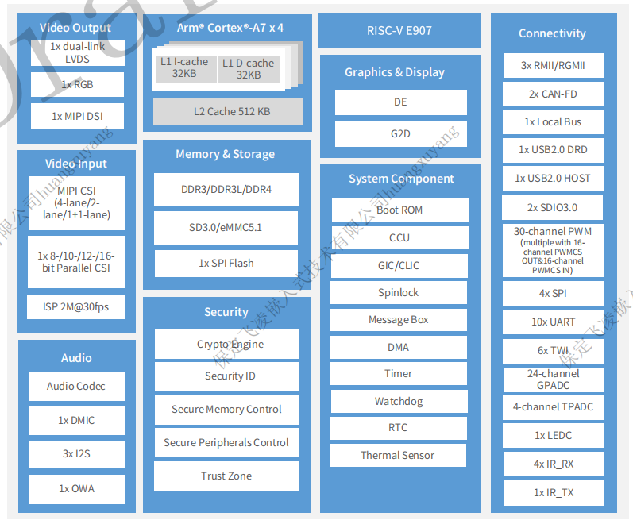

## 2\. FET153-S SoM Description

### 2.1 FET153-S Appearance Diagram

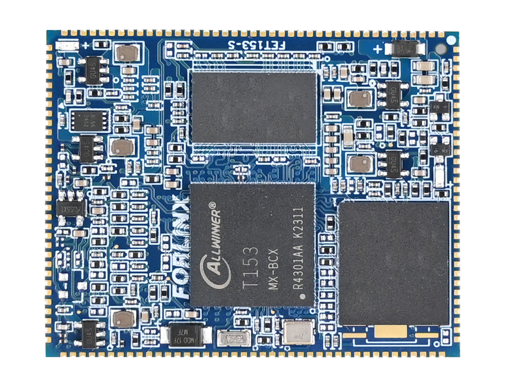

**Front (EMMC Version)**

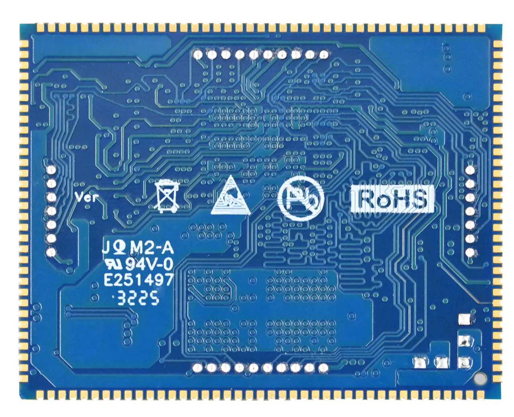

**Back (EMMC Version)**

### 2.2 FET153-S SoM Dimension Diagram

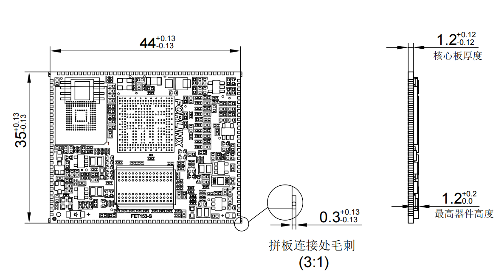

Dimensions: 44mm × 35mm, dimensional tolerance ±0.13mm. 

For more dimensional details, please refer to the DXF file.

Plate making process: 1.2mm thickness, 8-layer immersion gold PCB.

Stamp-hole+LGA package, with a total of 185 pins.

The centre-to-centre pitch of the pin headers is 1 mm; the centre-to-centre pitch of the LGA package pins is 1.27 mm.

(Refer to the appendix for connector dimension diagrams.)

### 2.3 Performance Parameter

#### 2.3.1 System Frequency

| **Name**| **Specification**| | | | **Description** |
|:----------:|:----------:|----------|----------|----------|:----------:-|
| | **Minimum**| **Typical**| **Maximum**| **Unit**||
| System Frequency| —| —| 1.6| GHz| — |
| System RTC| —| 32.768| —| KHz| — |

#### 2.3.2 Power Parameter

| **Parameter**| **Pin No.**| **Specification**| | | | **Description** |
|:----------:|:----------:|:----------:|----------|----------|----------|:----------:-|
| | | **Minimum**| **Typical**| **Maximum**| **Unit**||
| Main Power Supply Voltage| DCIN| 4.75| 5| 5.25| V| — |

#### 2.3.3 Working Environment

| **Parameter**| | **Specification**| | | | **Description** |
|:----------:|----------|:----------:|----------|----------|----------|:----------:-|
| | | **Minimum**| **Typical**| **Maximum**| **Unit**||
| Operating temperature| Working environment| -40| 25| +85| ℃| Industrial Level |
| | Storage Environment| -40| 25| +125| ℃||
| Humidity| Working environment| 10| —| 90| ％RH| No Condensation |
| | Storage Environment| 5| —| 95| ％RH||

#### 2.3.4 ESD Features

| **Parameter**| **Specification**| | | **Description** |
|:----------:|:----------:|----------|----------|:----------:-|
| | **Minimum**| **Maximum**| **Unit**||
| ESD HBM(ESDA/JEDEC JS-001-2017)| -2000| +2000| V| Applicable to all pins of the SoM |
| ESD CDM(ESDA/JEDEC JS-002-2018)| -250| +250| V| Applicable to all pins of the SoM |

**Note：**

- **The above data is from the chip manual;**

- **All signal led out from the SoM are electrostatic discharge (ESD) sensitive. When designing carrier board, adequate ESD protection measures must be implemented for the interfaces. Additionally, proper ESD precautions should be observed during the transportation, assembly, and usage of the SoM.**

### 2.4 SoM Interfaces

| **Function**| **Quantity** **Parameter**|
|:---:|:---:|:---:|
| Parallel CSI| ≤1| Up to 8/10/12/16 bit width, supporting BT.656 up to 2-ch720P@30fps and BT.1120 up to 2-ch 1080P@30fps,RAW up to 4-ch720P@30fps|
| MIPI CSI| ≤2| Supports 4-lane/2+2-lane, up to 1.0 Gbit/s per lane;|
| MIPI DSI(1)| ≤1| Supports 4-lane MIPI DSI, up to 1920x1200@60fps，1.0 Gbit/s per lane|
| RGB LCD(1)| ≤1| DE/SYNC mode, up to 1920x1080@60fps；RGB888,RGB666 and RGB565|
| LVDS(1)| ≤2| Up to 1920 x  1080@60fps for dual link; Up to 1366x768@60fps for single-link|
| SDIO| ≤2| SMHC0 for SD card; SMHC1 for SDIO interface, 3.3 V mode only|
| Audio| ≤1| Built-in audio codec supports 1 x differential LINEOUT output|
| I2S| ≤3| Supports master/slave mode, sampling rate 8kHz to 384kHz; I2S0/2 supports 4lane application; I2S1 supports 2lane application|
| DMIC| ≤1| Supports 8-channel with sampling rate from 8kHz to 48kHz|
| USB2.0 DRD| 1| Supports master and slave and High-Speed，480Mbps|
| USB2.0 HOST| 1| Only supports master mode, and High-Speed, 480Mbps|
| GMAC| ≤3| Support RMII/RGMII interface and rate 10/100/1000 Mbit/s|
| CAN-FD| ≤2| Supports CAN-FD（up to 64 data bytes), CAN 2.0A and CAN2.0B|
| Local Bus| ≤1| Supports 8/16/32 bit width, up to 150MHz@16bits，100MHz@32bits|
| SPI(2)| ≤3| Supports master/slave mode, master mode clock up to 100MHz; SPI2, SPI3 supports SPI mode; SPI1 supports SPI mode and DBI mode.|
| TWI(3)| ≤5| Compatible with I2C standard, standard mode 100 kbit/s, fast mode 400 kbit/s|
| UART(4)| ≤10| Compatible with industry standard 16450/16550.|
| GPADC| ≤24| 12-bit sampling resolution, up to 1MHz; GPADC2 has 4 channels multiplexed as TPADC|
| TPADC| ≤1| 4-wire resistive touch, 12 bit SAR type AD conversion|
| PWM\&PWMCS| ≤30| PWM output frequency 0 ~ 24 MHz or 0 ~ 100MHz; PWMCS output frequency 0 ~ 4MHz, supporting maximum and minimum frequency limit.|
| LEDC| ≤1| Control LED light, programmable output high and low width, data up to 800kbit/s|
| IR TX| ≤1| Infrared output|
| IR RX| ≤4| Infrared receiving|
| GPIO| ≤124|

**Note:** 

- **The parameters in the table are the theoretical values of hardware design or CPU;**

- **RGB, LVDS, MIPI-DSI have a pin multiplexing relationship, please read the chip data sheet or pin multiplexing table;**

- **SPI0 is occupied by the SoM and cannot be used on the carrier board;**

- **S-TWI0 is occupied by the SoM and cannot be used on the carrier board;**

- **UART0 is designated as the debugging serial port, and it is recommended to be retained in the design.**

### 2.5 FET153-S SoM Pin Definitions

#### 2.5.1 FET153-S SoM Pin Schematic

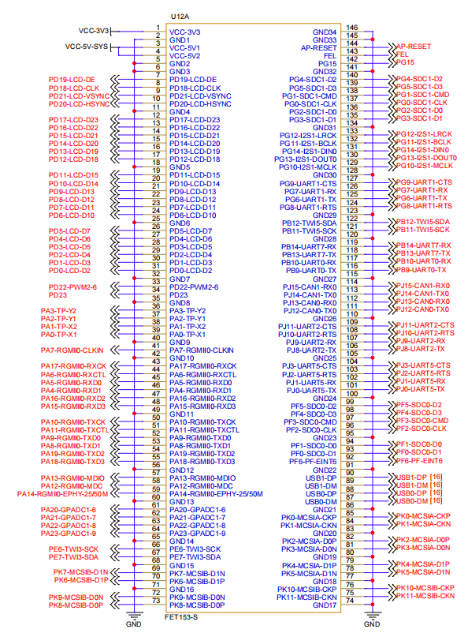

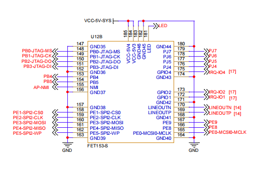

#### 2.5.2 FET153-S SoM Pin Function Description

For various functional expansion requirements, please refer to the user document "FET153-S Pin Multiplexing Table". However, for more detailed information, it is recommended to check the relevant documentation, the chip datasheet, and the reference manual.

### 2.6 SoM Hardware Design Description

**Power Pin**

| **Function** | **Signal Name** |   **I/O**    | **Default Function**                                         | **Pin Number** |
| :----------: | :-------------: | :----------: | ------------------------------------------------------------ | :------------: |
|    Power     |   VCC-5V-SYS    | Power Input  | Power Supply for SoM: Voltage: 5V Current: The carrier board must provide a minimum continuous current of 2A. |  3,4,184,185   |
|              |     VCC-3V3     | Power Output | It is only used to control the power-on sequence of  the carrier board and to power on the SD card, with a maximum output current capability of 500mA. |       1        |
|              |       GND       |    Ground    | Power ground and signal ground on the SoM. All GND pins must be connected. |                |

**System Control Pin**

| **Function**| **Signal Name**| **I/O**| **Default Function**| **Pin Number**|
|:----------:|:----------:|:----------:|----------|:----------:|
| CPU reset| AP-RESET| I| System reset signal input for the SoM, active low. Do not add any resistors or capacitors to this pin, as doing so may prevent the SoM from starting up properly. | 144|
| Flashing| FEL| I| Enter USB OTG forced download mode, active-low.| 143|
| CPU Interrupt| AP-NMI| I| Interrupt input. Not used by the carrier board by default.| 155|
| BOOT option| BOOT-SEL\[0:1]| I| Defaut \[1:1], integrated on SoM, boot sequence: SDC0->SPI2\_NOR(4-wire)->SPI2\_NOR(1-wire)->SPI2\_NAND- >EMMC2\_USR->EMMC2\_BOOT->SPI0 NAND->USB; | \-|

**Note: The BOOT SEL pin is pulled up by default within the chip; when left floating, it is at a high level. The FET153-S SoM integrates the power supply, CPU and memory circuits onto a single compact module. The required external circuit is very simple; a minimal system requires only a 5V power supply, a reset button and a programming button to operate, as shown in the figure below:**

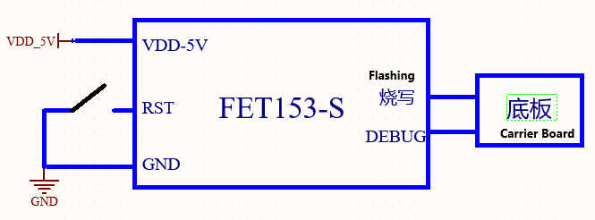

Refer to “Appendix IV. Minimum System Diagram” However, in general, it is recommended to connect some external devices, such as a debug serial port, in addition to the minimum system. Otherwise, the you cannot determine whether the system has started. After completing these steps, you can then add the required functions based on the SoM's default interface definition provided by Forlinx.

For the design of the SoM's peripheral circuits, please refer to Section 3.5, "OK153-S Carrier Board Description".

## 3\. OK153-S Embedded Development Description

### 3.1 OK153-S Development Board Interface Diagram

Connection method: Stamp hole + LGA. The main interfaces are shown in the figure below:

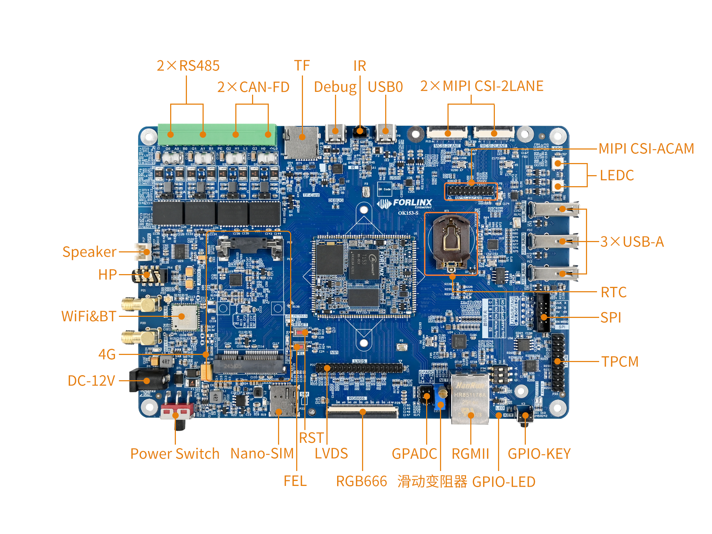

### 3.2 OK153-S Development Board Dimension Diagram

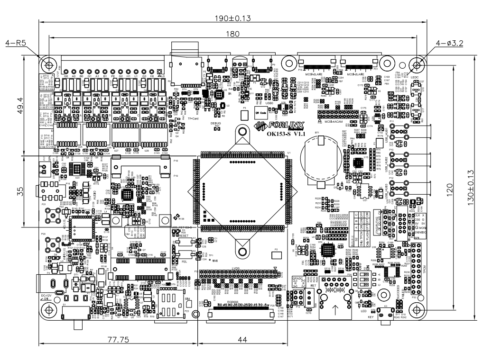

PCB: 130mm×190mm

Mounting hole dimensions: Pitch: 120mm × 180mm, hole diameter: 3.2mm.

Plate making process: 1.6mm thickness, 4-layer PCB.

Power Voltage: DC 12V

The OK153-S carrier board is equipped with two mounting holes for heat sinks (3.2 mm in diameter). You may choose to install a heat sink according to the on-site environment. Please add a insulating thermal pad between the contact surface of the heat sink and the SoM. Recommended heat sink: 38mm × 38mm × 10mm. See below for details.

### 3.3 Naming Rules

ABC-D+IK:M

| **Field**| **Field Description**| **Value**| **Description**|
|:----------:|:----------:|:----------:|:----------:|
| A| Grade| PC| Prototype Sample|
| | | Blank| Mass Production|
| B| Product Line Identification| OK| Forlinx Embedded development board|
| C| CPU Name| 153| T153|
| \-| Segment Identification| \-|
| D| Connection| S| Edge Connector|
| \+| Segment Identification| \+| The configuration parameter section follows this identifier.|
| I| Operating Temperature| C| 0 to 70℃   Commercial-grade|
| | | I| -40 to 85℃ Industrial-grade|
| K| PCB Version| 11| V1.1|
| | | xx| Vx.x|
| :M| Internal Identification of the Manufacturer| :X| This is the internal identification of the manufacturer and has no impact on the use.|

### 3.4 Carrier Board Interfaces

| **Function**| **Quantity**| **Parameter**|
|:----------:|:----------:|----------|
| LCD(1)| 1| RGB666 (18-bit) – The SoM can support up to RGB888 (24-bit) and a maximum resolution of 1080p@60fps.|
| LVDS (1)| 1| Dual Octal, up to 1080p@60fps|
| MIPI-DSI(1)| 1| LVDS to MIPI, supports 4lane, up to 1080p @ 60fps;|
| Ethernet| 1| 10/100/1000Mbps adaptive, RJ-45 interface|
| TYPE-C  （DEBUG）| 1| Convert the debug UART to USB export, debug CPUX and RISC-V respectively|
| TYPE-C（USB0）| 1| Native USB0 interface, supporting OTG function|
| USB Host  | 3| Extended by hub, USB 2.0 (supports up to 480 Mbps)|
| TF| 1| Supports SD 3.0 protocol, with support for high/low-speed card switching.|
| MIPI CSI| 2| 2 x 2Lane- MCSI, supporting 720P|
| WiFi\&BlueTooth（2）| 1| Onboard 6221A-SRC, 2.4G/5G dual-band Wi-Fi, BT5.0, and audio capabilities.   The Wi-Fi function occupies 1 x SDIO interface, the BT function occupies 1 x UART, and 1 x I2S is reserved for audio. |
| PWM| 1| Connected for LCD backlight adjustment.|
| GPADC| 4| 1.8V, slide resistor on carrier board for easy testing.|
| RTC| 1| On-board CR2032 battery, keep going when power is off|
| Audio（2）| 2| 1 x 4-pole headphone jack with built-in HP (headphone) and MIC (microphone);  one mono SPEAKER interface. |
| KEY| 3| It includes reset, programming and GPIO buttons.|
| CAN-FD| 2| CAN-FD with protection circuit|
| 485| 2| It is equipped with automatic transmission and receiving control and protection circuit.|
| IR\_RX| 1| IR\_RX, sample rate 1MHz, 64\*8bits cache|
| 4G| 1| Expanded via a USB 2.0 hub; |
| LED| 2| GPIO controls LED|
| LEDC| 1| Used to control external smart LED lights|
| SPI| 1| Multiplexed with RJTAG and JTAG signal|
| RJTAG| 1| Led out via 2.54mm, and multiplexed with SPI3 and JTAG signals|
| JTAG| 1| Led out via 2.54mm, and multiplexed with SPI3 and RJTAG signals|

**Note:** 

- **The parameters in the table are the theoretical values of hardware design or CPU;**

- **LCD, MIPI-DSI and LVDS have interface multiplexing, and only one of the three can be used at a time;**

- **These two functions use the same I2S; currently, this I2S is used by AUDIO.**

### 3.5 OK153-S Carrier Board Description

**Note: **

- **The component UID with "\_DNP" mark in the diagram below represents it is not soldered by default;**

- **The schematic diagrams in this manual are only for interface descriptions. Please refer to the source file materials for hardware design.**

#### 3.5.1 Carrier Board Power

As shown in the figure, the 12V adapter supplies power to the development board through the power connector P4. Among them, VDD-5V powers the SoM. After the SoM is powered on, it outputs VDD33 to enable U5 and U9 on the carrier board.

VDD33 ensures that the SoM powers on first, followed by the carrier board, to prevent latch-up effects that could damage the CPU.

**Note: For custom designs, follow this power sequence: SoM VDD33 enables carrier board DC-DC, ensuring SoM powers on before carrier board.**

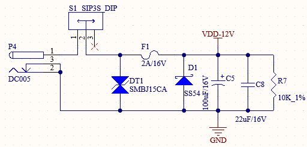

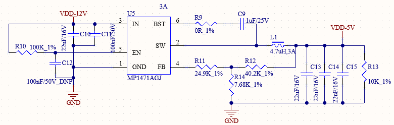

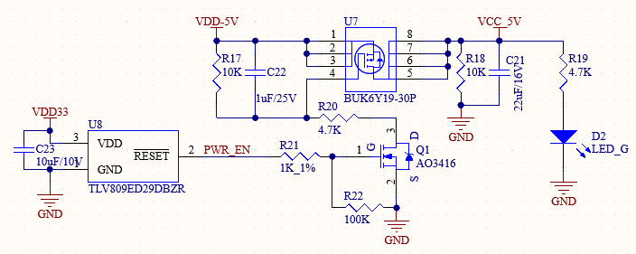

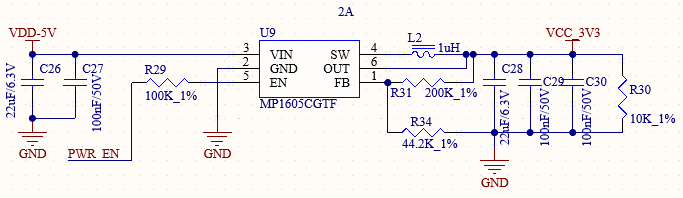

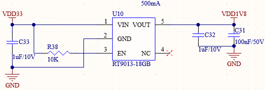

#### 3.5.2 BOOT

The boot sequence is configured by default to SDC0->SPI2\_NOR(4-wire)->SPI2\_NOR(1-wire)->SPI2\_NAND->EMMC2\_USR->EMMC2\_BOOT-> SPI0 NAND->USB. The BOOT related resistors are integrated in the SoM.

**Note: The BOOT SEL in the SOM is pulled up by default inside the CPU, and it is high level when the pin is floating.**

#### 3.5.3 Function Buttons

AP-RESET: System reset button. Press to reset and restart. FEL: Press to enter forced upgrade mode for system flashing via USB. The NMI is a CPU interrupt and is not used yet. LED \_ FET153-S is the heartbeat light of the SoM, which is led out from the carrier board for easy observation.

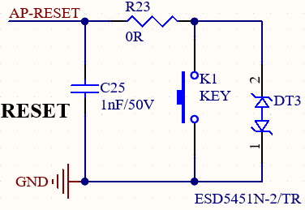

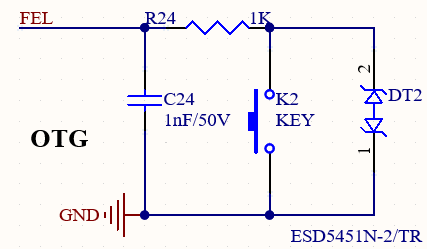

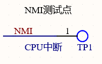

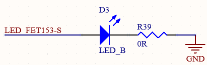

#### 3.5.4 Debugging Serial Port

The UART0 on the SoM is the serial port for debugging CPUX; UART8 is the serial port for debugging RISC-V.

For user convenience, UART0, and UART8 debug ports are integrated into a USB Type-C interface via CH342 USB-to-serial chip.

To use debug serial ports:

Install the related driver on PC.

Connect P5 to PC USB port using a USB to Type-C cable.

Open a terminal tool (e.g., Putty) with settings: 115200 baud, 8 data bits, no parity, 1 stop bit.

Select the correct COM port and power on the board. Debug messages will appear.

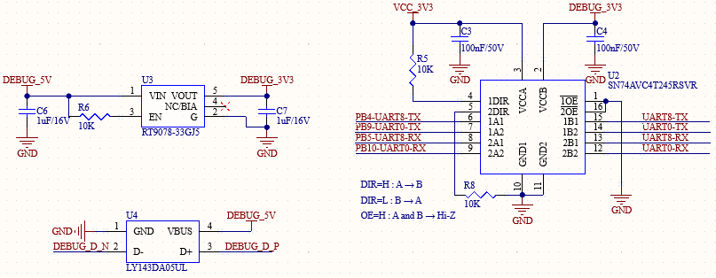

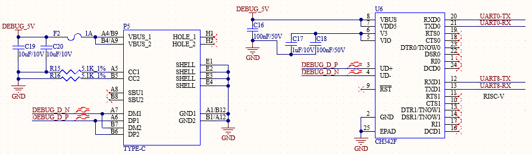

**Note:**

- **For future debugging convenience, route out these debug ports on custom carrier boards;**

- **The debugging serial port on the carrier board has an anti-leakage design. This is to prevent operational anomalies caused by factors such as level mismatch of the serial cable or leakage current. Please refer to this design in your own implementations;**

- **It is not recommended to use the UART0 debug serial port as a standard serial port or for any other purposes.**

#### 3.5.5 JTAG \& RJTAG Interface

The development board features 2.54 mm pins for JTAG and RJTAG, which are currently left unpopulated; these can be used to simulate two different cores via an emulator. In addition, JTAG, RJTAG, and SPI3 signals are multiplexed.

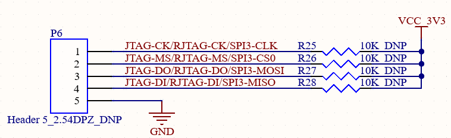

#### 3.5.6 TF Card

The TF card interface on the development board is connected to the CPU’s SDC0 channel. Power for the TF card is supplied by the VDD33 output from the SoM. In addition, the device supports high and low speed card switching.

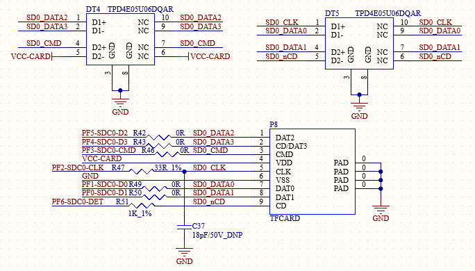

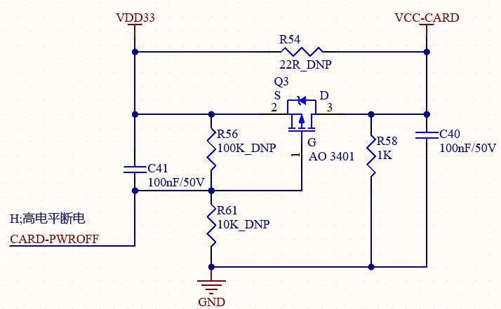

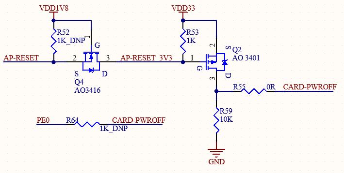

**Note: **

- **To support both high- and low-speed cards, the 3.3V power supply for the TF card should be controlled during power-on and power-off;**

+ **Ensure that TF card power can be controlled via hard and soft reset;**
+ **Make sure that, when the CPU loses power, the TF card also loses power instantly;**
+ **Currently, the PCB design supports two methods for controlling the TF card power supply: via the RESET signal or via PE0. At present, R64 is not populated while R55 is installed.**

#### 3.5.7 RTC

An RTC device is connected to the carrier board via the TWI3 bus. The circuit uses D7 to enable compatible power supply from either VCC\_3V3 or a button cell battery. This ensures the RTC chip remains powered by the battery after the carrier board power is off. The RX8010SJ chip is used in the default design. Button battery: CR2032.

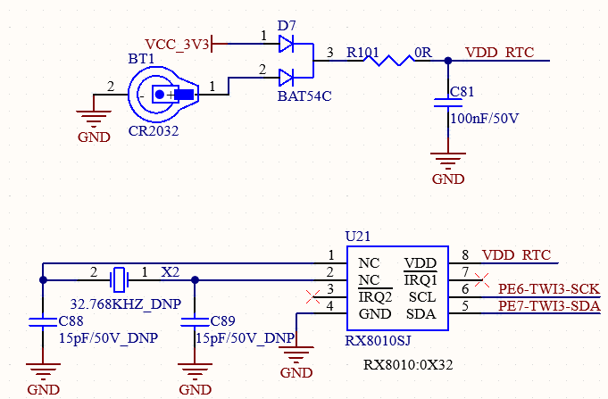

#### 3.5.8 GPADC\*

The GPADC interface is led out via three 2.54 mm pitch 2\*3P headers, accompanied by slide potentiometers for direct connection via DuPont wires. 

There are 4 x GPADC, with a maximum sampling voltage of 1.8 V.

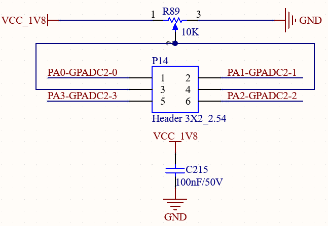

**Note:** 

**If the ADC obtains the corresponding value through two voltage divider resistors, different sampling rates impose different requirements on the total resistance value (R1 + R2), as detailed below:**

**\- When the sampling rate is 50 kHz (default): R1 + R2 must be less than 320 kΩ.**

**\- When the sampling rate is 10 kHz: R1 + R2 must be less than 160 kΩ.**

**\- When the sampling rate is 100 kHz: R1 + R2 must be less than 155 kΩ.**

**\- When the sampling rate is 1000 kHz (1 MHz): R1 + R2 must be less than 3.9 kΩ.**

**GPADC and resistance touch signal are multiplexed \* This function is not supported temporarily**

#### 3.5.9 IR Interface

The IR interface is connected to an HS0038B infrared receiver. Please send infrared signals to this receiver using a remote control. The received IR information will be displayed in the debugging serial port.

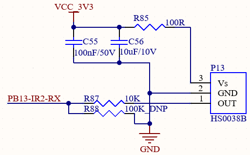

#### 3.5.10 Type-C Interface

The Type-C interface on the carrier board is connected to the USB0 interface on the SoM. It supports OTG functionality, enabling connection to a computer for USB programming as well as connection to a USB flash drive for storage.

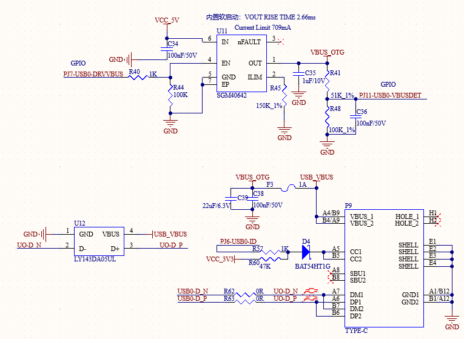

#### 3.5.11 USB2.0-A

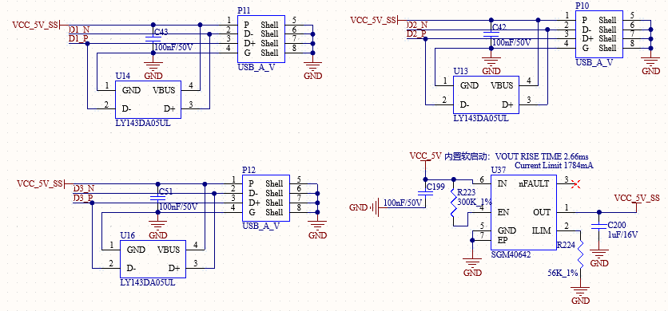

The OK153-S development board features an onboard USB 2.0 hub with four USB host ports. It is also equipped with three USB 2.0 Type-A standard ports and one mini-PCIe port. The mini-PCIe port can be used to connect an EC20 4G module, enabling 4G internet connectivity. The remaining ports can be used to connect other standard USB devices.

**Note: All USB 2.0-A ports are equipped with load switches; the current limit can be adjusted via a resistor.**

#### 3.5.12 WiFi\&BT

The OK153-S development board features an integrated Wi-Fi and Bluetooth module, model number 6221A-SRC. The Wi-Fi module is connected via an SDIO interface and supports dual-band 2.4GHz and 5GHz; the Bluetooth module is connected UART and PCM interfaces and complies with the Bluetooth 4.2 specification.

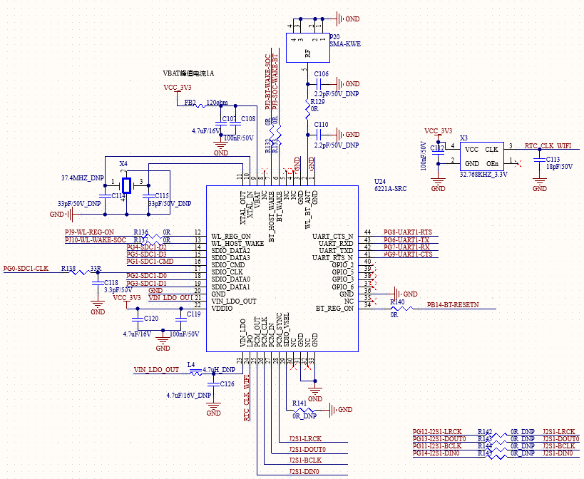

**Note: The I2S signal used by this module is identical to that utilized by the AUDIO function; currently, the corresponding signal pin remains unpopulated.**

#### 3.5.13 4G

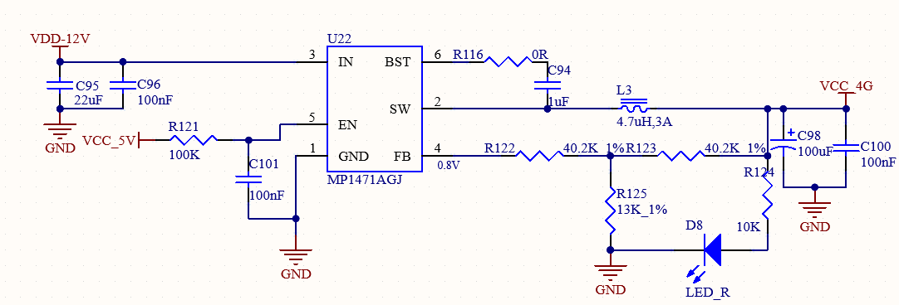

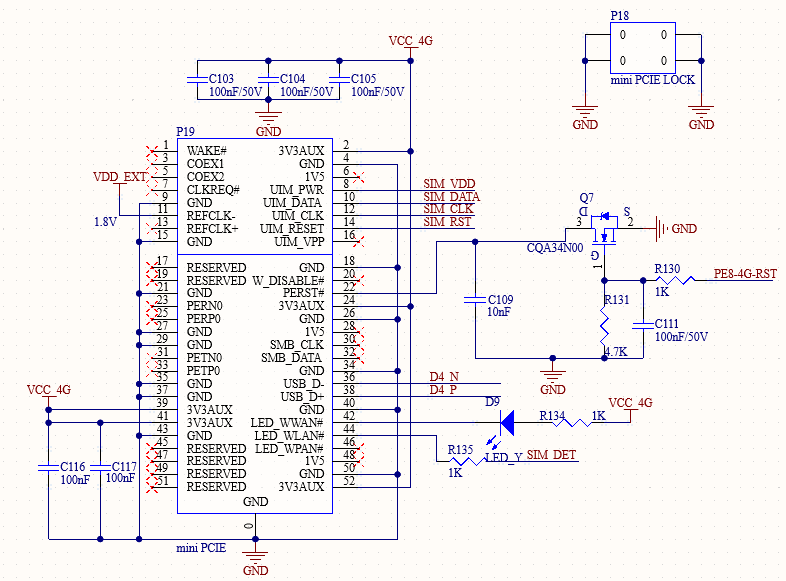

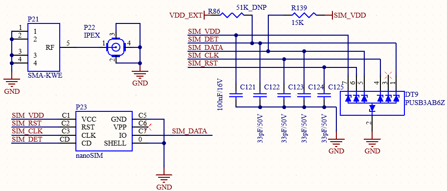

The development board features an onboard mini-PCIE interface designed for connecting a 4G module (e.g., EC20). This interface has independently controllable power and an onboard SIM card slot. 

**Note:** 

- **Ensure the 4G module is installed and secured with the latch before powering on the development board;**

- **The SIM card slot is for Nano-SIM cards. Insert the card with the chip contacts facing down and the notch facing inward.**

#### 3.5.14 RGMII

It supports 1 x native 10/100/1000 Mbps auto‑negotiation Ethernet port, implemented via the SoM RGMII interface and the YT8521SH PHY chip, and led out through a standard RJ45 connector with integrated magnetics, enabling LAN and WAN connectivity with network devices.

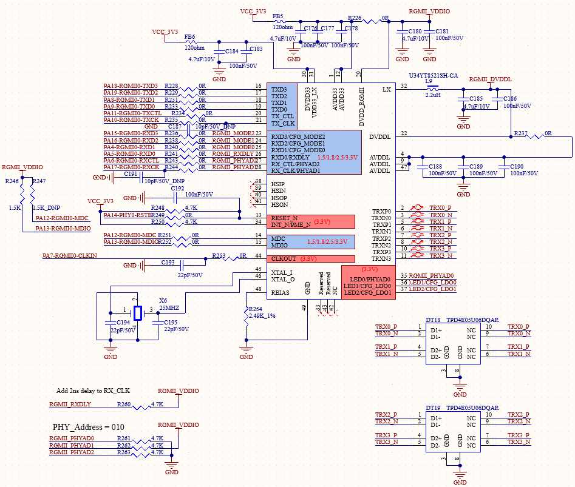

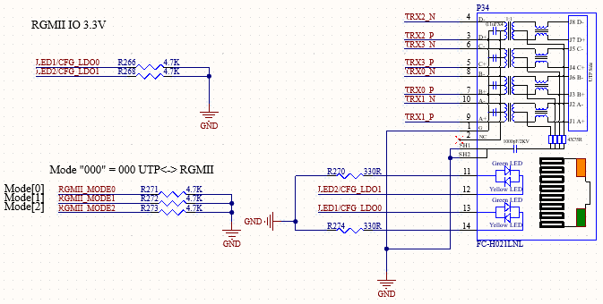

#### 3.5.15 AUDIO

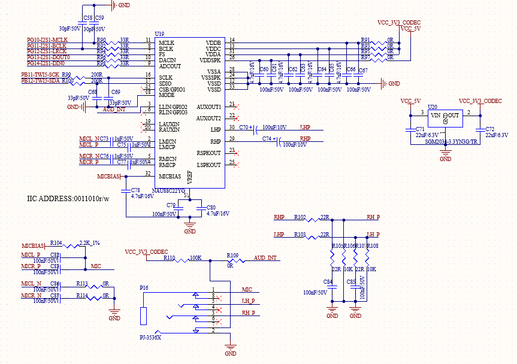

The development board features an NAU88C22YG chip and utilises a standard 3.5mm headphone jack to support stereo headphone and microphone inputs.

**Note: The I2S signal used by this module is identical to that utilized by the AUDIO function; currently, the corresponding signal pin remains unpopulated.**

#### 3.5.16 LINEOUT Interface

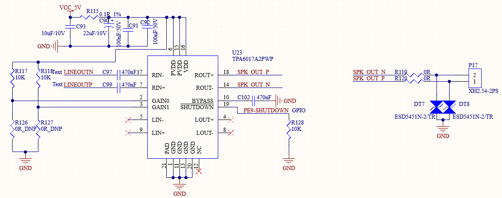

The development board utilizes the native differential LINEOUT signals. An external speaker interface is provided via the TPA6017A2PWP audio amplifier chip, designed to drive a 3Ω/2W speaker.

#### 3.5.17 CAN-FD

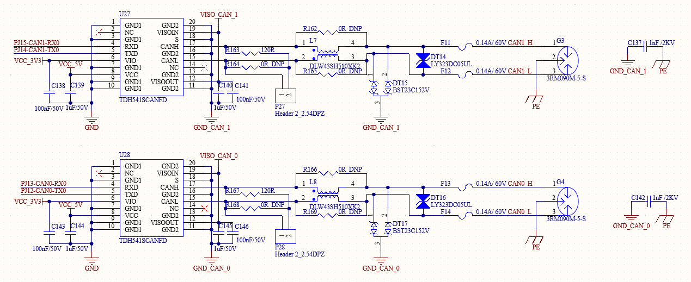

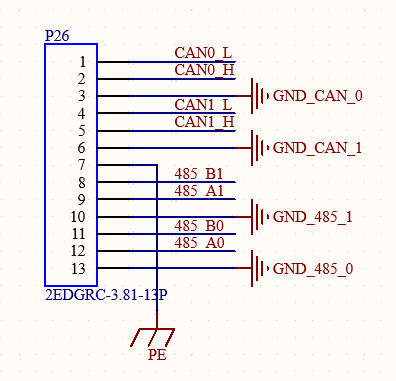

2 x CAN interfaces are led out from the development board via native CAN-FD with TDH541SCANFD; these interfaces feature an isolation protection design, capable of meeting protection requirements in most scenarios.

#### 3.5.18 485

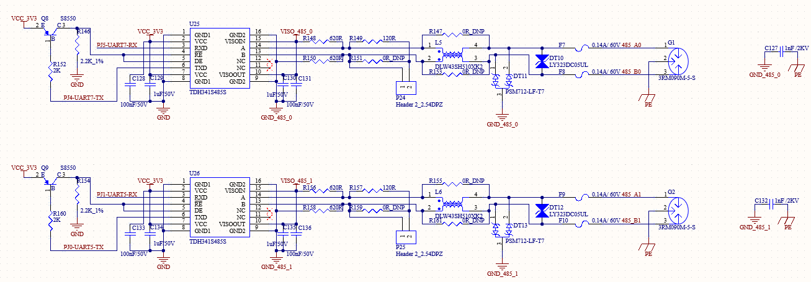

2 x standard 485 are led out via native UART with TDH341S485S from the development board; these interfaces support automatic sending and receiving control and feature an isolation protection design, meeting the protection requirements for most scenarios.

#### 3.5.19 LEDC

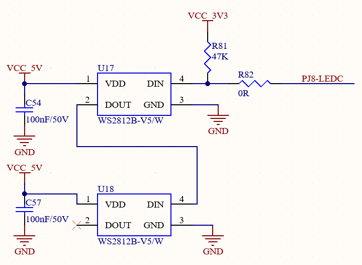

The development board integrates two intelligent external-control LEDs. These can be simultaneously controlled via dedicated LEDC pins to drive cascaded WS2812B LEDs, enabling various lighting effects.

#### 3.5.20 LED

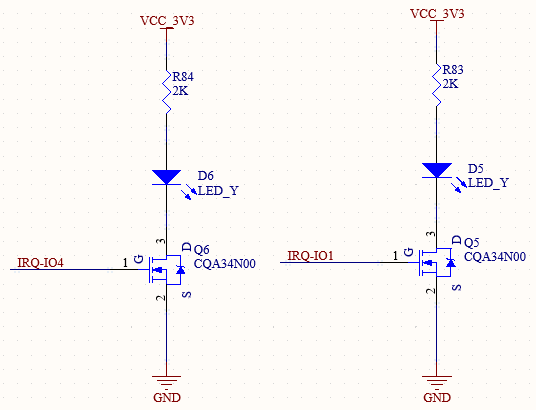

Two GPIO\_LED signals are reserved on the development board: 1.8V-level open-drain pins that are pulled up on the SoM.

#### 3.5.21 KEY

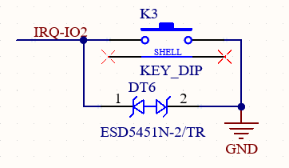

There is a user-configurable key on the development board. Different functions can be realized by controlling this GPIO pin. It is a 1.8 V level signal and is an open-drain pin, pulled up on the SoM.

#### 3.5.22 LVDS Interface

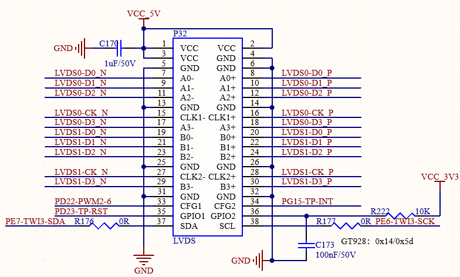

LVDS signals are routed to a 2.0mm pitch, 2\*19P-pin header. This signal group is multiplexed with the MIPI and LCD signals. This interface is compatible with Forlinx standard 10.1-inch LVDS display. Furthermore, Forlinx standard 7-inch MIPI display can be connected using an LVDS-to-MIPI adapter board.

#### 3.5.23 LCD-RGB666 Interface

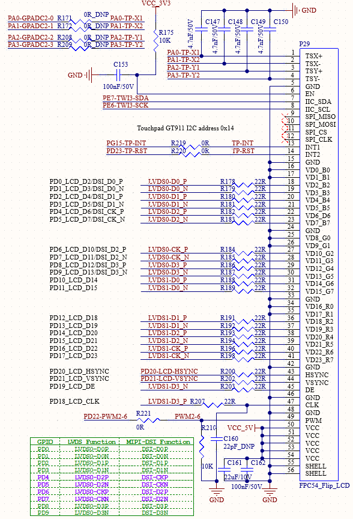

The LCD signals are led out from the development board via a 0.5mm pitch, 54P FPC connector. This signal group is multiplexed with the LVDS signals. Resistive touch signals are directly connected to the SoC. This interface can be used to connect Forlinx standard 7 LCD display (supporting resistive or capacitive touch). The resistive touch pins (TP-X1/X2; TP-Y1/Y2) are multiplexed with GPADC. Resistive touch is not supported by default; the series resistors for these pins are left unpopulated.

#### 3.5.24 2X2-Lane-MCSI \& MCSI\_ACAM

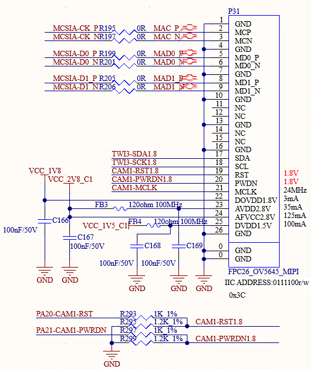

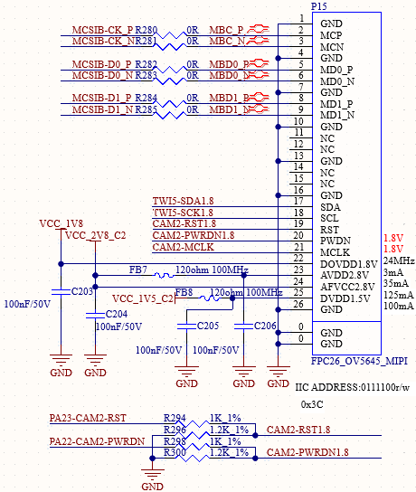

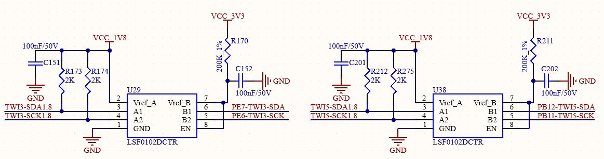

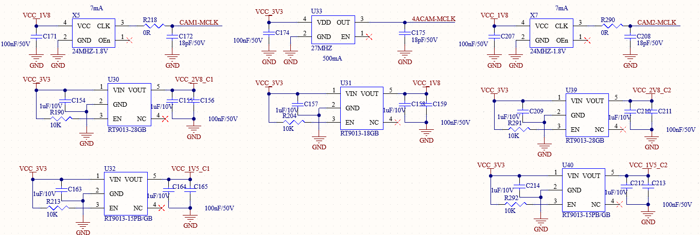

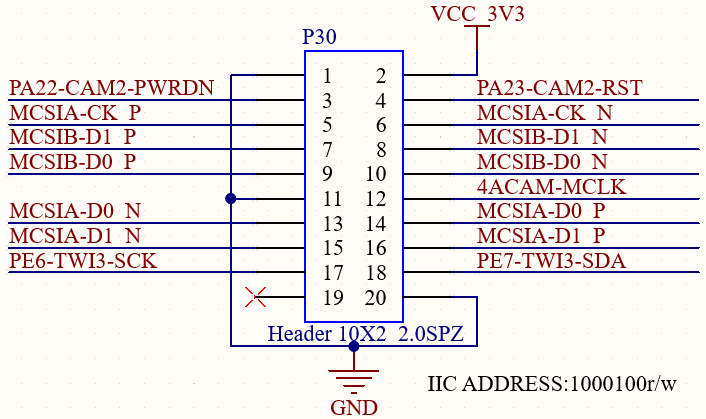

The board supports two 2lane MIPI cameras (e.g., OV5645). Additionally, relevant 4-lane MIPI and control signals are available on a 2.0mm pitch, 2\*10P-pin header, supporting the use of an MIPI-to-Analog camera adapter board. However, since the CPU internally has only two Video Input Processing Pipelines (VIPPs), it can support a maximum of two analog cameras.

#### 3.5.25 SPI

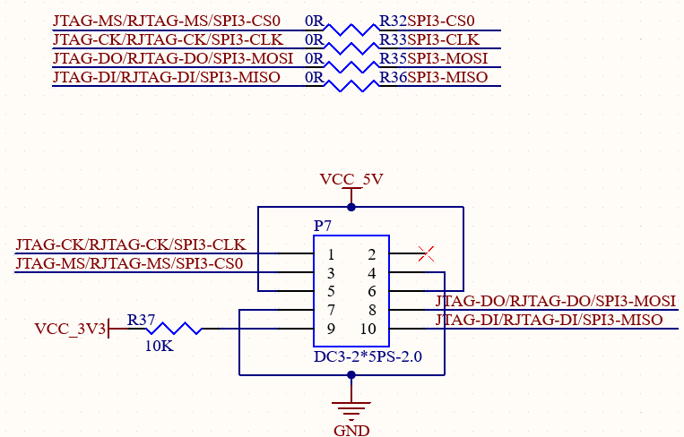

SPI signals are accessible via a 2.0mm pitch, 2\*5P pin box header. These SPI signals are multiplexed with RJTAG and JTAG signals.

#### 3.5.26 TPCM\*

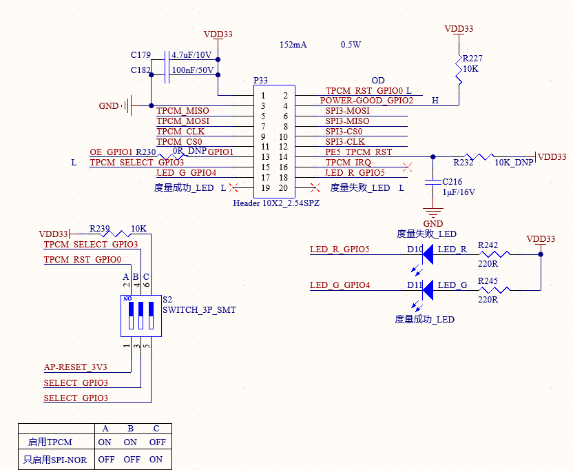

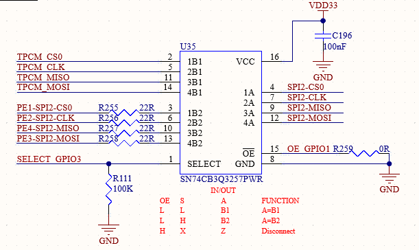

TPCM refers to the SPI Trusted Platform Module (GS-1002-D100). Its enabling and the boot source selection (TPCM vs. SPI-NOR only) are currently controlled solely by the S2 DIP switch. If TPCM is enabled, the SPI-NOR flash will also be activated. 

Boot Measurement Process:

+ After powering up the system, a high level on GPIO2 indicates that the main board is ready;
+ TPCM’s GPIO0 is connected to the CPU’s RST pin to control CPU reset;
+ TPCM’s GPIO1 and GPIO3 are connected to analog switch control signals. They switch the connection between TCM’s SPI1/CPU’s SPI and the BIOS;
+ TPCM’s GPIO5 and GPIO4 can drive the board’s red/green status LEDs to indicate measurement success or failure;
+ TPCM’s SPI1 (Master) connects to the BIOS via the analog switch to read BIOS data;
+ TPCM’s SPI0 (Slave) connects to the CPU’s SPI bus to implement trusted computing functions. **It is currently not supported.**

#### 3.5.27 SPI-NOR\*

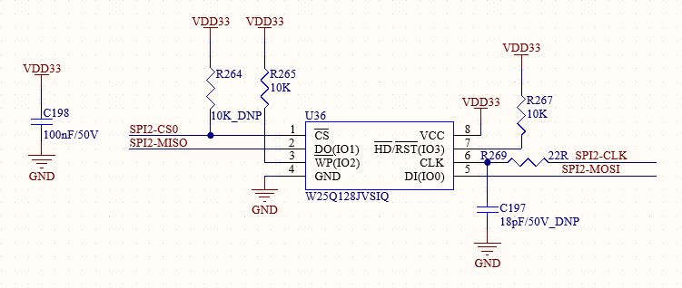

If TPCM is not used, the development board can be configured via DIP switches to connect the SPI-NOR flash directly to the CPU and set it as a boot option.

**\* It is currently not supported.**

## 4\. Connector Specification Diagram

For more detailed dimensions, please refer to the DXF files in the user documentation.

The following image shows the footprint diagram for the stamp hole connectors on the carrier board. For special design requirements regarding the stencil layer, please see the SoM Soldering Guide in the user documentation.

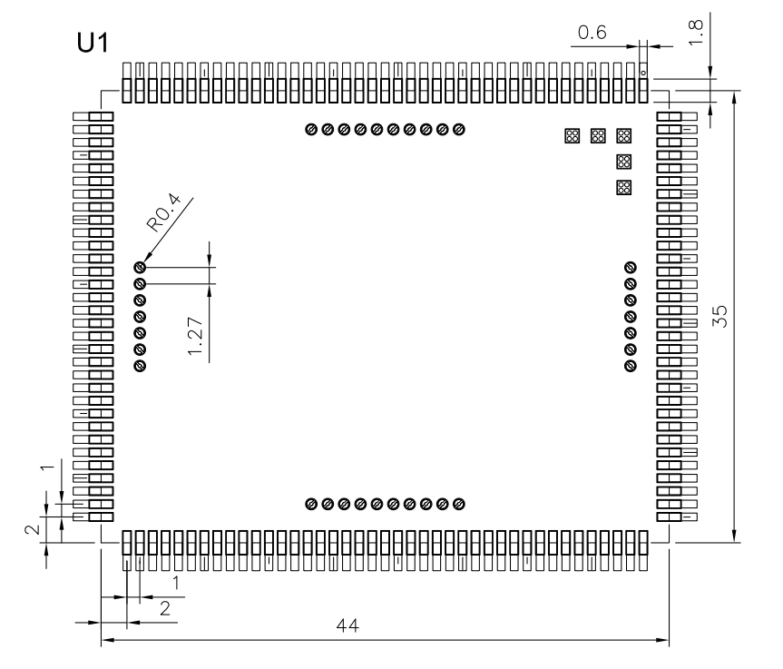

## 5\. OK153-S Development Board Linux Consumption Table

| **No.**| **Item**| **SoM Power (W)**| Development Board **Power** (including SoM)|
|:----------:|----------|:----------:|:----------:|
| 1| No external connection + no operation| 0.533W| 1.2383W|
| 2| 10.1-inch LVD screen + no operation| 0.545W| 4.891W|
| 3| 4G + no operation| 0.543W| 1.540W|
| 4| 7-inch MIPI screen + no operation| 0.544W| 3.378W|
| 5| CPU pressure + Memory + eMMC read and write stress test| 1.121W| 1.829W|

**Note：**

**1. TTest conditions: **

**\- SoM Configuration: DDR (256 MB) + NAND (256 MB)  **

**\- 4G Module: Quectel EC20 ** 

**\- Display: Forlinx standard product (optional)  **

**\- Power Supply: SoM – 5 V, Development Board – 12 V**

**2. Power consumption is for reference only.**

---

## 6\. Minimum System Diagram

**It has SoM, BOOT, power, debug serial port, system image flashing port.**

**SoM:**

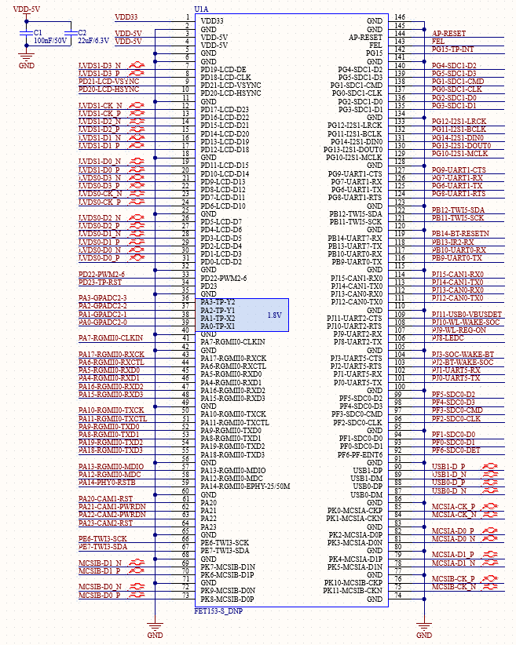

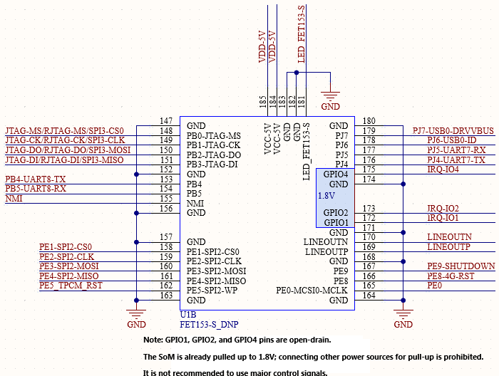

**BOOT:**

The SoM has been configured with the default settings,BOOT-SEL\[0;1]=\[1;1]，BOOT sequence SDC0->SPI2\_NOR(4-wire)->SPI2\_NOR(1-wire)->SPI2\_NAND->EMMC2\_USR->EMMC2\_BOOT-> SPI0 NAND->USB

**DEBUG:**

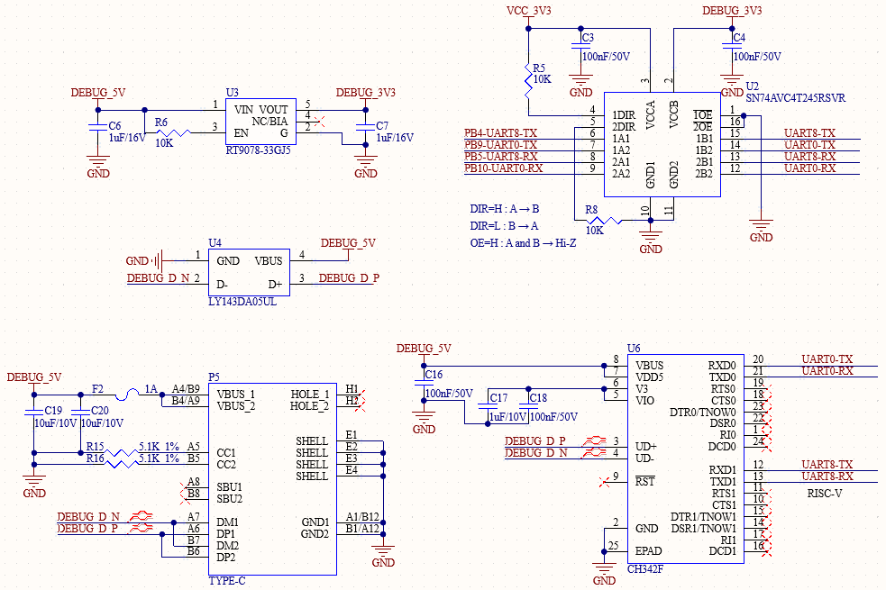

**POWER:**

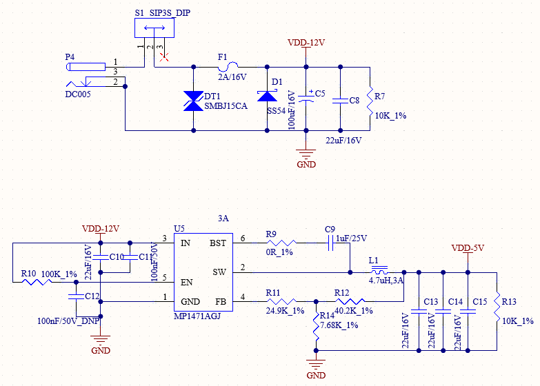

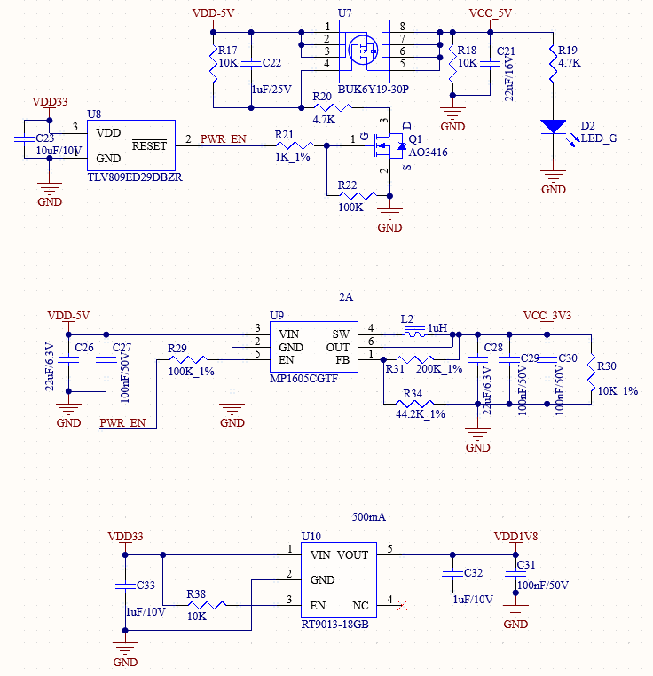

**USB0:**

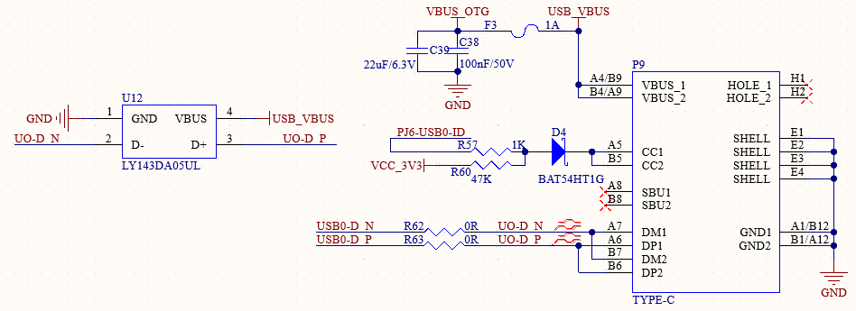

**RST\&FEL:**

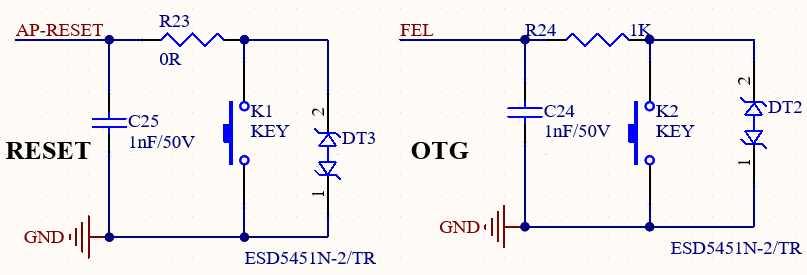

## 7\. Hardware Design Guide

### 7.1 Boot Configuration

BOOT SEL is pulled up by default inside the CPU, and it is at high level when pin is floating. BOOT-SEL configuration is integrated on the SoM. After the system is powered on or reset, different programming and startup modes can be selected by reading the voltage of the system startup configuration pin. BOOT-SEL\[0:1]=\[1:1]

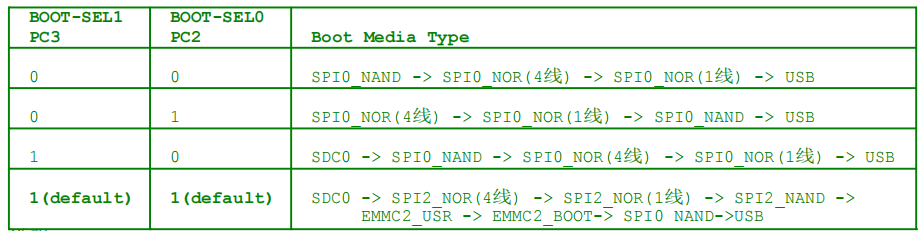

### 7.2 GPADC and PA Notes

GPADC supports a detection voltage range of 0–1.8 V.

When PA4PA23 is used as GPIO, it supports 3.3 V IO level;                                                                         

When PA0PA3 is used as GPIO, it only supports 1.8 V IO level and does not support 3.3 V.

PA4 ~ PA23, it is not recommended to use some of them as GPADC, and some of them are multiplexed into high-speed signals. Only multiplexing into general GPIO is supported.

### 7.3 TF-CARD Design Guide

The SDC-CLK pin does not require a pull-up resistor. However, space for a series resistor and a filter capacitor should be reserved on the SoC side.

GPIO pins PF3 and PF6 have internal pull-up resistors (~15K, must be enabled in software) within the SoC. When designing the external circuits for SDC0-CMD and SDC0-DET, external pull-up resistors can be omitted.

It is recommended to reserve the series resistor on the SDC-DET signal line to prevent signal undershoot when inserting an SD CARD, which can affect signal quality.

### 7.4 LANEOUT Circuit Design Guide

When using an audio power amplifier chip, it is recommended to add a pull-down resistor to its enable pin to avoid (the occurrence of) “POP” noise.

### 7.5 Local Bus Design Guide

Command lines (e.g., BURST, WR, RD signals) and address/data lines (LD\[31:0]) should be length-matched with reference to the clock signal.

For a 150 MHz design, length variation is recommended to be controlled within 300 mil, and must not exceed 500 mil.

Adhere to the 3W/2W rule. The number of vias on signal lines should be as consistent as possible.

Ensure the reference plane is complete/unbroken.

### 7.6 Impedance Requirements for Selected Signals

+ USB 2.0 Differential: 90 Ω
+ MIPI-CSI Differential: 100 Ω
+ MIPI-DSI Differential: 100 Ω
+ LVDS Differential: 100 Ω
+ Antenna Feedline: Controlled at 50 Ω. Provide ample ground vias for shielding on both sides. The adjacent layer to the feedline should be cleared/routed away. The third layer must be a solid reference ground plane, referenced with one layer in between.
+ SDIO trace impedance 50 ohm.

### 7.7 Length Matching Suggestions for Selected Signals

| **Name**| **Length Matching Requirement**| **Spacing**| **Max Via Count**|
|:----------:|:----------:|:----------:|:----------:|
| USB2.0| Intra-pair \< 50 mil, Total Length ≤ 6000 mil| Others≥10mil| ≤2|
| MIPI-CSI| Intra-pair \< 5 mil, Inter-pair ≤ 300 mil| ≥15mil| ≤2|
| SDIO| D0~D3, CMD matched to CLK within ≤ 300 mil| ≥9mil| D0~D3 via count should be as consistent as possible|

