# Linux5.10.198_User's Manual\_V1.1

Document classification: □ Top secret □ Secret □ Internal information ■ Open                                                                                                              

## Copyright 

The copyright of this manual belongs to Baoding Folinx Embedded Technology Co., Ltd. Without the written permission of our company, no organizations or individuals have the right to copy, distribute, or reproduce any part of this manual in any form, and violators will be held legally responsible.   
Forlinx adheres to copyrights of all graphics and texts used in all publications in original or license-free forms.  
The drivers and utilities used for the components are subject to the copyrights of the respective manufacturers. The license conditions of the respective manufacturer are to be adhered to. Related license expenses for the operating system and applications should be calculated/declared separately by the related party or its representatives.  

## Revision History

| **Date**| **Version**| **SoM Version**| **Carrier Board Version**| **Revision History**|
|:----------:|:----------:|:----------:|:----------:|----------|
| 03/03/2025 | V1.0| V1.0| V1.1 and above| Linux5.10 User’s Manual Initial Version|
| <font style="color:rgb(51, 51, 51);">28/07/2025</font>| <font style="color:rgb(51, 51, 51);">V1.1</font>| <font style="color:rgb(51, 51, 51);">V1.0</font>| <font style="color:rgb(51, 51, 51);">V1.1 and above</font>| 1\. Adding codec testing;                                                        2\. Adding sleep/wake methods;                                                 3\. Adding USB camera testing. |

## Application Scope

This software manual is applicable to the OK536 platform with Linux5.10 operating system from Forlinx.

## Overview

This manual is designed to help you quickly familiarize yourselves with the product, understand interface functions, and learn testing methods. It primarily covers the testing of development board interface functions, methods for flashing the image, and troubleshooting common issues encountered during use. During testing, certain commands have been annotated for better understanding, focusing on practicality and adequacy. For kernel compilation, related application compilation methods, and development environment setup, please refer to the “OK536-C\_Linux5.10.198+Qt5.15.8 User’s Compilation Manual” provided by Forlinx.

There are six chapters:

Chapter 1. briefly introduces the development board’s interface resources, relevant driver paths in the kernel source code, supported flashing and boot methods, and key points in the documentation;

Chapter 2. describes two login methods: serial port login and network login;

Chapter 3. covers functional testing of the QT interface

Chapter 4. explains how to perform functional tests using command line operations;

Chapter 5. includes camera playback tests and video hardware encoding/decoding tests;

Chapter 6. details methods for updating the image to storage devices, allowing you to choose the appropriate flashing method based on your actual needs.

Additionally, the manual includes explanations of some symbols and formats.

| **Format**| **Meaning**|
|:----------:|----------|
| //| Explanation of input commands or output information:|
| Username@Hostname| root@OK536: Development board login account information;<br /> forlinx@ubuntu: Ubuntu account information in the development environment. <br />You can use this information to determine the operating environment for functional operations. |

Example: After inserting the TF card, use the ls command to view the mount directory. 

```plain
root@OK536:/# ls /run/media                       //List files in the/run/media directory
mmcblk0p1  mmcblk0p6  mmcblk1p1
```

 root@OK536: The username is root, and the hostname is OK536, indicating that the operation is performed using the root user on the development board.

// : Explanation for the operation ls /run/media, no need to input.

## 1\. OK536 Development Board Description

The OK536 development board features an SoM + carrier board design built around the Allwinner T536 processor. Operating at 1.6GHz, it integrates a quad-core Cortex-A55 CPU and a 64-bit XuanTie E907 RISC-V MCU for efficient computing. Key features include a 2TOPS NPU, support for secure boot, national cryptographic algorithms, ECC, AMP, Linux RT, and a wide range of interfaces such as USB, Ethernet, CAN, SPI, and UART.

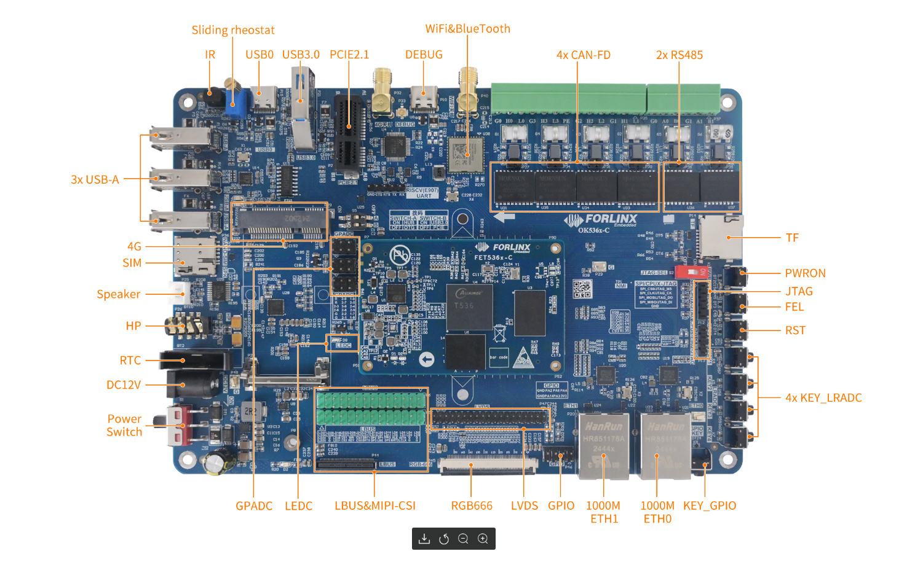

**Note: This software manual will no longer describe hardware parameters. Before proceeding with software development using this manual, please read the “OK536-C_User's Hardware Manual" to understand the product naming rules and the hardware configuration of your specific product, which will facilitate your use of this product.**

### 1.1 Linux 5.10.198 System Software Resources

| **Device**| **Driver Source Code Location in the Kernel**| **Device Name**|
|----------|----------|----------|
| Network Card Driver| bsp/drivers/stmmac| /sys/class/net/eth0   /sys/class/net/eth1|
| LCD Backlight Driver| kernel/linux-5.10-origin/drivers/video/backlight/|
| LED Driver| kernel/linux-5.10-origin/drivers/leds/| /sys/class/leds/|
| USB 4G| kernel/linux-5.10-origin/drivers/net/usb/GobiNet/| /dev/ttyUSB\*|
| SD Card Driver| bsp/drivers/mmc/| /dev/block/mmcblk\_p\_|
| Serial Port Driver| bsp/drivers/uart/| /dev/ttyAS\*|
| Watchdog Driver| bsp/drivers/watchdog/| /dev/watchdog|
| WIFI| drivers/net/wireless/nxp/mlan/| /sys/class/net/wlan0|
| Audio Driver| bsp/drivers/sound/platform| /dev/snd/|
| SPI| bsp/drivers/spi/   drivers/spi/| /dev/spidev\*.\*|
| TWI Driver| bsp/drivers/twi/| /dev/i2c-\*|
| PWM Driver| bsp/drivers/pwm/| /dev/sunxi\_pwm\*|
| GT911/GT928 touch driver| bsp/drivers/input/ctp/gt9xx/| /dev/input/event\*|
| ft5x06 touch driver| kernel/linux-5.10-origin/drivers/input/touchscreen/edt-ft5x06.c| /dev/input/event\*|
| GPADC driver| bsp/drivers/gpadc/| /dev/input/event\*|
| LRADC button driver| bsp/drivers/lradc/| /dev/input/event\*|
| RTC Driver| kernel/linux-5.10-origin/drivers/rtc/rtc-rx8010.c| /dev/rtc0|
| IR Driver| bsp/drivers/ir-rx/| /dev/input/event\*|

### 1.2 Flashing \& Boot Setup

The OK536 board supports system flashing via TF card or USB OTG and boots from eMMC by default.

Insert a TF card before powering on to initiate flashing; otherwise, the system boots from eMMC. Detailed flashing steps are in the “Flashing the System” chapter.

## 2\. Quick Startup

### 2.1 Preparation Before Startup

Login methods: serial login and network login.                                                                                             Hardware preparations before powering on the system:

+ 12V/3A DC power cable
+ Debug serial cable (for serial login)
+ The debug serial port on the development board is a USB Type-C port. Users can connect the development board to a PC using a Type-A to Type-C cable to check the board's status information.
+ Ethernet cable (for network login)
+ Display screen — connect the screen according to the development board interface (optional if display is not needed)
+ Check the boot mode (if a TF card is inserted, the system will boot from the TF card by default; otherwise, it will boot from eMMC)

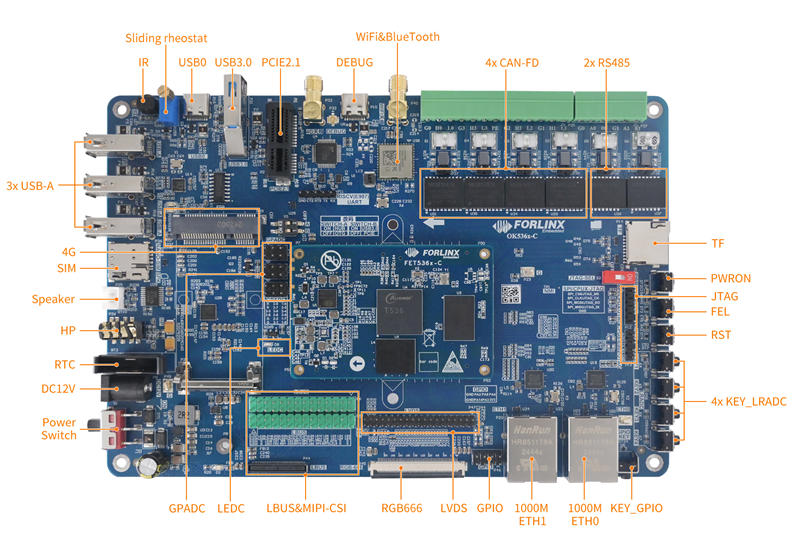

### 2.2 Serial Port Login 

**Note:**

**Settings: Baud rate 115200, 8 data bits, 1 stop bit, no parity/flow control.**

**Login: Username root, no password.**

**Software requirements: For Windows systems, the PC needs to have HyperTerminal software installed. There are various HyperTerminal alternatives available; one can use their preferred serial terminal software, such as PUTTY or MobaXterm.**

Terminal Setup Using PuTTY （User profile\\3-tools\\putty-64-bit\_x86.exe） as an Example:

1\. Connect the development board and PC using a serial cable. Confirm the serial port number connected to the computer by checking in "Device Manager". The actual serial port number recognized by the computer shall prevail. Select "XR21V1414 USB UART Ch A".

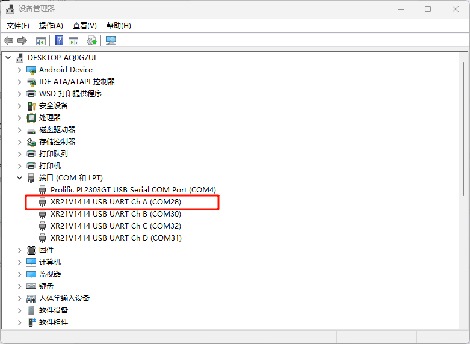

2\. Configure PuTTY: Open PuTTY. In the “Serial line” field, enter the identified COM port and set the baud rate to 115200;

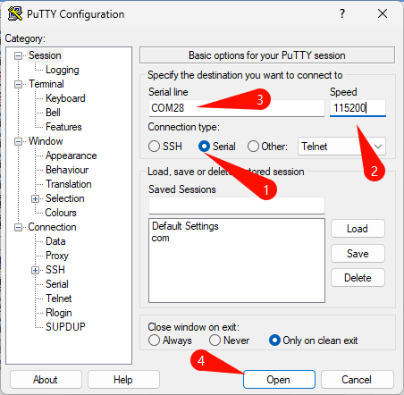

3\. Power on and log in: Turn on the development board. The serial terminal will display boot-up messages. Once the prompt root@OK536:/# appears, the system has fully booted. You are logged in automatically as the root user (no password required).

#### 2.2.1 Common Issues (Serial Login)

Driver Installation: On first connection, you may need to install the corresponding driver on your PC (located in the user materials at \\03-tools\\XRUSB.zip).

Cable Quality: To avoid garbled characters during communication, it is recommended to use a high-quality Type-C cable.

### 2.3 Network Login (SSH)

#### 2.3.1 Network Login Test

**Note: Default IP: eth0: 192.168.0.232, eth1: 192.168.1.232.**

****

**The computer and the development board need to be in the same network segment during the test.**

Before logging in to the network, you need to ensure that the network connection between the computer and the development board is normal. You can test the connection status between the computer and the development board through the ping command. Specific Operations:

1\. Connect the eth0 of the development board to the computer via a network cable, power on the development board, and after the kernel starts, the red heartbeat light on the SoM will flash. After the network card connected to the computer starts normally, the network card light will flash rapidly. At this point, you can test the network connection;

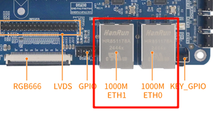

2\. Disable the computer firewall

Temporarily disable the computer’s firewall (this is a general operation; specific steps depend on your Windows version);

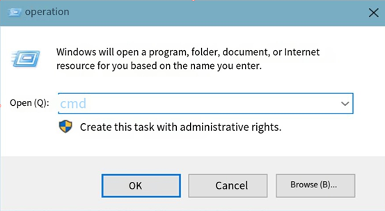

3\. Open Command Prompt as administrator

Press Win + R, type cmd, then press Ctrl + Shift + Enter to run Command Prompt as administrator;

Data is returned, indicating that the network connection is normal.

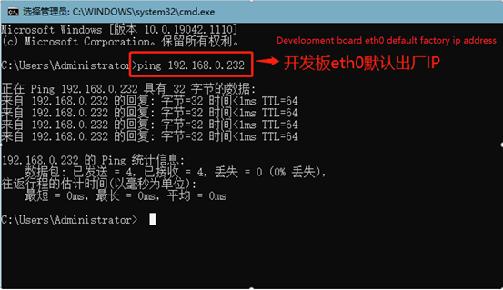

#### 2.3.2 SSH Server

**Note:**

**The default account for SSH login is “root” with the password “root”.**

**The default IP address for the eth0 interface is 192.168.0.232.**

**You can use the scp command for file transfers.**

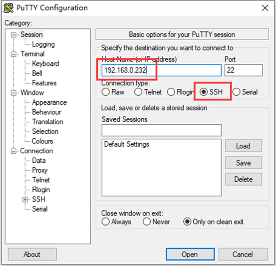

After clicking “Open”, a dialog box will appear. Click “Yes” to proceed to the login interface.

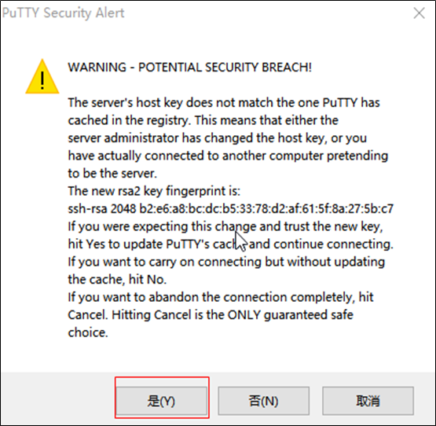

```plain
Login as：root
root@192.168.0.232's password:               //按照提示输入开发板root账户的密码root
root@OK536:~$
```

You can use SFTP to copy files. For details, please refer to Section 4.17.2 SFTP.

### 2.4 Switching Display Screens via U-Boot Menu

This method allows you to switch between supported display screens without recompiling or re-flashing the system.

During the U-Boot startup process, press the Spacebar to enter the U-Boot menu.

```plain
---------------------------------------------
0: Exit to console
1: Save and Reboot
2: Display Type: lvds 1280x800
3: USB3.0 or PCIE: none
---------------------------------------------
```

The menu options are as follows:

Press 0: Enters the U-Boot command line.

Press 1: Saves the configuration and reboots.

Press 2: Cycles through and selects the Display Type (screen).

Press 3: Cycles through and selects the multiplexing option for PCIe and USB 3.0.

**When USB 3.0 is enabled, inserting a USB 3.0 device may occasionally cause a bus reset. A fix for this will be provided in subsequent releases.**

**If you need to use USB 3.0 or PCIe, you need to set the DIP switch on the carrier board to the corresponding position and select it in the U-Boot menu.**

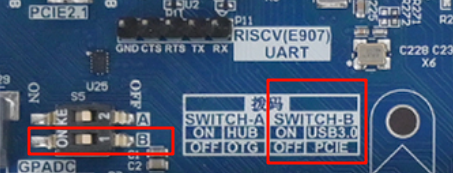

### 2.5 Resistive Touchscreen Recalibration

When using a resistive touchscreen, the system defaults to calibration via tslib. If recalibration is required, execute the following command:

```plain
root@OK536:~# rm /etc/pointercal
root@OK536:/# /etc/init.d/S60Matrix_Browser stop
root@OK536:/# /usr/bin/ts_calibrate
root@OK536:/# /etc/init.d/S60Matrix_Browser start
```

The calibration data file is saved at /etc/pointercal.

### 2.6 Storage Storage

The OK536 is available in two configurations: 1GB RAM + 8GB Storage and 2GB RAM + 16GB Storage. The information below pertains to the 1+8GB version.

#### 2.6.1 eMMC

The table below details the eMMC storage partition information for the Linux operating system:

| **Partition Index**| **Name**| **Size**| **Filesystem**| **Content**|
|:----------:|:----------:|:----------:|:----------:|----------|
| mmcblk0p1| boot-resource| 32MB| vfat| boot-resource.fex|
| mmcblk0p2| env| 16MB| raw| env.fex|
| mmcblk0p3| boot| 96MB| raw| boot.fex|
| mmcblk0p4| private| 16MB| raw|
| mmcblk0p5| rootfs| 1024MB| ext4| rootfs.fex|
| mmcblk0p7| UDISK| Remaining Space| ext4| User Partition|

Use the df command to view disk usage on the system. The following is the factory default disk usage (using the Qt filesystem) for reference only. Actual parameters may vary.

```plain
root@OK536:/ # df -Th
Filesystem         Type      Size  Used Avail Use% Mounted on
/dev/root          ext4      991M  449M  526M  47% /
tmpfs              tmpfs     459M  112K  459M   1% /tmp
tmpfs              tmpfs     459M  332K  459M   1% /run
devtmpfs           devtmpfs  457M     0  457M   0% /dev
/dev/mmcblk0p1     vfat      128M  5.3M  123M   5% /run/media/mmcblk0p1
/dev/by-name/UDISK vfat      6.1G  4.0K  6.1G   1% /mnt/UDISK
```

#### 2.6.2 Memory

Use the free command to view memory usage. The following shows the memory usage when no peripherals are connected (unit: MB), for reference only. Actual parameters may vary.

```plain
root@OK536:/# free -m
              total        used        free      shared  buff/cache   available
Mem:            918         171         635           0         111         721
Swap:             0           0           0
```

### 2.7 System Shutdown

In general, you can directly power off the system. However, if operations such as data storage or functional usage are in progress, avoid cutting power abruptly to prevent irreversible file damage, which may require re-flashing the firmware. To ensure all data is fully written, you can execute the sync command to complete data synchronization before powering off.

Rebooting the Development Board: Execute the reboot command. You can also perform a hardware reset by pressing the K3 (RESET) button or directly cycling the power.

Press and hold the K1 (PWRON) button to shut down the system. Press and hold it again to power on.

**Note: For products designed based on the SoM:, if unexpected power loss during use leads to system abnormalities, consider implementing measures such as power-loss protection in the design.**

## 3\. OK536 Platform Interface Function Usage and Testing

**Note:**

- **This section should be performed when you are using the screen and Qt file system. If Qt is not used, this section can be skipped;**

- **This chapter focuses on describing the functions in Qt. During testing, it is assumed that the device connection is normal and drivers are properly loaded. It is recommended to complete command-line function testing before testing interface functions.**

Qt test program source code path: source code OK536-linux-sdk/buildroot/package/auto/forlinx/qt\_demo/flapp/src

Test program path in the development board file system: /usr/bin

This section mainly explains the usage of the development board’s extended interfaces in the Qt interface. The test programs are for reference only, and you need to adjust according to actual conditions during use.

### 3.1 Interface Function  Description

After the OK536 development board starts up, the desktop is displayed as follows:

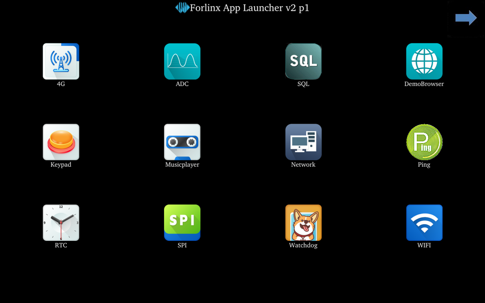

Click the arrow in the upper right corner to go to the next page.

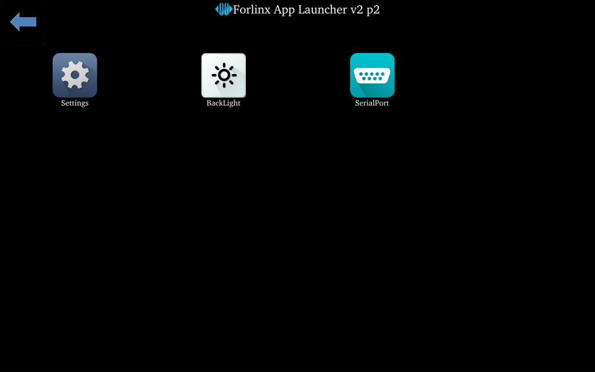

### 3.2 Network Configuration Test

**Note:**

**The factory default only sets the eth0 network card to STATIC mode.**

**The set IP and other information will be saved to the system’s relevant configuration file (/etc/network/interfaces), so each reboot will use the network information set this time.**

Icon:

Click the network configuration icon to enter the interface program, supporting both STATIC and DHCP modes.

STATIC Mode

Click the network configuration icon, select STATIC, as shown below: You can configure the IP address, subnet mask, gateway, and DNS. After setting the parameters, click “Apply and Restart Network”.

| **Relevant Parameter**| **Meaning**|
|:----------:|:----------:|
| Interface| Set network card|
| IP| Set IP address|
| Netmask| Set subnet mask|
| Gateway| Set gateway|
| DNS| Set DNS|

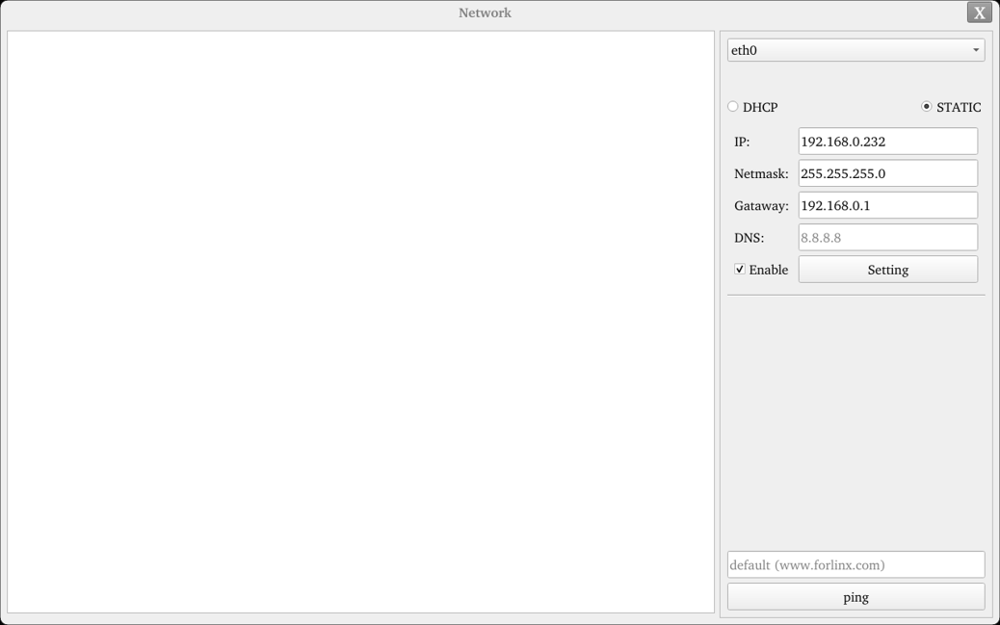

### 3.3 Browser Test

Icon:

Click the browser icon to enter the browser. Ensure the network is smooth during use, and ensure DNS is available before accessing external networks. The browser defaults to accessing the Forlinx Embedded official website upon startup, as shown below:

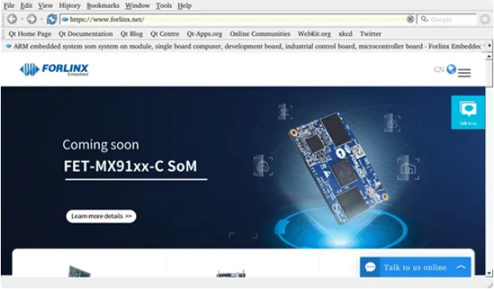

**Note: If the development board’s time is abnormal, it may cause certificate issues.**

### 3.4 4G Test

Icon:

The “4G” test program is used to test the OK536 external 4G module (EC20). Before testing, power off the development board, switch DIP switch A to ON, connect the 4G module, insert the SIM card (pay attention to the SIM card direction), start the development board, and open the test application. This test uses EC20 as an example:


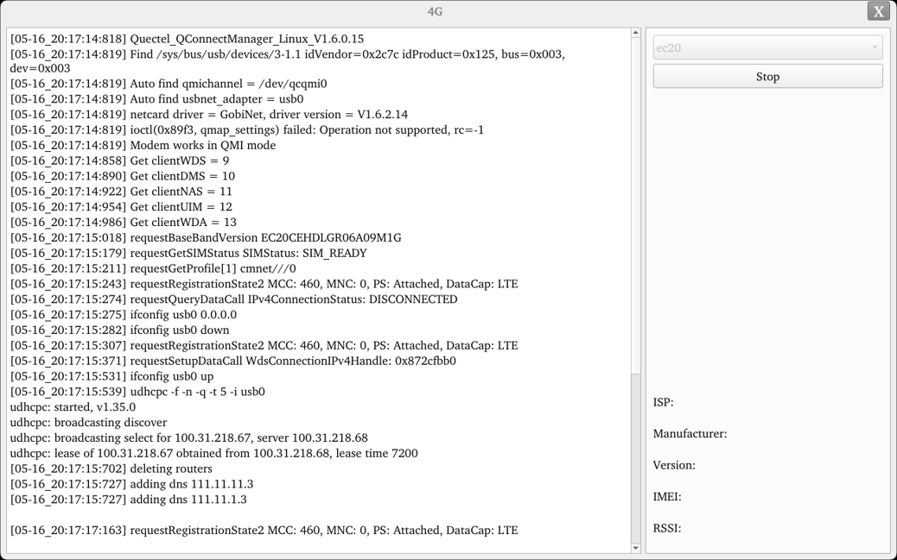

Click the start button, and the program will automatically enter the dial-up process and obtain IP, set DNS, etc. Wait patiently for a few seconds.

### 3.5 485 Test

Icon:

This test uses UART8 (ttyAS8) and performs a serial port test with the serialTool.

**Note: uart7 and uart8 on OKT536 are 485. Use a USB-to-485 converter on the computer to connect to OKT536 485 A B. uart8 is 485\_0, uart7 is 485\_1.**

1\. Click the Terminal test icon to enter the following interface and set serial port parameters:


2\. Click the settings button in the upper left corner and set the serial port parameters to be consistent with the computer-side serial port tool parameters, as shown below:

| **Relevant Parameter**| **Meaning**|
|:----------:|:----------:|
| Select Serial Port| Set serial port (ttyAS8)|
| BaudRate| Set baud rate (115200)|
| Data bits| Set data bits (8 bits)|
| Parity| Set parity bit (no parity)|
| Stop bits| Set stop bits (1 bit)|
| Flow control| Set flow control (no flow control)|

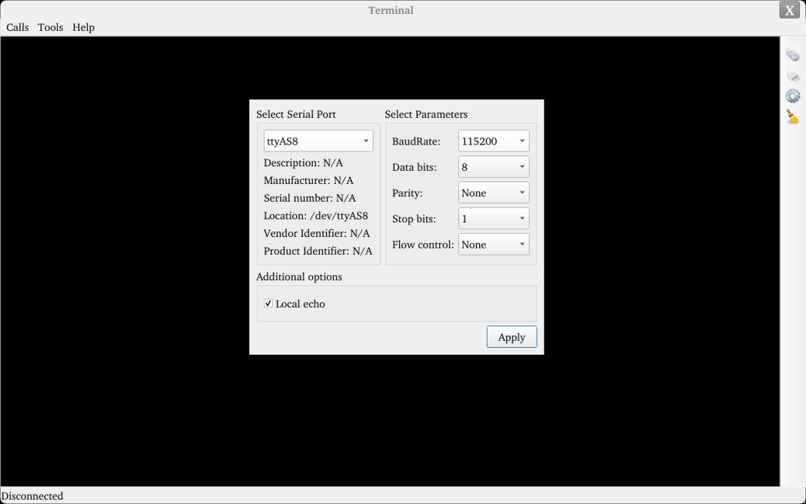

3\. After setting the serial port parameters, click the connect button in the upper left corner. At this point, the test program can perform data transmission and receiving tests;

4\. Open the serial port tool on the computer, click on the black screen area in the test interface to pop up the soft keyboard, input characters and press Enter. The screen will then display the data received by the serial port.

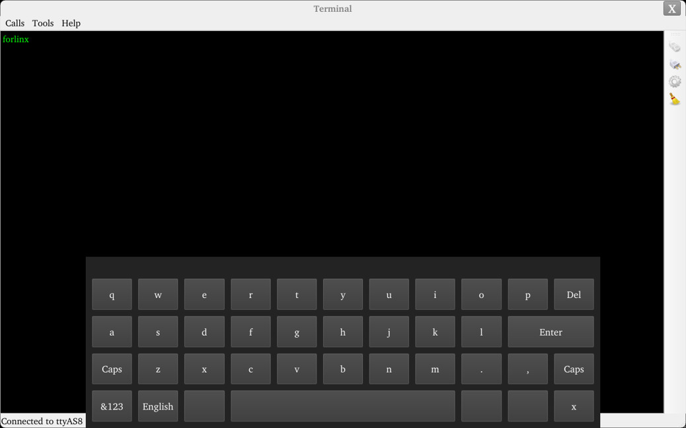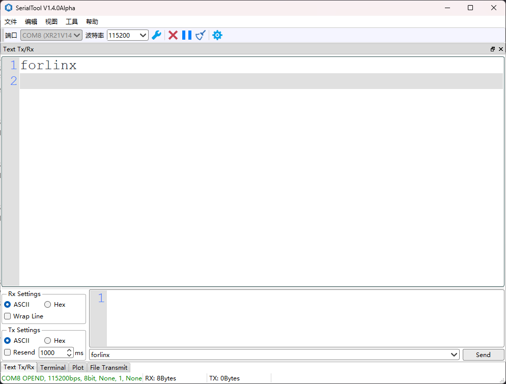

5\. In the serialTool send box, input the content to send, click send, and the test interface will display the received content.

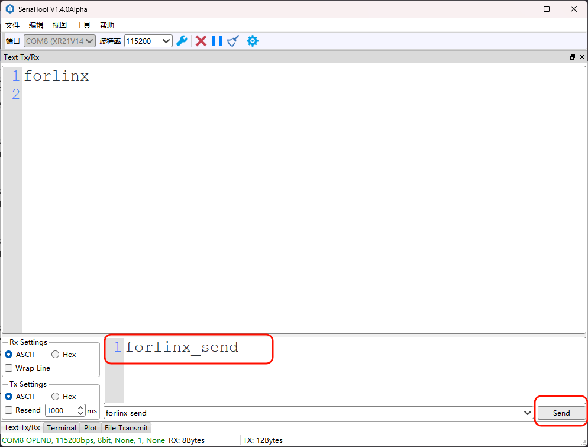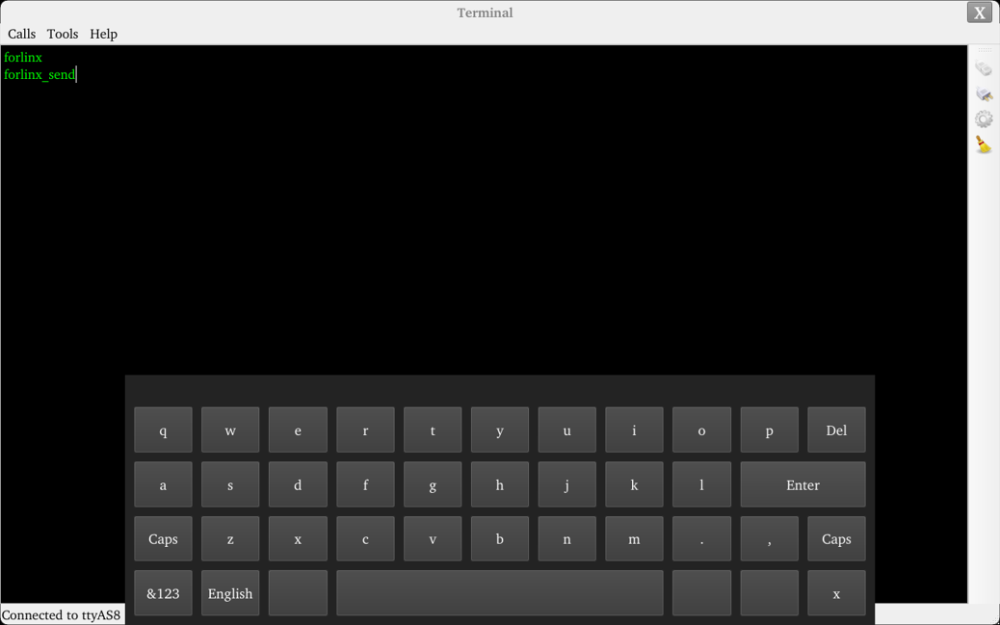

### 3.6 ADC Test

Icon:

14 x GPADC are led out from the OK536 carrier boaard. All channels are floating by default. Short the corresponding pins to measure the potentiometer value. The maximum value 4096 corresponds to a voltage of 1.8V.

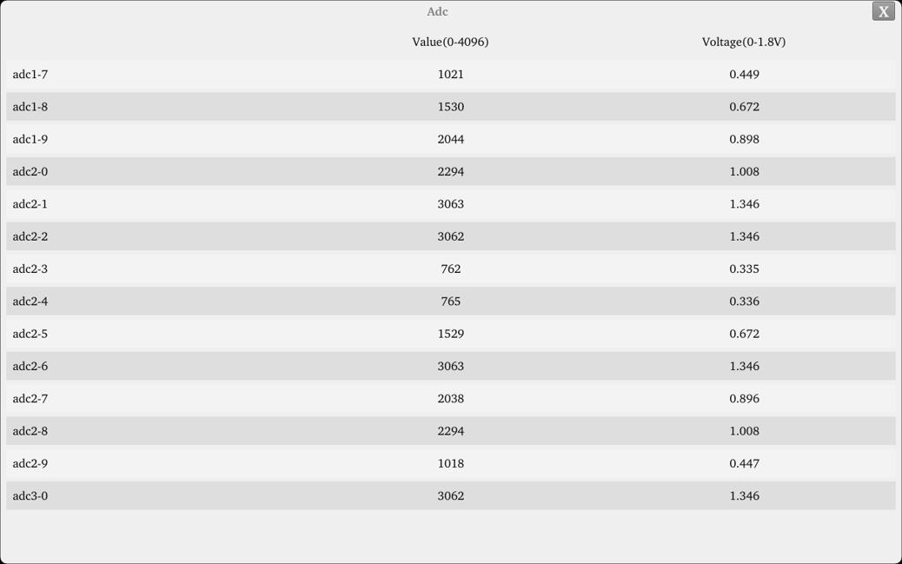

### 3.7 WiFi Test

**Note:**

- **The OK536 carrier board is soldered with the AW-CM358 chip.**

- **“WIFI” is a tool for configuring WiFi and can test the STA mode of WiFi.**

1\. Click the iconto enter the test interface, select the corresponding module from the drop-down menu, enter the router name to be connected via WiFi in the SSID field,

enter the router password in the PASSWORD field, and click "Connect" to connect to the router via WiFi.

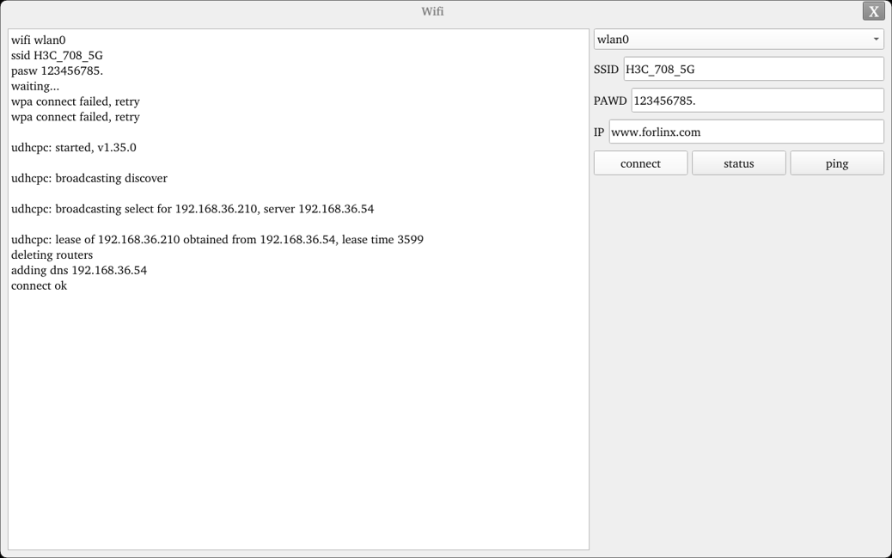

2\. After a successful connection, set the IP and then click “ping” to perform a network test.

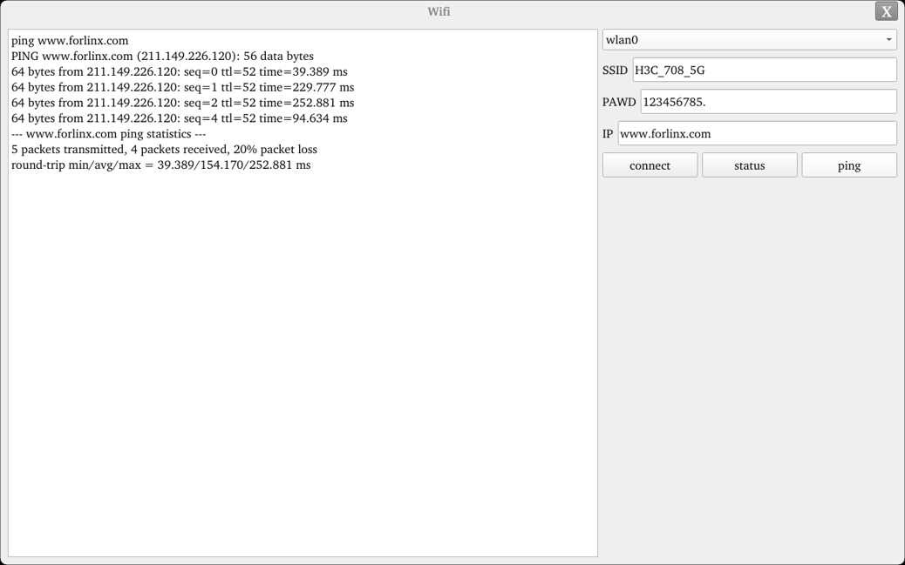

### 3.8 RTC Test

**Note: Ensure that a button battery is installed on the board and the battery voltage is normal.**

Icon:

The RTC test involves setting the time via the test software, then powering off and restarting. Run the test software again to check if the RTC clock is synchronized.

Run the RTC test software to view and set the current system time, as shown below:

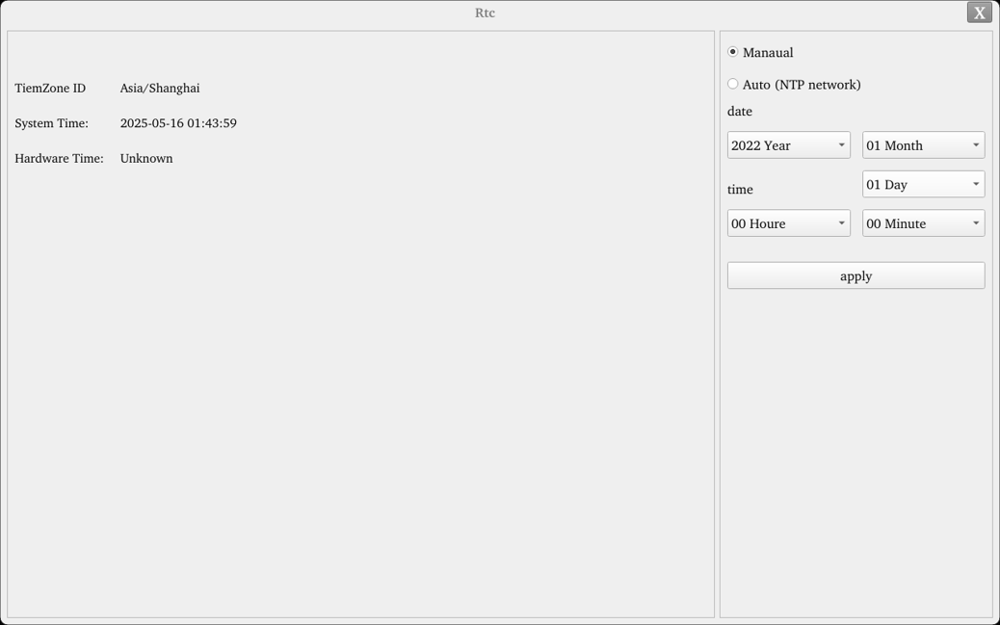

### 3.9 Key Test

Icon:

“Keypad” is used to test whether the platform’s built-in keys are usable. It determines if the key functions normally by detecting whether the corresponding key turns blue after being pressed. The interface is as follows:

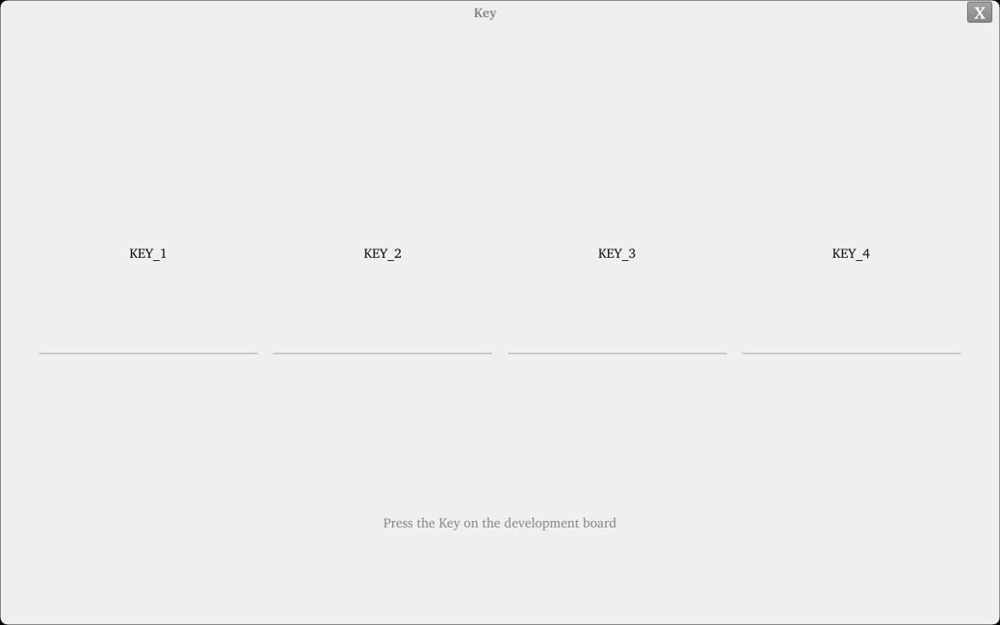

There are four physical keys KEY1, KEY2, KEY3, KEY4 on the side of the OK536 carrier board. When a key is pressed, the corresponding key in the test application will turn blue, indicating the key functions normally.

### 3.10 Watchdog Test

Icon:

“WatchDog” is an application used to test whether the watchdog function is normal. The interface is as follows:

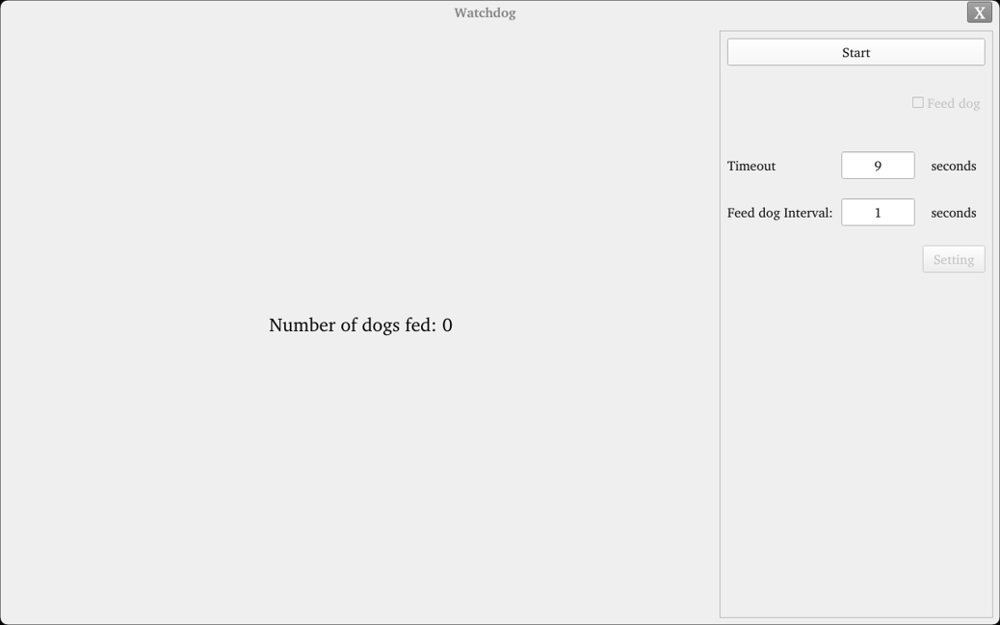

Check “feed dog”, click the “open watchdog” button, and the watchdog function will be started. The program will perform dog feeding operations, and normally the system will not reboot.

Uncheck “feed dog”, click the “open watchdog” button, and the watchdog function will be started. The program does not perform dog feeding operations. About 10 seconds after opening the watchdog, the system reboots, indicating the watchdog function is normal.

### 3.11 Pingt Test

Icon:

“Ping” is an interface version of the commonly used network test command ping. The interface is as follows:

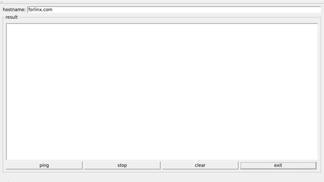

In the hostname field, write the target IP to ping. After clicking the “ping” button, the result field will show the ping result. Click stop to stop the ping test, and click “clear” to clear the information in result.

As shown in the figure, it indicates the network between them is smooth.

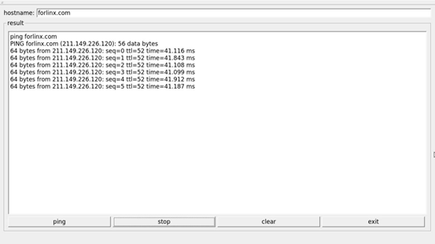

### 3.12 Backlight Test

Icon:

“BackLight” is an LCD backlight adjustment application. Adjust the progress bar left and right to adjust the backlight brightness. After opening, the interface is as follows:

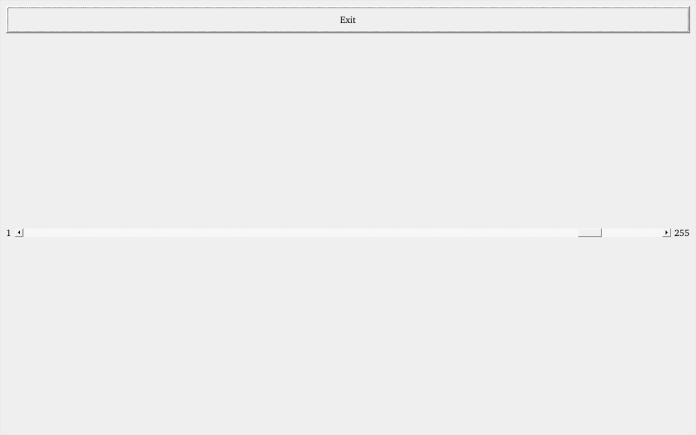

Drag the slider in the interface to set the LCD backlight brightness. 1 is the dimmest, 255 is the brightest. 0 needs to be set via the command line. Refer to “4.21 LCD Backlight Adjustment”.

### 3.13 Music Playback Test

Use the application icon  “  ”  to test music playback.

“musicplayer” is a simple audio test application that can be used to test whether the sound card functions normally and also serves as a simple audio player.


Application Interface

Click the button in the lower left corner and select the test audio /forlinx/audio/30s.mp3

### 3.14 CPU Frequency Configuration Test

The OK536 cpu0-cpu3 maximum main frequency is 1.6GHz. By default, the CPU dynamically adjusts the main frequency according to load, but it can also be set to a fixed CPU main frequency.

Click the desktop settings iconto enter the next-level menu:

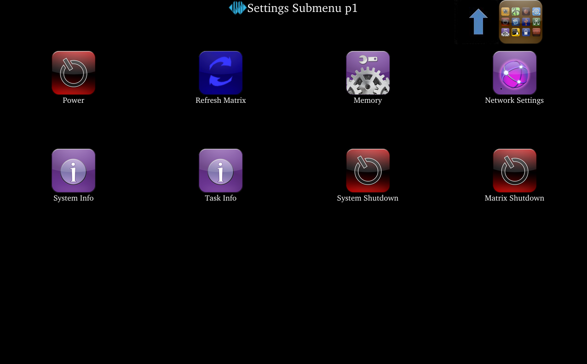

Click the iconto enter the CPU main frequency setting page.

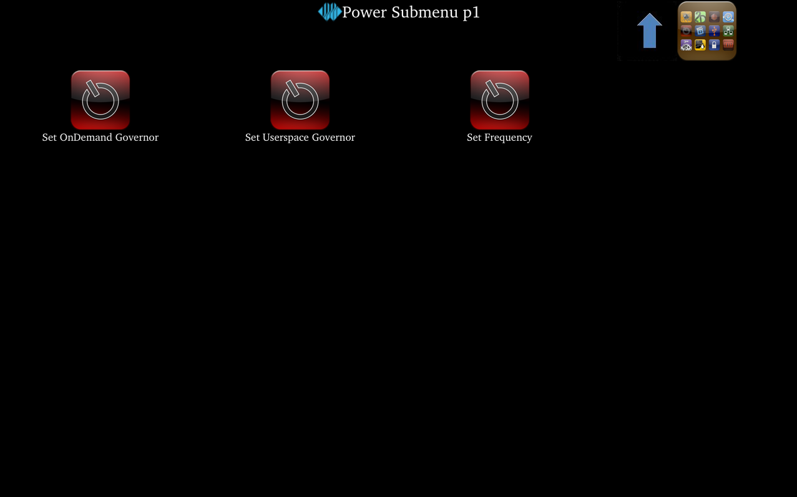

Set OnDemand Governor：Dynamically adjust the main frequency on demand.

Set Userspace Governor：Set the main frequency in user space.

Set Frequency CPU0-3：Set the small core main frequency.

Take setting the small core frequency as an example: First click “Set Userspace Governor”, click “RUN” in the pop-up dialog, 

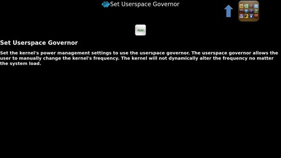

then click “Set Frequency CPU0-3” to set a fixed frequency. (Click the arrow in the upper right corner to return to the previous directory, click the icon in the upper right corner to return to the main directory).

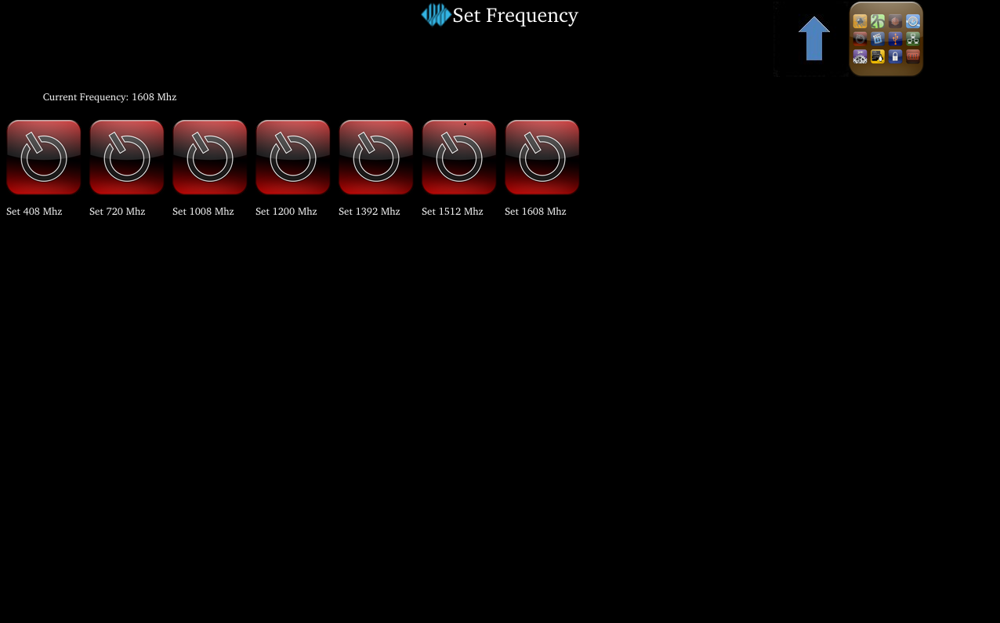

Select the corresponding frequency according to needs for setting.

### 3.15 SQLite3 Data Test

Icon:

Click the icon to enter the database test interface.

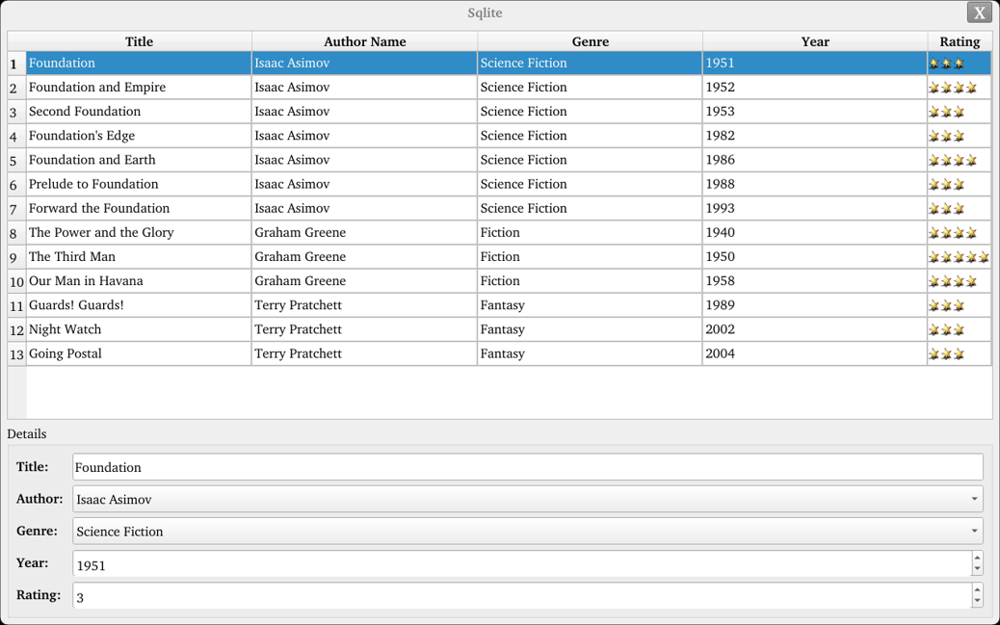

Select the row that needs to be modified, and you can modify the value of each column.

### 3.16 SPI Test

Icon:

Click the icon to enter the SPI test interface. Short the SPI0\_MOSI and SPI0\_MISO pins, click send below, and you can receive the sent data to complete the test.

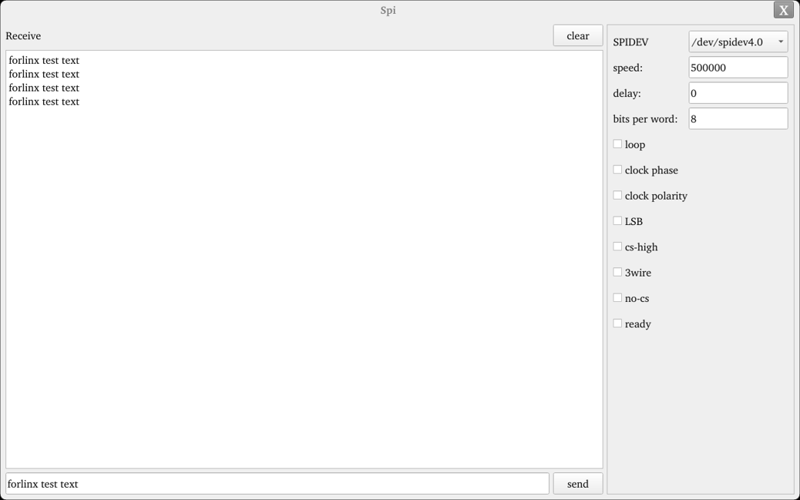

## 4\. OK536 Command Function Test

The OK536 platform comes with a rich set of command-line tools for users to utilize.

Test program source code paths:

OK536-linux-sdk/buildroot/package/auto/forlinx/cmd\_demo

OK536-linux-sdk/buildroot/package/forlinx/forlinx\_cmd

Test program path: /usr/bin

### 4.1 System Information Query

To view kernel information, enter the following command:

```plain
root@OK536:/# uname -a
Linux OK536 5.10.198 #5 SMP PREEMPT Thu Feb 6 09:24:52 CST 2025 aarch64 GNU/Linux
```

To view CPU information:

```plain
root@OK536:/# cat /proc/cpuinfo
processor       : 0
BogoMIPS        : 48.00
Features        : fp asimd aes pmull sha1 sha2 crc32 atomics fphp asimdhp cpuid asimdrdm lrcpc dcpop asimddp
CPU implementer : 0x41
CPU architecture: 8
CPU variant     : 0x2
CPU part        : 0xd05
CPU revision    : 0

processor       : 1
BogoMIPS        : 48.00
Features        : fp asimd aes pmull sha1 sha2 crc32 atomics fphp asimdhp cpuid asimdrdm lrcpc dcpop asimddp
CPU implementer : 0x41
CPU architecture: 8
CPU variant     : 0x2
CPU part        : 0xd05
CPU revision    : 0

processor       : 2
BogoMIPS        : 48.00
Features        : fp asimd aes pmull sha1 sha2 crc32 atomics fphp asimdhp cpuid asimdrdm lrcpc dcpop asimddp
CPU implementer : 0x41
CPU architecture: 8
CPU variant     : 0x2
CPU part        : 0xd05
CPU revision    : 0

processor       : 3
BogoMIPS        : 48.00
Features        : fp asimd aes pmull sha1 sha2 crc32 atomics fphp asimdhp cpuid asimdrdm lrcpc dcpop asimddp
CPU implementer : 0x41
CPU architecture: 8
CPU variant     : 0x2
CPU part        : 0xd05
CPU revision    : 0
```

To view environment variable information:

```plain
root@OK536:/# env
SHELL=/bin/bash
EDITOR=/bin/vi
PWD=/root
LOGNAME=root
HOME=/root
QT_QPA_FB_DISABLE_INPUT=1
QT_QPA_PLATFORM=linuxfb
TERM=vt100
USER=root
SHLVL=1
QT_QPA_FONTDIR=/usr/share/fonts
QT_QPA_EVDEV_TOUCHSCREEN_PARAMETERS=/dev/input/ts:rotate=90:invertx
PATH=/bin:/sbin:/usr/bin:/usr/sbin
DBUS_SESSION_BUS_ADDRESS=unix:path=/var/run/dbus/system_bus_socket
QT_QPA_GENERIC_PLUGINS=evdevtouch:/dev/input/ts
_=/usr/bin/env
```

### 4.2 Frequency Test

**Note: The T536 has four cores in total. This process uses cpu0 as an example for operation, but in reality, cpu0 to cpu3 will change simultaneously.**

1. All cpufreq governor types supported in the current kernel:

```plain
root@OK536:/# cat /sys/devices/system/cpu/cpu0/cpufreq/scaling_available_governors
conservative ondemand userspace powersave performance schedutil
```

Among these, userspace represents user mode, which allows other user programs to adjust CPU frequency in this mode.

2. To view the current frequency levels supported by the CPU:

```plain
root@OK536:/# cat /sys/devices/system/cpu/cpu0/cpufreq/scaling_available_frequencies
408000 720000 1008000 1200000 1392000 1512000 1608000 
```

3. Set to user mode and modify the frequency to 720000:

```plain
root@OK536:/# echo userspace > /sys/devices/system/cpu/cpu0/cpufreq/scaling_governor
root@OK536:/# echo 720000 > /sys/devices/system/cpu/cpu0/cpufreq/scaling_setspeed
```

To view the current frequency after modification:

```plain
root@OK536:/# cat /sys/devices/system/cpu/cpu0/cpufreq/cpuinfo_cur_freq
720000
```

### 4.3 Temperature Test

To view temperature values:

```plain
root@OK536:/# cat /sys/class/thermal/thermal_zone0/temp
48692
```

The temperature value is 48℃.

### 4.4 Watchdog Test

Watchdog is a commonly used function in embedded systems. The device node for the watchdog in OK536 is /dev/watchdog. The maximum watchdog timeout is 16 seconds.

Start the watchdog, set the reset time to 10s, and feed the dog regularly using fltest\_watchdog. This command opens the watchdog and performs feeding operations, so the system will not reboot.

```plain
root@OK536:/#fltest_watchdog -t 10 -c
Watchdog Ticking Away!
```

When using Ctrl+C to end the test program, feeding stops, and the watchdog remains open. After 10s, the system resets.

If you do not want a reset, enter the command to close the watchdog within 10s after ending the program:

```plain
root@OK536:/# fltest_watchdog -d                                          //Turn off the watchdog
```

Start the watchdog, set the reset time to 10s, and do not feed it.

This command opens the watchdog but does not perform feeding operations. The system will reboot after 10s.

```plain
root@OK536:/# fltest_watchdog -t 10
```

### 4.5 RTC Function Test

**Note: Ensure that a button battery is installed on the board and the battery voltage is normal..**

RTC testing mainly involves using the date and hwclock tools to set software and hardware times. The purpose is to test whether the software clock reads the RTC clock synchronously when the board is powered off and then back on. Then power off and on the board again. After entering the system, read the system time to confirm synchronization.

```plain
root@OK536:/#date -s "2023-08-01 15:16:30"                           //Set software time
Tue Aug  1 15:16:30 CST 2023
root@OK536:/# hwclock -u -w                                  //Synchronize the software time to the hardware time.
root@OK536:/# hwclock -u -r                                      //Display hardware time
Tue Aug  1 15:16:40 2023  0.000000 seconds
```

Then power off and power on the board. After entering the system, read the system time, and you can see that the time is synchronized.

```plain
root@OK536:/#date
Tue Aug  1 15:20:46 CST 2023
```

### 4.6 Key Test

There are eight keys on the carrier board, including five on the side: KEY1, KEY2, KEY3, KEY4, and GPIO KEY.

To test these five side keys, execute the following command:

```plain
root@OK536:/#fltest_keytest
key172 Presse
key172 Released
key158 Presse
key158 Released
key115 Presse
key115 Released
key114 Presse
key114 Released
key148 Presse
```

### 4.7 485 Test

The OK536-C development board is equipped with 6 UART interfaces, which are distributed on the development board as follows:

| **UART**| **Device Nodes**| **Description**|
|:----------:|:----------:|----------|
| UART8| /dev/ttyAS8| 485\_0|
| UART7| /dev/ttyAS7| 485\_1|

This test uses 485\_0 and 485\_1 for loopback testing. Connect 485\_A0 to 485\_A1 and 485\_B0 to 485\_B1.

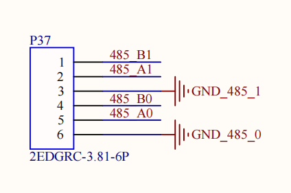

Enter the following command in the development board serial port:

```plain
root@OK536:/# fltest_uarttest -d /dev/ttyAS8 -b 115200 -r &
[1] 1953
root@OK536:/# fltest_uarttest -d /dev/ttyAS7 -b 115200 -w
tx_0: Gpi2GoMkYywl2IE9sEBcG6yI0DpmDbFT
rx_0: Gpi2GoMkYywl2IE9sEBcG6yI0DpmDbFT
[1]+  Done                    fltest_uarttest -d /dev/ttyAS8 -b 115200 -r
root@OK536:/#
```

### 4.8 GPADC Test

The development board exposes 14 channels of GPADC with a voltage sampling range of 0~1.8V. Short-circuit the test adc pin to pin 1 or 2 of the P42 terminal, and adjust the sampling voltage via the R259 potentiometer:

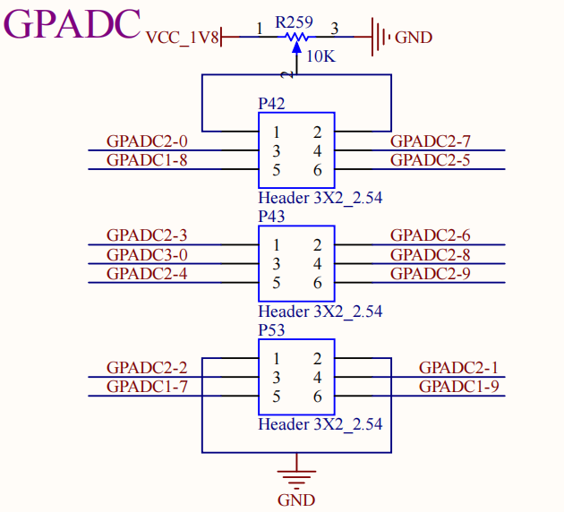

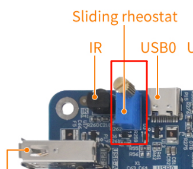

Run fltest\_adc, enter 3 to read the /dev/input/event3 event, corresponding to GPADC1 channel8 (GPADC1-8 in the schematic).

```plain
root@OK536:/#fltest_adc
Available devices:
/dev/input/event2:      sunxi-gpadc1/channel7/input0
/dev/input/event3:      sunxi-gpadc1/channel8/input0
/dev/input/event4:      sunxi-gpadc1/channel9/input0
/dev/input/event5:      sunxi-gpadc2/channel0/input0
/dev/input/event6:      sunxi-gpadc2/channel1/input0
/dev/input/event7:      sunxi-gpadc2/channel2/input0
/dev/input/event8:      sunxi-gpadc2/channel3/input0
/dev/input/event9:      sunxi-gpadc2/channel4/input0
/dev/input/event10:     sunxi-gpadc2/channel5/input0
/dev/input/event11:     sunxi-gpadc2/channel6/input0
/dev/input/event12:     sunxi-gpadc2/channel7/input0
/dev/input/event13:     sunxi-gpadc2/channel8/input0
/dev/input/event14:     sunxi-gpadc2/channel9/input0
/dev/input/event15:     sunxi-gpadc3/channel0/input0
Select the device event number: 3
sunxi-gpadc1/channel8/input0
[ 1470.332472] sunxi:gpadc-2088000.gpadc:[INFO]: Enable channel 8
value 1978 --- vol 869mv
value 1978 --- vol 869mv
value 1979 --- vol 869mv
value 1975 --- vol 867mv
```

### 4.9 TF Test

**Note:**

- **The SD card mount directory is /run/media, supporting hot plugging. The terminal will print information about the SD card;**

- **NTFS format file systems are not supported. If unsure about the TF card format, it is recommended to format it to FAT32 before use.**

1\. Insert the TF card into the TF card slot on the development board carrier board. Under normal conditions, the development board terminal will print the following information:

```plain
[ 2829.588203] sunxi:sunxi_mmc_host-4020000.sdmmc:[INFO]: no vqmmc,Check if there is regulator
[ 2829.610087] sunxi:sunxi_mmc_host-4020000.sdmmc:[INFO]: sdc set ios:clk 400000Hz bm PP pm ON vdd 23 width 1 timing LEGACY(SDR12) dt B
[ 2829.636024] sunxi:sunxi_mmc_host-4020000.sdmmc:[INFO]: sdc set ios:clk 400000Hz bm PP pm ON vdd 23 width 1 timing LEGACY(SDR12) dt B
[ 2829.652328] sunxi:sunxi_mmc_host-4020000.sdmmc:[INFO]: sdc set ios:clk 400000Hz bm PP pm ON vdd 23 width 1 timing LEGACY(SDR12) dt B
[ 2829.667936] sunxi:sunxi_mmc_host-4020000.sdmmc:[INFO]: sdc set ios:clk 400000Hz bm PP pm ON vdd 23 width 1 timing LEGACY(SDR12) dt B
[ 2829.684228] sunxi:sunxi_mmc_host-4020000.sdmmc:[INFO]: sdc set ios:clk 400000Hz bm PP pm ON vdd 23 width 1 timing LEGACY(SDR12) dt B
[ 2829.846018] sunxi:sunxi_mmc_host-4020000.sdmmc:[INFO]: sdc set ios:clk 0Hz bm PP pm ON vdd 23 width 1 timing LEGACY(SDR12) dt B
[ 2829.858882] sunxi:sunxi_mmc_host-4020000.sdmmc:[INFO]: no vqmmc,Check if there is regulator
[ 2829.880794] sunxi:sunxi_mmc_host-4020000.sdmmc:[INFO]: sdc set ios:clk 400000Hz bm PP pm ON vdd 23 width 1 timing LEGACY(SDR12) dt B
[ 2829.903424] mmc1: host does not support reading read-only switch, assuming write-enable
[ 2829.913032] sunxi:sunxi_mmc_host-4020000.sdmmc:[INFO]: sdc set ios:clk 400000Hz bm PP pm ON vdd 23 width 4 timing LEGACY(SDR12) dt B
[ 2829.932021] sunxi:sunxi_mmc_host-4020000.sdmmc:[INFO]: sdc set ios:clk 400000Hz bm PP pm ON vdd 23 width 4 timing UHS-SDR104 dt B
[ 2829.945132] sunxi:sunxi_mmc_host-4020000.sdmmc:[INFO]: sdc set ios:clk 150000000Hz bm PP pm ON vdd 23 width 4 timing UHS-SDR104 dt B
[ 2829.958722] sunxi:sunxi_mmc_host-4020000.sdmmc:[INFO]: sdc set ios:clk 150000000Hz bm PP pm ON vdd 23 width 4 timing UHS-SDR104 dt B
[ 2829.972238] sunxi:sunxi_mmc_host-4020000.sdmmc:[INFO]: used kernel tuning, delay = 0
[ 2829.980930] sunxi:sunxi_mmc_host-4020000.sdmmc:[INFO]: change sample method
[ 2829.988728] sunxi:sunxi_mmc_host-4020000.sdmmc:[INFO]: start tuning, tuning clk = 150000000  opcode=19
[ 2829.999152] sunxi:sunxi_mmc_host-4020000.sdmmc:[INFO]: ----speed mode = 6
[ 2830.035337] sunxi:sunxi_mmc_host-4020000.sdmmc:[ERR]: wait dma hold bit clear timeout
[ 2830.061618] sunxi:sunxi_mmc_host-4020000.sdmmc:[ERR]: wait dma hold bit clear timeout
[ 2830.112611] sunxi:sunxi_mmc_host-4020000.sdmmc:[ERR]: wait dma hold bit clear timeout
[ 2830.126382] sunxi:sunxi_mmc_host-4020000.sdmmc:[INFO]: tuning section: 
[ 2830.126388] sunxi:sunxi_mmc_host-4020000.sdmmc:[INFO]: [0-15|16] 
[ 2830.133814] sunxi:sunxi_mmc_host-4020000.sdmmc:[INFO]: [21-55|35] 
[ 2830.140639] sunxi:sunxi_mmc_host-4020000.sdmmc:[INFO]: [61-63|3] 
[ 2830.147565] sunxi:sunxi_mmc_host-4020000.sdmmc:[INFO]: 
[ 2830.160238] sunxi:sunxi_mmc_host-4020000.sdmmc:[INFO]: tuning result: 21 - 55,  best: 38
[ 2830.169349] mmc1: new ultra high speed SDR104 SDHC card at address e624
[ 2830.178573] mmcblk1: mmc1:e624 SL16G 14.8 GiB 
[ 2830.190898]  mmcblk1: p1 p2 p3 p4 p5 p6 p7 p8
[ 2830.407046] squashfs: Unknown parameter 'umask'
[ 2830.434538] FAT-fs (mmcblk1p1): Volume was not properly unmounted. Some data may be corrupt. Please run fsck.
[ 2830.701242] EXT4-fs (mmcblk1p5): recovery complete
[ 2830.714497] EXT4-fs (mmcblk1p5): mounted filesystem with ordered data mode. Opts: (null)

root@OK536:/#
```

2\. Check the mount directory:

```plain
root@OK536:/# ls /run/media                                //List the files in the `/run/media` directory.
mmcblk0p1  mmcblk0p6  mmcblk1p1  mmcblk1p5
```

3\. Write test:

```plain
root@OK536:/# dd if=/dev/zero of=/run/media/mmcblk1p1/test bs=1M count=500 conv=fsync
500+0 records in
500+0 records out
524288000 bytes (524 MB, 500 MiB) copied, 10.6269 s, 49.3 MB/s
```

4\. Read test:

**Note: To ensure the accuracy of the data, please restart the development board to test the reading speed.**

```plain
root@OK536:/# dd if=/dev/mmcblk1p1 of=/dev/null bs=1M count=500 iflag=direct
500+0 records in
500+0 records out
524288000 bytes (524 MB, 500 MiB) copied, 7.56327 s, 69.3 MB/s
```

5\. After using the TF card, you need to use umount to unmount the TF card before ejecting it.

```plain
root@OK536:/#umount /run/media/mmcblk1p1
```

**Note: Exit the TF card mount path before removing the TF card.**

### 4.10 Storage Test

The OK536 platform eMMC operates in HS400 mode by default. Below is a simple test of eMMC read/write speed using the ext4 file system as an example.

Write test:

```plain
root@OK536:/# dd if=/dev/zero of=/root/data.img bs=1M count=500 conv=fsync
500+0 records in
500+0 records out
524288000 bytes (524 MB, 500 MiB) copied, 5.00589 s, 105 MB/s
```

Read test:

**Note: To ensure the accuracy of the data, please restart the development board to test the reading speed.**

```plain
root@OK536:/# dd if=/root/data.img of=/dev/null bs=1M count=500 iflag=direct
500+0 records in
500+0 records out
524288000 bytes (524 MB, 500 MiB) copied, 2.25874 s, 232 MB/s
```

### 4.11 USB 2.0

**Note:**

- **Hot plugging of USB devices is supported;**

- **NTFS format file systems are not supported. If unsure about the USB drive format, it is recommended to format it to FAT32 before use;**

- **Note the difference between USB3.0 and USB2.0 interfaces.**

The OK536 supports four USB2.0 interfaces, three of which are expanded via a USB hub and multiplexed with OTG. Toggle DIP switch A to switch between OTG and the USB hub. When DIP switch B is set to PCIe, the USB3.0 interface functions as USB2.0.

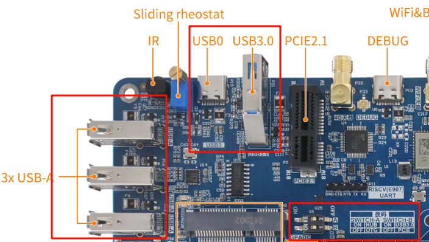

1\. After booting the development board, connect a USB drive to the USB host interface on the board;

Serial port information:

```plain
[ 4998.259219] usb 3-1.4: new high-speed USB device number 5 using sunxi-ehci
[ 4998.480083] usb 3-1.4: New USB device found, idVendor=05e3, idProduct=0749, bcdDevice=15.35
[ 4998.489448] usb 3-1.4: New USB device strings: Mfr=3, Product=4, SerialNumber=5
[ 4998.497646] usb 3-1.4: Product: USB3.0 Card Reader
[ 4998.503021] usb 3-1.4: Manufacturer: Generic
[ 4998.507812] usb 3-1.4: SerialNumber: 000000001536
[ 4998.515477] usb-storage 3-1.4:1.0: USB Mass Storage device detected
[ 4998.523814] scsi host0: usb-storage 3-1.4:1.0
[ 4999.556889] scsi 0:0:0:0: Direct-Access     Generic  MassStorageClass 1536 PQ: 0 ANSI: 6
[ 4999.851113] sd 0:0:0:0: [sda] 31116288 512-byte logical blocks: (15.9 GB/14.8 GiB)
[ 4999.860847] sd 0:0:0:0: [sda] Write Protect is off
[ 4999.866396] sd 0:0:0:0: [sda] Mode Sense: 21 00 00 00
[ 4999.873344] sd 0:0:0:0: [sda] Write cache: disabled, read cache: enabled, doesn't support DPO or FUA
[ 4999.916627]  sda: sda1 sda2 sda3 sda4 sda5 sda6 sda7 sda8
[ 4999.927524] sd 0:0:0:0: [sda] Attached SCSI removable disk
[ 5000.267104] squashfs: Unknown parameter 'umask'
[ 5000.297860] FAT-fs (sda1): Volume was not properly unmounted. Some data may be corrupt. Please run fsck.
[ 5000.372506] EXT4-fs (sda5): recovery complete
[ 5000.377452] EXT4-fs (sda5): mounted filesystem with ordered data mode. Opts: (null)
```

2\. Check the mount directory:

```plain
root@OK536:/#ls /run/media/
mmcblk0p1  mmcblk0p6  sda1  
```

sda1 represents the first partition of the first inserted USB storage device, and so on.

3\. Check USB drive contents:

```plain
root@OK536:/#ls -l /run/media/sda1
total 8
drwxrwx--- 2 root disk 8192 Sep 23  2021 'System Volume Information'
-rwxrwx--- 1 root disk    0 Apr 25 09:25  test
```

4\. Write test. Write speed is limited by the specific storage device:

```plain
root@OK536:/# dd if=/dev/zero of=/run/media/sda1/test bs=1M count=500 conv=fsync
500+0 records in
500+0 records out
524288000 bytes (524 MB, 500 MiB) copied, 43.0038 s, 12.2 MB/s
```

5\. Read test:

Note: To ensure the accuracy of the data, please restart the development board to test the reading speed.

```plain
root@OK536:/#dd if=/run/media/sda1/test of=/dev/null bs=1M count=500 iflag=direct
500+0 records in
500+0 records out
524288000 bytes (524 MB, 500 MiB) copied, 13.5184 s, 38.8 MB/s
```

6\. After using the USB drive, use umount to unmount it before unplugging:

```plain
root@OK536:/#umount /run/media/sda1
```

**Note: Exit the mount path before unplugging the USB drive.**

### 4.12 OTG Test

The OK536-C includes one OTG interface. In Device mode, it can be used for firmware flashing, ADB file transfer, and debugging. In Host mode, standard USB devices can be connected. When connecting the OK536-C to a PC via a Type-C adapter cable, the OK536-C automatically configures OTG to Device mode. Similarly, when plugging a USB drive via an OTG cable, the system automatically configures OTG to Host mode.

1\. After booting the development board, connect a USB drive to the OTG interface using a Type-C to Type-A cable;

Serial port information:

```plain
[ 1306.195269] usb 3-1: new high-speed USB device number 2 using sunxi-ehci
[ 1306.376771] usb 3-1: New USB device found, idVendor=0951, idProduct=1666, bcdDevice= 0.01
[ 1306.386002] usb 3-1: New USB device strings: Mfr=1, Product=2, SerialNumber=3
[ 1306.394058] usb 3-1: Product: DataTraveler 3.0
[ 1306.399063] usb 3-1: Manufacturer: Kingston
[ 1306.403785] usb 3-1: SerialNumber: E0D55EA5354EF52158B00FEF
[ 1306.411407] usb-storage 3-1:1.0: USB Mass Storage device detected
[ 1306.418643] scsi host0: usb-storage 3-1:1.0
[ 1307.452346] scsi 0:0:0:0: Direct-Access     Kingston DataTraveler 3.0      PQ: 0 ANSI: 6
[ 1307.463975] sd 0:0:0:0: [sda] 241660916 512-byte logical blocks: (124 GB/115 GiB)
[ 1307.473038] sd 0:0:0:0: [sda] Write Protect is off
[ 1307.478429] sd 0:0:0:0: [sda] Mode Sense: 4f 00 00 00
[ 1307.484785] sd 0:0:0:0: [sda] Write cache: disabled, read cache: enabled, doesn't support DPO or FUA
[ 1307.503454]  sda: sda1
[ 1307.508933] sd 0:0:0:0: [sda] Attached SCSI removable disk
[ 1307.689959] squashfs: Unknown parameter 'umask'
[ 1307.699737] FAT-fs (sda1): Volume was not properly unmounted. Some data may be corrupt. Please run fsck.
```

2\. Check the mount directory:

```plain
root@OK536:/#ls /run/media/
mmcblk0p1  mmcblk0p6  sda1
```

sda1 represents the first partition of the first inserted USB storage device, and so on.

3\. Check USB drive contents:

```plain
root@OK536:/#ls -l /run/media/sda1
total 8
drwxrwx--- 2 root disk 8192 Sep 23  2021 'System Volume Information'
-rwxrwx--- 1 root disk    0 Apr 25 09:25  test
```

4\. Write test. Write speed is limited by the specific storage device:

```plain
root@OK536:/#dd if=/dev/zero of=/run/media/sda1/test bs=1M count=500 conv=fsync
500+0 records in
500+0 records out
524288000 bytes (524 MB, 500 MiB) copied, 63.8278 s, 8.2 MB/s
```

5\. Read test:

Note: To ensure the accuracy of the data, please restart the development board to test the reading speed.

```plain
root@OK536:/#dd if=/run/media/sda1/test of=/dev/null bs=1M count=500 iflag=direct
500+0 records in
500+0 records out
524288000 bytes (524 MB, 500 MiB) copied, 18.2891 s, 28.7 MB/s
```

6\. After using the USB drive, use umount to unmount it before unplugging:

```plain
root@OK536:/#umount /run/media/sda1
```

### 4.13 Ethernet Configuration

The OK536-C features two onboard Gigabit Ethernet cards. When connected via network cables, the default configuration out-of-the-box sets eth0 to static IP 192.168.0.232 and eth1 to static IP 192.168.1.232. The network cards on OK536-C can be configured via the /etc/network/interfaces configuration file.

#### 4.13.1 Gigabit Ethernet Static IP Method

**Note: The Gigabit Ethernet card in the kernel is eth0, with a default IP of 192.168.0.232.**

After the development board powers on and boots normally, execute the following command to open the network configuration file /etc/network/interfaces:

```plain
root@OK536:/#vi /etc/network/interfaces
```

Content is as follows (there may be slight differences after software version updates; refer to actual information):

iface: Specifies the network interface requiring a static IP.

address: Specifies the IP address to be fixed.

netmask: Sets the subnet mask.

gateway: Specifies the gateway.

```plain
root@OK536:/# cat /etc/network/interfaces
# interface file auto-generated by buildroot

auto lo
iface lo inet loopback

auto eth0
iface eth0 inet static
address 192.168.0.232
netmask 255.255.255.0
gateway 192.168.0.1

auto eth1
iface eth1 inet static
address 192.168.1.232
netmask 255.255.255.0
gateway 192.168.1.1
root@OK536:/#
```

```plain
root@OK536:/#vi /etc/resolve.conf
```

<font style="color:black;">Set</font><font style="color:black;">nameserver</font>

```plain
root@OK536:/#vi /etc/resolve.conf

nameserver  114.114.114.114
nameserver  8.8.8.8
```

After configuring according to actual needs, save and exit. Use sync to synchronize. The configuration will only take effect after restarting the development board or executing ip addr flush dev eth0 to clear the network card IP, followed by ifdown -a and ifup -a to restart the configuration.

#### 4.13.2 Testing Ethernet Speed

**Note:**

- **Testing communication speed between the development board and a computer requires that the computer and development board can communicate normally;**

- **This test assumes iperf3 tools are installed on Windows (3-tools\\iperf-3.1.3-win64.zip).**

Use the network speed testing tool iperf3 to test the eth0 network speed of the OK536-C carrier board.

Run iperf3 in server mode in the Windows cmd terminal: The IP for eth0 on the development board is 192.168.1.11, and the Windows PC IP is 192.168.1.39. Enter the following in the OK536 serial debugging terminal:

```plain
D:\iperf-3.1.3-win64\iperf-3.1.3-win64>iperf3.exe -s
```

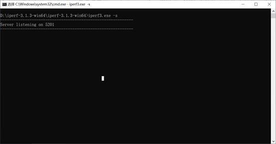


```plain
root@OK536:/# iperf3 -c 192.168.1.39            //Test upload bandwidth
Connecting to host 192.168.1.39, port 5201
[  5] local 192.168.1.11 port 55152 connected to 192.168.1.39 port 5201
[ ID] Interval           Transfer     Bitrate         Retr  Cwnd
[  5]   0.00-1.00   sec   113 MBytes   949 Mbits/sec    0    267 KBytes       
[  5]   1.00-2.00   sec   113 MBytes   945 Mbits/sec    0    267 KBytes       
[  5]   2.00-3.00   sec   112 MBytes   938 Mbits/sec    0    267 KBytes       
[  5]   3.00-4.00   sec   113 MBytes   944 Mbits/sec    0    267 KBytes       
[  5]   4.00-5.00   sec   112 MBytes   939 Mbits/sec    0    267 KBytes       
[  5]   5.00-6.00   sec   113 MBytes   946 Mbits/sec    0    267 KBytes       
[  5]   6.00-7.00   sec   112 MBytes   938 Mbits/sec    0    267 KBytes       
[  5]   7.00-8.00   sec   112 MBytes   942 Mbits/sec    0    267 KBytes       
[  5]   8.00-9.00   sec   112 MBytes   943 Mbits/sec    0    267 KBytes       
[  5]   9.00-10.00  sec   112 MBytes   938 Mbits/sec    0    267 KBytes       
- - - - - - - - - - - - - - - - - - - - - - - - -
[ ID] Interval           Transfer     Bitrate         Retr
[  5]   0.00-10.00  sec  1.10 GBytes   942 Mbits/sec    0             sender
[  5]   0.00-10.00  sec  1.10 GBytes   941 Mbits/sec                  receiver

iperf Done.
root@OK536:/# iperf3 -c 192.168.1.39 -R            //Test download bandwidth
Connecting to host 192.168.1.39, port 5201
Reverse mode, remote host 192.168.1.39 is sending
[  5] local 192.168.1.11 port 40676 connected to 192.168.1.39 port 5201
[ ID] Interval           Transfer     Bitrate
[  5]   0.00-1.00   sec   112 MBytes   941 Mbits/sec                  
[  5]   1.00-2.00   sec   112 MBytes   941 Mbits/sec                  
[  5]   2.00-3.00   sec   112 MBytes   941 Mbits/sec                  
[  5]   3.00-4.00   sec   112 MBytes   942 Mbits/sec                  
[  5]   4.00-5.00   sec   112 MBytes   942 Mbits/sec                  
[  5]   5.00-6.00   sec   112 MBytes   941 Mbits/sec                  
[  5]   6.00-7.00   sec   112 MBytes   941 Mbits/sec                  
[  5]   7.00-8.00   sec   112 MBytes   940 Mbits/sec                  
[  5]   8.00-9.00   sec   112 MBytes   941 Mbits/sec                  
[  5]   9.00-10.00  sec   112 MBytes   941 Mbits/sec                  
- - - - - - - - - - - - - - - - - - - - - - - - -
[ ID] Interval           Transfer     Bitrate
[  5]   0.00-10.00  sec  1.10 GBytes   945 Mbits/sec                  sender
[  5]   0.00-10.00  sec  1.10 GBytes   941 Mbits/sec                  receiver

iperf Done.
root@OK536:/#
```

### 4.14 Network Services

**Note: The default IP for eth0 is 192.168.0.232**

#### 4.14.1 Web Service

**Note: The PC’s IP must be in the same subnet as the development board’s IP for normal operation.**

The OK536 development board comes pre-installed with a lighttpd web server, and the service starts automatically at system boot. Enter the development board’s IP address in a browser to access the web pages on the board’s web server, as shown below:

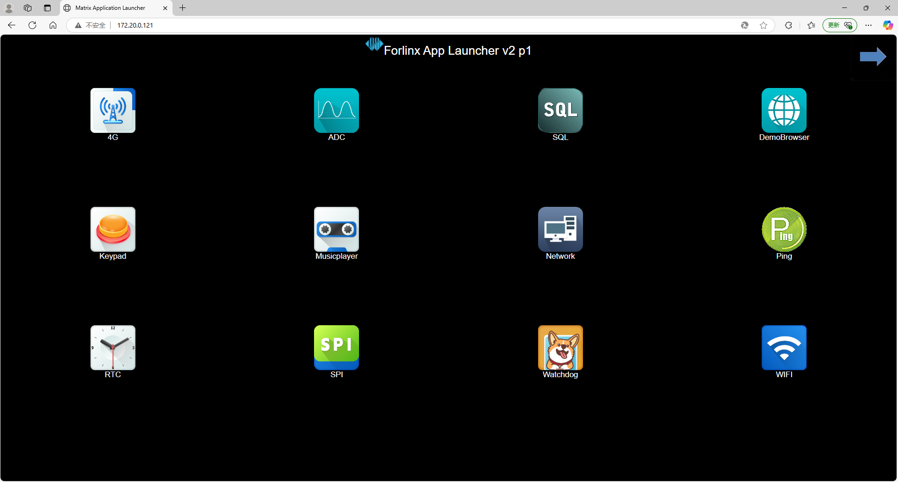

#### 4.14.2 SFTP

1 Installation package path: 3-tools\\FileZilla\*

The OK536-C development board supports SFTP service, which is automatically enabled at system startup. Once the IP address is configured, it can function as an SFTP server. The following describes how to utilize the SFTP tool for file transfer.

Install the FileZilla tool on Windows and set it up as shown in the figure below.

Open the filezilla tool, click File, and select Site Manager.

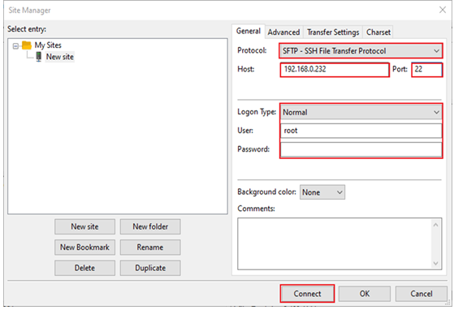

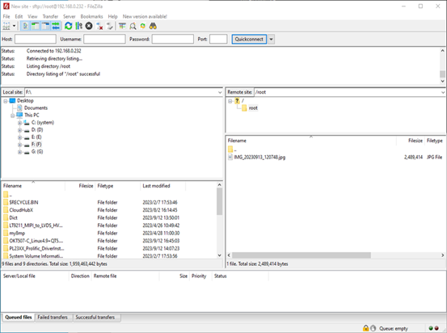

After successful login, upload and download operations can be performed.

### 4.15 WiFi Test

#### 4.15.1 STA Modes

**Note:**

- **Due to varying network environments, please configure according to your actual situation when conducting this experiment;**

- **The development board supports connecting to 2.4G and 5G wireless hotspots.**

This mode acts as a station to connect to the wireless network. In the following test, the router uses WPA encryption, and the connected Wi-Fi is 2.4GHz with the hotspot name: H3C\_708 and password: 123456785. Due to varying network environments, please configure according to your actual situation during this test.

1\. Enter the following command in the development board terminal:

The meanings of relevant parameters in the command are as follows:

| **Parameter**| **Meaning**|
|:----------:|----------|
| -i| Wireless network card node name|
| -s| The actual Wi-Fi hotspot name to connect to.|
| -p| The parameter following -p refers to the password of the actual Wi-Fi hotspot to connect to; if the hotspot has no password, write NONE after -p.|

Serial port prints as follows:

```plain
root@OK536:/# fltest_wifi.sh -i wlan0 -s H3C_708 -p 123456785.
[  204.803506] sunxi-gmac 4500000.gmac0 eth0: Link is Down
wifi wlan0
ssid H3C_708
pasw 123456785.
waiting...
[  211.388935] IPv6: ADDRCONF(NETDEV_CHANGE): wlan0: link becomes ready
udhcpc: started, v1.35.0
udhcpc: broadcasting discover
udhcpc: broadcasting discover
udhcpc: broadcasting select for 192.168.1.20, server 192.168.1.1
udhcpc: lease of 192.168.1.20 obtained from 192.168.1.1, lease time 86400
deleting routers
adding dns 192.168.1.1
connect ok
```

2\. Check whether you can ping an external network. Enter the following command in the terminal:

```plain
root@OK536:/#ping -I wlan0 baidu.com -c 4            //Ping 4 times specifying the wlan0 network interface
PING baidu.com (110.242.68.66): 56 data bytes
64 bytes from 110.242.68.66: seq=0 ttl=54 time=95.213 ms
64 bytes from 110.242.68.66: seq=1 ttl=54 time=119.289 ms
64 bytes from 110.242.68.66: seq=2 ttl=54 time=40.234 ms
64 bytes from 110.242.68.66: seq=3 ttl=54 time=64.454 ms

--- baidu.com ping statistics ---
4 packets transmitted, 4 packets received, 0% packet loss
round-trip min/avg/max = 40.234/79.797/119.289 ms
```

### 4.16 4G Test

Note:

**The driver supports the Quectel EC20 4G module.**

The OK536 supports the 4G module. Insert the 4G module before starting the development board, install the 4G antenna, insert the SIM card, start the development board, and perform dial-up Internet access operations for the EC20.

#### 4.16.1 EC20 Module Test

**Note:**

- **When using an IoT card for testing, confirm the module firmware version; lower versions may not support it and require an upgrade of the EC20 firmware;**

- **Some IoT cards require a dedicated account and password for dial-up; please adjust the command based on your actual situation;**

- **You can use the quectelCM --help command to view the meanings of related parameters.**

1\. Toggle switch A to ON, connect the module, and after powering on the development board and module, check the USB status via the lsusb command;


```plain
root@OK536:/# lsusb
Bus 002 Device 001: ID 1d6b:0001 Linux Foundation 1.1 root hub
Bus 001 Device 001: ID 1d6b:0002 Linux Foundation 2.0 root hub
Bus 004 Device 001: ID 1d6b:0001 Linux Foundation 1.1 root hub
Bus 003 Device 003: ID 2c7c:0125 Quectel Wireless Solutions Co., Ltd. EC25 LTE modem //EC20
Bus 003 Device 002: ID 1a40:0101 Terminus Technology Inc. Hub
Bus 003 Device 001: ID 1d6b:0002 Linux Foundation 2.0 root hub       
```

Check the device node status under /dev.

```plain
root@OK536:/#ls /dev/ttyUSB*
/dev/ttyUSB0  /dev/ttyUSB1  /dev/ttyUSB2  /dev/ttyUSB3
```

2\. After successful device identification, you can perform dial-up Internet access testing;

```plain
root@OK536:/#quectelCM &
```

Print information as follows:

```plain
[01-01_00:33:21:301] Quectel_QConnectManager_Linux_V1.6.0.15
[01-01_00:33:21:309] Find /sys/bus/usb/devices/3-1.1 idVendor=0x2c7c idProduct=0x125, bus=0x003, dev=0x003
[01-01_00:33:21:309] Auto find qmichannel = /dev/qcqmi0
[01-01_00:33:21:309] Auto find usbnet_adapter = usb0
[01-01_00:33:21:310] netcard driver = GobiNet, driver version = V1.6.2.14
[01-01_00:33:21:310] ioctl(0x89f3, qmap_settings) failed: Operation not supported, rc=-1
[01-01_00:33:21:310] Modem works in QMI mode
[01-01_00:33:21:327] Get clientWDS = 7
[01-01_00:33:21:360] Get clientDMS = 8
[01-01_00:33:21:391] Get clientNAS = 9
[01-01_00:33:21:423] Get clientUIM = 10
[01-01_00:33:21:455] Get clientWDA = 11
[01-01_00:33:21:487] requestBaseBandVersion EC20CEHDLGR08A05M1G
[01-01_00:33:21:615] requestGetSIMStatus SIMStatus: SIM_READY
[01-01_00:33:21:647] requestGetProfile[1] cmnet///0
[01-01_00:33:21:679] requestRegistrationState2 MCC: 460, MNC: 0, PS: Attached, DataCap: LTE
[01-01_00:33:21:712] requestQueryDataCall IPv4ConnectionStatus: DISCONNECTED
[01-01_00:33:21:71[ 2001.950466] IPv6: ADDRCONF(NETDEV_CHANGE): usb0: link becomes ready
2] ifconfig usb0 0.0.0.0
[01-01_00:33:21:721] ifconfig usb0 down
[01-01_00:33:21:808] requestSetupDataCall WdsConnectionIPv4Handle: 0x87669020
[01-01_00:33:21:968] ifconfig usb0 up
[01-01_00:33:21:977] udhcpc -f -n -q -t 5 -i usb0
udhcpc: started, v1.35.0
udhcpc: broadcasting discover
udhcpc: broadcasting select for 10.32.26.177, server 10.32.26.178
udhcpc: lease of 10.32.26.177 obtained from 10.32.26.178, lease time 7200
[01-01_00:33:22:158] deleting routers
[01-01_00:33:22:185] adding dns 111.11.1.3
[01-01_00:33:22:185] adding dns 111.11.11.3
```

If an IP is automatically assigned and DNS is added, the EC20 dial-up is successful.

3\. After successful dial-up, check the network node via ifconfig as usb0 (the node name may vary; refer to the actual situation), and test network status via the ping command.

```plain
root@OK536:/# ping -I usb0 baidu.com -c4
PING baidu.com (110.242.68.66): 56 data bytes
64 bytes from 110.242.68.66: seq=0 ttl=53 time=59.096 ms
64 bytes from 110.242.68.66: seq=1 ttl=53 time=69.325 ms
64 bytes from 110.242.68.66: seq=2 ttl=53 time=69.955 ms
64 bytes from 110.242.68.66: seq=3 ttl=53 time=83.063 ms

--- baidu.com ping statistics ---
4 packets transmitted, 4 packets received, 0% packet loss
round-trip min/avg/max = 59.096/70.359/83.063 ms
```

### 4.17 Playback/Recording Test

**Note: The OK536 provides 1 x 3.5mm audio jack and 1 x XH-2.54-2PS speaker interface. The headphone microphone can be used for recording.**

Playback test:

```plain
root@OK536:/# aplay -D spk /forlinx/audio/30s.wav   // Play audio through speaker
root@OK536:/# aplay /forlinx/audio/30s.wav          // Play audio through headphone
root@OK536:/# mpg123 /forlinx/audio/30s.mp3         // Play audio through headphone
```

Recording test:

```plain
root@OK536:/# arecord -c2 -r 48000 -f S16_LE -d 3 mic.wav
Recording WAVE 'mic.wav' : [ 4608.610608] [SNDCODEC][sunxi_card_hw_params][630]:stream_flag: 1
Signed 16 bit Little Endian, Rate 48000 Hz, Stereo
```

### 4.18 LCD Backlight Adjustment

The brightness range for the backlight is (0–255), where 255 indicates the highest brightness and 0 turns off the backlight. Enter the following command in the terminal after system startup for backlight testing.

1\. Check the current screen backlight value:

```plain
root@OK536:~# cat /sys/class/backlight/backlight0/brightness 
200                                         //The current backlight is 200
```

2\. Turn off the backlight:

```plain
root@OK536:~# echo 0 > /sys/class/backlight/backlight0/brightness    //Turn off the backlight
```

3\. Turn on the LCD backlight:

```plain
root@OK536:~# echo 125 > /sys/class/backlight/backlight0/brightnes   //Set the backlight value to 125
```

### 4.19 Closing Desktop

```plain
root@OK536:/# /etc/init.d/S60Matrix_Browser stop                  //Turn off the desktop
root@OK536:/# fbinit 0                                        //Screen clearing operation
cleanning /dev/fb0 ...
clean /dev/fb0 finish
```

### 4.20 LED Test

There is a controllable blue LED light on the SoM. When the board powers on and starts, this blue LED flashes. There is a blue LED light on the carrier board, which is not lit by default.

SoM LED test method as follows:

1\. View the trigger condition

```plain
root@OK536:/# cat /sys/class/leds/heartbeat/trigger
none rc-feedback rfkill-any rfkill-none timer [heartbeat] mmc0 mmc1 mmc2 rfkill0 rfkill2
```

Here, \[heartbeat] indicates the current trigger condition is the system heartbeat light. Writing the above string to trigger can modify the trigger condition.

2\. User control

When the LED trigger condition is set to none, you can control the LED on/off via commands.

```plain
root@OK536:/# echo none > /sys/class/leds/heartbeat/trigger
root@OK536:/# echo 1 > /sys/class/leds/heartbeat/brightness
root@OK536:/# echo 0 > /sys/class/leds/heartbeat/brightness
```

3\. Change the blue LED to heartbeat mode

```plain
root@OK536:/# echo heartbeat > /sys/class/leds/heartbeat/trigger
```

The LED is now controlled by the system clock, flashing in a certain rhythm.

The carrier board LED test method is same:

```plain
root@OK536:~# echo 1 > /sys/class/leds/led0/brightness      //Turn on
root@OK536:~# echo 0 > /sys/class/leds/led0/brightness      //Turn off
```

### 4.21 SQLite3 Test

SQLite3 is a lightweight database system, an ACID-compliant relational database management system with low resource consumption. The OK536-C development board uses version 3.38.5 of SQLite3.

```plain
root@OK536:/# sqlite3
SQLite version 3.38.5 2022-05-06 15:25:27
Enter ".help" for usage hints.
Connected to a transient in-memory database.
Use ".open FILENAME" to reopen on a persistent database.
sqlite> create table tbl1 (one varchar(10), two smallint);    // Create table 'tbl1'
sqlite> insert into tbl1 values('hello!',10);                 // Insert data into tbl1: hello!|10
sqlite> insert into tbl1 values('goodbye', 20);               // Insert data into tbl1: goodbye|20
sqlite> select * from tbl1;                                   // Query contents of tbl1
hello!|10
goodbye|20
sqlite> delete from tbl1 where one = 'hello!';                // Delete data where 'one' equals 'hello!'
sqlite> select * from tbl1;                                   // Query contents of tbl1 again
goodbye|20
sqlite> .quit                                                 // Exit the database (or use .exit command)
root@OK536:/#
```

### 4.22 Adding a Startup Script

#### 4.22.1 Temporarily Adding a Startup Script

1\. First, create a shell script:

```plain
root@OK536:/# vi /autorun.sh
```

Modify the file reference as follows (users need to modify according to their actual situation):

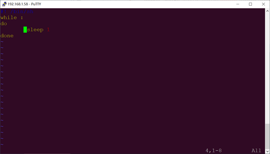

2\. After modification, save and exit, then add execution permission to the script;

```plain
root@OK536:/#chmod +x /autorun.sh
```

3\. Add the following at the end of the /etc/init.d/rcS file:

/autorun.sh \&

Save the changes and exit.

#### 4.22.2 Adding a Startup Script to the Flashing Image

To add a startup script when flashing the image, modifications need to be made in the development environment source code. The operation method is as follows:

1\. Enter the OK536-linux-sdk source code package, and create an autorun.sh file at the path: buildroot/package/auto/forlinx/root.

Content format reference as follows; please modify according to your actual needs:


Use the chmod +x autorun.sh command to add execution permission to the file.

2\. Add the following at the end of the buildroot/package/auto/forlinx/root/etc/init.d/rcS file:

/autorun.sh \&

Save the changes and exit.

3\. Recompile and package

Please refer to the compilation chapter of the “OK536-C\_\_Linux5.10.198+Qt5.15.8 User Compilation Manual” and will not be elaborated here.

### 4.23 A55 Dhrystone Test

Dhrystone is a comprehensive benchmark program designed in 1984 by Reinhold P. Weicker to test CPU (integer) computing performance. Dhrystone does not include floating-point operations. Its output result is the number of times Dhrystone runs per second, i.e., the number of iterations of the main loop per second.

The Dhrystone test program has been successfully ported to the OK536-C platform. You can use the following command to conduct the test.

1\. Set the CPU to high-performance mode

```plain
root@OK536:/# echo performance > /sys/devices/system/cpu/cpu0/cpufreq/scaling_governor
```

2\. Dhrystone test

```plain
root@ OK536:/# echo 50000000 | dhrystone        //运行50000000次Dhrystone测试

Dhrystone Benchmark, Version 2.1 (Language: C)

Program compiled without 'register' attribute

Please give the number of runs through the benchmark: 
Execution starts, 50000000 runs through Dhrystone
Execution ends

Final values of the variables used in the benchmark:

Int_Glob:            5
        should be:   5
Bool_Glob:           1
        should be:   1
Ch_1_Glob:           A
        should be:   A
Ch_2_Glob:           B
        should be:   B
Arr_1_Glob[8]:       7
        should be:   7
Arr_2_Glob[8][7]:    50000010
        should be:   Number_Of_Runs + 10
Ptr_Glob->
  Ptr_Comp:          514008000
        should be:   (implementation-dependent)
  Discr:             0
        should be:   0
  Enum_Comp:         2
        should be:   2
  Int_Comp:          17
        should be:   17
  Str_Comp:          DHRYSTONE PROGRAM, SOME STRING
        should be:   DHRYSTONE PROGRAM, SOME STRING
Next_Ptr_Glob->
  Ptr_Comp:          514008000
        should be:   (implementation-dependent), same as above
  Discr:             0
        should be:   0
  Enum_Comp:         1
        should be:   1
  Int_Comp:          18
        should be:   18
  Str_Comp:          DHRYSTONE PROGRAM, SOME STRING
        should be:   DHRYSTONE PROGRAM, SOME STRING
Int_1_Loc:           5
        should be:   5
Int_2_Loc:           13
        should be:   13
Int_3_Loc:           7
        should be:   7
Enum_Loc:            1
        should be:   1
Str_1_Loc:           DHRYSTONE PROGRAM, 1'ST STRING
        should be:   DHRYSTONE PROGRAM, 1'ST STRING
Str_2_Loc:           DHRYSTONE PROGRAM, 2'ND STRING
        should be:   DHRYSTONE PROGRAM, 2'ND STRING

Microseconds for one run through Dhrystone:    0.1 
Dhrystones per Second:                      9208103.0 
```

### 4.24 View Chip-ID

Input in the serial debugging terminal:

```plain
root@OK536:~# cat /sys/class/sunxi_info/sys_info
[11484.968475] sunxi:sunxi_sidget_soc_ver_regs() +267: Failed to find "soc_id" in dts.
sunxi_platform    : T536
sunxi_secure      : normal
sunxi_serial      : 0c84220b00c6542800002c0000000000
sunxi_chiptype    : 00005100
sunxi_batchno     : 0x19120001
sunxi_soc_ver    : 0x1
```

### 4.25 CAN Test

There are 4 x CANFD, which are led out to the P35 socket.

Using CAN1 and CAN2 as an example, short-circuit the H, L, and GND lines of CAN1 and CAN2 for testing.

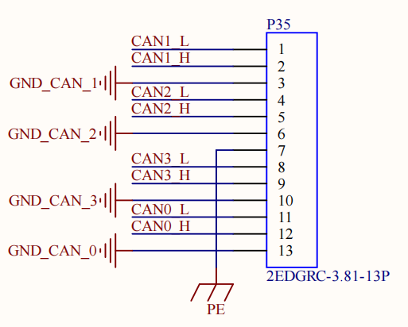

1\. CAN FD Testing

Start CAN FD service.

```plain
root@OK536:~# ip link set can1 down
root@OK536:~# ip link set can2 down
root@OK536:~# ip link set can1 up type can bitrate 500000 sample-point 0.8 dbitrate 2000000 dsample-point 0.75 fd on
[11819.880401] IPv6: ADDRCONF(NETDEV_CHANGE): can1: link becomes ready
root@OK536:~# ip link set can2 up type can bitrate 500000 sample-point 0.8 dbitrate 2000000 dsample-point 0.75 fd on
[11825.354308] IPv6: ADDRCONF(NETDEV_CHANGE): can2: link becomes ready
root@OK536:~# ip link set dev can1 txqueuelen 4096
root@OK536:~# ip link set dev can2 txqueuelen 4096
```

Configure CAN1 for receiving and CAN2 for transmission.

```plain
root@OK536:~# candump -td can1 &
[2] 13067
root@OK536:~# cangen can2
 (000.000000)  can1  7B5   [5]  87 62 BE 22 BB
 (000.200138)  can1  263   [8]  70 79 E5 78 56 2C AF 77
 (000.200083)  can1  2EA   [8]  2C 05 AB 5F C6 31 18 26
 (000.199968)  can1  37E   [2]  C6 C7
 (000.200121)  can1  514   [5]  54 1E A1 7B 46
```

2\. CAN 

Start CAN service.

```plain
root@OK536:~# ip link set can2 down
[12184.278335] here is close.
root@OK536:~# ip link set can1 down
root@OK536:~# ip link set can2 up type can bitrate 1000000
[12191.442280] IPv6: ADDRCONF(NETDEV_CHANGE): can2: link becomes ready
root@OK536:~# ip link set can1 up type can bitrate 1000000
[12195.450213] IPv6: ADDRCONF(NETDEV_CHANGE): can1: link becomes ready
```

Configure CAN2 for receiving and CAN1 for transmission.

```plain
root@OK536:~# candump can2 &
[2] 13271
root@OK536:~# cangen can1
  can2  45D   [8]  0B E7 A6 7A 38 7E E7 4B
  can2  194   [8]  F8 7A BA 0D 5E 6C 1B 7B
  can2  26E   [8]  F2 1F 34 7D 41 1C 83 26
  can2  365   [8]  84 FE A2 06 FD 2A 87 2C
  can2  2F8   [8]  B1 33 39 32 F5 F2 47 53
```

### 4.26 SPI Test

There is a spi4 led out from the development board, which is on the P12 terminal.

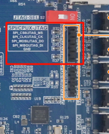

Test by short-circuiting SPI4\_MOSI and SPI4\_MISO.

```plain
root@OK536:~# fltest_spidev_test -D /dev/spidev4.0 
spi mode: 0
bits per word: 8
max speed: 500000 Hz (500 KHz)

FF FF FF FF FF FF 
40 00 00 00 00 95 
FF FF FF FF FF FF 
FF FF FF FF FF FF 
FF FF FF FF FF FF 
DE AD BE EF BA AD 
F0 0D 
```

### 4.27 GPIO Test

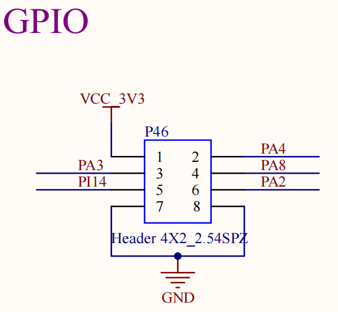

Using PA3 as an example: GPIO number formula: (A-1)\*32 + nr. For PA3, A=1, nr=3, so the number is 3.

1\. Set as Output.

```plain
root@OK536:/# echo 3 > /sys/class/gpio/export 
root@OK536:/# echo out > /sys/class/gpio/gpio3/direction
root@OK536:/# echo 1 > /sys/class/gpio/gpio3/value      //输出高电平
root@OK536:/# echo 0 > /sys/class/gpio/gpio3/value      //输出低电平
root@OK536:/# echo 3 > /sys/class/gpio/unexport 
```

2\. Set as Input.

```plain
root@OK536:/# echo 3 > /sys/class/gpio/export 
root@OK536:/# echo in > /sys/class/gpio/gpio3/direction
root@OK536:/# cat /sys/class/gpio/gpio3/value             //引脚悬空
1        
root@OK536:/# cat /sys/class/gpio/gpio3/value      //短接P46 7脚
0
root@OK536:/# echo 3 > /sys/class/gpio/unexport 
```

### 4.28 USB3.0

USB 3.0 and PCIe on the OK536-C are multiplexed functions and cannot work simultaneously. Function must be switched in the U-Boot menu.

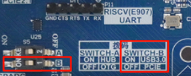

Change the carrier board DIP switch to select USB3.0.

After powering on the board, press the spacebar to enter the U-Boot menu.

Press 3 to cycle between “PCIE” and “USB3”. Select “USB3”.

Then press 1 to reboot and test the USB 3.0 function.

Testing method: Refer to section 4.11 (USB 2.0).

```plain
---------------------------------------------
0: Exit to console
1: Save and Reboot
2: Display Type: lvds 1280x800
3: USB3.0 or PCIE: USB3
---------------------------------------------
```


**Note: The current OK536-C USB 3.0 may have occasional USB reset issues when a device is connected.**

### 4.29 PCIE

USB 3.0 and PCIe on the OK536-C are multiplexed functions and cannot work simultaneously. Function must be switched in the U-Boot menu.

Change the carrier board function switch to select PCIE.

After powering on the board, press the spacebar to enter the U-Boot menu.

Press 3 to cycle between “PCIE” and “USB3”. Select “PCIE”.

Then press 1 to reboot and test the PCIe function.

```plain
---------------------------------------------
0: Exit to console
1: Save and Reboot
2: Display Type: lvds 1280x800
3: USB3.0 or PCIE: USB3
---------------------------------------------
```


Test using an RTL8111H network card.

```plain
root@OK536:/# lspci             //View pcie devices
01:00.0 Class 0200: 10ec:8168    //RTL8111H NIC
00:00.0 Class 0604: 1f6d:abcd
root@OK536:~# ifconfig enp1s0 up 172.20.0.121     //Set ip
[   29.056853] Generic FE-GE Realtek PHY r8169-0-100:00: attached PHY driver [Generic FE-GE Realtek PHY] (mii_bus:phy_addr=r8169-0-100:00, irq=IGNORE)
[   29.176996] r8169 0000:01:00.0 enp1s0: Link is Down
[   32.567776] r8169 0000:01:00.0 enp1s0: Link is Up - 1Gbps/Full - flow control rx/tx
[   32.576390] IPv6: ADDRCONF(NETDEV_CHANGE): enp1s0: link becomes ready
root@OK536:~# iperf3 -c 172.20.0.21     //Test the upload speed
Connecting to host 172.20.0.21, port 5201
[  5] local 172.20.0.121 port 42398 connected to 172.20.0.21 port 5201
[ ID] Interval           Transfer     Bitrate         Retr  Cwnd
[  5]   0.00-1.00   sec   114 MBytes   953 Mbits/sec    0    515 KBytes       
[  5]   1.00-2.00   sec   110 MBytes   922 Mbits/sec    0    515 KBytes       
[  5]   2.00-3.00   sec   111 MBytes   927 Mbits/sec    0    515 KBytes       
[  5]   3.00-4.00   sec   111 MBytes   935 Mbits/sec    0    515 KBytes       
[  5]   4.00-5.00   sec   112 MBytes   938 Mbits/sec    0    515 KBytes       
[  5]   5.00-6.00   sec   111 MBytes   927 Mbits/sec    0    515 KBytes       
[  5]   6.00-7.00   sec   111 MBytes   932 Mbits/sec    0    515 KBytes       
[  5]   7.00-8.00   sec   111 MBytes   929 Mbits/sec    0    515 KBytes       
[  5]   8.00-9.00   sec   112 MBytes   941 Mbits/sec    0    515 KBytes       
[  5]   9.00-10.00  sec   111 MBytes   930 Mbits/sec    0    515 KBytes       
- - - - - - - - - - - - - - - - - - - - - - - - -
[ ID] Interval           Transfer     Bitrate         Retr
[  5]   0.00-10.00  sec  1.09 GBytes   933 Mbits/sec    0             sender
[  5]   0.00-10.00  sec  1.08 GBytes   932 Mbits/sec                  receiver

iperf Done.
root@OK536:~# iperf3 -c 172.20.0.21 -R    //Test the download speed
Connecting to host 172.20.0.21, port 5201
Reverse mode, remote host 172.20.0.21 is sending
[  5] local 172.20.0.121 port 51934 connected to 172.20.0.21 port 5201
[ ID] Interval           Transfer     Bitrate
[  5]   0.00-1.00   sec   112 MBytes   941 Mbits/sec                  
[  5]   1.00-2.00   sec   112 MBytes   941 Mbits/sec                  
[  5]   2.00-3.00   sec   112 MBytes   941 Mbits/sec                  
[  5]   3.00-4.00   sec   112 MBytes   942 Mbits/sec                  
[  5]   4.00-5.00   sec   111 MBytes   928 Mbits/sec                  
[  5]   5.00-6.00   sec   112 MBytes   941 Mbits/sec                  
[  5]   6.00-7.00   sec   112 MBytes   941 Mbits/sec                  
[  5]   7.00-8.00   sec   112 MBytes   942 Mbits/sec                  
[  5]   8.00-9.00   sec   112 MBytes   941 Mbits/sec                  
[  5]   9.00-10.00  sec   112 MBytes   941 Mbits/sec                  
- - - - - - - - - - - - - - - - - - - - - - - - -
[ ID] Interval           Transfer     Bitrate
[  5]   0.00-10.00  sec  1.10 GBytes   944 Mbits/sec                  sender
[  5]   0.00-10.00  sec  1.09 GBytes   940 Mbits/sec                  receiver

iperf Done.
```

### 4.30 IR-RX

The OK536-C supports infrared receiving.

```plain
root@OK536:~# evtest
No device specified, trying to scan all of /dev/input/event*
Available devices:
/dev/input/event0:      sunxi-keyboard
/dev/input/event1:      sunxi_ir_recv
/dev/input/event2:      sunxi-gpadc1/channel7/input0
/dev/input/event3:      sunxi-gpadc1/channel8/input0
/dev/input/event4:      sunxi-gpadc1/channel9/input0
/dev/input/event5:      sunxi-gpadc2/channel0/input0
/dev/input/event6:      sunxi-gpadc2/channel1/input0
/dev/input/event7:      sunxi-gpadc2/channel2/input0
/dev/input/event8:      sunxi-gpadc2/channel3/input0
/dev/input/event9:      sunxi-gpadc2/channel4/input0
/dev/input/event10:     sunxi-gpadc2/channel5/input0
/dev/input/event11:     sunxi-gpadc2/channel6/input0
/dev/input/event12:     sunxi-gpadc2/channel7/input0
/dev/input/event13:     sunxi-gpadc2/channel8/input0
/dev/input/event14:     sunxi-gpadc2/channel9/input0
/dev/input/event15:     sunxi-gpadc3/channel0/input0
/dev/input/event16:     sunxi-rtp
/dev/input/event17:     axp2202-pek
/dev/input/event18:     goodix-ts
/dev/input/event19:     user-key
Select the device event number [0-19]: 1
Input driver version is 1.0.1
Input device ID: bus 0x19 vendor 0x1 product 0x1 version 0x100
Input device name: "sunxi_ir_recv"
Supported events:
  Event type 0 (EV_SYN)
  Event type 1 (EV_KEY)
    Event code 14 (KEY_BACKSPACE)
    Event code 15 (KEY_TAB)
    Event code 52 (KEY_DOT)
    Event code 83 (KEY_KPDOT)
    Event code 102 (KEY_HOME)
    Event code 103 (KEY_UP)
    Event code 105 (KEY_LEFT)
    Event code 106 (KEY_RIGHT)
    Event code 108 (KEY_DOWN)
    Event code 113 (KEY_MUTE)
    Event code 114 (KEY_VOLUMEDOWN)
    Event code 115 (KEY_VOLUMEUP)
    Event code 116 (KEY_POWER)
    Event code 119 (KEY_PAUSE)
    Event code 128 (KEY_STOP)
    Event code 139 (KEY_MENU)
    Event code 141 (KEY_SETUP)
    Event code 158 (KEY_BACK)
    Event code 163 (KEY_NEXTSONG)
    Event code 164 (KEY_PLAYPAUSE)
    Event code 165 (KEY_PREVIOUSSONG)
    Event code 166 (KEY_STOPCD)
    Event code 168 (KEY_REWIND)
    Event code 207 (KEY_PLAY)
    Event code 208 (KEY_FASTFORWARD)
    Event code 256 (BTN_0)
    Event code 352 (KEY_OK)
    Event code 365 (KEY_EPG)
    Event code 377 (KEY_TV)
    Event code 402 (KEY_CHANNELUP)
    Event code 403 (KEY_CHANNELDOWN)
    Event code 407 (KEY_NEXT)
    Event code 412 (KEY_PREVIOUS)
    Event code 512 (KEY_NUMERIC_0)
    Event code 513 (KEY_NUMERIC_1)
    Event code 514 (KEY_NUMERIC_2)
    Event code 515 (KEY_NUMERIC_3)
    Event code 516 (KEY_NUMERIC_4)
    Event code 517 (KEY_NUMERIC_5)
    Event code 518 (KEY_NUMERIC_6)
    Event code 519 (KEY_NUMERIC_7)
    Event code 520 (KEY_NUMERIC_8)
    Event code 521 (KEY_NUMERIC_9)
    Event code 717 (BTN_TRIGGER_HAPPY14)
    Event code 719 (BTN_TRIGGER_HAPPY16)
    Event code 721 (BTN_TRIGGER_HAPPY18)
  Event type 2 (EV_REL)
    Event code 0 (REL_X)
    Event code 1 (REL_Y)
  Event type 4 (EV_MSC)
    Event code 4 (MSC_SCAN)
Key repeat handling:
  Repeat type 20 (EV_REP)
    Repeat code 0 (REP_DELAY)
      Value    500
    Repeat code 1 (REP_PERIOD)
      Value    125
Properties:
  Property type 5 (INPUT_PROP_POINTING_STICK)
Testing ... (interrupt to exit)
[   36.952977] rc rc0: two consecutive events of type space
[   38.085103] axp2202-aldo1: disabling
[   38.089254] axp2202-cldo4: disabling
[   38.093520] axp2202-vmid: disabling
Event: time 38.308037, type 4 (EV_MSC), code 4 (MSC_SCAN), value 4000
Event: time 38.308037, -------------- SYN_REPORT ------------
Event: time 38.359790, type 4 (EV_MSC), code 4 (MSC_SCAN), value 4000
Event: time 38.359790, -------------- SYN_REPORT ------------
Event: time 38.882984, type 4 (EV_MSC), code 4 (MSC_SCAN), value 4045
Event: time 38.882984, -------------- SYN_REPORT ------------
Event: time 38.934743, type 4 (EV_MSC), code 4 (MSC_SCAN), value 4045
Event: time 38.934743, -------------- SYN_REPORT ------------
Event: time 39.267956, type 4 (EV_MSC), code 4 (MSC_SCAN), value 4007
Event: time 39.267956, -------------- SYN_REPORT ------------
Event: time 39.319735, type 4 (EV_MSC), code 4 (MSC_SCAN), value 4007
```

### 4.31 Bluetooth Testing

The OK536-C carrier board AW-CM358 module integrates Bluetooth. This section demonstrates file transfer between a mobile phone/PC and the development board via Bluetooth.

Bluetooth Configuration

```plain
root@OK536:/# bluetoothctl                             // Open the BlueZ Bluetooth utility
Agent registered
[CHG] Controller E8:FB:1C:66:FA:A6 Pairable: yes
[bluetooth]# power on          // Enable/Power on the Bluetooth adapter
[CHG] Controller E8:FB:1C:66:FA:A6 Class: 0x00100000
Changing power on succeeded
[CHG] Controller E8:FB:1C:66:FA:A6 Powered: yes
[bluetooth]# pairable on       // Set to pairable mode
Changing pairable on succeeded
[bluetooth]# discoverable on   // Set to discoverable mode
Changing discoverable on succeeded
[CHG] Controller E8:FB:1C:66:FA:A6 Discoverable: yes
[bluetooth]# agent on        // Enable the agent
Agent is already registered
[bluetooth]# default-agent    // Set the current agent as the default agent
Default agent request successful
[bluetooth]#
```

1\. Board Passive Pairing (Standard pairing process).

After the above settings, open your computer and search for Bluetooth. Click "Add Bluetooth or Other Devices", and a device named "OKT536" will appear. Click on this Bluetooth to attempt pairing,

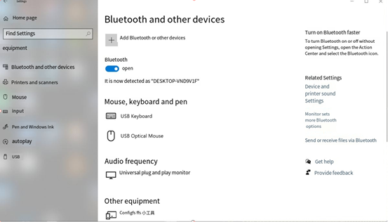

The print information on the development board is as follows. Enter "yes":

```plain
[CHG] Device 2C:DB:07:C7:4F:F6 Connected: yes
Request confirmation
[agent] Confirm passkey 153732 (yes/no): yes
```

2\. View and remove connected devices:

```plain
[bluetooth]# devices                                           //View connected Bluetooth device
Device 2C:DB:07:C7:4F:F6 DESKTOP-VND9V1F
[bluetooth]# remove 2C:DB:07:C7:4F:F6                         //Remove the device
[DEL] Device 2C:DB:07:C7:4F:F6 DESKTOP-VND9V1F
Device has been removed
```

3\. Active pairing of development board

In addition to passive pairing, it is also possible to send an active pairing request from the development board terminal.

```plain
[bluetooth]# scan on        //Turn on scanning
Discovery started
[CHG] Controller E8:FB:1C:66:FA:A6 Discovering: yes
[NEW] Device 7B:01:59:ED:69:50 7B-01-59-ED-69-50
[NEW] Device 7C:71:13:5F:A3:8F 7C-71-13-5F-A3-8F
[NEW] Device 14:16:9E:62:39:BD zzy 
[NEW] Device 2C:DB:07:C7:4F:F6 DESKTOP-VND9V1F  //Locate the device to pair
[CHG] Device 14:16:9E:62:39:BD RSSI: -74
[bluetooth]# scan off        //Turn off the scanning 
Discovery stopped
[CHG] Device 2C:DB:07:C7:4F:F6 TxPower is nil
[CHG] Device 2C:DB:07:C7:4F:F6 RSSI is nil
[CHG] Device 14:16:9E:62:39:BD RSSI is nil
[CHG] Device 7C:71:13:5F:A3:8F TxPower is nil
[CHG] Device 7C:71:13:5F:A3:8F RSSI is nil
[CHG] Device 7B:01:59:ED:69:50 RSSI is nil
[CHG] Controller E8:FB:1C:66:FA:A6 Discovering: no
[bluetooth]# pair 2C:DB:07:C7:4F:F6        //与指定设备配对
Attempting to pair with 14:16:9E:62:39:BD
[CHG] Device 14:16:9E:62:39:BD Connected: yes
Request confirmation
[agent] Confirm passkey 807166 (yes/no): yes        //确认密钥
[CHG] Device 14:16:9E:62:39:BD Modalias: bluetooth:v000Fp1200d1436
[CHG] Device 14:16:9E:62:39:BD UUIDs: 00001105-0000-1000-8000-00805f9b34fb
......
[CHG] Device 14:16:9E:62:39:BD UUIDs: fa88c0d0-afac-11de-8a99-0800200c9a67
[CHG] Device 14:16:9E:62:39:BD ServicesResolved: yes
[CHG] Device 14:16:9E:62:39:BD Paired: yes
Pairing successful
[CHG] Device 14:16:9E:62:39:BD ServicesResolved: no
[CHG] Device 14:16:9E:62:39:BD Connected: no
[bluetooth]# 
```

At the same time, a pairing request appears on the computer interface. Click "pairing", and enter "yes" on the board to confirm. The pairing is successful.

4\. Development board receives files

After successful pairing, on the computer side, you can use Bluetooth to send files to the board side.

Click "Send or receive files via Bluetooth".


Select OKT536.

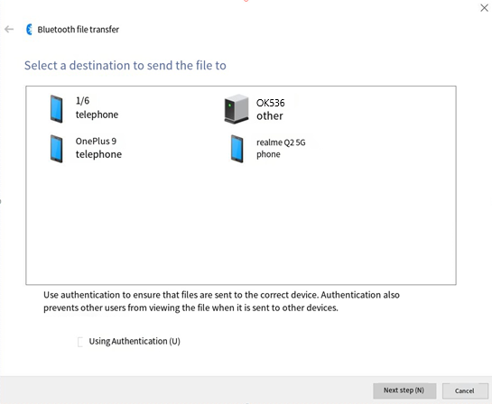

Select the file to send.

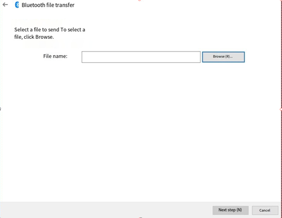

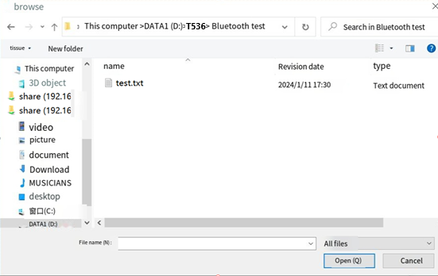

Waiting for sending to complete.

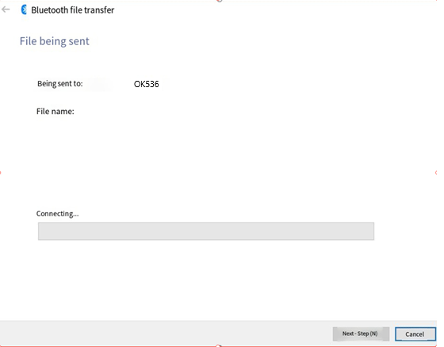

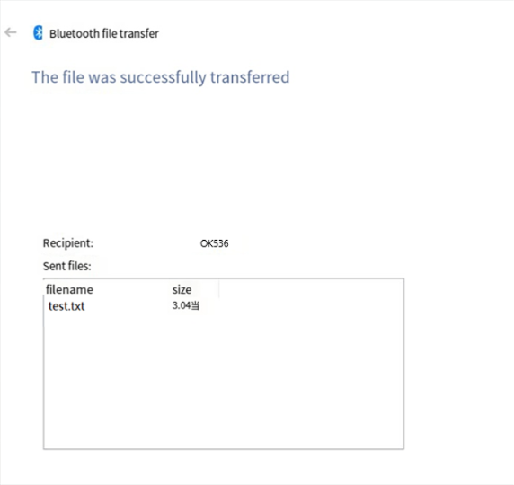

The received file is saved in the /tmp directory.

5\. Send files from the development board

Similarly, you can use the development board to send files to the computer. The test method is as follows:

Select "Receive File" on the computer side.

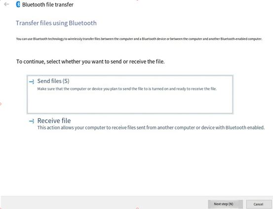

```plain
root@OK536:~# bluetoothctl 
Agent registered
[CHG] Controller E8:FB:1C:66:FA:A6 Pairable: yes
[bluetooth]# paired-devices        //View paired device
Device 2C:DB:07:C7:4F:F6 DESKTOP-VND9V1F
[bluetooth]# exit
root@OK536:~# fltest_obexctl.sh
[NEW] Client /org/bluez/obex 
[obex]# connect   2C:DB:07:C7:4F:F6     //Link the specified device
Attempting to connect to 2C:DB:07:C7:4F:F6
[NEW] Session /org/bluez/obex/client/session0 [default]
[NEW] ObjectPush /org/bluez/obex/client/session0 
Connection successful
[2C:DB:07:C7:4F:F6]# send /run/media/mmcblk0p1/bootlogo.bmp  //Send the file
Attempting to send /run/media/mmcblk0p1/bootlogo.bmp to /org/bluez/obex/client/session0
[NEW] Transfer /org/bluez/obex/client/session0/transfer0 
Transfer /org/bluez/obex/client/session0/transfer0
Status: queued
Name: bootlogo.bmp
Size: 1339239
Filename: /run/media/mmcblk0p1/bootlogo.bmp
Session: /org/bluez/obex/client/session0
[CHG] Transfer /org/bluez/obex/client/session0/transfer0 Status: active
[CHG] Transfer /org/bluez/obex/client/session0/transfer0 Transferred: 65433 (@65KB/s 00:19)
[CHG] Transfer /org/bluez/obex/client/session0/transfer0 Transferred: 130961 (@65KB/s 00:18)
.....
[CHG] Transfer /org/bluez/obex/client/session0/transfer0 Status: complete
[DEL] Transfer /org/bluez/obex/client/session0/transfer0 
[2C:DB:07:C7:4F:F6]# exit 
```

The computer will receive the incoming file request for file transfer.

### 4.32 NPU Test

The OK536N-C is integrated with the 2Tops NPU.

The NPU test routines are located as follows:

```plain
root@OK536:# cd /etc/npu/yolov5
root@OK536:/etc/npu/yolov5# ls
input_data  model  yolov5
```

Perform the NPU test:

```plain
root@OK536:/etc/npu/yolov5# ./yolov5 model/yolov5.nb input_data/dog.jpg 
./yolov5 nbg input
VIPLite driver software version 2.0.3.2-AW-2024-08-30
viplite init OK.
VIPLite driver version=0x00020003...
VIP cid=0x1000003b, device_count=1
* device[0] core_count=1
awnn_init total: 3.73 ms.
  vip_create_network model/yolov5.nb: 26.16 ms.
input 0 dim 640 640 3 1, data_format=2, name=input[0], elements=16846849, scale=0.003922, zero_point=0
create input buffer 0: 1228800
output 0 dim 85 80 80 3 1, data_format=0, name=uid_5_out_0ub_uid_1_out_0, elements=1632000, none-quant
create output buffer 0: 6528000
output 1 dim 85 40 40 3 1, data_format=0, name=uid_4_out_0ub_uid_1_out_0, elements=408000, none-quant
create output buffer 1: 1632000
output 2 dim 85 20 20 3 1, data_format=0, name=uid_3_out_0ub_uid_1_out_0, elements=102000, none-quant
create output buffer 2: 408000
memory pool size=8161024 bytes
  load_param model/yolov5.nb: 6.76 ms.
  prepare network model/yolov5.nb: 5.57 ms.
  set network io model/yolov5.nb: 0.01 ms.
awnn_create total: 38.60 ms.
yolov5_preprocess.cpp run. 
memcpy(0x7f82dce000, 0x7f8147b010, 1228800)  load_input_data: 0.97 ms.
  vip_flush_buffer input: 0.07 ms.
awnn_set_input_buffers total: 1.13 ms.
  vip_run_network: 29.75 ms.
  vip_flush_buffer output: 0.01 ms.
    fp32 6528000 memcpy: 71.26 ms.
    fp32 1632000 memcpy: 17.75 ms.
    fp32 408000 memcpy: 4.48 ms.
  tensor to fp: 93.66 ms.
awnn_run total: 123.48 ms.
yolov5_postprocess.cpp run. 
detection num: 3
16:  87%, [ 132,  216,  306,  552], dog
 7:  59%, [ 471,   78,  694,  171], truck
 1:  53%, [ 161,  131,  563,  423], bicycle
awnn_destroy total: 7.53 ms.
awnn_uninit total: 0.55 ms.
```

Test picture:


Output picture:

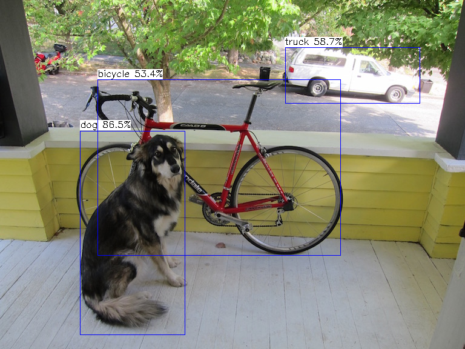

### 4.33 G2D Test

```plain
g2d test version:V2.1.20220906
================Usage================
g2d_test 1        means: 1*2560x1440 nv21 decompose to 4*720p nv21
g2d_test 2        means: 4*720 nv21 compose to 1*2560x1440 nv21
g2d_test 3        means: 1280x720 nv21 rotate to 720x1280 nv21
g2d_test 4        means: 1024x600 nv21 horizontal flips
g2d_test 5        means: 1024x600 nv21 vertical flips
================usage================
```

Picture rotation is demonstrated here. The program reads/forlinx/g2d \_ test/1280x720 \_ nv21.yuv and outputs it to/tmp/720x1280 \_ rotate \_ 90/720x1280 \_ rotate \_ 90.yuv after rotation. 

```plain
root@OK536:~# fltest_g2dtest 3
g2d test version:V2.1.20220906
01-01 00:07:51.373 g2d_test(D) : arc=2, testid=3
01-01 00:07:51.374 suxiMemInterface(D) : sdk_memory version:V2.1.20220906
DEBUG  : ionAlloc <__GetIonMemOpsS:866>: *** get __GetIonMemOpsS ***
DEBUG  : cedarc <VeInitialize:1587>: ve init
DEBUG  : cedarc <veEnvInit:110>: VeContext 0x55ab7430e0, encoder 0, decodec 1
INFO   : cedarc <veEnvInit:138>: open /dev/cedar_dev fd = 3
DEBUG  : cedarc <veEnvInit:149>: get ve_reg_addr = 0x7f99226000
DEBUG  : cedarc <veEnvGetIcVersion:260>: ** address_macc 0x7f99226000 ve_top_offset = 0x800
DEBUG  : cedarc <veEnvGetIcVersion:318>: *** ic_version = 0x1001000021322
DEBUG  : cedarc <checkFeatureSupport:1412>: bEnableVcuFuncFlag = 0, nEncoderFlag = 0
DEBUG  : cedarc <VeInitialize:1640>: address_macc = 0x7f99226000, address_vetop = 0x7f99226800
DEBUG  : cedarc <getSocInfo:1205>: not exist SocInfo plugin, use SocInfo node
DEBUG  : cedarc <getSocInfo:1293>: ve_default_freq = 0
INFO   : cedarc <VeInitialize:1643>: *** ic_version = 0x1001000021322,
DEBUG  : cedarc <VeInitialize:1683>: *** nPhyOffset = 0x0
DEBUG  : ionAlloc <ion_create_context:172>: pid: 950, g_context = 0x55ab743280
DEBUG  : cedarc <CdcIonOpen:302>: open ion, file_name = /dev/dma_heap/system
DEBUG  : ionAlloc <ion_alloc_palloc_base:382>: ion alloc fd:4 size:1382400 heap:1, falgs:3
DEBUG  : ionAlloc <ion_alloc_palloc_base:426>: alloc succeed, addr_phy: 0xfee00000, addr_vir: 0x7f98b84000, size: 1382400 dma_buf_fd 5
01-01 00:07:51.376 g2d_test(D) : fopen /forlinx/g2d_test/1280x720_nv21.yuv OK 
01-01 00:07:51.385 g2d_test(D) : alloc m_DispMemOps0.ion_buffer.fd_data.aw_fd=5
DEBUG  : ionAlloc <__GetIonMemOpsS:866>: *** get __GetIonMemOpsS ***
DEBUG  : ionAlloc <ion_alloc_open:233>: ion context already create, ref_count:2
DEBUG  : ionAlloc <ion_alloc_palloc_base:382>: ion alloc fd:4 size:1382400 heap:1, falgs:3
DEBUG  : ionAlloc <ion_alloc_palloc_base:426>: alloc succeed, addr_phy: 0xfec00000, addr_vir: 0x7f98a32000, size: 1382400 dma_buf_fd 6
01-01 00:07:51.387 g2d_test(D) : alloc m_DispMemOps.ion_buffer.fd_data.aw_fd=6
01-01 00:07:51.387 (D) : libsdk_g2d version:V2.2.20240304
01-01 00:07:51.387 g2d_test(D) : ================== start yuv rotate =============
01-01 00:07:51.389 g2d_test(D) : g2d rotate ret:0, use time =1732 us
01-01 00:07:51.389 g2d_test(D) : WritePicFileContent size=1382400 
01-01 00:07:51.389 g2d_test(D) : fopen /tmp/720x1280_rotate_90.yuv OK 
```

Before rotation:


After rotation:


### 4.34 Sleep Wakeup

Enter freeze or mem into/sys/power/state to sleep.

```plain
root@OK536:~# echo mem > /sys/power/state
[   29.353999] PM: suspend entry (deep)
[   29.360218] Filesystems sync: 0.002 seconds
[   29.366075] Freezing user space processes ... (elapsed 0.001 seconds) done.
[   29.375262] OOM killer disabled.
[   29.378906] Freezing remaining freezable tasks ... (elapsed 0.001 seconds) done.
[   29.388421] printk: Suspending console(s) (use no_console_suspend to debug)
```

Press pwron to wake up.

```plain
[   29.397451] rtc-rx8010 5-0032: Frequency stop detected
[   29.398917] dwmac-sunxi 4510000.ethernet eth1: Link is Down
[   29.400480] dwmac-sunxi 4510000.ethernet eth1: Link is Up - 1Gbps/Full - flow control rx/tx
[   29.400503] dwmac-sunxi 4510000.ethernet eth1: Link is Down
[   29.400598] sunxi:stmmac-4510000.ethernet:[INFO]: suspend finish 0
[   29.401732] dwmac-sunxi 4500000.ethernet eth0: Link is Down
[   29.403244] dwmac-sunxi 4500000.ethernet eth0: Link is Up - 1Gbps/Full - flow control rx/tx
[   29.403264] dwmac-sunxi 4500000.ethernet eth0: Link is Down
[   29.403356] sunxi:stmmac-4500000.ethernet:[INFO]: suspend finish 0
......
[   33.099183] sunxi:sunxi_mmc_host-4020000.sdmmc:[INFO]: [12-48|37] 
[   33.105891] sunxi:sunxi_mmc_host-4020000.sdmmc:[INFO]: [52-63|12] 
[   33.112831] sunxi:sunxi_mmc_host-4020000.sdmmc:[INFO]: 
[   33.125654] sunxi:sunxi_mmc_host-4020000.sdmmc:[INFO]: tuning result: 12 - 48,  best: 30
[   33.908372] dwmac-sunxi 4510000.ethernet eth1: Link is Up - 1Gbps/Full - flow control rx/tx
[   36.821798] axp2202-aldo1: disabling
[   36.825982] axp2202-cldo4: disabling
[   36.830292] axp2202-vmid: disabling
```

## 5\. OK536 Platform Multimedia Testing

### 5.1 OV5645 / OV13855 Capture Testing

**Note: Before testing, refer to the “Closing Desktop” section to stop the desktop program and clear the screen.**

There are 3 x MIPI CSI interfaces on the development board located in P44, appearing as /dev/video0, /dev/video4, /dev/video8.

1\. Capture Test:

```plain
root@OK536:~# csi_test_usrptr 
csi_test_usrptr version:V2.1.20220922
==========================Usage==========================
csi_test_usrptr <videoX> <sel> <width> <height> <path> <format_mode> <test_cnt> <fps>
videoX          means: open /dev/videoX
sel             means: select subdev-X
width           means: camera capture pic width
height          means: camera capture pic height
path            means: camera capture save file path, default "/tmp/tvd_test/"
format_mode     means: camera capture pic format, default 4(NV21)
test_cnt        means: camera capture pic count, default 20
fps             means: camera capture fps, default 30
==========================Usage==========================

root@OK536:~# csi_test_usrptr 0 0 1920 1080 ./ 4 30 30    //ov13855
csi_test_usrptr version:V2.1.202[  210.591405] sunxi:VE:[INFO]: 615 enable_cedar_hw_clk(): 
20922
......
mode 4 test done at the 0 time!!
time cost 1.179137(s)
01-01 00:03:31.546 hwdisplay2(E) : aut_hwd_layer_close fail to set layer config

root@OK536:~# csi_test_usrptr 4 0 1920 1080 ./ 4 30 30    //ov5645
csi_test_usrptr version:V2.1.202[  210.591405] sunxi:VE:[INFO]: 615 enable_cedar_hw_clk(): 
20922
......
mode 4 test done at the 0 time!!
time cost 1.179137(s)
01-01 00:03:31.546 hwdisplay2(E) : aut_hwd_layer_close fail to set layer config

root@OK536:~# csi_test_usrptr 8 0 1920 1080 ./ 4 30 30    //ov5645
csi_test_usrptr version:V2.1.202[  210.591405] sunxi:VE:[INFO]: 615 enable_cedar_hw_clk(): 
20922
......
mode 4 test done at the 0 time!!
time cost 1.179137(s)
01-01 00:03:31.546 hwdisplay2(E) : aut_hwd_layer_close fail to set layer config
```

The generated .yuv file can be copied to a PC and played using 3-Tools/YUV Player.exe.

**Note: Command-line preview is not supported in the current version; recording dynamic video may show stripes.**

### 5.2 USB Camera Test

```plain
root@OK536:~# usbcam_test -v 1 -s 0 -w 1280 -h 720 -o ./ -m 1 -n 30 -f 25
05-17 00:40:23.276 usbcam_test(D) : usbcam test version:V2.1.20230905
05-17 00:40:23.345 usbcam_test(D) : open /dev/video1 fd = 3
05-17 00:40:23.345 usbcam_test(I) : mCameraType = CAMERA_TYPE_UVC
05-17 00:40:23.345 usbcam_test(D) : format index = 0, name = Input 1
05-17 00:40:23.345 usbcam_test(D) : input is 1
05-17 00:40:23.346 usbcam_test(D) : format index = 0, name = Motion-JPEG, v4l2 pixel format = 47504a4d
05-17 00:40:23.346 usbcam_test(D) : format index = 1, name = YUYV 4:2:2, v4l2 pixel format = 56595559
05-17 00:40:23.346 usbcam_test(D) :  pixel format is 56595559
05-17 00:40:23.347 usbcam_test(D) : resolution got from sensor = 1280*720 num_planes = 0
05-17 00:40:23.352 usbcam_test(D) : buf.length = 1843200 offset 0
05-17 00:40:23.352 usbcam_test(D) : buf.length = 1843200 offset 1843200
05-17 00:40:23.353 usbcam_test(D) : buf.length = 1843200 offset 3686400
05-17 00:40:23.353 usbcam_test(D) : buf.length = 1843200 offset 5529600
05-17 00:40:23.353 usbcam_test(D) : buf.length = 1843200 offset 7372800
05-17 00:40:23.354 usbcam_test(D) : buf.length = 1843200 offset 9216000
05-17 00:40:23.354 usbcam_test(D) : buf.length = 1843200 offset 11059200
05-17 00:40:23.354 usbcam_test(D) : buf.length = 1843200 offset 12902400
05-17 00:40:23.355 usbcam_test(I) : VIDIOC_STREAMON ok
05-17 00:40:27.096 usbcam_test(I) : VIDIOC_STREAMOFF ok
05-17 00:40:27.098 usbcam_test(I) : mode 1 test done!!
05-17 00:40:27.103 usbcam_test(I) : time cost 3.825923(s)
```

Copy the output fb1\_y1\_1280\_720.bin to a PC and preview with YUVP layer.exe.

### 5.3 Video Encoding

```plain
root@OK536:~# encoder_test -i /forlinx/video/video_800x480.yuv -f 0 -p 1 -o ./test.h264  -sw 800 -sh 480 -30
05-16 23:46:13.587 encoder_test(D) : encoderTest version:V2.1.20220920
05-16 23:46:13.587 encoder_test(D) :  get input file: /forlinx/video/video_800x480.yuv 
05-16 23:46:13.587 encoder_test(D) :  get output file: ./test.h264 
05-16 23:46:13.587 encoder_test(D) :  get srcW: 800p 
05-16 23:46:13.587 encoder_test(D) :  get srcH: 480p 
05-16 23:46:13.587 encoder_test(D) : unknowed argument :  -30
05-16 23:46:13.587 encoder_test(D) :             ================================
05-16 23:46:13.587 encoder_test(D) :             ====     CedarC  Encoder    ====
05-16 23:46:13.587 encoder_test(D) :             ====    singleDecoderTest    ====
05-16 23:46:13.587 encoder_test(D) :             ================================
05-16 23:46:13.587 encoder_test(D) :     -s:800x480
05-16 23:46:13.588 encoder_test(D) :     -n:1
05-16 23:46:13.588 encoder_test(D) :     -f:0
05-16 23:46:13.588 encoder_test(D) :     -p:1
05-16 23:46:13.588 encoder_test(D) :     -r:30
05-16 23:46:13.588 encoder_test(D) :     -d:800x480
......
05-16 23:46:14.256 encoder_test(D) :     -s:800x480
05-16 23:46:14.256 encoder_test(D) :     -n:1
05-16 23:46:14.256 encoder_test(D) :     -f:0
05-16 23:46:14.256 encoder_test(D) :     -p:1
05-16 23:46:14.256 encoder_test(D) :     -r:30
05-16 23:46:14.256 encoder_test(D) :     -d:800x480
05-16 23:46:14.256 encoder_test(I) : output file is saved:./test.h264
05-16 23:46:14.256 encoder_test(D) : Test 1 times.
```

Copy test.h264 to a PC for playback.

### 5.4 Video Decoding

```plain
root@OK536:~# gst-launch-1.0 filesrc location=/forlinx/pic/pic_1920x1080.jpg ! jpegparse ! jpegdec ! videoconvert ! video/x-raw,format=NV21,width=1920,height=1080 ! filesink location=output_nv21.yuv

Setting pipeline to PAUSED ...
Pipeline is PREROLLING ...
Pipeline is PREROLLED ...
Setting pipeline to PLAYING ...
Redistribute latency...
New clock: GstSystemClock
Got EOS from element "pipeline0".
Execution ended after 0:00:00.011975417
Setting pipeline to NULL ...
Freeing pipeline ...
```

 Copy output\_nv21.yuv to a PC and preview with YUVP layer.exe.

## 6\. Flashing the System

The OK536-C development board currently supports flashing via OTG and TF Card. The corresponding programming tool is provided in the user profile, and you can choose any one of the methods for image programming.

### 6.1 Required Images

Image Path: 2-Images and Source Code\\Mirror Files

| **Image**| **Description**|
|----------|----------|
| t536\_linux\_OKT536-C\_uart0.img| Default factory image for eMMC.|

### 6.2 OTG Flashing

#### 6.2.1 Flashing Tool Installation

1 Tool Path: 3-Tools\\PhoenixSuit\_v1.13.zip

Unzip PhoenixSuit\_v1.13.zip. Connect the board to the PC via a Type-C cable.

Important: Set the function switch to OTG mode.

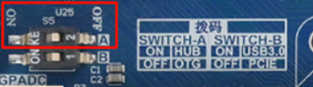

Connect the board’s USB0 to the host PC via a Type-C cable.

Press and hold the FEL button. While holding FEL, press and release the RESET button. Wait about 2 seconds, then release the FEL button.

**Note: Release RESET first, wait, then release FEL.**

Open the Windows Device Manager and you will find an unknown device with a yellow exclamation mark. Select "Manually install driver", right-click on the unknown device, and choose "Update driver"

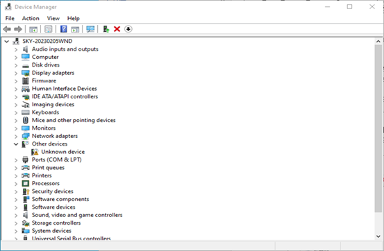

After selecting "Browse my computer to find the driver", choose the unzipped PhoenixSuit\_v1.13 directory.


After driver installation, run PhoenixSuit.exe. The bottom-left should show “Device connected successfully”.

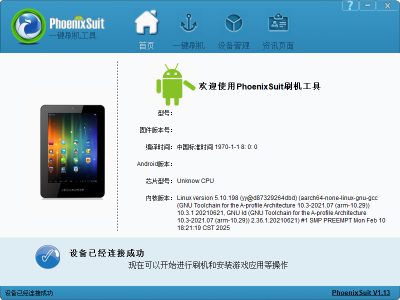

#### 6.2.2 OTG Flashing Methods

1\. Complete OTG Flashing

**Note: Do NOT interrupt flashing (power off, disconnect OTG, etc.), as this may brick the board. Recovery requires making a TF recovery card (see 6.3.1). For recovery methods, refer to the section "6.3.1 Making TF Programming Card".**

This programming method will program the entire img image.

In the following interface, click "One-click Flash" and then click "Browse" to select the firmware image file.

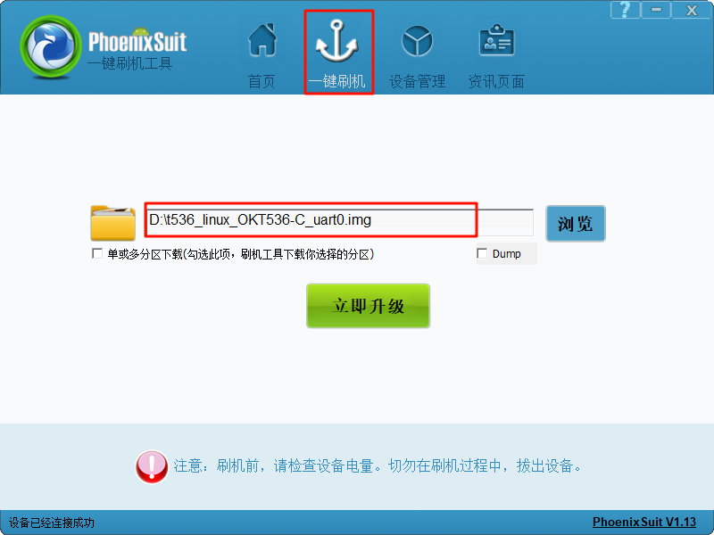

Connect the USB0 of the development board to the host using a Type-A to Type-C cable. Do not power on the board initially. Press the FEL button and then power on the board. Release the FEL button.

**Note: Make sure to press the FEL button when the power is off.**

In the following interface, click "Yes" to enter the formatting upgrade mode:

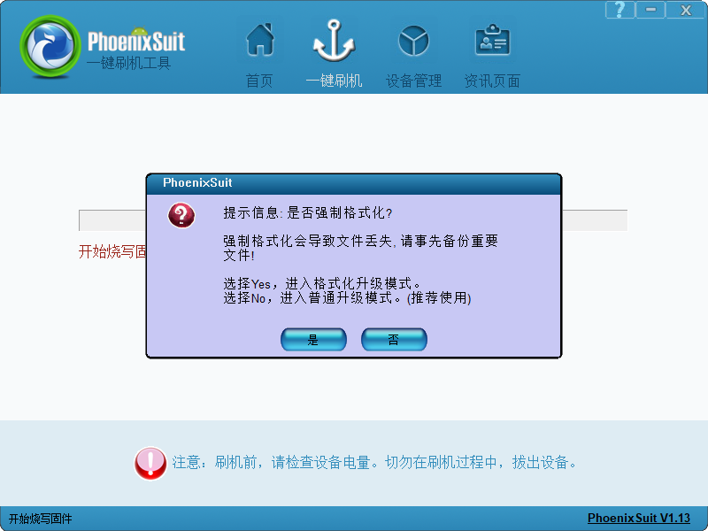

Wait for the programming to complete. Then, the following interface will pop up:

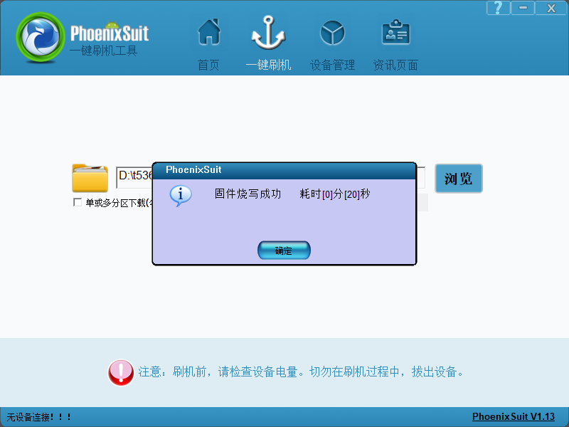

After the flashing, the board will automatically power on

2\. Partial Image Updates

a) OTG U-Boot Update Only:

In the following interface, check the checkbox "Single or multi-partition download (select this option, the flashing tool will download the partitions you have selected)", then check the "BOOT-RESOURCE" and "ENV" checkboxes.

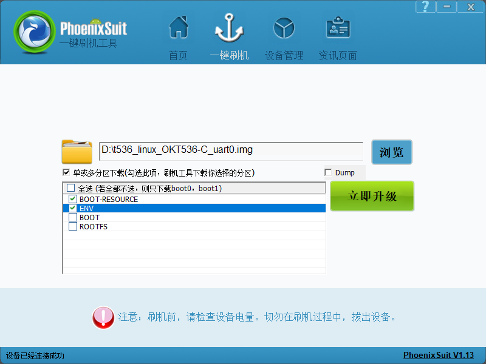

Connect the USB0 of the development board to the host using a Type-A to Type-C cable. Do not power on the board initially. Press the FEL button and then power on the board. Release the FEL button. Wait for the programming to complete. Then, the following interface will pop up:

**Note: Make sure to press the FEL button when the power is off.**


2）OTG Flashing Kernel Image and Device Tree DTB File

In the following interface, check the checkbox "Single or multi-partition download (select this option, the flashing tool will download the partitions you have selected)", then check "BOOT-RESOURCE" and "BOOT".

The kernel image is placed in the "BOOT" partition.

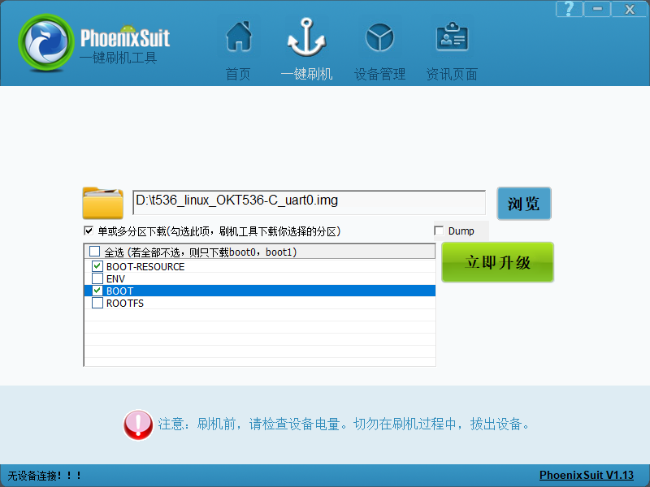

Connect the USB0 of the development board to the host using a Type-A to Type-C cable. Do not power on the board initially. Press the FEL button and then power on the board. Release the FEL button. Wait for the programming to complete. Then, the following interface will pop up:

**Note: Make sure to press the FEL button when the power is off.**

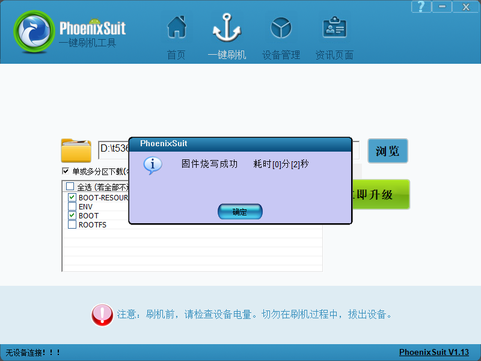

3 ）OTG System Flashing

In the following interface, check the checkbox "Single or multi-partition download (select this option, the flashing tool will download the partitions you have selected)", then check "ROOTFS".

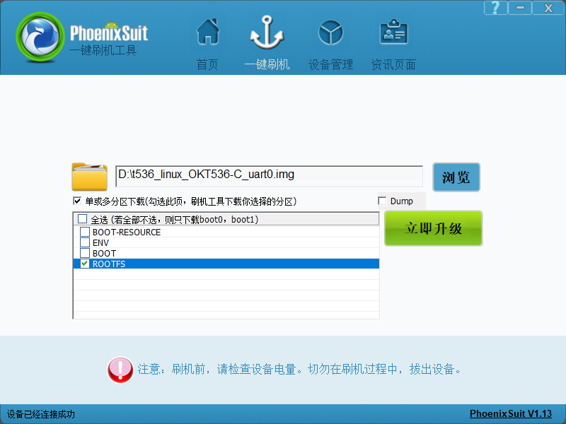

Connect the USB0 of the development board to the host using a Type-A to Type-C cable. Do not power on the board initially. Press the FEL button and then power on the board. Release the FEL button. Wait for the programming to complete. Then, the following interface will pop up:

**Note: Make sure to press the FEL button when the power is off.**

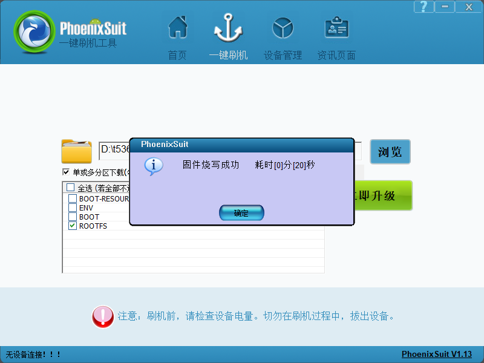

#### 6.2.3 Common OTG Flashing Issues

1\. Driver Installation Failure

After following the manual to install the USB driver, some users still see an "Unknown device" in Device Manager. When expanding the "Unknown device" details, a message appears indicating that the third-party INF does not contain digital signature information, as shown in the figure below:

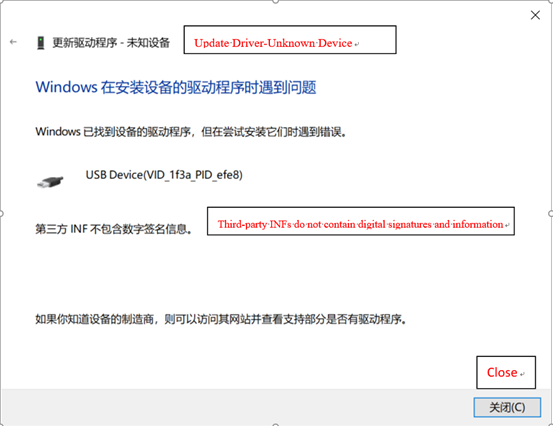

This issue occurs because some Windows systems, in order to prevent third-party programs from affecting system stability, block unsigned drivers from passing verification, causing the driver installation to fail. First disable the driver signature enforcement setting on the computer, and then proceed with the driver installation according to the manual.

(1) Solution for "Third-party INF does not contain digital signature information" issue.

1). First press and hold Shift + Restart;

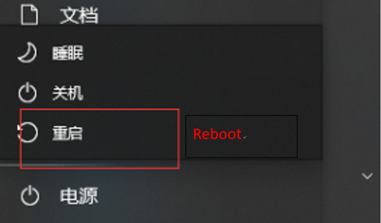

2). When starting up, select Troubleshoot → Advanced Options → Startup Settings;

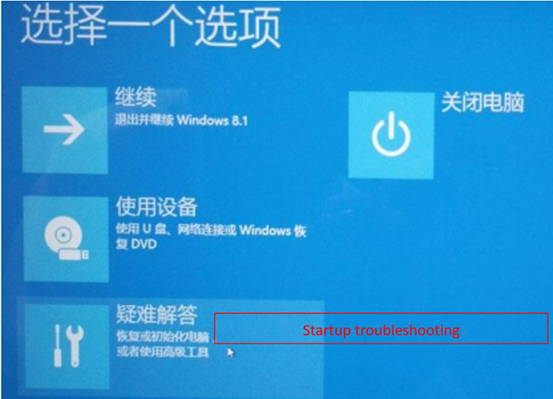

3). On the Startup Settings screen, click Restart in the bottom right corner. After restarting and entering Startup Settings, press the number key 7 or function key F7 to disable driver signature enforcemen.

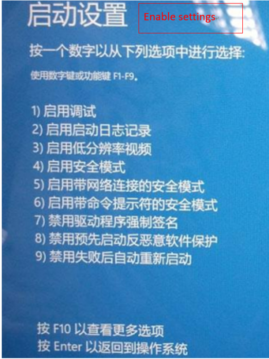

2\. Incorrect use of FEL button

When flashing, do not power on the board first. Press and hold the FEL button, then power on the board, and then release the FEL button.

3\. Device name appears but the board still cannot be recognized

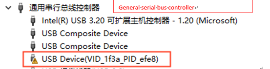

This may be because there are many unknown devices in Device Manager, and selecting the wrong one could cause the driver to be installed to another device. First right-click the device item mentioned above, select "Uninstall device", and check "Delete the driver software for this device".

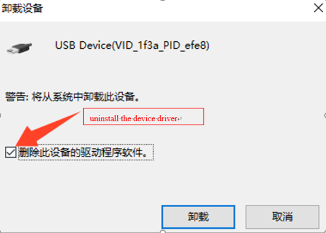

After uninstalling, disconnect other USB devices connected to the host, put the development board into flashing mode and connect it to the host, then repeat the above steps for installation.

### 6.3 TF Card Flashing

#### 6.3.1 Creating a TF Flashing Card

Tool path: 3-Tools\\PhoenixCard\_V4.1.9.zip

1\. Insert an 8GB/16GB/32GB TF card into the PC's USB interface via a card reader.

2\. Copy the flashing tool PhoenixCard\_V4.1.9.zip to any Windows directory, and double-click PhoenixCard.exe in the PhoenixCard\_V4.1.9 folder.

The following interface will appear:

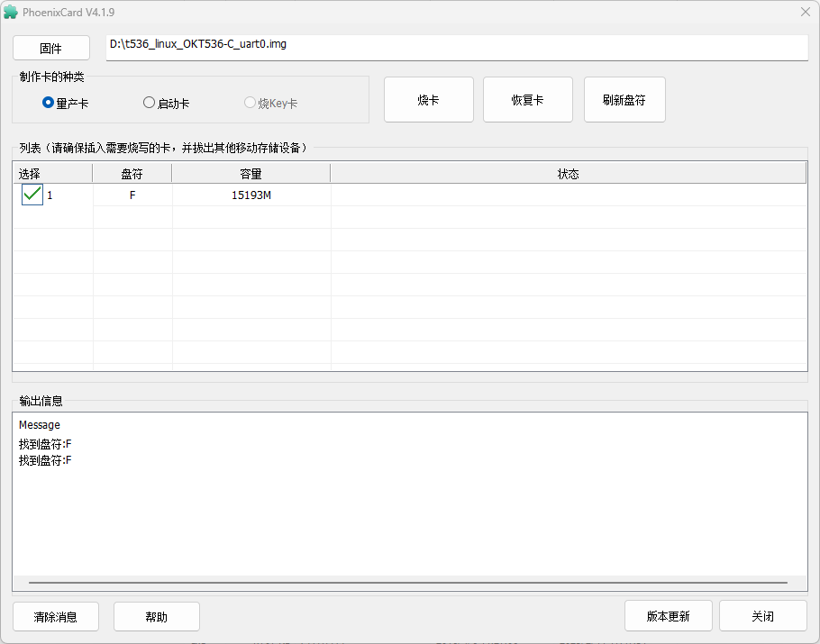

Note: If the TF card has multiple partitions, click "Restore Card" first, then click "Burn Card"; otherwise, the burning process may fail.

3\. Click "Firmware" to browse and select the OK536 firmware image, select "Mass Production Card", and click "Burn Card".

Wait for the burning process to complete, as shown in the following interface:

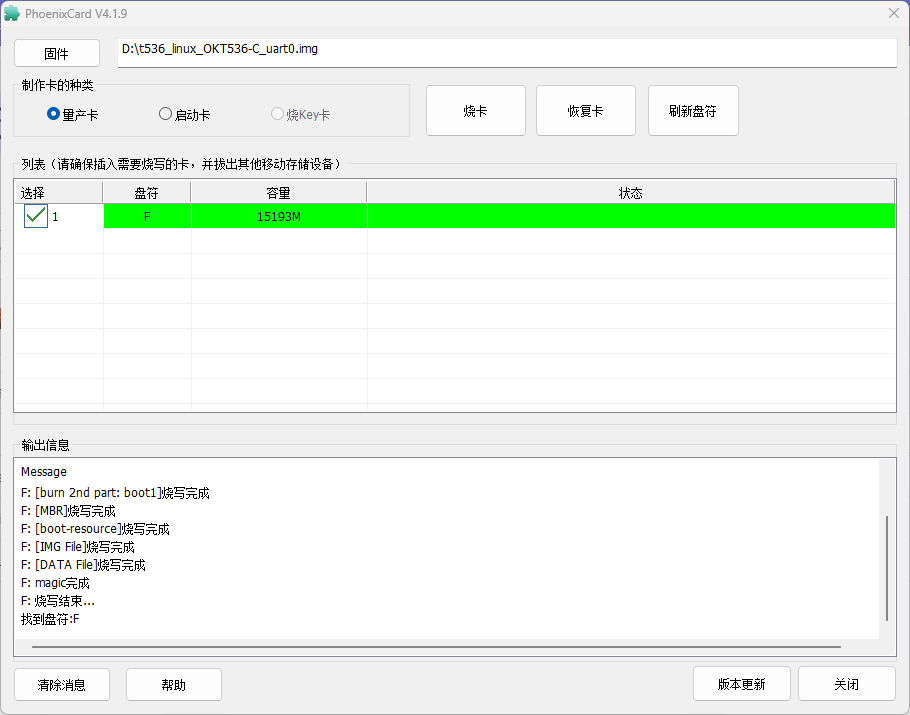

#### 6.3.2 TF Card Flashing Method

1\. Insert the TF card, power on the board, and the system will automatically enter the flashing process.

Serial port prompt upon completion:

```plain
chunk 3864(3867)
chunk 3865(3867)
chunk 3866(3867)
successed in writting part rootfs
origin_verify value = 9a3e3a97, active_verify value = 9a3e3a97
successed in verify part rootfs
successed in download part rootfs
successed in downloading part
[67.156]uboot size = 0x16c000
[67.159]storage type = 2
sunxi_sprite_deal_uboot ok
successed in downloading uboot
[67.242][mmc]: write mmc 2 info ok
[67.245]storage type = 2
successed in downloading boot0
CARD OK
sprite success 
sprite_next_work=3
next work 3
SUNXI_UPDATE_NEXT_ACTION_SHUTDOWN
```

2\. Remove the TF card and power on the board to start the system.

#### 6.3.3 Restoring the TF Card

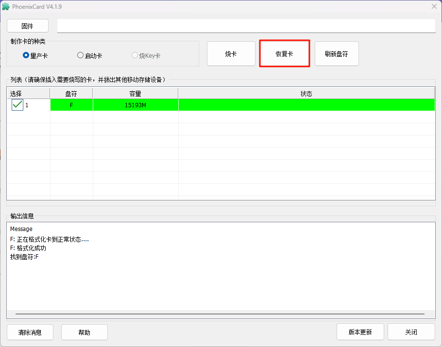