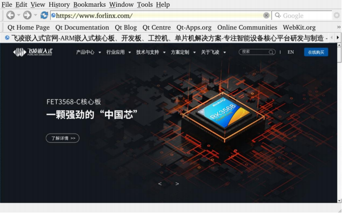

# Linux5.10.149\_User’s Manual\_V1.2

Document classification: □ Top secret □ Secret □ Internal information ■ Open

## Copyright

The copyright of this manual belongs to Baoding Folinx Embedded Technology Co., Ltd. Without the written permission of our company, no organizations or individuals have the right to copy, distribute, or reproduce any part of this manual in any form, and violators will be held legally responsible.

Forlinx adheres to copyrights of all graphics and texts used in all publications in original or license-free forms.

The drivers and utilities used for the components are subject to the copyrights of the respective manufacturers. The license conditions of the respective manufacturer are to be adhered to. Related license expenses for the operating system and applications should be calculated/declared separately by the related party or its representatives.

## Overview

This manual is designed to help you quickly familiarize yourselves with the product, and understand the interface functions and testing methods. It primarily covers the testing of interface functions on the development board, the methods for flashing images, and troubleshooting procedures for common issues encountered in use. In the process of testing, some commands are annotated to facilitate your understanding, mainly for practical use. Please refer to OKA40i-C\_Linux5.10.149+Qt5.15.8 User’s Compilation Manual” provided by Forlinx for kernel compilation, related application compilation methods and development environment construction.

There are total five chapters:

+ Chapter 1. provides an overview of the product, briefly introducing the interface resources of the development board, the relevant driver paths in the kernel source code, supported flashing and booting methods, as well as explanations of key sections in the documentation;
+ Chapter 2. is the fast boot/startup of the product, which can use two ways of serial port login and network login;
+ Chapter 3. mainly serves as an introduction to the product's usage features and is divided into multiple sections, including the function test;
+ Chapter 4. is the image update, which mainly describes the method of updating the image to the storage device. You can select the corresponding flashing mode according to the actual situation;
+ Chapter 5. is about the image flashing.

## Application Scope

This software manual is applicable to the <font style="color:rgb(0,0,0);">OKA40i platform Linux 5.10 operating system of Forlinx.</font>

## Revision History

| <font style="color:black;">Date</font>| <font style="color:black;">User Manual Version</font>| <font style="color:black;">Revision History</font>|
|----------|:----------:|----------|
| 15/04/2023| V1.0| OKA40i\_Linux5. 10.149+Qt5.15.8\_User’s Manual Initial Version |
| 21/03/2024| V1.1| 1\. Adding Qt test content;<br/> 2. Fixing OpenGL test command. |
| 19/06/2024| V1.2| 1\. Replacing some pictures in the manual;<br/> 2. Correcting the layout of the manual. |

## 1\. OKA40i Development Board Description

The OKA40i development board uses a structure of a carrier board + SoM. It is designed based on the Allwinner’s quad - core Cortex - A7 A40i processor for the industrial control industry platform. The processor has a main frequency of 1.2 GHz, integrates a Mali400MP2 GPU, and comes with 1GB/2GB DDR3L memory and 8GB EMMC storage. It supports the decoding of most currently popular video and image formats. It has the advantages of stable and reliable industrial - grade product performance, high cost - effectiveness, and low power consumption. It is suitable for industrial control products based on visual interaction. The target applications include embedded devices, intelligent terminals, industrial control, data acquisition, machine vision, industrial Internet of Things, mobile Internet devices, digital signage, etc.


**Note：**

**Hardware parameters are not described in this software manual. Before referring to this manual for software development, please read the "Hardware Manual" under the path of "Hardware Data \\ User Manual" to understand the product naming rules and the hardware configuration information of the product you use, which is helpful for you to use this product.**

### 1.1 Linux5.10.149 System Software Resources Features

| **Device**| **Location of driver source code in the kernel**| **Device Name**
|----------|----------|----------
| NIC Driver（emac）| bsp/drivers/emac| /sys/class/net/eth\*
| LCD Backlight Driver| bsp/video/sunxi/disp2/disp/| \-
| LED Driver| kernel/linux-5.10/drivers/leds/leds-gpio.c| /sys/class/leds/
| USB Port| kernel/linux-5.10/drivers/usb/storage/| /dev/sdx
| USB 3G| kernel/linux-5.10/drivers/usb/serial/| /dev/ttyUSB\*
| USB Camera| kernel/linux-5.10/drivers/media/usb/uvc/uvc\_video.c| \-
| SD Driver| bsp/drivers/mmc/| /dev/block/mmcblk0pX
| LCD FrameBuffer| bsp/drivers/video/sunxi/disp2/disp| /dev/fb0
| ft5x06 capacitive touch| kernel/linux-5.10/drivers/input/touchscreen/edt-ft5x06.c| /dev/input/eventx
| gt9xx capacitive touch| bsp/drivers/input/ctp/gt9xxnew| dev/input/eventx
| Resistor touch control drive<sup>TDB</sup>| bsp/drivers/rtp/sunxi-rtp.c| 
| RTC Real Time Clock Driver| kernel/linux-5.10/drivers/rtc/rtc-rx8010.c<br/>bsp/drivers/rtc/rtc-sunxi.c /no loading/| /dev/rtc0<br/>/dev/rtc0
| serial port driver| bsp/drivers/uart/sunxi-uart.c| /dev/tty\*
| watchdog driver| bsp/drivers/watchdog/sunxi\_wdt.c| /dev/watchdog
| WIFI| kernel/linux-5.10/drivers/net/wireless/| wlan0
| Audio Driver| bsp/drivers/sound| /dev/snd/
| SPI Controller| bsp/drivers/spi/spi-sunxi.c| /dev/spidev0.0 etc.
| Key Driver| bsp/drivers/input/keyboard/sunxi-keyboard.c| 
| smart card reader| bsp/drivers/smc/sunxi-smc.c| 
| Camera ov5640| bsp/drivers/vfe/| 
| tvin| bsp/drivers/tvd/| 
| twi drive| bsp/drivers/i2c/i2c-sunxi.c| 
| sata driver| bsp/drivers/ata/ahci\_sunxi.c| 

### 1.2 DIP Switches and Flashing Modes

A40i supports two boot modes: EMMC boot and SD card boot, and two burn modes: OTG and SD card.

+ **DIP switch**

Please find the figure below to see the DIP switches. When the DIP switch is in the on position, the device will start up using the EMMC (default) state. Conversely, when the DIP switch is in the off position, the device will start up using the SD card burning (startup) state. Additionally, it's possible to do OTG burning in either of the two states.


+ **Flashing key**

The mode for OTG burning is determined by the state of the K3 key when the device is powered on. If the K3 key is pressed during power-up, it indicates the OTG burning mode. Conversely, if the K3 key is released during power-up, it indicates the EMMC or SD card boot mode. To restart the device, you can press the K7 key. During OTG burning, you can hold the K3 key, press the K7 key once and then release the K3 key. You do not need to press the K3 key to burn the SD card. Refer to Chapter 4. for the specific flashing process.


## 2\. Fast Startup

### 2.1 Preparation Before Startup

+ Prepare a 5V 3A power supply and connect it to the 5V IN connector on the left side of the board;
+ Debug the serial port line, connect the computer to the DEBUG interface on the left side of the development board (view the print information, please ignore if you do not need to view the print information);
+ Connect the screen according to the interface of the development board, and burn the corresponding mirror image (if the display is not required, it is not required to connect);
+ Check the boot mode DIP switch, see previous section **“1.3 DIP Switches and Flashing Modes”**.

### 2.2 Serial Port Login Mode

#### 2.2.1. Serial Port Printing Information View

 **Note:**

+ **Serial port settings: baud rate 115200, data bit 8, stop bit 1, no parity bit, no flow control;**
+ **The serial terminal login uses the root user with no password. To change the password, see "2.3.2 Use of SSHD Services";**
+ **The PC Windows system is required to install the serial port terminal software, a set of USB to RS232 and a cross serial port line.**

First, connect the DEBUG port of the PC and the development board through the USB to RS232 and the cross serial port line. You need to confirm the serial port number of the connected computer. Open your computer's device manager:


Open the terminal debugging software installed on the computer and select putty. 

The specific settings are as follows:

Serial port setting: First select Serial, then enter the port number recognized on the computer, here is com21, enter the baud rate of 115 200, and finally click open. The operation contents are shown in the figure below:


After the setup is completed, you can start to see the debugging information. As shown in the figure below:


#### 2.2.2 Serial Port Login

After the boot information is printed, you can log in.

The login information of the development board is as follows, the account is root, and there is no password by default.

```plain
Welcome to Allwinner Tina5.0 Platform
Tina5.0 login: root
#
```

### 2.3 Network Login Methods

In addition to using the debug serial port to log in, OKA40i also supports Telnet and SSH network login to the development board, as well as FTP file transfer. Note that you can only see the printed information after the network has booted (i.e. after the development board has booted).

+ The default ip 192.168.0.232;
+ The development board account is root and has no password by default;
+ Before testing, please ensure that the development board and the computer have been connected through the network cable, turn off the computer firewall, the computer IP and the development board are in the same network segment and the data is smooth.

#### 2.3.1 Use of Telnet Services

The OKA40i-C development board has already started the telnet service in the /etc/init.d/S50telnet file, and can be used as a telnet server after setting the IP address.

To access the development board, follow these steps: Right-click the Windows Start menu and select "Run". In the "Run" window, type "cmd" and press enter. In the open command prompt window, type "telnet 192.168.0.232" and press enter. Enter "root" as the username (you can modify the default IP address if needed), and leave the password field blank.

```plain
C:\Users\Administrator> telnet 192.168.0.232
```

To log in:

```plain
A40i login: root
#
```

#### 2.3.2 SSHD Services Use

The OKA40i-C development board has started the ssh service in the /etc/init.d/ S50sshd file, and can be used as an sshd sftp-server after setting the IP address.

+ Set the time;
+ Password needs to be added;
+ Modify the configuration file.

Before testing, you first need to set the board to the current UTC time. Secondly, by default, the development board only has the root user and does not set the password. If you use the root to log in to the sshd service, you need to modify the sshd configuration file and set the password. If you use the common user to log in, you need to add the user and set the password. See below for the method.

**Set the account password method:**

Modify/add a password:

```plain
# passwd root
Changing password for root
New password: 123
Bad password: too short
Retype password: 123
passwd: password for root changed by root
```

**Add the account method:**

adduser username, add forlinx, password: forlinx.

```plain
# adduser forlinx
Changing password for forlinx
New password: forlinx
Bad password: similar to username
Retype password: forlinx
passwd: password for forlinx changed by root
```

**Remove the password:**

passwd username -d. Remove root password

```plain
# passwd root -d
passwd: password for root changed by root
```

**Modify the configuration (root login):**

Modify the configuration file/etc/ssh/sshd\_config of sshd to allow root login.

Change #PermitRootLogin prohibit-password to **PermitRootLogin yes**, save and exit.

Then restart the service or board afterward to make the changes take effect.

| \# <font style="color:#0000FF;">/etc/init.d/S50sshd restart							</font>//Restart the sshd service |
| ------------------------------------------------------------ |

**ssh login：**

The IP address of the development board is 192.168.0.232. Open putty in Windows, and the IP address is 192.168.0.232. After entering the command window, enter the user name root and the password 123, as shown in the following figure. After logging in, you can view the development board information.


```plain
login as : root
root@192.168.0.232’s password : 123
#
```

### 2.4 Screen Options

The OKA40i-C platform supports the display of multiple screens, corresponding to different images, subject to the final programming. The default is a 7-inch 1024x600 capacitive screen. Please burn the corresponding image of the screen to meet the display requirements.

OKA40i-C image comparison table:

| **Screen**| **Image**
|----------|----------
| 7-inch LCD-1024x600| sun8iw11p1\_linux\_OKA40i\_C\_uart0-1024x600.img
| 7-Inch mipi-1024x600| sun8iw11p1\_linux\_OKA40i\_C\_uart0-1024x600mipi.img
| 10.1吋LVDS-1280x800| sun8iw11p1\_linux\_OKA40i\_C\_uart0-1280x800.img

### 2.5 Screen Calibration

```plain
# ts_calibrate
# sync
```

**Note: Close the QT program during calibration to prevent the QT program from affecting the screen calibration.**

### 2.6 System Partition

| **Partition**| **Name**| **Partition size:**| **File system**| **Content**
|:----------:|:----------:|:----------:|:----------:|----------
| <font style="color:#000000;">/dev/mmcblk0</font>| <font style="color:#000000;">Boot partition</font>| <font style="color:#000000;">16MB</font>| <font style="color:#000000;">RAW</font>| <font style="color:#000000;">gpt</font>
| <font style="color:#000000;">/dev/mmcblk0p1</font>| <font style="color:#000000;">Boot resources</font>| <font style="color:#000000;">16MB</font>| <font style="color:#000000;">RAW</font>| <font style="color:#000000;">boot-resource</font>
| <font style="color:#000000;">/dev/mmcblk0p2</font>| <font style="color:#000000;">Environment variables</font>| <font style="color:#000000;">16MB</font>| <font style="color:#000000;">RAW</font>| <font style="color:#000000;">env</font>
| <font style="color:#000000;">/dev/mmcblk0p3</font>| <font style="color:#000000;">Kernel</font>| <font style="color:#000000;">96MB</font>| <font style="color:#000000;">RAW</font>| <font style="color:#000000;">BootA</font>
| <font style="color:#000000;">/dev/mmcblk0p4</font>| <font style="color:#000000;">Kernel backup partition</font>| <font style="color:#000000;">96MB</font>| <font style="color:#000000;">RAW</font>| <font style="color:#000000;">BootB</font>
| <font style="color:#000000;">/dev/mmcblk0p5</font>| <font style="color:#000000;">Root file system</font>| <font style="color:#000000;">256MB</font>| <font style="color:#000000;">Ext4</font>| <font style="color:#000000;">rootfsA</font>
| <font style="color:#000000;">/dev/mmcblk0p6</font>| <font style="color:#000000;">Root file system backup partition</font>| <font style="color:#000000;">256MB</font>| <font style="color:#000000;">Ext4</font>| <font style="color:#000000;">rootfsB</font>
| <font style="color:#000000;">/dev/mmcblk0p7</font>| <font style="color:#000000;">Private data partition</font>| <font style="color:#000000;">16MB</font>| <font style="color:#000000;">RAW</font>| <font style="color:#000000;">private</font>
| <font style="color:#000000;">/dev/mmcblk0p8</font>| <font style="color:#000000;">Data partition</font>| <font style="color:#000000;">Remaining space</font>| <font style="color:#000000;">vfat</font>| <font style="color:#000000;">UDISK</font>

<font style="color:#FF0000;">Note: There are two partitions for the kernel and the file system in the partition table, which are used for the A/B system upgrade. Currently, this function is not supported. In actual use, you can remove the backup partitions from the partition table, and the generated image will be smaller.</font>

Use the df command to view disk usage on the system as follows.

Here are the parameters of the factory image. There are no external devices.

```plain
# df -h
Filesystem                Size      Used Available Use% Mounted on
/dev/root               158.0M    134.1M     12.7M  91% /
tmpfs                   422.9M         0    422.9M   0% /dev/shm
tmpfs                   488.5M     72.0K    488.5M   0% /tmp
tmpfs                   488.5M    192.0K    488.3M   0% /run
devtmpfs                422.9M         0    422.9M   0% /dev
/dev/by-name/UDISK        6.5G      4.0K      6.5G   0% /mnt/UDISK
```

<font style="color:#FF0000;">Note: The size of the root partition does not match that in the partition table because the root partition is not fully allocated. When building the file system, as long as the total size of the root file system does not exceed the size specified in the partition table, there will be no error when packaging the file system, and the size of the root partition will increase as the file system grows.</font>

Use the free command to view memory usage.

```plain
# free
        total			used		free			shared		buffers		cached
Mem:		768528		58928		709600		0					4168			14516
-/+ buffers/cache:			40244		728284		
Swap:		0			0			0			
```

### 2.7 System Shutdown

In general, you can simply turn off the power directly. If there is a data storage operation, to ensure that the data is completely written, enter the sync command and turn off the power after completing data synchronization.

The command ‘reboot’ can be used to restart the development board. You can also restart the hardware by pressing the K7 (reset) key or directly power off and restart.

## 3\. Command Line Function Test

This section describes how to use the external expansion interface of the development board. The test program is for testing purposes only and may have bugs.

The test program used in the test in this section has been integrated in the Demo provided by Forlinx for direct command operation.

### 3.1 WIFI/Bluetooth Test

No support for RTL8723bu; the USB WIFI of RTL8723du is used as follows:

**Note: In this section, the WiFi connection tests are all examples of connecting to a WiFi router. The network environment is different, so please set it according to the actual situation when you do this experiment.**

**If the development board has an on-board WIFI wireless LAN card, it should be soldered to the evaluation board as shown in the figure. At present, Forlinx provides 8723du, but not 8723bu.**


After the board is powered on, the 8723du module is already powered on. The power - on control is in the /etc/init.d/S98bluetoothd file.


The power supply of the module is controlled by GPIO. The development board uses PB10 to control the power supply of the 8723du module. 

The calculation formula for the GPIO number is:

port\*32+num（PA：0，PB：1， PC：2 ...）

PB10 = 1 \* 32 + 10

#### 3.1.1 STA Mode

Before using the WiFi function, you need to use the ssid and password. The ssid name of the WiFi hotspot in the test environment is: forlinx, and the password is: test.

1. Enter the following command in the development board terminal:

```plain
# fltest_wifi.sh -i wlan0 -s forlinx -p test 
wifi wlan0
ssid forlinx
pasw test
wpa connect status:SCANNING
wpa connect status:ASSOCIATING
wpa connect status:ASSOCIATING
connect ok
udhcpc: started, v1.35.0
udhcpc: broadcasting discover
udhcpc: broadcasting select for 192.168.81.64, server 192.168.80.1
udhcpc: lease of 192.168.81.64 obtained from 192.168.80.1, lease time 28800
deleting routers
adding dns 222.222.202.202
adding dns 222.222.222.222
```

Among them, -i: 8723du, -s: wifi ssid (account), -p: wifi password or NONE (no password).

2. Check whether it can ping the external network and enter the following command in the terminal:

```plain
# ping -c 6 www.baidu.com 
PING www.a.shifen.com (220.181.38.150) from 192.168.4.156 mlan0: 56(84) bytes of data. 
64 bytes from 220.181.38.150 (220.181.38.150): icmp_seq=1 ttl=50 time=58.3 ms
64 bytes from 220.181.38.150 (220.181.38.150): icmp_seq=2 ttl=50 time=73.2 ms 
64 bytes from 220.181.38.150 (220.181.38.150): icmp_seq=3 ttl=50 time=2334 ms 
64 bytes from 220.181.38.150 (220.181.38.150): icmp_seq=4 ttl=50 time=1320 ms 
64 bytes from 220.181.38.150 (220.181.38.150): icmp_seq=5 ttl=50 time=296 ms 
64 bytes from 220.181.38.150 (220.181.38.150): icmp_seq=6 ttl=50 time=68.4 ms 
--- www.a.shifen.com ping statistics --- 
6 packets transmitted, 6 received, 0% packet loss, time 5055ms 
rtt min/avg/max/mdev = 58.260/691.673/2334.468/858.506 ms, pipe 3
```

#### 3.1.2 AP Mode

**Note: Before testing this function, you need to ensure that the eth0 network communication is normal.**

```plain
# fltest_wifiap.sh							//Turn on the wifi hotspot
```

Generate an AP node with the ssid of “test” and the password of “12345678”. Mobile phones can connect to “test” and access the Internet.

If you need to modify the ssid and password, you can find the “ssid” and “wpa\_passphrase” fields in the /etc/hostapd.conf file and make modifications.

#### 3.1.3 Bluetooth 

This section demonstrates file transfer between a mobile phone and the development board via Bluetooth.

1. Bluetooth Configuration

```plain
# bluetoothctl             // Open the bluez Bluetooth device
Agent registered
[CHG] Controller 30:7B:C9:4E:8E:D1 Pairable: yes
[bluetooth]# power on            // Start the Bluetooth device
Changing power on succeeded
[CHG]  Controller F0:C8:14:48:08:85 Powered: yes
[bluetooth]# pairable on           // Set to pairing mode
Changing pairable on succeeded
[bluetooth]# discoverable on             // Set to discoverable mode
Changing discoverable on succeeded
[CHG] Controller 30:7B:C9:4E:8E:D1 Discoverable: yes
[bluetooth]# agent on            // Start the agent
Agent is already registered
[bluetooth]# default-agent    // Set the current agent as the default
Default agent request successful
```

When the following error message is printed during the "power on" operation, you can use "rfkill" to unlock the Bluetooth module.

```plain
[bluetooth]# power on
Failed to set power on: org.bluez.Error.Blocked
[bluetooth]# exit
# rfkill unblock bluetooth
# bluetoothctl
Agent registered
[CHG] Controller 30:7B:C9:4E:8E:D1 Pairable: yes
[bluetooth]# power on
Changing power on succeeded
```

2. Development Board Passive Pairing.

After the above settings, open the mobile phone Bluetooth search, a "BlueZ 5.54" device will appear, click this Bluetooth to pair:


At the same time, the information printed on the development board is as follows, enter yes.

```plain
[NEW] Device 14:16:9E:62:39:BD zzy
Request confirmation
[agent] Confirm passkey 083886 (yes/no): yes
```

Then, tap on Bluetooth on your phone to initiate pairing.

View and remove connected devices:

```plain
[zzy]# devices     //View connected Bluetooth device
Device 14:16:9E:62:39:BD zzy
[zzy]# remove 14:16:9E:62:39:BD   //Remove the device
[bluetooth]# remove 14:16:9E:62:39:BD
[DEL] Device 14:16:9E:62:39:BD zzy
Device has been removed
```

3. Active pairing of development boards

In addition to passive pairing, it is also possible to send an active pairing request from the development board terminal.

```plain
[bluetooth]# scan on            //Search for discoverable Bluetooth
Discovery started
[CHG] Controller 30:7B:C9:4E:8E:D1 Discovering: yes
[NEW] Device 14:16:9E:62:39:BD zzy
[NEW] Device 70:AC:D6:3C:76:93 70-AC-D6-3C-76-93
[NEW] Device FC:E8:00:CF:42:E3 EDIFIER BLE
[NEW] Device C0:0B:06:01:0A:38 Mi Smart Band 5
[NEW] Device 2C:DB:07:C7:4F:F6 DESKTOP-VND9V1F
[CHG] Device 2C:DB:07:C7:4F:F6 RSSI: -60
[bluetooth]# scan off     //Stop searching
Discovery stopped
[bluetooth]# pair 14:16:9E:62:39:BD          //Pair the bluetooth
Attempting to pair with 14:16:9E:62:39:BD
[CHG] Device 14:16:9E:62:39:BD Connected: yes
Request confirmation
[agent] Confirm passkey 732814 (yes/no): yes
[CHG] Device 14:16:9E:62:39:BD Modalias: bluetooth:v000Fp1200d1436
[CHG] Device 14:16:9E:62:39:BD UUIDs: 00001105-0000-1000-8000-00805f9b34fb
[CHG] Device 14:16:9E:62:39:BD UUIDs: 0000110a-0000-1000-8000-00805f9b34fb
[CHG] Device 14:16:9E:62:39:BD UUIDs: 0000110c-0000-1000-8000-00805f9b34fb
[CHG] Device 14:16:9E:62:39:BD UUIDs: 0000110e-0000-1000-8000-00805f9b34fb
[CHG] Device 14:16:9E:62:39:BD UUIDs: 00001112-0000-1000-8000-00805f9b34fb
[CHG] Device 14:16:9E:62:39:BD UUIDs: 00001115-0000-1000-8000-00805f9b34fb
[CHG] Device 14:16:9E:62:39:BD UUIDs: 00001116-0000-1000-8000-00805f9b34fb
[CHG] Device 14:16:9E:62:39:BD UUIDs: 0000111f-0000-1000-8000-00805f9b34fb
[CHG] Device 14:16:9E:62:39:BD UUIDs: 0000112f-0000-1000-8000-00805f9b34fb
[CHG] Device 14:16:9E:62:39:BD UUIDs: 00001132-0000-1000-8000-00805f9b34fb
[CHG] Device 14:16:9E:62:39:BD UUIDs: 00001200-0000-1000-8000-00805f9b34fb
[CHG] Device 14:16:9E:62:39:BD UUIDs: 00001800-0000-1000-8000-00805f9b34fb
[CHG] Device 14:16:9E:62:39:BD UUIDs: 00001801-0000-1000-8000-00805f9b34fb
[CHG] Device 14:16:9E:62:39:BD UUIDs: 00009955-0000-1000-8000-00805f9b34fb
[CHG] Device 14:16:9E:62:39:BD UUIDs: fa88c0d0-afac-11de-8a99-0800200c9a67
[CHG] Device 14:16:9E:62:39:BD ServicesResolved: yes
[CHG] Device 14:16:9E:62:39:BD Paired: yes
Pairing successful
```

At the same time, the pairing request appears on the mobile phone interface. Click the pairing button, and the board end prints and inputs yes. The pairing on the mobile phone end is successful.

4. The development board receives the file.

After successful pairing, on the mobile side, you can use Bluetooth to send files to OKA40i.


Received files are saved in the /tmp directory.

```plain
# ls /tmp/ -l
total 4848
-rw------- 1 root root 2783349 Nov 28 04:24 V21128-113836.mp4
-rw------- 1 root root 2173285 Nov 28 04:26 V21128-113851.mp4
-rw------- 1 root root       4 Nov 28 04:23 a-1.txt
drwx------ 3 root root      60 Nov 28 04:12 systemd-private-20d4637b1f714e57a55c3a86bfc8c0a5-bluetooth.service-7BzjIT
drwx------ 3 root root      60 Nov 28 04:12 systemd-private-20d4637b1f714e57a55c3a86bfc8c0a5-ninfod.service-JXVulf
drwx------ 3 root root      60 Nov 28 04:12 systemd-private-20d4637b1f714e57a55c3a86bfc8c0a5-rdisc.service-IR8ZR4
drwx------ 3 root root      60 Nov 28 04:12 systemd-private-20d4637b1f714e57a55c3a86bfc8c0a5-systemd-logind.service-gV7bXk
drwx------ 3 root root      60 Nov 28 04:12 systemd-private-20d4637b1f714e57a55c3a86bfc8c0a5-systemd-timesyncd.service-NTarpLAgent 39:BD zzy
```

5. The development board sends files.

Similarly, the OKA40i can send files to a cell phone, test is as follows:

```plain
# bluetoothctl
Agent registered
[[CHG] Controller 30:7B:C9:4E:8E:D1 Pairable: yes
[zzy]# paired-devices     //View the MAC of a device that has been paired
Device 14:16:9E:62:39:BD zzy
[zzy]# exit
# obexctl
[NEW] Client /org/bluez/obex 
[obex]# connect  14:16:9E:62:39:BD  //Connect to the Bluetooth MAC that needs to communicate. Please use paired-devices in bluetoot hctl to check. Before connecting, make sure that Bluetooth is poweron.
Attempting to connect to 14:16:9E:62:39:BD
[NEW] Session /org/bluez/obex/client/session0 [default]
[NEW] ObjectPush /org/bluez/obex/client/session0 
Connection successful
[14:16:9E:62:39:BD]# send /home/root/aaa.txt   //Send files
Attempting to send /home/root/aaa.txt to /org/bluez/obex/client/session0
[NEW] Transfer /org/bluez/obex/client/session0/transfer0 
Transfer /org/bluez/obex/client/session0/transfer0
        Status: queued
        Name: aaa.txt
        Size: 4
        Filename: /home/root/aaa.txt
        Session: /org/bluez/obex/client/session0
[CHG] Transfer /org/bluez/obex/client/session0/transfer0 Status: complete
[DEL] Transfer /org/bluez/obex/client/session0/transfer0 
[14:16:9E:62:39:BD]# 
```

After that, the mobile phone will receive the file sent by the board.


### 3.2 SDHC/TF Driver Test

The development board supports hot-swappable SD or TF cards. After inserting an SD or TF card, the system will automatically mount it to the /run/media/mmcblk1p1 or /run/media/mmcblk3p1 directory. When removing it, unmount the SD card or TF card.

View the files on the SD card with the following commands:

```plain
# ls -la /run/media/mmcblk1p1/
total 5
drw-rw-rw-		2 root		root		4096	Jan		1	00:00	.
drwxrwxrwx		4 root		root		1024	Jan		1	00:30	..
-rw-rw-rw-		1 root		root		   0	Jul		5	2019	sdcard.txt
```

Write a file to the SD card with the following command:

```plain
# echo 1 > /run/media/mmcblk1p1/test.txt			//Write 1 to the test. txt films
# sync																				//Save the modifications
```

Read the test.txt file from the SD card with the following command:

```plain
# cat /run/media/mmcblk1p1/test.txt
1
```

It will read the 1 that just wrote.

**Note: Do not pull out the SD card in the SD card path. It will affect the use of SD card.**

### 3.3 USB Interface Test

#### 3.3.1 USB Host Interface Storage Test

Demonstration with a mounting USB flash drive; the current USB flash drive test support up to 32G, but no test for 32G or above. The physical connection between the USB flash drive and the development board is as shown in the diagram:


At the same time, the terminal will print the information about the USB flash disk. As there are many kinds of USB flash disks, the displayed information may be different.

Step 1: Connect a USB flash drive to the USB host interface. It will be automatically mounted to the /run/media/sdx1 directory;

Step 2: Check the USB storage device;

```plain
# df -h
Filesystem				Size			Used		Available	Use%	Mounted on
none							851.4M		0				851.4M		0%		/dev
/dev/mmcblk0p7		6.8G			501.6M	6.3G			7%		/
tmpfs							882.3M		0				882.3M		0%		/dev/shm
tmpfs							882.3M		12.0K		882.3M		0%		/tmp
tmpfs							882.3M		204.0K	882.1M		0%		/run
/dev/mmcblk0p1		191.6M		1.8M		175.7M		1%		/extp
/dev/sda1					7.4G			2.1G		5.3G			29%		/run/media/sda1
# ls -l /run/media/sda1/
total 5
drwxrwxrwx		2	root		root		4096	Jan	1	00:41	.
drwxrwxrwx		5	root		root		1024	Jan	1	00:38	..
-rwxrwxrwx		1	root		root		0			Jul	5	2019	sdcard.txt
```

Step 3: Write a file to the USB flash disk;

```plain
# echo 1 > /run/media/sda1/test.txt				//Write 1 to test. txt films
# sync											//Synchronize contents from memory to USB disk
```

Step 4: Read the contents of the USB flash drive.

```plain
# cat /run/meida/sda1/test.txt
1
```

It will read the 1 that just wrote.

**Note: When pulling out the USB flash drive, do not pull it in the USB flash drive path. It will affect the use of U disk.**

#### 3.3.2 OTG Test

1. The ADB service is enabled by default on the development board, and the Micro USB data cable is used to connect the ADB on the PC side;


2. Use the otg to host line to connect to the otg port, insert the U disk, and enter the following command to read the contents of the U disk. Mount the USB flash drive to the/run/media/sdx1 directory.

```plain
# cat /sys/bus/platform/devices/soc@1c00000:usbc0@0/usb_host   	// Execute this command to manually convert OTG to USB_HOST, so that the USB flash drive can be recognized.
# cat /sys/bus/platform/devices/soc@1c00000:usbc0@0/usb_device  // Execute this command to manually convert OTG to USB_DEVICE, so that ADB connection can be used.
```


### 3.4 Ethernet Drive Test

The network usage environment may vary for each development board. In this test example, the network environment is as follows. In actual use, please configure according to the actual network environment.

The following takes eth0 as an example for command description.

#### 3.4.1 Manual Configuration of Eth0

**Note: The OKA40i defaults to the eth0 NIC. The boot has set the default eth0 IP address to 192.168.0.232. If you want to modify the default IP, please modify /etc/network/interfaces.**

1\. In Linux systems, the “ifconfig” command is used to display or configure network devices. The commonly used command format is as follows:

#ifconfig network port ip address hw<HW> ether MAC address netmask mask address broadcast broadcast address \[up\|down]

2\. Set the IP address

```plain
# ifconfig eth0 192.168.1.120			// Set the IP address of eth0 to 192.168.1.120
# ifconfig eth0 						// Check the current network status
```

3\. Modify the mac address

i. Turn off the network card device first

```plain
# ifconfig eth0 down
```

ii.Modify MAC

```plain
# ifconfig eth0 hw ether 36:C9:E3:F1:B8:05
```

iii.Re-open the network card

```plain
# ifconfig eth0 up
```

4\. Set the subnet mask

```plain
# ifconfig eth0 netmask 255.255.255.0
```

5\. Set the broadcast address

```plain
# ifconfig eth0 broadcast 192.168.0.255
```

After setting the above information, the contents are as follows:

```plain
# ifconfig eth0
eth0      Link encap:Ethernet  HWaddr 36:C9:E3:F1:B8:05
          inet addr:192.168.0.232  Bcast:192.168.0.255  Mask:255.255.255.0
          inet6 addr: fe80::34c9:e3ff:fef1:b805/64 Scope:Link
          UP BROADCAST RUNNING MULTICAST  MTU:1500  Metric:1
          RX packets:11404 errors:0 dropped:47 overruns:0 frame:0
          TX packets:9 errors:0 dropped:0 overruns:0 carrier:0
          collisions:0 txqueuelen:1000
          RX bytes:1458748 (1.3 MiB)  TX bytes:606 (606.0 B)
          Interrupt:87 Base address:0xb000
```

6\. Add/remove default gateway

Add a default gateway:

```plain
# route add default gw 192.168.0.1
# route
Kernel IP routing table
Destination		Gateway				Genmask				Flags	Metric	Ref		Use		Iface
default				192.168.0.1		0.0.0.0				UG		0				0			0			eth0
192.168.0.0		*							255.255.255.0	U			0				0			0			eth0
```

To delete a default gateway:

```plain
# route del default gw 192.168.0.1
```

7\. Turn off and on the network card

Turn off the eth0 network card:

```plain
# ifconfig eth0 down
```

Turn on the eth0 network card:

```plain
# ifconfig eth0 up
```

8\. ethtool View network information

```plain
# ethtool eth0
Settings for eth0:
	Supported ports: [ TP MII ]
	Supported link modes:		10baseT/Half 10baseT/Full
            							100baseT/Half 100baseT/Full
	Supports auto-negotiation: Yes
	Advertised link modes:	10baseT/Half 10baseT/Full
            							100baseT/Half 100baseT/Full
	Advertised pause frame use:	No
	Advertised auto-negotiation:	Yes
	Speed:	100Mb/s
	Duplex:	Full
	Port:	MII
	PHYAD:	1
	Transceiver:	external
	Auto-negotiation:	on
	Link detected:	yes
```

#### 3.4.2 Dynamically Setting IP Address

If your development board is connected to the router and the router supports DHCP automatic IP address assignment, you can enter the command in Hyper Terminal:

```plain
# udhcpc -i eth0
```

It is used to dynamically obtain an IP address, the “-i” parameter is used to specify the network interface name. The network interface name for the wired network on the development board is eth0.

The DNS server information in the/etc/resolv. conf file is automatically added.

### 3.5 Ethernet Related Services

The OKA40i-C development board already starts the following four services in the /etc/init.d/rcS file, and no additional configuration is required. Before testing the Ethernet related services, make sure that the IP has been set and the network port can communicate normally. Please refer to the Ethernet driver test section for setting the IP.

For the use of Telnet and ssh services, please refer to Section 2.2.2 of the Manual

#### 3.5.1 Sftp-server File Service

Open WinSCP in Windows based on the following information:

+ Password needs to be added;
+ Modify the configuration file;
+ The default IP address is 192.168.0.232.

Refer to "2.3.2 SSHD Services Use" to modify the configuration file, user name and password.

Assuming the password is set as “root” and selecting the SFTP protocol, input the IP address and the username/password as “root” and “root” respectively, as shown in the following image:


The interface after successful login is as shown below:


#### 3.5.2 VSFTP

+ **The development board acts as a server.**

When the system is started, the FTP service has been automatically started. You can use the FTP software on the computer to access it. The user name is root, and the password is set to root (before the test, you need to use the password command to set the password, which is set to root here). The default IP of the development board is 192.168.0.232.

The following figure shows the operation of using FileZilla to access the ftp of the development board on a PC. Open the File/Site Manager and make the following settings.

Here the computer is the client and the development board is the server.


After the connection is completed, you can see the development board file.


+ **The development board acts as a client.**

Assuming the FTP server’s IP address is 192.168.0.72, you can use the following command to transfer and download files using the FTP command:

```plain
# ftpput -u root -p root 192.168.0.72 test.mp4 test.mp4	// Transfer the file from the development board to the FTP server.
# ftpget -u root -p root 192.168.0.72 test.mp4 test.mp4	// Download the file from the server to the development board.
```

### 3.6 Watchdog Test

Watchdog is a frequently used feature in embedded systems. The watchdog driver specifies a maximum of 16s countdown reboot for the system. To prevent the system from resetting, you can write a reset command to the watchdog within a counting period of 16 seconds to reset the timer. The following commands cannot be used simultaneously.

Parameter Description:

| **Parameter**| **Meaning**| **Description**
|----------|----------|----------
| settimeout| Turn on the watchdog, set the reset time, and do not feed the dog| Reset time setting shall be greater than 2S.
| keepalive| Turn on the watchdog, set the reset time, and feed the dog at a timer of 2s.| Reset time setting shall be greater than 2S.

**Note: During testing, only one of the two parameters can be used. You can use the “ps” command to check the processes and ensure that there is only one watchdog process running. Turn on the watchdog and set the reset time to test.**

Execute the 10s reset command (the minimum reset time interval can be set as 2S), and the development board will be reset after 10s:

```plain
# fltest_watchdog /dev/watchdog settimeout 10 &				//10s reset command
[1] 1377
# HELLO! BOOT0 is starting!								//Restart 10s later
[     0.35]HELLO! BOOT0 is starting!
[     0.39]boot0 commit : 74581757d98a20b111500764817c436cdafbdae3
[     0.46]boot0 version : 4.0
[     0.50]set pll start
```

Turn on the watchdog, set the reset time, and conduct the dog feeding test at a fixed time of 2S.

The parameter keepalive of watchdog is to set the reset time and feed the dog for 2 seconds, and 10 is to set the reset time for 10 seconds.

After closing the watchdog background process, it will stop feeding the dog and reset after 10s.

```plain
# fltest_watchdog /dev/watchdog keepalive 10 &		//2s watchdog feeding command
[1] 1374
# ps
1374 root     /usr/bin/watchdog /dev/watchdog keepalive 10
# kill 1374																				//Kill the process
# HELLO! BOOT0 is starting!												//Restart 10s later
[     0.35]HELLO! BOOT0 is starting!
[     0.39]boot0 commit : 74581757d98a20b111500764817c436cdafbdae3
```

### 3.7 Play/Record Test

<font style="color:#000000;">The A40i's internal Audio Codec is a high-quality stereo audio codec with a headphone amplifier. Users can use the ALSA audio recording, playback, and configuration tools included in the file system for testing.

1\. Playback test

```plain
# aplay -Dhw:0,0 /root/wo.wav						//Play the audio file wo.wav
Playing WAVE '/usr/bin/Rear_Center.wav' : Signed 16 bit Little Endian, Rate 22050 Hz, Stereo
```

2\. Recording Test

```plain
# arecord -Dhw:0,0 -r 44100 -f S16_LE -d 10 record.wav	//Record the sound 
Recording WAVE 'record.wav' : Signed 16 bit Little Endian, Rate 44100 Hz, Stereo
```

Play the recording:

```plain
# aplay -Dhw:0,0 record.wav								//Play the recording
Playing WAVE 'record.wav' : Signed 16 bit Little Endian, Rate 44100 Hz, Stereo
```

### 3.8 Camera Test

**Note: This function is not supported at present.**

### 3.9 RTC Clock Drive Test

**Note: Make sure that the coin cell battery has been installed on the board before testing.**

RTC test mainly involves setting and checking software and hardware time using the “date” and “hwclock” tools. The test verifies whether the software clock reads the RTC clock correctly when the operating system restarts.

Set the time as follows command:

```plain
# date -s 2015.05.29-09:47:13
Fri May 29 09:47:13 UTC 2015
```

**Description: format set by date: \[YYYY.]MM.DD-hh:mm\[:ss], the year can be written as 2-digit YYY or 4-digit YYYYY, MM is the month, DD is the day, hh is the hour, mm is the minute, and seconds can be expressed as ss.**

Save time to clock chip:

```plain
# hwclock -w		//Without this step, the system time will not be updated at the next boot
```

If the time zone has been modified, execute the following command to save the time.

```plain
# hwclock -wu		//Save to RTC chip at UTC time
```

Power off and restart to check whether the time is saved:

```plain
# date 
```

More usage of the data and hwclock commands are as follows:

The set time command help is as follows:

```plain
# date -help
Usage: date [OPTIONS] [+FMT] [TIME]

Display time (using +FMT), or set time

	[-s,--set] TIME Set time to TIME
	-u,--utc							Work in UTC (don't convert to local time)
	-R,--rfc-2822					Output RFC-2822 compliant date string
	-I[SPEC]							Output ISO-8601 compliant date string
              					SPEC='date' (default) for date only,
              					'hours', 'minutes', or 'seconds' for date and
              					time to the indicated precision
	-r,--reference FILE		Display last modification time of FILE
	-d,--date TIME				Display TIME, not 'now'
	-D FMT								Use FMT for -d TIME conversion

Recognized TIME formats:
	hh:mm[:ss]
	[YYYY.]MM.DD-hh:mm[:ss]
	YYYY-MM-DD hh:mm[:ss]
	[[[[[YY]YY]MM]DD]hh]mm[.ss]
	'date TIME' form accepts MMDDhhmm[[YY]YY][.ss] instead 
```

The help command for hwclock is as follows:

```plain
# date -help
Usage: hwclock [-r|--show] [-s|--hctosys] [-w|--systohc] [-t|--systz] [-l|--localtime] [-u|--utc] [-f|--rtc FILE]

Query and set hardware clock (RTC)

	-r				Show hardware clock time
	-s				Set system time from hardware clock
	-w				Set hardware clock from system time
	-t				Set in-kernel timezone, correct system time
      			if hardware clock is in local time
	-u				Assume hardware clock is kept in UTC
	-l				Assume hardware clock is kept in local time
	-f	FILE 	Use specified device (e.g. /dev/rtc2)
```

### 3.10 4G Module Test

**Note: 4G module is optional. If necessary, please contact Forlinx Sales.**

Prepare a 4G SIM card, a 4G EC20 module, and a 4G antenna. Insert the module into the 4G module slot and secure it. Insert the SIM card into the adjacent slot. Connect the antenna to the main ipex antenna connector. Power on the device. (The EC20 module supports IoT cards, and for some IoT cards, it may require configuring a user name and password).

1\. Check whether the node under/dev exists:

```plain
# ls -la /dev/qcqmi0
/dev/qcqmi0
```

If the qcqmi0 node is present, the 4G module is correctly identified and loaded.

2\. Dialing

```plain
# quectel-CM &
[01-01_00:33:08:257] WCDMA&LTE_QConnectManager_Linux&Android_V1.1.34
[01-01_00:33:08:258] quectel-CM profile[1] = (null)/(null)/(null)/0, pincode = (null)
[01-01_00:33:08:263] Find /sys/bus/usb/devices/1-1.3 idVendor=2c7c idProduct=0125
[01-01_00:33:08:263] Find /sys/bus/usb/devices/1-1.3:1.4/net/usb0
[01-01_00:33:08:263] Find usbnet_adapter = usb0
[01-01_00:33:08:264] Find /sys/bus/usb/devices/1-1.3:1.4/GobiQMI/qcqmi0
[01-01_00:33:08:264] Find qmichannel = /dev/qcqmi0
[01-01_00:33:08:288] Get clientWDS = 7
[01-01_00:33:08:320] Get clientDMS = 8
[01-01_00:33:08:351] Get clientNAS = 9
[01-01_00:33:08:385] Get clientUIM = 10
[01-01_00:33:08:416] Get clientWDA = 11
[01-01_00:33:08:448] requestBaseBandVersion EC20CEHDLGR06A06M1G	//Actual firmware version of the module
[01-01_00:33:08:545] requestGetSIMStatus SIMStatus: SIM_READY		//SIM card identification
[01-01_00:33:08:576] requestGetProfile[1] ctnet///0						//Operator
[01-01_00:33:08:608] requestRegistrationState2 MCC: 460, MNC: 11, PS: Attached, DataCap: LTE
[01-01_00:33:08:640] requestQueryDataCall ipv4ConnectionStatus: DISCONNECTED
[01-01_00:33:08:704] requestRegistrationState2 MCC: 460, MNC: 11, PS: Attached, DataCap: LTE
[01-01_00:33:08:736] requestSetupDataCall WdsConnectionipv4Handle: 0x86ad3a90
[01-01_00:33:08:832] requestQueryDataCall ipv4ConnectionStatus: CONNECTED
[01-01_00:33:08:865] ifconfig usb0 up
[01-01_00:33:08:884] busybox udhcpc -f -n -q -t 5 -i usb0
[01-01_00:33:08:898] udhcpc (v1.18.3) started
[01-01_00:33:08:970] Sending discover...
[01-01_00:33:09:071] Sending select for 10.51.194.11...
[01-01_00:33:09:190] Lease of 10.51.194.11 obtained, lease time 7200
[01-01_00:33:09:210] deleting routers
route: SIOCDELRT: No such process
[01-01_00:33:09:225] adding dns 222.222.222.222
[01-01_00:33:09:226] adding dns 222.222.202.202
```

**Note: In addition, the above test is based on ordinary mobile phones, and the Internet of Things card needs special configuration. Consult the service hall for details.**

3\. Test network connection and disconnection

Input command:

```plain
# ifconfig eth0 down
# ping -c 3 www.baidu.com
ping www.baidu.com -c 3
PING www.baidu.com (220.181.38.149): 56 data bytes
64 bytes from 220.181.38.149: seq=0 ttl=51 time=44.181 ms
64 bytes from 220.181.38.149: seq=1 ttl=51 time=58.372 ms
64 bytes from 220.181.38.149: seq=2 ttl=51 time=66.671 ms
--- www.baidu.com ping statistics ---
3 packets transmitted, 3 packets received, 0% packet loss
round-trip min/avg/max = 44.181/56.408/66.671 ms
```

4\. 4G Hotspot

```plain
# /usr/bin/quectel-CM &                                               // 4G dialing
# echo 1 > /proc/sys/net/ipv4/ip_forward                               // Enable IP forwarding
# iptables -t nat -A POSTROUTING -o usb0 -j MASQUERADE    // usb0 is the network card recognized by the 4G module. Set forwarding rules.
# insmod /lib/modules/$(uname -r)/8723bu.ko                           // Mount the driver module
# ifconfig wlan0 192.168.18.1                                                     // Set the IP address
# udhcpd -f /etc/udhcpd.conf &                                                   // Configure WiFi address, gateway, etc.
# /usr/sbin/hostapd -d /etc/hostapd.conf &                         // Set encryption method, username, password, etc.
```

Generate an AP node with the ssid of “test” and the password of “12345678”. Mobile phones can connect to “test” and access the Internet.

### 3.11 UART Serial Port Test

1\. Interface description

The OKA40I-C development board is provided with 6 UART ports, as shown in the following table:

| serial port| uart0| uart2| uart3| uart4| uart5| uart7
|----------|----------|----------|----------|----------|----------|----------
| Type| DEGUG(RS232)| TTL five-wire serial port| TTL five-wire serial port| TTL| RS485| TTL
| Node| /dev/ttyS0| /dev/ttyS2| /dev/ttyS3| /dev/ttyS4| /dev/ttyS5| /dev/ttyS7

**Note: UART0 is a debug serial port and cannot be used as a normal serial port test.**

2\. Hardware connection

Connect the Forlinx TTL to RS232 module to the development board UART2 (ttyS2) or UART3 (ttyS3), connect the serial line to the RS232 device, connect the hardware, and power up the development board.

3\. Software test

Take UART3 as an example to conduct the test. Enter the following command in the terminal, tty \_ test will continuously send out "abcdefg" after it is started, and the computer receives the data.

The UART2 port is similar and can be modified to the corresponding equipment number.

```plain
# fltest_uart /dev/ttyS3 9600			//The device is/dev/ttyS3, which is serial port 3, and the baud rate is 9600
```


Take UART2 as an example, the triangle arrow points to the first pin, the third pin is TX, and the eighth pin is RX.


### 3.12 RS485 Test

The default UART5 is used for the RS485 function, and the corresponding node is/dev/ttyS5. The RS485 to 232 module is used to connect with the computer.

Enter the following command in the terminal, and the UART program will continuously send out "abcdefg" after it is started.

**Note: The RS485 transceiver direction is controlled by the hardware circuit, and the software is not involved.**

```plain
# fltest_uart /dev/ttyS5 9600		//The device is/dev/ttyS5, which is serial port 5, and the baud rate is 9600
```

Computer serial port assistant (in User Profile \\ Tools \\ Serial Port Assistant), after sending abcdefg, receive the abcdefg sent by RS485.


### 3.13 Database Test

SQLite3 is a lightweight embedded database with a very low resource footprint, fast processing speeds, and no database server processes to install. The ported version is 3.38.5, which can be used directly.

Open the database and enter sqlite3 as follows:

```plain
# sqlite3
SQLite version 3.15.0 2016-10-14 10:20:30
Enter ".help" for usage hints.
Connected to a transient in-memory database.
Use ".open FILENAME" to reopen on a persistent database.
sqlite> create table tbl1 (one varchar(10), two smallint);	//Create a database table named tbl1
sqlite> insert into tbl1 values('hello!',10);								//Insert the data 'hello!|10' into the database
sqlite> insert into tbl1 values('goodbye', 20);							//Insert the data 'goodbye|20' into the database
sqlite> select * from tbl1; 												//Read the contents of the database table tbl1
	hello!|10
	goodbye|20
sqlite> .quit 																							//Exit
```

### 3.14 SPI Test

1-way SPI chip select is supported by default, corresponding to node /dev/spidev2.0 respectively.

Short MOSI and MISO, corresponding to pins 8 and 10 of the SPI2 interface

```plain
# fltest_spi -D /dev/spidev2.0				//The SPI program runs, and -D specifies the device spi2
spi mode: 0
bits per word: 8
max speed: 500000 Hz (500 KHz)

FF FF FF FF FF FF
40 00 00 00 00 95
FF FF FF FF FF FF
FF FF FF FF FF FF
FF FF FF FF FF FF
DE AD BE EF BA AD
F0 0D
```

### 3.15 Key Test

The key test refers to the three keys K1, K2 and K5 in the lower right corner of the carrier board from left to right (there is a problem with the printed information in the program, only the usability is verified).

```plain
# fltest_keytest
Input driver version is 1.0.1
Input device ID: bus 0x19 vendor 0x1 product 0x1 version 0x100
Input device name: "sunxi-keyboard"
Supported events:
	Event type 0 (Sync)
	Event type 1 (Key)
		Event code 28 (K5)
		Event code 102 (Home)
		Event code 114 (K1)
Key, K1(114, 01)			//K1	按下
Key, K1(114, 00)			//K1	抬起

Key, K5(28, 01)				//K2	按下
Key, K5(28, 00)				//K2	抬起

Key, Home(102, 01)		//K5按下
Key, Home(102, 00)		//K5抬起
```

### 3.16 Display Test

The screen display currently supports Forlinx's LCD 7-inch 1024x600 capacitive touch screen, LVDS 10.1-inch 1280x800 capacitive touch screen, and mipi 1024x600 capacitive touch screen.

**Note: The development board supports ft5x06 and gt911 touch drivers. Calibrate before testing the touch function. Refer to "2.5 Screen Calibration" for the calibration method.**

The desktop displayed at startup is only used as a QT demonstration and has no corresponding function.

#### 3.16.1 Backlight Test

**Backlight Adjustment**

```plain
# killall Launcher
# fbinit 0
# fltest_backlight_gui
```

Slide the progress bar to adjust the backlight.

#### 3.16.2 Touch Test

Tslib test program test touch

```plain
# ts_print
1434592025.966377:    560    446    255		//Press
1434592025.976749:    560    446      0		//Release
```

Touch any point to check whether the reported coordinate value is correct.

### 3.17 Video Play Test

<font style="color:#FF0000;">Note: The 2G memory SoM is not supported to play videos.</font>

Before the test, please close the desktop and clear the screen display to avoid interference with the image.

```plain
# killall Launcher
# fbinit 0
```

Enable video player

```plain
# xplayerdemo
……
demoPlayer# set url:/root/translate.mp4		//Set the video path
……
info: prepare ok.
preparing...
demoPlayer# play  //Playback
……
```

Play the video file translate.mp4 at this point.

```plain
demoPlayer# quit  //Exit
```

When playback is complete, type quit to exit.

### 3.18 LED Test

LED5 and LED6 on the OKA40I carrier board and D1 on the SoM are user LEDs.

```plain
# echo 1 > /sys/class/leds/led6/brightness				//led6 on
# echo 0 > /sys/class/leds/led6/brightness	      //led6 off

# echo 1 > /sys/class/leds/led5/brightness				//led5 on
# echo 0 > /sys/class/leds/led5/brightness	      //led5 off

# echo 1 > /sys/class/leds/core/brightness				//D1 off
# echo 0 > /sys/class/leds/core/brightness	      //D1 on
# echo heartbeat > /sys/class/leds/core/trigger   //Restore D1 to heartbeat state
```

### 3.19 Frequency Test

1\. All cpufreq governor types supported in the current kernel:

```plain
# cat /sys/devices/system/cpu/cpu0/cpufreq/scaling_available_governors
conservative ondemand userspace powersave performance schedutil
```

The userspace indicates user mode, in which other users' programs can adjust the CPU frequency.

2\. View the frequency gear supported by the current CPU:

```plain
# cat /sys/devices/system/cpu/cpu0/cpufreq/scaling_available_frequencies
480000 600000 720000 912000 1008000 1104000 1200000
```

3\. Set to user mode, and the modification frequency is 480000:

```plain
# echo userspace > /sys/devices/system/cpu/cpu0/cpufreq/scaling_governor
# echo 480000 > /sys/devices/system/cpu/cpu0/cpufreq/scaling_setspeed
```

4\. View the current frequency:

```plain
# cat /sys/devices/system/cpu/cpu0/cpufreq/cpuinfo_cur_freq
480000
```

### 3.20 Temperature

View the temperature value:

```plain
# cat /sys/class/thermal/thermal_zone0/temp
44472
```

The temperature value is 44°C.

### 3.21 SATA Hard Drive Support

The hard disk is formatted as ext4, connected to the development board, and the SATA hard disk is mounted in the/run/media/sdx1/directory to read and write data.

```plain
# df -Th
Filesystem			Type			Size		Used		Available	Use%	Mounted on
none						devtmpfs	344.4M	0				344.4M		0%		/dev
/dev/mmcblk0p7	ext4			7.0G		474.6M	6.2G			7%		/
tmpfs						tmpfs			375.3M	0				375.3M		0%		/dev/shm
tmpfs						tmpfs			375.3M	12.0K		375.2M		0%		/tmp
tmpfs						tmpfs			375.3M	200.0K	375.1M		0%		/run
/dev/mmcblk0p1	ext4			8.7M		172.0K	7.8M			2%		/extp
/dev/sda1				ext4			915.9G	4.1G		865.2G		0%		/run/media/sda1
```

## 4\. QT Platform Function Test

### 4.1 Network Test

```plain
# fltest_network_gui
```

+ **STATIC mode**

After clicking on the network configuration icon, select the STATIC mode as shown in the figure. You can then configure the IP address, subnet mask, gateway, and DNS settings. Once you have set the parameters, 

Click “Apply and Restart Network”.


+ **DHCP mode**

**Note: Testing must be done on a router that supports automatic IP**

Check DHCP, select the NIC device needing to be configured, and click “Apply and Restart Network” at the bottom of the interface to restart the network and get the IP.


### 4.2 4G Test

```plain
# fltest_4g_gui
```

The "4G" test program is used to test the OKA40i external 4G module (EC20). Before testing, power off the development board, insert the SIM card into the 4G module (ensure correct SIM direction), and launch the test application. This test employs the EC20 module as a reference.


Click the "connect" button, the program will automatically enter the dial-up process and get the IP settings DNS, etc., wait a few seconds, and click the ping test buttons.

### 4.3 Ping Test

```plain
# fltest_ping_gui
```

"Ping" is a graphical tool for network testing, offering a user-friendly interface for ping operations.


Write the target ip needing ping in the hostname field; after clicking the ping button, the RESULT column will indicate the result, click stop to end the ping test and clear to clean the information in the result.

As shown in the figure, the network connection is smooth.


### 4.4 WiFi Test

```plain
# fltest_wifi_gui
```

**<font style="color:#000000;">Descriptions:</font>**

Solder USB BL-M8723DU wifi 2.4G chip on OKA40i carrier board.

"WIFI" is a tool for configuring and testing the STA (station) mode of Wi-Fi.

1\. Click icon to enter test interface, select module from dropdown, enter SSID for Wi-Fi connection.

Enter router name \& password in PAWD, click "connect" to WiFi；


2\. After the connection is successful, click "ping" to test the network after setting the IP.


### 4.5 Browser Test

```plain
# fltest_browser_gui
```

Click the browser icon to enter the browser. Please ensure that the network is smooth. Before accessing the external network, you need to ensure that the DNS is available. When the browser is started, the default access is to the official website of Forlinx embedded. The interface is as follows:



Note: If the time of the development board is abnormal, it will cause problems with the certificate.

### 4.6 RTC Test

```plain
# fltest_rtc_gui
```

**Note: Make sure that the coin cell battery has been installed on the board and that the battery voltage is normal.**

RTC test includes setting time, power cycling, rerunning test software, and verifying RTC sync.

Run the RTC test software to view and set the current system time with the following interface:


Click “set” to adjust the time settings, then click “save” to finish the settings. Then power off and power on after a period of time. Run the RTC test software again to read the time automatically. It can be seen that the RTC time has been synchronized and the RTC test is normal.

### 4.7 Key Test

```plain
# fltest_keypad_gui
```

The “Keypad” is used to test whether the built - in keys of the platform are available. By detecting whether the corresponding keys turn blue after being pressed, you can check whether the key functions are normal. The interface is as follows:


The OKA40i platform has five physical keys: VOL-, VOL+, and HOME, which correspond to V-, V+, and Home respectively. When a key is pressed, the corresponding key in the test application will turn blue, indicating that the key function is normal.

**Note:** **The application can only report the key value when the key is pressed.**

### 4.8 OpenGL Test

```plain
# fltest_opengl_gui
```

Click the OpenGL icon to test.


Click on "File" in the top left corner and select "Exit” and return to the main interface.

### 4.9 Backlight Test

```plain
# fltest_backlight_gui
```

"BackLight" is an LCD backlight adjustment App with a left-right progress bar for brightness control. Click to open the interface as follows:


Drag the slider in the interface to set the LCD backlight brightness. Level 0 is no backlight and level 255（150） is the highest level.

### 4.10 SQLite3 Database Test

```plain
# fltest_books_gui
```

Click on the icon to access the database testing interface.


Select the column that needs to be modified, and click on an empty area after making the changes.


### 4.11 Watchdog

```plain
# fltest_watchdog_gui
```

“WatchDog" tests the functionality of the watchdog feature. Interface as follows:


Check "feed dog" and click the "open watchdog" button. At this time, the watchdog function will start, and the program will feed the dog. Under normal circumstances, the system will not restart.

When unchecking "feed dog", click the "open watchdog" button, the watchdog function will be started, and the program will not feed the dog. After opening the watchdog for about 10 seconds, the system will restart, indicating that the watchdog function is normal.

## 5\. Image Flashing

The default image of the development board is 1024x600. If you need to burn the image, you can do it as follows:

At present, the board supports OTG and SD card flashing. If only a certain part of the debugging process needs to be burned, an online individual update of the development board firmware can also be used.

See Section 2.4 for the name of the flashed image. Storage location: User Profile \\ Linux \\ image \\

OKA40i-C image comparison table:

| **Screen**| **Image**|
|----------|----------|
| 7-inch LCD-1024x600| a40i\_h\_linux\_OKA40i-C\_uart0\_1024x600.img|
| 7-inch mipi-1024x600| a40i\_h\_linux\_OKA40i-C\_uart0\_1024x600mipi.img|
| 10.1-inch LVDS-1280x800 | a40i\_h\_linux\_OKA40i-C\_uart0\_1280x800.img|

### 5.1 Flashing with SD Card

After the SD card tool (Linux\\tools\\PhoenixCard4.2.4.7z.rar) is unzipped and installed under Windows, double click the card-making tool PhoenixCard.exe to open the tool.


Insert the SD card reader into the USB port of the computer, click \[Firmware], select the firmware image of the A40i, select \[Card Mass Production], and click \[Burn Card].


After making the SD card, insert the SD card into the card slot of the development board and power up. Wait for the programming to be completed.

**Note: Set the DIP switch to “SD card boot”(OFF) for flashing, and after the flashing process is complete, switch it back to “EMMC boot” (ON)**

After the flashing process is complete, the status is as follows:


### 5.2 Flashing with OTG

Unzip the OTG programming tool (Linux \\ Tools \\ Phoenix Suit. Zip) on the computer, and double-click the installer to run the installation. After installation, double-click the PhoenixSuit. exe to open the OTG programming tool, as shown in the following figure:


Click \[One-click Flash], click \[Browse], and select the image of the firmware to be flashed;

Connect the OTG port of the development board to the USB port of the computer using a data cable. When powering on, you need to press and hold the FEL (K3) key. Then, click the RESET (K7) button. The burning tool will pop up a window indicating that the SoM has entered the OTG burning mode. After that, release the FEL (K3) key to start the burning process. The burning tool will pop up a window prompting you to click "Yes". After the burning is completed, the situation is as follows:


**Note:** 

**1\. If the programming tool cannot identify the device, please check the device manager to see if there is a problem with the driver. If there is a yellow exclamation mark, you need to reinstall the driver. If there is no identification, please install the driver or check the programming line;**

**2\. During the test, it was found that some Windows PCs cannot complete the burning process after installing the OTG burning tool. You can try replacing the computer for testing. Alternatively, open any virtual system in the computer's VMware and then use PhoenixSuit.exe, and the burning process should work properly.**

### 5.3 Separate Firmware Update for Development Board

**Note: The path of the firmware used for the separate update of the development board: OKA40i-linux-sdk/out/pack \_ out/, which is the path in the source code and can be used only after the source code is compiled to generate an image. The compilation process is described in OKA40i\_C-C-linux-3.10 Compilation Manual.doc, and the firmware is as follows:**

boot\_package.fex   uboot

Boot.fex            kernel

env.fex        #uboot Environment variables

Once the board boots, assume that the firmware is stored under/root:

Uboot location: The image file is located at the EMMC offset 32800, and the 24576 is the uboot backup address.

```plain
# dd if=boot_package.fex  of=/dev/mmcblk0  bs=512 seek=32800
# dd if=boot_package.fex  of=/dev/mmcblk0  bs=512 seek=24576
# sync
```

env environment variable partition:

```plain
# dd if=env.fex of=/dev/mmcblk0p2  bs=512
# sync
```

Boot partition: (kernel)

```plain
# dd if=boot.fex of=/dev/mmcblk0p3 bs=512
# dd if=boot.fex of=/dev/mmcblk0p4 bs=512
# sync
```

Replace the boot logo separately:

```plain
# mkdir  boot-resource
# mount -t vfat /dev/mmcblk0p1 boot-resource
```

Replace boot-resource/bootlogo.bmp

```plain
# sync
```

### 5.4 Flashing Frequently Asked Q\&A

#### 5.4.1 SD Card Flashing Problems

Common precautions include the following:

1. Currently, the selected SD card needs to be in the FAT32 format. Please choose SD cards with a capacity of 8GB, 16GB, or 32GB;
2. Currently, TF card programming is not supported. Please do not use a TF card or a TF card with an adapter instead of an SD card;
3. If card creation fails, you can try changing the USB port or using another computer to create the card. There are many Windows versions available now, and they may not be very compatible with the card creation software.

#### 5.4.2 OTG Flashing Problems

If the flashing tool fails to recognize the device, you should pay attention to three points:

1. The selected USB cable must be a data cable. All data cables have a trident logo. If it has a lightning logo, you need to replace it with a data cable;
2. Check the Device Manager to see if there are any problems with the driver. If the driver cannot be recognized or there is an abnormal indicator, you need to reinstall the driver. You can reinstall the programming tool. On some computers, reinstalling the programming tool can automatically install the driver. If this method doesn’t work, you can download the driver and manually reinstall it. After entering the programming mode, the driver is as follows:


If there is a problem with the driver, it can be installed as follows:

Extract the driver file, (USBDriver\_64.zip or USBDriver.rar in the Linux\\Tools\\ directory)

Open windows device manager and find an unknown device with a yellow exclamation mark (or a recognized driver with a yellow exclamation mark).

As shown in the following interface:


Right click on "Unknown Device" and"Update Driver".

In the following interface, click on "Browse my computer for drivers".


In the following interface, select the previously extracted directory "USBDriver\_64".


Click on "Next" and wait for the driver installation to complete. After the installation is completed, the following interface is shown:


You can change the PC settings if the following problems occur.


First press and hold Shift + to restart.


At startup, select Troubleshooting -- Advanced Options -- Startup Settings,

 

In the startup setting interface, click Restart in the lower right corner.

Restart to enter the startup settings. You can disable the driver forced signature through the number key 7 or the function key F7.


After the system is started, reinstall the driver according to the previous steps.

3. If you cannot enter the programming mode, please check your operation. Press the keys K3 (FEL) and K7 (RESET) on the development board. When operating, ensure that the K3 key is pressed and not released. At this time, power on (power dial on) or power on again (press K7). After entering the programming mode, release K3.