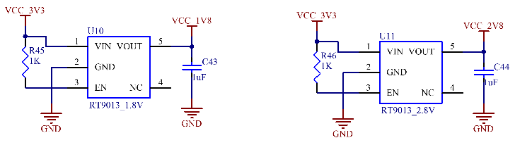
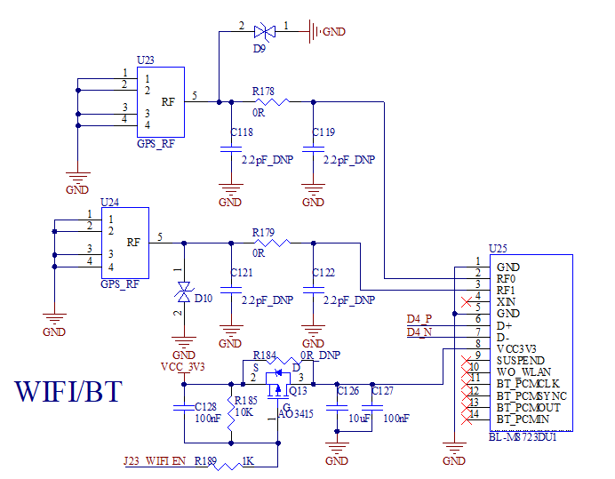

# User’s Hardware Manual

Document classification: □ Top secret □ Secret □ Internal information ■ Open

## Copyright

The copyright of this manual belongs to Baoding Folinx Embedded Technology Co., Ltd. Without the written permission of our company, no organizations or individuals have the right to copy, distribute, or reproduce any part of this manual in any form, and violators will be held legally responsible.

Forlinx adheres to copyrights of all graphics and texts used in all publications in original or license-free forms.

The drivers and utilities used for the components are subject to the copyrights of the respective manufacturers. The license conditions of the respective manufacturer are to be adhered to. Related license expenses for the operating system and applications should be calculated/declared separately by the related party or its representatives.

## Overview

This manual is designed to help users quickly familiarize themselves with the product, understand interface functions and configuration, and primarily discusses the interface functions of the development board, interface introductions, product power consumption, and troubleshooting issues that may arise during use. Some commands were commented to make it easier for users to understand (Adequate and practical for the purpose). For issues related to pin function multiplexing and hardware problem troubleshooting methods, please refer to the "OKA40i - C Pin Multiplexing Comparison Table" and the "OKA40i - C Design Guide" provided by Forlinx. 

There are total four chapters:

Chapter 1. is CPU overview, briefly introducing its performance and applications;

Chapter 2. is comprehensive introduction to the SoM, including connector pins explanations and function introductions;

Chapter 3. is comprehensive introduction to the development board, divided into multiple chapters, including both hardware principles and simple design ideas;

Chapter 4. mainly describes the board’s power consumption performance and other considerations;

## Application  Scope

This software manual is applicable to the OKA40i-C platform Linux 5.10 operating system of  Feiling Company. 

## Revision History

| Version | Date       | Modification            |
| ------- | ---------- | ----------------------- |
| V1.0    | 11/06/2024 | On-line initial version |

## 1\. A40iT3 Description

The Allwinner A40i is a high - performance and ultra - efficient processor in the field of intelligent industrial control. The A40i features an ARM Cortex - A7 core with an operating frequency of up to 1.2 GHz. It is equipped with a Mali400 MP2 graphics processor and various display interfaces, and also has a rich array of industry application interfaces. It is mainly used in various industrial control industries that require video output. The PMIC (Power Management Integrated Circuit) used in conjunction with the A40i supports three power supply methods: external power, USB, and lithium - ion batteries. It also integrates power path selection and lithium - ion battery charge - discharge management functions, which greatly simplifies the design of end - products. The T3 is a quad - core in - vehicle navigation processor from Allwinner. Its functions and pins are fully compatible with those of the A40i. The T3 is an automotive - grade chip, capable of adapting to harsher working environments. 

Target Applications:

·Embedded Device

·Intelligent Station Terminal

·Intelligent Industrial Control System

·Collecting

　　·Machine vision

　　·Industrial Internet of Thing.

　　·Mobile connected devices

·Digital signage

·In-car navigation

　　　　……

**A40i Block Diagram**

**T3 Block Diagram**

## 2\. FETA40i &T3-C SoM Description

### 2.1 FETA40i & T3-C SoM Appearance

**FETA40i** 

**Front**

**Back**

**T3-C**

**Front**

**Back**

### 2.2 FETA40i/T3-C SoM Dimension Diagram

**Top **

**Perspective **

**Side **

Structure size: 45mm×68mm, dimensional tolerance ±0.15mm.

Plate making process: 1.4mm thickness, 10-layer immersion gold PCB.

Connector  Four 0.5mm pitch, 80pin board-to-board connectors.               

See the appendix for the connector dimension drawing.

### 2.3 Performance Parameters

#### 2.3.1 System Main Frequency

| **Name**| **Specification**| | | | **Description**
|:----------:|:----------:|----------|----------|----------|:----------:
| | **Minimum**| **Typical**| **Maximum**| **Unit**| 
| Main Frequency| —| —| 1200| MHz| —
| RTC clock| —| 32.768| —| KHz| —

#### 2.3.2 Power Parameter

| **Parameter**| **Pin Number**| **Specification**| | | | **Description**
|:----------:|:----------:|:----------:|----------|----------|----------|:----------:
| | | **Minimum**| **Typical**| **Maximum**| **Unit**| 
| Main Power Supply Voltage| ACIN| 3.9| 5| 6.3| V| It will shutdown if voltage is higher than 7.1V.
| USB Voltage| USBVBUS| 3.8| 5| 5| V| 
| Lithium battery voltage| VBAT| 3.8| 4.2| 4.24| V| 
| No-load current| —| 234| —| 392| mA| No display, no operation
| High-load current| —| 950| —| 1090| mA| 7-inch screen video playback + DVP camera

#### 2.3.3 Operating Environment

| **Parameter**| | **Specification**| | | | **Description**
|:----------:|----------|:----------:|----------|----------|----------|:----------:
| | | **Minimum**| **Typical**| **Maximum**| **Unit**| 
| Operating temperature| Operating Environment| -40| 25| 85| ℃| Industrial-grade
| | Storage Environment| -40| 25| 85| ℃| 
| | Operating Environment| -25| 25| +85| ℃| Extended commercial grade
| | Storage Environment| -40| 25| +85| ℃| 
| Humidity| Operating Environment| 10| —| 90| ％RH| No condensation
| | Storage Environment| 5| —| 95| ％RH| 

#### 2.3.4 SoM Interface Speed

| **Parameter**| **Specification**| | | | **Description**
|:----------:|:----------:|----------|----------|----------|:----------:
| | **Minimum**| **Typical**| **Maximum**| **Unit**| 
| Serial Port Communication Speed| —| 115200| —| bps| —
| SPI Communication Speed| —| —| 100| MHz| 
| TWI Communication Speed| —| 100| 400| Kbps| —
| SD/MMC/SDIO| —| —| 25| MBps| 3.3V,50MHZ
| USB interface speed| —| —| 480| Mbps| —
| SATA interface speed| —| —| 3.0| Gbps| —

#### 2.3.5 ESD  Features

| Parameter| Specification| | Unit| Application Scope
|:----------:|:----------:|----------|:----------:|:----------:
| | Minimum| Maximum| | 
| ESD HBM(JEDEC JS-001-2014)| -4000| 4000| V| Signals exported from SoM
| ESD CDM(JEDEC JS-002-2014)| -500| 500| V| Signals exported from SoM

**Note：**

**1\. The above data is provided by Allwinner;**

**2\. As all the signals exported from SoM are electrostatic sensitive signals, the interfaces should be well protected from static electricity in the carrier board design and the SoM transportation, assembling, and use.**

### 2.4 SoM Interface Speed

| **Function**                                               | **Quantity** | **Parameter**                                                |
| ---------------------------------------------------------- | ------------ | ------------------------------------------------------------ |
| LCD                                                        | ≤2           | Maximum RGB888 24-bit, supporting up to 1920 x1080 @ 60fps;  |
| HDMI                                                       | 1            | HDMI 1.4, supports 1080p@60fps; HDCP 1.2 with encrypted protection. |
| LVDS                                                       | 1            | Supports single/dual-link LVDS, JEIDA and VESA output modes, up to 1920x1080 @ 60fps. |
| MIPI_DSITBD | 1            | MIPI DSI V1.01\&MIPI D-PHY V1.00, 4 x data channel up to 1080p @ 60fps |
| TVOUT                                                      | 4            | 4-channel CVBS output, supporting NTSC and PAL system        |
| CAMERA                                                     | ≤2           | CSI0: 1 x 8/16-bit parallel interface (DVP), supporting up to 5-Megapixel, supporting 1080p @ 30fps; CSI1: 1 x 8/16/24-bit parallel interface (DVP), supporting up to 5-Megapixel, supporting 720p @ 30fps. |
| TVIN                                                       | 4            | 4-channel CVBS input, supporting NTSC and PAL system.        |
| SD/MMC/SDIO                                                | ≤4           | It supports up to 50 MHz for the 1-bit or 4-bit transmission mode specifications of SD and SDIO cards: SD/MMC/SDIO0: 4-bit data bus (used for programming); SD/MMC/SDIO1: 4-bit data bus; SD/MMC/SDIO2: 8-bit data bus (occupied by the eMMC on the core board); SD/MMC/SDIO3: 4-bit data bus. |
| USB HOST                                                   | 2            | USB 2.0 （USB 2.0（up to 480 Mbps）                          |
| USB OTG                                                    | 1            | USB 2.0 （up to 480 Mbps）                                   |
| I2S/PCM                                                    | ≤2           | Supports up to 2 I2S/PCM Audio;                              |
| AC97                                                       | 1            | Up to 48 KHz sample rate                                     |
| AUDIO CODEC                                                | 1            | 1 x differential PHONEOUT, 1 x stereo headphone output, 1MIC, 1LINEIN |
| UART                                                       | ≤8           | Each supports up to 115200 UART0: 3-wire, debug port UART1: 8-wire serial port UART2/UART3: 5-wire serial port. UART4/UART5/UART6/UART7: 3-wire serial port |
| SPI                                                        | ≤4           | It is a full-duplex synchronous serial interface with a maximum clock frequency of 100 MHz. It can be configured to support master/slave modes and has 2 chip selects to support multiple peripherals. |
| TWI                                                        | ≤5           | Up to 400Kbps                                                |
| Ethernet                                                   | ≤2           | 1 x 10/100Mbps adaptive; 1 x10/100/1000Mbps adaptive.    |
| PWM                                                        | ≤8           | Supports PWM output and capture input                        |
| JTAG                                                       | Support      |                                                              |
| KeyPad Port                                                | Support      | Up to 8*8；                                                  |
| KEYADC                                                     | ≤2           | 6-bit, 2-channel, input voltage range 0-2 V for analog key detection, conversion rate up to 250 HZ. |
| SMC                                                        | ≤2           | Supports ISO/IEC 7816-3:1997(E) and EMV2000(4.0) standard.   |
| CIR                                                        | ≤2           |                                                              |
| SATATBD     | 1            | Up to 3.0Gbps                                                |
| RTP                                                        | 1            | 1 x four-wire resistance touch                               |

**Note: "TBD" means the function has not been developed in this phase; the parameters in the table are hardware design or theoretical CPU values.**

### 2.5 FETA40i/T3-C SoM Pins Definition

#### 2.5.1 FETA40i/T3-C SoM Pins Schematic

#### 2.5.2 FETA40i/T3-C SoM Pins Description

**Note1:**

**Num ——SoM connector pin no.:**

**Ball —— CPU pin ball no.**

**GPIO ——CPU pin general I/O port serial number**

**Vol  ——Pin signal level**

**Note2:**

**Signal Name——SoM connector network name, the top right corner subscripts’ meaning are as follows:**

| **Superscript No.**| **Superscript Description**
|:----------:|----------
| \[1]| Pins can be configured for interrupt use.
| \[2]| The default pin level is 1.8 V.
| \[3]| Pins are CPU boot-related pins, which are not recommended for IO.
| \[4]| Special-purpose pins and can not be used as IO.

Pin Description—— SoM Pin Signal Descriptions

Default function—— All pin functions of the SoM are specified according to the "default function" in the table below. Please do not modify it, otherwise it may be delivered from the factory.

Drive conflict—— If you have any questions, please contact our sales or technical support.           

**Note3: The pins marked with "Do not use for carrier board" in the "Pin Description" are those used by the SoM, and should not be used in the carrier board design.**

Table1 \*\* LEFT\_UP（P1） Connector Interface(Odd) Pin Definition

| **NUM**| **BALL**| **Signal Name**| **GPIO**| **VOL**| **Pin Description**| **Default Function**
|:----------:|:----------:|:----------:|:----------:|----------|----------|:----------:
| LU\_79| —| ACIN| —| 3.9-6.3V| Power Input| ACIN
| LU\_77| —| ACIN| —| 3.9-6.3V| Power Input| ACIN
| LU\_75| —| ACIN| —| 3.9-6.3V| Power Input| ACIN
| LU\_73| —| ACIN| —| 3.9-6.3V| Power Input| ACIN
| LU\_71| —| VBAT| —| 3.8-4.2V| Lithium battery input| VBAT
| LU\_69| —| VBAT| —| 3.8-4.2V| Lithium battery input| VBAT
| LU\_67| —| VBAT| —| 3.8-4.2V| Lithium battery input| VBAT
| LU\_65| —| VBAT| —| 3.8-4.2V| Lithium battery input| VBAT
| LU\_63| —| GND| —| —| Ground| GND
| LU\_61| —| GND| —| —| Ground| GND
| LU\_59| AB17| SPI0\_CS0**\[2] \[3]**| PC23| 1.8V| SPI0 chip select（Low）| SPI0\_CS0
| LU\_57| AC10| SPI0\_MISO**\[2] \[3]**| PC1| 1.8V| SPI0 data, master input and slave output| SPI0\_MISO
| LU\_55| AB11| SPI0\_MOSI**\[2] \[3]**| PC0| 1.8V| SPI0 data, master output and slave input| SPI0\_MOSI
| LU\_53| AD10| SPI0\_CLK**\[2] \[3]**| PC2| 1.8V| SPI0 clock| SPI0\_CLK
| LU\_51| —| GND| —| —| Ground| GND
| LU\_49| V23| SDC3\_DET**\[1]**| PI10| 3.3V| SDC3 card detection| SDC3\_DET
| LU\_47| W24| SDC3\_D1| PI7| 3.3V| SDC3 data bit 1| SDC3\_D1
| LU\_45| W23| SDC3\_D0| PI6| 3.3V| SDC3 data bit 0| SDC3\_D0
| LU\_43| —| GND| —| —| Ground| GND
| LU\_41| W22| SDC3\_CLK| PI5| 3.3V| SDC3 clock| SDC3\_CLK
| LU\_39| Y23| SDC3\_CMD| PI4| 3.3V| SDC3 command| SDC3\_CMD
| LU\_37| V22| SDC3\_D3| PI9| 3.3V| SDC3 data bit 3| SDC3\_D3
| LU\_35| W20| SDC3\_D2| PI8| 3.3V| SDC3 data bit 2| SDC3\_D2
| LU\_33| —| GND| —| —| Ground| GND
| LU\_31| AB23| UART4\_TX| PG10| 3.3V| UART4 Sending data| UART4\_TX
| LU\_29| AB24| UART4\_RX| PG11| 3.3V| UART4 receiving data：| UART4\_RX
| LU\_27| AC23| UART3\_RTS| PG8| 3.3V| UART3 request sending| UART3\_RTS
| LU\_25| AC24| UART3\_CTS| PG9| 3.3V| UART3 clear sending| UART3\_CTS
| LU\_23| AD22| UART3\_TX| PG6| 3.3V| UART3 Sending data| UART3\_TX
| LU\_21| AD23| UART3\_RX| PG7| 3.3V| UART3 receiving data：| UART3\_RX
| LU\_19| —| GND| —| —| Ground| GND
| LU\_17| E23| SDC1\_EN**\[1]**| PH1| 3.3V| SDC1 enable| SDC1\_EN
| LU\_15| Y20| SDC1\_CLK| PG1| 3.3V| SDC1 clock| SDC1\_CLK
| LU\_13| AA20| SDC1\_CMD| PG0| 3.3V| SDC1 command| SDC1\_CMD
| LU\_11| AB21| SDC1\_D0| PG2| 3.3V| SDC1 data bit 0| SDC1\_D0
| LU\_9| AC21| SDC1\_D1| PG3| 3.3V| SDC1 data bit 1| SDC1\_D1
| LU\_7| AB22| SDC1\_D2| PG4| 3.3V| SDC1 data bit 2| SDC1\_D2
| LU\_5| AC22| SDC1\_D3| PG5| 3.3V| SDC1 data bit 3| SDC1\_D3
| LU\_3| U22| PI15**\[1]**| PI15| 3.3V| General I/O| PI15
| LU\_1| —| GND| —| —| Ground| GND

**Table 2 LEFT\_UP（P1） Connector Interface(Even) Pin Definition**

| **NUM**| **BALL**| **Signal Name**| **GPIO**| **VOL**| **Pin Description**| **Default Function**
|:----------:|:----------:|:----------:|:----------:|:----------:|----------|:----------:
| LU\_80| —| GND| —| —| Ground| GND
| LU\_78| —| GND| —| —| Ground| GND
| LU\_76| —| GND| —| —| Ground| GND
| LU\_74| —| GND| —| —| Ground| GND
| LU\_72| —| USBVBUS| —| 3.9-6.3V| USB power voltage| USBVBUS
| LU\_70| —| USBVBUS| —| 3.9-6.3V| USB power voltage| USBVBUS
| LU\_68| —| PS| —| 3.9-6.3V| PMIC output voltage| PS
| LU\_66| —| PS| —| 3.9-6.3V| PMIC output voltage| PS
| LU\_64| —| GND| —| —| Ground| GND
| LU\_62| —| GND| —| —| Ground| GND
| LU\_60| —| GND| —| —| Ground| GND
| LU\_58| —| VCC\_3V| —| 3.3V| PMIC output voltage| VCC\_3V
| LU\_56| —| VCC\_3V| —| 3.3V| PMIC output voltage| VCC\_3V
| LU\_54| —| PWRON| —| —| Power on/off key, which can be floated if not used. When VBTA is used for power supply, the power on key is required to start the machine.| PWRON
| LU\_52| —| TS| —| —| Lithium battery temperature detection| TS
| LU\_50| —| CHGLED| —| —| Lithium battery charge state indication| CHGLED
| LU\_48| —| GND| —| —| Ground| GND
| LU\_46| D22| STROBE**\[1]**| PH12| 3.3V| Digital camera STROBE signal input| STROBE
| LU\_44| K21| CSI\_RST| PB6| 3.3V| Digital camera reset signal output| CSI\_RST
| LU\_42| W19| CSI\_VSYNC| PE3| 2.8V| Field sync signal input for digital camera| CSI\_VSYNC
| LU\_40| J20| CSI\_PWDN| PB7| 3.3V| Digital camera power control output| CSI\_PWDN
| LU\_38| W17| CSI\_HSYNV| PE2| 2.8V| Line sync signal input for digital camera| CSI\_HSYNV
| LU\_36| AC20| CSI\_D7| PE11| 2.8V| 8-bit digital camera data 7 input| CSI\_D7
| LU\_34| —| GND| —| —| Ground| GND
| LU\_32| Y17| CSI\_MCLK| PE1| 2.8V| Master clock output for the digital camera| CSI\_MCLK
| LU\_30| AB20| CSI\_D6| PE10| 2.8V| 8-bit digital camera data 6 input| CSI\_D6
| LU\_28| AD20| CSI\_D5| PE9| 2.8V| 8-bit digital camera data 5 input| CSI\_D5
| LU\_26| —| GND| —| —| Ground| GND
| LU\_24| AA17| CSI\_PCLK| PE0| 2.8V| Pixel clock input for digital camera| CSI\_PCLK
| LU\_22| AD19| CSI\_D4| PE8| 2.8V| 8-bit digital camera data 4 input| CSI\_D4
| LU\_20| Y19| CSI\_D0| PE4| 2.8V| 8-bit digital camera data 0 input| CSI\_D0
| LU\_18| AC19| CSI\_D3| PE7| 2.8V| 8-bit digital camera data 3 input| CSI\_D3
| LU\_16| AA19| CSI\_D1| PE5| 2.8V| 8-bit digital camera data 1 input| CSI\_D1
| LU\_14| AB19| CSI\_D2| PE6| 2.8V| 8-bit digital camera data 2 input| CSI\_D2
| LU\_12| —| GND| —| —| Ground| GND
| LU\_10| AA22| TWI3\_SCK| PI0| 3.3V| TWI3 clock| TWI3\_SCK
| LU\_8| AA23| TWI3\_SDA| PI1| 3.3V| TWI3 data| TWI3\_SDA
| LU\_6| AA24| TWI4\_SCK| PI2| 3.3V| TWI4 clock| TWI4\_SCK
| LU\_4| Y22| TWI4\_SDA| PI3| 3.3V| TWI4 data| TWI4\_SDA
| LU\_2| —| GND| —| —| Ground| GND

**Table 3 RIGHT\_UP（P2） Connector Interface(Odd) Pin Definition**

| **NUM**| **BALL**| **Signal Name**| **GPIO**| **VOL**| **Pin Description**| **Default Function**
|:----------:|:----------:|:----------:|:----------:|:----------:|----------|:----------:
| RU\_79| —| GND| —| —| Ground| GND
| RU\_77| D18| USB\_VBUSDET**\[1]**| PH17| 3.3V| USB VBUS detection| USB\_VBUSDET
| RU\_75| U23| PI14**\[1]**| PI14| 3.3V| General I/O| PI14
| RU\_73| C23| PCIE\_WAKE**\[1]**| PH4| 3.3V| PCIE WAKE UP signal| PCIE\_WAKE#
| RU\_71| —| GND| —| —| Ground| GND
| RU\_69| G20| SPI2\_CS1| PB13| 3.3V| SPI2 chip selection 1| PB13
| RU\_67| Y16| SPI2\_MISO**\[2]**| PC22| 1.8V| SPI2 data, master input and slave output| SPI2\_MISO
| RU\_65| AA14| SPI2\_MOSI**\[2]**| PC21| 1.8V| SPI2 data, master output and slave input| SPI2\_MOSI
| RU\_63| AA16| SPI2\_CS0**\[2]**| PC19| 1.8V| SPI2 chip selection 0| SPI2\_CS0
| RU\_61| AB18| SPI2\_CLK**\[2]**| PC20| 1.8V| SPI2 clock| SPI2\_CLK
| RU\_59| —| GND| —| —| Ground| GND
| RU\_57| AB7| SATA\_CLKP| —| —| SATA clock+| SATA\_CLKP
| RU\_55| AA7| SATA\_CLKN| —| **—**| SATA clock-| SATA\_CLKN
| RU\_53| —| GND| —| —| Ground| GND
| RU\_51| AA9| SATA\_TXP| **—**| **—**| SATA send+| SATA\_TXP
| RU\_49| AB9| SATA\_TXM| —| **—**| SATA send-| SATA\_TXM
| RU\_47| —| GND| **—**| —| Ground| GND
| RU\_45| AB8| SATA\_RXM| —| **—**| SATA receive-| SATA\_RXM
| RU\_43| AA8| SATA\_RXP| **—**| **—**| SATA receive+| SATA\_RXP
| RU\_41| —| GND| —| —| Ground| GND
| RU\_39| U11| HDMI\_HPD| **—**| **—**| HDMI hot plug detection| HDMI\_HPD
| RU\_37| W9| HDMI\_SDA| —| —| HDMI DDC data| HDMI\_SDA
| RU\_35| V9| HDMI\_SCL| **—**| **—**| HDMI DDC clock| HDMI\_SCL
| RU\_33| V10| HDMI\_CEC| —| —| HDMI consumer electronics control channel| HDMI\_CEC
| RU\_31| —| GND| —| **—**| Ground| GND
| RU\_29| AC4| HDMI\_CLKN| **—**| —| HDMI clock-| HDMI\_CLKN
| RU\_27| AD4| HDMI\_CLKP| —| —| HDMI clock+| HDMI\_CLKP
| RU\_25| —| GND| **—**| **—**| Ground| GND
| RU\_23| AC5| HDMI\_TX0N| —| —| HDMI send 0 negative| HDMI\_TX0N
| RU\_21| AD5| HDMI\_TX0P| **—**| **—**| HDMI send 0 positive| HDMI\_TX0P
| RU\_19| AC6| HDMI\_TX1N| —| —| HDMI send 1 negative| HDMI\_TX1N
| RU\_17| AD6| HDMI\_TX1P| **—**| **—**| HDMI send 1 positive| HDMI\_TX1P
| RU\_15| AC7| HDMI\_TX2N| —| —| HDMI send 2 negative| HDMI\_TX2N
| RU\_13| AD7| HDMI\_TX2P| **—**| **—**| HDMI send 2 positive| HDMI\_TX2P
| RU\_11| —| GND| —| —| Ground| GND
| RU\_9| AA6| TPX1| **—**| **—**| Resistive touch input X1| TPX1
| RU\_7| AB6| TPX2| —| —| Resistive touch input X2| TPX2
| RU\_5| AB5| TPY1| **—**| **—**| Resistive touch input Y1| TPY1
| RU\_3| AB4| TPY2| **—**| **—**| Resistive touch input Y2| TPY2
| RU\_1| —| GND| —| —| Ground| GND

**Table 4 Definition of RIGHT (P2) connector interface (even) pins**

| **NUM**| **BALL**| **Signal Name**| **GPIO**| **VOL**| **Pin Description**| **Default Function**
|:----------:|:----------:|:----------:|:----------:|:----------:|----------|:----------:
| RU\_80| —| GND| —| —| Ground| GND
| RU\_78| V21| USB0\_DRVVBUS**\[4]**| PI13| 3.3V| Supply enable control pin for USB0| Do not use the carrier board
| RU\_76| D19| USB\_ID**\[1]**| PH21| 3.3V| USB ID pin| USB\_ID
| RU\_74| —| GND| —| —| Ground| GND
| RU\_72| AD8| USB0\_DP| —| —| USB0 data positive| USB0\_DP
| RU\_70| AC8| USB0\_DM| —| —| USB0 data negative| USB0\_DM
| RU\_68| —| GND| —| —| Ground| GND
| RU\_66| AC9| USB1\_DM| —| —| USB1 data negative| USB1\_DM
| RU\_64| AD9| USB1\_DP| **—**| **—**| USB1 data positive| USB1\_DP
| RU\_62| —| GND| —| —| Ground| GND
| RU\_60| AA10| USB2\_DM| —| —| USB2 data negative| USB2\_DM
| RU\_58| AB10| USB2\_DP| —| —| USB2 data positive| USB2\_DP
| RU\_56| —| GND| —| —| Ground| GND
| RU\_54| W13| SDC0\_D2**\[3]**| PF5| 3.3V| SDC0 data bit 2| SDC0\_D2
| RU\_52| Y13| SDC0\_D3**\[3]**| PF4| 3.3V| SDC0 data bit 3| SDC0\_D3
| RU\_50| AA13| SDC0\_CMD**\[3]**| PF3| 3.3V| SDC0 command| SDC0\_CMD
| RU\_48| V24| SDC0\_DET**\[1]**| PI11| 3.3V| SDC0 card detection| SDC0\_DET
| RU\_46| W11| SDC0\_CLK**\[3]**| PF2| 3.3V| SDC0 clock| SDC0\_CLK
| RU\_44| Y11| SDC0\_D0**\[3]**| PF1| 3.3V| SDC0 data bit 0| SDC0\_D0
| RU\_42| AA11| SDC0\_D1**\[3]**| PF0| 3.3V| SDC0 data bit 1| SDC0\_D1
| RU\_40| —| GND| —| —| Ground| GND
| RU\_38| J21| PCIE\_PWR\_EN| PB8| 3.3V| PCIE interface power enable| PCIE\_PWR\_EN
| RU\_36| J23| WIFI\_EN| PB10| 3.3V| WiFi module power enable| WIFI\_EN
| RU\_34| G19| USB\_RST| PB12| 3.3V| USB hub reset signal| USB\_RST
| RU\_32| —| GND| —| —| Ground| GND
| RU\_30| AD3| KEYADC0| —| —| Analog key input channel 0| KEYADC0
| RU\_28| AA4| KEYADC1| —| —| Analog key input channel 1| KEYADC1
| RU\_26| —| GND| —| —| Ground| GND
| RU\_24| —| AGND| —| —| Analog ground| AGND
| RU\_22| AC3| VMIC| —| —| MIC bias voltage output| VMIC
| RU\_20| AB3| MICIN1| —| —| MIC input channel 1| MICIN1
| RU\_18| AD2| MICIN2| —| —| MIC input channel 2| MICIN2
| RU\_16| AA3| LINEINL| —| —| Line in left channel input| LINEINL
| RU\_14| AB2| LINEINR| —| —| Line in right channel input| LINEINR
| RU\_12| —| GND| —| —| Ground| GND
| RU\_10| D23| HP\_DET**\[1]**| PH0| 3.3V| Headphone plug detection| HP\_DET
| RU\_8| AA2| HPOUTL| —| —| Headphone left channel output| HPOUTL
| RU\_6| W4| HPCOMFB| —| —| Headphone feedback reference input| HPCOMFB
| RU\_4| Y3| HPCOM| —| —| Headphone feedback reference output| HPCOM
| RU\_2| AA1| HPOUTR| —| —| Headphone right channel output| HPOUTR

**Table 5 Left \_ DOWN (P3) Connector Interface (Odd) Pin Definition**

| **NUM**| **BALL**| **Signal Name**| **GPIO**| **VOL**| **Pin Description**| **Default Function**
|:----------:|:----------:|:----------:|:----------:|:----------:|:----------:|:----------:
| LD\_79| —| GND| —| —| Ground| GND
| LD\_77| —| FEL| —| —| Boot modes| FEL
| LD\_75| —| RESET| —| —| SoM reset pin| RESET
| LD\_73| —| GND| —| —| Ground| GND
| LD\_71| T21| UART7\_TX| PI20| 3.3V| UART7 Sending data| UART7\_TX
| LD\_69| R23| UART7\_RX| PI21| 3.3V| UART7 receiving data：| UART7\_RX
| LD\_67| B24| UART5\_TX**\[1]**| PH6| 3.3V| UART5 Sending data| UART5\_TX
| LD\_65| B22| UART5\_RX**\[1]**| PH7| 3.3V| UART5 receiving data：| UART5\_RX
| LD\_63| F22| UART0\_TX| PB22| 3.3V| UART0 Sending data| UART0\_TX
| LD\_61| F23| UART0\_RX| PB23| 3.3V| UART0 receiving data：| UART0\_RX
| LD\_59| —| GND| —| —| Ground| GND
| LD\_57| F18| PHY\_INT**\[1]**| PH20| 3.3V| Reserved network PHY INTERRUPT pin| PHY\_INT
| LD\_55| G17| PHY\_RST| PH22| 3.3V| Reserved network PHY RESET pin| PHY\_RST
| LD\_53| E22| ETH\_WOL\_INT**\[1]**| PH3| 3.3V| Reserved network Wake up INTERRUPT pin| ETH\_WOL\_INT
| LD\_51| —| GND| —| —| Ground| GND
| LD\_49| N19| EMDIO| PA12| 3.3V| MII control interface data| EMDIO
| LD\_47| N20| EMDC| PA11| 3.3V| MII control interface clock| EMDC
| LD\_45| —| GND| —| —| Ground| GND
| LD\_43| N22| ERXERR| PA9| 3.3V| MII interface frame error| ERXERR
| LD\_41| R22| ECRS| PA15| 3.3V| MI interface carrier detection| ECRS
| LD\_39| N21| ERXDV| PA10| 3.3V| MII interface receiving data is valid| ERXDV
| LD\_37| M22| ERXD0| PA3| 3.3V| MII interface data receive bit 0| ERXD0
| LD\_35| M23| ERXD1| PA2| 3.3V| MII interface data receive bit 1| ERXD1
| LD\_33| M19| ERXD2| PA1| 3.3V| MII interface data receive bit 2| ERXD2
| LD\_31| L23| ERXD3| PA0| 3.3V| MII interface data receive bit 3| ERXD3
| LD\_29| N23| ERXCK| PA8| 3.3V| MII interface receiving reference clock| ERXCK
| LD\_27| —| GND| —| —| Ground| GND
| LD\_25| P22| ETXCK| PA14| 3.3V| MII interface sending reference clock| ETXCK
| LD\_23| N24| ETXD0| PA7| 3.3V| MII interface data transmit bit 0| ETXD0
| LD\_21| M24| ETXD1| PA6| 3.3V| MII interface data transmit bit 1| ETXD1
| LD\_19| M20| ETXD2| PA5| 3.3V| MII interface data transmit bit 2| ETXD2
| LD\_17| M21| ETXD3| PA4| 3.3V| MII interface data transmit bit 3| ETXD3
| LD\_15| P23| ETXEN| PA13| 3.3V| MII interface to send data enable| ETXEN
| LD\_13| R21| ECOL| PA16| 3.3V| MII interface collision detection| ECOL
| LD\_11| R20| ETXERR| PA17| 3.3V| MII interface sending data error| ETXERR
| LD\_9| —| GND| —| —| Ground| GND
| LD\_7| D24| RTC\_IRQ**\[1]**| PH2| 3.3V| Interrupt input of external RTC chip | RTC\_IRQ
| LD\_5| —| GND| —| —| Ground| GND
| LD\_3| C24| PH5**\[1]**| PH5| 3.3V| General I/O| PH5
| LD\_1| —| GND| —| —| Ground| GND

**Table 6 Left \_ DOWN (P3) Connector Interface (Even) Pin Definition**

| **NUM**| **BALL**| **Signal Name**| **GPIO**| **VOL**| **Pin Description**| **Default Function**
|:----------:|:----------:|:----------:|:----------:|:----------:|:----------:|:----------:
| LD\_80| —| GND| —| —| Ground| GND
| LD\_78| —| NC| —| —| —| —
| LD\_76| —| NC| —| —| —| —
| LD\_74| T24| UART2\_TX**\[1]**| PI18| 3.3V| UART2 Sending data| UART2\_TX
| LD\_72| T22| UART2\_RX**\[1]**| PI19| 3.3V| UART2 receiving data：| UART2\_RX
| LD\_70| T23| UART2\_CTS**\[1]**| PI17| 3.3V| UART2 clear sending| UART2\_CTS
| LD\_68| T19| UART2\_RTS**\[1]**| PI16| 3.3V| UART2 request sending| UART2\_RTS
| LD\_66| —| GND| —| —| Ground| GND
| LD\_64| U18| CK32KO**\[1]**| PI12| 3.3V| 32K clock output| CK32KO
| LD\_62| J24| IR0\_RX| PB4| 3.3V| Infrared data receiving signal| IR0\_RX
| LD\_60| —| GND| —| —| Ground| GND
| LD\_58| G23| TWI1\_SCK| PB18| 3.3V| TWI1 clock| TWI1\_SCK
| LD\_56| G24| TWI1\_SDA| PB19| 3.3V| TWI1 data| TWI1\_SDA
| LD\_54| F24| TWI2\_SCK| PB20| 3.3V| TWI2 clock| TWI2\_SCK
| LD\_52| F21| TWI2\_SDA| PB21| 3.3V| TWI2 data| TWI2\_SDA
| LD\_50| —| GND| —| —| Ground| GND
| LD\_48| G21| JTAG\_TMS**\[4]**| PB14| 3.3V| JTAG test mode selection| JTAG\_TMS
| LD\_46| H22| JTAG\_TCK**\[4]**| PB15| 3.3V| JTAG test clock| JTAG\_TCK
| LD\_44| H23| JTAG\_TDO**\[4]**| PB16| 3.3V| JTAG test data output| JTAG\_TDO
| LD\_42| G22| JTAG\_TDI**\[4]**| PB17| 3.3V| JTAG test data input| JTAG\_TDI
| LD\_40| —| GND| —| —| Ground| GND
| LD\_38| C22| SMC\_RST**\[1]**| PH13| 3.3V| Smart card reset pin| SMC\_RST
| LD\_36| —| GND| —| —| Ground| GND
| LD\_34| C18| SMC\_CLK**\[1]**| PH18| 3.3V| Smart card clock signal| SMC\_CLK
| LD\_32| —| GND| —| —| Ground| GND
| LD\_30| E19| SMC\_SDA**\[1]**| PH19| 3.3V| Smart card data signal| SMC\_SDA
| LD\_28| D21| SMC\_DET**\[1]**| PH16| 3.3V| Smart card detection| SMC\_DET
| LD\_26| E18| SMC\_VCCEN| PH25| 3.3V| Smart card power enable| SMC\_VCCEN
| LD\_24| —| GND| —| —| Ground| GND
| LD\_22| A18| PH26| PH26| 3.3V| General I/O| PH26
| LD\_20| B19| PH27| PH27| 3.3V| General I/O| PH27
| LD\_18| C19| PH23| PH23| 3.3V| General I/O| PH23
| LD\_16| B18| PH24| PH24| 3.3V| General I/O| PH24
| LD\_14| B23| PH8**\[1]**| PH8| 3.3V| General I/O| PH8
| LD\_12| —| GND| —| —| Ground| GND
| LD\_10| J22| LCD\_BL\_EN| PB9| 3.3V| LCD backlight enable| LCD\_BL\_EN
| LD\_8| A21| CTP\_INT**\[1]**| PH15| 3.3V| Capacitive touch interrupt| CTP\_INT
| LD\_6| B21| CTP\_RST**\[1]**| PH14| 3.3V| Capacitive touch reset| CTP\_RST
| LD\_4| K23| LCD\_PWM| PB2| 3.3V| LCD backlight PWM regulating signal| LCD\_PWM
| LD\_2| —| GND| —| —| Ground| GND

**Table 7 RIGHT \_ DOWN (P4) Connector Interface (Odd) Pin Definition**

| **NUM**| **BALL**| **Signal Name**| **GPIO**| **VOL**| **Pin Description**| **Default Function**
|:----------:|:----------:|:----------:|:----------:|:----------:|:----------:|:----------:
| RD\_79| T4| LCD\_CLK| PD24| 3.3V| RGB interface pixel clock signal| LCD\_CLK
| RD\_77| —| GND| —| —| Ground| GND
| RD\_75| T5| LCD\_DE| PD25| 3.3V| RGB interface data enable signal| LCD\_DE
| RD\_73| U6| LCD\_VSYNC| PD27| 3.3V| RGB interface vertical synchronization signal| LCD\_VSYNC
| RD\_71| U5| LCD\_HSYNC| PD26| 3.3V| RGB interface horizontal synchronization signal| LCD\_HSYNC
| RD\_69| T3| LCD\_D23| PD23| 3.3V| Red data bit 7 (data)| LCD\_D23
| RD\_67| U2| LCD\_D22| PD22| 3.3V| Red data bit 6| LCD\_D22
| RD\_65| U1| LCD\_D21| PD21| 3.3V| Red data bit 5| LCD\_D21
| RD\_63| T2| LCD\_D20| PD20| 3.3V| Red data bit 4| LCD\_D20
| RD\_61| —| GND| —| —| Ground| GND
| RD\_59| R4| LCD\_D19| PD19| 3.3V| Red data bit 3| LCD\_D19
| RD\_57| R5| LCD\_D18| PD18| 3.3V| Red data bit 2| LCD\_D18
| RD\_55| —| GND| —| —| Ground| GND
| RD\_53| P4| LCD\_D17| PD17| 3.3V| Red data bit 1| LCD\_D17
| RD\_51| P5| LCD\_D16| PD16| 3.3V| Red data bit 0（Low）| LCD\_D16
| RD\_49| —| GND| —| —| Ground| GND
| RD\_47| N4| LCD\_D15| PD15| 3.3V| Green data bit 7（high）| LCD\_D15
| RD\_45| N3| LCD\_D14| PD14| 3.3V| Green data bit 6| LCD\_D14
| RD\_43| —| GND| —| —| Ground| GND
| RD\_41| M4| LCD\_D13| PD13| 3.3V| Green data bit 5| LCD\_D13
| RD\_39| L3| LCD\_D12| PD12| 3.3V| Green data bit 4| LCD\_D12
| RD\_37| —| GND| —| —| Ground| GND
| RD\_35| L4| LCD\_D11| PD11| 3.3V| Green data bit 3| LCD\_D11
| RD\_33| L5| LCD\_D10| PD10| 3.3V| Green data bit 2| LCD\_D10
| RD\_31| —| GND| —| —| Ground| GND
| RD\_29| R3| LCD\_D9| PD9| 3.3V| Green data bit 1| LCD\_D9
| RD\_27| R2| LCD\_D8| PD8| 3.3V| Green data bit 0（Low）| LCD\_D8
| RD\_25| —| GND| —| —| Ground| GND
| RD\_23| P3| LCD\_D7| PD7| 3.3V| Blue data bit 7 （High）| LCD\_D7
| RD\_21| R1| LCD\_D6| PD6| 3.3V| Blue data bit 6| LCD\_D6
| RD\_19| —| GND| —| —| Ground| GND
| RD\_17| P2| LCD\_D5| PD5| 3.3V| Blue data bit 5| LCD\_D5
| RD\_15| P1| LCD\_D4| PD4| 3.3V| Blue data bit 4| LCD\_D4
| RD\_13| —| GND| —| —| Ground| GND
| RD\_11| M3| LCD\_D3| PD3| 3.3V| Blue data bit 3| LCD\_D3
| RD\_9| N2| LCD\_D2| PD2| 3.3V| Blue data bit 2| LCD\_D2
| RD\_7| —| GND| —| —| Ground| GND
| RD\_5| M1| LCD\_D1| PD1| 3.3V| Blue data bit 1| LCD\_D1
| RD\_3| M2| LCD\_D0| PD0| 3.3V| Blue data bit 0（Low）| LCD\_D0
| RD\_1| —| GND| —| —| Ground| GND

**Table 8 RIGHT \_ DOWN (P4) Connector Interface (Even) Pin Definition**

| **NUM**| **BALL**| **Signal Name**| **GPIO**| **VOL**| **Pin Description**| **Default Function**
|:----------:|:----------:|:----------:|:----------:|:----------:|:----------:|:----------:
| RD\_80| —| GND| —| —| Ground| GND
| RD\_78| V6| PHONEOUTP| —| —| Differential headphone output positive| PHONEOUTP
| RD\_76| V5| PHONEOUTN| —| —| Differential headphone output negative| PHONEOUTN
| RD\_74| —| GND| —| —| Ground| GND
| RD\_72| —| GND| —| —| Ground| GND
| RD\_70| K20| SPK\_SHDN| PB5| 3.3V| Audio power amplifier shutdown pin| SPK\_SHDN
| RD\_68| —| GND| —| —| Ground| GND
| RD\_66| —| GND\_TVIN| —| —| TVIN signal reference ground| GND\_TVIN
| RD\_64| W2| TVIN0| —| —| TVIN input channel 0| TVIN0
| RD\_62| Y1| TVIN1| \-| —| TVIN input channel 1| TVIN1
| RD\_60| Y2| TVIN2| \-| —| TVIN input channel 2| TVIN2
| RD\_58| W3| TVIN3| \-| —| TVIN input channel 3| TVIN3
| RD\_56| —| GND\_TVIN| \-| —| TVIN signal reference ground| GND\_TVIN
| RD\_54| —| GND| —| —| Ground| GND
| RD\_52| V1| TVOUT0| —| —| TVOUT output channel 0| TVOUT0
| RD\_50| V2| TVOUT1| —| —| TVOUT output channel 1| TVOUT1
| RD\_48| V3| TVOUT2| —| —| TVOUT output channel 2| TVOUT2
| RD\_46| V4| TVOUT3| —| —| TVOUT output channel 3| TVOUT3
| RD\_44| —| GND| —| —| Ground| GND
| RD\_42| A23| MIPI\_TP\_INT**\[1]**| PH9| 3.3V| MIPI touch interrupt| MIPI\_TP\_INT
| RD\_40| A22| MIPI\_ACC\_INT**\[1]**| PH10| 3.3V| MIPI screen three-axis acceleration interrupt| MIPI\_ACC\_INT
| RD\_38| —| GND| —| —| Ground| GND
| RD\_36| J2| MIPI\_DSI\_D0N| —| —| MIPI DSI differential data 0 negative| MIPI\_DSI\_D0N
| RD\_34| J1| MIPI\_DSI\_D0P| —| —| MIPI DSI differential data 0 positive| MIPI\_DSI\_D0P
| RD\_32| —| GND| —| —| Ground| GND
| RD\_30| K2| MIPI\_DSI\_D1N| —| —| MIPI DSI differential data 1 negative| MIPI\_DSI\_D1N
| RD\_28| K1| MIPI\_DSI\_D1P| —| —| MIPI DSI differential data 1 positive| MIPI\_DSI\_D1P
| RD\_26| —| GND| —| —| Ground| GND
| RD\_24| L2| MIPI\_DSI\_CKN| —| —| MIPI DSI differential clock-| MIPI\_DSI\_CKN
| RD\_22| L1| MIPI\_DSI\_CKP| —| —| MIPI DSI differential clock+| MIPI\_DSI\_CKP
| RD\_20| —| GND| —| —| Ground| GND
| RD\_18| J4| MIPI\_DSI\_D2N| —| —| MIPI DSI differential data 2 negative| MIPI\_DSI\_D2N
| RD\_16| J3| MIPI\_DSI\_D2P| —| —| MIPI DSI differential data 2 positive| MIPI\_DSI\_D2P
| RD\_14| —| GND| —| —| Ground| GND
| RD\_12| K4| MIPI\_DSI\_D3N| —| —| MIPI DSI differential data 3 negative| MIPI\_DSI\_D3N
| RD\_10| K3| MIPI\_DSI\_D3P| —| —| MIPI DSI differential data 3 positive| MIPI\_DSI\_D3P
| RD\_8| —| GND| —| —| Ground| GND
| RD\_6| C21| MIPI\_DSI\_EN**\[1]**| PH11| 3.3V| MIPI power enable| MIPI\_DSI\_EN
| RD\_4| K24| MIPI\_DSI\_PWM| PB3| 3.3V| MIPI backlight PWM regulating| MIPI\_DSI\_PWM
| RD\_2| —| GND| —| —| Ground| GND

### 2.6 SoM Hardware Design Description

The FETA40i-C/FETT3-C SoM supports three power supply modes: external power supply, USB and lithium battery. The SoM has integrated power path selection, lithium battery charging and discharging management, reset monitoring circuit and storage circuit into a compact module. The required external circuit is very simple, and a minimum system can be operated only by power supply, reset button and startup configuration, as shown in the following figure:

Please refer to “Appendix IV. for the minimal system schematic diagram However, in most cases, it is recommended to connect some external devices in addition to the minimal system, such as a debugging serial port, otherwise, the user can not check whether the system is booted. After completing these steps, additional user-specific functions can be added based on the default interface definitions provided by Forlinx for the SoM.

Please refer to section 3.5 in “Chapter 3. OKA40i/T3-C Carrier Board Description” for the peripheral circuits.

## 3\. OKA40i/T3-C Development Platform Description

### 3.1 OKA40i/T3-C Development Board Interface Diagram

The connection between SoM and the carrier board is board-to-board, and OKA40i-C/OKT3-C share one carrier board, and the main interfaces are shown in the figure below:

### 3.2 OKA40i/ T3-C Development Board Dimension Diagram

PCB Size: 130mm × 190mm

Fixed hole size: spacing: 120mm × 180mm, hole diameter: 3.2mm.

Plate making process: thickness 1.6mm, 4-layer PCB.

Power voltage: DC 5V, or USB power supply, or 4.2 V lithium battery power supply.

### 3.3 Carrier Board Naming Rules

ABC-D+IK:M

| Field| Field Description| Value| Description
|----------|----------|----------|----------
| A| Qualification level| PC| Prototype Sample
| | | Blank| Mass Production
| B| Product line identification| OK| Forlinx Embedded development board
| C| CPU Name| OKA40i| A40i
| | | OKT3| T3
| \-| Segment Identification| \-| 
| D| Connection| Cx| Board-to-board Connector
| \+| Segment Identification| \+| The configuration parameter section follows this identifier.
| I| Operating temperature| I| -40 to 85℃   industrial  level
| K| PCB Version| 11| V1.1
| | | xx| Vx.x
| :M| Internal Identification of the Manufacturer| :X| This is the internal identification of the manufacturer and has no impact on the use.

### 3.4 Carrier Board Resources

| **Function**| **Quantity**| **Parameter**
|:----------:|:----------:|----------
| LCD| 1| RGB 888 24-bit, up to 1920 \* 1080 @ 60fps;
| LVDS| 1| Supports single/dual link LVDS, up to 1920 \* 1080 @ 60fps; sharing a group of pins with LCD;
| MIPITBD| 1| Supports 4-channel MIPI DSI with resolution up to 1080p @ 60fps;
| HDMI| 1| HDMI 1.4 transmitter with HDCP 1.2, resolution up to 1080p @ 60fps;
| TVOUT| 1| Supports NTSC and PAL output; (4 channels of TVOUT on the SoM are all led out, and 1 x is used on the carrier board)
| CAMERA| 1| 8-bit parallel interface (DVP), up to 5-Megapixel; support for OV5640; the maximum resolution for shooting is 1080p @ 30fps;
| TVIN| 4| Supports 4 x CVBS display intput
| Audio| 1| 1*MIC，1*Phone，1\*Speaker
| USB Host| 3| 2 x expaned from hub, 1 x CPU native, USB 2.0 (supporting up to 480 Mbps)
| USB OTG| 1| Standard micro USB socket, USB 2.0 OTG (up to 480 Mbps)
| Ethernet| 1| 10/100Mbps adaptive，RJ-45 interface
| WiFi| 1| Module model RL-UM02WBS-8723BU-V1.2 WiFi standard: IEEE 802.11b/g/n 2.4GHz Bluetooth standard: BT V2.1/BT V3.0/BT V4.0
| Bluetooth| 1| 
| SD Card| 2| 1 x SD card for program writing;  1 x TF card for data storage;  compatible with SD, SDHC and SDXC
| SDIO| 1| Led out by 20 Pin interface socket with 2mm spacing
| LED| 2| Two LED lights are reserved on the carrier board to facilitate user debugging
| PWM| 1| Connected to LCD backlight adjustment
| RTPTBD| 4| For resistive touch pads
| TWI| 4| Operate in standard mode (100kbit/s) or fast mode (400kbit/s)
| UART| 4| UART2 and UART3 are 5-wire serial ports, UART4 and UART7 are 3-wire serial ports, 3.3 V level
| SMART\_CARDTBD| 1| Supports ISO/IEC 7816-3:1997(E) and EMV2000(4.0)Specifications protocol;
| UART Debug| 1| RS232 level，DB9 interface；
| JTAG Debug| 1| 
| KEY| 3| A KEYADC is led out from the development board, and three keys are extended: VOL+, VOL-, HOME.
| RS485| 1| Development board supports 1 x RS485, and do a power and signal quarantine
| SPI| 2| SPI0 is connected to norflash, and SPI2 is led out from the terminal
| SATATBD| 1| The development board supports SATA interface and supports up to 3.0 Gbps
| RTC| 1| The development board uses external RTC, and the chip is RX8010SJ.
| 3G/4G| 1| The development board supports 3G/4G module with mini PCIE interface.

**Note: "TBD" means the function has not been developed in this phase; the parameters in the table are hardware design or theoretical CPU values.**

### 3.5 OKA40i/T3-C Carrier Board Description

**Note: The component UID with "\_DNP" mark in the diagram below represents it is not soldered by  
default**

#### 3.5.1 Carrier Board Power

The carrier board is compatible with three power supply modes:

1\. DC5V power supply: 5V adapter is input through P23 or P22 terminal, and power is preferentially supplied to the SoM after passing through the resettable fuse, anti-reverse diode and overvoltage protection circuit; The VCC \_ 3V3 output by the PMIC of the SoM controls the power supply of the carrier board VCC5V and supplies the carrier board 3.3 V network with a maximum load current of 1A. This circuit is to ensure that the SoM is powered on first, and followed by the carrier board, so as to prevent the damage to the CPU caused by latch-up effects.

2\. Lithium - ion Battery Power Supply: Connect the positive terminal of the battery to Pin 1 of P21, the negative terminal of the battery to Pin 2, and the temperature - sensitive resistor of the battery to Pin 3. The lithium - ion battery directly supplies power to the SoM. The VCC\_3V3 output from the SoM’s PMIC supplies power to the 3.3V network on the carrier board. The power supply voltage of the lithium - ion battery ranges from 3.5V to 4.2V. If a larger current is required, it is recommended that directly boost the lithium - ion battery power supply network to 5V to power the peripherals on the carrier board. They can solder the MT3608 chip and its peripheral circuits on the carrier board and use VCC\_3V3 as the chip’s enable signal. The maximum output current is 1A. When using lithium battery power supply, you need to press the switch button for a long time to start the machine.

3\. USB \_ VBUS power supply: You can directly supply power to the SoM through the carrier board MICRO \_ USB interface. The power supply voltage is 5V and the current is 500ma. Since the USB\_VBUS pin of the PMIC has limited power - receiving capacity, it is not recommended to use it as the main power supply.

**Note：**

**1. When designing the circuit independently, the OVP protection circuit can be removed if the power supply is stable;**

**2. The power - supply sequence of the three power - supply schemes is as follows:**
**3. When only a lithium - ion battery is connected without an external power input, the device is powered by the lithium - ion battery alone;**
**4. When an external power source (USB\_VBUS or ACIN) is connected, the external power source is used preferentially for power supply;**
**5. When the battery is connected and the external power source is removed, the device immediately switches to the lithium - ion battery for power supply “seamlessly”;**
**6. When both USB\_VBUS and ACIN are connected, ACIN is used preferentially for power supply, and the lithium - ion battery is charged at the same time;**

**If the driving capacity of ACIN is insufficient at this time, the USB\_VBUS path will be opened in due course to achieve simultaneous power supply from ACIN/USB\_VBUS;**

**If the driving capacity is still insufficient, the charging current will be reduced to 0 A, and then the battery will be used to supplement the power supply.**

**7. It is recommended to use a 5V 3A adapter for DC5V power supply. The USB\_VBUS power supply provides 5V with a current of 500mA, and the power supply voltage of VBAT ranges from 3.5V to 4.2V;**
**8. In scenarios where the battery is not used for power supply, short - circuiting ACIN and PS can prevent the SoM from being locked due to voltage drops.**

#### 3.5.2 Switch Key \& Reset Key

K6 in the upper - left corner of the carrier board is the power on/off button of the development board, which functions similarly to the power on/off button of a mobile phone.

Power - on Sources:

1. Detection of the insertion of ACIN and VBUS;
2. Pressing K6 for more than the “ONLEVEL” time (default is more than 2 seconds).

After power - on, the DC - DC and LDO of the SoM’s PMIC will start up softly in the set timing sequence.

Power - off Sources:

1. Low input voltage, triggering low - voltage protection;
2. Excessive load causing the output voltage of the power supply to be too low, triggering overload protection;
3. High input voltage (higher than 7V), triggering over - voltage protection;
4. Pressing K6 for more than the “OFFLEVEL” time (default is 6 seconds), and the system will automatically turn off all outputs except VCC\_RTC.

K7 on the upper left of the carrier board is the power-off reset pin of the development board. When pressed, the whole development board is powered off and reset.

**Note: The ONOFF pin can be left floating when not in use.**

#### 3.5.3 Boot Configuration

The A40i/T3 development board currently supports both OTG and SD card programming.

When using the OTG burning method, you need to press the FEL (K3) and RESET (K7) keys simultaneously, then release the RESET (K7) key. At this time, the SoM enters the OTG burning mode. Then release the FEL (K3) key to start burning. After the burning is completed, the system will automatically start from the eMMC.

When using the SD card burning method, you need to switch S1 to OFF. After the burning is finished, switch S1 to ON, power on again or press and hold the power on/off button, and the system will start from the eMMC.

| **Flashing Mode**| **FEL Key Status**| **Boot Dial Status **
|----------|:----------:|:----------:
| OTG| L| X
| eMMC| H| ON
| SD| H| OFF

**Note: L indicates that the key is pressed, and H indicates that the key is released.**

#### 3.5.4 Debugging Serial Port

The debug UART is a standard 9-pin RS-232 interface using a DB9 male connector to connect to a PC. If the computer does not have an RS-232 serial port, you can use the USB to serial port module to export the serial port.

UART0 is the debug serial port, which has 3 wires and a 3.3V level. It is converted to the RS - 232 level by MAX3232 (U17) and led out through the P20 DB9 socket.

**Note: 1. For the convenience of later debugging, please lead out the debugging serial port when designing the carrier board.**

#### 3.5.5 JTAG Interface

The CPU JTAG interface is led out through P17, which is convenient for debugging.

#### 3.5.6 SDIO Interface

The SDIO interface on the carrier board is the SDC1 channel of the CPU, supporting SDIO 2.0. It is led out through P26 and can be connected to relevant modules with Forlinx SDIO interface for debugging.

**Note: Refer to the SD card section for PCB wiring details.**

#### 3.5.7 User LED

The development board provides 2 LED indicators, namely LED5 and LED6. Both lights are lit when the level is low and extinguished when the level is high.

#### 3.5.8 RTC

The development board supports CPU - built - in and external RTC chips. Due to high power consumption of the built - in one, the external chip is default. The factory - included RTC battery is CR2032, replaceable with the same model when depleted.

#### 3.5.9 KEYADC

Three user buttons are led out from the development board, namely the VOL+ (K1), VOL - (K2), and HOME (K5) buttons.

The CPU supports two KEYADC, all of which are led out from the SoM, but the development board only uses one of them. The functional characteristics are as follows:

· 6 - bit resolution;

· Voltage input range is 0 - 2V;

· Supports a sampling rate of up to 250Hz;

· Supports interrupts;

The voltage difference of KEYADC must be ≥0.15V when any two buttons are pressed.

The voltage range of the KEYADC network after a button is pressed is 0 - 1.35V.

**Note: KEYADC needs to be connected to 100K pull-up processing when not in use.**

#### 3.5.10 LCD Display Interface

The CPU supports parallel 24-bit LCD, maximum RGB 888 24-bit, and supports up to 1920 \* 1080 @ 60fps. The development board provides a universal LCD interface, which can be connected to resistive touch screens and capacitive touch screens of different specifications and sizes produced by Forlinx through a 0.5mm pitch 54P FPC socket (P15). The LCD interface is connected in RGB 888 24bit mode.

**Note:**

**1\. The four - wire resistive touch screen cannot be used as a normal ADC;**

**2\. It is recommended to reserve a filter capacitor for LCD\_CLK, a 10K pull - down resistor for LCD\_PWM, and reserve a 33Ω series resistor for the data line;**

**3\. Since the LCD and LVDS functions of the development board are multiplexed, differential routing is used. If users only use the LCD function, it should be processed as single - ended routing, and try to meet the 3W principle. The CLK should be enclosed by ground, and pay attention to punching holes in the enclosing ground;**

**4\. Impedance requirements: 50 ohms for single - ended and 100 ohms for differential.**

#### 3.5.11 LVDS Display Interface

The CPU supports Single/dual link, up to 1920 \* 1080 @ 60fps. The board is led out by a single 38 Pin dual row pin.

**Note：**

**1. Multiplexed with LCD;**
**2. LVDS Differential Trace Requirements;**

- **1080P: The length difference within the differential pair should be within 10 mil, and the length difference between differential pairs should be within 180 mils；**
- **720P: The length difference within the differential pair should be within 20 mil, and the length difference between differential pairs should be within 450 mil.**

**3. Impedance Requirements: Single - ended impedance is 50 ohms, and differential impedance is 100 ohms.**

#### 3.5.12 HDMI Interface

The CPU supports HDMI 1.4 and 8-bit color depth with the following resolutions:

- 720x576@50Hz

- 720x480@60Hz

- 1280x720@50/60Hz

- 1920x1080i@50/60Hz

- 1920x1080p@24Hz

- 1920x1080p@50/60Hz

- 3D Frame Packing 1920x1080p@24Hz

Supported audio formats

- L-PCM audio format

- IEC-61937 compressed audio format

**Note：**

**1\. When doing PCB Layout, place the ESD device close to the HDMI socket;**

**2\. Avoid any other traces or power planes on the path of the HDMI socket and signal traces;**

**3\. Make the differential signal traces of HDMI equal - length differential traces. Enclose the differential traces with ground, and the differential impedance requirement is 100 ohm ± 10%;**

**4\. Ensure a distance of more than 3W between differential pairs;**

**5\. The length of the HDMI signal traces should be less than 3000 mil. The differential traces should run in parallel from the core board to the HDMI socket as straight as possible. Do not deliberately use “serpentine traces” just for the sake of equal length. The equal - length error within the HDMI differential pair should be less than 200 mil, and the equal - length error between pairs should be less than 1000 mil;**

**6.The number of vias for differential traces should not exceed 2.**

#### 3.5.13  MIPI DSI Interface

The CPU supports 4 lanes MIPI DSI with a resolution up to 1080p@60fps.

·1/2/3/4 data channel configurations, with a maximum of 1Gbps per channel;

·Support for ECC, CRC generation, and EOT packets;

·Support for video mode with sync pulses/sync events;

·Support for video burst mode;

·Supported pixel formats: RGB888, RGB666, RGB666 packed, RGB565.

#### 3.5.14 TVIN Interface

The CPU integrates a TV Decoder (TVD) internally. The TVD converts CVBS to YUV data with the following characteristics:

· 4 - channel CVBS input or 1 - channel YPbPr + 1 - channel CVBS input;

·YPbPr supports 576p/480p/576i/480i;

·Supports NTSC and PAL;

·Supports for YUV422 and YUV420 formats;

·Equipped with a 3D comb filter;

·Programmable brightness, contrast, and saturation;

·10 bit ADC.

**Note：**

**1\. The TVIN interface is led out through the P7 white 2.54mm pitch terminal, and an external Forlinx adapter board can be used for debugging;**

**2\. GND\_TVIN is led out from the SoM and a separate copper - pour area is allocated;**

**3\. The return path of GND\_TVIN should avoid the return path of GND;**

**4\. Traces and vias should be kept away from high - speed signals and their vias;**

**5\. Place the 75R termination resistor close to the connector;**

**6\. The TVIN signal traces use 37.5ohm impedance matching and are enclosed by GND - TVIN;**

**7\. The power supply for the analog camera should have a common - mode rejection function; otherwise, it may affect the display effect of TVOUT.**

#### 3.5.15 TVOUT Interface

TV Encoder is integrated inside the CPU with the following features:

· 4 x CVBS output, supporting NTSC and PAL;

· 1 x YPbPr, supporting 1080p60, 1080p50, 720p50, 720p50, 576p, 480p, 576i, 480i;

· 1 x VGA, up to1080p@60fps;

· Automatically detect the plug - in status of CVBS and YPbPr.

All 4 x TVOUT are led out from the SoM, and 1 x CVBS is led out from the carrier board.

**Note：**

**1. A40i/T3 only support 4 x TVOUT, so the above solutions are in a reuse relationship. That is, it can be 4 x CVBS output, or 1 x YPbPr + 1 x CVBS output, or 1x VGA + 1 x CVBS output. Among them, both YPbPr and VGA will occupy 3 x CVBS.**

**2. The TVOUT signal line needs to refer to the complete ground plane;**

**3. TVOUT signal traces use 37.5ohm impedance matching.**

#### 3.5.16 General Serial Ports

UART2 and UART3 are 5 - wire serial ports with a 3.3V level, led out through P6 and P8 respectively. UART4 and UART7 are 3 - wire serial ports with a 3.3V level, led out through P10. All of the above interfaces can be connected to Feiling’s serial port modules.

#### 3.5.17 RS485

There is 1 x RS485 on the carrier board. The UART5 of the SoM is isolated by the isolation chip ISO7221AD (U8), and VCC5V is isolated by the DC - DC - B0505S - 1WR3. The isolated signals are connected to the 485 transceiver control chip MAX13487EESA+ (U6), and the 485 differential signals are connected to P1. A jumper cap can be used to select whether to add a 120Ω termination resistor. 

#### 3.5.18 TWI Interface

The CPU supports 4 x TWI, all of which are led out from the SoM. 2 x led out  through P30 for users. They can work in the standard mode (100kbit/s) or the fast mode (400kbit/s).

**Note：When using these two TWI interfaces, please ensure that there is no address conflict with the TWI devices on the carrier board. The addresses of the TWI devices on the carrier board can be found in the carrier board schematic diagram.**

#### 3.5.19 SPI Interface

1 x SPI interface is led out via P29, which can be connected to Forlinx’s SPI module.

#### 3.5.20 SPI Nor Flash

The OKA40i - C/OKT3 - C development board is equipped with a SPI - interface Nor Flash on - board. The SPIO interface is multiplexed with the Nandflash pins of the SoM, so this interface can only be used with the SoM configured with eMMC. The eMMC on the SoM is compatible with 1.8V and 3.3V power supplies, so the SPI NorFlash on the carrier board also needs to be compatible with both voltages. When the eMMC operates at 3.3V, solder R86 on the carrier board and leave R96 unsoldered, and select a Flash chip with a 3.3V pin level. When the eMMC operates at 1.8V, solder R96 on the carrier board and leave R86 unsoldered, and select a Flash chip with a 1.8V pin level.

#### 3.5.21 SD Card

The SD card on the carrier board is the SDC0 channel of the CPU and supports SD memory card and MMC card.

The development board supports SD card burning. When using an SD card for burning, after the burning is completed, you must remove the SD card and then restart the development board.

It is recommended to add 10K pull - up resistors to SDC0\_D0 - SDC0\_D3 and SDC0\_CMD during the design to increase the driving capability of the bus. The SDC0\_CMD must have a pull - up resistor.

**Note: **

**1. Place the series resistor of the CLK close to the main controller. The trace distance between the series resistor and the CLK of the main controller should be ≤ 300 mil;**

**2\. Place the ESD device close to the Device;**

**3\. Do not place through - hole components on the back of the card socket to prevent the pins of the through - hole components from interfering with the card insertion and removal;**

**4\. Signal trace requirements:**

**(1) The trace impedance should be 50 ohms;**

**(2) The line spacing should be no less than 2 times the line width;**

**(3) The equal - length control of D0 - D3 relative to CLK should be \< 500 mil.**

**5\. The reference plane of the signal trace should be complete；**

**6\. Do ground - wrapping treatment for the CLK. Connect the ground - wrapping to the GND plane through vias. If ground - wrapping cannot be done, keep the line spacing ≥ 3 times the line width；**

**7\. Try to avoid high - frequency signals when routing traces.**

#### 3.5.22 TF Card

The TF card socket on the carrier board is connected to the SDC3 channel of the CPU and supports TF cards. TF card burning is not supported. Similarly, it is recommended to add 10K pull - up resistors to SDC3\_D0 - SDC3\_D3 and SDC3\_CMD to increase the driving capability of the bus. The SDC3\_CMD must have a pull - up resistor.

**Note: For PCB design considerations, please refer to the SD card section.**

#### 3.5.23 SMART Card Interface

The CPU supports one SMART card interface, which is led out through U3 of the development board. The interface form is a flip - type SIM card socket. Supports ISO/IEC 7816-3:1997(E) and EMV2000(4.0)Specifications protocol; D21\_SMC\_DET is the card detection pin, which is active low. The default interface package does not support this function, so the carrier board performs a pull - down operation; E18\_SMC\_EN is the SMART card power enable pin.

#### 3.5.24 Camera Interface

The CPU supports an 8 - bit parallel interface (DVP), with a maximum support of 5 - Megapixel and a maximum shooting resolution of 1080p@30fps. The development board supports the Forlinx OV5640\_DVP camera module by default. See the following figure for the specific pinout and power supply voltage.

**Note: The filtering magnetic beads and filtering capacitors for VCC\_2V8 and VCC\_1V8 are very necessary. It is recommended to keep them, and the capacitors and magnetic beads should be placed as close to the module as possible.**

#### 3.5.25 Audio

The A40i/T3 Internal Audio Codec is a high-quality stereo audio codec with headphone amplifier. Features:

- Two audio digital-to-analog channels (DAC):
  - Supports up to100±3dB SNR;
  - Supports DAC sampling rates from 8kHz to 192kHz;
  - Supports 16 - bit and 24 - bit audio sampling resolutions.

- Two audio analog - to - digital channels (ADC)：
  - Supports a maximum SNR of 93 ± 3 dB;
  - Supports ADC sampling rates ranging from 8 kHz to 48 kHz;
  - Supports audio sampling resolutions of 16-bit and 24-bit.

- Four audio input interfaces：
  - Two single-channel microphone inputs；
  - One stereo line-in input；
  - One stereo FM-in input.

- Two audio outputs
  - One differential PHONEOUT;
  - A stereo headphone output.

All three audio input interfaces and two audio outputs are led out from the SoM. The P3 interface on the carrier board is for microphone input, the P2 interface is for headphone output, and the P4 is for speaker output. The differential PHONEOUT is amplified by the AW8735 chip and then output to P4. The AW8735 is a powerful audio amplifier that supports AB/D class output modes.

**Note:**

**1\. The power supply voltage of the AW8735 is between 2.5V and 4.5V, with a typical value of 4.2V. A speaker of 8Ω 2.3W can be connected when powered by a 4.2V power supply;**

**2\. The ADC and DAC mentioned above refer to the ADC and DAC of the CPU’s internal Audio Codec, not conventional ADC and DAC;**

**3\. HPOUTL, HPCOM, HPCOMFB, and HPOUTR should be routed in parallel and wrapped with ground. HPOUTL and HPOUTR should be on both sides, and HPCOM and HPCOMFB should be in the middle. Wrap the whole group with ground (refer to the development board);**

**4\. If HPOUTL and HPOUTR are output in a direct - coupling manner, a capacitor to ground should be connected to the HPCOMFB and HPCOM pins (refer to the development board).**

#### 3.5.26 100 Gigabit Ethernet

The CPU supports RGMII and MII interfaces, and all are led out from the SoM. The carrier board can support 1 x Gigabit Ethernet port and 1 x 100 - Mbps Ethernet port at most. See the A40i/T3 pin multiplexing relationship table for specific configurations. The development board uses the MII interface by default, and the PHY uses the IP101GRI industrial - grade 100 - Mbps network chip. The differential signals of the PHY chip are connected to the RJ45 Ethernet port socket, and communication can be established by inserting an Ethernet cable.

**Note:** 

**1\. The PHY chip reads the external level during power - on reset for relevant configurations, including the operating mode and PHY address. Therefore, the network part must refer to the development board design. The default PHY address is 00001. **

**2\. Ensure that the PHY chip has a complete ground during PCB design;**

**3\. Place the crystal oscillator close to the PHY chip during PCB layout, and place the VCC\_3V3 filtering magnetic bead close to the PHY chip. Place the matching resistors on the data lines and clock lines close to the SoM at the transmitting end and close to the PHY chip at the receiving end;** 

**4\. It is recommended that users reserve the reset pin for later debugging.**

#### 3.5.27 4G Interface

The OKA40i - C/OKT3 - C board is equipped with a MINI PCIE interface with a latch and provides a SIM card socket. To meet the normal use of high - power modules, the carrier board uses an MP2161 DCDC voltage - stabilizing circuit, which can provide a maximum continuous output current of 2A.

**Note:** 

**1. The development board uses a voltage - adjustable DC\_DC to power the 4G module to be compatible with various 4G modules. You can adjust R26 according to different 4G modules to obtain the optimal power supply voltage;**
**2. The following list is for reference only:**

| | **VCC\_3V67**| | | **R22（KΩ）**| **R26（KΩ）**
|----------|:----------:|----------|----------|:----------:|:----------:
| | **Min（V）**| **Tvp（V）**| **Max（V）**| | 
| **Huawei ME909S**| **3.2**| **3.8**| **4.2**| **200**| **37.4**
| **Quectel EC20**| **3.0**| **3.3**| **3.6**| **200**| **44.2**

#### 3.5.28 WiFi \& Bluetooth

The model of the WiFi - Bluetooth combo module is BL - M8723DU1. It complies with the IEEE 802.11b/g/n standard and the Bluetooth standard BT V2.1/BT V4.2.

In the schematic diagram, the J23\_WIFI\_EN pin is the power switch pin of the module, which is active low.

The antenna interfaces are located at the upper - right corner of the PCB front. U23 is the main antenna, and U24 is the auxiliary antenna. The main antenna can send and receive data, while the auxiliary antenna can only receive data. The models of the TVS1 and TVS2 tubes in the figure are GESD1005H150CR10GPT.

**Note: If making your own carrier boards with limited space, you can connect only the main antenna to achieve signal sending and receiving.**

#### 3.5.29 USB HOST Interface

The CPU supports 3 x USB 2.0, 1 x OTG and 2 x HOST. The OTG interface is led out as a standard OTG interface. See the OTG section for details. 1 x HOST is led out through a standard USB interface (P33) for expanding. The other is expanded into 4 x USB 2.0 HOST interfaces through the USB2514 chip. Two of them are led out through standard USB interfaces, namely P32 and P34; one is used to mount the on - board WiFi \& Bluetooth (see the WiFi \& Bluetooth section); the last one is used to mount the 4G module through a mini pcie socket (see the 4G section).

**Note:** 

**1\. The thermal pad of pin 37 of the USB2514 chip needs to be grounded to better ensure signal integrity;**

**2\. Refer to the development board design for the peripheral circuit;**

**3\. Place the peripheral filtering capacitors of the chip close to the chip, and place the crystal oscillator close to the chip;**

**4\. It is recommended to route the DN and DP of the USB on the surface layer to ensure that there is a continuous and complete reference plane on the adjacent layer of the trace, and the reference plane is not divided;**

**5\. Route the USB signals as differential lines with an impedance of 90 ohms. The traces should not branch, and the corner angles should be greater than 135 degrees. Ensure that the length of the USB traces is controlled within 4000 mil, and the number of via holes in the traces does not exceed two;**

**6\. The differential signal lines are high - speed signal lines. The TVS connected in parallel should have a low capacitance value; otherwise, it will affect data transmission. It is advisable to have a capacitance value less than or equal to 4pF;**

**7\. To obtain better ESD protection, the TVS device should be placed close to the USB socket;**

**8\. The DN and DP connections should correspond to the USB SOCKET one by one and should not be connected reversely.**

#### 3.5.30  USB OTG Interfaces

USB OTG is the abbreviation for USB On-The-Go. When an A40i device with USB OTG functionality connects to a USB host device (such as a computer), A40i recognizes it as a host connection, operates as a slave device to communicate with the computer, and does not supply power to the USB-OTG interface; when the A40i is connected to a USB flash drive, the A40i recognizes that it is connected to a slave device, thereby designating itself as the master device for communication with the USB flash drive. It also powers the USB-OTG interface, providing the necessary power supply to the USB flash drive.

In the schematic below, P31 is the Micro USB socket, and its ID pin (pin 4) is used to identify the master and slave devices. The 5V power supply (VCC5V) of the development board supplies power to the Micro USB socket through an electronic switch composed of two P - channel MOSFET. The enable terminal of this electronic switch is the V21\_USB0\_DRVVBUS network. When V21\_USB0\_DRVVBUS is at a high level, the electronic switch is turned on; otherwise, it is turned off.

When a host device (such as a computer) is inserted into the Micro USB socket through a cable, the ID pin inside the Micro USB plug of the cable is floating. The D19\_USB\_ID network is pulled up to VCC\_3V3 by R183, and the CPU detects a high level. At the same time, the computer raises the voltage of pin 1 of the Micro USB socket to 5V through the USB cable, and the USBVBUS network is also raised to 5V. The A40i works in the USB slave mode. At this time, the CPU sets V21\_USB0\_DRVVBUS to a low level, and the two P - channel MOSFET are turned off. The 5V power supply provided by the host device will not be transmitted to VCC5V, and there will be no conflict between them.

When a slave device (such as a USB flash drive) is inserted into the Micro USB socket through a cable, the ID pin inside the Micro USB plug of the cable is short - circuited to ground. The CPU detects that the D19\_USB\_ID network is at a low level, and the A40i will automatically configure itself to the master mode and set V21\_USB0\_DRVVBUS to a high level. The two P - channel MOSFET are turned on, and the development board supplies power to the slave device through VCC5V.

**Note:**

**1\. D18\_USB\_VBUSDET needs to be retained (refer to the development board design);**

**2\. V21\_USB0\_DRVVBUS can only be used as the USB\_VBUS function and cannot be configured as a GPIO.**

#### 3.5.31 SATA

The OKA40i - C/OKT3 - C development board leads out a SATA interface, which supports SATA 1.5Gb/s and SATA 3.0Gb/s. VCC12V is input to the development board through the P36 green terminal. After being filtered by electrolytic capacitors and tantalum capacitors, it is output from P24. At the same time, P24 supports VCC5V output. P24 is a standard SATA power supply interface.

**1\. The series capacitors of the SATA signal lines TXP, TXM, RXP, and RXM must be placed close to the connector;**

**2. It is recommended to route the SATA signal lines TXP, TXM, RXP, and RXM on the surface layer to ensure that there is a continuous and complete reference plane on the adjacent layer of the trace, and the reference plane is not divided;** 

**3\. TXP, TXM, RXP, and RXM should always be routed as differential side - by - side lines with a differential impedance of 100 ohms. The traces should not branch, and the corner angles should be greater than 135 degrees. Ensure that the length of the signal traces is controlled within 4000 mil, and the number of via holes in the traces does not exceed two;**

**4\. It is recommended to prioritize the routing of TXP, TXM, RXP, and RXM, keep a distance of more than 10 mil from other signals, and avoid routing the traces under components or crossing other signals.**

#### 3.5.32 EEPROM

**The carrier board provides an EEPROM for you, which is left unsoldered by default, providing a storage device for you.**

## 4\. Connector Dimension Diagram

The specifications of the SoM connector are as follows:

The specifications of the baseboard connector are as follows:

## 5\. OKA40iT3 - C Development Board Linux System Whole - Machine Power Consumption Table

| **No.**| **Test Item**| **SoM Power (W)**| Development Board Power (including SoM) (W)
|:----------:|----------|:----------:|:----------:
| | | | 
| 1| No display+ no operation| 1.10| 2.10
| 2| The CPU usage rate is 100%.| 2.10| 2.91
| 3| 7-inch screen + audio playback| 1.20| 4.16
| 4| 7-inch screen + DVP camera| 3.10| 4.60
| 5| 7-inch screen video playback+HDMI video playback (dual screen display)+DVP camera| 3.30| 4.80

**Note：**

**1. Test conditions: The SoM configuration is 1G memory+8GB eMMC, and the screen and DVP camera are Forlinx optional products. SoM power supply is 5V and development board is 5V;**
**2. Power consumption is for reference only.**

## 6\. Minimum System Schematic

## 7\. Hardware Design Guide

1. Only some pins of A40i/T3 can be configured for interrupt functions. Please refer to Section 2.5.2 for specific pins;
2. When CK32KO is used as a clock output pin, it needs to be pulled up to VCC\_3V.