# User’s Hardware Manual

Document classification: □ Top secret □ Secret □ Internal information ■ Open

## Copyright

The copyright of this manual belongs to Baoding Folinx Embedded Technology Co., Ltd. Without the written permission of our company, no organizations or individuals have the right to copy, distribute, or reproduce any part of this manual in any form, and violators will be held legally responsible.

Forlinx adheres to copyrights of all graphics and texts used in all publications in original or license-free forms.

The drivers and utilities used for the components are subject to the copyrights of the respective manufacturers. The license conditions of the respective manufacturer are to be adhered to. Related license expenses for the operating system and applications should be calculated/declared separately by the related party or its representatives.

## Application Scope

This hardware manual is applicable to the development boards of OKT507-C V1.0 and above and the SoM of OKT507-C V1.0 and above.

## **Revision History**

| Version | Date       | Modification |
| ------- | ---------- | ------------ |
| V1.0    | 11/06/2024 |              |

## Overview 

This manual is designed to help you quickly familiarize yourselves with the product, understand interface functions and configuration, and primarily discusses the interface functions of the development board, interface introductions, product power consumption, and troubleshooting issues that may arise during use. Some commands were commented to make it easier for you to understand (adequate and practical for the purpose). For information on pin function multiplexing, hardware troubleshooting methods, etc., please refer to Forlinx’s “OKT507-C Pin Multiplexing Comparison Table” and “OKT507-C Design Guide.”

There are total four chapters:

Chapter 1. is CPU overview, briefly introducing its performance and applications;

Chapter 2. is comprehensive introduction to the SoM, including connector pins explanations and function introductions;

Chapter 3. is comprehensive introduction to the development board, divided into multiple chapters, including both hardware principles and simple design ideas;

Chapter 4. mainly describes the board’s power consumption performance and other considerations. 

## 1\. T5 Series Processors

The T5 series is a high - performance quad - core Cortex™ – A53 processor suitable for the new - generation automotive market. The T5 series meets the automotive AEC – Q100 test requirements. This chip integrates a quad - core Cortex™ – A53 CPU, a G31 MP2 GPU, multiple video output interfaces (RGB/2\*LVDS/HDMI/CVBS OUT), and multiple video input interfaces (MIPI CSI/BT656/BT1120). It supports 4K@60fps H.265 decoding and 4K@25fps H.264 decoding. The DI, 3D noise reduction, automatic color adjustment system, and trapezoidal correction module can provide a smooth user experience and professional visual effects.

Target Applications:

·Embedded in in - vehicle entertainment systems

·Embedded in digital trunking systems

·Embedded in high - definition panoramic imaging systems

·Head - up displays and others

·Intelligent cockpit products

……

**T5 Series Block Diagram**

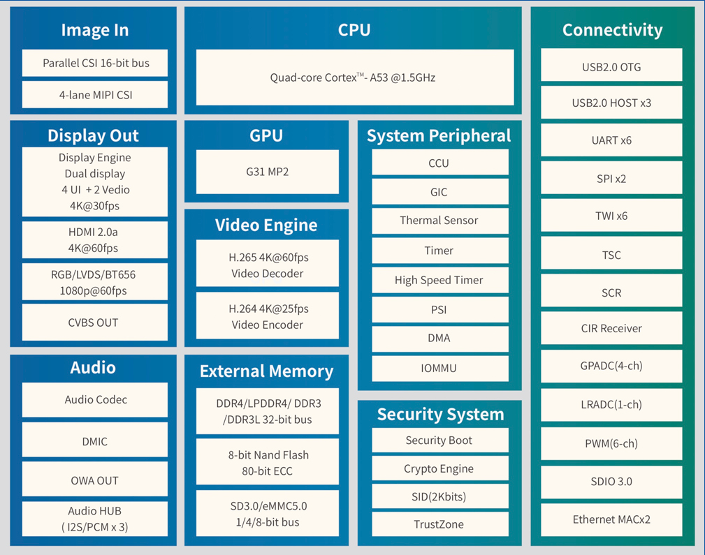

## 2\. FET507-C SoM Description

### 2.1 FETT507-C SoM Appearance

**FETT507 SoM**

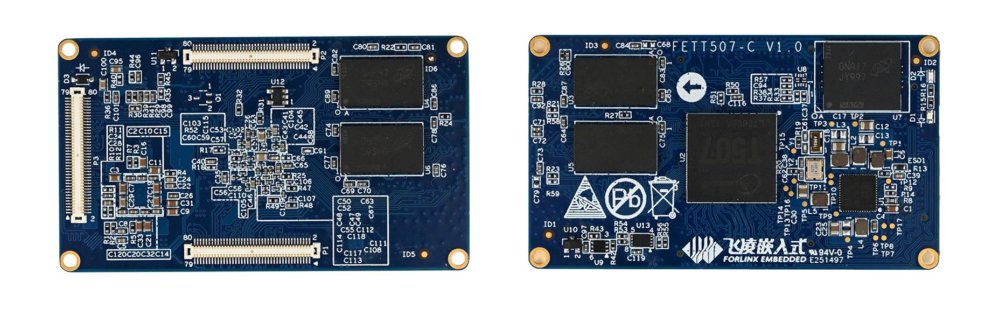

**Front**

**Back**

### 2.2 FETT507-C SoM Dimension Diagram

FETT507 SoM Dimension Diagram

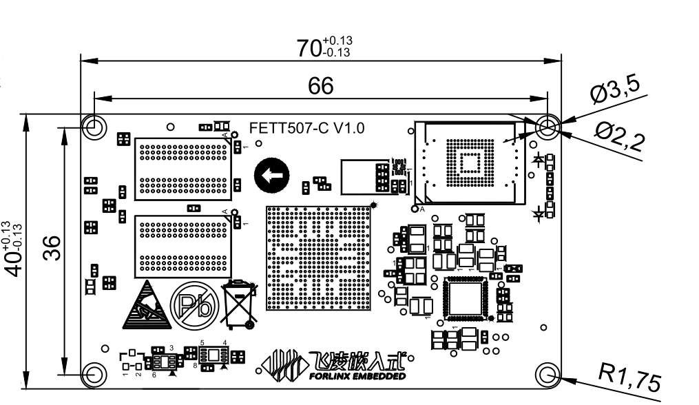

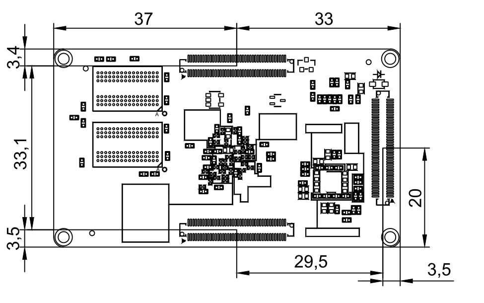

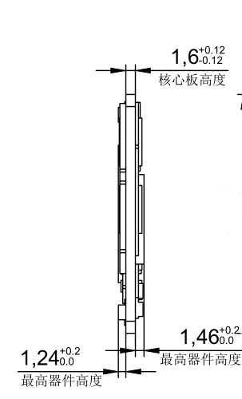

Structure size: 40mm×70mm, dimensional tolerance ±0.15mm.

Plate making process: 1.6mm thickness, 8-layer immersion gold PCB.

Connectors: Three 0.5mm pitch, 80pin board-to-board connectors.               See the appendix for the connector dimension drawing.

Four mounting holes (2.2mm) are reserved at the four corners of the SoM to facilitate the installation of fixing screws and to improve the reliability of the product connection so that the product can be used in vibration environments.

**Note: For more detailed dimensions, please refer to the user information SoM DXF file.**

### 2.3 Performance Parameters

#### 2.3.1 System Main Frequency

| **Name**| **Specification**| | | | **Description**
|:----------:|:----------:|----------|----------|----------|:----------:
| | **Minimum**| **Typical**| **Maximum**| **Unit**| 
| Main Frequency| —| —| 1500| MHz| Industrial-grade
| RTC clock| —| 32.768| —| KHz| —

#### 2.3.2 Power Parameter

| **Parameter**| **Pin Number**| **Specification**| | | | **Description**
|:----------:|:----------:|:----------:|----------|----------|----------|:----------:
| | | **Minimum**| **Typical**| **Maximum**| **Unit**| 
| Main Power Supply Voltage| DCIN| 3.0| 5| 5.5| V| —

#### 2.3.3 Operating Environment

| **Parameter**| | **Specification**| | | | **Description**
|:----------:|----------|:----------:|----------|----------|----------|:----------:
| | | **Minimum**| **Typical**| **Maximum**| **Unit**| 
| Operating temperature| Operating Environment| -40| 25| +85| ℃| Industrial-grade
| | Storage Environment| -40| 25| +125| ℃| 
| Humidity| Operating Environment| 10| —| 90| ％RH| No condensation
| | Storage Environment| 5| —| 95| ％RH| 

#### 2.3.4 SoM Interface Speed

| **Parameter**| **Specification**| | | | **Description**
|:----------:|:----------:|----------|----------|----------|:----------:
| | **Minimum**| **Typical**| **Maximum**| **Unit**| 
| Serial Port Communication Speed| —| —| 4| Mbit/s| —
| SPI Communication Speed| —| —| 100| MHz| —
| IIC Communication Speed| —| 100| 400| Kbps| —
| SD/MMC/SDIO| —| —| 800| Mbps| —
| USB interface speed| —| —| 480| Mbps| —

#### 2.3.5 ESD Features

| Parameter| Specification| | Unit| Application Scope
|:----------:|:----------:|----------|:----------:|:----------:
| | Minimum| Maximum| | 
| ESD HBM(ESDA/JEDEC JS-001-2017)| -2000| 2000| V| Signals exported from SoM
| ESD CDM(ESDA/JEDEC JS-002-2018)| -500| 500| V| Signals exported from SoM

**Note：**

**1\. The above data is provided by Allwinner;**

**2\. As all the signals exported from SoM are electrostatic sensitive signals, the interfaces should be well protected from static electricity in the carrier board design and the SoM transportation, assembling, and use.**

### 2.4 SoM Interface Speed

| **Function**| **Quantity**| **Parameter**|
|:----------:|:----------:|----------|
| TVOUT| 1| CVBS output, supporting NTSC and PAL |
| HDMI| 1| Video:  -2D video supports up to 4K@60fps;  -3D video supports up to 4K@30fps.  Audio:   -Supports the IEC60985 L -PCM uncompressed audio format, with a maximum support of 192 kHz;   -Supports the IEC61937 compressed audio format, with a maximum support of 1536 kHz. |
| LCD/LVDS| 1| LCD and LVDS are multiplexed; LCD： -The RGB interface (DE/SYNC mode) supports up to 1920x1080@60fps; -The Serial RGB/dummy RGB interface supports up to 800x480@fps; -The i8080 interface supports up to 800x480@60fps; -The BT656 interface supports 1280x720@60fps or 1920x1080@30fps; -It supports RGB888, RGB565, and RGB666 modes; -It supports Gamma correction for the independence of R/G/B channels; LVDS：-The dual - channel supports up to 1920x1080@60fps; -The single - channel supports up to 1366x768@60fps. |
| MIPI\_CSI| 1| Supports the image cropping function; Supports MIPI Version 1.0,with a maximum support of 1.0Gbps/Lane; The maximum video capture rate is 8M@30fps or 4\*1080p@25fps. |
| CSI\_DVP| 1| Supports 8/10/12/16 bit DC interfaces; Supports BT656, BT601, and BT1120 interfaces; Supports the ITU - R BT.656 time - division multiplexing format, with a maximum support of 4\*720p@30fps in DDR sampling mode; Supports progressive and interlaced video input; The maximum video capture rate is 5M@15fps and 1080p@30fps; The maximum pixel clock is 148.5MHz. |
| USB2.0| 4| OTG: -Supports 1 x; -In the main mode, supports High-Speed (HS,482), Full-Speed (FS,12Mbit/s) and Low-Speed (LS,1.5Mbit/s)； -In the slave mode, supports High-Speed (HS,482 Mbit/s) and Full-Speed  (FS,12Mbit/s)HOST: -Supports 3 x; -Supports High-Speed (HS,482 Mbit/s), Full-Speed (FS,12Mbit/s) and Low-Speed (LS,1.5Mbit/s) device. |
| SD| 2| SDHC0（SD3.0）: - 4bit bus width; - SDR mode 50MHz@3.3V IO pad; - SDR mode150MHz@1.8V IO pad; - DDR mode 50MHz@3.3V IO padSDHC1(SDIO3.0)： - 4bit bus width; - SDR mode 50MHz@3.3V IO pad; - DDR mode 50MHz@3.3V IO pad |
| RMII| 1| -10/100Mbps adaptive; |
| RGMII| 1| -10/100/1000 Mbps adaptive; RGMII can be multiplexed as RMII to achieve dual 100Mbps |
| UART| ≤6| UART0, UART5:  -2 lines, UART1, UART2, UART3, UART4: 4 lines; -Compatible with industry standard 16550 UART; -Supports a maximum speed of 4Mbit/s; -Supports 5-8 data bits and 1/1.5/2 stop bits; -Supports RS-485/9-bit mode. |
| TWI| ≤5| -Supports standard mode (up to 100kbit/s) and fast mode (up to 400kbit/s) |
| SPI| ≤2| -Supports 3-wire/4-wire SPI; maximum transfer rate of 100MHz |
| SCR| 1| -Supports ISO/IEC 7816-3:1997（E）and EMV2000(4.0) specification |
| PWM| ≤6| Three PWM pairs: PWM01 is composed of PWM0 and PWM1, PWM23 is composed of PWM2 and PWM3, and PWM45 is composed of PWM4 and PWM5; -Supports pulse (configurable), periodic and complementary pair outputs; -Supports capture inputs; -Programmable dead - zone output; -Built - in programmable dead - time generator for controllable dead time; -Three output waveforms: continuous waveform, pulse waveform, and complementary waveform; -Output reference range 0 - 24MHz/100MHz; -The duty cycle ranges from 0% to 100%; -The minimum resolution is 1/65536; -Supports PWM output and input interrupts. |
| JTAG| ≤1||
| CIR| 1| -Supports NEC format data; -Supports CIR with remote control or wireless keyboard; -Supports 64x8 bit FIFO used for data buffering; -Sampling clock up to 1MHz. |
| GPADC| 4| -Supports 4 x general-purpose ADC with 12 - bit resolution; -The maximum sampling rate is 1MHz; -Supports data comparison and interrupts, and DMA transmission; -The signal input range is 0 - 1.8V; -Supports three working modes: single conversion, continuous conversion, and burst conversion. |
| LRADC| 1| -6-bit resolution; -Sampling rate up to 2kHz;  -Supports hole keys and general keys; -Supports normal, continuous, and single working modes; -Supply voltage is 1.8V, the power supply reference voltage is 1.35V. For analog input, the detection voltage range is 0 - LEVELB (the maximum value is 1.266V). |
| LINEIN TBD| 1| -Some pins are reserved and not yet developed. |
| LINEOUT| 1| -Supports dynamic range controller adjustment for DAC playback; -2 x audio DAC; -Supports 16 - bit and 20 - bit sampling rates; -Sampling rate ranges from 8kHz to 192kHz; - 95±2dB SNR@A - weight, - 80±3dB THD + N, and the maximum output amplitude is 0.55Vrms; -1 x audio output: One differential LINEOUTP/N or single - ended LINEOUTL/R. |
| DMIC| 1| -Supports a maximum of 8 digital PDM microphones; -Supports sampling rate ranging from 8kHz to 48kHz. |
| OWA| 1| -1 x OWA Send |
| I2S| ≤4| -1 x built - in audio HUB; -Supports 2 x Digital Audio MIXER (DAM);  -Supports 3 x I2S/PCM to connect external devices and 1 x I2S/PCM to connect to the internal HDMI; -Supports left - aligned, right - aligned, standard I2S, PCM, and TDM modes; -The I2S supports 8 channels with a 32 - bit/192kbit sampling rate; -The I2S and TMD modes support a maximum of 16 channels with a 32 - bit/96kbit sampling rate. |

**Note: **

**1. The parameters in the table are the theoretical values for hardware design or the CPU;** 
**2. TBD "indicates that the functionality has not yet been developed at this stage.**

### 2.5  FETT507-C SoM Pins Definition

#### 2.5.1  FETT507-C SoM Pins Schematic

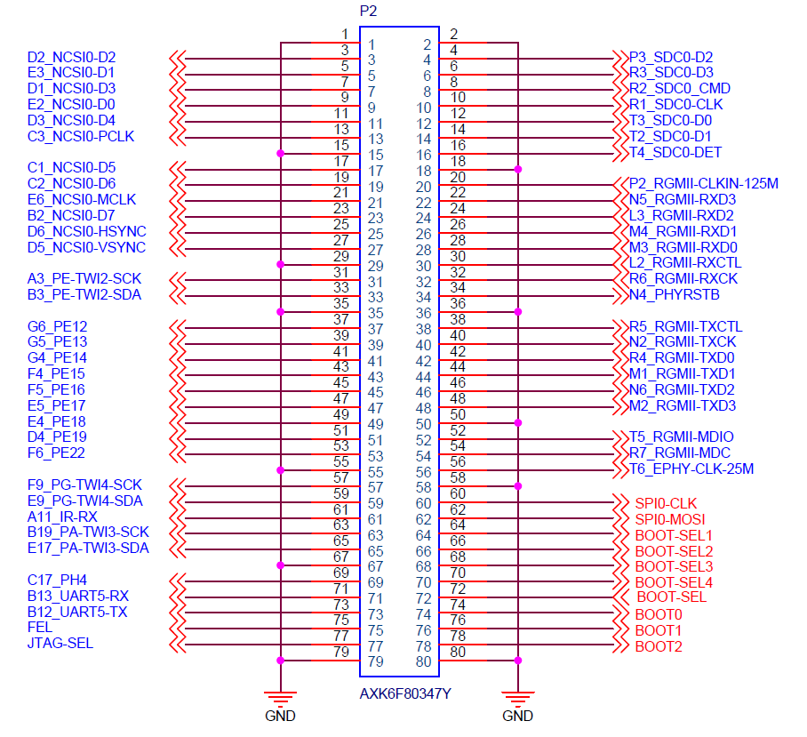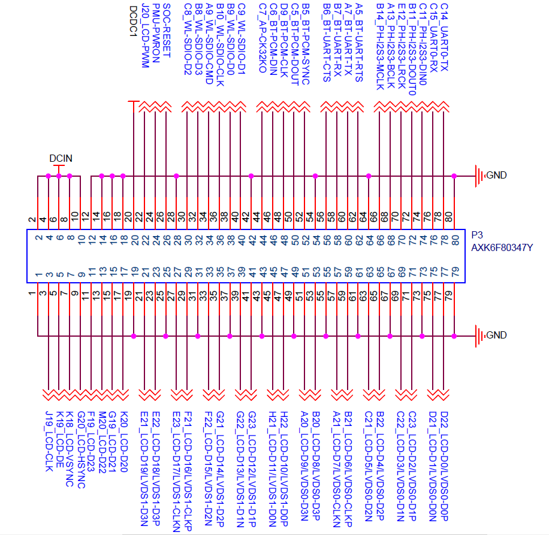

#### 2.5.2 FETT507-C SoM Pins Description

**Note1:**

**Num ——SoM connector pin no.:**

**Ball —— CPU pin ball no.**

**GPIO ——CPU pin general I/O port serial number**

**Vol  ——Pin signal level**

**Note2:**

**Signal Name——SoM connector network name**

**Pin Description—— SoM Pin Signal Descriptions**

**Default Function——Please don’t make any modifications for all SoM pin functions regulated in the “default functions” of the following table, otherwise, it may have conflicts with the factory driver. Please contact us with any questions in time.**

**Note3: The pins marked with "Do not use for carrier board" in the "Pin Description" are those used by the SoM, and should not be used in the carrier board design.**

**Table 1 LEFT\_UP（P1） Connector Interface(Odd) Pin Definition**

| **Num**| **Ball**| **Signal Name**| **GPIO**| **Vol**| **Pin Description**| **Default Function**
|:----------:|:----------:|:----------:|:----------:|:----------:|:----------:|:----------:
| LU\_1| \-| GND| \-| \-| Ground| GND
| LU\_3| \-| TV-OUT| \-| \-| Analog video output| TV-OUT
| LU\_5| \-| GND| \-| \-| Ground| GND
| LU\_7| \-| LRADC| \-| 0-1.35V| Carrier board sampling rate(used for the keys)| LRADC
| LU\_9| \-| GND| \-| \-| Ground| GND
| LU\_11| \-| LINEINR| \-| \-| LINEIN right channel input| TBD
| LU\_13| \-| LINEINL| \-| \-| LINEIN left channel input| TBD
| LU\_15| \-| LINEOUTR| \-| \-| LINEOUT right channel output| LINEOUTR
| LU\_17| \-| LINEOUTL| \-| \-| LINEOUT left channel output| LINEOUTL
| LU\_19| \-| GND| \-| \-| Ground| GND
| LU\_21| \-| USB0-DM| \-| \-| USB0 signal-| USB0-DM
| LU\_23| \-| USB0-DP| \-| \-| USB0 signal+| USB0-DP
| LU\_25| \-| GND| \-| \-| Ground| GND
| LU\_27| \-| USB1-DP| \-| \-| USB1 signal+| USB1-DP
| LU\_29| \-| USB1-DM| \-| \-| USB1 signal-| USB1-DM
| LU\_31| \-| GND| \-| \-| Ground| GND
| LU\_33| \-| VCC-USB2| \-| \-| USB2 power supply pin (floating by default)| VCC-USB2
| LU\_35| \-| USB2-DP| \-| \-| USB2 signal+| USB2-DP
| LU\_37| \-| USB2-DM| \-| \-| USB2 signal-| USB2-DM
| LU\_39| \-| GND| \-| \-| Ground| GND
| LU\_41| \-| USB3-DP| \-| \-| USB3 signal+| USB3-DP
| LU\_43| \-| USB3-DM| \-| \-| USB3 signal-| USB3-DM
| LU\_45| \-| GND| \-| \-| Ground| GND
| LU\_47| \-| HHPD| \-| \-| HDMI hot plug signal (refer to EVK design)| HHPD
| LU\_49| \-| HSDA| \-| \-| HDMI serial data (refer to EVK design)| HSDA
| LU\_51| \-| HSCL| \-| \-| HDMI serial clock (reference EVK design)| HSCL
| LU\_53| \-| HCEC| \-| \-| HDMI CEC signal (refer to EVK design)| HCEC
| LU\_55| \-| GND| \-| \-| Ground| GND
| LU\_57| \-| HTXCN| \-| \-| HDMI TMDS differential clock signal-| HTXCN
| LU\_59| \-| HTXCP| \-| \-| HDMI TMDS differential clock signal+| HTXCP
| LU\_61| \-| GND| \-| \-| Ground| GND
| LU\_63| \-| HTX0N| \-| \-| HDMI TMDS differential data 0 -| HTX0N
| LU\_65| \-| HTX0P| \-| \-| HDMI TMDS differential data 0 +| HTX0P
| LU\_67| \-| GND| \-| \-| Ground| GND
| LU\_69| \-| HTX1N| \-| \-| HDMI TMDS differential data 1 -| HTX1N
| LU\_71| \-| HTX1P| \-| \-| HDMI TMDS differential data 1 +| HTX1P
| LU\_73| \-| GND| \-| \-| Ground| GND
| LU\_75| \-| HTX2N| \-| \-| HDMI TMDS differential data 2 -| HTX2N
| LU\_77| \-| HTX2P| \-| \-| HDMI TMDS differential data 2 +| HTX2P
| LU\_79| \-| GND| \-| \-| Ground| GND

**Table 2 LEFT\_UP（P1） Connector Interface(Even) Pin Definition**

| **Num**| **Ball**| **Signal Name**| **GPIO**| **Vol**| **Pin Description**| **Default Function**
|:----------:|:----------:|:----------:|:----------:|:----------:|:----------:|:----------:
| LU\_2| \-| GND| \-| \-| Ground| GND
| LU\_4| \-| MCSI-D0N| \-| \-| MIPI \_ CSI differential data 0-| MCSI-D0N
| LU\_6| \-| MCSI-D0P| \-| \-| MIPI \_ CSI differential data 0 +| MCSI-D0P
| LU\_8| \-| GND| \-| \-| Ground| GND
| LU\_10| \-| MCSI-D1N| \-| \-| MIPI \_ CSI differential data 1-| MCSI-D1N
| LU\_12| \-| MCSI-D1P| \-| \-| MIPI \_ CSI differential data 1 +| MCSI-D1P
| LU\_14| \-| GND| \-| \-| Ground| GND
| LU\_16| \-| MCSI-CLKN| \-| \-| MIPI \_ CSI differential clock signal-| MCSI-CLKN
| LU\_18| \-| MCSI-CLKP| \-| \-| MIPI \_ CSI differential clock signal+| MCSI-CLKP
| LU\_20| \-| GND| \-| \-| Ground| GND
| LU\_22| E7| E7\_MCSI-MCLK| PG19| 3.3V| MIPI\_CSI clock| MCSI-MCLK
| LU\_24| \-| MCSI-D2N| \-| \-| MIPI \_ CSI differential data 2-| MCSI-D2N
| LU\_26| \-| MCSI-D2P| \-| \-| MIPI \_ CSI differential data 2 +| MCSI-D2P
| LU\_28| \-| GND| \-| \-| Ground| GND
| LU\_30| \-| MCSI-D3N| \-| \-| MIPI \_ CSI differential data 3-| MCSI-D3N
| LU\_32| \-| MCSI-D3P| \-| \-| MIPI \_ CSI differential data 3 +| MCSI-D3P
| LU\_34| \-| GND| \-| \-| Ground| GND
| LU\_36| B4| B4\_PG-MCSI-SCK| PG17| 3.3V| CCI control the clock signal| MCSI-SCK
| LU\_38| D7| D7\_PG-MCSI-SDA| PG18| 3.3V| CCI control data signal| MCSI-SDA
| LU\_40| \-| GND| \-| \-| Ground| GND
| LU\_42| \-| GPADC0| \-| 0-1.8V| General ADC0| GPADC0
| LU\_44| \-| GPADC1| \-| 0-1.8V| General ADC1| GPADC1
| LU\_46| \-| GPADC2| \-| 0-1.8V| General ADC2| GPADC2
| LU\_48| \-| GPADC3| \-| 0-1.8V| General ADC3| GPADC3
| LU\_50| \-| GND| \-| \-| Ground| GND
| LU\_52| E20| E20\_RMII-TXEN| | 3.3V| RMII send enable| RMII-TXEN
| LU\_54| A18| A18\_RMII-TXD1| | 3.3V| RMII send data 1| RMII-TXD1
| LU\_56| B18| B18\_RMII-TXD0| | 3.3V| RMII send data 0| RMII-TXD0
| LU\_58| D20| D20\_RMII-TXCK| | 3.3V| RMII send clock| RMII-TXCK
| LU\_60| \-| GND| \-| \-| Ground| GND
| LU\_62| D19| D19\_RMII-RXD1| PA0| 3.3V| RMII receive data 1| RMII-RXD1
| LU\_64| D18| D18\_RMII-RXD0| PA1| 3.3V| RMII receive data 0| RMII-RXD0
| LU\_66| E18| E18\_RMII-CRS-RXDV| PA2| 3.3V| RMII carrier sense/receive data valid| RMII-CRS-RXDV
| LU\_68| D17| D17\_RMII-RXER| PA3| 3.3V| RMII receive error| RMII-RXER
| LU\_70| \-| GND| \-| \-| Ground| GND
| LU\_72| C19| C19\_RMII-MDC| PA8| 3.3V| RMII management data reference clock| RMII-MDC
| LU\_74| C20| C20\_RMII-MDIO| PA9| 3.3V| RMII manages data input/output| RMII-MDIO
| LU\_76| F20| F20\_RESET-N2| PA12| 3.3V| PHY chip reset signal| RESET-N2
| LU\_78| F12| 4G-WAKEUP-SOC| \-| \-| 4G module replacement signal| 4G-WAKEUP-SOC
| LU\_80| \-| GND| \-| \-| Ground| GND

**Table 3 RIGHT\_UP（P2） Connector Interface(Odd) Pin Definition**

| **Num**| **Ball**| **Signal Name**| **GPIO**| **Vol**| **Pin Description**| **Default Function**
|:----------:|:----------:|:----------:|:----------:|:----------:|:----------:|:----------:
| RU\_1| \-| GND| \-| \-| Ground| GND
| RU\_3| D2| D2\_NCSI0-D2| PE6| 2.8V| Parallel CSI input data 2| NCSI0-D2
| RU\_5| E3| E3\_NCSI0-D1| PE5| 2.8V| Parallel CSI input data 1| NCSI0-D1
| RU\_7| D1| D1\_NCSI0-D3| PE7| 2.8V| Parallel CSI input data 3| NCSI0-D3
| RU\_9| E2| E2\_NCSI0-D0| PE4| 2.8V| Parallel CSI input data 0| NCSI0-D0
| RU\_11| D3| D3\_NCSI0-D4| PE8| 2.8V| Parallel CSI input data 4| NCSI0-D4
| RU\_13| C3| C3\_NCSI0-PCLK| PE0| 2.8V| Parallel CSI pixel clock| NCSI0-PCLK
| RU\_15| \-| GND| \-| \-| Ground| GND
| RU\_17| C1| C1\_NCSI0-D5| PE9| 2.8V| Parallel CSI input data 5| NCSI0-D5
| RU\_19| C2| C2\_NCSI0-D6| PE10| 2.8V| Parallel CSI input data 6| NCSI0-D6
| RU\_21| E6| E6\_NCSI0-MCLK| PE1| 2.8V| Parallel CSI master clock| NCSI0-MCLK
| RU\_23| B2| B2\_NCSI0-D7| PE11| 2.8V| Parallel CSI input data 7| NCSI0-D7
| RU\_25| D6| D6\_NCSI0-HSYNC| PE2| 2.8V| Parallel CSI line synchronization signal| NCSI0-HSYNC
| RU\_27| D5| D5\_NCSI0-VSYNC| PE3| 2.8V| Parallel CSI column synchronization signal| NCSI0-VSYNC
| RU\_29| \-| GND| \-| \-| Ground| GND
| RU\_31| A3| A3\_PE-TWI2-SCK| PE20| 2.8V| TWI2 serial clock signal| TWI2-SCK
| RU\_33| B3| B3\_PE-TWI2-SDA| PE21| 2.8V| TWI2 serial data signal| TWI2-SDA
| RU\_35| \-| GND| \-| \-| Ground| GND
| RU\_37| G6| G6\_PE12| PE12| 2.8V| General IO PE12| PE12
| RU\_39| G5| G5\_PE13| PE13| 2.8V| General IO FE13| PE13
| RU\_41| G4| G4\_PE14| PE14| 2.8V| General IO FE14| PE14
| RU\_43| F4| F4\_PE15| PE15| 2.8V| General IO FE15| PE15
| RU\_45| F5| F5\_PE16| PE16| 2.8V| General IO FE16| PE16
| RU\_47| E5| E5\_PE17| PE17| 2.8V| General IO FE17| PE17
| RU\_49| E4| E4\_PE18| PE18| 2.8V| General IO FE18| PE18
| RU\_51| D4| D4\_PE19| PE19| 2.8V| General IO FE19| PE19
| RU\_53| F6| F6\_PE22| PE22| 2.8V| General IO FE22| PE22
| RU\_55| \-| GND| \-| \-| Ground| GND
| RU\_57| F9| F9\_PG-TWI4-SCK| PG15| 3.3V| TWI4 serial clock signal| TWI4-SCK
| RU\_59| E9| E9\_PG-TWI4-SDA| PG16| 3.3V| TWI4 serial data signal| TWI4-SDA
| RU\_61| A11| A11\_IR-RX| PH10| 3.3V| IR receiver signal input| IR-RX
| RU\_63| B19| B19\_PA-TWI3-SCK| PA10| 3.3V| TWI3 serial clock signal| TWI3-SCK
| RU\_65| E17| E17\_PA-TWI3-SDA| PA11| 3.3V| TWI3 serial data signal| TWI3-SDA
| RU\_67| \-| GND| \-| \-| Ground| GND
| RU\_69| C17| C17\_PH4| PH4| 3.3V| General IO PH4| PH4
| RU\_71| B13| B13\_UART5-RX| PH3| 3.3V| UART5 data sending| UART5-RX
| RU\_73| B12| B12\_UART5-TX| PH2| 3.3V| UART5 data receiving| UART5-TX
| RU\_75| \-| FEL| \-| \-| FEL signal (used to identify system programming)| FEL
| RU\_77| \-| JTAG-SEL| \-| \-| JTAG channel selection signal (low level JTAG part signal can only be multiplexed to PG, high level JTAG part signal is multiplexed to PF or PG by software selection, default is PF).| JTAG-SEL
| RU\_79| \-| GND| \-| \-| Ground| GND

**Table 4 Definition of RIGHT (P2) connector interface (even) pins**

| **Num**| **Ball**| **Signal Name**| **GPIO**| **Vol**| **Pin Description**| **Default Function**
|:----------:|:----------:|:----------:|:----------:|:----------:|:----------:|:----------:
| RU\_2| \-| GND| \-| \-| Ground| GND
| RU\_4| P3| P3\_SDC0-D2| PF5| 1.8/3.3V| SDC0 data signal 2| SDC0-D2
| RU\_6| R3| R3\_SDC0-D3| PF4| 1.8/3.3V| SDC0 data signal 3| SDC0-D3
| RU\_8| R2| R2\_SDC0\_CMD| PF3| 1.8/3.3V| SDC0 command signal| SDC0\_CMD
| RU\_10| R1| R1\_SDC0-CLK| PF2| 1.8/3.3V| SDC0 clock signal| SDC0-CLK
| RU\_12| T3| T3\_SDC0-D0| PF1| 1.8/3.3| SDC0 data signal 0| SDC0-D0
| RU\_14| T2| T2\_SDC0-D1| PF0| 1.8/3.3V| SDC0 data signal 0| SDC0-D1
| RU\_16| T4| T4\_SDC0-DET| PF6| 1.8/3.3V| SDC0 card detection signal| SDC0-DET
| RU\_18| \-| GND| \-| \-| Ground| GND
| RU\_20| P2| P2\_RGMII-CLKIN-125M| PI13| 2.8V| RGMII external clock input| RGMII-CLKIN-125M
| RU\_22| N5| N5\_RGMII-RXD3| PI0| 2.8V| RGMII send data 3| RGMII-RXD3
| RU\_24| L3| L3\_RGMII-RXD2| PI1| 2.8V| RGMII send data 2| RGMII-RXD2
| RU\_26| M4| M4\_RGMII-RXD1| PI2| 2.8V| RGMII send data 1| RGMII-RXD1
| RU\_28| M3| M3\_RGMII-RXD0| PI3| 2.8V| RGMII send data 0| RGMII-RXD0
| RU\_30| L2| L2\_RGMII-RXCTL| PI5| 2.8V| RGMII send control signal| RGMII-RXCTL
| RU\_32| R6| R6\_RGMII-RXCK| PI4| 2.8V| RGMII send reference clock| RGMII-RXCK
| RU\_34| N4| N4\_PHYRSTB| PI6| 2.8V| PHY chip reset signal| PHYRSTB
| RU\_36| \-| GND| \-| \-| Ground| GND
| RU\_38| R5| R5\_RGMII-TXCTL| PI12| 2.8V| RGMII send control signal| RGMII-TXCTL
| RU\_40| N2| N2\_RGMII-TXCK| PI11| 2.8V| RGMII send reference clock| RGMII-TXCK
| RU\_42| R4| R4\_RGMII-TXD0| PI10| 2.8V| RGMII send data 0| RGMII-TXD0
| RU\_44| M1| M1\_RGMII-TXD1| PI9| 2.8V| RGMII send data 1| RGMII-TXD1
| RU\_46| N6| N6\_RGMII-TXD2| PI8| 2.8V| RGMII send data 2| RGMII-TXD2
| RU\_48| M2| M2\_RGMII-TXD3| PI7| 2.8V| RGMII send data 3| RGMII-TXD3
| RU\_50| \-| GND| \-| \-| Ground| GND
| RU\_52| T5| T5\_RGMII-MDIO| PI15| 2.8V| RGMII manages data input/output| RGMII-MDIO
| RU\_54| R7| R7\_RGMII-MDC| PI14| 2.8V| RGMII management data reference clock| RGMII-MDC
| RU\_56| T6| T6\_EPHY-CLK-25M| PI16| 2.8V| Output 25Mhz to EPHY| EPHY-CLK-25M
| RU\_58| \-| GND| \-| \-| Ground| GND
| RU\_60| \-| SPI0-CLK| PC0| 1.8V| SPI0 reference clock (floating by default)| SPI0-CLK
| RU\_62| \-| SPI0-MOSI| PC2| 1.8V| SPI0 master-out and slave-in (floating processing by default)| SPI0-MOSI
| RU\_64| \-| BOOT-SEL1| PC3| \-| BOOT Configuration 1| BOOT-SEL1
| RU\_66| \-| BOOT-SEL2| PC4| \-| BOOT Configuration 2| BOOT-SEL2
| RU\_68| \-| BOOT-SEL3| PC5| \-| BOOT Configuration 3| BOOT-SEL3
| RU\_70| \-| BOOT-SEL4| PC6| \-| BOOT Configuration 4| BOOT-SEL4
| RU\_72| \-| BOOT-SEL| \-| \-| BOOT Configuration| BOOT-SEL
| RU\_74| \-| BOOT0| \-| \-| BOOT0 signal| BOOT0
| RU\_76| \-| BOOT1| \-| \-| BOOT1 signal| BOOT1
| RU\_78| \-| BOOT2| \-| \-| BOOT2 signal| BOOT2
| RU\_80| \-| GND| \-| \-| Ground| GND

**Table 5 Left \_ DOWN (P3) Connector Interface (Odd) Pin Definition**

| **Num**| **Ball**| **Signal Name**| **GPIO**| **Vol**| **Pin Description**| **Default Function**
|:----------:|:----------:|:----------:|:----------:|:----------:|:----------:|:----------:
| LD\_1| \-| GND| \-| \-| Ground| GND
| LD\_3| J19| J19\_LCD-CLK| PD24| 3.3V| LCD clock signal| LCD-CLK
| LD\_5| K19| K19\_LCD-DE| PD25| 3.3V| LCD data enable signal| LCD-DE
| LD\_7| K18| K18\_LCD-VSYNC| PD27| 3.3V| LCD field sync signal| LCD-VSYNC
| LD\_9| G20| G20\_LCD-HSYNC| PD26| 3.3V| LCD line synchronization signal| LCD-HSYNC
| LD\_11| F19| F19\_LCD-D23| PD23| 3.3V| LCD Data 23| LCD-D23
| LD\_13| M20| M20\_LCD-D22| PD22| 3.3V| LCD Data 22| LCD-D22
| LD\_15| G19| G19\_LCD-D21| PD21| 3.3V| LCD Data 21| LCD-D21
| LD\_17| K20| K20\_LCD-D20| PD20| 3.3V| LCD Data 20| LCD-D20
| LD\_19| \-| GND| \-| \-| Ground| GND
| LD\_21| E21| E21\_LCD-D19 LVDS1-D3N| PD19| 3.3V| LCD data 19 LVDS1 differential data 3-| LCD-D19 LVDS1-D3N
| LD\_23| E22| E22\_LCD-D18 LVDS1-D3P| PD18| 3.3V| LCD data 18 LVDS1 differential data 3+| LCD-D18 LVDS1-D3P
| LD\_25| \-| GND| \-| \-| Ground| GND
| LD\_27| E23| E23\_LCD-D17 LVDS1-CLKN| PD17| 3.3V| LCD data 17 LVDS1 differential clock-| LCD-D17 LVDS1-CLKN
| LD\_29| F21| F21\_LCD-D16 LVDS1-CLKP| PD16| 3.3V| LCD data 16 LVDS1 differential clock+| LCD-D16 LVDS1-CLKP
| LD\_31| \-| GND| \-| \-| Ground| GND
| LD\_33| F22| F22\_LCD-D15 LVDS1-D2N| PD15| 3.3V| LCD data 15 LVDS1 differential data 2-| LCD-D15 LVDS1-D2N
| LD\_35| G21| G21\_LCD-D14 LVDS1-D2P| PD14| 3.3V| LCD data 14 LVDS1 differential data 2+| LCD-D14 LVDS1-D2
| LD\_37| \-| GND| \-| \-| Ground| GND
| LD\_39| G22| G22\_LCD-D13 LVDS1-D1N| PD13| 3.3V| LCD data 13 LVDS1 differential data 1-| LCD-D13 LVDS1-D1N
| LD\_41| G23| G23\_LCD-D12 LVDS1-D1P| PD12| 3.3V| LCD data 12 LVDS1 differential data 1+| LCD-D12 LVDS1-D1P
| LD\_43| \-| GND| \-| \-| Ground| GND
| LD\_45| H21| H21\_LCD-D11 LVDS1-D0N| PD11| 3.3V| LCD data 11 LVDS1 differential data 0-| LCD-D11 LVDS1-D0N
| LD\_47| H22| H22\_LCD-D10 LVDS1-D0P| PD10| 3.3V| LCD data 10 LVDS1 differential data 0+| LCD-D10 LVDS1-D0P
| LD\_49| \-| GND| \-| \-| Ground| GND
| LD\_51| A20| A20\_LCD-D9 LVDS0-D3N| PD9| 3.3V| LCD data 9 LVDS0 differential data 3-| LCD-D9 LVDS0-D3N
| LD\_53| B20| B20\_LCD-D8 LVDS0-D3P| PD8| 3.3V| LCD data 8 LVDS0 differential data 3+| LCD-D8 LVDS0-D3P
| LD\_55| \-| GND| \-| \-| Ground| GND
| LD\_57| A21| A21\_LCD-D7 LVDS0-CLKN| PD7| 3.3V| LCD data 7 LVDS0 differential clock-| LCD-D7 LVDS0-CLKN
| LD\_59| B21| B21\_LCD-D6 LVDS0-CLKP| PD6| 3.3V| LCD data 6 LVDS0 differential clock+| LCD-D6 LVDS0-CLKP
| LD\_61| \-| GND| \-| \-| Ground| GND
| LD\_63| C21| C21\_LCD-D5 LVDS0-D2N| PD5| 3.3V| LCD data 5 LVDS0 differential data 2-| LCD-D5 LVDS0-D2N
| LD\_65| B22| B22\_LCD-D4 LVDS0-D2P| PD4| 3.3V| LCD data 4 LVDS0 differential data 2+| LCD-D4 LVDS0-D2P
| LD\_67| \-| GND| \-| \-| Ground| GND
| LD\_69| C22| C22\_LCD-D3 LVDS0-D1N| \-| 3.3V| LCD data 3 LVDS0 differential data 1-| LCD-D3 LVDS0-D1N
| LD\_71| C23| C23\_LCD-D2 LVDS0-D1P| \-| 3.3V| LCD data 2 LVDS0 differential data 1+| LCD-D2 LVDS0-D1P
| LD\_73| \-| GND| \-| \-| Ground| GND
| LD\_75| D21| D21\_LCD-D1 LVDS0-D0N| PD1| 3.3V| LCD data 1 LVDS0 differential data 0-| LCD-D1 LVDS0-D0N
| LD\_77| D22| D22\_LCD-D0 LVDS0-D0P| PD0| 3.3V| LCD data 0 LVDS0 differential data 0+| LCD-D0 LVDS0-D0P
| LD\_79| \-| GND| \-| \-| Ground| GND

**Table 6 Left \_ DOWN (P3) Connector Interface (Even) Pin Definition**

| **Num**| **Ball**| **Signal Name**| **GPIO**| **Vol**| **Pin Description**| **Default Function**
|:----------:|:----------:|:----------:|:----------:|:----------:|:----------:|:----------:
| LD\_2| \-| DCIN| \-| 5V| SoM power input| DCIN
| LD\_4| \-| DCIN| \-| 5V| SoM power input| DCIN
| LD\_6| \-| DCIN| \-| 5V| SoM power input| DCIN
| LD\_8| \-| DCIN| \-| 5V| SoM power input| DCIN
| LD\_10| \-| DCIN| \-| 5V| SoM power input| DCIN
| LD\_12| \-| GND| \-| \-| Ground| GND
| LD\_14| \-| GND| \-| \-| Ground| GND
| LD\_16| \-| GND| \-| \-| Ground| GND
| LD\_18| \-| GND| \-| \-| Ground| GND
| LD\_20| \-| DCDC1| \-| 3.3V| SoM controls carrier board power-on timing signal| DCDC1
| LD\_22| J20| J20\_LCD-PWM| \-| 3.3V| Screen backlight adjustment signal| LCD-PWM
| LD\_24| \-| PMU-PWRON| \-| 3.3V| System power-on/power-off/sleep wake-up signal| PMU-PWRON
| LD\_26| \-| SOC-RESET| \-| 3.3V| System reset signal| SOC-RESET
| LD\_28| \-| GND| \-| —| Ground| GND
| LD\_30| C8| C8\_WL-SDIO-D2| \-| 3.3V| SDIO Data 2| SDIO-D2
| LD\_32| B8| B8\_WL-SDIO-D3| \-| —| SDIO Data 3| SDIO-D3
| LD\_34| A9| A9\_WL-SDIO-CMD| \-| 3.3V| SDIO command signal| SDIO-CMD
| LD\_36| B10| B10\_WL-SDIO-CLK| \-| \-| SDIO clock signal| SDIO-CLK
| LD\_38| B9| B9\_WL-SDIO-D0| \-| 3.3V| SDIO Data 0| SDIO-D0
| LD\_40| C9| C9\_WL-SDIO-D1| \-| —| SDIO Data 1| SDIO-D1
| LD\_42| \-| GND| \-| 3.3V| Ground| GND
| LD\_44| C7| C7\_AP-CK32KO| \-| 3.3V| 32.768KHz clock output (floating by default)| CK32KO
| LD\_46| C6| C6\_BT-PCM-DIN| \-| 3.3V| PCM data input| PCM-DIN
| LD\_48| D9| D9\_BT-PCM-CLK| \-| —| PCM clock signal| PCM-CLK
| LD\_50| C5| C5\_BT-PCM-DOUT| \-| \-| PCM data output| PCM-DOUT
| LD\_52| B5| B5\_BT-PCM-SYNC| \-| —| PCM synchronization signal| PCM-SYNC
| LD\_54| \-| GND| \-| 3.3V| Ground| GND
| LD\_56| B6| B6\_BT-UART-CTS| \-| 3.3V| UART1 data clear signal| UART1-CTS
| LD\_58| B7| B7\_BT-UART-RX| \-| \-| UART1 data sending| UART1-RX
| LD\_60| A7| A7\_BT-UART-TX| \-| 3.3V| UART1 data receiving| UART1-TX
| LD\_62| A5| A5\_BT-UART-RTS| \-| 3.3V| UART1 data request signal| UART1-RTS
| LD\_64| \-| GND| \-| 3.3V| Ground| GND
| LD\_66| B14| B14\_PH-I2S3-MCLK| \-| 3.3V| I2S3 main clock| I2S3-MCLK
| LD\_68| A13| A13\_PH-I2S3-BCLK| \-| —| I2S3 Bit clock| I2S3-BCLK
| LD\_70| E12| E12\_PH-I2S3-LRCK| \-| 3.3V| I2S3 sample synchronization signal| I2S3-LRCK
| LD\_72| B11| B11\_PH-I2S3-DOUT0| \-| 3.3V| I2S3 Data output| I2S3-DOUT0
| LD\_74| C11| C11\_PH-I2S3-DIN0| \-| 3.3V| I2S3 data input| I2S3-DIN0
| LD\_76| C15| C15\_UART0-RX| \-| —| UART0 receiving| UART0-RX
| LD\_78| C14| C14\_UART0-TX| \-| 3.3V| UART0 sending| UART0-TX
| LD\_80| \-| GND| \-| \-| Ground| GND

### 2.6 SoM Hardware Design Description

FETT507-C SoM integrates the power supply, reset monitoring circuit, and storage circuit into a compact module. The required external circuits are very simple. To form a minimal system, only a 5V power supply, a reset button, and boot configuration are needed to run the system, as shown in the following figure:

Please refer to “Appendix IV. for the minimal system schematic diagram However, in general, it is recommended to connect some external devices except the minimum system, such as debugging serial port for viewing and printing information, and reserve OTG interface for outputting flashing information. After completing these steps, additional user-specific functions can be added based on the default interface definitions provided by Forlinx for the SoM.

## 3\. OKT507-C Development Platform Description

### 3.1 OKT507-C Development Board Interface Diagram

The connection of OKT507-C SoM and the carrier board is board-to-board, and the main interfaces are as follows:

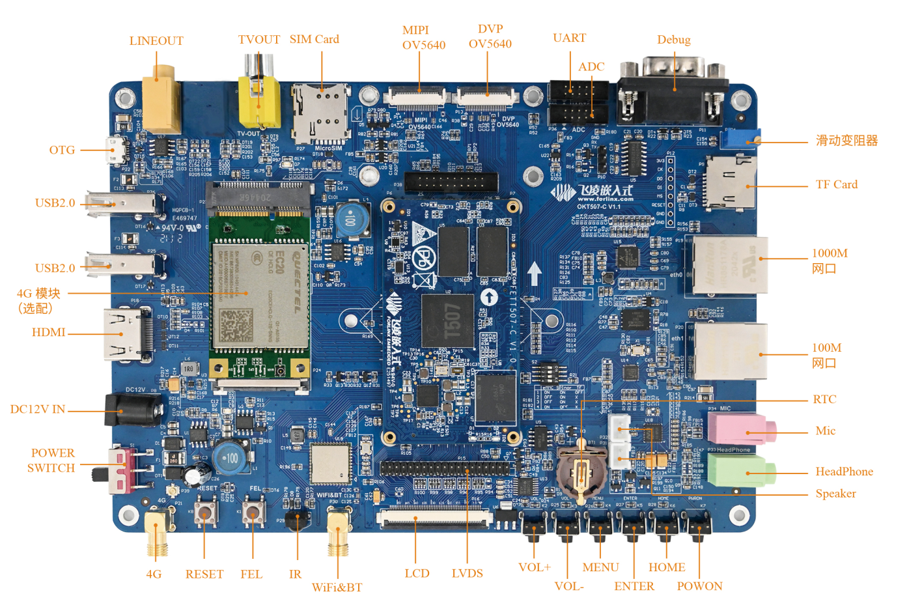

**OKT507 Development Board Interfaces**

### 3.2 OKT507-C SoM Dimension Diagram

PCB size: 190mm×130mm, dimensional tolerance ±0.15mm.

Fixed hole size: spacing: 120mm × 180mm, hole diameter: 3.2mm.

Plate making process: thickness 1.6mm, 4-layer PCB.

Power supply voltage: DC 12V.

**Note: For more detailed dimensions, please refer to the user information carrier board DXF file.**

### 3.3 Carrier Board Naming Rules

ABC-D+IK:M

| **Field**| **Field Description**| **Value**| **Description**
|:----------:|:----------:|:----------:|----------
| A| Qualification level| PC| Prototype Sample
| | | Blank| Mass Production
| B| Product line identification| OK| Forlinx Embedded development board
| C| CPU Name| T507| T507
| \-| Segment Identification| \-| 
| D| Connection| Cx| Board-to-board Connector
| \+| Segment Identification| \+| The configuration parameter section follows this identifier.
| I| Operating temperature| I| -40 to 85℃   industrial  level
| K| PCB Version| 11| V1.1
| | | xx| Vx.x
| :M| Internal Identification of the Manufacturer| :X| This is the internal identification of the manufacturer and has no impact on the use.

### 3.4 Carrier Board Resources

| **Function**| | **Quantity**| **Parameter**|
|:----------:|----------|:----------:|----------|
| LCD| | 1| RGB888 interface, up to 1920x1080@60fps|
| LVDS| | 1| -Multiplexed with LCD; -Single channel 1366x768 @ 60fps; -Dual channel 1920x1080 @ 60fps |
| HDMI| | 1| -Compliant with HDCP 2.2 and HDCP 1.4;  -Supports HDR10; 4K@60fps; -supports 2D video and 4K@30fps for 3D video. |
| TV-OUT| | 1| -Analog video output supporting NTSC and PAL modes. |
| MIPI\_CSI| | 1| -4 lanes, up to 1.0Gbps/lane; -Maximum video capture resolution 8m @ 30fps or 4 \* 1080p @ 25fps |
| DVP\_CSI| | 1| -8-bit, pixel clock up to 148.5MHz; -Maximum video capture resolution 5m @ 15 fps or 1080p @ 30fps |
| Audio| LINE INTBD| 1| -Some pins are reserved and not yet developed. |
| | LINE OUT| 1| -CPU built-in codec, differential output or single-ended output |
| | MIC| 1| -Carrier board external codec, analog MIC input |
| | headphone| 1| -Carrier board external codec, analog output |
| | Speaker| 2| -Carrier board external codec, Class D power amplifier can directly drive the speaker |
| USB2.0| | 2| -USB2.0 Type-A female, host mode, 480Mbit/s |
| OTG| | 1| -microUSB, master/slave mode, writable system |
| 4G| | 1| -Supports 4G module via a mini PCIe interface |
| Ethernet| | 2| -1 Gigabit, 100 Megabit, downward adaptive rate, dual RJ45 ports can be used simultaneously. |
| WiFi \& Bluetooth| | 1| -Module model: FG6221ASRC-00 -WLAN： IEEE 802.11b/g/n \& Wi-Fi compliant 2.4GHz                 IEEE 802.11a/n/ac\& Wi-Fi compliant 5GHz -bluetooth: BT 5.0 Module |
| TF Card| | 1| -Compatible with SD3.0. |
| KEY| | 6| -Key function: VOL+, VOL-, MENU, ENTER, HOME, PWRON |
| JTAG| | 1||
| SPI| | 1| -The default eMMC version SoM does not support SPI0, and SPI1 can be multiplexed from the I2S3 signal |
| ADC| | 4| -1.8 V level, 8 bit effective SAR analog-to-digital conversion, 1MHz Max sample rate, 1 adjustable resistor on board |
| PWM| | 1| -Backlight adjustment for liquid crystal |
| IR| | 1| -Infrared receiving |
| RTC| | 1| -External RTC chip on carrier board, powered by CR1220 coin cell |
| UART| | 1| -TTL level is led out with 10 P simple horn |
| UART Debug| | 1| -TTL is led out by 2.54 mm pitch pins, and RS232 is led out by DB9 male. |

**Note:** 

**1. The parameters in the table are the theoretical values for hardware design or the CPU;**
**2. TBD "indicates that the functionality has not yet been developed at this stage.**

### 3.5 OKT507-C Carrier Board Description

**Note: The following screenshot is only for the carrier board function description, which may be inconsistent with the actual principle. Please refer to the source file of the schematic diagram; the component UID with "\_DNP" mark in the diagram below represents it is not soldered by default.**

#### 3.5.1 Carrier Board Power

Carrier board power supply is DC 12V, led in through DC-005 socket (P8). The 12V DC power supply passes through a self - recovering fuse and an anti - reverse connection diode, and then is stepped down to DCIN by the MP2307 switching circuit. This 5V voltage directly powers the SoM. After the SoM is powered on, the PMIC inside the SoM outputs DCDC1, which controls the power - on of VCC5V and VCC3V3 to supply power to the electrical circuits on the carrier board.

This circuit is to ensure that the SoM is powered on first, and followed by the carrier board, so as to prevent the damage to the CPU caused by latch-up effects. If the power supply is not controlled in time sequence, the PMIC of the SoM detects the leakage of electricity and fails to start up.

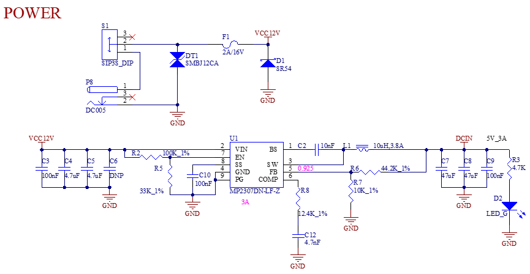

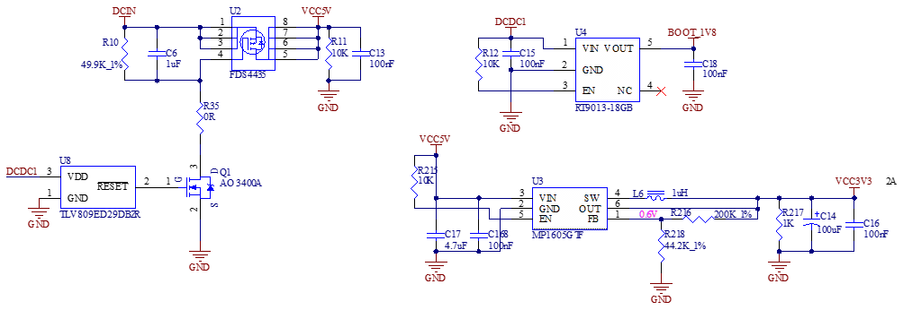

**Note:**

**1. DCDC1 on the carrier board is only used to control the power - on sequence and BOOT startup. It is not recommended to use DCDC1 to power other circuits;**

**2. The DCDC of the PMU inside the SoM has a leakage detection function; When the PMU is not powered on and operating, if leakage is detected on its DCDC, the corresponding DCDC channel with leakage will not output. As a result, the system will not boot up. Please read the “SOC Anti - Leakage Application Design Guide” in the user documentation before designing the carrier board.**

#### 3.5.2 Keys

The K8 button at the lower - left corner of the carrier board is the reset button of the development board. The name of the connected network is SOC - RESET. It is recommended to keep the capacitor and TVS device to prevent the system reset from being interfered during electrostatic testing.

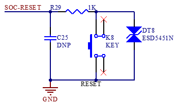

The K1 at the bottom left of the carrier board is the firmware forced burning pin, which is connected to the computer via microUSB to burn firmware. When the hardware system is not powered on, press and hold the button to ground the FEL; after powering on, release the FEL and the hardware system enters firmware upgrade mode.

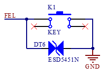

The PWRON button at the lower - right corner of the carrier board is a switch - controlled pin. Long - pressing it turns the system on/off, and short - pressing it puts the system into sleep/wake - up mode.

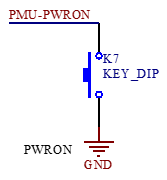

The five buttons at the lower - right corner of the carrier board are implemented by the LRADC of the CPU. The LRADC on the core board has a 51K resistor pulled up to 1.8V. The LRADC has a 6 - bit resolution and is used for button voltage identification. The maximum sampling rate is 2kHz, and the sampling voltage ranges from 0 to 1.35V. It is recommended that the voltage - dividing resistors have an accuracy of 1%. Leave the pins floating when the carrier board is not in use.

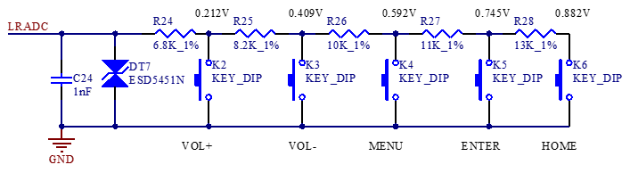

**Note: It is recommended to add ESD devices to the keys to prevent electrostatic damage to the SoM devices.**

#### 3.5.3 BOOT Configuration

The FETT507 SoM supports connecting to a computer via microUSB to burn the firmware. When the hardware system is not powered on, press and hold the K1 button to ground the FEL; after power - on, release the FEL, and the hardware system enters the firmware upgrade mode.

The FETT507 SoM also supports burning the firmware through the TF card and supports booting from the built - in eMMC and the external SPI NOR FALSH. After setting the correct DIP switches, power on the hardware to enter the system.

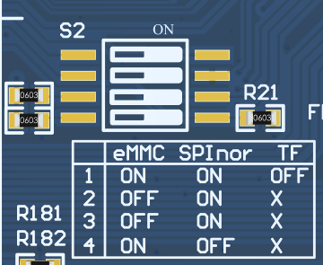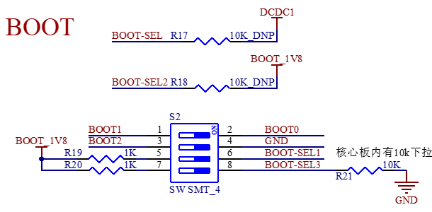

**Note: The SPI boot function is reserved on the hardware, and the subsequent support status depends on the release of the software and hardware. If you need to boot with the SPI NOR FLASH, please add a FLASH chip of the same model on the carrier board.**

#### 3.5.4 Debugging Serial Port

The TTL level of the debug serial port is led out using a 2.54mm pin header (P10), and the RS232 level is connected to the computer using a DB9 male elbow connector (P11). If the computer does not have a serial port, you can use a USB - to - serial module to lead out the serial port.

The conversion circuits of Q2 and Q3 are used to prevent the serial port from leaking electricity, which may cause the system to fail to start.

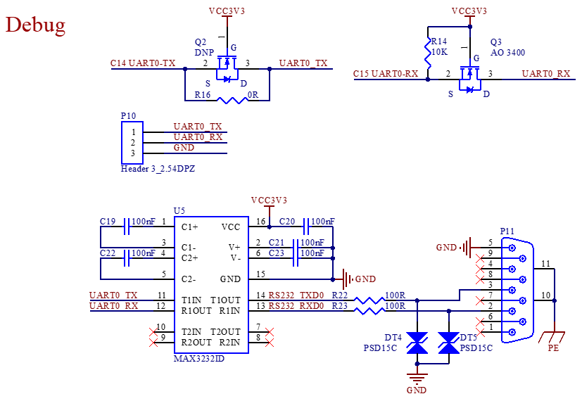

#### 3.5.5 TF Card

There is a self - ejecting TF card socket on the development board. The maximum data rate is SDR Mode 150MHz@1.8V IO. The software system can be flashed via the TF card. It is recommended to keep this socket when designing the carrier board. 

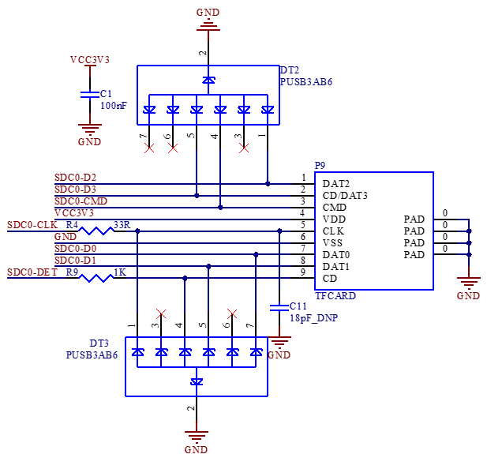

**Note:**

**1. TF card is easy to introduce static electricity, so it is recommended to add TVS protection;**

**2. Place the series resistor of SDC0 - CLK close to the source nd and the capacitor close to the card socket.**

#### 3.5.6 USB

The FETT507 - C SoM contains 4 groups of USB2.0. Among them, USB0 supports the OTG function, and the other three groups of USB2.0 interfaces only support the host mode.

USB2 has the sleep - wake function, which is used in the USB standby or 4G standby scenarios. When applied in the standby scenario, the VCC - USB2 needs to be continuously powered.

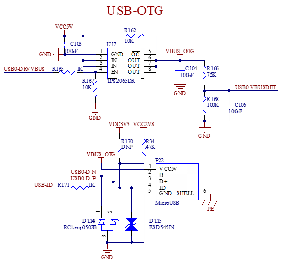

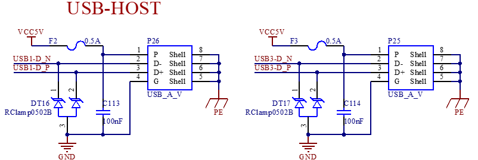

#### 3.5.7 4G

The OKT507 - C board has an on - board mini PCIE slot with a latch, which supports the 4G module and uses the USB2 channel. There is a microSIM card slot beside the module. To ensure a stable power supply for the module, the 4G\_VCC power supply can output 3A current. Install the 4G antenna using the matching ipex extension cable. One end is connected to the 4G module, and the other end is connected to P39 at the lower - left corner of the development board. P21 is connected to the 4G dedicated small suction - cup antenna.

The hardware design of the development board has the 4G standby function. When the SoM is in sleep mode, the 4G module is continuously powered, and VCC - USB2 is continuously powered. The system can be woken up through 4G - WAKEUP - SOC, and the wake - up function requires software release support.

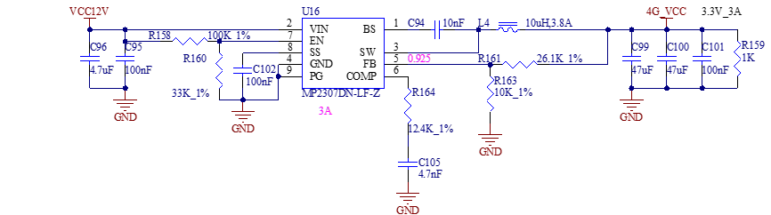

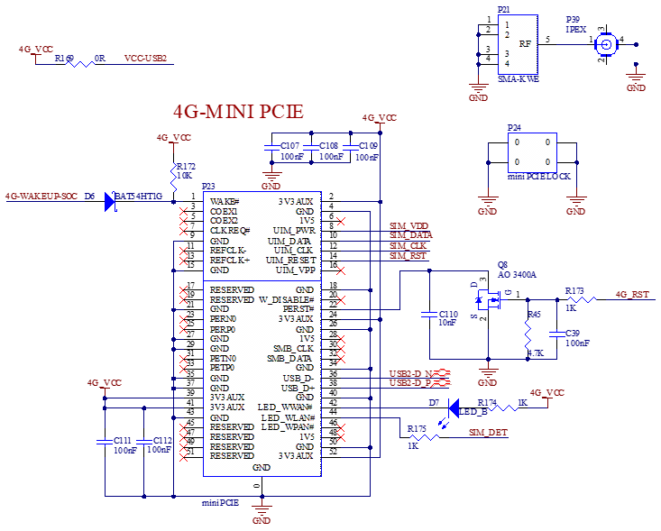

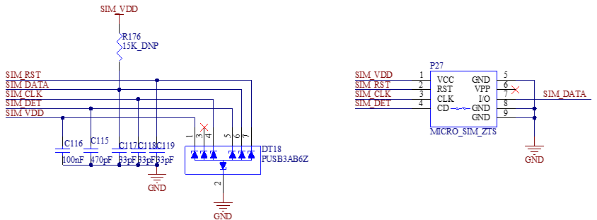

**Note: The support status of the 4G standby wake - up function depends on the software release.**

#### 3.5.8 Wifi＆Bluetooth

The OKT507 - C board has an on - board integrated Wifi \& Bluetooth module U19, and the module model is FG6221ASRC - 00. WIFI uses the SDIO interface. The 2.4GHz frequency band complies with IEEE 802.11b/g/n \& Wi - Fi compliant, and the 5GHz frequency band complies with IEEE 802.11a/n/ac \& Wi - Fi compliant. Bluetooth uses the UART \& PCM interfaces and complies with the BT 5.0 Module. 2.4GHz \& 5GHz antenna P30 is used.

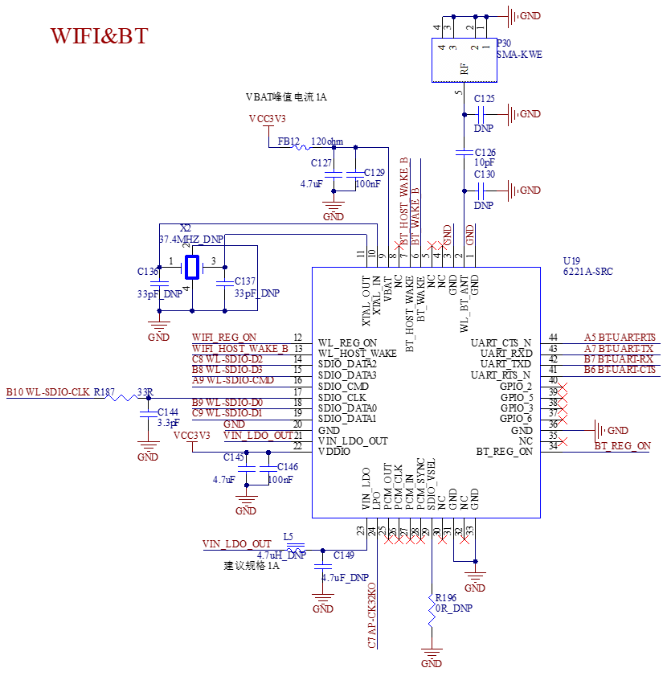

**Note:**

**1\. The RF wiring requires 50 - ohm impedance matching. Minimize the on - board RF wiring as much as possible, and there should be no 90 - degree bends. There needs to be a complete metal copper pour under the RF wiring as a reference ground;**

**2\. The SDIO wiring connecting the CPU end and the module should be as equal in length and parallel as possible;**

**3\. Please select an inductor L5 with a current specification of 1A or above;**

**4\. There are 3 test points at the bottom of this module, which have no practical use. To avoid short - circuits, it is recommended to remove the copper on the surface here;**

**5\. The RTC\_CLK\_WIFI clock signal is essential and cannot be deleted;**

**6\. The pF - level capacitor on the clock line can effectively reduce noise.**

#### 3.5.9 Audio

OKT507 offers four 3.5mm audio jacks and two XH-2.54mm speaker connectors. The LINE IN and LINE OUT interfaces are derived from the CPU's built-in codec. The MIC and HeadPhone and speaker jacks are led from an external codec on the carrier board.

The carrier board uses the NAU88C22YG audio chip, which supports left and right channels to play sound and MIC recording. NAU88C22YG chip has a built-in Class D amplifier, and the Speaker interface can drive an 8Ω speaker with a maximum output power of 1W. If you need to connect a larger amplifier, you can only obtain the signal from the headphone jack, and not from the speaker interface. The power supply of the audio chip is controlled by CODEC\_PWR\_EN, and it is enabled at a high level.

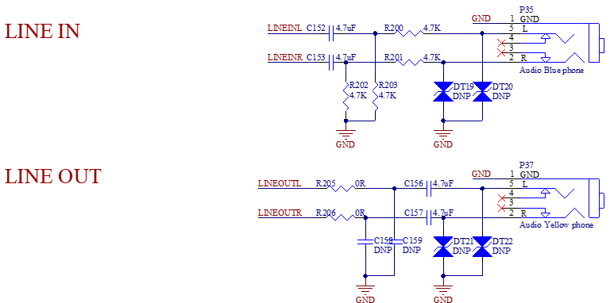

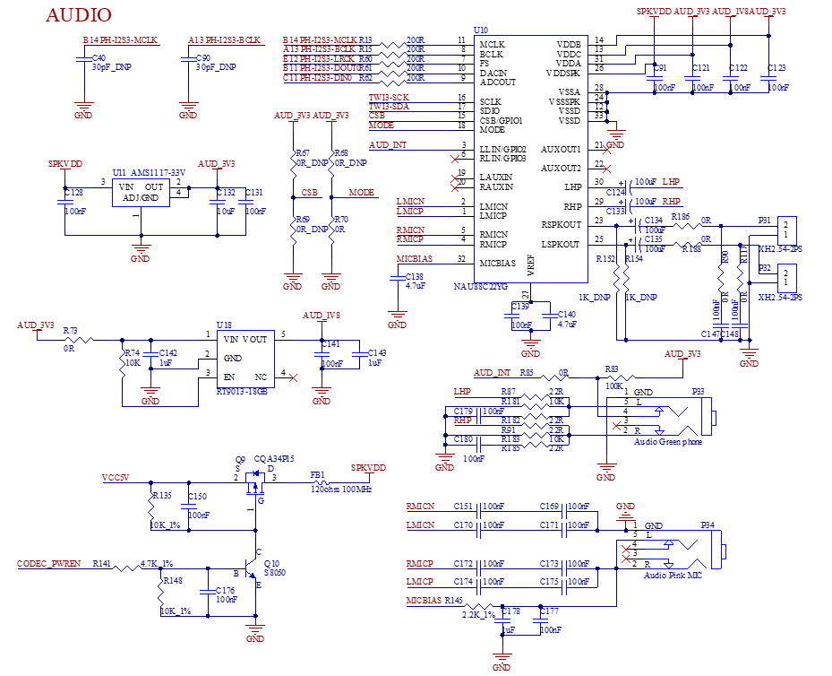

**Note:**

**1\. The power of the speaker comes from a class-D power amplifier, not a traditional analog power amplifier;**

**2\. Connect a speaker to each socket, and not to share the speaker wire, nor connect the speaker to the ground wire;**

**3\. The 31st pin VDDA of NAU88C22YG is an analog power supply pin. When designing the carrier board, please filter this circuit thoroughly. It is recommended to use a separate LDO for power supply to distinguish between digital and analog power supplies. Otherwise, there will be significant background noise during recording and playback;**

**4\. The T507 has no built - in audio ADC. If the LINE IN pin is connected to an analog audio input, it cannot convert the analog signal into digital audio for the CPU to process. Instead, it directly outputs the signal from the LINE OUT.**

#### 3.5.10 RTC

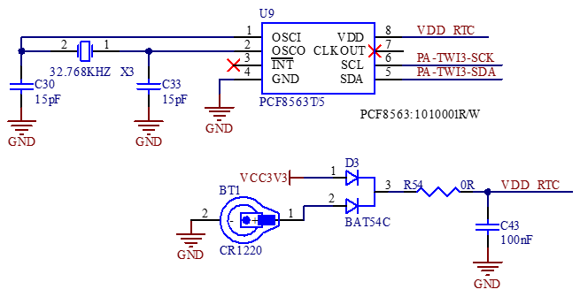

There is an external real - time clock chip PCF8563T/5 (U9) on the carrier board, which reads and writes time via the I2C bus. There is a button battery CR1220 on the board.

#### 3.5.11 Gigabit Ethernet

There are 2 x Ethernet interfaces, P19 is gigabit and P20 is 100m.

The Gigabit network port is connected to the PHY chip RTL8211FSI (U15) via RGMII and is led out by an RJ45 socket (P19). The socket model is FC - H021LNL, which has a built - in isolation transformer.

The RTL8211FSI chip supports 10/100/1000Mbps network auto - negotiation and realizes automatic MDI/MDIX crossover during the auto - negotiation period.

**Note: **

**1. When designing the PCB, ensure that the PHY chip has a complete reference ground. It is recommended to use at least a 4 - layer board for Gigabit network design;**

**2\. The bottom EPAD of the RTL8211FSI needs to be connected to GND;**

**3\.  Place the PHY chip close to the network transformer. Make the RGMII line group have equal lengths; set the differential impedance of the MDI analog differential pair signal to 100Ω; **

**4\. The RGMII and MDIO/MDC levels led out from the SoM can be automatically set according to the PHY model. The RTL8211FSI has a default level of 3.3V. Please select an appropriate working mode for the PHY chip.**

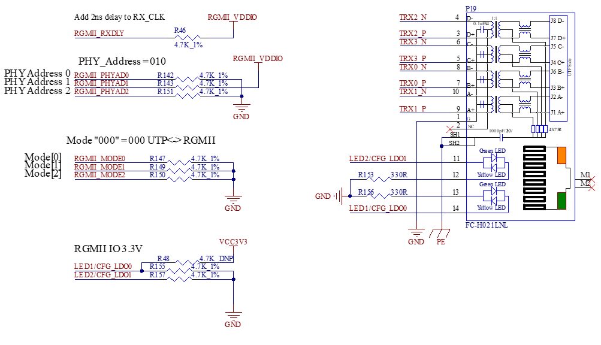

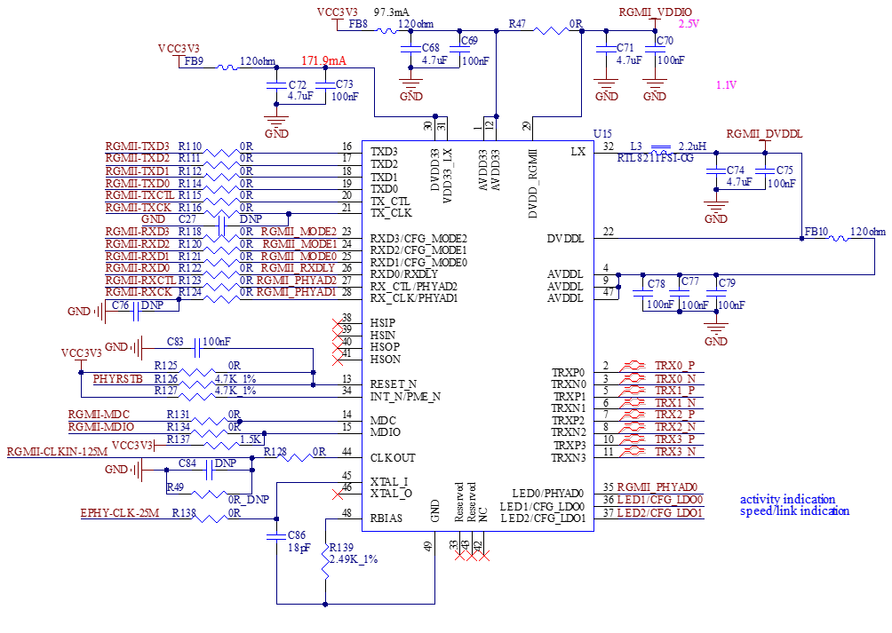

The 100m Ethernet port is connected to the PHY chip YT8512H (U14) through RMII, and is led out from the RJ45 socket (P20). The socket model is FC62115 BNL, and the quarantine transformer is built in.

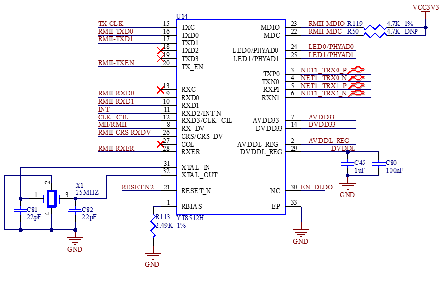

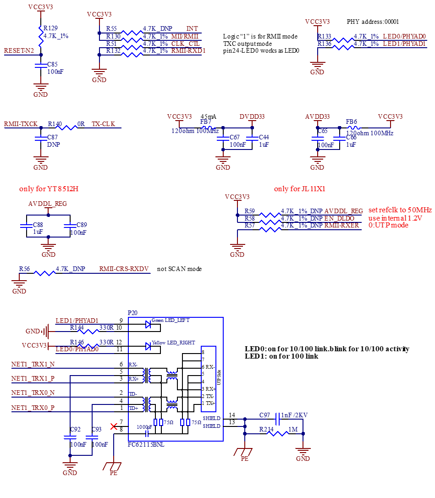

#### 3.5.12 Digital Camera

The OKT507 - C development board is designed with two camera interfaces. By default, P13 uses an OV5640DVP camera, and P14 uses an OV5640MIPI camera. The OV5640 supports a maximum image size of 13.2MP (4224x3136).

The parallel CSI level led out from the FETT507 is 2.8V. When designing the carrier board, pay attention to matching the level with the camera.

**Note:** 

**1. Use ground lines to enclose the MIPI signal lines;**

**2\. When setting the delay of the MIPI signal routing, try to keep it close to the SoM end;**

**3\. Set the differential impedance of the MIPI to 100Ω ± 10%.**

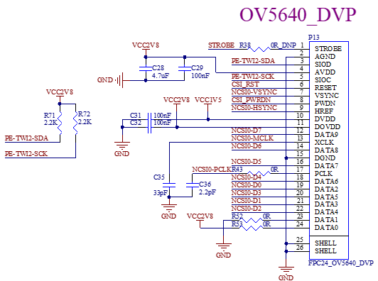

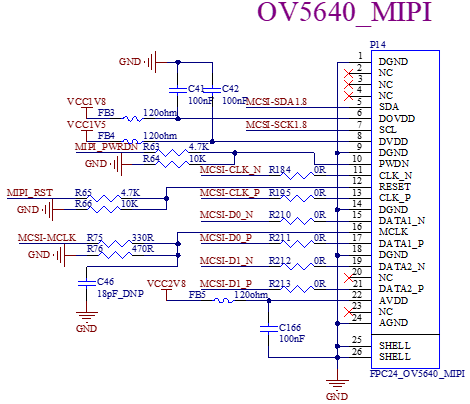

#### 3.5.13 HDMI

The OKT507 - C development board provides an HDMI interface, which supports 4K video output.

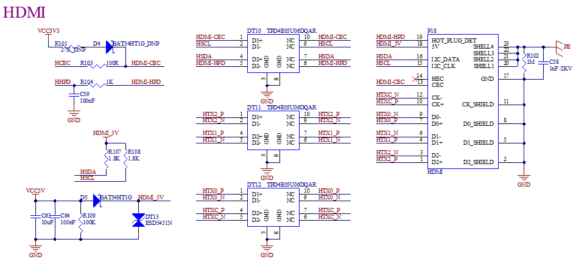

**Note: **

**1. The T507 HDMI CEC and I2C have built - in level conversion and support direct connection to devices;**

**2\. The routing reference plane of the HDMI signal needs to be a continuous and complete reference plane without segmentation. Otherwise, it will cause discontinuity of the differential line impedance and introduce external noise;**

**3\. The HDMI signal lines need to have equal lengths and a differential impedance of 100Ω ± 10%;**

**4\. The equal - length error within the differential line pair should be less than about 10mil; the equal - length error between differential pairs should be less than about 100mil; the length of the HDMI signal line should be less than 3000mil;**

**5\. Since the HDMI has a high data rate, select an appropriate ESD device and place the ESD close to the HDMI socket;**

**6\. During testing, it is found that some HDMI cables do not support 4K resolution output. Please choose high - quality cables that meet the specifications.**

#### 3.5.14 LCD Display Interface

The RGB interface of the T507 processor can reach a maximum resolution of 1920\*1080@60fps.

The RGB888 is led out through a 54pin 0.5mm pitch FPC socket (P16). It can be connected to the display screen supplied by Forlinx.

The 4 - wire resistive touch TX + -/TY + - in the interface is converted by the TSC2007.

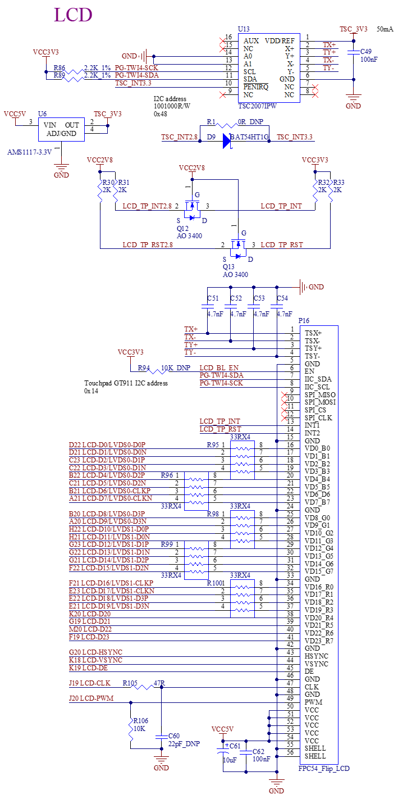

**Note: The TSC2007 chip has special requirements for power - on and power - off. Please refer to the development board or chip manual for design. Otherwise, there is a probability of I2C bus lock - up.**

#### 3.5.15 LVDS Display Interface

LVDS and RGB have pin multiplexing, and only one of them can be used at a time.

Single LVDS supports a maximum of 1920x720@60fps, and dual LVDS supports a maximum of 1920x1080@60fps.

The LVDS signals are led out  through a 38P\_2.0mm pin header. Please check the wire sequence before connecting to the screen.

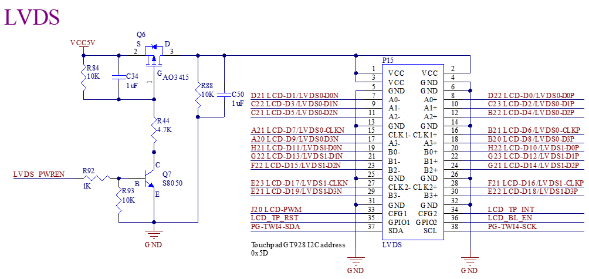

**Note:**

**1. Impedance requirements: 50Ω for single - ended and 100Ω for differential;**
**2. Both RGB and LVDS are led out from the development board. For the convenience of wiring, the LVDS is not designed with equal lengths. When you design your own carrier boards, please follow the specifications.**

#### 3.5.16 TV- OUT Display Interface

There is a TV CVBS output on the development board, which is led out using an RCA phono plug (P17). It supports NTSC and PAL modes.

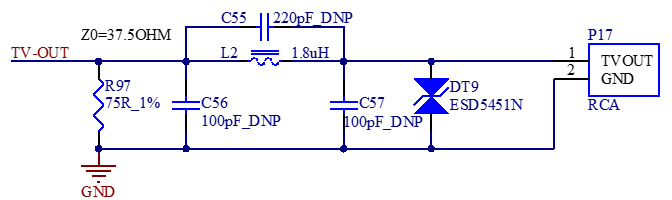

**Note:**

**1. The 75Ω resistor at the CVBS port needs to be of a large package because the CVBS outputs current. If the package is too small, the resistor will overheat and burn out;**
**2. It is recommended to add TVS protection to the CVBS port;**
**3. Place the 75Ω resistor, TVS, and filtering resistors and capacitors close to the socket;**
**4. Use a 37.5Ω impedance for the TVOUT signal line;**
**5. The TVOUT signal line needs a complete ground plane.**

#### 3.5.17 IR Infrared Interface

The development board provides one infrared interface, which can only receive signals.

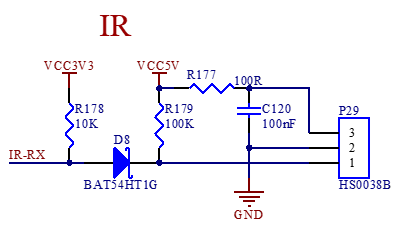

#### 3.5.18 ADC

There are 4 x GPADC on the development board, which is demonstrated using variable resistors. The ADC voltage sampling range is 0~1.8V.

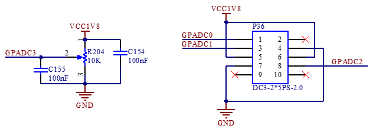

#### 3.5.19  SPI NOR FLASH

There is a SPI NOR FLASH on the carrier board. Pay attention to the power - supply timing.

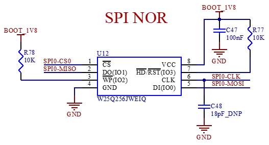

**Note:**

**1. The default eMMC version of the SoM does not support SPI0;**
**2. If you need to use the ordinary SPI interface function, please design the carrier board by yourself. The SPI1 can be multiplexed on the I2S3 signal;**
**3. The SPI boot - loading system has not been released yet.**

## 4\. Hardware Design Guide

1. The PMIC model used on the FETT507 - C SoM is AXP853T. All DCDC of the AXP853T have leakage detection functions. When the AXP853T \& T507 hardware system is not powered on, if a peripheral chip leaks electricity to the DCDC power rails of the AXP853T through a pull - up resistor or internal leakage of the peripheral chip, and the leakage voltage exceeds 0.5V, the AXP853T will not start and will wait for the leakage abnormality to be resolved. For anti - leakage design, please refer to the “SOC Anti - Leakage Application Design Guide”;
2. In the USB Standby scenario, VCC - USB2 needs to be externally powered constantly. If there is no USB Standby application scenario, VCC - USB2 can be connected to the PMU DCDC1;
3. All unused GPIOs can be left floating or grounded. Unused LRADC and GPADC can be left floating;
4. When the SoM is reset and restarted, if there are devices on the carrier board that are not powered off, resulting in GPIO leakage on the SoM, a voltage can be measured on DCDC1. The voltage of DCDC1 will prevent the carrier board from powering off. Since the carrier board cannot power off, causing GPIO leakage, the SoM will fall into a dead - loop where it cannot start! The solution is to use a voltage monitoring chip TLV809ED29 (U8) to monitor the voltage of DCDC1. When the voltage of DCDC1 is lower than 2.93V, turn off Q1 to power off the carrier board. Please refer to our development board design.

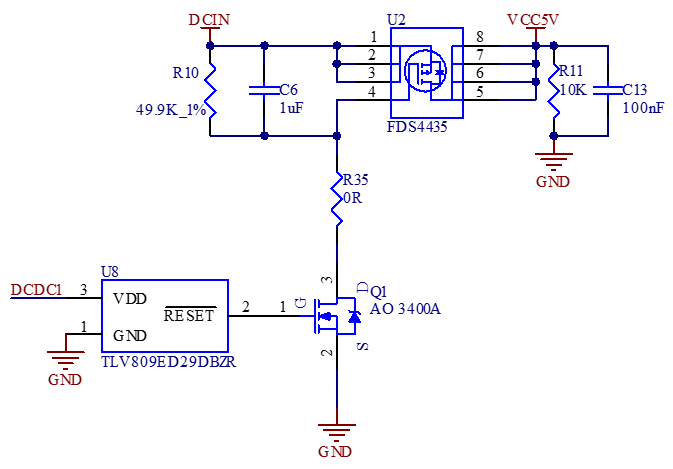

5. SoM heat dissipation consideration:

After actual testing, without a heat sink on the SoM, the main frequency will be reduced to 480MHz when operating at a high temperature of 85°C; if a small heat sink is added, it will not be down - clocked at 85°C. Two mounting holes with a diameter of 3.2mm are reserved on the carrier board. You can select and install the heat sink according to the site environment. Please add a layer of insulated heat-conducting silicone pad on the contact surface between the heat sink and the core board. The size of the heat sink is shown in the figure below:

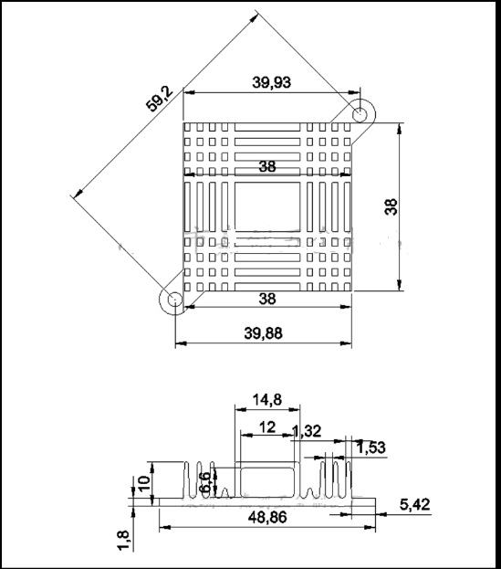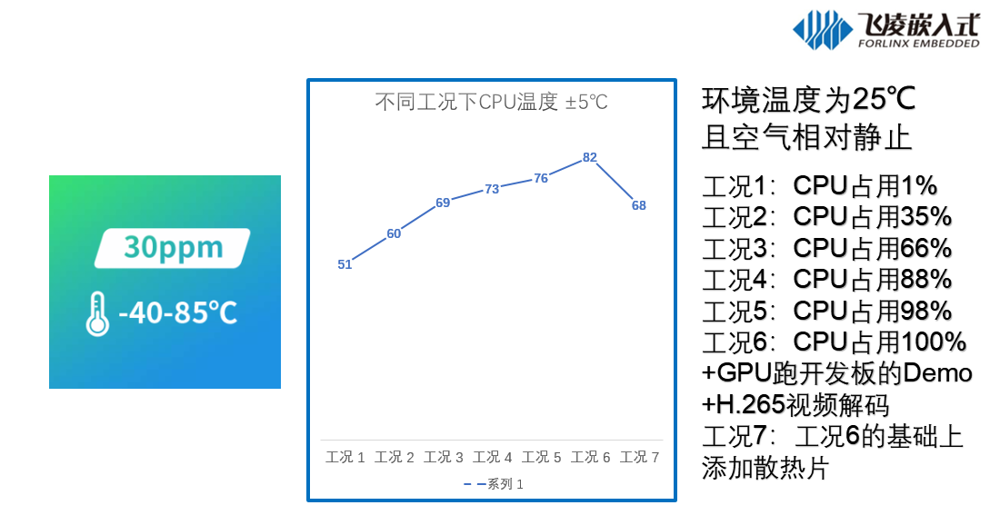

## 5\. Connector Dimension Diagram

The specifications of the SoM connector are as follows:

The specifications of the baseboard connector are as follows:

## 6\. OKT507-C Development Board Power Consumption Table

**Linux system power consumption**

| **No.**| **Test Item**| **SoM Power (W)**| Development Board Power (including SoM) (W)
|:----------:|----------|:----------:|:----------:
| | | | 
| 1| No-load starting peak power| 1.1| 1.7
| 2| CPU with full load| 2.0| 2.7
| 3| 10.1-Inch LVDS+4 analog camera| 1.2| 4.6
| 4| HDMI and LCD display| 1.2| 3.12

**Note：**

**1. Test conditions: The SoM configuration is 2G memory + 8GB eMMC, the 4G module is Quectel EC20, and the screen and 4 analog cameras are optional products of Forlinx. SoM power supply is 5V and development board is 12V;**                            
**2. Power consumption is for reference only.**  

## 7\. Minimum System Schematic

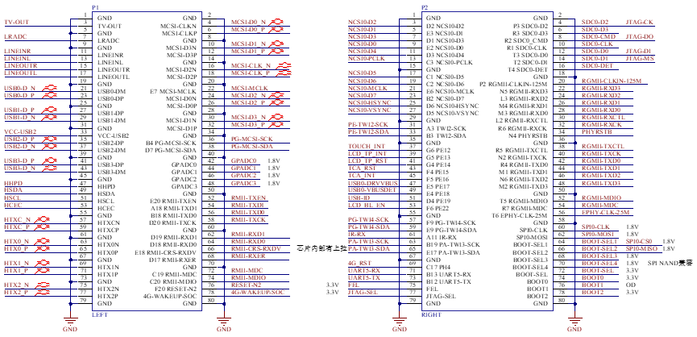

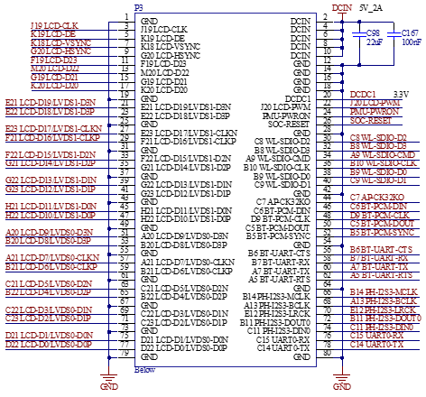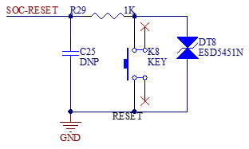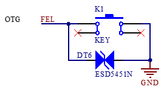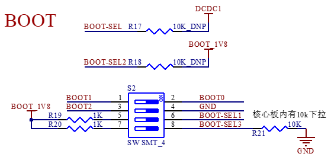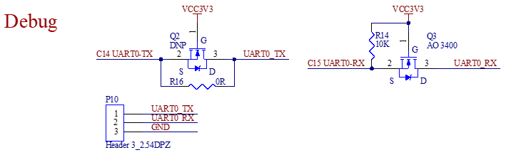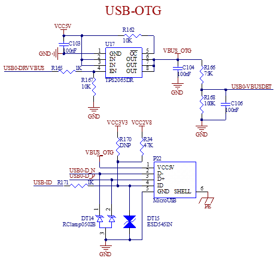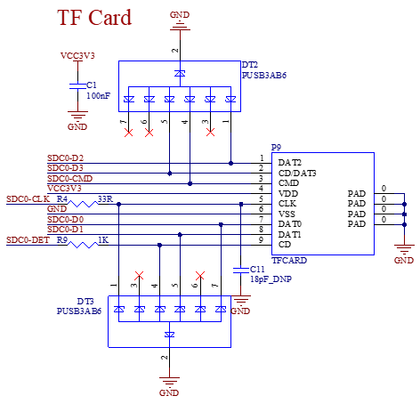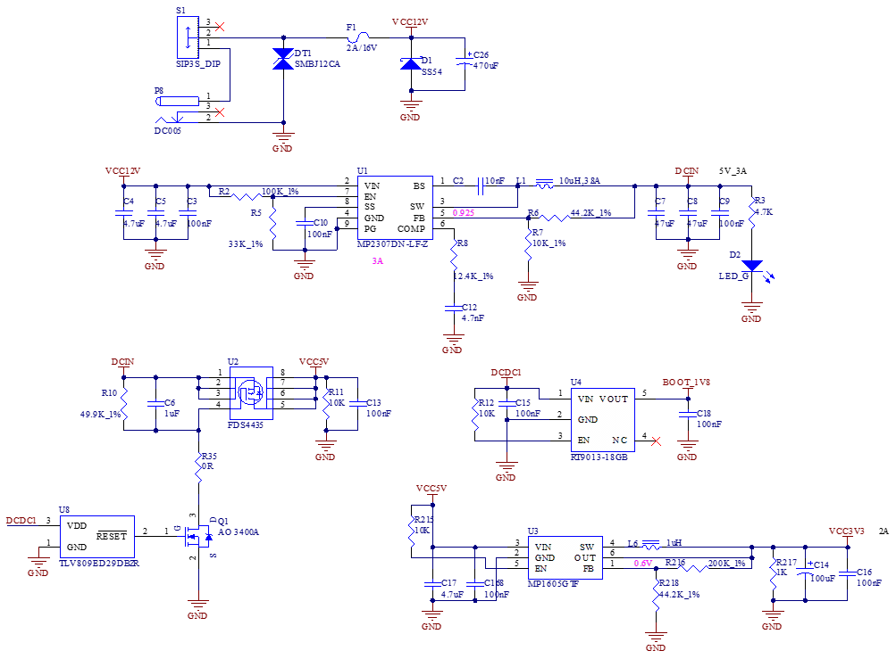

To meet the normal operation of the SoM, in addition to the power supply DCIN, the SOC-RESET key is also required to facilitate debugging; the BOOT configuration circuit is convenient for system programming and startup; the UART0 circuit is convenient for confirming whether the system works normally and for debugging; the OTG and TF Card circuits are convenient for system programming.