# 00_OK-MA35-S21_Linux5.10.140_用户编译手册

发布版本：V1.0  
日期：2024-12-10  
文件密级：□绝密 □秘密 □内部资料 ■公开

# 免责声明
<font style="color:#000000;">本手册版权归保定飞凌嵌入式技术有限公司所有。未经本公司的书面许可，任何单位和个人无权以任何形式复制、传播、转载本手册的任何部分，违者将被追究法律责任。</font>

<font style="color:#000000;">保定飞凌嵌入式有限公司所提供的所有服务内容旨在协助用户加速产品的研发进度，在服务过程中所提供的任何程序、文档、测试结果、方案、支持等资料和信息，都仅供参考，用户有权不使用或自行参考修改，本公司不提供任何的完整性、可靠性等保证，若在用户使用过程中因任何原因造成的特别的、偶然的或间接的损失，本公司不承担任何责任。 </font>

# 概述
本手册是为了让使用飞凌嵌入式开发板的人员能够快速了解飞凌产品的编译过程，熟悉飞凌产品的编译方式。应用程序需要在Linux操作系统上先进行交叉编译，才能在开发板上运行，按照编译手册上的方法，通过实际操作，用户能够完成自己软件代码的编译。

手册会从环境搭建进行说明，环境搭建过程可能会出现一些不可预见的问题，建议初学者直接使用我们搭建好的开发环境，可以快速上手，缩短开发时间。

Linux系统通常情况下有三种安装方式：真机双系统、真机单系统、虚拟机。不同安装方式都有其优缺点，本文仅提供在虚拟机中搭建ubuntu的方法。计算机硬件要求：建议内存至少在6GB及以上，这样在给虚拟机分一部内存运行的同时（虚拟机建议2GB以上），还可以在Windows做其他操作，否则会影响到Windows的操作。

 在内容上手册主要分为4个章节描述：

+ 第一章主要是VMware的安装，选用的版本为VMware® Workstation 15 Pro15.1.0，用户在使用ubuntu开发环境之前要先安装VMware ；
+ 第二章主要是加载飞凌提供的ubuntu开发环境的方法，开发环境为64位ubuntu20.04；
+ 第三章主要是搭建新的ubuntu开发环境的方法。本节选用的64位ubuntu20.04为例，描述了ubuntu的创建，由于电脑配置不同，搭建过程可能会出现预料之外的问题，建议初学者直接使用我们搭建好的环境；
+ 第四章主要是开发板相关源码编译方法。
+ 本手册中一些符号及格式的相关说明：

| **表现形式** | **含义** |
| --- | --- |
| 灰底蓝色字体 | 指在命令行输入的命令，需要手动输入 |
| 灰底黑色字体 | 输入命令后的串口输出信息 |
| **灰底黑色加粗** | 串口输出信息中的关键信息 |
| // | 对输入指令或输出信息的解释内容 |
| 用户名@主机名 | **root@okmx8mm**:开发板串口登录账户信息， **forlinx@ubuntu**：开发环境**ubuntu**账户信息， 用户可通过该信息确定功能操作的环境 |


# 更新记录
| **日期** | 手册版本 | **更新内容** |
| --- | --- | --- |
| 20241210 | V1.0 | OK-MA35-S21 用户编译手册初版。 |


# 01_VMware虚拟机软件安装

本章主要介绍VMware虚拟机的安装，以VMware workstation 15 Pro v15.1.0为例展示操作系统的安装配置过程。

## 1.1 VMware软件的下载与购买
[登陆VMware官网https://www.vmware.com/cn.html下载](https://www.vmware.com/cn.html)Workstation Pro并获取产品密匙。VMware是付费软件，需要自行购买，或者使用VMware提供的试用版本。


等待下载完成后双击启动文件启动安装程序。

## 1.2 VMware软件的安装
双击启动程序进入安装向导。

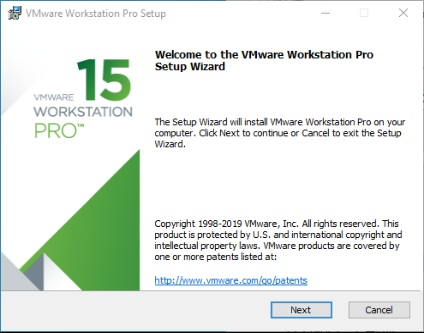

点击“下一步”。


勾选我接受许可协议中的条款，点击“下一步”。

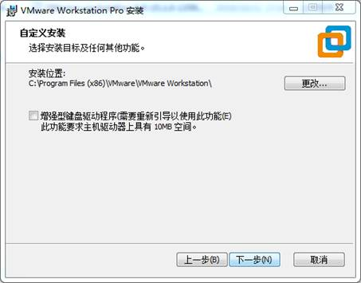

修改安装位置，装到自己电脑安装软件的分区，点击“下一步”。

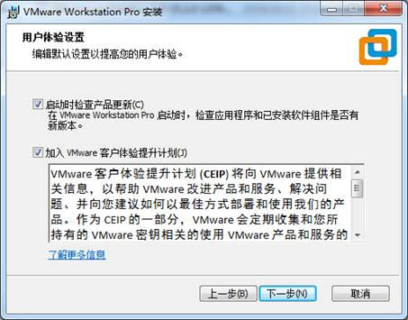

勾选，点击“下一步”。

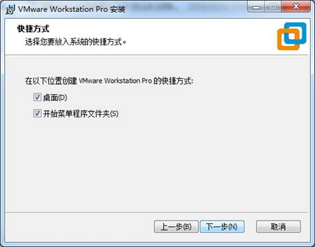

勾选添加快捷方式，点击“下一步”。

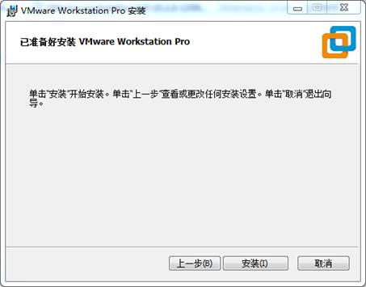

点击“安装”。

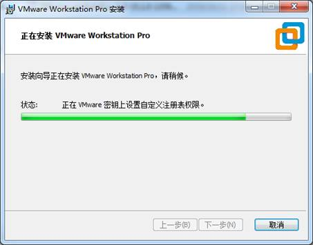

等待安装完成。

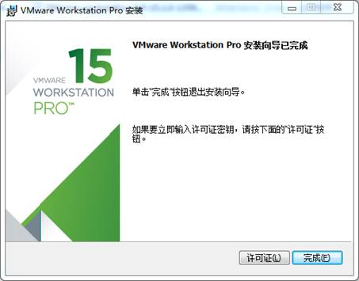

点击完成后可进行试用。若用户需要长期使用，需要到官方购买，填写许可证。


# 02_加载已有ubuntu开发环境

**建议初学者直接使用飞凌搭建好的虚拟机环境。了解完该章节后可以直接跳转到编译章节。**

**提供开发环境的账户为：forlinx，密码为：forlinx**

在VMware下使用虚拟机的环境有两种方式，一种是直接加载已有的环境，另一种是新建一个环境，我们先来说说如何加载一个已经存在的环境。

首先，下载飞凌提供的开发环境，开发环境资料中有MD5校验文件，用户下载完开发环境资料，先对开发环境压缩包进行MD5校验（MD5校验可以在网络上选择MD5在线工具校验，也可以下载MD5校验工具进行校验，可根据实际情况选择），查看校验码和校验文件中校验码是否一致，若一致则下载文件正常；若不一致，则文件可能有破损，需要重新下载。

选中所有压缩包，右键解压到Nuvoton-Ubuntu 20.04，如下图所示：

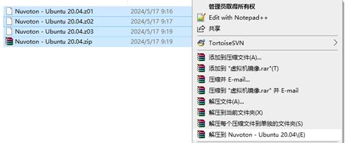

解压完成后出现 MA35标准环境文件夹，其中.vmx为虚拟机要打开的文件。

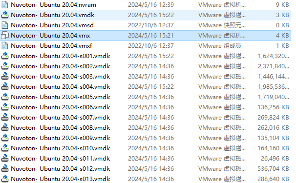

打开虚拟机，选择解压出来的MA35开发环境中文件：Nuvoton- Ubuntu 20.04.vmx

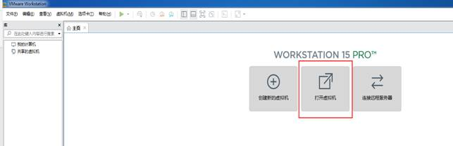

加载完成后点击开启此虚拟机，即可运行，进入系统的界面。

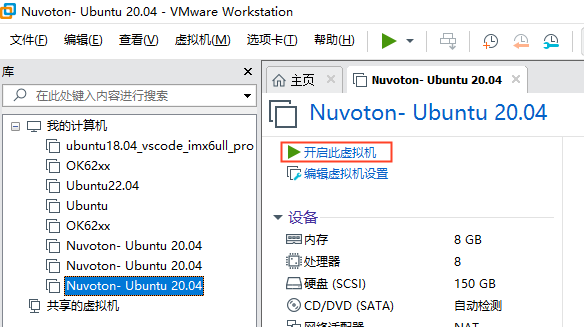


     提供开发环境的账户为forlinx，密码为forlinx，填好密码后选择Sign in登录。


   **注意：如果启动后，显示“客户端操作系统已禁用CPU。请关闭或重置虚拟机”。则重新开启虚拟机，开启过程中移植按住shift键，弹出grub菜单。选择advanced options for ubuntu。然后选择linux 5.13.0-30-generic进行启动。**

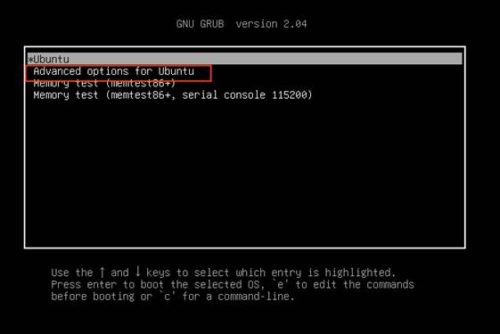

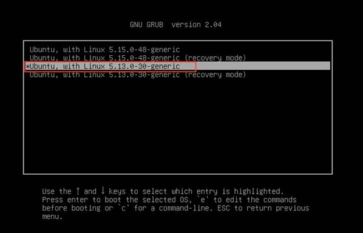

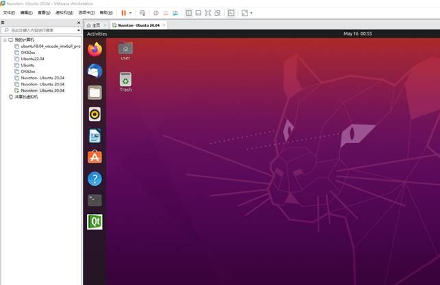


# 03_搭建新的ubuntu开发环境

**注意：初学者不建议自己搭建系统，建议使用已有虚拟机环境，不需要搭建环境的此节可以跳过本章节主要讲解了ubuntu系统的搭建过程。**

## 3.1  ubuntu系统搭建
### 3.1.1. 创建ubuntu虚拟机
打开VMware软件，点击创建新的虚拟机。进入以下界面：

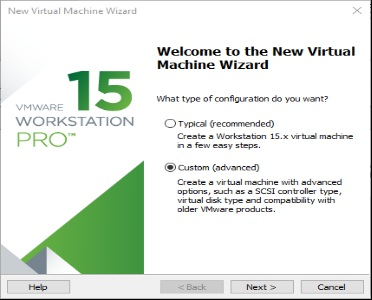

选择自定义，点击“下一步”。

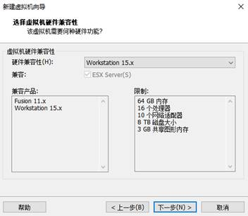

选择对应VMware版本的兼容性，版本可在帮助->关于VMware Workstation中查看，点击“下一步”。

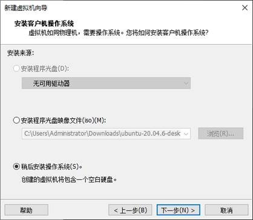

选择稍后安装操作系统，点击“下一步”。

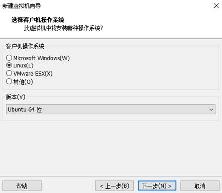

保持默认，点击“下一步”。


修改虚拟机名称及安装位置，点击“下一步”。


按照实际情况设置处理器数量。

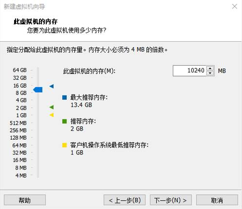

同样按照实际情况设置内存大小，建议使用16G（根据自己机器性能做调整）。


设置网络类型，默认为NAT模式，点击下一步。后面的步骤保持默认值，直到指定磁盘容量步骤。


IO控制器类型这里默认选择LSI就可以：

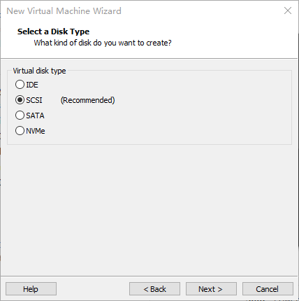

这里同样是默认选择SCSI。

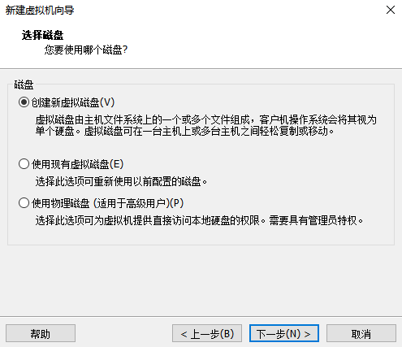

这里选择创建新的虚拟磁盘：

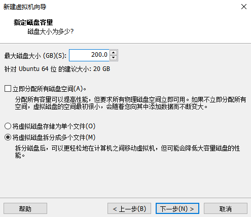

设置磁盘大小为200G，并选择磁盘的存在形式，然后点击“下一步”完成。


指定磁盘文件，这里默认即可。

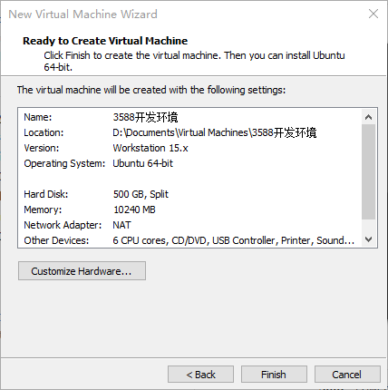

默认点击“完成”即可。


至此，虚拟机创建完成。

下一小节中我们介绍Ubuntu系统在虚拟机中的安装，其在真机中的安装方法与虚拟机类似。这里我们介绍在虚拟机中安装Ubuntu系统的方法。

### 3.1.2 系统安装
我们选择安装的Ubuntu 版本是20.04，首先去Ubuntu官网获取Ubuntu20.04 64位镜像，下载地址为：[http://sources.ubuntu.com/20.04/下载“ubuntu-20.04.6-desktop-amd64.iso”这个版本。](http://sources.ubuntu.com/20.04/下载“ubuntu-20.04.6-desktop-amd64.iso”这个版本。)


右击刚创建完成的Ubuntu64位 在弹出菜单中选择设置：

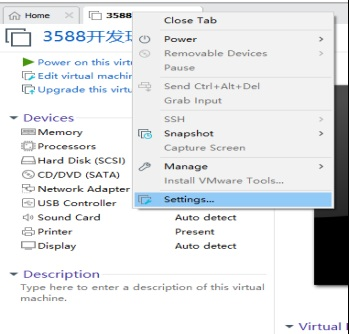

弹出“虚拟机设置菜单”根据如下图： 

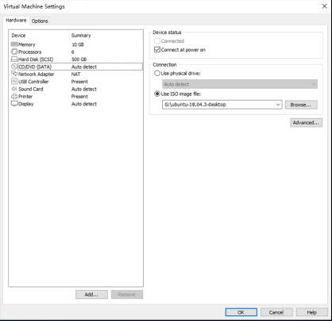

点击CD/DVD（SATA），选择使用ISO映像文件，浏览选择前面下载的Ubuntu镜像，然后确定。

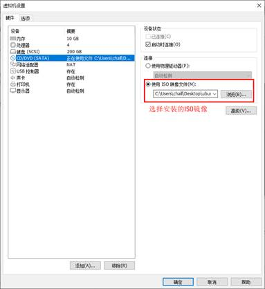

设置好镜像后，保证网络可用，然后开启虚拟机，进行Ubuntu镜像的安装。

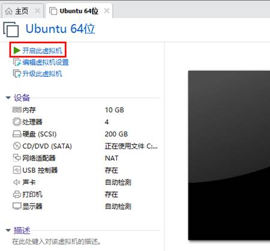

开启虚拟机后，等待出现安装界面如下：

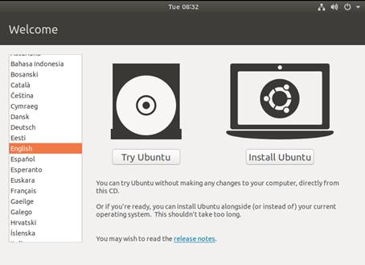

如图左侧选择语言后,点击“Install Ubuntu”后弹出选择语言界面。Ubuntu默认语言是英文的，当然，也可以选择中文，默认选择的语言在后期也是可以重新设置的，选择完成后continue。

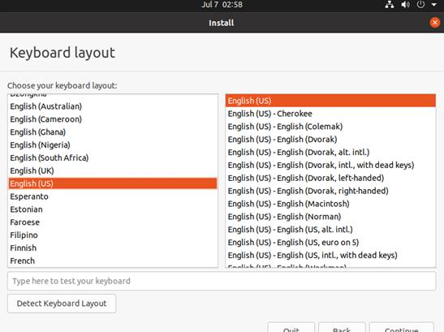

接下来，默认选择continue继续安装，安装过程会很慢，然后点击“continue”：

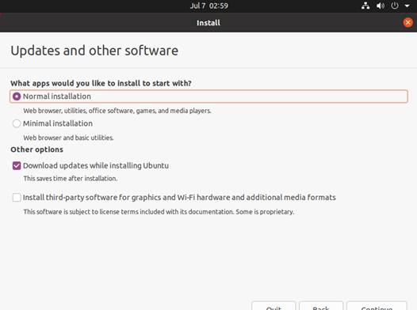

默认，点击Install Now，会弹出下图，点击“continue”即可。

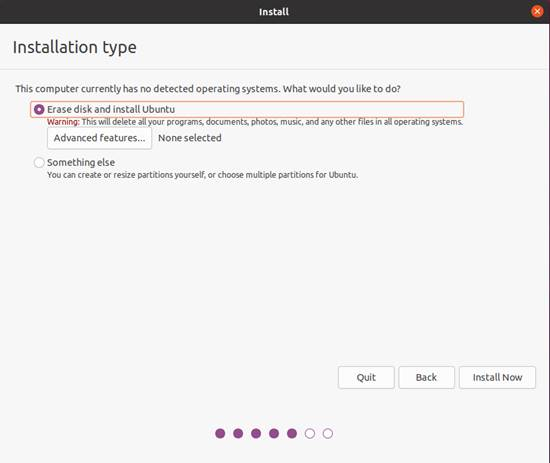

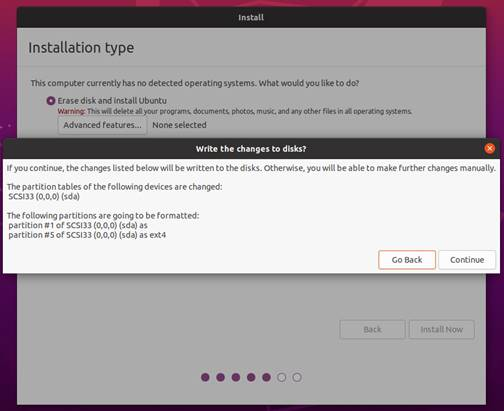

接下来选择时区，这里点击上海时区或输入Shanghai即可（不同时区根据实际情况选择即可），点击“继续”。最后设置用户名和密码，点击“continue”就会自动安装：


安装过程下图，网络不好可以Skip跳过，不影响安装。

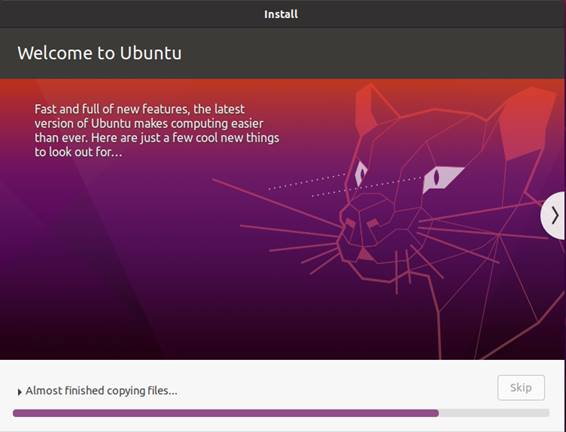

安装完成后显示如下图，点击“Restart Now”重启（或者点击“重新启动客户机”）：


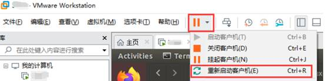

重启完成登录后系统界面如下图：


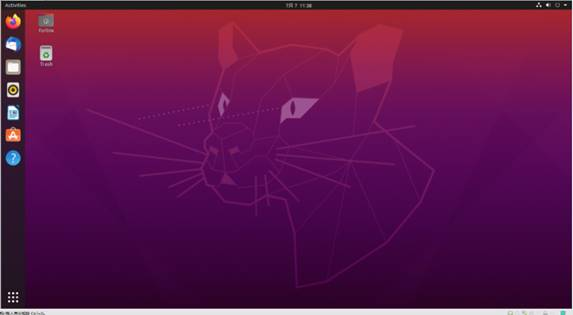

### 3.1.3 Ubuntu的基本配置
安装好Ubuntu20.04操作系统后，要进行一些配置。

**VMware Tools安装：**

接下来安装VMware Tools，如果不安装该工具，在Windows主机和虚拟机之间无法使用复制粘贴、文件拖拽。首先点击VMware 导航栏上的“虚拟机”，然后在下拉框中点击“安装VMware Tools”：

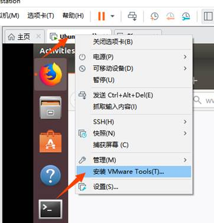

完成后进入Ubuntu，桌面会出现VMware Tools的光盘图标，点击进入其中：


双击VMwareTools图标，进入后看到一个压缩文件VMwareTools-10.3.10-12406962.tar.gz（不同的虚拟机版本可能会不同），


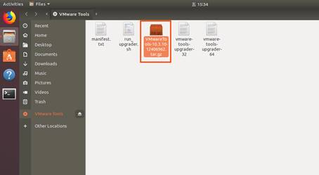

复制文件到主目录下面（即home 个人用户名的目录下）：

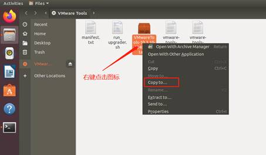

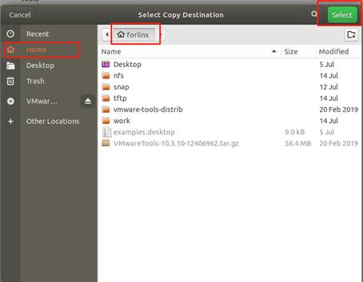

按键盘【Ctrl+Alt+T】调出终端命令界面，使用tar命令对VMwareTools安装包解压（使用sudo命令会提示输入密码，根据提示直接输入密码回车即可，Linux系统密码输入无回显，确保输入的密码正确后按回车确认即可）：

```plain
forlinx@ubuntu:~$ sudo tar -xvf VMwareTools-10.3.10-12406962.tar.gz 
[sudo] password for forlinx:
```

执行完解压命令后，使用ls查看，会出现一个vmware-tools-distrib的文件目录， 进入到该目录

```plain
forlinx@ubuntu:~$ ls
Desktop   examples.desktop   nfs   snap   tftp   VMwareTools-10.3.10-12406962.tar.gz  vmware-tools-distrib   work
forlinx@ubuntu:~$ cd vmware-tools-distrib/	                      //使用cd命令进入该目录
forlinx@ubuntu:~/vmware-tools-distrib$ ls                         //查看该目录下的文件
bin   caf   doc   etc   FILES   INSTALL   installer   lib   vgauth   vmware-install.pl
```

在当前目录下，输入sudo ./vmware-install.pl，进行安装，回车后输入密码，然后就开始安装，遇到[yes]/[no]就输入yes，其他一律回车默认安装就可以。

```plain
forlinx@ubuntu:~/vmware-tools-distrib$ sudo ./vmware-install.pl 
[sudo] password for forlinx: 		     //输入forlinx账户的密码，无回显，无法看到输入内容
```

安装过程信息较长，此处省略

```plain
open-vm-tools packages are available from the OS vendor and VMware recommends 
using open-vm-tools packages. See http://kb.vmware.com/kb/2073803 for more 
information.
Do you still want to proceed with this installation? [no] yes			//输入yes
... ...		
```

VMware tools工具完成后，可以实现Windows和Ubuntu之间的文件复制粘贴，虚拟机自适应全显等功能。如果虚拟机不能够全屏显示，可以通过点击查看，选择自动调整大小，点击自动适应客户机，即可实现虚拟的全屏问题，VMware tools安装成功。

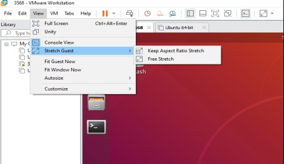

**基本设置：**

在下图位置进行大部分的系统设置。Ubuntu上很多设置的需求都可以在这里完成。

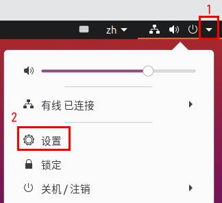

### 3.1.4 Ubuntu的网络设置
**NAT模式**

在使用网络前，先确保我们的虚拟机能连接互联网，打开虚拟机设置，网络适配器中的网络桥接模式改为“NAT模式”：

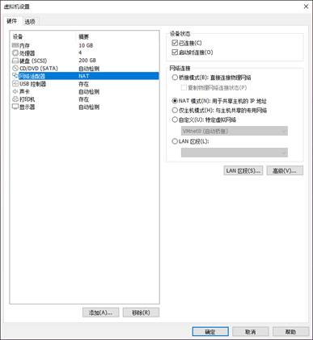

在虚拟机中，VMware虚拟网卡设置为NAT模式时，Ubuntu环境中网络设置为动态IP即可。在这种模式下虚拟NAT设备和主机网卡相连通。这是我们虚拟机上外网最常用的方式。


网络设置为动态ip。

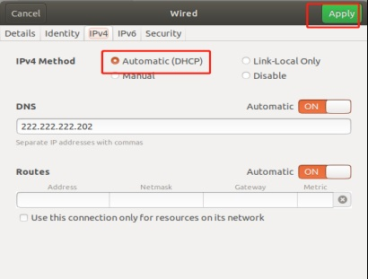

**桥接模式：**

如果在使用TFTP，SFTP等服务器时则需要设置虚拟机的网络联系方式为桥接方式。VMware虚拟网卡设置为桥接模式时，主机网卡和虚拟机网卡通过虚拟网桥进行通信，需要将Ubuntu的IP与主机IP设置在同一个网段。


   设置静态ip，此时Ubuntu的IP与主机IP需设置在同一个网段。


**注意：网络设置部分涉及到的IP以及DNS请按照用户自身的实际环境来设置，手册为举例说明。**

### 3.1.5 U盘的加载
打开虚拟机设置，USB控制器，在兼容性里面选择USB3.0，然后确定。如下图，因为目前大多数电脑都支持USB3.0的接口，如果不设置，当我们插入USB3.0接口，是不能连接到虚拟机的。如下图：


虚拟机启动后，插入U盘，虚拟机右下角会多出一个类似“U盘”的图标，右击-->连接即可，然后就可以在文件系统看到多一个目录，说明U盘加载成功，如图：


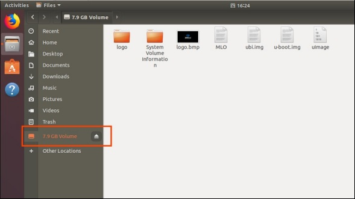

### 3.1.6 虚拟机基本库安装
在进行开发之前，还需要一些其他的必要库，我们使用以下命令逐一安装，安装前需保证网络可正常使用，能上外网：

```plain
forlinx@ubuntu:~$ sudo apt-get update                        //更新下载源信息
forlinx@ubuntu:~$ sudo apt-get install build-essential            //提供编译程序必须软件包的列表信息
forlinx@ubuntu:~$ sudo apt-get install libncurses*               //用于生成基于文本的用户界面
forlinx@ubuntu:~$ sudo apt-get install lzop                     //基于Lzo库的压缩解压工具
forlinx@ubuntu:~$ sudo apt-get install net-tools                 //网络配置工具
```

### 3.1.7 编译OKMA35 Linux源码必要库安装
```plain
forlinx@ubuntu:~$ sudo apt-get update                                       //更新apt-get下载源
forlinx@ubuntu:~$ sudo apt-get install openssh-server vim git fakeroot           //必备工具包的安装
forlinx@ubuntu:~$ sudo apt-get install git ssh make gcc libssl-dev liblz4-tool expect g++ patchelf chrpath gawk texinfo chrpath diffstat binfmt-support qemu-user-static live-build bison flex fakeroot cmake gcc-multilib g++-multilib unzip device-tree-compiler python3-pip libncurses5-dev
forlinx@ubuntu:~$ sudo apt-get install libgmp-dev  libmpc-dev libicu-dev bsdmainutils expect
```

这些库文件是自行搭建MA35 Linux编译环境时，准备编译Linux源码需要下载的库文件，若不是搭建MA35 Linux开发环境，可跳过此步骤。

## 3.2 Ubuntu常用软件安装
### 3.2.1 VScode工具安装软件工具
点击桌面左侧类似一个包的图标，可以看到一些工具，我们也可以搜索我们想要的工具，例如我们下载一个VScode工具，这个工具在我们日常编写代码很方便。

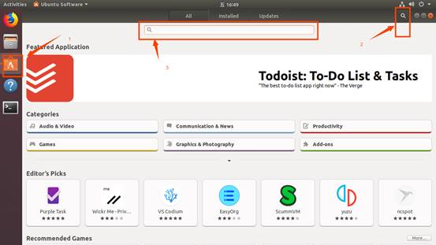

搜索到我们需要的工具，点击进入查看详情，点击install下载，等待下载完成自动安装，然后点击Launch运行即可。

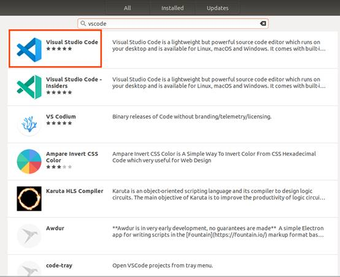

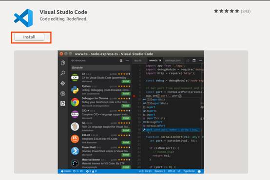


### 3.2.2 apt命令指定国内源
apt命令用来下载管理应用程序，apt 采用的C/S模式，也就是客户端/服务器模式，我们的 PC 机作为客户端，当需要下载软件的时候就向服务器请求，因此我们需要知道服务器的地址，也叫做安装源或者更新源。

**注意：由于Ubuntu默认的源是国外的，可能有时候无法访问，国内各大高校和企业有其镜像源（清华源、阿里源等），建议切换国内镜像源。**

**方法：**

Ubuntu20.04的位置存放在/etc/apt/sources.list文件中，替换相应链接即可，该操作需要使用root用户。下面以阿里源为例：

安全起见需要备份需要修改的文件，如下操作：

```plain
forlinx@ubuntu:~$ sudo cp /etc/apt/sources.list /etc/apt/sources.list.bak
```

在/etc/apt/sources.list文件前面添加如下条目：

```plain
deb http://mirrors.aliyun.com/ubuntu/ bionic main restricted universe multiverse
deb http://mirrors.aliyun.com/ubuntu/ bionic-security main restricted universe multiverse
deb http://mirrors.aliyun.com/ubuntu/ bionic-updates main restricted universe multiverse
deb http://mirrors.aliyun.com/ubuntu/ bionic-proposed main restricted universe multiverse
deb http://mirrors.aliyun.com/ubuntu/ bionic-backports main restricted universe multiverse
deb-src http://mirrors.aliyun.com/ubuntu/ bionic main restricted universe multiverse
deb-src http://mirrors.aliyun.com/ubuntu/ bionic-security main restricted universe multiverse
deb-src http://mirrors.aliyun.com/ubuntu/ bionic-updates main restricted universe multiverse
deb-src http://mirrors.aliyun.com/ubuntu/ bionic-proposed main restricted universe multiverse
deb-src http://mirrors.aliyun.com/ubuntu/ bionic-backports main restricted universe multiverse
```

保存后退出。在终端执行如下命令：

```plain
forlinx@ubuntu:~$ sudo apt-get update
forlinx@ubuntu:~$ sudo apt-get upgrade
```

### 3.2.3 安装NFS
终端执行如下命令：

```plain
  forlinx@ubuntu:~$ sudo apt-get  install -y nfs-kernel-server nfs-common portmap  
```

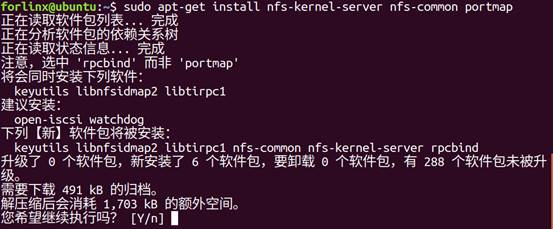

## 3.3 QT环境的搭建与使用
Qt Creator是一个跨平台的QT集成开发环境（IDE），包括了高级C++代码编辑器、项目和生成管理等工具，适用于QT应用程序框架设计和应用程序开发。本次安装选用的Qt Creator5.12.8。

飞凌提供的SDK中提供了Qt5.12.8的完整开发环境(包含Qt Quick)。

### 3.3.1 Qt creator环境搭建
路径：OK-MA35-S21 _Linux5.10.140+Qt5.12.8_用户资料\2-镜像及源码\1-源码qt-creator-opensource-linux-x86_64-4.7.0.zip

将qt-creator-opensource-linux-x86_64-4.7.0.zip解压后，将qt-opensource-linux-x64-5.14.2.run拷贝至当前用户家目录下的任意目录下，执行：

```plain
  forlinx@ubuntu:~/62xx$ chmod  777 qt-opensource-linux-x64-5.12.8.run  
  forlinx@ubuntu:~/62xx$ sudo ./qt-opensource-linux-x64-5.12.8.run  
```

    将会弹出如下界面，点击“Next”进入下一步：

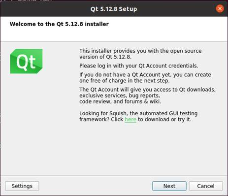

点击“Next”进入下一步：


输入邮箱和密码，点击“Next”进入下一步：

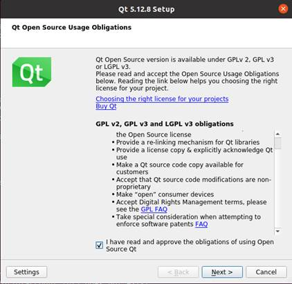

勾选I have read…, 点击“Next”进入下一步：


在如下界面中，点击“Browse…”选择Qtcreator的安装路径，选择完成后，点击“Next”进入下一步：


在如下界面中，选中第一项，点击“Next”进入下一步：


同意协议，点击“Next”：


点击Install安装：


安装完成后，显示如下界面，取消选项“Launch Qt Creator”的勾选，点击“Finish”完成Qt Creator的安装步骤：


### 3.3.2 环境配置
**注意：**

**一定要先配置好环境变量（参考“4.3交叉编译工具链配置”）后，再使用命令打开Qt Creator。**

**根据自己实际安装的路径打开Qt Creator。**

Qt是跨平台的图形开发库，支持众多操作系统，在进行编译前需要对Qt Creator的编译环境进行配置。

#### 3.3.2.1 交叉编译器的配置
启动Qt Creator，会出现Qt开发界面，点击Tools->option选项：


进入到Options界面，点击左侧“Kits”，然后点击中部上方的“Compilers”选项卡，点击右侧“Add->GCC->C++”，如图所示：


弹出如下窗口，Compiler path选项点Browser在/opt/aarch64-nuvoton-linux-gnu_sdk-buildroot/bin下找到“aarch64-linux-g++”，选中后点击Open，并将Name修改为“G++”。

按照同样的方法添加GCC编译器，点击右侧“Add->GCC->C”，如图所示：


点击Browser在/opt/aarch64-nuvoton-linux-gnu_sdk-buildroot/bin下找到“aarch64-oe-linux-gcc”，选中后点击Open，并将Name修改为“GCC”。

#### 3.3.2.2 Debuggers配置
点击Debuggers选项卡，弹出如下界面，点击Add：


弹出如下窗口，在Path选项点Browser找到/opt/aarch64-nuvoton-linux-gnu_sdk-buildroot/bin下找到“aarch64-linux-gdb”，选中后点击Open，并将Name修改为“debuggers”。

#### 3.3.2.3 Qt Version 配置
    点击Qt Versions选项卡，点击Add：


在/opt/aarch64-nuvoton-linux-gnu_sdk-buildroot/bin的目录下找到qmake，选中后点击Open，添加后显示如下，点击Apply。

#### 3.3.2.4 Kits配置
点击Kits选项卡，点击右侧Add，添加一个新的Kits，按照下图的内容进行修改点击Apply。


# 04_linux编译篇

本章节主要描述开发板相关源码的编译方法，包括内核源码编译、应用程序编译方法。

## 4.1 编译前准备
### 4.1.1 环境说明
+ 开发环境操作系统：Ubuntu20.04 64位版
+ 交叉工具链：aarch64-nuvoton-linux-gnu-gcc
+ 开发板使用Bootloader 版本：u-boot-2020.07
+ 开发板内核版本：linux-5.10.140
+ 开发板移植QT版本：qt5.12.8

### 4.1.2 拷贝源码
程序源码：OK-MA35-S21 _Linux6.1.33+Qt5.12.8_用户资料\2-镜像及源码\1-源码\ OKMA35_Linux_SDK.tar.bz2.00

创建工作目录

```plain
forlinx@ubuntu:~$ mkdir -p /home/forlinx/MA35                       //按照顺序创建工作目录
```

将用户资料中的源码文件OKMA35_Linux_SDK.tar.bz2.00拷贝到虚拟机/home/forlinx/MA35目录。

```plain
forlinx@ubuntu:~$ cd /home/forlinx/MA35                               //切换到工作目录
forlinx@ubuntu:~/MA35$ cat OKMA35-linux-sdk.tar.bz2.0* > OKMA35-linux-sdk.tar.bz2
forlinx@ubuntu:~/MA35$ tar -xvf OKMA35-linux-sdk.tar.bz2             //在当然位置解压压缩包
```

运行命令后等待完成即可。

### 4.1.3 交叉编译工具链配置
将OK-MA35-S21 _Linux5.10.140+Qt5.12.8_用户资料\3-工具\aarch64-nuvoton-linux-gnu_sdk-buildroot_installer拷贝到虚拟机~目录，进入该目录。

```plain
forlinx@ubuntu: ~/$ chmod 777 aarch64-nuvoton-linux-gnu_sdk-buildroot_installer
forlinx@ubuntu: ~/$ sudo ./aarch64-nuvoton-linux-gnu_sdk-buildroot_installer
forlinx@ubuntu: ~/$ source /opt/aarch64-nuvoton-linux-gnu_sdk-buildroot/environment-setup
```

## 4.2 源码编译
   **注意：**

+ **初次解压源码后，需要先对源码进行整体编译**
+ **整体编译过后，可根据实际情况再进行单独编译**
+ **该源码编译需要开发环境运行内存8G及以上，请不要修改我们提供的VM虚拟机镜像配置**

### 4.2.1 全编译测试
在终端切换到解压出来的源码路径：

```plain
  forlinx@ubuntu:~$ cd  ~/MA35/OKMA35-linux-sdk/  
```

以下操作需要在源码目录下操作，第一遍编译：

**注意：第一次编译需要先配置好4.1.3节的交叉编译工具链**

如果内存容量为1g则：

```plain
  forlinx@ubuntu: ~/MA35/OKMA35-linux-sdk$./build.sh  all 1g  
```

如果内存容量为512M则：

```plain
 forlinx@ubuntu: ~/MA35/OKMA35-linux-sdk$./build.sh  all 512m  
```

最终的编译效果如下图，（根据实际情况，路径可能会有不同）：


编译成功后，将在OKMA35-linux-sdk/images文件夹下生成对应编译工程结果文件，找到其中的镜像文件。


   **注意：pack-image-OKMA35-S2_emmc-sdcard.bin是用于USB完全烧写，其它文件为单步烧写使用。**

### 4.2.2 单独编译测试
单独编译uboot:

```plain
  forlinx@ubuntu: ~/MA35/OKMA35_Linux_SDK$./build.sh  uboot 1g/512m     //生成u-boot.bin，生成路径为/OKMA35-linux-sdk/images/  
```

单独编译内核:

```plain
  forlinx@ubuntu: ~/MA35/OKMA35-linux-sdk$./build.sh kernel 1g/512m       //生成Image和Image.dtb，生成路径为/OKMA35-linux-sdk/images/  
```

单独编译apps

```plain
  forlinx@ubuntu: ~/MA35/OKMA35-linux-sdk$./build.sh  apps   //生成forlinx  应用，自动安装在文件系统中  
```

单独编译rootfs

```plain
  forlinx@ubuntu: ~/MA35/OKMA35-linux-sdk$./build.sh  rootfs      
```

### 4.2.3 清除编译生成的文件
用户在内核源码路径下进行操作。 

```plain
  forlinx@ubuntu: ~/MA35/OKMA35-linux-sdk$./build.sh  clean
```

该操作清除所有中间文件。但不影响源文件，包括已经有改动的源文件，路径根据实际情况可能会有不同。

单独清理内核：

```plain
  forlinx@ubuntu: ~/MA35/OKMA35-linux-sdk$./build.sh  clean_kernel  
```

单独清理uboot：

```plain
  forlinx@ubuntu: ~/MA35/OKMA35-linux-sdk$./build.sh  clean_uboot  
```

## 4.3 应用程序编译及运行
### 4.3.1 编译并运行命令行应用
本小节使用看门狗测试程序，默认程序在OKMA35-linux-sdk/app/forlinx/forlinx_cmd/fltest_watchdog目录。 

1、使用cd命令进入/home/forlinx/MA35目录

```plain
  forlinx@ubuntu:~$  cd /home/forlinx/MA35/OKMA35-linux-sdk/app/forlinx/forlinx_cmd/fltest_watchdog  
```

2、添加交叉编译器路径，使用make进行交叉编译

```plain
forlinx@ubuntu: ~/MA35/OKMA35-linux-sdk/app/forlinx/forlinx_cmd/fltest_watchdog$ source /opt/aarch64-nuvoton-linux-gnu_sdk-buildroot/environment-setup
（弹出以下内容则设置成功）
_           _ _     _                 _
| |__  _   _(_) | __| |_ __ ___   ___ | |_
| '_ \| | | | | |/ _` | '__/ _ \ / _ \| __|
| |_) | |_| | | | (_| | | | (_) | (_) | |_
|_.__/ \__,_|_|_|\__,_|_|  \___/ \___/ \__|

       Making embedded Linux easy!

Some tips:
* PATH now contains the SDK utilities
* Standard autotools variables (CC, LD, CFLAGS) are exported
* Kernel compilation variables (ARCH, CROSS_COMPILE, KERNELDIR) are exported
* To configure do "./configure $CONFIGURE_FLAGS" or use
  the "configure" alias
* To build CMake-based projects, use the "cmake" alias
```

使用make进行编译：

```plain
forlinx@ubuntu: ~/MA35/OKMA35-linux-sdk/app/forlinx/forlinx_cmd/fltest_watchdog$ make	
aarch64-linux-gcc watchdog.c -o fltest_watchdog  
generate fltest_watchdog success!!!
```

用file命令查看生成的文件信息

```plain
forlinx@ubuntu:~/MA35/OKMA35-linux-sdk/app/forlinx/forlinx_cmd/fltest_watchdog$ 
file fltest_watchdog 
fltest_watchdog: ELF 64-bit LSB executable, ARM aarch64, version 1 (SYSV), dynamically linked, interpreter /lib/ld-linux-aarch64.so.1, for GNU/Linux 5.10.0, not stripped
```

通过结果可以看到编译生成的是64位、ARM的文件。

3、将编译生成的fltest_watchdog通过U盘或者ftp等方式拷贝到板子上，比如/路径下，下述以U盘为例，拷贝到开发板，运行测试。

```plain
root@OKMA35-C:/# cp /run/media/sda1/fltest_watchdog /
root@OKMA35-C:/# ./fltest_watchdog
Watchdog Ticking Away!
```

4、参考用户使用手册“看门狗测试”章节测试。

### 4.3.2 编译并运行Qt应用
进入/home/forlinx/Qt5.12.8/Tools/QtCreator/bin目录，启动Qt creator：

```plain
forlinx@ubuntu:~/Qt5.12.8/Tools/QtCreator/bin$ ./qtcreator
```


     启动Qt Creator 程序，进入到Qt Creator界面，点击“New File or Project”新建一个工程,选择“Application”->“Qt Widgets Application”，然后点击右下角的“Choose”：


在如下界面中为新建的工程修改名字为“helloworld”，选择安装路径选择/home/forlinx，然后点击“Next”：


选择qmake,点击Next继续。


在如下界面中，修改类名“Class name”为“helloworld”，将基类“Base class”选择为Qwidget，然后点击“Next”：


在如下界面中，选择之前已添加过的“ma35”作为当前工程的kit，然后点击“Next”：


在如下界面中，点击“Finish”，完成工程的新建：


    新建工程创建完成，即可显示如下窗口：     


当程序编写完成后，点击左下角的锤子图标，即可进行交叉编译，将编译好的可执行程序helloworld拷贝到开发板，即可进行应用的测试。


