# OK-MX93xx-UP4\_User’s Hardware Manual\_V1.0

**Document classification: □ Top secret □ Secret □ Internal information ■ Open                                                                                                              Copyright**

The copyright of this manual belongs to Baoding Folinx Embedded Technology Co., Ltd. Without the written permission of our company, no organizations or individuals have the right to copy, distribute, or reproduce any part of this manual in any form, and violators will be held legally responsible.

Forlinx adheres to copyrights of all graphics and texts used in all publications in original or license-free forms.  
The drivers and utilities used for the components are subject to the copyrights of the respective manufacturers. The license conditions of the respective manufacturer are to be adhered to. Related license expenses for the operating system and applications should be calculated/declared separately by the related party or its representatives.

## Revision History

| Date| Version| SoM Version| Carrier Board Version| Revision History|
|:----------:|:----------:|:----------:|:----------:|----------|
| 19/09/2025 | V1.0| V1.1| V1.3 and above| Initial Version|

## Overview

This manual aims to help you quickly get familiar with the product, understand interface functions and configurations. It covers the interface functions and introductions of the development board, product power consumption, and methods for troubleshooting issues during use. Some commands are annotated in the description for user convenience, with a focus on practicality. For information on pin function multiplexing and hardware design guidelines, please refer to Forlinx “OK93xx-UP4 Pin Multiplexing Comparison Table" and "OK93xx-UP4 Design Guide".

There are four chapters:

+ Chapter 1. provides an overall overview of the CPU, briefly introducing its performance and application industries;
+ Chapter 2. offers a general introduction to the SoM, including descriptions and functions of connector pins;
+ Chapter 3. introduces the development board in multiple chapters, covering hardware principles and simple design ideas;
+ Chapter 4. describes the product's power consumption and other considerations.
+ Additionally, the manual includes explanations of some symbols and formats.

| Format| Meaning|
|:----------:|----------|
| **Note** | Note or particularly important information must be read carefully.|
| 📚 | Relevant explanations regarding the testing section|
| ️🛤️ | Related paths.|

## 1\. i. MX 93 Description

The i.MX 93 series represents NXP’s latest power‑optimized processors, designed for smart home, building automation, touchless HMI, IoT edge, and industrial applications. The i.MX 93 integrates a powerful dual‑core Arm® Cortex®‑A55 CPU running at up to 1.7 GHz, along with a dedicated neural processing unit (NPU) to accelerate machine‑learning inference. An Arm® Cortex®‑M33 core operating at up to 250 MHz handles real‑time, low‑power processing tasks. Robust control networks can be built through the integrated CAN‑FD interface. Furthermore, dual 1 Gbps Ethernet controllers—with one supporting Time‑Sensitive Networking (TSN)—enable low‑latency gateway applications. The i.MX 93 is particularly well‑suited for: • Smart Home

• Building Control

• Touchless Human‑Machine Interfaces

• Commercial Systems　　　

**i.MX 93 Processor**

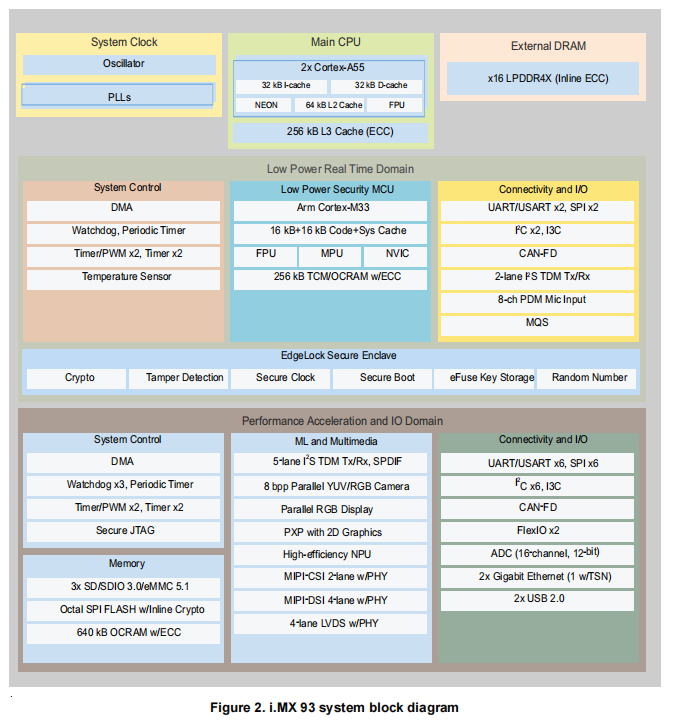

****

## 2\. FET-MX93xx-UP4 SoM Description

### 2.1 FET-MX93xx-UP4 SoM Appearance

**Front**

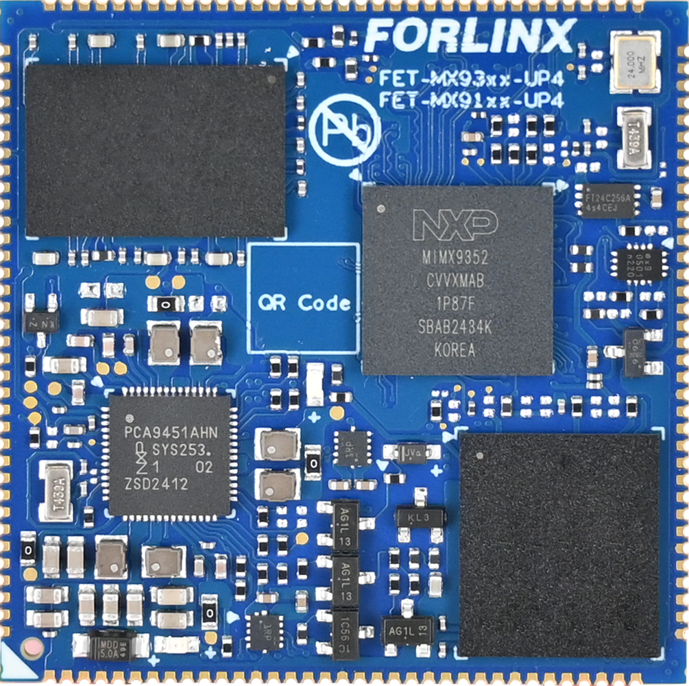

**Back**

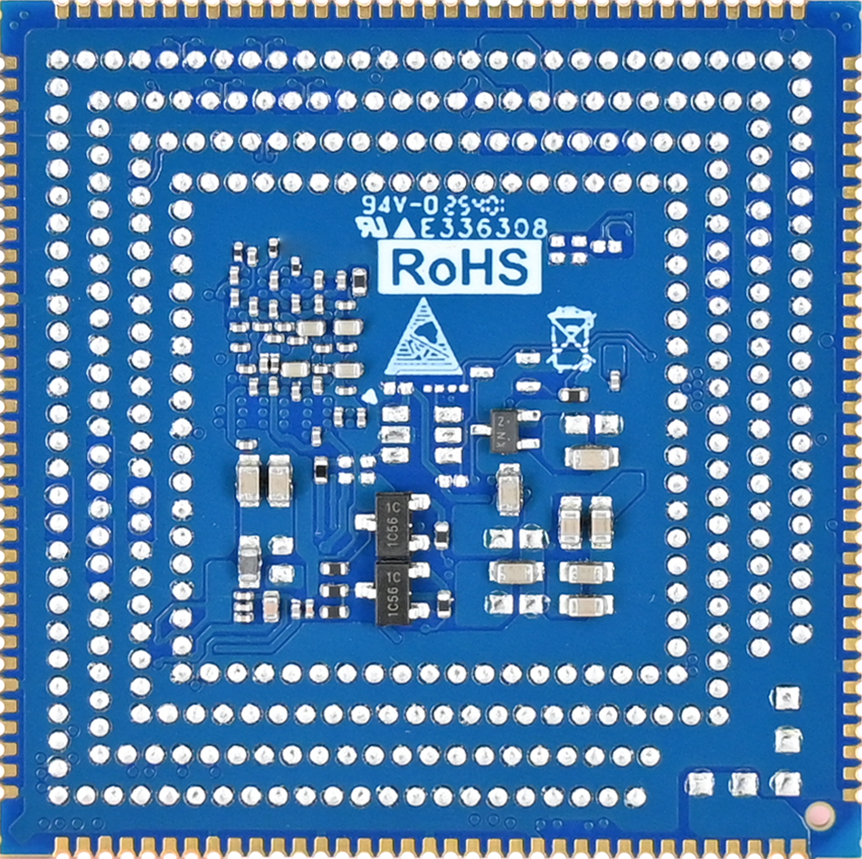

### 2.2 FET-MX93xx-UP4 SoM Dimension Diagram

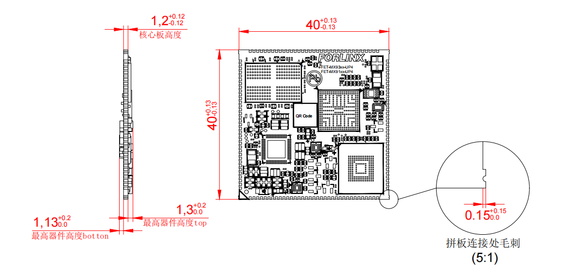

Dimensions: 40mm × 40mm, dimensional tolerance ±0.13mm. For more dimensional details, please refer to the DXF file.

Plate making process: 1.6mm thickness, 10-layer immersion gold PCB.

### 2.3 Performance Parameter

#### 2.3.1 System Frequency

| **Name**| **Specification**| | | | **Description**|
|:----------:|:----------:|----------|----------|----------|:----------:|
| | **Minimum**| **Typical**| **Maximum**| **Unit**|
| System Frequency| —| —| 1.7| GHz| —|
| System RTC| —| 32.768| —| KHz| —|

#### 2.3.2 Power Parameter

| **Parameter**| **Pin No.**| **Specification**| | | | **Description**|
|:----------:|:----------:|:----------:|----------|----------|----------|:----------:|
| | | **Minimum**| **Typical**| **Maximum**| **Unit**|
| Main Power Supply Voltage| VSYS| 4.5| 5| 5.5| V| —|
| No-load current| —| | | | mA| Please refer to the power consumption table in the appendix|
| Overload current| —| | | | mA| Please refer to the power consumption table in the appendix|

#### 2.3.3 Working Environment

| **Parameter**| | **Specification**| | | | **Description**|
|:----------:|----------|:----------:|----------|----------|----------|:----------:|
| | | **Minimum**| **Typical**| **Maximum**| **Unit**|
| Operating temperature| Working environment| -40| 25| +85| ℃| Industrial Level|
| | Storage Environment| -40| 25| +125| ℃|
| Humidity| Working environment| 10| —| 90| ％RH| No Condensation|
| | Storage Environment| 5| —| 95| ％RH|

#### 2.3.4 SoM ESD Features

| **Parameter**| **Specification**| | | | **Description**|
|:----------:|:----------:|----------|----------|----------|:----------:|
| | **Minimum**| **Typical**| **Maximum**| **Unit**|
| Human Body Model (HBM)| —| ±1000| —| V| —|
| Charged Device Model (CDM)| —| ±250| —| V| —|

### 2.4 Interface Resources

#### 2.4.1 FET-MX93xx-UP4 SoM Interfaces

| **Function** | **Quantity** | Parameter                                                    |
| :----------: | :----------: | ------------------------------------------------------------ |
|   MIPI CSI   |      1       | MIPI CSI-2 Controller Key Features： • Compliant with MIPI CSI-2 v1.3 and MIPI D-PHY v1.2 specifications;  • Supports up to 2 Rx data lanes plus 1 Rx clock lane; • Pixel clock up to 200 MHz (for both nominal and overdrive voltages); • Supports up to approximately 150 Megapixels per second; • Data rate per lane ranges from 80 Mbps to 1.5 Gbps;  • Supports low-power operation at a data rate of 10 Mbps. |
|   Ethernet   |      2       | • Supports 2 x RGMII interfaces and complies with IEEE 802.02 specification; • 1 x supports TSN and 2 x support IEEE 1588 standard. |
|     LCD      |      1       | 24-bit parallel RGB up to 1366x768p60 or 1280x800p60.        |
|     LVDS     |      1       | Single channel (4-lane), supporting 720p60, up to 1366x768p60 or 1280x800p60. |
|   MIPI DSI   |      1       | MIPI DSI Controller Key Features: • Supports a 4-lane MIPI DSI display with pixel data sourced from the LCDIF; • Compliant with MIPI DSI v1.2 and MIPI D-PHY v1.2 specifications;  • Supports high resolutions such as 1080p60 or 1920x1200p60; • Maximum data rate per lane is 1.5 Gbps. |
|     JTAG     |      1       | The JTAG interface is led out through 2 x 4 2.54mm spacing pin  from the development board. |
|   SD/SDIO    |      2       | The uSDHC2 is 4-bit SD card 3.0 compatible with 200 MHz SDR signaling and supports up to 100MB/sec; the uSDHC3 is 4-bit SDIO 3.0. |
|     USB      |      2       | There are  2 x USB 2.0 controllers with integrated PHYs that support master-slave switching. |
|     I2C      |      3       | • Standard Mode: Up to 100 Kbit/s  • Fast Mode: Up to 400 Kbit/s • Fast Mode Plus: Up to 1,000 Kbit/s  • High-Speed Mode: Up to 3,400 Kbit/s • Ultra-Fast Mode: Up to 5,000 Kbit/s • Slave Mode supports High-Speed and Ultra-Fast Modes. |
|    CAN-FD    |      1       | The CAN-FD module is a CAN protocol controller compliant with ISO11898-1 and CAN 2.0B. |
|     ADC      |      4       | The ADC is a 12-bit, 4-channel, 1MS/s ADC.                   |
|     PWM      |      3       | Timer/PWM Module 16-bit counter supporting free-running or modulo count modes, with up or down counting capability. Configurable for multiple functions: Input Capture, Output Compare, Edge-Aligned PWM, or Center-Aligned PWM. |
|     I2S      |      1       | The sampling rate supports 8kHz to 384kHz.                   |

#### 2.4.2 CPU Interfaces

| **Function** | **Quantity** | **Parameter**                                                |
| :----------: | :----------: | ------------------------------------------------------------ |
|   MIPI CSI   |      ≤1      | MIPI CSI-2 Controller Key Features：                                                                          • Compliant with MIPI CSI-2 v1.3 and MIPI D-PHY v1.2 specifications; • Supports up to 2 x Rx data lanes plus 1 Rx clock lane; • Pixel clock up to 200 MHz (for both nominal and overdrive voltages); • Data rate per lane ranges from 80 Mbps to 1.5 Gbps; • Supports low-power operation at a data rate of 10 Mbps. |
|   Ethernet   |      ≤2      | Supports 2 x RGMII interfaces and complies with IEEE 802.02 specification, 1 x supports TSN and 2 x support IEEE 1588 standard. |
|     LCD      |      ≤1      | 24-bit parallel RGB up to 1366x768p60 or 1280x800p60.        |
|     LVDS     |      ≤1      | Single channel (4-lane), supporting 720p60, up to 1366x768p60 1280x800p60. |
|   MIPI DSI   |      ≤1      | MIPI DSI Controller Key Features:  •Supports a 4-lane MIPI DSI display with pixel data sourced from the LCDIF; • Compliant with MIPI DSI v1.2 and MIPI D-PHY v1.2 specifications; • Supports high resolutions such as 1080p60 or 1920x1200p60;  • Maximum data rate per lane is 1.5 Gbps. |
|     SAI      |      ≤3      | Synchronous Audio Interface (SAI) • SAI1 supports 2 channels; • SAI2 supports 4 channels; • SAI3 supports 1 channel; • Full-duplex serial interfaces supporting frame synchronization, such as I2S, AC97, TDM, and codec/DSP interfaces. |
|     JTAG     |      ≤1      | The JTAG interface is led out through 2 x 4 2.54mm spacing pin  from the development board. |
|   SD/SDIO    |      ≤2      | The uSDHC1 is used internally on the SoM; The uSDHC2 is 4-bit SD card 3.0 compatible with 200 MHz SDR signaling and supports up to 100MB/sec; The uSDHC3 is 4-bit SDIO 3.0. |
|     USB      |      ≤2      | There are  2 x USB 2.0 controllers with integrated PHYs that support master-slave switching. |
|     I3C      |      ≤2      | Two modified integrated circuit (I3C) modules. The I3C is a serial interface for connecting peripheral devices and application processors. Supports 400Kbit/s Fast Mode and 1000Kbit/s Fast Mode Plus. Backward compatible with I2C. |
|     SPI      |      ≤8      | Supports master-slave mode configuration.                    |
|     I2C      |      ≤8      | • Standard Mode: Up to 100 Kbit/s; • Fast Mode: Up to 400 Kbit/s; • Fast Mode Plus: Up to 1,000 Kbit/s • High-Speed Mode: Up to 3,400 Kbit/s • Ultra-Fast Mode: Up to 5,000 Kbit/s; • Slave Mode supports High-Speed and Ultra-Fast Modes. |
|     UART     |      ≤8      | Baud rate up to 5Mbps.                                       |
|    CAN-FD    |      ≤2      | The CAN-FD module is a CAN protocol controller compliant with ISO11898-1 and CAN 2.0B. |
|     MQS      |      ≤2      | MQS (Medium Quality Sound) is used to generate mediate-quality audio via GPIO. It allows users to connect stereo speakers or headphones to a power amplifier without an additional audio chip. |
|     ADC      |      ≤4      | The ADC is a 12-bit, 4-channel, 1MS/s ADC.                   |
|     PDM      |      ≤3      | It is a 24-bit PDM module with linear phase response that supports high AOP microphones for audio quality applications. |
|     TPM      |      ≤6      | 16-bit counter supporting free-running or modulo count modes, with up or down counting capability. Configurable for multiple functions: Input Capture, Output Compare, Edge-Aligned PWM, or Center-Aligned PWM. |

**Note:**

- **The parameters in the table are the theoretical values of hardware design or CPU;**
- **For compatibility considerations, please refer to Section 2.6 for design guidance.**

### 2.5 UP4 SoM Pin Definitions

#### 2.5.1 UP4 SoM Pin Schematic

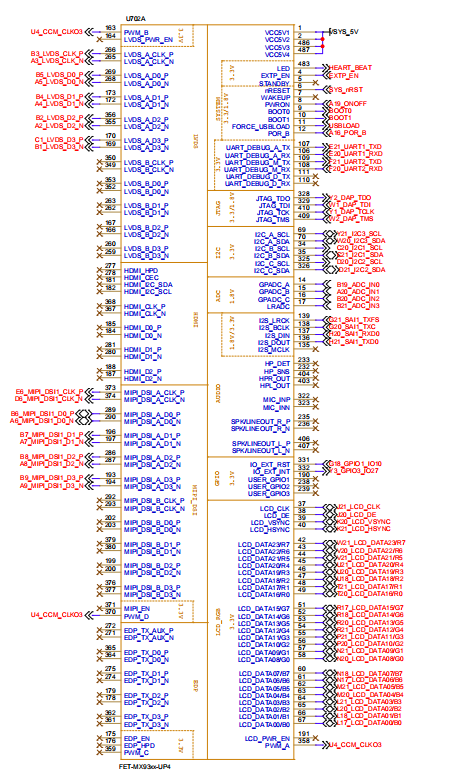

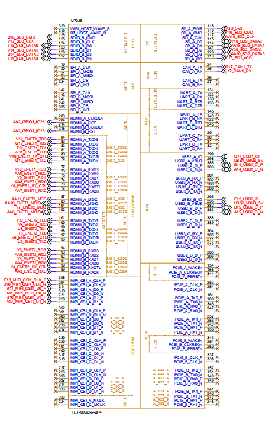

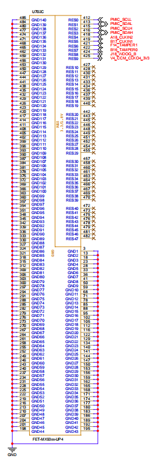

#### 2.5.2 UP4 SoM Pin Function Description

For various functional expansion requirements, please refer to the user document "UP4 Pin Definition Table". However, for more detailed information, it is recommended that you consult the relevant documentation, the chip datasheet, and the reference manual.

### 2.6 FET-MX93xx-UP4 SoM Pin Definitions

| UP4 Standard Interface Functions | FET-MX93xx-UP4 Pinout Functions |
| :------------------------------: | :-----------------------------: |
|             EXTP_EN              |             EXTP_EN             |
|             STANDBY              |               NC                |
|              nRESET              |            SYS_nRST             |
|              WAKEUP              |               NC                |
|              PWRON               |            A19_ONOFF            |
|           BOOT0/BOOT1            |           BOOT0/BOOT1           |
|          FORCE_USBLOAD           |             USBLOAD             |
|              POR_B               |            A16_POR_B            |
|           GPADC_A/B/C            |           ADC_IN0/1/2           |
|              LRADC               |             ADC_IN3             |
|              SPI_A               |               NC                |
|              SPI_B               |               NC                |
|              CAN_A               |              CAN1               |
|              CAN_B               |               NC                |
|              UART_A              |               NC                |
|              UART_B              |               NC                |
|              UART_C              |               NC                |
|              UART_D              |               NC                |
|              I2C_A               |              I2C3               |
|              I2C_B               |              I2C1               |
|              I2C_C               |              I2C2               |
|             RGMII_A              |              ENET1              |
|             RGMII_B              |              ENET2              |
|              RMII_A              |               NC                |
|              RMII_B              |               NC                |
|             DEBUG_A              |              UART1              |
|             DEBUG_M              |              UART2              |
|             DEBUG_D              |               NC                |
|               SD_A               |               SD2               |
|              SDIO_B              |               SD3               |
|               I2S                |              SAI1               |
|            Native HP             |               NC                |
|         Native SPKOUT_L          |               NC                |
|         Native SPKOUT_R          |               NC                |
|            Native MIC            |               NC                |
|              PCIE_A              |               NC                |
|              PCIE_B              |               NC                |
|               LCD                |     LCD（shared with PWM）      |
|            MIPI DSI_A            |   MIPI_DSI（shared with PWM）   |
|            MIPI DSI_B            |               NC                |
|              LVDS_A              |     LVDS（shared with PWM）     |
|              LVDS_B              |               NC                |
|               EDP                |               NC                |
|               HDMI               |               NC                |
|              USB2_A              |              USB1               |
|              USB3_A              |               NC                |
|              USB2_B              |              USB2               |
|              USB2_C              |               NC                |
|              USB3_C              |               NC                |
|              USB2_D              |               NC                |
|            MIPI CSI_A            |            MIPI_CSI             |
|            MIPI CSI_B            |               NC                |
|            MIPI CSI_C            |               NC                |
|            MIPI CSI_D            |               NC                |
|               JTAG               |              JTAG               |
|            USER_GPIO1            |               NC                |
|            USER_GPIO2            |               NC                |
|            USER_GPIO3            |               NC                |
|               RES0               |            PMIC_SCLL            |
|               RES1               |            PMIC_SDAL            |
|               RES2               |            PMIC_SCLH            |
|               RES3               |            PMIC_SDAH            |
|               RES4               |           A18_CLKIN2            |
|               RES5               |           B17_CLKIN1            |
|               RES6               |           F14_TAMPER1           |
|               RES7               |           B16_TAMPER0           |
|               RES8               |           J18_WDOG_B            |
|               RES9               |        V4_CCM_CLKO4_3V3         |
|              RES10               |               NC                |
|              RES11               |               NC                |
|              RES12               |               NC                |
|              RES13               |               NC                |
|              RES14               |               NC                |
|              RES15               |               NC                |
|              RES16               |               NC                |
|              RES17               |               NC                |
|              RES18               |               NC                |
|              RES19               |               NC                |
|              RES20               |               NC                |
|              RES21               |               NC                |
|              RES22               |               NC                |
|              RES23               |               NC                |
|              RES24               |               NC                |
|              RES25               |               NC                |
|              RES26               |               NC                |
|              RES27               |               NC                |
|              RES28               |               NC                |
|              RES29               |               NC                |
|              RES30               |               NC                |
|              RES31               |               NC                |
|              RES32               |               NC                |
|              RES33               |               NC                |
|              RES34               |               NC                |
|              RES35               |               NC                |
|              RES36               |               NC                |
|              RES37               |               NC                |
|              RES38               |               NC                |
|              RES39               |               NC                |
|              RES40               |               NC                |
|              RES41               |               NC                |
|              RES42               |               NC                |
|              RES43               |               NC                |
|              RES44               |               NC                |
|              RES45               |               NC                |
|              RES46               |               NC                |
|              RES47               |               NC                |

It is the UP4 standard definition. If compatible design is required, it is recommended to design according to it.

### 2.7 SoM Hardware Design Description

**Power Pin**

| **Function** | **Signal Name** |   **I/O**    | **Default Function**                                         | **Pin Number** |
| :----------: | :-------------: | :----------: | ------------------------------------------------------------ | :------------: |
|    Power     |   VCC5V0_SYS    | Power Input  | The SoM power supply pin is 5V, and the carrier board provides a current of at least 2.5A. |                |
|              |    VCC3V3_SD    | Power Output | Only used for power supply of carrier board SD card, with maximum output current capacity of 500mA |                |
|              |       GND       |    Ground    | Power ground and signal ground on the SoM. All GND pins must be connected. |                |

| **Function**| **Signal Name**| **I/O**| **Default Function**| **Pin Number**|
|:----------:|:----------:|:----------:|----------|:----------:|
| CPU reset| RESETn| I| SoM power reset, low level effective.  Do not add additional capacitive load to this pin, so as not to affect the SoM normal startup. | 6|
| Power enable| PMIC\_EXT\_EN| O| Enable signal to control the external power supply of the carrier board, output by the SoM, 3.3 V level. | 4|
| On/Off| PMIC\_PWRON| I| Low level is valid, long press to turn off, short press to turn on| 8|
| BOOT selection| EMMC\_BOOT| I| When the signal is grounded, the startup card enters the Maskrom download mode. | 1|
| Wake up| WAKEUP| I| SoM wake-up button| 7|
| Debug Port| UART2\_TX\_M0\_DEBUG UART2\_RX\_M0\_DEBUG| I/O| Debug Port, please keep the port functions.| 106 107|

(Including minimum system block diagram)

The FET-MX93xx-UP4 SoM integrates power, reset monitoring, and storage circuits, requiring only minimal external circuitry. A complete minimum system can be powered and run with a single 5V supply.

Refer to “Appendix  IV. Minimum System Diagram” However, in most cases, it is recommended to connect some external devices—such as a debugging serial port and a port for flashing images—in addition to the minimal system. Otherwise, you can not check whether the system has booted. After completing these steps, you can then add the required functions based on the SoM's default interface definition provided by Forlinx.

For the design of the SoM's peripheral circuits, please refer to Section 3.5, "OK- MX93xx-UP4 Carrier Board Description".

## 3\. OK-MX93xx-UP4 Embedded Development Description

### 3.1 OK-93xx-UP4 Development Board Interface

Connection method: Stamp hole + LGA. The main interfaces are shown in the figure below:

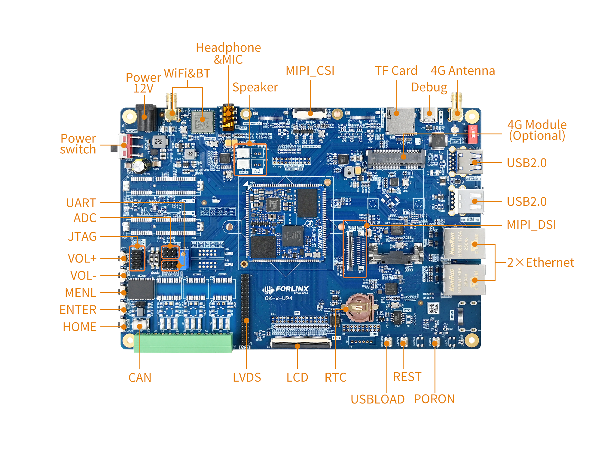

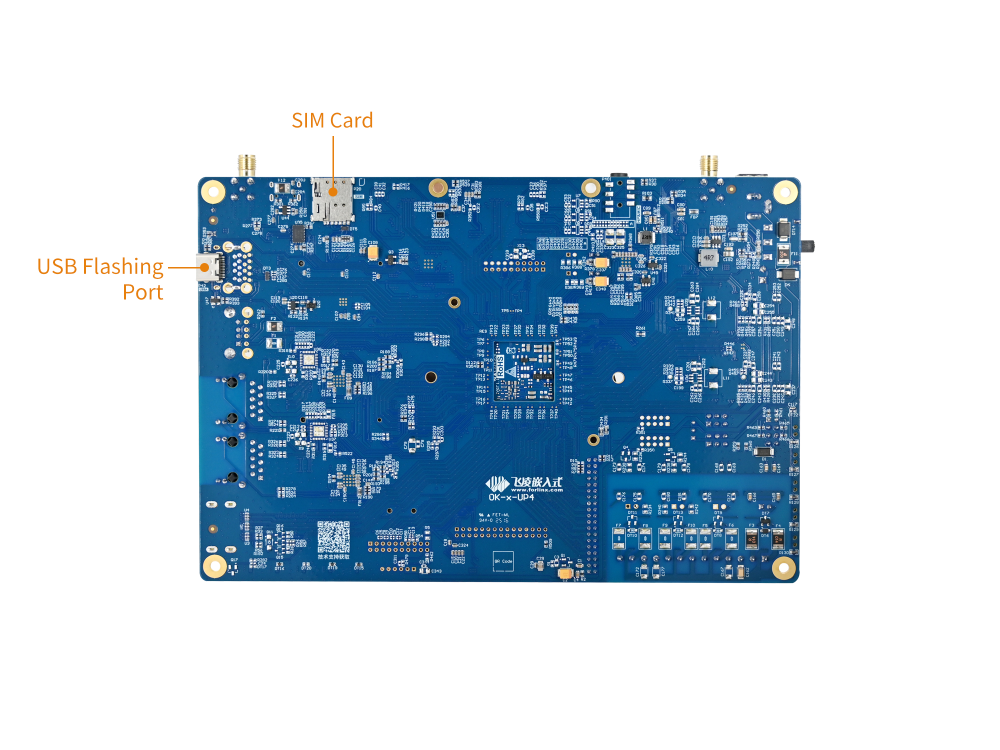

### 3.2 OK-93xx-UP4 Development Board Dimension Diagram

PCB: 130mm×190mm

Mounting hole dimensions: Pitch: 120mm × 180mm, hole diameter: 3.2mm.

Plate making process: 1.6mm thickness, 4-layer PCB.

Power Voltage: DC 12V

The OK-MX93xx-UP4 carrier board is equipped with two mounting holes for heat sinks (3.2 mm in diameter). You may choose to install a heat sink according to the on-site environment. Please add a insulating thermal pad between the contact surface of the heat sink and the SoM. Recommended heat sink: 38mm × 38mm × 10mm. See below for details.

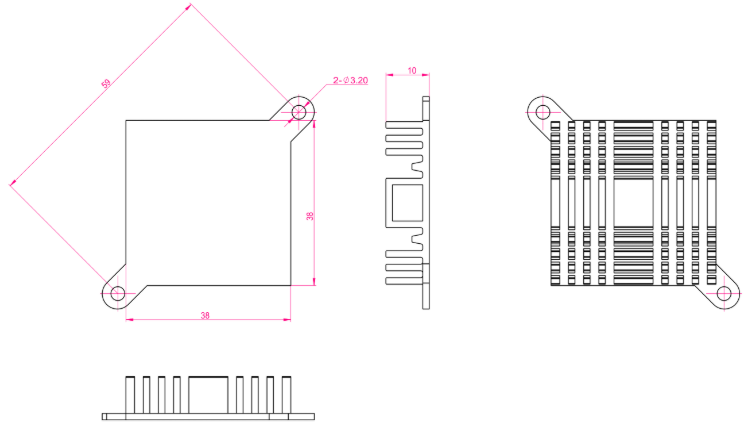

### 3.3 Naming Rules

A-B-C+DEFGHIJKL:MN-O

| Field| Field Description| Value| Description|
|----------|----------|----------|----------|
| A| Product Line Identification| OK| Forlinx Embedded development board|
| \-| Separator| \-| Confirm whether to add the separator by CPU brand series|
| B| CPU Name| MX93xx| MX9352|
| \-| Segment Identification| \-| |
| C| Connection| UP4| Universal Package general package 4 means 40\*40 |
| \+| Segment Identification| \+| The configuration parameter section follows this identifier.|
| D| CPU Clock| 17| 1.7GHZ|
| E| RAM Capacity (Unit: Byte)| 1G| 1GB|
| F| Single ROM Type| SE| eMMC|
| G| Single ROM Capacity： (Unit: Byte)| 8G| 8GB|
| H| SoM Operating Temperature| C| 0 to 70℃   Commercial-grade|
| | | I| -40 to 85℃ Industrial-grade|
| I| Configuration No.| A~Z| This is the internal identification of the manufacturer and has no impact on the use.|
| J| SoM PCB Version| 11| V1.1|
| | | xx| Vx.x|
| K| Carrier Board Operating Temperature| C| 0 to 70℃   Commercial-grade|
| | | I| \- 40 to 85 ℃ Commercial grade|
| L| Carrier Board PCB Version| 13| V1.3|
| | | xx| Vx.x|
| :| Connector| | Connecting M ~ N Field Parameters|
| M| Chip Type| A~Z| This is the internal identification of the manufacturer and has no impact on the use.|
| N| Connector Origin| N| No Partition\\No Connector|
| \-| Connector| \-| Grade Mark Connector|
| O| Grade Identification| PC| Prototype Sample|
| | | Blank| Mass Production|

### 3.4 Carrier Board Interfaces

| Function| Quantity| Parameter|
|:----------:|:----------:|----------|
| WiFi| 1| Single antenna 2.4G\&5GHz Wi-Fi Dual-band 1X1 802.11ac +Bluetooth 4.2|
| Audio| 1| Dual-channel speaker connector, class-D, 1.3 W; Stereo headphone output, 32 Ohm load; headphone recording |
| MIPI-CSI| 1| Led out from FPC socket, 2lane, connected to OV5645 camera module|
| TF card| 1| Data rate up to SDR104;|
| 4G| 1| Supports 4G modules with a miniPCIE interface, integrating USB 2.0 communication signals.|
| UART Debug| 1| Integrated into a single Type-C port, enabling connection to a PC for debugging.|
| USB2.0| 2| 1 x USB-D native USB2.0 and 1 x USB-HUB are led out|
| Ethernet| 2| 2 x Gigabit ports led out via a standard RJ45 socket|
| MIPI-DSI| 1| 4-lane MIPI-DSI, supports a capacitive touch screen with backlight brightness adjustment and offers a maximum single-channel resolution 1920×1080@60Hz. |
| RTC| 1| On-board CR1220 battery, keep going when power is off|
| LCD| 1| RGB888 interface, supporting capacitive touch and resistive touch, and allowing backlight brightness adjustment.  The maximum resolution is 1280×800.@ 60Hz |
| LVDS| 1| 4-lane LVDS, supporting capacitive touch screen and backlight brightness adjustment, up to 1280×800@60Hz |
| CAN| 1| Supports CAN2.0B, electrical quarantine|
| ADC| 3| Led out from the pin header and can be connected to the on-board sliding rheostat |
| UART| 1| 5 x UART, led out through pin headers.|
| BOOT| 1| BOOT mode selection configuration|
| JTAG| 1| JTAG, led out through pin|
| KEY ADC| 5| 5 keys are led out via 1 x LRADC|

**Note: The parameters in the table are the theoretical values of hardware design or CPU.**

### 3.5 OK93xx-UP4 Carrier Board Description

**Note:** 

- **The component UID with "\_DNP" mark in the diagram below represents it is not soldered by  
  default;**

- **The schematic diagrams in this manual are only for interface descriptions. Please refer to the source file materials for hardware design.**

#### 3.5.1 Carrier Board Power

As shown, the power supply for the development board is 12V DC（from p28). VDD\_5V supplies power to the SoM. Once the SoM is powered up, it outputs PMIC\_EXT\_EN to enable U32 and U33 on the carrier board, and VCC\_5V, VCC\_3V3, and VCC\_1V8 supply power to the devices on the carrier board. The STANDBY pin controls VCC\_3V3\_S to enable or disable the power supply for the development board, achieving reduced power consumption.

PMIC\_EXT\_EN ensure to power on the SoM first, followed by the carrier board, to prevent latch-up effects that could damage the CPU.

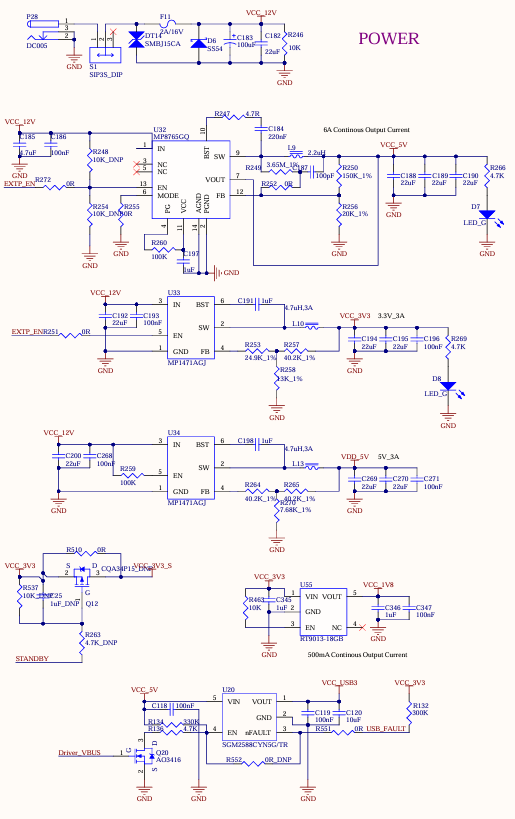

#### 3.5.2 Power/Reset Keys

K1 on the carrier for USB programming. Holding K1 before powering on enables USB programming.

K2 on the carrier board is for powering ON/Off. By default, the board runs automatically when powering on. While running, press and hold the key to shut down; press it shortly to restart.

K5 on the carrier board is for the resetting. Press it reset the power on the SoM to achieving a full board power reset.

K6 on the carrier board is for waking up. After the board enters sleep mode press it shortly to wake up the board.

The FET-MX93xx-UP4 SoM does not have the WAKEUP feature.

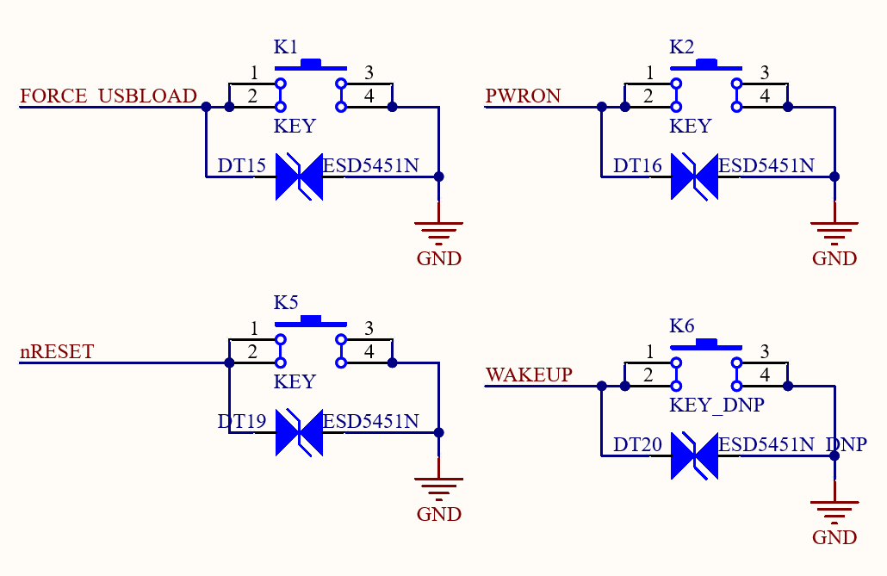

#### 3.5.3 LRADC Button

The carrier board is configured with 1 x LRADC signal, utilizing a button and a resistor voltage divider to enable key value sampling. The LRADC is pulled up to 1.8V via a 10kΩ resistor on the SoM.

#### 3.5.4 Debugging Serial Port

The carrier board features a single USB Type-C port with 3 x integrated debug serial ports. Install the XR21V1414IM48 driver on your computer, connect the P36 port to the computer, and select the DEBUG\_A debug serial port to start debugging.

The FET-MX93xx-UP4 SoM is equipped only with the DEBUG\_A and DEBUG\_M debug interfaces

**Note: To facilitate debugging later, please ensure that the debugging serial port is led out when designing your own carrier board.**

#### 3.5.5 JTAG

The carrier board features a single JTAG debugging interface for debugging the x core.

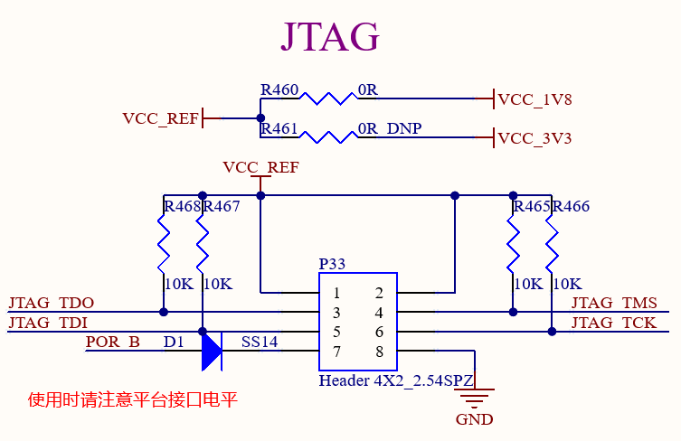

#### 3.5.6 BOOT

There are two BOOT options on the carrier board, allowing the system to boot from either the eMMC, nor flash, TF card or NAND.

The FET-MX93xx-UP4 SoM supports only two boot methods: eMMC and TF.

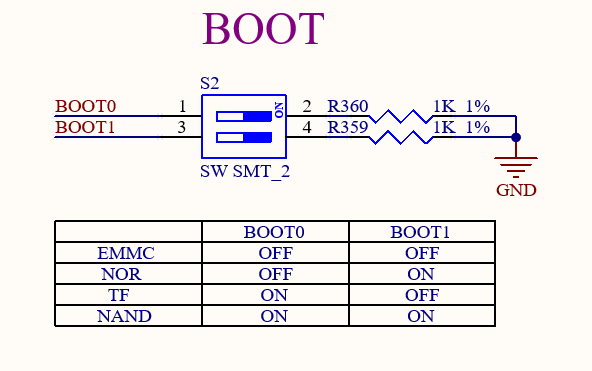

#### 3.5.7 RTC

An RTC device is connected to the carrier board via the I2C\_A bus. It enables a compatible power supply from either VCC\_3V3 or a button cell battery via D10, which ensures the RTC chip remains powered by the battery after the carrier board is powered off. The RX8010SJ chip is used in the default design. Button battery: CR1220.

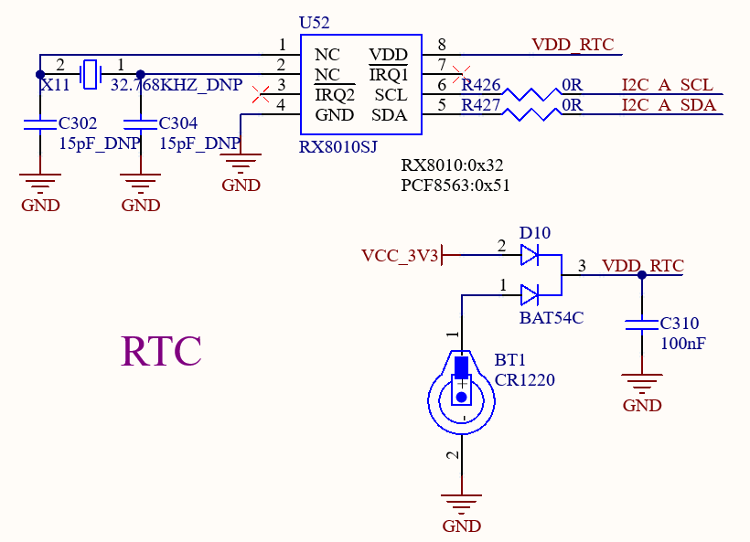

#### 3.5.8 TF Card

The TF card interface on the development board is connected to the CPU’s SDMMC0 channel. Power for the TF card comes from the VCC\_3V3\_SD output of the SoM.

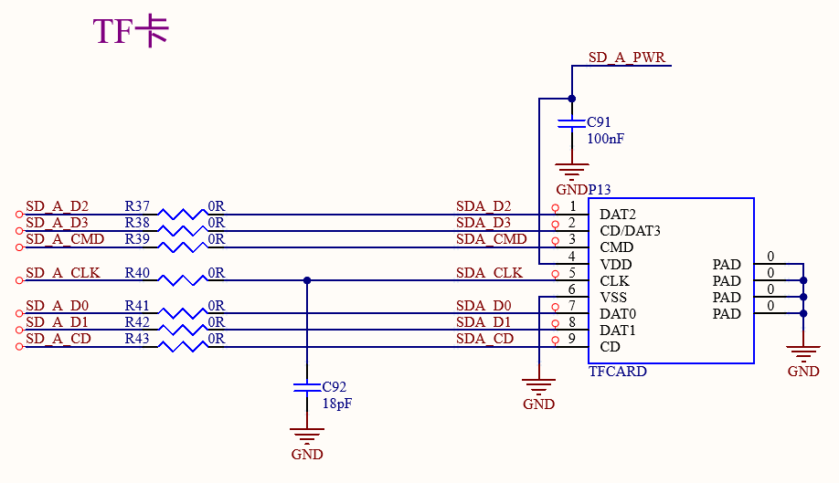

**Note:** 

- **The bus pull-up resistor has already been configured on the SoM. Don’t apply pull-up to the bus;**

- **The TF card is a hot-pluggable device. Please add ESD protection for it;**

- **Please make equal length for the SD signal.**

#### 3.5.9 USB Download

There is a USB Type-C port located at P42 on the back of the development board. It utilises the P/N differential signals from the USB 3.0\_A (pin P19) signal, facilitating connection to a computer for flashing and debugging.

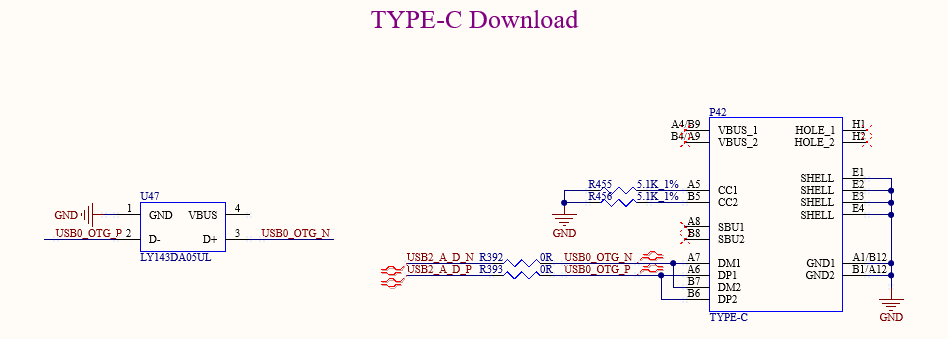

#### 3.5.10 LVDS Display

The pin header P1 on the development board can be connected to the LVDS display via the connector 38P with a pitch of 2.0mm.

It supports 2\*4 lane LVDS connection, and I2C port touch screen.

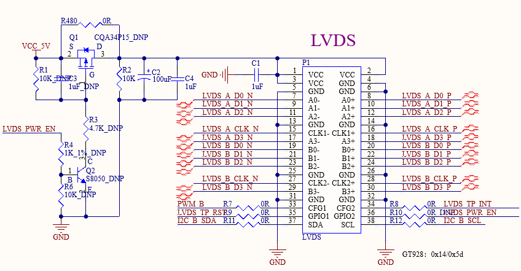

#### 3.5.11 LCD-RGB888

Pin P4 on the development board is the LCD interface; it is an FPC socket that can be connected to an LCD screen and supports capacitive touchscreens.

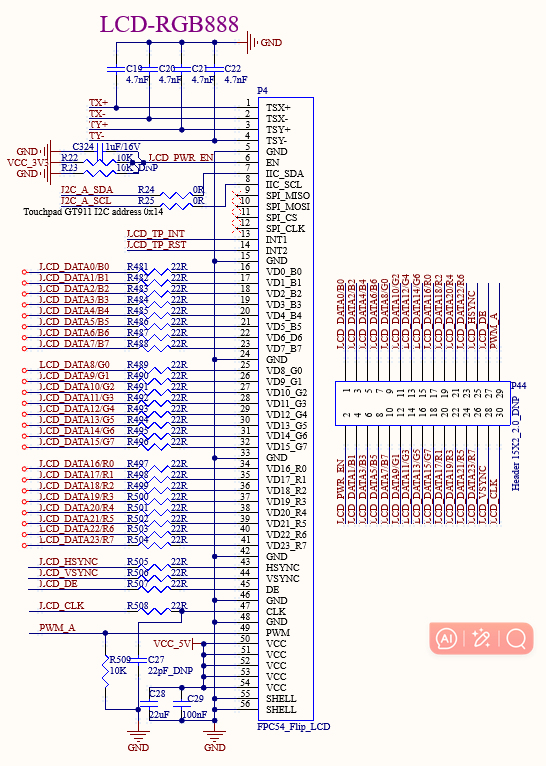

#### 3.5.12 Resistive Touchscreen

If a resistive touchscreen is required, a resistive touch circuit can be added and connected to pins 1, 2, 3 and 4 of the P4 (LCD interface).

#### 3.5.13 MIPI\_DSI

The P11 on the development board is MIPI\_DSI port, supporting 4 Lane MIPI\_DSI.

#### 3.5.14 MIPI\_CSI

There is 1 x FPC socket (P7) on the development board for connecting a MIPI-CSI camera. It features a pitch of 0.5mm, a flip-down cover, and supports a 2-lane MIPI-CSI connection.

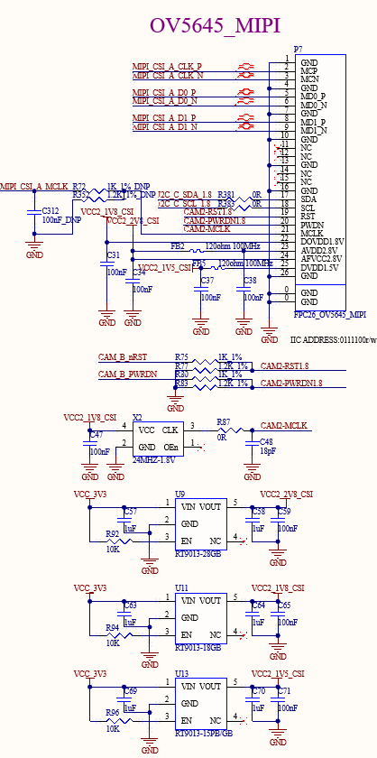

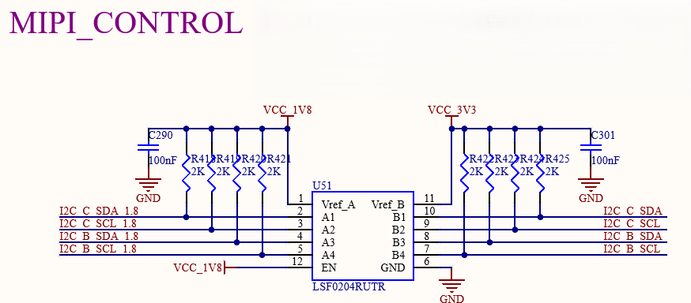

#### 3.5.15 WiFi \& BT

There is an onboard WiFi module (AW-CM358SM). The WiFi module features an SDIO interface, operates on dual bands of 2.4GHz and 5GHz, and complies with the IEEE 802.11a/b/g/n/ac standards. P10 is an SMA interface for antenna connection. Please use a 2.4GHz\&5GHz dual-band antenna.

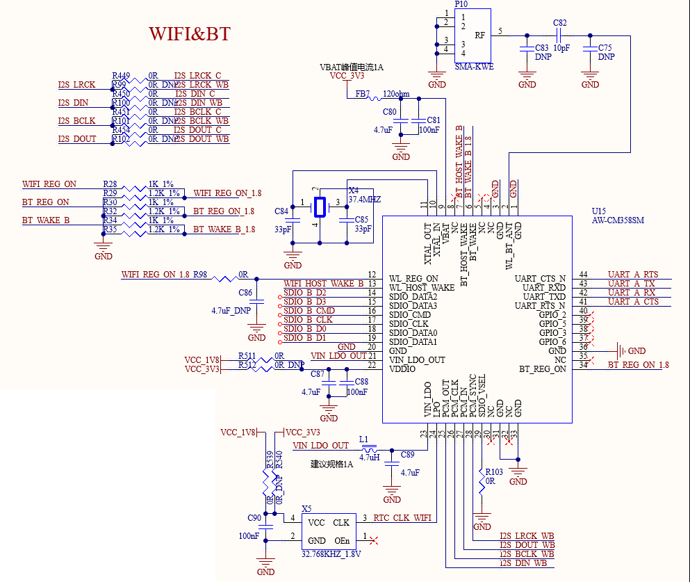

#### 3.5.16 USB2.0

There is an onboard USB 2.0 HUB on the development board, which is expanded to two downstream USB HOST ports, connecting a standard USB 2.0-A interface and a mini-PCIE interface. The mini-PCIE interface can connect the 4G module.

In addition, a group of onboard USB2.0 HOST interfaces is led out from the SoM, which are connected to the USB2.0-A standard interface.

Another USB2.0 interface is connected to the standard interface of USB3.0-A, which supports master-slave switching.

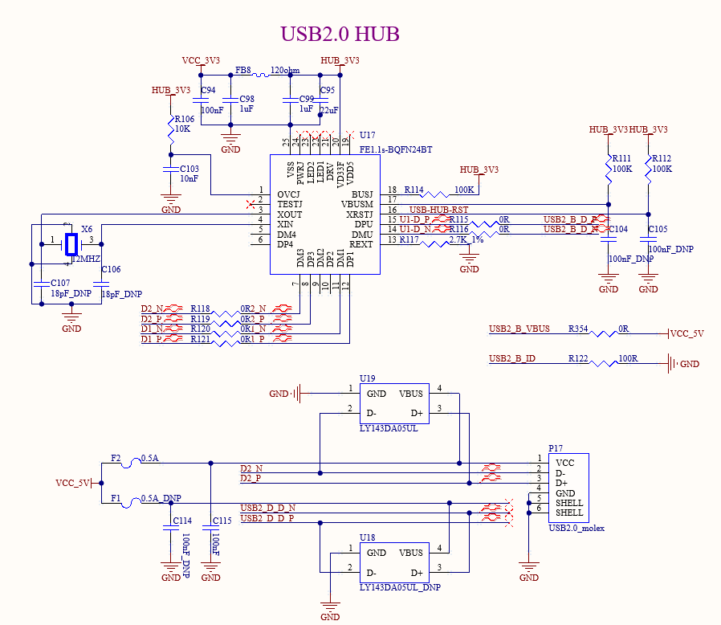

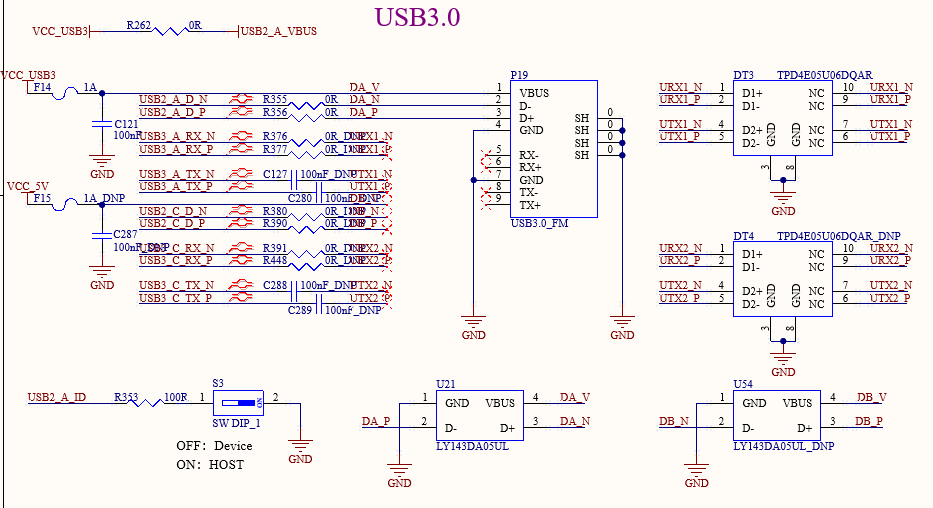

#### 3.5.17 4G

The 4G module can be configured on the development board, and the supported specifications are miniPCIE interface, 3.3 V power supply, and USB2.0 communication.

P20 is a nano SIM card slot, which is self-ejecting. Pay attention to the insertion direction according to the card identification. It does not support card hot plug.

Before using the 4G function, please power off the board, install the 4G module, the SIM card, and the 4G ipex jumper from the module to the board P15, so that the antenna can be externally connected through the SMA interface of P16.

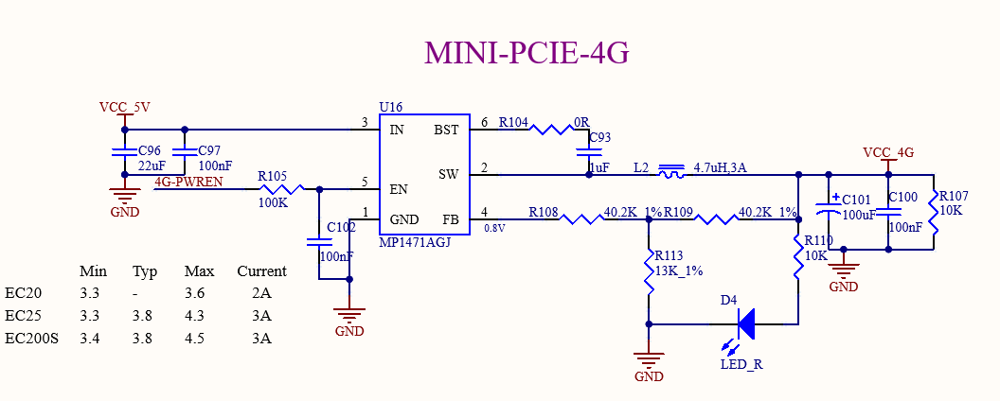

#### 3.5.18 Ethernet

The development board supports two native 1000m network ports, which are realized by using the RGMII of the SoM and the YT8521sh chip, and can be connected to the external network equipment through the standard RJ45 socket with a network transformer.

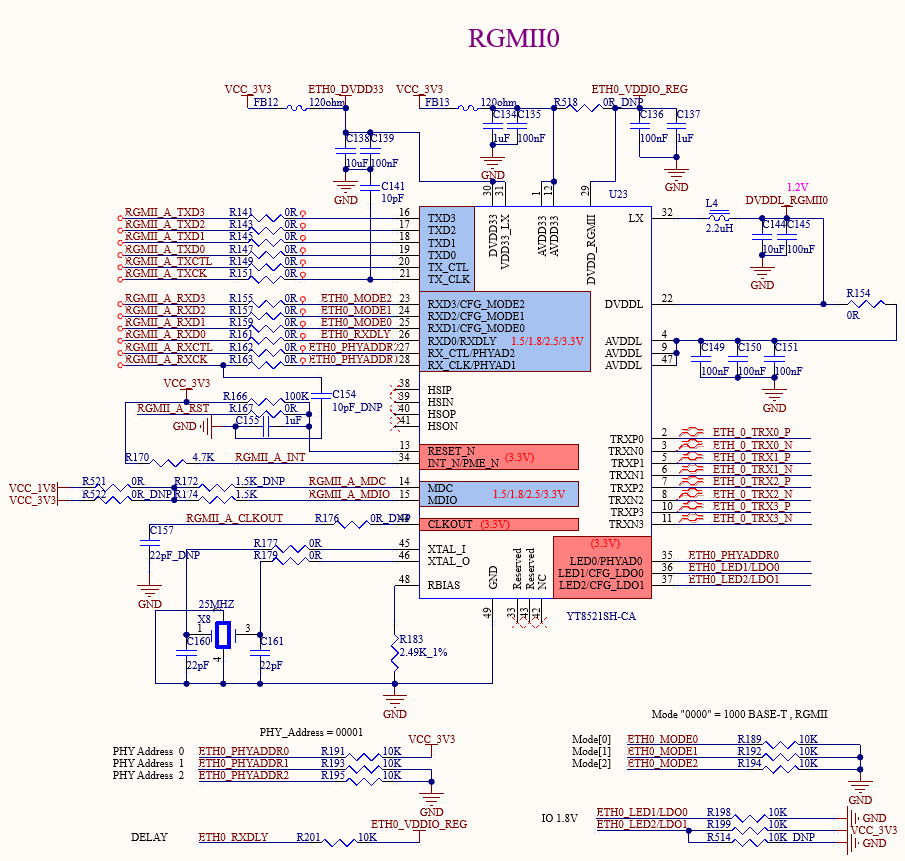

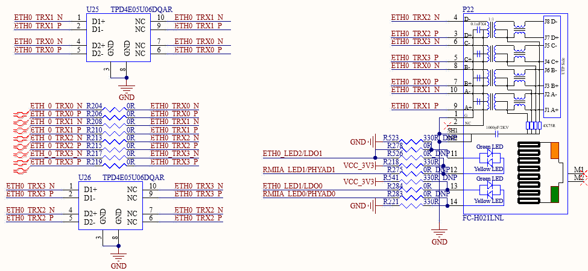

#### 3.5.19 CAN

1 x standard CAN is led out from the development board via native CAN0. Because of the quarantine, the interface supports the maximum rate of 5Mbps, and the electrical quarantine is designed to meet the protection requirements in most scenarios.

The CAN signal is routed via green terminals with a 3.81 mm pitch; a 120-ohm terminating resistor is installed using a jumper cap.

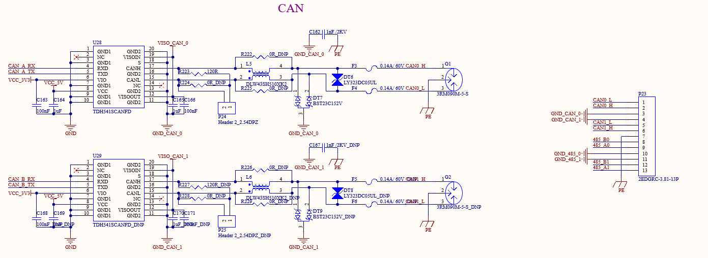

#### 3.5.20 GPADC

The GPADC is connected via 2.54 mm pitch pins. It can be connected directly using DuPont wires via a potentiometer. The SoM features a total of 3 x GPADC, with a maximum sampling voltage of 1.8 V.

#### 3.5.21 UART

1 x five-wire UART is routed from the development board and powered by a 3.3V signal.

#### 3.5.22 IO Expansion

An IO expansion chip is led out from the development board via I2C. 24 additional I/O pins can be expanded for expanding control signals and resetting signals.

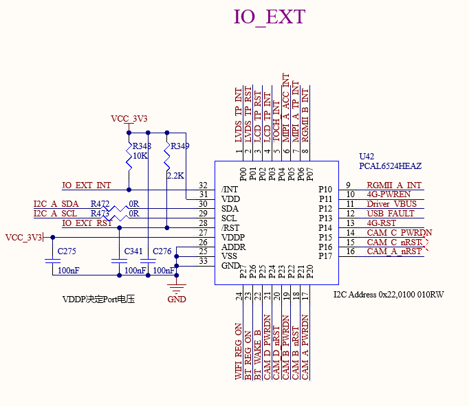

#### 3.5.23 Audio

A single I2S signal is routed from the carrier board to the NAU88C22YG CODEC chip, which provides a standard 3.5mm headphone jack and separate left and right channel amplifiers.

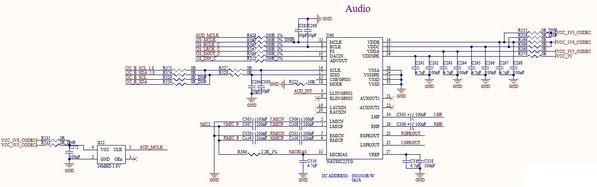

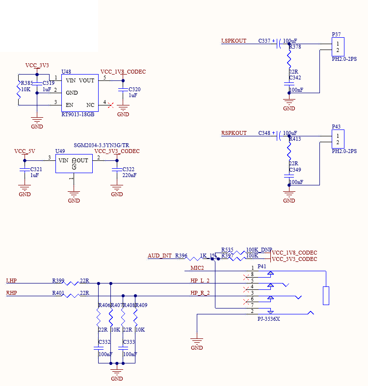

## 4\. Package Dimensions Diagram

Package: LCC+LGA

To ensure a high weld yield, please refer to the diagram below for the design of the packaging stencil:

I. Hole Opening Scheme

1. The steel mesh type is ladder steel mesh, with thickness of 0.1mm and 0.15 mm, and the ladder is on the printing surface;                                                      

2. As shown in the figure below, the thickness of the steel mesh of the LCC pad around the carrier board is 0.15 mm, and the opening method is as shown in the figure, with width of 0.6 mm, length of 2.15 mm outward expansion and 0.3 mm inward contraction. The step range is shifted out 0.7 mm from the root to minimize the impact on the LGA pad.

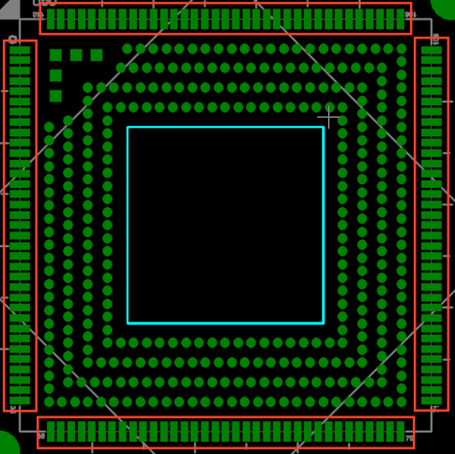

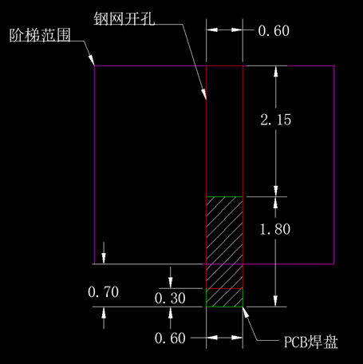

3. The opening thickness of the LGA pad in the middle is 0.1mm. The opening mode of the two rows of LGA pads on the left and right sides in the direction of the scraper is a round hole with a diameter of 0.5mm. The opening of the other LGA pads is as shown in the following figure. The opening diameter is 0.7 mm. The bridge with a width of 0.15 mm is set at the center of 45 °. The bridge center is a round indent with a diameter of 0.25 mm.

**Note:**

- **Since the LGA pads on the UP4 series SoMs use a pre-tinned process, there is a height difference of approximately 0.1 mm between the LCC pads and the LGA pads. This may result in uneven solder wick height between the LCC pads. Please do visual inspection for the LCC soldering;**

- **Since stepped stencils can affect the solder volume on surrounding components, please reduce the aperture size of the stencil openings for these components; for the LGA pad openings in the advancing direction of the scraper, please conduct hole-size reduction in accordance with the No.3.**

## 5\. OK-MX93xx-UP4 Development Board Linux Consumption Table

| **No.**| **Item**| **SoM Power (W)**| Development Board **Power** (including SoM)|
|:----------:|----------|:----------:|:----------:|
| | | |
| 1| No-load starting peak power consumption| 1.595 W| 2.544W|
| 2| Sleep power consumption| 0.03814W| 1.272W|
| 3| No-load standby power consumption| 0.735W| 0.492W|
| 4| USB read and write power| 0.87W| 2.028W|
| 5| TF read and write power| 1.175W| 1.74W|
| 6| 4G module PING network power consumption| 0.755W| 2.256W|
| 7| WiFi module PING network power consumption| 0.71W| 1.284W|
| 8| 7-inch LCD screen power consumption| 0.785W| 3.6W|
| 9| 10-inch LVDS screen power consumption| 0.785W| 5.46W|
| 10| 7-inch MIPI screen video playback power consumption| 0.77W| 4.416W|
| 11| CPU pressure + memory pressure + eMMC read/write pressure test power| 1.47W| 2.076W|

**Note：**

- **Test conditions: The SoM configuration is 1GB memory + 8GB eMMC, the 4G module is Quectel EC20, and the screen is an Forlinx optional product. SoM power supply: 5V; and the carrier board is 12V;**

- **Power consumption is for reference only.**  

****

## 6\. Minimum System Diagram

There are SoM, BOOT, power, debug serial port, system image flashing port. 

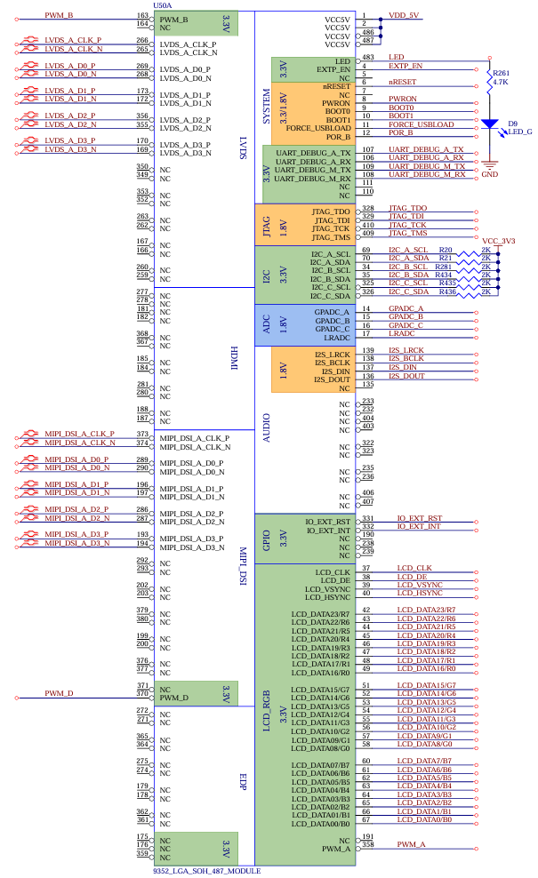

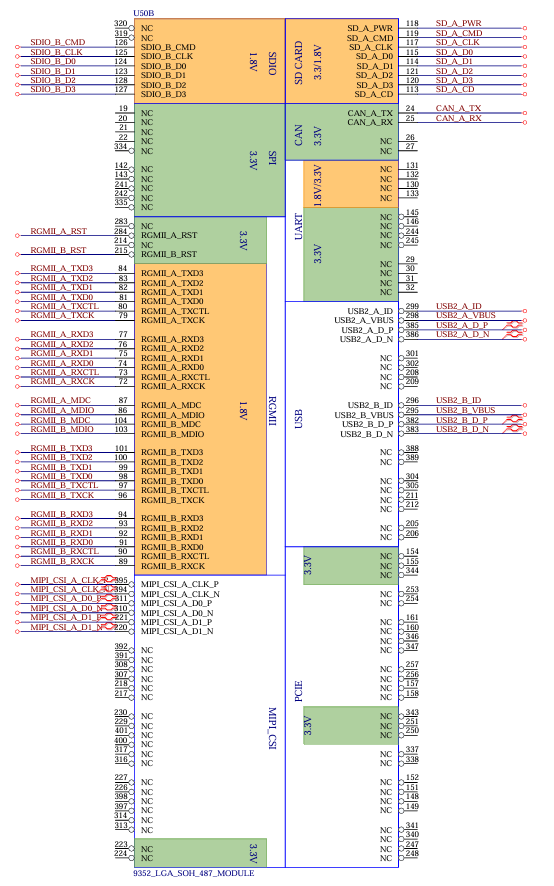

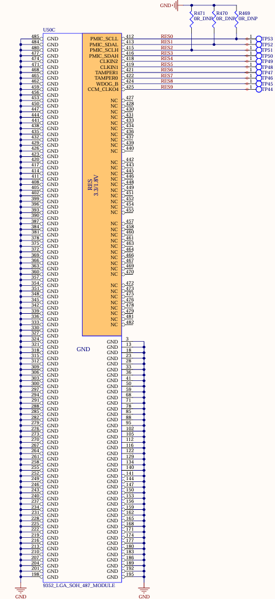

