# User’s Hardware Manual\_V1.1

Document classification: □ Top secret □ Secret □ Internal information ■ Open

## Copyright

The copyright of this manual belongs to Baoding Folinx Embedded Technology Co., Ltd. Without the written permission of our company, no organizations or individuals have the right to copy, distribute, or reproduce any part of this manual in any form, and violators will be held legally responsible.

Forlinx adheres to copyrights of all graphics and texts used in all publications in original or license-free forms.

The drivers and utilities used for the components are subject to the copyrights of the respective manufacturers. The license conditions of the respective manufacturer are to be adhered to. Related license expenses for the operating system and applications should be calculated/declared separately by the related party or its representatives.

## Application Scope

This hardware manual is applicable to the development board of OK-MX9596-C V1.1 and above and the SoM of FET-MX9596-C V1.1 and above of the company.

## Revision History

| **Date**   | **Manual Version** | **SoM Version** | **Carrier Board Version** | **Revision History** |
| ---------- | ------------------ | :-------------: | :-----------------------: | -------------------- |
| 11/08/2025 | V1.0               |      V1.1       |           V1.1            | Initial Version      |

## Overview

This manual is designed to help you quickly familiarize yourselves with the product, understand interface functions and configuration, and primarily discusses the interface functions of the development board, interface introductions, product power consumption, and troubleshooting issues that may arise during use. Some commands were commented to make it easier for you to understand (adequate and practical for the purpose). For information on pin function multiplexing, hardware troubleshooting methods, etc., please refer to Forlinx’s “OK-MX9596-C Pin Multiplexing Comparison Table”.

There are total six chapters:

+ Chapter 1. is CPU overview, briefly introducing its performance and applications;
+ Chapter 2. is comprehensive introduction to the SoM, including connector pins explanations and function introductions;
+ Chapter 3. is comprehensive introduction to the development board, divided into multiple chapters, including both hardware principles and simple design ideas;
+ Chapter 4. mainly describes the board’s power consumption performance and other considerations;
+ Chapter 5. is the connector style used in the product, which mainly describes the size of the connector and other information;
+ Chapter 6. is the minimum system of the SoM, which mainly describes the circuit contents and circuit design drawings contained in the minimum system.

## 1\. NXP i.MX95 Description

i.MX 95 application processor offers advanced graphics and video cores, powerful visual and machine learning acceleration, efficient CPU performance combined with real - time processing and advanced security, and an integrated EdgeLock® security domain to support energy - efficient edge computing.

i.MX 95 application processor integrates up to six Arm Cortex® - A55 cores and a built - in Arm Cortex® - M33, which supports functional safety and can be configured as a security island. Optimize the performance and power efficiency of industrial, IoT, and automotive devices. i.MX 95 processor adopts NXP’s innovative energy - resilient architecture.

i.MX 95 application processor provides a rich set of peripherals targeted at the automotive, industrial, and commercial IoT markets. This is part of the EdgeVerse™ intelligent edge solution portfolio. i.MX 95 series will offer commercial, industrial, extended industrial, and automotive - level qualifications and is supported by NXP’s product longevity program.

**i.MX95 Processor Block Diagram**

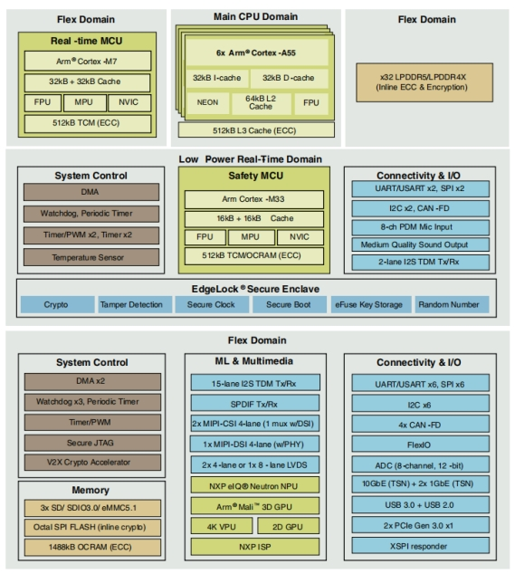

## 2\. FET-MX9596-C SoM Description

### 2.1 FET-MX9596-C SoM Appearance

### 2.2 FET-MX9596-C SoM Dimension Diagram

Structure size: 68mm × 50mm, dimensional tolerance ± 0.13mm, refer to DXF file for more dimensional information.

Plate making process: 1.6mm thickness, 10-layer immersion gold PCB.

SoM connector: Board-to-board, 0.5mm pitch, 80 P, male socket, height 1.23 mm, with locating post

Carrier board connector: Board-to-board, 0.5mm pitch, 80 P, femal socket, height 1.85 mm, with locating post

Refer to Appendix for the connector dimension diagram.

It is recommended to choose M2\_2mm patch nuts for fixing the SoM to the carrier board, and the matching screw specification is M2\_4mm.

### 2.3 Performance Parameters

#### 2.3.1 System Main Frequency

| **Name**  | **Specification** |             |             |          | **Description** |
| --------- | ----------------- | ----------- | ----------- | -------- | --------------- |
|           | **Minimum**       | **Typical** | **Maximum** | **Unit** |                 |
| A55 clock | —                 |             | 2.0         | GHz      | —               |
| M33 clock |                   |             | 333         | MHz      |                 |
| M7 clock  |                   |             | 800         | MHz      |                 |
| NPU       |                   |             | 1.0         | GHz      | 2.0 TOP/s       |

#### 2.3.2 Power Parameter

| **Parameter**             | **Pin Number** | **Specification** |             |             |          | **Description**               |
| ------------------------- | -------------- | ----------------- | ----------- | ----------- | -------- | ----------------------------- |
|                           |                | **Minimum**       | **Typical** | **Maximum** | **Unit** |                               |
| Main Power Supply Voltage | VCC12V\_DCIN   | 10.8              | 12          | 13.2        | V        | —                             |
| No-load current           | —              |                   | 0.603       |             | mA       | —                             |
| High-load current         | —              |                   | 0.302       |             | mA       | Please refer to Appendix III. |

#### 2.3.3 Operating Environment

| **Parameter**         |                       | **Specification** |             |             |          | **Description**  |
| --------------------- | --------------------- | ----------------- | ----------- | ----------- | -------- | ---------------- |
|                       |                       | **Minimum**       | **Typical** | **Maximum** | **Unit** |                  |
| Operating temperature | Operating Environment | 0                 | 25          | +70         | ℃        | Commercial level |
|                       | Storage Environment   | -40               | 25          | +125        | ℃        |                  |
|                       | Operating Environment | -40               | 25          | +85         | ℃        | Industrial-grade |
|                       | Storage Environment   | -40               | 25          | +125        | ℃        |                  |
| Humidity              | Operating Environment | 10                | —           | 90          | ％RH     | No condensation  |
|                       | Storage Environment   | 5                 | —           | 95          | ％RH     |                  |

#### 2.3.4 ESD Features

| **Parameter**        | **Specification** |             | **Unit** |          **Description**          |
| -------------------- | :---------------: | ----------- | :------: | :-------------------------------: |
|                      |    **Minimum**    | **Maximum** |          |                                   |
| ESD HBM(JEDEC JS001) |       -1000       | +1000       |    V     | Applicable to all pins of the SoM |
| ESD CDM(JEDEC JS002) |       -250        | +250        |    V     | Applicable to all pins of the SoM |

**Note：**

- **The above data is from the chip manual;**
- **All SoM outgoing signals are electrostatic sensitive, requiring effective protection in carrier board design. Special attention to electrostatic protection is also needed during transportation, assembly, and use.**

### **2.4 SoM Interface Speed**

|   **Function**    | **Quantity** |                        **Parameter**                         |
| :---------------: | :----------: | :----------------------------------------------------------: |
|       JTAG        |      1       |                   JTAG Debugging Interface                   |
|      UART(1)      |      ≤8      |              Programmable Bit Rate up to 5 Mbps              |
|        SPI        |      ≤8      |        SPI bus can be used as master mode/slave mode         |
|       XSPI        |      ≤1      | 1 x 8-wire serial flash device that supports Serial Nor Flash and Serial NAND Flash |
|      CAN-FD       |      ≤5      |        Complies with ISO11898-1 and CAN 2.0B protocol        |
|        SAI        |      ≤5      |                     Audio interface bus                      |
|      SD Card      |      ≤1      |                 uSDHC2 for 4-bit SD card 3.0                 |
|       SDIO        |      ≤1      |                   uSDHC3 for 4-bit SDIO3.0                   |
|        ADC        |      ≤8      |             12-bit SAR ADC，sampling rate 1 MS/s             |
| 1 x Gbps Ethernet |      ≤2      |         Supports 1.8 V RMII/RGMII interface and TSN          |
| 10 Gbps Ethernet  |      ≤1      | Supports XFI, SGMII (2.5 G and 1G), and 10 G-USXGMII (single 10GE mode only) and TSN |
|      USB3.0       |      1       |              Supports USB master \& slave mode               |
|      USB2.0       |      1       |              Supports USB master \& slave mode               |
|      PCIeTBD      |      2       |       Single lane connectivity with PCIe Gen3 support        |
|   MIPI-DSI（2）   |      ≤1      | MIPI-DSI (4-lane, 2.5 Gbps/lane), supporting 350MHz clock, 4kp30 or 3840 X 1440p60 |
|   MIPI-CSI（2）   |      ≤2      | Images approaching 500 Mpixel/s, each lane supports data rates from 80 Mbps to 2.5 Gbps |
|       LVDS        |      1       |  Up to 1080p 60 LVDS Tx interface (2x 4-lane or 1x 8-lane)   |
|     I2C（3）      |      ≤7      |                                                              |
|        PDM        |      ≤1      |              8-channel PDM microphone interface              |
|       SPDIF       |      ≤1      |           Sony Philips Digital Interconnect Format           |
|        PWM        |      ≤6      |                    Timer/PWM Module (TPM)                    |
|       GPIO        |     ≤111     | General purpose input/output (GPIO) module with interrupt function |

**Note: **

- **The parameters in the table are the theoretical values of hardware design or CPU;**

- **"TBD" refers to functions not yet developed;**

- **UART1, UART2 and UART3 are serial ports for debugging and are not recommended to be used for other functions;**

- **MIPI has interface multiplexing, which can be selected as: 4-lane MIPI DSI + 4-lane MIPI CSI, or 4-lane MIPI CSI + 4-lane MIPI CSI;**

- **I2C1 is occupied on the SoM, and the carrier board is not available.**

### 2.5 FET-MX9596-C SoM Pins Definition

#### 2.5.1 FET-MX9596-C SoM Pins Schematic

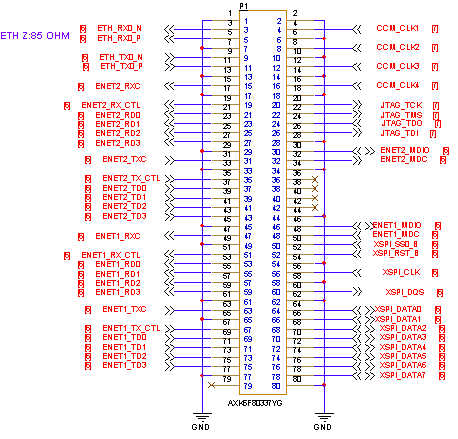

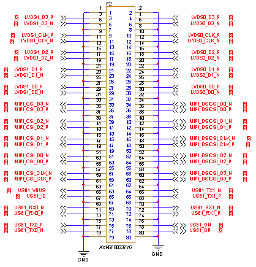

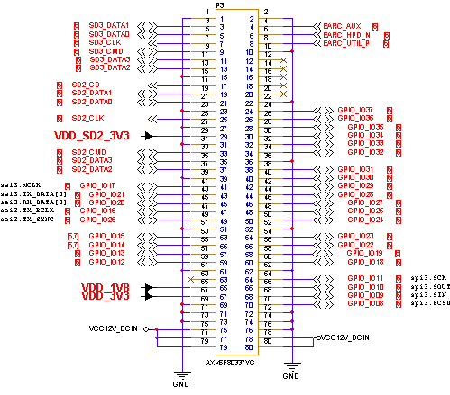

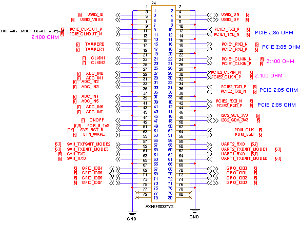

#### 2.5.2 FET-MX9596-C SoM Pins Description

When users have multiple functional expansion requirements, they can refer to the user guide "FET-MX9596-C Pin Multiplexing Table". However, for more detailed information, it is recommended to consult relevant documents, the chip datasheet, and the reference manual.

### **2.6 SoM Hardware Design Description**

**Power Pin**

| **Function** | **Signal Name** | **I/O**      | **Default Function**                                         | **Pin Number** |
| ------------ | --------------- | ------------ | ------------------------------------------------------------ | -------------- |
| Power        | VCC12V\_DCIN    | Power Input  | The power supply pin for the SoM is 12V, and the carrier board provides a current of no less than 2.5A. |                |
|              | VDD\_3V3        | Power output | Used only for carrier board startup and sequencing only, output current capability up to 500mA. | P3\_67         |
|              | VDD\_1V8        | Power output | Used only for carrier board startup related functions, with maximum output current capacity of 500mA. | P3\_65         |
|              | VDD\_SD2\_3V3   | Power output | Only used for power supply of backplane SD card, with maximum output current capacity of 500mA | P3\_29         |
|              | GND             | Ground       | SoM power ground and signal ground, all GND pins need to be connected |                |

**Function Control Pin**

| **Function**                         | **Signal Name**                                              | **I/O** | **Default Function**                                         | **Pin Number**                    |
| ------------------------------------ | ------------------------------------------------------------ | ------- | ------------------------------------------------------------ | --------------------------------- |
| CPU reset                            | POR\_B\_1V8                                                  | I/O     | During the startup of the SoM, the signal is output by the PMIC to control the power-on timing of the CPU. After the startup, the signal is pulled down to reset the CPU separately. | P4\_49                            |
| SoM reset                            | SYS\_RST\_B                                                  | I       | Pulling this signal low can power down and reset the SoM. | P4\_51                            |
| Power On/Off                         | ONOFF                                                        | I       | Low level is valid, long press to turn off, short press to turn on | P4\_47                            |
| Wake up the signal                   | BTN\_WAKE                                                    | I       | Undeveloped, temporarily unavailable                         | P4\_53                            |
| BOOT start item configuration signal | UART1\_TXD/BT\_MODE0 UART2\_TXD/BT\_MODE1 SAI1\_TXFS/BT\_MODE2   SAI1\_TXD/BT\_MODE3 | I/O     | The BOOT startup option configuration signal can also be multiplexed as an interface pin. For details, please refer to the carrier board description section. | P4\_64   P4\_60   P4\_57   P4\_59 |
| A55 debugging serial port            | UART1\_TXD/BT\_MODE0   UART1\_RXD                            | I/O     | Debugging serial port. It is recommended that the user keep the port function. | P4\_64   P4\_62                   |
| M33 debugging serial port            | UART2\_TXD/BT\_MODE1   UART2\_RXD                            | I/O     | Debugging serial port. It is recommended that the user keep the port function. | P4\_60   P4\_58                   |

FET- MX95xx SoM integrates the power supply, reset monitoring circuit, and storage circuit into a compact module. The required external circuits are very simple. To form a minimal system, only a 12V power supply, as shown in the following figure:

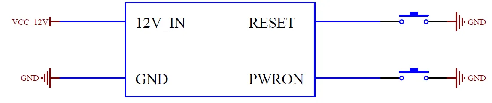

Please refer to “Appendix IV. for the minimal system schematic diagram However, in most cases, it is recommended to connect some external devices in addition to the minimal system, such as a debugging serial port, image flashing port, otherwise, users can not check whether the system is booted. After completing these steps, additional user-specific functions can be added based on the default interface definitions provided by Forlinx for the SoM.

Please refer to section 3.5 in “Chapter 3. OK-MX9596-C Carrier Board Description” for the peripheral circuits.

## 3\. OK-MX9596-C Embedded Platform Description

### 3.1 **OK-MX9596-C Development Board Interface** Diagram

The connection of OK-MX9596-C SoM and the carrier board is board-to-board, and the main interfaces are as follows:

### 3.2 OK-MX9596-C SoM Dimension Diagram

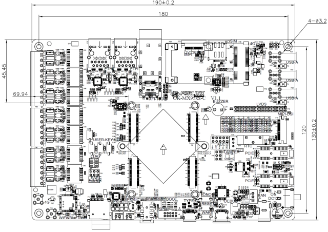

PCB Size: 130mm × 190mm

Fixed hole size: spacing: 120mm × 180mm, hole diameter: 3.2mm.

Plate making process: thickness 1.6mm, 4-layer PCB.

Power supply voltage: DC 12V.

Two mounting holes with a diameter of 3.2mm are reserved on the carrier board. You can select and install the heat sink according to the site environment. Please add a layer of insulated heat-conducting silicone pad on the contact surface between the heat sink and the core board. The size of the SoM heat sink selected by Forlinx is: 38mm × 38mm × 10mm. There is also a fan on the heat sink to help heat dissipation. See the following figure for more detailed dimensions:

### 3.3 Carrier Board Naming Rules

 A - B - C + D E F : G - H

| Field | Field Description                           | Value  | Description                                                  |
| ----- | ------------------------------------------- | ------ | ------------------------------------------------------------ |
| A     | Qualification level                         | PC     | Prototype Sample                                             |
|       |                                             | Blank  | Mass Production                                              |
| B     | Product line identification                 | OK     | Forlinx Embedded development board                           |
| C     | CPU Name                                    | MX9596 | i.MX9596                                                     |
| \-    | Segment Identification                      | \-     |                                                              |
| D     | Connection                                  | Cx     | Board-to-board Connector                                     |
| \+    | Segment Identification                      | \+     | The configuration parameter section follows this identifier. |
| I     | Operating temperature                       | I      | -40 to 85℃ Industrial-grade                                  |
| K     | PCB Version                                 | 11     | V1.1                                                         |
| xx    | Vx.x                                        |        |                                                              |
| :M    | Internal Identification of the Manufacturer | :X     | This is the internal identification of the manufacturer and has no impact on the use. |

### 3.4 Carrier Board Resources

| Function   | Quantity | Parameter                                                    |
| ---------- | -------- | ------------------------------------------------------------ |
| LVDS       | 1        | Supports 2 sets of 4-lane LVDS and 1 set of 8-lane LVDS, up to 1080p 60 |
| MIPI DSI   | 1        | 4-chanel, up to 4kp30 or 3840\* 1440p60                      |
| CAMERA     | 1        | MIPI-CSI, with a maximum rate of 2.5g bps, conforming to V1.2 protocol specification (temporarily unavailable) |
| Audio      | 1        | A four-section headphone stand with dual-channel HP and MIC, and two speaker interfaces |
| TF Card    | 1        | 1 x TF card, which can be used for system flashing and supports SD card 3.0 protocol. |
| XFI        | 1        | 10G, led out through optical cage connector                  |
| Ethernet   | 2        | 2 x 10M/100M/1000M network ports, supporting TSN function.   |
| WiFi/BT    | 1        | Onboard AW-CM358SM, 2.4G/5G dual-band Wi-Fi, BT5.0 Wi-Fi function occupies 1 x SDIO interface; BT function occupies 1 x UART interface. |
| RTC        | 1        | On-board CR2032 battery, keep going when power is off        |
| SPI        | 1        | 2.0MM 10P pin header led-out, reserved for power, ground and other signals |
| KEY        | 3        | Switch, reset and hibernation key                            |
| LED        | 4        | User-defined LED light                                       |
| 4G         | 1        | Mini-PCIE interface, adapted to EC20 module with external antenna |
| ADC        | 8        | 12Bit ADC, sampling rate 1MS/s                               |
| 485        | 2        | It is designed according to four levels of protection of static electricity, surge and pulse, with electrical quarantine and automatic transceiver control. |
| CAN        | 5        | It is designed according to four levels of protection of static electricity, surge and pulse, and has electrical quarantine, which conforms to CAN2.0B protocol specification. |
| PCIE3.0    | 2        | Standard PCIe x1 socket (temporarily unavailable)            |
| USB2.0     | 2        | USB1 is led out by TYPE-C and can be used for flashing. The other USB2 is connected to the 4G module and three USB-A female sockets through HUB expansion. |
| QSPI FLASH | 1        | Capacity 128M bit                                            |
| Debug      | 1        | On-board USB to serial port chip, led out via Type-C, which is convenient for laptop debugging. Default baud rate (115200) |
| JTAG       | 1        | Used for debugging, currently untested                       |
| TYPE-C     | 1        | USB2.0 is connected to Type-C to be used as a flashing function port, and 2 x USB3.0 are connected to Type-C at the same time |

**Note: The parameters in the table are the theoretical values of hardware design or CPU;**

### 3.5 OK-MX9596-C Carrier Board Description

**Note: In the figure below, if the component tag number is marked with "\_ NC", it means that the component is not welded by default.**

#### 3.5.1 Carrier Board Power

Carrier board power supply is DC 12V, led in through DC-005 socket (P9). VCC\_12V power supply passes through an electrostatic protection device, self - recovering fuse, and reverse - connection prevention diode before powering the SoM. It's then stepped down to VDD\_5V by MP8765, VCC\_3V3 by MP2147, and VCC\_1V8 by RT9013, all controlled by the SoM to power the carrier board.  At the same time, two MP2307 step down VCC\_12V to PCIE1\_3V3 and PCIE2\_3V3 respectively, which are not controlled by SoM and power 2 x PCIE. At the same time, the VCC \_ 12V power step down to PCIE1 \_ 3V3 and PCIE2 \_ 3V3 through two MP2307 respectively. These two power supplies are not controlled by the SoM and supply power to the two PCIE respectively.

The EN pin of the MP8765 is pulled high by the VDD\_3V3 output from the SoM, so as to ensure that the VCC\_12V is output as VCC\_5V through the MP8765, and then VCC\_3V3 and VCC\_1V8 are output to supply power to each circuit on the carrier board.

This circuit is to ensure that the SoM is powered on first, and followed by the carrier board, so as to prevent the damage to the CPU caused by latch-up effects.

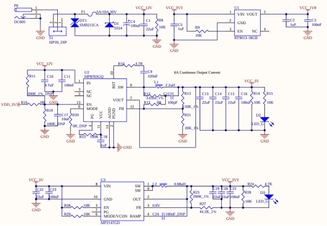

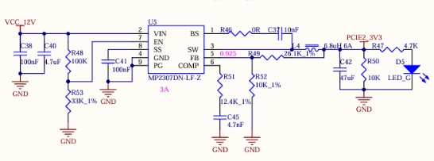

#### 3.5.2 Power On/Off, Reset, and Sleep Keys

K1 at the lower right of the carrier board is the sleep key of the development board. It can put the system into sleep mode in the command line, and the button can wake it up.

K2 is the development board reset key. After pressing it, all the power supplies on the SoM can be turned off, realizing the function of power - off reset for the whole board.

K3 is the power on/off key of the development board. Its function is similar to the power on/off button of a mobile phone. Long - pressing it can achieve turn on/off.

**Note: The BTN\_WAKE, SYS\_RST\_B, and ONOFF pins can be left floating when not in use.**

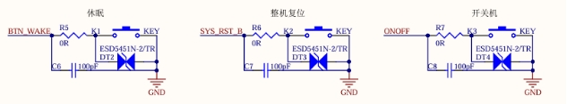

#### **3.5.3 Boot Configuration**

It supports multiple flashing and boot modes. Upon power-up or reset, the system reads the boot configuration pins to select the mode. Development board uses UART1\_TXD/BT\_MODE0, UART2\_TXD/BT\_MODE1, SAI1\_TXFS/BT\_MODE2, SAI1\_TXD/BT\_MODE3 as the system boot configuration pins. Due to the multiplexing relationship with relevant functions, it is necessary to ensure that the actual functional circuits do not affect the startup item circuits. It is recommended to add an analog switch to ensure that the starting item can not be affected by other circuits.

There are 16 states in i.MX95 startup item:

| BOOT_MODE[3:0] | BOOT CORE  | Function                    |
| -------------- | ---------- | --------------------------- |
| 0000           | Cortex-A55 | Boot from Internal Fuses    |
| 0001           | Cortex-A55 | Serial Downloader(USB1)     |
| 0010           | Cortex-A55 | USDHC1 8-bit eMMC 5.1       |
| 0011           | Cortex-A55 | USDHC2 4-bit SD3.0          |
| 0100           | Cortex-A55 | FlexSPI Serial NOR          |
| 0101           | Cortex-A55 | FlexSPI Serial NAND 2K page |
| 0110           | Cortex-A55 | FlexSPI Serial NAND 4K page |
| 0111           | Cortex-A55 | Reserved                    |
| 1000           | Cortex-M33 | Boot from Internal Fuses    |
| 1001           | Cortex-M33 | Serial Downloader(USB1)     |
| 1010           | Cortex-M33 | USDHC1 8-bit eMMC 5.1       |
| 1011           | Cortex-M33 | USDHC2 4-bit SD3.0          |
| 1100           | Cortex-M33 | FlexSPI Serial NOR          |
| 1101           | Cortex-M33 | FlexSPI Serial NAND 2K page |
| 1110           | Cortex-M33 | FlexSPI Serial NAND 4K page |
| 1111           | Cortex-M33 | Reserved                    |

Currently, the boot options supported by the SoM include M33 OTG flashing boot, M33 eMMC boot, and M33 TF card boot.

The boot option pins on the SoM feature internal pull-up and pull-down resistors, with a default state of 0001 configured for Cortex-M33 eMMC boot. The boot circuit on the carrier board complements the pull-up and pull-down settings of the SoM, enabling for different boot options switch via a DIP switch on the carrier board.

The system boot configuration switch on the development board is S2: right for on, left for off. System flashing \& boot modes are configured as:

| S2:BOOT |            | 1    | 2    | 3    | 4    |
| ------- | ---------- | ---- | ---- | ---- | ---- |
| OTG     | Cortex-A55 | ON   | OFF  | ON   | ON   |
| eMMC    |            | ON   | OFF  | OFF  | OFF  |
| TF Card |            | ON   | OFF  | OFF  | ON   |
| NCR     |            | ON   | ON   | ON   | OFF  |
| NAND2K  |            | ON   | ON   | ON   | ON   |
| NAND4K  |            | ON   | ON   | OFF  | OFF  |
| OTG     | Cortex-M33 | OFF  | OFF  | ON   | ON   |
| eMMC    |            | OFF  | OFF  | OFF  | OFF  |
| TF Card |            | OFF  | OFF  | OFF  | ON   |
| NCR     |            | OFF  | ON   | ON   | OFF  |
| NAND2K  |            | OFF  | ON   | ON   | ON   |
| NAND4K  |            | OFF  | ON   | OFF  | OFF  |

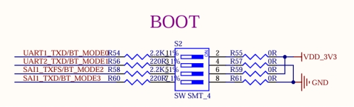

#### 3.5.4 Debugging Serial Port

The debug serial port is TYPE-C interface. and the XR21V1414 chip is used to convert the three debugging serial ports of Cortex-A55, Cortex-M33 and Cortex-M7 into a set of USB bus for easy use and debugging three cores at the same time.

UART1 is the Cortex-A55 debug serial port, 2-wire, 3.3 V level; UART2 is the Cortex-M33 debug serial port, 2-wire, 3.3 V level; UART3 is the Cortex-M7 debug serial port, 2-wire, 3.3 V level.

The debugging serial port signal of the SoM first passes through a buffer chip and then an adapter chip before reaching the TYPE - C interface. This setup ensures that there is no electrical leakage between the SoM and the carrier board when the debugging serial port is plugged in while the carrier board is unpowered.

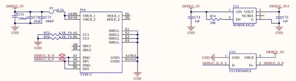

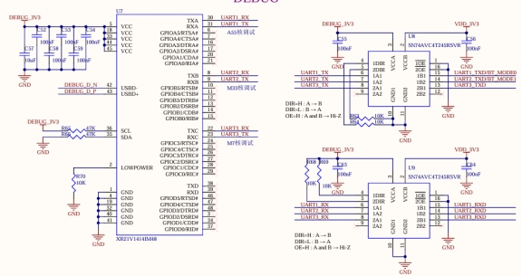

#### **3.5.5 ADC Interface**

SoM supports the native 8 x12Bit ADC interface with a sampling rate of 1 Ms/s. The development board is led out via pins with a 2.54 mm pitch and is configured with a slide potentiometer. The ADC acquisition function can be achieved by connecting the middle pin of the slide potentiometer to the ADC pin. Pins 1/2 of P11 are for the middle terminal of the potentiometer. The remaining 8 pins are ADC input pins, marked accordingly on the PCB.

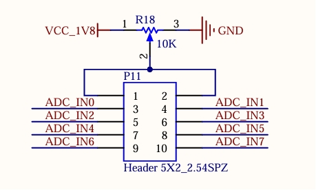

#### 3.5.6 Audio

The development board features: 1 x HP/MIC interface, 1 x onboard MIC interface and 2 x SPEAKER interfaces. The HP/MIC interface uses a four-segment earphone stand to realize recording and playback at the same time; the on-board MIC can directly enabling the recording function; the two SPAKER interfaces are led out through the white terminal block with 2.54 pitch. The earphone has the function of plug detection. When the earphone is plugged in, the playback will automatically switch to the earphone channel, and the SPAKER will not play.

The audio chip NAU88C22 is equipped with a class-D power amplifier output terminal, which can drive two 8Ω speakers with a maximum output power of 1 W. If a larger external power amplifier is required, the signal can only be obtained from the earphone socket, not from the speaker interface.

- **Note:** 
- **The power of the speaker comes from a class-D power amplifier, not a traditional analog power amplifier;**
- **Each socket should be connected to one speaker. Remember, speaker wires must not be shared, nor should speaker signals be connected to the ground wire.**

#### **3.5.7 Dual Gigabit Ethernet**

The SoM supports 2 x Gigabit Ethernet interfaces. The development board provides 2 x Gigabit Ethernet interfaces, both of which are connected to the PHY chip RTL8211 in the form of RGMII interfaces. They are led out through RJ45 sockets, namely P37 and P38. The socket model is FC - H021LNL, which has a built - in isolation transformer. Both network ports support the TSN function.

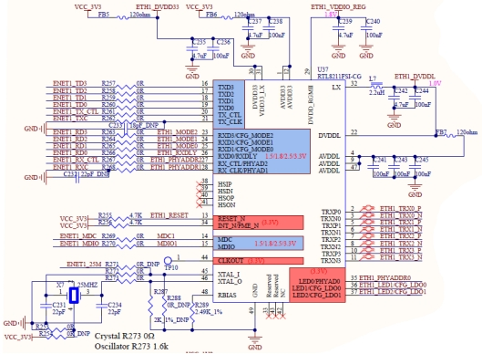

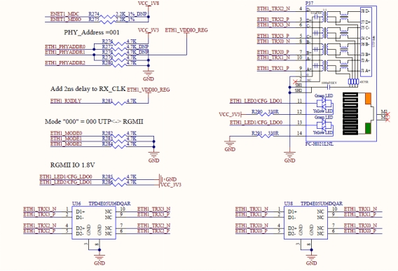

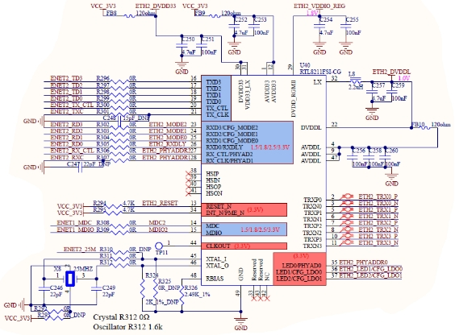

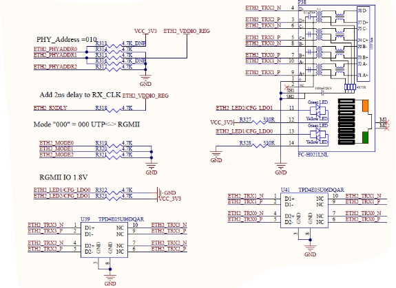

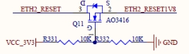

The development board provides a JTAG debugging interface (P22), which is convenient for users to simulate and debug i.MX95.

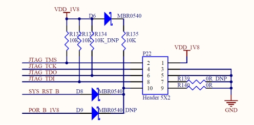

#### 3.5.9 TYPE-C Interface

On the carrier board, USB 2.0 is connected to the Type-C interface P32 for flashing, while USB 3.0 is connected via a Type-C interface, which supports reversible plugging and master-slave switch.

In the slave mode, when the master device (such as a computer) is plugged into the TYPE-C socket through a cable, the TYPEC \_ PWR \_ EN signal cuts off the power supply from the carrier board to the TYPE-C interface, so as to ensure that the 5V from the master device does not conflict with the 5V of the development board; in the master mode, when the slave device is plugged into the TYPE-C socket through the cable, the TYPEC \_ PWR \_ EN signal turns on the power supply of the carrier board to ensure the normal power supply to the slave device.

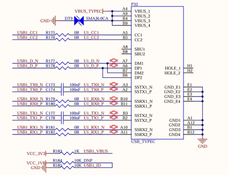

#### **3.5.10 TF Card Interface**

The development board has 1 x TF card interface, uses the SD2 bus, and supports the SD Card 3.0 protocol. The SoM can independently switch the level of the high and low speed cards and manage the power supply. When designing, please use the special power supply pin VDD \_ SD2 \_ 3V3 of the SoM to supply power to the TF card. It is not recommended to use other power supplies.

#### 3.5.11 RTC Interface

The development board has a RTC circuit, which is connected to the I2C3 bus. The CR2032 button battery can be used to save the time when the development board is not powered on, and the time will be saved in real time. After the development board is powered on, the existing time will be read from the RTC again and written into the system.

#### 3.5.12 SPI Interface

The development board provides an SPI interface, and an SPI3 is led out through the 10P pin P10. In addition, the interface also reserves power, ground and other signals to facilitate the expansion of users.

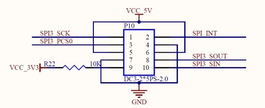

#### 3.5.13 MIPI DSI Interface

The SoM supports 4-channel MIPI DSI , and supports 4kp30 or 3840 \* 38401440p60 at most. The development board provides a general LCD interface, which can be connected to the MIPI capacitive touch screen produced by our company through a 0.5mm FPC seat P16 with a pitch of 30 P. The LCD interface uses MIPI DSI 4-channel connection with a resolution of 1280 x 800.

#### 3.5.14 LVDS Interface

The development board supports two groups of 4-lane LVDS and one group of 8-lane LVDS, and supports 1080p60 at most. The development board provides a general LCD interface, which can be connected to the LVDS capacitive touch screen produced by Forlinx through a double-row pin socket P15 with a 2.0mm pitch of 38 P.

The SoM controls the 5V power supply of the LVDS through the LVDS \_ EN.

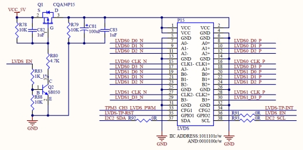

#### 3.5.15 OV13850 MIPI CSI Interface

The SoM natively supports 2 x MIPI CSI 4lane channels (multiplexing one channel with MIPI DSI), with a maximum rate of 2.5Gbps. It conforms to the V1.2 protocol specification and can input 1 x 4Kp60 (single channel), 2 x 4Kp30, 4 x1080p60 and 8 x1080p30. The development board features a MIPI CSI function that is led out through a 26PIN FPC connector. This function interface is powered by an independent power supply and supports connection with the Forlinx OV13850 camera module. （Currently, as the manufacturer has not yet enabled the ISP function, this feature is temporarily unavailable.）

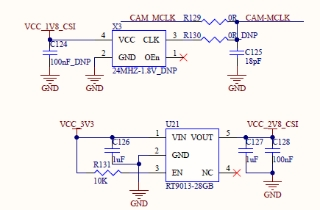

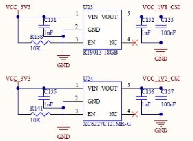

#### 3.5.16 4G Interface

The development board is equipped with a MINI PCIE interface and has a USB protocol cable, which can support MINI PCIE interface devices that follow the USB protocol, such as 4G modules. By default, the development board comes with the EC20 module, enabling 4G Internet access. This interface is powered by an independent power supply, currently providing 3.3V3A, which can meet the requirements of most modules.

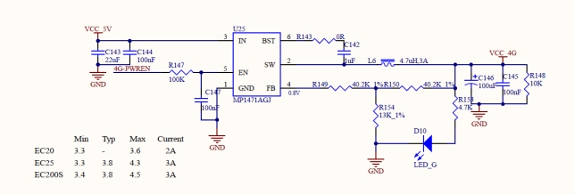

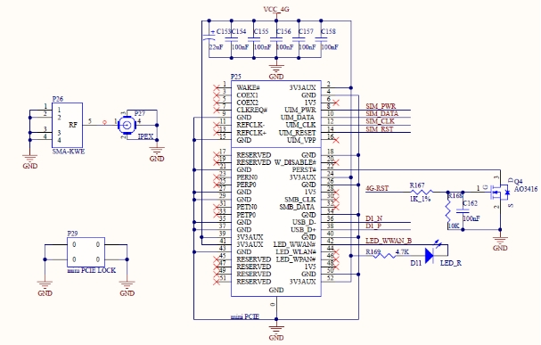

#### 3.5.17 USB2.0 HUB Interface

The development board uses USB2.0 HUB chip FE1.1S to expand the native USB interface, and uses USB2 bus. After expansion, it is connected to 3 x USB-A sockets and 4G respectively.

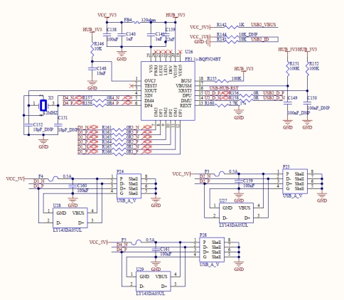

#### 3.5.18 485 Interface

The development board extends 2 x RS-485 interfaces from the SoM's serial ports, featuring auto transmit-receive control and protective circuits. It meets national EMC standards (ESD/EFT/SURGE Level 4), ensuring high security. 2 x 485 interfaces are led out through 7PIN terminal P48.

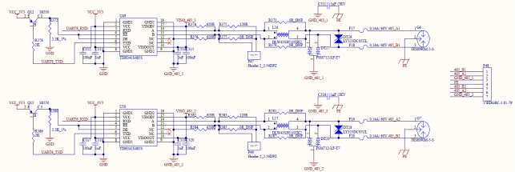

#### **3.5.19 CAN Interface**

The development board uses the native CAN FD to lead out 5 x CAN FD interfaces. While complying with the CAN 2.0B protocol specification, a protection circuit has been added. It is designed according to the fourth - level standard of the EMC experiments (ESD/EFT/SURGE) in the national standard, ensuring high safety. 3 x CAN interfaces are led out through 10PIN terminals respectively, and 2 x CAN interfaces are led out through 7 - pin terminals.

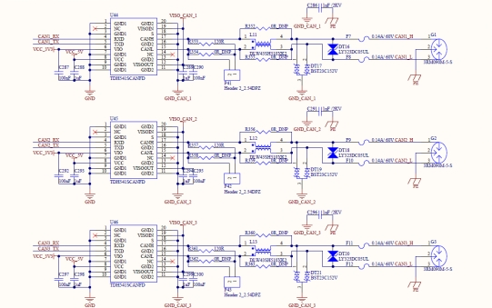

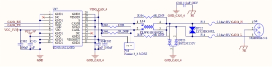

#### 3.5.20 WIFI\&BT Interface

Development board onboard WIFI\&BT module set, default welding AW-CM358SM, WLAN: IEEE 802.11 a/b/g/n/ac dual-band WIFI, up to 433.3 Mbps transceiver rate; Bluetooth: Bluetooth 5, up to 3Mbps speed. To enhance signal quality, use a 2.4 \& 5GHz dual-band antenna.

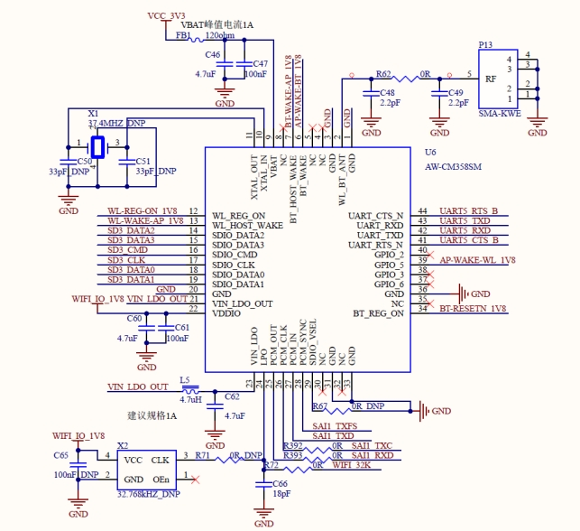

#### 3.5.21 PCIE3.0

The development board supports 2 x PCIE 3.0 X1 interfaces, which are led out through PCIE X1 standard adapter card sockets P35 and P36 to facilitate users to access various PCIE devices. （Currently, as the manufacturer has not yet enabled the Interfaces this feature is temporarily unavailable.）

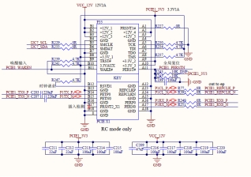

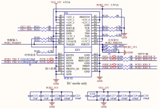

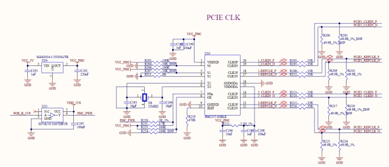

#### 3.5.22 XFI Interface

The development board supports 1 x XFI-10G interface, which is led out through the optical cage connector P39. Due to the high CPU load at 10G speeds, practical testing requires two cores to share the traffic load for full send capacity, and six cores to share the load for full receive capacity.

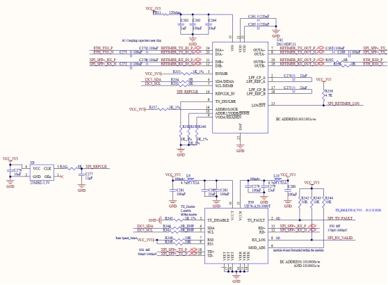

#### 3.5.23 USER\_LED\_KEY

The development board integrates the user LED and user buttons together, making it easy for the user to test the GPIO inputs and outputs. It should be noted that when testing the GPIO output function, do not press the key, otherwise the GPIO will be forced to a low level.

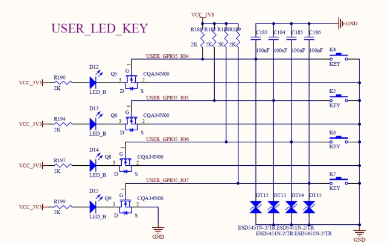

#### 3.5.24 BUZZER

The development board provides a buzzer LS1, and the SoM controls the buzzer through GPIO \_ IO37.

#### 3.5.25 QSPI FLASH

The development board provides 1 x QSPI FLASH interface, and selects NOR FLASH chip W25Q256 with a capacity of 128M bit.

#### 3.5.26 FAN Interface

The development board provides a fan power supply interface, and DC 12V supplies power to the fan after passing through a self-recovery fuse and an anti-reverse diode.

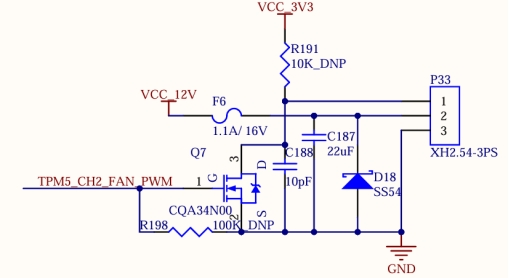

## 4\. OKMX9596-C Development Board Linux System Whole - Machine Power Consumption Table

| **No.** |                **Test Item**                 | **SoM Power（W）（12V）** | Development Board Power (including SoM) (W) （12V） |
| :-----: | :------------------------------------------: | :-----------------------: | :-------------------------------------------------: |
|    1    |         No-load starting peak power          |           5.24            |                        9.42                         |
|    2    |          No-load standby peak power          |           3.62            |                        7.20                         |
|    3    | RAM pressure + emmc read-write pressure test |           7.24            |                        10.82                        |
|    4    |         7＂ MIPI screen+ 4G+ U disk          |           4.06            |                        11.63                        |
|    5    |        10.1＂ LVDS screen+ 4G+ U disk        |           4.26            |                        12.91                        |
|    6    | 7＂ MIPI screen +10.1-inch LVDS display (4G) |           4.26            |                        15.29                        |
|    7    |                   CPU100%                    |           4.98            |                        8.57                         |

**Note：**

- **Test conditions: The SoM configuration is 8GB memory + +64GB eMMC; the 4G module is Quectel EC20, and the screen is an optional product. SoM power supply is 5V and development board is 12V;**

- **Power consumption is for reference only.**

## 5\. Connector Dimension Diagram

**Appendix I. Connector Dimensions**

SoM Connector Dimension:

Carrier board Connector Dimension:

## 6\. Minimum System Schematic

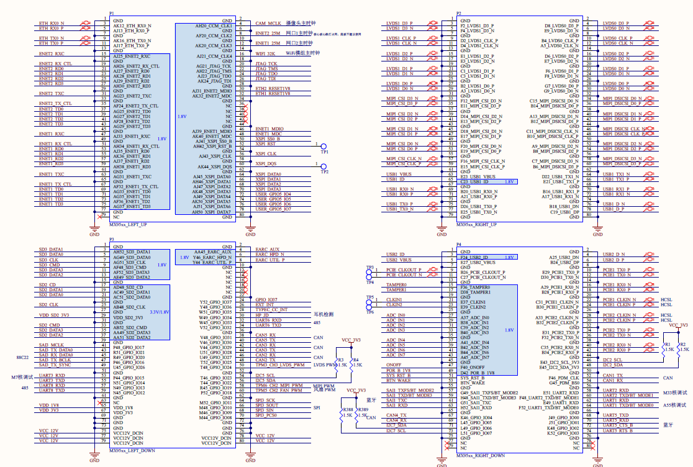

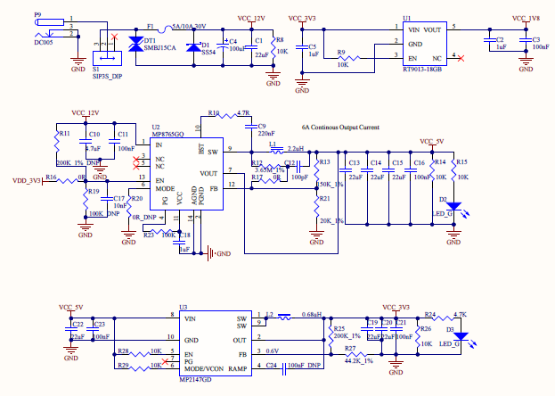

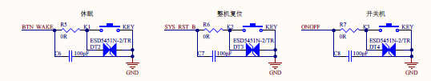

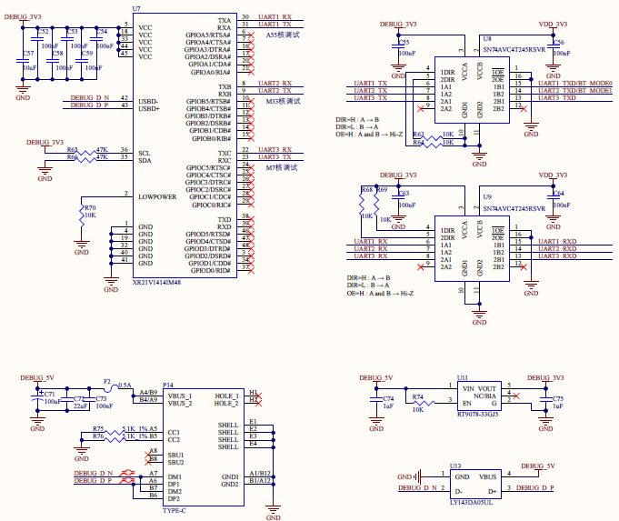

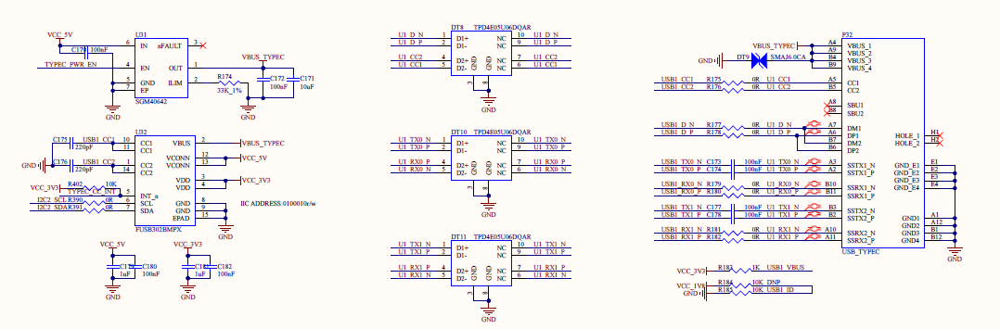

The above figure is only a schematic diagram. Please refer to the schematic diagram of the source file for the specific connection. To ensure the normal operation of the SoM, in addition to the VDD12V power supply, system buttons and BOOT, TYPE-C or TF cards are also required for easy system flashing and startup; DEBUG part of the circuit is convenient for confirming whether the system is working properly and for debugging.