# Linux6.1.36\_User’s Manual\_V1.1

Document classification: □ Top secret □ Secret □ Internal information ■ Open

## Copyright

The copyright of this manual belongs to Baoding Folinx Embedded Technology Co., Ltd. Without the written permission of our company, no organizations or individuals have the right to copy, distribute, or reproduce any part of this manual in any form, and violators will be held legally responsible.

Forlinx adheres to copyrights of all graphics and texts used in all publications in original or license-free forms.

The drivers and utilities used for the components are subject to the copyrights of the respective manufacturers. The license conditions of the respective manufacturer are to be adhered to. Related license expenses for the operating system and applications should be calculated/declared separately by the related party or its representatives.

## Application Scope

This manual is mainly applicable to the Linux4.1.15 operating system on the Forlinx OKMX6ULL platform. Other platforms can also refer to it, but there will be differences between different platforms. Please make modifications according to the actual conditions.

## Revision History

|    Date    | User Manual Version | SoM Version | Carrier Board Version |                  Revision History                   |
| :--------: | :-----------------: | :---------: | :-------------------: | :-------------------------------------------------: |
| 11/06/2024 |        V1.0         |    V1.1     |         V1.0          |                   Initial Version                   |
| 13/11/2024 |        V1.1         |    V1.1     |         V2.0          | Modifying WM8960 audio chip to set audio parameters |

## Overview

This manual is designed to help you quickly familiarize yourselves with the product, and understand the interface functions and testing methods. It primarily covers the testing of interface functions on the development board, the methods for flashing images, and troubleshooting procedures for common issues encountered in use. In the process of testing, some commands are annotated to facilitate the user's understanding, mainly for practical use.

There are total four chapters:

- Chapter 1. provides an overview of the product, briefly introducing the interface resources of the development board, the relevant driver paths in the kernel source code, supported flashing and booting methods, as well as explanations of key sections in the documentation;

- Chapter 2. is the fast boot/startup of the product, which can adopt two ways of serial port login and network login;

- Chapter 3. mainly serves as an introduction to the product's usage features and is divided into multiple sections, including the function testing of the command line in the terminal and the function testing of the QT desktop;

- Chapter 4. is the image update, which mainly describes the method of updating the image to the storage device. The user can select the corresponding flashing mode according to the actual situation.

## 1\. OKMX6ULL-C Development Board Description

OKMX6ULL-C development board adopts the SoM + carrier board structure, designed based on NXP's i.MX6ULL low-power processor, running at a main frequency of 800 MHz and ARM Cortex-A7 architecture. The unique power management architecture of the board results in lower power consumption compared to ARM9 series SoMs. The SoM offers a rich variety of peripheral interfaces, including CAN, WIFI, USB, UART, IIC, and Ethernet, providing ample resources for various functions.

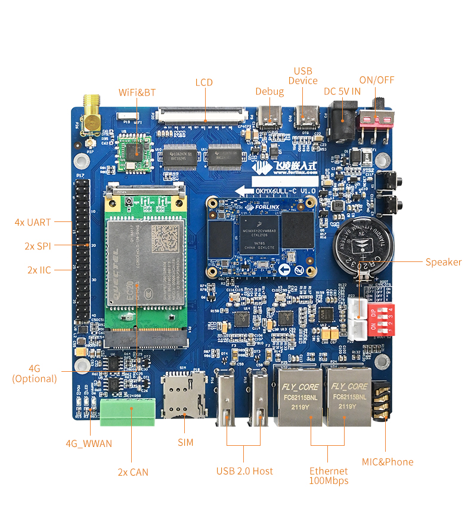

**Note: Hardware parameters are not described in this software manual. Before referring to this manual for software development, please read "OKMX6ULL-C\_ Hardware Manual" under the path of "Hardware Data \\ User Manual" to understand the product naming rules and the hardware configuration information of the product you use, which is helpful for you to use this product.**

### 1.1 Flashing and Booth Configuration

OKMX6ULL-C supports two flashing methods, USB-OTG and TF card. It also supports EMMC boot mode, which can be differentiated using a DIP switch. The image below illustrates the EMMC boot configuration.

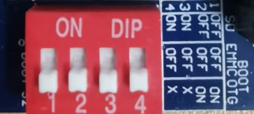

| DIP Switch       | **1**  | **2**  | **3**  | **4**  |
| ---------------- | :----: | :----: | :----: | :----: |
| SD Card Flashing |  OFF   |  OFF   | **ON** | **ON** |
| USB OTG Flashing | **ON** | **ON** |  OFF   |  OFF   |
| EMMC Boot        |  OFF   |  OFF   |  OFF   |  OFF   |

### 1.2 Linux4.1.15 System Software Resources Features

| **Device**                 | **Location of driver source code in the kernel** | **Device Name**      |
| -------------------------- | ------------------------------------------------ | -------------------- |
| NIC Driver                 | drivers/net/ethernet/freescale/fec\_main.c       | /sys/class/net/eth\* |
| LCD Backlight Driver       | drivers/video/backlight/pwm\_bl.c                | /sys/class/backlight |
| LED Driver                 | drivers/leds/leds-gpio.c                         | /sys/class/leds/     |
| USB Port                   | drivers/usb/chipidea/ci\_hdrc\_imx.c             | /dev/sdx             |
| USB 4G                     | drivers/usb/serial/                              | /dev/ttyUSB\*        |
| USB Camera                 | drivers/media/usb/uvc/uvc\_video.c               | /dev/videox          |
| SD Driver                  | drivers/mmc/host/sdhci-esdhc-imx.c               | /dev/block/mmcblk0pX |
| LCD FrameBuffer            | drivers/video/fbdev/mxsfb.c                      | /dev/fb0             |
| ft5x06 capacitive touch    | drivers/input/touchsrcreen/edt-ft5x06.c          | /dev/input/eventx    |
| gt9xx capacitive touch     | drivers/input/touchscreen/ gt9xx.c               | dev/input/eventx     |
| RTC Real Time Clock Driver | drivers/rtc/rtc-rx8010.c                         | /dev/rtcx            |
| serial port driver         | drivers/tty/serial/imx.c                         | /dev/ttymxc\*        |
| watchdog driver            | drivers/watchdog/imx2\_wdt.c                     | /dev/watchdog        |
| CAN Driver                 | drivers/net/can/flexcan.c                        | /sys/class/net/can\* |
| WIFI                       | drivers/net/wireless/realtek                     | wlan0                |
| Audio Driver               | sound/soc/                                       | /dev/snd/            |
| SPI                        | drivers/spi/spidev.c                             | /dev/spidev0.0 etc.  |
| MCP2515                    | drivers/net/can/spi/mcp251x.c                    | /dev/canx            |
| ADC                        | drivers/iio/adc/vf610\_adc.c                     | iio:device           |

## 2\. Fast Startup

### 2.1 Preparation Before Startup

The OKMX6ULL-C development board has two system login methods, serial and network login. Hardware preparation before system startup:

+ 5V3A DC power cable
+ Type-C data cable (used for serial login and USB flashing)
+ Network cable (for network login)
+ Check the start mode DIP switch

Please check the DIP switch on your development board and make sure it is set to the desired boot mode. Please refer to the startup mode settings.“1.3 Flashing and Startup Configuration”

### 2.2 Serial Login Method

#### 2.2.1 Serial Port Login

**Note:**

+ **Serial port settings: Baud rate 115200, data bit 8, stop bit 1, no parity bit, no flow control;**
+ **The serial terminal login uses the root user with no password. If you need to change the password, please refer to 3.1.4.1 FTP service;**
+ **Software: Windows PC requires Super Terminal; choose a familiar serial terminal software.**

Here is an example using Putty to explain how to configure the terminal:

Step 1: Connect the development board and the PC using a serial cable, and verify the serial port number recognized by the computer through the “Device Manager”. The port number recognized by the computer should be considered as the accurate one;


Step 2: Open and set up putty, then set the“ line according to the COM port of the computer used, baud rate 115200;


Step 3: Log in with the username is "root" and no password.

```plain
Freescale i.MX Release Distro 4.1.15-2.0.1 fl-imx6ull /dev/ttymxc0
fl-imx6ull login: root
```

Step 4: View the kernel version information.

```plain
root@fl-imx6ull:~# uname -a
Linux fl-imx6ull 4.1.15-00047-g6c1ab7a #3 SMP PREEMPT Wed Mar 9 09:42:35 CST 2022 armv7l armv7l armv7l GNU/Linux
```

From the printed information, it can be seen that the kernel board is flashed with the Linux 4.1.15 related image.

#### 2.2.2 Serial Login Common Problems

If the computer port does not have a serial port, you can connect it to the development board using a USB to serial converter cable. To use the USB to serial converter cable, you need to install the corresponding driver program. It is better to use a good quality cable to avoid error codes.

### 2.3 Network Login Method

#### 2.3.1 Network Connection Test

**Note: console file system: default factory IP of eth0 is 192.168.0.232, IP of eth1 is 192.168.1.232. If you want to modify the default IP, modify/etc/network/interfaces. "Qt file system: The default setting is to dynamically obtain an IP address. If you need to change it to a static IP address, you can add the following command in the /etc/rc.local file for configuration: ifconfig eth0 192.168.0.232.”**

To test the network connection status between the development board and the computer, with the development board’s eth0 network card as an example (setting the test computer’s IP to 192.168.0.58), follow these steps while using the development board’s serial console login method:

Before logging in to the network, it is necessary to ensure that the network connection between the computer and the development board is normal. The connection status between the computer and the development board can be tested through the ping command. The specific method is as follows:

1. Connect eth0 of the development board to the computer through the network and power up the development board. A blue light on the SoM will blink after the kernel starts, and the network card connected to the computer will blink quickly after normal startup. At this point, you can test the network connection;


2. Close the computer firewall, then open the computer's run command;


3. Use cmd to open the computer administrator interface, and use the ping command to test the network connection status between the computer and the development board.

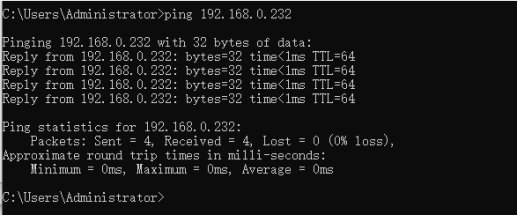

A data return indicates a normal network connection.

#### 2.3.2 SSH

**Note: Default SSH login account: root password: none.**

The SSH ported in the filesystem is implemented by dropbear, a relatively small SSH server and client. The development board acts as an SSH server, and other hosts can.

The two operation methods of accessing the development board via SSH on Linux host and windows host are explained. Users can set the account password according to the actual situation before operation, specific to the actual situation of the printed information shall prevail.

+ **Linux host access to development board via SSH**

Linux host needs to install and turn on SSH service before you can access the development board, the building method can refer to the relevant documents in the application notes. This method uses the ubuntu development environment as the Linux host.

1\. Configuration Information:

Linux host: IP 192.168.0.27, account name: forlinx, hostname:ubuntu;

Development board: IP 192.168.0.232, account name root, host name fl-imx6ull

2\. Test the network connection status between the Linux host and the development board.

```plain
forlinx@ubuntu:~$ ping -c 5 192.168.0.232                            //-c 5 specify 5 pings
PING 192.168.0.232 (192.168.0.232) 56(84) bytes of data.
64 bytes from 192.168.0.232: icmp_seq=1 ttl=128 time=0.557 ms
64 bytes from 192.168.0.232: icmp_seq=2 ttl=128 time=0.562 ms
64 bytes from 192.168.0.232: icmp_seq=3 ttl=128 time=0.685 ms
64 bytes from 192.168.0.232: icmp_seq=4 ttl=128 time=0.495 ms
64 bytes from 192.168.0.232: icmp_seq=5 ttl=128 time=1.29 ms

--- 192.168.0.232 ping statistics ---
5 packets transmitted, 5 received, 0% packet loss, time 4074ms
rtt min/avg/max/mdev = 0.495/0.718/1.291/0.293 ms
```

3\. Linux host access to the development board via SSH

```plain
forlinx@ubuntu:~# ssh root@192.168.0.232
The authenticity of host '192.168.0.232 (192.168.0.232)' can't be established.
RSA key fingerprint is 8c:b8:9e:01:06:03:fb:f8:4c:4f:dd:db:79:28:d7:02.
Are you sure you want to continue connecting (yes/no)? yes                     //Enter yes
Warning: Permanently added '192.168.0.232' (RSA) to the list of known hosts.
-sh: /home/root: Is a directory
root@fl-imx6ull:~#                                   //The host name shows that the SSH login was successful.
```

The account information allows you to determine that the ssh login was successful.

4\. Exit SSH:

```plain
root@fl-imx6ull: ~$ logout                                             //Exit SSH login
Connection to 192.168.0.232 closed.
forlinx@ubuntu:~$                                  //SSH login can be successfully logged out by using the host name
```

+ **Windows host access to development board via SSH**


Click "Open", the following dialog box will appear, click "Yes" to enter the login screen.


```plain
Login as：root
-sh: /home/root: Is a directory
root@fl-imx6ull:~#
```

### 2.4 Screen Options

The OKMX6ULL-C platform supports 4.3 inch/5.6 inch/7 inch/8 inch/10.4 inch resistive screens, a 7 inch capacitive screen, and a 10.1 inch LVDS display. The default configuration for system startup is a 1024x600 display on a 7-inch LCD.

Note: When using the 10.4 inch (800x600) resistance screen of Forlinx, please refer to 3.1.13.3 Touch section to modify, and the default is the touch direction of the 8-inch screen 800x600 resistor.

LCD displays of different sizes and resolutions can be selected through the U-boot menu during the boot phase. The specific method is as follows:

Open the serial port debugging terminal putty. After the development board is powered up, press the space bar to enter the menu home page:


The uboot level 1 menu function options are listed in the table below:

| **No.** | **Function Options**                                         |
| :-----: | ------------------------------------------------------------ |
|    1    | Enter into the screen selection interface (factory default selection 7 inch - 1024x600LCD display) |
|    2    | Enter the screen calibration setting interface.              |
|    9    | Go to boot's command line mode                               |
|    0    | Perform the reset operation                                  |

Enter 1 to enter the screen selection menu (Switch panel), select the corresponding screen, and the system will restart.


According to the menu prompts, select the corresponding options to support LCD display with different sizes and resolutions. The first column is the selection number, the second column is the screen resolution, and the third column is the size and type of the system screen (where c and r correspond to capacitive and resistive screens, respectively). Example: If you need to select a 7-inch capacitive screen with a resolution of 800x480, you need to select option 1 and enter the number 1 on the terminal interface.

**Note: If you are using our adaptive screen, the "Screen Selection Menu" will not be accessible.**

Enter 2 to enter the screen calibration enable menu (Touch calibration), and select the corresponding option to start the system directly:


### 2.5 Touch Calibration

After flashing Qt filesystem, the system needs to calibrate the LCD display at the first startup, touch the "+" position on the screen to complete it, and the calibration interface will not appear after startup again.

#### 2.5.1 Retouch Calibration

If you need to recalibrate the screen, there are two methods as follows:

Method 1.:

Execute the following command to delete the original calibration file:

```plain
root@fl-imx6ull:~# rm -rf /etc/pointercal.xinput
root@fl-imx6ull:~# sync
```

After the hardware reset or software reboot, follow the prompts to calibrate.

Method 2.:

Calibrate the touchscreen with the QT program "Calibrate Touchscreen" as follows:

1. After the board boots up, the screen display defaults to the QT desktop as shown below;


2\. Click Forlinx in the menu bar, a drop-down menu will appear, select Utilities;


3\. Select Calibrate Touchscreen to enter the screen calibration interface;


4\. The following interface appears, touch the "+" position on the screen to complete the calibration:


### 2.6 System Partition

8G eMMC partition information for the Linux operating system:

|   **Partition**   |                 **Name**                  | **Offset**  | **Size**  | **File system** |   **Content**    |
| :---------------: | :---------------------------------------: | :---------: | :-------: | :-------------: | :--------------: |
| /dev/mmcblk1boot0 | Bootloader<br/>(start the boot partition) |     1KB     |    2MB    |       RAW       |    bootloader    |
|  /dev/mmcblk1p1   |          kernel(boot the kernel)          |    10MB     |   500MB   |      vfat       | Kernel DTB etc.  |
|  /dev/mmcblk1p2   |           file system partition           | Follow Boot | Remaining |      ext3       | root file system |

Factory default disk usage (qt file system used), for reference only.

```plain
root@fl-imx6ull:~# df -m
Filesystem     1M-blocks  Used Available Use% Mounted on
/dev/root           6621   750      5529  12% /
devtmpfs              79     1        79   1% /dev
tmpfs                  1     0         1   0% /mnt/.psplash
tmpfs                239     1       239   1% /run
tmpfs                239     1       239   1% /var/volatile
/dev/mmcblk1p1       500    15       486   3% /run/media/mmcblk1p1
```

Memory usage without any peripherals is clear. For reference only, the specific parameters shall be subject to the actual conditions.

```plain
root@fl-imx6ull:~# free
              total        used        free      shared  buff/cache   available
Mem:       489520       28984     407520      1040    53016      392360
Swap:            0           0           0
```

### 2.7 System Shutdown

In general, the power can be turned off directly. If there is data storage, function use, or other operations, avoid turning off the power arbitrarily during operation to prevent irreversible damage to the file. In such cases, only re-flashing the firmware can resolve the issue. To ensure that data is not completely written, enter the sync command to complete data synchronization before turning off the power.

**Note: If the product designed by the user based on the core board has an abnormal system shutdown due to an accidental power loss in use, measures such as power-down protection can be incorporated into the design.**

## 3\. Development Board Command Line Function Test

**Note: The core board of this product supports functions not limited to those mentioned in the manual. Forlinx only tests and verifies the functions listed in the manual. Functions not mentioned in the manual are not guaranteed, and users can test and verify them independently.**

This section describes how to use the external expansion interface of the development board.

### 3.1 Command Line Function Test

Command line test program source code path: user data/Linux/test program source code

The test program used in this section is integrated into the demo provided by Forlinx, so there is no need for file source explanation. We will proceed directly with the command operations.

#### 3.1.1 SDHC/ MMC Driver Test

**Note:**

+ **If the file system doesn't support NTFS, format the SD card as FAT32 before use, especially if unsure of its current format;**
+ **The SD card mounts at /run/media, allowing hot-plugging. Terminal displays SD card information;**
+ **Different SD cards may display different information. Our company tested using a SanDisk 8GB SD card;**
+ **The MMC data transfer modes supported by the CPU are as shown in the following diagram.**


After inserting the SD card into the SD card slot on the development board, the system will automatically check and mount the SD card. Once the mounting is successful, you can perform read and write operations on the SD card.

1\. After inserting an 8GB SD card and successfully mounting it, the device name of the mounted SD card can be seen from the printed information. The printed information is as follows:

```plain
root@fl-imx6ull:~# mmc0: host does not support reading read-only switch, assuming write-enable
mmc0: Problem setting current limit!
mmc0: new ultra high speed DDR50 SDHC card at address aaaa
mmcblk0: mmc0:aaaa SS08G 7.40 GiB
 mmcblk0: p1                                            //The mounted file is named mmcblk0p1
FAT-fs (mmcblk0p1): Volume was not properly unmounted. Some data may be corrupt. Please run fsck.
```

2\. “/run/media” is the mounting directory for the SD card. To view the files in this directory, you can use the following command:

```plain
root@fl-imx6ull:~# ls /run/media   		                     //List files in the/run/media directory
```

The print information is as follows, and mmcblk0p1 is the file name after the SD card is mounted

```plain
mmcblk0p1  mmcblk1p1
```

3\. View the files on the SD card with the following commands:

```plain
root@fl-imx6ull:~# ls -l  /run/media/mmcblk0p1	//List that file attribute in the/run/media/mmcblk0p1 directory
```

Printing information is as follows:

```plain
drwxr-xr-x    2 root     root          4096 Jan 22  2016 bin
drwxr-xr-x    2 root     root          4096 Feb 21  2016 system
```

4\. Write a file to the SD card with the following command, write 1 to the test.txt file:

```plain
root@fl-imx6ull:~# echo 1 > /run/media/mmcblk0p1/test.txt		        //Write 1 to the test. txt films
root@fl-imx6ull:~# sync                                                      //File synchronization
root@fl-imx6ull:~# cat /run/media/mmcblk0p1/test.txt			   //Read test. txt files from SD card
1
```

It will read the 1 that we just wrote.

5\. After using the SD card, you need to use umount to unload the SD card before ejecting it.

```plain
root@fl-imx6ull:~# umount  /run/media/mmcblk0p1
```

**Note: Unplug the SD card after exiting the SD card mounting path**

#### 3.1.2  USB Interface Test

##### 3.1.2.1  USB HOST Interface Storage Test

**Note:**

+ **Supports USB mouse**, **USB keyboard, Hot plug of U disk device;**
+ **When using a USB flash drive for testing, it is recommended to format it to FAT32 format, which can be recognized by the Linux system using a formatting tool;**
+ **At present, the U disk test supports 32g, and more than 32g is not tested;**
+ **The mount directory of the USB flash disk is/run/media.**

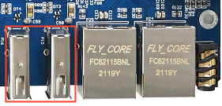

There are three USB HOST interfaces on the development board, any one of which can be selected for testing. The terminal will print relevant information while inserting the U disk. As there are many kinds of U disks, the displayed information may be different, and the actual printed information is the main one. The system will automatically check and mount the U disk. After successful mounting, the U disk can be read and written.

1\. Insert the USB flash drive, and the following information will be displayed:

```plain
root@fl-imx6ull:~# usb 1-1.3: new high-speed USB device number 5 using ci_hdrc
usb-storage 1-1.3:1.0: USB Mass Storage device detected
scsi host1: usb-storage 1-1.3:1.0
scsi 1:0:0:0: Direct-Access     Generic  MassStorageClass 1536 PQ: 0 ANSI: 6
sd 1:0:0:0: [sda] 31116288 512-byte logical blocks: (7.94 GB/7.40 GiB)
sd 1:0:0:0: [sda] Write Protect is off
sd 1:0:0:0: [sda] Write cache: disabled, read cache: enabled, doesn't support DPO or FUA
sda: sda1                                                       //The mounted device name is sda1
sd 1:0:0:0: [sda] Attached SCSI removable disk
FAT-fs (sda1): Volume was not properly unmounted. Some data may be corrupt. Please run fsck.
```

2\. check the USB storage device and /run/media for the USB flash drive mount directory. USB flash drive mounted device named sda1, check the file:

```plain
root@fl-imx6ull:~# ls -la /run/media/sda1/		    //List the attribute of files in the/run/media/sda1 directory
drwxrwx---    4 root     disk          4096 Jan  1  1970 .
drwxr-xr-x    3 root     root            60 May  2 13:57 ..
drwxrwx---    2 root     disk          4096 Mar 17  2020 sdrun
drwxrwx---    2 root     disk          4096 Mar 17  2020 target
```

3\. To write a file to the USB flash drive, the command is as follows; write 2 to the file test.txt:

```plain
root@fl-imx6ull:~# echo 2 > /run/media/sda1/test.txt		            //Write 2 to the test. txt file
root@fl-imx6ull:~# sync                                                      //File synchronization
```

Read the test. Txt file in the U disk with the following command:

```plain
root@fl-imx6ull:~# cat /run/media/sda1/test.txt			        //Reading test. txt file in U disk 
 2
```

It will read the 2 that we just wrote.

4\. After using a USB flash drive, before removing the USB flash drive, you need to use the "umount" command to unmount it.

```plain
root@fl-imx6ull:~# umount  /run/media/sda1
```

**Note: Unplug the SD card after exiting the SD card mounting path.**

##### 3.1.2.2 USB Camera Test

**Note: It supports USB camera: Webcam C270.**

1\. Before inserting the camera, check the USB status and the device node status under /dev with the lsusb command.

```plain
root@fl-imx6ull:~# lsusb
```

Printing information is as follows:

```plain
Bus 001 Device 003: ID 0bda:b720
Bus 001 Device 002: ID 0424:2514
Bus 001 Device 001: ID 1d6b:0002
```

View video-related device nodes before plugging in the camera

```plain
root@fl-imx6ull:~# ls /dev/video*
```

The printed information is as follows:

```plain
/dev/video0  /dev/video1
```

2\. Insert the specified USB camera, enter the command again to view the USB status, and you can see the information of the inserted USB camera.

```plain
root@fl-imx6ull:~# lsusb
```

The printing information is as follows, and the VID (Vendor ID) and PID (Product ID) of the new USB device will appear:

```plain
Bus 001 Device 003: ID 0bda:b720
Bus 001 Device 004: ID 046d:0825                      //The USB camera vid and PID
Bus 001 Device 002: ID 0424:2514
Bus 001 Device 001: ID 1d6b:0002
```

Enter the command to view the device node of the USB camera.

```plain
root@fl-imx6ull:~# ls /dev/video*
```

The print information is as follows. It can be seen that the newly added device node video2 is the USB device just inserted:

```plain
/dev/video0  /dev/video1  /dev/video2   
```

3\. Enter commands to view the resolutions and frame rates supported by the camera

Run the test program luvcview，-d is the corresponding device file，-L is a valid image format for the query

```plain
root@fl-imx6ull:~# fltest_cmd_luvcivew -d /dev/video2 -L
```

Printing information is as follows:

```plain
luvcview version v0.1
starting process
video /dev/video2 
/dev/video2 does not support read i/o
{ pixelformat = 'YUYV', description = 'YUV 4:2:2 (YUYV)' }
{ discrete: width = 640, height = 480 }
        Time interval between frame: 1/30, 1/25, 1/20, 1/15, 1/10, 1/5,
{ discrete: width = 160, height = 120 }
        Time interval between frame: 1/30, 1/25, 1/20, 1/15, 1/10, 1/5,
{ discrete: width = 176, height = 144 }
        Time interval between frame: 1/30, 1/25, 1/20, 1/15, 1/10, 1/5,
{ discrete: width = 320, height = 176 }
        Time interval between frame: 1/30, 1/25, 1/20, 1/15, 1/10, 1/5,
{ discrete: width = 320, height = 240 }
        Time interval between frame: 1/30, 1/25, 1/20, 1/15, 1/10, 1/5,
{ discrete: width = 352, height = 288 }
        Time interval between frame: 1/30, 1/25, 1/20, 1/15, 1/10, 1/5,
{ discrete: width = 432, height = 240 }
        Time interval between frame: 1/30, 1/25, 1/20, 1/15, 1/10, 1/5,
{ discrete: width = 544, height = 288 }
        Time interval between frame: 1/30, 1/25, 1/20, 1/15, 1/10, 1/5,
{ discrete: width = 640, height = 360 }
        Time interval between frame: 1/30, 1/25, 1/20, 1/15, 1/10, 1/5,
{ discrete: width = 752, height = 416 }
        Time interval between frame: 1/25, 1/20, 1/15, 1/10, 1/5,
{ discrete: width = 800, height = 448 }
        Time interval between frame: 1/25, 1/20, 1/15, 1/10, 1/5,
{ discrete: width = 800, height = 600 }
        Time interval between frame: 1/20, 1/15, 1/10, 1/5,
{ discrete: width = 864, height = 480 }
        Time interval between frame: 1/20, 1/15, 1/10, 1/5,
{ discrete: width = 960, height = 544 }
        Time interval between frame: 1/15, 1/10, 1/5,
{ discrete: width = 960, height = 720 }
        Time interval between frame: 1/10, 1/5,
{ discrete: width = 1024, height = 576 }
        Time interval between frame: 1/10, 1/5,
{ discrete: width = 1184, height = 656 }
        Time interval between frame: 1/10, 1/5,
{ discrete: width = 1280, height = 720 }
        Time interval between frame: 1/10, 1/5,
{ discrete: width = 1280, height = 960 }
        Time interval between frame: 2/15, 1/5,
{ pixelformat = 'MJPG', description = 'MJPEG' }
{ discrete: width = 640, height = 480 }
        Time interval between frame: 1/30, 1/25, 1/20, 1/15, 1/10, 1/5,
{ discrete: width = 160, height = 120 }
        Time interval between frame: 1/30, 1/25, 1/20, 1/15, 1/10, 1/5,
{ discrete: width = 176, height = 144 }
        Time interval between frame: 1/30, 1/25, 1/20, 1/15, 1/10, 1/5,
{ discrete: width = 320, height = 176 }
        Time interval between frame: 1/30, 1/25, 1/20, 1/15, 1/10, 1/5,
{ discrete: width = 320, height = 240 }
        Time interval between frame: 1/30, 1/25, 1/20, 1/15, 1/10, 1/5,
{ discrete: width = 352, height = 288 }
        Time interval between frame: 1/30, 1/25, 1/20, 1/15, 1/10, 1/5,
{ discrete: width = 432, height = 240 }
        Time interval between frame: 1/30, 1/25, 1/20, 1/15, 1/10, 1/5,
{ discrete: width = 544, height = 288 }
        Time interval between frame: 1/30, 1/25, 1/20, 1/15, 1/10, 1/5,
{ discrete: width = 640, height = 360 }
        Time interval between frame: 1/30, 1/25, 1/20, 1/15, 1/10, 1/5,
{ discrete: width = 752, height = 416 }
        Time interval between frame: 1/30, 1/25, 1/20, 1/15, 1/10, 1/5,
{ discrete: width = 800, height = 448 }
        Time interval between frame: 1/30, 1/25, 1/20, 1/15, 1/10, 1/5,
{ discrete: width = 800, height = 600 }
        Time interval between frame: 1/30, 1/25, 1/20, 1/15, 1/10, 1/5,
{ discrete: width = 864, height = 480 }
        Time interval between frame: 1/30, 1/25, 1/20, 1/15, 1/10, 1/5,
        Time interval between frame: 1/30, 1/25, 1/20, 1/15, 1/10, 1/5,
        Time interval between frame: 1/30, 1/25, 1/20, 1/15, 1/10, 1/5,
{ discrete: width = 960, height = 720 }
        Time interval between frame: 1/30, 1/25, 1/20, 1/15, 1/10, 1/5,
{ discrete: width = 1024, height = 576 }
        Time interval between frame: 1/30, 1/25, 1/20, 1/15, 1/10, 1/5,
{ discrete: width = 1184, height = 656 }
        Time interval between frame: 1/30, 1/25, 1/20, 1/15, 1/10, 1/5,
{ discrete: width = 1280, height = 720 }
        Time interval between frame: 1/30, 1/25, 1/20, 1/15, 1/10, 1/5,
{ discrete: width = 1280, height = 960 }
        Time interval between frame: 1/30, 1/25, 1/20, 1/15, 1/10, 1/5,
```

4\. Enter the command to capture the image in YUV mode, and preview the captured image on the LCD screen.

The device file name for the -d option, image mode -f as yuv, image resolution -s as 800x448, and frame rate -i as 25fps.

```plain
root@fl-imx6ull:~# fltest_cmd_luvcivew -d /dev/video2 -f yuv -s 800x448 -i 25 	//Note that the imaging size needs to be selected according to the screen.
```

Printing information is as follows:

```plain
luvcview version v0.1
size width: 800 height: 448
interval: 25 fps
starting process
video /dev/video2
get picture !
vinfo: xoffset:0  yoffset:0 bits_per_pixel:16 xres:800 yres:480
```

Input the command for MJPEG mode image capture, you can preview the captured image on the LCD screen. In this mode, the data is captured and recorded at the same time, and the recorded file name is xxx.avi, which is saved in the directory where the command is executed, and the video file is used with the commonly used player.

-d device file name, -f image mode is jpg, -s image resolution is 800x448, -I frame rate is 30fps.

```plain
root@fl-imx6ull:~# fltest_cmd_luvcivew -d /dev/video2 -f jpg -s 800x448 -i 30
```

Printing information is as follows:

```plain
luvcview version v0.1
 size width: 800 height: 448
 interval: 30 fps
video /dev/video2
 format asked unavailable get width 640 height 480
vinfo: xoffset:0  yoffset:0 bits_per_pixel:32 xres:800 yres:480
recording to video.avi
find DRI
get picture !
```

#### 3.1.3 Cable Network Test

##### 3.1.3.1  IPV4 Basic Command Test

**Note:**

- **OKMX6ULL-C has eth0 and eth1 NICs;**

- **Console version file system: By default, the eth0 IP is 192.168.10.232 and the eth1 IP is 192.168.1.232 when the system is started. If you want to modify the IP, please modify the file /etc/network/interfaces;**

- **Qt-based file system: By default, it will dynamically obtain IP address upon startup. To modify the settings to use a static IP, you can add the following command in the /etc/rc.local file: ifconfig eth0 192.168.0.232;**

- **The network usage environment may vary for each development board. In this test example, the network environment is as follows. In actual use, please configure according to the actual network environment.**

| **Silk screen** | **Software equipment** |
| :-------------: | :--------------------: |
|      NET1       |          eth1          |
|      NET2       |          eth0          |

**Note: eth1 and eth0 cannot be used on the same LAN.**

The following takes eth0 as an example for command description.

1. In Linux systems, the “ifconfig” command is used to display or configure network devices, while “ethtool” is used to query and set network card parameters.
2. To set an IP address and view the details:

```plain
root@fl-imx6ull:~# ifconfig eth0 192.168.1.120 		                             //Set ip
root@fl-imx6ull:~# ifconfig eth0            		                     //View the network status after setup
eth0      Link encap:Ethernet  HWaddr 3A:D9:93:8E:A8:A4
 inet addr:192.168.1.120  Bcast:192.168.1.255  Mask:255.255.255.0
          inet6 addr: fe80::38d9:93ff:fe8e:a8a4%2124311408/64 Scope:Link
          inet6 addr: fec0::38d9:93ff:fe8e:a8a4%2124311408/64 Scope:Site
          UP BROADCAST RUNNING MULTICAST  MTU:1500  Metric:1
          RX packets:28 errors:0 dropped:0 overruns:0 frame:0
          TX packets:63 errors:0 dropped:0 overruns:0 carrier:0
          collisions:0 txqueuelen:1000
          RX bytes:11550 (11.2 KiB)  TX bytes:11579 (11.3 KiB)
```

inet addr:192.168.1.120 you can see that the ip setting is successful.

3. Dynamically allocate IP address.

If your development board is connected to a router that supports DHCP automatic IP address assignment, you can enter the command in hyper terminal:

```plain
root@fl-imx6ull:~# udhcpc -i eth0
udhcpc (v1.24.1) started
Sending discover...
Sending select for 192.168.20.101...
Lease of 192.168.20.101 obtained, lease time 86400
/etc/udhcpc.d/50default: Adding DNS 222.222.222.222
```

The "-i" parameter is used to specify the name of the NIC. The NIC name of the wired network of the Forlinx development board is eth0.

The DNS server information in the/etc/resolv. conf file is automatically added.

4. Modify mac address:

```plain
root@fl-imx6ull:~# ifconfig eth0 hw ether 00:00:00:00:00:01
root@fl-imx6ull:~# ifconfig eth0
eth0      Link encap:Ethernet  HWaddr 00:00:00:00:00:01
          inet addr:192.168.20.101  Bcast:192.168.20.255  Mask:255.255.255.0
          inet6 addr: fec0::38d9:93ff:fe8e:a8a4%2128292720/64 Scope:Site
          inet6 addr: fec0::200:ff:fe00:1%2128292720/64 Scope:Site
          UP BROADCAST RUNNING MULTICAST  MTU:1500  Metric:1
          RX packets:85 errors:0 dropped:0 overruns:0 frame:0
          TX packets:118 errors:0 dropped:0 overruns:0 carrier:0
          collisions:0 txqueuelen:1000
          RX bytes:22942 (22.4 KiB)  TX bytes:22259 (21.7 KiB)
```

5. Set the subnet mask:

```plain
root@fl-imx6ull:~# ifconfig eth0 netmask 255.255.255.0 //Set the eth0 subnet mask to 255.255.255.0
root@fl-imx6ull:~# ifconfig eth0
eth0      Link encap:Ethernet  HWaddr 00:00:00:00:00:01
          inet addr:192.168.20.101  Bcast:192.168.20.255  Mask:255.255.255.0
          inet6 addr: fec0::38d9:93ff:fe8e:a8a4%2128915312/64 Scope:Site
          inet6 addr: fec0::200:ff:fe00:1%2128915312/64 Scope:Site
          UP BROADCAST RUNNING MULTICAST  MTU:1500  Metric:1
          RX packets:107 errors:0 dropped:0 overruns:0 frame:0
          TX packets:118 errors:0 dropped:0 overruns:0 carrier:0
          collisions:0 txqueuelen:1000
          RX bytes:25700 (25.0 KiB)  TX bytes:22259 (21.7 KiB)
```

6. Set the broadcast address

```plain
root@fl-imx6ull:~# ifconfig eth0 broadcast 192.168.1.255//eth0广播地址设为192.168.1.255
root@fl-imx6ull:~# ifconfig eth0
```

Printing information is as follows:

```plain
eth0      Link encap:Ethernet  HWaddr 00:00:00:00:00:01
          inet addr:192.168.20.101  Bcast:192.168.1.255  Mask:255.255.255.0
          inet6 addr: fec0::38d9:93ff:fe8e:a8a4%2123332464/64 Scope:Site
          inet6 addr: fec0::200:ff:fe00:1%2123332464/64 Scope:Site
          UP BROADCAST RUNNING MULTICAST  MTU:1500  Metric:1
          RX packets:111 errors:0 dropped:0 overruns:0 frame:0
          TX packets:132 errors:0 dropped:0 overruns:0 carrier:0
          collisions:0 txqueuelen:1000
          RX bytes:26130 (25.5 KiB)  TX bytes:25947 (25.3 KiB)
```

Bcast: The 192.168.1.255 shows that the broadcast address is set successfully.

7. Add/Remove Default Gateway

Add a default gateway:

```plain
root@fl-imx6ull:~# route add default gw 192.168.20.1
```

To delete a default gateway:

```plain
root@fl-imx6ull:~# route del default gw 192.168.20.1
```

8. Turn off and on the network card

Turn off the eth0 network card:

```plain
root@fl-imx6ull:~# ifconfig eth0 down
```

Turn on the eth0 network card:

```plain
root@fl-imx6ull:~# ifconfig eth0 up
fec 20b4000.ethernet eth0: Freescale FEC PHY driver [Micrel KSZ8081 or KSZ8091] (mii_bus:phy_addr=20b4000.ethernet:01, irq=-1)
root@fl-imx6ull:~# fec 20b4000.ethernet eth0: Link is Up - 100Mbps/Full - flow control rx/tx

```

##### 3.1.3.2 IPV6 Test

1\. Take eth1 as an example to set the IPV6 address

```plain
root@fl-imx6ull:~# ip -6 addr add 2001:250:4000:2000::50/64 dev eth1	   //Set IPV6 address
```

2\. Configure the computer's ipv6 address

Open Control Panel->Network and Internet->Change Adapter Options . The following screen appears:


Select Ethernet, right-click and select Properties.


Turn off ipv4 and open ipv6, double click "Internet Protocol Version 6 (TCP/IPV6)" and modify the following figure:

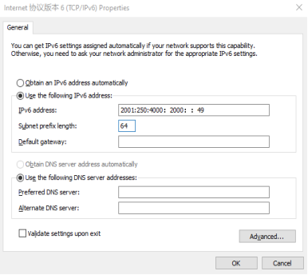

Connect the development board and computer directly with a network cable, and use the ping6 command to test the following:

```plain
root@fl-imx6ull:~# ping6 2001:250:4000:2000::49
PING 2001:250:4000:2000::49(2001:250:4000:2000::49) 56 data bytes
64 bytes from 2001:250:4000:2000::49: icmp_seq=1 ttl=128 time=1.43 ms
64 bytes from 2001:250:4000:2000::49: icmp_seq=2 ttl=128 time=0.399 ms
64 bytes from 2001:250:4000:2000::49: icmp_seq=3 ttl=128 time=0.501 ms
^C
--- 2001:250:4000:2000::49 ping statistics ---
5 packets transmitted, 5 received, 0% packet loss, time 4006ms
rtt min/avg/max/mdev = 0.399/0.640/1.432/0.398 ms
```

##### 3.1.3.3 USB to Network Test

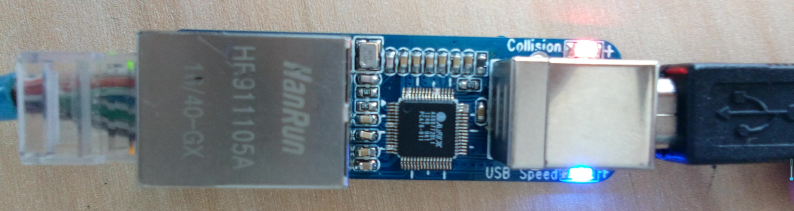

1\. Plug the USB to Ethernet into the USB host interface, and the recognition information is as follows:

```plain
usb 1-1.3: new high-speed USB device number 8 using ci_hdrc
asix 1-1.3:1.0 eth2: register 'asix' at usb-ci_hdrc.1-1.3, ASIX AX88772B USB 2.0 Ethernet, 00:0e:c6:8f:9c:b7
IPv6: ADDRCONF(NETDEV_UP): eth2: link is not ready
```

2\. Test method refer to Basic IPV4 Commands Test.

#### 3.1.4 Ethernet Related Services

##### 3.1.4.1  FTP Services

**Note:**

+ **Account root, no password by default;**
+ **eth0 NIC default IP: 192.168.0.232**.

Before the test, it is necessary to ensure that the development board and the computer network are connected normally. Refer to “Networkconnection Test”. It is not described in this chapter.

1. Set the root user password, here it is set to forlinx.

```plain
root@imx6ullevk:~# passwd root 
Changing password for root
Enter the new password (minimum of 5 characters)
Please use a combination of upper and lower case letters and numbers.
New password: 
Bad password: too simple.  
Warning: weak password (enter it again to use it anyway).
New password: 
Re-enter new password: 
passwd: password changed.
```

2\. The computer uses File Zilla to log in to the development board.

To create a "new site": 1. enter the IP address of the development board as the host; 2. choose the encryption method as plaintext FTP only; 3. choose the login type as normal; 4. choose the user and password as those of the development board; 5. click "Connect".

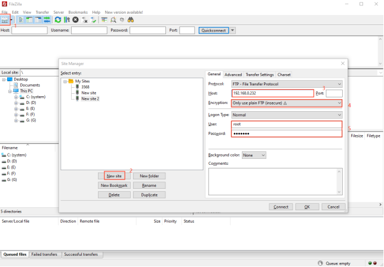

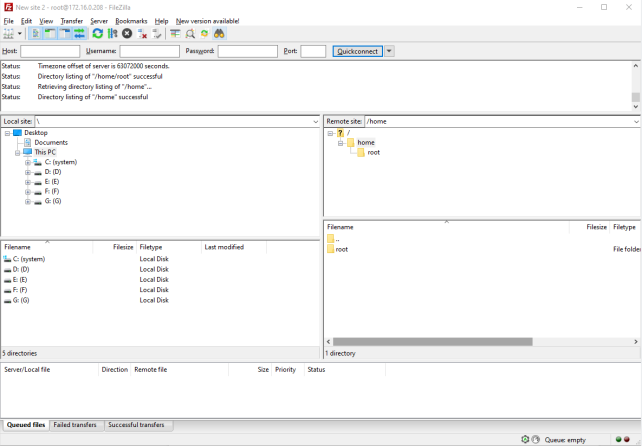

##### 3.1.4.2 SSH Client Test

**Note:**

- **Console version file system: By default, the eth0 IP is 192.168.10.232 and the eth1 IP is 192.168.1.232 when the system is started;**

- **Qt-based file system: By default, it will dynamically obtain IP address upon startup.**

Porting Dropbear in the file system is a relatively small SSH server and client. In this section, we introduce the development board as an SSH client to access a Linux host with an SSH server. The method of setting up SSH services on a Linux host can be found in the relevant files of the application note. This time, the Ubuntu development environment was used as the Linux host.

Configuration information:

The IP setting of the development board is: 192.168.0.232.

Linux host IP address:192.168.0.149    The account name is**forlinx**，The hostname is**ubuntu**

Access to Linux host from development board.

```plain
root@fl-imx6ull:~# ssh forlinx@192.168.0.149       //192.168.0.149为linux主机IP地址
                                                             forlinx为linux主机用户名
Host '192.168.0.149' is not in the trusted hosts file.
(ecdsa-sha2-nistp256 fingerprint md5 93:ff:74:8a:ed:ba:fd:21:39:d9:87:93:ad:9e:19:6f)
Do you want to continue connecting? (y/n) y
forlinx@192.168.0.149's password:
Welcome to Ubuntu 14.04.5 LTS (GNU/Linux 4.4.0-31-generic x86_64)

 * Documentation:  https://help.ubuntu.com/

504 packages can be updated.
421 updates are security updates.

New release '16.04.6 LTS' available.
Run 'do-release-upgrade' to upgrade to it.

Last login: Mon Mar 23 12:50:22 2020 from 192.168.0.232
```

#### 3.1.5 Wireless Network Test

##### 3.1.5.1 WiFi Test

WiFi support:

| **Module**| **Support**
|----------|----------
| RTL8188EUS| WiFi
| RTL8723BU| WiFi
| RTL8723DU| WiFi

###### 3.1.5.1.1  USB WIFI RTL8188eus

**Note: The USB WIFI wireless LAN card is an optional module, please contact Forlinx Embedded sales for more information.**

The following is a test of the wifi module connecting to the wireless network in STA mode:

Step 1:Power up the development board and start the Linux system.

Step 2: Connect the USB WIFI to the USB host interface of the Forlinx development board and install it correctly as shown in the figure below.

**Step 3: Enter the appropriate parameters in the following format: <font style="color:#FF0000;"> </font>**

-i denotes the wifi model;

-s denotes the wifi hotspot name;

-p for password, if no password enter -p NONE;

The router uses wpa encryption. See the wifi.sh script for specific instructions.

The printout after connection is as follows:

```plain
root@fl-imx6ull:~# fltest_cmd_wifi.sh -i 8188 -s forlinx -p xxxx
```

Printing information is as follows:

```plain
wifi 8188
ssid forlinx
pasw xxxx
usbcore: deregistering interface driver rtl8723bu
RTL871X: module exit start
usbcore: deregistering interface driver rtl8188eu
RTL871X: rtw_ndev_uninit(wlan1)
usb 1-1.3: reset high-speed USB device number 7 using ci_hdrc
RTL871X: module exit success
RTL871X: module init start
RTL871X: rtl8188eu v4.3.0.9_15178.20150907
RTL871X: build time: Mar 25 2020 02:23:46
bFWReady == _FALSE call reset 8051...
RTL871X: rtw_ndev_init(wlan0)
usbcore: registered new interface driver rtl8188eu
RTL871X: module init ret=0
==> rtl8188e_iol_efuse_patch
IPv6: ADDRCONF(NETDEV_UP): wlan0: link is not ready
ps: invalid option -- 'f'
BusyBox v1.24.1 (2019-04-27 02:24:01 CST) multi-call binary.

Usage: ps
Successfully initialized wpa_supplicant
rfkill: Cannot open RFKILL controRTL871X: set bssid:00:00:00:00:00:00
l device
RTL871X: set ssid [g▒isQ▒J▒)ͺ▒▒▒▒F|▒T▒▒vZ.c3▒ɚ𞌌<▒▒▒▒] fw_state=0x00000008
ioctl[SIOCSIWAP]: Operation not permitted
ioctl[SIOCGIWSCAN]: Resource temporarily unavailable
ioctl[SIOCGIWSCAN]: Resource temporarily unavailable
RTL871X: indicate disassoc
wlan0: Trying to associate with 04:d7:a5:84:fa:40 (SSID='forlinx' freq=2437 MHz)
RTL871X: set ssid [forlinx] fw_state=0x00000008
RTL871X: set bssid:04:d7:a5:84:fa:40
RTL871X: start auth
RTL871X: auth success, start assoc
RTL871X: assoc success
IPv6: ADDRCONF(NETDEV_CHANGE): wlan0: link becomes ready
RTL871X: recv eapol packet
wlan0: Associated with 04:d7:a5:84:fa:40
RTL871X: send eapol packet
RsvdPageNum: 8
udhcpc (v1.24.1) started
RTL871X: recv eapol packet
RTL871X: send eapol packet
RTL871X: recv eapol packet
RTL871X: send eapol packet
RTL871X: set pairwise key camid:4, addr:04:d7:a5:84:fa:40, kid:0, type:AES
wlan0: WPA: Key negotiation completed with 04:d7:a5:84:fa:40 [PTKRTL871X: set group key camid:5, addr:04:d7:a5:84:fa:40, kid:2, type:AES
=CCMP GTK=CCMP]
wlan0: CTRL-EVENT-CONNECTED - Connection to 04:d7:a5:84:fa:40 completed [id=0 id_str=]
Sending discover...
Sending select for 192.168.4.129...
Lease of 192.168.4.129 obtained, lease time 36000
/etc/udhcpc.d/50default: Adding DNS 222.222.202.202
/etc/udhcpc.d/50default: Adding DNS 222.222.222.222
Finshed!
```

After the script runs, it can automatically assign IP and add DNS, then the wifi connection is successful.

Step 5: ping IP or domain name, the command is as follows.

```plain
root@fl-imx6ull:~# ping -c 4 www.baidu.com
PING www.baidu.com (220.181.38.149): 56 data bytes
64 bytes from 220.181.38.149: seq=0 ttl=51 time=26.648 ms
64 bytes from 220.181.38.149: seq=1 ttl=51 time=13.529 ms
64 bytes from 220.181.38.149: seq=2 ttl=51 time=15.656 ms
64 bytes from 220.181.38.149: seq=3 ttl=51 time=26.249 ms

--- www.baidu.com ping statistics ---
4 packets transmitted, 4 packets received, 0% packet loss
round-trip min/avg/max = 13.529/20.520/26.648 ms
```

Step 6: Uninstall the modules that have been added to the kernel.

```plain
root@fl-imx6ull:~# rmmod 8188eu
```

Printing information is as follows:

```plain
RTL871X: module exit start
usbcore: deregistering interface driver rtl8188eu
RTL871X: indicate disassoc
RTL871X: rtw_cmd_thread: DriverStopped(1) SurpriseRemoved(0) break at line 478
wlan0: CTRL-EVENT-DISCONNECTED bssid=04:d7:a5:84:fa:40 reason=3 locally_generated=1
RTL871X: rtw_ndev_uninit(wlan0)
RTL871X: rtw_dev_unload: driver not in IPS
usb 1-1.3: reset high-speed USB device number 7 using ci_hdrc
RTL871X: module exit success
```

###### 3.1.5.1.2 On-board WIFI

**Note:**

+ **The wifi frequency is 2.4 G;**
+ **Compatible with 8723bu and 8723du wifi drivers;**
+ **The default router uses wpa encryption.**

If the development board has an on-board WIFI WLAN card, solder it to the evaluation board as shown (8723du below):

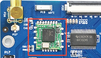

Step 1: Check whether the module has been soldered on the development board. The correct soldering is shown in the figure above; connect the antenna;

Step 2: Power up the development board, start the Linux system, and use lsmod to view the module loading status:

```plain
root@fl-imx6ull:~# lsmod
Module                  Size  Used by
mx6s_capture           14876  0
8723du               1313893  0	            //默认wifi自动加载，8723du已加载成功
ov9650_camera          12446  0
```

+ **Note: If 8723bu is soldered on the development board, using lsmod will display 8723bu.**

The following test description takes 8723du as an example:

**Step 3: Test**

+ **<font style="color:#000000;">STA Mode</font>**

This mode is used as a station to connect to the wireless network, and the operation method is as follows:

-i means wifi model; -s means wifi hotspot name; -p means password, if there is no password, enter -p NONE; the router uses wpa encryption, the specific operation instructions can be viewed wifi.sh scripts.

```plain
root@fl-imx6ull:~# fltest_cmd_wifi.sh -i 8723du -s forlinx -p xxx        //执行测试脚本
```

Printing information is as follows:

<font style="color:#000000;"></font>

```plain
wifi 8723du
ssid forlinx
pasw xxx
usbcore: deregistering interface driver rtl8723du
usbcore: registered new interface driver rtl8723du
IPv6: ADDRCONF(NETDEV_UP): wlan0: link is not ready
Successfully initialized wpa_supplicant
rfkill: Cannot open RFKILL control device
udhcpc (v1.24.1) started
Sending discover...
wlan0: CTRL-EVENT-REGDOM-CHANGE init=BEACON_HINT type=UNKNOWN
wlan0: Trying to associate with 04:d7:a5:f9:26:1d (SSID='forlinx' freq=2427 MHz)
wlan0: Associated with 04:d7:a5:f9:26:1d
IPv6: ADDRCONF(NETDEV_CHANGE): wlan0: link becomes ready
wlan0: WPA: Key negotiation completed with 04:d7:a5:f9:26:1d [PTK=CCMP GTK=TKIP]
wlan0: CTRL-EVENT-CONNECTED - Connection to 04:d7:a5:f9:26:1d completed [id=0 id_str=]
nf_conntrack: automatic helper assignment is deprecated and it will be removed soon. Use the iptables CT target to attach helpers instead.
Sending discover...
Sending select for 192.168.5.186...
Lease of 192.168.5.186 obtained, lease time 1800
/etc/udhcpc.d/50default: Adding DNS 222.222.202.202
/etc/udhcpc.d/50default: Adding DNS 222.222.222.222
WLAN Finshed!
```

After the script runs, it can automatically assign IP and generate DNS, and the wifi connection is successful.

ping ip or domain name with the following command:

```plain
root@fl-imx6ull:~# ping -c 5 www.baidu.com
```

Printing information is as follows:

```plain
PING 192.168.4.1 (192.168.4.1): 56 data bytes
64 bytes from 192.168.4.1: seq=0 ttl=128 time=39.783 ms
64 bytes from 192.168.4.1: seq=1 ttl=128 time=81.529 ms
64 bytes from 192.168.4.1: seq=2 ttl=128 time=15.236 ms
64 bytes from 192.168.4.1: seq=3 ttl=128 time=12.076 ms
64 bytes from 192.168.4.1: seq=4 ttl=128 time=16.300 ms

--- 192.168.4.1 ping statistics ---
5 packets transmitted, 5 packets received, 0% packet loss
round-trip min/avg/max = 12.076/32.984/81.529 ms
```

+ **Wifi signal**

The method to check the WiFi signal is as follows:

```plain
root@fl-imx6ull:~# cat /proc/net/wireless | grep wlan0 | awk '{print $3}' //获取信号强度
78.
root@fl-imx6ull:~# cat /proc/net/wireless | grep wlan0 | awk '{print $4}' //获取信号质量,单位dBm
-68.
root@fl-imx6ull:~# cat /proc/net/wireless | grep wlan0 | awk '{print $5}' //网口背景噪声,单位dBm
-256.
```

- **AP Mode**

**Note:**

+ **This module supports AP mode, and the theoretical maximum number of connected users is 8;**
+ **It is an example of Ethernet eth0 connecting to the router. After configuring Ethernet, you need to test whether eth0 can be connected to the external network; if it can be connected to the external network (please refer to the "Wired NIC" chapter for the method), please continue to follow the steps, if not, please check whether the Ethernet or the router is connected properly.**

Working in AP mode, mobile phones and other devices can be directly connected to the module.

Set the Ethernet IP and configure the network firewall:

```plain
root@fl-imx6ull:~# udhcpc -i eth0 // Automatically assign an IP address. If the eth0 network has been tested to be normal, you don’t need to perform this step.
root@fl-imx6ull:~# echo 1 > /proc/sys/net/ipv4/ip_forward // Enable IP forwarding.
root@fl-imx6ull:~# iptables -t nat -A POSTROUTING -o eth0 -j MASQUERADE// Set forwarding rules.
```

Set the mode and IP of WiFi

Ensure that module 8723bu is loaded.

```plain
root@fl-imx6ull:~# ifconfig wlan0 up // Turn on the WiFi.
root@fl-imx6ull:~# ifconfig wlan0 192.168.0.10 netmask 255.255.255.0 // Set the IP address and subnet mask.
root@fl-imx6ull:~# ifconfig wlan0 promisc // Set wlan0 to promiscuous mode.
```

Open AP

```plain
root@fl-imx6ull:~# udhcpd /etc/udhcpd/udhcpd.conf & // Configure information such as WiFi address and gateway.
root@fl-imx6ull:~# hostapd -d /etc/hostapd/hostapd.conf & // Set encryption method, username, password, etc.
```

In the hostapd. Conf file: ssid is the user name, and/is the password

Mobile terminals such as mobile phones can be connected to the AP hotspot of the development board through WiFi, and the development board uses the following user name and password by default:

Hotspot Name: forlinxtest Password: 1234567890

Step 4: Uninstall the modules that have been added to the：

```plain
root@fl-imx6ull:~# rmmod 8723du
usbcore: deregistering interface driver rtl8723du
wlan0: CTRL-EVENT-DISCONNECTED bssid=04:d7:a5:f9:26:1d reason=0
```

##### 3.1.5.2 4G Module Implementation of IE Internet Access

**Note: At present, the OKMX6ULL-C SoM supports the 4G module of the remote EC20.**

###### 3.1.5.2.1 EC20 Test

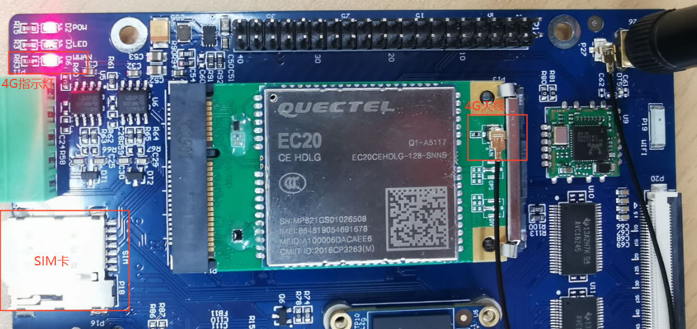

| **4G indicator status**            | **The network status indicated** |
| ---------------------------------- | -------------------------------- |
| Slow flash (200ms high/1800ms low) | Network state                    |
| Slow flash (1800ms high/200ms low) | Standby state                    |
| Flash (125ms High/125ms Low)       | Data transfer mode               |
| High level                         | On the phone                     |

**Note:**

+ **When the IOT card is used for testing, confirm the firmware version of the module. If the lower version firmware is not supported, upgrade the EC20 firmware;**
+ **The dial-up script quectel-CM is in the/usr/bin directory;**
+ **Some IoT cards require a dedicated account number and password when dialing, and users adjust the commands according to the situation;**
+ **Use the quectel-CM --help command to see what the parameters mean.**

1\. After connecting the module and powering up the board and module, check the USB status through the lsusb command.

```plain
root@imx6ulevk:~# lsusb
Bus 001 Device 004: ID 0bda:b720
Bus 001 Device 005: ID 2c7c:0125                                    //EC20 VID and PID
Bus 001 Device 002: ID 0424:2514
Bus 001 Device 001: ID 1d6b:0002
```

2\. View device node status under /dev

```plain
root@imx6ulevk:~# ls /dev/ttyUSB*
/dev/ttyUSB0  /dev/ttyUSB1  /dev/ttyUSB2  /dev/ttyUSB3 
```

3\. EC20 dialing

```plain
root@fl-imx6ull:~# ifconfig eth0 down
root@fl-imx6ull:~# ifconfig eth1 down
root@fl-imx6ull:~# quectel-CM &
[1] 598
root@fl-imx6ull:/forlinx/cmdbin#[04-26_19:16:06:781] WCDMA&LTE_QConnectManager_Linux&Android_V1.1.34
[04-26_19:16:06:783] ./quectel-CM profile[1] = (null)/(null)/(null)/0, pincode = (null)
[04-26_19:16:06:790] Find /sys/bus/usb/devices/1-1.1 idVendor=2c7c idProduct=0125
[04-26_19:16:06:791] Find /sys/bus/usb/devices/1-1.1:1.4/net/eth2
[04-26_19:16:06:791] Find usbnet_adapter = eth2
[04-26_19:16:06:792] Find /sys/bus/usb/devices/1-1.1:1.4/GobiQMI/qcqmi2
[04-26_19:16:06:792] Find qmichannel = /dev/qcqmi2
[04-26_19:16:06:851] Get clientWDS = 7
[04-26_19:16:06:882] Get clientDMS = 8
[04-26_19:16:06:914] Get clientNAS = 9
[04-26_19:16:06:946] Get clientUIM = 10
[04-26_19:16:06:978] Get clientWDA = 11
[04-26_19:16:07:011] requestBaseBandVersion EC20CEHCLGR06A05M1G
//The version number in the print information is 5Mxx, which supports the Internet of Things card. If it is 2Mxx, it is not supported.
[04-26_19:16:07:106] requestGetSIMStatus SIMStatus: SIM_READY
[04-26_19:16:07:138] requestGetProfile[1] ctnet///0
[04-26_19:16:07:171] requestRegistrationState2 MCC: 460, MNC: 11, PS: Attached, DataCap: LTE
[04-26_19:16:07:202] requestQueryDataCall IPv4ConnectionStatus: DISCONNECTED
[04-26_19:16:07:266] requestRegistrationState2 MCC: 460, MNC: 11, PS: Attached, DataCap: LTE
[04-26_19:16:07:300] requestSetupDataCall WdsConnectionIPv4Handle: 0xe1645ec0
[04-26_19:16:07:394] requestQueryDataCall IPv4ConnectionStatus: CONNECTED
[04-26_19:16:07:427] ifconfig eth2 up
[04-26_19:16:07:471] busybox udhcpc -f -n -q -t 5 -i eth2
[04-26_19:16:07:506] udhcpc (v1.24.1) started
[04-26_19:16:07:631] Sending discover...
[04-26_19:16:07:691] Sending select for 172.29.86.131...
[04-26_19:16:07:751] Lease of 172.29.86.131 obtained, lease time 7200
[04-26_19:16:07:869] /etc/udhcpc.d/50default: Adding DNS 222.222.222.222
[04-26_19:16:07:869] /etc/udhcpc.d/50default: Adding DNS 222.222.202.202
```

After the connection is successful, ping Baidu test:

```plain
root@fl-imx6ull:~# ping www.baidu.com -I eth2 -c 3
PING www.baidu.com (220.181.38.150): 56 data bytes
64 bytes from 220.181.38.150: seq=0 ttl=53 time=137.243 ms
64 bytes from 220.181.38.150: seq=1 ttl=53 time=51.239 ms
64 bytes from 220.181.38.150: seq=2 ttl=53 time=94.440 ms
 
--- www.baidu.com ping statistics ---
3 packets transmitted, 3 packets received, 0% packet loss
round-trip min/avg/max = 51.239/94.307/137.243 ms
```

4\. 4G module power down/up

**Note:** **The 4G module is powered on by default.**

Power off of 4G module:

```plain
root@fl-imx6ull:~# echo 137 > /sys/class/gpio/export 
root@fl-imx6ull:~# echo out > /sys/class/gpio/gpio137/direction 
root@fl-imx6ull:~# echo 0 > /sys/class/gpio/gpio137/value #4GEN power down 
root@fl-imx6ull:~# usb 1-1.3: USB disconnect, device number 4
option1 ttyUSB0: GSM modem (1-port) converter now disconnected from ttyUSB0
option 1-1.3:1.0: device disconnected
option1 ttyUSB1: GSM modem (1-port) converter now disconnected from ttyUSB1
option 1-1.3:1.1: device disconnected
option1 ttyUSB2: GSM modem (1-port) converter now disconnected from ttyUSB2
option 1-1.3:1.2: device disconnected
option1 ttyUSB3: GSM modem (1-port) converter now disconnected from ttyUSB3
option 1-1.3:1.3: device disconnected
GobiNet 1-1.3:1.4 eth2: unregister 'GobiNet' usb-ci_hdrc.1-1.3, GobiNet Ethernet Device
```

Power on of 4G module:

```plain
root@fl-imx6ull:~# echo 137 > /sys/class/gpio/export 
root@fl-imx6ull:~# echo out > /sys/class/gpio/gpio137/direction 
root@fl-imx6ull:~# echo 1 > /sys/class/gpio/gpio137/value #4GEN power down 
root@fl-imx6ull:~# usb 1-1.3: new high-speed USB device number 5 using ci_hdrc
option 1-1.3:1.0: GSM modem (1-port) converter detected
usb 1-1.3: GSM modem (1-port) converter now attached to ttyUSB0
option 1-1.3:1.1: GSM modem (1-port) converter detected
usb 1-1.3: GSM modem (1-port) converter now attached to ttyUSB1
option 1-1.3:1.2: GSM modem (1-port) converter detected
usb 1-1.3: GSM modem (1-port) converter now attached to ttyUSB2
option 1-1.3:1.3: GSM modem (1-port) converter detected
usb 1-1.3: GSM modem (1-port) converter now attached to ttyUSB3
GobiNet 1-1.3:1.4 eth2: register 'GobiNet' at usb-ci_hdrc.1-1.3, GobiNet Ethernet Device, 1a:91:07:93:2c:66
GobiNet 1-1.3:1.4 eth2: kevent 12 may have been dropped
creating qcqmi2
GobiNet 1-1.3:1.4 eth2: kevent 12 may have been dropped
IPv6: ADDRCONF(NETDEV_UP): eth2: link is not ready
```

#### 3.1.6 Watchdog Test

Watchdog is a frequently used feature in embedded systems. At present, both uboot and kernel support the watchdog. The default factory watchdog is closed. The watchdog test is performed in these two stages.

+ **Uboot phase watchdog operation.**

After powering up the board, press the space bar to bring up the uboot menu, and enter 0 to access the uboot command line for operation.

The watchdog timer is disabled by default in the U-boot stage.

```plain
=> setenv fl_wdt_en “1” // Enable the watchdog.
=> setenv fl_wdt_timeout “60” // Set the reset time to 60 seconds. Users can set the time between 10 seconds and 128 seconds by themselves.
=> saveenv // Save the environment variables.
Saving Environment to NAND…
Erasing NAND…
Erasing at 0x600000 – 100% complete.
Writing to NAND… OK
```

Shut down the watchdog

```plain
=> setenv fl_wdt_en “0” // Disable the watchdog.
=> saveenv // Save the environment variables.
Saving Environment to NAND…
Erasing NAND…
Erasing at 0x600000 – 100% complete.
Writing to NAND… OK
```

+ **Watchdog operation after entering the system**

Parameter Description:

| Parameter  | Meaning                                                      | Description                                  |
| :--------: | ------------------------------------------------------------ | -------------------------------------------- |
| settimeout | Turn on the watchdog, set the reset time, and do not feed the dog. | Reset time setting shall be greater than 2S. |
| keepalive  | Turn on the watchdog, set the reset time, and feed the dog at a timer of 2s. | Reset time setting shall be greater than 2S. |

**Note: Only one of the above two parameters can be used during the test. You can check the process through PS to ensure that there is only one fltest\_wdt process.**

1. Restart after timeout after 60s is set.

```plain
root@fl-imx6ull:~# fltest_cmd_wdt /dev/watchdog settimeout 60 &
[1] 582
```

Description: The timeout period can be modified manually. If the timeout period is set to 10s, then replace the number 60 in the command with 10. It is possible to set the minimum reset time interval to 2 seconds.

2. If the system does not feed the dog within 10 seconds, the system will be restarted. After the parameter keepalive is set for the wdttest command, the dog will be fed every 2 seconds. If the wdttest background is deleted, the system will not feed the dog within 10 seconds, resulting in a timeout restart.

```plain
root@fl-imx6ul:~# fltest_cmd_wdt /dev/watchdog keepalive 10 &
[1] 584
root@fl-imx6ull:~# kill -9 584    //The process number needs to be modified according to the actual situation.
root@fl-imx6ul:~# watchdog watchdog0: watchdog did not stop!
```

**Note: The maximum allowable dog feeding period can be modified by yourself, if the time is 40s, change the 10 in the command to 40.**

#### 3.1.7 RTC Clock Drive Test

**Note: Ensure that button cell batteries are installed on the board and the battery voltage is normal.**

RTC test: The main way to set the software and hardware time is by using the date and hwclock utilities. When performing the board power-down and power-up test, the software clock reads whether the RTC clock is synchronized or not.

```plain
root@fl-imx6ull:~# date -u 031912002020.00         // Set the software time.
Thu Mar 19 12:00:00 UTC 2020
root@fl-imx6ull:~# hwclock -r                      // Display the hardware time.
Fri May  3 17:50:51 2019  0.000000 seconds
root@fl-imx6ull:~# hwclock -w                      // Synchronize the software time to the hardware time.
Fri May  3 17:50:51 2019  0.000000 seconds
```

Then power off and power on the board. After entering the system, use the command date to read the system time, and you can see that the time has been synchronized.

#### 3.1.8  Audio/Video Test

OKMX6ULL-C hardware uses WM8960 audio chip, and Forlinx also provides the design scheme of NAU88C22 audio chip. The software uses the mainstream audio framework ALSA (Advanced Linux Sound Architecture), which provides an alsa-lib for the application layer, and the application program can complete the operation of the bottom layer by calling the provided API. Users can use the ALSA audio recording, playback, and configuration tools included in the file system for testing.

##### 3.1.8.1  Phone/MIC Test

There is a 3.5mm audio socket on the development board to support left and right channel playback and MIC recording

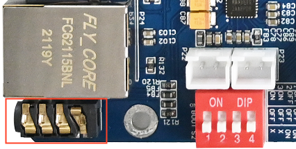

1. Set the parameters and enter the command in the following figure:

```plain
root@fl-imx6ull:~# amixer sset Headphone 110,110 //Configure the headphone volume             
root@fl-imx6ull:~# amixer cset name='Playback Volume' 255,255
root@fl-imx6ull:~# amixer cset name='Capture Volume' 0,31
root@fl-imx6ull:~# amixer sset 'Left Output Mixer PCM' on
root@fl-imx6ull:~# amixer sset 'Right Output Mixer PCM' on 
root@fl-imx6ull:~# amixer cset name='Capture Volume' 63,63
root@fl-imx6ull:~# amixer cset name='ADC PCM Capture Volume' 220,220 //Configure playback volume
root@fl-imx6ull:~# amixer cset name='Left Input Boost Mixer LINPUT2 Volume' 7
root@fl-imx6ull:~# amixer cset name='Left Input Boost Mixer LINPUT3 Volume' 7 
root@fl-imx6ull:~# amixer cset name='Right Input Boost Mixer RINPUT1 Volume' 7 
root@fl-imx6ull:~# amixer cset name='Right Input Boost Mixer RINPUT2 Volume' 7
root@fl-imx6ull:~# amixer sset 'Right Boost Mixer RINPUT1' off
```

NAU88C22 audio chip input the following command to set parameters:

```plain
root@fl-imx6ull:~# amixer sset "PCM" 255             
root@fl-imx6ull:~# amixer sset "Headphone" on
root@fl-imx6ull:~# amixer sset "Headphone" 63 
```

2. Playback test

```plain
root@fl-imx6ull:~# aplay /home/root/test.wav
Playing WAVE '/forlinx/audio/wo.wav' : Signed 16 bit Little Endian, Rate 22050 Hz, Stereo
```

3. Recording test

-r: sampling frequency; -f: sound effect format; -c: channel settings; -d: set the recording time; record.wav :name of the recording file, arecord usage can be viewed by arecord --help

```plain
root@fl-imx6ull:~# arecord -r 44100 -f S16_LE -c 2 -d 10 record.wav
Recording WAVE 'record.wav' : Signed 16 bit Little Endian, Rate 44100 Hz, Stereo
```

4. Play the recording:

```plain
root@fl-imx6ull:~# aplay record.wav 
Playing WAVE 'record.wav' : Signed 16 bit Little Endian, Rate 44100 Hz, Stereo
```

##### 3.1.8.2 Speaker Test

The built - in Class D power amplifier output terminals of the audio chip WM8960 are led out through two white XH2.54 - 2P sockets P22 and P23, which can drive two 8Ω speakers with a maximum output power of 1W. If you need to connect an external larger power amplifier, you can only obtain the signal from the headphone socket, not from the speaker interface. When testing the speaker, do not insert the headphones. Use the following commands for testing: 

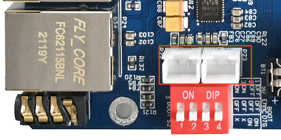

```plain
root@fl-imx6ull:~# mplayer /home/root/test.mp3
```

Printing information is as follows:

```plain
MPlayer 1.3.0-5.3.0 (C) 2000-2016 MPlayer Team

Playing /forlinx/audio/test.mp3.
libavformat version 57.25.100 (internal)
Audio only file format detected.
Load subtitles in /forlinx/audio/
……
```

##### 3.1.8.3 Video Play Test

Because the CPU does not have the hardware multimedia decoder and the CPU resources are limited, the broadcast video resolution and the frame number are not high.

-fs: full screen playback; -vo fdbdev: video driver for Framebuffer Device; /forlinx/video/test.mp4 is the video file to be played, for more usage of mplayer refer to mplayer --help.

```plain
root@fl-imx6ull:~# mplayer -fs -vo fbdev /home/root/test.mp4
Creating config file: /home/root/.mplayer/config
MPlayer 1.3.0-5.3.0 (C) 2000-2016 MPlayer Team

Playing /home/root/test.mp4.
libavformat version 57.25.100 (internal)
libavformat file format detected.
[mov,mp4,m4a,3gp,3g2,mj2 @ 0x887550]Protocol name not provided, cannot determine if input is local or a network protocol, buffers and access patterns cannot be configured optimally without knowing the protocol
[lavf] stream 0: video (mpeg4), -vid 0
[lavf] stream 1: audio (aac), -aid 0, -alang und
VIDEO:  [MP4V]  480x272  24bpp  23.976 fps  1077.9 kbps (131.6 kbyte/s)
==========================================================================
Opening video decoder: [ffmpeg] FFmpeg's libavcodec codec family
libavcodec version 57.24.102 (internal)
Selected video codec: [ffodivx] vfm: ffmpeg (FFmpeg MPEG-4)
==========================================================================
Clip info:
 major_brand: isom
 minor_version: 512
 compatible_brands: isomiso2mp41
 encoder: Lavf55.19.104
Load subtitles in /home/root/
==========================================================================
Opening audio decoder: [ffmpeg] FFmpeg/libavcodec audio decoders
AUDIO: 44100 Hz, 2 ch, floatle, 126.2 kbit/4.47% (ratio: 15775->352800)
Selected audio codec: [ffaac] afm: ffmpeg (FFmpeg AAC (MPEG-2/MPEG-4 Audio))
==========================================================================
[AO OSS] audio_setup: Can't open audio device /dev/dsp: No such file or directory
AO: [alsa] 44100Hz 2ch floatle (4 bytes per sample)
Starting playback...
Could not find matching colorspace - retrying with -vf scale...
Opening video filter: [scale]
Movie-Aspect is 1.78:1 - prescaling to correct movie aspect.
[swscaler @ 0xab8380]bicubic scaler, from yuv420p to bgra using C
[swscaler @ 0xab8380]No accelerated colorspace conversion found from yuv420p to bgra.
[swscaler @ 0xab8380]using unscaled yuv420p -> bgra special converter
VO: [fbdev] 480x272 => 484x272 BGRA  [fs]
Movie-Aspect is 1.78:1 - prescaling to correct movie aspect.
[swscaler @ 0xab8380]No accelerated colorspace conversion found from yuv420p to bgra.
VO: [fbdev] 480x272 => 484x272 BGRA  [fs]
A:   0.1 V:   0.0 A-V:  0.102 ct:  0.004   0/  0 ??% ??% ??,?% 0 0
[VD_FFMPEG] DRI failure.
A:  20.0 V:  20.0 A-V:  0.005 ct:  0.068   0/  0 24%  2%  5.2% 0 0


Exiting... (End of file)
```

PressCtrl + Cto stop the video or wait for Exiting.. (End of file) video playback stops.

#### 3.1.9 UART Serial Port Test

**Note:**

+ **The OKMX6ULL-C development board has five UART ports set by default, of which UART1 is used as Debug. UART2, UART3, UART4, UART5 are used as normal serial ports (TTL level);**

| **Silk screen** | **Software equipment** |
| :-------------: | :--------------------: |
|      UART2      |        ttymxc1         |
|      UART3      |        ttymxc2         |
|      UART4      |        Ttymxc3         |
|      UART5      |        Ttymxc4         |

+ **The maximum baud rate tested for communication with computers is 256000;**
+ **The UART supports 7 and 8 data bits and 1 and 2 stop bits;**
+ **Hard flow control is supported. See/Application Note/Hard Flow Control Opening Method for the usage method;**
+ **Supports parity check. Please refer to /Application Note/Parity Check Method for the testing procedure.**

Taking the UART2 of the development board as an example, it is connected to the computer through the TTL to USB module, so that the UART of the development board and the computer serial port tool software can send and receive data to test the serial port.

1. The UART2 of the development board is connected to the computer through the TTL to USB module. After the development board is powered on, it is identified as COM3 in the device manager of the computer (the user sets the parameters according to his actual identification of the COM port):

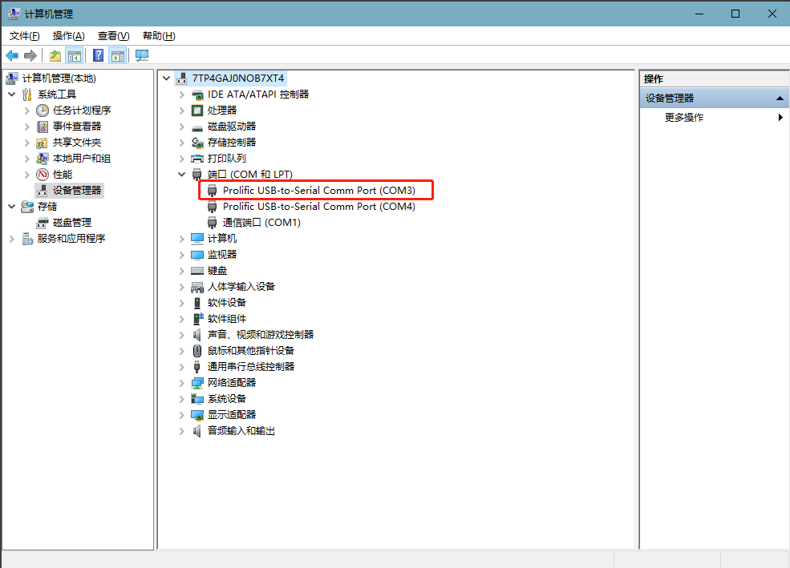

2. On the computer side, open the serial port tool and select the COM port identified by the computer. The baud rate is 115 200, the data bit is 8, the stop bit is 1, there is no check, no flow control, and the string abcdefg is sent at a fixed time of 1s. After setting the parameters, open the serial port:

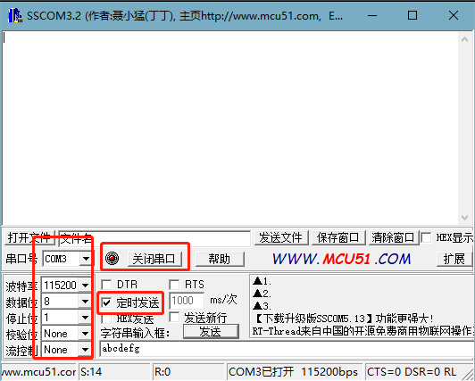

3. Open the test program on the development board terminal to conduct the receiving and sending test. The serial port parameter setting shall be consistent with the setting of the serial port tool. The test program will automatically send the string abcdefgh.

```plain
root@fl-imx6ull:~# fltest_cmd_uart /dev/ttymxc1 115200

Welcome to TTYtest! Press Ctrl + 'c' to stop.

/dev/ttymxc1,creat thread 1993839728 sucess
/dev/ttymxc1,creat thread 1985451120 sucess
sendTotal=    9 num =    1 send = abcdefgh
recvTotal=   8 num =  1 recv = abcdefgh                //Receive the information sent by the serial port tool
hex:0x61 0x62 0x63 0x64 0x65 0x66 0x67 0x68
sendTotal=   18 num =    2 send = abcdefgh
recvTotal=  16 num =  2 recv = abcdefgh
hex:0x61 0x62 0x63 0x64 0x65 0x66 0x67 0x68
```

From the printing information, UART2 can receive the information sent by the serial port tool.


The serial port tool can receive the data sent by the test program.

#### 3.1.10 SPI Interface Test

**Note: The OKMX6ULL-C development board is configured with 2-lane ecspi by default.**

| **Silk screen** | **Software equipment** |
| :-------------: | :--------------------: |
|      SPI1       |       spidev0.0        |
|      SPI2       |       Spidev1.0        |

Take spi1 as an example for testing, connect the SPI 1\_ MOSI and the SPI 1\_ MISO in short circuit, and run the fltest \_ cmd \_ spidev -D/dev/spidev 0.0.

```plain
root@fl-imx6ull:~# fltest_cmd_spidev -D /dev/spidev0.0
spi mode: 0
bits per word: 8
max speed: 500000 Hz (500 KHz)

FF FF FF FF FF FF
40 00 00 00 00 95
FF FF FF FF FF FF
FF FF FF FF FF FF
FF FF FF FF FF FF
DE AD BE EF BA AD
F0 0D

FF FF FF FF FF FF
40 00 00 00 00 95
FF FF FF FF FF FF
FF FF FF FF FF FF
FF FF FF FF FF FF
DE AD BE EF BA AD
F0 0D
```

#### 3.1.11  USB to Four Serial Port Test

**Note:**

+ **Support XR21V1414USB to Serial Chip Driver;**
+ **USB to four serial port conversion is an optional module. If you have the need for it, please contact the sales personnel of Forlinx Embedded.**

1\. After powering on the development board, connecting the USB to four serial port modules via USB HOST shows specific printing info on the terminal.

```plain
root@fl-imx6ull:~# usb 1-1.1: new full-speed USB device number 4 using ci_hdrc
cdc_xr_usb_serial 1-1.1:1.0: This device cannot do calls on its own. It is not a modem.
cdc_xr_usb_serial 1-1.1:1.0: ttyXR_USB_SERIAL0: USB XR_USB_SERIAL device
cdc_xr_usb_serial 1-1.1:1.2: This device cannot do calls on its own. It is not a modem.
cdc_xr_usb_serial 1-1.1:1.2: ttyXR_USB_SERIAL1: USB XR_USB_SERIAL device
cdc_xr_usb_serial 1-1.1:1.4: This device cannot do calls on its own. It is not a modem.
cdc_xr_usb_serial 1-1.1:1.4: ttyXR_USB_SERIAL2: USB XR_USB_SERIAL device
cdc_xr_usb_serial 1-1.1:1.6: This device cannot do calls on its own. It is not a modem.
cdc_xr_usb_serial 1-1.1:1.6: ttyXR_USB_SERIAL3: USB XR_USB_SERIAL device
```

2\. Check the usb device status by lsusb:

```plain
root@fl-imx6ull:~# lsusb
Bus 001 Device 003: ID 0bda:b720
Bus 001 Device 004: ID 04e2:1414                     //The vid and PID of the conversion chip
Bus 001 Device 002: ID 0424:2514
Bus 001 Device 001: ID 1d6b:0002  
```

Check if there is a production node under ‘dev’.

```plain
root@fl-imx6ull:~# ls /dev/ttyXRUSB*  
```

Printing information is as follows:

```plain
/dev/ttyXRUSB0  /dev/ttyXRUSB1  /dev/ttyXRUSB2  /dev/ttyXRUSB3
```

3\. The mapping between the four extended serial ports and their corresponding device nodes is shown in the diagram below:


4\. Test method refer to “UART Serial Port Test”.

#### 3.1.12 FlexCAN

Connect CAN1 to CAN2, H to H and L to L of the board.

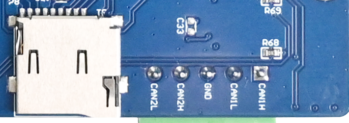

1. Set the CAN1 service as follows:

```plain
root@fl-imx6ull:~# ifconfig can0 down                                     //Turn off can1
root@fl-imx6ull:~# ip link set can0 up type can bitrate 125000 triple-sampling on //Set the baud rate
flexcan 2090000.can can0: writing ctrl=0x0e312085
IPv6: ADDRCONF(NETDEV_CHANGE): can0: link becomes ready
root@fl-imx6ull:~# ifconfig can0 up                                      //Turn on can1
```

Set the can device baud rate of can0 to the 125000.

2. Set the CAN2 service as follows:

```plain
root@fl-imx6ull:~# ifconfig can1 down                            //Turn off can2
root@fl-imx6ull:~# ip link set can1 up type can bitrate 125000 triple-sampling on
flexcan 2094000.can can1: writing ctrl=0x0e312085
IPv6: ADDRCONF(NETDEV_CHANGE): can1: link becomes ready
root@fl-imx6ull:~# ifconfig can1 up                             //Turn on can2
```

Set the can device baud rate of can1 to the 125000.

3. Set CAN2 to receive data:

```plain
root@fl-imx6ull:~# candump can1  &
[1] 755
```

CAN1 sending data：

```plain
root@fl-imx6ull:~# cansend can0 123#1234567891234567
```

CAN2 receiving data：

```plain
root@fl-imx6ull:~#   can1  123   [8]  12 34 56 78 91 23 45 67
```

#### 3.1.13  LCD Test

##### 3.1.13.1 Display

Select LCD display of different sizes and resolutions according to the uboot menu. The display is normal if there is no deviation from top to bottom, left to right, normal color display and no abnormal phenomena such as blurred screen.

##### 3.1.13.2 Backlight Test

1. View the current maximum screen backlight (7)

```plain
root@fl-imx6ull:~# cat /sys/class/backlight/backlight/max_brightness
7
```

2. View the current screen backlight value (6)

```plain
root@fl-imx6ull:~# cat /sys/class/backlight/backlight/brightness
6
```

3. Set the current screen backlight value (3)

```plain
root@fl-imx6ull:~# echo 3 > /sys/class/backlight/backlight/brightness
```

Check whether the setting is successful:

```plain
root@fl-imx6ull:~# cat  /sys/class/backlight/backlight/brightness
3
```

##### 3.1.13.3 Touch

To view the list of input devices:

The goodix-ts is a capacitive touch device and the iMX6UL TouchScreen Controller is a resistive touch device.

```plain
root@fl-imx6ull:~# export DISPLAY=:0.0
root@fl-imx6ull:~# DISPLAY=:0 xinput list
⎡ Virtual core pointer                          id=2    [master pointer  (3)]
⎜   ↳ Virtual core XTEST pointer                id=4    [slave  pointer  (2)]
⎜   ↳ iMX6UL TouchScreen Controller             id=6    [slave  pointer  (2)]
⎜   ↳ goodix-ts                                 id=7    [slave  pointer  (2)]
⎣ Virtual core keyboard                         id=3    [master keyboard (2)]
    ↳ Virtual core XTEST keyboard               id=5    [slave  keyboard (3)]
```

View information about the device with id=6 (resistive touch): c

```plain
root@fl-imx6ull:~# DISPLAY=:0 xinput list-props 6
Device 'iMX6UL TouchScreen Controller':
        Device Enabled (113):   1
        Coordinate Transformation Matrix (114): 1.000000, 0.000000, 0.000000, 0.000000, 1.000000, 0.000000, 0.000000, 0.000000, 1.000000
        Device Accel Profile (234):     0
        Device Accel Constant Deceleration (235):       1.000000
        Device Accel Adaptive Deceleration (236):       1.000000
        Device Accel Velocity Scaling (237):    10.000000
        Device Product ID (238):        0, 0
        Device Node (239):      "/dev/input/event1"
        Evdev Axis Inversion (240):     0, 0
        Evdev Axis Calibration (241):   <no items>
        Evdev Axes Swap (242):  1
        Axis Labels (243):      "Abs X" (232), "Abs Y" (233)
        Button Labels (244):    "Button Unknown" (231), "Button Unknown" (231), "Button Unknown" (231), "Button Wheel Up" (119), "Button Wheel Down" (120)
        Evdev Scrolling Distance (245): 0, 0, 0
        Evdev Middle Button Emulation (246):    0
        Evdev Middle Button Timeout (247):      50
        Evdev Third Button Emulation (248):     0
        Evdev Third Button Emulation Timeout (249):     1000
        Evdev Third Button Emulation Button (250):      3
        Evdev Third Button Emulation Threshold (251):   20
        Evdev Wheel Emulation (252):    0
        Evdev Wheel Emulation Axes (253):       0, 0, 4, 5
        Evdev Wheel Emulation Inertia (254):    10
        Evdev Wheel Emulation Timeout (255):    200
        Evdev Wheel Emulation Button (256):     4
        Evdev Drag Lock Buttons (257):  0
```

**Note:** **Because 8" resistive screen (800x600 resolution) and 10.4" resistive screen (800x600 resolution) have different touch directions when calibrating with xinput\_calibrate. The default is to support the touch direction of an 8" screen, if you use a 10" screen, you need to exchange the xy-axis of the touch as following method.**

At the command line you can enter:

```plain
root@fl-imx6ull:~# DISPLAY=:0 xinput --set-prop 'iMX6UL TouchScreen Controller' 'Evdev Axes Swap' 1
```

or:

```plain
root@fl-imx6ull:~# DISPLAY=:0 xinput set-prop '6' 'Evdev Axes Swap' 1
```

If you need default support for recognizing 10.4" screens, add the above command to /etc/rc.local. As follows:

```plain
lcd_screen_arg() {
    geom=`fbset | grep geometry`
    w=`echo $geom | awk '{ print $2 }'`
    h=`echo $geom | awk '{ print $3 }'`
    echo -n "${w}x${h}"
}
LCD_SIZE=`lcd_screen_arg`
if [ "$LCD_SIZE" == "800x480" ] ; then
        DISPLAY=:0 xinput --set-prop 'iMX6UL TouchScreen Controller ' 'Evdev Axes Swap' 1
elif  [ "$LCD_SIZE" == "640x480" ] ; then
       DISPLAY=:0 xinput --set-prop ' iMX6UL TouchScreen Controller ' 'Evdev Axes Swap' 1
elif  [ "$LCD_SIZE" == "800x600" ] ; then
       DISPLAY=:0 xinput --set-prop ' iMX6UL TouchScreen Controller ' 'Evdev Axes Swap' 1
fi
```

##### 3.1.13.4 Enter/Exit Standby

Enter Standby:

```plain
root@fl-imx6ull:~# echo "4" > /sys/class/graphics/fb0/blank
```

Exit Standby:

```plain
root@fl-imx6ull:~# echo "0" > /sys/class/graphics/fb0/blank
```

#### 3.1.14 Bluetooth Test

The development board integrates the wifi \& bt module and the RTL8723du module. Now test the Bluetooth function of the module.

The 8723du module is shown in the figure below

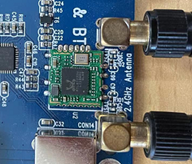

Use the tools from bluez5.37 for testing.

1. Turn on the bluez daemon

```plain
root@fl-imx6ull:~# source /usr/bin/bt.sh
Starting bluetooth
bluetoothd
```

2. Configure Bluetooth

```plain
root@fl-imx6ull:~# bluetoothctl		                        // Open the bluez Bluetooth tool.
Agent registered
[CHG] Controller 0C:CF:89:7C:79:E3 Pairable: yes
[bluetooth]# power on	                                    // Start the Bluetooth device.
Changing power on succeeded
[CHG] Controller 0C:CF:89:7C:79:E3 Powered: yes
[bluetooth]# pairable on	                                // Set it to pairing mode.
Changing pairable on succeeded
[bluetooth]# discoverable on	                            // Set it to discoverable mode.
Changing discoverable on succeeded
[CHG] Controller 0C:CF:89:7C:79:E3 Discoverable: yes
[bluetooth]# agent on	                                    // Start the agent.
Agent is already registered
[bluetooth]# default-agent	                              // Set the current agent as the default.
Default agent request successful
```

##### 3.1.14.1 Passive Pairing

After the above configuration, the Bluetooth device can be scanned on the mobile phone, and click the Bluetooth to try pairing


At the same time, the board end is printed as follows, enter yes:

```plain
[bluetooth]# rtk_btcoex: hci accept conn req
rtk_btcoex: connected, handle 0005, status 0x00
rtk_btcoex: Page success
rtk_btcoex: io capability request
[NEW] Device BC:2E:F6:57:30:68 honor
Request confirmation
[agent] Confirm passkey 500686 (yes/no):yes
```

Then click Bluetooth on the phone to pair:


Print message appears again at board end

```plain
[CHG] Device BC:2E:F6:57:30:68 UUIDs: 0000111f-0000-1000-8000-00805f9b34fb
[CHG] Device BC:2E:F6:57:30:68 Modalias: bluetooth:v010Fp107Ed1436
[CHG] Device BC:2E:F6:57:30:68 UUIDs: 0000046a-0000-1000-8000-00805f9b34fb
[CHG] Device BC:2E:F6:57:30:68 UUIDs: 00001105-0000-1000-8000-00805f9b34fb
……此处省略不关键信息
[agent] Authorize service 0000111e-0000-1000-8000-00805f9b34fb (yes/no):yes
```

Enter yes to match successfully

Remove the paired device

```plain
[honor]# devices	                                         //View the device connected
Device BC:2E:F6:57:30:68 honor
[bluetooth]# remove BC:2E:F6:57:30:68	                    //Remove the device
Device has been removed
[honor]# rtk_btcoex: disconn cmpl evt: status 0x00, handle 0006, reason 0x16
rtk_btcoex: process disconn complete event.
Agent unregistered
[DEL] Controller 0C:CF:89:7C:79:E3 BlueZ 5.54 [default]
```

Above print shows removal success.

##### 3.1.14.2 Active Pairing

In addition to passive pairing, it is also possible to send an active pairing request from the development board terminal

```plain
[bluetooth]# scan on	                             //Search for discoverable Bluetooth
rtk_btcoex: hci (periodic)inq start
Discovery started
[CHG] Controller 0C:CF:89:7C:79:E3 Discovering: yes
[NEW] Device BC:2E:F6:57:30:68 honor
[CHG] Device BC:2E:F6:57:30:68 RSSI: -50
[NEW] Device 58:85:A2:D0:1A:6C wjy
[bluetooth]# scan off	                                       //Stop searching
rtk_btcoex: hci (periodic)inq cancel/exit
Discovery stopped
[CHG] Controller 0C:CF:89:7C:79:E3 Discovering: no
[CHG] Device 4A:EF:9B:E7:AB:CB TxPower is nil
[CHG] Device 4A:EF:9B:E7:AB:CB RSSI is nil
[CHG] Device 58:85:A2:D0:1A:6C RSSI is nil
[CHG] Device BC:2E:F6:57:30:68 RSSI is nil
[bluetooth]# pair BC:2E:F6:57:30:68		                      //配对蓝牙
Attempting to pair with BC:2E:F6:rtk_btcoex: hci create connection, start paging
57:30:68
rtk_btcoex: connected, handle 0001, status 0x00
rtk_btcoex: Page success
rtk_btcoex: io capability request
[CHG] Device BC:2E:F6:57:30:68 Connected: yes
Request confirmation
[agent] Confirm passkey 772652 (yes/no):yes
```

At the same time, the cell phone interface appears with a pairing request click pairing, the board end print input yes; the cell phone end accepts the pairing, and the following print pairing success appears.

```plain
[CHG] Device BC:2E:F6:57:30:68 Modalias: bluetooth:v010Fp107Ed1436
[CHG] Device BC:2E:F6:57:30:68 UUIDs: 0000046a-0000-1000-8000-00805f9b34fb
[CHG] Device BC:2E:F6:57:30:68 UUIDs: 00001105-0000-1000-8000-00805f9b34fb
[CHG] Device BC:2E:F6:57:30:68 UUIDs: 0000110a-0000-1000-8000-00805f9b34fb
[CHG] Device BC:2E:F6:57:30:68 UUIDs: 0000110c-0000-1000-8000-00805f9b34fb
[CHG] Device BC:2E:F6:57:30:68 UUIDs: 00001112-0000-1000-8000-00805f9b34fb
[CHG] Device BC:2E:F6:57:30:68 UUIDs: 00001115-0000-1000-8000-00805f9b34fb
[CHG] Device BC:2E:F6:57:30:68 UUIDs: 00001116-0000-1000-8000-00805f9b34fb
[CHG] Device BC:2E:F6:57:30:68 UUIDs: 0000111f-0000-1000-8000-00805f9b34fb
[CHG] Device BC:2E:F6:57:30:68 UUIDs: 0000112f-0000-1000-8000-00805f9b34fb
[CHG] Device BC:2E:F6:57:30:68 UUIDs: 00001132-0000-1000-8000-00805f9b34fb
[CHG] Device BC:2E:F6:57:30:68 UUIDs: 00001200-0000-1000-8000-00805f9b34fb
[CHG] Device BC:2E:F6:57:30:68 UUIDs: 00001800-0000-1000-8000-00805f9b34fb
[CHG] Device BC:2E:F6:57:30:68 UUIDs: 00001801-0000-1000-8000-00805f9b34fb
[CHG] Device BC:2E:F6:57:30:68 UUIDs: 0000fe35-0000-1000-8000-00805f9b34fb
[CHG] Device BC:2E:F6:57:30:68 ServicesResolved: yes
[CHG] Device BC:2E:F6:57:30:68 Paired: yes
Pairing successful
[honor]#
```

Type quit to exit the command line.

```plain
[honor]# quit
```

##### 3.1.14.3 Files Receiving

The phone selects a file to send to the development board via Bluetooth (provided that a Bluetooth connection has been made).

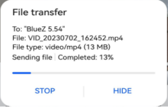

After sending, you can see the sent image file in the/home/root/directory.

```plain
root@imx6ulevk:~# ls
IMG_20210710_103755.jpg  
```

#### 3.1.14.4 Files Sending

```plain
root@imx6ulevk:~# obexctl	                                //Turn on the obexd daemon
[NEW] Client /org/bluez/obex
[obex]# connect BC:2E:F6:57:30:68		                  //Connect Bluetooth requiring communication
……
rtk_btcoex: rtk_vendor_cmd_to_fw: opcode 0xfc19
[NEW] Session /org/bluez/obex/client/session0 [default]
[NEW] ObjectPush /org/bluez/obex/client/session0
Connection successful
[BC:2E:F6:57:30:68]# send /home/root/IMG_20210710_103755.jpg		//Send files
```

At this point, the phone receives an inquiry to accept the file.


Click Accept to see that the file is already being transferred.


After the transmission, you can see the pictures on your mobile phone.

#### 3.1.15 LED Test

The LED 1 on the OKMX6ULL-Ccarrier board is the user LED, corresponding to the led 1 in the/sys/class/leds directory.

To view trigger conditions:

```plain
root@fl-imx6ull:~# cat /sys/class/leds/led1/trigger
[none] rc-feedback nand-disk mmc0 timer oneshot heartbeat backlight gpio
```

Where \[none] indicates that the current trigger condition for led 1 is none. The trigger condition can be modified by writing the above string to trigger.

User Control

When the led trigger condition is set to none, the user can control the on and off of the led lamp through the command.

```plain
root@fl-imx6ull:~# echo none > /sys/class/leds/led1/trigger
```

Control LED 1 on:

```plain
root@fl-imx6ull:~# echo 1 > /sys/class/leds/led1/brightness
```

Control LED 1 off:

```plain
root@fl-imx6ull:~# echo 0 > /sys/class/leds/led1/brightness
```

Set the trigger condition to the system heartbeat as follows:

```plain
root@fl-imx6ull:~# echo heartbeat > /sys/class/leds/led1/trigger
```

At this time, LED1 is controlled by the system clock and flashes according to a certain rhythm.

#### 3.1.16 Database Tests

SQLite3 is a lightweight, embedded database with a very low footprint, fast processing speed, and no database server processes to install. The OKMX6ULL-C board is ported to version 3.11.0 of sqlit3.

```plain
root@fl-imx6ull:~# sqlite3
SQLite version 3.11.0 2016-02-15 17:29:24
Enter ".help" for usage hints.
Connected to a transient in-memory database.
Use ".open FILENAME" to reopen on a persistent database.
sqlite>
```

To test SQLite software:

```plain
SQLite version 3.11.0 2016-02-15 17:29:24
Enter “.help” for usage hints.
Connected to a transient in-memory database.
Use “.open FILENAME” to reopen on a persistent database.
sqlite> create table tbl1 (one varchar(10), two smallint); // Create table tbl1
sqlite> insert into tbl1 values(‘hello!’,10); // Insert data ‘hello!|10’ into table tbl1
sqlite> insert into tbl1 values(‘goodbye’, 20); // Insert data ‘goodbye|20’ into table tbl1
sqlite> select * from tbl1; // Query the contents of table tbl1
hello!|10
goodbye|20
sqlite>
```

Exit the database:

```plain
sqlite> .exit                                              //Exit the database (or use the .quit command)                                                     
root@fl-imx6ull:~#
```

#### 3.1.17 FM Test

When the user needs to modify the CPU frequency, the OKMX6ULL-C development board supports adjusting the CPU frequency by instruction.

1. All cpufreq governor types supported in the current kernel:

```plain
root@fl-imx6ull:~# cat /sys/devices/system/cpu/cpu0/cpufreq/scaling_available_governors
interactive conservative userspace powersave ondemand performance
```

The userspace indicates user mode, in which other users' programs can adjust the CPU frequency.

2. View the frequency gear supported by the current CPU:

```plain
root@fl-imx6ull:~# cat /sys/devices/system/cpu/cpu0/cpufreq/scaling_available_frequencies
198000 396000 528000 792000
```

3. Modify to user mode and the frequency to 792000:

```plain
root@fl-imx6ull:~# echo userspace > /sys/devices/system/cpu/cpu0/cpufreq/scaling_governor
root@fl-imx6ull:~# echo 792000 > /sys/devices/system/cpu/cpu0/cpufreq/scaling_setspeed
```

4. To view the current frequency:

```plain
root@fl-imx6ull:~# cat /sys/devices/system/cpu/cpu0/cpufreq/cpuinfo_cur_freq
792000
```

#### 3.1.18 Temperature

**Note:**

+ **The CPU junction temperature in uboot is set to 105 degrees;**
+ **In the default setting of the kernel, if the junction temperature of the CPU exceeds 85 degrees, the frequency of the CPU will reduce; if the temperature exceeds 105 degrees, the CPU will restart.**

1\. Check the current temperature value of CPU:

```plain
root@fl-imx6ull:~# cat /sys/class/thermal/thermal_zone0/temp
51890                                 //The temperature is 51.890℃ (51890/1000).
```

2\. View CPU downclocking temperature values in the kernel

```plain
root@fl-imx6ull:~#  cat /sys/devices/virtual/thermal/thermal_zone0/trip_point_0_temp
85000		                               //The temperature 85℃
```

3\. View CPU restart temperature values in the kernel.

```plain
root@fl-imx6ull:~#  cat /sys/devices/virtual/thermal/thermal_zone0/trip_point_1_temp
105000		                                //The temperature 105℃
```

#### 3.1.19  Power up Self Start Settings

In the file system, set the script for the application to boot automatically. The user can add the program that needs to boot automatically in the script. For the specific setting method, please refer to the relevant files in the application note.

## 4\. Development Board Interface Function Test

**Note:**

+ **The user performs this section when using the screen and the Qt file system, and can skip the section if not using Qt operations;**

- **This section focuses on the functions in Qt, the test default device connection is normal, the driver is loaded normally, and it is recommended to complete the command line function test in the test interface function;**

+ **Command line test program source code path: user data/Linux/test program/qt5.6.**

The test program used in this section has been integrated in the Demo provided by Forlinx, so it will be operated directly without any description of the file source.

In the Qt file system, the ported Qt is 5.6.2. It utilizes the X protocol for Qt display, and the desktop manager is matchbox. Upon booting the development board, the screen will first display the Forlinx logo, followed by a boot animation. Afterward, it will enter the Qt desktop interface shown in the image below:


### 4.1 NIC Configuration

Click the small mouse button in the upper right corner of the desktop icon, select "Preferences", and then click the Ethernet button on the left to configure the network. The default mode is DHCP, or static IP. Click the keyboard in the upper right corner to set it.


The IP setting interface is as follows:


Configuration: Set the IP allocation method. DHCP -- Set the dynamic IP allocation. MANUAL -- Set the static IP.

IP address: The static IP is valid, and the IP address is set.

Netmask: Static IP is valid. Set the subnet mask.

Gateway: The static IP is valid. Set the gateway.

### 4.2 PING Test

Run the PING test program Ping to enter the following interface (ensure that the network has been configured, enter the IP address or domain name to be tested in the hostname column, and then click the ping button. If the following interface appears, the network test is successful:


### 4.3 4G Module Test

At present, the supported 4G module is Quectel EC20. Click the Qt5 4G icon on the desktop to enter the 4G setting interface to test the 4G dial-up Internet access function.


Connect the 4G module, power up the module, and the development board. Select the 4G module according to the actual situation. Take EC20 as an example. Click ec20 to dial. No information is printed during dialing. After dialing, there will be a prompt as shown in the following figure:


After successful dialing, enter the IP of the same network segment in the IP column for ping test:


### 4.4 GPRS Module Test

**Note: The GPRS module and the development board are connected by serial port. Users can use the GPRS module produced by Forlinx or the serial port GPRS module purchased by themselves.**

After making sure that the module and the UART3 serial port of the development board are connected and powered up okay, start the development board and run the GPRS test program Gprs.

Select the serial port ttymxc2 connected to the GPRS module, set the serial port baud rate, data bit, parity check, stop bit and hardware flow control, and click the set button to set them.

Add the phone number of the other party in the Phone column, and click the call and msg-s buttons respectively to make a call and send a short message;

GPRS Internet access function test: Click the GPRS button on the interface to dial up the Internet;

The user can test whether the GPRS dialing is successful by clicking the Ping button:


### 4.5 Watchdog Test

Run the watchdog test program Watchdog to enter the following interface:


The feed dog check box in the upper left corner can select whether to feed the dog. When the feed dog is checked, click the open watchdog in the lower part to open the watchdog. The application will feed the dog once in 10s, so the system will not restart.

When feed dog is not checked, the system will be reset after open watchdog when time files reaches 60s.

### 4.6 WIFI Module Test

This section describes how to test the on-board WIFI module rtl8723bu. Before testing, please make sure that the WIFI module has been soldered and the antenna has been connected.

Run the Qt 5.6 WiFi test program and click on the keyboard icon in the top-right corner to open the virtual keyboard. Then, type in the username, password, and other necessary information.


"SSID" refers to the name of the WiFi hotspot while "PAWD" refers to the WiFi password. "IP" is the IP address that you want to test using ping. Once all of the necessary information has been inputted, simply click the "Connect" button to establish the connection. Once the connection is established, you can see the automatically obtained IP address in the left dialog box. At this point, you can click on the "Ping" button to perform a ping test.


### 4.7 Play/Record Test

To run the audio test program, open the Audio application and enter the audio testing interface.

1\. Recording Test

The development board provides two microphone interfaces: one is the on-board microphone U16, and the other is a 3.5mm standard stereo audio interface for the MIC. The system default is to use the on-board microphone. When the MIC has an external microphone device plugged in, the on-board microphone U16 is automatically disconnected and an external microphone device is used for recording.

During the recording test, click the "record" button, then speak into the microphone for a few seconds, and then click the "stop" button. After that, you should see a temporary file added to the song list. Click the "play" button to playback the recording.

2\. Playback test

The internal D-class amplifier output of the WM8960 audio chip is connected to two XH2.54-2P white connectors labeled as P5 and P6. It can drive two 8Ω speakers, with a maximum output power of 1W. If you need to connect a larger power amplifier, you can only get the signal from the headphone jack and not from the speaker interface.

You can choose to test with either headphones or speakers for the playback test. After connecting the device, click on the “Add” button to select the audio file that you want to play, and then click on the “Play” button. If you can hear the sound of the music, the playback is normal.


### 4.8 RTC Clock Drive Test

**Note: Ensure that button cell batteries are installed on the board and the battery voltage is normal.**

RTC testing is done by setting the time using testing software. After setting the time, you can disconnect the power and then power it up again. Run the testing software again and check if the RTC clock is synchronized.

Run the RTC to test the software RTC, and the following interface appears:


Click set to set the system time, click save to save the time setting, and then you can power off and power on again after some time, run the RTC test software again to read the time, and you can see that the RTC time has been synchronized.

### 4.9 Serial Port Test

This test takes UART2 (ttymxc1) as an example to test the serial port by sending and receiving data between the UART of the development board and the computer serial port tool software.

1\. First, connect the development board and computer with the TTL to the USB module, then power up the development board and check in the computer's device manager recognized as COM9 (users set the parameters with their actual recognized COM port);

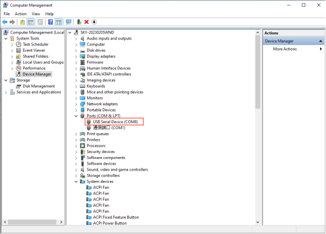

2\. open the computer serial port tool, set the relevant serial port parameters, baud rate 9600, 8 data bits, 1 stop bit, no parity, no flow control, timed to send the string abcdefg, and set the completion of the open serial port:


3. Click the Qt5 SerialPort serial port test program on the QT desktop, select the port number, and set the relevant serial port parameters to be consistent with the computer serial port tool parameters, as shown in the following figure:


4\. Open the serial port, and receive the data sent by the computer serial port tool at the receiving serial port. Send window to write the data to be sent; click Send Data


5\. The computer serial port tool receives the data sent by the QT program, and the UART2 serial port of the development board receives and sends normally.


### 4.10 FlexCAN Test

The development board has two CANs, and this test uses CAN1 on the development board to connect with CAN1 on another development board to send data to each other. Connect H of development board CAN1 to H of CAN1 of another development board, and connect L to L. Users can use the CAN tool to test according to the actual situation.

Open the desktop program Qt5 can, as shown in the following figure. CAN1 and CAN2 correspond to can0 and can1 respectively in the interface. Select can0 to open CAN1:


The development board sends the data 123456, and the other end sends the data 654321. The 654321 of the data received by the development board is shown in the following figure.


The CAN1 of another development board receives the data 123456 as follows


### 4.11 RGB Screen Backlight Adjustment Test

Adjust the progress bar left and right to adjust the backlight brightness as follows:


## 5\. Development Board System Flashing

The OKMX6ULL-C development board currently supports both OTG and SD card programming. The flashing tool for OTG and SD card is provided in the user information/Linux/burning tool folder. The flashing tool contains the factory image, and the user can select any method to flash the image.

When the user makes changes to only part of the image, the image can be updated separately.

When debugging the kernel, you can choose to use the network to update the running image and download the image to the DRAM of the development board to run.

### 5.1 Image Required for Flashing

**Note:**

+ **eMMC core board, support both qt and console file system, burn-in tool, and factory default qt version;**
+ **Factory image path: User Profile \\ Linux \\ Image.**

OKMX6ULL-C development board user information provides a factory-flashed image; the image includes the following parts: BootLoader image, kernel image, device tree image, Logo image, file system, and module files.

|                         **Image**                         | **eMMC SoM**                                                 |
| :-------------------------------------------------------: | ------------------------------------------------------------ |
|                        BootLoader                         | <font style="color:#000000;">u-boot-imx6ull14x14evk\_emmc.imx</font> |
|                       Kernel image                        | <font style="color:#000000;">zImage</font>                   |
|                     Device tree image                     | <font style="color:#000000;">okmx6ull-c-emmc.dtb</font>      |
|                           Logo                            | <font style="color:#000000;">logo</font>                     |
|                        File system                        | <font style="color:#000000;">rootfs-console.tar</font>       |
|                                                           | <font style="color:#000000;">rootfs-qt.tar</font>            |
| Module files (extracted to the file system when flashing) | modules.tar.b                                                |

### 5.2 TF Card Burning

(DIP Switch Setting Reference “[Flashing and Boot Settings](https://forlinx-book.yuque.com/okypkp/okmx6ull-c/bugny66046z7hag7#rSHCX)” Chapter). Turn the dial switch to the SD card flashing position.

#### 5.2.1 Making TF Flashing Card

**Note: Please use the virtual machine but not the card, not the physical mechanism card!**

Copy the file emmc-sdburn.tar.bz2 to any directory on your Ubuntu system, assuming /home/forlinx/work.

+ User Profile\\Linux\\Burning Tool\\emmc-sdburn.tar.bz2 for 4G/8G EMMC file system.

1\. Format the TF card to FAT32 format using a formatting tool before use;

2\. Copy emmc-sdburn.tar.bz2 to any directory under ubuntu system to decompress it. For example/home/forlinx/work;

3\. Insert the TF card into the USB port of your computer using a USB card reader (VMware VM users can use the arrow pointing to the icon below to connect the flash drive to the VM if it is not recognized by the VM).


4\. Wait for the virtual machine to detect the TF card and display the directory. Then proceed with the following writing operations.\*\* Enter /home/forlinx/work/nand-burnsd directory, execute script:

```plain
forlinx@ubuntu:~/work/nand-burnsd$ sudo ./burn.sh
```

After executing the above command, the terminal will list the hard disk or U disk of the computer, select your own SD card accordingly, and press Enter.

Note: You can determine whether your USB flash disk is SDA/SDB/SDC according to its capacity. For example, if the capacity of your USB flash disk is 8g, its size is 7761920 KB ≈ 8G. It is recommended that you do not insert multiple USB flash disks at the same time to avoid confusion.

Take our operation as an example:

```plain
################################################################################

This script will create a bootable SD card from custom or pre-built binaries.

The script must be run with root permissions and from the bin directory of
the SDK

Example:
 $ sudo ./6ullsdburn.sh

Formatting can be skipped if the SD card is already formatted and
partitioned properly.

################################################################################

Availible Drives to write images to: 
#  major   minor    size   name 
1:   8       16    7761920 sdb
Enter Device Number: 1		//Here please select 1

sdb was selected

Checking the device is unmounted
 unmounted /dev/sdb1

sdb1  sdb2   sdb3
7757824


################################################################################

   Detected device has 1 partitions already

   Re-partitioning will allow the choice of 1 partitions

################################################################################

Would you like to re-partition the drive anyways [y/n] : y		//输入y，回车，等待制卡完成

Now partitioning sdb ...


################################################################################

		Now making 1 partitions

################################################################################

1+0 records in
1+0 records out
1024 bytes (1.0 kB, 1.0 KiB) copied, 0.0428509 s, 23.9 kB/s
DISK SIZE - 7948206080 bytes
Checking that no-one is using this disk right now ... OK

Disk /dev/sdb: 7.4 GiB, 7948206080 bytes, 15523840 sectors
Units: sectors of 1 * 512 = 512 bytes
Sector size (logical/physical): 512 bytes / 512 bytes
I/O size (minimum/optimal): 512 bytes / 512 bytes

>>> Created a new DOS disklabel with disk identifier 0x38224bb5.
Created a new partition 1 of type 'W95 FAT32 (LBA)' and of size 500 MiB.
/dev/sdb2: 
New situation:

Device     Boot Start     End Sectors  Size Id Type
/dev/sdb1       20480 1044479 1024000  500M  c W95 FAT32 (LBA)

The partition table has been altered.
Calling ioctl() to re-read partition table.
Syncing disks.

################################################################################

		Partitioning Boot

################################################################################
mkfs.fat 3.0.28 (2015-05-16)
mkfs.fat: warning - lowercase labels might not work properly with DOS or Windows
Mount the partitions 
Emptying partitions 
################################################################################

	Copying files now... will take minutes

################################################################################

Copying boot partition
copy sdrun/ target/ to SD
Buring the u-boot.imx to sdcard
129+0 records in
129+0 records out
132096 bytes (132 kB, 129 KiB) copied, 0.161529 s, 818 kB/s
431+0 records in
431+0 records out
441344 bytes (441 kB, 431 KiB) copied, 0.422838 s, 1.0 MB/s
Syncing....

Un-mount the partitions 

Remove created temp directories  

Operation Finished
```

5\. After the card-making process is completed, you should see two directories, "sdrun" and "target," contained within the boot partition.


#### 5.2.2 Introduction to Flashing Card

**Note: The eMMC file system is QT version by default. If the conslot version is used, the rootfs-console.tar.bz2 in the \\ Linux \\ image of the user data can be renamed as the rootfs.tar.bz2, replacing the file of the same name of the target.**

The prepared burning card contains two folders, sdrun and target:


1\. The contents in the sdrun folder are used to program the boot system, and generally do not need to be modified;

2\. The contents of the "target" directory will be written to the flash memory chip. If the user has made modifications to the image and needs to replace the image file, they only need to replace the corresponding file in the "target" directory while maintaining the same file name. Afterward, the system can be re-flashed. Introduction of files in the “target” directory of the SD card burning:

| **Image Name**                                               | **Description**                                              |
| ------------------------------------------------------------ | ------------------------------------------------------------ |
| <font style="color:#000000;">u-boot-imx6ull14x14evk_emmc.imx</font> | BootLoader Image                                             |
| <font style="color:#000000;">zImage</font>                   | Kernel Image                                                 |
| <font style="color:#000000;">okmx6ull-c-emmc.dtb</font>      | Device Tree Image.                                           |
| <font style="color:#000000;">logo.bmp</font>                 | Boot Logo Image.<br/>If users want to replace the boot logo image, they only need to create<br />a new BMP-format image (refer to the application notes in the user<br />materials for the creation method), name it <font style="color:#000000;">logo.bmp</font> and replace this file. |
| <font style="color:#000000;">rootfs-qt.tar.bz2</font>        | File system with a Qt interface and Qt libraries.            |
| <font style="color:#000000;">modules.tar.bz2</font>          | Module files (to be decompressed into the file system during programming). |

#### 5.2.3 TF Flashing Method

Insert the TF card made in the previous section and set the dial switch as shown in the following figure. 3\. 4 is ON, and 1 and 2 are OFF, as shown in the figure below. At this time, flash the contents of the target in the TF card into the EMMC.

It takes a long time to burn, and wait for the system to finish flashing, and then the serial port prints the information:


At the same time, the LED3 on the carrier board blinks.

After the programming is completed, power off the device. Set the DIP switches 1, 2, 3, and 4 to the OFF position. Then power on the device again, and it will boot from the EMMC. 

### 5.3 OTG Flashing System

#### 5.3.1 OTG Introduction to Flashing Tools

**Note: The default file system of the eMMC SoM is the qt version of the burning tool, if you use the console version of the file system, you can rename the file `rootfs-console.tar.bz2` located in the path `mfgtools\Profiles\Linux\OS Firmware \files\linux` to `rootfs-qt.tar.bz2`.**

OTG flashing using NXP developed board firmware burning tool mfgtools, can burn uboot, image, dtb, rootfs and other images. The following is a brief introduction to the files that users may use in the flashing process.

The path is: user header\\ Linux\\ shooting tool\\ OTG shooting\\ mfgtools to make the starting path.

| **File Name**                   | **path**                                                     | **Description**                                              |
| ------------------------------- | ------------------------------------------------------------ | ------------------------------------------------------------ |
| mx6ull-4gemmc-512mddr-qt5.6.vbs | <font style="color:#000000;">mfgtools</font>                 | For flashing eMMC core board-related images                  |
| ucl2.xml                        | <font style="color:#000000;">Mfgtools\\Profiles\\Linux\\OS Firmware</font> | Defines the specific operation steps and contents of the<br />flashing process, and the user can view the file<br />when it involves the instruction of single-step update. |
| Boot-related images             | <font style="color:#000000;">Mfgtools\\Profiles\\Linux\\OS Firmwarefirmware</font> | The folder contents are used for booting and system<br /> flashing and generally do not require modification. |
| Image burned into flash         | <font style="color:#000000;">Mfgtools\\Profiles\\Linux\\OS Firmware\\files\\linux</font> | The contents of the folder are used to burn into Flash<br /> and can be used to burn your image by renaming<br />it to the same name and replacing it after the user modifies the image. |

#### 5.3.2  OTG Flashing Method

**Note: When using OTG flashing, you cannot insert an SD card.**

+ User Profile\\Linux\\tools\\OTG\\ mfgtools.rar is the path where the OTG burning tools are located.

mx6ull-4gemmc-512mddr-qt5.6.vbs        flash 4GeMMC+512MDDR system

1. First, copy the burn tool Mfg tool to windows and unzip it; the path of the burn tool is shown as below:

+ User Profile\\Linux\\Burning Tools\\ mfgtools.zip

2. The dip switches are set to 1 and 2 for ON and the others for OFF.

3. Double-click on "mx6ull-4gemmc-512mddr-qt5.6.vbs" (the script has been written, directly burned), as shown below:


4\. Insert USB to Type-C to OTG socket, as shown below:

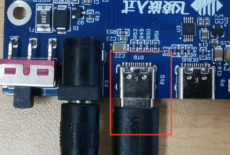

5\. The development board is powered on and automatically recognized as HID, as shown in the figure:


6\. Click start to start burning the system, in the middle of the pop-up formatting dialog box, click "Cancel" formatting options, or regardless of it, until the burning is complete. As shown in the picture:


7\. After the system is flashed, "Done" appears, and then click "Stop" to stop. Click "Exit" again to close the flashing tool. Power off, turn the DIP switch to 1, 2, 3 and 4 for OFF, power on again, and the EMMC starts.

### 5.4 Single-step Kernel Update

#### 5.4.1 Update eMMC Image Separately

After system startup, place the device tree to be replaced on a USB drive and insert it into the development board. In the terminal, enter the command to list USB drive files:

```plain
root@fl-imx6ull:~# ls /run/media/sda1/  
```

Printing information is as follows:

```plain
imx6ul-14x14-evk-c-emmc.dtb
logo.bmp
u-boot.imx
zImage
zImagebak
```

Update u-boot separately

```plain
root@fl-imx6ull:~# echo 0 > /sys/block/mmcblk1boot0/force_ro    //Enable the writing
root@fl-imx6ull:~# dd if=/run/media/sda1/u-boot.imx of=/dev/mmcblk1boot0 bs=512 seek=2 
//将uboot镜像写入分区
758+0 records in
758+0 records out
388096 bytes (388 kB, 379 KiB) copied, 0.132975 s, 2.9 MB/s
root@fl-imx6ull:~# echo 1 > /sys/block/mmcblk1boot0/force_ro   //Turn off the writing
root@fl-imx6ull:~# mmc bootpart enable 1 1 /dev/mmcblk1   //Enable partition 1 to start
root@fl-imx6ull:~# sync   //Save
root@fl-imx6ull:~# reboot    //Restart
```

To update the device tree and kernel separately

```plain
root@fl-imx6ull:~# cp /run/media/sda1/okmx6ull-c-emmc.dtb  /run/media/mmcblk1p1/ okmx6ull-c-emmc.dtb
root@fl-imx6ull:~# cp /run/media/sda1/zImage  /run/media/mmcblk1p1/zImage
root@fl-imx6ull:~# sync
root@fl-imx6ull:~# reboot
```

After restarting, the device tree configuration will take effect.