# OKMX6ULL-C\_User’s Hardware Manual\_V1.1

Document classification: □ Top secret □ Secret □ Internal information ■ Open

## Copyright

The copyright of this manual belongs to Baoding Folinx Embedded Technology Co., Ltd. Without the written permission of our company, no organizations or individuals have the right to copy, distribute, or reproduce any part of this manual in any form, and violators will be held legally responsible.

Forlinx adheres to copyrights of all graphics and texts used in all publications in original or license-free forms.

The drivers and utilities used for the components are subject to the copyrights of the respective manufacturers. The license conditions of the respective manufacturer are to be adhered to. Related license expenses for the operating system and applications should be calculated/declared separately by the related party or its representatives.

## Application Scope

This manul is mainly applicable to the Forlinx OKMX6ULL-C platform.

## Revision History

|    Date    | User Manual Version | SoM Version | Carrier Board Version |                       Revision History                       |
| :--------: | :-----------------: | :---------: | :-------------------: | :----------------------------------------------------------: |
| 11/06/2024 |        V1.0         |    V1.1     |         V1.0          |      OKMX6ULL-C\_User’s Hardware Manual Initial Version      |
| 09/07/2025 |        V1.1         |    V1.1     |         V2.0          | CPU junction temperature is added to the introduction of the SoM. |

## Overview

There are total four chapters:

Chapter 1. is CPU overview, briefly introducing its performance and applications;

Chapter 2. is comprehensive introduction to the SoM, including connector pins explanations and function introductions;

Chapter 3. is comprehensive introduction to the development board, divided into multiple chapters, including both hardware principles and simple design ideas;

Chapter 4. mainly describes the board’s power consumption performance and other considerations.

## 1\. Introduction to iMX6ULL

Freescalei.MX6ULL extends the i.MX6 series, offering a high-performance, ultra-efficient processor sub-series built on advanced ARM Cortex-A7 cores operating at up to 800MHz. i.MX6ULL application processor features an integrated power management module, which reduces the complexity of external power supplies and simplifies power-up sequences. Target applications include:

· Automotive Telematics

· IoT Gateway

· HMI

· Home Energy Management System

　　· Smart Energy Information Concentrator

　　· Intelligent Industrial Control System

　　· Electronic POS Equipment

　　·Portable Medical Equipment

　　· Printer and 2D Scanner

　　　……

**i.MX6ULL Block Diagram**

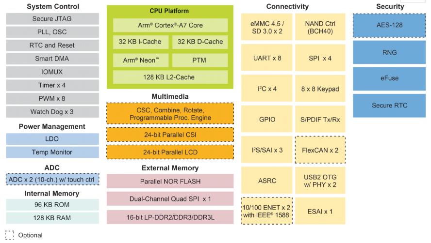

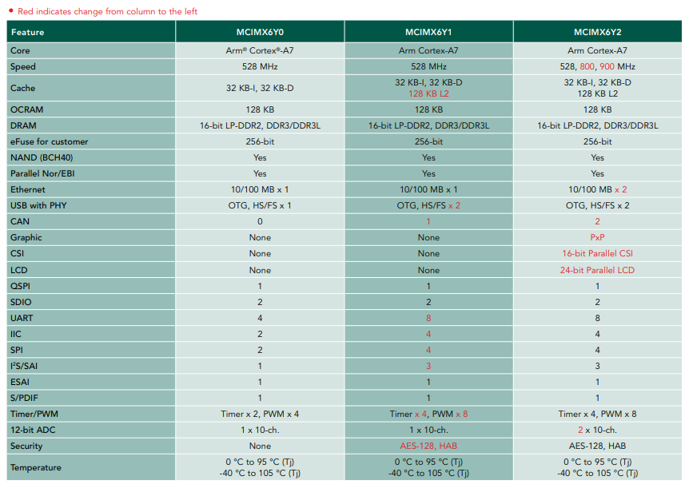

FETMX6ULL-C SoM CPU is based on the MCIMX6Y2.

Each model in the i.MX6ULL sub-series offers multiple memory interfaces, including 16-bit LPDDR2, DDR3, DDR3L, standard NAND flash, NAND flash with built-in management units, NOR flash, eMMC, Quad SPI, as well as peripheral interfaces for connecting devices such as WLAN, Bluetooth, GPS, displays, and camera sensors. i.MX6ULL sub-series is supported by discrete device power supply circuit.

For more information about the i.MX6ULL, please visit the NXP (formerly Freescale) official website:

URL：

[https://www.nxp.com/products/processors-and-microcontrollers/arm-processors/i.mx-applications-processors/i.mx-6-processors/i.mx-6ull-single-core-processor-with-arm-cortex-a7-core:i.MX6ULL](https://www.nxp.com/products/processors-and-microcontrollers/arm-processors/i.mx-applications-processors/i.mx-6-processors/i.mx-6ull-single-core-processor-with-arm-cortex-a7-core:i.MX6ULL)

## 2\. FETMX6ULL-C SoM Description

### 2.1 FETMX6ULL-C SoM Appearance

FETMX6ULL-C SoM

**Front**

**Back**

### 2.2 FETMX6ULL-C SoM Dimension Diagram

FETMX6ULL-C SoM Dimension Diagram

Structure size: 40mm×29mm

Plate making process: 1.0mm thickness, 8-layer immersion gold PCB.

Connector: 2 x 0.5mm pitch, 80pin board-to-board connectors. You can directly contact our sales to get a connector size chart in the appendix for a specific connector model.

Four mounting holes (2.2mm) are reserved at the four corners of the SoM to facilitate the installation of fixing screws and to improve the reliability of the product connection so that the product can be used in vibration environments.

Please refer to the development board design and use SMT nuts of M2 with L=2mm or L=2.5mmon the carrier board. Please refer to the following figure for the specifications of the SMT nuts.

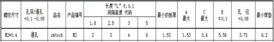

### 2.3 Performance Parameters

#### 2.3.1 System Main Frequency

|    **Name**    | **Specification** |             |             |          | **Description** |
| :------------: | :---------------: | ----------- | ----------- | -------- | :-------------: |
|                |    **Minimum**    | **Typical** | **Maximum** | **Unit** |                 |
| Main Frequency |         —         | —           | 800         | MHz      |        —        |
|   RTC clock    |         —         | 32.768      | —           | KHz      |        —        |

#### 2.3.2 Power Parameter

|       **Parameter**       | **Pin Number** | **Specification** |             |             |          |    **Description**    |
| :-----------------------: | :------------: | :---------------: | ----------- | ----------- | -------- | :-------------------: |
|                           |                |    **Minimum**    | **Typical** | **Maximum** | **Unit** |                       |
| Main Power Supply Voltage |      VSYS      |        2.4        | 3.3         | 3.6         | V        |           —           |
|      No-load current      |       —        |        130        | —           | 130         | mA       |           —           |
|     High-load current     |       —        |        154        | —           | 190         | mA       | Video playback status |

#### 2.3.3 Operating Environment

|   **Parameter**   |                       | **Specification** |             |             |          |                       **Description**                        |
| :---------------: | --------------------- | :---------------: | ----------- | ----------- | -------- | :----------------------------------------------------------: |
|                   |                       |    **Minimum**    | **Typical** | **Maximum** | **Unit** |                                                              |
| Temperature Level | Operating Environment |        -40        | 25          | +85         | ℃        | Industrial grade, the CPU junction temperature is increased during testing. |
|                   | Storage Environment   |        -40        | 25          | +125        | ℃        |                                                              |
|     Humidity      | Operating Environment |        10         | —           | 90          | ％RH     |                       No condensation                        |
|                   | Storage Environment   |         5         | —           | 95          | ％RH     |                                                              |

During the environmental adaptability test, Forlinx increased the CPU junction temperature to ensure the normal progress of the test. This measure is only applicable to the test phase.

In actual high - temperature usage scenarios, the CPU will automatically reduce its frequency under high temperatures. Moreover, long - term operation under high - temperature conditions will affect the CPU's service life. Please evaluate according to the actual application scenarios.

If you need methods to adjust the junction temperature, frequency reduction temperature, and amplitude, please contact Forlinx's FAE. 

#### 2.3.4 SoM Interface Speed

|          **Parameter**          | **Specification** |             |             |          | **Description** |
| :-----------------------------: | :---------------: | ----------- | ----------- | -------- | :-------------: |
|                                 |    **Minimum**    | **Typical** | **Maximum** | **Unit** |                 |
| Serial Port Communication Speed |         —         | 115200      | —           | bps      |        —        |
|     SPI Communication Speed     |         —         | —           | 52          | Mbps     |        —        |
|     IIC Communication Speed     |         —         | 100         | 400         | Kbps     |        —        |
|     CAN Communication Speed     |         —         | —           | 1           | Mbps     |        —        |
|             SD/SDIO             |         —         | —           | 200         | Mbps     |        —        |
|       USB interface speed       |         —         | —           | 480         | Mbps     |        —        |
|       AD conversion time        |        0.7        | —           | 1.25        | us       |   Fadc=40 MHz   |

#### 2.3.5 ESD  Features

|          **Parameter**          | **Specification** |             | **Unit** |          **Description**          |
| :-----------------------------: | :---------------: | ----------- | :------: | :-------------------------------: |
|                                 |    **Minimum**    | **Maximum** |          |                                   |
| ESD HBM(ESDA/JEDEC JS-001-2017) |                   | 2000        |    V     | Applicable to all pins of the SoM |
| ESD CDM(ESDA/JEDEC JS-002-2018) |                   | 500         |    V     | Applicable to all pins of the SoM |

**Note：**

- **The above data is from the chip manual;**
- **All SoM outgoing signals are electrostatic sensitive, requiring effective protection in carrier board design. Special attention to electrostatic protection is also needed during transportation, assembly, and use.**

### 2.4 SoM Interface Speed

| **Function** | **Quantity** | **Parameter**                                                |
| :----------: | :----------: | ------------------------------------------------------------ |
|     LCD      |      1       | Up to RGB 888 24-bit, up to WXGA (1366 X 768));              |
|    CAMERA    |      1       | 8-bit parallel interface (DVP) supporting up to 5-Megapixel; |
| SD/MMC/SDIO  |      ≤2      | Supports 1-bit or 4-bit transmission modes for SD and SDIO cards, with a maximum clock of 50MHZ |
|     USB      |      2       | USB 2.0 (supporting up to 480 Mbps) with integrated HS USB Phy. |
|     SAI      |      ≤3      | Supports up to three I2S Audio;                              |
|    SPDIF     |      1       | Sony Philips digital audio interface                         |
|     UART     |      ≤8      | Each supports up to 5.0 Mbps;                                |
|    eCSPI     |      ≤4      | Full-duplex enhanced synchronous serial interface supporting data rates up to 52 Mbit/s. It can be configured to support master/slave mode with four chip selects to support multiple peripherals. |
|     IIC      |      ≤4      |                                                              |
|   Ethernet   |      ≤2      | 10/100Mbps adaptive;                                         |
|     PWM      |      ≤8      | 16-bit;                                                      |
|     JTAG     |   Support    |                                                              |
| KeyPad Port  |   Support    | 8\*8；                                                       |
|     CAN      |      ≤2      | CAN protocol version 2.0B specification                      |
|     ADC      |     ≤10      | Two 12-bit analog-to-digital converters (ADC) with support for up to 10 input channel. |
|     eSAI     |      1       |                                                              |

**Note: The parameters in the table are the theoretical values of hardware design or CPU.**

### 2.5  FETMX6ULL-C SoM Pins Definition

#### 2.5.1 FETMX6ULL-C SoM Pins Schematic

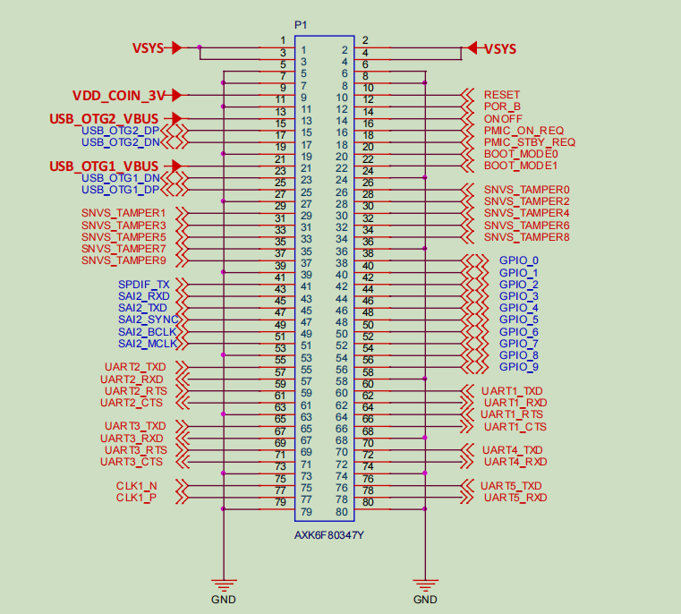

#### 2.5.2 FETMX6ULL-C SoM Pins Description

**Note1:**

**Num ——SoM connector pin no.:**

**Ball —— CPU pin ball no.**

**GPIO ——CPU pin general I/O port serial number**

**Vol  ——Pin signal level**

**Note2:**

**Signal Name——SoM connector network name**

**Pin Description—— SoM Pin Signal Descriptions**

**Default function-All pin functions of the SoM are specified according to the "default function" in the table below. Please do not modify it, otherwise it may be delivered from the factory. If you have any questions about drive conflict. , please contact our sales or technical support.**

**Note3: The pins marked as "Do not use on carrier board" in the "Default Function" column are those already utilized by the core board and should not be used in the design of the baseboard.**

**Table 1. Definition of P1 Odd Pins of SoM**

|  NUM  | BALL |     Signal Name      | GPIO          | VOL  | Pin Description            | Defalut Function  |
| :---: | ---- | :------------------: | ------------- | ---- | -------------------------- | ----------------- |
| L\_1  | \-   |         VSYS         | \-            | 3.3V | System power               | VSYS              |
| L\_3  | \-   |         VSYS         | \-            | 3.3V | System power               | VSYS              |
| L\_5  | \-   |         GND          | \-            | 0V   | Ground signal              | GND               |
| L\_7  | \-   |         GND          | \-            | 0V   | Ground signal              | GND               |
| L\_9  | \-   |    VDD\_COIN\_3V     | \-            | \-   | RTC battery input          | COIN\_3V          |
| L\_11 | \-   |         GND          | \-            | 0V   | Ground signal              | GND               |
| L\_13 | U12  | U12\_USB\_OTG2\_VBUS | \-            | \-   | USB main port power supply | USB\_OTG2\_VBUS   |
| L\_15 | U13  |  U13\_USB\_OTG2\_DP  | \-            | \-   | USB main port data+        | USB\_OTG2\_DP     |
| L\_17 | T13  |  T13\_USB\_OTG2\_DN  | \-            | \-   | USB main port data+        | USB\_OTG2\_DN     |
| L\_19 | \-   |         GND          | \-            | 0V   | Ground signal              | GND               |
| L\_21 | T12  | T12\_USB\_OTG1\_VBUS | \-            | \-   | USB OTG Power              | USB\_OTG1\_VBUS   |
| L\_23 | T15  |  T15\_USB\_OTG1\_DN  | \-            | \-   | USB OTG data-              | USB\_OTG1\_DN     |
| L\_25 | U15  |  U15\_USB\_OTG1\_DP  | \-            | \-   | USB OTG data+              | USB\_OTG1\_DP     |
| L\_27 | \-   |         GND          | \-            | 0V   | Ground signal              | GND               |
| L\_29 | R9   |  R9\_SNVS\_TAMPER1   | GPIO5.IO\[1]  | 3.3V | SNVS TAMPER enter 1        | SNVS\_TAMPER1     |
| L\_31 | P10  |  P10\_SNVS\_TAMPER3  | GPIO5.IO\[3]  | 3.3V | SNVS TAMPER enter 3        | SoM heartbeat LED |
| L\_33 | N8   |  N8\_SNVS\_TAMPER5   | GPIO5.IO\[5]  | 3.3V | SNVS TAMPER enter 5        | SNVS\_TAMPER5     |
| L\_35 | N10  |  N10\_SNVS\_TAMPER7  | GPIO5.IO\[7]  | 3.3V | SNVS TAMPER enter 7        | SNVS\_TAMPER7     |
| L\_37 | R6   |  R6\_SNVS\_TAMPER9   | GPIO5.IO\[9]  | 3.3V | SNVS TAMPER enter 9        | SNVS\_TAMPER9     |
| L\_39 | \-   |         GND          | \-            | 0V   | Ground signal              | GND               |
| L\_41 | P15  |    P15\_SPDIF\_TX    | GPIO1.IO\[10] | 3.3V | JTAG mode selection        | Carrier board LED |
| L\_43 | M14  |    M14\_SAI2\_RXD    | GPIO1.IO\[14] | 3.3V | JTAG test clock            | SAI2\_RXD         |
| L\_45 | N14  |    N14\_SAI2\_TXD    | GPIO1.IO\[15] | 3.3V | JTAG test reset            | SAI2\_TXD         |
| L\_47 | N15  |   N15\_SAI2\_SYNC    | GPIO1.IO\[12] | 3.3V | JTAG test data output      | SAI2\_SYNC        |
| L\_49 | N16  |   N16\_SAI2\_BCLK    | GPIO1.IO\[13] | 3.3V | JTAG test data input       | SAI2\_BCLK        |
| L\_51 | P14  |   P14\_SAI2\_MCLK    | GPIO1.IO\[11] | 3.3V | JTAG test mode selection   | SAI2\_MCLK        |
| L\_53 | \-   |         GND          | \-            | 0V   | Ground signal              | GND               |
| L\_55 | J17  |   J17\_UART2\_TXD    | GPIO1.IO\[20] | 3.3V | UART2 sending              | UART2\_TXD        |
| L\_57 | J16  |   J16\_UART2\_RXD    | GPIO1.IO\[21] | 3.3V | UART2 receiving            | UART2\_RXD        |
| L\_59 | H14  |   H14\_UART2\_RTS    | GPIO1.IO\[23] | 3.3V | UART2 request sending      | UART2\_RTS        |
| L\_61 | J15  |   J15\_UART2\_CTS    | GPIO1.IO\[22] | 3.3V | UART2 clear sending        | UART2\_CTS        |
| L\_63 | \-   |         GND          | \-            | 0V   | Ground signal              | GND               |
| L\_65 | H17  |   H17\_UART3\_TXD    | GPIO1.IO\[24] | 3.3V | UART3 sending              | UART3\_TXD        |
| L\_67 | H16  |   H16\_UART3\_RXD    | GPIO1.IO\[25] | 3.3V | UART3 receiving            | UART3\_RXD        |
| L\_69 | G14  |   G14\_UART3\_RTS    | GPIO1.IO\[27] | 3.3V | UART3 request sending      | UART3\_RTS        |
| L\_71 | H15  |   H15\_UART3\_CTS    | GPIO1.IO\[26] | 3.3V | UART3 clear sending        | UART3\_CTS        |
| L\_73 | \-   |         GND          | \-            | 0V   | Ground signal              | GND               |
| L\_75 | P16  |     P16\_CLK1\_N     | \-            | \-   | Clock output-              | CLK1\_N           |
| L\_77 | P17  |     P17\_CLK1\_P     | \-            | \-   | Clock output+              | CLK1\_P           |
| L\_79 | \-   |         GND          | \-            | 0V   | Ground signal              | GND               |

**Table 2. Definition of P1 Even Pins of SoM**

|  NUM  | BALL |     Signal Name     |     GPIO      | VOL  |                       Pin Description                        | Defalut Function |
| :---: | :--: | :-----------------: | :-----------: | :--: | :----------------------------------------------------------: | :--------------: |
| L\_2  |  \-  |        VSYS         |      \-       | 3.3V |                         System power                         |       VSYS       |
| L\_4  |  \-  |        VSYS         |      \-       | 3.3V |                         System power                         |       VSYS       |
| L\_6  |  \-  |         GND         |      \-       |  0V  |                        Ground signal                         |       GND        |
| L\_8  |  \-  |         GND         |      \-       |  0V  |                        Ground signal                         |       GND        |
| L\_10 |  \-  |        RESET        |      \-       |  \-  |            SoM power-off reset, low level active.            |      RESET       |
| L\_12 |  P8  |     P8\_POR\_B      |      \-       |  \-  | i. MX6ULL power-on reset pin, which can be left floating if not used. |        \-        |
| L\_14 |  R8  |      R8\_ONOFF      |      \-       |  \-  |        On/Off button, can be floated when not in use.        |      ONOFF       |
| L\_16 |  T9  |  T9\_PMIC\_ON\_REQ  |      \-       |  \-  | Control GEN\_5V and GEN\_3.3V on the carrier board to output a valid high level. |  PMIC\_ON\_REQ   |
| L\_18 |  U9  | U9\_PMIC\_STBY\_REQ |      \-       |  \-  | PMI C Standby signal used to dynamically adjust the VDD \_ SOC \_ IN voltage  (not used on the carrier board) |        \-        |
| L\_20 | T10  |  T10\_BOOT\_MODE0   | GPIO5.IO\[10] | 3.3V |                  Startup mode pin selection                  |   BOOT\_MODE0    |
| L\_22 | U10  |  U10\_BOOT\_MODE1   | GPIO5.IO\[11] | 3.3V |                  Startup mode pin selection                  |   BOOT\_MODE1    |
| L\_24 |  \-  |         GND         |      \-       |  0V  |                        Ground signal                         |       GND        |
| L\_26 | R10  | R10\_SNVS\_TAMPER0  | GPIO5.IO\[0]  | 3.3V |                     SNVS TAMPER enter 0                      |     ACC\_INT     |
| L\_28 | P11  | P11\_SNVS\_TAMPER2  | GPIO5.IO\[2]  | 3.3V |                     SNVS TAMPER enter 2                      |   ENET2\_NINT    |
| L\_30 |  P9  |  P9\_SNVS\_TAMPER4  | GPIO5.IO\[4]  | 3.3V |                     SNVS TAMPER enter 4                      |   ENET2\_NRST    |
| L\_32 | N11  | N11\_SNVS\_TAMPER6  | GPIO5.IO\[6]  | 3.3V |                     SNVS TAMPER enter 6                      |   ENET1\_NINT    |
| L\_34 |  N9  |  N9\_SNVS\_TAMPER8  | GPIO5.IO\[8]  | 3.3V |                     SNVS TAMPER enter 8                      |   ENET1\_NRST    |
| L\_36 |  \-  |         GND         |      \-       |  0V  |                        Ground signal                         |       GND        |
| L\_38 | K13  |    K13\_GPIO\_0     | GPIO1.IO\[0]  | 3.3V |                         General I/O                          |     GPIO\_0      |
| L\_40 | L15  |    L15\_GPIO\_1     | GPIO1.IO\[1]  | 3.3V |                         General I/O                          |     GPIO\_1      |
| L\_42 | L14  |    L14\_GPIO\_2     | GPIO1.IO\[2]  | 3.3V |                         General I/O                          |     GPIO\_2      |
| L\_44 | L17  |    L17\_GPIO\_3     | GPIO1.IO\[3]  | 3.3V |                         General I/O                          |     GPIO\_3      |
| L\_46 | M16  |    M16\_GPIO\_4     | GPIO1.IO\[4]  | 3.3V |                         General I/O                          |     GPIO\_4      |
| L\_48 | M17  |    M17\_GPIO\_5     | GPIO1.IO\[5]  | 3.3V |       General I/O（ Don’t use for the carrier board）        |        \-        |
| L\_50 | K17  |    K17\_GPIO\_6     | GPIO1.IO\[6]  | 3.3V |                         General I/O                          |    ENET\_MDIO    |
| L\_52 | L16  |    L16\_GPIO\_7     | GPIO1.IO\[7]  | 3.3V |                         General I/O                          |    ENET\_MDC     |
| L\_54 | N17  |    N17\_GPIO\_8     | GPIO1.IO\[8]  | 3.3V |                         General I/O                          |     BLT\_PWM     |
| L\_56 | M15  |    M15\_GPIO\_9     | GPIO1.IO\[9]  | 3.3V |                         General I/O                          |     WIFI\_EN     |
| L\_58 |  \-  |         GND         |      \-       |  0V  |                        Ground signal                         |       GND        |
| L\_60 | K14  |   K14\_UART1\_TXD   | GPIO1.IO\[16] | 3.3V |              UART1 (debug serial port) sending               |    UART1\_TXD    |
| L\_62 | K16  |   K16\_UART1\_RXD   | GPIO1.IO\[17] | 3.3V |             UART1 (debug serial port) receiving              |    UART1\_RXD    |
| L\_64 | J14  |   J14\_UART1\_RTS   | GPIO1.IO\[19] | 3.3V |          UART1 (debug serial port) request sending           |     SD1\_CD      |
| L\_66 | K15  |   K15\_UART1\_CTS   | GPIO1.IO\[18] | 3.3V |           UART1 (debug serial port) clear sending            |    CAN\_STBY     |
| L\_68 |  \-  |         GND         |      \-       |  0V  |                        Ground signal                         |       GND        |
| L\_70 | G17  |   G17\_UART4\_TXD   | GPIO1.IO\[28] | 3.3V |                        UART4 sending                         |    UART4\_TXD    |
| L\_72 | G16  |   G16\_UART4\_RXD   | GPIO1.IO\[29] | 3.3V |                       UART4 receiving                        |    UART4\_RXD    |
| L\_74 |  \-  |         GND         |      \-       |  0V  |                        Ground signal                         |       GND        |
| L\_76 | F17  |   F17\_UART5\_TXD   | GPIO1.IO\[30] | 3.3V |                        UART5 sending                         |    UART5\_TXD    |
| L\_78 | G13  |   G13\_UART5\_RXD   | GPIO1.IO\[31] | 3.3V |                       UART5 receiving                        |    UART5\_RXD    |
| L\_80 |  \-  |         GND         |      \-       |  0V  |                        Ground signal                         |       GND        |

**Table 3. Definition of P2 Odd Pins of SoM**

|  NUM  | BALL |     Signal Name      |     GPIO      | VOL  |                       Pin Description                        | Defalut Function |
| :---: | :--: | :------------------: | :-----------: | :--: | :----------------------------------------------------------: | :--------------: |
| R\_1  |  \-  |         GND          |      \-       |  0V  |                        Ground signal                         |       GND        |
| R\_3  |  \-  |    NVCC\_CSI\_2V8    |      \-       | 3.3V | The power SoM of the camera inside the CPU has been connected to the 3.3 V carrier board (not used on the carrier board). |        \-        |
| R\_5  |  \-  |         GND          |      \-       |  0V  |                        Ground signal                         |       GND        |
| R\_7  |  D1  |    D1\_CSI\_DATA7    | GPIO4.IO\[28] | 3.3V |                          CSI\_DATA7                          |    SPI1\_MISO    |
| R\_9  |  D2  |    D2\_CSI\_DATA6    | GPIO4.IO\[27] | 3.3V |                          CSI\_DATA6                          |    SPI1\_MOSI    |
| R\_11 |  D3  |    D3\_CSI\_DATA5    | GPIO4.IO\[26] | 3.3V |                          CSI\_DATA5                          |     SPI1\_CS     |
| R\_13 |  D4  |    D4\_CSI\_DATA4    | GPIO4.IO\[25] | 3.3V |                          CSI\_DATA4                          |    SPI1\_SCLK    |
| R\_15 |  E1  |    E1\_CSI\_DATA3    | GPIO4.IO\[24] | 3.3V |                          CSI\_DATA3                          |    SPI2\_MISO    |
| R\_17 |  E2  |    E2\_CSI\_DATA2    | GPIO4.IO\[23] | 3.3V |                          CSI\_DATA2                          |    SPI2\_MOSI    |
| R\_19 |  E3  |    E3\_CSI\_DATA1    | GPIO4.IO\[22] | 3.3V |                          CSI\_DATA1                          |     SPI2\_CS     |
| R\_21 |  E4  |    E4\_CSI\_DATA0    | GPIO4.IO\[21] | 3.3V |                          CSI\_DATA0                          |    SPI2\_SCLK    |
| R\_23 |  \-  |         GND          |      \-       |  0V  |                        Ground signal                         |       GND        |
| R\_25 |  F5  |    F5\_CSI\_MCLK     | GPIO4.IO\[17] | 3.3V |                          CSI\_MCLK                           |    I2C1\_SDA     |
| R\_27 |  F2  |    F2\_CSI\_VSYNC    | GPIO4.IO\[19] | 3.3V |                          CSI\_VSYNC                          |    I2C2\_SDA     |
| R\_29 |  F3  |    F3\_CSI\_HSYNC    | GPIO4.IO\[20] | 3.3V |                          CSI\_HSYNC                          |    I2C2\_SCL     |
| R\_31 |  E5  |   E5\_CSI\_PIXCLK    | GPIO4.IO\[18] | 3.3V |                         CSI\_PIXCLK                          |    I2C1\_SCL     |
| R\_33 |  \-  |         GND          |      \-       | 3.3V |                        Ground signal                         |       GND        |
| R\_35 | U16  | U16\_nUSB\_OTG1\_CHD |      \-       |  \-  | USB charging control terminal (not used on the carrier board) |                  |
| R\_37 |  E9  |     E9\_LCD\_RST     | GPIO3.IO\[4]  | 3.3V |  RGB interface reset signal (not used on the carrier board)  |                  |
| R\_39 |  \-  |         GND          |      \-       |  0V  |                        Ground signal                         |       GND        |
| R\_41 | A16  |   A16\_ENET2\_TXD1   | GPIO2.IO\[12] | 3.3V |             ENET2 RMII interface sending data 1              |   ENET2\_TXD1    |
| R\_43 | A15  |   A15\_ENET2\_TXD0   | GPIO2.IO\[11] | 3.3V |             ENET2 RMII interface sending data 0              |   ENET2\_TXD0    |
| R\_45 | B15  |   B15\_ENET2\_TXEN   | GPIO2.IO\[13] | 3.3V |             ENET2 RMII interface sending enable              |   ENET2\_TXEN    |
| R\_47 | D16  |   D16\_ENET2\_RXER   | GPIO2.IO\[15] | 3.3V |               ENET2 RMII interface frame error               |   ENET2\_RXER    |
| R\_49 |  \-  |         GND          | GPIO1.IO\[6]  | 3.3V |                        Ground signal                         |       GND        |
| R\_51 | B17  | B17\_ENET2\_CRS\_DV  | GPIO2.IO\[10] | 3.3V |          ENET2 RMII interface RX \_ EN, CRS signal           |  ENET2\_CRS\_DV  |
| R\_53 | C16  |   C16\_ENET2\_RXD1   | GPIO2.IO\[9]  | 3.3V |            ENET2 RMII interface receiving data 1             |   ENET2\_RXD1    |
| R\_55 | C17  |   C17\_ENET2\_RXD0   | GPIO2.IO\[8]  | 3.3V |            ENET2 RMII interface receiving data 0             |   ENET2\_RXD0    |
| R\_57 | D17  | D17\_ENET2\_TX\_CLK  | GPIO2.IO\[14] | 3.3V |             ENET2 RMII interface reference clock             |  ENET2\_TX\_CLK  |
| R\_59 |  \-  |         GND          |      \-       |  0V  |                        Ground signal                         |       GND        |
| R\_61 | E14  |   E14\_ENET1\_TXD1   | GPIO2.IO\[4]  | 3.3V |             ENET1 RMII interface sending data 1              |   ENET1\_TXD1    |
| R\_63 | E15  |   E15\_ENET1\_TXD0   | GPIO2.IO\[3]  | 3.3V |             ENET1 RMII interface sending data 0              |   ENET1\_TXD0    |
| R\_65 | F15  |   F15\_ENET1\_TXEN   | GPIO2.IO\[5]  | 3.3V |          ENET1 RMII interface sending enable signal          |   ENET1\_TXEN    |
| R\_67 | D15  |   D15\_ENET1\_RXER   | GPIO2.IO\[7]  | 3.3V |           ENET1 RMII interface frame error signal            |   ENET1\_RXER    |
| R\_69 |  \-  |         GND          |      \-       | 3.3V |                        Ground signal                         |       GND        |
| R\_71 | E16  | E16\_ENET1\_CRS\_DV  | GPIO2.IO\[2]  | 3.3V |          ENET1 RMII interface RX \_ EN, CRS signal           |  ENET1\_CRS\_DV  |
| R\_73 | E17  |   E17\_ENET1\_RXD1   | GPIO2.IO\[1]  | 3.3V |         ENET1 RMII interface receiving data signal 1         |   ENET1\_RXD1    |
| R\_75 | F16  |   F16\_ENET1\_RXD0   | GPIO2.IO\[0]  | 3.3V |         ENET1 RMII interface receiving data signal 0         |   ENET1\_RXD0    |
| R\_77 | F14  | F14\_ENET1\_TX\_CLK  | GPIO2.IO\[6]  | 3.3V |         ENET1 RMII interface reference clock signal          |  ENET1\_TX\_CLK  |
| R\_79 |  \-  |         GND          |      \-       |  0V  |                        Ground signal                         |       GND        |

**Table 4. Definition of P2 Even Pins of SoM**

|  NUM  | BALL |   Signal Name    |     GPIO      | VOL  |                 Pin Description                 | Default Function |
| :---: | :--: | :--------------: | :-----------: | :--: | :---------------------------------------------: | :--------------: |
| R\_2  |  \-  |       GND        |      \-       |  0V  |                  Ground signal                  |       GND        |
| R\_4  |  B1  |  B1\_SD1\_DATA2  | GPIO2.IO\[20] | 3.3V |        SD / MMC1 interface data signal 2        |    SD1\_DATA2    |
| R\_6  |  A2  |  A2\_SD1\_DATA3  | GPIO2.IO\[21] | 3.3V |        SD / MMC1 interface data signal 3        |    SD1\_DATA3    |
| R\_8  |  C2  |   C2\_SD1\_CMD   | GPIO2.IO\[16] | 3.3V |        SD/MMC1 interface command signal         |     SD1\_CMD     |
| R\_10 |  C1  |   C1\_SD1\_CLK   | GPIO2.IO\[17] | 3.3V |         SD/MMC1 interface clock signal          |     SD1\_CLK     |
| R\_12 |  B3  |  B3\_SD1\_DATA0  | GPIO2.IO\[18] | 3.3V |        SD / MMC1 interface data signal 0        |    SD1\_DATA0    |
| R\_14 |  B2  |  B2\_SD1\_DATA1  | GPIO2.IO\[19] | 3.3V |        SD / MMC1 interface data signal 1        |    SD1\_DATA1    |
| R\_16 |  \-  |       GND        |      \-       |  0V  |                  Ground signal                  |       GND        |
| R\_18 |  B9  |  B9\_LCD\_DATA0  | GPIO3.IO\[5]  | 3.3V |             Blue data bit 0（Low）              |    LCD\_DATA0    |
| R\_20 |  A9  |  A9\_LCD\_DATA1  | GPIO3.IO\[6]  | 3.3V |                 Blue data bit 1                 |    LCD\_DATA1    |
| R\_22 | E10  | E10\_LCD\_DATA2  | GPIO3.IO\[7]  | 3.3V |                 Blue data bit 2                 |    LCD\_DATA2    |
| R\_24 | D10  | D10\_LCD\_DATA3  | GPIO3.IO\[8]  | 3.3V |                 Blue data bit 3                 |    LCD\_DATA3    |
| R\_26 |  B8  |   B8\_LCD\_DE    | GPIO3.IO\[1]  | 3.3V |        RGB interface data enable signal         |     LCD\_DE      |
| R\_28 | B10  | B10\_LCD\_DATA5  | GPIO3.IO\[10] | 3.3V |                 Blue data bit 5                 |    LCD\_DATA5    |
| R\_30 | A10  | A10\_LCD\_DATA6  | GPIO3.IO\[11] | 3.3V |                 Blue data bit 6                 |    LCD\_DATA6    |
| R\_32 | D11  | D11\_LCD\_DATA7  | GPIO3.IO\[12] | 3.3V |            Blue data bit 7 （High）             |    LCD\_DATA7    |
| R\_34 |  \-  |       GND        |      \-       |  0V  |                  Ground signal                  |       GND        |
| R\_36 | B11  | B11\_LCD\_DATA8  | GPIO3.IO\[13] | 3.3V |             Green data bit 0（Low）             |    LCD\_DATA8    |
| R\_38 | A11  | A11\_LCD\_DATA9  | GPIO3.IO\[14] | 3.3V |                Green data bit 1                 |    LCD\_DATA9    |
| R\_40 | E12  | E12\_LCD\_DATA10 | GPIO3.IO\[15] | 3.3V |                Green data bit 2                 |   LCD\_DATA10    |
| R\_42 | C10  | C10\_LCD\_DATA4  | GPIO3.IO\[9]  | 3.3V |                 Blue data bit 4                 |    LCD\_DATA4    |
| R\_44 | C12  | C12\_LCD\_DATA12 | GPIO3.IO\[17] | 3.3V |                Green data bit 4                 |   LCD\_DATA12    |
| R\_46 |  C9  |  C9\_LCD\_VSYNC  | GPIO3.IO\[3]  | 3.3V |  RGB interface vertical synchronization signal  |    LCD\_VSYNC    |
| R\_48 | A12  | A12\_LCD\_DATA14 | GPIO3.IO\[19] | 3.3V |                Green data bit 6                 |   LCD\_DATA14    |
| R\_50 | B12  | B12\_LCD\_DATA13 | GPIO3.IO\[18] | 3.3V |                Green data bit 5                 |   LCD\_DATA13    |
| R\_52 |  \-  |       GND        |      \-       |  0V  |                  Ground signal                  |       GND        |
| R\_54 |  D9  |  D9\_LCD\_HSYNC  | GPIO3.IO\[2]  | 3.3V | RGB interface horizontal synchronization signal |    LCD\_HSYNC    |
| R\_56 | B13  | B13\_LCD\_DATA17 | GPIO3.IO\[22] | 3.3V |                 Red data bit 1                  |   LCD\_DATA17    |
| R\_58 | A13  | A13\_LCD\_DATA18 | GPIO3.IO\[23] | 3.3V |                 Red data bit 2                  |   LCD\_DATA18    |
| R\_60 | D14  | D14\_LCD\_DATA19 | GPIO3.IO\[24] | 3.3V |                 Red data bit 3                  |   LCD\_DATA19    |
| R\_62 | C14  | C14\_LCD\_DATA20 | GPIO3.IO\[25] | 3.3V |                 Red data bit 4                  |   LCD\_DATA20    |
| R\_64 | B14  | B14\_LCD\_DATA21 | GPIO3.IO\[26] | 3.3V |                 Red data bit 5                  |   LCD\_DATA21    |
| R\_66 | A14  | A14\_LCD\_DATA22 | GPIO3.IO\[27] | 3.3V |                 Red data bit 6                  |   LCD\_DATA22    |
| R\_68 | B16  | B16\_LCD\_DATA23 | GPIO3.IO\[28] | 3.3V |              Red data bit 7 (data)              |   LCD\_DATA23    |
| R\_70 |  \-  |       GND        |      \-       |  0V  |                  Ground signal                  |       GND        |
| R\_72 | D12  | D12\_LCD\_DATA11 | GPIO3.IO\[16] | 3.3V |                Green data bit 3                 |   LCD\_DATA11    |
| R\_74 | C13  | C13\_LCD\_DATA16 | GPIO3.IO\[21] | 3.3V |              Red data bit 0（Low）              |   LCD\_DATA16    |
| R\_76 | D13  | D13\_LCD\_DATA15 | GPIO3.IO\[20] | 3.3V |            Green data bit 7（high）             |   LCD\_DATA15    |
| R\_78 |  A8  |  A8\_LCD\_PCLK   | GPIO3.IO\[0]  | 3.3V |        RGB interface pixel clock signal         |    LCD\_PCLK     |
| R\_80 |  \-  |       GND        |      \-       |  0V  |                  Ground signal                  |       GND        |

### 2.6 SoM Hardware Design Description

FETMX6ULL-C SoM integrates the power supply, reset monitoring circuit, and storage circuit into a compact module. The required external circuits are very simple. To form a minimal system, only a 5V power supply, a reset button, and boot configuration are needed to run the system, as shown in the following figure:

Please refer to “Appendix III. for the minimal system schematic diagram However, in most cases, it is recommended to connect some external devices in addition to the minimal system, such as a debugging serial port, otherwise, the user can not check whether the system is booted. After completing these steps, additional user-specific functions can be added based on the default interface definitions provided by Forlinx for the SoM.

Please refer to section 3.5 in “Chapter 3. OKMX6ULL-C Carrier Board Description” for the peripheral circuits.

## 3\. OKMX6ULL-C Development Board Description

### 3.1 OKMX6ULL-C Development Board Interface Diagram

The connection of OKMX6ULL-C SoM and the carrier board is board-to-board, and the main interfaces are as follows:

### 3.2 OKMX6ULL-C SoM Dimension Diagram

OKMX6ULL-C Development Board Dimension Diagram:

PCB Size: 120mm × 115mm

Fixed hole size: spacing: 112mm × 75mm, hole diameter: 3.2mm.

Plate making process: thickness 1.6mm, 4-layer PCB.

Power supply voltage: DC 5V.

### 3.3 Carrier Board Naming Rules

ABC-D+IK:M

| Field |              Field Description              | Value  |                         Description                          |
| :---: | :-----------------------------------------: | :----: | :----------------------------------------------------------: |
|   A   |             Qualification level             |   PC   |                       Prototype Sample                       |
|       |                                             | Blank  |                       Mass Production                        |
|   B   |         Product line identification         |   OK   |              Forlinx Embedded development board              |
|   C   |                  CPU Name                   | MX6ULL |                           i.MX6ULL                           |
|  \-   |           Segment Identification            |   \-   |                                                              |
|   D   |                 Connection                  |   Cx   |                   Board-to-board Connector                   |
|  \+   |           Segment Identification            |   \+   | The configuration parameter section follows this identifier. |
|   I   |            Operating temperature            |   I    |                -40 to 85℃   industrial  level                |
|   K   |                 PCB Version                 |   10   |                             V1.0                             |
|  :M   | Internal Identification of the Manufacturer |   :X   | This is the internal identification of the manufacturer and has no impact on the use. |

### 3.4 Carrier Board Resources

|  Function  | Quantity | Parameter                                                    |
| :--------: | :------: | ------------------------------------------------------------ |
|    LCD     |    1     | RGB888 24 bit, up to WXGA (1366 x 768) (60 Hz）              |
|     4G     |    1     | Supports EC20 remote 4G module by default; USB 2.0 protocol  |
|   Audio    |    1     | 1*MIC，1*Phone，2\*Speaker                                   |
|  USB Host  |    2     | Extended by hub, USB 2.0 (supports up to 480 Mbps)           |
| USB Device |    1     | Standard Type-C socket, USB 2.0 OTG （up to 480 Mbps）       |
|  Ethernet  |    2     | 10/100Mbps adaptive，RJ-45 interface                         |
|    WiFi    |    1     | RL-UM02WBS-8723DU-V1.2 Standard: IEEE 802.11b/g/n, BT V2.1/BT V3.0/BT V4.0. |
| Bluetooth  |    1     |                                                              |
|  TF Card   |    1     | Compatible SD, SDHC and SDXC（UHS-I）                        |
|    KEY     |    2     | Respectively used for reset and power on/off functions       |
|    LED     |    3     | Respectively used for power indicator, user light and 4G status indicator |
|    PWM     |    1     | Used for LCD backlight adjustment                            |
|    SPI     |    2     | Led out via 2.54 mm double row pin                           |
|    IIC     |    2     | Led out via 2.54 mm double row pin                           |
|    CAN     |    2     | CAN protocol version 2.0B specification; led out with DG128-2P green terminal; |
|    UART    |    4     | Both 3.3 V level, each supporting up to 5.0 Mbps;            |
| UART Debug |    1     | Led out via standard Type-C socket                           |

**Note: The parameters in the table are the theoretical values of hardware design or CPU.**

### 3.5 OKMX6ULL-C Carrier Board Description

**Note: In the figure below, if the component tag number is marked with "\_ NC", it means that the component is not welded by default.**

#### 3.5.1 Carrier Board Power

Carrier board power supply is DC 5V, led in through DC-005 socket (P3). The DC 5V power supply passes through a self - recovering fuse, a reverse - polarity protection diode, and an over - voltage protection circuit, and then is converted by a DCDC converter to output VSYS\_3V3 to supply power to the core board. After the SoM is powered on, it controls the MOSFET through the PMIC\_ON\_REQ signal. The VDD\_5V is converted to GEN\_5V through the MOSFET, and the VSYS\_3V3 is converted to GEN\_3V3 through another MOSFET.

When the PMIC\_ON\_REQ pin outputs a high - level signal, the MOSFET are turned on, and VDD\_5V and VSYS\_3V3 can output GEN\_5V and GEN\_3V3 respectively.

This circuit is to ensure that the SoM is powered on first, and followed by the carrier board, so as to prevent the damage to the CPU caused by latch-up effects.

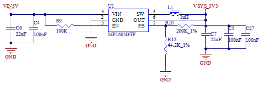

**Note:**

- **When designing the circuit independently, the OVP protection circuit can be removed if the power supply is stable;**
- **The DIP switch part for selecting the startup configuration is powered by GEN\_3V3.**

#### 3.5.2 Switch Key \& Reset Key

K2 in the upper - left corner of the development board is the power - on/off key of the development board, with a function similar to the power - on/off key of a mobile phone. Press and hold this key to turn on the board, and press and hold it again to turn it off.

**Note: The ONOFF pin can be left floating when not in use.**

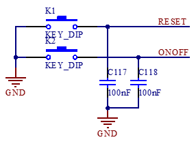

#### 3.5.3 Boot Configuration

It supports multiple flashing and boot modes. Upon power-up or reset, the system reads the boot configuration pins to select the mode. Development board uses BOOT\_MODE0,BOOT\_MODE1, LCD\_DATA3~LCD\_DATA7,LCD\_DATA11 as the system boot configuration pins.

BOOT\_MODE0 and BOOT\_MODE1 are BOOT TYPE selection pins.

| **BOOT_MODE[1：0]** |       **BOOT  TYPE**        |
| :-----------------: | :-------------------------: |
|         00          |      Boot  From  Fuses      |
|         01          |     Serial  Downloader      |
|         10          | Internal  Boot(Development) |
|         11          |          Reserved           |

LCD\_DATA3~LCD\_DATA7、LCD\_DATA11 are Boot Device selection pins.

| **Boot Device** | **LCD_D7** | **LCD_D6** | **LCD_D5** | **LCD_D4** | **LCD_D3** |     **LCD_D11**     |
| :-------------: | :--------: | :--------: | :--------: | :--------: | :--------: | :-----------------: |
|   Serial-ROM    |     0      |     0      |     1      |     1      |     x      |          x          |
|     SD/eSD      |     0      |     1      |     0      |     x      |     x      | 0-SDHC1 1-SDHC2 |
|    MMC/eMMC     |     0      |     1      |     1      |     x      |     x      |                     |

In the above table, the SD card on the carrier board uses the SDHC1 interface, and the eMMC on the SoM uses the SDHC2 interface.

The system startup configuration switch of the development board is S2. For the DIP switch, moving it upward means “On”, and moving it downward means “Off”. The configuration of the system programming and startup modes is as follows:

1\. SD card flashing settings: 3, 4 On, 1, 2 Off;

2\. USB OTG flashing settings: 1, 2 On, any other state; 

3\. EMMC startup settings: 1, 2, 3, 4 Off .

**Note:**

- **On the FETMX6ULL-C SoM, six pins, namely LCD\_DATA3, LCD\_DATA4, LCD\_DATA5, LCD\_DATA6, LCD\_DATA7, and LCD\_DATA11, are startup configuration pins. When the LCD function is not in use, these six pins cannot be used as I/O pins. For the other LCD pins, if the customer has sufficient GPIO, it is not recommended to use these pins as GPIOs. Please design the startup items according to the above circuit diagram when designing the carrier board.**

- **During development, we found that some LCD screens are not in a high-impedance state upon power-up, affecting boot pin levels. Therefore, it is recommended to add a buffer chip between the LCD and CPU, with the SN74AVC16245 chip recommended. For specific circuits, refer to the “LCD Interface” section;**

- **LCD\_DATA23 and LCD\_DATA12 cannot be at a high level during power - on, as this will cause the SoM to fail to start normally.**

#### 3.5.4 Debugging Serial Port

The debug serial port is a Type-C interface.

UART1 is a 3-wire, 3.3 V level debug serial port that is connected to the USB interface via CH340E.

**Note:**

- **To facilitate subsequent debugging, please lead out this debugging serial port when designing the carrier board by yourself;**

- **It is not recommended to use UART1 as a general serial port. Reason: The software needs to be modified to configure it as a general serial port.**

#### 3.5.5 General Serial Port, SPI, and I2C Interfaces

UART2, UART3, UART4, and UART5 are all serial ports with a 3.3V level, and they are led out from P17.

SPI1 and SPI2 have a 3.3V level and are led out from P17.

I2C1 and I2C2 have a 3.3V level and are led out from P17. 5V and 3.3V are led out from P17 for easy wiring.

#### 3.5.6 CAN

There are two CAN interfaces on the carrier board, which are led out from the 2EDGRC-3.81-5P green terminal, and the terminal number is P11. The carrier board circuit principle is compatible with TJA1040T, MC34901WEF and MCP2551 CAN transceiver chips.

Currently, TJA1040T is default - soldered on the development board. Since the output terminal RX of TJA1040T has a 5V level, which may affect the 3.3V voltage of the SoM, the outputs of the chip are divided to 3.3V through resistors R60 and R68 as well as R61 and R69 respectively before being input to CAN1\_RX and CAN2\_RX of the CPU. If you want to use the other two types of CAN chips, please refer to the relevant chip data sheets and modify the circuit accordingly.

#### 3.5.7 TF Card

P8 is the TF card socket, which uses the SDHC1 interface of the CPU. The program can be programmed from the TF card through the DIP switch. When the SDXC card is of UHS - II or higher grade, it will be downgraded to UHS - I for use. The reason is that starting from UHS - II, new data pins are added (similar to the difference between USB 3.0 and previous versions).

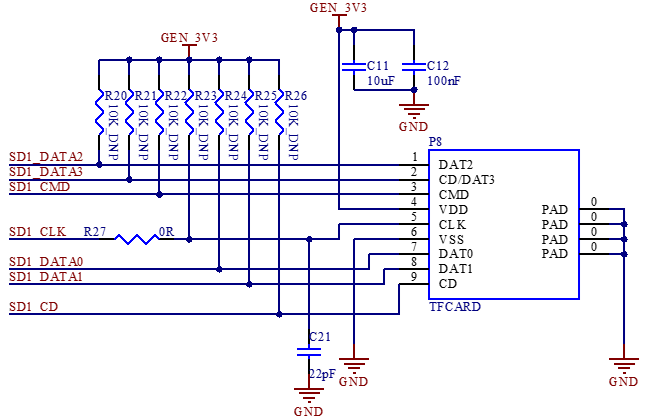

#### 3.5.8 RTC

The development board supports CPU - built - in and external RTC chips. Due to high power consumption of the built - in one, the external chip is default. The factory - included RTC battery is CR2032, replaceable with the same model when depleted.

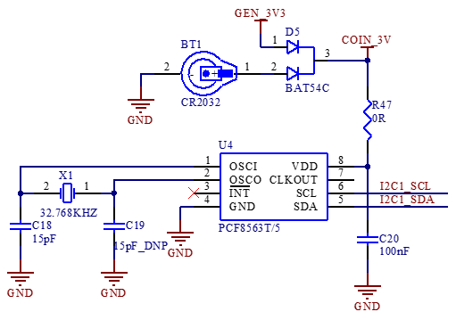

#### 3.5.9 User LED

There is 1 x LED indicator on the development board; when using the LED indicator, the corresponding pin needs to be configured as GPIO function. When the LED pin outputs a low - level signal, the LED is conducting and lights up. Conversely, when the pin outputs a high - level signal, the LED turns off.

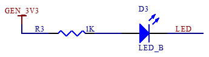

#### 3.5.10 Audio

There is a 3.5mm audio socket interface P21 on the development board, which has 4-level contacts and supports left and right channel sound playback and MIC recording. The P21 audio interface socket supports the international standard four-segment pin (CTIA). Please use the CTIA standard earphone cable during the test.

The class-D power amplifier output terminal inside the audio chip WM8960 is led out by two XH2.54-2P white sockets p22 and P23, which can drive two 8Ω speakers with a maximum output power of 1 W. If a larger external power amplifier is required, the signal can only be obtained from the earphone socket, not from the speaker interface.

**Note: The power of the speakers is a Class D amplifier (Not analog amplifier）;**

Connect a speaker to each socket, and please don’t share the speaker wire, nor connect the speaker to the ground wire.

#### 3.5.11 USB Host Interface

The CPU supports 2 x USB 2.0. On the development board, one of the USB\_OTG2 interfaces of the i.MX6ULL is expanded into 4 x USB through the industrial - grade USB hub FE1.1s. Among them, 2 x are connected to the USB host 2.0 interfaces (P15, P16), which can be used to connect devices such as mice, 4G modules, and Wi - Fi devices. One of the remaining USB is connected to the on - board Bluetooth Wi - Fi module, and the other is connected to the on - board 4G module. 

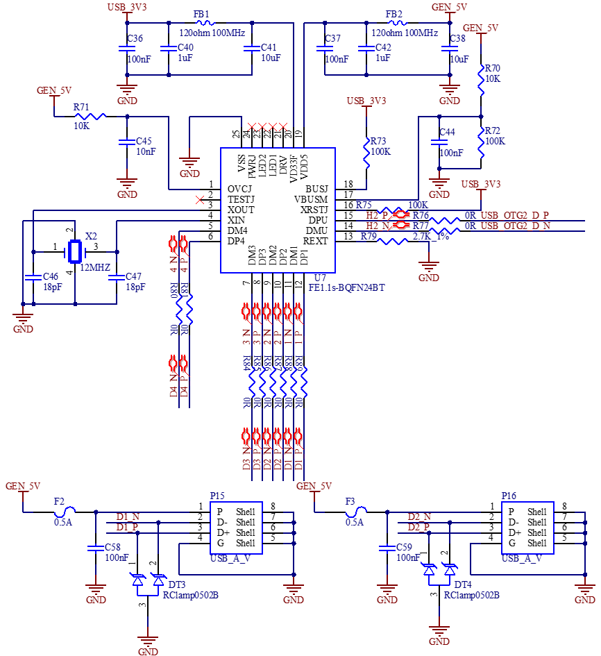

#### 3.5.12 USB OTG Interfaces

The mainboard uses USB \_ OTG1 as a device, which is led out through Type-C to supply power to the mainboard and flash the system.

#### 3.5.13 4G Interface

There is a mini PCIe socket on the development board for the 4G module, which uses the USB protocol. Use the DCDC power chip MP2147GD to supply power to the 4G module. The 4G IPEX antenna needs to be buckled on P27, and P18 is the MICRO \_ SIM card holder.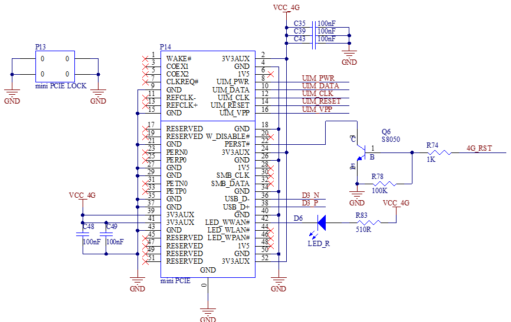

#### 3.5.14 WiFi \& Bluetooth

The model of the WiFi Bluetooth 2-in-1 module is RT L8723DU. Standard: IEEE 802.11b/g/n, bluetooth: BT V2.1/BT V3.0/BT V4.0。

In the schematic diagram, the WIFI\_EN pin is the power switch pin of the module. When it outputs a low level, the module is powered.

The antenna interface P19 is an on-board ceramic antenna. The model of TVS tube DT5 in the figure is GESD1005H150CR10GPT.

#### 3.5.15 Dual 100 Mbit Ethernet

CPU supports up to 2 x 100Mbps Ethernet ports. Carrier board provides 2 x 100Mbps Ethernet interfaces, both connected to the JL1111 PHY chip via RMII interface, led from RJ45 sockets P25 and P24, respectively, with the FC62115BNL model sockets and built-in isolation transformers.

**Note: When designing the PCB, ensure that the PHY chip has a complete ground.**

#### 3.5.16 LCD Display Interface

CPU supports parallel 24-bit LCD, the maximum RGB 888 is 24-bit, the highest resolution supports WXGA (1366x768), and the refresh frequency is 60HZ. The development board provides a universal LCD interface, which is led out through an FPC seat (P20) with a pitch of 0.5mm and 54 P. It can connect resistance touch screen and capacitance touch screen of different specifications and sizes produced by our company. The LCD interface is connected in RGB 888 24bit mode.

**Note:**

* **When the resistive touch function is not used, its four pins can be used as general-purpose I/O ports, and they are individually led from the IIC, UART1, UART2, UART3 interface sockets;**

- **When used for AD sampling, the voltage range is 0-3.3V, and the maximum sampling frequency is 1MS/s;**

- **To avoid the impact on startup due to non-high-impedance state of the LCD pins at power-on, it is recommended to add a buffer chip between the LCD and the CPU, with the recommended chip model being SN74AVC16245.**

## 4\. Hardware Design Guide

### 4.1 Boot Configuration

The i.MX6ULL has multiple programming and startup methods. After the system is powered on or reset, different programming and startup methods are selected by reading the status of the system startup configuration pins.

When you design the carrier board by yourself, you must add this part of the circuit. For the specific configuration method, please refer to the schematic diagram of the carrier board and the "Boot Configuration" chapter in this manual. Meanwhile, you're reminded to note that if you need to use both the SD card programming mode and the eMMC startup mode, you must add control for the LCD_DATA11 pin. Otherwise, the LCD_DATA11 pin can be set to a fixed level according to actual needs.

### 4.2 PMIC\_ON\_REQ Driving Capability Issue

On the carrier board, both GEN_5V and GEN_3.3V power supplies are obtained by controlling the PMIC_ON_REQ pin. However, the current driving capability of the PMIC_ON_REQ pin is relatively weak. Therefore, a voltage-controlled switching element is required. In the development board, an N-channel MOSFET AO3416 is used. For specific design details, please refer to the baseboard power supply circuit. 

### 4.3 Pull-up Resistors on the IIC Bus

When you design the carrier board on your own, you need to note that pull-up resistors must be added to the IIC bus. Otherwise, the IIC bus devices may not work properly. Currently, the two IIC buses led out on the carrier board are both pulled up to 3.3V through 1.5K resistors. 

### 4.4 USB1 - 1 Error During Debugging

When you use the USB interface, you need to connect USB_OTG1_VBUS and USB_OTG2_VBUS to 5V; otherwise, an error will occur. Currently, on the carrier board, the USB_OTG2_VBUS pin is connected to GEN_5V through a 0Ω resistor.

### 4.5 Output Level of the CAN Circuit RX Pin

Currently, the CAN transceiver chip defaultly used on the development board is TJA1040T. The output level of the RX terminal of this chip is 5V, while the level of the corresponding pin on the CPU is 3.3V. To prevent affecting the 3.3V power supply inside the CPU, resistors need to be connected in series between the RX terminal of the chip and the ground for voltage division, and then it can be connected to the CPU. Please refer to the CAN part of the circuit for specific operations.

**Note: Leave Unused Pins Floating.**

## 5\. Power Consumption of the Whole Machine Under Linux 

| No.  | Test Item                                              | SoM Power (W) | Development Board Power (including SoM) (W) |
| :--: | ------------------------------------------------------ | :-----------: | :-----------------------------------------: |
|  1   | No-load starting peak power                            |     0.858     |                    2.05                     |
|  2   | No-load standby peak power                             |     0.429     |                     1.3                     |
|  3   | Memory pressure test                                   |     0.792     |                    1.65                     |
|  4   | 7" LCD screen                                          |     0.462     |                     2.1                     |
|  5   | 7-inch LCD + U disk + memory pressure + video encoding |     0.825     |                     2.6                     |

**Note:**

- **Test conditions: The SoM configuration is 512MB memory + 8GB eMMC; the 4G module is Quectel EC20, and the screen is an optional product. SoM power supply is 3.3V and development board is 5V;**
- **Power consumption is for reference only.**  

## 6\. Connector Dimension Diagram

SoM Connector Dimension:

Carrier board Connector Dimension:

## 7\. Power Consumption of the Whole Machine Under Linux

| **No.** | **Test Item**                                          | **SoM Power (W)** | Development Board Power (including SoM) (W) |
| :-----: | ------------------------------------------------------ | :---------------: | :-----------------------------------------: |
|    1    | No-load starting peak power                            |       0.858       |                    2.05                     |
|    2    | No-load standby peak power                             |       0.429       |                     1.3                     |
|    3    | Memory pressure test                                   |       0.792       |                    1.65                     |
|    4    | 7" LCD screen                                          |       0.462       |                     2.1                     |
|    5    | 7-inch LCD + U disk + memory pressure + video encoding |       0.825       |                     2.6                     |

**Note:** 

- **Test conditions: the SoM configuration is 512MB memory + 8GB eMMC; the 4G module is Quectel EC20, and the screen is an optional product. SoM power supply is 3.3V and carrier board is 5V;** 
- **Power consumption is for reference only.**  

## 8\. Minimum System Schematic

**Note:**

**When you design the carrier board by yourself, please reserve the serial port circuit for easy debugging, reserve the DIP switch circuit for easy program flashing, and pay attention to the power - on sequence to prevent the latch - up effect from damaging the CPU (refer to 3.5.1 Carrier Board Power Supply for specific design).**

## 9\. Minimum System Schematic

