# User’s Hardware Manual\_V3.3

Document classification: □ Top secret □ Secret □ Internal information ■ Open

## Copyright

The copyright of this manual belongs to Baoding Folinx Embedded Technology Co., Ltd. Without the written permission of our company, no organizations or individuals have the right to copy, distribute, or reproduce any part of this manual in any form, and violators will be held legally responsible.

Forlinx adheres to copyrights of all graphics and texts used in all publications in original or license-free forms.

The drivers and utilities used for the components are subject to the copyrights of the respective manufacturers. The license conditions of the respective manufacturer are to be adhered to. Related license expenses for the operating system and applications should be calculated/declared separately by the related party or its representatives.

## Overview

This manual is designed to help you quickly familiarize yourselves with the product, understand interface functions and configuration, and primarily discusses the interface functions of the development board, interface introductions, product power consumption, and troubleshooting issues that may arise during use. Some commands were commented to make it easier for you to understand (Adequate and practical for the purpose). For issues related to pin function multiplexing and hardware problem troubleshooting methods, please refer to the "OKMX8MP-C - C Pin Multiplexing Comparison Table" and the "OKMX8MP-C - C Design Guide" provided by Forlinx.

There are total four chapters:

+ Chapter 1. is CPU overview, briefly introducing its performance and applications;
+ Chapter 2. is comprehensive introduction to the SoM, including connector pins explanations and function introductions;
+ Chapter 3. is comprehensive introduction to the development board, divided into multiple chapters, including both hardware principles and simple design ideas;
+ Chapter 4. mainly describes the board’s power consumption performance and other considerations;

## Application Scope

This hardware manual is applicable to the development boards of C and OKMX8MPX-C V3.1 and above and the SoM of FETMX8MPQ-C V1.0, FETMX8MPL-C V1.0 and above.

## Revision History

| Date                                         |           **Manual Version**           |            **SoM Version**             |       **Carrier Board Version**        | Revision History                                             |
| -------------------------------------------- | :------------------------------------: | :------------------------------------: | :------------------------------------: | ------------------------------------------------------------ |
| 19/08/2021 |                  V1.0                  |                  V1.0                  |                  V1.1                  | OKMX8MPQ-C User’s Hardware Manual Initial Version            |
| 08/11/2021 |                  V2.0                  |                  V1.0                  |                  V2.0                  | The PCB version of the carrier board is upgraded from V1.1 to V2.0, and the relevant manual instructions have been updated.   The changes to the carrier board are as follows: 1\. Due to material supply issues, the PHY chip on the OKMX8MPQ - C carrier board is replaced from AR8031 - AL1B to YT8521; 2\. For all circuits powered on under MOSFET control, a soft - start RC circuit is added to prevent the previous - stage power supply from dropping at the moment of power - on. This includes the power - on control circuit of VSYS\_5V on the carrier board, as well as the power supply circuits for the LVDS and audio modules. |
| 23/06/2022                                   | V2.1 | V1.0 | V2.0 | 1G memory and 8G eMMC industrial configuration SoM are added. |
| 19/08/2022                                   | V2.2 | V1.0 | V2.0 | Changing the USB programming recommended circuit of Type-C interface and adding the photos of CAN and 485 interfaces. |
| 08/11/2022                                   | V2.2 | V1.0 | V2.1 | The PCB version of the carrier board is upgraded from V2.0 to V2.1, and the user manual, schematic and source files are updated. The changes of the carrier board are as follows:   1\. The USB switching chip is modified; 2\. A heat sink fan interface is added. |
| 17/06/2023                                   | V3.0 | V1.0 | V3.1 | The PCB version of the carrier board is upgraded from V2.1 to V3.1, and the user manual, schematic and source files are updated. The changes of the carrier board are as follows:   1\. To solve the problem that the carrier board does not power off when shutting down due to carrier board leakage, a voltage monitoring chip is added; 2\. The audio chip is replaced with NAU88C22YG; 3\. The ground of the USB interface shell is left floating; 4\. The power - on sequence of the PCIE interface is adjusted, and the PCIE interface is powered separately. |
| 08/03/2024                                   | V3.1 | V1.0 | V3.1 | Changing the manual format and modifying the description of the connector section. |
| 10/12/2024                                   |                  V3.2                  |                  V1.0                  |                  V3.1                  | Adding MIMX8ML4CVNKZAB controller descriptions.              |
| 09/07/2025                                   |                  V3.3                  |                  V1.0                  |                  V3.1                  | CPU junction temperature is added to the introduction of the SoM. |

## 1\. i.MX8MP Series Processors

The i.MX 8M Plus series focuses on machine learning and vision, advanced multimedia, and industrial automation with high reliability. It is designed to meet the requirements of smart home, building, city, and Industry 4.0 applications.

+ **Key Features**

·Powerful Processor: It is equipped with a powerful quad - core or dual - core Arm® Cortex® - A53 processor with a Neural Processing Unit (NPU) that can achieve a maximum operating rate of up to 2.3 TOPS.

· Two Image Signal Processors (ISP) and two camera inputs for an efficient, advanced vision system.

·Multimedia Capabilities: Multimedia functions include video encoding (including H.265) and decoding, 3D/2D graphics acceleration, as well as a variety of audio and voice functions.

· Real - Time Control: Real - time control is enabled through the Cortex - M7. Features a powerful control network with CAN FD and dual Gigabit Ethernet, supporting Time-Sensitive Networking (TSN).

·DRAM with series ECC offers high industrial reliability.

+ **Application Fields**

·Industrial Control: Machine vision and robot controllers, building security, power grids and power distribution, industrial computers.

·Smart Cities: Traffic detectors and traffic flow optimization, targeted advertising, visual payment systems

·Smart Homes: Smart robots, household appliances, AI home servers, and alarm centers.

·Communication Infrastructure: Video conferencing systems.

……

**i.MX8MP Series Block Diagram**

The compatible CPU models of the FETMX8MPX - C SoM are shown in the following table. Forlinx selects MIMX8ML8CVNKZAB and MIMX8ML4CVNKZAB. 

| **Part**   **number** | **Device description** | **Part differentiator description** | **Number of A53 Cores** | **A53**   **speed** | **Qualificationtier** |
| :-------------------: | :--------------------: | :---------------------------------: | :---------------------: | :-----------------: | :-------------------: |
|    MIMX8ML8CVNKZAB    |    i.MX 8M PlusQuad    |    NPU, ISP, VPU,HiFi 4, CAN-FD     |            4            |       1.6 GHz       |      Industrial       |
|    MIMX8ML6CVNKZAB    |    i.MX 8M PlusQuad    |           ISP, VPU,CAN-FD           |            4            |       1.6 GHz       |      Industrial       |
|    MIMX8ML4CVNKZAB    |  i.MX 8M PlusQuadLite  |               CAN-FD                |            4            |       1.6 GHz       |      Industrial       |
|    MIMX8ML3CVNKZAB    |    i.MX 8M PlusDual    |    NPU, ISP, VPU,HiFi 4, CAN-FD     |            2            |       1.6 GHz       |      Industrial       |
|    MIMX8ML8DVNLZAB    |    i.MX 8M PlusQuad    |      NPU, ISP, VPU,HiFi 4, CAN      |            4            |       1.8 GHz       |       Consumer        |
|    MIMX8ML6DVNLZAB    |    i.MX 8M PlusQuad    |            ISP, VPU,CAN             |            4            |       1.8 GHz       |       Consumer        |
|    MIMX8ML4DVNLZAB    |  i.MX 8M PlusQuadLite  |                 CAN                 |            4            |       1.8 GHz       |       Consumer        |
|    MIMX8ML3DVNLZAB    |    i.MX 8M PlusDual    |      NPU, ISP, VPU,HiFi 4, CAN      |            2            |       1.8 GHz       |       Consumer        |

For more details about the i.MX8M Plus series please visit the official NXP website:

https://www.nxp.com.cn/products/processors-and-microcontrollers/arm-processors/i-mx-applications-processors/i-mx-8-proc (https://www.nxp.com.cn/products/processors-and-microcontrollers/arm-processors/i-mx-applications-processors/i-mx-8-processors/i-mx-8m-plus-arm-cortex-a53-machine-learning-vision-multimedia-and-industrial-iot:IMX8MPLUS)essors/i-mx-8m-plus-arm-cortex-a53-machine-learning-vision-multimedia-and-industrial-iot:IMX8MPLUS

## 2\. FETMX8MPQ-C Description

### 2.1 FETMX8MPQ-C SoM Appearance

**Front**

**Back**

**Note: Since the FETMX8MPX-C SoM is compatible with various CPU models, the SoM is silk-screened with the word FETMX8MPX-C.**

### 2.2 FETMX8MPQ-C SoM Dimension Diagram

FETMX8MPQ-C SoM Dimension Diagram

Structure size: 36mm × 62mm. For more detailed dimensions, please refer to the user information DXF structure document.

Plate making process: 1.6mm thickness, 8-layer immersion gold PCB.

Connector: Four 0.5mm pitch, 80pin board-to-board connectors. Refer to Appendix for the connector dimension diagram.

Four mounting holes (2.2mm) are reserved at the four corners of the SoM to facilitate the installation of fixing screws and to improve the reliability of the product connection so that the product can be used in vibration environments.

Please refer to the development board design and use SMT nuts of M2 with a length (L) of 2 mm on the carrier board. Please refer to the following figure for the specifications of the SMT nuts.

### 2.3 Performance Parameters

#### 2.3.1 System Main Frequency

|  **Name**  | **Specification** |             |             |          | **Description**  |
| :--------: | :---------------: | ----------- | ----------- | -------- | :--------------: |
|            |    **Minimum**    | **Typical** | **Maximum** | **Unit** |                  |
| Cortex-A53 |         —         | —           | 1.6         | GHz      | Industrial-grade |
| Cortex-M7  |         —         | —           | 800         | MHz      |        ——        |

#### 2.3.2 Power Parameter

|       **Parameter**       | **Pin Number** | **Specification** |             |             |          | **Description** |
| :-----------------------: | :------------: | :---------------: | ----------- | ----------- | -------- | :-------------: |
|                           |                |    **Minimum**    | **Typical** | **Maximum** | **Unit** |                 |
| Main Power Supply Voltage |    VSYS\_5V    |        4.5        | 5.0         | 5.5         | V        |        —        |

#### 2.3.3 Operating Environment

|     **Parameter**     |                       | **Specification** |             |             |          |                       **Description**                        |
| :-------------------: | --------------------- | :---------------: | ----------- | ----------- | -------- | :----------------------------------------------------------: |
|                       |                       |    **Minimum**    | **Typical** | **Maximum** | **Unit** |                                                              |
| Operating temperature | Operating Environment |        -40        | 25          | +85         | ℃        | Industrial grade, the CPU junction temperature is increased during testing. |
|                       | Storage Environment   |        -40        | 25          | +125        | ℃        |                                                              |
|       Humidity        | Operating Environment |        10         | —           | 90          | ％RH     |                       No condensation                        |
|                       | Storage Environment   |         5         | —           | 95          | ％RH     |                                                              |

During the environmental adaptability test, our company increased the CPU junction temperature to ensure the normal progress of the test. This measure is only applicable to the test phase.

In actual high - temperature usage scenarios, the CPU will automatically reduce its frequency under high temperatures. Moreover, long - term operation under high - temperature conditions will affect the CPU's service life. Please evaluate according to the actual application scenarios.

If you need methods to adjust the junction temperature, as well as the temperature and amplitude of frequency reduction, please contact Feiling's FAE. 

#### 2.3.4 SoM Interface Speed

|          **Parameter**          | **Specification** |             |             |          | **Description** |
| :-----------------------------: | :---------------: | ----------- | ----------- | -------- | :-------------: |
|                                 |    **Minimum**    | **Typical** | **Maximum** | **Unit** |                 |
| Serial Port Communication Speed |         —         | 115200      | 4M          | bps      |        —        |
|     SPI Communication Speed     |         —         | —           | 52          | Mbps     |        —        |
|     IIC Communication Speed     |         —         | 100         | 400         | Kbps     |        —        |
|   CAN-FD Communication speed    |                   |             | 8           | Mbps     |                 |
|           SD/MMC/SDIO           |         —         | —           | 800         | Mbps     |        —        |
|       USB interface speed       |         —         | —           | 5           | Gbps     |        —        |
|      PCIE interface speed       |         —         | —           | 8           | Gbps     |        —        |

#### 2.3.5 ESD  Features

|          **Parameter**          | **Specification** |             | **Unit** |          **Description**          |
| :-----------------------------: | :---------------: | ----------- | :------: | :-------------------------------: |
|                                 |    **Minimum**    | **Maximum** |          |                                   |
| ESD HBM(ESDA/JEDEC JS-001-2017) |       -1000       | +1000       |    V     | Applicable to all pins of the SoM |
| ESD CDM(ESDA/JEDEC JS-002-2018) |       -250        | +250        |    V     | Applicable to all pins of the SoM |

**Note：**

- **The above data is from the chip manual (the source of parameters can be specified);**
- **All SoM outgoing signals are electrostatic sensitive, requiring effective protection in carrier board design. Special attention to electrostatic protection is also needed during transportation, assembly, and use.**

### 2.4 SoM Interface Speed

OKMX8MPQ SoM Interfaces:

| **Function** | **Quantity** | **Parameter**                                                |
| :----------: | :----------: | ------------------------------------------------------------ |
|     USB      |      2       | The CPU has two USB 3.0/2.0 controllers with integrated PHY inside; Host mode: Supports Super-speed (5Gbit/s), high-speed(480Mbit/s), full-speed(12Mbit/s), low-speed(1.5Mbit/s)  Device Mode: SS/HS/FS |
|     PCIE     |      1       | Supports 1 x PCI Express Gen3                                |
|   MIPI_CSI   |      2       | Supports 2 x 4-lane MIPI camera serial interfaces, capable of operating up to 1.5 Gbps |
|   MIPI_DSI   |      1       | 1 x 4-lane MIPI display serial interface, capable of working up to 1.5 Gbps• 1080 p60 • WUXGA (1920x1200) at 60 Hz • 1920x1440 at 60 Hz • UWHD (2560x1080) at 60 Hz • WQHD (2560x1440) by reduced blanking mode（Simplified Hidden Mode） |
|     HDMI     |      1       | Supports HDMI 2.0a with resolution up to 4Kp30; Supports HDMI2.1 eARC |
|     LVDS     |      1       | Single channel (4 lanes) supports 720p60; Dual asynchronous channels (8 data, 2clocks) supporting 1920x1200p60 |
|   Ethernet   |      ≤2      | Supports 2 x RGMII, of which 1x supports TSN                 |
|      SD      |      ≤2      | SD2, 4-bit, supports switching between 1.8/3.3V modes; SD1, 8-bit, Only supports 1.8V mode |
|     UART     |      ≤4      | UART                                                         |
|     SPI      |      ≤3      | Supports speed up to 52Mbit/s, configurable master-slave mode |
|     I2C      |      ≤5      | The maximum speed supported in standard mode is 100Kbit/s; The maximum speed supported in fast mode is 400Kbit/s |
|     CAN      |      ≤2      | CAN communication controller using CAN FD protocol and CAN protocol compliant with CAN 2.0B protocol specification (supports CAN - FD (subject to CPU version support). |
|     SAI      |      ≤6      | Synchronous Audio Interface (SAI), a full duplex serial interface that supports frame synchronization, such as I2S, AC97, TDM, and codec/DSP interfaces |
|    SPDIF     |      ≤1      | A standard audio file transfer format jointly developed by Sony and Philips |
|     PWM      |      ≤4      | 16 bit counter                                               |
|     QSPI     |      ≤1      | Already occupied by the SoM, connected to 16MB of Nor Flash  |
|     JTAG     |      1       | The JTAG signal is led out via a 2 x 5 socket with 2.0mm spacing |

**Note: The parameters in the table are the theoretical values of hardware design or CPU.**

### 2.5 FETMX8MPQ-C SoM Pins Definition

#### 2.5.1 FETMX8MPQ-C SoM Pins Schematic

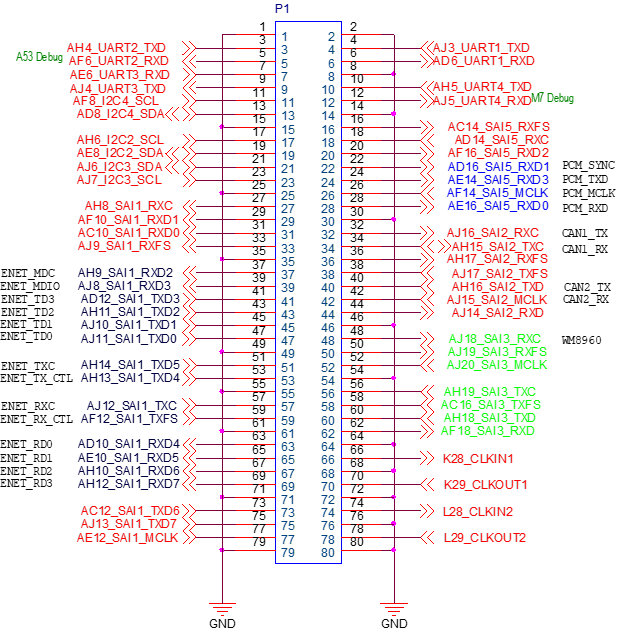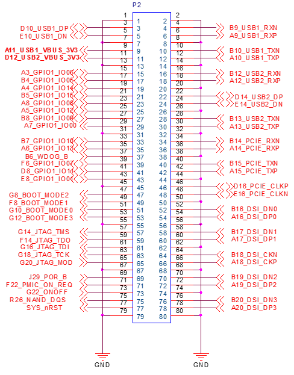

#### 2.5.2 FETMX8MPQ-C SoM Pins Description

**Note1:**

Num ——SoM connector pin no.:

Ball —— CPU pin ball no.

GPIO ——CPU pin general I/O port serial number

Vol  ——Pin signal level

**Note2:**

Signal Name——SoM connector network name

Pin Description—— SoM Pin Signal Descriptions

Default function-All pin functions of the SoM are specified according to the "default function" in the table below. Please do not modify it, otherwise it may be delivered from the factory.

Drive conflict. If you have any questions, please contact our sales or technical support.

**Note 3: The pins marked with "Do not use for carrier board" in the "Pin Description" are those used by the SoM, and should not be used in the carrier board design.**

**Table 1 LEFT\_UP（P1） Connector Interface(Odd) Pin Definition**

| **Num** | **Ball** | **Signal Name** |  **GPIO**  | **Vol** |        **Pin Description**         | Default Function |
| :-----: | :------: | :-------------: | :--------: | :-----: | :--------------------------------: | :--------------: |
|  LU_1   |    —     |       GND       |     —      |    —    |               Ground               |       GND        |
|  LU_3   |   AH4    |    UART2_TXD    | GPIO5_IO25 |  3.3V   |    UART2 (A53 debug) data send     |    UART2_TXD     |
|  LU_5   |   AF6    |    UART2_RXD    | GPIO5_IO24 |  3.3V   |   UART2 (A53 debug) data receive   |    UART2_RXD     |
|  LU_7   |   AE6    |    UART3_RXD    | GPIO5_IO26 |  3.3V   |         UART3 data receive         |    UART1_CTS     |
|  LU_9   |   AJ4    |    UART3_TXD    | GPIO5_IO27 |  3.3V   |          UART3 data send           |    UART1_RTS     |
|  LU_11  |   AF8    |    I2C4_SCL     | GPIO5_IO20 |  3.3V   |             I2C4 clock             |     I2C4_SCL     |
|  LU_13  |   AD8    |    I2C4_SDA     | GPIO5_IO21 |  3.3V   |             I2C4 data              |     I2C4_SDA     |
|  LU_15  |    —     |       GND       |     —      |    —    |               Ground               |       GND        |
|  LU_17  |   AH6    |    I2C2_SCL     | GPIO5_IO16 |  3.3V   |             I2C2 clock             |     I2C2_SCL     |
|  LU_19  |   AE8    |    I2C2_SDA     | GPIO5_IO17 |  3.3V   |             I2C2 data              |     I2C2_SDA     |
|  LU_21  |   AJ6    |    I2C3_SDA     | GPIO5_IO19 |  3.3V   |             I2C3 data              |     I2C3_SDA     |
|  LU_23  |   AJ7    |    I2C3_SCL     | GPIO5_IO18 |  3.3V   |             I2C3 clock             |     I2C3_SCL     |
|  LU_25  |    —     |       GND       |     —      |    —    |               Ground               |       GND        |
|  LU_27  |   AH8    |    SAI1_RXC     | GPIO4_IO1  |  1.8V   |       SAI1 receive bit clock       |      4G_RST      |
|  LU_29  |   AF10   |    SAI1_RXD1    | GPIO4_IO3  |  1.8V   |        SAI1 receive data 1         |   5GPWR_RESET    |
|  LU_31  |   AC10   |    SAI1_RXD0    | GPIO4_IO2  |  1.8V   |        SAI1 receive data 0         |   5GPWR_ON/OFF   |
|  LU_33  |   AJ9    |    SAI1_RXFS    | GPIO4_IO0  |  1.8V   | SAI1 receive frame synchronization |    4G/5G_PWR     |
|  LU_35  |    —     |       GND       |     —      |    —    |               Ground               |       GND        |
|  LU_37  |   AH9    |    SAI1_RXD2    | GPIO4_IO4  |  1.8V   |        SAI1 receive data 2         |    ENET1_MDC     |
|  LU_39  |   AJ8    |    SAI1_RXD3    | GPIO4_IO5  |  1.8V   |        SAI1 receive data 3         |    ENET1_MDIO    |
|  LU_41  |   AD12   |    SAI1_TXD3    | GPIO4_IO15 |  1.8V   |               SAI13                |    ENET1_TD3     |
|  LU_43  |   AH11   |    SAI1_TXD2    | GPIO4_IO14 |  1.8V   |          SAI1 send data 2          |    ENET1_TD2     |
|  LU_45  |   AJ10   |    SAI1_TXD1    | GPIO4_IO13 |  1.8V   |          SAI1 send data 1          |    ENET1_TD1     |
|  LU_47  |   AJ11   |    SAI1_TXD0    | GPIO4_IO12 |  1.8V   |          SAI1send data 0           |    ENET1_TD0     |
|  LU_49  |    —     |       GND       |     —      |    —    |               Ground               |       GND        |
|  LU_51  |   AH14   |    SAI1_TXD5    | GPIO4_IO17 |  1.8V   |          SAI1 send data 5          |    ENET1_TXC     |
|  LU_53  |   AH13   |    SAI1_TXD4    | GPIO4_IO16 |  1.8V   |          SAI1send data 4           |   ENET1_TX_CTL   |
|  LU_55  |    —     |       GND       |     —      |    —    |               Ground               |       GND        |
|  LU_57  |   AJ12   |    SAI1_TXC     | GPIO4_IO11 |  1.8V   |        SAI1 send bit clock         |    ENET1_RXC     |
|  LU_59  |   AF12   |    SAI1_TXFS    | GPIO4_IO10 |  1.8V   |  SAI1 send frame synchronization   |   ENET1_RX_CTL   |
|  LU_61  |    —     |       GND       |     —      |    —    |               Ground               |       GND        |
|  LU_63  |   AD10   |    SAI1_RXD4    | GPIO4_IO6  |  1.8V   |        SAI1 receive data 4         |    ENET1_RD0     |
|  LU_65  |   AE10   |    SAI1_RXD5    | GPIO4_IO7  |  1.8V   |        SAI1 receive data 5         |    ENET1_RD1     |
|  LU_67  |   AH10   |    SAI1_RXD6    | GPIO4_IO8  |  1.8V   |        SAI1 receive data 6         |    ENET1_RD2     |
|  LU_69  |   AH12   |    SAI1_RXD7    | GPIO4_IO9  |  1.8V   |        SAI1 receive data 7         |    ENET1_RD3     |
|  LU_71  |    —     |       GND       |     —      |    —    |               Ground               |       GND        |
|  LU_73  |   AC12   |    SAI1_TXD6    | GPIO4_IO18 |  1.8V   |          SAI1 send data 6          |    GPIO_KEY2     |
|  LU_75  |   AJ13   |    SAI1_TXD7    | GPIO4_IO19 |  1.8V   |          SAI1 send data 7          |     CC_nINT      |
|  LU_77  |   AE12   |    SAI1_MCLK    | GPIO4_IO20 |  1.8V   |          SAI1 main clock           |   USB1_SS_SEL    |
|  LU_79  |    —     |       GND       |     —      |    —    |               Clock                |       GND        |

**Table 2 LEFT\_UP（P1） Connector Interface(Even) Pin Definition**

| **Num** | **Ball** | **Signal Name** |  **GPIO**  | **Vol** |        **Pin Description**         | **Default Function** |
| :-----: | :------: | :-------------: | :--------: | :-----: | :--------------------------------: | :------------------: |
|  LU_2   |    —     |       GND       |     —      |    —    |               Ground               |         GND          |
|  LU_4   |   AJ3    |    UART1_TXD    | GPIO5_IO23 |  3.3V   |         UART1 data sending         |      UART1_TXD       |
|  LU_6   |   AD6    |    UART1_RXD    | GPIO5_IO22 |  3.3V   |        UART1 data receiving        |      UART1_RXD       |
|  LU_8   |    —     |       GND       |     —      |    —    |               Ground               |         GND          |
|  LU_10  |   AH5    |    UART4_TXD    | GPIO5_IO29 |  3.3V   |     UART4 (M7 debug) data send     |      UART4_TXD       |
|  LU_12  |   AJ5    |    UART4_RXD    | GPIO5_IO28 |  3.3V   |   UART4 (M7 debug) data receive    |      UART4_RXD       |
|  LU_14  |    —     |       GND       |     —      |    —    |               Ground               |         GND          |
|  LU_16  |   AC14   |    SAI5_RXFS    | GPIO3_IO19 |  1.8V   | SAI5 receive frame synchronization |     CSI_P2_RESET     |
|  LU_18  |   AD14   |    SAI5_RXC     | GPIO3_IO20 |  1.8V   |       SAI5 receive bit clock       |     CSI_P2_PWDN      |
|  LU_20  |   AF16   |    SAI5_RXD2    | GPIO3_IO23 |  1.8V   |        SAI5 receive data 2         |     HOST_WL_WAKE     |
|  LU_22  |   AD16   |    SAI5_RXD1    | GPIO3_IO22 |  1.8V   |        SAI5 receive data 1         |       PCM_SYNC       |
|  LU_24  |   AE14   |    SAI5_RXD3    | GPIO3_IO24 |  1.8V   |        SAI5 receive data 3         |       PCM_OUT        |
|  LU_26  |   AF14   |    SAI5_MCLK    | GPIO3_IO25 |  1.8V   |          SAI5 main clock           |       PCM_CLK        |
|  LU_28  |   AE16   |    SAI5_RXD0    | GPIO3_IO21 |  1.8V   |        SAI5 receive data 0         |        PCM_IN        |
|  LU_30  |    —     |       GND       |     —      |    —    |               Ground               |         GND          |
|  LU_32  |   AJ16   |    SAI2_RXC     | GPIO4_IO22 |  3.3V   |       SAI2 receive bit clock       |       CAN1_TX        |
|  LU_34  |   AH15   |    SAI2_TXC     | GPIO4_IO25 |  3.3V   |        SAI2 send bit clock         |       CAN1_RX        |
|  LU_36  |   AH17   |    SAI2_RXFS    | GPIO4_IO21 |  3.3V   | SAI2 receive frame synchronization |       SPI_INT        |
|  LU_38  |   AJ17   |    SAI2_TXFS    | GPIO4_IO24 |  3.3V   |  SAI2 send frame synchronization   |      GPIO_KEY1       |
|  LU_40  |   AH16   |    SAI2_TXD     | GPIO4_IO26 |  3.3V   |           SAI2 send data           |       CAN2_TX        |
|  LU_42  |   AJ15   |    SAI2_MCLK    | GPIO4_IO27 |  3.3V   |          SAI2 main clock           |       CAN2_RX        |
|  LU_44  |   AJ14   |    SAI2_RXD     | GPIO4_IO23 |  3.3V   |         SAI2 receive data          |     USB_HUB_RST      |
|  LU_46  |    —     |       GND       |     —      |    —    |               Ground               |         GND          |
|  LU_48  |   AJ18   |    SAI3_RXC     | GPIO4_IO29 |  3.3V   |       SAI3 receive bit data        |     CODEC_PWREN      |
|  LU_50  |   AJ19   |    SAI3_RXFS    | GPIO4_IO28 |  3.3V   | SAI3 receive frame synchronization |       AUD_nINT       |
|  LU_52  |   AJ20   |    SAI3_MCLK    | GPIO5_IO2  |  3.3V   |          SAI3 main clock           |      SAI3_MCLK       |
|  LU_54  |    —     |       GND       |     —      |    —    |               Ground               |         GND          |
|  LU_56  |   AH19   |    SAI3_TXC     | GPIO5_IO0  |  3.3V   |         SAI3 send bit data         |       SAI3_TXC       |
|  LU_58  |   AC16   |    SAI3_TXFS    | GPIO4_IO31 |  3.3V   |  SAI3 send frame synchronization   |      SAI3_TXFS       |
|  LU_60  |   AH18   |    SAI3_TXD     | GPIO5_IO1  |  3.3V   |           SAI3 send data           |       SAI3_TXD       |
|  LU_62  |   AF18   |    SAI3_RXD     | GPIO4_IO30 |  3.3V   |         SAI3 receive data          |       SAI3_RXD       |
|  LU_64  |    —     |       GND       |     —      |    —    |               Ground               |         GND          |
|  LU_66  |   K28    |     CLKIN1      |     —      |  3.3V   |            CLK input 1             |        CLKIN1        |
|  LU_68  |    —     |       GND       |     —      |    —    |               Ground               |         GND          |
|  LU_70  |   K29    |     CLKOUT1     |     —      |  3.3V   |            CLK output 1            |       CLKOUT1        |
|  LU_72  |    —     |       GND       |     —      |    —    |               Ground               |         GND          |
|  LU_74  |   L28    |     CLKIN2      |     —      |  3.3V   |            CLK input 2             |        CLKIN2        |
|  LU_76  |    —     |       GND       |     —      |    —    |               Ground               |         GND          |
|  LU_78  |   L29    |     CLKOUT2     |     —      |  3.3V   |            CLK output 2            |       CLKOUT2        |
|  LU_80  |    —     |       GND       |     —      |    —    |               Ground               |         GND          |

**Table 3 RIGHT\_UP（P2） Connector Interface(Odd) Pin Definition**

| **Num** | **Ball** | **Signal Name** |  **GPIO**  | **Vol** |     **Pin Description**      |              **Default Function**               |
| :-----: | :------: | :-------------: | :--------: | :-----: | :--------------------------: | :---------------------------------------------: |
|  RU_1   |    —     |       GND       |     —      |    —    |            Ground            |                       GND                       |
|  RU_3   |   D10    |     USB1_DP     |     —      |    —    |          USB1 data+          |                     USB1_DP                     |
|  RU_5   |   E10    |     USB1_DN     |     —      |    —    |          USB1data-           |                     USB1_DN                     |
|  RU_7   |    —     |       GND       |     —      |    —    |            Ground            |                       GND                       |
|  RU_9   |   A11    |  USB1_VBUS_3V3  |     —      |  3.3V   |     USB1_VBUS detection      |                  USB1_VBUS_3V3                  |
|  RU_11  |   D12    |  USB2_VBUS_3V3  |     —      |  3.3V   |     USB2_VBUS detection      |                  USB2_VBUS_3V3                  |
|  RU_13  |    —     |       GND       |     —      |    —    |            Ground            |                       GND                       |
|  RU_15  |    A3    |   GPIO1_IO06    | GPIO1_IO6  |  3.3V   | General-Purpose Input/Output |                  CSI1_nRST3.3                   |
|  RU_17  |    B4    |   GPIO1_IO05    | GPIO1_IO5  |  3.3V   | General-Purpose Input/Output |                  CSI1_SYNC3.3                   |
|  RU_19  |    A4    |   GPIO1_IO14    | GPIO1_IO14 |  3.3V   | General-Purpose Input/Output |                  TYPEC_HOST_EN                  |
|  RU_21  |    B5    |   GPIO1_IO15    | GPIO1_IO15 |  3.3V   | General-Purpose Input/Output |                   CSI_MCLK3.3                   |
|  RU_23  |    A8    |   GPIO1_IO08    | GPIO1_IO8  |  3.3V   | General-Purpose Input/Output |                    PCIE_RST                     |
|  RU_25  |    A5    |   GPIO1_IO12    | GPIO1_IO12 |  3.3V   | General-Purpose Input/Output |                     TP_INT                      |
|  RU_27  |    B8    |   GPIO1_IO09    | GPIO1_IO9  |  3.3V   | General-Purpose Input/Output |                     ACC_INT                     |
|  RU_29  |    A7    |   GPIO1_IO00    | GPIO1_IO0  |  3.3V   | General-Purpose Input/Output |                  LVDS_CTP_INT                   |
|  RU_31  |    —     |       GND       |     —      |    —    |            Ground            |                       GND                       |
|  RU_33  |    B7    |   GPIO1_IO10    | GPIO1_IO10 |  3.3V   | General-Purpose Input/Output |                  LVDS_CTP_RST                   |
|  RU_35  |    A6    |   GPIO1_IO13    | GPIO1_IO13 |  3.3V   | General-Purpose Input/Output |                   LVDS_PWR_EN                   |
|  RU_37  |    B6    |     WDOG_B      | GPIO1_IO2  |  3.3V   |       Watchdog signal        |                     WDOG_B                      |
|  RU_39  |    F6    |   GPIO1_IO07    | GPIO1_IO7  |  3.3V   | General-Purpose Input/Output |                     DSI_EN                      |
|  RU_41  |    D8    |   GPIO1_IO11    | GPIO1_IO11 |  3.3V   | General-Purpose Input/Output |                    LVDS_PWM                     |
|  RU_43  |    E8    |   GPIO1_IO01    | GPIO1_IO1  |  3.3V   | General-Purpose Input/Output |                   DSI_BL_PWM                    |
|  RU_45  |    —     |       GND       |     —      |    —    |            Ground            |                       GND                       |
|  RU_47  |    G8    |   BOOT_MODE2    |     —      |  3.3V   |  BOOT start mode selection   |                   BOOT_MODE2                    |
|  RU_49  |    F8    |   BOOT_MODE1    |     —      |  3.3V   |  BOOT start mode selection   |                   BOOT_MODE1                    |
|  RU_51  |   G10    |   BOOT_MODE0    |     —      |  3.3V   |  BOOT start mode selection   |                   BOOT_MODE0                    |
|  RU_53  |   G12    |   BOOT_MODE3    |     —      |  3.3V   |  BOOT start mode selection   |                   BOOT_MODE3                    |
|  RU_55  |    —     |       GND       |     —      |    —    |            Ground            |                       GND                       |
|  RU_57  |   G14    |    JTAG_TMS     |     —      |  3.3V   |   JTAG test mode selection   |                    JTAG_TMS                     |
|  RU_59  |   F14    |    JTAG_TDO     |     —      |  3.3V   | JTAG test data serial output |                    JTAG_TDO                     |
|  RU_61  |   G16    |    JTAG_TDI     |     —      |  3.3V   | JTAG test data serial output |                    JTAG_TDI                     |
|  RU_63  |   G18    |    JTAG_TCK     |     —      |  3.3V   |     JTAG detection clock     |                    JTAG_TCK                     |
|  RU_65  |   G20    |    JTAG_MOD     |     —      |  3.3V   |     JTAG mode selection      |                    JTAG_MOD                     |
|  RU_67  |    —     |       GND       |     —      |    —    |            Ground            |                       GND                       |
|  RU_69  |   J29    |      POR_B      |     —      |  1.8V   |          CPU reset           |                      POR_B                      |
|  RU_71  |   F22    |   PMIC_ON_REQ   |     —      |  1.8V   | PMIC power-on request signal |                   PMIC_ON_REQ                   |
|  RU_73  |   G22    |      ONOFF      |     —      |  1.8V   |     Switch on/off signal     |                      ONOFF                      |
|  RU_75  |   R26    |    NAND_DQS     | GPIO3_IO14 |  1.8V   |        NAND_DQS clock        | NAND_DQS not available on the carrier board |
|  RU_77  |    —     |    SYS_NRST     |     —      |  1.8V   |       SoM power reset        |                    SYS_NRST                     |
|  RU_79  |    —     |       GND       |     —      |    —    |            Ground            |                       GND                       |

**Table 4 Definition of RIGHT (P2) connector interface (even) pins**

| **Num** | **Ball** | **Signal Name** | **GPIO** | **Vol** | **Pin Description** | **Default Function** |
| :-----: | :------: | :-------------: | :------: | :-----: | :-----------------: | :------------------: |
|  RU_2   |    —     |       GND       |    —     |    —    |       Ground        |         GND          |
|  RU_4   |    B9    |    USB1_RXN     |    —     |    —    |    USB1 receive-    |       USB1_RXN       |
|  RU_6   |    A9    |    USB1_RXP     |    —     |    —    |    USB1 receive+    |       USB1_RXP       |
|  RU_8   |    —     |       GND       |    —     |    —    |       Ground        |         GND          |
|  RU_10  |   B10    |    USB1_TXN     |    —     |    —    |     USB1 send-      |       USB1_TXN       |
|  RU_12  |   A10    |    USB1_TXP     |    —     |    —    |     USB1 send+      |       USB1_TXP       |
|  RU_14  |    —     |       GND       |    —     |    —    |       Ground        |         GND          |
|  RU_16  |   B12    |    USB2_RXN     |    —     |    —    |    USB2 receive-    |       USB2_RXN       |
|  RU_18  |   A12    |    USB2_RXP     |    —     |    —    |    USB2 receive+    |       USB2_RXP       |
|  RU_20  |    —     |       GND       |    —     |    —    |       Ground        |         GND          |
|  RU_22  |   D14    |     USB2_DP     |    —     |    —    |     USB2 data+      |       USB2_DP        |
|  RU_24  |   E14    |     USB2_DN     |    —     |    —    |     USB2 data-      |       USB2_DN        |
|  RU_26  |    —     |       GND       |    —     |    —    |       Ground        |         GND          |
|  RU_28  |   B13    |    USB2_TXN     |    —     |    —    |     USB2 send-      |       USB2_TXN       |
|  RU_30  |   A13    |    USB2_TXP     |    —     |    —    |     USB2 send+      |       USB2_TXP       |
|  RU_32  |    —     |       GND       |    —     |    —    |       Ground        |         GND          |
|  RU_34  |   B14    |    PCIE_RXN     |    —     |    —    | PCIE data receive-  |       PCIE_RXN       |
|  RU_36  |   A14    |    PCIE_RXP     |    —     |    —    | PCIE data receive+  |       PCIE_RXP       |
|  RU_38  |    —     |       GND       |    —     |    —    |       Ground        |         GND          |
|  RU_40  |   B15    |    PCIE_TXN     |    —     |    —    |   PCIE data send-   |       PCIE_TXN       |
|  RU_42  |   A15    |    PCIE_TXP     |    —     |    —    |   PCIE data send+   |       PCIE_TXP       |
|  RU_44  |    —     |       GND       |    —     |    —    |       Ground        |         GND          |
|  RU_46  |   D16    |    PCIE_CLKP    |    —     |    —    |  PCIE clock input+  |      PCIE_CLKP       |
|  RU_48  |   E16    |    PCIE_CLKN    |    —     |    —    |  PCIE clock input-  |      PCIE_CLKN       |
|  RU_50  |    —     |       GND       |    —     |    —    |       Ground        |         GND          |
|  RU_52  |   B16    |     DSI_DN0     |    —     |    —    |     DSI data 0-     |       DSI_DN0        |
|  RU_54  |   A16    |     DSI_DP0     |    —     |    —    |     DSI data 0+     |       DSI_DP0        |
|  RU_56  |    —     |       GND       |    —     |    —    |       Ground        |         GND          |
|  RU_58  |   B17    |     DSI_DN1     |    —     |    —    |     DSI data 1-     |       DSI_DN1        |
|  RU_60  |   A17    |     DSI_DP1     |    —     |    —    |     DSI data 1+     |       DSI_DP1        |
|  RU_62  |    —     |       GND       |    —     |    —    |       Ground        |         GND          |
|  RU_64  |   B18    |     DSI_CKN     |    —     |    —    |     DSI clock-      |       DSI_CKN        |
|  RU_66  |   A18    |     DSI_CKP     |    —     |    —    |     DSI clock+      |       DSI_CKP        |
|  RU_68  |    —     |       GND       |    —     |    —    |       Ground        |         GND          |
|  RU_70  |   B19    |     DSI_DN2     |    —     |    —    |     DSI data 2-     |       DSI_DN2        |
|  RU_72  |   A19    |     DSI_DP2     |    —     |    —    |     DSI data 2+     |       DSI_DP2        |
|  RU_74  |    —     |       GND       |    —     |    —    |       Ground        |         GND          |
|  RU_76  |   B20    |     DSI_DN3     |    —     |    —    |     DSI data 3-     |       DSI_DN3        |
|  RU_78  |   A20    |     DSI_DP3     |    —     |    —    |     DSI data 3+     |       DSI_DP3        |
|  RU_80  |    —     |       GND       |    —     |    —    |       Ground        |         GND          |

**Table 5 LEFT \_ DOWN (P3) Connector Interface (Odd) Pin Definition**

| **Num** | **Ball** | **Signal Name** |  **GPIO**   | **Vol** |     **Pin Description**      | **Default Function** |
| :-----: | :------: | :-------------: | :---------: | :-----: | :--------------------------: | :------------------: |
|  LD\_1  |    —     |       GND       |      —      |    —    |            Ground            |         GND          |
|  LD\_3  |   AE22   |    HDMI\_HPD    | GPIO3\_IO29 |  3.3V   |   HDMI hot plug detection    |      HDMI\_HPD       |
|  LD\_5  |   AF22   | HDMI\_DDC\_SDA  | GPIO3\_IO27 |  3.3V   |        HDMI\_DDC data        |    HDMI\_DDC\_SDA    |
|  LD\_7  |    —     |       GND       |      —      |    —    |            Ground            |         GND          |
|  LD\_9  |   AC22   | HDMI\_DDC\_SCL  | GPIO3\_IO26 |  3.3V   |       HDMI\_DDC clock        |    HDMI\_DDC\_SCL    |
| LD\_11  |   AD22   |    HDMI\_CEC    | GPIO3\_IO28 |  3.3V   |    HDMI\_CEC recogonition    |      HDMI\_CEC       |
| LD\_13  |    —     |       GND       |      —      |    —    |            Ground            |         GND          |
| LD\_15  |   AH22   |  EARC\_N\_HPD   |      —      |    —    |      eARC differential-      |     EARC\_N\_HPD     |
| LD\_17  |   AJ23   |  EARC\_P\_UTIL  |      —      |    —    |      eARC differential+      |    EARC\_P\_UTIL     |
| LD\_19  |    —     |       GND       |      —      |    —    |            Ground            |         GND          |
| LD\_21  |   AJ24   |   HDMI\_TXCN    |      —      |    —    |   HDMI differential clock-   |      HDMI\_TXCN      |
| LD\_23  |   AH24   |   HDMI\_TXCP    |      —      |    —    |   HDMI differential clock+   |      HDMI\_TXCP      |
| LD\_25  |    —     |       GND       |      —      |    —    |            Ground            |         GND          |
| LD\_27  |   AJ25   |   HDMI\_TXN0    |      —      |    —    |  HDMI differential data 0-   |      HDMI\_TXN0      |
| LD\_29  |   AH25   |   HDMI\_TXP0    |      —      |    —    |  HDMI differential data 0+   |      HDMI\_TXP0      |
| LD\_31  |    —     |       GND       |      —      |    —    |            Ground            |         GND          |
| LD\_33  |   AJ26   |   HDMI\_TXN1    |      —      |    —    |  HDMI differential data 1-   |      HDMI\_TXN1      |
| LD\_35  |   AH26   |   HDMI\_TXP1    |      —      |    —    |  HDMI differential data 1+   |      HDMI\_TXP1      |
| LD\_37  |    —     |       GND       |      —      |    —    |            Ground            |         GND          |
| LD\_39  |   AJ27   |   HDMI\_TXN2    |      —      |    —    |  HDMI differential data 2-   |      HDMI\_TXN2      |
| LD\_41  |   AH27   |   HDMI\_TXP2    |      —      |    —    |  HDMI differential data 2+   |      HDMI\_TXP2      |
| LD\_43  |    —     |       GND       |      —      |    —    |            Ground            |         GND          |
| LD\_45  |   AH28   |    ENET\_MDC    | GPIO1\_IO16 |  1.8V   | ENET serial management clock |      ENET\_MDC       |
| LD\_47  |   AH29   |   ENET\_MDIO    | GPIO1\_IO17 |  1.8V   | ENET serial management data  |      ENET\_MDIO      |
| LD\_49  |   AD24   |    ENET\_TD3    | GPIO1\_IO18 |  1.8V   |      RGMII data send 3       |      ENET\_TD3       |
| LD\_51  |   AF26   |    ENET\_TD2    | GPIO1\_IO19 |  1.8V   |      RGMII data send 2       |      ENET\_TD2       |
| LD\_53  |   AE26   |    ENET\_TD1    | GPIO1\_IO20 |  1.8V   |      RGMII data send 1       |      ENET\_TD1       |
| LD\_55  |   AC25   |    ENET\_TD0    | GPIO1\_IO21 |  1.8V   |      RGMII data send 0       |      ENET\_TD0       |
| LD\_57  |    —     |       GND       |      —      |    —    |            Ground            |         GND          |
| LD\_59  |   AE24   |    ENET\_TXC    | GPIO1\_IO23 |  1.8V   |       RGMII send clock       |      ENET\_TXC       |
| LD\_61  |   AF24   |  ENET\_TX\_CTL  | GPIO1\_IO22 |  1.8V   |      RGMII send control      |    ENET\_TX\_CTL     |
| LD\_63  |    —     |       GND       |      —      |    —    |            Ground            |         GND          |
| LD\_65  |   AE29   |    ENET\_RXC    | GPIO1\_IO25 |  1.8V   |     RGMII receive clock      |      ENET\_RXC       |
| LD\_67  |   AE28   |  ENET\_RX\_CTL  | GPIO1\_IO24 |  1.8V   |    RGMII receives control    |    ENET\_RX\_CTL     |
| LD\_69  |    —     |       GND       |      —      |    —    |            Ground            |         GND          |
| LD\_71  |   AG29   |    ENET\_RD0    | GPIO1\_IO26 |  1.8V   |     RGMII receive data 0     |      ENET\_RD0       |
| LD\_73  |   AG28   |    ENET\_RD1    | GPIO1\_IO27 |  1.8V   |     RGMII receive data 1     |      ENET\_RD1       |
| LD\_75  |   AF29   |    ENET\_RD2    | GPIO1\_IO28 |  1.8V   |     RGMII receive data 2     |      ENET\_RD2       |
| LD\_77  |   AF28   |    ENET\_RD3    | GPIO1\_IO29 |  1.8V   |     RGMII receive data 3     |      ENET\_RD3       |
| LD\_79  |    —     |       GND       |      —      |    —    |            Ground            |         GND          |

**Table 6 LEFT \_ DOWN (P3) Connector Interface (Even) Pin Definition**

| **Num** | **Ball** |     **Signal Name**      |  **GPIO**   | **Vol**  |        **Pin Description**        |     **Default Function**     |
| :-----: | :------: | :----------------------: | :---------: | :------: | :-------------------------------: | :--------------------------: |
|  LD\_2  |    —     |           GND            |      —      |    —     |              Ground               |             GND              |
|  LD\_4  |   AC18   |     SPDIF\_EXT\_CLK      | GPIO5\_IO5  |   3.3V   |            SPDIF clock            |          ENET\_nRST          |
|  LD\_6  |   AD18   |        SPDIF\_RX         | GPIO5\_IO4  |   3.3V   |           SPDIF receive           |         ENET1\_nRST          |
|  LD\_8  |   AE18   |        SPDIF\_TX         | GPIO5\_IO3  |   3.3V   |            SPDIF send             |          ENET\_nINT          |
| LD\_10  |    —     |           GND            |      —      |    —     |              Ground               |             GND              |
| LD\_12  |   AD20   |       ECSPI1\_MISO       | GPIO5\_IO8  |   3.3V   | ECSPI1 master input slave output  |          GPIO\_LED1          |
| LD\_14  |   AE20   |       ECSPI1\_SS0        | GPIO5\_IO9  |   3.3V   |        ECSPI1 chip select         |          GPIO\_LED2          |
| LD\_16  |   AF20   |       ECSPI1\_SCLK       | GPIO5\_IO6  |   3.3V   |           ECSPI1 clock            |          UART3\_RXD          |
| LD\_18  |   AC20   |       ECSPI1\_MOSI       | GPIO5\_IO7  |   3.3V   | ECSPI1 master output slave intput |          UART3\_TXD          |
| LD\_20  |    —     |           GND            |      —      |    —     |              Ground               |             GND              |
| LD\_22  |   AH21   |       ECSPI2\_SCLK       | GPIO5\_IO10 |   3.3V   |           ECSPI2 clock            |         ECSPI2\_SCLK         |
| LD\_24  |   AJ22   |       ECSPI2\_SS0        | GPIO5\_IO13 |   3.3V   |        ECSPI2 chip select         |         ECSPI2\_SS0          |
| LD\_26  |   AJ21   |       ECSPI2\_MOSI       | GPIO5\_IO11 |   3.3V   | ECSPI2 master output slave input  |         ECSPI2\_MOSI         |
| LD\_28  |   AH20   |       ECSPI2\_MISO       | GPIO5\_IO12 |   3.3V   | ECSPI2 master input slave output  |         ECSPI2\_MISO         |
| LD\_30  |    —     |           GND            |      —      |    —     |              Ground               |             GND              |
| LD\_32  |   AA26   |        SD2\_DATA2        | GPIO2\_IO17 | 1.8/3.3V |          SD2 data bit 2           |          SD2\_DATA2          |
| LD\_34  |   AA25   |        SD2\_DATA3        | GPIO2\_IO18 | 1.8/3.3V |          SD2 data bit 3           |          SD2\_DATA3          |
| LD\_36  |   AB28   |         SD2\_CMD         | GPIO2\_IO14 | 1.8/3.3V |        SD2 command signal         |           SD2\_CMD           |
| LD\_38  |   AB29   |         SD2\_CLK         | GPIO2\_IO13 | 1.8/3.3V |             SD2 clock             |           SD2\_CLK           |
| LD\_40  |   AC28   |        SD2\_DATA0        | GPIO2\_IO15 | 1.8/3.3V |          SD2 data bit 0           |          SD2\_DATA0          |
| LD\_42  |   AC29   |        SD2\_DATA1        | GPIO2\_IO16 | 1.8/3.3V |          SD2 data bit 1           |          SD2\_DATA1          |
| LD\_44  |   AD28   | SD2\_RESET\_B \_RESET\_B | GPIO2\_IO19 | 1.8/3.3V |         SD2 reset signal          | Do not use the carrier board |
| LD\_46  |   AD29   |         SD2\_NCD         | GPIO2\_IO12 | 1.8/3.3V |     SD2 card detection signal     |           SD2\_nCD           |
| LD\_48  |   AC26   |         SD2\_WP          | GPIO2\_IO20 | 1.8/3.3V |    SD2 write protection signal    |         TYPEC\_EN\_B         |
| LD\_50  |    —     |           GND            |      —      |    —     |              Ground               |             GND              |
| LD\_52  |   U26    |        SD1\_DATA4        | GPIO2\_IO6  |   1.8V   |          SD1 data bit 4           |      BT\_HOST\_WAKE\_B       |
| LD\_54  |   AA29   |        SD1\_DATA5        | GPIO2\_IO7  |   1.8V   |          SD1 data bit 5           |         BT\_WAKE\_B          |
| LD\_56  |   AA28   |        SD1\_DATA6        | GPIO2\_IO8  |   1.8V   |          SD1 data bit 6           |        WIFI\_REG\_ON         |
| LD\_58  |   U25    |        SD1\_DATA7        | GPIO2\_IO9  |   1.8V   |          SD1 data bit 7           |     WIFI\_HOST\_WAKE\_B      |
| LD\_60  |    —     |           GND            |      —      |    —     |              Ground               |             GND              |
| LD\_62  |   W26    |       SD1\_STROBE        | GPIO2\_IO11 |   1.8V   |         SD1 strobe signal         |          CSI1\_PWDN          |
| LD\_64  |   W25    |      SD1\_RESET\_B       | GPIO2\_IO10 |   1.8V   |         SD1 reset signal          |         BT\_REG\_ON          |
| LD\_66  |   V29    |        SD1\_DATA2        | GPIO2\_IO4  |   1.8V   |          SD1 data bit 2           |          SD1\_DATA2          |
| LD\_68  |   V28    |        SD1\_DATA3        | GPIO2\_IO5  |   1.8V   |          SD1 data bit 3           |          SD1\_DATA3          |
| LD\_70  |   W29    |         SD1\_CMD         | GPIO2\_IO1  |   1.8V   |        SD1 command signal         |           SD1\_CMD           |
| LD\_72  |    —     |           GND            |      —      |    —     |              Ground               |             GND              |
| LD\_74  |   W28    |         SD1\_CLK         | GPIO2\_IO0  |   1.8V   |             SD1 clock             |           SD1\_CLK           |
| LD\_76  |   Y29    |        SD1\_DATA0        | GPIO2\_IO2  |   1.8V   |          SD1 data bit 0           |          SD1\_DATA0          |
| LD\_78  |   Y28    |        SD1\_DATA1        | GPIO2\_IO3  |   1.8V   |          SD1 data bit 1           |          SD1\_DATA1          |
| LD\_80  |    —     |           GND            |      —      |    —     |              Ground               |             GND              |

**Table 7 RIGHT \_ DOWN (P4) Connector Interface (Odd) Pin Definition**

| **Num** | **Ball** | **Signal Name** | **GPIO** | **Vol** |   **Pin Description**    | **Default Function** |
| :-----: | :------: | :-------------: | :------: | :-----: | :----------------------: | :------------------: |
|  RD\_1  |    —     |       GND       |    —     |    —    |          Ground          |         GND          |
|  RD\_3  |   D22    |    CSI1\_CKP    |    —     |    —    |       CSI1 clock+        |      CSI1\_CKP       |
|  RD\_5  |   E22    |    CSI1\_CKN    |    —     |    —    |       CSI1 clock-        |      CSI1\_CKN       |
|  RD\_7  |    —     |       GND       |    —     |    —    |          Ground          |         GND          |
|  RD\_9  |   E18    |    CSI1\_DN0    |    —     |    —    |     CSI1 data bit 0-     |      CSI1\_DN0       |
| RD\_11  |   D18    |    CSI1\_DP0    |    —     |    —    |       CSI1 data 0+       |      CSI1\_DP0       |
| RD\_13  |    —     |       GND       |    —     |    —    |          Ground          |         GND          |
| RD\_15  |   E20    |    CSI1\_DN1    |    —     |    —    |     CSI1 data bit 1-     |      CSI1\_DN1       |
| RD\_17  |   D20    |    CSI1\_DP1    |    —     |    —    |       CSI1 data 1+       |      CSI1\_DP1       |
| RD\_19  |    —     |       GND       |    —     |    —    |          Ground          |         GND          |
| RD\_21  |   E24    |    CSI1\_DN2    |    —     |    —    |     CSI1 data bit 2-     |      CSI1\_DN2       |
| RD\_23  |   D24    |    CSI1\_DP2    |    —     |    —    |       CSI1 data 2+       |      CSI1\_DP2       |
| RD\_25  |    —     |       GND       |    —     |    —    |          Ground          |         GND          |
| RD\_27  |   E26    |    CSI1\_DN3    |    —     |    —    |     CSI1 data bit 3-     |      CSI1\_DN3       |
| RD\_29  |   D26    |    CSI1\_DP3    |    —     |    —    |       CSI1 data 3+       |      CSI1\_DP3       |
| RD\_31  |    —     |       GND       |    —     |    —    |          Ground          |         GND          |
| RD\_33  |   B21    |    CSI2\_DN3    |    —     |    —    |     CSI2 data bit 3-     |      CSI2\_DN3       |
| RD\_35  |   A21    |    CSI2\_DP3    |    —     |    —    |       CSI2 data 3+       |      CSI2\_DP3       |
| RD\_37  |    —     |       GND       |    —     |    —    |          Ground          |         GND          |
| RD\_39  |   B22    |    CSI2\_DN2    |    —     |    —    |     CSI2 data bit 2-     |      CSI2\_DN2       |
| RD\_41  |   A22    |    CSI2\_DP2    |    —     |    —    |       CSI2 data 2+       |      CSI2\_DP2       |
| RD\_43  |    —     |       GND       |    —     |    —    |          Ground          |         GND          |
| RD\_45  |   B24    |    CSI2\_DN1    |    —     |    —    |     CSI2 data bit 1-     |      CSI2\_DN1       |
| RD\_47  |   A24    |    CSI2\_DP1    |    —     |    —    |       CSI2 data 1+       |      CSI2\_DP1       |
| RD\_49  |    —     |       GND       |    —     |    —    |          Ground          |         GND          |
| RD\_51  |   B25    |    CSI2\_DN0    |    —     |    —    |     CSI2 data bit 0-     |      CSI2\_DN0       |
| RD\_53  |   A25    |    CSI2\_DP0    |    —     |    —    |       CSI2 data 0+       |      CSI2\_DP0       |
| RD\_55  |    —     |       GND       |    —     |    —    |          Ground          |         GND          |
| RD\_57  |   B23    |    CSI2\_CKN    |    —     |    —    |       CSI2 clock-        |      CSI2\_CKN       |
| RD\_59  |   A23    |    CSI2\_CKP    |    —     |    —    |       CSI2 clock+        |      CSI2\_CKP       |
| RD\_61  |    —     |       GND       |    —     |    —    |          Ground          |         GND          |
| RD\_63  |    —     | NVCC\_SNVS\_1V8 |    —     |  1.8V   |     SoM SNVS voltage     |   NVCC\_SNVS\_1V8    |
| RD\_65  |    —     |       GND       |    —     |    —    |          Ground          |         GND          |
| RD\_67  |    —     |       GND       |    —     |    —    |          Ground          |         GND          |
| RD\_69  |    —     |       GND       |    —     |    —    |          Ground          |         GND          |
| RD\_71  |    —     |       GND       |    —     |    —    |          Ground          |         GND          |
| RD\_73  |    —     |    VSYS\_5V     |    —     |   5V    | SoM main power supply 5V |       VSYS\_5V       |
| RD\_75  |    —     |    VSYS\_5V     |    —     |   5V    | SoM main power supply 5V |       VSYS\_5V       |
| RD\_77  |    —     |    VSYS\_5V     |    —     |   5V    | SoM main power supply 5V |       VSYS\_5V       |
| RD\_79  |    —     |    VSYS\_5V     |    —     |   5V    | SoM main power supply 5V |       VSYS\_5V       |

**Table 8 RIGHT \_ DOWN (P4) Connector Interface (Even) Pin Definition**

| **Num** | **Ball** | **Signal Name** | **GPIO** | **Vol** |          **Pin Description**          | **Default Function** |
| :-----: | :------: | :-------------: | :------: | :-----: | :-----------------------------------: | :------------------: |
|  RD\_2  |    —     |       GND       |    —     |    —    |                Ground                 |         GND          |
|  RD\_4  |   C29    |  LVDS1\_TX3\_P  |    —     |    —    |             LVDS1 data 3+             |    LVDS1\_TX3\_P     |
|  RD\_6  |   D28    |  LVDS1\_TX3\_N  |    —     |    —    |           LVDS1 data bit 3-           |    LVDS1\_TX3\_N     |
|  RD\_8  |    —     |       GND       |    —     |    —    |                Ground                 |         GND          |
| RD\_10  |   A28    |  LVDS1\_CLK\_P  |    —     |    —    |             LVDS1 clock+              |    LVDS1\_CLK\_P     |
| RD\_12  |   B28    |  LVDS1\_CLK\_N  |    —     |    —    |             LVDS1 clock-              |    LVDS1\_CLK\_N     |
| RD\_14  |    —     |       GND       |    —     |    —    |                Ground                 |         GND          |
| RD\_16  |   B29    |  LVDS1\_TX2\_P  |    —     |    —    |             LVDS1 data 2+             |    LVDS1\_TX2\_P     |
| RD\_18  |   C28    |  LVDS1\_TX2\_N  |    —     |    —    |           LVDS1 data bit 2-           |    LVDS1\_TX2\_N     |
| RD\_20  |    —     |       GND       |    —     |    —    |                Ground                 |         GND          |
| RD\_22  |   A27    |  LVDS1\_TX1\_P  |    —     |    —    |             LVDS1 data 1+             |    LVDS1\_TX1\_P     |
| RD\_24  |   B27    |  LVDS1\_TX1\_N  |    —     |    —    |           LVDS1 data bit 1-           |    LVDS1\_TX1\_N     |
| RD\_26  |    —     |       GND       |    —     |    —    |                Ground                 |         GND          |
| RD\_28  |   A26    |  LVDS1\_TX0\_P  |    —     |    —    |             LVDS1 data 0+             |    LVDS1\_TX0\_P     |
| RD\_30  |   B26    |  LVDS1\_TX0\_N  |    —     |    —    |           LVDS1 data bit 0-           |    LVDS1\_TX0\_N     |
| RD\_32  |    —     |       GND       |    —     |    —    |                Ground                 |         GND          |
| RD\_34  |   H29    |  LVDS0\_TX3\_P  |    —     |    —    |             LVDS0 data 3+             |    LVDS0\_TX3\_P     |
| RD\_36  |   J28    |  LVDS0\_TX3\_N  |    —     |    —    |           LVDS0 data bit 3-           |    LVDS0\_TX3\_N     |
| RD\_38  |    —     |       GND       |    —     |    —    |                Ground                 |         GND          |
| RD\_40  |   F29    |  LVDS0\_CLK\_P  |    —     |    —    |             LVDS0 clock+              |    LVDS0\_CLK\_P     |
| RD\_42  |   G28    |  LVDS0\_CLK\_N  |    —     |    —    |             LVDS0 clock-              |    LVDS0\_CLK\_N     |
| RD\_44  |    —     |       GND       |    —     |    —    |                Ground                 |         GND          |
| RD\_46  |   G29    |  LVDS0\_TX2\_P  |    —     |    —    |             LVDS0 data 2+             |    LVDS0\_TX2\_P     |
| RD\_48  |   H28    |  LVDS0\_TX2\_N  |    —     |    —    |           LVDS0 data bit 2-           |    LVDS0\_TX2\_N     |
| RD\_50  |    —     |       GND       |    —     |    —    |                Ground                 |         GND          |
| RD\_52  |   E29    |  LVDS0\_TX1\_P  |    —     |    —    |             LVDS0 data 1+             |    LVDS0\_TX1\_P     |
| RD\_54  |   F28    |  LVDS0\_TX1\_N  |    —     |    —    |           LVDS0 data bit 1-           |    LVDS0\_TX1\_N     |
| RD\_56  |    —     |       GND       |    —     |    —    |                Ground                 |         GND          |
| RD\_58  |   D29    |  LVDS0\_TX0\_P  |    —     |    —    |             LVDS0 data 0+             |    LVDS0\_TX0\_P     |
| RD\_60  |   E28    |  LVDS0\_TX0\_N  |    —     |    —    |           LVDS0 data bit 0-           |    LVDS0\_TX0\_N     |
| RD\_62  |    —     |       GND       |    —     |    —    |                Ground                 |         GND          |
| RD\_64  |    —     |       GND       |    —     |    —    |                Ground                 |         GND          |
| RD\_66  |    —     |    VSD\_3V3     |    —     |  3.3V   |         SD card power voltage         |       VSD\_3V3       |
| RD\_68  |    —     |    VSD\_3V3     |    —     |  3.3V   |         SD card power voltage         |       VSD\_3V3       |
| RD\_70  |    —     |       GND       |    —     |    —    |                Ground                 |         GND          |
| RD\_72  |    —     |       GND       |    —     |    —    |                Ground                 |         GND          |
| RD\_74  |    —     |    VDD\_3V3     |    —     |  3.3V   | Indicates that the SoM is powered on. |       VDD\_3V3       |
| RD\_76  |    —     |    VSYS\_5V     |    —     |   5V    |       SoM main power supply 5V        |       VSYS\_5V       |
| RD\_78  |    —     |    VSYS\_5V     |    —     |   5V    |       SoM main power supply 5V        |       VSYS\_5V       |
| RD\_80  |    —     |    VSYS\_5V     |    —     |   5V    |       SoM main power supply 5V        |       VSYS\_5V       |

### 2.6 SoM Hardware Design Description

FETMX8MPX-C SoM integrates the power supply, reset monitoring circuit, and storage circuit into a compact module. The required external circuits are very simple. To form a minimal system, only a 5V power supply, a reset button, and boot configuration are needed to run the system, as shown in the following figure:

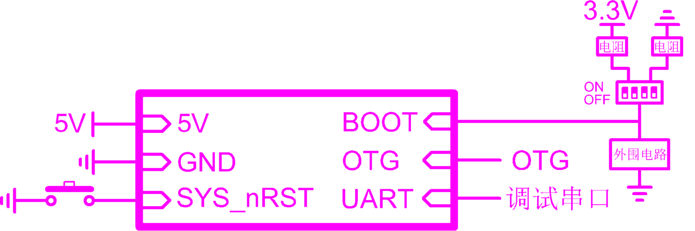

Please refer to “Appendix IV. for the minimal system schematic diagram However, in general, it is recommended to connect some external devices except the minimum system, such as debugging serial port for viewing and printing information, and reserve OTG interface for outputting flashing information. After completing these steps, additional user-specific functions can be added based on the default interface definitions provided by Forlinx for the SoM.

## 3\. OKMX8MPQ-C Development Platform Description

### 3.1 OKMX8MPQ-C Development Board Interface Diagram

The connection of OKMX8MPX-C SoM and the carrier board is board-to-board, and the main interfaces are as follows:

### 3.2 OKMX8MPQ-C SoM Dimension Diagram

OKMX8MPX-C development board and antenna board is as follows:

Carrier board PCB size: 130mm × 190mm. For more detailed dimensions, please refer to the user information DXF file;

Fixed hole size: spacing: 120mm × 180mm, hole diameter: 3.2mm.

Plate making process: thickness 1.6mm, 4-layer PCB.

Power supply voltage: DC 12V.

The antenna board is used for the installation and fixation of 4G and 5G antennas. Its external dimensions are 20mm×140mm. For more detailed dimensions, please refer to the figure below:

Two mounting holes with a diameter of 3.2mm are reserved on the carrier board. You can select and install the heat sink according to the site environment. Please add a layer of insulated heat-conducting silicone pad on the contact surface between the heat sink and the core board. 38Mm×38mm×10mm. For more detailed dimensions, please refer to the following figure.

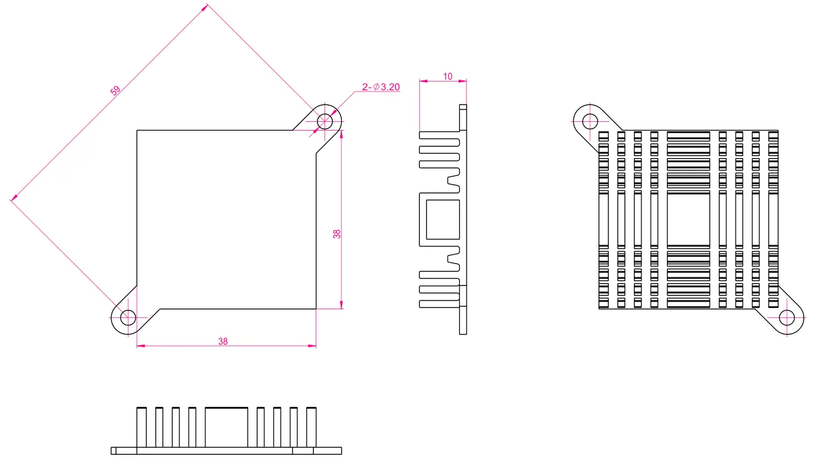

### 3.3 Carrier Board Naming Rules

ABC-D+IK:M

| **Field** | **Field Description**                       | **Value** | **Description**                                              |
| :-------: | ------------------------------------------- | --------- | ------------------------------------------------------------ |
|     A     | Qualification level                         | PC        | Prototype Sample                                             |
|           |                                             | Blank     | Mass Production                                              |
|     B     | Product line identification                 | OK        | Forlinx Embedded development board                           |
|     C     | CPU Name                                    | MX8MPQ    | IMX8MPQ                                                      |
|    \-     | Segment Identification                      | \-        |                                                              |
|     D     | Connection                                  | Cx        | Board-to-board Connector                                     |
|    \+     | Segment Identification                      | \+        | The configuration parameter section follows this identifier. |
|     I     | Operating temperature                       | I         | -40 to 85℃   industrial  level                               |
|     K     | PCB Version                                 | 11        | V1.1                                                         |
|           |                                             | xx        | Vx.x                                                         |
|    :M     | Internal Identification of the Manufacturer | :X        | This is the internal identification of the manufacturer and has no impact on the use. |

**Note: The OKMX8MPX-C carrier board is compatible with multiple SoMs of different CPUs, so the carrier board screen printing is FETMX8MPX-C.**

### 3.4 Carrier Board Resources

| **Function**  | Quantity | Parameter                                                    |
| :-----------: | :------: | ------------------------------------------------------------ |
| USB3.0 Type-C |    1     | USB Type-C USB3.0 supports DFP, UFP and DRP                  |
|    USB3.0     |    2     | Led out via USB Type A socket, only used as Host             |
|   MIPI_CSI    |    2     | CSI1: Supports daA3840-30mc-IMX8MP-EVK camera module, resolution 3840X2160 CSI2: Led out through a 26Pin FPC socket and 2 x 10Pin 2.0mm sockets; Supports OV5645 module, camera supports a maximum resolution of 2592X1944 |
|   MIPI_DSI    |    1     | 4 lane MIPI-DSI interfaces is led out through the FPC socket; Default adaptation for Forlinx 7-inch MIPI screen, resolution 1024 x 600@30fps |
|     LVDS      |    1     | Dual asynchronous channels (8 data, 2clocks) supporting 1920x1200p60, with all signals led out |
|     HDMI      |    1     | Supports HDMI 2.0a with resolution up to 4K@ 30fps; Supports HDMI2.1 eARC |
|   Ethernet    |    2     | Supports 10/100/1000 Mbps adaptive speed, led out via RJ45. 1 x supports TSN. |
|     PCIE      |    1     | The development board uses standard PCIEx1 card interface and supports PCI Express Gen3 |
|    TF Card    |    1     | Supports 1 x TF for UHS - I TF cards, up to 104MB/s          |
|     4G/5G     |    1     | Choose between 4G and 5G functions; 4G supports the 4G module with miniPCIE interface, and supports the remote EC20 by default; 5G supports the 5G module with M.2 Key B socket, and supports the remote RM500Q by default; the SIM card uses the MicroSIM card slot |
|     WiFi      |    1     | Default on-board AW-CM358M; IEEE 802.11 a/B/g/n/ac dual-band WIFI up to 433.3M bps; Bluetooth 5 up to 3Mbps |
|   Bluetooth   |    1     |                                                              |
|     Audio     |    1     | Default on-board NAU88C22 chip; Supports headphone output and MIC input, integrated on a 3.5mm headphone interface; Supports 2 x 1 W8Ω speaker output, led out through XH2.54 white terminal. |
|      I2C      |    3     | Used to mount devices such as carrier board audio, RTC, camera, etc. |
|      PWM      |    2     | Used to adjust the screen backlight brightness               |
|      RTC      |    1     | On-board independent RTC chip, which can record time via a button battery when the carrier board is powered off |
|     UART      |    4     | Carrier board on-board USB to 4-way serial port; Led out through 2 X 5Pin 2.0mm spacing socket pins for plugging in equipment |
|     ECSPI     |    1     | ECSPI2 is led out through 2 x 5Pin 2.0mm spacing sockets for mounting external devices |
|      CAN      |    2     | Electrical isolation, supports CAN - FD (subject to CPU version support), and complies with the CAN2.0B protocol |
|     RS485     |    1     | Electrical quarantine, automatically control the direction of sending and receiving |
|      KEY      |    4     | Switch on/off, reset button, and 2 user-defined buttons      |
|      LED      |    2     | User-defined LED light, red and green                        |
|  DEBUG UART   |    2     | Led out via 3Pin 2.54 mm pin, integrated into USB type-C socket, Cortex-A53 and M7 debug serial port, default baud rate 115 200 |
|     JTAG      |    1     | Led out via 2 X 5Pin double row 1.27 mm pitch socke          |

**Note: The parameters in the table are the theoretical values of hardware design or CPU;**

## 3.5 OKMX8MPQ-C Carrier Board Description

**Note: The component UID with "\_DNP" mark in the diagram below represents it is not soldered by default**

The schematic diagram in this chapter is only for the easy reading and may be subject to changes. Please make sure to follow the source file schematic diagram when designing.

### 3.5.1 Carrier Board Power

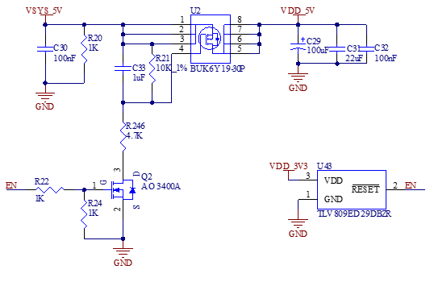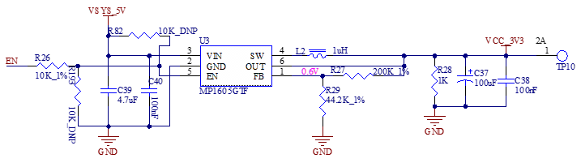

As shown in the figure, the 12V adapter supplies power to the development board through the power socket P9. Among them, VSYS\_5V supplies power to the SoM. After the SoM is powered on, it outputs VDD\_3V3, which makes the pin of the U43 power monitoring chip output a high - level signal to control the enable of U2 and U3 on the carrier board.

VDD\_3V3 ensures that the SoM is powered on first, followed by the carrier board. U43 prevents the carrier board from leaking electricity to the SoM.

If removing the S2 DIP switch due to structural requirements, you can solder the R10 resistor to achieve automatic power - on of the system hardware.

**Note:**

**When designing on your own, please refer to the power - on sequence of the development board design. That is, use VDD\_3V3 output from the SoM as the enable signal for the DC - DC power supply on the carrier board, so as to ensure that the SoM is powered on first and the carrier board is powered on later.**

### 3.5.2 Keys

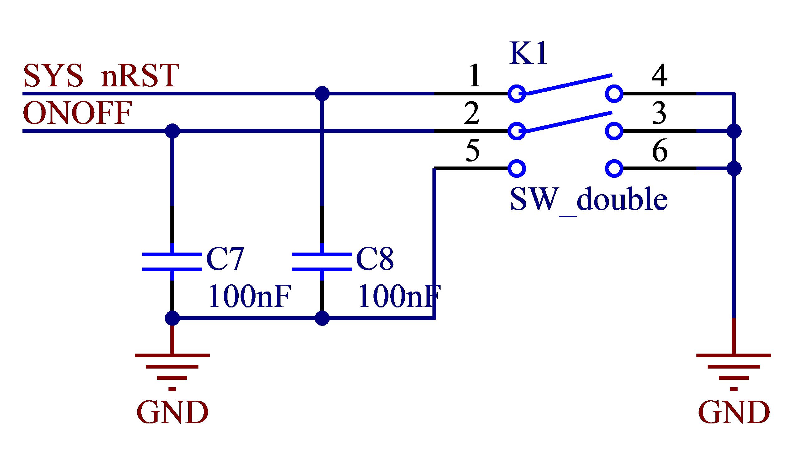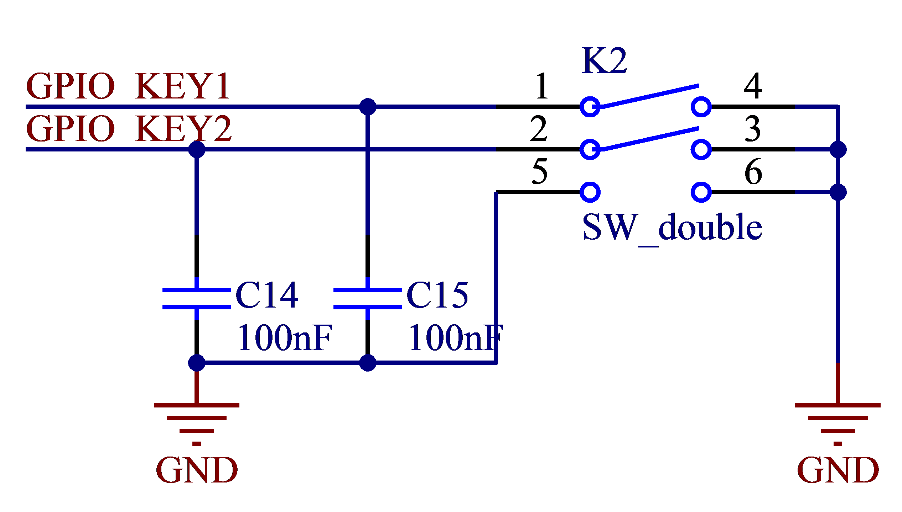

As shown in the above figure, SYS\_nRST is the system reset button. After pressing it, the development board will be powered off and reset.

ONOFF is the power - on/off button. In the ON mode, pressing this button will trigger an interrupt. Pressing and holding this button will enter the forced shutdown state. In the OFF mode, pressing this button will switch the internal power management state to the ON mode.

2 x GPIO are reserved, and you can customize your functions.

**Note: When the SYS\_nRST and ONOFF pins are not in use, please leave them floating and do not perform pull - up or pull - down processing.**

### 3.5.3 Boot Configuration

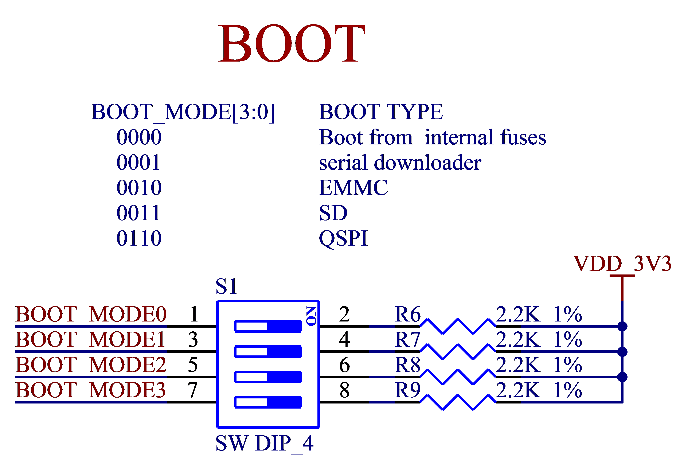

The carrier board uses an 4-bit DIP switch S1 to select the system boot mode. Please adjust the options before powering up the development board.

| **Boot Mode** **DIP Switch** | Internal fuses | Serial downloader | EMMC |  SD  | QSPI |
| -------------------------------- | :------------: | :---------------: | :--: | :--: | :--: |
| MODE3                            |      OFF       |        OFF        | OFF  | OFF  | OFF  |
| MODE2                            |      OFF       |        OFF        | OFF  | OFF  |  ON  |
| MODE1                            |      OFF       |        OFF        |  ON  |  ON  |  ON  |
| MODE0                            |      OFF       |        ON         | OFF  |  ON  | OFF  |

Internal fuses: Use the internal fuse bits of the chip to select the boot medium. By default, the fuse bits are not burned. It is not recommended  to use this method.

Serial downloader: Generally used for OTG downloading of images. Connect the development board to the computer’s USB port via a USB Type-C cable at the P14 interface, and use the program on the computer to flash the image to the development board.

eMMC: The development board program starts from the on - board eMMC of the SoM.

SD: The development board uses a TF card to boot the system. You can use this method to flash an image to the TF card.

QSPI: The development board program boots from the QSPI Norflash on the SoM.

**Note: The pull-up voltage of the BOOT signal is VDD\_3V3 output by the SoM.**

### 3.5.4 Debugging Serial Port

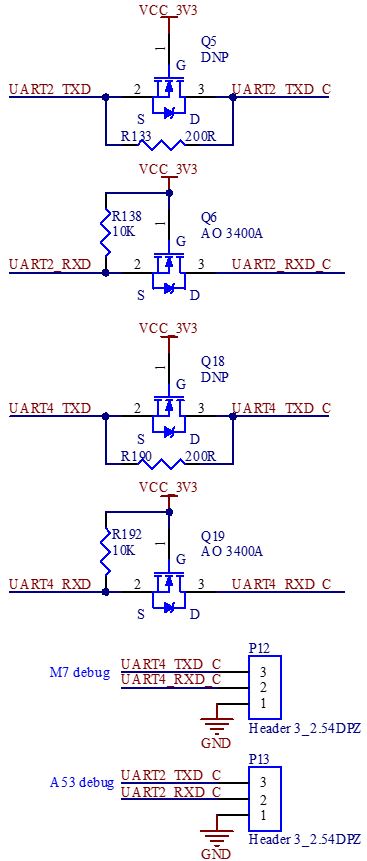

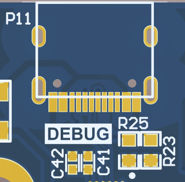 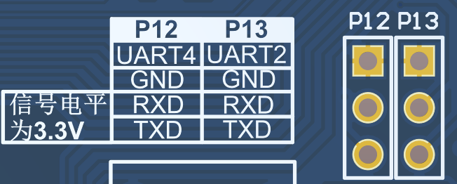

There are two debug serial ports on the SoM. UART2 is used for A53 debugging, and UART4 is used for M7 debugging.

To facilitate users, the two debug serial ports are integrated into one USB interface using the USB - to - serial chip CH342F.

To use the debug serial port, first install the CH342F driver on the computer. The driver download link is: http://www.wch.cn/products/CH342.h(http://www.wch.cn/products/CH342.html)tml. Then connect the P11 port of the development board to the computer’s USB port using a USB - to - Type - C cable. Two COM ports will be generated in the computer’s Device Manager. Among them, Port A is the A53 debug serial port, and Port B is the M7 debug serial port.

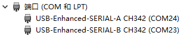

Open a debug terminal tool on the computer, such as Putty. Set the baud rate to 115200, the data bits to 8, no parity bit, and the stop bits to 1. Select the correct COM port, power on the development board, and you can see the debug serial port information.

You can also bring your own UART cable for the computer, and connect it to P12 or P13.

**Note:**

- **For the convenience of later debugging, please lead out the debugging serial port when designing the carrier board;**

- **The debug serial ports on the carrier board are designed to prevent electric leakage. It is recommended that users refer to this design.**

### 3.5.5 General Serial Ports

    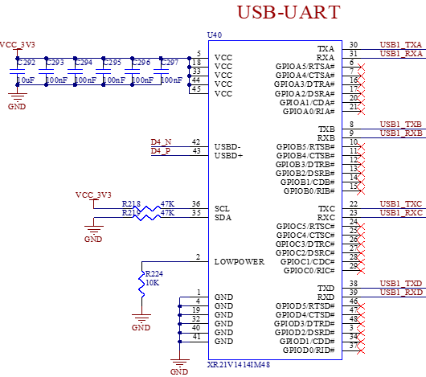

 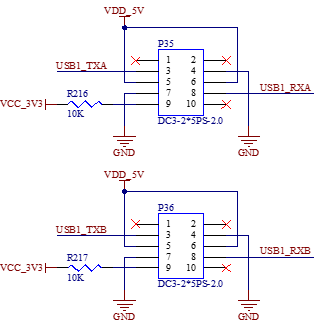

There is a built - in USB to 4 general serial ports on the development board. The UART data rate can reach up to 12Mpbs. It is led out through a 2\*5pin - 2.0mm pitch simple horn socket and can be externally connected to Forlinx’s serial port module.

### 3.5.6 CAN

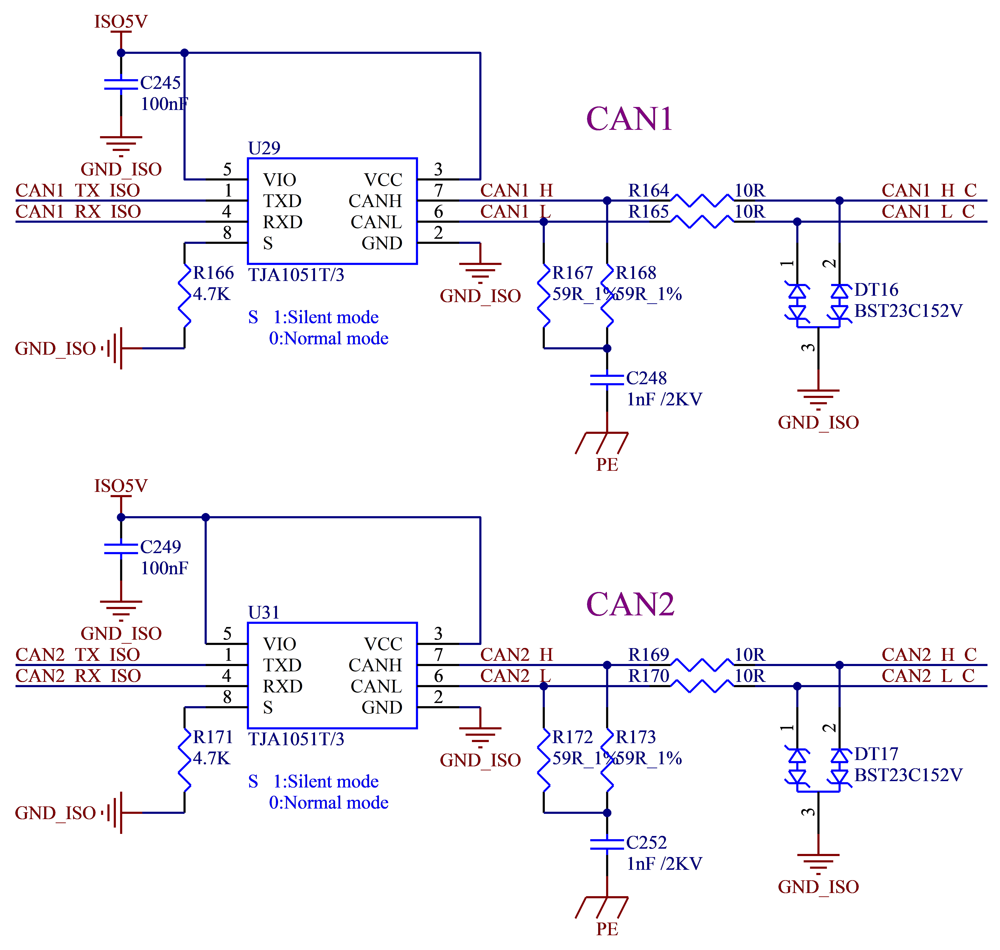

There are 2 x CAN on the development board, supporting CAN-FD, with 1500VDC electrical isolation and four-level electrostatic protection.

The connection is led out through the P29 terminal block. It is recommended to connect the devices to a common ground when using CAN communication.

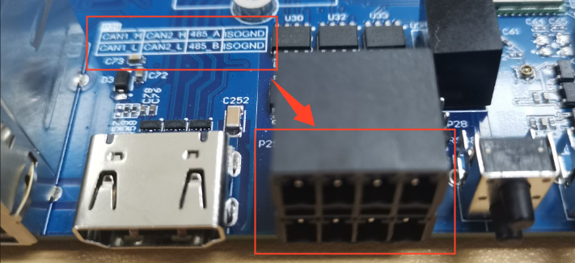

The locations of the CAN interface and RS485 interface are as shown in the above figure.

### 3.5.7 RS485

There are 1 x RS485 on the development board with 1500VDC electrical isolation and 4 - level electrostatic protection. The MAX13487 can automatically control the transmit - receive direction. P28 is a short - circuit jumper cap for the 120Ω termination resistor on the AB line. The connection is led out through the P29 terminal block. It is recommended to connect the devices to a common ground when using RS485 communication.

### 3.5.8 SPI

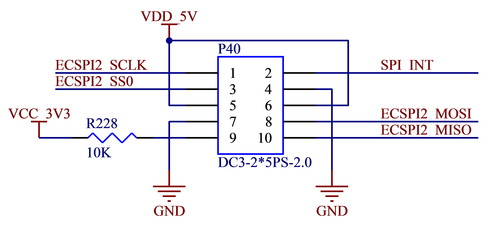

As shown in the figure above, the ECSPI2 is led out of the development board through the P40 simple horn to be used for external modules.

### 3.5.9 JTAG Interface

As shown in the figure above, the JTAG interface is led out through P38 from the development board, and the pin pitch is 1.27 mm. If this function is not used, this part of the pin can be floated.

BOOT\_MODE\[0:3], JTAG\_MOD and POR\_B must be pulled up to "111111" to enter to i.MX8M Plus Boundary Scan mode.

### 3.5.10 TF Card

As shown in the figure above, the TF Card of the development board is the SD2 channel of the CPU, which supports the TF card of UHS-I up to 104MB/s. The power supply VSD \_ 3 V3 of the TF card is provided by the SoM, and the power supply current is 400mA.

**Note:**

- **The pull-up resistor on the bus has been adapted on the SoM, so the pull-up can not be processed on the carrier board;**

- **The TF card is a hot-swappable device, so ESD protection should be implemented;**

- **SD signals must be length-matched.**

### 3.5.11 MIPI\_CSI Interface

There are two groups of MIPI \_ CSI. CSI1 are led out from the SoM through P31 and can be connected to the daA3840-30mc-IMX8MP-EVK camera module.

2 lane MIPI \_ CSI interfaces are led out through the FPC seat (P30) from the CSI2, for mounting the OV5645 camera, and supporting the highest resolution of 2592x1944 @ 15 fps by default. At the same time, all signals of CSI2 are led out from the P19 socket, which is convenient for you to debug other camera modules.

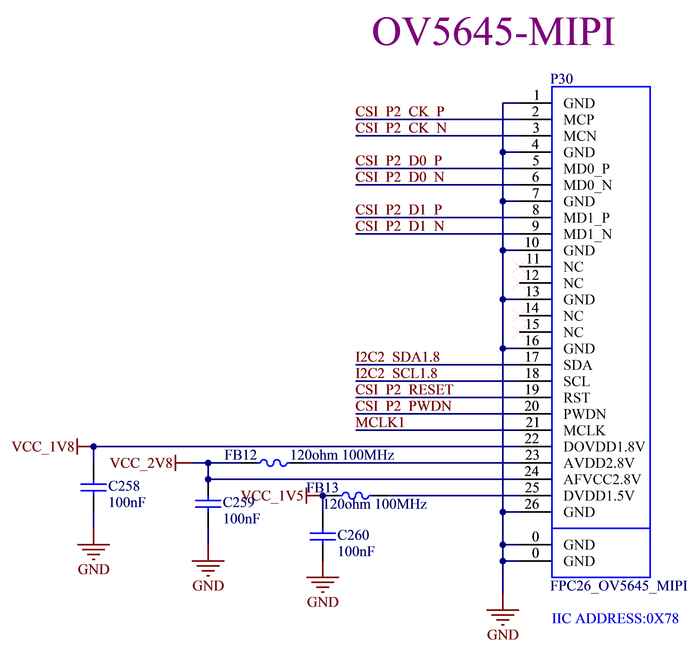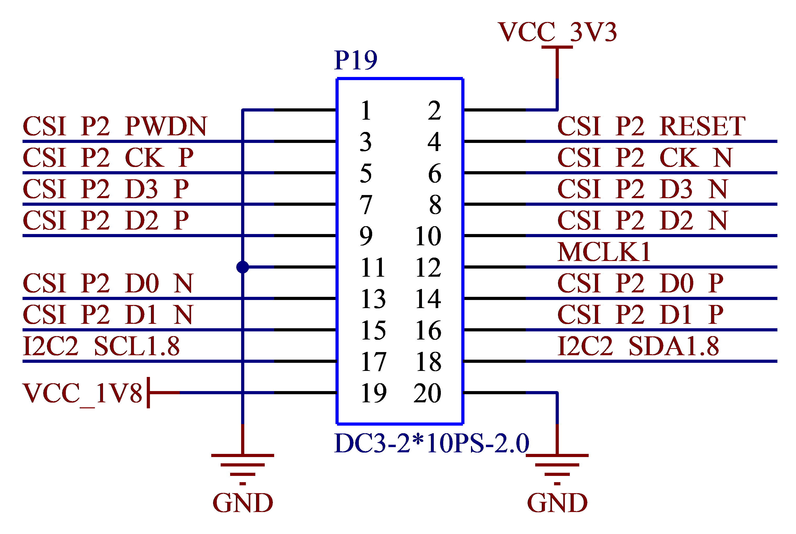

**Note: **

- **When designing the carrier board using other camera modules, please pay attention to the IO voltage and make level conversion;**

- **For MIPI, the data and clock lines need to be of equal length, and the differential impedance should be controlled at 100Ω.**

### 3.5.12 MIPI\_DSI Interface

As shown in the above figure, there is 1 x 4-lane MIPI\_DSI is led out via pin FPC socket, which is adapted to the 7-inch MIPI screen of Forlinx by default, and supports screen brightness adjustment and capacitive touch.

**Note:  For MIPI, the data and clock lines need to be of equal length, and the differential impedance should be controlled at 100Ω;.**

### 3.5.13 LVDS Interface

Two groups of 8-lane LVDS signals are all led out from the development board, and the pin spacing is 2.0mm, which can adapt to the 10.1-inch LVDS screen of Forlinx, and support screen brightness adjustment and capacitive touch.

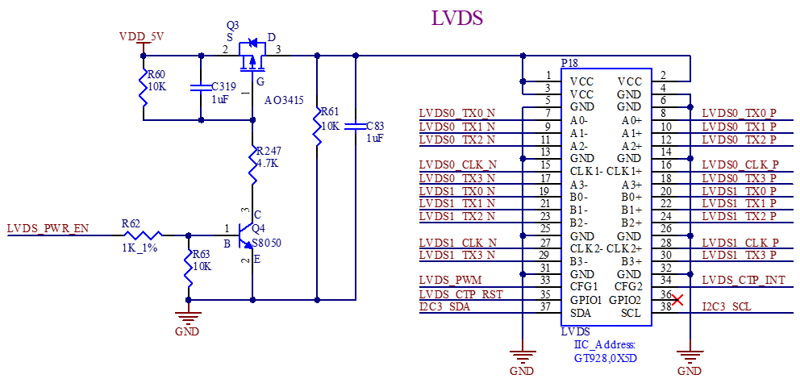

**Note:  For LVDS, the data and clock lines need to be of equal length, and the differential impedance should be controlled at 100Ω;.**

### 3.5.14 HDMI Interface

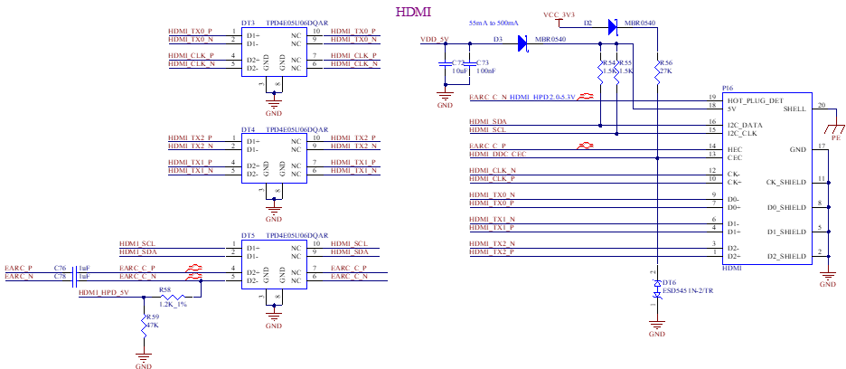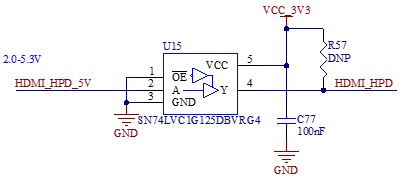

As shown in the figure above, 1 x HDMI is led out from the carrier board through P16, which supports HDMI 2.0 a display resolution up to 4Kp30 and supports HDMI 2.1 eARC. The HDMI circuit includes a level conversion circuit. Please refer to the design of the development board.

**Note:**

- **For HDMI, the data and clock lines need to be of equal length, and the differential impedance should be controlled at 100Ω;**

- **HDMI is a hot - pluggable interface. Please design an ESD protection circuit, and the ESD device selection should support the HDMI2.0 rate;**

- **Since 4K resolution display has relatively high requirements for signal quality, please use standard - compliant cables to connect the display.**

### 3.5.15 Audio

The development board features the NAU88C22 chip via SAI3, supporting two speaker outputs, two-channel headphone output, and 1 x MIC input. The 3.5mm audio socket P32 is designed according to the CTIA standard. If an OMTP headphone is inserted, the playback and recording functions will fail. It supports headphone hot - plug detection. When a headphone is inserted, the headphone will be used for sound playback preferentially.

The NAU88C22 chip speaker has a built-in Class D amplifier with a maximum power of 1W (8 Ω), and the headphone driver has a power of 40mW (16 Ω). If a larger amplifier needs to be connected externally, the signal can only be obtained from the headphone jack and not from the speaker interface.

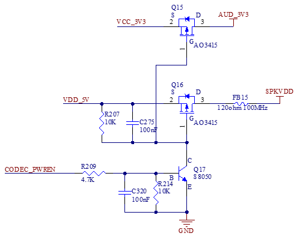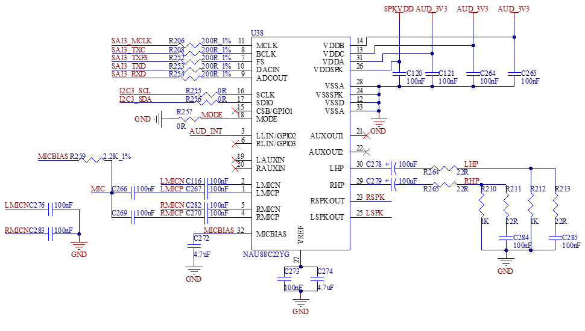

**Note:** 

- **The NAU88C22 chip is divided into a digital area and an analog area, and please pay attention to the device layout when designing the carrier board by themselves;**

- **Please ensure the power supply of the chip is well - regulated, which helps reduce the audio background noise.**

### 3.5.16 4G/5G

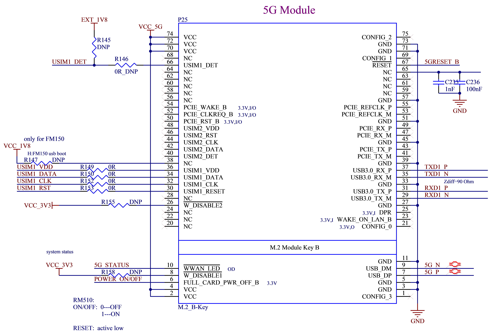

The development board can be externally connected with either a 4G module or a 5G module (choose one of the two). It supports 4G modules using the miniPCIE socket. By default, the Quectel EC20 is used. It also supports 5G modules using the M.2 Key B socket. By default, the Quectel RM500Q is used.

The 4G and 5G modules share a DCDC power supply, a SIM card holder, and a set of USB2.0 channels. Please install the module properly, select the correct DIP switch S3, and then power on the development board.

It uses a MicroSIM card. Please pay attention to the card insertion direction.

### 3.5.17 WiFi\&Bluetooth 

Development board onboard WIFI\&BT module set, default welding AW-CM358SM, WLAN: IEEE 802.11 a/b/g/n/ac dual-band WIFI, up to 433.3 Mbps transceiver rate; Bluetooth: Bluetooth 5, up to 3Mbps speed. To enhance signal quality, use a 2.4 \& 5GHz dual-band antenna.

**Note:**

- **Please pay attention to the IO voltage of the module and perform level conversion;**

- **SD signals must be length-matched.**

### 3.5.18 PCIE Interface

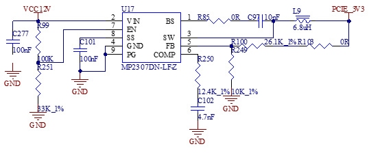

The development board provides a standard PCIEx1 adapter card socket, supporting PCI Express Gen3, which facilitates you to connect various PCIE devices. The PCIE\_REF\_CLK\_P/N on the SoM only supports input clock. The clock chip U41 on the carrier board is required to provide a bidirectional clock from the same source for the RC and EP.

**Note: Both the PCIe TX/RX data and the CLK reference clock need to have a differential impedance of 85Ω.**

### 3.5.19 USB HOST Interface

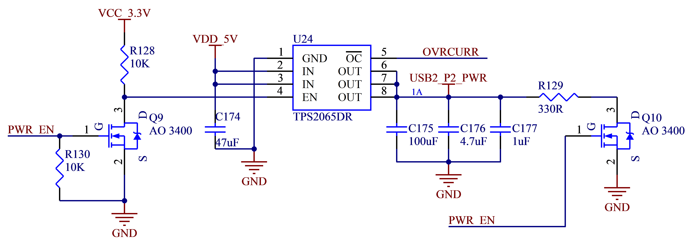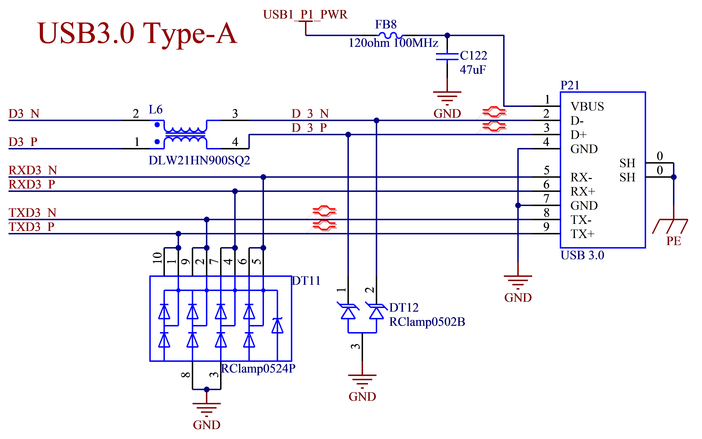

4 x USB3.0 interfaces are exended through the USB3.0 HUB CYUSB3304 on the development board. Among them, 2 x USB3.0 interfaces are led out through USB Type - A sockets, with power short - circuit protection function and a current limit of 1A. The over - current protection action is controlled by the USB HUB chip. If you do not use the HUB chip, please design the short - circuit protection circuit by themselves.

**Note:**

- **All USB data cables need to have a 90Ω differential impedance;**

- **Please select appropriate ESD devices.**

### 3.5.20 USB3.0 Type-C Interface

As shown in the above figure, the development board supports 1 x USB3.0 Type - C interface, supporting DFP, UFP, and DRP, which can be used for system programming.

To implement the Type - C interface, a CC control chip and a USB Switch are designed on the carrier board. If you have the same requirements, please refer to the development board design.

If you only need the USB2.0 OTG function, you can simplify the design as shown in the following figure:

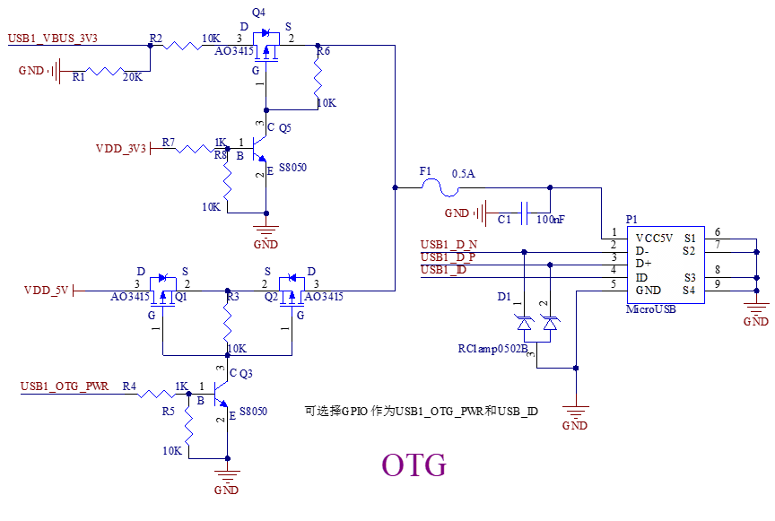

**Note:**

- **Only the native USB1 on the SoM supports USB system flashing;**

- **All USB data cables need to have a 90Ω differential impedance;**

- **Please select appropriate ESD devices;**

- **The USB1\_VBUS\_3V3 needs to detect voltage to enable the USB function normally.**

### 3.5.21  Ethernet Interface

The P20 on the development board is a double - layer RJ45 socket, supporting 10/100/1000Mbps auto - negotiation. Among them, the upper network port supports TSN.

The RGMII interface on the SoM is connected to the YT8521S PHY chip. The double - layer RJ45 socket used has a built - in network transformer. 

The internal structure is as shown in the following figure:

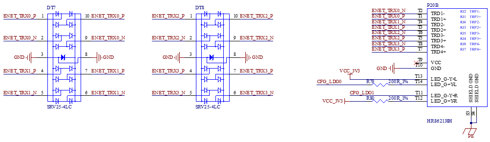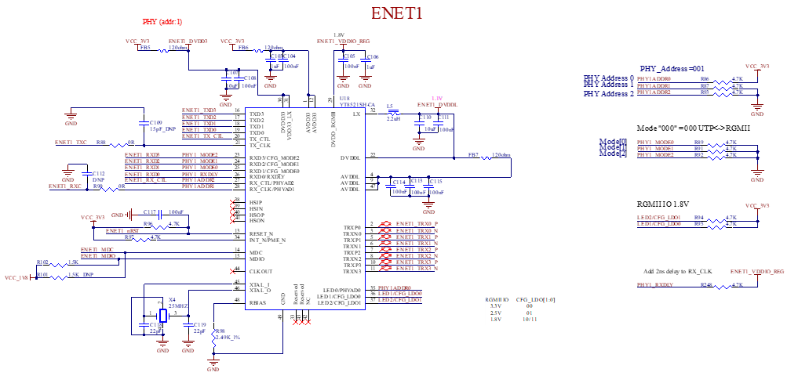

**Note:**

- **The TX and RX groups of the RGMII signals need to be equal - length within the group;**

- **The RGMII and MDIO/MDC have the same level, which can be configured by CFG\_LDO\[1:0];**

- **Pay extra attention to the several power supplies of YT8521S, as unstable voltage will cause the chip to malfunction;**

- **The analog differential lines of the network need to have a 100Ω differential impedance, and the inter - group equal - length requirement is ≤1000mil;**

- **It is recommended to use at least a 4 - layer board design to ensure that the traces have a complete reference layer;**

- **It is recommended to directly copy the schematic and PCB design of the development board.**

### 3.5.22 LED

As shown in the figure above, the development board is designed with 2 LED lights with GPIO control, and the you can customize your functions.

### 3.5.23 RTC

### 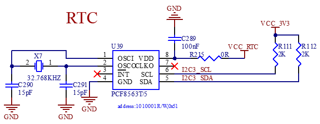
As shown in the figure above, the carrier board is externally connected to the RTC device through I2C3, and the VCC\_3V3 and the button battery are compatible for power supply through D5, that is, after the carrier board is powered off, the button battery can maintain power supply for the RTC chip. The hardware is designed to be compatible with both RX8010SJ and PCF8563T/5.
## 4\. Hardware Design Guide

**1. I2C Requirements**

Multiple slave devices can be connected on a single I2C bus, ensuring no address conflicts.

Pull - up resistors are required on the I2C bus, but multiple resistors should not be used for pull - up.

Please ensure level matching between the I2C on the SoM side and the I2C of the slave device.

**2. Watchdog Signal WDOG\_B**

On the SoM, WDOG is connected from the GPIO output of the CPU to the power chip. When the internal watchdog of the CPU is activated, this signal will be pulled low to trigger the reset action of the power chip. It is generally recommended to leave this signal floating on the carrier board.

**3. USB Design**

USB\_VBUS\_3V3 is a detection signal. The applied voltage cannot exceed 3.6V and it cannot be directly connected to the VBUS\_5V introduced by the USB socket.

If using a MicroUSB socket to implement the USB2.0 OTG design, GPIO can be used as the ID pin to identify the identity.

To meet the requirements of the USB eye diagram, the PCB trace length of USB3.0 TX/RX should not exceed 6 inches.

**4. AD28\_SD2\_RESET\_B signal**

The LD44 pin AD28\_SD2\_RESET\_B is connected to the enable pin of the VSD\_3V3 power supply in the SoM, which is used to reset the SD card on the carrier board. Please keep this signal floating on the carrier board.

**5. R26\_NAND\_DQS signal**

Please keep the RU75 pin R26\_NAND\_DQS floating on the carrier board.

**6. The unused signal pins of the SoM can be left floating, but please make sure to connect all the GND pins.**
**7. Power - on Sequence**
It is strongly recommended to refer to the development board design when designing the carrier board, use the VDD\_3V3 output from the SoM as the enable signal for power - on of the carrier board, and strictly control the power - on sequence. Or it may have the following influences:

·Excessive current during the power - on phase.

·The device fails to start.

·In the worst - case scenario, irreversible damage to the processor.

**8. Pin IO Leakage Problem Description**

Before the SoM is powered on, if there is a high-level sink current on the signal pins of the SoM, it will cause reverse power flow to the SoM. The most obvious phenomenon is that the red indicator light on the SoM will glow faintly, and a voltage can be measured on VDD\_3V3, which will lead to an incorrect power-on sequence. The most typical case is serial port leakage. Therefore, an anti-leakage design is made at the debug serial port on the carrier board. If your own-made carrier board also encounters such a situation, you can refer to the design of the development board.

## 5\. Connector Dimension Diagram

SoM Connector Dimension:

Carrier board Connector Dimension:

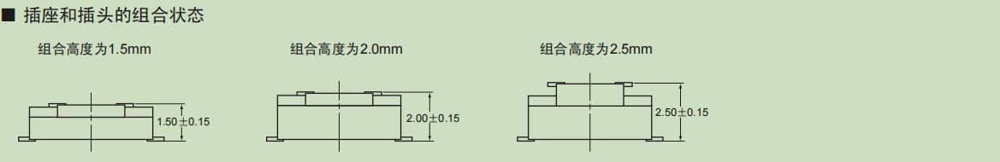

## 6\. OKMX8MPQ-C Development Board Power Consumption Table

Table 1. Linux system power consumption

| **No.** | **Test Item**                                     | **SoM Power (W)** | Development Board Power (including SoM) (W) |
| :-----: | ------------------------------------------------- | :---------------: | :-----------------------------------------: |
|         |                                                   |                   |                                             |
|    1    | No-load starting peak power                       |       4.09        |                    6.13                     |
|    2    | No-load standby peak power                        |       2.65        |                    4.45                     |
|    3    | CPU Stress + Memory + eMMC Read/Write Stress Test |       2.58        |                    4.56                     |
|    4    | LVDS+HDMI+ MIPI                                   |        2.7        |                    9.497                    |
|    5    | LVDS+MIPI+ov5640                                  |       2.94        |                    8.412                    |
|    6    | LVDS+PCIE WIFI                                    |       2.93        |                    8.51                     |
|    7    | LVDS+HDMI+TF card read and write                  |       2.68        |                    7.96                     |

Table 2 Power Consumption of the Whole Machine Under Android System

| **No.** | **Test Item**                    | **SoM Power (W)** | Development Board Power (including SoM) (W) |
| :-----: | -------------------------------- | :---------------: | :-----------------------------------------: |
|         |                                  |                   |                                             |
|    1    | No-load starting peak power      |       4.295       |                    6.359                    |
|    2    | No-load standby peak power       |       2.587       |                    4.395                    |
|    3    | LVDS+HDMI+ MIPI                  |       2.81        |                    9.518                    |
|    4    | LVDS+MIPI+ov5640                 |       2.63        |                    9.302                    |
|    5    | LVDS+PCIE WIFI                   |       2.99        |                    8.09                     |
|    6    | LVDS+HDMI+TF card read and write |       3.22        |                    8.152                    |

**Note: Test conditions: SoM configuration is 4G memory + 16GB eMMC, mipi camera is OV5645, LVDS screen and MIPI screen are optional products of Forlinx. SoM power supply is 5V and development board is 12V. 2\. Power consumption is for reference only.**                                                                                                                      

****

## 7\. Minimum System Schematic

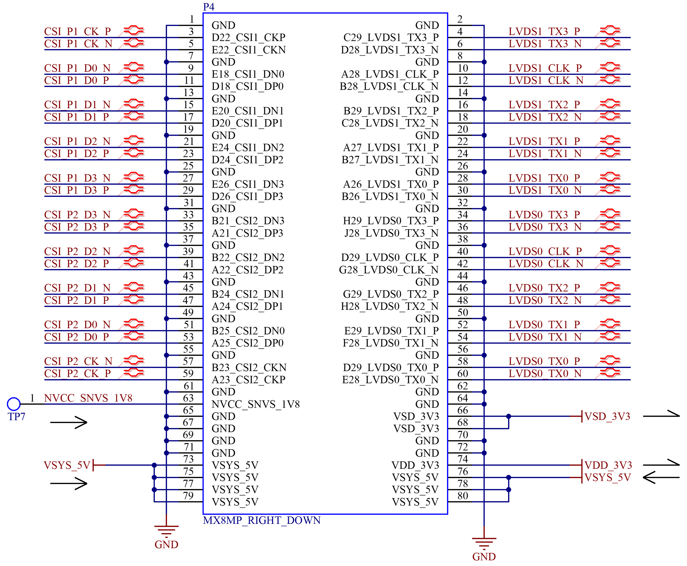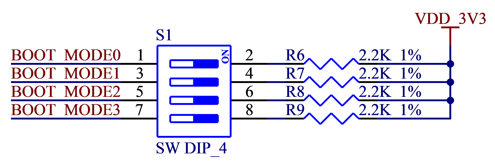

The above figure is only a schematic diagram. Please refer to the schematic diagram of the source file for the specific connection. In order to meet the normal operation of the SoM, in addition to the power supply VSYS \_ 5V, SYS \_ nRST keys, BOOT configuration circuit, OTG or SD card are also needed to facilitate the system programming and startup; UART2 and UART4 circuits are convenient to confirm whether the system works normally and to facilitate debugging.