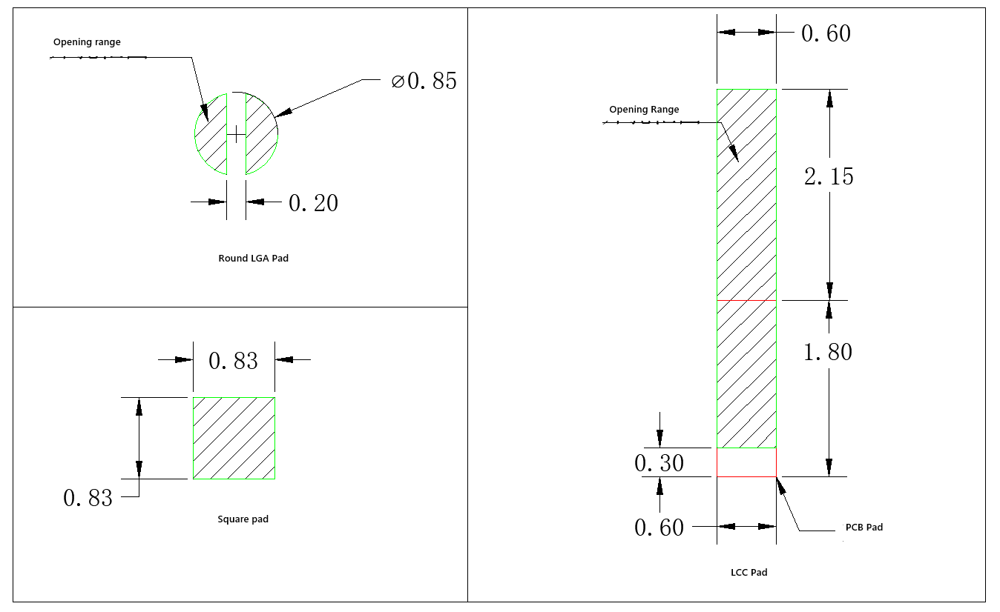

# Linux6.1.36\_User’s Manual\_V1.0

## Copyright

The copyright of this manual belongs to Baoding Folinx Embedded Technology Co., Ltd. Without the written permission of our company, no organizations or individuals have the right to copy, distribute, or reproduce any part of this manual in any form, and violators will be held legally responsible.

Forlinx adheres to copyrights of all graphics and texts used in all publications in original or license-free forms.  
The drivers and utilities used for the components are subject to the copyrights of the respective manufacturers. The license conditions of the respective manufacturer are to be adhered to. Related license expenses for the operating system and applications should be calculated/declared separately by the related party or its representatives.

## Overview

This manual is designed to help you quickly familiarize yourselves with the product, understand interface functions, and learn testing methods. It primarily covers the testing of development board interface functions, methods for flashing the image, and troubleshooting common issues encountered during use. During testing, certain commands have been annotated for better understanding, focusing on practicality and adequacy. For kernel compilation, related application compilation methods, and development environment setup, please refer to the “User’s Compilation Manual” provided by Forlinx..

There are five chapters:

+ Chapter 1. briefly introduces the development board’s interface resources, relevant driver paths in the kernel source code, supported flashing and boot methods, and key points in the documentation;
+ Chapter 2. describes two login methods: serial port login and network login;
+ Chapter 3. covers functional testing of the QT interface
+ Chapter 4. explains how to perform functional tests using command line operations;
+ Chapter 5. describes the SDK development and burning mode of the product.

## Application Scope

This software manual is applicable to the OK-MX9352-UP4 development board with 1G memory and 8G eMMC Flash configuration of Forlinx.

## Revision History

| **Date**| **Version**| **SoM Version**| **Carrier Board Version**| **Revision History**|
|:----------:|:----------:|:----------:|:----------:|:----------:|
| 14/07/2026 | V1.0| V1.1| V1.3 and above| User’s Manual Initial Version|

## 1\. OK-MX9352-UP4 Development Board Description

The FET-MX9352-UP4 SoM is based on the NXP-i.MX93 processor design and features two Arm Cortex A55 processors with speeds up to 1.7 GHz and one Arm Cortex M33 processor with speeds up to 250 MHz. It also integrates NPU of 0.5 TOPS, which can accelerate machine learning inference.

OK-MX9352-UP4 Development Board Interface Diagram:


**Note: Hardware specifications are not covered in this software manual. Before development, please refer to the “ User’s Hardware Manual” to understand the product naming and hardware configuration.**

### 1.1 Linux 6.1.36 System Software Resources

| **Device**| **Driver Source Code Location in the Kernel**| **Device Name**|
|----------|----------|----------|
| PWM Backlight Driver| drivers/pwm/pwm-flexio.c| /sys/class/pwm/|
| USB Interface:| drivers/usb/storage/|
| USB Mouse| drivers/usb/core/hub.c   drivers/hid/usbhid/| /dev/input/eventX|
| Ethernet| drivers/net/ethernet/freescale/fec\_main.c   |drivers/net/ethernet/stmicro/stmmac/dwmac-imx.c   drivers/net/ethernet/stmicro/stmmac/stmmac\_platform.c|
| TF Card Driver| drivers/mmc/host/sdhci-esdhc-imx.c| /dev/block/mmcblk1pX|
| EMMC Driver| drivers/mmc/host/sdhci-esdhc-imx.c| /dev/block/mmcblk0pX|
| OV5645| drivers/media/i2c/ov5645.c| /dev/videoX|
| <font style="color:#000000;">CSI</font>| drivers/staging/media/imx/dwc-mipi-csi2.c   drivers/staging/media/imx/imx8-isi-core.c|
| <font style="color:#000000;">RTC</font>| drivers/rtc/rtc-pcf8563.c| /dev/rtc0|
| <font style="color:#000000;">Type-c serial port</font>| drivers/tty/serial/fsl\_lpuart.c| /dev/ttyLP\*|
| RS485 serial port| drivers/usb/serial/xr\_serial.c| /dev/ttyUSB0   /dev/ttyUSB3|
| <font style="color:#000000;">USB to serial port</font>| drivers/usb/serial/xr\_serial.c| /dev/ttyUSB1   /dev/ttyUSB2|
| LED| drivers/leds/leds-gpio.c|
| Audio Driver| sound/soc/codecs/nau8822.c| /dev/snd/|
| Watchdog| drivers/watchdog/imx7ulp\_wdt.c| /dev/watchdog|
| Can driver| drivers/net/can/flexcan.c|
| Bluetooth driver| drivers/bluetooth/\*|
| WIFI Driver| drivers/net/wireless/realtek/rtl8723DU/|
| 4G driver| drivers/net/usb/GobiNet\*|
| I2C driver| drivers/i2c/busses/i2c-imx-lpi2c.c|
| Mipi display driver| drivers/gpu/drm/panel/panel-forlinx-mipi.c| /dev/fb0|
| Lvds display driver| drivers/gpu/drm/panel/panel-simple.c| /dev/fb0|
| Rgb display driver| drivers/gpu/drm/panel/panel-simple.c| /dev/fb0|
| GT911 touch driver| drivers/input/touchscreen/goodix.c| /dev/input/eventX|
| GT928 touch driver| drivers/input/touchscreen/goodix.c| /dev/input/eventX|
| TSC2007 touch driver| drivers/input/touchscreen/tsc2007.c| /dev/input/eventX|
| FT5X06 touch driver| drivers/input/touchscreen/edt-ft5x06.c| /dev/input/eventX|

### 1.2 Flashing \& Boot Setup



The OK-MX9352-UP4 supports both TF card flashing and OTG flashing, as well as booting from eMMC and TF card. As shown in the figure below, the DIP switch is set for eMMC boot:


As shown in the figure below, the DIP switch is set for OTG flashing:


## 2\. Fast Startup

### 2.1 Preparation Before Startup

Development Login methods: Serial login and network login.                                                              

Hardware preparations before powering on the system:

+ 12V 3A DC Power Cable
+ USB Type-C cable (for serial port connection)
+ Ethernet cable (for network login)
+ Check the start mode DIP switch.

Please check the black DIP switch on your development board to ensure it is set to the desired boot mode. For details on boot mode settings, please refer to "[**1.3 Flashing and Startup Configuration**](https://forlinx-book.yuque.com/okypkp/dfmrkd/mxqqmnut8c0vsnq0#VqzEt)"[.](https://forlinx-book.yuque.com/okypkp/dfmrkd/mxqqmnut8c0vsnq0#VqzEt)


### 2.2  Configuring HyperTerminal

#### 2.2.1 Serial Port Login

**Note:**

+ **Settings: Baud rate 115200, 8 data bits, 1 stop bit, no parity/flow control;**
+ **Log in to the serial terminal as the root user; no password is required;**
+ **Software Requirements:  
A serial terminal application must be installed on the PC Windows. There are various terminal programs available, and you may choose any one you are familiar with.**

The following section uses PuTTY as an example to explain how to configure a terminal:

Step 1: Connect the development board to the PC using a serial cable. Check the serial port number used by the computer; you can find this in ‘Device Manager’. Use the port number actually recognised by the computer as the correct one. SERIAL-A is the serial port for the A core, and SERIAL-B is the serial port for the M core;


Step 2: Configure PuTTY: Open PuTTY. In the “Serial line” field, enter the identified COM port and set the baud rate to 115200;


Step 3: Log in using the username ‘root’ and leave the password blank; Press Enter.

```bash
NXP i.MX Release Distro 6.1-mickledore ok-mx93 ttyLP0

ok-mx93 login: root
root@ok-mx93:~# 
```

Step 4: Check the kernel version information (the information may vary slightly depending on the kernel version).

```bash
root@ok-mx93:~# cat /proc/version
Linux version 6.1.36 (forlinx@ubuntu) (aarch64-poky-linux-gcc (GCC) 12.3.0, GNU ld (GNU Binutils) 2.40.0.20230620) #1 SMP PREEMPT Fri Feb 23 11:03:02 CST 2024
```

As can be seen from the printout, the SoM has been programmed with a Linux 6.1.36-related image.

You can also view the kernel version information using the uname -a command:

```bash
root@ok-mx93:~# uname -a
Linux ok-mx93 6.1.36 #1 SMP PREEMPT Fri Feb 23 11:03:02 CST 2024 aarch64 GNU/Linux
```

#### 2.2.2 Common Serial Port Issues

Common troubleshooting points when logging in via a serial port include the following scenarios:

Scenario 1: No message is printed after connecting the serial port:

- First, check that the DIP switch is set correctly;
- Please reopen the serial port;
- Try using a different serial cable to test it;
- If none of the above works, check the status of the LEDs on the SoM. If the LED is not flashing (i.e. not showing a ‘heartbeat’), it is likely that the system has failed to boot and will need to be reprogrammed.

Scenario 2: Unable to enter commands after connecting the serial port:

- Try reopening the serial port;

- Plug the USB-to-serial cable into a different USB port on the computer, check the corresponding COM port in Device Manager, and reopen the serial port;
- Replace the serial cable.

Scenario 3: Device Manager has not recognised the port:

The serial port driver is not installed. Please try installing the serial port driver.

+ Path: OK-MX9352-UP4 (Linux) User Data\\Tools\\CH343CDC.EXE

### 2.3 Network Login

In addition to using the debug UART for login, the OK-MX9352-UP4 supports SSH network login to the development board, as well as FTP file transfer..

#### 2.3.1 Network Login Test

**Note:**

+ **The default factory IP address for eth0 is 192.168.0.232; eth1 has not been configured;**
+ **The computer and the development board need to be in the same network segment during the test.**

Before logging in to the network, you need to ensure that the network connection between the computer and the development board is normal. You can test the connection status between the computer and the development board through the ping command. Specific Operations:

Connect the eth0 of the development board to the computer via a network cable, power on the development board, and after the kernel starts, the Blue heartbeat light on the SoM will flash. After the network card connected to the computer starts normally, the network card light will flash rapidly. At this point, you can test the network connection;


Disable the computer firewall

Temporarily disable the computer’s firewall (this is a general operation; specific steps depend on your Windows version);


Open Command Prompt as administrator

Press Win + R, type cmd, then press Ctrl + Shift + Enter to run Command Prompt as administrator;


Data is returned, indicating that the network connection is normal.

#### 2.3.2 SSH

The OK-MX9352-UP4 development board supports SSH services, which are automatically enabled when the board boots up; once an IP address has been configured, it can function as an SSH server. You can use SSH to log in to the development board for development and debugging, and you can also use SCP for file transfer.

**Note:**

+ **The default account for SSH login is “root” without password;**
+ **The default IP address for the eth0 interface is 192.168.0.232;**
+ **You can use the scp command for file transfers.**


After clicking “Open”, a dialog box will appear. Click “Yes” to proceed to the login interface.


```bash
login as: root //Enter the board root account as prompted
root@ok-mx93:~#
```

When logging in using PuTTY, the following error message appears. This is due to an issue with the PuTTY version, so you will need to update PuTTY:


You can use WinSCP (which you will need to install yourself) to copy files. Log in as follows:


Login was successful to the /home/root directory, as shown below:


Change to the home directory as follows:


On a Windows system, the command-line procedure is as follows:

```bash
C:\Users\Administrator>ssh root@192.168.0.232
```


When logging in for the first time, you will need to type “yes” as prompted to confirm the connection; to log out, type “exit”.

Taking the example of copying the “Image” folder from the current directory to the root directory of the development board, enter the following command:

```bash
C:\Users\Administrator>ssh root@192.168.0.232
```


**Note: If SSH is not supported on your PC, please install it yourself.**

If the following error message appears, as shown in the figure below:


This situation indicates that you have previously logged in via SSH to another development board with the same IP address; consequently, the above error is reported when attempting to log in to a development board on a different platform. To resolve this, enter the following two commands:

```bash
C:\Users\Administrator>cd .ssh
C:\Users\Administrator\.ssh>del  known_hosts
```

Once you have completed the above steps, simply re-enter the ssh command to log in.

#### 2.3.3 FTP

The OK-MX9352-UP4 development board supports FTP services, which are automatically enabled when the board boots up; once an IP address has been configured, it can function as an FTP server. The following describes how to utilize the FTP tool for file transfer.

+ Path: OK-MX9352-UP4 (Linux) User Data\\Tools\\FileZilla\*

Install the FileZilla tool on Windows and configure it by following the steps shown in the image below. The username and password are both “forlinx”; you can also log in using the username “root” with no password.


After successful login, upload and download operations can be performed.


### 2.4 eMMC Storage Partition Table

The table below details the eMMC storage partition information for the Linux operating system:

Boot Partition

| **Name**| **Offset**| **Size**| **Filesystem**| **Content**|
|:----------:|:----------:|:----------:|:----------:|:----------:|
| mmcblk0boot0| 0| 4MB| No| Storage uboot|

User Partition

| **Name**| **Offset**| **Size**| **Filesystem**| **Content**|
|:----------:|:----------:|:----------:|:----------:|----------|
| bootloader| 32KB| 4064KB| No| Storage uboot|
| env| 4MB| 16KB| No| Storing U-Boot environment variables|
| mmcblk0p1| 8MB| 120MB| FAT32| Storing the kernel image and device tree|
| mmcblk0p2| 128MB| 7.2G| Ext4| Filesystem|

**Note: The U-Boot only needs to be stored in either the Boot partition or the User partition. If U-Boot exists in both partitions, the U-Boot in the Boot partition will be given priority during startup.**

To check disk usage on the system, use the df command. Using df -m displays the file system disk space usage in MB. The following is the factory default disk usage (using the Qt filesystem) for reference only. Actual parameters may vary.

```bash
root@ok-mx93:~# df -m
Filesystem     1M-blocks  Used Available Use% Mounted on
/dev/root           6799  2922      3539  46% /
devtmpfs             359     1       359   1% /dev
tmpfs                488     0       488   0% /dev/shm
tmpfs                196     9       187   5% /run
tmpfs                  4     0         4   0% /sys/fs/cgroup
tmpfs                488     1       488   1% /tmp
tmpfs                488     1       488   1% /var/volatile
tmpfs                 98     0        98   0% /run/user/0
/dev/mmcblk0p1       120    31        90  26% /run/media/Boot-mmcblk0p1
```

Use the free command to view memory usage. The following shows the memory usage when no peripherals are connected (for reference only). Actual parameters may vary.

```bash
root@ok-mx93:~#free
               total        used        free      shared  buff/cache   available
Mem:          998816     100472      792464   12444  105880      797184
```

### 2.5 System Shutdown

In general, you can directly power off the system. However, if operations such as data storage or functional usage are in progress, avoid cutting power abruptly to prevent irreversible file damage, which may require re-flashing the firmware. To ensure all data is fully written, you can execute the sync command to complete data synchronization before powering off.

Rebooting the Development Board: Execute the reboot command. Alternatively, you can perform a hardware restart by pressing the RESET button or by powering off and on the device directly.

**Note: For products designed based on the SoM:, if unexpected power loss during use leads to system abnormalities, consider implementing measures such as power-loss protection in the design.**

### 2.6 Screen Switch

OK-MX9352-UP4 supports mipi, LVDS, RGB and other screen interfaces. There are currently three methods for controlling screen switching: specification via the kernel device tree, dynamic control via the U-Boot menu, and the U-BootMenu application within the Qt interface.

The OK-MX9352-UP4 currently supports MIPI 1024x600 capacitive touchscreens, LVDS 1280x800, LCD 1024x600, LCD7 800x480 capacitive touchscreens and LCD7 800x480 resistive touchscreens.

#### 2.6.1 Dynamic Control via U-Boot Menu

This method allows you to switch between supported display screens without recompiling or re-flashing the system.

**2.6.1.1  Menu Overview and How to Switch Screens**

During the U-Boot startup process, press the Spacebar to enter the U-Boot menu.

There are three options in the menu:   
Enter 0 to access the U-Boot command line;   
Enter 1 to restart U-Boot;   
Enter 2 to access the configuration menu.

---


0: Exit to console

1: Reboot

2: Display type

---


Select 1

The screen configuration menu offers three options:  

- Enter **0** to return to the previous menu.  
- Enter **1** to switch the content of option 1 and configure **Screen 1**. The supported screen types include:  
  - MIPI 1024×600 capacitive touchscreen  
  - LVDS 1280×800  
  - LCD7 1024×600  
  - LCD7 800×480 capacitive touchscreen  
  - LCD7 800×480 resistive touchscreen

Select 2

---


select display panel type

0: Exit

1: primary display rgb1024x600

---


Once you have selected the required settings, enter 0 to return to the previous menu. Restarting U-Boot or booting the system via the command line will both apply the screen settings.

For example: The default output is LVDS 1280x800; this needs to be changed to an LCD 1024x600 screen.

During the U-Boot startup process, press the Spacebar to enter the U-Boot menu. Select 2->1->1->1->0->1 and restart. Specific Operations:

#### 2.6.2 Kernel Device Tree Specification

The device tree path is: OKMX93-linux-sdk/OKMX93-linux-kernel/arch/arm64/boot/dts/freescale/OK-MX9352-S.dts

In this mode, the default screen display of the system can be set as the expected mode, and it is not necessary to connect the serial port terminal for selection, which is suitable for mass production. However, manual modification of the device tree is required, followed by regeneration of the system image. The priority of this mode is higher than dynamic control of uboot menu.


In the kernel source code, open the OK-MX9352-S.dts file and locate the forlinx\_control node:

**Parameter description:**

| | **Meaning**|
|----------|----------|
| status| Describe the node status: disabled is to close the node, okay is to enable the node.|
| video-vp0| Description of the vp0 output channel configuration|

You can modify the configuration parameters as required; once saved, the image must be recompiled.

As described in the comments for this node:

video-vp0 can only be set to “rgb1024x600”, “rgb800x480\_capacitive”, “rgb800x480\_resistive”, “lvds”, “mipidsi” and “disabled”, which correspond to RGB 1024x600, RGB 800x480 capacitive touchscreen, RGB 800x480 resistive touchscreen, LVDS, MIPiDSI and display disabled, respectively. (All other values are treated as disabled). Screen type compatible with Forlinx screens.

For other custom screens, the relevant panel nodes in the OK-MX9352-S.dts file corresponding to LVDS or RGB must be modified in accordance with the timing parameters.

For example, when powering up an RGB 800×480 capacitive touchscreen, the recommended settings are as follows:

forlinx\_control {

```plain
status = “okay”;

video-vp0 = “rgb800x480_capacitive”;
```

};

### 2.7 Resistive Touchscreen Recalibration

Set the DIP switch to the LCD resistive touchscreen mode, and after selecting “LCD7 800x480 resistive touchscreen” from the U-Boot menu, the system will automatically enter the calibration interface upon its first boot. Once calibration is complete, a calibration file, “/etc/udev/rules.d/weston-calibrate.rules”, will be generated.

If you need to recalibrate or replace the screen, you can delete /etc/udev/rules.d/weston-calibrate.rules and then restart the system to perform recalibration.

## 3\. Interface Function Usage

This section requires a screen to follow the instructions; users without a display may skip this section. Forlinx has made numerous optimisations to the interface functionality and provides a wide range of test programmes for reference. However, due to limitations, users are advised not to use Forlinx test programmes directly when developing their own products; instead, they are encouraged to write their own applications.

+ Path to the QT test programme source code: OK-MX9352-UP4 (Linux) User Data/Linux/Source Code/OKMX93-linux-sdk.tar.bz2

After extraction: OKMX93-linux-sdk/appsrc/forlinx-qt

The Qt examples provided by Forlinx are primarily intended as a reference for hardware interface calls; for Qt components, special effects and the like, we recommend consulting the official Qt examples.

+ Path to the test programme in the development board’s file system: /usr/bin/fltest\_qt\_\*

**Note: The QT virtual keyboard is not currently supported; please use a USB keyboard.**

### 3.1 Interface Function Description

After booting, the development board will display the following desktop:


### 3.2 Recording Test

The “audiorecorder()” icon on the desktop is a simple audio recording test application that can be used to check whether the headphone microphone is working properly. The interface is shown below.


Set the AudioCodec to Wave and the File Container to Wave file.

Click “SaveFile” to select a location for the audio file; by default, it is saved in the / path.

Tap “Record” to start recording.

Tap “Stop” to stop recording.

Tap “exit”to close the app.

### 3.3 Music Playback Test

“Musicplayer（）” is a simple audio test application that can be used to test whether the sound card functions normally and also serves as a simple audio,：


Click the “Open” button in the bottom left-hand corner and select the test audio file /home/forlinx/audio/test.mp3


**Note: If you find that there is no sound coming from your headphones or speakers, please refer to the “Audio Testing” section in Chapter 4 to enable the headphones and turn up the volume.**

### 3.4 4G Test

The “4G（）” test program is used to test the OK-MX93 external 4G module (EC20). Before testing, please switch off the development board, connect the external module, insert the SIM card (a China Unicom SIM card was used for this test), and then switch on the development board and open the test application.

Click the connect button, and the program will automatically enter the dial-up process and obtain IP settings, DNS, etc..


Once the connection has been established, you can click the “ping” button to run a ping test.


Click the “Exit” button to exit the test.

### 3.5 WIFI Test

“WIFI（）” is a tool for configuring WiFi and can test the STA mode of WiFi.

**This feature is not currently supported.**

### 3.6 Network Configuration Test

**Note: The IP and other information configured in static mode will be saved in the system's relevant configuration files, so the network settings will persist after each reboot. However, the network information configured in DHCP mode does not need to be considered, as an IP address will be dynamically assigned each time the system restarts.**

Upon start-up, the OK-MX9352’s network card is set to DHCP by default. You can select between DHCP and STATIC modes via the “Network ()” configuration application; in STATIC mode, you can configure the IP address, subnet mask, gateway and DNS.

DHCP mode interface is as follows:


Select DHCP, choose the network card device to be configured in the “interface” section, and click “Apply and Restart Network” at the bottom of the interface to automatically restart the network and obtain an IP address.

STATIC mode interface is as follows:


Select the network card device to be configured in the Interface. Enter the desired IP address in the IP field. Enter the subnet mask in the Netmask field. Enter the gateway address in the Gateway field. Enter the DNS server address , in the Gateway field, . Once you have filled in all the details above, click “Apply and Restart Network” at the bottom of the screen to configure a static IP address based on the settings above.

### 3.7 Ping Test

Ping（）” is an interface version of the commonly used network test command ping. The interface is as follows:


Enter the target IP address you wish to ping in the “hostname” field. Once you click the “Ping” button, the results will be displayed in the “Result” field; as shown in the figure, this indicates that the network connection between the two is working properly. Click “Stop” to stop the ping test; click “clear” to clear the information in ‘result’.

### 3.8 Watchdog Test

“WatchDog（）” is an application used to test whether the watchdog function is normal. The interface is as follows:


Tick the “feed dog” box and click the “open watchdog” button; the watchdog function will then be activated and the programme will perform the ‘feed dog’ operation. Under normal circumstances, the system will not restart. Click the “close watchdog” button; the programme will then stop the “feed dog” operation, but the watchdog will remain active, and the system will restart after 10 seconds.

Uncheck “feed dog”, click the “open watchdog” button, and the watchdog function will be started. The program does not perform dog feeding operations. About 10 seconds after opening the watchdog, the system reboots, indicating the watchdog function is normal.

### 3.9 RTC Test

“RTC（）” test software to view and set the current system System Developer Clock, as shown below:

Click "Set" to configure the time, then click "Save" to apply the changes.

With the RTC backup battery installed, you can reboot the development board to confirm that the RTC clock has been successfully set.

### 3.10 Serial Port Test

“Terminal（）”, this feature is not available.

### 3.11 Backlight Test

“BackLight()” is an app for adjusting the LCD backlight; when you tap to open it, the interface appears as follows:


Drag the slider on the interface to adjust the screen backlight brightness; level 0 is the lowest brightness (with a backlight value of 1), whilst level 255 is the highest brightness.

### 3.12 Camera Test

Click the “Camera”(  ) icon on the desktop to test it.

Tap “Camera Video” to select a camera device.

Note: In the absence of an MIPI camera, the UVC camera corresponds to the device /dev/video0; if an MIPI camera is present, the UVC camera corresponds to /dev/video1. Please select the appropriate device based on the actual hardware configuration.


Click camera resolution to select the desired resolution.


After configuring the device and resolution, click Start to begin preview. The preview effect is shown in the figure below.


Click picture to capture a photo, which will be saved in the /home/root/ directory.

**Note: The photo capture function is only available after starting the preview.**

Click “Stop” to end the preview.

### 3.13 U-Boot Menu Configuration

Click the UbootMenu() icon to enter the U-Boot menu configuration interface for testing.

In the test programme configuration menu of U-Boot, you can configure the LCD screen resolution, LVDS screen resolution, single or dual-screen mode, display mode and so on.

The display screen configuration interface is as follows:


When LVDS is configured, the desktop is displayed via LVDS. Once the configuration is complete, click “Exit” to exit; the configuration will take effect after a restart.

## 4\. Command Line Function Testing

The OK-MX9352-UP4 platform comes with a rich set of command-line tools for users to utilize. You can explore the interfaces and features of the development board through command-line programs. However, due to limited functional coverage, it is not recommended to directly use Forlinx test programs for product development. Instead, it is advised to write custom applications based on actual usage scenarios.

+ Command-Line Test Program Source Path (for Linux):
  

OK-MX9352-UP4 (Linux) User Data/Linux/Source/OKMX93-linux-sdk.tar.bz2

After extraction, the path is:

OKMX93-linux-sdk/appsrc/forlinx-cmd

+ Test Program Path on the Development Board File System:
  

/usr/bin/fltest\_\*

The test program used in the test in this section has been integrated in the Demo provided by Forlinx, so the file source is not described, and the command operation is directly performed.

### 4.1 System Information Query

To view kernel and cpu information, enter the following command:：

```bash
root@ok-mx93:~# uname -a
Linux ok-mx93 6.1.36-gc97ce885c0b2-dirty #338 SMP PREEMPT Wed Jun 11 11:43:59 CST 2025 aarch64 GNU/Linux
```

View operating system information:

```bash
root@ok-mx93:~# cat /etc/issue
NXP i.MX Release Distro 6.1-mickledore \n \l
```

To view environment variable information:

```bash
root@ok-mx93:~# env 
SHELL=/bin/sh
EDITOR=vi
QTWEBENGINE_DISABLE_SANDBOX=1
PWD=/home/root
LOGNAME=root
XDG_SESSION_TYPE=tty
MOTD_SHOWN=pam
HOME=/home/root
LANG=en_US.UTF-8
WAYLAND_DISPLAY=/run/wayland-0
QT_QPA_PLATFORM=wayland
QMLSCENE_DEVICE=softwarecontext
XDG_SESSION_CLASS=user
TERM=linux
USER=root
SHLVL=1
XDG_SESSION_ID=c2
XDG_RUNTIME_DIR=/run/user/0
PS1=\u@\h:\w\$
LC_ALL=en_US.UTF-8
HUSHLOGIN=FALSE
PATH=/usr/local/bin:/usr/bin:/bin:/usr/local/sbin:/usr/sbin:/sbin
DBUS_SESSION_BUS_ADDRESS=unix:path=/run/user/0/bus
MAIL=/var/spool/mail/root
_=/usr/bin/env
```

### 4.2 Sleep and Wake-Up Test

The OK-MX9352-UP4 platform supports the sleep-to-wake function.

Configure serial port wake-up:

```bash
root@ok-mx93:~# echo enabled > /sys/class/tty/ttyLP0/power/wakeup
```

Sleep mode:

```bash
root@ok-mx93:~# echo mem > /sys/power/state 
[   40.831033] GobiNet 1-1.3:1.4: Packet Dropped
[   42.124889] GobiNet 1-1.3:1.4: Packet Dropped
[   44.147451] GobiNet 1-1.3:1.4: Packet Dropped
[   46.034494] kauditd_printk_skb: 4 callbacks suppressed
[   46.034505] audit: type=1334 audit(1677837001.272:16): prog-id=10 op=UNLOAD
[   46.046667] audit: type=1334 audit(1677837001.272:17): prog-id=9 op=UNLOAD
[   46.167492] GobiNet 1-1.3:1.4: Packet Dropped
```

Click the serial port to wake up:

```bash
[   61.968918] rtc-pcf8563 2-0051: low voltage detected, date/time is not reliable.
[   61.976969] imx-dwmac 428a0000.ethernet eth1: Link is Down
[   61.977245] imx-dwmac 428a0000.ethernet eth1: FPE workqueue stop
[   62.002722] PM: suspend devices took 0.040 seconds
[   62.005273] Disabling non-boot CPUs ...
[   62.005680] psci: CPU1 killed (polled 0 ms)
[   62.007684] Enabling non-boot CPUs ...
[   62.007842] Detected VIPT I-cache on CPU1
[   62.007884] cacheinfo: Unable to detect cache hierarchy for CPU 1
[   62.007894] GICv3: CPU1: found redistributor 100 region 0:0x0000000048060000
[   62.007931] CPU1: Booted secondary processor 0x0000000100 [0x412fd050]
[   62.008209] CPU1 is up
[   62.058647] imx-dwmac 428a0000.ethernet eth1: configuring for phy/rgmii-id link mode
[   62.096319] imx-dwmac 428a0000.ethernet eth1: No Safety Features support found
[   62.096335] imx-dwmac 428a0000.ethernet eth1: IEEE 1588-2008 Advanced Timestamp supported
[   62.096502] imx-dwmac 428a0000.ethernet eth1: FPE workqueue start
[   62.102096] rtc-pcf8563 2-0051: low voltage detected, date/time is not reliable.
[   62.374415] usb 1-1.4: reset high-speed USB device number 4 using ci_hdrc
[   63.369259] PM: resume devices took 1.356 seconds
[   63.371346] Bluetooth: hci0: RTL: examining hci_ver=08 hci_rev=000d lmp_ver=08 lmp_subver=8723
[   63.487397] OOM killer enabled.
[   63.488336] Bluetooth: hci0: RTL: rom_version status=0 version=2
[   63.490549] Restarting tasks ...
[   63.496551] Bluetooth: hci0: RTL: loading rtl_bt/rtl8723d_fw.bin
[   63.505942] Bluetooth: hci0: RTL: loading rtl_bt/rtl8723d_config.bin
[   63.510595] done.
[   63.512393] Bluetooth: hci0: RTL: cfg_sz 14, total sz 32430
[   63.514219] random: crng reseeded on system resumption
[   63.536084] PM: suspend exit
[   63.782345] Bluetooth: hci0: RTL: fw version 0x829a4b4a
[   63.847613] Bluetooth: MGMT ver 1.22
[   65.161019] imx-dwmac 428a0000.ethernet eth1: Link is Up - 1Gbps/Full - flow control rx/tx
[   65.169329] IPv6: ADDRCONF(NETDEV_CHANGE): eth1: link becomes ready
```

### 4.3 ADC Test

The development board provides 4 x ADC; all four ADC pipelines can be connected to the same potentiometer, R171, via the P16 pins on the backplane. Please refer to the schematic diagram. As shown in the figure:


Taking the ADC0 as an example, refer to the silkscreen marking to the right of P34 on the carrier board and the schematic diagram, and short-circuit pins 1 and 6. Enter the following command at the command line:

```bash
root@ok-mx93:~# cat /sys/bus/iio/devices/iio\:device0/in_voltage_scale
0.439453125
root@ok-mx93:~# cat /sys/bus/iio/devices/iio\:device0/in_voltage0_raw
3327
```

After entering the above command, the terminal will display the value corresponding to ADC0; as you adjust the potentiometer, the value read by the command will change accordingly.

**Formula for calculating the actual voltage: voltage = voltage\_scale \* voltage\_raw**

**0.439453125 \* 3327 ≈ 1462 mV**

The testing methods for the remaining three ADC channels are the same.

### 4.4 LED Test

The OK-MX9352-UP4 SoM features one blue controllable LED; once the board is powered up, this blue LED acts as a heartbeat indicator.

There is also a green D9 indicator light on the carrier baord, whose lighting logic is opposite to that of the blue light on the SoM.

If you want to disable this function, the device tree file in the source code needs to be modified: OKMX93-linux-sdk/OKMX93-linux-kernel/arch/arm64/boot/dts/freescale/OK-MX93-S.dts.   
Change the led-0 node properties:  

\- Set state="on” to "off".  

\- Change linux,default-trigger = "heartbeat” to "none".


You can also manually change the LED status as follows:

**View the trigger condition:**

```bash
root@ok-mx93:/# cat /sys/class/leds/heartbeat/trigger
none bluetooth-power rfkill-any rfkill-none kbd-scrolllock kbd-numlock kbd-capslock kbd-kanalock kbd-shiftlock kbd-altgrlock kbd-ctrllock kbd-altlock kbd-shiftllock kbd-shiftrlock kbd-ctrlllock kbd-ctrlrlock timer disk-activity disk-read disk-write ide-disk [heartbeat] cpu cpu0 cpu1 mmc0 default-on panic mmc1 hci0-power rfkill0 rfkill1
```

Here, \[heartbeat] indicates the current trigger condition is the system heartbeat light. Writing the above string to trigger can modify the trigger condition.

**User control:**

When the LED’s trigger condition is set to “none”, the user can control whether the LED is on or off using commands.

```bash
root@ok-mx93:/# echo none > /sys/class/leds/heartbeat/trigger   //Set trigger conditions
root@ok-mx93:/# echo 1 > /sys/class/leds/heartbeat/brightness   //Turn on the LED light
root@ok-mx93:/# echo 0 > /sys/class/leds/heartbeat/brightness   //Switch off the LED light
```

Change the blue LED to heartbeat mode.

```bash
root@ok-mx93:/# echo heartbeat > /sys/class/leds/heartbeat/trigger   //Set the trigger conditions to heartbeat
```

### 4.5 DDR Bandwidth Test

```bash
root@ok-mx93:~# fltest_memory_bandwidth.sh
L1 cache bandwidth rd test with # process
0.008192 24497.16
0.008192 24492.71
0.008192 24464.40
0.008192 24492.71
0.008192 24492.71
L2 cache bandwidth rd test
0.131072 11321.04
0.131072 11326.33
0.131072 11323.10
0.131072 11323.10
0.131072 11312.83
Main mem bandwidth rd test
52.43 5151.19
52.43 5154.73
52.43 5166.93
52.43 5165.40
52.43 5162.35
L1 cache bandwidth wr test with # process
0.008192 23898.78
0.008192 23911.78
0.008192 23903.11
0.008192 23592.55
0.008192 23885.79
L2 cache bandwidth wr test
0.131072 12348.10
0.131072 12321.93
0.131072 12322.16
0.131072 12345.13
0.131072 12336.19
Main mem bandwidth wr test
52.43 832.85
52.43 832.32
52.43 833.45
52.43 833.01
52.43 832.80

```

The DDR4 bandwidth of the OK-MX9352-UP4 is shown above, with a read bandwidth of approximately 5162M/s and a write bandwidth of approximately 832M/s.

### 4.6 CAN Test

There is a CAN port (CAN0) on the carrier board; connect the H and L pins of the CAN0 port to the H and L pins of another carrier board.

**Note: Before carrying out the CAN test, please check that the P24 jumper cap is connected. If it is not connected, please connect it before proceeding with the test.**

Configure the CAN service on the development board as follows:

```bash
root@ok-mx93:~# ip link set can0 up type can bitrate 500000 
```

Configure the CAN bus for data reception and transmission.

```bash
root@ok-mx93:~# candump can0 &                            //CAN0 is in receive mode
root@ok-mx93:~# cangen  can0                              //CAN0 transmits frame data at random intervals
The terminal display shows the received data below:
  can0  1AA   [7]  A2 E6 3F 36 9C 2A 75
  can0  4D5   [8]  EE DD 8D 14 C3 57 1B 0B
  can0  169   [8]  3D 11 D3 35 A4 3F 89 4B
  can0  4AD   [1]  80
  can0  4FA   [8]  07 54 16 43 10 33 1A 6F
  can0  055   [8]  98 28 7F 53 A4 24 65 00
  can0  76B   [4]  89 A1 44 0E
  can0  62A   [5]  00 E3 6A 67 D5
  can0  35C   [3]  71 12 AC
  can0  6C0   [8]  F5 D7 D9 3C 29 00 B3 1D
  can0  60C   [2]  CD 3F
  can0  403   [8]  3E D2 25 5E FD 70 0E 0D
  can0  648   [5]  0D A4 28 7C 9E
  can0  6C2   [6]  42 E3 9C 5C 2D 7E
  can0  2FA   [8]  68 FD 98 7B 24 A9 20 08
  can0  331   [8]  F9 90 57 71 8D 46 A3 75
  can0  20B   [8]  BF C6 61 27 CB F8 B4 35
  can0  3CA   [5]  F4 F8 67 53 D6
  can0  7E7   [1]  8F
  can0  20F   [8]  E8 5C 72 03 57 B0 41 00
  can0  513   [6]  F5 6E 79 5C D6 EB
  can0  59C   [7]  03 6A E1 14 96 28 FB
  can0  703   [8]  BA D1 1B 40 34 CA 5C 66
  can0  7D4   [4]  C1 10 00 5C
  can0  61E   [1]  AB
  can0  636   [8]  BE BB A1 62 1D FE 85 3E
  can0  461   [8]  08 EA E9 34 70 66 D9 29
  can0  71C   [1]  C7
  can0  7E7   [8]  05 08 7D 63 83 15 3A 07
  can0  7F4   [8]  19 3E 35 3F F7 AE A2 63
  can0  174   [3]  2B 79 FF
  can0  287   [8]  28 13 84 70 A6 78 3B 0E
  can0  16E   [3]  8E 12 F0
  can0  270   [5]  6A 80 3E 17 AF
[…]
```

Other commonly used commands.

View the CAN bus status:

```bash
root@ok-mx93:~# ip -details -statistics link show can0
4: can0: <NOARP,UP,LOWER_UP,ECHO> mtu 72 qdisc pfifo_fast state UP mode DEFAULT group default qlen 10
    link/can  promiscuity 0 minmtu 0 maxmtu 0 
    can <FD> state ERROR-ACTIVE (berr-counter tx 0 rx 0) restart-ms 0 
          bitrate 500000 sample-point 0.875
          tq 25 prop-seg 37 phase-seg1 32 phase-seg2 10 sjw 1 brp 1
          flexcan: tseg1 2..96 tseg2 2..32 sjw 1..16 brp 1..1024 brp_inc 1
          dbitrate 8000000 dsample-point 0.600
          dtq 25 dprop-seg 1 dphase-seg1 1 dphase-seg2 2 dsjw 1 dbrp 1
          flexcan: dtseg1 2..39 dtseg2 2..8 dsjw 1..4 dbrp 1..1024 dbrp_inc 1
          clock 40000000 
          re-started bus-errors arbit-lost error-warn error-pass bus-off
          0          0          0          0          0          0         numtxqueues 1 numrxqueues 1 gso_max_size 65536 gso_max_segs 65535 parentbus platform parentdev 443a0000.can 
    RX:  bytes packets errors dropped  missed   mcast           
           349      60      0       0       0       0 
    TX:  bytes packets errors dropped carrier collsns           
             0       0      0       0       0       0  

```

Set the bus - off reset time of the bus:

```bash
root@ok-mx93:~# ifconfig can0 down
root@ok-mx93:~# ip link set can0 type can restart-ms 100
root@ok-mx93:~# ip -details -statistics link show can0
4: can0: <NOARP,ECHO> mtu 72 qdisc pfifo_fast state DOWN mode DEFAULT group default qlen 10
    link/can  promiscuity 0 minmtu 0 maxmtu 0 
    can <FD> state STOPPED (berr-counter tx 0 rx 0) restart-ms 100 
          bitrate 500000 sample-point 0.875
          tq 25 prop-seg 37 phase-seg1 32 phase-seg2 10 sjw 1 brp 1
          flexcan: tseg1 2..96 tseg2 2..32 sjw 1..16 brp 1..1024 brp_inc 1
          dbitrate 8000000 dsample-point 0.600
          dtq 25 dprop-seg 1 dphase-seg1 1 dphase-seg2 2 dsjw 1 dbrp 1
          flexcan: dtseg1 2..39 dtseg2 2..8 dsjw 1..4 dbrp 1..1024 dbrp_inc 1
          clock 40000000 
          re-started bus-errors arbit-lost error-warn error-pass bus-off
          0          0          0          0          0          0         numtxqueues 1 numrxqueues 1 gso_max_size 65536 gso_max_segs 65535 parentbus platform parentdev 443a0000.can 
    RX:  bytes packets errors dropped  missed   mcast           
           349      60      0       0       0       0 
    TX:  bytes packets errors dropped carrier collsns           
             0       0      0       0       0       0 

```

Set the length of the transmission queue:

```bash
root@ok-mx93:~# ip link set dev can0 txqueuelen 100
root@ok-mx93:~# ip -details -statistics link show can0
4: can0: <NOARP,ECHO> mtu 72 qdisc pfifo_fast state DOWN mode DEFAULT group default qlen 100
    link/can  promiscuity 0 minmtu 0 maxmtu 0 
    can <FD> state STOPPED (berr-counter tx 0 rx 0) restart-ms 100 
          bitrate 500000 sample-point 0.875
          tq 25 prop-seg 37 phase-seg1 32 phase-seg2 10 sjw 1 brp 1
          flexcan: tseg1 2..96 tseg2 2..32 sjw 1..16 brp 1..1024 brp_inc 1
          dbitrate 8000000 dsample-point 0.600
          dtq 25 dprop-seg 1 dphase-seg1 1 dphase-seg2 2 dsjw 1 dbrp 1
          flexcan: dtseg1 2..39 dtseg2 2..8 dsjw 1..4 dbrp 1..1024 dbrp_inc 1
          clock 40000000 
          re-started bus-errors arbit-lost error-warn error-pass bus-off
          0          0          0          0          0          0         numtxqueues 1 numrxqueues 1 gso_max_size 65536 gso_max_segs 65535 parentbus platform parentdev 443a0000.can 
    RX:  bytes packets errors dropped  missed   mcast           
           349      60      0       0       0       0 
    TX:  bytes packets errors dropped carrier collsns           
             0       0      0       0       0       0 

```

Set CAN to canfd mode:

Configure the CAN0 service on the two development boards as follows:

```bash
root@ok-mx93:~# ip link set can0 up type can bitrate 500000 dbitrate 2000000 fd on
```

Use the following command to send random FD data frames:

```bash
root@ok-mx93:~# candump can0 &
root@ok-mx93:~# cangen -m can0
```

The remaining test commands are the same as those for CAN mode.

### 4.7 Watchdog Test

A watchdog is a feature commonly used in embedded systems. In the OK-MX9352-UP4, the watchdog’s device node is the /dev/watchdog device file. Once the watchdog is enabled, if it is not “fed”, the system will reset after a few seconds.

| **The executable file:**| **Source code path and name**|
|:----------:|:----------:|
| fltest\_watchdog| OKMX93-linux-sdk/appsrc/forlinx-cmd/watchdog/watchdog.c|

+ Start the watchdog and feed the dog.

```bash
root@ok-mx93:~# fltest_watchdog -c -t 20
Watchdog Ticking Away!
```

This command will activate the watchdog and perform the dog-feeding operation, preventing the system from restarting.

**Note: When you use Ctrl+C to terminate the test programme, the system will reset after 20 seconds. You can prevent the reset by using a command to disable the watchdog.**

+ Start the watchdog but don’t feed the dog.

```bash
root@ok-mx93:~# fltest_watchdog -e -t 15
Watchdog card ena[ 1329.219859] watchdog: watchdog0: watchdog did not stop!
bled.
Restart after 15 seconds.
```

This command will activate the watchdog but will not feed the dog. The system will restart after 15 seconds.

+ Disable watchdogt.

```bash
root@ok-mx93:~# fltest_watchdog -d
Watchdog card disabled.
```

This command disables the watchdog, preventing the system from resetting due to a watchdog timeout.

### 4.8 WiFi Test

#### 4.8.1 STA Modes

**Note: The AW-CM358SM only supports 2.4 GHz.**

This mode acts as a station to connect to the wireless network. In the following tests, the router uses WPA encryption; the name of the Wi-Fi hotspot being connected to is “H3C\_708\_5G, and the password is “123456785. Due to varying network environments, please configure according to your actual situation during this test.

Input the following command in the terminal:

```bash
root@ok-mx93:~# fltest_wifi.sh -i wlan0 -s H3C_708  -p 123456785.
root@ok-mx93:~# modprobe moal mod_para=nxp/wifi_mod_para.conf
root@ok-mx93:~# sed -i '5,$d' /etc/wpa_supplicant.conf
root@ok-mx93:~# wpa_passphrase H3C_708_5G 123456785. >> /etc/wpa_supplicant.conf
root@ok-mx93:~# wpa_supplicant -Dnl80211,wext -imlan0 -c/etc/wpa_supplicant.conf &
root@ok-mx93:~# udhcpc -i mlan0
root@ok-mx93:~# echo nameserver 114.114.114.114 > /etc/resolv.conf
root@ok-mx93:~# echo nameserver 222.222.222.222 > /etc/resolv.conf
```

Serial port prints as follows:

```bash
mlan0: CTRL-EVENT-SUBNET-STATUS-UPDATE s[   28.165284] mlan0:
tatus=0
mlan0: [   28.165298] wlan: Send EAPOL pkt to c2:XX:XX:XX:45:4d
CTRL-EVENT-REGDOM-CHANGE init=COUNTRY_IE type=COUNTRY alpha2=CN
mlan0: WPA: Key [   28.181803] woal_cfg80211_set_rekey_data return: gtk_rekey_offload is DISABLE
negotiation completed with c2:5f:02:9b:45:4d [PTK=CCMP GTK=CCMP]
mlan0: CTRL-EVENT-CONNECTED - Connection to c2:5f:02:9b:45:4d completed [id=0 id_str=]
udhcpc: broadcasting discover
udhcpc: broadcasting select for 10.10.21.32, server 10.10.23.254
udhcpc: lease of 10.10.21.32 obtained from 10.10.23.254, lease time 1800
/etc/udhcpc.d/50default: Adding DNS 119.29.29.29
/etc/udhcpc.d/50default: Adding DNS 114.114.114.114
Dropped protocol specifier '.udhcpc' from 'mlan0.udhcpc'. Using 'mlan0' (ifindex=7).
```

Check whether you can ping an external network. Enter the following command in the terminal:

```bash
root@ok-mx93:~# ping www.forlinx.com
PING s-526319.gotocdn.com (211.149.226.120) 56(84) bytes of data.
64 bytes from 211.149.226.120 (211.149.226.120): icmp_seq=1 ttl=53 time=33.7 ms
64 bytes from 211.149.226.120 (211.149.226.120): icmp_seq=2 ttl=53 time=33.8 ms
64 bytes from 211.149.226.120 (211.149.226.120): icmp_seq=3 ttl=53 time=33.9 ms
64 bytes from 211.149.226.120 (211.149.226.120): icmp_seq=4 ttl=53 time=36.2 ms
64 bytes from 211.149.226.120 (211.149.226.120): icmp_seq=5 ttl=53 time=33.8 ms
64 bytes from 211.149.226.120 (211.149.226.120): icmp_seq=6 ttl=53 time=34.1 ms
^C
--- s-526319.gotocdn.com ping statistics ---
6 packets transmitted, 6 received, 0% packet loss, time 5007ms
rtt min/avg/max/mdev = 33.722/34.259/36.164/0.861 ms
```

The fact that the ping is successful indicates that the network is now functioning normally.

### 4.9 RTC Function Test

RTC Test, Mainly use the date and hwclock tools to set the software and hardware time. Test whether the software clock is synchronized with the RTC clock when the development board is powered off and then powered on. (Note: Ensure that a button battery is installed on the board and the battery voltage is normal.)

Set the time with the following command：

```bash
root@ok-mx93:~# date -s "2023-09-23 14:55:10" 
Fri Sep 23 14:55:10 UTC 2023
```

Read the current time:

```bash
root@ok-mx93:~# date
Fri Sep 23 14:55:26 UTC 2023
```

Write the system time to the RTC:

```bash
root@ok-mx93:~# hwclock -w
```

View the hardware time:

```bash
root@ok-mx93:~# hwclock -f /dev/rtc0
2023-09-23 14:55:46.919645+00:00
```

Then power off and power on the board. After entering the system, read the system time, and you can see that the time is synchronized.

```bash
root@ok-mx93:~# date
Fri Sep 23 14:56:01 UTC 2023
```

### 4.10 USB Interface Test

#### 4.10.1 USB Mouse Test

When a USB mouse is connected to the USB port on the OK-MX9352-UP4 platform, the serial terminal displays the following information:

```bash
[  354.290963] usb 2-1.2: new low-speed USB device number 7 using ci_hdrc
[  354.534597] input: PixArt Lenovo USB Optical Mouse as /devices/platform/soc@0/4c200000.usb/ci_hdrc.1/usb2/2-1/2-1.2/2-1.2:1.0/0003:17EF:608D.0002/input/input4
[  354.548969] hid-generic 0003:17EF:608D.0002: input: USB HID v1.11 Mouse [PixArt Lenovo USB Optical Mouse] on usb-ci_hdrc.1-1.2/input0
```

An arrow cursor appears on the screen, and the mouse is now working properly.

When the USB mouse is unplugged, the serial terminal will print the following:

```bash
[  385.435212] usb 2-1.2: USB disconnect, device number 7
```

At this point, the arrow cursor on the screen disappears, indicating that the mouse has been successfully removed.

#### 4.10.2 USB2.0

**Note:**

+ **To ensure the accuracy of the data, please restart the development board to test the reading speed;**
+ **Exit the mount path before unplugging the USB drive.**

The OK-MX9352-UP4 supports one USB 2.0 interface. You can connect devices such as a USB mouse, USB keyboard, or USB flash drive to the onboard USB HOST interface. Hot plugging is supported for these devices. Take mounting USB flash driver as an example:

The terminal will print information about the USB drive. Since there are various USB drives, the displayed information may vary.

Step 1: After the development board is started, insert the USB disk into the USB HOST interface of the development board. Serial port information:

```bash
[   53.527248] usb 1-1.2: new high-speed USB device number 6 using ci_hdrc
[   53.744146] usb-storage 1-1.2:1.0: USB Mass Storage device detected
[   53.752350] scsi host0: usb-storage 1-1.2:1.0
[   54.784024] scsi 0:0:0:0: Direct-Access     Mass     Storage Device   1.00 PQ: 0 ANSI: 0 CCS
[   54.952758] sd 0:0:0:0: [sda] 15523840 512-byte logical blocks: (7.95 GB/7.40 GiB)
[   54.960859] sd 0:0:0:0: [sda] Write Protect is off
[   54.966513] sd 0:0:0:0: [sda] No Caching mode page found
[   54.971857] sd 0:0:0:0: [sda] Assuming drive cache: write through
[   54.983123]  sda: sda1
[   54.992545] sd 0:0:0:0: [sda] Attached SCSI removable disk
```

Step 2: View the mount directory:

```bash
root@ok-mx93:~# ls /run/media/
Boot-mmcblk0p1  boot-sda1
```

Step 3: Check USB drive contents:

```bash
root@ok-mx93:~# ls -l /run/media/boot-sda1
```

Write test:

```bash
root@ok-mx93:~# cd /run/media/boot-sda1
root@ok-mx93:~# dd if=/dev/zero of=./test bs=1M count=500 conv=fsync oflag=direct
500+0 records in
500+0 records out
524288000 bytes (524 MB, 500 MiB) copied, 65.1726 s, 8.0 MB/s
```

After restarting the development board, carry out a read test:

```bash
root@ok-mx93:~# cd /run/media/boot-sda1
root@ok-mx93:~# dd if=./test of=/dev/null bs=1M iflag=direct
500+0 records in
500+0 records out
524288000 bytes (524 MB, 500 MiB) copied, 31.8918 s, 16.4 MB/s
```

### 4.10.3 OTG Test

The carrier board utilises the USB1 pin from the SoM as a USB 2.0 OTG port, which can be used as an OTG interface.

The OK-MX9352-UP4 features an OTG port (P42); Device mode can be used to connect to a PC, whilst Host mode allows standard USB devices to be connected. When switch S3 is set to “on”, the system sets the OTG interface to Host mode, allowing you to connect devices such as USB flash drives using an OTG-to-USB cable; when switch S3 is set to ‘off’, the system sets the OTG interface to Device mode, allowing you to connect the OK-MX9352-UP4 to a PC using an OTG cable.

+ **Host mode:**

Switch S3 is set to “on”; USB1 is connected to an external USB flash drive via a Micro-C to USB-A (female) cable; the USB flash drive is correctly recognised, and the following information is displayed:

```bash
[   48.236234] ci_hdrc ci_hdrc.0: EHCI Host Controller
[   48.241206] ci_hdrc ci_hdrc.0: new USB bus registered, assigned bus number 2
[   48.263059] ci_hdrc ci_hdrc.0: USB 2.0 started, EHCI 1.00
[   48.269059] hub 2-0:1.0: USB hub found
[   48.274296] hub 2-0:1.0: 1 port detected
[   48.535047] usb 2-1: new high-speed USB device number 2 using ci_hdrc
[   48.698217] usb-storage 2-1:1.0: USB Mass Storage device detected
[   48.704828] scsi host0: usb-storage 2-1:1.0
[   49.723896] scsi 0:0:0:0: Direct-Access     Mass     Storage Device   1.00 PQ: 0 ANSI: 0 CCS
[   49.892633] sd 0:0:0:0: [sda] 15523840 512-byte logical blocks: (7.95 GB/7.40 GiB)
[   49.900796] sd 0:0:0:0: [sda] Write Protect is off
[   49.906400] sd 0:0:0:0: [sda] No Caching mode page found
[   49.911753] sd 0:0:0:0: [sda] Assuming drive cache: write through
[   49.923748]  sda: sda1
[   49.932373] sd 0:0:0:0: [sda] Attached SCSI removable disk
root@ok-mx93:~# ls /run/media/
Boot-mmcblk0p1  boot-sda1
```

The USB disk has now been recognised, and you can carry out operations on it.

Set switch S3 to “off”; USB0 exits HOST mode.

```bash
[   54.820718] ci_hdrc ci_hdrc.0: remove, state 1
[   54.825199] usb usb1: USB disconnect, device number 1
[   54.830274] usb 1-1: USB disconnect, device number 2
[   54.861716] ci_hdrc ci_hdrc.0: USB bus 1 deregistered
[   54.941966] FAT-fs (sda1): unable to read boot sector to mark fs as dirty
[   59.878957] ci_hdrc ci_hdrc.0: timeout waiting for 00000800 in OTGSC
[   60.485385] usbmisc_imx 4c100200.usbmisc: VBUS is coming from a dedicated power supply.
```

+ **Device mode:**

Set switch S3 to “off”, connect USB0 to a Micro-C to USB-A (male) cable, connect this to the PC, and test the OTG in USB 2.0 DEVICE mode, mapping the first partition of the eMMC as a USB flash drive mounted on the PC.

Mount the driver:

```bash
root@ok-mx93:~# modprobe g_mass_storage file=/dev/mmcblk0p1 removable=1
[   55.030369] Mass Storage Function, version: 2009/09/11
[   55.035552] LUN: removable file: (no medium)
[   55.039961] LUN: removable file: /dev/mmcblk0p1
[   55.044514] Number of LUNs=1
[   55.047532] g_mass_storage gadget: Mass Storage Gadget, version: 2009/09/11
[   55.054529] g_mass_storage gadget: userspace failed to provide iSerialNumber
[   55.061580] g_mass_storage gadget: g_mass_storage ready
```

The PC recognizes the mmcblk0p1 partition of the eMMC on the OK-MX9352-UP4 development board as follows:


The content of the opened file is as follows:


### 4.11 LCD Backlight Adjustment

The brightness range for the backlight is (0–255), where 255 indicates the highest brightness and 0 turns off the backlight. Enter the following command in the terminal after system startup for backlight testing.

**Note: The OK-MX93 RGB, LVDS and MIPI displays all use the same backlight interface.**

Check the current screen backlight value:

```bash
root@ok-mx93:~# cat /sys/class/backlight/display_backlight/brightness
80
```

Turn off the backlight:

```bash
root@ok-mx93:~# echo 0 >/sys/class/backlight/display_backlight/brightness
```

Turn on the backlight:

```bash
root@ok-mx93:~# echo 100 >/sys/class/backlight/display_backlight/brightness
```

### 4.12 Camera Test

The OK-MX9352-UP4 supports the OV5645 MIPI camera and also supports UVC cameras. First, test the UVC camera. Plug the USB camera into the development board; the UVC device node will be installed automatically.

#### 4.12.1 UVC Camera Test

To check whether the UVC Camera device node has been recognised, refer to the /dev/video0 node as shown in the figure below.

**Note: When both the UVC and OV5645 are connected, the UVC Camera’s device node is /dev/video1; please ensure you replace this accordingly.**

```bash
root@ok-mx93:~# v4l2-ctl --list-devices
[   22.100156] usb 2-1.2: reset high-speed USB device number 4 using ci_hdrc
UVC Camera (046d:0825) (usb-ci_hdrc.1-1.2):
        /dev/video0
        /dev/video1
        /dev/media0
```

Check Supported Formats and Resolutions：

```bash
root@ok-mx93:~# v4l2-ctl --list-formats-ext -d /dev/video0
[   44.060157] usb 2-1.2: reset high-speed USB device number 4 using ci_hdrc
ioctl: VIDIOC_ENUM_FMT
        Type: Video Capture

        [0]: 'YUYV' (YUYV 4:2:2)
                Size: Discrete 640x480
                        Interval: Discrete 0.033s (30.000 fps)
                        Interval: Discrete 0.040s (25.000 fps)
                        Interval: Discrete 0.050s (20.000 fps)
                        Interval: Discrete 0.067s (15.000 fps)
                        Interval: Discrete 0.100s (10.000 fps)
                        Interval: Discrete 0.200s (5.000 fps)
                Size: Discrete 160x120
......
```

Camera Preview:

```bash
root@ok-mx93:~# gst-launch-1.0 v4l2src device=/dev/video0 io-mode=2 ! \
video/x-raw,format=YUY2,width=640,height=480,framerate=30/1 ! \
autovideosink
[ 183.497378] usb 1-1.1: reset high-speed USB device number 5 using xhci-hcd
Setting pipeline to PAUSED ...
Pipeline is live and does not need PREROLL ...
Setting pipeline to PLAYING ...
New clock: GstSystemClock

```

You can see the camera preview on the screen.

Capture a Photo:

```bash
root@ok-mx93:~# gst-launch-1.0 v4l2src device=/dev/video0 io-mode=2 num-buffers=1 ! \
video/x-raw,format=YUY2,width=640,height=480,framerate=30/1 ! jpegenc ! filesink \
location=pic.jpeg
Setting pipeline to PAUSED ...
Pipeline is live and does not need PREROLL ...
Pipeline is PREROLLED ...
Setting pipeline to PLAYING ...
New clock: GstSystemClock
Redistribute latency...
Got EOS from element "pipeline0".
Execution ended after 0:00:01.183575708
Setting pipeline to NULL ...
Freeing pipeline ...
root@ok-mx93:~# ls
pic.jpeg
```

Then copy “pic.jpeg” to your Windows computer; when you open it, you will be able to view the photograph you took.

### 4.12.2 MIPI Camera Test

The testing methods for the OV5645 MIPI camera are essentially the same as those for a UVC camera. The development board supports one OV5645 MIPI camera.

First, identify the device node 5645.

```bash
root@ok-mx93:~#  v4l2-ctl --list-devices
mxc-isi-cap (platform:4ae40000.isi:cap_devic):
        /dev/video0

FSL Capture Media Device (platform:mxc-md):
        /dev/media0
```

Check Supported Formats and Resolutions：

```bash
root@ok-mx93:~# v4l2-ctl --list-formats-ext -d /dev/video0
ioctl: VIDIOC_ENUM_FMT
        Type: Video Capture Multiplanar

        [0]: 'RGBP' (16-bit RGB 5-6-5)
                Size: Discrete 1280x960
                Size: Discrete 1920x1080
                Size: Discrete 2592x1944
        [1]: 'RGB3' (24-bit RGB 8-8-8)
                Size: Discrete 1280x960
                Size: Discrete 1920x1080
                Size: Discrete 2592x1944
        [2]: 'BGR3' (24-bit BGR 8-8-8)
                Size: Discrete 1280x960
                Size: Discrete 1920x1080
                Size: Discrete 2592x1944
        [3]: 'YUYV' (YUYV 4:2:2)
                Size: Discrete 1280x960
                Size: Discrete 1920x1080
                Size: Discrete 2592x1944
        [4]: 'YUV4' (32-bit A/XYUV 8-8-8-8)
                Size: Discrete 1280x960
                Size: Discrete 1920x1080
                Size: Discrete 2592x1944
        [5]: 'NV12' (Y/CbCr 4:2:0)
                Size: Discrete 1280x960
                Size: Discrete 1920x1080
                Size: Discrete 2592x1944
        [6]: 'NM12' (Y/CbCr 4:2:0 (N-C))
                Size: Discrete 1280x960
                Size: Discrete 1920x1080
                Size: Discrete 2592x1944
        [7]: 'YM24' (Planar YUV 4:4:4 (N-C))
                Size: Discrete 1280x960
                Size: Discrete 1920x1080
                Size: Discrete 2592x1944
        [8]: 'XR24' (32-bit BGRX 8-8-8-8)
                Size: Discrete 1280x960
                Size: Discrete 1920x1080
                Size: Discrete 2592x1944
        [9]: 'AR24' (32-bit BGRA 8-8-8-8)
                Size: Discrete 1280x960
                Size: Discrete 1920x1080
                Size: Discrete 2592x1944
```

Camera Preview:

```bash
root@ok-mx93:~# gst-launch-1.0 v4l2src device=/dev/video0 io-mode=4 ! \
video/x-raw, format=YUY2, width=1920, height=1080,framerate=30/1 ! \
autovideosink
Setting pipeline to PAUSED ...
Pipeline is live and does not need PREROLL ...
Pipeline is PREROLLED ...
Setting pipeline to PLAYING ...
New clock: GstSystemClock
[  228.930827] mxc-mipi-csi2.0: format: 0x2008
[  228.940056] bypass csc
[  228.942419] input fmt YUV4
[  228.945414] output fmt YUYV
[  229.279201] dwc-mipi-csi2-host 4ae00000.csi: enter enable=1
Redistribute latency...
^Chandling interrupt.        //CTRL+Stop preview
Interrupt: Stopping pipeline ...
Execution[  236.026798] dwc-mipi-csi2-host 4ae00000.csi: enter enable=0
 ended after 0:00:07.106646087
Setting pipeline to NULL ...
Total showed frames (152), playing for (0:00:07.105655087), fps (21.391).
Freeing pipeline ...
```

You can see the camera preview on the screen.

Capture a Photo:

```bash
root@ok-mx93:~# gst-launch-1.0 v4l2src device=/dev/video0 io-mode=4 num-buffers=1 ! \
video/x-raw,format=YUY2,width=1920,height=1080,framerate=30/1 ! \
jpegenc ! \
filesink location=pic.jpeg
Setting pipeline to PAUSED ...
Pipeline is live and does not need PREROLL ...
Pipeline is PREROLLED ...
Setting pipeline to PL[  361.129416] mxc-mipi-csi2.0: format: 0x2008
AYING ...
New clock: GstSystemClock
[  361.139733] bypass csc
[  361.142153] input fmt YUV4
[  361.145302] output fmt YUYV
[  361.471180] dwc-mipi-csi2-host 4ae00000.csi: enter enable=1
Redistribute latency...
Got EOS from ele[  362.149529] dwc-mipi-csi2-host 4ae00000.csi: enter enable=0
ment "pipeline0".
Execution ended after 0:00:01.027593375
Setting pipeline to NULL ...
Freeing pipeline ...
root@ok-mx93:~# ls
pic.jpeg
```

Then copy “pic.jpeg” to your Windows computer; when you open it, you will be able to view the photograph you took.

### 4.13 Audio Test

#### 4.13.1 Audio Playback Test

Play audio using GPlay

```bash
root@ok-mx93:~# aplay /home/forlinx/audio/30s.wav
```

Play audio via Gst-launch

gst-launch is a debugging tool commonly used by developers during the development phase; compared to Gplay, it is more flexible, though it is, of course, relatively more complex to use.

```bash
root@ok-mx93:~# gst-launch-1.0 filesrc location=/home/forlinx/audio/30s.mp3 ! id3demux ! \
mpegaudioparse ! decodebin ! audioconvert ! audioresample ! alsasink
```

#### 4.13.2 Recording Test

Audio recording: testing using the “arecord” command.

Before carrying out the recording test, please plug the prepared microphone into the mic socket and enter the following command in the development board’s serial port:

```bash
root@ok-mx93:~# arecord -c 2 -r 44100 -f cd mic.wav
[  522.407507] nau8822 0-001a: pll_int=7 pll_frac=86c226 mclk_scaler=2 pre_factor=1
Recording WAVE 'mic.wav' : Signed 16 bit Little Endian, Rate 44100 Hz, Stereo
^CAborted by signal Interrupt...     //ctrl+c 停止录音
```

You can now start recording; press Ctrl + C to stop recording. You will find the resulting audio file, mic.wav, in the current directory.

#### 4.13.3 Configuring the Sound card Using Amixer

View configurable options

```bash
root@ok-mx93:~# amixer scontents
Simple mixer control 'Headphone',0
  Capabilities: volume pswitch
  Playback channels: Front Left - Front Right
  Capture channels: Front Left - Front Right
  Limits: 0 - 63
  Front Left: 63 [100%] [6.00dB] Playback [on]
  Front Right: 63 [100%] [6.00dB] Playback [on]
Simple mixer control 'Headphone ZC',0
  Capabilities: pswitch
  Playback channels: Front Left - Front Right
  Mono:
  Front Left: Playback [off]
  Front Right: Playback [off]
Simple mixer control 'Speaker',0
  Capabilities: volume pswitch
  Playback channels: Front Left - Front Right
  Capture channels: Front Left - Front Right
  Limits: 0 - 63
  Front Left: 57 [90%] [0.00dB] Playback [on]
  Front Right: 57 [90%] [0.00dB] Playback [on]
......
```

Enable speaker

```bash
root@ok-mx93:~# amixer sset Speaker on 
Simple mixer control 'Speaker',0
  Capabilities: volume pswitch
  Playback channels: Front Left - Front Right
  Capture channels: Front Left - Front Right
  Limits: 0 - 63
  Front Left: 10 [16%] [-47.00dB] Playback [on]
  Front Right: 10 [16%] [-47.00dB] Playback [on]
```

Adjust the speaker volume

```bash
root@ok-mx93:~# amixer sset Speaker 63,63        
Simple mixer control 'Speaker',0
  Capabilities: volume pswitch
  Playback channels: Front Left - Front Right
  Capture channels: Front Left - Front Right
  Limits: 0 - 63
  Front Left: 63 [100%] [6.00dB] Playback [on]
  Front Right: 63 [100%] [6.00dB] Playback [on]
root@ok-mx93:~# amixer sset 'DAC Limiter' 12
Simple mixer control 'DAC Limiter',0
  Capabilities: volume volume-joined pswitch pswitch-joined
  Playback channels: Mono
  Capture channels: Mono
  Limits: 0 - 12
  Mono: 12 [100%] [12.00dB] Playback [off]
root@ok-mx93:~# amixer sset 'Right Output Mixer LDAC' playback on
Simple mixer control 'Right Output Mixer LDAC',0
  Capabilities: pswitch pswitch-joined
  Playback channels: Mono
  Mono: Playback [on]
root@ok-mx93:~# amixer sset 'Right Output Mixer RDAC' playback on
Simple mixer control 'Right Output Mixer RDAC',0
  Capabilities: pswitch pswitch-joined
  Playback channels: Mono
  Mono: Playback [on]
root@ok-mx93:~# amixer sset 'Left Output Mixer RDAC' playback on
Simple mixer control 'Left Output Mixer RDAC',0
  Capabilities: pswitch pswitch-joined
  Playback channels: Mono
  Mono: Playback [on]
root@ok-mx93:~# amixer sset 'Left Output Mixer LDAC' playback on
Simple mixer control 'Left Output Mixer LDAC',0
  Capabilities: pswitch pswitch-joined
  Playback channels: Mono
  Mono: Playback [on]
```

Mute the speakers

```bash
root@ok-mx93:~# amixer sset Speaker off
Simple mixer control 'Speaker',0
  Capabilities: volume pswitch
  Playback channels: Front Left - Front Right
  Capture channels: Front Left - Front Right
  Limits: 0 - 63
  Front Left: 10 [16%] [-47.00dB] Playback [off]
  Front Right: 10 [16%] [-47.00dB] Playback [off]

```

Enable headphones

```bash
root@ok-mx93:~# amixer sset Headphone on 
Simple mixer control 'Headphone',0
  Capabilities: volume pswitch
  Playback channels: Front Left - Front Right
  Capture channels: Front Left - Front Right
  Limits: 0 - 63
  Front Left: 63 [100%] [6.00dB] Playback [on]
  Front Right: 63 [100%] [6.00dB] Playback [on]
```

Adjusting headphone volume

```bash
root@ok-mx93:~# amixer sset Headphone 50,50
Simple mixer control 'Headphone',0
  Capabilities: volume pswitch
  Playback channels: Front Left - Front Right
  Capture channels: Front Left - Front Right
  Limits: 0 - 63
  Front Left: 50 [79%] [-7.00dB] Playback [on]
  Front Right: 50 [79%] [-7.00dB] Playback [on]
```

### 4.14 TF Test

**Note:**

+ **To ensure the accuracy of the data, please restart the development board to test the reading speed;**
+ **Exit the TF card mount path before removing the TF card.**

The OK-MX9352-UP4 platform supports TF cards in High Speed, SDR12, SDR25, SDR50, SDR104, DDR50, and other modes, with a data bus width of 4. The following is a simple read/write speed test of the TF card, using the FAT32 file system as an example.

Insert the TF card into the TF card slot on the development board. Under normal circumstances, the following print information will appear on the development board terminal:

```bash
[  468.531700] mmc1: host does not support reading read-only switch, assuming write-enable
[  468.543574] mmc1: new ultra high speed DDR50 SDHC card at address e624
[  468.555631] mmcblk1: mmc1:e624 SL08G 7.40 GiB 
[  468.573200]  mmcblk1: p1
```

By default, the TF card is mounted to the /run/media/ directory in the file system.

View the mount directory:

```bash
root@ok-mx93:~ # ls /run/media  //List the files in the /run/media directory
Boot-mmcblk0p1  boot-mmcblk1p1
root@ok-mx93:~ # mount | grep mmcblk1  //Find the information related to mmcblk1 in the mount details.
/dev/mmcblk1p1 on /run/media/boot-mmcblk1p1 type vfat 
(rw,relatime,gid=6,fmask=0007,dmask=0007,allow_utime=0020,codepage=437,iocharset=iso8859-1,shortname=mixed,errors=remount-ro)
```

Write test:

```bash
root@ok-mx93:~# dd if=/dev/zero of=/run/media/boot-mmcblk1p1/test bs=1M count=500 conv=fsync oflag=direct
500+0 records in
500+0 records out
524288000 bytes (524 MB, 500 MiB) copied, 49.8258 s, 10.5 MB/s
```

Read test:

```bash
root@ok-mx93:~# dd if=/run/media/boot-mmcblk1p1/test of=/dev/null bs=1M iflag=direct
500+0 records in
500+0 records out
524288000 bytes (524 MB, 500 MiB) copied, 11.5303 s, 45.5 MB/s
```

Unmount the TF card:

```bash
root@ok-mx93:~# umount /run/media/boot-mmcblk1p1
```

### 4.15 eMMC Test

**Note: To ensure the accuracy of the data, please restart the development board to test the reading speed.**

The eMMC runs in HS400 mode by default, with a working bit - width of 8. The following is a simple test of the read and write speeds of the eMMC, taking the ext4 file system as an example.

Write test:

```bash
root@ok-mx93:~# dd if=/dev/zero of=/test bs=1M count=500 conv=fsync
500+0 records in
500+0 records out
524288000 bytes (524 MB, 500 MiB) copied, 25.5754 s, 20.5 MB/s
```

Perform a read test after restarting:

```bash
root@ok-mx93:~# dd if=/test of=/dev/null bs=1M count=500 conv=sync
500+0 records in
500+0 records out
524288000 bytes (524 MB, 500 MiB) copied, 2.38942 s, 219 MB/s
```

### 4.16 Ethernet Configuration

The OK-MX9352-UP4 development board features two on-board Gigabit Ethernet ports. When a network cable is connected, eth0 is set to 192.168.0.232 by default upon boot-up, whilst eth1 is set to obtain an IP address automatically.

The following describes how to set a fixed IP, taking eth0 as an example:

Development board IP: 192.168.0.232

Router IP: 192.168.0.1

Subnet mask: 255.255.255.0

When the development board is powered on, the configuration file for the development board IP is as follows:

```bash
root@ok-mx93:~# vi /etc/systemd/network/10-eth.network
[Match]
Name=eth0
KernelCommandLine=!root=/dev/nfs

[Network]
Address=192.168.0.232/24
Gateway=192.168.0.1
DNS=192.168.0.1
ConfigureWithoutCarrier=true
IgnoreCarrierLoss=true
```

Among them:

Name is used to specify the network card that needs a fixed IP;

Address is used to specify the fixed IP address and subnet mask;

Gateway is used to specify the gateway;

DNS is used to specify the domain name resolution server.

If eth1 also needs to be configured with a static IP address, you will need to edit the file /etc/systemd/network/15-eth.network.

```bash
root@ok-mx93:~# vi /etc/systemd/network/15-eth.network
[Match]
Name=eth1
KernelCommandLine=!root=/dev/nfs

[Network]
Address=192.168.1.232/24
Gateway=192.168.1.1
DNS=192.168.1.1
ConfigureWithoutCarrier=true
IgnoreCarrierLoss=true
```

To use automatic IP acquisition: delete /etc/systemd/network/10-eth.network, or amend the configuration file as follows

```bash
root@ok-mx93:~# vi /etc/systemd/network/10-eth.network
[Match]
Name=eth0
KernelCommandLine=!root=/dev/nfs

[Network]
DHCP=yes
```

### 4.17 Web Service

The OK-MX9352-UP4 development board comes pre-installed with a lighttpd web server, and the service starts automatically at system boot. Enter the development board’s IP（ IP address in a browser to access the web pages on the board’s web server, as shown below:


### 4.18 4G

The OK-MX9352-UP4 supports the EC20 4G module. Before powering on the development board, connect the 4G module (to the P21 PCIe slot on the backplane) and insert the SIM card (on the back of the backplane), then power on the development board.

**Note:**

+ **An antenna needs to be connected to the 4G module, but the EC20 only has one antenna port;**
+ **Please ensure the SIM card is inserted in the correct direction; the orientation of the SIM card should match the silkscreen markings on the carrier board.**

EC20 Module Test:

Connect the EC20 module to the OK-MX9352-UP4 platform. Once powered on and booted, you can check the USB status using the “lsusb” command.

```bash
root@OK-MX93:~# lsusb
Bus 001 Device 005: ID 0bda:d723 Realtek Semiconductor Corp. 802.11n WLAN Adapter
Bus 001 Device 004: ID 2c7c:0125 Quectel Wireless Solutions Co., Ltd. EC25 LTE modem
Bus 001 Device 003: ID 04e2:1414 Exar Corp. 
Bus 001 Device 002: ID 1a40:0101 Terminus Technology Inc. Hub
Bus 001 Device 001: ID 1d6b:0002 Linux Foundation 2.0 root hub
```

Take inserting the mobile SIM card to test 4G Internet access as an example to test whether it is connected to the external network:

```bash
root@OK-MX93:~# fltest_quectel.sh 
[  573.190645] imx-dwmac 428a0000.ethernet eth1: Link is Down
[  573.197342] imx-dwmac 428a0000.ethernet eth1: FPE workqueue stop
[  573.300954] imx-dwmac 428a0000.ethernet eth1: PHY [stmmac-1:01] driver [RTL8211F Gigabit Ethernet] (irq=POLL)
[  573.310884] imx-dwmac 428a0000.ethernet eth1: configuring for phy/rgmii-id link mode
[10-25_09:31:33:029] Quectel_QConnectManager_Linux_V1.6.0.24
[10-25_09:31:33:030] Find /sys/bus/usb/devices/1-1.3 idVendor=0x2c7c idProduct=0x125, bus=0x001, dev=0x004
[10-25_09:31:33:030] Auto find qmichannel = /dev/qcqmi0
[10-25_09:31:33:030] Auto find usbnet_adapter = usb0
[10-25_09:31:33:031] netcard driver = GobiNet, driver version = V1.6.2.14
[10-25_09:31:33:031] Modem works in QMI mode
[10-25_09:31:33:051] Get clientWDS = 7
[10-25_09:31:33:083] Get clientDMS = 8
[10-25_09:31:33:114] Get clientNAS = 9
[10-25_09:31:33:148] Get clientUIM = 10
[10-25_09:31:33:179] Get clientWDA = 11
[10-25_09:31:33:211] requestBaseBandVersion EC20CEHCR06A02M1G
[10-25_09:31:33:339] requestGetSIMStatus SIMStatus: SIM_READY
[10-25_09:31:33:371] requestGetProfile[1] 3gnet///0
[10-25_09:31:33:403] requestRegistrationState2 MCC: 460, MNC: 1, PS: Attached, DataCap: LTE
[10-25_09:31:33:435] requestQueryDataCall IPv4ConnectionStatus: DISCONNECTED
[10-25_09:31:33:435] ifconfig usb0 0.0.0.0
[10-25_09:31:33:444] ifconfig usb0 down
[10-25_09:31:33:498] requestSetupDataCall WdsConnectionIPv4Handle: 0x86b4bfb0
[10-25_09:31:33:659] ifconfig usb0 up
[10-25_09:31:33:669] busybox udhcpc -f -n -q -t 5 -i usb0
udhcpc: started, v1.35.0
[  574.349044] IPv6: ADDRCONF(NETDEV_CHANGE): usb0: link becomes ready
udhcpc: broadcasting discover
udhcpc: broadcasting select for 10.57.19.80, server 10.57.19.81
udhcpc: lease of 10.57.19.80 obtained from 10.57.19.81, lease time 7200
RTNETLINK answers: File exists
[10-25_09:31:34:098] /etc/udhcpc.d/50default: Adding DNS 123.123.123.123
[10-25_09:31:34:098] /etc/udhcpc.d/50default: Adding DNS 123.123.123.124

```

Pingt Test:

```bash
root@OK-MX93:~# ping www.baidu.com
PING baidu.com (39.156.66.10) 56(84) bytes of data.
64 bytes from 39.156.66.10 (39.156.66.10): icmp_seq=1 ttl=50 time=27.7 ms
64 bytes from 39.156.66.10 (39.156.66.10): icmp_seq=2 ttl=50 time=24.0 ms
64 bytes from 39.156.66.10 (39.156.66.10): icmp_seq=3 ttl=50 time=25.9 ms
64 bytes from 39.156.66.10 (39.156.66.10): icmp_seq=4 ttl=50 time=20.1 ms
64 bytes from 39.156.66.10 (39.156.66.10): icmp_seq=5 ttl=50 time=24.9 ms
64 bytes from 39.156.66.10 (39.156.66.10): icmp_seq=6 ttl=50 time=20.8 ms
64 bytes from 39.156.66.10 (39.156.66.10): icmp_seq=7 ttl=50 time=22.4 ms
64 bytes from 39.156.66.10 (39.156.66.10): icmp_seq=8 ttl=50 time=30.9 ms
^C
--- baidu.com ping statistics ---
8 packets transmitted, 8 received, 0% packet loss, time 7010ms
rtt min/avg/max/mdev = 20.064/24.600/30.946/3.378 ms
```

### 4.19 Adding a Startup Script

#### 4.19.1 Temporarily Adding a Startup Script

Create a shell script:

```bash
root@ok-mx93:~# vi /usr/bin/test.sh
```

Please refer to the following (users should amend this as appropriate).

```bash
#!/bin/sh
echo “-------------hello forlinx-----------” > /dev/ttyLP0
```

After the modification is completed, save and exit, and add execution permission to the script.

```bash
root@ok-mx93:~# chmod +x /usr/bin/test.sh
```

In the /etc/autorun.sh file, add the following before “exit 0”:

```bash
/usr/bin/test.sh &
```

Save the changes and exit.

#### 4.19.2 Adding a Startup Script to the Flashing Image

To add a startup script when flashing the image, modifications need to be made in the development environment source code. The operation method is as follows:

Navigate to the OKMX93-linux-sdk source package and create a script in the following path: OKMX93-linux-sdk/OKMX93-linux-fs/rootfs/usr/bin. The reference format is as follows, which shall be modified according to the actual situation:

```bash
#!/bin/sh
echo “-------------hello forlinx-----------” > /dev/ttyLP0
```

Use the chmod + x test. sh directive to add execute permission to a file.

Add the newly created shell script to the “autorun.sh” file in the OK-MX93 root filesystem.

The path of the autorun. sh in the source code: OKMX93-linux-fs/rootfs/etc/autorun. sh.

Add the following shell command before ‘exit 0’ in the autorun.sh file: /usr/bin/test.sh \&.

Recompile and package.

#### 4.19.3 Temporarily Adding a Startup Script Timing

If the self-starting script needs to rely on other executable programs, you can modify the starting sequence of the self-starting script.

Below is an example of a Qt programme that starts automatically at boot.

The Qt programme relies on the Weston service, so the forced auto-start service is set to start after the Weston service.

```bash
root@ok-mx93:~# vi /lib/systemd/system/autorun.service
[Unit]
Description=autorun
After=basic.service
[Service]
ExecStart=/etc/autorun.sh
[Install]
WantedBy=multi-user.target
```

Add the weston. service after the after = basic. service.

```bash
[Unit]
Description=autorun
After=basic.service weston.service
[Service]
ExecStart=/etc/autorun.sh
[Install]
WantedBy=multi-user.target
```

Save and exit to force the autostart script to run under the Weston service.

Qt depends on the QT environment variable. Add the QT environment variable to the bootstrap script.

```bash
root@ok-mx93:~# vi /etc/autorun.sh
#! /bin/sh
# qt env     //Add the Qt environment variable
. /etc/profile.d/weston.sh
. /etc/profile.d/qt6.sh

# user command //The Qt command to be run
/usr/share/examples/gui/analogclock/gui_analogclock 
exit 0
```

You can now switch on the computer and launch the Qt programme.

### 4.20 SQLite3 Test

SQLite3 is a lightweight database system, an ACID-compliant relational database management system with low resource consumption. The OK-MX9352-UP4 development board uses version 3.38.5 of SQLite3.

```bash
root@ok-mx93:~# sqlite3
SQLite version 3.38.5 2022-05-06 15:25:27
Enter ".help" for usage hints.
Connected to a transient in-memory database.
Use ".open FILENAME" to reopen on a persistent database.
sqlite>create table tbl1 (one varchar(10), two smallint);             //Create table tbl1
sqlite>insert into tbl1 values('hello!',10);                          //Inserting data into table tbl1 hello!|10
sqlite>insert into tbl1 values('goodbye', 20);                      //Insert data into table tbl1: goodbye|20
sqlite>select * from tbl1;                                       //Query the contents of table tbl1
hello!|10
goodbye|20
sqlite>delete from tbl1 where one = 'hello!';                       //Delete data
sqlite>select * from tbl1;                                       //Query the contents of table tbl1
goodbye|20
sqlite>.quit			     

```

### 4.21 Closing Desktop

```bash
root@ok-mx93:~# systemctl stop matrix                                //Close the desktop
root@ok-mx93:~# systemctl start matrix                                //Open the desktop
```

### 4.22 GPIO Test

The OK-MX9352-UP4 carrier board features GPIO pins on P44, as shown in the figure below.

**Note: The GPIO on P44 conflicts with the RGB display pins.**


As the GPIO on pin P44 is already in use by the RGB display driver, you must change the “status” of “board\_gpio” in “OK-MX93-S.dts” to “status = "okay"”, then recompile and replace the device tree before proceeding with the tests below. Please note that you must not use the RGB display at this stage; please switch off the display or switch to an LVDS or MIPI display.

**Note: The OK-MX93 kernel has deprecated the sysfs GPIO configuration interface and now uses the “gpiochip” device in the “dev” directory to configure GPIO.**

View all GPIO devices.

```bash
root@ok-mx93:~# gpiodetect
gpiochip0 [43810080.gpio] (32 lines)
gpiochip1 [43820080.gpio] (32 lines)
gpiochip2 [43830080.gpio] (32 lines)
gpiochip3 [47400080.gpio] (32 lines)
```

As can be seen from the device tree pin configuration, the GPIO corresponding to P44 is gpio@43810080 in the device tree, i.e. gpiochip0.


As can be seen from the schematic diagram, GPIO0 corresponds to pin 28 on the P44. Use the following command to set GPIO0 to a high level.

```bash
root@ok-mx93:~# gpioset -c gpiochip0 0=1
```

When measured with a multimeter, pin 28 of P44 reads a high level, indicating that the GPIO test was successful.

You can use the following command to retrieve the status of a GPIO pin:

```bash
root@ok-mx93:~# gpioget -c gpiochip0 0
"0"=inactive
```

Use the following command to set GPIO0 to low.

```bash
root@ok-mx93:~# gpioset -c gpiochip0 0=0
```

When measured with a multimeter, pin 28 of P44 reads a Low level, indicating that the GPIO test was successful.

The testing procedure is the same for other GPIO pins.

### 4.23 NPU Test

The OK-MX93 integrates a 0.5 TOPS NPU, which accelerates machine learning inference.

The file system contains an object recognition example for TensorFlow Lite 2.9.1.

The procedure for conducting a CPU test is as follows:

```bash
root@ok-mx93:~# cd /usr/bin/tensorflow-lite-2.11.1/examples/	
root@ok-mx93: /usr/bin/tensorflow-lite-2.11.1/examples# ./label_image -i grace_hopper.bmp 
INFO: Loaded model ./mobilenet_v1_1.0_224_quant.tflite
INFO: resolved reporter
INFO: invoked
INFO: average time: 143.771 ms
INFO: 0.764706: 653 military uniform
INFO: 0.121569: 907 Windsor tie
INFO: 0.0156863: 458 bow tie
INFO: 0.0117647: 466 bulletproof vest
INFO: 0.00784314: 835 suit
```

The -i parameter specifies the path to the image to be recognised.

The list of recognisable object categories can be found in the file /usr/bin/tensorflow-lite-2.9.1/examples/labels.txt.

```bash
root@ok-mx93:~# vi /usr/bin/tensorflow-lite-2.11.1/examples/labels.txt
background
tench
goldfish
great white shark
tiger shark
hammerhead
```

The procedure for conducting a NPU test is as follows:

```bash
root@ok-mx93:~# cd /usr/bin/tensorflow-lite-2.11.1/examples/
root@ok-mx93:/usr/bin/tensorflow-lite-2.11.1/examples# vela mobilenet_v1_1.0_224_quant.tflite

Network summary for mobilenet_v1_1.0_224_quant
Accelerator configuration               Ethos_U65_256
System configuration                 internal-default
Memory mode                          internal-default
Accelerator clock                                1000 MHz
Design peak SRAM bandwidth                      16.00 GB/s
Design peak DRAM bandwidth                       3.75 GB/s

Total SRAM used                                370.91 KiB
Total DRAM used                               3621.95 KiB

CPU operators = 0 (0.0%)
NPU operators = 60 (100.0%)

Average SRAM bandwidth                           4.73 GB/s
Input   SRAM bandwidth                          11.96 MB/batch
Weight  SRAM bandwidth                           9.70 MB/batch
Output  SRAM bandwidth                           0.00 MB/batch
Total   SRAM bandwidth                          21.76 MB/batch
Total   SRAM bandwidth            per input     21.76 MB/inference (batch size 1)

Average DRAM bandwidth                           2.13 GB/s
Input   DRAM bandwidth                           1.52 MB/batch
Weight  DRAM bandwidth                           3.23 MB/batch
Output  DRAM bandwidth                           5.06 MB/batch
Total   DRAM bandwidth                           9.82 MB/batch
Total   DRAM bandwidth            per input      9.82 MB/inference (batch size 1)

Neural network macs                         572406226 MACs/batch
Network Tops/s                                   0.25 Tops/s

NPU cycles                                    3889054 cycles/batch
SRAM Access cycles                            1019891 cycles/batch
DRAM Access cycles                            1676662 cycles/batch
On-chip Flash Access cycles                         0 cycles/batch
Off-chip Flash Access cycles                        0 cycles/batch
Total cycles                                  4602254 cycles/batch

Batch Inference time                 4.60 ms,  217.28 inferences/s (batch size 1)
root@ok-mx93:/usr/bin/tensorflow-lite-2.11.1/examples# ./label_image -m output/mobilenet_v1_1.0_224_quant_vela.tflite -i grace_hopper.bmp -l labels.txt --external_delegate_path=/usr/lib/libethosu_delegate.so
INFO: Loaded model output/mobilenet_v1_1.0_224_quant_vela.tflite
INFO: resolved reporter
INFO: [   84.512503] remoteproc remoteproc0: powering up imx-rproc
Ethosu delegate: device_name set[   84.519840] remoteproc remoteproc0: Booting fw image ethosu_firmware, size 242424
 to /dev/ethosu0.
INFO: Ethosu delegate: cache_file_path set to .
INFO: Ethosu delegate: timeout set to 60000000000.
INFO: Ethosu delegate: enable_cycle_counter set to 0.
INFO: Ethosu delegate: enable_profiling set to 0.
INFO: Ethosu delegate: profiling_buffer_size set to 2048.
INFO: Ethosu delegate: pmu_event0 set to 0.
INFO: Ethosu delegate: pmu_event1 set to 0.
INFO: Ethosu delegate: pmu_event2 set to 0.
INFO: Ethosu delegate: pmu_event3 set to 0.
EXTERNAL delegate created.
INFO: EthosuDelegate: 1 nodes delegated out of 1 nodes with 1 partitions.
[   85.062832] rproc-virtio rproc-virtio.0.auto: assigned reserved memory node vdevbuffer@a4020000
[   85.072778] virtio_rpmsg_bus virtio0: rpmsg host is online
[   85.080864] rproc-virtio rproc-virtio.0.auto: registered virtio0 (type 7)
[   85.089142] rproc-virtio rproc-virtio.1.auto: assigned reserved memory node vdevbuffer@a4020000
[   85.100723] virtio_rpmsg_bus virtio1: rpmsg host is online
[   85.106365] virtio_rpmsg_bus virtio1: creating channel rpmsg-ethosu-channel addr 0x1e
[   85.118832] rproc-virtio rproc-virtio.1.auto: registered virtio1 (type 7)
[   85.126144] remoteproc remoteproc0: remote processor imx-rproc is now up
INFO: Applied EXTERNAL delegate.
INFO: invoked
INFO: average time: 3.882 ms
INFO: 0.780392: 653 military uniform
INFO: 0.105882: 907 Windsor tie
INFO: 0.0156863: 458 bow tie
INFO: 0.0117647: 466 bulletproof vest
INFO: 0.00784314: 835 suit
```

It can be seen that the 9352 took just 3.81 milliseconds to run using the NPU.

### 4.24 Temperature Test

To view temperature values:

```bash
root@ok-mx93:~# cat /sys/class/thermal/thermal_zone0/temp
45350
```

The temperature value is 45.350℃.

## 5\. OK-MX9352-UP4 Platform SDK Usage

### 5.1 SDK Compilation

**Note: Please do not skip this paragraph：**

**The development environment refers to the software and hardware platforms required by developers during the development process. A development environment is not a fixed format; here, we explain in detail how to set up an embedded Linux development environment. If you encounter any usage issues, you can search for related information on major Linux forums and websites in China to resolve them. If you encounter errors due to differences from the environment described in this manual, you can search for relevant information on major Linux forums and websites in China to resolve the issue. This manual introduces the environment setup methods and development environments provided by Forlinx, which have undergone thorough testing. For users who are not very familiar with embedded development, it is recommended to follow Forlinx’s methods for environment setup or directly use the environment provided by Forlinx (login account: forlinx, password: forlinx).**

For detailed information on this chapter, please refer to Section 04\_Linux Compilation in the Linux 6.1.36 User Compilation Manual.

### 5.2 Flashing the System

For detailed information on this chapter, please refer to Section 05\_System Burning in the Linux 6.1.36 User Compilation Manual.