# OK3562J-UP4\_User’s Hardware Manual\_V1.0

## Copyright 

Document classification: □ Top secret □ Secret □ Internal information ■ Open                                                                                                              Copyright

The copyright of this manual belongs to Baoding Folinx Embedded Technology Co., Ltd. Without the written permission of our company, no organizations or individuals have the right to copy, distribute, or reproduce any part of this manual in any form, and violators will be held legally responsible.

Forlinx adheres to copyrights of all graphics and texts used in all publications in original or license-free forms.  
The drivers and utilities used for the components are subject to the copyrights of the respective manufacturers. The license conditions of the respective manufacturer are to be adhered to. Related license expenses for the operating system and applications should be calculated/declared separately by the related party or its representatives.

## Application 

This hardware manual applies to Forlinx OK362J-UP4 development board (version 1.3 and above) and FET3562J-UP4 SoM (version 1.1 and above).

## Revision History

| **Date**| **Version**| **SoM Version**| **Carrier Board Version**| **Revision History**|
|:----------:|:----------:|:----------:|:----------:|:----------:|
| 11/03/2026 | V1.0| V1.1| V1.3 and above| Initial Version|

## Overview

This manual aims to help you quickly get familiar with the product, understand interface functions and configurations. It covers the interface functions and introductions of the development board, product power consumption, and methods for troubleshooting issues during use. Some commands are annotated in the description for user convenience, with a focus on practicality. For information on pin function multiplexing and hardware design guidelines, please refer to Forlinx “OK3562J-UP4 Pin Multiplexing Comparison Table" and "OK3562J-UP4 Design Guide".

There are four chapters:

+ Chapter 1. provides an overall overview of the CPU, briefly introducing its performance and application industries;

+ Chapter 2. offers a general introduction to the SoM, including descriptions and functions of connector pins;

+ Chapter 3. covers hardware principles and simple design ideas;

+ Chapter 4. describes the power consumption and other considerations.

Additionally, the manual includes explanations of some symbols and formats.

| Format| Meaning|
|:---|:---|
| **Note** |Note or particularly important information must be read carefully.|
| 📚 | Relevant explanations regarding the testing section |
| ️🛤️ ️️ | Related paths. |

## 1. RK3562J Description

RK3562J is a high-performance, low-power quad-core application processor designed for electronic devices. It integrates multiple embedded hardware acceleration engines to significantly enhance the efficiency of high-end applications. 

The processor supports near-universal format video codecs, including:

- H.264 decoding at 1080p@60fps
- H.265 decoding at 4K@30fps
- H.264 encoding at 1080p@60fps
It also incorporates a high-quality JPEG codec for image processing needs.

RK3562J features a high-performance embedded 3D GPU with full compatibility for OpenGL ES 1.1/2.0/3.2, OpenCL 2.0, and Vulkan 1.1. A dedicated 2D hardware engine is included to optimize display performance and ensure smooth operation.

Its built-in NPU (Neural Processing Unit) supports INT8/INT16 mixed-precision operations. **With its broad compatibility**, neural network models based on mainstream frameworks such as TensorFlow, MXNet, PyTorch, and Caffe can be easily converted for deployment.

The processor is equipped with a high-performance memory interface (supporting LPDDR4/LPDDR4X), capable of meeting demanding memory bandwidth requirements.

**(Attached: RK3562 Processor Block Diagram)**

## 2\. FET3562J-UP4 SoM Description

### 2.1 FET3562J-UP4 Appearance Diagram

**Front**

**Back**

### 2.2 FET3562J-UP4 SoM Dimension Diagram

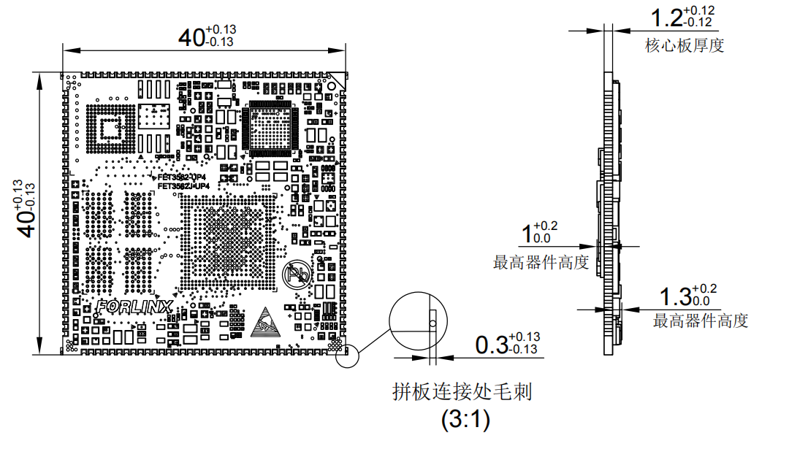

Dimensions: 40mm × 40mm, dimensional tolerance ±0.13mm. 

For more dimensional details, please refer to the DXF file.

Plate making process: 1.6mm thickness, 10-layer immersion gold PCB.

### 2.3 Performance Parameter

#### 2.3.1 System Frequency

| **Name**| **Specification**| | | | **Description**|
|:----------:|:----------:|----------|----------|----------|:----------:|
| | **Minimum**| **Typical**| **Maximum**| **Unit**|
| System Frequency| —| 1.2| 1.8| GHz| —|
| System RTC| —| 32.768| —| KHz| —|

#### 2.3.2 Power Parameter

| **Parameter**| **Pin No.**| **Specification**| | | | **Description**|
|:----------:|:----------:|:----------:|----------|----------|----------|:----------:|
| | | **Minimum**| **Typical**| **Maximum**| **Unit**|
| Main Power Supply Voltage| VSYS| 4.75| 5| 5.25| V| —|
| No-load current| —| | | | mA| Please refer to the power consumption table in the appendix|
| Overload current| —| | | | mA| Please refer to the power consumption table in the appendix|

#### 2.3.3 Working Environment

| **Parameter**| | **Specification**| | | | **Description**|
|:----------:|----------|:----------:|----------|----------|----------|:----------:|
| | | **Minimum**| **Typical**| **Maximum**| **Unit**||
| Operating temperature| Working Environment | 0| 25| +70| ℃| Commercial level|
| | Storage Environment| -40| 25| +125| ℃||
| | Working Environment| -40| 25| +85| ℃| Industrial Level|
| | Storage Environment| -40| 25| +125| ℃||
| Humidity| Working Environment| 10| —| 90| ％RH| No Condensation|
| | Storage Environment| 5| —| 95| ％RH||

#### 2.3.4 SoM ESD Features

| **Parameter**| **Specification**| | | | **Description**|
|:----------:|:----------:|----------|----------|----------|:----------:|
| | **Minimum**| **Typical**| **Maximum**| **Unit**|
| Human Body Model (HBM)| —| ±1000| —| V| —|
| Charged Device Model (CDM)| —| ±250| —| V| —|

### 2.4 Interface Resources

#### 2.4.1 FET3562J-UP4 SoM Interfaces

| **Function**| **Quantity**| **Parameter**|
|:----------:|:----------:|----------|
| USB2.0| 1| Supports 1 x USB2.0 HOST, up to 480Mbps|
| UART| 3| A and B channels support flow control, with the maximum baud rate of 4Mbps|
| SPI| 1| Supports both master and slave mode|
| I2C| 3| Supports standard mode 100kbit/s and fast mode 400kbit/s|
| Ethernet| 2| Supports 1 x RGMII and 1 x RMII|
| USB3.0| 1| Supports USB3.0 master and slave mode|
| GPADC| 3| 10bits, sampling rate up to 1MS/s|
| LRADC| 1| 6-bit sampling resolution, 2KHz sampling rate, used for key detection|
| MIPI-DSI| 1| Supports 1 x MIPI DSI TX, 4-lanes, resolution up to 2048 X 1080 @ 60Hz;|
| MIPI-CSI| 4| MIPI\_CSI\_RX0 and MIPI\_CSI\_RX1 have a total of 2 ports. A single port supports 4 lanes, with each lane having a maximum speed of 2.5Gbps. Additionally, a single port can be split into two combinations of 2 lanes each for use. |
| SD card| 1| Compatible with SDIO 3.0 protocol, 4bits data bit width|
| SDIO| 1| Compatible with SDIO 3.0 protocol, 4bits data bit width|
| I2S| 1| Sample rate up to : 192kHz|
| Audio| | Built - in codec, which directly outputs audio analog signals with a sampling rate ranging from 48KHz to 192KHz: Mono Speaker, class-D, 1.3 W; Stereo headphone output, 32Ohm load; 2 single-ended MIC inputs; |
| CAN| 2| Supports CAN2.0B, data rate up to 1Mbps|
| PWM| 1||

#### 2.4.2 CPU Interfaces

| **Function**| **Quantity**| **Parameter**|
|:----------:|:----------:|----------|
| USB2.0| 1| Supports 1 x USB2.0 HOST, up to 480Mbps|
| UART(1)| ≤10| Supports flow control, baud rate up to 4Mbps|
| SPI| ≤3| Supports both master and slave mode|
| I2C（2）| ≤5| Supports standard mode 100kbit/s and fast mode 400kbit/s|
| Ethernet| ≤2| Supports 1 x RGMII and 1 x RMII|
| PCIe| ≤1| PCIe 2.1, can only be used in RC mode, only supports single lane, 5Gbps, and can only be used alternatively with USB3.0 pin multiplexing. |
| USB3.0| ≤1| Supports the master-slave mode of USB3.0, and can only be used alternatively with PCIe pin multiplexing |
| ADC（3）| ≤16| 10bits, sampling rate up to 1MS/s|
| LVDS（4）| ≤1| Supports VESA/JEIDA LVDS data format with resolution up to 800 X 1280 @ 60Hz;|
| MIPI-DSI(4)| ≤1| Supports 1 x MIPI DSI TX, 4-lanes, resolution up to 2048 X 1080 @ 60Hz;|
| RGB| ≤1| Supports RGB 888 format, with resolution up to 1280× 800|
| MIPI-CSI| 4| The MIPI \_ CSI \_ RX0 and the MIPI \_ CSI \_ RX1 have two ports in total; a single port supports 4-lanes, and the maximum rate of each lane is 2.5 Gbps; a single port can also be split into two 2-lanes for use. |
| SD card| 1| Compatible with SDIO 3.0 protocol, 4bits data bit width|
| SDIO| ≤1| Compatible with SDIO 3.0 protocol, 4bits data bit width|
| SAI(5)| ≤2| Supports protocol I2S, PCM, TDM, sampling rate up to 192kHz|
| Audio| | Built - in codec, which directly outputs audio analog signals with a sampling rate ranging from 48KHz to 192KHz: Mono Speaker, class-D, 1.3 W; Stereo headphone output, 32Ohm load; 2 single-ended MIC inputs |
| PDM| ≤1| Up to 8 channels, sampling rate up to 192KHz, master receive mode|
| SPDIF| ≤1||
| CAN(6)| ≤2| Supports CAN2.0B, data rate up to 1Mbps|
| PWM| ≤16||
| GPIO| ≤79||

**Note: The parameters in the table are the theoretical values of hardware design or CPU.**

### 2.5 FET3562J-UP4 SoM Pin Definitions

#### 2.5.1 FET3562J-UP4 SoM Pin Schematic

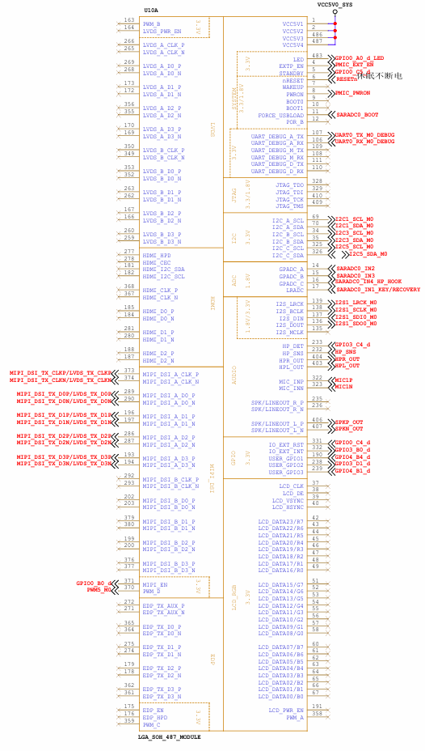

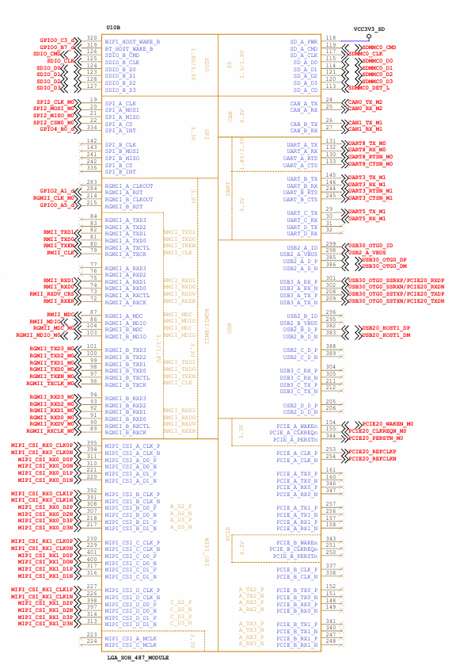

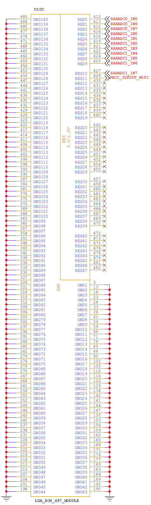

#### 2.5.2 FET3562J-UP4 SoM Pin Function Description

For various functional expansion requirements, please refer to the user document "FET3562-UP4 Pin Multiplexing Table". However, for more detailed information, it is recommended that you consult the relevant documentation, the chip datasheet, and the reference manual.

### 2.6 FET3562J-UP4 SoM Pin Definitions

| **UP4 Standard Interface Functions** | **FET3562J-UP4 Pinout Functions** |
| :----------------------------------: | :-------------------------------: |
|               EXTP_EN                |            PMIC_EXT_EN            |
|               STANDBY                |            GPIO0_C5_d             |
|                nRESET                |              RESETn               |
|                WAKEUP                |                NC                 |
|                PWRON                 |            PMIC_PWRON             |
|             BOOT0/BOOT1              |                NC                 |
|            FORCE_USBLOAD             |           SARADC0_BOOT            |
|                POR_B                 |                NC                 |
|             GPADC_A/B/C              |          SARADC0_IN2/3/4          |
|                LRADC                 |     SARADC0_IN1_KEY/RECOVERY      |
|                SPI_A                 |               SPI2                |
|                SPI_B                 |                NC                 |
|                CAN_A                 |               CAN0                |
|                CAN_B                 |               CAN1                |
|                UART_A                |               UART8               |
|                UART_B                |               UART3               |
|                UART_C                |               UART5               |
|                UART_D                |                NC                 |
|                I2C_A                 |               I2C1                |
|                I2C_B                 |               I2C3                |
|                I2C_C                 |               I2C5                |
|               RGMII_A                |                NC                 |
|               RGMII_B                |               RGMII               |
|                RMII_A                |               RMII                |
|                RMII_B                |                NC                 |
|               DEBUG_A                |               UART0               |
|               DEBUG_M                |                NC                 |
|               DEBUG_D                |                NC                 |
|                 SD_A                 |              SDMMC0               |
|                SDIO_B                |               SDIO                |
|                 I2S                  |               I2S1                |
|              Native HP               |                HP                 |
|           Native SPKOUT_L            |                NC                 |
|           Native SPKOUT_R            |                NC                 |
|              Native MIC              |               MIC1                |
|                PCIE_A                |                NC                 |
|                PCIE_B                |                NC                 |
|                 LCD                  |                NC                 |
|              MIPI DSI_A              |           MIPI_DSI/LVDS           |
|              MIPI DSI_B              |                NC                 |
|                LVDS_A                |                NC                 |
|                LVDS_B                |                NC                 |
|                 EDP                  |                NC                 |
|                 HDMI                 |                NC                 |
|                USB2_A                |            USB30_OTG0             |
|                USB3_A                |            USB30_OTG0             |
|                USB2_B                |            USB20_HOST1            |
|                USB2_C                |                NC                 |
|                USB3_C                |                NC                 |
|                USB2_D                |                NC                 |
|              MIPI CSI_A              |           MIPI_CSI_RX0            |
|              MIPI CSI_B              |           MIPI_CSI_RX0            |
|              MIPI CSI_C              |           MIPI_CSI_RX1            |
|              MIPI CSI_D              |           MIPI_CSI_RX1            |
|                 JTAG                 |                NC                 |
|              USER_GPIO1              |            GPIO4_B4_d             |
|              USER_GPIO2              |            GPIO3_D1_d             |
|              USER_GPIO3              |            GPIO4_B1_d             |
|                 RES0                 |            SARADC0_IN5            |
|                 RES1                 |            SARADC0_IN6            |
|                 RES2                 |            SARADC0_IN7            |
|                 RES3                 |            SARADC1_IN1            |
|                 RES4                 |            SARADC1_IN2            |
|                 RES5                 |            SARADC1_IN3            |
|                 RES6                 |            SARADC1_IN4            |
|                 RES7                 |            SARADC1_IN5            |
|                 RES8                 |            SARADC1_IN6            |
|                 RES9                 |            SARADC1_IN7            |
|                RES10                 |         PMIC_32KOUT_WIFI          |
|                RES11                 |                NC                 |
|                RES12                 |                NC                 |
|                RES13                 |                NC                 |
|                RES14                 |                NC                 |
|                RES15                 |                NC                 |
|                RES16                 |                NC                 |
|                RES17                 |                NC                 |
|                RES18                 |                NC                 |
|                RES19                 |                NC                 |
|                RES20                 |                NC                 |
|                RES21                 |                NC                 |
|                RES22                 |                NC                 |
|                RES23                 |                NC                 |
|                RES24                 |                NC                 |
|                RES25                 |                NC                 |
|                RES26                 |                NC                 |
|                RES27                 |                NC                 |
|                RES28                 |                NC                 |
|                RES29                 |                NC                 |
|                RES30                 |                NC                 |
|                RES31                 |                NC                 |
|                RES32                 |                NC                 |
|                RES33                 |                NC                 |
|                RES34                 |                NC                 |
|                RES35                 |                NC                 |
|                RES36                 |                NC                 |
|                RES37                 |                NC                 |
|                RES38                 |                NC                 |
|                RES39                 |                NC                 |
|                RES40                 |                NC                 |
|                RES41                 |                NC                 |
|                RES42                 |                NC                 |
|                RES43                 |                NC                 |
|                RES44                 |                NC                 |
|                RES45                 |                NC                 |
|                RES46                 |                NC                 |
|                RES47                 |                NC                 |

It is the UP4 standard definition. If compatible design is required, it is recommended to design according to it.

### 2.7 SoM Hardware Design Description

**Power Pin**

| **Function**| **Signal Name**| **I/O**| **Default Function**| **Pin Number**|
|:----------:|:----------:|:----------:|----------|:----------:|
| Power supply| VCC5V0\_SYS| Power Input| Power Supply for SoM: 5V. The carrier board must provide a minimum continuous current of 2.5A. ||
| | VCC3V3\_SD| Power output| Only used for power supply of carrier board SD card, with maximum output current capacity of 500mA||
| | GND| Ground| Power ground and signal ground on the SoM. All GND pins must be connected.||

**System Control Pin**

| **Function**| **Signal Name**| **I/O**| **Default Function**| **Pin Number**|
|:----------:|:----------:|:----------:|----------|:----------:|
| CPU reset| RESETn| I| SoM power reset, low level effective. Do not add additional capacitive load to this pin, so as not to affect the SoM normal startup. | 6|
| Power enable| PMIC\_EXT\_EN| O| Enable signal to control the external power supply of the carrier board, output by the SoM, 3.3 V level. | 4|
| On/Off| PMIC\_PWRON| I| Low level is valid, long press to turn off, short press to turn on| 8|
| BOOT selection| EMMC\_BOOT| I| When the signal is grounded, the startup card enters the Maskrom download mode. | 1|
| Wake up| WAKEUP| I| SoM wake-up button| 7|
| Debug Port| UART2\_TX\_M0\_DEBUG UART2\_RX\_M0\_DEBUG| I/O| Debug Port, please keep the port functions.| 106 107|

(Including minimum system block diagram)

The FET3562J-UP4 SoM integrates power, reset monitoring, and storage circuits, requiring only minimal external circuitry. A complete minimum system can be powered and run with a single 5V supply.

Refer to “Appendix IV. Minimum System Diagram” However, in most cases, it is recommended to connect some external devices—such as a debugging serial port and a port for flashing images—in addition to the minimal system. Otherwise, you can not check whether the system has booted. After completing these steps, you can then add the required functions based on the SoM's default interface definition provided by Forlinx.

For the design of the SoM's peripheral circuits, please refer to Section 3.5, "OK3562J-UP4 Carrier Board Description".

## 3\. OK3562J-UP4 Embedded Development Description

### 3.1 OK3562J-UP4 Development Board Interface Diagram

Connection method: Stamp hole + LGA. The main interfaces are shown in the figure below:

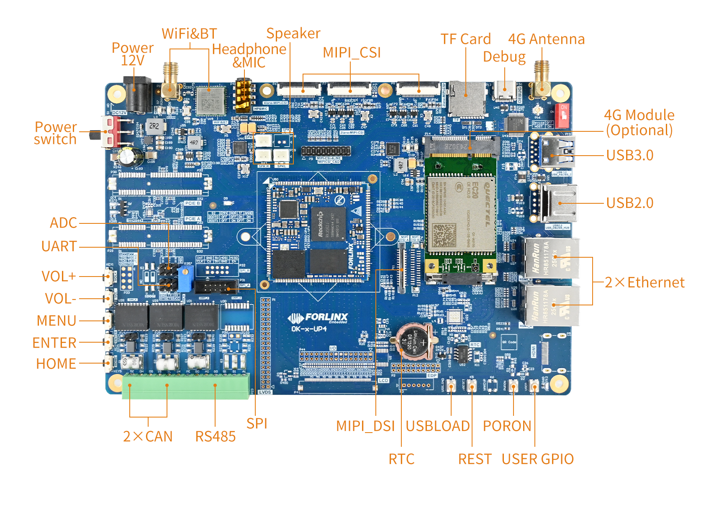

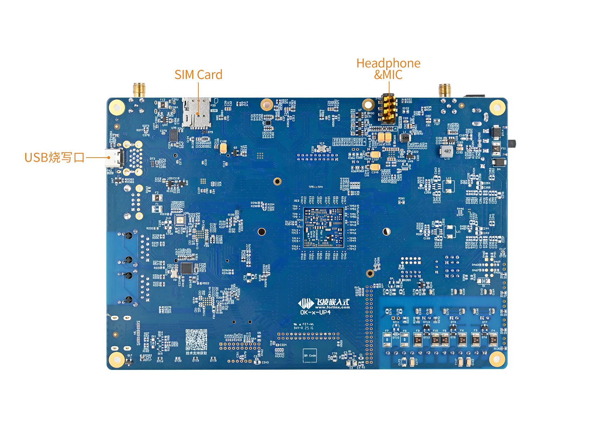

### 3.2 OK3562J-UP4 Development Board Dimension Diagram

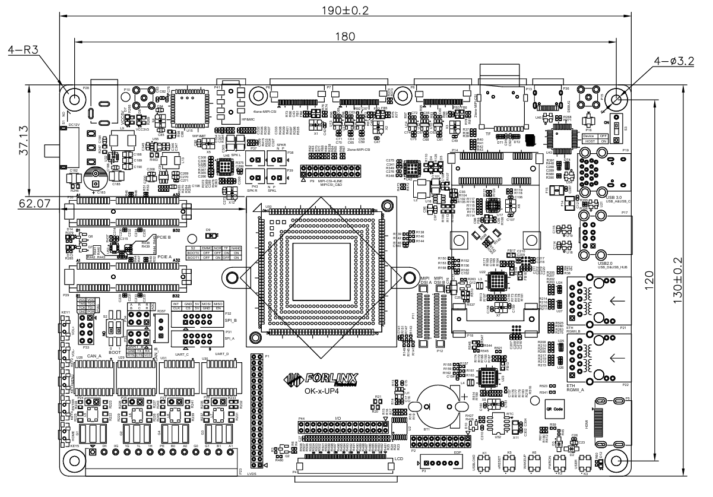

PCB: 130mm×190mm

Mounting hole dimensions: Pitch: 120mm × 180mm, hole diameter: 3.2mm.

Plate making process: 1.6mm thickness, 4-layer PCB.

Power Voltage: DC 12V

The OK3562J-UP4 carrier board is equipped with two mounting holes for heat sinks (3.2 mm in diameter). You may choose to install a heat sink according to the on-site environment. Please add a insulating thermal pad between the contact surface of the heat sink and the SoM. Recommended heat sink: 38mm × 38mm × 10mm. See below for details.

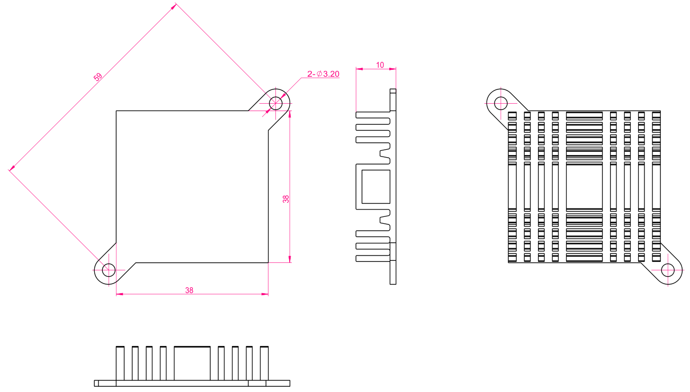

### 3.3 Naming Rules

A-B-C+DEFGHIJKL:MN-O

| **Field**| **Field Description**| **Value**| **Description**|
|:----------:|:----------:|:----------:|:----------:|
| A| Product Line Identification| OK| Forlinx Embedded development board|
| \-| Separator| \-| Confirm whether to add the separator by CPU brand series|
| B| CPU Name| 3562| RK3562|
| \-| Segment Identification| \-||
| C| Connection| UP4| Universal Package general package 4 means 40\*40 |
| \+| Segment Identification| \+| The configuration parameter section follows this identifier.|
| D| CPU Clock| 18| 1.8GHZ|
| E| RAM Capacity (Unit: Byte)| 1G| 1GB|
| | | 2G| 2GB|
| | | 4G| 4GB|
| F| Single ROM Type| SE| eMMC|
| G| Single ROM Capacity： (Unit: Byte)| 8G| 8GB|
| | | 16G| 16GB|
| | | 32G| 32GB|
| H| SoM Operating Temperature| C| 0 to 70℃   Commercial-grade|
| | | I| -40 to 85℃ Industrial-grade|
| I| Configuration No.| A~Z| This is the internal identification of the manufacturer and has no impact on the use.|
| J| SoM PCB Version| 11| V1.1|
| | | xx| Vx.x|
| K| Carrier Board Operating Temperature| C| 0 to 70℃   Commercial-grade|
| | | I| \- 40 to 85 ℃ Commercial grade|
| L| Carrier Board PCB Version| 13| V1.3|
| | | xx| Vx.x|
| :| Connector| | Connecting M ~ N Field Parameters|
| M| Chip Type| A~Z| This is the internal identification of the manufacturer and has no impact on the use.|
| N| Connector Origin| N| No Partition\\No Connector|
| \-| Connector| \-| Grade Mark Connector|
| O| Grade Identification| PC| Prototype Sample|
| | | Blank| Mass Production|

### 3.4 Carrier Board Interfaces

| **Function**| **Quantity**| **Parameter**|
|:----------:|:----------:|----------|
| WiFi| 1| Single antenna 2.4G\&5GHz Wi-Fi Dual-band 1X1 802.11ac +Bluetooth 4.2 |
| Bluetooth| 1||
| Audio| 2| Dual-channel speaker connector, class-D, 1.3 W; Stereo headphone output, 32 Ohm load; Headphone recording |
| MIPI-CSI| 3| FPC socket is led out, 4lane + 2lane + 2lane, of which 4lane can be connected to 4-to-4 analog camera module|
| TF card| 1| Data rate up to SDR104;|
| 4G| 1| Supports 4G modules with a miniPCIE interface, integrating USB 2.0 communication signals.|
| UART Debug| 1| Integrated into a single Type-C port, enabling connection to a PC for debugging.|
| USB3.0| 1| USB \_ A can switch master-slave mode, and USB programming can be performed.|
| USB2.0| 1| Led out via USB\_HUB|
| Ethernet| 2| Led out via standard RJ45 socket, 1 x Gigabit port and 1 x 100M network port|
| MIPI-DSI| 1| 4-lane MIPI-DSI, supports a capacitive touch screen with backlight brightness adjustment and offers a maximum single-channel resolution 1920×1080@60Hz. |
| RTC| 1| On-board CR1220 battery, keep going when power is off|
| RS485| 1| Electrical quarantine|
| CAN| 2| Supports CAN2.0B, electrical quarantine|
| ADC| 3| Led out from the pin header and can be connected to the on-board sliding rheostat|
| SPI| 1| Two SPI interfaces, which are led out from the simple bull seat and can be connected to the peripheral debugging function.|
| UART| 1| 5 x UART, led out through pin headers.|
| KEY ADC| 5| 5 keys are led out via 1 x LRADC|

**Note: The parameters in the table are the theoretical values of hardware design or CPU.**

### 3.5 OK3562J-UP4 Carrier Board Description

**Note: **

- **The component UID with "\_DNP" mark in the diagram below represents it is not soldered by  default;**

- **The schematic diagrams in this manual are only for interface descriptions. Please refer to the source file materials for hardware design.**

#### 3.5.1 Carrier Board Power

As shown, the power supply for the development board is 12V DC （from p28). VDD\_5V supplies power to the SoM. Once the SoM is powered up, it outputs PMIC\_EXT\_EN to enable U32 and U33 on the carrier board, and VCC\_5V, VCC\_3V3, and VCC\_1V8 supply power to the devices on the carrier board. The STANDBY pin controls VCC\_3V3\_S to enable or disable the power supply for the development board, achieving reduced power consumption.

EXTP\_EN ensure to power on the SoM first, followed by the carrier board, to prevent latch-up effects that could damage the CPU.

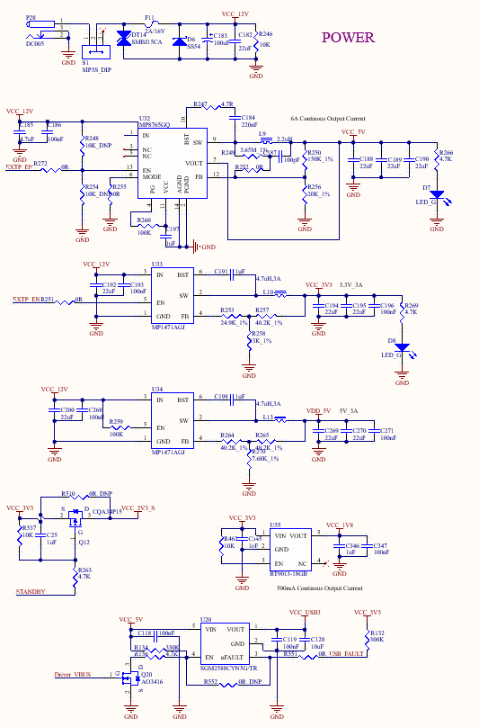

#### 3.5.2 Power/Reset Keys

K1 on the carrier for USB programming. Holding K1 before powering on enables USB programming.

K2 on the carrier board is for powering ON/Off. By default, the board runs automatically when powering on. While running, press and hold the key to shut down; press it shortly to restart.

K5 on the carrier board is for the resetting. Press it reset the power on the SoM to achieving a full board power reset.

K6 on the carrier board is for waking up. After the board enters sleep mode press it shortly to wake up the board.

The FET3562J-UP4 SoM does not have the WAKEUP feature.

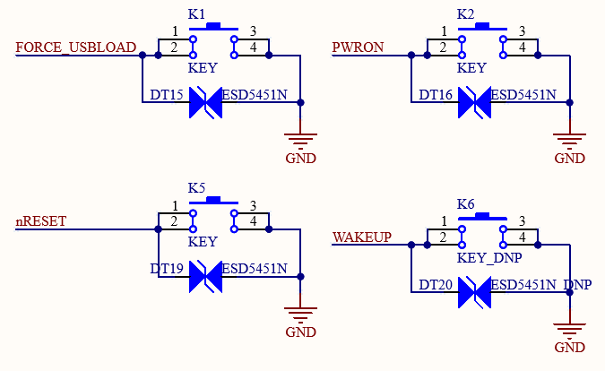

#### 3.5.3  LRADC Button

The carrier board is configured with 1 x LRADC signal, utilizing a button and a resistor voltage divider to enable key value sampling. The LRADC is pulled up to 1.8V via a 10K resistor on the SoM.

!\[屏幕截图 2025-01-21 104742](images\\屏幕截图 2025-01-21 104742.png)

#### 3.5.4 Debugging Serial Port

The carrier board features a single USB Type-C port with 3 x integrated debug serial ports. Install the XR21V1414IM48 driver on your computer, connect the P36 port to the computer, and select the DEBUG\_A debug serial port to start debugging.

Only the DEBUG\_A debug serial port is led out from the FET3562J-UP4 SoM.

!\[屏幕截图 2025-01-21 110047](images\\屏幕截图 2025-01-21 110047.png)

!\[屏幕截图 2025-01-21 110110](images\\屏幕截图 2025-01-21 110110.png)

**Note: To facilitate debugging later, please ensure that the debugging serial port is led out when designing your own carrier board.**

#### 3.5.5 RTC

An RTC device is connected to the carrier board via the I2C\_A bus. It enables a compatible power supply from either VCC\_3V3 or a button cell battery via D10, which ensures the RTC chip remains powered by the battery after the carrier board is powered off. The RX8010SJ chip is used in the default design. Button battery: CR1220.

!\[屏幕截图 2025-01-21 114208](images\\屏幕截图 2025-01-21 114208.png)

#### 3.5.6 TF Card

The TF card interface on the development board is connected to the CPU’s SDMMC0 channel. Power for the TF card is supplied by the VCC\_3V3\_SD output from the SoM.

!\[屏幕截图 2025-01-23 093650](images\\屏幕截图 2025-01-23 093650.png)

!\[屏幕截图 2025-01-23 094829](images\\屏幕截图 2025-01-23 094829.png)

**Note:**                                                                        

- **The bus pull-up resistors have already been configured on the SoM, and it can’t be configured on the carrier board;  **
- **The TF card is a hot-swappable device. Please implement ESD protection;  **
- **The SD signals should be equalised.**

#### 3.5.7 USB Download

There is a USB Type-C port located at P42 on the back of the development board. It utilises the P/N differential signals from the USB 3.0\_A (pin P19) signal, facilitating connection to a computer for flashing and debugging.

!\[屏幕截图 2025-01-23 103014](images\\屏幕截图 2025-01-23 103014.png)

#### 3.5.8  MIPI\_DSI

The P11 on the development board is MIPI\_DSI port, supporting 4 Lane MIPI\_DSI.

!\[屏幕截图 2025-02-12 114926](images\\屏幕截图 2025-02-12 114926.png)

#### 3.5.9 MIPI\_CSI

There are there FPC (P6, P7, P8, 0.5mm pitch, with flip cover) on the carrier board for connecting MIPI-CSI camera.

P7 and P8 supports 2lane MIPI-CSI connections.

The P6 port supports 4lane MIPI-CSI connection and multiplexes a signal line with the P9 port. The P9 port is used to connect up to four analogue camera modules. It is not possible to use the P6 and P9 ports for both functions simultaneously.

!\[屏幕截图 2025-02-12 162755](images\\屏幕截图 2025-02-12 162755.png)

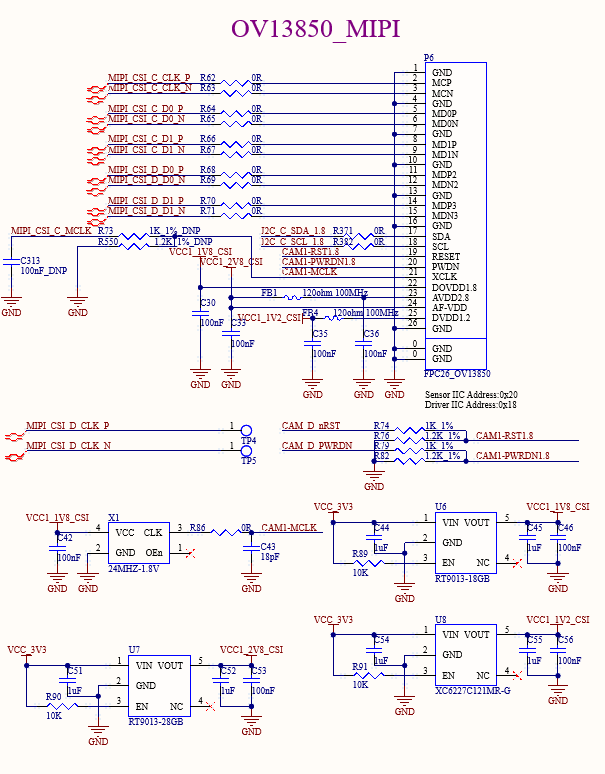

!\

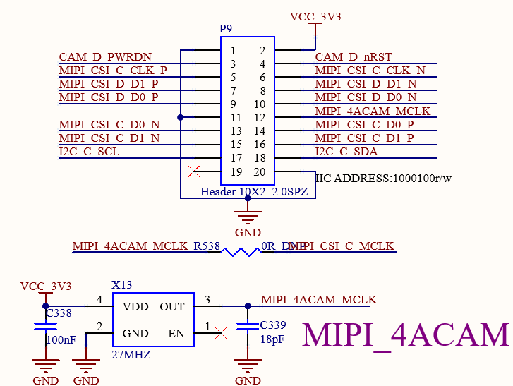

#### 3.5.10 WiFi\&BT

The development board comes with an integrated Wi-Fi \& Bluetooth module, model number AW-CM358SM. The Wi-Fi module utilizes an SDIO interface, supports dual-band operation in 2.4GHz and 5GHz, and complies with IEEE 802.11a/b/g/n/ac standards. The Bluetooth module uses UART \& PCM interfaces and complies with Bluetooth 5.2 specifications. P10 is an SMA interface for antenna connection. Please use a 2.4GHz\&5GHz dual-band antenna.

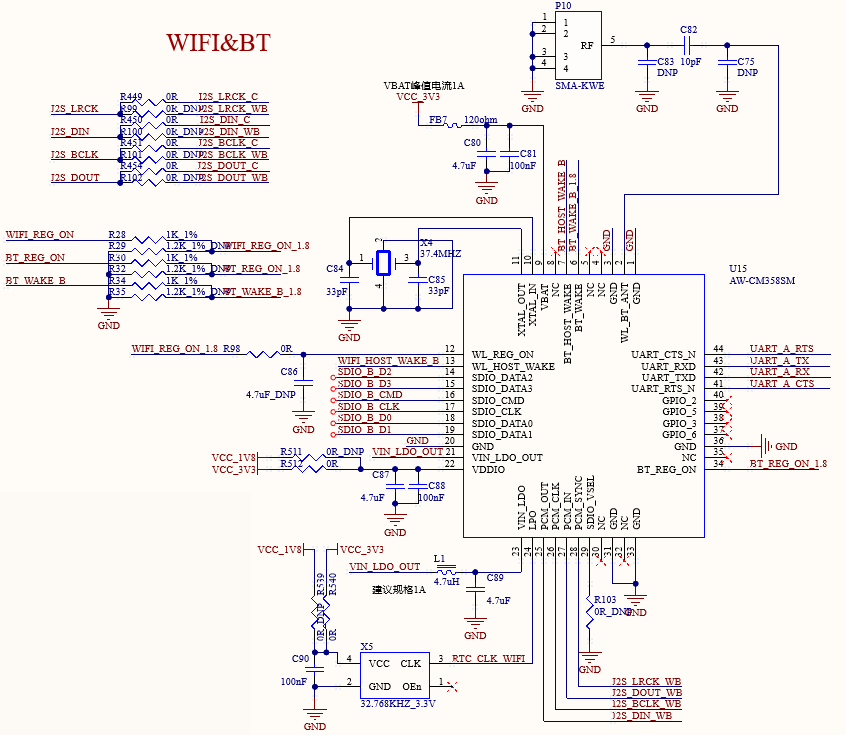

#### 3.5.11 USB2.0

There is an onboard USB 2.0 HUB on the development board, which is expanded to two downstream USB HOST ports, connecting a standard USB 2.0-A interface and a mini-PCIE interface. The mini-PCIE interface can connect the 4G module.

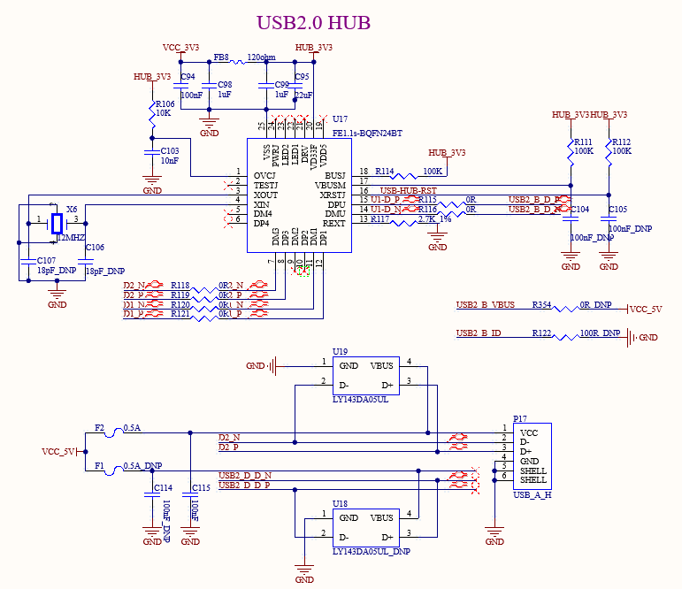

#### 3.5.12 4G

The 4G module can be configured on the development board, and the supported specifications are miniPCIE interface, 3.3 V power supply, and USB2.0 communication.

P20 is a nanoSIM card slot, which is self-ejecting. Pay attention to the insertion direction according to the card identification. It does not support card hot plug.

Before using the 4G function, please power off the board, install the 4G module, the SIM card, and the 4G ipex jumper from the module to the board P15, so that the antenna can be externally connected through the SMA interface of P16.

!\[屏幕截图 2025-02-14 114400](images\\屏幕截图 2025-02-14 114400.png)

!\[屏幕截图 2025-02-14 114420](images\\屏幕截图 2025-02-14 114420.png)

#### 3.5.13 USB3.0

The development board features an onboard USB 3.0 interface, which is the native USB 3.0 from the SoM. A standard USB 3.0 Type-A interface is connected on the development board. Port A supports OTG, controlled by the DIP switch S3: OFF for Device mode, ON for Host mode.

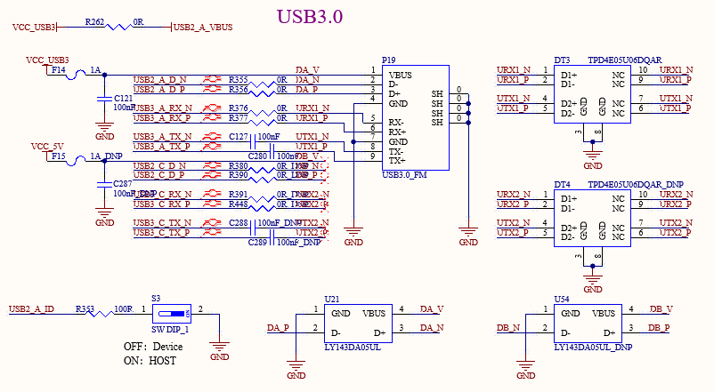

#### 3.5.14 Ethernet

The development board supports two native 1000m network ports, which are realized by using the RGMII of the SoM and the YT8521SH chip, and can be connected to the external network equipment through the standard RJ45 socket with a network transformer.

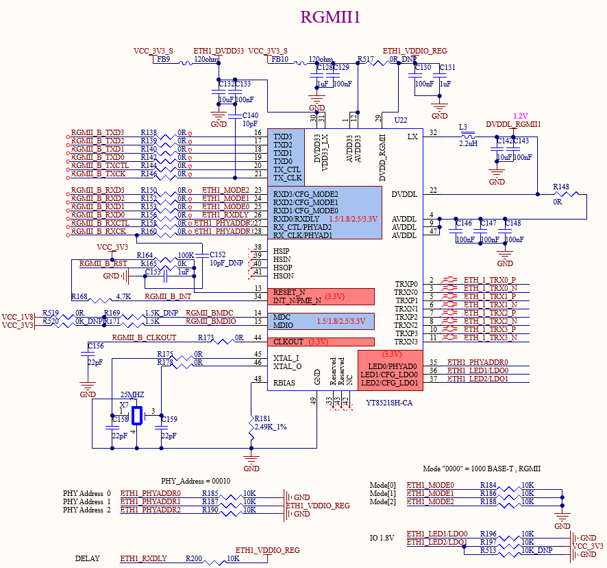

!\[屏幕截图 2025-02-14 144725](images\\屏幕截图 2025-02-14 144725.png)

The development board supports one native 100M Ethernet port, implemented using the SoM RMII interface with the YT8512H chip. It is connected to external network devices via a standard RJ45 connector equipped with a network transformer.

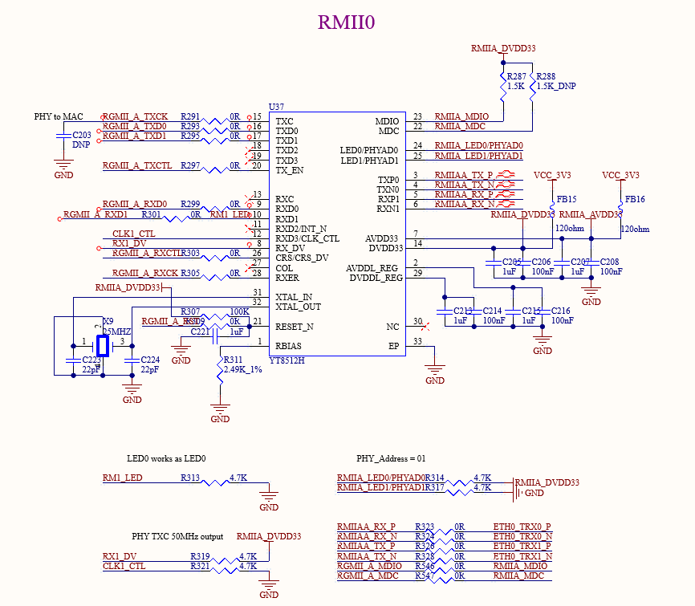

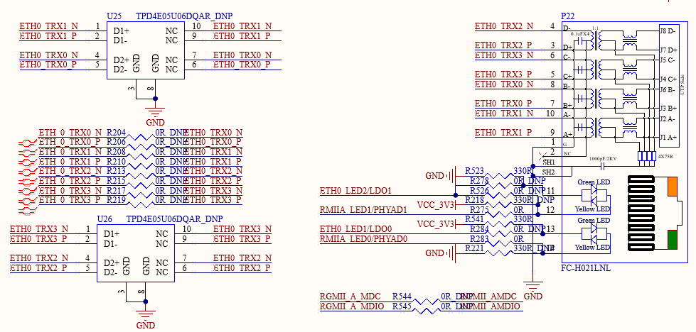

#### 3.5.15 CAN

1 x standard CAN is led out from the development board via native CAN0 and CAN1. Because of the quarantine, the interface supports the maximum rate of 5Mbps, and the electrical quarantine is designed to meet the protection requirements in most scenarios.

The CAN signal is routed via green terminals with a 3.81 mm pitch; a 120-ohm terminating resistor is installed using a jumper cap.

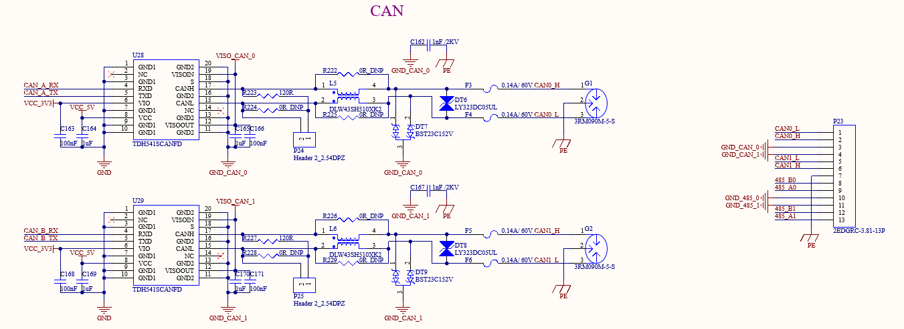

#### 3.5.16 485

1 x standard 485 is led out from the development board via native UART\_C. Due to the UART rate limitation of the CPU, the interface supports a maximum rate of 4Mbps, and the electrical quarantine is designed to meet the protection requirements in most scenarios.

The 485 signal is routed via green terminals with a 3.81 mm pitch; a 120-ohm terminating resistor is installed using a jumper cap.

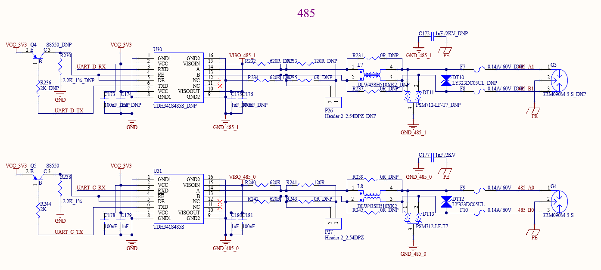

#### 3.5.17 GPADC

The GPADC is connected via 2.54 mm pitch pins. It can be connected directly using DuPont wires via a potentiometer. The SoM features a total of 3 x GPADC, with a maximum sampling voltage of 1.8 V.

!\[屏幕截图 2025-02-14 161310](images\\屏幕截图 2025-02-14 161310.png)

#### 3.5.18 UART

1 x five-wire UART is routed from the development board and powered by a 3.3V signal.

!\[屏幕截图 2025-02-14 165334](images\\屏幕截图 2025-02-14 165334.png)

#### 3.5.19 SPI

A five-wire SPI interface is led out from the SoM (5V power supply)

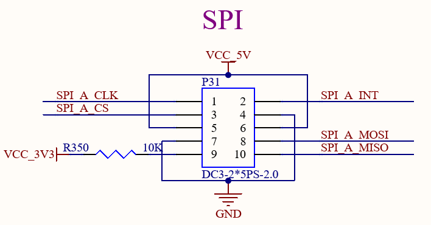

#### 3.5.20 IO Expansion

An IO expansion chip is led out from the development board via I2C. 24 additional I/O pins can be expanded for expanding control signals and resetting signals.

!\[屏幕截图 2025-02-17 114511](images\\屏幕截图 2025-02-17 114511.png)

#### 3.5.21 Audio

The development board features a standard 3.5mm headphone jack (CTIA international standard), located at pin P40, which supports stereo headphone playback and mono microphone recording;

The P39 is a speaker port that supports stereo speakers, Class D, with 1.3W of power;

!\[屏幕截图 2025-02-17 154728](images\\屏幕截图 2025-02-17 154728.png)

!\[屏幕截图 2025-02-17 154753](images\\屏幕截图 2025-02-17 154753.png)

A single I2S signal is routed from the carrier board to the NAU88C22YG CODEC chip, which provides a standard 3.5mm headphone jack and separate left and right channel amplifiers.

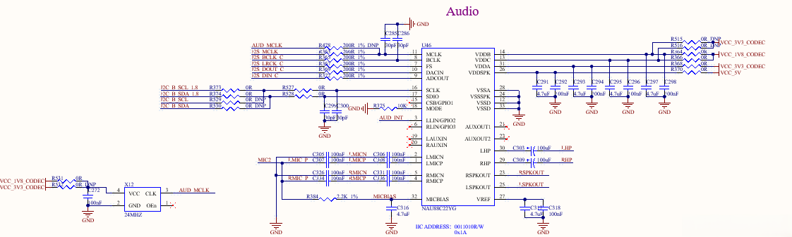

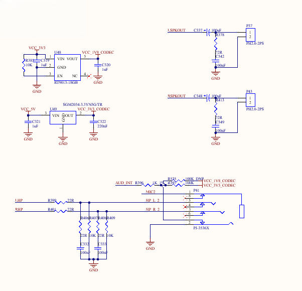

## 4\. Package Dimensions Diagram

Package: LCC+LGA

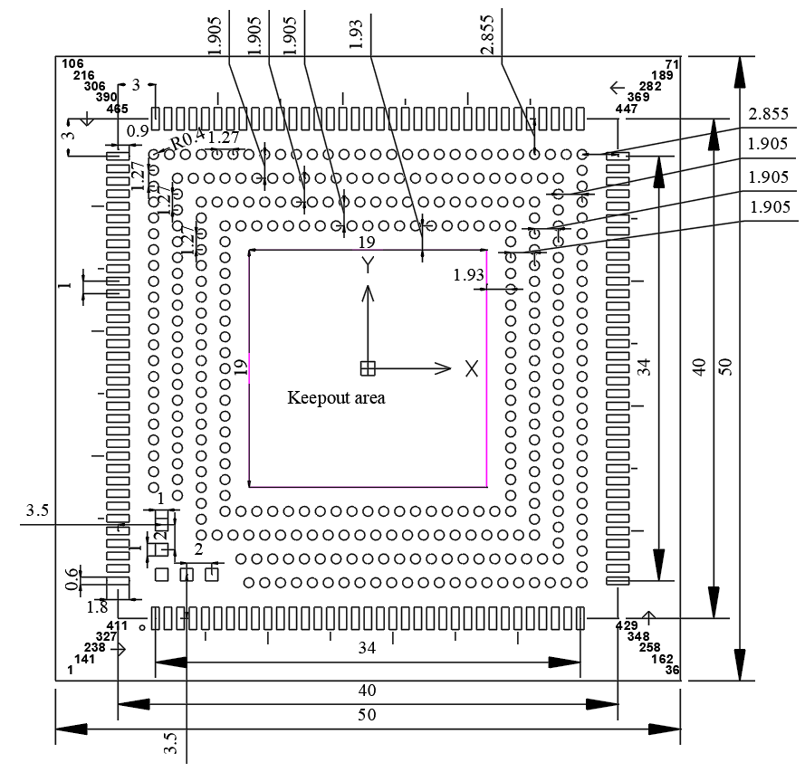

To ensure a high weld yield, please refer to the diagram below for the design of the packaging stencil:

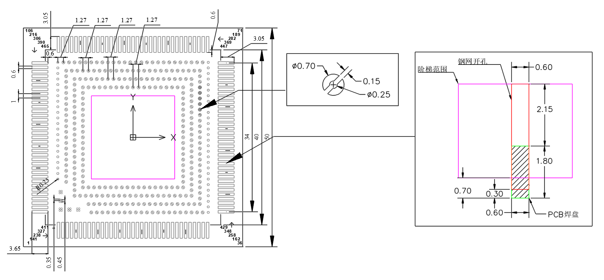

I. Hole Opening Scheme

1. The steel mesh type is ladder steel mesh, with thickness of 0.1mm and 0.15 mm, and the ladder is on the printing surface;  
2. As shown in the figure below, the thickness of the steel mesh of the LCC pad around the carrier board is 0.15 mm, and the opening method is as shown in the figure, with width of 0.6 mm, length of 2.15 mm outward expansion and 0.3 mm inward contraction. The step range is shifted out 0.7 mm from the root to minimize the impact on the LGA pad.

3. The opening thickness of the LGA pad in the middle is 0.1mm. The opening mode of the two rows of LGA pads on the left and right sides in the direction of the scraper is a round hole with a diameter of 0.5mm. The opening of the other LGA pads is as shown in the following figure. The opening diameter is 0.7 mm. The bridge with a width of 0.15 mm is set at the center of 45 °. The bridge center is a round indent with a diameter of 0.25 mm.

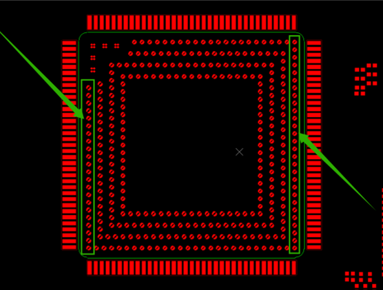

**Note:**

- **Since the LGA pads on the UP4 series SoMs use a pre-tinned process, there is a height difference of approximately 0.1 mm between the LCC pads and the LGA pads. This may result in uneven solder wick height between the LCC pads. Please do visual inspection for the LCC soldering;**

- **Since stepped stencils can affect the solder volume on surrounding components, please reduce the aperture size of the stencil openings for these components; For the LGA pad openings in the advancing direction of the scraper, please conduct hole-size reduction in accordance with the No.3.**

## 5\. OK3562J-UP4 Development Board Linux Consumption Table

| **No.**| **Item**| **SoM Power (W)**| Development Board **Power** (including SoM)|
|:----------:|----------|:----------:|:----------:|
| 1| No-load starting peak power consumption| 2.06 W| 3.216W|
| 2| Sleep power consumption| 0.0279W| 0.672W|
| 3| No-load standby power consumption| 0.62W| 1.56W|
| 4| USB read and write power| 0.775W| 2.052W|
| 5| TF read and write power| 1.185W| 2.124W|
| 6| 4G module PING network power consumption| 0.695W| 2.34W|
| 7| WiFi module PING network power consumption| 0.615W| 1.488W|
| 8| 7-inch MIPI screen video playback power consumption| 1.815W| 5.256W|
| 9| CPU pressure + memory pressure + eMMC read/write pressure test power| 2.115W| 2.748W|

**Note: The SoM configuration is 1GB memory + 8GB eMMC, the 4G module is Quectel EC20, and the screen is an Forlinx optional product. SoM power supply: 5V; and the carrier board is 12V; Power consumption is for reference only.**

---
