# OK3568-UP4\_User’s Hardware Manual\_V1.0

Document classification: □ Top secret □ Secret □ Internal information ■ Open                                                                                                              

## Copyright

The copyright of this manual belongs to Baoding Folinx Embedded Technology Co., Ltd. Without the written permission of our company, no organizations or individuals have the right to copy, distribute, or reproduce any part of this manual in any form, and violators will be held legally responsible.

Forlinx adheres to copyrights of all graphics and texts used in all publications in original or license-free forms.  
The drivers and utilities used for the components are subject to the copyrights of the respective manufacturers. The license conditions of the respective manufacturer are to be adhered to. Related license expenses for the operating system and applications should be calculated/declared separately by the related party or its representatives.

## Revision History

| Date| Version| SoM Version| Carrier Board Version| Revision History|
|:----------:|:----------:|:----------:|:----------:|----------|
| 19/09/2025 | V1.0| V1.0| V1.3 and above| Initial Version|

## Overview

This manual aims to help you quickly get familiar with the product, understand interface functions and configurations. It covers the interface functions and introductions of the development board, product power consumption, and methods for troubleshooting issues during use. Some commands are annotated in the description for user convenience, with a focus on practicality. For information on pin function multiplexing and hardware design guidelines, please refer to Forlinx “OK3568x-UP4 Pin Multiplexing Comparison Table" and "OK3568x-UP4 Design Guide".

There are four chapters:

+ Chapter 1. provides an overall overview of the CPU, briefly introducing its performance and application industries;

+ Chapter 2. offers a general introduction to the SoM, including descriptions and functions of connector pins;

+ Chapter 3. introduces the development board in multiple chapters, covering hardware principles and simple design ideas;

+ Chapter 4. describes the product's power consumption and other considerations.
  Additionally, the manual includes explanations of some symbols and formats.

| **Format** | Meaning                                                      |
| :--------: | ------------------------------------------------------------ |
|  **Note**  | Note or particularly important information must be read carefully. |
|     📚      | Relevant explanations regarding the testing section.         |
|     🛤️      | Related paths.                                               |
## 1\. Rockchip RK3568 Description

The RK3568 is a high-performance, low-power quad-core application processor chip, specifically designed for personal mobile internet devices and AIoT equipment.

The RK3568 integrates several powerful embedded hardware engines, delivering excellent performance for high-end applications. It supports near-universal format decoding of H.264 4k@60fps, H.265 4k@60fps decoding, H.264/H.265 1080p@60fps encoding, and high-quality JPEG encoding/decoding.

The integrated 3D GPU is fully compliant with OpenGL ES 1.1/2.0/3.2, OpenCL 2.0, and Vulkan 1.0. A dedicated 2D hardware engine significantly enhances display performance, ensuring a smooth visual experience. 

Its built-in NPU (Neural Processing Unit) supports INT8/INT16 mixed-precision operations. **With its broad compatibility**, neural network models based on mainstream frameworks such as TensorFlow, MXNet, PyTorch, and Caffe can be easily converted for deployment.

Furthermore, the RK3568 features a high-performance memory interface supporting DDR3/DDR3L/DDR4/LPDDR3/LPDDR4/LPDDR4X, providing ample memory bandwidth to meet the demands of high-performance computing scenarios.

**RK3568 Block Diagram**

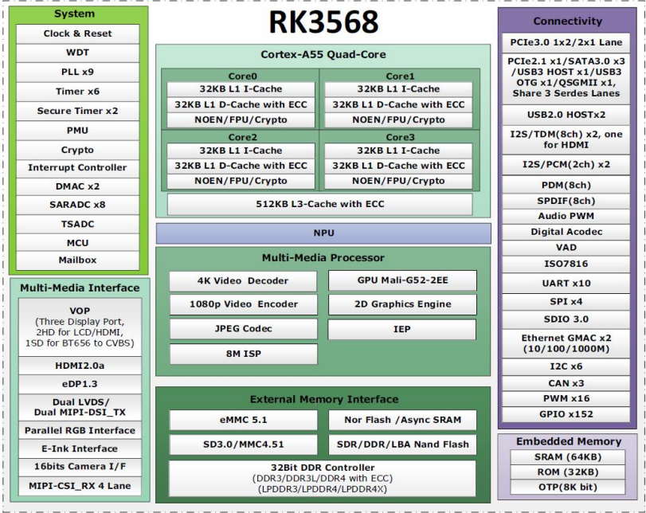

****

## 2\. FET3568J-UP4 SoM Description

### 2.1 FET3568x-UP4 SoM Appearance

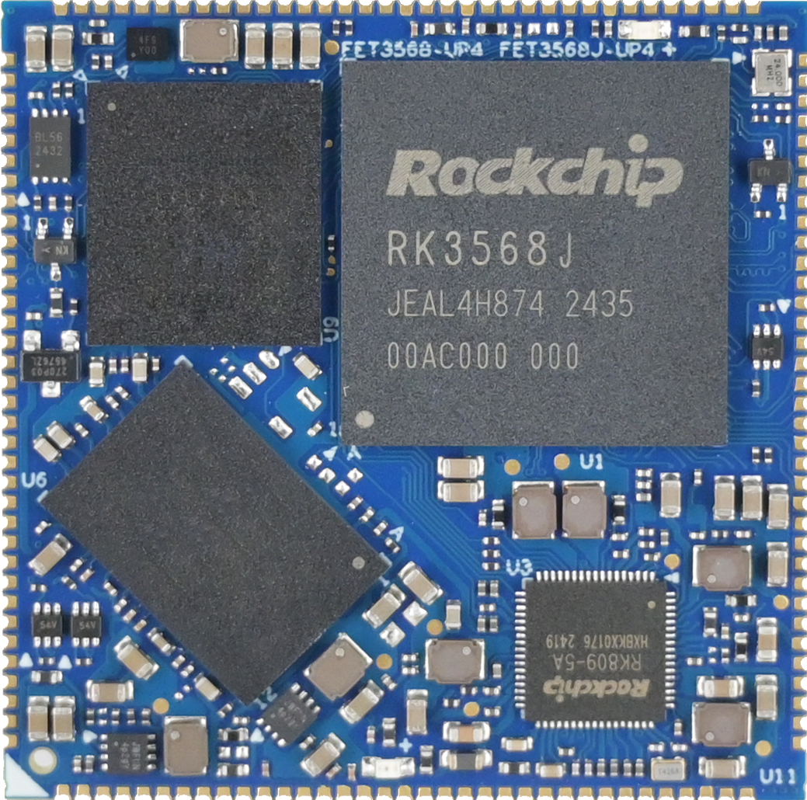

**Front**

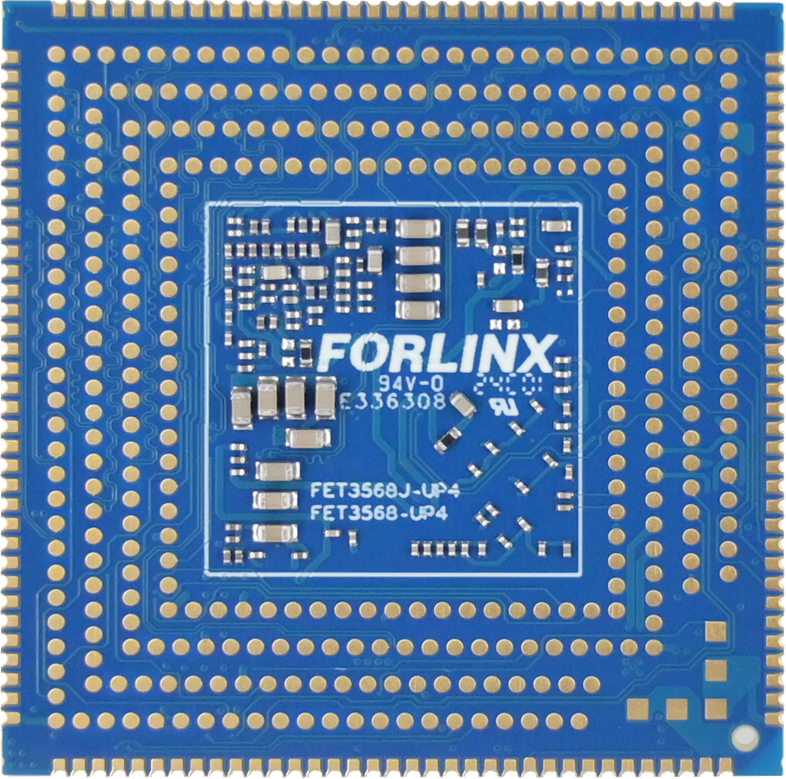

**Back**

### 2.2 FET3568x SoM Dimension Diagram

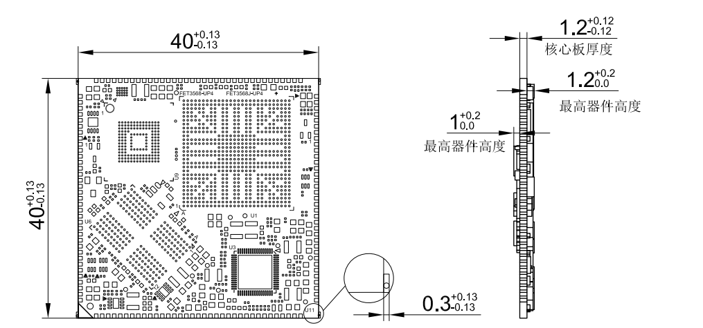

Dimensions: 40mm × 40mm, dimensional tolerance ±0.13mm. For more dimensional details, please refer to the DXF file.

Plate making process: 1.6mm thickness, 12-layer immersion gold PCB.

### 2.3 Performance Parameter

#### 2.3.1 System Frequency

| **Name**| **Specification**| | | | **Description**|
|:----------:|:----------:|----------|----------|----------|:----------:|
| | **Minimum**| **Typical**| **Maximum**| **Unit**|
| System Frequency| —| —| 2.0| GHz| —|
| System RTC| —| 32.768| —| KHz| —|

#### 2.3.2 Power Parameter

| **Parameter**| **Pin No.**| **Specification**| | | | **Description**|
|:----------:|:----------:|:----------:|----------|----------|----------|:----------:|
| | | **Minimum**| **Typical**| **Maximum**| **Unit**|
| Main Power Supply Voltage| VSYS| 4.75| 5| 5.25| V| —|
| No-load current| —| | 371| | mA| Please refer to the power consumption table in the appendix|
| Overload current| —| | 1004| | mA| Please refer to the power consumption table in the appendix|

#### 2.3.3 Working Environment

| **Parameter**| | **Specification**| | | | **Description**|
|:----------:|----------|:----------:|----------|----------|----------|:----------:|
| | | **Minimum**| **Typical**| **Maximum**| **Unit**||
| Operating Temperature| Working Environment | 0| 25| +80| ℃| Commercial level|
| | Storage Environment| -40| 25| +125| ℃||
| | Working environment| -40| 25| +85| ℃| Industrial Level|
| | Storage Environment| -40| 25| +125| ℃||
| Humidity| Working Environment| 10| —| 90| ％RH| No Condensation|
| | Storage Environment| 5| —| 95| ％RH||

#### 2.3.5 ESD Features

| Parameter| Specification| | Unit| Application Scope|
|:----------:|:----------:|----------|:----------:|:----------:|
| | Minimum| Maximum| |
| ESD HBM(ESDA/JEDEC JS-001-2017)| -500| 500| V| Signals exported from SoM|
| ESD CDM(ESDA/JEDEC JS-002-2018)| -250| 250| V| Signals exported from SoM|

**Note：**

- **The above data is provided by Rockchip;**

- **As all the signals exported from SoM are electrostatic sensitive signals, the interfaces should be well protected from static electricity in the carrier board design and the SoM transportation, assembling, and use.**

### 2.4 Interface Resources

#### 2.4.1 FET3568x-UP4 SoM Interfaces

| **Function**| **Quantity**| **Parameter**|
|:----------:|:----------:|----------|
| MIPI-DSI| 1| 1 x 4 - lane MIPI display serial interfaces, supporting MIPI V1.2 version.  The maximum resolution of a single channel is 1920×1080@60Hz, and the maximum resolution of dual channels is 2560×1600@60Hz. |
| HDMI| 1| Supports HDMI 2.0 with resolutions up to 1080p @ 120Hz or 4096 × 2304 @ 60Hz|
| LVDS| 1| Single lane（4 lanes）supports 1280×800@60Hz|
| eDP| 1| 1 x 4-lane eDP display interface, supports eDP V1.3, and the maximum resolution is 2560 \* 1600 @ 60Hz|
| RGB| 1| Supports RGB 888, maximum resolution 1280 \* 800|
| Camera| 2| Supports 2 x 2Lanes MIPI-CSI|
| Audio| | Built - in codec, which directly outputs audio analog signals with a sampling rate ranging from 48KHz to 192KHz: Mono speaker, class - D, 1.3W;Stereo headphone output with a 32Ohm load;One differential MIC input. |
| SDIO| 2| SDIO 3.0 with up to 104MB/S data throughput|
| Ethernet| 2| 2 x GMAC, providing RGMII/RMII interface lead-out|
| USB 2.0| 2| USB 2.0 Host, independent port, not multiplexed with USB 3.0|
| USB 3.0| 2| 1 x USB 3.0 Host port, which can be used independently as a USB 2.0 Host; 1 x USB 3.0 OTG port, which can be used independently as a USB 2.0 OTG. |
| PCIe2.1| 1| PCIe 2.1×1,up to 5.0Gbps, RC mode |
| PCIe3.0| 2| PCIe 3.0, 1x2Lanes, up to 8.0 Gbps per Lane; 1Lane supports Root Complex (RC) mode only; 2Lanes supports Root Complex (RC) and End Point (EP) model. |
| UART| 3| Up to 4Mbps|
| CAN| 2| Supports CAN2.0 B up to 1Mbps|
| I2C| 3| Supports 7bits and 10bits address modes up to 1 Mbit/s|
| PWM| 4| 32bits timer/counter|

#### 2.4.2 CPU Interfaces

| **Function**| **Quantity**| **Parameter**|
|:----------:|:----------:|----------|
| MIPI-DSI| 2| 2 x 4 - lane MIPI display serial interfaces, supporting MIPI V1.2 version. The maximum resolution of a single channel is 1920×1080@60Hz, and the maximum resolution of dual channels is 2560×1600@60Hz. |
| HDMI| 1| Supports HDMI 2.0 with resolutions up to 1080p @ 120Hz or 4096 × 2304 @ 60Hz|
| LVDS| 1| Single lane（4 lanes）supports 1280×800@60Hz|
| eDP| 1| 1 x 4-lane eDP display interface, supports eDP V1.3, and the maximum resolution is 2560×1600@60Hz.|
| RGB| 1| Supports RGB 888, maximum resolution 1280 \* 800|
| Camera| 3| Supports 1 x 4 Lanes MIPI-CSI, 2 x 2Lanes MIPI-CSI |
| Audio| ≤4| 1×8ch I2S/TDM, 2×2ch I2S, 1×8ch PDM |
| SDIO| ≤2| SDIO 3.0 with up to 104MB/S data throughput|
| Ethernet| ≤2| 2 x GMAC, providing RGMII/RMII interface lead-out|
| USB 2.0| 2| USB 2.0 Host, independent port, not multiplexed with USB 3.0|
| USB 3.0| 2| 1 x USB 3.0 Host port, which can be used independently as a USB 2.0 Host; 1 x USB 3.0 OTG port, which can be used independently as a USB 2.0 OTG. |
| SATA| ≤3| SATA 3.0 up to 6.0 Gb/s with eSATA support|
| PCIe2.1| ≤1| PCIe 2.1×1, up to 5.0Gbps,RC mode |
| PCIe3.0| ≤2| PCIe 3.0, 1×2Lanes or 2×1Lane, up to 8.0 Gbps per Lane; 1Lane supports Root Complex (RC) mode only; 2 Lanes supports Root Complex (RC) and End Point (EP) model. |
| UART| ≤10| Up to 4Mbps|
| CAN| ≤3| Supports CAN2.0 B up to 1Mbps|
| SPI| ≤4| Support master \& slave mode, with configurable software|
| I2C| ≤5| Supports 7bits and 10bits address modes up to 1 Mbit/s|
| PWM| ≤16| 32bits timer/counter|
| FSPI| ≤1| Supports serial NOR Flash/NAND Flash and Boot|

**Note: The parameters in the table are the theoretical values of hardware design or CPU.**

### 2.5 FET3568x-UP4 SoM Pin Definitions

#### 2.5.1 FET3568x-UP4 SoM Pin Schematic

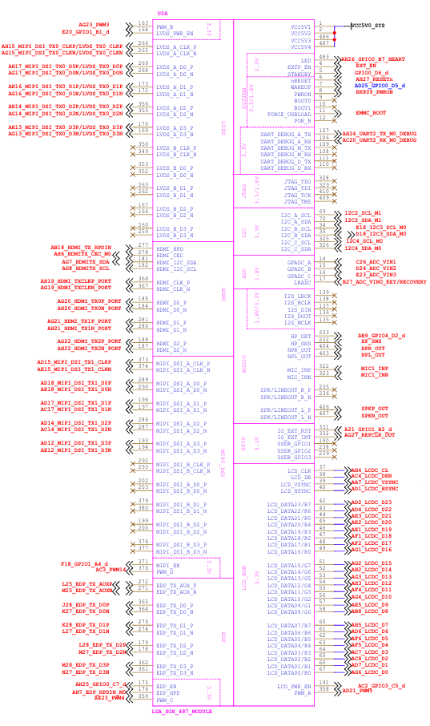

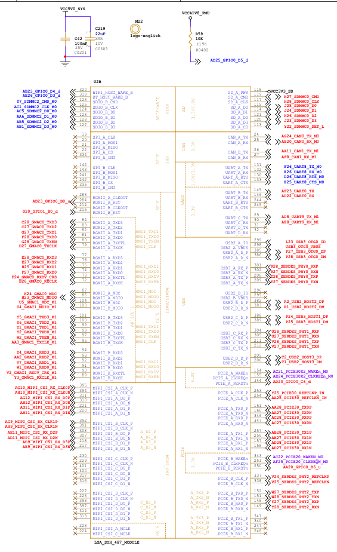

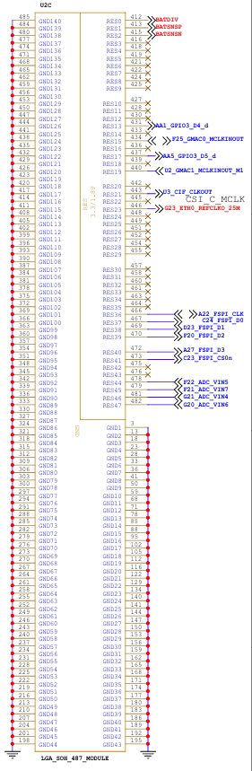

#### 2.5.2 FET3568x-UP4 SoM Pin Function Description

For various functional expansion requirements, please refer to the user document "FET3568-UP4 Pin Multiplexing Table". However, for more detailed information, it is recommended that you consult the relevant documentation, the chip datasheet, and the reference manual.

### 2.6 FET3568x-UP4 SoM Pin Definitions

| UP4 Standard Interface Functions| FET3568x-UP4 Pinout Functions|
|:----------:|:----------:|
| EXTP\_EN| EXTP\_EN|
| STANDBY| GPIO0\_D6\_d|
| nRESET| AH27\_RESETn|
| WAKEUP| AD25\_GPIO0\_D5\_d|
| PWRON| RK809\_PWRON|
| BOOT0/BOOT1| NC|
| FORCE\_USBLOAD| EMMC\_BOOT|
| POR\_B| NC|
| GPADC\_A/B/C| ADC\_VIN1/2/3|
| LRADC| B27\_ADC\_VIN0\_KEY/RECOVERY|
| SPI\_A| NC|
| SPI\_B| NC|
| CAN\_A| CAN0|
| CAN\_B| CAN1|
| UART\_A| UART8|
| UART\_B| UART0|
| UART\_C| UART9|
| UART\_D| NC|
| I2C\_A| I2C2|
| I2C\_B| I2C3|
| I2C\_C| I2C4|
| RGMII\_A| GMAC0|
| RGMII\_B| GMAC1|
| RMII\_A| NC|
| RMII\_B| NC|
| DEBUG\_A| UART2|
| DEBUG\_M| NC|
| DEBUG\_D| NC||
| SD\_A| SDMMC0|
| SDIO\_B| SDMMC2|
| I2S| NC|
| Native HP| NC|
| Native SPKOUT\_L| HPL\_OUT|
| Native SPKOUT\_R| HPR\_OUT|
| Native MIC| MIC1|
| PCIE\_A| PCIE30|
| PCIE\_B| SERDES\_PHY2|
| LCD| LCDC|
| MIPI DSI\_A| MIPI\_DSI1|
| MIPI DSI\_B| NC|
| LVDS\_A| MIPI\_DSI\_0/LVDS\_0|
| LVDS\_B| NC|
| EDP| EDP|
| HDMI| HDMI|
| USB2\_A| USB3\_OTG0|
| USB3\_A| SERDES\_PHY0|
| USB2\_B| USB2\_HOST2|
| USB2\_C| USB3\_HOST1|
| USB3\_C| SERDES\_PHY1|
| USB2\_D| USB2\_HOST3|
| MIPI CSI\_A| MIPI\_CSI\_A|
| MIPI CSI\_B| MIPI\_CSI\_B|
| MIPI CSI\_C| NC|
| MIPI CSI\_D| NC|
| JTAG| NC|
| USER\_GPIO1| NC|
| USER\_GPIO2| NC|
| USER\_GPIO3| NC|
| RES0| BATDIV|
| RES1| BATSNSP|
| RES2| BATSNSN|
| RES3| NC|
| RES4| NC|
| RES5| NC|
| RES6| NC|
| RES7| NC|
| RES8| NC|
| RES9| NC|
| RES10| NC|
| RES11| NC|
| RES12| NC|
| RES13| AA1\_GPIO3\_D4\_d|
| RES14| NC|
| RES15| F25\_GMAC0\_MCLKINOUT|
| RES16| NC|
| RES17| AA5\_GPIO3\_D5\_d|
| RES18| NC|
| RES19| U2\_GMAC1\_MCLKINOUT\_M1|
| RES20| NC||
| RES21| U3\_CIF\_CLKOUT|
| RES22| NC|
| RES23| G23\_ETH0\_REFCLKO\_25M|
| RES24| NC|
| RES25| NC|
| RES26| NC|
| RES27| NC|
| RES28| NC|
| RES29| NC|
| RES30| NC|
| RES31| NC|
| RES32| NC|
| RES33| NC|
| RES34| NC|
| RES35| NC|
| RES36| A22\_FSPI\_CLK|
| RES37| C24\_FSPI\_D0|
| RES38| D23\_FSPI\_D1|
| RES39| F20\_FSPI\_D2|
| RES40| A27\_FSPI\_D3|
| RES41| C23\_FSPI\_CS0n|
| RES42| NC|
| RES43| NC|
| RES44| F22\_ADC\_VIN5|
| RES45| F21\_ADC\_VIN7|
| RES46| G21\_ADC\_VIN4|
| RES47| G20\_ADC\_VIN6|

**It is the UP4 standard definition. If compatible design is required, it is recommended to design according to it.**

### 2.7 SoM Hardware Design Description

**Power Pin**

| **Function**| **Signal Name**| **I/O**| **Default Function**| **Pin Number**|
|:----------:|:----------:|:----------:|----------|:----------:|
| Power supply| VCC5V0\_SYS| Power Input| Power Supply for SoM:Voltage: 5V Current: The carrier board must provide a minimum continuous current of 2.5A.|
| | VCC3V3\_SD| Power output| Only used for power supply of carrier board SD card, with maximum output current capacity of 500mA|
| | GND| Ground| Power ground and signal ground on the SoM. All GND pins must be connected.|

**System Control Pin**

| **Function**| **Signal Name**| **I/O**| **Default Function**| **Pin Number**|
|:----------:|:----------:|:----------:|----------|:----------:|
| CPU reset| RESETn| I| SoM power reset, low level effective. Do not add additional capacitive load to this pin, so as not to affect the SoM normal startup.| 6|
| Power enable| PMIC\_EXT\_EN| O| Enable signal to control the external power supply of the carrier board, output by the SoM, 3.3 V level.| 4|
| On/Off| PMIC\_PWRON| I| Low level is valid, long press to turn off, short press to turn on| 8|
| BOOT selection| EMMC\_BOOT| I| When the signal is grounded, the startup card enters the Maskrom download mode.| 1|
| Wake up| WAKEUP| I| SoM wake-up button| 7|
| Debug Port| UART2\_TX\_M0\_DEBUG UART2\_RX\_M0\_DEBUG| I/O| Debug Port, please keep the port functions.| 106 107|

(Including minimum system block diagram)

The FET3568x-UP4 SoM integrates power, reset monitoring, and storage circuits, requiring only minimal external circuitry. A complete minimum system can be powered and run with a single 5V supply.

Refer to “Appendix IV. Minimum System Diagram” However, in most cases, it is recommended to connect some external devices—such as a debugging serial port and a port for flashing images—in addition to the minimal system. Otherwise, you can not check whether the system has booted. After completing these steps, you can then add the required functions based on the SoM's default interface definition provided by Forlinx.

For the design of the SoM's peripheral circuits, please refer to Section 3.5, "OK3568x-UP4 Carrier Board Description".

## 3\. OK3568x-UP4 Embedded Development Description

### 3.1 OK-3568x-UP4 Development Board Interface

Connection method: Stamp hole + LGA. The main interfaces are shown in the figure below:

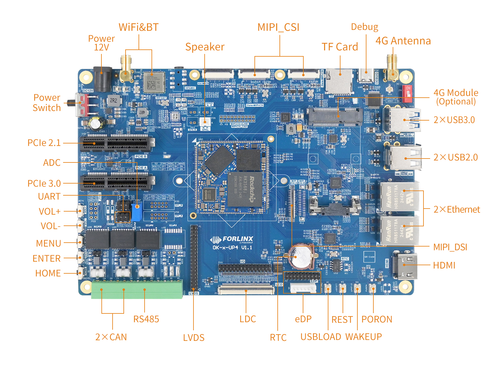

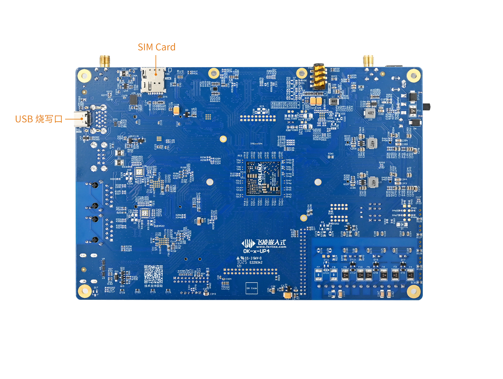

### 3.2 OK-3568x-UP4 Development Board Dimension Diagram

PCB: 130mm×190mm

Mounting hole dimensions: Pitch: 120mm × 180mm, hole diameter: 3.2mm.

Plate making process: 1.6mm thickness, 4-layer PCB.

Power Voltage: DC 12V

The OK3568x-UP4 carrier board is equipped with two mounting holes for heat sinks (3.2 mm in diameter). You may choose to install a heat sink according to the on-site environment. Please add a insulating thermal pad between the contact surface of the heat sink and the SoM. Recommended heat sink: 38mm × 38mm × 10mm. See below for details.

### 3.3 Naming Rules

A-B-C+DEFGHIJKL:MN-O

| Field| Field Description| Value| Description|
|----------|----------|----------|----------|
| A| Product Line Identification| OK| Forlinx Embedded development board|
| \-| Separator| \-| Confirm whether to add the separator by CPU brand series|
| B| CPU Name| 3568| RK3568|
| \-| Segment Identification| \-||
| C| Connection| UP4| Universal Package general package 4 means 40\*40 |
| \+| Segment Identification| \+| The configuration parameter section follows this identifier.|
| D| CPU Clock| 20| 2.0GHZ|
| E| RAM Capacity (Unit: Byte)| 2G| 2GB|
| | | 4G| 4GB|
| F| Single ROM Type| SE| eMMC|
| G| Single ROM Capacity： (Unit: Byte)| 16G| 16GB|
| | | 32G| 32GB|
| H| SoM Operating Temperature| C| 0 to 70℃   Commercial-grade|
| | | I| -40 to 85℃ Industrial-grade|
| I| Configuration No.| A~Z| This is the internal identification of the manufacturer and has no impact on the use.|
| J| SoM PCB Version| 10| V1.0|
| | | xx| Vx.x|
| K| Carrier Board Operating Temperature| C| 0 to 70℃   Commercial-grade|
| | | I| \- 40 to 85 ℃ Commercial grade|
| L| Carrier Board PCB Version| 13| V1.3|
| | | xx| Vx.x|
| :| Connector| | Connecting M ~ N Field Parameters|
| M| Chip Type| A~Z| This is the internal identification of the manufacturer and has no impact on the use.|
| N| Connector Origin| N| No Partition\\No Connector|
| \-| Connector| \-| Grade Mark Connector|
| O| Grade Identification| PC| Prototype Sample|
| | | Blank| Mass Production|

### 3.4 Carrier Board Interfaces

| Function| Quantity| Parameter|
|:----------:|:----------:|----------|
| WiFi| 1| Single antenna 2.4G\&5GHz Wi-Fi Dual-band 1X1 802.11ac +Bluetooth 4.2|
| Bluetooth| 1| |
| Audio| | Dual-channel speaker connector, class-D, 1.3 W; stereo headphone output, 32Ohm load; headphone recording|
| MIPI-CSI| 3| Led out from the FPC socket, 4lane+ 2lane+ 2lane|
| TF card| 1| Data rate up to SDR104;|
| 4G| 1| Supports 4G modules with a miniPCIE interface, integrating USB2.0 communication signals.|
| UART Debug| 2| Integrated into a single Type-C port, enabling connection to a PC for debugging.|
| USB3.0| 2| USB \_ A can switch the master-slave mode and perform USB programming, while USB \_ C only supports the master mode.|
| USB2.0| 2| 1 x USB-D native USB2.0 and 1 x USB-HUB are led out|
| Ethernet| 2| 2 x Gigabit ports led out via a standard RJ45 socket|
| HDMI| 1| Supports HDMI 2.1 resolution up to 4096× 2304 @ 60Hz|
| EDP| 1| Supports eDP 1.3 resolution up to 2560× 1600 @ 60Hz|
| MIPI-DSI| 1| 4-lane MIPI-DSI, supporting capacitive touch screen and backlight brightness adjustment. The maximum resolution of a single channel is 1920 × 1080@60Hz, and the maximum resolution of dual channels is 2560×1600@60Hz.|
| RTC| 1| On-board CR1220 battery, keep going when power is off|
| LCD| 1| RGB888 interface, supporting capacitive touch and resistive touch, and allowing backlight brightness adjustment. The maximum resolution is 1280×800.|
| LVDS| 1| 4-lane LVDS, supporting capacitive touch screen and backlight brightness adjustment, up to 1280×800@60Hz|
| RS485| 1| Electrical quarantine|
| CAN| 2| Supports CAN2.0B, electrical quarantine|
| ADC| 3| Led out from the pin header and can be connected to the on-board sliding rheostat|
| UART| 1| 5 x UART, led out through pin headers.|
| KEY ADC| 5| 5 keys are led out via 1 x LRADC|
| PCIe| 2| PCIe \_ B 2.1, can only do RC mode, PCIe \_ A 3.0, can do EP and RC mode|

**Note: The parameters in the table are the theoretical values of hardware design or CPU.**

### 3.5 OK3568x-UP4 Carrier Board Description

**Note: **

- **The component UID with "\_DNP" mark in the diagram below represents it is not soldered by  
  default;**

- **The schematic diagrams in this manual are only for interface descriptions. Please refer to the source file materials for hardware design.**

#### 3.5.1 Carrier Board Power

As shown, the power supply for the development board is 12V DC （from P28). VDD\_5V supplies power to the SoM. Once the SoM is powered up, it outputs PMIC\_EXT\_EN to enable U32 and U33 on the carrier board, and VCC\_3V3, and VCC\_3V3 supply power to the devices on the carrier board. The STANDBY pin controls VCC\_3V3\_S to enable or disable the power supply for the development board, achieving reduced power consumption.

PMIC\_EXT\_EN ensure to power on the SoM first, followed by the carrier board, to prevent latch-up effects that could damage the CPU.

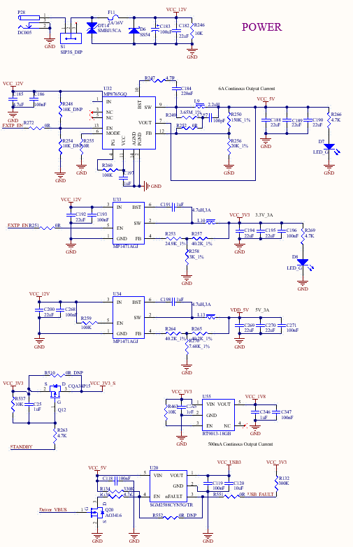

#### 3.5.2 Power/Reset Keys

K1 on the carrier board is the development board USB programming button; press and hold K1 before powering on to perform USB programming.

K2 on the development board is for powering ON/Off. By default, the board runs automatically when powering on. While running, press and hold the key to shut down; press it shortly to restart.

K5 on the development board is for the resetting. Press it reset the power on the SoM to achieving a full board power reset.

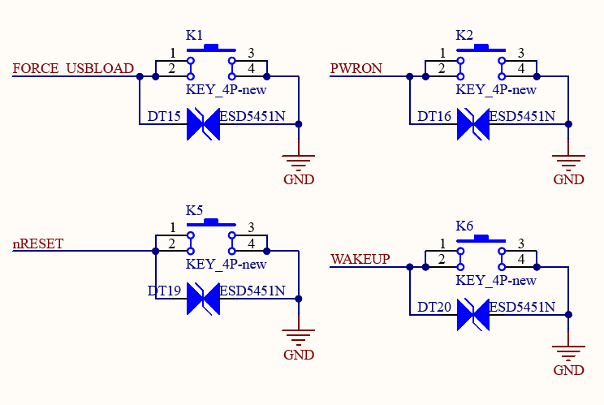

#### 3.5.3  LRADC Button

The carrier board is configured with 1 x LRADC signal, utilizing a button and a resistor voltage divider to enable key value sampling. The LRADC is pulled up to 1.8V via a 10K resistor on the SoM.

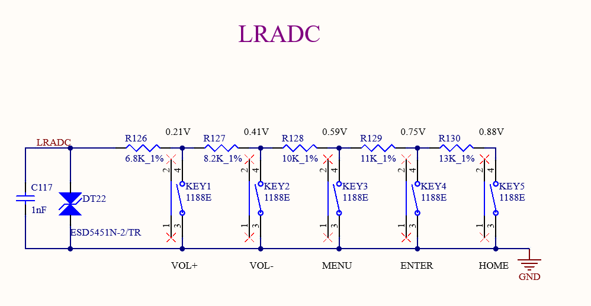

#### 3.5.4 Debugging Serial Port

The carrier board features a single USB Type-C port with 3 x integrated debug serial ports. Install the XR21V1414IM48 driver on your computer, connect the P36 port to the computer, and select the DEBUG\_A debug serial port to start debugging.

Only the DEBUG\_A debug serial port is led out from the FET3568-UP4 SoM.

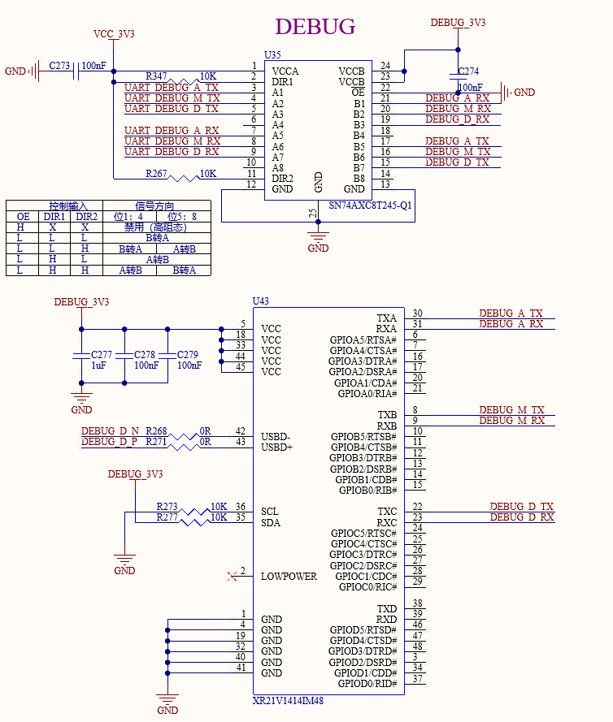

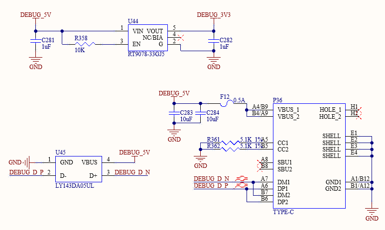

**Note: To facilitate debugging later, please ensure that the debugging serial port is led out when designing your own carrier board.**

#### 3.5.5 RTC

An RTC device is connected to the carrier board via the I2C\_A bus. It enables a compatible power supply from either VCC\_3V3 or a button cell battery via D10, which ensures the RTC chip remains powered by the battery after the carrier board is powered off. The RX8010SJ chip is used in the default design. Button battery: CR1220.

#### 3.5.6  TF Card

The TF card interface on the development board is connected to the CPU’s SDMMC0 channel. Power for the TF card is supplied by the VCC3V3\_SD output from the SoM

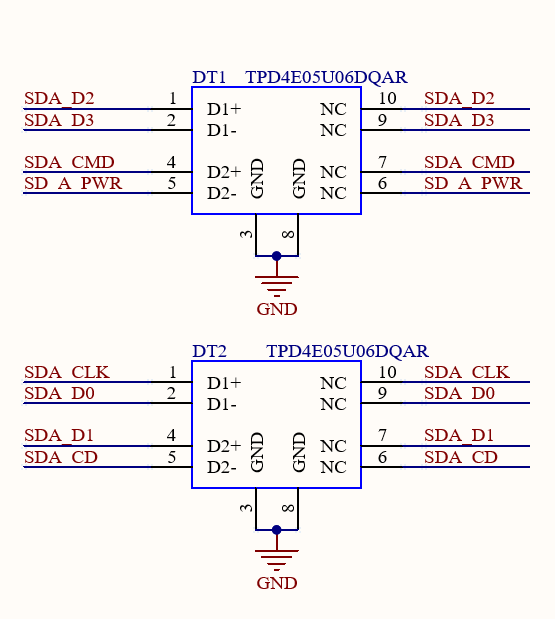

**Note:** 

- **The bus pull-up resistor has already been configured on the SoM. Don’t apply pull-up to the bus;**
- **The TF card is a hot-pluggable device. Please add ESD protection for it;**
- **Please make equal length for the SD signal.**

#### 3.5.7 USB Download

There is a USB Type-C port located at P42 on the back of the development board. It utilises the P/N differential signals from the USB 3.0\_A (pin P19) signal, facilitating connection to a computer for flashing and debugging.

#### 3.5.8 LVDS Display

The pin header P1 on the development board can be connected to the LVDS display via the connector 38P with a pitch of 2.0mm.

It supports 4 lane LVDS connection, and I2C port touch screen.

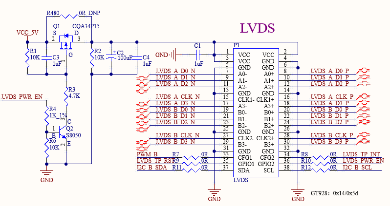

### 3.5.9 EDP Display

Pins P2 and P3 on the development board can be connected to an eDP display; P2 is with a 2.0mm pitch.

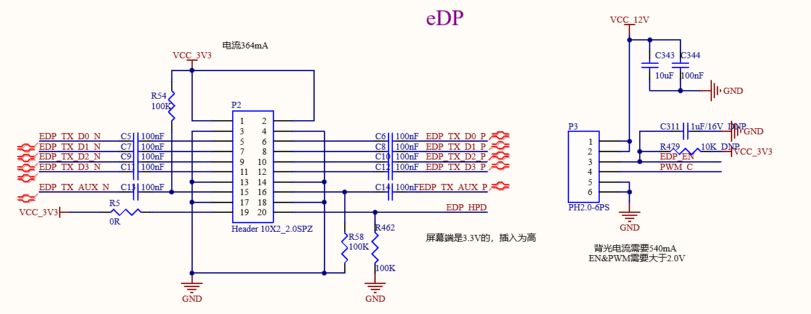

#### 3.5.10 LCD-RGB888

Pin P4 on the development board is the LCD interface; it is an FPC socket that can be connected to an LCD screen and supports capacitive touchscreens.

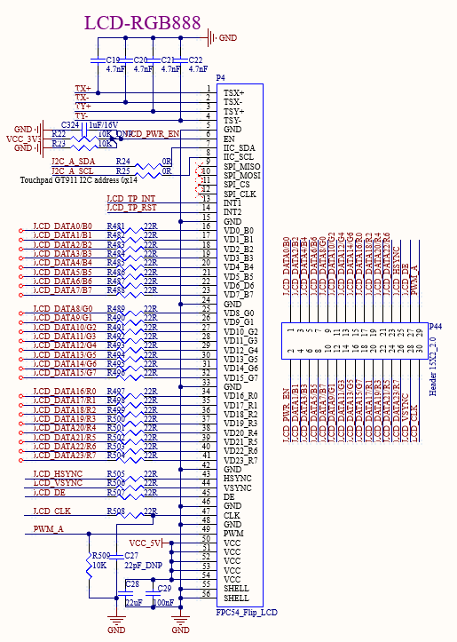

#### 3.5.11 Resistive Touchscreen

If a resistive touchscreen is required, a resistive touch circuit can be added and connected to pins 1, 2, 3 and 4 of the P4 (LCD interface).

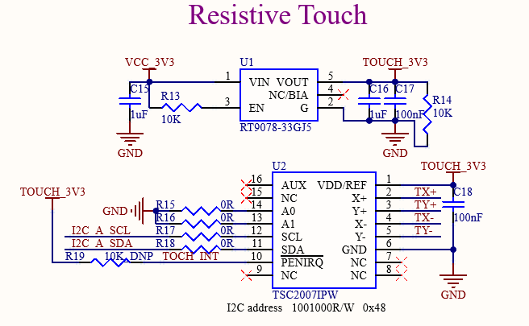

#### 3.5.12 HDMI Display

The P5 port on the development board is a standard HDMI port and supports HDMI 2.0.

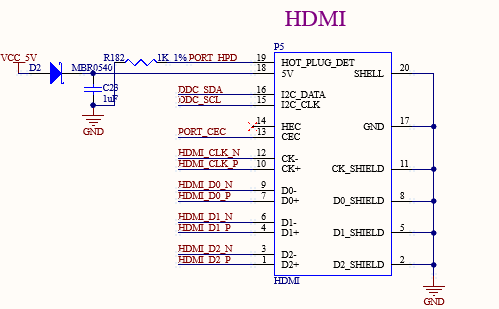

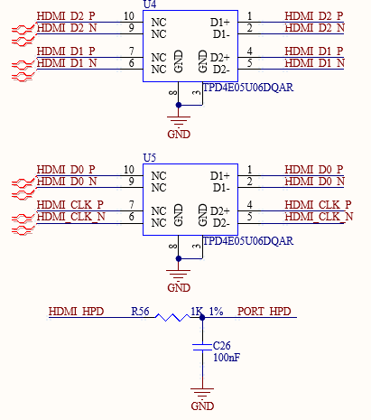

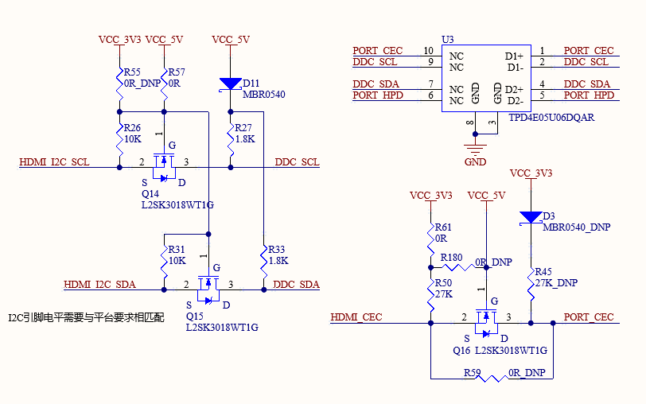

#### 3.5.13  MIPI\_DSI

The P11 on the development board is MIPI\_DSI port, supporting 4 Lane MIPI\_DSI.

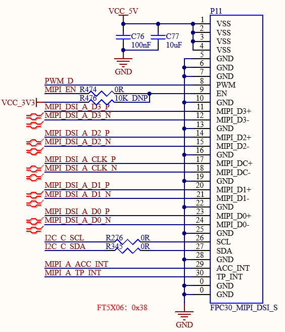

#### 3.5.14 MIPI\_CSI

There are two FPC sockets on the development board that can be connected to the MIPI-CSI camera. The connector is 26P, with a 0.5mm pitch, and a flip-down cover.

P7 and P8 supports 2lane MIPI-CSI connections.

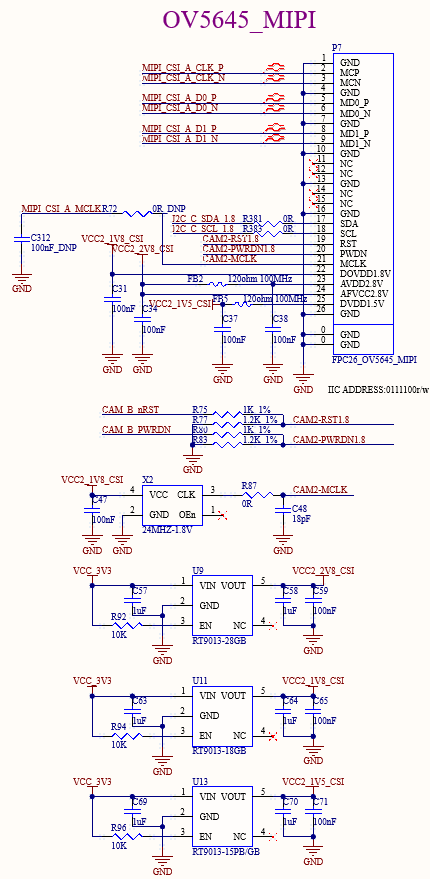

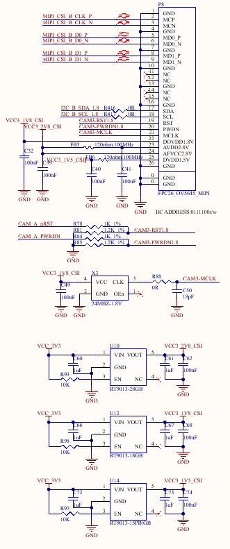

#### 3.5.15 WIFI\&BT

The development board comes with an integrated Wi-Fi \& Bluetooth module, model number AW-CM358SM. WiFi is connected via an SDIO interface, supporting dual-band 2.4GHz and 5GHz, and complies with the IEEE 802.11a/b/g/n/ac standard. Bluetooth is connected via a UART and PCM interface and complies with the BT 5.2 specification.

P10 is an SMA interface for antenna connection. Please use a 2.4GHz\&5GHz dual-band antenna.

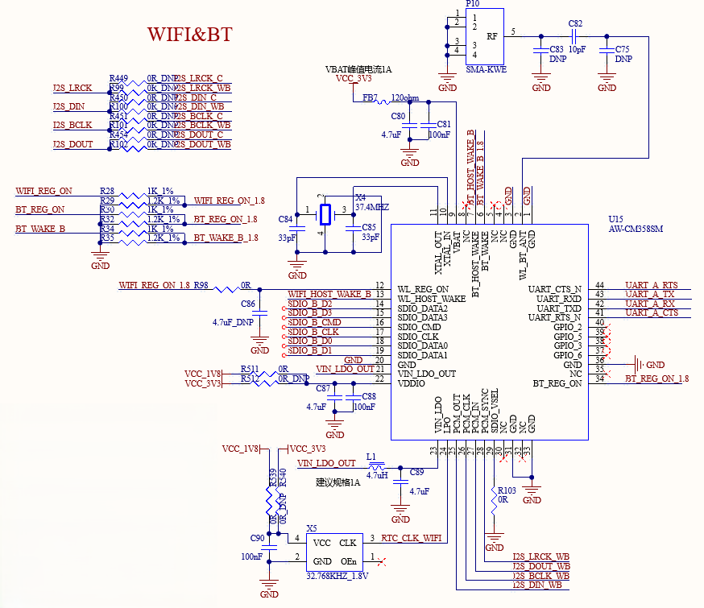

#### 3.5.16 USB2.0

There is an onboard USB 2.0 HUB on the development board, which is expanded to two downstream USB HOST ports, connecting a standard USB 2.0-A interface and a mini-PCIE interface. The mini-PCIE interface can connect the 4G module.

In addition, the SoM features a set of on-board USB 2.0 host interfaces, which connect to the lower layer of the dual-layer USB 2.0 Type-A standard connectors.

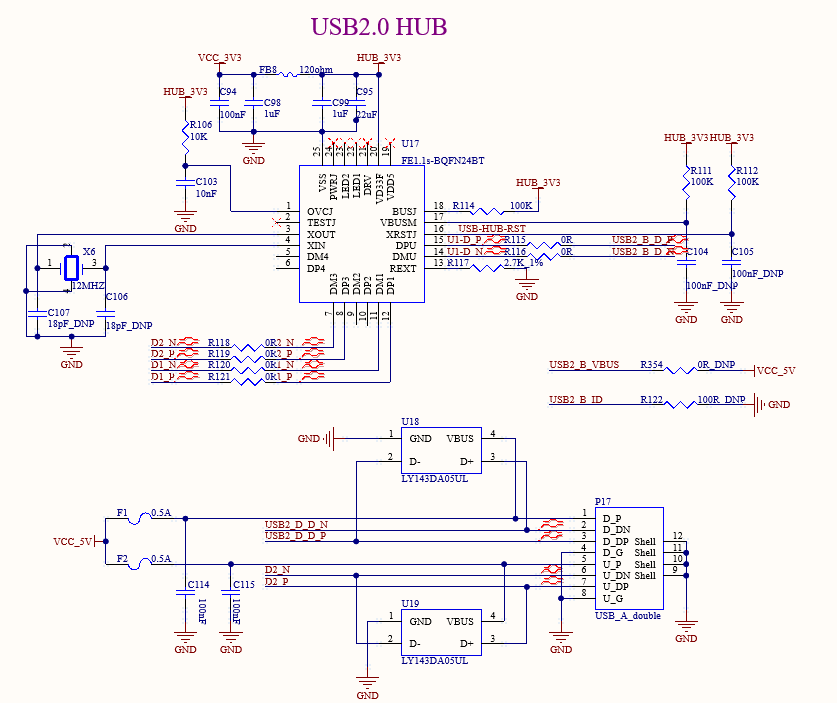

#### 3.5.17 4G

The 4G module can be configured on the development board, and the supported specifications are miniPCIE interface, 3.3V power supply, and USB2.0 communication.

P20 is a nanoSIM card slot, which is self-ejecting. Pay attention to the insertion direction according to the card identification. It does not support card hot plug.

Before using the 4G function, please power off the board, install the 4G module, the SIM card, and the 4G ipex jumper from the module to the board P15, so that the antenna can be externally connected through the SMA interface of P16.

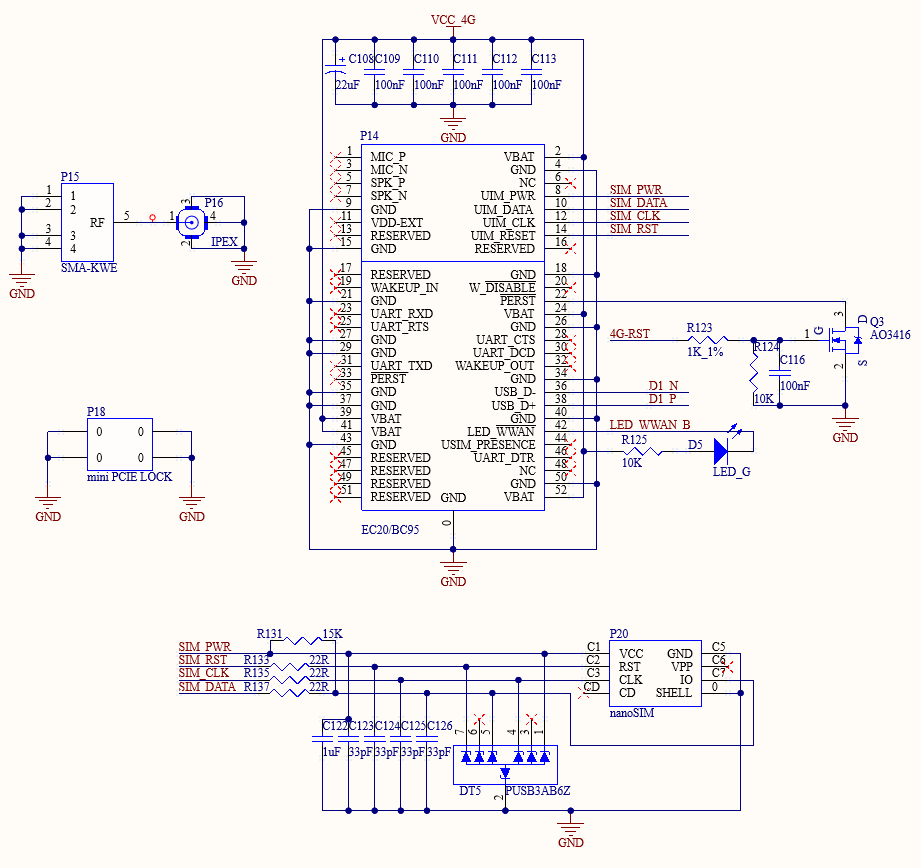

#### 3.5.18 USB3.0

The development board features two onboard USB 3.0 ports, both of which are native interfaces on the SoM. One of the ports is a dual-layer USB 3.0-A standard interface. Port A supports OTG (On-The-Go) functionality, while Port C operates as a HOST port.

Port A is controlled by an S3 DIP switch. When the switch is set to OFF, the port is configured as a Device. Conversely, when the switch is set to ON, the port functions as a HOST. 

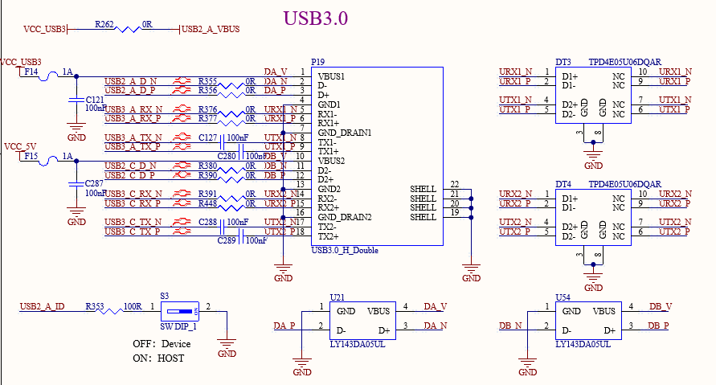

#### 3.5.19 Ethernet

The development board supports two native 1000m network ports, which are realized by using the RGMII of the SoM and the YT8521SH chip, and can be connected to the external network equipment through the standard RJ45 socket with a network transformer.

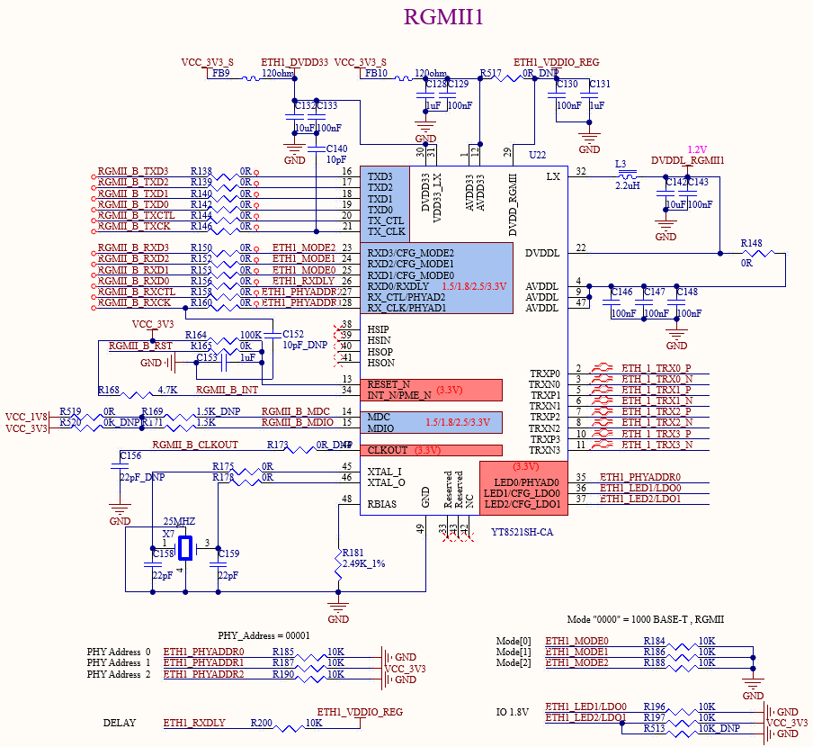

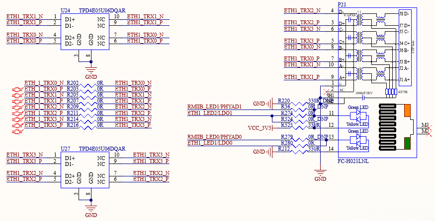

#### 3.5.20 CAN

1 x standard CAN is led out from the development board via native CAN0 and CAN1. Because of the quarantine, the interface supports the maximum rate of 5Mbps, and the electrical quarantine is designed to meet the protection requirements in most scenarios.

The CAN signal is routed via green terminals with a 3.81 mm pitch; a 120-ohm terminating resistor is installed using a jumper cap.

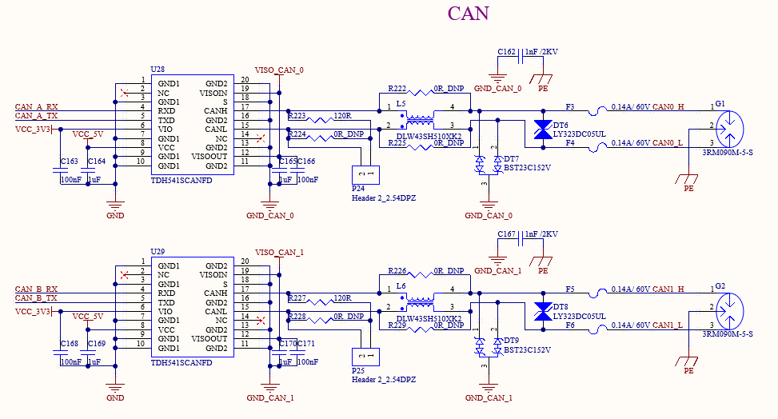

#### 3.5.21 485

1 x standard 485 is led out from the development board via native UART\_C. Due to the UART rate limitation of the CPU, the interface supports a maximum rate of 4Mbps, and the electrical quarantine is designed to meet the protection requirements in most scenarios.

The 485 signal is routed via green terminals with a 3.81 mm pitch; a 120-ohm terminating resistor is installed using a jumper cap.

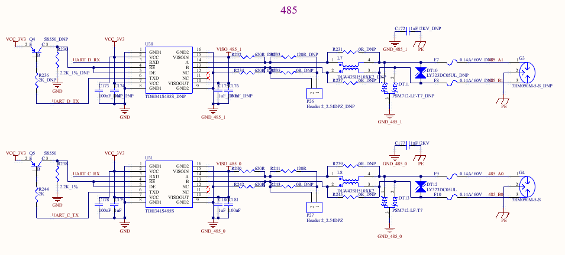

#### 3.5.22 GPADC

The GPADC is connected via 2.54 mm pitch pins. It can be connected directly using DuPont wires via a potentiometer. The SoM features a total of 3 x GPADC, with a maximum sampling voltage of 1.8 V.

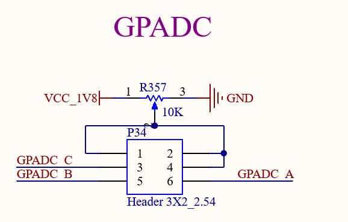

#### 3.5.23 UART

1 x five-wire UART is routed from the development board and powered by a 3.3V signal.

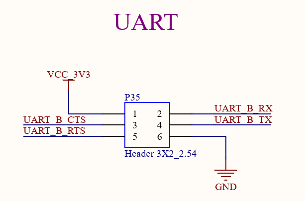

#### 3.5.24 PCIE

The SoM features 1 x PCIe 3.0 x 2 and 1 x PCIe 2.1 x 1 interface, which connect to two PCIe x 4 slots; P29 is a PCIe 3.0 interface and P30 is a PCIe 2.1 interface, with the PCIe 3.0 interface supporting both EP and RC modes.

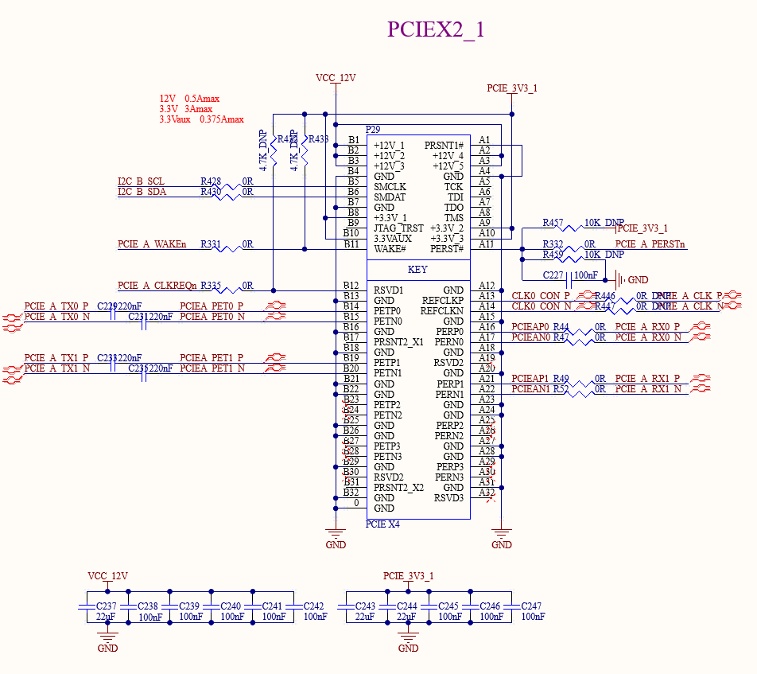

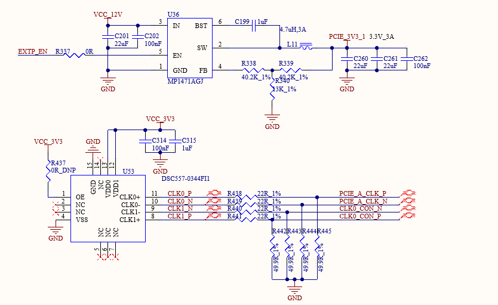

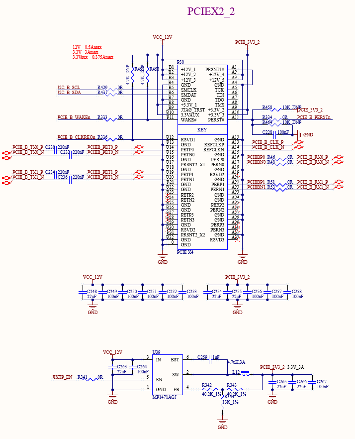

#### 3.5.25 IO Expansion

An I/O expansion chip connects to the carrier board via I2C, offering 24 additional I/O pins for situations where the number of I/O pins is insufficient. In the design of the development board, the I/O must be expandable because some reset and interrupt pins are located on the I/O expansion board.

#### 3.5.26 Audio

The development board features a standard 3.5mm headphone jack (CTIA international standard), located at pin P40, which supports stereo headphone playback and mono microphone recording;

The P39 is a speaker port that supports stereo speakers, Class D, 1.3W power;

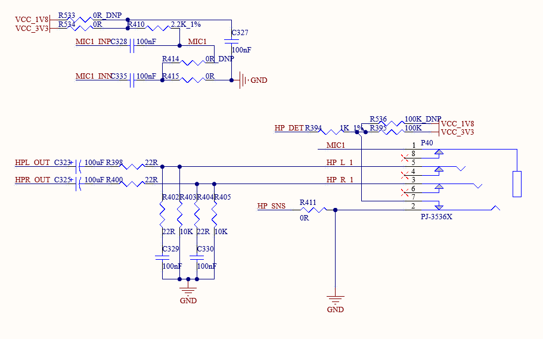

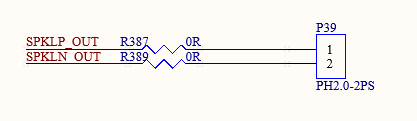

## 4\. Package Dimensions Diagram

Package: LCC+LGA

To ensure a high weld yield, please refer to the diagram below for the design of the packaging stencil:

I. Hole Opening Scheme

1.The steel mesh type is ladder steel mesh, with thickness of 0.1mm and 0.15 mm, and the ladder is on the printing surface;                                                      2. As shown in the figure below, the thickness of the steel mesh of the LCC pad around the carrier board is 0.15 mm, and the opening method is as shown in the figure, with width of 0.6 mm, length of 2.15 mm outward expansion and 0.3 mm inward contraction. The step range is shifted out 0.7 mm from the root to minimize the impact on the LGA pad.

3.The opening thickness of the LGA pad in the middle is 0.1mm. The opening mode of the two rows of LGA pads on the left and right sides in the direction of the scraper is a round hole with a diameter of 0.5mm. The opening of the other LGA pads is as shown in the following figure. The opening diameter is 0.7 mm. The bridge with a width of 0.15 mm is set at the center of 45 °. The bridge center is a round indent with a diameter of 0.25 mm.

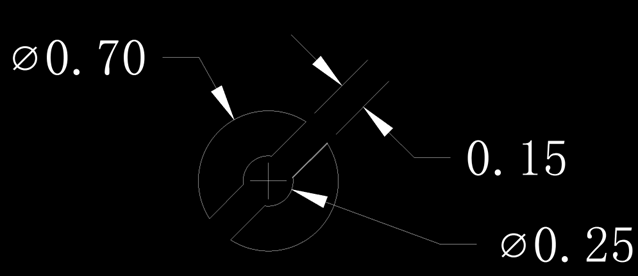

**Note:**

**1\. Since the LGA pads on the UP4 series SoMs use a pre-tinned process, there is a height difference of approximately 0.1 mm between the LCC pads and the LGA pads. This may result in uneven solder wick height between the LCC pads. Please do inspection for the LCC soldering;**

**2\. Since stepped stencils can affect the solder volume on surrounding components, please reduce the aperture size of the stencil openings for these components; For the LGA pad openings in the advancing direction of the scraper, please conduct hole-size reduction in accordance with the No.3.**

## 5\. OK3568-UP4 Development Board Linux Consumption Table

| **No.**| **Item**| **SoM Power (W)**| Development Board **Power** (including SoM)|
|:----------:|----------|:----------:|:----------:|
| | | |
| 1| No-load starting peak power consumption| 3.45 W| 5.304W|
| 2| Sleep power consumption| 1.295W| 0.636W|
| 3| No-load standby power consumption| 1.295W| 2.7W|
| 4| USB read and write power| 1.47W| 3.312W|
| 5| TF read and write power| 1.845W| 3.36W|
| 6| 4G module PING network power consumption| 1.44W| 3.504W|
| 7| WiFi module PING network power consumption| 1.31W| 2.688W|
| 8| 7-inch LCD screen video playback power consumption| 1.55W| 5.244W|
| 9| 10-inch LVDS screen video playback power consumption| 1.65W| 6.648W|
| 10| 7-inch MIPI screen video playback power consumption| 1.94W| 5.568W|
| 11| CPU pressure + memory pressure + eMMC read/write pressure test power| 4.18W| 5.376W|

**Note: Test conditions: The SoM configuration is 2GB memory + +16GB eMMC, the 4G module is Quectel EC20, and the screen is an Forlinx optional product. SoM power supply: 5V; and the carrier board is 12V;**

Power consumption is for reference only.  

****

## 6\. Minimum System Diagram

**It has SoM, BOOT, power, debug serial port, system image flashing port.** 

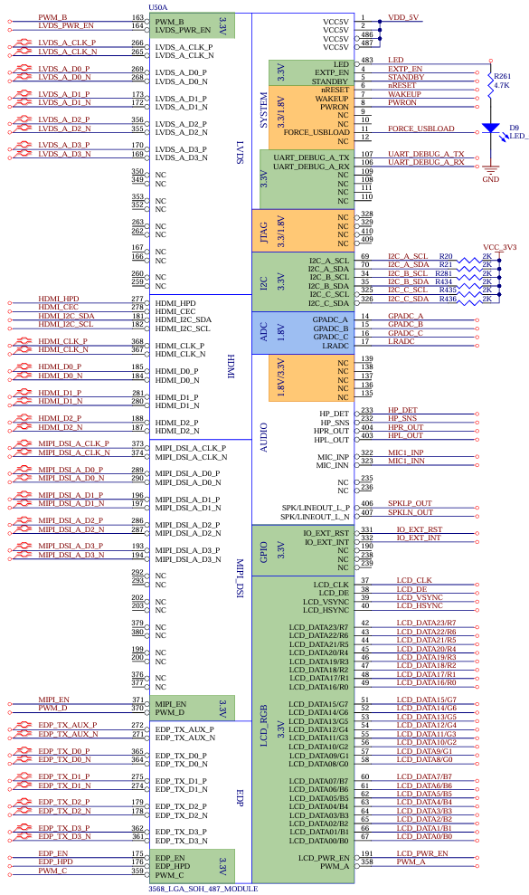

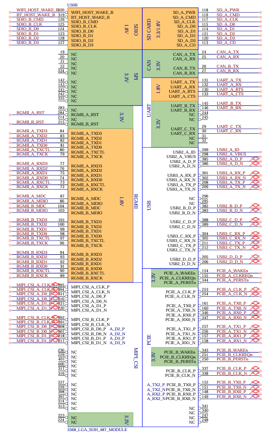

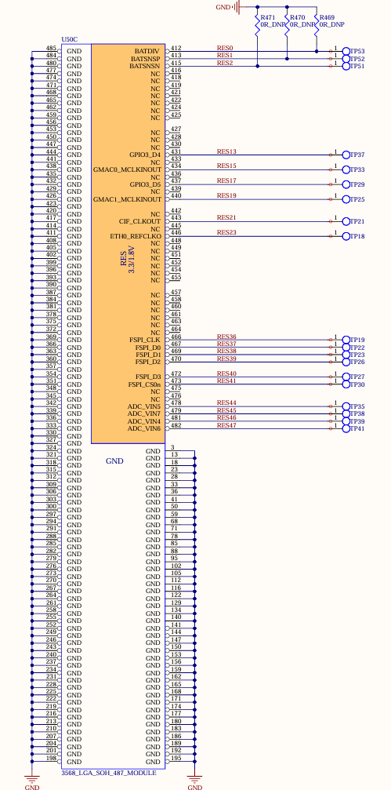

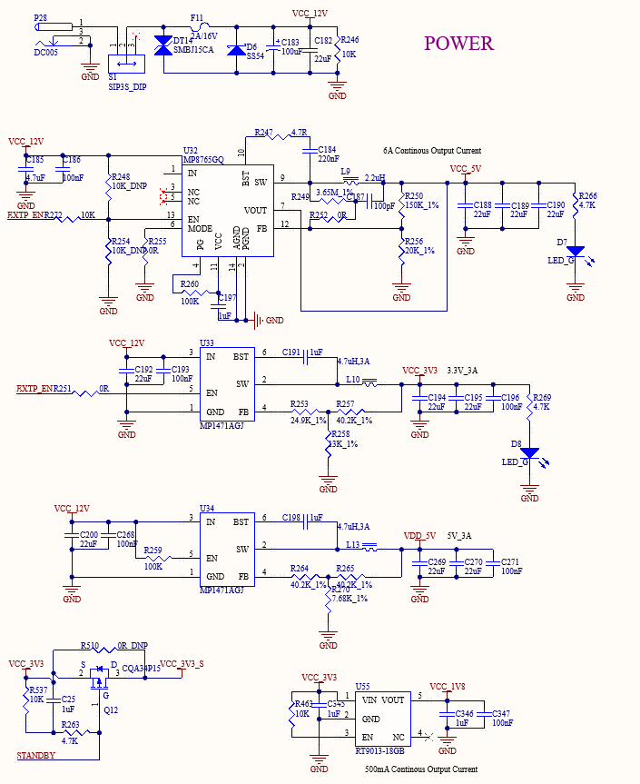

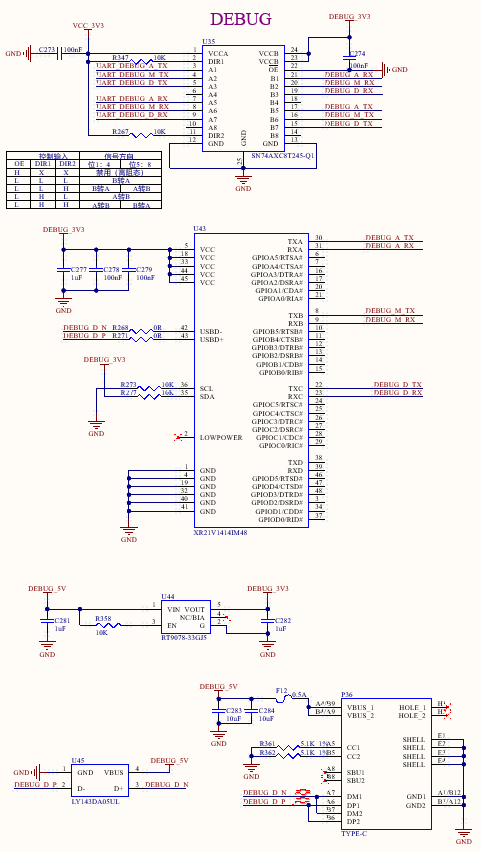

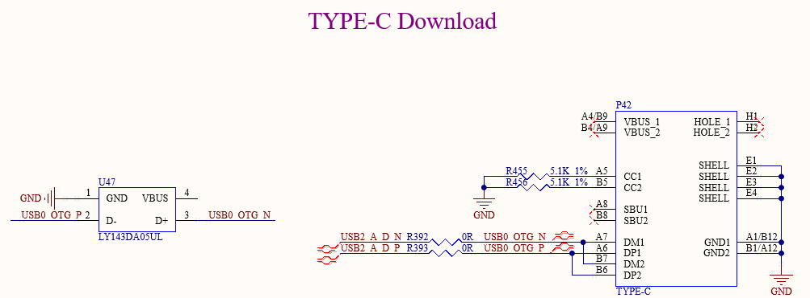