# Buildroot_Kernel-6.1_User's Manual_V1.0

## Open Box

### 1\. Overview

#### 1.1 Application Scope

This document is intended for the Forlinx OK3588-C platform running Linux version 6.1.118-buildroot. Although it may be useful for other platforms, please modify it to suit your specific conditions due to potential differences.

#### 1.2 Revision History

| **Date**| **Version**| **SoM Version**| **Carrier Board Version**| **Revision History**|
|:----------:|:----------:|:----------:|:----------:|:----------|
| 03/04/2026| V1.0| 3588-C V1.1 / 3588S2-C V1.0/3588-C2 V1.0| V1.1 and above| OK3588-C\_Linux6.1.118\_Buildroot\_User Manual\_V1.0|

#### 1.3 OK3588-C Description

It is built around the Rockchip RK3588 processor, which utilizes the ARM64 architecture. It features four high-performance Cortex-A76 cores and four energy-efficient Cortex-A55 cores. Additionally, the RK3588 includes an independent NEON coprocessor and a dedicated Neural Processing Unit (NPU), ensuring a balance between high performance and low power consumption. This design makes the RK3588 ideal for applications in edge computing, artificial intelligence, multimedia processing, mobile internet devices, and various digital multimedia uses.

FET3588 SoMs:

| SoM         | Processor | Memory         | Level            |
| ----------- | --------- | -------------- | ---------------- |
| FET3588-C   | RK3588    | LPDDR4/LPDDR4x | Commercial Level |
| FET3588J-C  | RK3588J   | LPDDR4/LPDDR4x | Industrial Level |
| FET3588-C2  | RK3588    | LPDDR5         | Commercial Level |
| FET3588J-C2 | RK3588J   | LPDDR5         | Industrial Level |
| FET3588S2-C | RK3588S2  | LPDDR5         | Commercial Level |

**⚠️Note: RK3588 and RK3588S2 offer nearly identical performance, but the RK3588S2 features a reduced set of interfaces, such as lacking PCIe 3.0, USB OTG1, HDMI RX 2.0, and ETH1.** 

Key Differences:

| Function Model                     | RK3588                                                | RK3588S2                          | Key Differences               |
| ----------------------------------------------------- | ------------------------------------------------------------ | ------------------------------------------------------------ | ------------------------------------------------------------ |
| GPU                                                   | Mali-G610 MC4                                                | Mali-G610 MP4                                                | Suffixes differ (MC4 vs MP4), but both feature a quad-core configuration. |
| Memory Support                                        | LPDDR4/LPDDR4X/LPDDR5 | LPDDR4/LPDDR4X/LPDDR5/LPDDR5X | RK3588S2 supports **LPDDR5X**                                |
| USB                                                   | • USB OTG0 3.1/2.0/Typec   <br />• USB OTG1 3.1/2.0/Typec <br />  • 2x USB Host 2.0 | • USB OTG 3.1/2.0/Typec   <br />• 2x USB Host 2.0 | Only 1 x USB OTG interface is retained on RK3588S2.          |
| PCIe/SATA | • SATA3/PCIe2.1/USB3Host（1group）  <br />• 2x SATA3/PCIe2.1   <br />• **PCIe3.0（independent）** | • SATA3/PCIe2.1/USB3Host（1 Group）  <br/>• SATA3/PCIe2.1（1 Group）  <br/>• **No independent PCIe3.0** | 1 x SATA/PCIe combined interface and the independent PCIe 3.0 controller are removed from the RK3588S2. |
| Ethernet                                              | 2x Giga-Ethernet | 1x Giga-Ethernet | 1 x single Gigabit Ethernet MAC is reserved on the RK3588S2. |
| Multimedia Interfaces                                 | • 2x MIPI-CSI D/CPHY   <br />• 2x MIPI-DSI DPHY   <br />• 2x HDMI2.1 TX/eDP1.3   <br />• 2x DP1.4 (Combo with USB3)   <br />• **HDMI RX 2.0** | • 1x MIPI-CSI DPHY 4L/CPHY 3L  <br /> • 4x MIPI-CSI DPHY 2L   <br />• 2x MIPI-DSI DPHY 4 Lane  <br /> • HDMI2.1 TX/eDP1.3 4 Lane   <br />• DP1.4 4 Lane (Combo with USB3)   <br />• No HDMI RX | The RK3588 features a unique HDMI RX input function, which is not supported on the RK3588S2.  <br/>There are differences in the combination of CSI/DSI interfaces. |

There are differences in the combination of CSI/DSI interfaces.


FET3588 SoM


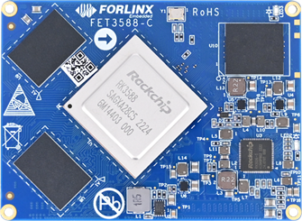


FET3588J SoM


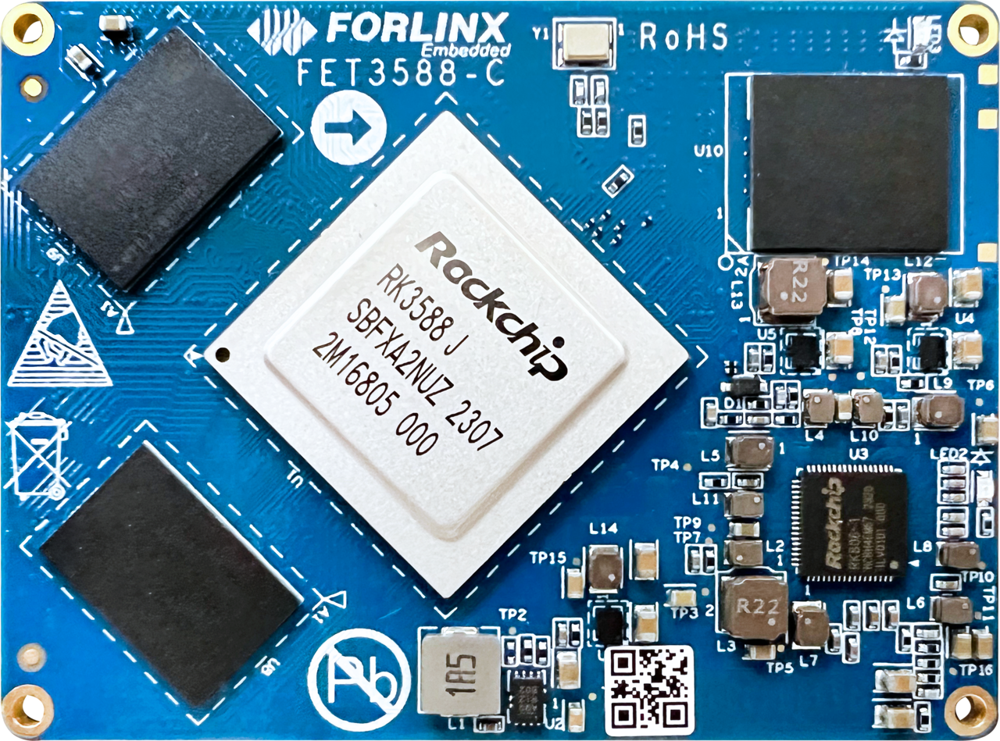


FET3588S2 

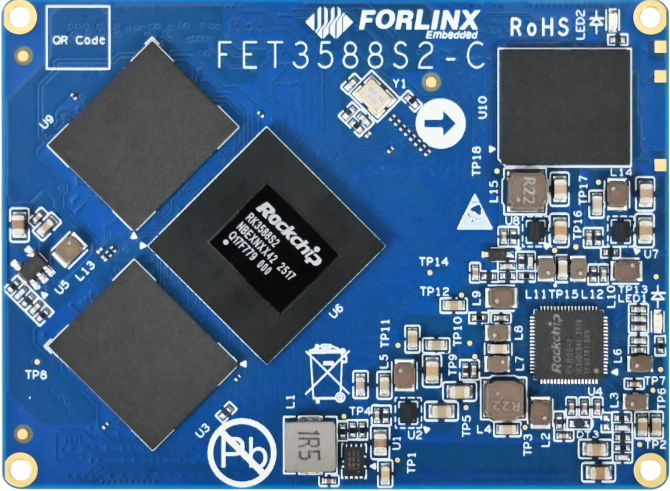

Board-to-board connections enable extensive peripheral interfaces such as RTC, MIPI, USB, DISPLAY, CAN, and PCIe. These resources can be directly utilized for product development and validation, significantly accelerating the R\&D process. Some of the peripherals cannot be used on the FET3588-C. 

For details, please refer to the interface section.

OK3588-C

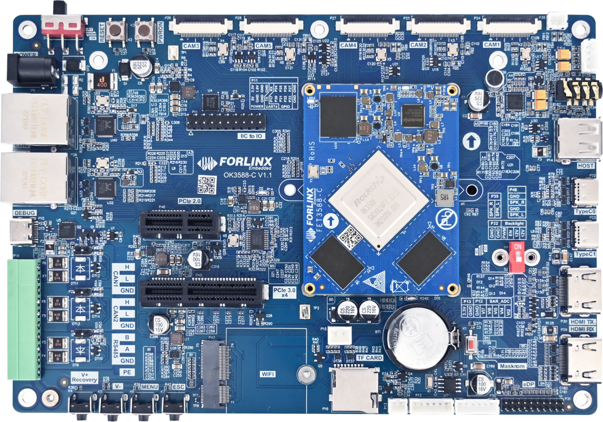

#### 1.4 Main Frequency Settings Description

FET3588J-C and FET3588J-C2 SoM frequency description: 

| | Normal Mode| Overclock Mode|
|----------|----------|----------|
| Maximum CPU A76 Frequency (GHz)| 1.6| 2.0|
| Maximum CPU A55 Frequency (GHz） | 1.3| 1.7|
| Maximum GPU Frequency（MHz） | 700| 850|
| Maximum NPU Frequency（MHz） | 800| 950|

**Normal Mode** indicates that the chip operates within safe voltage and frequency parameters. For industrial applications, it is advisable to maintain Normal Mode to ensure long-term chip reliability.

**Overclocking Mode** increases operating frequency and voltage. Prolonged use in this mode, particularly under elevated temperatures, may reduce the chip's lifespan.

Frequency Specifications for RK3588 and RK3588S2 Commercial-Grade SoMs:

| Maximum CPU A76 Frequency| 2.2-2.4 GHz|
|----------|----------|
| Maximum CPU A55 Frequency| 1.8 GHz|
| Maximum GPU Frequency| 1 GHz |
| Maximum NPU Frequency| 1 GHz |

**⚠️Note: The default factory firmware and source code for the industrial-grade RK3588J System-on-Module (SoM) are configured to operate in overclocking mode. This setting is intended for maximum performance testing of the System-on-Chip (SoC). If you do not have specific performance requirements, it is advisable to switch to normal mode to ensure long-term stability.**

Switch to "normal mode". You just need to add \#include "rk3588j.dtsi" in the reference within the kernel device tree. The path is: OK3588_Linux_fs/kernel/arch/arm64/boot/dts/rockchip/OK3588-C-common.dtsi.

#### 1.5 Overview

This manual is designed to help you quickly familiarize yourself with the product. It covers the source code structure and compilation methods, firmware flashing techniques, usage and testing of development board interfaces, and troubleshooting methods for common issues.

**Chapter 1: Product Overview**

* Introduces the OK3588-C platform interface resources, hardware configurations of the five compatible SoMs, and system login methods;

**Chapter 2: System Flashing Guide**

* Describes how to obtain and flash the firmware;

**Chapter 3: Compilation Guide**

* Details how to obtain the source code, its structure, and compilation steps;

**Chapter 4: Operation Guide**

* Explains the OK3588 interface resources and their testing methods;

**Chapter 5: Development Guide**

* Summarizes common issues encountered during development and their corresponding solutions.

### 2\. Packing List

Packing List: FET3588-C SoM, OK3588-C development board and accessory kit. 

As shown in the figure:
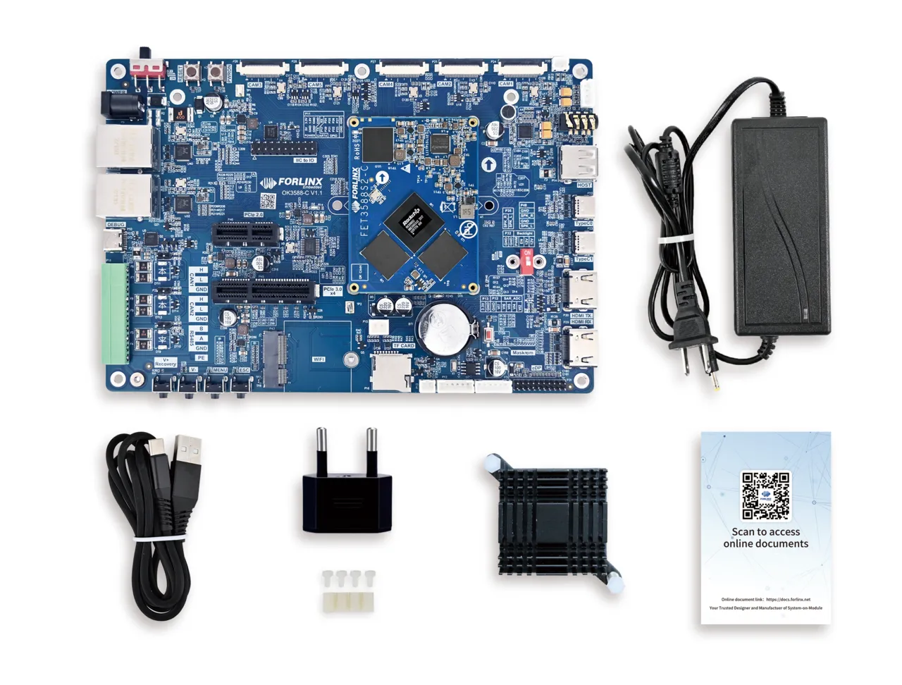

### 3\. Quick Start

#### 3.1 Interfaces

OK3588-C Interfaces:


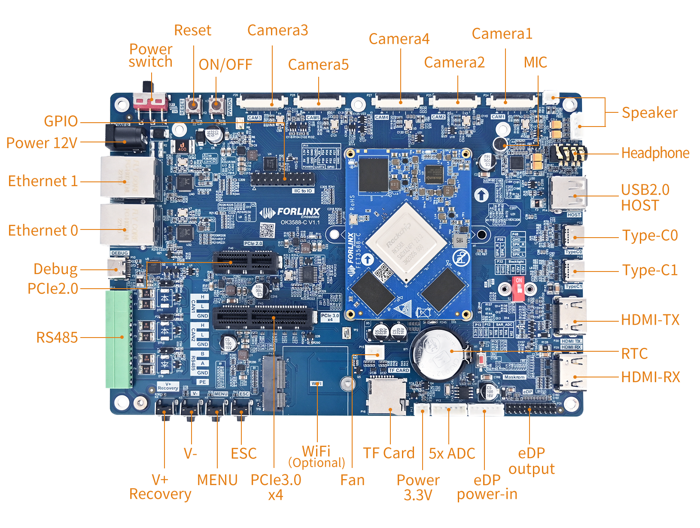

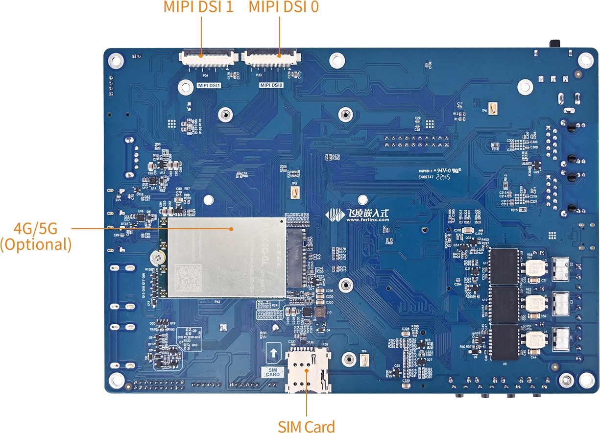


#### 3.2 Debug

Login methods: Serial login and network login.                                                              

##### 3.2.1 Serial Port Debug

The OK3588 platform features a Type-C port for serial debugging and an on-board USB-to-UART chip. No additional USB-to-serial debugging tool is required（ CP210x）, making the setup simple and convenient.

+ Settings: Baud rate 115200, 8 data bits, 1 stop bit, no parity/flow;
+ Software Requirements:  A serial terminal application must be installed on the PC Windows. There are various terminal programs available, and you may choose any one you are familiar with;
+ Hardware Requirements: Type-C, 12V.

###### 3.2.1.1 Serial Port Driver Installation

Please download from the Resource Download ([https://www.forlinx.net/resources/download-center.html](https://www.forlinx.net/resources/download-center.html)). Navigate to either the “OK3588-C/C2” or “OK3588S2-C” section based on your SoM model.  There is "CP210x\_VCP\_Windows\_XP\_Vista.zip" under "TOOLS"->“Driver Tool”. Download and extract it to your current directory, choose the appropriate executable file based on your computer's configuration to install the driver.

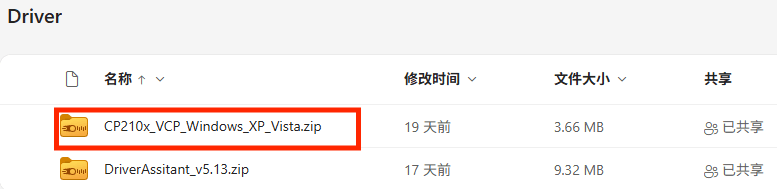

###### 3.2.1.2 Installing the Terminal Software PuTTY

Please download from the Resource Download ([https://www.forlinx.net/resources/download-center.html](https://www.forlinx.net/resources/download-center.html)). Navigate to either the “OK3588-C/C2” or “OK3588S2-C” section based on your SoM model. There is PuTTY installation package “putty-64bit-0.71-installer” under "TOOLS"->“Debug Tool”. Download it to your computer and install PuTTY.

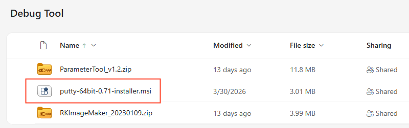

###### 3.2.1.3 **Usage of PuTTY**

Take putty as an example to introduce the setting mode of the putty terminal:

Step 1: Connect the PC to the Debug serial port of the OK3588-C using a Type-C cable. 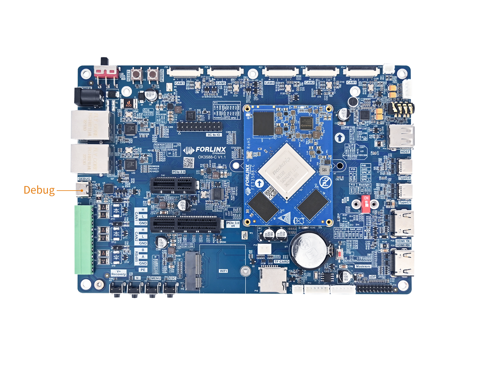

Open the Windows Device Manager and check the detected COM port number under “Ports (COM   \& LPT)” (e.g., COM3). Use the actual displayed port.

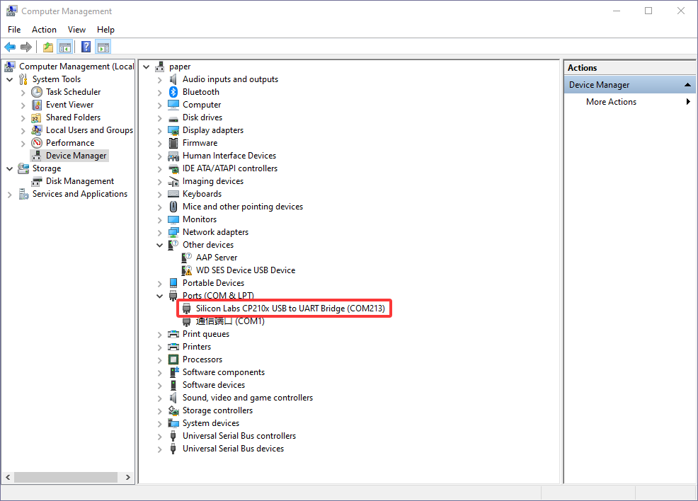


Step 2: Open PuTTY. Select “Session”, set the “Serial line” to the COM port used by your computer, and set the baud rate to 115200.

 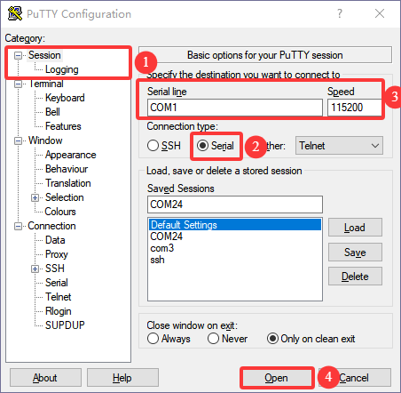

Step 3: After completing the previous settings, enter the COM port number used by your computer in the “Saved Sessions” field (for example, use COM24). Save the configuration. When you reopen the serial port, you can simply click on the saved port number to apply the settings directly.

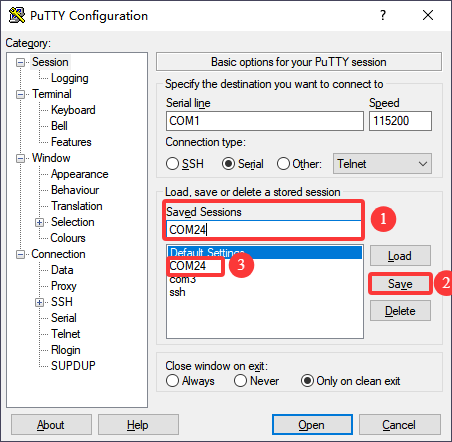

Step 4: Power on the development board. If the startup information appears as shown below, it indicates a successful boot. You can then press Enter to create a new command line.

```c
Welcome to Forlinx OK3588 Board

Tel: +86 312 311 9192
Linux Support: linux@forlinx.com
User Manual: https://www.forlinx.net/resources/download-center.html

Powered by Forlinx - Enjoy!

OK3588-C-buildroot login: root (automatic login)

root@OK3588-C-buildroot:~#
```

##### 3.2.2 Ethernet Debug (SSH)

The OK3588-C development board supports SSH login via Ethernet.

+ Connect the ETH0 network port on the development board and ensure that your computer can ping the board;
+ The network interface is configured with a static IP address by default: 192.168.0.232;
+ Log in as the root user (no password required).
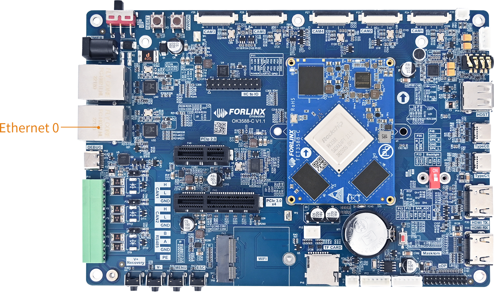
        

To log in to the development board via SSH, 

​                                          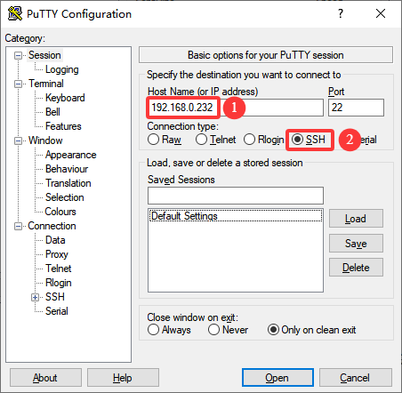        

After successful login, the following message is printed:

```plain
login as: root
root@OK3588-C-buildroot:~#
```

## Upgrade Firmware

### 1\. Introduction

This section explains how to write the firmware image to the flash memory of the board. The OK3588-C development board supports flashing through both OTG and TF Card. You can find the required flashing tools in the user materials. You may choose either method to write the image.

### 2\. Obtaining the Image

Please download from the Resource Download ([https://www.forlinx.net/resources/download-center.html](https://www.forlinx.net/resources/download-center.html)).

Select either the “OK3588-C/C2” or “OK3588S2-C” page based on the SoM model. There is corresponding standard images under “FIRMWARES” → “Firmware Download.

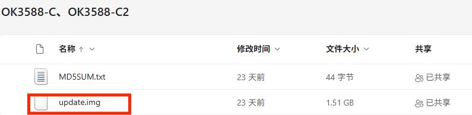

### 3\. Firmware Flashing

#### 3.1 Flashing via OTG (Windows)

Hardware requirements:

+ Type-C data cable;
+ 12V DC power supply.

##### 3.1.1 Installing Rockchip USB Driver

Please download from the Resource Download page ([https://www.forlinx.net/resources/download-center.html](https://www.forlinx.net/resources/download-center.html)).

Select either the “OK3588-C/C2” or “OK3588S2-C” page based on your SoM model. There is DriverAssistant\_v5.13.zip under "TOOLS"->“Driver Tool”. Download the zip package, extract it to any directory, and run the program with administrator privileges. 

<!-- 这是一张图片，ocr 内容为： -->
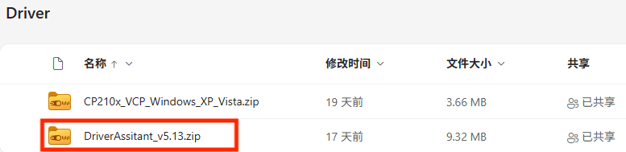

Click the “Driver Installation”. The text is `Driver Installation`.

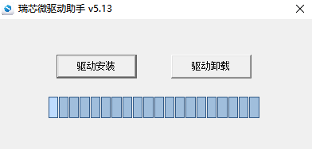

The driver is installed successfully. Click “OK“. 

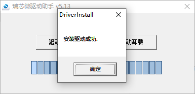

##### 3.1.2 OTG Full Flashing

Please download from the Resource Download ([https://www.forlinx.net/resources/download-center.html](https://www.forlinx.net/resources/download-center.html)). Navigate to either the “OK3588-C/C2” or “OK3588S2-C” section based on your SoM model. There is “RKDevTool\_Release\_v3.37.zip” under "TOOLS"->“Flashing Tool”. Download the zip package and extract it to the current directory.

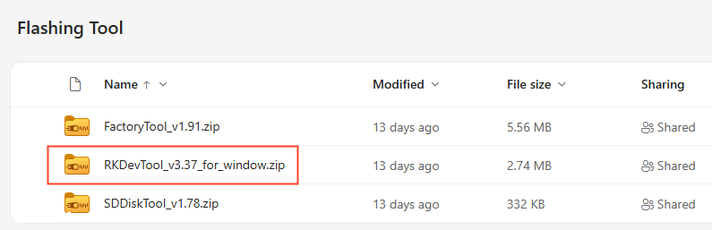

It is a development tool provided by Rockchip. Launch the application and connect the development board Type-C0 port to your computer host using a Type-C cable.

The Type-C0 port, Recovery button, and Reset button are located on the board as shown in the following figure:

Hold down the development board Recovery button and do not release it.

Press the Reset button to reset the system.

After approximately two seconds, release the Recovery button. There will be prompts on the Rockchip development tool : Found ONE LOADER Device.
     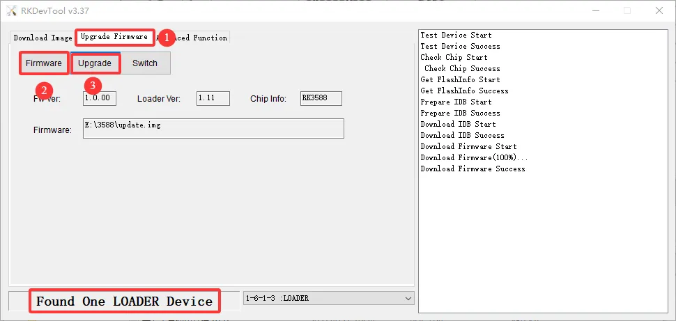

- Click “Upgrade Firmware”;


- Click “Firmware” and browse to locate the update.img file you wish to flash;


- Click “Upgrade” to flash.


If the loader is damaged and cannot enter Loader Mode, you can force the board into Maskrom Mode. To do this, hold down the Maskrom button (located to the right of the RTC battery holder on the carrier board) and then press the Reset button. At this point, the system will indicate that a Maskrom device has been detected. The programming process in Maskrom Mode is the same as in Loader Mode. It is recommended to use the update.img file for programming.

**⚠️Note: Do not click “Device Partition Table” while in Maskrom Mode, as this operation is invalid. Flashing individually in Maskrom Mode will not clear the U-Boot environment variables.**

##### 3.1.3 OTG Step-by-Step Flashing

During R\&D, full reflashing is time-consuming. This section introduces OTG-based individual partition flashing. (⚠️**Note: This function is only applicable in the Loader Flashing Mode.**)

After a full compilation, individual partition images can be found in the rockdev directory.

```plain
linux-source/rockdev$ tree
.
├── boot.img -> ../../kernel-6.1/boot.img
├── env.img -> ../env.img
├── MiniLoaderAll.bin -> ../../u-boot/rk3588_spl_loader_v1.19.113.bin
├── misc.img -> ../misc.img
├── parameter.txt -> ../../device/rockchip/.chips/rk3588/parameter.txt
├── recovery.img -> ../recovery/ramboot.img
├── rootfs.img -> ../../buildroot/output/rockchip_ok3588-c/images/rootfs.ext2
├── uboot.img -> ../../u-boot/uboot.img
├── update.img -> ../update/Image/update.img
└── userdata.img -> ../extra-parts/userdata.img
```

| File Name| Description|
|----------|----------|
| `boot.img`| Linux kernel image, containing the kernel and Device Tree.|
| `env.img`| U-Boot environment variables partition image.|
| `MiniLoaderAll.bin`| Primary Boot Loader|
| `misc.img`| Miscellaneous partition image, used for passing system boot mode information.|
| `parameter.txt`| Partition table configuration file, defining the start address, size, and name of each partition on eMMC/NAND.|
| `recovery.img`| Recovery system image, used for system repair, OTA updates, or factory reset.|
| `rootfs.img`| Root filesystem image, containing the directories, libraries, configurations, and applications required for Linux to run.|
| `uboot.img`| U-Boot second-stage bootloader image, responsible for loading the kernel, device tree, and booting the system.|
| `update.img`| Complete firmware update package, bundling all components into a single file for flashing all partitions at once.|
| `userdata.img`| User data partition image, storing user-installed applications, configurations, and temporary data.|

To demonstrate the flashing method using the separate flashing userdata partition, we will use RKDevTool_Release_v3.37 for this process.

First, connect the development board to your host computer using a Type-C cable linked to the Type-C port (TypeC0) on the board. Begin by pressing and holding the recovery key. While holding the recovery key, press the reset key to reset the system. After approximately two seconds, you can release the recovery key. The system will then display the message “ Found ONE LOADER Device.” At this point, ensure you have the compiled userdata.img file ready on your PC.

Finally, modify the “name” field in the last row to read “userdata.”

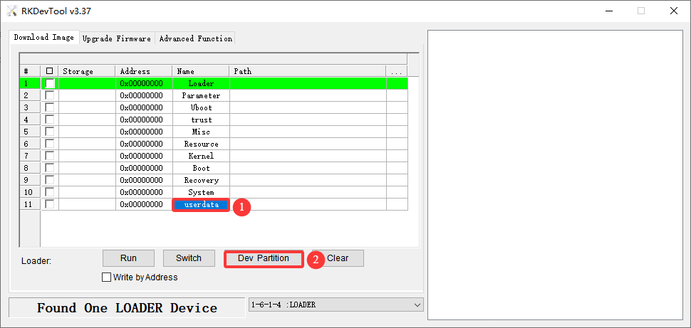

Click `Dev Partition`. The system will automatically read the partition address.

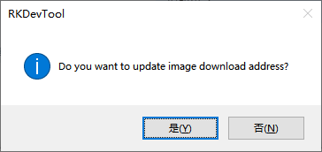

Prompt whether to update the download address, click "Yes" , you can see "Reading partition table success".

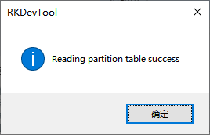

Check the partition and check the address. The address is required to be consistent with the userdata partition address 0x0007a000 read from the partition. Click ② to select the partition image for the selected area. Click `Run`, it will automatically flash and restart. 

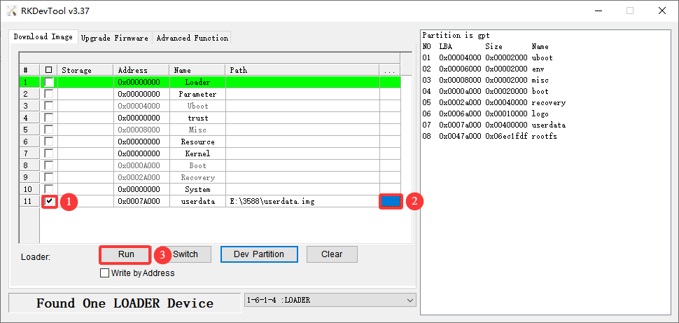

#### 3.2 Flashing Firmware via TF Card

**⚠️Note:**

+ **Testing indicates that the maximum supported TF card capacity is 16 GB. Using a TF card of 32 GB or larger may result in flashing failure;**
+ **When flashing via TF card, the system will enter the command-line interface with the user root@buildroot. Please wait patiently for the flashing process to complete.**

Before flashing firmware via USB OTG, please prepare:

+ Type-C cable
+ TF card（16G）
+ 12V DC power supply

Please download from the Resource Download ([https://www.forlinx.net/resources/download-center.html](https://www.forlinx.net/resources/download-center.html)). Navigate to either the “OK3588-C/C2” or “OK3588S2-C” section based on your SoM model, . There is “SDDiskTool\_v1.78.zip” under "TOOLS"->“Flashing Tool”. Download the zip package and extract it to the current directory.

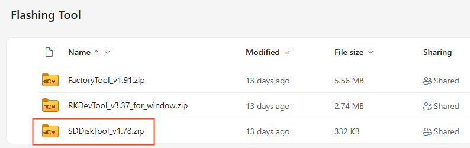


Run it:

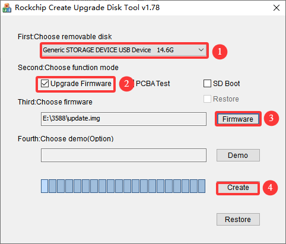

Select the disk, and check `Upgrade Firmware`; and `update.img`. Click "Yes".

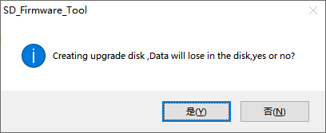

Creating upgrade disk, Data will lose in the disk, yes or no? select "Yes".

After successfully creating the card, the following prompt will appear:

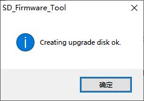                    

- Connect the DEBUG serial port of the development board to the host using a Type‑C data cable, and open a serial terminal tool to monitor the flashing progress;

- Insert the prepared TF flashing card into the the development board, then power up. The system will automatically enter the flashing process;

- After flashing is complete, the serial terminal and display will output the following prompt information:

`Please remove SD CARD!!!, wait for reboot.`

When prompted, pull out the TF card, and the system will automatically restart (please do not power off directly).

## OS Development

### 1\. Downloading SDK Source Code

#### 1.1 Repo Tool Installation

`repo` is a Google-based command-line tool based on `Python`for managing large projects consisting of multiple Git repositories.

##### 1.1.1 System Requirements

`repo`is based on`Python3 (3.6+)` and`Git (2.x+)`. Please confirm before use.

```plain
forlinx@ubuntu:~$ python3 --version
forlinx@ubuntu:~$ git --version
```

If it is not installed, install it using the following command

```plain
forlinx@ubuntu:~$ sudo apt-get update && sudo apt-get install python3 git -y
```

##### 1.1.2 Installing the Repo Tool

Refer to the following steps for`repo`installation.

###### 1.1.2.1 Getting Repo Source Code

```plain
forlinx@ubuntu:~$ sudo apt-get update && sudo apt-get install curl
forlinx@ubuntu:~$ mkdir -p ~/.bin
forlinx@ubuntu:~$ curl https://storage.googleapis.com/git-repo-downloads/repo > ~/.bin/repo
```

###### 1.1.2.2 Setting Up Environment

Make the `repo`script executable and add `~/.bin`to `PATH`:

```plain
forlinx@ubuntu:~$ chmod a+rx ~/.bin/repo
forlinx@ubuntu:~$ echo PATH=~/.bin:$PATH >> ~/.bashrc
forlinx@ubuntu:~$ source ~/.bashrc
```

#### 1.2 Fetching Source Code Using Repo

The Forlinx OK3588 BSP is managed through a manifest repository, which requires access permissions to retrieve the source code. If you're uncertain about your access permissions, you can check by clicking the GitHub repository link below. If you can view the contents of the repository, it means you have the necessary permission. If not, please reach out to Forlinx to request access and join the team.

When pulling from GitHub, please configure a key to establish a connection. If you have not yet set up GitHub authentication on your local machine, refer to Section 1.3 below for setup instructions.

```plain
# manifest repository address
https://github.com/FLembedded/manifests_linux
```

Once all the above requirements are met, you can follow the following steps to pull the source code:

##### 1.2.1 Creating a Working Directory

```plain
forlinx@ubuntu:~$ mkdir rk3588
forlinx@ubuntu:~$ cd rk3588
```

##### 1.2.2 Initializing the Repo Repository

```plain
forlinx@ubuntu:~/rk3588$ repo init -u git@github.com:FLembedded/manifests_linux.git -m platforms/ok3588/ok3588-buildroot.xml
```

##### 1.2.3 Synchronizing the Code

```plain
forlinx@ubuntu:~/rk3588$ yes | repo sync
```

Pipelining is utilized to transmit `yes` because a script is invoked to retrieve some compressed packages. If you synchronize the code directly using the `repo sync` command, you can also manually respond with `yes` or `always continue` when prompted by the repository about calling the script.

⚠️**Note:**

+ **The first synchronization may take a long time, depending on the project size and your network conditions;**
+ **If synchronization is interrupted, directly re-run `repo sync` ; it supports resumption from the point of failure;**
+ **If your network is unstable, it is recommended to reduce the concurrency (e.g. `-j4`). Excessive concurrency may lead to connection failures;**
+ **Since `OK-linux-source/external/camera_engine_rkaiq` repository is  large, it's not managed by git. If you need to modify its contents, please set up a Git repository locally.**

#### 1.3 Configuring GitHub Authentication

To successfully pull code using the repo tool, it's essential to configure GitHub authentication on your local machine. Since this source repository is managed through SSH, only the SSH authentication method will be covered here. 

##### 1.3.1 Generating an SSH Key Pair

```plain
forlinx@ubuntu:~$ ssh-keygen -t ed25519 -C "user@email.com"
```

When you execute the command, you can simply press Enter repeatedly to accept the default path settings. As a result, two files will be generated.

```plain
forlinx@ubuntu:~$ ls ~/.ssh/
id_ed25519   				// Private key, do not disclose
id_ed25519.pub			// Public key for uploading to GitHub
```

##### 1.3.2 Adding the Public Key to GitHub

Log in to your GitHub account. Click your profile picture in the top-right corner and go to `Settings->SSH and GPG keys`.

Click the `New SSH key`. Fill in, copy the public key content generated in the above steps to the Key field, and add.
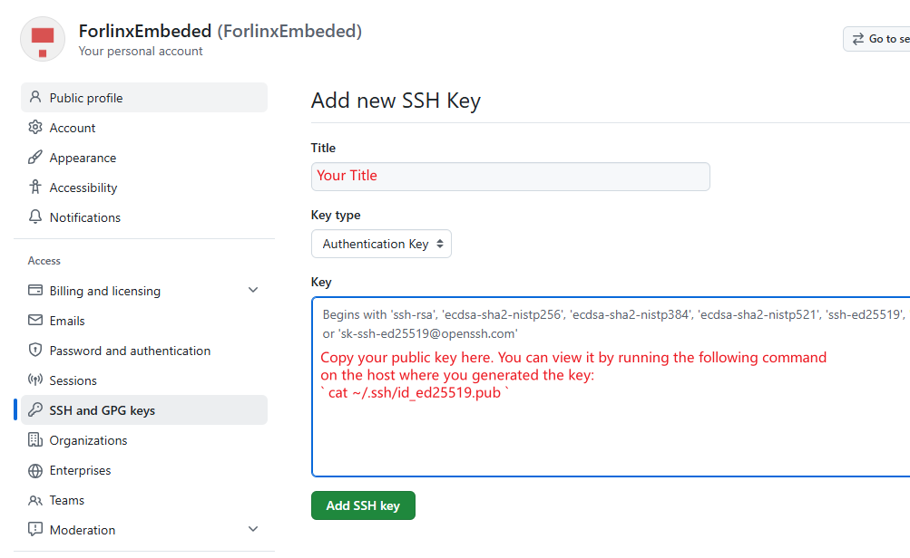

##### 1.3.3 Verifying the GitHub Connection

Test if you can connect to GitHub via SSH using the following command:

```plain
forlinx@ubuntu:~$ ssh -T git@github.com
```

If the connection is successful, you can return to Section 1.2 to pull the source code.

#### 1.4 Pre-downloaded Software Packages

When compiling buildroot, the source code of the software package needs to be pulled. In order to shorten the time, Forlinx provides a pre-downloaded source code package with a size of 952 MB. You can pull it according to the following steps:

Get the Pre-downloaded dl Package

```plain
OK-linux-source$ curl -O -L https://github.com/FLembedded/buildroot_dl/releases/download/source_packages/dl_packages.tar.gz
```

The download time for the tar package depends on your network speed. In this test, it averaged about 5 MB/s and completed in roughly 3 minutes. Typically, the download should take between 2 and 10 minutes.

Extract the archive directly into the buildroot directory.

```plain
OK-linux-source$ tar xzf dl_packages.tar.gz  -C buildroot/
```

Delete it later.

```plain
OK-linux-source$ rm dl_packages.tar.gz
```

Buildroot will now recognize existing source packages in the local `dl` directory, skipping the download phase to use these local files for compilation.

#### 1.5 Utility Tools

The SDK contains executable tools for Linux, macOS, and Windows. However, the tools directory fetched in the previous step only includes the tools for Linux. To use the tools on macOS or Windows, please download via the link below.

[https://github.com/FLembedded/buildroot\_dl/releases/download/tools/tools.tar.xz](https://github.com/FLembedded/buildroot_dl/releases/download/tools/tools.tar.xz)

The compressed package size is 540 MB. The test speed is approximately 5 MB/s, with a download time of about 1 minute and 30 seconds. Typically, the download time ranges from 1 minute to 5 minutes.

##### 1.5.1 Directory Structure

This section will separately describe the available tools under Windows, Linux, and Mac.

###### 1.5.1.1 Windows

```plain
windows/
├── BoardProofTool_v1.01_20240823_02.zip # Anti-Cloning Tool, prevents PCB design from being copied or cloned
├── boot_merger_v1.32.zip # Tool for packing or unpacking loader files
├── DDR_UserTool_v1.41.7z # DDR User Test Tool
├── DriverAssitant_v5.13.zip # Driver Installation Assistant
├── EfuseTool_v1.42.zip # eFuse Programming Tool
├── FactoryTool_v1.91.zip # Mass Production Upgrade Tool
├── ParameterTool_v1.2.zip # Partition Table Modification Tool
├── pin_debug_tool_v1.18_20250322_win.zip # GPIO Debug Tool
├── programmer_image_tool_v1.28.zip # Programmer Upgrade Tool
├── rk_ddrBin_tool_V1.07.2.zip # DDR Bin Debug Tool
├── RKDevInfoWriteTool-v1.3.7.zip # Serial Number Writing Tool (for SN, MAC, etc.)
├── RKDevTool # Tool for discrete firmware upgrades and entire update.img upgrades
├── RKDevTool_Release_v3.37.zip # Firmware Flashing Tool
├── RKImageMaker_20230109.zip # Command-line Packing Tool
├── RKPCBATool_V1.0.9.zip # PCBA Board Test Tool
├── Rockchip_HdcpKey_Writer_V1.0.5.7z # HDCP Key Programming Tool
├── Rockchip_USB_SQ_Tool # USB PHY Signal Quality Debug Tool
├── Rockchip_USB_SQ_Tool_V1.5.7z # (Same as above, version 1.5)
├── SDDiskTool_v1.78.zip # SD Card Boot/Upgrade Image Creation Tool
├── ToolsRelease.txt
└── upgrade_tool_v2.46.zip # Command-line Upgrade Tool
```

###### 1.5.1.2 Linux

```plain
linux/
├── boot_merger # Tool for packing or unpacking loader files
├── Firmware_Merger # SPI NOR Firmware Packing Tool (generated firmware can be used with programmers)
├── Linux_DDR_Bandwidth_Tool # DDR Bandwidth Statistics Tool
├── Linux_Diff_Firmware # OTA Differential Package Tool
├── Linux_Pack_Firmware # Firmware Packing Tool (packs into update.img)
├── Linux_SecureBoot # Firmware Signing Tool
├── Linux_SecurityAVB # AVB Signing Tool
├── Linux_SecurityDM_v1_01.tar.gz # DM Signing Tool
├── Linux_Upgrade_Tool # Firmware Flashing Tool
├── PinDebug # GPIO Debug Tool
├── programming_image_tool # Tool for packing SPI NOR/SPI NAND/SLC NAND/eMMC programmer firmware
├── rk_ddrbin_tool_V1.01.7z # RK DDR Bin Debug Tool
├── rk_sign_tool # SecureBoot Signing Tool
├── rk_sign_tool_v1.42_linux.zip # (Same as above, version 1.42)
└── ToolsRelease.txt
```

###### 1.5.1.3 Mac

```plain
mac/
├── boot_merger # Tool for packing or unpacking loader files
├── rockdev # Command-line Packing Tool
├── sign_tool # SecureBoot Signing Tool
├── ToolsRelease.txt
└── upgrade_tool # Command-line Upgrade Tool
```

### 2. Configuring SDK 

#### 2.1 SDK Structure

OK3588-C source code structure:

```plain
OK-linux-source$ tree -L 1
.
├── Makefile -> device/rockchip/common/Makefile
├── NOTICE
├── README.forlinx
├── app
├── build.sh -> device/rockchip/common/scripts/build.sh        	# building script
├── buildroot                                                  	# buildroot
├── device
├── docs                                                       	# rockchip development documents
├── external
├── hal
├── kernel -> kernel-6.1
├── kernel-6.1                                                  # linux kernel
├── prebuilts                                                   # prebuilt cross-compilation toolchain 
├── rkbin
├── rkflash.sh -> device/rockchip/common/scripts/rkflash.sh
├── rtos
├── tools                                                      	# some tools
├── u-boot                                                      # u-boot


```

#### 2.2 SDK Configuration

The configuration file path for the SDK is: (`OK-linux-source/device/rockchip/.chips/rk3588`). These files control the system compilation.

The naming rule for the configuration files is as follows:

```plain
<vendor>_<chip>_<model>-<extra>_<OS>_defconfig

vendor: vendor of the product
chip: soc the product used
model: product model, means this config file is for that specific product.
extra: some extra features, could be empty
OS: the operating system that will be running in product
```

OK3588-C/OK3588-C2  SDK configuration file: `OK-linux-source/device/rockchip/.chips/rk3588/OK3588_C_buildroot_defconfig`.

OK3588S2-C configuration file: `OK-linux-source/device/rockchip/.chips/rk3588/OK3588S2_C_buildroot_defconfig`.

As an example, refer to the Buildroot SDK configuration file for OK3588-C/3588-C2:

```plain
RK_BUILDROOT_BASE_CFG="ok3588-c"            # set the config fragments to be used during buildroot compilation
RK_ROOTFS_HOSTNAME_CUSTOM=y                 # Whether to customize the hostname of rootfs
RK_ROOTFS_HOSTNAME="OK3588-C-buildroot"     # set the hostname of rootfs
RK_WIFIBT_NXP=y                             # Enable support for NXP WiFi/Bluetooth (BT) chips.
RK_UBOOT_CFG="OK3588-C"                     # set the config fragments to be used during uboot compilation
RK_KERNEL_CFG="OK3588-C-linux_defconfig"    # set the config fragments to be used during kernel compilation
RK_KERNEL_DTS_NAME="OK3588-C-linux"         # set the dts to be used during kernel compilation
RK_EXTRA_PARTITION_NUM=1
RK_EXTRA_PARTITION_1_SRC="rk3588"
RK_USE_FIT_IMG=y                            # Whether to use the FIT (Flattened Image Tree) image format.

```

The paths for the uboot, kernel, and buildroot configuration files as well as the device tree files can be found in the Build SDK Images section, [chapter 3.2.2](#3.2.2 Partial Compilation).

#### 2.3 Partitions

The following parameter file configures the location of the firmware partitions, with the path: `OK-linux-source/device/rockchip/rk3588/parameter`.

```plain
FIRMWARE_VER: 1.0
MACHINE_MODEL: RK3588
MACHINE_ID: 007
MANUFACTURER: RK3588
MAGIC: 0x5041524B
ATAG: 0x00200800
MACHINE: 0xffffffff
CHECK_MASK: 0x80
PWR_HLD: 0,0,A,0,1
TYPE: GPT
GROW_ALIGN: 0
CMDLINE: mtdparts=:0x00002000@0x00004000(uboot),0x00002000@0x00006000(env),0x00002000@0x00008000(misc),0x00020000@0x0000a000(boot),0x00040000@0x0002a000(recovery),0x00010000@0x0006a000(logo),0x00400000@0x0007a000(userdata),-@0x0047a000(rootfs:grow)
uuid:rootfs=614e0000-0000-4b53-8000-1d28000054a9
uuid:boot=7A3F0000-0000-446A-8000-702F00006273
```

The "CMDLINE" parameter plays a vital role in the configuration process. For instance, in the notation "0x00002000@0x00004000(uboot)", "0x00004000" signifies the starting block address of the uboot partition, while "0x00002000" indicates the size of that partition.

To find the starting address of the next partition, you add the current starting address to the partition's size. The values provided are measured in blocks, with each block being equal to 512 bytes.

According to this information, the size of the uboot partition is 0x00002000, which is equivalent to 8192 blocks. This results in a total capacity of 8192 × 512 bytes, or 8192 × 512 / 1024 / 1024 = 4 MiB.

### 3\. Building SDK Images

#### 3.1 Preparation

##### 3.1.1 Configuring the Build Environment

It is recommended to use Ubuntu 22.04 or a later version for compilation.

Execute the following commands in your build environment (the installation commands apply to Ubuntu 22.04):

```plain
sudo apt update
sudo apt-get install openssh-server vim git fakeroot    //Necessary toolkit installation
sudo apt-get install repo git ssh make gcc libssl-dev liblz4-tool expect expect-dev \
g++ patchelf chrpath gawk texinfo chrpath diffstat binfmt-support \
qemu-user-static live-build bison flex cmake gcc-multilib g++-multilib \
unzip device-tree-compiler ncurses-dev libgucharmap-2-90-dev bzip2 expat \
gpgv2 cpp-aarch64-linux-gnu libgmp-dev libmpc-dev bc python-is-python3 python2 \
fakeroot p7zip-full gettext
```

If compilation encounters errors, you can install the corresponding software packages based on the error messages. 

- Python requires version 3.6 or higher;


- Make requires version 4.0 or higher;

- lz4 requires version 1.7.3 or higher.

##### 3.1.2 Configuring the SDK Build Options

All RK3588 compilation is handled through the **build.sh** script in the SDK directory. The usage of build.sh:

| ./build.sh chip| choose your chip|
|----------|----------|
| ./build.sh all| build and package all partition images. |
| ./build.sh uboot| build u-boot|
| ./build.sh kernel| build kernel|
| ./build.sh kconfig| modify kernel defconfig|
| ./build.sh buildroot| build buildroot rootfs|
| ./build.sh buildroot-config| modify buildroot defconfig|
| ./build.sh updateimg| build update image|

+ Navigate to the SDK root directory;
+ Run `./build.sh chip`;
+ Select the corresponding option based on the target SoM:
  - For **OK3588-C / OK3588-C2**: Enter `3` for “OK3588_C_buildroot”;
  - For **OK3588S2-C**: Enter `1` for “OK3588S2_C_buildroot”.

```plain
OK-linux-source$ ./build.sh chip
Log colors: message notice warning error fatal

Log saved at /OK-linux-source/output/sessions/2026-03-01_20-19-58
Switching to chip: rk3588
Pick a defconfig:

1. OK3588S2_C_buildroot_defconfig
2. OK3588_C_ap_rtt_defconfig
3. OK3588_C_buildroot_defconfig
4. OK3588_C_debian12_defconfig
5. OK3588_C_mcu_hal_defconfig
6. OK3588_C_mcu_rtt_defconfig
7. OK3588_UP5_buildroot_defconfig
Which one would you like? [1]: 3
```

#### 3.2 Compilation

##### 3.2.1 Full Compilation

Execute the following command to perform a full compilation:

```plain
OK-linux-source$./build.sh all
```

A full build typically takes **1–2 hours**, depending on host performance and network conditions.

Once completed, system images are generated under `OK-linux-source/rockdev/`.
Directory structure (symbolic links point to actual source files):

```plain
OK-linux-source/rockdev$ tree
.
├── MiniLoaderAll.bin -> ../../u-boot/rk3588_spl_loader_v1.19.113.bin
├── boot.img -> ../../kernel-6.1/boot.img
├── env.img -> ../env.img
├── misc.img -> ../misc.img
├── parameter.txt -> ../../device/rockchip/.chips/rk3588/parameter.txt
├── recovery.img -> ../recovery/ramboot.img
├── rootfs.img -> ../../buildroot/output/rockchip_ok3588-c/images/rootfs.ext2
├── uboot.img -> ../../u-boot/uboot.img
├── update.img -> ../update/Image/update.img
└── userdata.img -> ../extra-parts/userdata.img

```

Among them, `update.img` is the fully packaged system image, suitable for complete system flashing via OTG or TF card.

##### 3.2.2 Partial Compilation

###### 3.2.2.1 Building U-boot

If only compiling u-boot, uboot.img will be generated. 

Path: OK-linux-source/u-boot/uboot.img. The command is as follows:

```plain
OK-linux-source$./build.sh uboot
```

Compiling u-boot alone takes about one minute.

The u-boot source directory is:`OK-linux-source/u-boot`

The u-boot configuration file is:`OK-linux-source/u-boot/configs/OK3588-C_defconfig`. This is the board-level default configuration file for u-boot, defining how u-boot runs on the OK3588-C.

The u-boot device tree file is:`OK-linux-source/u-boot/arch/arm/dts/OK3588-C-Linux.dts`

###### 3.2.2.2 Building Kernel

If only compiling the kernel, boot.img will be generated. 

Path:`OK-linux-source/kernel-6.1/boot.img`. 

The command is as follows:

```plain
./build.sh kernel
```

Compiling the kernel alone takes about two minutes.

The kernel device tree file directory is: `OK-linux-source/kernel-6.1/arch/arm64/boot/dts/rockchip/`. 

The device tree files are:

| Platform| Device Tree File Path| Description|
|----------|----------|----------|
| OK3588-C/OK3588-C2| OK3588-C-linux.dts| Main device tree for OK3588-C/OK3588-C2. The corresponding .dtb file is generated from the compilation.|
| | OK3588-C-common.dtsi | Common hardware definitions for the OK3588-C/OK3588-C2, such as USB controller, I2C, and UART interfaces, are included in the main device tree.|
| | OK3588-C-Camera.dtsi | Configuration for the OK3588-C/OK3588-C2 camera interface. This file is included in the main device tree. is included in the main device tree.|
| OK3588S2-C| OK3588S2-C-linux.dts | Main device tree for OK3588-C. The corresponding .dtb file is generated from the compilation.|
| | OK3588S2-C-common.dtsi | Common hardware definitions for OK3588S2-C, such as USB controllers, I2C and UART interfaces, are included in the main device tree.|
| | OK3588S2-C-Camera.dtsi | Configuration for the OK3588S2-C camera interface . This file is included by the main device tree.|

The kernel configuration file is: 

`OK-linux-source/kernel-6.1/arch/arm64/configs/OK3588-C-linux_defconfig`.

If you want to configure the kernel, a full compilation must be completed first. To enter the kernel’s menuconfig menu, execute the following operations in the source code directory:

```plain
OK-linux-source$./build.sh kconfig
```

###### 3.2.2.3 Building Buildroot

If only compiling buildroot, rootfs.img will be generated. 

Path: `OK-linux-source/buildroot/output/rockchip_ok3588-c/images/rootfs.ext2`. 

The buildroot configuration file is `OK-linux-source/buildroot/configs/rockchip_ok3588-c_defconfig`

Run the following command to configure the buildroot menu:

```plain
OK-linux-source$./build.sh buildroot-config
```

It will enter the visual configuration menu of buildroot:

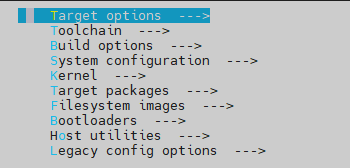

The meanings of each option are as follows:

| Option | Role|
|:----------|----------|
| Target options| Configure basic settings for the target system and hardware parameters|
| Build options| Configure Buildroot's build operations|
| Toolchain| Configure the cross-compilation toolchain|
| System configuration| Configure basic settings for the target system|
| Kernel| Configure the Linux kernel|
| Target packages| Select the packages installed on the target system|
| Filesystem images| Configure the type of file system image that is generated|
| Bootloaders| Configure the boot loader (e.g. U-Boot, GRUB)|
| Host utilities| Configure the tools that run on the host|
| Legacy config options| Handle deprecated or obsolete Configuration Options |

Using libraw as an example, navigate within the menuconfig interface to Target packages —> Libraries —> Graphics —>. Locate libraw and press 'y' to select it, then exit and save the configuration.

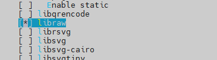

Run the following command to compile buildroot individually:

buildroot：

```plain
./build.sh buildroot
```

Compiling the Buildroot root filesystem usually takes between 1 to 2 hours. The exact duration may vary based on the performance of the host machine and the conditions of the network.

You can flash the compiled rootfs.img to the board via OTG, or include it as part of a complete system image after performing a full compilation. For detailed methods on flashing, please refer to the "Flashing Firmware Image" chapter.

You can see the corresponding libraw.so under /usr/lib directory.

```plain
root@OK-C-buildroot:/usr/lib# find . -name "*raw*"
./python3.11/encodings/raw_unicode_escape.pyc
./python3.11/lib2to3/fixes/fix_raw_input.pyc
./libraw_r.so
./libraw.so.23.0.0
./libraw_r.so.23
./librkrawstream.so
./libraw.so
./libraw_r.so.23.0.0
./libraw.so.23

```

#### 3.3 Compiling Application

This chapter explains how to install the cross-compilation toolchain and compile custom applications, which is applicable for scenarios where you need to deploy your own business code to the development board.

##### 3.3.1 Installing Cross-compilation Toolchain

Navigate to the home directory of your compilation environment and obtain thecross-compilation toolchain using the following command:

```plain
wget 'https://github.com/FLembedded/buildroot_dl/releases/download/buildroot_sdk/buildroot-sdk.tar.gz'
```

Extract`buildroot-sdk.tar.gz`：

```plain
forlinx@ubuntu:~$ tar -zvxf  buildroot-sdk.tar.gz
```

Enter `aarch64-buildroot-linux-gnu_sdk-buildroot `directory to execute relocate-sdk.sh

```plain
forlinx@ubuntu:~/aarch64-buildroot-linux-gnu_sdk-buildroot$ ./relocate-sdk.sh
```

##### 3.3.2 Compiling the Application

- Add the cross-compiler to your PATH:


```plain
export PATH=/home/your-hostname/aarch64-buildroot-linux-gnu_sdk-buildroot/bin/:$PATH
```

In addition, it is more recommended to directly use the environment setup script in the SDK. Proceed as follows.

```plain
aarch64-buildroot-linux-gnu_sdk-buildroot$ source environment-setup
 _           _ _     _                 _
| |__  _   _(_) | __| |_ __ ___   ___ | |_
| '_ \| | | | | |/ _` | '__/ _ \ / _ \| __|
| |_) | |_| | | | (_| | | | (_) | (_) | |_
|_.__/ \__,_|_|_|\__,_|_|  \___/ \___/ \__|

       Making embedded Linux easy!

Some tips:
* PATH now contains the SDK utilities
* Standard autotools variables (CC, LD, CFLAGS) are exported
* Kernel compilation variables (ARCH, CROSS_COMPILE, KERNELDIR) are exported
* To configure do "./configure $CONFIGURE_FLAGS" or use
  the "configure" alias
* To build CMake-based projects, use the "cmake" alias
```

- Cross compile, take the Forlinx watchdog test program as an example, and enter the directory  `OK-linux-source/app/forlinx/forlinx_cmd/fltest_watchdog`：


```plain
OK-linux-source/app/forlinx/forlinx_cmd/fltest_watchdog$ ls
Makefile  watchdog.c
OK-linux-source/app/forlinx/forlinx_cmd/fltest_watchdog$ aarch64-linux-gcc watchdog.c -o fltest_watchdog
```

- Use the file command to check the generated file information:


```plain
OK-linux-source/app/forlinx/forlinx_cmd/fltest_watchdog$/usr/bin/file fltest_watchdog 
fltest_watchdog: ELF 64-bit LSB pie executable, ARM aarch64, version 1 (SYSV), dynamically linked, interpreter /lib/ld-linux-aarch64.so.1, for GNU/Linux 3.7.0, not stripped
```

The result will show that a 64-bit ARM file is generated.

- Copy the fltest \_ watchdog generated by compiling to the board through U disk or FTP, for example, under the/root path. Take U disk as an example, copy it to the development board and run the test.


```plain
root@OK3588-buildroot:~# cp /run/media/sda1/fltest_watchdog /root/
root@OK3588-buildroot:~# ./fltest_watchdog
Watchdog Ticking Away!
```

## Application Development

### Peripheral Access

#### 4G/5G

The OK3588 supports 4G and 5G modules (4G is EM05-CE, and 5G is RM500U).

**⚠️Note: The following test is based on the SIM card and module in China, and you need to configure it according to your local network mode.**

The location of the 4G/5G module and SIM card.
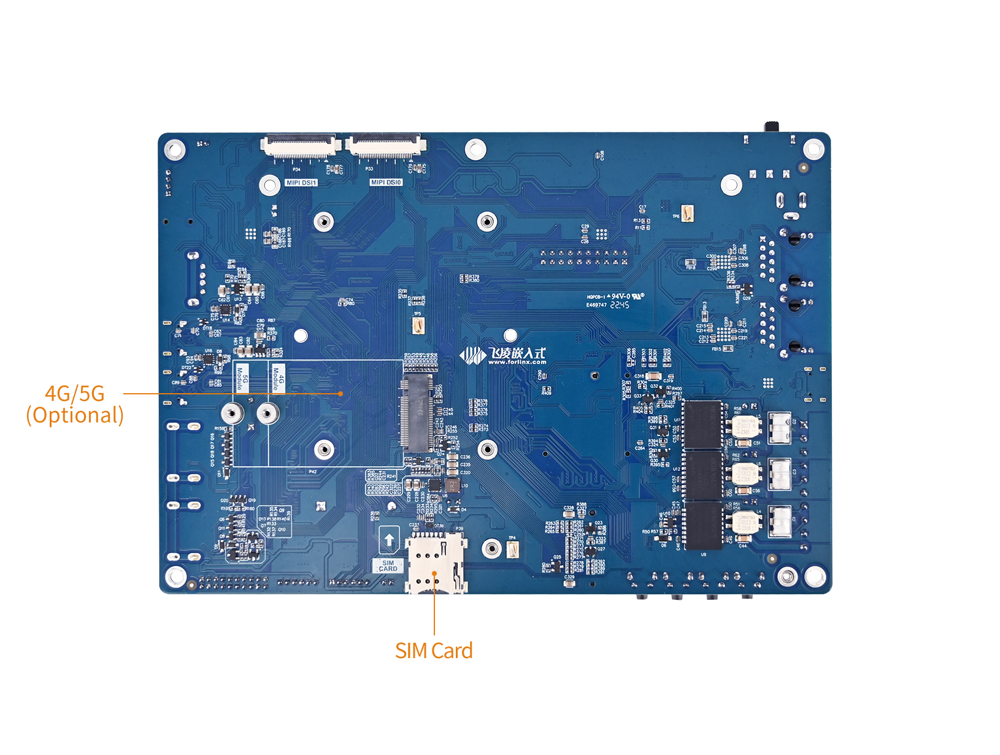

##### 1\. 4G

Connect the 4G module and the antenna, insert the SIM card, and start the development board. Please note the direction of the SIM. The logo is silk-screened on the carrier board.

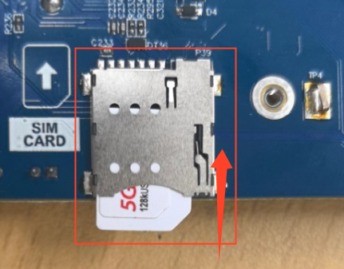

Once the module is connected and both the development board and the module are powered on, you can view the USB status using the lsusb command.

```plain
root@OK3588-buildroot:~# lsusb
Bus 005 Device 001: ID 1d6b:0002
Bus 003 Device 001: ID 1d6b:0002
Bus 001 Device 001: ID 1d6b:0002
Bus 005 Device 002: ID 2c7c:0125 //EM05 VID and PID
Bus 006 Device 001: ID 1d6b:0001
Bus 004 Device 001: ID 1d6b:0001
Bus 002 Device 001: ID 1d6b:0003
```

Check device node status under /dev:

```plain
root@OK3588-buildroot:~# ls /dev/ttyUSB*
/dev/ttyUSB0  /dev/ttyUSB1  /dev/ttyUSB2  /dev/ttyUSB3
```

After the equipment is successfully identified, the dial-up Internet access test can be conducted.

```plain
 root@OK3588-buildroot:~# quectelCM &
[1] 1320
root@OK3588-buildroot:~# [01-24_22:46:46:004] Quectel_QConnectManager_Linux_V1.6.0.24
[01-24_22:46:46:004] Find /sys/bus/usb/devices/5-1 idVendor=0x2c7c idProduct=0x125, bus=0x005, dev=0x002
[01-24_22:46:46:005] Auto find qmichannel = /dev/cdc-wdm0
[01-24_22:46:46:005] Auto find usbnet_adapter = wwan0
[01-24_22:46:46:005] netcard driver = qmi_wwan, driver version = 6.1.118
[01-24_22:46:46:005] Modem works in QMI mode
[01-24_22:46:46:007] cdc_wdm_fd = 7
[01-24_22:46:46:091] Get clientWDS = 5
[01-24_22:46:46:124] Get clientDMS = 1
[01-24_22:46:46:155] Get clientNAS = 2
[01-24_22:46:46:187] Get clientUIM = 1
[01-24_22:46:46:219] Get clientWDA = 1
[01-24_22:46:46:251] requestBaseBandVersion EM05CNFDR08A03M1G_ND
[01-24_22:46:46:379] requestGetSIMStatus SIMStatus: SIM_READY
[01-24_22:46:46:411] requestGetProfile[1] 3gnet///0
[01-24_22:46:46:444] requestRegistrationState2 MCC: 460, MNC: 1, PS: Attached, DataCap: LTE
[01-24_22:46:46:476] requestQueryDataCall IPv4ConnectionStatus: DISCONNECTED
[01-24_22:46:46:476] ifconfig wwan0 0.0.0.0
[01-24_22:46:46:478] ifconfig wwan0 down
[01-24_22:46:46:538] requestSetupDataCall WdsConnectionIPv4Handle: 0x86d1b800
[01-24_22:46:46:667] ifconfig wwan0 up
[01-24_22:46:46:670] busybox udhcpc -f -n -q -t 5 -i wwan0
udhcpc: started, v1.36.1
udhcpc: broadcasting discover
udhcpc: broadcasting select for 10.98.203.144, server 10.98.203.145
udhcpc: lease of 10.98.203.144 obtained from 10.98.203.145, lease time 7200
[01-24_22:46:46:836] deleting routers
[01-24_22:46:46:849] adding dns 202.99.160.68
[01-24_22:46:46:849] adding dns 202.99.166.4
```

The ping domain name test.

The network nodes of 4G.

**⚠️Note: Please select the domain name to test according to the your region.**

```plain
root@OK3588-buildroot:~# ping -I wwan0 www.forlinx.com -c 3
PING s-526319.gotocdn.com (211.149.226.120) from 10.98.203.144 wwan0: 56(84) bytes of data.
64 bytes from 211.149.226.120: icmp_seq=1 ttl=50 time=312 ms
64 bytes from 211.149.226.120: icmp_seq=2 ttl=50 time=200 ms
64 bytes from 211.149.226.120: icmp_seq=3 ttl=50 time=81.7 ms

--- s-526319.gotocdn.com ping statistics ---
3 packets transmitted, 3 received, 0% packet loss, time 8841ms
rtt min/avg/max/mdev = 81.694/197.930/312.431/94.205 ms
```

##### 2\. 5G

Connect the 5G module RM500U and the antenna, insert the SIM card, and start the development board. Please note the direction of the SIM. The logo is silk-screened on the carrier board.


- Connect the module. After the development board and the module are powered on, you can check the USB status through the`lsusb`command:


```plain
root@OK3588-buildroot:~# lsusb
Bus 005 Device 001: ID 1d6b:0002
Bus 003 Device 001: ID 1d6b:0002
Bus 002 Device 002: ID 2c7c:0900 //RM500U 5G module node
Bus 001 Device 001: ID 1d6b:0002
Bus 006 Device 001: ID 1d6b:0001
Bus 004 Device 001: ID 1d6b:0001
Bus 002 Device 001: ID 1d6b:0003
```

To view the device node status:

```plain
root@OK3588-buildroot:~# ls /dev/ttyUSB*
/dev/ttyUSB0  /dev/ttyUSB1  /dev/ttyUSB2  /dev/ttyUSB3  /dev/ttyUSB4
```

- After successful device identification, you can perform dial-up Internet access testing;


```plain
root@OK3588-buildroot:~# quectelCM &
[1] 1357
root@OK3588-buildroot:~# [01-24_22:54:18:540] Quectel_QConnectManager_Linux_V1.6.0.24
[01-24_22:54:18:540] Find /sys/bus/usb/devices/2-1 idVendor=0x2c7c idProduct=0x900, bus=0x002, dev=0x002
[01-24_22:54:18:541] Auto find qmichannel = /dev/ttyUSB2
[01-24_22:54:18:541] Auto find usbnet_adapter = eth2
[01-24_22:54:18:541] netcard driver = cdc_ncm, driver version = 6.1.118
[01-24_22:54:18:541] Modem works in ECM_RNDIS_NCM mode
[01-24_22:54:18:543] atc_fd = 7
[01-24_22:54:18:544] AT> ATE0Q0V1
[01-24_22:54:18:553] AT< OK
[01-24_22:54:19:553] AT> AT+QCFG="NAT",1
[01-24_22:54:19:571] AT< OK
[01-24_22:54:19:571] AT> AT+QCFG="usbnet"
[01-24_22:54:19:575] AT< +QCFG: "usbnet",5
[01-24_22:54:19:575] AT< OK
[01-24_22:54:19:575] AT> AT+QNETDEVCTL=?
[01-24_22:54:19:575] AT< +QNETDEVCTL: (1-8),(0-3),(0,1)
[01-24_22:54:19:575] AT< OK
[01-24_22:54:19:576] AT> AT+CGREG=2
[01-24_22:54:19:578] AT< OK
[01-24_22:54:19:578] AT> AT+QNETDEVSTATUS=?
[01-24_22:54:19:579] AT< +QNETDEVSTATUS: (1-8)
[01-24_22:54:19:579] AT< OK
[01-24_22:54:19:579] AT> AT+CGMR
[01-24_22:54:19:580] AT< RM500UCNVAAR03A06M2G_01.001.01.001
[01-24_22:54:19:580] AT< OK
[01-24_22:54:19:580] AT> AT+CPIN?
[01-24_22:54:19:581] AT< +CPIN: READY
[01-24_22:54:19:581] AT< OK
[01-24_22:54:19:581] AT> AT+QCCID
[01-24_22:54:19:582] AT< +QCCID: 89860124801390444928
[01-24_22:54:19:582] AT< OK
[01-24_22:54:19:582] requestGetICCID 89860124801390444928
[01-24_22:54:19:582] AT> AT+CIMI
[01-24_22:54:19:583] AT< 460013273321298
[01-24_22:54:19:583] AT< OK
[01-24_22:54:19:583] requestGetIMSI 460013273321298
[01-24_22:54:19:583] AT> AT+COPS=3,0;+COPS?;+COPS=3,1;+COPS?;+COPS=3,2;+COPS?
[01-24_22:54:19:587] AT< +COPS: 0,0,"CHN-UNICOM",7
[01-24_22:54:19:590] AT< +COPS: 0,1,"CUCC",7
[01-24_22:54:19:594] AT< +COPS: 0,2,"46001",7
[01-24_22:54:19:594] AT< OK
[01-24_22:54:19:594] AT> AT+QNETDEVSTATUS=1
[01-24_22:54:19:662] AT< +CME ERROR: 3
[01-24_22:54:19:662] requestQueryDataCall err=0, call_state=1
[01-24_22:54:19:662] ifconfig eth2 0.0.0.0
[01-24_22:54:19:667] ifconfig eth2 down
[01-24_22:54:19:672] AT> AT+QNETDEVCTL=1,1,0
[01-24_22:54:19:916] AT< OK
[01-24_22:54:19:916] AT> AT+QNETDEVSTATUS=1
[01-24_22:54:19:983] AT< +QNETDEVSTATUS: 10.152.154.83,255.255.255.0,10.152.154.1,,202.99.160.68,202.99.166.4,2408:841e:52e0:8e25:1884:a2db:f42c:dd27,,,,2408:8888:0000:8888:0000:0000:0000:0008,2408:8899:0000:8899:0000:0000:0000:0008
[01-24_22:54:19:983] AT< OK
[01-24_22:54:19:983] requestSetupDataCall err=0
[01-24_22:54:19:983] AT> AT+QNETDEVSTATUS=1
[01-24_22:54:20:042] AT< +QNETDEVSTATUS: 10.152.154.83,255.255.255.0,10.152.154.1,,202.99.160.68,202.99.166.4,2408:841e:52e0:8e25:1884:a2db:f42c:dd27,,,,2408:8888:0000:8888:0000:0000:0000:0008,2408:8899:0000:8899:0000:0000:0000:0008
[01-24_22:54:20:042] AT< OK
[01-24_22:54:20:042] requestGetIPAddress 10.152.154.83
[01-24_22:54:20:042] requestGetIPAddress err=0
[01-24_22:54:20:043] AT> AT+QNETDEVSTATUS=1
[01-24_22:54:20:118] AT< +QNETDEVSTATUS: 10.152.154.83,255.255.255.0,10.152.154.1,,202.99.160.68,202.99.166.4,2408:841e:52e0:8e25:1884:a2db:f42c:dd27,,,,2408:8888:0000:8888:0000:0000:0000:0008,2408:8899:0000:8899:0000:0000:0000:0008
[01-24_22:54:20:118] AT< OK
[01-24_22:54:20:118] requestQueryDataCall err=0, call_state=2
[01-24_22:54:20:118] ifconfig eth2 up
[01-24_22:54:20:123] busybox udhcpc -f -n -q -t 5 -i eth2
udhcpc: started, v1.36.1
udhcpc: broadcasting discover
udhcpc: broadcasting select for 192.168.42.2, server 192.168.42.1
udhcpc: lease of 192.168.42.2 obtained from 192.168.42.1, lease time 86400
```

- The ping domain name test.

The 5G network node is`eth2`.

**⚠️Note: Please select the domain name to test according to the region of the user.**

```plain
root@OK3588-buildroot:~# ping -I eth2 www.forlinx.com -c 3
PING s-526319.gotocdn.com (211.149.226.120) from 192.168.42.2 eth2: 56(84) bytes of data.
[01-24_22:49:20:156] AT> AT+QNETDEVSTATUS=1
64 bytes from 211.149.226.120: icmp_seq=1 ttl=52 time=922 ms
64 bytes from 211.149.226.120: icmp_seq=2 ttl=52 time=60.1 ms
64 bytes from 211.149.226.120: icmp_seq=3 ttl=52 time=60.0 ms

--- s-526319.gotocdn.com ping statistics ---
3 packets transmitted, 3 received, 0% packet loss, time 9644ms
```

#### ADC

##### 1\. Introduction

An ADC (analog-to-digital converter) is an electronic device or circuit that converts a continuous analog signal into a discrete digital signal.

There are 8 x built-in ADC. Among them, saradc2, saradc4, saradc5, saradc6, and saradc7 are led out from the carrier board connectors, while the saradc1 channel is used for the ADC key detection circuit.

5 x ADC and the ADC keys on the board:
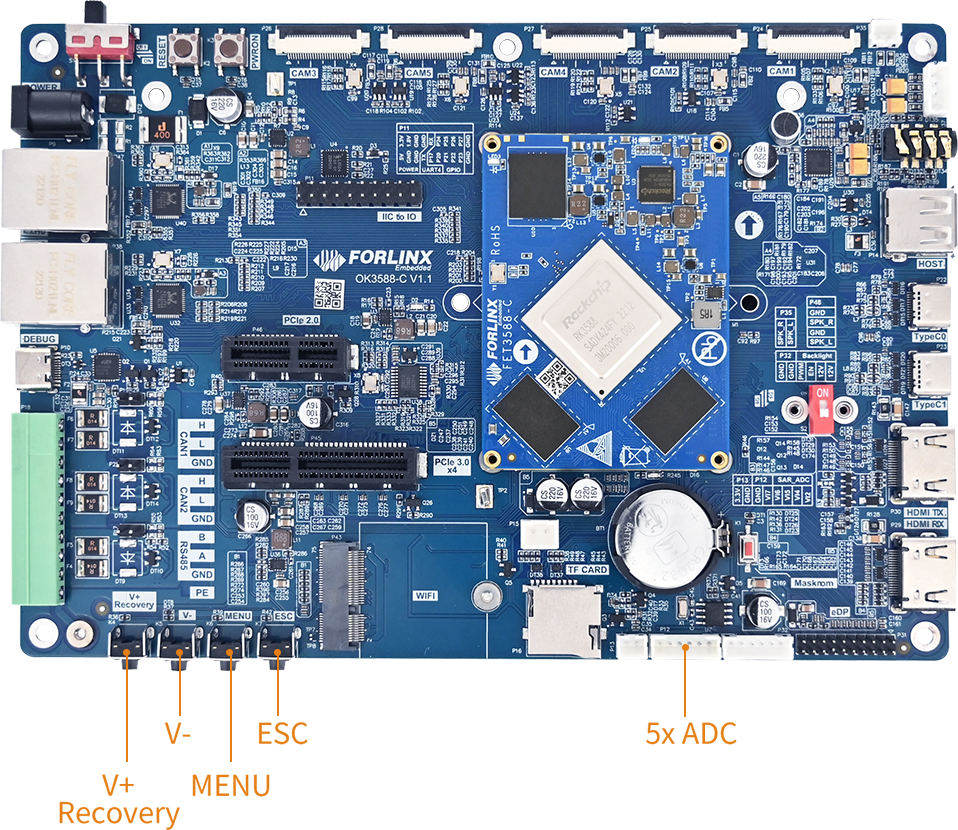

**⚠️Note: OK3588S2-C does not support saradc6 and saradc7.**

The source code location of the ADC key driver in the kernel:`drivers/input/keyboard/adc-keys.c`.

##### 2\. Device Tree

The ADC device tree definitions are located in: `kernel-6.1/arch/arm64/boot/dts/rockchip/rk3588s.dtsi`.

```plain
	saradc: saradc@fec10000 {
		compatible = "rockchip,rk3588-saradc";
		reg = <0x0 0xfec10000 0x0 0x10000>;
		interrupts = <GIC_SPI 398 IRQ_TYPE_LEVEL_HIGH>;
		#io-channel-cells = <1>;
		clocks = <&cru CLK_SARADC>, <&cru PCLK_SARADC>;
		clock-names = "saradc", "apb_pclk";
		resets = <&cru SRST_P_SARADC>;
		reset-names = "saradc-apb";
		status = "disabled";
	};
```

By default, SARADC is disabled. Please enable saradc in the corresponding device tree:

OK3588-C/3588-C2 :`kernel-6.1/arch/arm64/boot/dts/rockchip/OK3588-C-common.dtsi`

OK3588S2-C:`kernel-6.1/arch/arm64/boot/dts/rockchip/OK3588S2-C-common.dtsi`.

```plain
&saradc {
	status = "okay";
	vref-supply = <&vcc_1v8_s0>;
};
```

Where the saradc1 channel is used for ADC key detection, defined by the device tree node:

```plain
adc_keys: adc-keys {
		compatible = "adc-keys";
		io-channels = <&saradc 1>;
		io-channel-names = "buttons";
		keyup-threshold-microvolt = <1800000>;
		poll-interval = <100>;

		vol-up-key {
			label = "volume up";
			linux,code = <KEY_VOLUMEUP>;
			press-threshold-microvolt = <17000>;
		};

		vol-down-key {
			label = "volume down";
			linux,code = <KEY_VOLUMEDOWN>;
			press-threshold-microvolt = <417000>;
		};

		menu-key {
			label = "menu";
			linux,code = <KEY_MENU>;
			press-threshold-microvolt = <890000>;
		};

		back-key {
			label = "back";
			linux,code = <KEY_BACK>;
			press-threshold-microvolt = <1235000>;
		};
	};
```

##### 3\. Application

###### 3.1 Voltage Input Test

Select saradc2 for testing. The ADC pin hardware schematic is as follows. The chip currently uses a 1.8V reference voltage, corresponding to a 12-bit ADC maximum value of 4095.

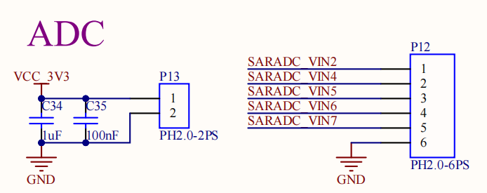

Short-circuit pin 1 of connector P12 and pin 2 of connector P13, then read the value of saradc2:

```plain
root@OK3588-C-buildroot:~# cd /sys/bus/iio/devices/iio\:device0/
root@OK3588-C-buildroot:/sys/bus/iio/devices/iio:device0# cat in_voltage2_raw
3
```

Short-circuit pin 1 of connector P12 and pin 1 of connector P13, then read the value ofsaradc2:

```plain
root@OK3588-C-buildroot:/sys/bus/iio/devices/iio:device0# cat in_voltage2_raw
4095
```

###### 3.2 ADC Key Test

The saradc1 channel is utilized for the ADC key detection circuit, which operates on a resistor voltage divider structure. When different keys are pressed, the voltage division ratio changes, leading to different voltages being read by the ADC. The program determines specific keys by evaluating the voltage ranges. This principle is illustrated in the diagram below:

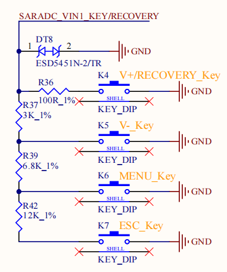

Use the`fltest_keytest`command-line tool for key testing. Currently,`fltest_keytest`supports testing the four keys on the baseboard: VOL+, VOL-, MENU, and ESC, with key codes 115, 114, 139, and 158 respectively. Execute the following command:

```plain
root@OK3588-C-buildroot:~# fltest_keytest
Available devices:
/dev/input/event6:    adc-keys
```

While pressing and releasing the keys sequentially, the terminal outputs are:

```plain
key115 Presse
key115 Released
key114 Presse
key114 Released
key139 Presse
key139 Released
key158 Presse
key158 Released
```

`fltest_keytest`ource code path:`OK-linux-source/app/forlinx/forlinx_cmd/fltest_keytest`

###### 3.3 Application Programming

In the OK3588, the input event node for ADC keys is located at /dev/input/eventX (where X is the specific device number). Applications must include the header file \<linux/input.h>, which defines the structures and macros related to input events.

The core data structure struct input\_event is defined as follows:

```plain
struct input_event {
    struct timeval time;  // Event timestamp
    __u16 type;           // Event type (e.g., EV_KEY)
    __u16 code;           // Key code
    __s32 value;          // 0 = released, 1 = pressed, 2 = held (repeat)
};
```

Common values for the type field are defined by the following macros:

| Macro| Value| Description|
|----------|----------|----------|
| EV\_KEY| 1| Key event|
| EV\_SYN| 0| Synchronization events|

The ioctl command used to get the device name:

```plain
ioctl(fd, EVIOCGNAME(sizeof(name)), name);
```

**3.3.1 Scanning and Locating the Key Device**

The input device name corresponding to the OK3588 ADC keys is `"adc-keys"`. Since there might be multiple event devices under `/dev/input/`, it’s necessary to first scan and find the correct device node.

```plain
ndev = scandir(DEV_INPUT_EVENT, &namelist, is_event_device, alphasort);
if (ndev <= 0)
	return NULL;
```

is\_event\_device serves as a filter function, only retaining devices whose filenames start with “event”:

```plain
static int is_event_device(const struct dirent *dir) {
    return strncmp(EVENT_DEV_NAME, dir->d_name, 5) == 0;
}
```

Traverse all event devices, read the device name via ioctl, and filter out the device named “adc-keys”.

```plain
ioctl(fd, EVIOCGNAME(sizeof(name)), name);
if (strncmp(name, "adc-keys", strlen("adc-keys")) != 0)
	continue;
```

**3.3.2 Opening the Key Device**

Open the key device using the `open` function to obtain a file descriptor:

```plain
keys_fd = open(event_name, O_RDONLY);
if(keys_fd<=0)
{
	printf("open %s device error!\n", event_name);
	return 0;
}
```

Here, `event_name`  is the device node path obtained during the scanning phase, for example,`/dev/input/event3`.

**3.3.3 Reading Key Events**

After opening the device, use the `read` function in a loop to read the`struct input_event` and obtain key events:

```plain
while(1)
{	
	if(read(keys_fd,&t,sizeof(t))==sizeof(t)) {
		if(t.type==EV_KEY)
			if(t.value==0 || t.value==1)
			{
				printf("key%d %s\n",t.code, (t.value)?"Presse":"Released");
			}
	}
}
```

Each `read` operation retrieves one complete `input_event`, which typically consists of 16 or 24 bytes. It's crucial to check the return value to ensure it equals `sizeof(t)` (struct input_event) for data integrity.

**3.3.4 Closing the Device**

After completing key monitoring, close the device file descriptor to release resources.

```plain
close(keys_fd);
```

#### Ethernet

##### 1\. Introduction

The OK3588-C board is equipped with two Gigabit Ethernet ports. With an Ethernet cable connected, the factory default configuration sets eth0 to a static IP, while eth1 is not configured. Both network ports use theRTL8211FSI PHY chip. The driver source code is located within the kernel:`drivers/net/ethernet/stmicro/stmmac`.

The wired network interface locations on the board are as follows:
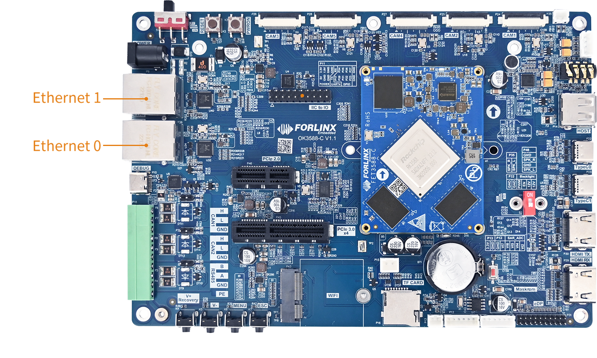

**⚠️Note: The RK3588S2 chip does not include an Ethernet controller, resulting in only one Gigabit Ethernet port available on the RK3588S2-C. When an Ethernet cable is connected, the factory default configuration assigns a static IP to eth0, rendering the P38 network port unavailable.**

The RTL8211 schematic is shown below:
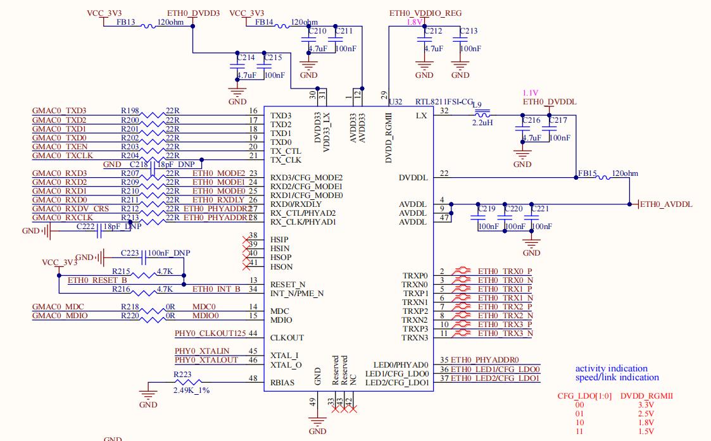

**RGMII Mode**

The RK3588 GMAC controller supports four RGMII clock configuration schemes:

| Mode           | TX\_CLK origin        | PHY 25MHz origin       |
| -------------- | --------------------- | ---------------------- |
| RGMII Config 1 | SoC PLL output 125MHz | External crystal 25MHz |
| RGMII Config 2 | SoC PLL outputs125MHz | SoC PLL output 25MHz   |
| RGMII Config 3 | PHY input 125MHz      | SoC PLL output 25MHz   |
| RGMII Config 4 | PHY input 125MHz      | External crystal 25MHz |

OK3588-C uses config1.

##### 2\. Device Tree

The device tree nodes for the OK3588-C network are located at:`arch/arm64/boot/dts/rockchip/OK3588-C-common.dtsi`.

```plain
&mdio0 {
	rgmii_phy0: phy@1 {
		compatible = "ethernet-phy-ieee802.3-c22";
		reg = <0x1>;
	};
};

&mdio1 {
	rgmii_phy1: phy@1 {
		compatible = "ethernet-phy-ieee802.3-c22";
		reg = <0x2>;
	};
};

&gmac0 {
	/* Use rgmii-rxid mode to disable rx delay inside Soc */
	phy-mode = "rgmii-rxid";
	clock_in_out = "output";

	snps,reset-gpio = <&gpio0 RK_PB0 GPIO_ACTIVE_LOW>;
	snps,reset-active-low;
	/* Reset time is 20ms, 100ms for rtl8211f */
	snps,reset-delays-us = <0 20000 100000>;

	pinctrl-names = "default";
	pinctrl-0 = <&gmac0_miim
		     &gmac0_tx_bus2
		     &gmac0_rx_bus2
		     &gmac0_rgmii_clk
		     &gmac0_rgmii_bus>;

	tx_delay = <0x44>;
	/* rx_delay = <0x4f>; */

	phy-handle = <&rgmii_phy0>;
	status = "okay";
};

&gmac1 {
	/* Use rgmii-rxid mode to disable rx delay inside Soc */
	phy-mode = "rgmii-rxid";
	clock_in_out = "output";

	snps,reset-gpio = <&gpio1 RK_PB4 GPIO_ACTIVE_LOW>;
	snps,reset-active-low;
	/* Reset time is 20ms, 100ms for rtl8211f */
	snps,reset-delays-us = <0 20000 100000>;

	pinctrl-names = "default";
	pinctrl-0 = <&gmac1_miim
		     &gmac1_tx_bus2
		     &gmac1_rx_bus2
		     &gmac1_rgmii_clk
		     &gmac1_rgmii_bus>;

	tx_delay = <0x44>;
	/* rx_delay = <0x4f>; */

	phy-handle = <&rgmii_phy1>;
	status = "okay";
};
```

Where mdio0 and gmac0 correspond to the device tree nodes of eth0, and mdio1 and gmac1 correspond to the device tree nodes of eth1.

The device tree nodes for the OK3588S2-C network are located at: `arch/arm64/boot/dts/rockchip/OK3588S2-C-common.dtsi`.

##### 3\. Application

###### 3.1 Modifying IP Address

**3.1.1 DHCPC IP**

Modify the following configuration file to set eth0 to obtain the IP automatically:`/etc/systemd/network/10-eth0.network`.

```plain
root@OK3588-buildroot:~# vi /etc/systemd/network/10-eth0.network   	  //Open the configuration file
[Match]
Name=eth0
KernelCommandLine=!root=/dev/nfs
[Network]
DHCP=yes
```

After the settings are completed, restart the network service.

```plain
root@OK3588-C-buildroot:/# systemctl restart systemd-networkd
```

**3.1.2 Static IP**

You can modify the default IP address by modifying the following configuration file:`/etc/systemd/network/10-eth0.network`。

```plain
root@OK3588-C-buildroot:/# vi /etc/systemd/network/10-eth0.network  
[Match]
Name=eth0
KernelCommandLine=!root=/dev/nfs
[Network]
Address=192.168.0.232/24
Gateway=192.168.0.1
DNS=114.114.114.114
```

Name is used to specify the network card that requires a fixed IP.

Address is used to specify the IP address that needs to be fixed.

Gateway is used to specify the gateway.

DNS is used to specify the name resolution server.

Restart the network service after the setup is completed。

```plain
root@OK3588-C-buildroot:/# systemctl restart systemd-networkd
```

###### 3.2 Network Status

Connect the network cable to the ETH0 port of the board before the test.

 **3.2.1 Ifconfig**

`ifconfig`is a classic Network Interface Configuration and Viewing Tools.

```plain
#View all network interface information.
root@OK3588-C-buildroot:~# ifconfig
eth0      Link encap:Ethernet  HWaddr 2E:1E:A1:F4:D3:EE
          UP BROADCAST MULTICAST  MTU:1500  Metric:1
          RX packets:0 errors:0 dropped:0 overruns:0 frame:0
          TX packets:0 errors:0 dropped:0 overruns:0 carrier:0
          collisions:0 txqueuelen:1000
          RX bytes:0 (0.0 B)  TX bytes:0 (0.0 B)
          Interrupt:71

lo        Link encap:Local Loopback
          inet addr:127.0.0.1  Mask:255.0.0.0
          inet6 addr: ::1/128 Scope:Host
          UP LOOPBACK RUNNING  MTU:65536  Metric:1
          RX packets:0 errors:0 dropped:0 overruns:0 frame:0
          TX packets:0 errors:0 dropped:0 overruns:0 carrier:0
          collisions:0 txqueuelen:1000
          RX bytes:0 (0.0 B)  TX bytes:0 (0.0 B)

```

**3.2.2 Ethtool**

`ethtool` is a necessary tool for Linux system to troubleshoot physical layer and driver layer problems. It provides more in-depth hardware-level information than the ifconfig `ifconfig`command.

```plain
# Show the basic settings of eth0
root@OK3588-C-buildroot:~# ethtool eth0
Settings for eth0:
        Supported ports: [ TP    MII ]
        Supported link modes:   10baseT/Half 10baseT/Full
                                100baseT/Half 100baseT/Full
                                1000baseT/Full
        Supported pause frame use: Symmetric Receive-only
        Supports auto-negotiation: Yes
        Supported FEC modes: Not reported
        Advertised link modes:  10baseT/Half 10baseT/Full
                                100baseT/Half 100baseT/Full
                                1000baseT/Full
        Advertised pause frame use: Symmetric Receive-only
        Advertised auto-negotiation: Yes
        Advertised FEC modes: Not reported
        Link partner advertised link modes:  10baseT/Full
                                             100baseT/Full
                                             1000baseT/Full
        Link partner advertised pause frame use: No
        Link partner advertised auto-negotiation: Yes
        Link partner advertised FEC modes: Not reported
        Speed: 1000Mb/s
        Duplex: Full
        Auto-negotiation: on
        master-slave cfg: preferred slave
        master-slave status: slavehttps://www.msn.cn/zh-cn/news/other/%E5%A5%B3%E8%B6%B3%E4%BA%9A%E6%B4%B2%E6%9D%AF-%E4%B8%AD%E5%9B%BD%E9%98%9F2%E6%AF%941%E5%8A%9B%E5%85%8B%E6%9C%9D%E9%B2%9C%E9%98%9F-%E4%BB%A5%E5%B0%8F%E7%BB%84%E5%A4%B4%E5%90%8D%E6%99%8B%E7%BA%A7/ar-AA1XPiVB
        Port: Twisted Pair
        PHYAD: 1
        Transceiver: external
        MDI-X: Unknown
        Supports Wake-on: ug
        Wake-on: d
        Current message level: 0x0000003f (63)
                               drv probe link timer ifdown ifup
        Link detected: yes
```

###### 3.3 Network Connectivity

**3.3.1 Ping**

Configure the network IP according to your actual network conditions. Network connectivity can be tested using the ping command (it’s necessary to ping an IP within the same subnet).

```plain
root@OK3588-C-buildroot:~# ping 192.168.0.100
PING 192.168.0.100 (192.168.0.100) 56(84) bytes of data.
64 bytes from 192.168.0.100: icmp_seq=1 ttl=128 time=0.320 ms
64 bytes from 192.168.0.100: icmp_seq=2 ttl=128 time=0.305 ms
64 bytes from 192.168.0.100: icmp_seq=3 ttl=128 time=0.487 ms
64 bytes from 192.168.0.100: icmp_seq=4 ttl=128 time=0.271 ms
64 bytes from 192.168.0.100: icmp_seq=5 ttl=128 time=0.335 ms

--- 192.168.0.100 ping statistics ---
5 packets transmitted, 5 received, 0% packet loss, time 4075ms
rtt min/avg/max/mdev = 0.271/0.343/0.487/0.074 ms
```

**3.3.2 Iperf3**

Configure the network IP according to your actual network conditions. The network throughput can be tested using theiperf3 tool.

Server:

```plain
iperf3.exe -s
```

Client (Board):

```plain
# iperf3 -c IP_ADDRESS_OF_IPERF_SERVER
root@OK3588-C-buildroot:~# iperf3 -c 192.168.0.100
Connecting to host 192.168.0.100, port 5201
[  5] local 192.168.0.232 port 43934 connected to 192.168.0.100 port 5201
[ ID] Interval           Transfer     Bitrate         Retr  Cwnd
[  5]   0.00-1.00   sec   114 MBytes   953 Mbits/sec    0    218 KBytes
[  5]   1.00-2.00   sec   113 MBytes   950 Mbits/sec    0    218 KBytes
[  5]   2.00-3.00   sec   113 MBytes   949 Mbits/sec    0    218 KBytes
[  5]   3.00-4.00   sec   113 MBytes   950 Mbits/sec    0    218 KBytes
[  5]   4.00-5.00   sec   113 MBytes   950 Mbits/sec    0    218 KBytes
[  5]   5.00-6.00   sec   113 MBytes   948 Mbits/sec    0    218 KBytes
[  5]   6.00-7.00   sec   113 MBytes   950 Mbits/sec    0    218 KBytes
[  5]   7.00-8.00   sec   113 MBytes   950 Mbits/sec    0    218 KBytes
[  5]   8.00-9.00   sec   113 MBytes   948 Mbits/sec    0    218 KBytes
[  5]   9.00-10.00  sec   113 MBytes   949 Mbits/sec    0    218 KBytes
- - - - - - - - - - - - - - - - - - - - - - - - -
[ ID] Interval           Transfer     Bitrate         Retr
[  5]   0.00-10.00  sec  1.11 GBytes   950 Mbits/sec    0             sender
[  5]   0.00-10.00  sec  1.10 GBytes   949 Mbits/sec                  receiver

iperf Done.
```

The results indicate a stable bitrate between 948 - 953 Mbits/sec, confirming that the Gigabit network connection is functioning normally with good performance.

**3.3.3 SFTP**

The OK3588 development board supports SFTP services, which are enabled automatically upon startup. Once the IP address is configured, the board can be used as an SFTP server. The following describes how to utilize the FTP tool for file transfer.

Install the file Zilla tool on windows and follow the steps shown in the figure below. The user name and password are forlinx.

Open the filezilla tool, click File, and select Site Manager.


**⚠️Note**: **FileZilla is provided as a compressed package, and the initial language may be Chinese. You can download FileZilla yourself, or after unzipping it, follow the steps below to change the language to English.**

* Click the second "Edit" option in the navigation bar to open the drop-down menu and select the Settings option;


* Enter the Settings interface, select the Language option in the left navigation bar, then choose the corresponding language on the right side. In the illustration, select English(en_US);


* After selecting the language, the change will take effect only after restarting FileZilla. Click OK and restart FileZilla;


* After restarting, the interface will switch to English.


#### Frequency

The RK3588 uses a small and large core architecture and integrates four Cortex-A55 (small cores) and four Cortex-A76 (large cores). 

| SoM Type                 | SoM No.     | Frequency modulation strategy                                |
| ------------------------ | ----------- | ------------------------------------------------------------ |
| Cortex-A55（small core） | cpu0 ~ cpu3 | Share the same frequency domain, adjust any core frequency, and change the other three cores synchronously. |
| Cortex-A76（large core） | cpu4 ~ cpu7 | Independent frequency modulation of each core without mutual influence |

**⚠️Note: The A55 small core must operate at a frequency equal to or greater than that of the A76 large core; please keep this constraint in mind when configuring the system.**

Take setting the CPU4 frequency as an example:

- View all supported cpufreq governor types:


```plain
root@OK3588-C-buildroot:~# cat /sys/devices/system/cpu/cpu4/cpufreq/scaling_available_governors
interactive conservative ondemand userspace powersave performance schedutil
```

**interactive**：Designed for mobile devices such as Android.

**ondemand**：Dynamically adjust based on current CPU usage.

**conservative**：Similar to ondemand, but the frequency adjustment is smoother. The frequency is stepped up or down rather than jumping directly to the highest.

**userspace**：Delegate frequency control to userspace programs.

**powersave**：Set the CPU frequency to the minimum fixed value.

**performance**：Set the CPU frequency to the maximum fixed value.

**schedutil**: Tightly integrated with the Linux scheduler (such as CFS), it dynamically adjusts frequency by leveraging the CPU utilization information (util\_avg) provided by the scheduler.

- Check the frequency steps supported by the current CPU:


```plain
root@OK3588-C-buildroot:~# cat /sys/devices/system/cpu/cpu4/cpufreq/scaling_available_frequencies
408000 600000 816000 1008000 1200000 1416000 1608000 1800000 2016000 2208000 2352000
```

- Set the current mode to user mode and change the frequency to 1800000:


```plain
root@OK3588-C-buildroot:~# echo userspace > /sys/devices/system/cpu/cpu4/cpufreq/scaling_governor
root@OK3588-C-buildroot:~# echo 1800000 > /sys/devices/system/cpu/cpu4/cpufreq/scaling_setspeed
```

- Check whether the frequency has been changed to 1800000:


```plain
root@OK3588-C-buildroot:~# cat /sys/devices/system/cpu/cpu4/cpufreq/cpuinfo_cur_freq
1800000
```

**⚠️Note**: **The small core frequency cannot be lower than the large core frequency.**

#### GPIO

##### 1\. Introduction

GPIO (General-Purpose Input/Output) is a general-purpose digital signal pin on microcontrollers or SoCs, whose function can be flexibly configured by software at runtime to interact with external devices via simple digital signals.

The extended I/O pins are led out from the carrier board, located on P11. 
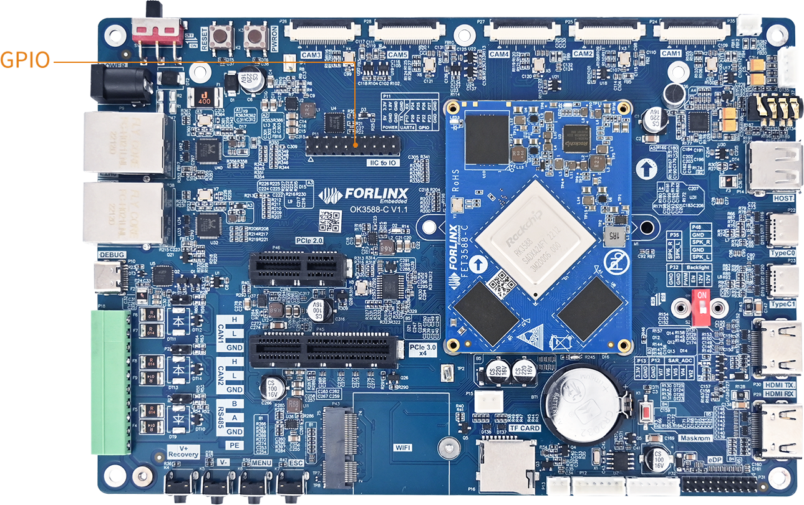


##### 2\. Device Tree

###### 2.1 Native GPIO

The device tree node for native GPIO is located at `kernel-6.1/arch/arm64/boot/dts/rockchip/rk3588s.dtsi`.

Take gpio3 as an example:

```plain
gpio3: gpio@fec40000 {
		compatible = "rockchip,gpio-bank";
		reg = <0x0 0xfec40000 0x0 0x100>;
		interrupts = <GIC_SPI 280 IRQ_TYPE_LEVEL_HIGH>;
		clocks = <&cru PCLK_GPIO3>, <&cru DBCLK_GPIO3>;

		gpio-controller;
		#gpio-cells = <2>;
		gpio-ranges = <&pinctrl 0 96 32>;
		interrupt-controller;
		#interrupt-cells = <2>;
};
```

If you need to configure an I/O pin as an external interrupt pin, you can refer to the device tree node configuration for the GT911 touchscreen. You can set GPIO3\_C0 as the interrupt pin, whilst designating GPIO3\_B7 as the reset pin for the touchscreen.

```plain

gt9xx_dsi0: gt9xx@14 {
        compatible = "goodix,gt911";
    	reg = <0x14>;
      	pinctrl-names = "gt9xx_default";
    	pinctrl-0 = <&gt911_dsi0_gpio>;
     	interrupt-parent = <&gpio3>;
     	interrupts = <RK_PC0 IRQ_TYPE_EDGE_FALLING>;
      	irq-gpio = <&gpio3 RK_PC0 GPIO_ACTIVE_HIGH>;
      	reset-gpio = <&gpio3 RK_PB7 GPIO_ACTIVE_HIGH>;
      	touchscreen-size-x = <1024>;
      	touchscreen-size-y = <600>;
		is-mutex;
		filter-reg = <0x38>;
		bus-reg = <0x02>;
        status = "okay";
};

&pinctrl {
	gt911_dsi0_gpio:gt911-dsi0-gpio {
	rockchip,pins = <3 RK_PB7 RK_FUNC_GPIO &pcfg_pull_none>,
					<3 RK_PC0 RK_FUNC_GPIO &pcfg_pull_none>;
};
```

**interrupt-parent**：Specifies the GPIO3 module as the interrupt controller.

**interrupts**：Interrupt number and trigger type. RK\_PC0 denotes the PC0 pin of GPIO3, with the interrupt triggered by a falling edge.

**irq-gpio**：Specifies the GPIO pin for the interrupt.

**pinctrl node**：\<3 RK\_PB7 RK\_FUNC\_GPIO \&pcfg\_pull\_none> indicates that GPIO3\_B7 is configured for I/O functionality.

###### 2.2 Extend GPIO

The OK3588-C carrier board features a TCA6424 chip acting as an I/O expander, which provides an additional 24 x general-purpose input/output pins via the I²C bus to address the issue of insufficient GPIO pins on the host controller (such as a CPU or MCU).

The device tree nodes for the GPIO expansion are located at:

OK3588-C/3588-C2 ：`kernel-6.1/arch/arm64/boot/dts/rockchip/OK3588-C-common.dtsi`

OK3588S2-C：`kernel-6.1/arch/arm64/boot/dts/rockchip/OK3588S2-C-common.dtsi`

```plain
&i2c2 {
	status = "okay";
    //extend GPIO：TCA6424
	extio: tca6424@23 {
		compatible = "ti,tca6424";
		reg = <0x23>;
		interrupt-parent = <&gpio1>;
		interrupts = <RK_PA4 IRQ_TYPE_EDGE_FALLING>;
		gpio-controller;
		interrupt-controller;
		#interrupt-cells = <2>;
		pinctrl-0 = <&extio_int_gpio>;
		pinctrl-names = "default";
		#gpio-cells = <2>;
		status = "okay";
	};
};
```

##### 3\. Application

Please refer to the PinMUX table for the usage of the GPIO pins.

Please download from the Resource Download ([https://www.forlinx.net/resources/download-center.html](https://www.forlinx.net/resources/download-center.html)).

Select the "OK3588-C/C2" or "OK3588S2-C" page according to the model no., then go to "Hardware Resources" -> "DOCUMENTS" -> "PinMUX" to view the pin multiplexing configuration.

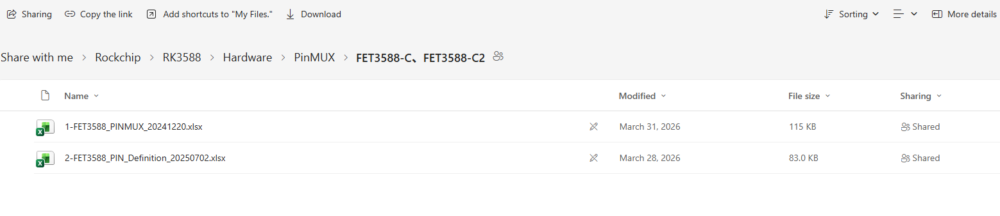

###### 3.1 Native GPIO

**3.1.1 Pin Calculation Method**

RK3588 have 5 GPIO bank：GPIO0~GPIO4，Each group was numbered A0~A7, B0~B7, C0~C7, and D0~D7.

The naming convention for GPIOs is GPIOn\_xy, where x can be A, B, C, or D. In the GPIO numbering calculation, A corresponds to 1, B to 2, C to 3, and D to 4.

Calculation Formula:

```plain
GPIOn_xy = n × 32 + (x - 1) × 8 + y
```

Here is an example using GPIO3\_B0 to demonstrate the calculation of its GPIO number.

```plain
GPI03_B0 = 3 × 32 + (2 − 1) × 8 + 0 = 104
```

**3.1.2 GPIO Test**

To test the native pins on the OK3588, please use:`fltest_gpio.sh`

```plain
root@OK3588-C-buildroot:~# fltest_gpio.sh -h
/usr/bin/fltest_gpio.sh <GPIO_NAME> <1/0>
User:/usr/bin/fltest_gpio.sh GPIO3_A7 1
```

###### **3.2 Extended GPIO**

The extended IOs belong to bank chip6, with a numbering range of 485 to 508.

```plain
root@OK3588-C-buildroot:~# cat /sys/kernel/debug/gpio | grep i2c
gpiochip6: GPIOs 485-508, parent: i2c/2-0023, 2-0023, can sleep:	
```

Taking the GPIO\_P17 pin as an example for testing, to set GPIO\_P17 to a high level:

```plain
root@OK3588-C-buildroot:~# fltest_extgpio.sh GPIO_P17 1
```

To set GPIO\_P17 to a low level:

```plain
root@OK3588-C-buildroot:~# fltest_extgpio.sh GPIO_P17 0
```

#### I2C

##### 1\. Introduction

The Rockchip series of chips offers a standard I2C bus, enabling control and access to various external devices. The I2C controller transfers data between connected devices through serial data (SDA) and serial clock (SCL) lines. Each device has a unique address—whether it is a microcontroller (MCU), LCD driver, memory, or keyboard interface—and can function as a transmitter or receiver depending on its design.

##### 2\. Device Tree

Device Tree Node Path for I2C:`kernel-6.1/arch/arm64/boot/dts/rockchip/rk3588s.dtsi`

```plain
	i2c7: i2c@fec90000 {
		compatible = "rockchip,rk3588-i2c", "rockchip,rk3399-i2c";
		reg = <0x0 0xfec90000 0x0 0x1000>;
		clocks = <&cru CLK_I2C7>, <&cru PCLK_I2C7>;
		clock-names = "i2c", "pclk";
		interrupts = <GIC_SPI 324 IRQ_TYPE_LEVEL_HIGH>;
		pinctrl-names = "default";
		pinctrl-0 = <&i2c7m0_xfer>;
		resets = <&cru SRST_I2C7>, <&cru SRST_P_I2C7>;
		reset-names = "i2c", "apb";
		#address-cells = <1>;
		#size-cells = <0>;
		status = "disabled";
	};
```

It is not enabled by default, and please turn on I2C in the corresponding device tree:

OK3588-C/3588-C2 :`kernel-6.1/arch/arm64/boot/dts/rockchip/OK3588-C-common.dtsi`.

OK3588S2-C:`kernel-6.1/arch/arm64/boot/dts/rockchip/OK3588S2-C-common.dtsi`

```plain
&i2c7 {
	status = "okay";
	nau8822: nau8822@1a { #Using the I2C7 bus to communicate with the NAU8822
		status = "okay";
		#sound-dai-cells = <0>;
		compatible = "nuvoton,nau8822";
		reg = <0x1a>;
		clocks = <&mclkout_i2s0>;
		clock-names = "mclk";
		assigned-clocks = <&mclkout_i2s0>;
		assigned-clock-rates = <12288000>;
		pinctrl-names = "default";
		pinctrl-0 = <&i2s0_mclk>;
	};
};
```

##### 3\. Application

I2C tools (commonly written as i2c-tools) is a toolkit specifically designed for debugging I2C (Inter-Integrated Circuit) buses and peripherals in Linux environments. It includes a set of command-line tools that allow you to directly communicate with I2C devices in user space, eliminating the need to write and compile driver code for each test.

###### 3.1 i2cdetect

Scan the I2C bus and detects connected device addresses, displaying them in a table format. `--`：No device present.`UU`:The address is occupied by a kernel driver; for example, to view devices on the I2C5 bus:

```plain
root@OK3588-C-buildroot:~# i2cdetect -y 5
     0  1  2  3  4  5  6  7  8  9  a  b  c  d  e  f
00:                         -- -- -- -- -- -- -- --
10: -- -- -- -- -- -- -- -- -- -- -- -- -- -- -- --
20: -- -- UU -- -- -- -- -- -- -- -- -- -- -- -- --
30: -- -- -- -- -- -- -- -- -- -- -- -- -- -- -- --
40: -- -- -- -- -- -- -- -- -- -- -- -- -- -- -- --
50: -- UU -- -- -- -- -- -- -- -- -- -- -- -- -- --
60: -- -- -- -- -- -- -- -- -- -- -- -- -- -- -- --
70: -- -- -- -- -- -- -- --
```

If you wish to manually operate a device using tools like i2cget or i2cset, you may first need to unload the corresponding kernel driver, or use the -f option to force access (this carries some risk).

###### 3.2 i2cget

Reads an 8-bit value from a single register of a specified device.

Example: Read the value from register 0x10 of the device at address 0x50 on bus 1.

```plain
i2cget -y 1 0x50 0x10
```

**⚠️Note: This specific I2C device is not present on the OK3588-C board. This section only demonstrates the command usage.**

###### 3.3 I2cset

Write a value to a single register of a specified device.

Example: Write the value 0xAB to register 0x10 of the device at address 0x50 on bus 1.

```plain
i2cset -y 1 0x50 0x10 0xAB
```

**⚠️Note: This specific I2C device is not present on the OK3588-C board. This section only demonstrates the command usage.**

#### MMC

##### 1\. Introduction

The on-board eMMC storage chip on the OK3588 platform is connected to a dedicated high-speed SDHCI bus. Its features are as follows: 

| **Feature**| **Description**|
|----------|----------|
| Bus Type| SDHCI（Dedicated High-Speed Bus）|
| Data Width| 8 bit|
| Specification| eMMC 5.1|
| Supported Speed Mode| HS400 (Up to 200MHz, theoretical bandwidth ~200MB/s)|
| Command Queue Engine| Supported （CQE）|
| Device Nodes| /dev/mmcblk0|
| Comparison with TF Card| Higher throughput, more stable read/write performance, serves as the primary system storage medium.|

mmc0 is the device node for the eMMC.

```plain
root@OK3588-C-buildroot:~# dmesg | grep mmc0
[    5.305417] mmc0: CQHCI version 5.10
[    5.336474] mmc0: SDHCI controller on fe2e0000.mmc [fe2e0000.mmc] using ADMA
[    5.449117] mmc0: Command Queue Engine enabled
[    5.449129] mmc0: new HS400 Enhanced strobe MMC card at address 0001
[    5.449480] mmcblk0: mmc0:0001 88A19C 57.6 GiB
[    5.455569] mmcblk0boot0: mmc0:0001 88A19C 4.00 MiB
[    5.456188] mmcblk0boot1: mmc0:0001 88A19C 4.00 MiB
[    5.456773] mmcblk0rpmb: mmc0:0001 88A19C 4.00 MiB, chardev (234:0)
```

Based on the system initialization profile, the controller utilizes Advanced DMA (ADMA) and dynamically negotiates to operate in the ultra-high-speed HS400 Enhanced Strobe mode. Additionally, the Command Queue Engine (CQE, version 5.10) is fully enabled, which significantly optimizes random read/write efficiency by allowing multiple command requests to be queued.

Within the Linux system, the eMMC device is enumerated as mmcblk0 and exposes its internal hardware partitions:

**User Data Area**: The primary storage partition for the root filesystem and user data.

**Boot Partitions(mmcblk0boot0 and mmcblk0boot1)**: Dedicated hardware partitions typically used for storing bootloaders.

**RPMB(mmcblk0rpmb, 4 MiB)**: Replay Protected Memory Block for secure data storage.

The location of the driver source code in the kernel:`drivers/mmc/host/dw_mmc-rockchip.c`

##### 2\. Device Tree

Device tree configuration for the eMMC interface can be found here:`kernel-6.1/arch/arm64/boot/dts/rockchip/rk3588s.dtsi`.

```plain
sdhci: mmc@fe2e0000 {
    compatible = "rockchip,rk3588-dwcmshc", "rockchip,dwcmshc-sdhci";
    reg = <0x0 0xfe2e0000 0x0 0x10000>;
    interrupts = <GIC_SPI 205 IRQ_TYPE_LEVEL_HIGH>;
    assigned-clocks = <&cru BCLK_EMMC>, <&cru TMCLK_EMMC>, <&cru CCLK_EMMC>;
    assigned-clock-rates = <200000000>, <24000000>, <200000000>;
    clocks = <&cru CCLK_EMMC>, <&cru HCLK_EMMC>,
    <&cru ACLK_EMMC>, <&cru BCLK_EMMC>,
    <&cru TMCLK_EMMC>;
    clock-names = "core", "bus", "axi", "block", "timer";
    resets = <&cru SRST_C_EMMC>, <&cru SRST_H_EMMC>,
    <&cru SRST_A_EMMC>, <&cru SRST_B_EMMC>,
    <&cru SRST_T_EMMC>;
    reset-names = "core", "bus", "axi", "block", "timer";
    max-frequency = <200000000>;
    supports-cqe;
    status = "disabled";
};
```

It is not enabled by default, and you need to open MMC in the corresponding device tree:

OK3588-C/3588-C2:`kernel-6.1/arch/arm64/boot/dts/rockchip/OK3588-C-common.dtsi`。

OK3588S2-C:`kernel-6.1/arch/arm64/boot/dts/rockchip/OK3588S2-C-common.dtsi`

```plain
&sdhci {
    bus-width = <8>;
    no-sdio;
    no-sd;
    non-removable;
    max-frequency = <200000000>;
    mmc-hs400-1_8v;
    mmc-hs400-enhanced-strobe;
    status = "okay";
};
```

##### 3\. Application

###### 3.1 Extended CSD Register

eMMC devices have an extensive amount of extra information and settings that are available via the Extended CSD registers. For a detailed list of the registers, please see manufacture datasheets.

In the Linux userspace, you can query the registers and see:

```plain
root@OK3588-C-buildroot:~# mmc extcsd read /dev/mmcblk0
=============================================
  Extended CSD rev 1.8 (MMC 5.1)
=============================================

Card Supported Command sets [S_CMD_SET: 0x01]
HPI Features [HPI_FEATURE: 0x01]: implementation based on CMD13
...
```

###### 3.2 Resizing Ext4 Root Filesystem

By default, the standard system images for the OK3588 platform automatically expand the root filesystem (rootfs) partition to its maximum capacity on the eMMC, and the filesystem is resized accordingly. Therefore, manual resizing is typically unnecessary when using the default firmware.

This section aims to describe the process for resizing an ext4 root filesystem. If you flash a custom rootfs image that has not been expanded during development, or if you manually modify the underlying partition table, you can follow the standard procedures outlined below to adjust the filesystem size and fully utilize any remaining storage space.

+ Check the Physical Partition Table:

```plain
root@OK3588-C-buildroot:~# parted /dev/mmcblk0 print
```

You can resize the root partition to fully occupy the remaining disk space.

```plain
root@OK3588-C-buildroot:~# parted /dev/mmcblk0 resizepart 8 100%
```

+ Check Filesystem Mounts: 

```plain
root@OK3588-C-buildroot:~# df -h
```

#### PCle

##### 1\. Introduction

PCIe (Peripheral Component Interconnect Express) is a high-speed serial computer expansion bus standard used to connect the motherboard to high-performance external devices.

The OK3588-C board features 1 x PCIe 2.0 x1 and 1 x PCIe 3.0 x4 interface, as shown in the figure below.
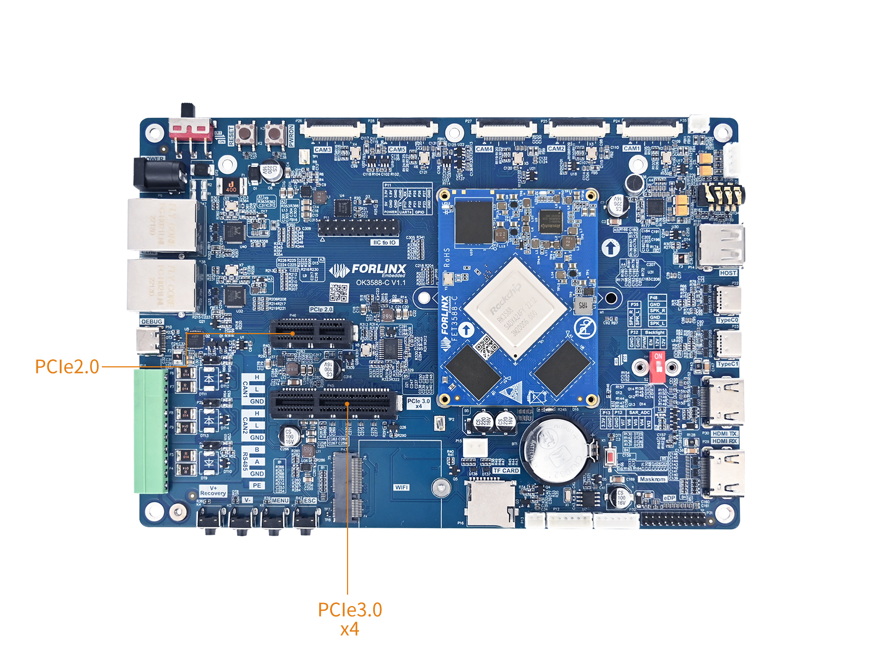

You can design PCIe bifurcation according to your specific requirements. For detailed information, please refer to the following documentation:`OK-linux-source/docs/rk3588/en/Common/PCIe/Rockchip_Developer_Guide_PCIe_EN.pdf`

**⚠️Note: Since the RK3588S2 chip itself has fewer PCIe controllers, neither the P45 nor P46 PCIe interfaces on theOK3588S2-C board are unusable.**

PCIe driver source code location in the kernel:`drivers/pci/controller/pcie-rockchip.c`.

##### 2\. Device Tree

OK3588-C/3588-C2 PCIe device tree node location:`kernel-6.1/arch/arm64/boot/dts/rockchip/OK3588-C-common.dtsi`.

```plain
// Fixed regulator for PCIe 3.0 3.3V power supply
vcc3v3_pcie30: vcc3v3_pcie30 {
	compatible = "regulator-fixed";
	regulator-name = "vcc3v3_pcie30";
	regulator-boot-on;
	regulator-always-on;
	regulator-min-microvolt = <3300000>;
	regulator-max-microvolt = <3300000>;
	vin-supply = <&vcc5v0_sys>;
};

// Fixed regulator for PCIe 2.0 3.3V power supply
vcc3v3_pcie20: vcc3v3-pcie20 {
	compatible = "regulator-fixed";
	regulator-name = "vcc3v3-pcie20";
	regulator-boot-on;
	regulator-always-on;
	regulator-min-microvolt = <3300000>;
	regulator-max-microvolt = <3300000>;
	vin-supply = <&vcc5v0_sys>;
};

// PCIe 2.0 x1 lane 0 controller with reset and power supply
&pcie2x1l0 {
	reset-gpios = <&gpio4 RK_PA5 GPIO_ACTIVE_HIGH>;
	vpcie3v3-supply = <&vcc3v3_pcie20>;
	status = "okay";
};

// Combo PHY 0 for PCIe/SATA/USB3.0, enabled
&combphy0_ps {
	status = "okay";
};

// PCIe 2.0 x1 lane 2 controller with WiFi GPIO and reset
&pcie2x1l2 {
	wifi-gpio = <&extio EXTIO_GPIO_P13 GPIO_ACTIVE_HIGH>;
	reset-gpios = <&gpio3 RK_PD1 GPIO_ACTIVE_HIGH>;
	status = "okay";
};

&combphy1_ps {
	status = "okay";
};

&pcie30phy {
	rockchip,pcie30-phymode = <PHY_MODE_PCIE_AGGREGATION>;
	status = "disabled";
};

&pcie3x4 {
	reset-gpios = <&gpio4 RK_PB6 GPIO_ACTIVE_HIGH>;
	memory-region = <&dma_trans>;
	vpcie3v3-supply = <&vcc3v3_pcie30>;
	status = "disabled";
};

```

OK3588S2: PCIe device tree node location:`kernel-6.1/arch/arm64/boot/dts/rockchip/OK3588S2-C-common.dtsi`. 

⚠️**Note**: **The WiFi module uses a PCIe interface.**

##### 3\. Application

Before powering on the system, insert the PCIe module into the PCIe slot on the carrier board. After power-on and startup, the successful enumeration of the corresponding device (ZHITAI TiPro5000 NVMe SSD) can be observed through`lspci`commands.

```plain
root@OK3588-C-buildroot:~# lspci
0002:20:00.0 PCI bridge: Rockchip Electronics Co., Ltd RK3588 (rev 01)
0002:21:00.0 Non-Volatile memory controller: Yangtze Memory Technologies Co.,Ltd ZHITAI TiPro5000 NVMe SSD (rev 01)
```

You can see the following NVMe nodes:

```plain
root@OK3588-C-buildroot:~# ls /dev/nvme*
/dev/nvme0  /dev/nvme0n1  /dev/nvme0n1p1  /dev/nvme0n1p2
```

View the mount directory:

```plain
root@OK3588-C-buildroot:~# ls /run/media/
nvme0n1p1
```

Test the drive speed using dd:

Write:

```plain
root@OK3588-C-buildroot:~# dd if=/dev/zero of=/run/media/nvme0n1p1/test bs=1M count=100 conv=fsync
100+0 records in
100+0 records out
104857600 bytes (105 MB, 100 MiB) copied, 0.078358 s, 1.3 GB/s
```

Read:

```plain
root@OK3588-C-buildroot:~# dd if=/run/media/nvme0n1p1/test of=/dev/null bs=1M
100+0 records in
100+0 records out
104857600 bytes (105 MB, 100 MiB) copied, 0.0312363 s, 3.4 GB/s

```

#### PWM

##### 1\. Introduction

PWM is the abbreviation for Pulse Width Modulation. It is a technology that uses a digital signal (high and low levels) to produce analog-like effects. The core idea is to control the average output voltage or power by varying the proportion of time the signal stays high within a fixed period (i.e., the duty cycle).

There are four PMW on OK3588-C, they are pwm2, pwm4, and pwm5 and pwm6. Where pwm4, pwm5, and pwm6 are used for backlight control of EDP, dsi0, and dsi1, respectively, and pwm2 is used for fan control.

Location of the backlight driver source code in the kernel:`drivers/video/backlight/pwm_bl.c`.

##### 2\. Device Tree

Location of OK3588-C/3588-C2 PMW device tree node:`kernel-6.1/arch/arm64/boot/dts/rockchip/OK3588-C-common.dtsi`.

```plain
&pwm2 { //FAN
	status = "okay";
};

&pwm4 { //edp
	status = "okay";
};

&pwm5 {//dsi0
	pinctrl-0 = <&pwm5m1_pins>;
	status = "okay";
};

&pwm6 {//dsi1
	status = "okay";
};

fan: pwm-fan {
		compatible = "pwm-fan";
		#cooling-cells = <2>;
		pwms = <&pwm2 0 50000 0>;
	};

backlight_dsi0: backlight-dsi0 {
		compatible = "pwm-backlight";
		pwms = <&pwm5 0 50000 0>;
		status = "okay";
    };
```

Location of OK3588S2-C PWM device tree node:`kernel-6.1/arch/arm64/boot/dts/rockchip/OK3588S2-C-common.dtsi`.

##### 3\. Application

###### 3.1 Screen Backlight Control

The backlight brightness setting range is (0-255), where 255 represents the highest brightness and 0 indicates the backlight is turned off. After connecting an MIPI screen to the MIPI DSI0 interface and powering on,

use the following command to view all backlight devices:

```plain
root@OK3588-C-buildroot:~# ls /sys/class/backlight/
backlight-dsi0  backlight-dsi1  backlight-edp1
```

Here, backlight-dsi0 corresponds to the DSI0 interface.

To check the current backlight brightness value of the backlight-dsi0 device:

```plain
root@OK3588-C-buildroot:~# cat /sys/class/backlight/backlight-dsi0/brightness
```

To set the backlight brightness of the DSI0 screen to 0 (i.e., turn off the backlight), write 0 to the backlight device:

```plain
root@OK3588-C-buildroot:~# echo 0 > /sys/class/backlight/backlight-dsi0/brightness
```

To restore the backlight brightness of the DSI0 screen to 200, write 200 to the backlight device:

```plain
root@OK3588-C-buildroot:~# echo 200 > /sys/class/backlight/backlight-dsi0/brightness
```

#### RTC

##### 1\. Introduction

RTC (Real-Time Clock) is a critical component that ensures the system maintains an accurate time reference, and it is widely used in fields such as IoT devices, industrial control, consumer electronics, and automotive electronics.

The OK3588 utilizes the PCF8563 real-time clock module. The chip connects to the main processor via I2C5, with a device address of 0x51.

Schematic: The RTC schematic is as shown below:

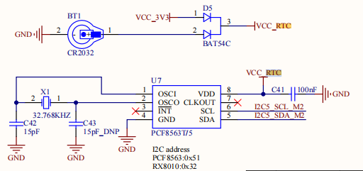

Driver Location: The RTC driver source code is located within the kernel at the specified path.`drivers/rtc/rtc-pcf8563.c`.

##### 2\. Device Tree

The PCF8563 is on I2C5, so its device tree node is placed under the i2c5 node.

Path for OK3588-C/3588-C2: Refer to the specified device tree path`kernel-6.1/arch/arm64/boot/dts/rockchip/OK3588-C-common.dtsi`.

Path for OK3588S2-C: Refer to the specified device tree path`kernel-6.1/arch/arm64/boot/dts/rockchip/OK3588S2-C-common.dtsi`.

```plain
&i2c5 {
	status = "okay";
	pinctrl-names = "default";
	pinctrl-0 = <&i2c5m2_xfer>;

    rtc: pcf8563@51 {
		compatible = "nxp,pcf8563";
		reg = <0x51>;
		status = "okay";
	};
};
```

**⚠️Note: If a custom carrier board connects the RTC chip to a different I2C bus, the node must be moved under the corresponding I2C bus node in the device tree, ensuring the`rtc: pcf8563@51`I2C address matches the hardware design.**

##### 3\. Application

Before RTC testing, ensure a coin cell battery is installed on the board and its voltage is normal. Testing primarily involves using the`date`date and`hwclock`tools to set system/RTC time and verify that the system clock reads the RTC clock correctly after a power cycle.

Set the system time: 

```plain
root@OK3588-C-buildroot:~# date -s "2025-10-27 10:05:02"
Mon Oct 27 10:05:02 CST 2025
```

Synchronize the system time to the hardware clock:

```plain
root@OK3588-C-buildroot:~# hwclock -wu
```

Display the current hardware clock time:

```plain
root@OK3588-C-buildroot:~# hwclock -r
Mon Oct 27 10:05:10 2025  0.000000 seconds
```

After power cycling the board and booting the system, read the system time (date) to confirm synchronization.

```plain
root@OK3588-C-buildroot:~# date
Mon Oct 27 10:06:01 CST 2025
```

#### SD Card

##### 1\. Introduction

There is one TF (Micro SD) card slot on the OK3588-C development board using the RK3588 SDMMC controller interface for external removable storage. This interface supports hot-plug. After insertion, the SD card is managed as a standard block device. Location of TF Card Port:
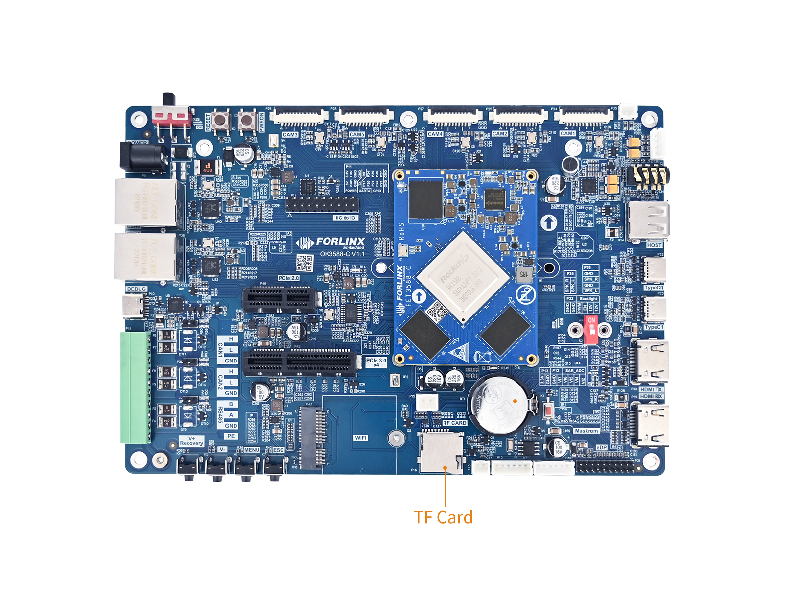

**⚠️Note: Although hot-plug is hardware supported, you must unmount the device using umount before physically removing the SD card to prevent data loss or filesystem corruption.**

Location of driver source code`drivers/mmc/host/dw_mmc-rockchip.c`.

###### 1.1 Device Node \& Mount Path

After inserting the card, the kernel generates corresponding device nodes in `/dev` . The entire SD card can be accessed via the `/dev/mmcblk1` device node. Its partitions will appear as:

```plain
/dev/mmcblk1p<Y>
```

where X is the partition number (1 to the maximum supported). Each partition can be formatted with any filesystem type and supports standard operations like mount/unmount.

The default mount path is:`/run/media/mmcblk1p1`。

###### 1.2 Actual Configuration

Actual configuration parameters of OK3588-C development board SD Card:

| Parameter               | Actual Configuration            |
| ----------------------- | ------------------------------- |
| Maximum Clock frequency | **150 MHz**                     |
| Data Bit Width          | **4-bit**                       |
| Rate mode enabled       | DS, HS,**SDR104**               |
| IO voltage              | 3.3V / 1.8V automatic switching |
| Write protection        | Disabled                        |
| Hot plug detect         | **Supported**                   |

##### 2\. Device Tree

Location of OK3588-C/3588-C2 SD Card device tree node:`kernel-6.1/arch/arm64/boot/dts/rockchip/OK3588-C-common.dtsi`.

Location of OK3588-C SD Card device tree node: `kernel-6.1/arch/arm64/boot/dts/rockchip/OK3588S2-C-common.dtsi`.

```plain
&sdmmc {
    max-frequency = <150000000>;
    no-sdio;
    no-mmc;
    bus-width = <4>;
    cap-mmc-highspeed;
    cap-sd-highspeed;
    disable-wp;
    sd-uhs-sdr104;
    vqmmc-supply = <&vccio_sd_s0>;
    pinctrl-0 = <&sdmmc_clk &sdmmc_cmd &sdmmc_det &sdmmc_bus4 &sdmmc_det>;
    status = "okay";
};
```

DTS features description:

| Features| Description|
|----------|----------|
| `max-frequency`| The maximum clock frequency is 150MHz, and the actual operating frequency does not exceed this value.|
| `no-sdio` + `no-mmc`| Note: This card slot is dedicated to SD cards;|
| `bus-width`| 4-bit mode, only set to 1 or 4 is supported (other values are considered illegal and forced to work as 1-bit);|
| `cap-sd-highspeed`| SD High Speed mode（50MHz）;|
| `sd-uhs-sdr104`| Supports UHS-I SDR104 mode（up to 208MHz limited by max-frequency）;|
| `disable-wp`| Disable write protect detection, TF card holder normally has no write protect pin;|
| `vqmmc-supply`| IO power supply with 3.3 V ↔ 1.8 V automatic switching (required for UHS mode);|
| `sdmmc_det`| SD card insertion/removal detection pin (CD pin), supports hot-swapping.|

##### 3\. Application

The mounting node of the TF card is`/run/media/mmcblk1p1`, supporting hot plug, you can use the DD command to test the read and write speed of TF card.

Write test:

```plain
root@OK3588-C-buildroot:~# dd if=/dev/zero of=/run/media/mmcblk1p1/test bs=1M count=500 conv=fsync
500+0 records in
500+0 records out
524288000 bytes (524 MB, 500 MiB) copied, 29.8505 s, 17.6 MB/s
```

Read test:

To ensure that the data is accurate, restart the board and retest the read speed.

```plain
root@OK3588-C-buildroot:~# dd if=/run/media/mmcblk1p1/test of=/dev/null bs=1M
500+0 records in
500+0 records out
524288000 bytes (524 MB, 500 MiB) copied, 7.93527 s, 66.1 MB/s
```

After testing, before ejecting the TF card, you need to use umount to uninstall the TF:

```plain
root@OK3588-C-buildroot:~# umount /run/media/mmcblk1p1
```

#### System Suspend

##### 1\. Introduction

The OK3588 platform supports system standby. The system standby process generally includes the following operations: turning off the power domain, module IP, clock, PLL, DDR refresh, switching the system bus to the low-speed clock (24m or 32K), powering off the VDD \_ arm/VDD \_ log, and configuring the wake-up source.

Key positions are as follows:


The driver files related to system standby are:

```plain
kernel-6.1/drivers/soc/rockchip/rockchip_pm_config.c
kernel-6.1/drivers/firmware/rockchip_sip.c
kernel-6.1/include/dt-bindings/suspend/rockchip-rk3588.h
```

##### 2\. Device Tree

The system standby device tree node is located at:`kernel-6.1/arch/arm64/boot/dts/rockchip/rk3588s.dtsi`.

```plain
rockchip_suspend: rockchip-suspend {
	compatible = "rockchip,pm-rk3588";
	status = "disabled";
    // Suspend/resume log switch: 0 = disable log output, 1 = enable log output
	rockchip,sleep-debug-en = <0>;
    // Standard Configuration
	rockchip,sleep-mode-config = <
		(0
		| RKPM_SLP_ARMOFF_LOGOFF
		| RKPM_SLP_PMU_PMUALIVE_32K
		| RKPM_SLP_PMU_DIS_OSC
		| RKPM_SLP_32K_EXT
		)
	>;
    // Wake-up Source Configuration
	rockchip,wakeup-config = <
		(0
		| RKPM_GPIO_WKUP_EN
		)
	>;
	power-domains = <&power RK3588_PD_USB>;
};
```

###### 2.1 General Configuration

The following`rockchip,sleep-mode-config`can be added:

| RKPM\_SLP\_ARMOFF             | Power off vdd\_arm, requires hardware circuit design support. |
| ----------------------------- | ------------------------------------------------------------ |
| RKPM\_SLP\_ARMOFF\_DDRPD      | Power off vdd\_arm and vdd\_log, requires hardware circuit design support. |
| RKPM\_SLP\_ARMOFF\_LOGOFF     | Power off vdd\_arm and vdd\_log, requires hardware circuit design support. |
| RKPM\_SLP\_ARMOFF\_PMUOFF     | Power off vdd\_arm and vdd\_log, and power off the PMU1 power domain, requires hardware circuit design support. |
| RKPM\_SLP\_PMU\_PMUALIVE\_32K | Use the 32K clock source as the system clock during standby. |
| RKPM\_SLP\_PMU\_DIS\_OSC      | Turn off the 24M crystal oscillator; can be enabled in the lowest power mode, requires use in conjunction with RKPM\_SLP\_PMU\_PMUALIVE\_32K. |
| RKPM\_SLP\_32K\_EXT           | Select whether to use an external 32K clock source as the 32K clock source during sleep. If this option is not configured, the internal 32K clock source is used by default. This setting must be used in conjunction with RKPM\_SLP\_PMU\_PMUALIVE\_32K. |

The relevant configurations must be set based on the specific product wake-up source requirements. For example, if USB wake-up is required, the USB power and clock cannot be turned off during standby. Therefore, options such as RKPM\_SLP\_ARMOFF\_LOGOFF, RKPM\_SLP\_PMU\_DIS\_OSC, and RKPM\_SLP\_PMU\_PMUALIVE\_32K should not be configured.

###### 2.2 Wake-up Configuration

`rockchip,wakeup-config`The following configurations can be added:

| RKPM\_GPIO\_WKUP\_EN      | GPIO0 WAKE UP                                                |
| ------------------------- | ------------------------------------------------------------ |
| RKPM\_SDMMC\_WKUP\_EN     | SDMMC WAKE UP                                                |
| RKPM\_SDIO\_WKUP\_EN      | SDIO WAKE UP                                                 |
| RKPM\_USB\_WKUP\_EN       | USBDEV WAKE UP                                               |
| RKPM\_UART0\_WKUP\_EN     | UART0 WAKE UP                                                |
| RKPM\_VAD\_WKUP\_EN       | VAD WAKE UP                                                  |
| RKPM\_TIMER\_WKUP\_EN     | RKTIMER WAKE UP                                              |
| RKPM\_SYSINT\_WKUP\_EN    | Wake up with all interrupts (not managed by the GIC), not recommended |
| RKPM\_TIME\_OUT\_WKUP\_EN | PMU internal timer wake-up (default 1s) for test and debug.  |

**⚠️Note:**

**RKPM\_GPIO\_WKUP\_EN (Preferred):**

**Among GPIO groups 0-4, only pins in the GPIO0 group are supported as wake-up sources in this mode. The interrupt signals from pins on GPIO0 are sent directly to the PMU state machine, bypassing the GIC. In hardware design, it is recommended that to place as many required wake-up sources as possible on the pins of this GPIO0 group.**

**RKPM\_CPU0\_WKUP\_EN (Alternative):**

**It supports all wake-capable interrupts that are registered to the GIC using enable\_irq\_wake() during the kernel phase. The number of applicable wake-up interrupt sources is greater than that of RKPM\_GPIO\_WKUP\_EN. However, this method essentially delegates the management of wake-up sources to various kernel modules, which may lead to the system being unexpectedly awakened by undesired interrupts during standby.**

**RKPM\_TIMEOUT\_WAKEUP\_EN:**

**This mode uses the internal timer of the PMU for wake-up. It generates an interrupt after a default timeout of 1 second and is generally used only during the development phase for testing sleep/wake functionality.**

###### 2.3 IO Retention Configuration

In sleep scenarios where vdd\_logic is powered off, if you still wish to maintain the level of a specific IO, this attribute can be configured. Configuration:

```plain
rockchip,sleep-io-ret-config = < (0
 | RKPM_VCCIO1_RET_EN
 ...
 )
>;
```

Configuration source:

```plain
// Support the configuration of the following io domain
#define RKPM_EMMCIO_RET_EN BIT(0)
#define RKPM_VCCIO1_RET_EN BIT(1)
#define RKPM_VCCIO2_RET_EN BIT(2)
#define RKPM_VCCIO3_RET_EN BIT(3)
#define RKPM_VCCIO4_RET_EN BIT(4)
#define RKPM_VCCIO5_RET_EN BIT(5)
#define RKPM_VCCIO6_RET_EN BIT(6)
#define RKPM_PMUIO2_RET_EN BIT(7)
```

**⚠️Note: When you want to maintain the level of an IO, it is necessary to configure the IO domain to which that IO belongs. The power supply for that IO domain must not be cut off; otherwise, the level cannot be maintained.**

###### **2.3 Enabling the Node**

`rockchip_suspend`The node is disabled by default. Please enable it in the corresponding Device Tree.

The system standby Device Tree node for OK3588-C / 3588-C2 is located at:`kernel-6.1/arch/arm64/boot/dts/rockchip/OK3588-C-common.dtsi`.

```plain
&rockchip_suspend {
	status = "okay";
	rockchip,sleep-debug-en = <1>;  
};
```

The system standby Device Tree node for OK3588S2-C is located at:`kernel-6.1/arch/arm64/boot/dts/rockchip/OK3588S2-C-common.dtsi`.

##### 3\. Application

Short press PWRON, you can see:

```plain
INFO:    BL31: v2.3():v2.3-942-g98eaeb2f3:derrick.huang, fwver: v1.53
INFO:    enter: cfg=0x1000608, sleeptimes:2
INFO:    armoff_logoff
INFO:    pmu_pmualive_32k
INFO:    pmu_dis_osc
INFO:    32k ext
INFO:    ext-32k invalid
INFO:    io_ret (0x0)
INFO:    sleep_pin: 0x0 0x0
INFO:    GPIO POWER INFO:
INFO:           not config

INFO:    GPIO0_INTEN: 0xffff 0xffff 0xff7f 0xffff 0x0 0xc09e102c
INFO:    GPIO1_INTEN: 0xffff 0xffff 0xffff 0xffff 0x0 0x10944020
INFO:    GPIO2_INTEN: 0xffff 0xffff 0xffff 0xffff 0x0 0xcdc7f4
INFO:    GPIO3_INTEN: 0xffff 0xffff 0xffff 0xffff 0x0 0xcc05fbef
INFO:    GPIO4_INTEN: 0xffff 0xffff 0xffff 0xffff 0x0 0xe09e2008
INFO:     IRQ_EN: 282
INFO:     IRQ_EN: 272
INFO:     IRQ_EN: 313
INFO:     IRQ_EN: 312
INFO:     IRQ_EN: 311
INFO:     IRQ_EN: 310
INFO:     IRQ_EN: 309
INFO:     IRQ_EN: 292
INFO:     IRQ_EN: 321
INFO:     IRQ_EN: 378
INFO:     IRQ_EN: 376
INFO:     IRQ_EN: 365
INFO:     IRQ_PED: 345

01INFO:    pmu_power_domains_suspend 1207 pd_st=0x24dfffff repair_st=0xfa900001 idle_st=0xbffff qst=0x28000
2abcINFO:    pvtm_32k_config:pvtm:
con0=0x23, con1=0x200
st0=0x1, st1=0x211
pvtm_freq: 24797khz, div = 774
real_freq: 31khz
de3456789aINFO:    PMU1_PWR_CON(0x1) PMU1_CRU_PWR_CON(0x2f) PMU1_WAKEUP_INT_CON(0x100)
PMU2_BUS_IDLE_ST(0x27fffff 0x0) PMU2_BUS_IDLE_ACK(0x27fffff 0x0) PMU2_PWR_GATE_ST(0x67ffffff 0x0)
PMU2_BUS_IDLE_CON(0x0 0xfd80 0xf007) PMU2_BIU_AUTO_CON(0xffff 0xffff 0x7)
PMU2_PWR_GATE_CON(0x0 0x9000 0x3)
PMU2_VOL_GATE_CON(0x7 0x0 0x3)
PMU2_QCHANNEL_PWR_CON(0x0) PMU2_QCHANNEL_STATUS(0xfe0007f)
PMU1_DDR_PWR_CON(0x747 0x747 0x747 0x747)
PMU1_DDR_PWR_SFTCON(0x900 0x900 0x900 0x900)
PMU1_PLLPD_CON(0xffff 0x3)
PMU2_PWR_CON1(0xfe)
PMU2_DSU_PWR_CON(0x3)
PMU2_CORE_PWR_CON0(0x1 0x1)
PMU2_CORE_AUTO_PWR_CON0(0x0 0x0)
PMU2_CLUSTER_IDLE_CON(0x75)
INFO:    PMU0_PWR_CON(0x0) PMU0_WAKEUP_INT_CON(0x0)
PMU0_DDR_RET_CON(0x0 0x0)
PMU1_GRF_SOC_CON2(0x7777) PMU0_GRF_OS_REGS9(0xf392629e)
9aS

```

Press PWRON again to wake up:

```plain
INFO:    pmu_power_domains_suspend 1207 pd_st=0x24dfffff repair_st=0xfa900001 idle_st=0xbffff qst=0x28000
2abcINFO:    pvtm_32k_config:pvtm:
con0=0x23, con1=0x200
st0=0x1, st1=0x211
pvtm_freq: 24797khz, div = 774
real_freq: 31khz
de3456789aINFO:    PMU1_PWR_CON(0x1) PMU1_CRU_PWR_CON(0x2f) PMU1_WAKEUP_INT_CON(0x100)
PMU2_BUS_IDLE_ST(0x27fffff 0x0) PMU2_BUS_IDLE_ACK(0x27fffff 0x0) PMU2_PWR_GATE_ST(0x67ffffff 0x0)
PMU2_BUS_IDLE_CON(0x0 0xfd80 0xf007) PMU2_BIU_AUTO_CON(0xffff 0xffff 0x7)
PMU2_PWR_GATE_CON(0x0 0x9000 0x3)
PMU2_VOL_GATE_CON(0x7 0x0 0x3)
PMU2_QCHANNEL_PWR_CON(0x0) PMU2_QCHANNEL_STATUS(0xfe0007f)
PMU1_DDR_PWR_CON(0x747 0x747 0x747 0x747)
PMU1_DDR_PWR_SFTCON(0x900 0x900 0x900 0x900)
PMU1_PLLPD_CON(0xffff 0x3)
PMU2_PWR_CON1(0xfe)
PMU2_DSU_PWR_CON(0x3)
PMU2_CORE_PWR_CON0(0x1 0x1)
PMU2_CORE_AUTO_PWR_CON0(0x0 0x0)
PMU2_CLUSTER_IDLE_CON(0x75)
INFO:    PMU0_PWR_CON(0x0) PMU0_WAKEUP_INT_CON(0x0)
PMU0_DDR_RET_CON(0x0 0x0)
PMU1_GRF_SOC_CON2(0x7777) PMU0_GRF_OS_REGS9(0xf392629e)
9aS01234INFO:    wake up status: 0x100
INFO:    the wake up information:
INFO:    GPIO0 interrupt wakeup
INFO:    GPIO0: 0x80

a9876543edcba2INFO:    pmu_power_domains_resume 1299 pd_st=0xfffff9 repair_st=0xff800001 idle_st=0x23ffff qst=0xfe4007f
INFO:    pmu_power_domains_resume 1374 pd_st=0x24dfffff repair_st=0xfa900001 idle_st=0xbffff qst=0x28000
10INFO:     IRQ_EN: 282
INFO:     IRQ_EN: 272
INFO:     IRQ_EN: 313
INFO:     IRQ_EN: 312
INFO:     IRQ_EN: 311
INFO:     IRQ_EN: 310
INFO:     IRQ_EN: 309
INFO:     IRQ_EN: 292
INFO:     IRQ_EN: 321
INFO:     IRQ_EN: 378
INFO:     IRQ_EN: 376
INFO:     IRQ_EN: 365
INFO:     IRQ_PED: 309
INFO:     IRQ_PED: 345
INFO:      gpio0_a7

I/TC: Secondary CPU 1 initializing
I/TC: Secondary CPU 1 switching to normal world boot
I/TC: Secondary CPU 2 initializing
I/TC: Secondary CPU 2 switching to normal world boot
I/TC: Secondary CPU 3 initializing
I/TC: Secondary CPU 3 switching to normal world boot
I/TC: Secondary CPU 4 initializing
I/TC: Secondary CPU 4 switching to normal world boot
I/TC: Secondary CPU 5 initializing
I/TC: Secondary CPU 5 switching to normal world boot
I/TC: Secondary CPU 6 initializing
I/TC: Secondary CPU 6 switching to normal world boot
I/TC: Secondary CPU 7 initializing
I/TC: Secondary CPU 7 switching to normal world boot

```

For information on other system standby and wake-up methods, please refer to `OK-linux-source/docs/rk3588/en/Common/TRUST/Rockchip_RK3308_Developer_Guide_System_Suspend_EN.pdf`.

#### Type-C

##### 1\. Introduction

OK3588-C features two Type-C interfaces and supports DP display. Type-C0 supports automatic recognition of HOST/DEVICE mode.

Type-C1 supports HOST mode only. 

In Host mode, you can connect standard USB devices. In Device mode, it can be used for flashing firmware, ADB file transfer, and debugging.

The Type-C interfaces are located on the board as indicated in the diagram below:
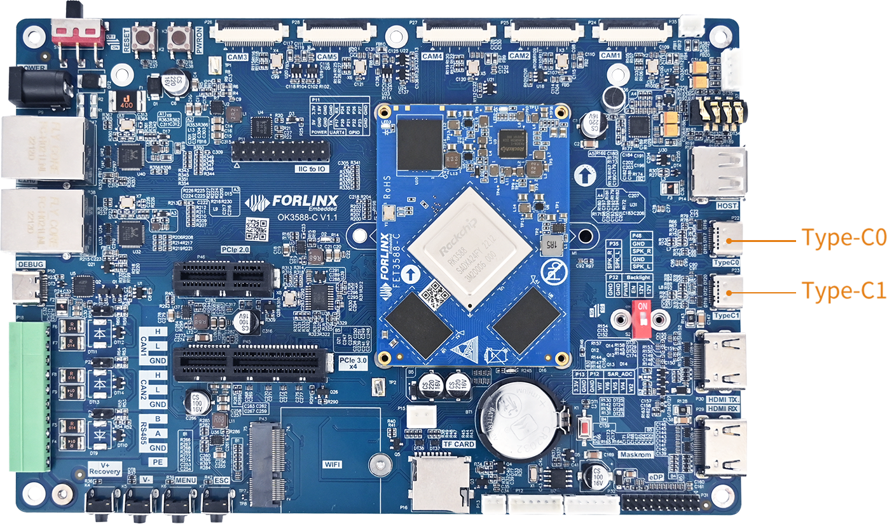

OK3588-C features two Type-C interfaces and supports DP display. Type-C1 only supports HOST mode.

| Comparison Item                               | Type-C0                                      | Type-C1                       |
| --------------------------------------------- | -------------------------------------------- | ----------------------------- |
| USB maximum rate                              | USB 3.1 Gen1（5Gbps）                        | USB 3.1 Gen1（5Gbps）         |
| OTG supported                                 | ✅ Supports (Host/Device automatic switching) | ❌ Only Host mode              |
| Device mode（ADB/flashing）                   | ✅ Yes                                        | ❌ No                          |
| Host mode (USB flash disk/keyboard and mouse) | ✅ Yes                                        | ✅ Yes                         |
| DP Alt mode video output                      | ✅  Support（up to 4K@60Hz）                  | ✅ Support（up to 4K@60Hz）    |
| Type-C PD protocol                            | ✅ Support（require FUSB302）                 | ✅ Support（require FUSB302）  |
| Plug Orientation Detection                    | ✅ Support (via CC detection)                 | ✅  Support (via CC detection) |
| USB Flashing                                  | ✅ Support（default flashing port）           | ❌ No                          |

**⚠️Note: Since the RK3588S2 chip itself reduces the number of Type-C controllers, the OK3588S2-C board only has one Type-C interface (TypeC0). Port P23 is unavailable.**

The Type-C interface on RK3588 is formed by the following five core modules working together:

1. USB 3.1/DP Combo PHY — The physical layer responsible for the multiplexed transmission of USB SuperSpeed (5 Gbps) and DisplayPort high-speed signals. It supports flexible allocation of 4 lanes, but is not compatible with USB 2.0;
2. USB 2.0 PHY — Responsible for transmitting USB 2.0 (480 Mbps) signals (D+/D-). Combined with the Combo PHY, it enables full support for the USB protocol (USB 3.1 is backward compatible with USB 2.0);
3. USB Controller (DWC3/xHCI) — Implements the complete USB protocol stack and supports OTG mode;
4. DP Controller — Implements the DisplayPort 1.4 protocol and handles video signal output;
5. Type-C Controller (FUSB302) — An external chip connected to the SoC via I2C, responsible for CC detection, reversible plug orientation recognition, role negotiation, and DP Alt Mode capability exchange.

In the device tree, the above modules are associated through endpoint connections and property configurations, forming a complete Type-C interface functional description.

For detailed usage information on the USB interfaces of the RK3588, please refer to the following documents:`OK-linux-source/docs/rk3588/en/Common/USB/Rockchip_Developer_Guide_USB_EN.pdf`.

##### 2\. Device Tree

Location of OK3588-C/3588-C2 device tree nodes`arch/arm64/boot/dts/rockchip/OK3588-C-common.dtsi`.

Taking the Type-C0 interface as an example.

```plain
// USB3.0 OTG0 DWC3/xHCI Controller
&usbdrd3_0 {
	status = "okay";
};
// DWC3 controller for USB3.0 OTG0 with OTG mode and role-switch support
&usbdrd_dwc3_0 {
	dr_mode = "otg";
	usb-role-switch;
	status = "okay";
	port {
		#address-cells = <1>;
		#size-cells = <0>;
		dwc3_0_role_switch: endpoint@0 {
			reg = <0>;
			remote-endpoint = <&usbc0_role_sw>;
		};
	};
};

// USB3.0/DP Combo PHY1
&usbdp_phy0 {
	status = "okay";
	orientation-switch;
	rockchip,dp-lane-mux = <2 3>;
	svid = <0xff01>;
	sbu1-dc-gpios = <&gpio4 RK_PA0 GPIO_ACTIVE_HIGH>;
	sbu2-dc-gpios = <&gpio4 RK_PB0 GPIO_ACTIVE_HIGH>;

	port {
		#address-cells = <1>;
		#size-cells = <0>;
		usbdp_phy0_orientation_switch: endpoint@0 {
			reg = <0>;
			remote-endpoint = <&usbc0_orien_sw>;
		};

		usbdp_phy0_dp_altmode_mux: endpoint@1 {
			reg = <1>;
			remote-endpoint = <&dp0_altmode_mux>;
		};
	};
};
// Enable DP portion of USB3.0/DP Combo PHY0
&usbdp_phy0_dp {
	status = "okay";
};
// Enable USB3 portion of USB3.0/DP Combo PHY0
&usbdp_phy0_u3 {
	status = "okay";
};

&i2c2 {
	status = "okay";
// FUSB302 Type-C port controller at address 0x22
    usbc0: fusb302@22 {
		compatible = "fcs,fusb302";
		reg = <0x22>;
		interrupt-parent = <&gpio1>;
		interrupts = <RK_PB0 IRQ_TYPE_LEVEL_LOW>;
		pinctrl-names = "default";
		pinctrl-0 = <&usbc0_int>;
		vbus-supply = <&vbus5v0_typec0>;
		status = "okay";

		ports {
			#address-cells = <1>;
			#size-cells = <0>;

			port@0 {
				reg = <0>;
				usbc0_role_sw: endpoint@0 {
					remote-endpoint = <&dwc3_0_role_switch>;
				};
			};
		};

		usb_con0: connector {
			compatible = "usb-c-connector";
			label = "USB-C";
			data-role = "dual";
			power-role = "dual";
			try-power-role = "sink";
			op-sink-microwatt = <1000000>;
			sink-pdos =
				<PDO_FIXED(5000, 1000, PDO_FIXED_USB_COMM)>;
			source-pdos =
				<PDO_FIXED(5000, 3000, PDO_FIXED_USB_COMM)>;

			altmodes {
				#address-cells = <1>;
				#size-cells = <0>;

				altmode@0 {
					reg = <0>;
					svid = <0xff01>;
					vdo = <0xffffffff>;
				};
			};

			ports {
				#address-cells = <1>;
				#size-cells = <0>;

				port@0 {
					reg = <0>;
					usbc0_orien_sw: endpoint {
						remote-endpoint = <&usbdp_phy0_orientation_switch>;
					};
				};

				port@1 {
					reg = <1>;
					dp0_altmode_mux: endpoint {
						remote-endpoint = <&usbdp_phy0_dp_altmode_mux>;
					};
				};
			};
		};
	};

};

```

Location of OK3588-C device tree nodes`arch/arm64/boot/dts/rockchip/OK3588S2-C-common.dtsi`.

##### 3\. Application

###### 3.1 Device mode

This mode can be used for firmware flashing, ADB file transfer, and debugging. Host mode allows for connecting standard USB peripherals.

Device Mode, when in Device mode, connect to a computer via a data cable. You will see “Android ADB Interface” in the computer’s Device Manager.
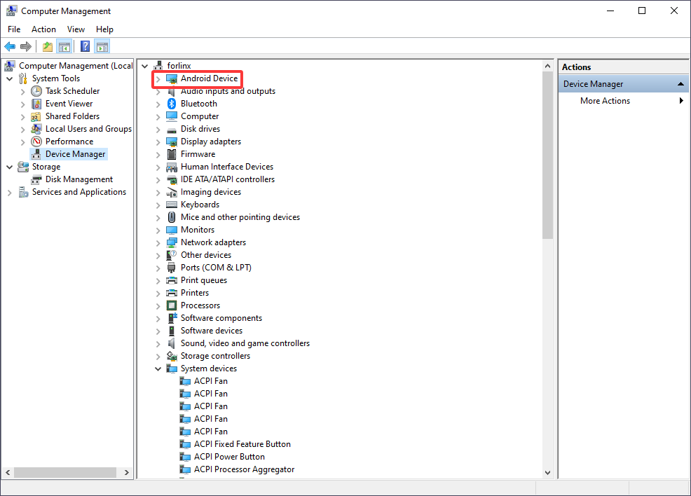

###### 3.2 Host mode

In this mode, you can insert a USB drive (Type-C) for read/write tests.

- Check Mount Directory:


```plain
root@OK3588-C-buildroot:~# mount | grep "sda1"
/dev/sda1 on /run/media/sda1 type ext4 (rw,relatime)
```

You can see that /run/media/sda1 is the mount path for the USB storage device.

- Write Test

Write speed is limited by the specific storage device.

```plain
root@OK3588-C-buildroot:~# dd if=/dev/zero of=/run/media/sda1/test bs=1M count=500 conv=fsync
500+0 records in
500+0 records out
524288000 bytes (524 MB, 500 MiB) copied, 28.1033 s, 18.7 MB/s
```

- Read Test: 

To ensure data accuracy, please restart the development board before retesting the read speed.

```plain
root@OK3588-C-buildroot:~# dd if=/run/media/sda1/test of=/dev/null bs=1M iflag=direct
500+0 records in
500+0 records out
524288000 bytes (524 MB, 500 MiB) copied, 21.5043 s, 24.4 MB/s
```

#### UART

##### 1\. Introduction

There are UART interfaces: UART2, UART4, UART6, and UART9. They are defined as follows: UART2 (System Debug Console), UART4 (General-purpose TTL UART), UART6 (Bluetooth-dedicated UART), and UART9 (RS-485 Communication UART). On the development board, the default device names for UART4 and UART9 are /dev/ttyS4 and /dev/ttyS9, respectively.

| **UART**| **Device Nodes**| **Description**|
|:----------:|:----------:|----------|
| UART2| /dev/ttyS2| The serial port cannot be directly used for this test.|
| UART4| /dev/ttyS4| TTL level, P11 led out, can be used for test.|
| UART6| /dev/ttyS6| Used for Bluetooth, not led out separately, cannot be used directly for this test.|
| UART9| /dev/ttyS9| RS485|

UART4 (P11 pins 7 and 10) and 485 are located on the board as follows:
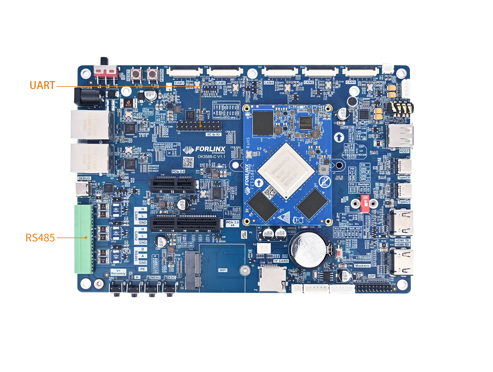

Location of driver source code in the kernel:`drivers/tty/serial/8250/8250_dw.c`.

##### 2\. Device Tree

Location of the UART device tree node:`kernel-6.1/arch/arm64/boot/dts/rockchip/rk3588s.dtsi`.

Take uart4 as example:

```plain
	uart4: serial@feb70000 {
		compatible = "rockchip,rk3588-uart", "snps,dw-apb-uart";
		reg = <0x0 0xfeb70000 0x0 0x100>;
		interrupts = <GIC_SPI 335 IRQ_TYPE_LEVEL_HIGH>;
		clocks = <&cru SCLK_UART4>, <&cru PCLK_UART4>;
		clock-names = "baudclk", "apb_pclk";
		reg-shift = <2>;
		reg-io-width = <4>;
		dmas = <&dmac1 9>, <&dmac1 10>;
		pinctrl-names = "default";
		pinctrl-0 = <&uart4m1_xfer>;
		status = "disabled";
	};
```

It is not enabled by default, and you need to open UART in the corresponding device tree:

OK3588-C/3588-C2 :`kernel-6.1/arch/arm64/boot/dts/rockchip/OK3588-C-common.dtsi`。

OK3588S2-C:`kernel-6.1/arch/arm64/boot/dts/rockchip/OK3588S2-C-common.dtsi`

```plain
&uart4 {
	pinctrl-names = "default";
	pinctrl-0 = <&uart4m0_xfer>;
	status = "okay";
};
```

##### 3\. Application

###### 3.1 Test Method

For this test, UART4 (ttyS4) is used, and the serial port functionality is verified through a loopback method. According to the development board schematic, short the TX and RX pins of UART4, which correspond to PIN7 and PIN10, respectively.


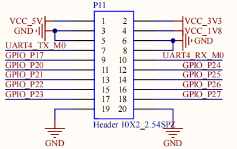

After short connection, launch the test program.

```plain
root@OK3588-C-buildroot:~# fltest_uarttest -d /dev/ttyS4
Welcome to uart test
Send test data:
forlinx_uart_test.1234567890...
Read Test Data finished,Read:
forlinx_uart_test.1234567890...
```

`fltest_uarttest`The source code path:`OK-linux-source/app/forlinx/forlinx_cmd/fltest_uarttest`

###### 3.2 Application Programming

In the OK3588 system, the device node for a UART is `/dev/ttySx`(where x is the serial port number, e.g.,  `/dev/ttyS4`). Applications need to include the header file `<termios.h>`, which defines the structures and functions related to serial port configuration.

**3.2.1 Opening the Serial Port**

The serial port device is opened using `open`function to obtain a file descriptor:

```plain
int fd;
fd = open("/dev/ttyS4", O_RDWR | O_NOCTTY);
if (fd == -1) {
    perror("Failed to open UART device");
    return -1;
}
```

**Parameter Description:**

| **Flag**   | **Description**                                              |
| :--------- | :----------------------------------------------------------- |
| `O_RDWR`   | Opens the port for reading and writing.                      |
| `O_NOCTTY` | Prevents the port from becoming the controlling terminal for the process. |

**3.2.2 Configuring Serial Port Parameters**

Use the`struct termios`structure to configure the baud rate, data bit, stop bit, check bit and other parameters: 

```plain
struct termios options;

/* Get current serial port configuration */
tcgetattr(fd, &options);

/* Set baud rate */
cfsetispeed(&options, B115200);
cfsetospeed(&options, B115200);

/* Enable receiver and set local mode */
options.c_cflag |= (CLOCAL | CREAD);

/* 8 data bits */
options.c_cflag &= ~CSIZE;
options.c_cflag |= CS8;

/* No parity bit */
options.c_cflag &= ~PARENB;

/* 1 stop bit */
options.c_cflag &= ~CSTOPB;

/* Disable hardware flow control */
options.c_cflag &= ~CRTSCTS;

/* Raw input mode */
options.c_lflag &= ~(ICANON | ECHO | ECHOE | ISIG);

/* Raw output mode */
options.c_oflag &= ~OPOST;

/* Set read timeout: read at least 1 byte, timeout 10*100ms */
options.c_cc[VMIN] = 1;
options.c_cc[VTIME] = 10;

/* Apply configuration */
tcsetattr(fd, TCSANOW, &options);
```

Common Baud Rate Macro Definitions:

| Macro      | **Baud Rate** |
| :--------- | :------------ |
| `B9600`    | 9600          |
| `B19200`   | 19200         |
| `B38400`   | 38400         |
| `B57600`   | 57600         |
| `B115200`  | 115200        |
| `B460800`  | 460800        |
| `B921600`  | 921600        |
| `B1500000` | 1500000       |
| `B3000000` | 3000000       |
| `B4000000` | 4000000       |

**3.2.3 Sending Data**

Use `write` function to send data to the serial port:

```plain
	char test[100]="forlinx_uart_test.1234567890...";
	printf("Send test data:\n%s\n",test);
	write(fd, test, strlen(test) + 1);
```

**3.2.4 Receiving Data**

Use the `read` function to read data from the serial port:

```plain
	while(1)
	{
		int ret;
		nread = read(fd, &buffer[n], 1);
		if (strlen(test) == strlen(buffer))
		{
			printf("Read Test Data finished,Read:\n%s\n",buffer);
			memset(buffer,0,sizeof(buffer));
			tcflush(fd, TCIOFLUSH);
			break;
		}
		n += nread;
	}
```

**3.2.5 Closing the Serial Port**

Close the file descriptor after use:

```plain
close(fd);
```

#### USB2.0

##### 1\. Introduction

USB (Universal Serial Bus) is a standardized interface used for connecting computers to various peripheral devices. Its design goals are to simplify device connections, provide data transfer and power supply capabilities, and support hot-plugging (plug-and-play).

OK3588 supports 1 x USB 2.0 interface. Please connect USB devices such as mice, keyboards, and flash drives to any onboard USB HOST port, with full hot-plug support for these devices.

Location of the USB 2.0 interface:
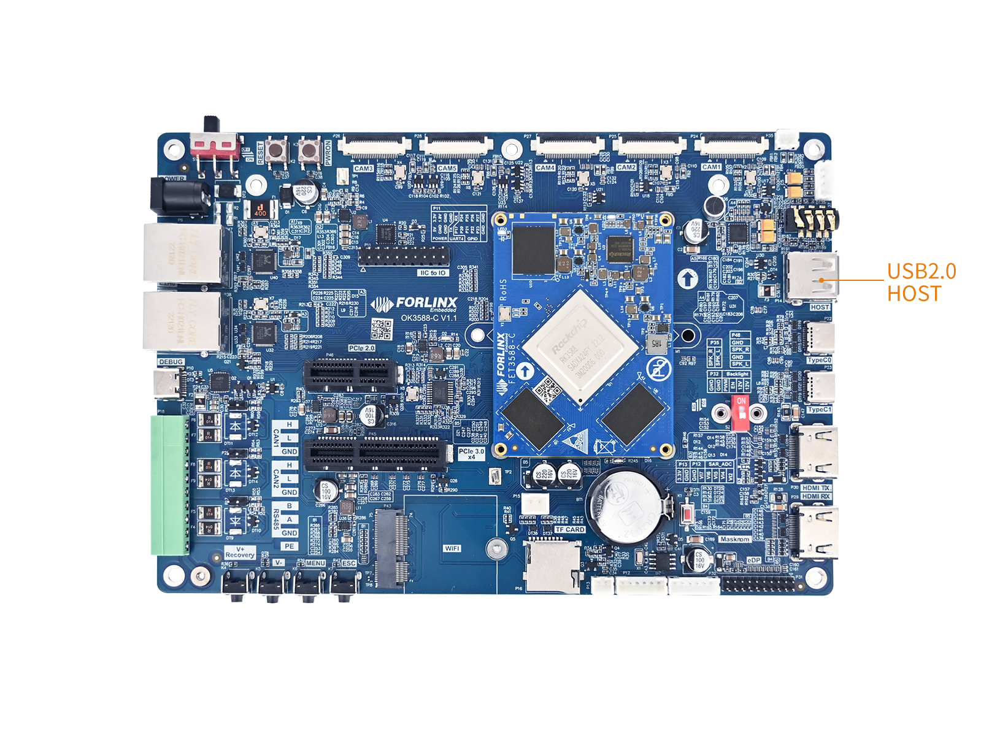

##### 2\. Device Tree

Location of OK3588-C/3588-C2 USB2.0 device Tree：`arch/arm64/boot/dts/rockchip/OK3588-C-common.dtsi`

```plain
// USB2.0 HOST0 EHCI Controller (USB2.0 protocol)
&usb_host0_ehci {
	status = "okay";
};

// USB2.0 HOST0 OHCI Controller (USB1.0 & USB1.1 protocol)
&usb_host0_ohci {
	status = "okay";
};

// USB2.0 PHY2
&u2phy2 {
	status = "okay";
};
```

Location of OK3588S2-C USB2.0 device tree node:`arch/arm64/boot/dts/rockchip/OK3588S2-C-common.dtsi`

##### 3\. USB Device Driver Support

###### 3.1 Supported Device Types

According to Section 3.5 (USB Peripheral CONFIG) of the official Rockchip Linux USB Development Guide, the RK3588 SDK kernel supports the following USB device class drivers. The development board can directly recognize and use the corresponding peripherals without additional configuration: The development board can directly identify and use the corresponding peripherals without additional configuration:

| Device Type| Description| Typical Equipment|
|----------|----------|----------|
| Mass Storage| Mass Storage Devices| USB flash drive, portable hard drive, card reader|
| HID (Keyboard/Mouse)| HMI| USB keyboard, USB mouse, game controller|
| UVC（Camera）| USB video class devices| USB camera, video capture card|
| UAC（Audio）| USB audio class devices| USB sound card, USB microphone, USB headset|
| USB serial（3G/4G Modem）| USB-to-serial (Modem) | 3G/4G wireless module|
| USB Serial（PL2303）| PL2303 USB-to-serial converter| PL2303 adapter cable|
| USB Net（Bluetooth）| USB Bluetooth adapter| USB Bluetooth Dongle|
| USB Net（Ethernet）| USB NIC| USB Gigabit/100 Mbps network card|
| USB Hub| USB Hub| USB Hub|

The default kernel configuration includes support for common drivers. To enable or remove specific drivers, refer to Section 3.2.2.2 in the OS Development guide for configuring and compiling the kernel.

###### 3.2 HID Device Support

HID (Human Interface Device) is one of the most widely used USB device classes, covering input devices such as keyboards, mice, touchscreens, and game controllers.

**3.2.1 Kernel Configuration**

According to Section 3.5.3 of the RK official manual, the kernel configuration options for USB HID are as follows:

```plain
Device Drivers --->
    [*] HID support
        [*] USB HID transport layer
        [ ] PID device support
        [*] /dev/hiddev raw HID device support
```

**3.2.2 VID/PID List and Kernel Source Path**

Each USB device is uniquely identified by its VID (Vendor ID) and PID (Product ID). The kernel loads the appropriate driver by matching the VID/PID. The kernel loads the appropriate driver by matching the VID/PID.

The definitions for VID/PID and the driver source code related to HID devices are located in the following paths:

| File Path| Description|
|----------|----------|
| `kernel/drivers/hid/hid-ids.h`| Macro definitions for VID/PID of all known HID devices|
| `kernel/drivers/hid/hid-quirks.c`| Compatibility handling (quirks list) for special HID devices|
| `kernel/drivers/hid/usbhid/hid-core.c`| Core driver implementation for USB HID|
| `kernel/drivers/hid/hid-multitouch.c`| Driver for multi-touch screen HID devices|
| `kernel/drivers/hid/hid-generic.c`| Generic HID device driver (fallback matching)|

To view the list of supported HID device VID/PID in the kernel source code, use the following command:

```plain
# View all defined HID vendor IDs
OK-linux-source$ grep "USB_VENDOR_ID_" kernel/drivers/hid/hid-ids.h | head -20
# View the device ID of a specific vendor (take Logitech as an example)
OK-linux-source$ grep "LOGITECH" kernel/drivers/hid/hid-ids.h
```

##### 4\. Application

###### 4.1 USB Drive Test

After the development board boots up, connect the USB flash drive to the USB host interface of the development board.   
Check the mount directory:

```plain
root@OK3588-C-buildroot:~# mount | grep "sda1"
/dev/sda1 on /run/media/sda1 type vfat (rw,relatime,gid=6,fmask=0007,dmask=0007,allow_utime=0020,codepage=936,iocharset=utf8,shortname=mixed,errors=remount-ro)
```

You can see that /run/media/sda1 is the mount path for the USB storage device.

Write test (write speed is limited by the specific storage device):

```plain
root@OK3588-C-buildroot:~# dd if=/dev/zero of=/run/media/sda1/test bs=1M count=500 conv=fsync
500+0 records in
500+0 records out
524288000 bytes (524 MB, 500 MiB) copied, 28.1033 s, 18.7 MB/s
```

Read test (to ensure data accuracy, restart the development board before re-running the read speed test):

```plain
root@OK3588-C-buildroot:~# dd if=/run/media/sda1/test of=/dev/null bs=1M iflag=direct
500+0 records in
500+0 records out
524288000 bytes (524 MB, 500 MiB) copied, 21.5043 s, 24.4 MB/s
```

###### 4.2 Mouse Testing

Connect the USB mouse to the USB port of the OK3588 platform and enter the following command to check the kernel logs:

```plain
root@OK3588-C-buildroot:~# dmesg | tail -10
[17111.992827] rockchip-hdptx-phy-hdmi fed60000.hdmiphy: hdptx phy lane locked!
[17111.992881] rockchip-vop2 fdd90000.vop: [drm] vop enable intf:800
[17114.232937] usb 5-1: USB disconnect, device number 2
[17167.156589] usb 6-1: new low-speed USB device number 2 using ohci-platform
[17167.384603] usb 6-1: New USB device found, idVendor=09da, idProduct=8736, bcdDevice= 1.01
[17167.384623] usb 6-1: New USB device strings: Mfr=1, Product=2, SerialNumber=0
[17167.384630] usb 6-1: Product: USB Mouse
[17167.384637] usb 6-1: Manufacturer: SIGMACHIP
[17167.392382] input: SIGMACHIP USB Mouse as /devices/platform/fc840000.usb/usb6/6-1/6-1:1.0/0003:09DA:8736.0001/input/input9
[17167.452821] hid-generic 0003:09DA:8736.0001: input,hidraw0: USB HID v1.10 Mouse [SIGMACHIP USB Mouse] on usb-fc840000.usb-1/input0
```

An arrow cursor will appear on the screen, indicating that the mouse is functioning properly.

#### Wifi\_Bluetooth

⚠️**Note: The network environment is different, so please set it according to the actual situation when you do this experiment.**

##### 1\. Introduction

The OK3588 platform supports two types of Wi-Fi/Bluetooth combo modules: AW-XM458 and AW-CM276MA. The Wi‑Fi interface uses PCIe.

The Bluetooth interface uses UART.

Locations:
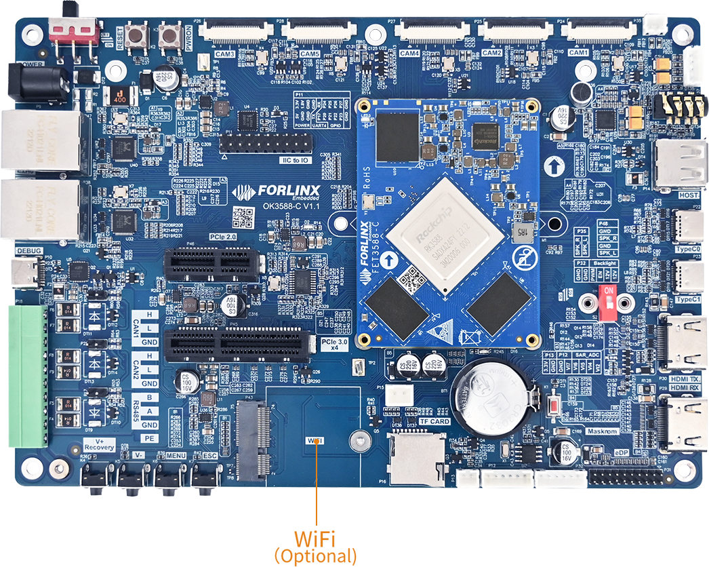

##### 2\. Device Tree

The device tree nodes for Wi‑Fi and Bluetooth on OK3588‑C / 3588‑C2 are located at:`arch/arm64/boot/dts/rockchip/OK3588-C-common.dtsi`.

```plain
wireless-wlan {
        compatible = "wlan-platdata";
        wifi_chip_type = "mvl88w9098";
        status = "okay";
};

wireless-bluetooth {
	compatible = "bluetooth-platdata";
	status = "okay";
};
```

The device tree nodes for Wi‑Fi and Bluetooth on OK3588S2‑C are located at:`arch/arm64/boot/dts/rockchip/OK3588S2-C-common.dtsi`.

##### 3\. Application

###### 3.1 WiFi STA Mode

Before using Wi‑Fi, configure it with the following steps:

- Assume the Wi‑Fi hotspot SSID is ChinaNet‑Jvgv and the password is asdasd123.

Enter the following command in the development board terminal:

Enter the following command in the development board terminal:

```plain
root@OK3588-C-buildroot:~# fltest_wifi.sh -i mlan0 -s "ChinaNet-Jvgv" -p asdasd123
```

Parameters in the command:

- In the terminal, run the following command to check whether the network can be pinged:

```plain
root@OK3588-C-buildroot:~# ping www.forlinx.net -c 3
```

###### 3.2 WiFi AP Mode

**⚠️Note: Before performing this test, ensure the Gigabit Ethernet port eth0 is connected to the network and functioning normally.**

- Check the driver loading status (using the AW‑XM458 module as an example):


```plain
root@OK3588-C-buildroot:~# lsmod
Module                  Size  Used by
moal                  806912  1
mlan                  602112  1 moal
```

- Configure the hotspot:

Hotspot name:`OK3588_WIFI_2.4G_AP`

Password:`12345678`

The hotspot name and password can be viewed with`/etc/hostapd-2.4g.conf`:

```plain
root@OK3588-C-buildroot:~# fltest_hostapd.sh
killall: hostapd: no process killed
killall: dnsmasq: no process killed
root@OK3588-C-buildroot:~# uap0: interface state UNINITIALIZED->ENABLED
uap0: AP-ENABLED
```

A mobile phone can now connect to this hotspot and access the internet.

If you want to test the 5 GHz band, modify`/usr/bin/fltest_hostapd.sh`by disabling`hostapd /etc/hostapd-2.4g.conf &`and`hostapd /etc/hostapd-5g.conf &`.

```plain
cnt=`ps aux | grep wpa_supplicant | grep -v grep  | wc -l`
if [ "${cnt}" != "0" ];then
        killall wpa_supplicant > /dev/null
fi

cnt1=`ps aux | grep hostapd | grep -v grep  | wc -l`
if [ "${cnt1}" != "0" ];then
        killall hostapd > /dev/null
fi

killall dnsmasq

echo 1 > /proc/sys/net/ipv4/ip_forward
iptables -t nat -A POSTROUTING -o eth0 -j MASQUERADE

sleep 1
ifconfig mlan0 up
ifconfig uap0 up
ifconfig uap0 192.168.42.1

#hostapd /etc/hostapd-2.4g.conf &
hostapd /etc/hostapd-5g.conf &
dnsmasq -C /etc/dnsmasq.conf

```

The 5 GHz hotspot name and password can be viewed in the file:`/etc/hostapd-5g.conf`

###### 3.3 Bluetooth

This section demonstrates data transfer between a mobile phone and the development board via Bluetooth (Bluetooth 5.0 supported).

- Bluetooth configuration:

```plain
root@OK3588-C-buildroot:~# bluetoothctl //Open the BlueZ Bluetooth tool
hci0 new_settings: powered bondable ssp br/edr le secure-conn
Agent registered
[CHG] Controller 50:5A:65:51:A9:F1 Pairable: yes
[bluetooth]# power on //Start the Bluetooth device
Changing power on succeeded
[bluetooth]# pairable on  //Set to pairing mode
Changing pairable on succeeded
[bluetooth]# discoverable on //Set to discoverable mode
hci0 new_settings: powered connectable bondable ssp br/edr le secure-conn
hci0 new_settings: powered connectable discoverable bondable ssp br/edr le secure-conn
Changing discoverable on succeeded
[CHG] Controller 50:5A:65:51:A9:F1 Discoverable: yes
[bluetooth]# agent on //Start the agent
Agent is already registered
[bluetooth]# default-agent
Default agent request successful
```

- Passive pairing on the development board

Turn on Bluetooth search on the mobile phone; a device named`OK3588-buildroot`will appear. Select it to pair.

Simultaneously, the following message will be printed on the development board; enter yes:

```plain
[bluetooth]# default-agent
Default agent request successful
hci0 B0:46:92:74:81:84 type BR/EDR connected eir_len 22
hci0 B0:46:92:74:81:84 type BR/EDR connected eir_len 5
[NEW] Device B0:46:92:74:81:84 OPPO Reno5 K 5G
hci0 B0:46:92:74:81:84 type BR/EDR connected eir_len 5
hci0 B0:46:92:74:81:84 type BR/EDR connected eir_len 5
hci0 B0:46:92:74:81:84 type BR/EDR connected eir_len 5
Request confirmation
[agent] Confirm passkey 176985 (yes/no): yes
hci0 new_link_key B0:46:92:74:81:84 type 0x05 pin_len 0 store_hint 1
hci0 device_flags_changed: B0:46:92:74:81:84 (BR/EDR)
     supp: 0x00000000  curr: 0x00000000
[CHG] Device B0:46:92:74:81:84 INFO: 0x0007 (7)
[CHG] Device B0:46:92:74:81:84 Bonded: yes
```

- View and remove connected devices:

```plain
[OPPO Reno5 K 5G]# devices
Device B0:46:92:74:81:84 OPPO Reno5 K 5G
[OPPO Reno5 K 5G]# remove B0:46:92:74:81:84
[DEL] Player /org/bluez/hci0/dev_B0_46_92_74_81_84/player0 [default]
hci0 B0:46:92:74:81:84 type BR/EDR connected eir_len 5
hci0 B0:46:92:74:81:84 type BR/EDR connected eir_len 5
[DEL] Transport /org/bluez/hci0/dev_B0_46_92_74_81_84/fd0
[DEL] Endpoint /org/bluez/hci0/dev_B0_46_92_74_81_84/sep1
hci0 B0:46:92:74:81:84 type BR/EDR connected eir_len 5
hci0 B0:46:92:74:81:84 type BR/EDR connected eir_len 5
hci0 B0:46:92:74:81:84 type BR/EDR connected eir_len 5
hci0 B0:46:92:74:81:84 type BR/EDR disconnected with reason 2
[CHG] Device B0:46:92:74:81:84 ServicesResolved: no
Device has been removed
[CHG] Device B0:46:92:74:81:84 INFO: 0x0008 (8)
[CHG] Device B0:46:92:74:81:84 Connected: no
[DEL] Device B0:46:92:74:81:84 OPPO Reno5 K 5G
[bluetooth]#
```

- Receiving files on the development board:

After successful pairing, you can send a file from the mobile phone to the OK3588‑C development board via Bluetooth.

The received files are saved in the

`/tmp/`.

```plain
root@OK3588-C-buildroot:~# ls /tmp/*.jpg
/tmp/Screenshot_2025-10-25-09-45-57-51_76eaced432273cd65da1ec13409568ff.jpg
```

- Sending files from the development board:

You can send a file from the OK3588‑C development board to a mobile phone. Test as follows:

```plain
root@OK3588-C-buildroot:~# fltest_obexctl.sh
[NEW] Client /org/bluez/obex
[obex]# connect B0:46:92:74:81:84
Attempting to connect to B0:46:92:74:81:84
[NEW] Session /org/bluez/obex/client/session1 [default]
[NEW] ObjectPush /org/bluez/obex/client/session1
Connection successful
[B0:46:92:74:81:84]# send /userdata/media/1080p_30fps_vp8.mp4
Attempting to send /userdata/media/1080p_30fps_vp8.mp4 to /org/bluez/obex/client/session1
[NEW] Transfer /org/bluez/obex/client/session1/transfer0
Transfer /org/bluez/obex/client/session1/transfer0
[B0:46:9Status: queued
[B0:46:9Name: 1080p_30fps_vp8.mp4
[B0:46:9Size: 20137363
[B0:46:9Filename: /userdata/media/1080p_30fps_vp8.mp4
[B0:46:9Session: /org/bluez/obex/client/session1
[CHG] Transfer /org/bluez/obex/client/session1/transfer0 Status: active
[CHG] Transfer /org/bluez/obex/client/session1/transfer0 Transferred: 8024 (@8KB/s 41:48)
```

**⚠️Note: Some mobile phones require files to have an extension; otherwise, the Android system will reject them. Therefore, please try to use files with extensions for testing. Apple iPhones do not support sending/receiving data via Bluetooth.**

#### Watchdog

##### 1\. Introduction

A watchdog is essentially a count‑down timer driven by a hardware clock. During normal system operation, the application must write a specific value (i.e., “kicking the dog”) to the watchdog’s dedicated register within a set timeout period (e.g., 1 second) to reset the counter to its initial value. If the program enters an infinite loop, crashes, or fails to kick the dog before the timeout, the counter decrements to 0, triggering a predefined action such as a system reset or a software exception alert. 

The OK3588‑C development board integrates an on‑chip watchdog.

The watchdog driver source code is located in the kernel at: `kernel/drivers/watchdog/dw_wdt.c`

##### 2\. Device Tree

The watchdog device‑tree node is located at:`kernel-6.1/arch/arm64/boot/dts/rockchip/rk3588s.dtsi`

```plain
	wdt: watchdog@feaf0000 {
		compatible = "snps,dw-wdt";
		reg = <0x0 0xfeaf0000 0x0 0x100>;
		clocks = <&cru TCLK_WDT0>, <&cru PCLK_WDT0>;
		clock-names = "tclk", "pclk";
		interrupts = <GIC_SPI 315 IRQ_TYPE_LEVEL_HIGH>;
		status = "disabled";
	};
```

By default, the watchdog is disabled. To enable it, open the watchdog in the corresponding device tree by setting:

OK3588-C/3588-C2:`kernel-6.1/arch/arm64/boot/dts/rockchip/OK3588-C-common.dtsi`。

OK3588S2-C:`kernel-6.1/arch/arm64/boot/dts/rockchip/OK3588S2-C-common.dtsi`

```plain
&wdt {
	status = "okay";
};
```

##### 3\. Application

###### 3.1 Test Method

This test provides two testing programs. The user should select one based on the actual scenario.

With this`fltest_watchdog`, the command turns on the watchdog and performs a feed, so the system does not reboot.

```plain
root@OK3588-C-buildroot:~# fltest_watchdog
Watchdog Ticking Away!
```

When using`ctrl+c`end the test, stop feeding the dog, the watchdog is in the open state, and the system resets for 10 seconds;

If you want to avoid a reset, enter the command to disable the watchdog within 10 seconds after closing the program.

```plain
root@OK3588-C-buildroot:~# fltest_watchdog -d
Watchdog card disabled.
```

Start watchdog, set reset time to 10 seconds, no feeding

Execute the command`flteset_watchdogrestart`, this command will open the watchdog but will not perform petting operations. The system will reboot after 10 seconds.

```plain
root@OK3588-C-buildroot:~# fltest_watchdogrestart
Restart after 10 seconds
```

The source code paths for the two test routines are:`OK-linux-source/app/forlinx/forlinx_cmd/fltest_watchdog`and`OK-linux-source/app/forlinx/forlinx_cmd/fltest_watchdog/fltest_watchdogrestart`.

###### 3.2 Application Programming

The watchdog device node in OK3588 is`/dev/watchdog`. There should be header file \<linux/watchdog.h> in the header file. It defines the ioctl command macros for the watchdog. Each different command macro represents a different operation requested from the device, as shown below:

```plain
#define	WDIOC_GETSUPPORT	_IOR(WATCHDOG_IOCTL_BASE, 0, struct watchdog_info)
#define	WDIOC_GETSTATUS		_IOR(WATCHDOG_IOCTL_BASE, 1, int)
#define	WDIOC_GETBOOTSTATUS	_IOR(WATCHDOG_IOCTL_BASE, 2, int)
#define	WDIOC_GETTEMP		_IOR(WATCHDOG_IOCTL_BASE, 3, int)
#define	WDIOC_SETOPTIONS	_IOR(WATCHDOG_IOCTL_BASE, 4, int)
#define	WDIOC_KEEPALIVE		_IOR(WATCHDOG_IOCTL_BASE, 5, int)
#define	WDIOC_SETTIMEOUT        _IOWR(WATCHDOG_IOCTL_BASE, 6, int)
#define	WDIOC_GETTIMEOUT        _IOR(WATCHDOG_IOCTL_BASE, 7, int)
#define	WDIOC_SETPRETIMEOUT	_IOWR(WATCHDOG_IOCTL_BASE, 8, int)
#define	WDIOC_GETPRETIMEOUT	_IOR(WATCHDOG_IOCTL_BASE, 9, int)
#define	WDIOC_GETTIMELEFT	_IOR(WATCHDOG_IOCTL_BASE, 10, int)
```

Commonly used commands include: WDIOC\_SETOPTIONS, WDIOC\_KEEPALIVE, WDIOC\_SETTIMEOUT, and WDIOC\_GETTIMEOUT. Their descriptions are as follows:

| WDIOC\_SETOPTIONS | Enable or disable the watchdog.|
|----------|----------|
| WDIOC\_KEEPALIVE | Perform the “petting” (keep-alive) operation.|
| WDIOC\_SETTIMEOUT | Set the timeout period.|
| WDIOC\_GETTIMEOUT | Get the current timeout period.|

**3.2.1 Opening the Watchdog**

You can use the open function to open the watchdog device and obtain a file descriptor:

```plain
fd = open("/dev/watchdog", O_WRONLY);
if (fd == -1) {
fprintf(stderr, "Watchdog device not enabled.\n");
```

**3.2.2 Setting the Timeout Period**

Use the WDIOC\_SETTIMEOUT command to set the watchdog timeout period. The usage is as follows:

```plain
ioctl(fd,WDIOC_SETTIMEOUT,&flags);
```

For the timeout setting mechanism specific to RK3588, please refer to the next subsection.

**3.2.3 Petting the Watchdog**

After the watchdog timer is started, please “pet the dog” before it times out. Otherwise, timer overflow will cause a system reset or generate an interrupt signal. Use the WDIOC\_KEEPALIVE command to perform the petting operation. The usage is as follows:

```plain
ioctl(fd, WDIOC_KEEPALIVE, &dummy);
```

###### 3.3 Timeout Mechanism

Regarding the timeout mechanism: The timeout value set from user space is not directly passed to the hardware. The Watchdog driver internally maintains a table of 16 preset timeout values. The driver selects the closest value from this table as the actual timeout according to the following rules:

| *The timeout period of the request* | *Final timeout set by watchdog* |
| ----------------------------------- | ------------------------------- |
| timeout_request > 89                | timeout_set = timeout_request   |
| 44 < timeout_request <= 89          | timeout_set = 89                |
| 22 < timeout_request <= 44          | timeout_set = 44                |
| 11 < timeout_request <= 22          | timeout_set = 22                |
| 5 < timeout_request <= 11           | timeout_set = 11                |
| 2< timeout_request <= 5             | timeout_set = 5                 |
| timeout_request = 2                 | timeout_set = 2                 |
| timeout_request = 1                 | timeout_set = 1                 |

### Database

#### SQLite3

SQLite3 is a lightweight, ACID-compliant relational database management system with low resource consumption. The OK3588-C development board uses version 3.44.2 of SQLite3. Using Method:

```plain
root@OK3588-C-buildroot:~# sqlite3
SQLite version 3.44.2 2023-11-24 11:41:44
Enter ".help" for usage hints.
Connected to a transient in-memory database.
Use ".open FILENAME" to reopen on a persistent database.
sqlite> create table tbl1 (one varchar(10), twwo smallint);	//Create table tbl1
sqlite> insert into tbl1 values('hello!',10);	//Insert data "hello!" and 10 into table tbl1
sqlite> insert into tbl1 values('goodbye',20);	//Insert data "goodbye" and 20 into table tbl1
sqlite> select * from tbl1;	//Query the content of table tbl1
hello!|10
goodbye|20
sqlite> delete from tbl1 where one = 'hello!';	//Delete data
sqlite> select * from tbl1;	//Query the content of table tbl1
goodbye|20
sqlite> .quit			//Exit the database (or use the .exit command)
```

### Multimedia

#### Audio

##### 1. Introduction

The OK3588-C development board is equipped with the NAU88C22YG audio codec chip, supporting both analog and digital audio output. The interface configuration is as follows:

| Interface Type   | Interface Specifications     | No.  | Description                                 |
| ---------------- | ---------------------------- | ---- | ------------------------------------------- |
| Headphone Output | 3.5mm Audio Jack             | P37  | Standard stereo headphone interface         |
| Speaker Output   | XH2.0-2P White Connector     | P25  | Supports 8Ω speaker, maximum input power 1W |
| Speaker Output   | PH2.0-4P White Connector     | P48  | Supports 8Ω speaker, maximum input power 1W |
| HDMI Audio       | HDMI Interface Output        | P30  | Digital audio transmission via HDMI         |
| DP Audio         | DisplayPort Interface Output | P22  | Digital audio transmission via DP           |


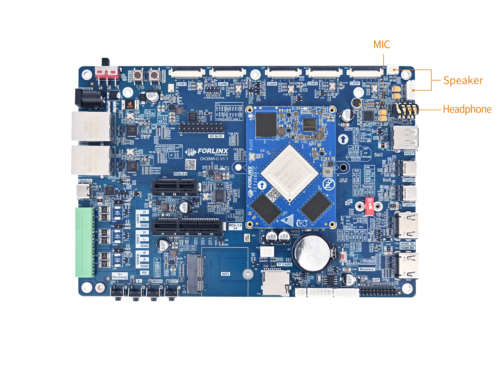

**⚠️Note: The OK3588S2-C model does not have an HDMI RX interface.**

##### 2\. Device Tree

The audio-related device tree nodes for the OK3588-C/3588-C2 are located at:`arch/arm64/boot/dts/rockchip/OK3588-C-common.dtsi`.

```plain
//Sound card node: Core abstraction of the audio subsystem
nau8822_sound: nau8822-sound {
		status = "okay";
		compatible = "rockchip,multicodecs-card";
		rockchip,card-name = "rockchip-nau8822";
		hp-det-gpio = <&gpio1 RK_PB2 GPIO_ACTIVE_HIGH>;
		io-channels = <&saradc 3>;
		io-channel-names = "adc-detect";
		keyup-threshold-microvolt = <1800000>;
		poll-interval = <100>;
		rockchip,format = "i2s";
		rockchip,mclk-fs = <256>;
		rockchip,cpu = <&i2s0_8ch>;
		rockchip,codec = <&nau8822>;
		rockchip,audio-routing =
			"Headphone", "RHP",
			"Headphone", "LHP",
			"Speaker", "LSPK",
			"Speaker", "RSPK",
			"RMICP", "Main Mic",
			"RMICN", "Main Mic",
			"RMICP", "Headset Mic",
			"RMICN", "Headset Mic",
			"LMICP", "Main Mic",
			"LMICN", "Main Mic",
			"LMICP", "Headset Mic",
			"LMICN", "Headset Mic";
		pinctrl-names = "default";
		pinctrl-0 = <&hp_det>;
		play-pause-key {
			label = "playpause";
			linux,code = <KEY_PLAYPAUSE>;
			press-threshold-microvolt = <2000>;
			poll-interval = <1000>;
		};
	};
    hdmi0_sound: hdmi0-sound {
		status = "okay";
		compatible = "rockchip,hdmi";
		rockchip,mclk-fs = <128>;
		rockchip,card-name = "rockchip-hdmi0";
		rockchip,cpu = <&i2s5_8ch>;
		rockchip,codec = <&hdmi0>;
		rockchip,jack-det;
	};

	hdmi1_sound: hdmi1-sound {
		status = "disabled";
		compatible = "rockchip,hdmi";
		rockchip,mclk-fs = <128>;
		rockchip,card-name = "rockchip-hdmi1";
		rockchip,cpu = <&i2s6_8ch>;
		rockchip,codec = <&hdmi1>;
		rockchip,jack-det;
	};

	dp0_sound: dp0-sound {
		status = "okay";
		compatible = "rockchip,hdmi";
		rockchip,card-name= "rockchip,dp0";
		rockchip,mclk-fs = <512>;
		rockchip,cpu = <&spdif_tx2>;
		rockchip,codec = <&dp0 1>;
		rockchip,jack-det;
	};

	dp1_sound: dp1-sound {
		status = "okay";
		compatible = "rockchip,hdmi";
		rockchip,card-name= "rockchip,dp1";
		rockchip,mclk-fs = <512>;
		rockchip,cpu = <&spdif_tx5>;
		rockchip,codec = <&dp1 1>;
		rockchip,jack-det;
	};

	hdmiin-sound {
		compatible = "rockchip,hdmi";
		rockchip,mclk-fs = <128>;
		rockchip,format = "i2s";
		rockchip,bitclock-master = <&hdmirx_ctrler>;
		rockchip,frame-master = <&hdmirx_ctrler>;
		rockchip,card-name = "rockchip,hdmiin";
		rockchip,cpu = <&i2s7_8ch>;
		rockchip,codec = <&hdmirx_ctrler 0>;
		rockchip,jack-det;
	};

//I2S controller node
&i2s0_8ch {
	status = "okay";
	pinctrl-0 = <&i2s0_lrck
		     &i2s0_sclk
		     &i2s0_sdi0
		     &i2s0_sdo0>;
};

#nau8822
&i2c7 {
	status = "okay";
	nau8822: nau8822@1a {
		status = "okay";
		#sound-dai-cells = <0>;
		compatible = "nuvoton,nau8822";
		reg = <0x1a>;
		clocks = <&mclkout_i2s0>;
		clock-names = "mclk";
		assigned-clocks = <&mclkout_i2s0>;
		assigned-clock-rates = <12288000>;
		pinctrl-names = "default";
		pinctrl-0 = <&i2s0_mclk>;
	};
};
```

The audio-related device tree nodes for the OK3588S2-C are located at:`arch/arm64/boot/dts/rockchip/OK3588-C-common.dtsi`.

##### 3\. Application

To view the playback sound card:

```plain
root@OK3588-C-buildroot:/etc/systemd/network# aplay -l
**** List of PLAYBACK Hardware Devices ****
card 1: rockchipnau8822 [rockchip-nau8822], device 0: dailink-multicodecs nau8822-hifi-0 [dailink-multicodecs nau8822-hifi-0]
  Subdevices: 1/1
  Subdevice #0: subdevice #0
card 2: rockchiphdmi0 [rockchip-hdmi0], device 0: rockchip-hdmi0 i2s-hifi-0 [rockchip-hdmi0 i2s-hifi-0]
  Subdevices: 1/1
  Subdevice #0: subdevice #0
card 3: rockchipdp1 [rockchip,dp1], device 0: rockchip,dp1 spdif-hifi-0 [rockchip,dp1 spdif-hifi-0]
  Subdevices: 1/1
  Subdevice #0: subdevice #0
```

To view the record sound card:

```plain
root@OK3588-C-buildroot:/etc/systemd/network# arecord -l
**** List of CAPTURE Hardware Devices ****
card 1: rockchiphdmiin [rockchip,hdmiin], device 0: rockchip,hdmiin i2s-hifi-0 [rockchip,hdmiin i2s-hifi-0]
  Subdevices: 1/1
  Subdevice #0: subdevice #0
card 2: rockchipnau8822 [rockchip-nau8822], device 0: dailink-multicodecs nau8822-hifi-0 [dailink-multicodecs nau8822-hifi-0]
  Subdevices: 1/1
  Subdevice #0: subdevice #0
```

- Playback and recording via 8822 sound card:


Plug the headphones into the SPKOUT connector and play the audio with the following command:

```plain
root@OK3588-C-buildroot:~# gst-play-1.0 /userdata/piano2-CoolEdit.mp3 --audiosink="alsasink device=plughw:1,0"
```

Recording via headphones:

```plain
root@OK3588-C-buildroot:~# arecord -D hw:rockchipnau8822,0 -d 3 -f cd -t wav test1.wav
Recording WAVE 'test1.wav' : Signed 16 bit Little Endian, Rate 44100 Hz, Stereo
```

Play recorded audio:

```plain
root@OK3588-C-buildroot:~# aplay -D plughw:2,0 test1.wav
Playing WAVE 'test1.wav' : Signed 16 bit Little Endian, Rate 44100 Hz, Stereo
```

- Play through the HDMI sound card:


Connect the HDMI screen with audio playback function to the HDMITX interface, and execute the following command:

```plain
root@OK3588-C-buildroot:/# gst-play-1.0 /userdata/piano2-CoolEdit.mp3 --audiosink="alsasink device=plughw:2,0"
```

- HDMI RX Audio Capture

**Hardware Connection:**

○ Connect the HDMI output connector of the laptop to the HDMI RX connector of the OK3588 board using the HDMI cable;
○ Connect headphones or speakers to the SPK OUT interface on the board.

Recording audio from HDMI RX input:

Play audio on your laptop, then execute the following command on the OK3588 board to start recording:

```plain
root@OK3588-C-buildroot:~# arecord -D plughw:0,0 -f cd --buffer-size=2048 --period-size=1024  test1.wav
```

Press `Ctrl+C` to stop recording.

Playback the recorded test.wav file via the onboard sound card `test1.wav`:

```plain
root@OK3588-C-buildroot:~# gst-play-1.0 test1.wav --audiosink="alsasink device=plughw:1,0"
```

Real-time forwarding and playback:

To play audio received from HDMI RX in real-time through the SPK OUT output, you can pipe the recording and playback commands together:

```plain
root@OK3588-C-buildroot:~# arecord -D plughw:0,0 -f cd --buffer-size=2048 --period-size=1024 | aplay -D plughw:1,0 -f cd --buffer-size=2048 --period-size=1024
```

Parameter description:

`-D plughw`:0,0 specifies the HDMI RX sound card device.

`-D plughw`:1,0 specifies the onboard output sound card device.

`-f cd`: indicates CD quality audio (16bit/44100Hz/stereo). 

The actual sound card numbers may vary depending on the system configuration. You can confirm them using the commands arecord -l and aplay -l.

- DP Sound Card Test


The testing method for the DP sound card is similar to that for the 8822 sound card. You can complete the test by modifying the device parameter or the hw parameter in the test command to specify the DP sound card.

```plain
root@OK3588-C-buildroot:~# gst-play-1.0 /userdata/piano2-CoolEdit.mp3 --audiosink="alsasink device=plughw:2,0"
```

#### Camera

##### 1\. Introduction

The OK3588 supports 5 x MIPI CSI camera interfaces, compatible with the OV13855 and OV5645 models. The corresponding relationships for each interface are as follows:

| **Camera Interface** | **Supported MIPI Camera Models** |
| -------------------- | -------------------------------- |
| CAM1                 | OV13855                          |
| CAM2                 | OV13855                          |
| CAM3                 | OV5645                           |
| CAM4                 | OV5645                           |
| CAM5                 | OV5645                           |

The camera interfaces are located at the following positions on the board:


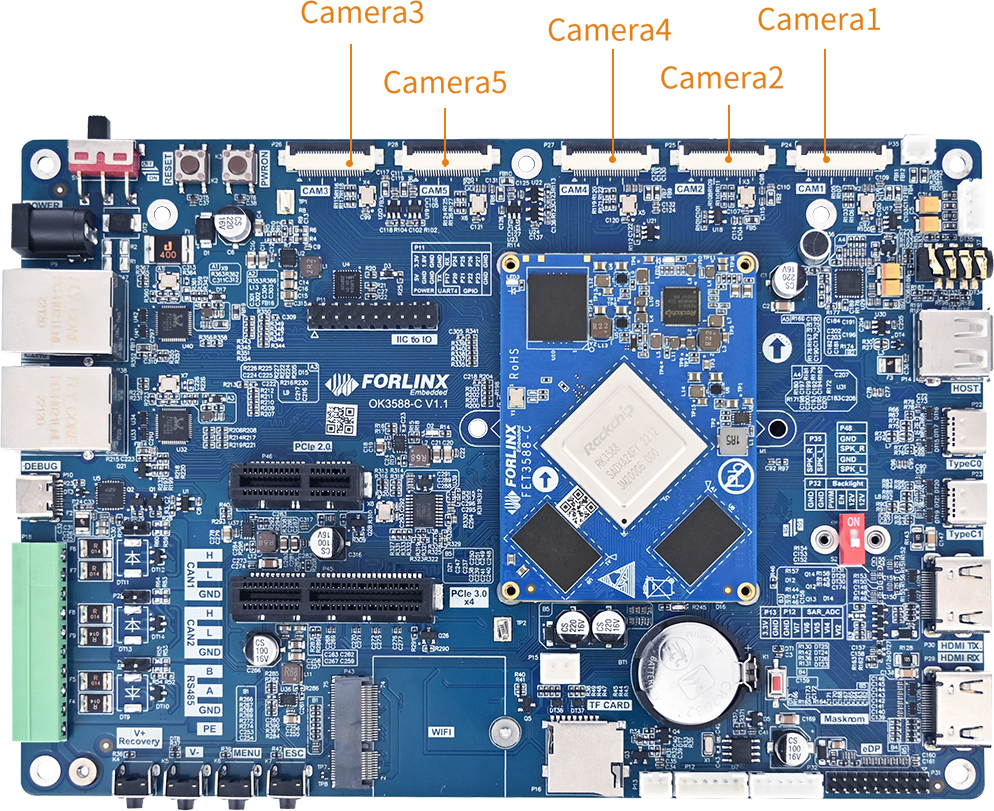

**⚠️Note: Due to a reduction in MIPI-CSI controllers in the RK3588S2 chip itself, the CAM1, CAM2, and CAM5 camera interfaces on the OK3588S2-C cannot be used.**

##### 2\. Device Tree

The device tree files related to cameras for OK3588-C / OK3588-C2 are:`arch/arm64/boot/dts/rockchip/OK3588-C-Camera.dtsi`.

Taking the CAM1 interface as an example.

```plain
//Physical layer interface
&mipi_dcphy0 {     
    status = "okay";
};
//Rockchip Image Signal Processor
&rkisp0 {     
    status = "okay";
};
//ISP Memory Management Unit
&isp0_mmu {     
    status = "okay";
};

&i2c3 {        
    status = "okay";
    clock-frequency = <400000>;
    // Camera sensor node for OV13855 on I2C bus
    cam1_ov13855: cam1-ov13855@36 {
        compatible = "ovti,ov13855";
        status = "okay";
        reg = <0x36>;
        clocks = <&ext_cam_clk>;
        clock-names = "xvclk";
	power-domains = <&power RK3588_PD_VI>;
        pwdn-gpios = <&extio EXTIO_GPIO_P01 GPIO_ACTIVE_HIGH>;
        reset-gpios = <&extio EXTIO_GPIO_P00 GPIO_ACTIVE_HIGH>;
	avdd-supply = <&vcc1_2v8>;
	dovdd-supply = <&vcc1v8_cam>;
	dvdd-supply = <&vcc1v2_c1>;
        rockchip,camera-module-index = <0>;
        rockchip,camera-module-facing = "back";
        rockchip,camera-module-name = "CMK-OT2016-FV1";
        rockchip,camera-module-lens-name = "default";
        lens-focus = <&cam1_dw9763>;
        // Data port for CSI connection
        port {    
            cam1_ov13855_out: endpoint {
            remote-endpoint = <&mipi_in_0_ucam1_ov13855>;
            data-lanes = <1 2 3 4>;
            };
        };
    };
};
```

The device tree file related to cameras for OK3588S2-C is:`arch/arm64/boot/dts/rockchip/OK3588S2-C-Camera.dtsi`.

##### 3\. Application

###### 3.1 UVC Camera Test

Here, the Logitech C270 is used for testing. Plug the USB camera into the development board, and the UVC driver will be automatically installed.

**3.1.1 Camera Detection and Format Support Query**

Camera detection:

```plain
root@OK3588-C-buildroot:~# v4l2-ctl --list-devices
UVC Camera (046d:0825) (usb-fc800000.usb-1):
        /dev/video74
        /dev/video75
        /dev/media7
```

Format support query:

```plain
root@OK3588-C-buildroot:~# v4l2-ctl --list-formats-ext -d /dev/video74
ioctl: VIDIOC_ENUM_FMT
        Type: Video Capture

        [0]: 'YUYV' (YUYV 4:2:2)
                Size: Discrete 640x480
                        Interval: Discrete 0.033s (30.000 fps)
                        Interval: Discrete 0.040s (25.000 fps)
                        Interval: Discrete 0.050s (20.000 fps)
                        Interval: Discrete 0.067s (15.000 fps)
                        Interval: Discrete 0.100s (10.000 fps)
                        Interval: Discrete 0.200s (5.000 fps)
                Size: Discrete 160x120
                        Interval: Discrete 0.033s (30.000 fps)
                        Interval: Discrete 0.040s (25.000 fps)
                        Interval: Discrete 0.050s (20.000 fps)
                        Interval: Discrete 0.067s (15.000 fps)
                        Interval: Discrete 0.100s (10.000 fps)
                        Interval: Discrete 0.200s (5.000 fps)
                Size: Discrete 176x144
                        Interval: Discrete 0.033s (30.000 fps)
                        Interval: Discrete 0.040s (25.000 fps)
                        Interval: Discrete 0.050s (20.000 fps)
                        Interval: Discrete 0.067s (15.000 fps)
                        Interval: Discrete 0.100s (10.000 fps)
                        Interval: Discrete 0.200s (5.000 fps)
                Size: Discrete 320x176
                        Interval: Discrete 0.033s (30.000 fps)
                        Interval: Discrete 0.040s (25.000 fps)
                        Interval: Discrete 0.050s (20.000 fps)
                        Interval: Discrete 0.067s (15.000 fps)
                        Interval: Discrete 0.100s (10.000 fps)
                        Interval: Discrete 0.200s (5.000 fps)
                Size: Discrete 320x240
                        Interval: Discrete 0.033s (30.000 fps)
                        Interval: Discrete 0.040s (25.000 fps)
                        Interval: Discrete 0.050s (20.000 fps)
                        Interval: Discrete 0.067s (15.000 fps)
                        Interval: Discrete 0.100s (10.000 fps)
                        Interval: Discrete 0.200s (5.000 fps)
                Size: Discrete 352x288
                        Interval: Discrete 0.033s (30.000 fps)
                        Interval: Discrete 0.040s (25.000 fps)
                        Interval: Discrete 0.050s (20.000 fps)
                        Interval: Discrete 0.067s (15.000 fps)
                        Interval: Discrete 0.100s (10.000 fps)
                        Interval: Discrete 0.200s (5.000 fps)
                Size: Discrete 432x240
                        Interval: Discrete 0.033s (30.000 fps)
                        Interval: Discrete 0.040s (25.000 fps)
                        Interval: Discrete 0.050s (20.000 fps)
                        Interval: Discrete 0.067s (15.000 fps)
                        Interval: Discrete 0.100s (10.000 fps)
                        Interval: Discrete 0.200s (5.000 fps)
                Size: Discrete 544x288
                        Interval: Discrete 0.033s (30.000 fps)
                        Interval: Discrete 0.040s (25.000 fps)
                        Interval: Discrete 0.050s (20.000 fps)
                        Interval: Discrete 0.067s (15.000 fps)
                        Interval: Discrete 0.100s (10.000 fps)
                        Interval: Discrete 0.200s (5.000 fps)
                Size: Discrete 640x360
                        Interval: Discrete 0.033s (30.000 fps)
                        Interval: Discrete 0.040s (25.000 fps)
                        Interval: Discrete 0.050s (20.000 fps)
                        Interval: Discrete 0.067s (15.000 fps)
                        Interval: Discrete 0.100s (10.000 fps)
                        Interval: Discrete 0.200s (5.000 fps)
                Size: Discrete 752x416
                        Interval: Discrete 0.040s (25.000 fps)
                        Interval: Discrete 0.050s (20.000 fps)
                        Interval: Discrete 0.067s (15.000 fps)
                        Interval: Discrete 0.100s (10.000 fps)
                        Interval: Discrete 0.200s (5.000 fps)
                Size: Discrete 800x448
                        Interval: Discrete 0.040s (25.000 fps)
                        Interval: Discrete 0.050s (20.000 fps)
                        Interval: Discrete 0.067s (15.000 fps)
                        Interval: Discrete 0.100s (10.000 fps)
                        Interval: Discrete 0.200s (5.000 fps)
                Size: Discrete 800x600
                        Interval: Discrete 0.050s (20.000 fps)
                        Interval: Discrete 0.067s (15.000 fps)
                        Interval: Discrete 0.100s (10.000 fps)
                        Interval: Discrete 0.200s (5.000 fps)
                Size: Discrete 864x480
                        Interval: Discrete 0.050s (20.000 fps)
                        Interval: Discrete 0.067s (15.000 fps)
                        Interval: Discrete 0.100s (10.000 fps)
                        Interval: Discrete 0.200s (5.000 fps)
                Size: Discrete 960x544
                        Interval: Discrete 0.067s (15.000 fps)
                        Interval: Discrete 0.100s (10.000 fps)
                        Interval: Discrete 0.200s (5.000 fps)
                Size: Discrete 960x720
                        Interval: Discrete 0.100s (10.000 fps)
                        Interval: Discrete 0.200s (5.000 fps)
                Size: Discrete 1024x576
                        Interval: Discrete 0.100s (10.000 fps)
                        Interval: Discrete 0.200s (5.000 fps)
                Size: Discrete 1184x656
                        Interval: Discrete 0.100s (10.000 fps)
                        Interval: Discrete 0.200s (5.000 fps)
                Size: Discrete 1280x720
                        Interval: Discrete 0.100s (10.000 fps)
                        Interval: Discrete 0.200s (5.000 fps)
                Size: Discrete 1280x960
                        Interval: Discrete 0.133s (7.500 fps)
                        Interval: Discrete 0.200s (5.000 fps)
        [1]: 'MJPG' (Motion-JPEG, compressed)
                Size: Discrete 640x480
                        Interval: Discrete 0.033s (30.000 fps)
                        Interval: Discrete 0.040s (25.000 fps)
                        Interval: Discrete 0.050s (20.000 fps)
                        Interval: Discrete 0.067s (15.000 fps)
                        Interval: Discrete 0.100s (10.000 fps)
                        Interval: Discrete 0.200s (5.000 fps)
                Size: Discrete 160x120
                        Interval: Discrete 0.033s (30.000 fps)
                        Interval: Discrete 0.040s (25.000 fps)
                        Interval: Discrete 0.050s (20.000 fps)
                        Interval: Discrete 0.067s (15.000 fps)
                        Interval: Discrete 0.100s (10.000 fps)
                        Interval: Discrete 0.200s (5.000 fps)
                Size: Discrete 176x144
                        Interval: Discrete 0.033s (30.000 fps)
                        Interval: Discrete 0.040s (25.000 fps)
                        Interval: Discrete 0.050s (20.000 fps)
                        Interval: Discrete 0.067s (15.000 fps)
                        Interval: Discrete 0.100s (10.000 fps)
                        Interval: Discrete 0.200s (5.000 fps)
                Size: Discrete 320x176
                        Interval: Discrete 0.033s (30.000 fps)
                        Interval: Discrete 0.040s (25.000 fps)
                        Interval: Discrete 0.050s (20.000 fps)
                        Interval: Discrete 0.067s (15.000 fps)
                        Interval: Discrete 0.100s (10.000 fps)
                        Interval: Discrete 0.200s (5.000 fps)
                Size: Discrete 320x240
                        Interval: Discrete 0.033s (30.000 fps)
                        Interval: Discrete 0.040s (25.000 fps)
                        Interval: Discrete 0.050s (20.000 fps)
                        Interval: Discrete 0.067s (15.000 fps)
                        Interval: Discrete 0.100s (10.000 fps)
                        Interval: Discrete 0.200s (5.000 fps)
                Size: Discrete 352x288
                        Interval: Discrete 0.033s (30.000 fps)
                        Interval: Discrete 0.040s (25.000 fps)
                        Interval: Discrete 0.050s (20.000 fps)
                        Interval: Discrete 0.067s (15.000 fps)
                        Interval: Discrete 0.100s (10.000 fps)
                        Interval: Discrete 0.200s (5.000 fps)
                Size: Discrete 432x240
                        Interval: Discrete 0.033s (30.000 fps)
                        Interval: Discrete 0.040s (25.000 fps)
                        Interval: Discrete 0.050s (20.000 fps)
                        Interval: Discrete 0.067s (15.000 fps)
                        Interval: Discrete 0.100s (10.000 fps)
                        Interval: Discrete 0.200s (5.000 fps)
                Size: Discrete 544x288
                        Interval: Discrete 0.033s (30.000 fps)
                        Interval: Discrete 0.040s (25.000 fps)
                        Interval: Discrete 0.050s (20.000 fps)
                        Interval: Discrete 0.067s (15.000 fps)
                        Interval: Discrete 0.100s (10.000 fps)
                        Interval: Discrete 0.200s (5.000 fps)
                Size: Discrete 640x360
                        Interval: Discrete 0.033s (30.000 fps)
                        Interval: Discrete 0.040s (25.000 fps)
                        Interval: Discrete 0.050s (20.000 fps)
                        Interval: Discrete 0.067s (15.000 fps)
                        Interval: Discrete 0.100s (10.000 fps)
                        Interval: Discrete 0.200s (5.000 fps)
                Size: Discrete 752x416
                        Interval: Discrete 0.033s (30.000 fps)
                        Interval: Discrete 0.040s (25.000 fps)
                        Interval: Discrete 0.050s (20.000 fps)
                        Interval: Discrete 0.067s (15.000 fps)
                        Interval: Discrete 0.100s (10.000 fps)
                        Interval: Discrete 0.200s (5.000 fps)
                Size: Discrete 800x448
                        Interval: Discrete 0.033s (30.000 fps)
                        Interval: Discrete 0.040s (25.000 fps)
                        Interval: Discrete 0.050s (20.000 fps)
                        Interval: Discrete 0.067s (15.000 fps)
                        Interval: Discrete 0.100s (10.000 fps)
                        Interval: Discrete 0.200s (5.000 fps)
                Size: Discrete 800x600
                        Interval: Discrete 0.033s (30.000 fps)
                        Interval: Discrete 0.040s (25.000 fps)
                        Interval: Discrete 0.050s (20.000 fps)
                        Interval: Discrete 0.067s (15.000 fps)
                        Interval: Discrete 0.100s (10.000 fps)
                        Interval: Discrete 0.200s (5.000 fps)
                Size: Discrete 864x480
                        Interval: Discrete 0.033s (30.000 fps)
                        Interval: Discrete 0.040s (25.000 fps)
                        Interval: Discrete 0.050s (20.000 fps)
                        Interval: Discrete 0.067s (15.000 fps)
                        Interval: Discrete 0.100s (10.000 fps)
                        Interval: Discrete 0.200s (5.000 fps)
                Size: Discrete 960x544
                        Interval: Discrete 0.033s (30.000 fps)
                        Interval: Discrete 0.040s (25.000 fps)
                        Interval: Discrete 0.050s (20.000 fps)
                        Interval: Discrete 0.067s (15.000 fps)
                        Interval: Discrete 0.100s (10.000 fps)
                        Interval: Discrete 0.200s (5.000 fps)
                Size: Discrete 960x720
                        Interval: Discrete 0.033s (30.000 fps)
                        Interval: Discrete 0.040s (25.000 fps)
                        Interval: Discrete 0.050s (20.000 fps)
                        Interval: Discrete 0.067s (15.000 fps)
                        Interval: Discrete 0.100s (10.000 fps)
                        Interval: Discrete 0.200s (5.000 fps)
                Size: Discrete 1024x576
                        Interval: Discrete 0.033s (30.000 fps)
                        Interval: Discrete 0.040s (25.000 fps)
                        Interval: Discrete 0.050s (20.000 fps)
                        Interval: Discrete 0.067s (15.000 fps)
                        Interval: Discrete 0.100s (10.000 fps)
                        Interval: Discrete 0.200s (5.000 fps)
                Size: Discrete 1184x656
                        Interval: Discrete 0.033s (30.000 fps)
                        Interval: Discrete 0.040s (25.000 fps)
                        Interval: Discrete 0.050s (20.000 fps)
                        Interval: Discrete 0.067s (15.000 fps)
                        Interval: Discrete 0.100s (10.000 fps)
                        Interval: Discrete 0.200s (5.000 fps)
                Size: Discrete 1280x720
                        Interval: Discrete 0.033s (30.000 fps)
                        Interval: Discrete 0.040s (25.000 fps)
                        Interval: Discrete 0.050s (20.000 fps)
                        Interval: Discrete 0.067s (15.000 fps)
                        Interval: Discrete 0.100s (10.000 fps)
                        Interval: Discrete 0.200s (5.000 fps)
                Size: Discrete 1280x960
                        Interval: Discrete 0.033s (30.000 fps)
                        Interval: Discrete 0.040s (25.000 fps)
                        Interval: Discrete 0.050s (20.000 fps)
                        Interval: Discrete 0.067s (15.000 fps)
                        Interval: Discrete 0.100s (10.000 fps)
                        Interval: Discrete 0.200s (5.000 fps)
```

**3.1.2 Camera Capture Format Query**

```plain
root@OK3588-C-buildroot:~# v4l2-ctl -V -d /dev/video74
Format Video Capture:
        Width/Height      : 640/480
        Pixel Format      : 'YUYV' (YUYV 4:2:2)
        Field             : None
        Bytes per Line    : 1280
        Size Image        : 614400
        Colorspace        : sRGB
        Transfer Function : Rec. 709
        YCbCr/HSV Encoding: ITU-R 601
        Quantization      : Default (maps to Limited Range)
        Flags             :
```

**3.1.3 Camera Preview and Photo Capture**

Camera image preview:

```plain
root@OK3588-C-buildroot:~# gst-launch-1.0  v4l2src device=/dev/video74 ! videoconvert ! video/x-raw,format=NV12,width=640,height=480  ! waylandsink
Setting pipeline to PAUSED ...
Pipeline is live and does not need PREROLL ...
Pipeline is PREROLLED ...
Setting pipeline to PLAYING ...
New clock: GstSystemClock
Redistribute latency...
0:00:10.2 / 99:99:99.
```

Taking a photo:

```plain
root@OK3588-C-buildroot:~# gst-launch-1.0 v4l2src device=/dev/video74 num-buffers=1 ! videoconvert ! video/x-raw,format=NV12,width=640,height=480 ! mppjpegenc ! filesink location=pic.jpg
Setting pipeline to PAUSED ...
Pipeline is live and does not need PREROLL ...
Pipeline is PREROLLED ...
Setting pipeline to PLAYING ...
New clock: GstSystemClock
Redistribute latency...
Got EOS from element "pipeline0".
Execution ended after 0:00:00.960573833
Setting pipeline to NULL ...
Freeing pipeline ...
```

This will generate pic.jpg in the current directory.

###### 3.2 OV13855 Test

For raw sensors like OV13855, each sensor corresponds to 5 device nodes (e.g., /dev/videoX):

```plain
root@OK3588-C-buildroot:~# grep "" /sys/class/video4linux/video*/name
/sys/class/video4linux/video0/name:stream_cif_mipi_id0
/sys/class/video4linux/video1/name:stream_cif_mipi_id1
/sys/class/video4linux/video10/name:rkcif_tools_id2
/sys/class/video4linux/video11/name:stream_cif_mipi_id0
/sys/class/video4linux/video12/name:stream_cif_mipi_id1
/sys/class/video4linux/video13/name:stream_cif_mipi_id2
/sys/class/video4linux/video14/name:stream_cif_mipi_id3
/sys/class/video4linux/video15/name:rkcif_scale_ch0
/sys/class/video4linux/video16/name:rkcif_scale_ch1
/sys/class/video4linux/video17/name:rkcif_scale_ch2
/sys/class/video4linux/video18/name:rkcif_scale_ch3
/sys/class/video4linux/video19/name:rkcif_tools_id0
/sys/class/video4linux/video2/name:stream_cif_mipi_id2
/sys/class/video4linux/video20/name:rkcif_tools_id1
/sys/class/video4linux/video21/name:rkcif_tools_id2
/sys/class/video4linux/video22/name:stream_cif_mipi_id0
/sys/class/video4linux/video23/name:stream_cif_mipi_id1
/sys/class/video4linux/video24/name:stream_cif_mipi_id2
/sys/class/video4linux/video25/name:stream_cif_mipi_id3
/sys/class/video4linux/video26/name:rkcif_scale_ch0
/sys/class/video4linux/video27/name:rkcif_scale_ch1
/sys/class/video4linux/video28/name:rkcif_scale_ch2
/sys/class/video4linux/video29/name:rkcif_scale_ch3
/sys/class/video4linux/video3/name:stream_cif_mipi_id3
/sys/class/video4linux/video30/name:rkcif_tools_id0

```

`Mainpath:`An output node of the Rockchip ISP, capable of outputting full-resolution images, typically used for capturing photos or raw images.

`Self Path:`An output node of the Rockchip ISP, limited to a maximum of 1080p resolution, typically used for preview.

`Statistics:` 3A statistics.

`Input-params`: 3A parameter settings.

The testing method for OV13855 is basically the same as for the UVC camera. This section uses the CAM1 interface as an example:

`CAM1：`platform:rkisp0-vir0

`CAM2：`platform:rkisp0-vir1

**3.2.1 Camera Detection and Format Support Query**

```plain
root@OK3588-C-buildroot:~# v4l2-ctl --list-devices
rkisp_mainpath (platform:rkisp0-vir0):
        /dev/video55
        /dev/video56
        /dev/video57
        /dev/video58
        /dev/video59
        /dev/video60
        /dev/video61
        /dev/media5

rkisp_mainpath (platform:rkisp1-vir0):
        /dev/video64
        /dev/video65
        /dev/video66
        /dev/video67
        /dev/video68
        /dev/video69
        /dev/video70
        /dev/media6
```

**3.2.2 Camera Photo Capture (Using Main Path)**

```plain
root@OK3588-C-buildroot:~# gst-launch-1.0 v4l2src device=/dev/video55 ! videoconvert ! video/x-raw,format=NV12,width=1920,height=1080 ! autovideosink sync=false
Setting pipeline to PAUSED ...
Using mplane plugin for capture
Pipeline is live and does not need PREROLL ...
Pipeline is PREROLLED ...
Setting pipeline to PLAYING ...
New clock: GstSystemClock
[   72.197431] rkisp_hw fdcb0000.rkisp: set isp clk = 500000000Hz
[   72.198999] rkcif-mipi-lvds: stream[0] start streaming
[   72.201894] rkcif-mipi-lvds: Allocate dummy buffer, size: 0x01944000
[   72.202051] rockchip-mipi-csi2 mipi0-csi2: stream on, src_sd: 000000004e50443f, sd_name:rockchip-csi2-dphy0
[   72.202061] rockchip-mipi-csi2 mipi0-csi2: stream ON
[   72.202088] rockchip-csi2-dphy0: dphy0, data_rate_mbps 1080
[   72.202449] rockchip-csi2-dphy csi2-dcphy0: csi2_dphy_s_stream stream on:1, dphy0, ret 0
[   72.202475] ov13855 3-0036: ov13855_s_stream: on: 1, 4224x3136@30
Redistribute latency...
0:00:06.7 / 99:99:99.
```

**3.2.3 Camera Photo Capture (Using Main Path)**

```plain
root@OK3588-C-buildroot:~# gst-launch-1.0 v4l2src device=/dev/video55 num-buffers=1 ! video/x-raw,format=NV12,width=640,height=480 ! mppjpegenc ! filesink location=pic.jpg
Setting pipeline to PAUSED ...
Using mplane plugin for capture
Pipeline is live and does not need PREROLL ...
Pipeline is PREROLLED ...
Setting pipeline to PLAYING ...
New clock: GstSystemClock
Redistribute latency...
Got EOS from element "pipeline0".
Execution ended after 0:00:00.271908779
Setting pipeline to NULL ...
Freeing pipeline ...
```

**3.2.4 Recording H.264 Video**

```plain
root@OK3588-C-buildroot:~# gst-launch-1.0 v4l2src device=/dev/video55 num-buffers=100 ! video/x-raw,format=NV12, width=640,height=480 ! tee name=t ! queue ! mpph264enc ! queue ! h264parse ! qtmux ! filesink location=13855_h264.mp4 t. ! queue ! waylandsink
Setting pipeline to PAUSED ...
Using mplane plugin for capture
Pipeline is live and does not need PREROLL ...
Pipeline is PREROLLED ...
Setting pipeline to PLAYING ...
New clock: GstSystemClock
Redistribute latency...
Redistribute latency...
Redistribute latency...
Got EOS from element "pipeline0".
Execution ended after 0:00:06.892603226
Setting pipeline to NULL ...
Freeing pipeline ...
```

This will generate 13855\_h264.mp4 in the current directory.

Playback 13855\_h264.mp4:

```plain
root@OK3588-C-buildroot:~# gst-launch-1.0 filesrc location=13855_h264.mp4 ! qtdemux ! queue ! h264parse ! mppvideodec ! waylandsink
Setting pipeline to PAUSED ...
Pipeline is PREROLLING ...
Redistribute latency...
Redistribute latency...
mpp[1834]: h264d_api: is_avcC=1
Pipeline is PREROLLED ...
Prerolled, waiting for async message to finish...
Setting pipeline to PLAYING ...
Redistribute latency...
New clock: GstSystemClock
^Chandling interrupt. (37.6 %)
Interrupt: Stopping pipeline ...
Execution ended after 0:00:02.530370525
Setting pipeline to NULL ...
Freeing pipeline ...
```

###### 3.3 OV5645 Test

Node corresponding to the camera

Camera corresponding nodes

`CAM3 ：`rkcif-mipi-lvds2

`CAM4 ：`rkcif-mipi-lvds4

`CAM5 ：`rkcif-mipi-lvds5

Take testing CAM3 as an example:

**3.3.1 Camera Identification and Detection**

```plain
root@OK3588-C-buildroot:~# v4l2-ctl --list-devices
rkisp-statistics (platform: rkisp):
        /dev/video62
        /dev/video63
        /dev/video71
        /dev/video72

rkcif (platform:rkcif-mipi-lvds):
        /dev/video0
        /dev/video1
        /dev/video2
        /dev/video3
        /dev/video4
        /dev/video5
        /dev/video6
        /dev/video7
        /dev/video8
        /dev/video9
        /dev/video10
        /dev/media0

rkcif-mipi-lvds1 (platform:rkcif-mipi-lvds1):
        /dev/media1

rkcif (platform:rkcif-mipi-lvds2):
        /dev/video22
        /dev/video23
        /dev/video24
        /dev/video25
        /dev/video26
        /dev/video27
        /dev/video28
        /dev/video29
        /dev/video30
        /dev/video31
        /dev/video32
        /dev/media2

rkcif (platform:rkcif-mipi-lvds4):
        /dev/video33
        /dev/video34
        /dev/video35
        /dev/video36
        /dev/video37
        /dev/video38
        /dev/video39
        /dev/video40
        /dev/video41
        /dev/video42
        /dev/video43
        /dev/media3

rkcif (platform:rkcif-mipi-lvds5):
        /dev/video44
        /dev/video45
        /dev/video46
        /dev/video47
        /dev/video48
        /dev/video49
        /dev/video50
        /dev/video51
        /dev/video52
        /dev/video53
        /dev/video54
        /dev/media4
```

**3.3.2 Supported Formats**

```plain
root@OK3588-C-buildroot:~# v4l2-ctl --list-formats-ext -d /dev/video22
ioctl: VIDIOC_ENUM_FMT
        Type: Video Capture Multiplanar

        [0]: 'NV16' (Y/UV 4:2:2)
                Size: Stepwise 64x64 - 1920x1080 with step 8/8
        [1]: 'NV61' (Y/VU 4:2:2)
                Size: Stepwise 64x64 - 1920x1080 with step 8/8
        [2]: 'NV12' (Y/UV 4:2:0)
                Size: Stepwise 64x64 - 1920x1080 with step 8/8
        [3]: 'NV21' (Y/VU 4:2:0)
                Size: Stepwise 64x64 - 1920x1080 with step 8/8
        [4]: 'YUYV' (YUYV 4:2:2)
                Size: Stepwise 64x64 - 1920x1080 with step 8/8
        [5]: 'YVYU' (YVYU 4:2:2)
                Size: Stepwise 64x64 - 1920x1080 with step 8/8
        [6]: 'UYVY' (UYVY 4:2:2)
                Size: Stepwise 64x64 - 1920x1080 with step 8/8
        [7]: 'VYUY' (VYUY 4:2:2)
                Size: Stepwise 64x64 - 1920x1080 with step 8/8
```

**3.3.3 Camera Preview**

```plain
root@OK3588-C-buildroot:~# gst-launch-1.0 v4l2src device=/dev/video22 ! video/x-raw, format=NV12, width=1920,height=1080, framerate=30/1 ! waylandsink
Setting pipeline to PAUSED ...
Using mplane plugin for capture
Pipeline is live and does not need PREROLL ...
Pipeline is PREROLLED ...
Setting pipeline to PLAYING ...
New clock: GstSystemClock
Redistribute latency...
0:00:03.4 / 99:99:99.
```

###### 3.4 HDMI IN Test

**3.4.1 HDMIIN Supported Format Queries**

Camera Recognition Detection

```plain
root@ok3588-buildroot:/# v4l2-ctl --list-devices    // It can be seen that /dev/video73 is the HDMI IN node.
rk_hdmirx (fdee0000.hdmirx-controller):
        /dev/video73

rkisp-statistics (platform: rkisp):
        /dev/video62
        /dev/video63
        /dev/video71
        /dev/video72

rkcif-mipi-lvds (platform:rkcif):
        /dev/media0
        /dev/media1
        /dev/media2
        /dev/media3
        /dev/media4
```

Format Support Queries

```plain
root@ok3588-buildroot:/# v4l2-ctl --list-formats-ext -d /dev/video73//View HDMI RX Supported Formats
ioctl: VIDIOC_ENUM_FMT
        Type: Video Capture Multiplanar

        [0]: 'BGR3' (24-bit BGR 8-8-8)
        [1]: 'NV24' (Y/CbCr 4:4:4)
        [2]: 'NV16' (Y/CbCr 4:2:2)
        [3]: 'NV12' (Y/CbCr 4:2:0)
```

**3.4.2 Camera Capture Format Queries and Modifications**

Camera Capture Format Queries

```plain
root@ok3588-buildroot:/# v4l2-ctl -V -d /dev/video73
Format Video Capture Multiplanar:
        Width/Height      : 1920/1080
        Pixel Format      : 'BGR3' (24-bit BGR 8-8-8)
        Field             : None
        Number of planes  : 1
        Flags             : premultiplied-alpha, set-csc, 0x000000fc
        Colorspace        : sRGB
        Transfer Function : Default
        YCbCr/HSV Encoding: Unknown (0x000000ff)
        Quantization      : Limited Range
        Plane 0           :
           Bytes per Line : 5760
           Size Image     : 6220800
```

**3.4.3 Camera Image Preview**

```plain
root@ok3588-buildroot:/# gst-launch-1.0  v4l2src device=/dev/video73 ! videoconvert ! kmssink
Setting pipeline to PAUSED ...
Using mplane plugin for capture
Pipeline is live and does not need PREROLL ...
Pipeline is PREROLLED ...
Setting pipeline to PLAYING ...
New clock: GstSystemClock
Redistribute latency...
0:00:22.1 / 99:99:99.
```

**⚠️Note: Please do not use the waylandsink display in the current version. And using gst-launch-1.0 encoding may have delay.**

#### Display

##### 1\. Introduction

The OK3588-C is based on the VOP2 (Video Output Processor 2.0) unified display architecture of the RK3588, supporting various display interfaces such as HDMI, eDP, MIPI DSI, and DP. It can drive up to four independent display outputs simultaneously.

###### 1.1 Overview of Display Interfaces

The RK3588 VOP2 internally contains 4 Video Ports (VPs), each capable of independently driving one display output:

| **Video Port** | Maximum Resolution | Connectable Display                                          |
| :------------- | :----------------- | :----------------------------------------------------------- |
| VP0            | 7680×4320@60Hz     | HDMI0, eDP0, DP0, DP1, MIPI DSI0, MIPI DSI1                  |
| VP1            | 4096×4320@60Hz     | HDMI0, HDMI1, eDP0, eDP1, DP0, DP1, MIPI DSI0, MIPI DSI1     |
| VP2            | 4096×2160@60Hz     | HDMI0, HDMI1, eDP0, eDP1, DP0, DP1, MIPI DSI0, MIPI DSI1, RGB |
| VP3            | 2048×1080@60Hz     | MIPI DSI0, MIPI DSI1, RGB                                    |

**⚠️Note: The RK3588 HDMI and DP interfaces support 8K output, but in 8K mode, they require the simultaneous occupation of both VP0 and VP1. If a product needs to support 8K display, do not connect other display interfaces to VP1.**

**The connection relationship betweenRK3588 VP and the various display interfaces is as follows:**

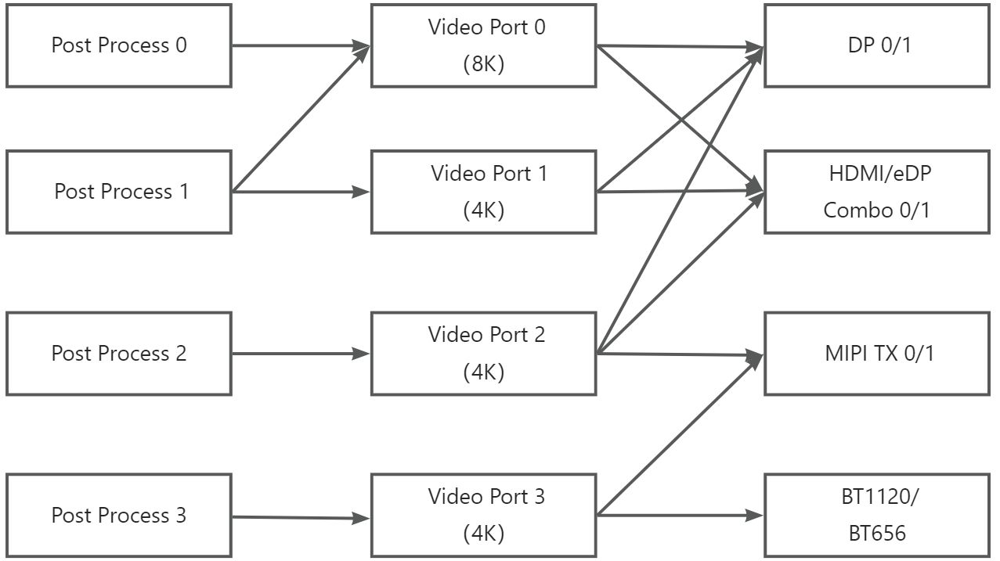

###### 1.2 Specifications of Each Display Interface

The maximum output resolution and protocol standards for each RK3588 display interface are as follows:

| Display Interface | Maximum Output Resolution | Protocol Standard                                            |
| ----------------- | ------------------------- | ------------------------------------------------------------ |
| HDMI              | 7680×4320@60Hz            | Dual HDMI, supporting HDMI 2.1 protocol standard             |
| DP                | 7680×4320@30Hz            | Dual DP, supporting DP 1.4 protocol standard                 |
| eDP               | 3840×2160@60Hz            | Dual DP, supporting DP 1.2a and eDP 1.3 protocol standard    |
| MIPI DSI          | 3840×2160@60Hz            | Dual MIPI, supporting DSI v1.1, DCS v1.1, DPHY v2.0, CPHY v1.1 |
| RGB               | 1920×1080@60Hz            | Supports BT.656 / BT.1120                                    |

###### 1.3 OK3588-C Interface Location

The HDMI and eDP interfaces are located on the front side of the board.
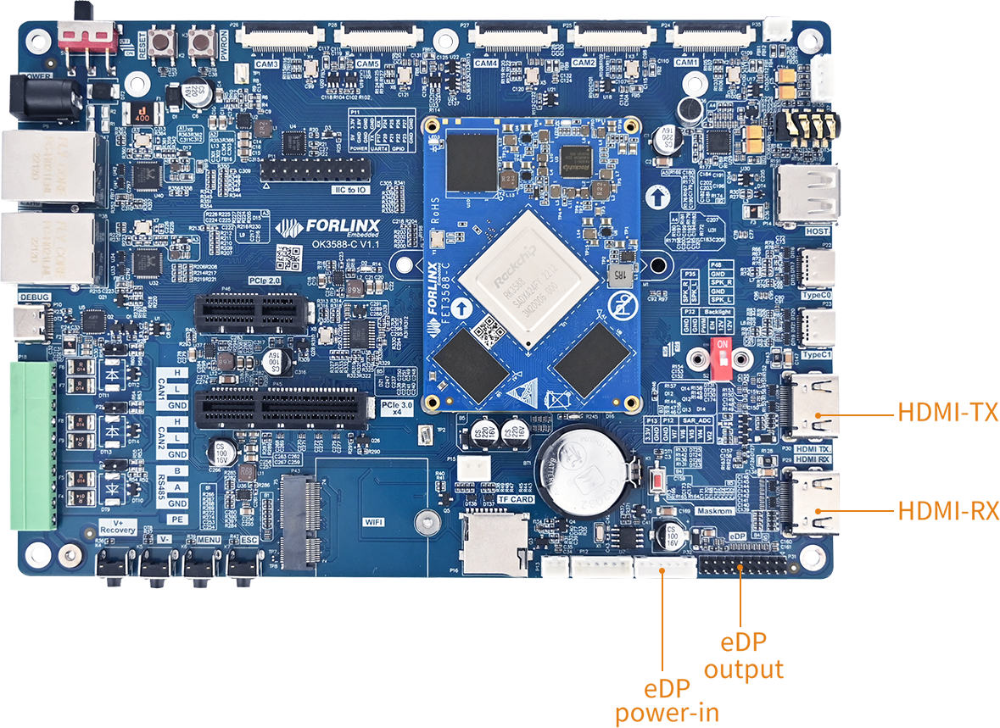

The MIPI DSI0 and MIPI DSI1 interfaces are located on the back side of the board.


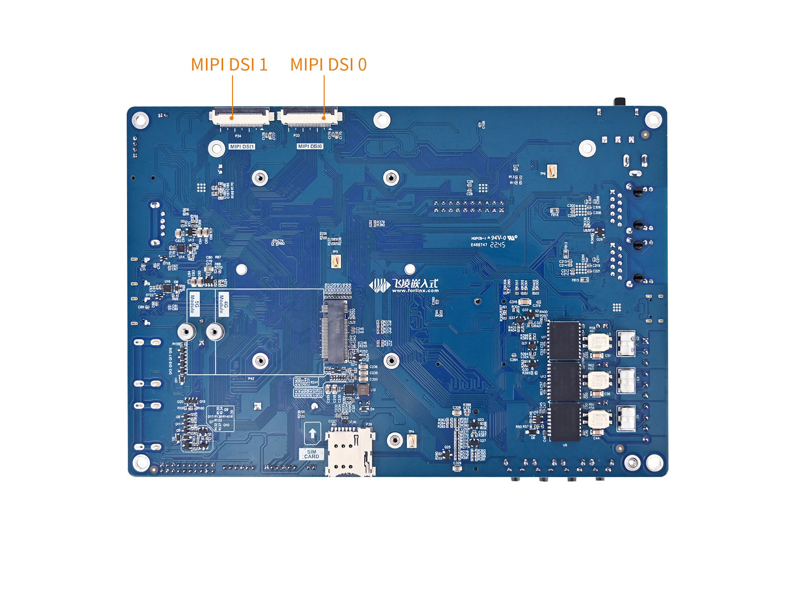

###### 1.4 RK3588S2 Differences

Compared to the RK3588, the RK3588S2 has trimmed/cut down the following display interfaces:

| **Interface** | **RK3588（OK3588-C）** | **RK3588S2（OK3588S2-C）** |
| :------------ | :--------------------- | :------------------------- |
| HDMI0         | ✅ Available            | ✅ Available                |
| HDMI1         | ✅ Available            | ❌ Not Available            |
| eDP0          | ✅ Available            | ❌ Not Available            |
| eDP1          | ✅ Available            | ❌ Not Available            |
| DP0           | ✅ Available            | ✅ Available                |
| DP1           | ✅ Available            | ❌ Not Available            |
| MIPI DSI0     | ✅ Available            | ✅ Available                |
| MIPI DSI1     | ✅ Available            | ✅ Available                |

For detailed information about RK3588 display interfaces, please refer to the following documentation:

`OK-linux-source/docs/rk3588/en/Common/DISPLAY/DRM/Rockchip_Developer_Guide_DRM_Display_Driver_EN.pdf`

##### 2. Device Tree

The display-related Device Tree nodes for OK3588-C/3588-C2 are located at:`arch/arm64/boot/dts/rockchip/OK3588-C-common.dtsi`.

The display-related Device Tree nodes for OK3588S2-C are located at:`arch/arm64/boot/dts/rockchip/OK3588S2-C-common.dtsi`.

###### 2.1 Forlinx-control Display Configuration Node

Since OK3588 supports multiple display modes, the screen configuration can be specified via the Device Tree:

```plain
	forlinx-control {
		/***
		* hdmi0 and edp0 share same port, only one can be used.
		* hdmi1 and edp1 share same port, only one can be used.
		* only four VPs internally, so up to four interfaces can be activated
		* hdmi edp dp can only be displayed on VP0 or VP1 or VP2.
		* dsi0 dsi1 can only be displayed on VP2 or  VP3.
		* rgb can only be displayed on VP3.
		* 
		***/

		/*** if "disabled" , display is controlled by uboot ***/
		status = "disabled"; 

		HDMI0 	= "VP0";
//		HDMI1 	= "OFF";
//		EDP0 	= "OFF";
//		EDP1 	= "VP1";
//		DP0 	= "OFF";
//		DP1 	= "OFF";
		MIPI0 	= "VP2";
//		MIPI1 	= "VP3";
//		RGB 	= "OFF";
		primary_display = "MIPI0";
		primary_display_resolution = "1920x1080p60";
		disp_type = "sync";
	};

```

The forlinx-control node is disabled by default (`status = "disabled"`). In this state, display configuration is controlled by U-Boot. To fix the display configuration at the kernel stage, change the `status` to `"okay"`.

Description

| **Parameter**                | **Description**                                              |
| :--------------------------- | :----------------------------------------------------------- |
| `status`                     | Node status:`"disabled"`"disabled" indicates U-Boot control,`"okay"`indicates kernel control. |
| `HDMI0`~ `DP1`               | Specifies the VP (Video Port) bound to each display interface. Setting to `"OFF"`turns off the interface. |
| `MIPI0`/ `MIPI1`             | Specifies the VP to which MIPI DSI0/DSI1 is bound.           |
| `RGB`                        | Specifies the VP to which the RGB interface is bound         |
| `primary_display`            | Main display interface, on which the startup logo and desktop are displayed by default |
| `primary_display_resolution` | Resolution of the main display interface                     |
| `disp_type`                  | Display Type:`"sync"` For the same display,`"async"`for the different display |

The configuration parameters can be modified according to the actual requirements, and the image shall be generated by recompiling after saving.

**⚠️Notes :**

+ **hdmi0 and edp0 share the same port. They are mutually exclusive and cannot be used at the same time.**
+ **hdmi1 and edp1 share the same port. They are mutually exclusive and cannot be used at the same time.**
+ **The chip only contains four VPs (Video Processors), so up to four display interfaces can be activated at the same time.**
+ **HDMI, EDP, DP can only be bound to VP0, VP1 or VP2 outputs.**
+ **dsi0, dsi1 can only be bound to VP2 or VP3 output.**
+ **RGB can only be bound to VP3 output.**

According to the hardware constraints of the above display interfaces, the optional parameters of each interface are configured as follows:

+ The optional parameter range of HDMI0/1, EDP0/1 and DP0/1 is:`"VP0"`,`"VP1"`,`"VP2"`,`"OFF"`;
+ The optional parameter range of DP0/1 is:`"VP2"`,`"VP3"`;
+ The optional parameter value range of RGB is:`"VP3"`;
+ `primary_display` Parameters shall be configured according to the display interface corresponding to the actually allocated VP;
+ `disp_type` Optional parameters include: simultaneous display `"sync"` and different display `"async"`.

**⚠️Note: When modifying the device tree, strictly follow the constraints in the device tree comments to avoid resource conflicts. The driver layer will not verify the compliance of the `forlinx-control` node configuration. If the configuration is improper, the display will be abnormal. For the display interface whose parameter is set to  `"OFF"`, it is recommended to shield or delete the node, or keep the node, which will not affect the system operation. The four VPs do not all need to be enabled and can be configured according to the actual display interface requirements.**

###### 2.2 VOP Node Configuration

The VOP configuration in the OK3588-C device tree is as follows:

```plain
&vop {
	status = "okay";
	vop-supply = <&vdd_log_s0>;
	assigned-clocks = <&cru ACLK_VOP>;
	assigned-clock-rates = <800000000>;
	rockchip,aclk-normal-mode-rates = <500000000>;
	rockchip,aclk-advanced-mode-rates = <800000000>;
};
```

| **Features**               | **Value**    | **Description**                                   |
| :------------------------- | :----------- | :------------------------------------------------ |
| `vop-supply`               | `vdd_log_s0` | VOP Power Domain                                  |
| `ACLK_VOP`                 | 800 MHz      | VOP AXI bus clock                                 |
| `aclk-normal-mode-rates`   | 500 MHz      | ACLK frequency in normal display mode             |
| `aclk-advanced-mode-rates` | 800 MHz      | ACLK frequency in advanced display mode (e.g. 8K) |

###### 2.3 Layer Assignment

Each VP has a fixed layer (Plane) bound to it for compositing the display:

```plain
/* vp0 & vp1 splice for 8K output */
&vp0 {
	rockchip,plane-mask = <(1 << ROCKCHIP_VOP2_CLUSTER0 | 1 << ROCKCHIP_VOP2_ESMART0)>;
	rockchip,primary-plane = <ROCKCHIP_VOP2_ESMART0>;
};

&vp1 {
	rockchip,plane-mask = <(1 << ROCKCHIP_VOP2_CLUSTER1 | 1 << ROCKCHIP_VOP2_ESMART1)>;
	rockchip,primary-plane = <ROCKCHIP_VOP2_ESMART1>;
};

&vp2 {
	rockchip,plane-mask = <(1 << ROCKCHIP_VOP2_CLUSTER2 | 1 << ROCKCHIP_VOP2_ESMART2)>;
	rockchip,primary-plane = <ROCKCHIP_VOP2_ESMART2>;
};

&vp3 {
	rockchip,plane-mask = <(1 << ROCKCHIP_VOP2_CLUSTER3 | 1 << ROCKCHIP_VOP2_ESMART3)>;
	rockchip,primary-plane = <ROCKCHIP_VOP2_ESMART3>;
};
```

RK3588 VOP2 has 8 layers divided into two categories:

| **Layer Type** | **Layer Name**      | **Features**                                                |
| :------------- | :------------------ | :---------------------------------------------------------- |
| Cluster        | Cluster0 ~ Cluster3 | Support AFBC compression format, suitable for video overlay |
| Esmart         | Esmart0 ~ Esmart3   | Support zooming, suitable for UI display                    |

##### 3\. Application

The factory firmware supports dynamic control of screen output via a menu in U-Boot,eliminating the need for recompilation and reflashing to switch screens. During U-Boot automatic startup, pressing`ctrl+c`on the serial terminal will trigger a control menu:

```plain
Hit key to stop autoboot('CTRL+C'):  0
---------------------------------------------
0:Exit to console
1:Reboot
2:Display type
3:Change kernel loglevel( level 1 )
4:Enable PCIE3 function(State on)
---------------------------------------------
```

Entering 2 in the terminal, you can access the Screen Control submenu.

```plain
---------------------------------------------
hdmi0 and edp0 share same port, only one can be used.
hdmi1 and edp1 share same port, only one can be used.
only four VPs internally, so up to four interfaces can be activated
hdmi edp dp can only be displayed on VP0 or VP1 or VP2.
dsi0 dsi1 can only be displayed on VP2 or  VP3.
rgb can only be displayed on VP3.

Select  display
  0:Exit
  1: hdmi0 => VP0
  2: hdmi1 =>
  3: edp0  =>
  4: edp1  =>
  5: dp0   =>
  6: dp1   => VP1
  7: mipi0 => VP2
  8: mipi1 => VP3
  9: rgb   =>
  a: primary display  => MIPI0
  b: primary display resolution => 1920x1080p60
  c: display type => sync
---------------------------------------------
```

According to the notes in the U-Boot menu, the display output configuration rules are as follows:

```plain
1.  HDMI0 and eDP0 share the same port, so only one of them can be used at a time.
2.  HDMI1 and eDP1 share the same port, so only one of them can be used at a time.
3.  There are only four internal VPs, so a maximum of four interfaces can be activated.
4.  HDMI, eDP, and DP can only be displayed on VP0, VP1, or VP2.
5.  DSI0 and DSI1 can only be displayed on VP2 or VP3.
6.  RGB can only be displayed on VP3.
```

To configure display output, enter the number corresponding to the desired display interface. The system will allocate a Video Port to that interface. Repeatedly entering the same number will sequentially toggle the available VP for that interface or deallocate the currently assigned VP.

After completing the configuration, you can either:

Press the number 1 to perform a reboot—the screen settings configured during the U-Boot stage will take effect afterrestarting.

Or, simply press the reset button on the development board—the configuration will similarly be applied once the system restarts.

#### Encoding and Decoding

Some application layer software for audio and video on the OK3588 platform uses Gstreamer, which supports hardware codecs. All examples in this section based on the GStreamer command line form.

The OK3588 platform has an internal video processing unit, the VPU, which supports hardware codecs for video in the following formats:

Video Decoding: H264, H265, VP8, VP9, etc., maximum support 8K@60fps

Video Encoding: H264, H.265, maximum support 8k@30fps

Table of hardware codec parameters for the OK3588 platform:

| **Video Decoder** | **Format** | **Profile**       | **Resolution** | **Frame rate** |
| ----------------- | ---------- | ----------------- | -------------- | -------------- |
|                   | H.265      | main 10           | 7680x4320      | 60 fps         |
|                   | H.264      | main 10           | 7680x4320      | 30 fps         |
|                   | VP9        | Profile 0/2       | 7680x4320      | 60 fps         |
|                   | VP8        | version2          | 1920x1080      | 60 fps         |
|                   | VC1        |                   | 1920x1080      | 60 fps         |
|                   | MPEG-2     |                   | 1920x1080      | 60 fps         |
|                   | MPEG-1     |                   | 1920x1080      | 60 fps         |
|                   | H.263      |                   | 720x576        | 60 fps         |
| Video Encoder     | H.264      | BP/MP/HP@level4.2 | 7680x4320      | 30 fps         |
|                   | H.265      | MP@level4.1       | 7680x4320      | 30 fps         |

##### 1. Audio and Video Playback

###### 1.1.1 Playing Audio and Video With Gst-play

Gplay is an audio/video player based on GStreamer that can automatically select the right plugin for audio/video play according to the hardware, and it is easy to run.

```plain
root@OK3588-C-buildroot:~# gst-play-1.0 /userdata/media/1080p_60fps_h265-30S.mp4
```

###### 1.1.2 Playing Video With Gst-launch

```plain
root@OK3588-C-buildroot:~# gst-launch-1.0 filesrc location= /userdata/media/1080p_60fps_h265-30S.mp4 ! qtdemux ! queue ! h265parse ! mppvideodec ! waylandsink
```

###### 1.1.3 Playing Audio With Gst-launch

```plain
root@OK3588-C-buildroot:~# gst-launch-1.0 filesrc location=/userdata/piano2-CoolEdit.mp3 ! id3demux ! mpegaudioparse ! mpg123audiodec ! alsasink device=plughw:1,0
```

###### 1.1.4 Playing Video and Audio With Gst-launch

```plain
root@OK3588-C-buildroot:~# gst-launch-1.0 filesrc location= /userdata/media/1080p_60fps_h265-30S.mp4 ! qtdemux name=dec dec. ! queue ! h265parse ! mppvideodec ! waylandsink dec. ! queue ! decodebin ! alsasink device=plughw:1,0
```

##### 2. Video Hardware Encoding

OK3588 supports up to 8K@60fps/H.265 and 8K@60fps/H.264 video encoding.

###### 2.2.1 Video Hardware Encoding H.264

```plain
root@OK3588-buildroot:~# gst-launch-1.0 videotestsrc num-buffers=600 ! video/x-raw,framerate=30/1,width=7680,height=4320 ! mpph264enc ! h264parse ! mp4mux ! filesink location=test.mp4
```

###### 2.2.2 Video Hardware Encoding H.265

```plain
root@OK3588-buildroot:~# gst-launch-1.0 videotestsrc num-buffers=600 ! video/x-raw,framerate=30/1,width=7680,height=4320 ! mpph265enc ! h265parse ! mp4mux ! filesink location=test.mp4
```

###### 2.2.3 JPEG Hardware Encoding

```plain
root@OK3588-buildroot:~# gst-launch-1.0 videotestsrc num-buffers=1 ! video/x-raw,framerate=1/1,width=7680,height=4320 ! mppjpegenc ! jpegparse ! queue ! filesink location=test.jpeg
```

##### 3. Video Hardware Decoding

OK3588 supports hardware decoding for H.264, H.265, VP8, and VP9 video formats. The H.264 decoder supports 8K@30fps, while the H.265 decoder supports 8K@60fps.

OK3588 uses the mppvideodec component for hardware video decoding, and its output formats are NV12, I420, and YV12.

###### 3.3.1 Decoding and Playing H.264 Format Video

```plain
root@OK3588-C-buildroot:~# gst-launch-1.0 filesrc location=/userdata/media/4k_60fps_h264-30S.mp4 ! qtdemux ! h264parse ! mppvideodec ! waylandsink
```

###### 3.3.2 Decoding and Playing H264 Format Video With Audio

```plain
root@OK3588-C-buildroot:~# gst-launch-1.0 filesrc location=/userdata/media/4k_60fps_h264-30S.mp4 ! qtdemux name=demux demux.video_0 ! queue ! h264parse ! mppvideodec ! waylandsink demux.audio_0 ! queue ! aacparse ! faad ! alsasink
```

###### 3.3.3 Decoding and Playing H265 Format Video

```plain
root@OK3588-C-buildroot:~# gst-launch-1.0 filesrc location=/userdata/media/4k_60fps_h265-30S.mp4 ! qtdemux ! h265parse ! mppvideodec ! waylandsink
```

###### 3.3.4 Decoding and Playing H265 Format Video With Audio

```plain
root@OK3588-C-buildroot:~# gst-launch-1.0 filesrc location=/userdata/media/4k_60fps_h265-30S.mp4 ! qtdemux name=demux demux.video_0 ! queue ! h265parse ! mppvideodec ! waylandsink demux.audio_0 ! queue ! aacparse ! faad ! alsasink
```

###### 3.3.5 Decoding and Playing VP9 Format Video

```plain
root@OK3588-C-buildroot:~# gst-launch-1.0 filesrc location=/userdata/media/1080p_60fps_vp9-30S.mp4 ! qtdemux ! vp9parse ! mppvideodec ! waylandsink
```

###### 3.3.6 Decoding and Playing VP9 Format Video With Audio

```plain
root@OK3588-C-buildroot:~# gst-launch-1.0 filesrc location=/userdata/media/1080p_60fps_vp9-30S.mp4 ! qtdemux name=demux demux.video_0 ! queue ! vp9parse ! mppvideodec ! waylandsink demux.audio_0 ! queue ! aacparse ! faad ! alsasink device=plughw:1,0
```

###### 3.3.7 Decoding and Playing VP8 Format Video

```plain
root@OK3588-C-buildroot:~# gst-launch-1.0 filesrc location=/userdata/media/1080p_30fps_vp8.mp4 ! matroskademux ! queue ! mppvideodec ! waylandsink
```

###### 3.3.8 Decoding and Playing VP8 Format Video With Audio

```plain
root@OK3588-C-buildroot:~# gst-launch-1.0 filesrc location=/userdata/media/1080p_30fps_vp8.mp4 typefind=true ! video/webm ! matroskademux name=dec dec. ! queue ! mppvideodec ! waylandsink dec. ! queue ! decodebin ! audioconvert ! audioresample ! alsasink device=plughw:1,0
```

### Machine Learning

#### 1\. Introduction

An NPU (Neural Processing Unit) is a hardware accelerator specifically designed for neural network computing tasks. It aims to improve the operational efficiency and speed of artificial intelligence (AI) tasks. Compared to CPUs and GPUs, the NPU demonstrates higher energy efficiency when processing AI tasks, enabling it to complete the same scale of computation at lower power consumption.

The OK3588-C integrates a low-power, high-performance NPU, which possesses hardware-level neural network inference acceleration capabilities and can efficiently run AI algorithms. It is well-suited for AIoT scenarios such as intelligent security, industrial vision, and robotics, making it an optimal solution for edge-side AI deployment. 

Main features:

- 6 TOPS NPU, empowering various AI scenarios;

- Triple-core architecture design;


- Int4/int8/int16/FP16/BF16/TF32 data formats.


The NPU (Neural Processing Unit) is a chip module specifically designed for executing AI inference tasks. Unlike general-purpose CPUs, NPUs excel at massive parallel matrix multiplication operations—precisely the core computation of neural networks.

The OK3588 features an extremely powerful NPU module, supporting up to 6 TOPS of computational power. This enables the OK3588 to locally run relatively complex AI models in real-time without relying on cloud resources.

#### 2\. Device Tree

The device tree nodes related to the NPU are located at:`arch/arm64/boot/dts/rockchip/rk3588s.dtsi`

```plain
        rknpu: npu@fdab0000 {
                compatible = "rockchip,rk3588-rknpu";
                reg = <0x0 0xfdab0000 0x0 0x10000>,
                      <0x0 0xfdac0000 0x0 0x10000>,
                      <0x0 0xfdad0000 0x0 0x10000>;
                interrupts = <GIC_SPI 110 IRQ_TYPE_LEVEL_HIGH>,
                             <GIC_SPI 111 IRQ_TYPE_LEVEL_HIGH>,
                             <GIC_SPI 112 IRQ_TYPE_LEVEL_HIGH>;
                interrupt-names = "npu0_irq", "npu1_irq", "npu2_irq";
                clocks = <&scmi_clk SCMI_CLK_NPU>, <&cru ACLK_NPU0>,
                         <&cru ACLK_NPU1>, <&cru ACLK_NPU2>,
                         <&cru HCLK_NPU0>, <&cru HCLK_NPU1>,
                         <&cru HCLK_NPU2>, <&cru PCLK_NPU_ROOT>;
                clock-names = "clk_npu", "aclk0",
                              "aclk1", "aclk2",
                              "hclk0", "hclk1",
                              "hclk2", "pclk";
                assigned-clocks = <&scmi_clk SCMI_CLK_NPU>;
                assigned-clock-rates = <200000000>;
                resets = <&cru SRST_A_RKNN0>, <&cru SRST_A_RKNN1>, <&cru SRST_A_RKNN2>,
                         <&cru SRST_H_RKNN0>, <&cru SRST_H_RKNN1>, <&cru SRST_H_RKNN2>;
                reset-names = "srst_a0", "srst_a1", "srst_a2",
                              "srst_h0", "srst_h1", "srst_h2";
                power-domains = <&power RK3588_PD_NPUTOP>,
                                <&power RK3588_PD_NPU1>,
                                <&power RK3588_PD_NPU2>;
                power-domain-names = "npu0", "npu1", "npu2";
                operating-points-v2 = <&npu_opp_table>;
                iommus = <&rknpu_mmu>;
                status = "disabled";
        };

```

The control node for the NPU provided by Forlinx is located at:`arch/arm64/boot/dts/rockchip/OK3588-C-common.dtsi`

It is recommended to modify the NPU settings within this node if changes are required.。

```plain
&rknpu {
        rknpu-supply = <&vdd_npu_s0>;
        mem-supply = <&vdd_npu_mem_s0>;
        status = "okay";
};
```

#### 3\. Application

To utilize the NPU, besides requiring kernel support, application-layer calls must go through the library files provided by Rockchip. This content is located in the`SDK/external/rknpu2/`and is represented as `/usr/lib/librknnrt.so`in the integrated file system.

Since NPU access is implemented by calling library files, using the NPU requires converting models to the RKNN format suitable for the Rockchip platform via Rockchip conversion tools. This can be easily accomplished using Rockchip core development toolkit, RKNN-Toolkit2, which is also located in the `SDK/external/rknn-toolkit2/`. This section only tests interface availability. For specific model conversion tutorials, please refer to the NPU Development section in the Development Guide.

The filesystem includes an integrated`mobilenet_v1.rknn`model, which can be tested with the following command:

```plain
root@OK3588-C-buildroot:~# rknn_common_test /usr/share/model/RK3588/mobilenet_v1.rknn /usr/share/model/dog_224x224.jpg
rknn_api/rknnrt version: 2.3.2 (429f97ae6b@2025-04-09T09:09:27), driver version: 0.9.8
model input num: 1, output num: 1
input tensors:
  index=0, name=input, n_dims=4, dims=[1, 224, 224, 3], n_elems=150528, size=150528, fmt=NHWC, type=INT8, qnt_type=AFFINE, zp=0, scale=0.007812
output tensors:
  index=0, name=MobilenetV1/Predictions/Reshape_1, n_dims=2, dims=[1, 1001, 0, 0], n_elems=1001, size=2002, fmt=UNDEFINED, type=FP16, qnt_type=AFFINE, zp=0, scale=1.000000
custom string:
Begin perf ...
   0: Elapse Time = 2.47ms, FPS = 404.20
---- Top5 ----
0.884766 - 156
0.054016 - 155
0.003677 - 205
0.002974 - 284
0.000189 - 285
```

Test Command Explanation:

```plain
rknn_common_test											# Test demo
/usr/share/model/RK3588/mobilenet_v1.rknn 					# rknn model
/usr/share/model/dog_224x224.jpg							# Identify the image
```

The test uses a lightweight image classification network. It describes the version of the RKNPU library being called and the input (output) tensors. The final TOP5 classification results indicate:

```plain
--- Confidence (%)  --------- Class ID ----------ImageNet Class
		88.5%                   156           	   Borzoi
        5.4%                    155            	   Shih-Tzu
        0.37%                   205       		   Labrador Retriever
        0.30%                   284         	   Siamese Cat
        0.02%                   285        		   Egyptian Cat     
```

The inference result suggests an 88.5% probability that the image contains a Borzoi (Russian Wolfhound).

The image used for this test is shown below:


###### 3.1 Interface Call

To address the program's development needs, this brief demo introduction explains how to call the image and the model. The demo's source code can be referenced for further details.file.`SDK/external/rknpu2/examples/rknn_common_test/src/main.cc`

Reading the JPG image uses the OpenCV interface.

The core steps are:

+ cv::imread(...)：Read jpg file
+ cv::cvtColor(...)：Convert OpenCV's default BGR input to RGB.
+ cv::resize(...)：Scale the image to the model input dimensions.

**The RKNN model is called using the RKNN Runtime interface.**

 The core is:

+ rknn\_init(...)：Load .rknn model
+ rknn\_query(...)：Query model input/output information.
+ rknn\_create\_mem(...)：Request input/output tensor memory.
+ rknn\_set\_io\_mem(...)：Bind the memory to the model inputs and outputs.
+ rknn\_run(...)：Execute inference.
+ rknn\_destroy\_mem(...) / rknn\_destroy(...)：Free resources.

In summary, the image reading and conversion in this demo are implemented using OpenCV, while the recognition and inference are implemented using RKNN.

## Development Guides

### 1. Adding User Application

#### 1\.1 Packaging the User Program into the Image

- The directory `OK-linux-source/buildroot/board/rockchip/common/base` in the source code corresponds to the root directory of the board's file system. You can directly copy your compiled user application, `user_application`, to the subdirectory `usr/bin` within this directory;

- To modify system or service configurations, copy the relevant configuration files to the directory `OK-linux-source/buildroot/board/rockchip/common/base/etc`;

- To add library files, copy them to the specified directory within `OK-linux-source/buildroot/board/rockchip/common/base/usr/lib`;

After copying the files, execute the command `chmod +x user_application` to add executable permissions to the application.

Once you have completed these steps, perform a full compilation in the source code directory, and program the compiled image to the board (please refer to section 3.2.1 of the Build Guides for compilation instructions). After successful programming, you can manually run your application`user_application`, on the board. For information on enabling auto-start functionality, please refer to the next section.

### 2\. Auto-starting the User Program

The Linux system of the OK3588-C utilizes systemd as its initialization system and service manager. This design aims to achieve faster boot speeds, improved parallel processing capabilities, and enhanced service management functions, all while providing a unified system management interface.

Within this system, there is a preset script named `forlinx.sh` located in the `/etc` directory. This script is called and executed by `/etc/init.d/S90autorun.sh`. Users can customize `forlinx.sh` to include their own applications, allowing for automatic startup of these applications.

```plain
root@OK3588-C-buildroot:~# cat /etc/forlinx.sh
#! /bin/sh

if [ -d "/userdata/aging_test" ];then
        chmod 755 /userdata/aging_test/*
        /userdata/aging_test/aging.sh &
fi

# user command
user_application

exit 0

```

You can also modify the`OK-linux-source/buildroot/board/rockchip/common/base/etc/forlinx.sh`in the source code directory, then perform a full compilation to generate an image file that supports user program auto-start.

### 3. Customized Logo

You can modify the boot logo by replacing the specified files`logo.bmp` and `logo_kernel.bmp` in the kernel directory.

**⚠️Note:**

- **When using tools such as Photoshop to convert to BMP format, select Windows format, 24-bit color depth, and check the "Reverse row order" option;**

- **The BMP image resolution is recommended not to exceed 1080P. If the boot image size is too large, the EMMC partition size must be adjusted accordingly; otherwise, programming may fail (compilation is usually normal);**

- **Since the VOP virtual width is word-aligned, Rockchip's full platform requires the logo to be 4-byte aligned;**

- **BMP format only supports 8-bit, 16-bit, 24-bit, and 32-bit color depths. To reduce the logo file size, only make adjustments within the above color depth ranges.**

### 4. RKNPU Development

#### 4.1 NPU Description

An NPU (Neural Processing Unit) is a hardware accelerator specifically designed for neural network computing tasks. It aims to improve the operational efficiency and speed of artificial intelligence (AI) tasks. Compared to CPUs and GPUs, the NPU demonstrates higher energy efficiency when processing AI tasks, enabling it to complete the same scale of computation at lower power consumption.

The OK3588-C integrates a low-power, high-performance NPU, which possesses hardware-level neural network inference acceleration capabilities and can efficiently run AI algorithms. It is well-suited for AIoT scenarios such as intelligent security, industrial vision, and robotics, making it an optimal solution for edge-side AI deployment. Main features:

- 6 TOPS NPU, empowering various AI scenarios;

- Triple-core architecture design;


- Int4/int8/int16/FP16/BF16/TF32 data formats.


To help developers deploy AI models more quickly, Rockchip officially provides users with two toolchains for model conversion, inference, and performance evaluation on computers, including the RKNN toolchain and the RKLLM toolchain specifically designed for large language models. In addition, Rockchip officially provides the RKNN Model Zoo, developed based on the RKNPU SDK toolchain, which covers deployment examples for current mainstream algorithms. The examples include the process of exporting RKNN models and performing inference on RKNN models using the Python API and C API.

##### 4.1.1 RKNN Toolchain

###### **4.1.1.1 RKNN Software Stack Overview**

The RKNN software stack helps users quickly deploy AI models to the OK3588-C. The overall framework is shown below:
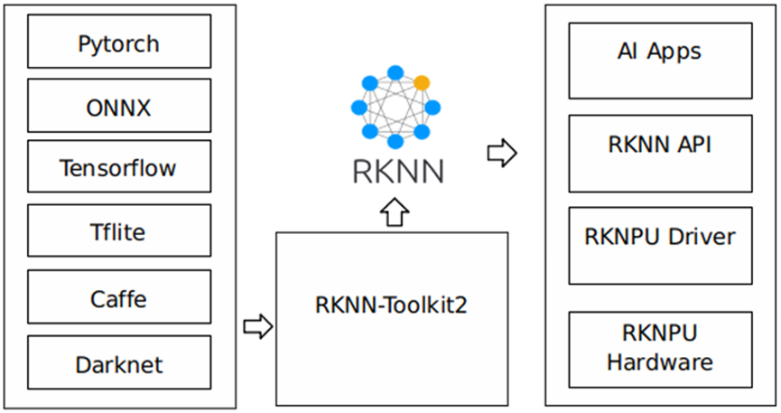

Figure 1-1 RKNN Software Stack

To use the built-in NPU of the OK3588-C, please first run the RKNN-Toolkit2 tool on a computer to convert the trained model into the RKNN format model, and then use the RKNN C API or Python API for deployment on the development board.

The currently supported models are as follows:

|     **demo**      |       **model\_name**        |      inputs\_shape      | **dtype** | **RK3588@single\_core** |
| :---------------: | :--------------------------: | :---------------------: | :-------: | :---------------------: |
|     mobilenet     |        mobilenetv2-12        |    \[1, 3, 224, 224]    |   INT8    |          450.7          |
|      resnet       |        resnet50-v2-7         |    \[1, 3, 224, 224]    |   INT8    |          110.1          |
|      yolov5       |        yolov5s\_relu         |    \[1, 3, 640, 640]    |   INT8    |          66.1           |
|                   |           yolov5n            |    \[1, 3, 640, 640]    |   INT8    |          82.5           |
|                   |           yolov5s            |    \[1, 3, 640, 640]    |   INT8    |          48.4           |
|                   |           yolov5m            |    \[1, 3, 640, 640]    |   INT8    |          20.9           |
|      yolov6       |           yolov6n            |    \[1, 3, 640, 640]    |   INT8    |          106.4          |
|                   |           yolov6s            |    \[1, 3, 640, 640]    |   INT8    |          36.4           |
|                   |           yolov6m            |    \[1, 3, 640, 640]    |   INT8    |          17.8           |
|      yolov7       |         yolov7-tiny          |    \[1, 3, 640, 640]    |   INT8    |          72.7           |
|                   |            yolov7            |    \[1, 3, 640, 640]    |   INT8    |          11.4           |
|      yolov8       |           yolov8n            |    \[1, 3, 640, 640]    |   INT8    |          73.5           |
|                   |           yolov8s            |    \[1, 3, 640, 640]    |   INT8    |          38.0           |
|                   |           yolov8m            |    \[1, 3, 640, 640]    |   INT8    |          16.2           |
|    yolov8\_obb    |         yolov8n-obb          |    \[1, 3, 640, 640]    |   INT8    |          74.0           |
|      yolov10      |           yolov10n           |    \[1, 3, 640, 640]    |   INT8    |          61.2           |
|                   |           yolov10s           |    \[1, 3, 640, 640]    |   INT8    |          33.8           |
|      yolo11       |           yolo11n            |    \[1, 3, 640, 640]    |   INT8    |          60.0           |
|                   |           yolo11s            |    \[1, 3, 640, 640]    |   INT8    |          33.0           |
|                   |           yolo11m            |    \[1, 3, 640, 640]    |   INT8    |          12.7           |
|       yolox       |           yolox\_s           |    \[1, 3, 640, 640]    |   INT8    |          37.1           |
|                   |           yolox\_m           |    \[1, 3, 640, 640]    |   INT8    |          16.0           |
|      ppyoloe      |          ppyoloe\_s          |    \[1, 3, 640, 640]    |   INT8    |          32.5           |
|                   |          ppyoloe\_m          |    \[1, 3, 640, 640]    |   INT8    |          15.8           |
|    yolo\_world    |       yolo\_world\_v2s       |    \[1, 3, 640, 640]    |   INT8    |          22.1           |
|                   |          clip\_text          |        \[1, 20]         |   FP16    |          95.8           |
|   yolov8\_pose    |         yolov8n-pose         |    \[1, 3, 640, 640]    |   INT8    |          55.9           |
|     deeplabv3     | deeplab-v3-plus-mobilenet-v2 |    \[1, 513, 513, 1]    |   INT8    |          34.0           |
|    yolov5\_seg    |         yolov5n-seg          |    \[1, 3, 640, 640]    |   INT8    |          69.3           |
|                   |         yolov5s-seg          |    \[1, 3, 640, 640]    |   INT8    |          36.8           |
|                   |         yolov5m-seg          |    \[1, 3, 640, 640]    |   INT8    |          16.4           |
|    yolov8\_seg    |         yolov8n-seg          |    \[1, 3, 640, 640]    |   INT8    |          60.8           |
|                   |         yolov8s-seg          |    \[1, 3, 640, 640]    |   INT8    |          28.9           |
|                   |         yolov8m-seg          |    \[1, 3, 640, 640]    |   INT8    |          12.6           |
|       ppseg       |    ppseg\_lite\_1024x512     |    \[1, 3, 512, 512]    |   INT8    |          35.7           |
|     mobilesam     |   mobilesam\_encoder\_tiny   |    \[1, 3, 448, 448]    |   FP16    |          10.0           |
|                   |      mobilesam\_decoder      |    \[1, 1, 112, 112]    |   FP16    |          116.4          |
|    RetinaFace     |    RetinaFace\_mobile320     |    \[1, 3, 320, 320]    |   INT8    |          227.2          |
|                   |  RetinaFace\_resnet50\_320   |    \[1, 3, 320, 320]    |   INT8    |          49.2           |
|      LPRNet       |            lprnet            |     \[1, 3, 24, 94]     |   FP16    |          586.4          |
|     PPOCR-Det     |         ppocrv4\_det         |    \[1, 3, 480, 480]    |   INT8    |          50.7           |
|     PPOCR-Rec     |         ppocrv4\_rec         |    \[1, 3, 48, 320]     |   FP16    |          73.9           |
| lite\_transformer | lite-transformer-encoder-16  | embedding-256, token-16 |   FP16    |          867.6          |
|                   | lite-transformer-decoder-16  | embedding-256, token-16 |   FP16    |          343.8          |
|       clip        |         clip\_images         |    \[1, 3, 224, 224]    |   FP16    |           6.5           |
|                   |          clip\_text          |        \[1, 20]         |   FP16    |          96.0           |
|     wav2vec2      |  wav2vec2\_base\_960h\_20s   |        20s audio        |   FP16    |        RTF 0.133        |
|      whisper      |      whisper\_base\_20s      |        20s audio        |   FP16    |        RTF 0.215        |
|     zipformer     | zipformer-bilingual-zh-en-t  |     streaming audio     |   FP16    |        RTF 0.065        |
|      yamnet       |          yamnet\_3s          |        3s audio         |   FP16    |        RTF 0.004        |
|     mms\_tts      |      mms\_tts\_eng\_200      |        token-200        |   FP16    |        RTF 0.069        |

###### **4.1.1.2 RKNN-Toolkit2**

With RKLLM-Toolkit2, developers can easily quantize and convert large language models on a computer. It provides a concise Python interface with the following core features:

- **Model Conversion:** Supports converting LLMs from Hugging Face and GGUF formats to the RKLLM format. The converted RKLLM models can be loaded and used on the OK3588-C NPU platform;

- **Quantization:** Supports converting floating-point models into fixed-point models. Currently supported quantization types are w8a8 and w8a8 grouped quantization (with supported group sizes of 128, 256, and 512).

RKNN-Toolkit2 is the core development toolkit for Rockchip NPU, providing end-to-end development support for model conversion (ONNX/TF/PyTorch → RKNN), quantization, PC simulation inference, performance evaluation, accuracy validation, and model optimization. Please refer to [https://github.com/airockchip/rknn-toolkit2](https://github.com/airockchip/rknn-toolkit2) for the RKLLM-Toolkit2 details.

###### **4.1.1.3 Features of RKLLM Runtime**

RKLLM Runtime loads models converted by RKNN-Toolkit into the RKLLM format. It accelerates inference on the OK3588-C NPU by calling the board-side NPU driver. During inference, developers can customize model parameters and text generation strategies, and continuously receive outputs through preset callback functions.

For details of RKLLM Runtime, refer to`rknn-llm\doc\ Rockchip_RKLLM_SDK_CN_1.2.3.pdf`.

##### 4.1.2 RKLLM Toolchain

###### **4.1.2.1 RKLLM Software Stack Overview**

The RKNN software stack enables rapid deployment of AI models to the OK3588-C platform. 
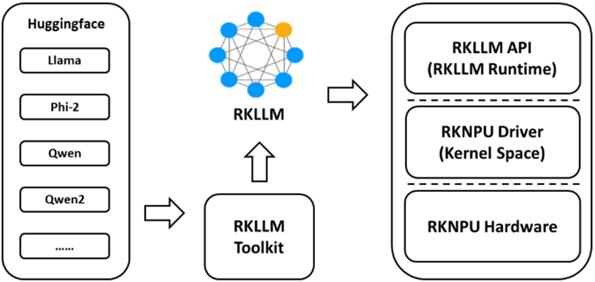

Figure 1-2: RKLLM Software Stack.

###### **4.1.2.2 RKNN-Toolkit Features**

With RKLLM-Toolkit2, developers can efficiently perform quantization and conversion of large language models on a host computer. It provides a concise Python interface with the following core features:

- **Model Conversion:** Supports converting LLMs from Hugging Face and GGUF formats to the RKLLM format. The converted RKLLM models can be loaded and used on the OK3588-C NPU platform.
- **Quantization:** Supports converting floating-point models into fixed-point models. Currently supported quantization types include w8a8 and w8a8 grouped quantization, with supported group sizes of 128, 256, and 512.

Please refer to`rknn-llm\doc\Rockchip_RKLLM_SDK_CN_1.2.3.pdf`, for RKLLM-Toolkit2 details.

###### **4.1.2.3 RKLLM Runtime Features**

RKLLM Runtime loads models converted by RKNN-Toolkit into the RKLLM format. It accelerates inference on the OK3588-C NPU by calling the board-side NPU driver. During inference, developers can customize model parameters and text generation strategies, and continuously receive outputs through preset callback functions.

For details of RKLLM Runtime, refer to`rknn-llm\doc\ Rockchip_RKLLM_SDK_CN_1.2.3.pdf`.

##### 4.1.3 RKNN Model Zoo

RKNN Model Zoo is an edge AI model deployment resource library launched by Rockchip based on its RKNPU SDK toolchain. It aims to provide developers with a complete reference implementation for AI model deployment. It covers the entire workflow—from model conversion and quantization to running inference on Rockchip NPUs using both Python and C APIs. Built-in YOLO series detection/segmentation/pose, image classification, OCR, license plate recognition, speech recognition and other dozens of mainstream algorithms, each model provides pre-training weights, conversion scripts and sample codes that can be directly compiled and run to help developers quickly achieve high-performance NPU reasoning acceleration on Rockchip hardware.

The rknn \_ model \_ zoo is a collection of converted and optimized mainstream model examples, providing a large number of ready-made RKNN models + complete pre-processing and post-processing + C/C + +/Python/Android reasoning demos for developers to run directly for verification or reference transplantation. [https://github.com/airockchip/rknn\_model\_zoo](https://github.com/airockchip/rknn_model_zoo)

RKNN Model Zoo directory:

```plain
rknn_model_zoo
├── 3rdparty         # Third-party libraries
├── asset            # Resource files
├── datasets         # Datasets
├── docs             # Documentation directory
├── examples         # Example code
├── py_utils         # Python utility library
├── utils            # General utility directory
├── build-android.sh # Compilation script for Android system development boards
├── build-linux.sh   # Compilation script for Linux system development boards
```

Under the examples directory are examples of commonly used models, such as MobileNet and YOLO. Each model example provides sample code in both Python and C/C++ versions. Taking a`resnet`model as an example, its directory structure is as follows:

```plain
rknn_model_zoo 
├── examples 
│   └── resnet 
│       ├── cpp      # C/C++ example code 
│       ├── model    # Model, test images, and other files 
│       ├── python   # Model conversion scripts and Python example code 
│       └── README.md 
└── ...

```

#### 4.2 Development Environment Setup

RKNN development needs to be carried out under Ubuntu. You may choose the build method provided in the manual.

##### 4.2.1 Installing RKNN-Toolkit2

There are two installation methods for RKNN-Toolkit2:`pip`and`Docker`. You can choose anyone to install.

###### **4.2.1.1 Installing via Pip**

* Set up the Python Environment

```plain
forlinx@ubuntu:~$ sudo apt-get update
forlinx@ubuntu:~$ sudo apt-get install python3 python3-dev python3-pip
forlinx@ubuntu:~$ sudo apt-get install libxslt1-dev zlib1g zlib1g-dev libglib2.0-0 libsm6 libgl1-mesa-glx libprotobuf-dev gcc
```

* Install the Miniforge Tool

```plain
# Download Mini forge installation package
forlinx@ubuntu:~$ wget -c https://mirrors.tuna.tsinghua.edu.cn/github-release/conda-forge/miniforge/LatestRelease/Miniforge3-Linux-x86_64.sh
# Install Miniforge
forlinx@ubuntu:~$ chmod 777 Miniforge3-Linux-x86_64.sh
forlinx@ubuntu:~$ bash Miniforge3-Linux-x86_64.sh

```

* Create the RKNN-Toolkit2 Conda Environment

```plain
# Switch to the Conda base environment
forlinx@ubuntu:~$ source ~/miniforge3/bin/activate 			// Miniforge installation directory
# Create a Conda environment named RKNN-Toolkit2 with Python version 3.8 (recommended version)
(base) forlinx@ubuntu:~$ conda create -n RKNN-Toolkit2 python=3.8
# Activate the RKNN-Toolkit2 Conda environment
(base) forlinx@ubuntu:~$ conda activate RKNN-Toolkit2

```

* Install RKNN-Toolkit2

After activating the RKNN-Toolkit2 Conda environment, RKNN-Toolkit2 can be installed either from a`pip`source or via a local`wheel`package.

Install from a pip source.

```plain
(RKNN-Toolkit2) forlinx@ubuntu:~$ pip install rknn-toolkit2 -i https://pypi.org/simple
# If RKNN-Toolkit2 is already installed, you can upgrade it using the following command:
pip install rknn-toolkit2 -i https://pypi.org/simple --upgrade
```

- Install from a local wheel package.


Transfer the RKNN-Toolkit2 project folder (rknn-toolkit2) to the target directory`ubuntu/home/forlinx/`. The RKNN-Toolkit2 project file can be downloaded from: [https://github.com/airockchip/rknn-toolkit2](https://github.com/airockchip/rknn-toolkit2).

```plain
(RKNN-Toolkit2) forlinx@ubuntu:~$ pip install -r rknn-toolkit2/packages/x86_64/requirements_cp38-2.3.2.txt
# Select the appropriate requirements file based on the Python version and processor architecture, where "cpxx" represents the Python version number.

# Install RKNN-Toolkit2
(RKNN-Toolkit2) forlinx@ubuntu:~$ pip install rknn-toolkit2/packages/x86_64/rknn_toolkit2-2.3.2-cp38-cp38-manylinux_2_17_x86_64.manylinux2014_x86_64.whl
# Select the corresponding wheel installation file according to the Python version and processor architecture, where "x.x.x" is the RKNN-Toolkit2 version number, and "cpxx" is the Python version number.

# Verify the installation is successful by running the following command with no errors:
(RKNN-Toolkit2) forlinx@ubuntu:~$ python3
>>> from rknn.api import RKNN
```

###### 4.2.1.2 Installing via Docker

* Install Docker Tools

Install Docker tools following the official Docker installation manual. Link:

[https://docs.docker.com/install/linux/docker-ce/ubuntu/](https://docs.docker.com/install/linux/docker-ce/ubuntu/).

```plain
# Add the forlinx user to the docker group (and create the docker group if it doesn't exist)
forlinx@ubuntu:~$ sudo groupadd docker

# Add the forlinx user to the docker group
forlinx@ubuntu:~$ sudo usermod -aG docker $USER

# Update group membership to activate the docker group changes
forlinx@ubuntu:~$ newgrp docker

# Verify that docker commands can be run without sudo
forlinx@ubuntu:~$ docker run hello-world
```

Expected output upon successful execution.

```plain
Unable to find image 'hello-world:latest' locally
latest: Pulling from library/hello-world
17eec7bbc9d7: Pull complete 
ea52d2000f90: Download complete 
Digest: sha256:ef54e839ef541993b4e87f25e752f7cf4238fa55f017957c2eb44077083d7a6a
Status: Downloaded newer image for hello-world:latest

Hello from Docker!
This message shows that your installation appears to be working correctly.
```

* Image Preparation

Create the image environment via`Dockerfile`.

Transfer the RKNN-Toolkit2 project folder (rknn-toolkit2) to the virtual machine directory`/home/forlinx`. There are`Dockerfile`files to build the RKNN-Toolkit2 development environment under`rknn-toolkit2/docker/docker_file`.

```plain
forlinx@ubuntu:~$ cd rknn-toolkit2/docker/docker_file/ubuntu_20_04_cp38
forlinx@ubuntu:~/rknn-toolkit2/docker/docker_file/ubuntu_20_04_cp38$ docker build -f Dockerfile_ubuntu_20_04_for_cp38 -t rknn-toolkit2:2.3.2-cp38 .
```

Querying Image Information.

```plain
# After the image is created or loaded successfully, view the image information of Docker.
forlinx@ubuntu:~$ docker images
```

* Runn the Image

Execute the following command to run the`Docker`image. After execution, you will enter the bash environment.

```plain
forlinx@ubuntu:~$ docker run -t -i --privileged -v /dev/bus/usb:/dev/bus/usb rknn-toolkit2:2.3.2-cp38 /bin/bash
```

To map the code in the examples folder into the Docker environment, you can append the “-v <host src folder>:<image dst folder>” parameter.

```plain
forlinx@ubuntu:~$ docker run -t -i --privileged -v /dev/bus/usb:/dev/bus/usb  -v /home/forlinx/rknn-toolkit2/examples:/examples rknn-toolkit2:2.3.2-cp38 /bin/bash
```

* Run the Demo

```plain
root@6413d8f3c79d:/# cd examples/onnx/yolov5
root@6413d8f3c79d:/examples/onnx/yolov5# python test.py
```

After the script runs successfully, the result is as follows:

```plain
class        score    xmin, ymin, xmax, ymax
--------------------------------------------------------------------
person       0.884   [ 208,  244,  286,  506]
person       0.868   [ 478,  236,  559,  528]
person       0.825   [ 110,  238,  230,  533]
person       0.334   [  79,  353,  122,  517]
   bus         0.705   [  92,  128,  554,  467]

```

##### 4.2.2 Installing RKLLM-Toolkit

###### **4.2.2.1 Install via Pip**

Set up the Python Environment.

```plain
forlinx@ubuntu:~$ sudo apt-get update
forlinx@ubuntu:~$ sudo apt-get install python3 python3-dev python3-pip
forlinx@ubuntu:~$ sudo apt-get install libxslt1-dev zlib1g zlib1g-dev libglib2.0-0 libsm6 libgl1-mesa-glx libprotobuf-dev gcc
```

###### **4.2.1.2 Installing the Miniforge Tool**

```plain
# Download Mini forge installation package
forlinx@ubuntu:~$ wget -c https://mirrors.tuna.tsinghua.edu.cn/github-release/conda-forge/miniforge/LatestRelease/Miniforge3-Linux-x86_64.sh
# Install Miniforge
forlinx@ubuntu:~$ chmod 777 Miniforge3-Linux-x86_64.sh
forlinx@ubuntu:~$ bash Miniforge3-Linux-x86_64.sh
```

###### **4.2.1.3 Creating RKLLM-Toolkit Conda Environment**

```plain
# Switch to the Conda base environment
forlinx@ubuntu:~$ source ~/miniforge3/bin/activate # Miniforge installation directory

# Create a Conda environment named RKLLM-Toolkit with Python version 3.8
(base) forlinx@ubuntu:~$ conda create -n RKLLM-Toolkit python=3.8

# Activate the RKLLM-Toolkit Conda environment
(base) forlinx@ubuntu:~$ conda activate RKLLM-Toolkit
```

###### **4.2.1.4 Installing RKLLM-Toolkit**

Transfer the RKLLM-Toolkit project folder (rknn-llm) to the virtual machine directory. Under the RKLLM-Toolkit Conda environment, use the pip tool to directly install the provided toolchain wheel package. During the installation process, the installation tool will automatically download the required dependency packages for the RKLLM-Toolkit. The download address for the RKLLM-Toolkit project files is:[https://github.com/airockchip/rknn-llm/archive/refs/tags/release-v1.2.2.zip](https://github.com/airockchip/rknn-llm/archive/refs/tags/release-v1.2.2.zip)。

```plain
(RKLLM-Toolkit) forlinx@ubuntu:~$ pip install rknn-llm/rkllm-toolkit/packages/rkllm_toolkit-1.2.2-cp38-cp38-linux_x86_64.whl
```

##### 4.2.3 Board-Side NPU Environment Preparation

```plain
# Check the RKNPU driver version
cat /sys/kernel/debug/rknpu/version

# Output:
RKNPU driver: v0.9.8
```

#### 4.3 Model Deployment Examples

Forlinx provides pre-converted models and binary files for download. You can browse the following link to download the compressed package containing the corresponding models and binary files

[https://www.forlinx.net/resources/download-center.html](https://www.forlinx.net/resources/download-center.html)

After entering the webpage, select the model under "Software Resources -> AI Demo".

##### 4.3.1 YOLOv5 Model Deployment Example

###### 4.3.1.1 Model Conversion

Transfer the RKNN Model Zoo project folder (rknn\_model\_zoo) to the virtual machine directory. The download address for the RKNN Model Zoo project files is [https://github.com/airockchip/rknn\_model\_zoo](https://github.com/airockchip/rknn_model_zoo):

* Enter the RKNN-Toolkit2 Conda Environment

```plain
forlinx@ubuntu:~$ source ~/miniforge3/bin/activate # Miniforge installation directory
(base) forlinx@ubuntu:~$ conda activate RKNN-Toolkit2
```

* Downloading the Model

```plain
(RKNN-Toolkit2) forlinx@ubuntu:~$ cd rknn_model_zoo/examples/yolov5/model 
(RKNN-Toolkit2) forlinx@ubuntu:~/rknn_model_zoo/examples/yolov5/model$ chmod +x download_model.sh
(RKNN-Toolkit2) forlinx@ubuntu:~/rknn_model_zoo/examples/yolov5/model$ ./download_model.sh
```

* Model Conversion

```plain
(RKNN-Toolkit2) forlinx@ubuntu:~$ cd rknn_model_zoo/examples/yolov5/python
(RKNN-Toolkit2) forlinx@ubuntu:~/rknn_model_zoo/examples/yolov5/python$ python convert.py ../model/yolov5s_relu.onnx rk3588 i8 ../model/yolov5s_relu.rknn
```

The save path for the converted model is: `rknn_model_zoo/examples/yolov5/model/yolov5s_relu.rknn`.

###### 4.3.1.2 Model Deployment

Install the Cross Compiler.

**⚠️Note: The cross compiler mentioned in this section is not the same as the cross-compilation toolchain described in the compilation manual. Please download the cross compiler dedicated to compiling this AI model as described below.**

* Install Cmake

```plain
forlinx@ubuntu:~$ sudo apt update # Update the package list
forlinx@ubuntu:~$ sudo apt install cmake # Install cmake
```

* Install Compiler

The download address of GCC:

[https://releases.linaro.org/components/toolchain/binaries/6.3-2017.05/aarch64-linux-gnu/gcc-linaro-6.3.1-2017.05-x86\_64\_aarch64-linux-gnu.tar.xz](about:blank)

After downloading the GCC software package, extract it to the virtual machine directory.

Specify the GCC cross-compiler path in the build-linux. sh script under the rknn \_ model \_ zoo project.

```plain
# Add to start of build-Linux. Sh script
GCC_COMPILER=/home/forlinx/gcc-linaro-6.3.1-2017.05-x86_64_aarch64-linux-gnu/bin/aarch64-linux-gnu

```

* Compilation

```plain
forlinx@ubuntu:~$ cd rknn_model_zoo
forlinx@ubuntu:~/rknn_model_zoo$ chmod +x build-linux.sh
forlinx@ubuntu:~/rknn_model_zoo$ ./build-linux.sh -t rk3588 -a aarch64 -d yolov5
```

* Operation on Board

Push the folder under the directory to the board-side directory.

```plain
root@OK3588-C-buildroot:~# cd /home/forlinx/rknn_yolov5_demo 
root@OK3588-C-buildroot:/home/forlinx/rknn_yolov5_demo# chmod +x rknn_yolov5_demo
root@OK3588-C-buildroot:/home/forlinx/rknn_yolov5_demo# export LD_LIBRARY_PATH=./lib
root@OK3588-C-buildroot:/home/forlinx/rknn_yolov5_demo# ./rknn_yolov5_demo model/yolov5s_relu.rknn model/bus.jpg
```

The out. png of the output result image in the current directory is as follows:


##### 4.3.2 DeepSeek Model Deployment

###### 4.3.2.1 Model Conversion

* Enter RKLLM-Toolkit Conda Environment

```plain
forlinx@ubuntu:~$ source ~/miniforge3/bin/activate # Miniforge installation directory.
(base) forlinx@ubuntu:~$ conda activate RKLLM-Toolkit
```

* Download the Model

Download the`DeepSeek-R1-Distill-Qwen-1.5B`model from [https://huggingface.co/deepseek-ai/DeepSeek-R1-Distill-Qwen-1.5B/tree/main.](about:blank)
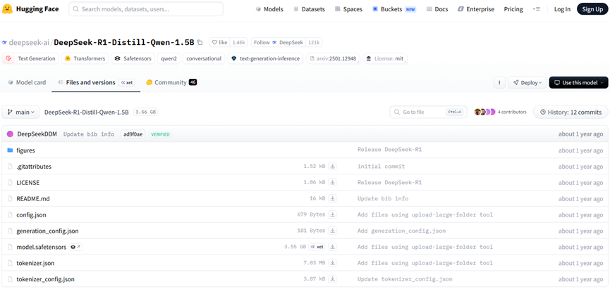

Name the downloaded folder as`DeepSeek-R1-Distill-Qwen-1.5B`, and transfer it to the virtual machine path`/home/forlinx/rknn-llm/examples`.

* Model Conversion

Navigate to the file path where the export\_rkllm.py script is located.

```plain
(RKLLM-Toolkit) forlinx@ubuntu:~$ cd /home/forlinx/rknn-llm/examples/rkllm_api_demo/export
```

Modify the model path in the`export_rkllm.py`script to the actual path, and confirm the target platform and the number of NPU cores.
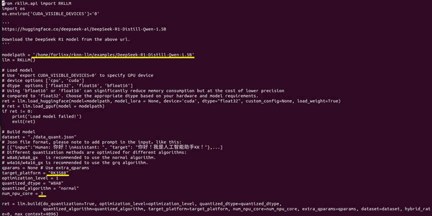

```plain
(RKLLM-Toolkit) forlinx@ubuntu:~/rknn-llm/examples/rkllm_api_demo/export$ python3 generate_data_quant.py -m /home/forlinx/rknn-llm/examples/DeepSeek-R1-Distill-Qwen-1.5B
(RKLLM-Toolkit) forlinx@ubuntu:~/rknn-llm/examples/rkllm_api_demo/export$ python export_rkllm.py
```

###### 4.3.2.2 Model Deployment

Model Dependency Library Compilation.

The DeepSeek model requires libgomp support. A compilation method is provided here. Please refer to the method below to compile the library file themselves and then place it into the board. Alternatively, you can find the DeepSeek content in the link, download the pre-compiled library file, and copy it into the board.

[https://www.forlinx.net/resources/download-center.html](https://www.forlinx.net/resources/download-center.html)

The following describes how to compile it yourself.

* Set up the compilation environment

Refer to section 2-3.3.1 to obtain the cross-compilation toolchain and set up the compilation environment.

* Compilation

```plain
aarch64-buildroot-linux-gnu_sdk-buildroot$ mkdir work
aarch64-buildroot-linux-gnu_sdk-buildroot$ cd work
aarch64-buildroot-linux-gnu_sdk-buildroot/work$ wget https://ftp.gnu.org/gnu/gcc/gcc-12.4.0/gcc-12.4.0.tar.xz
aarch64-buildroot-linux-gnu_sdk-buildroot/work$ tar xf gcc-12.4.0.tar.xz
aarch64-buildroot-linux-gnu_sdk-buildroot/work$ cd gcc-12.4.0/libgomp/
work/gcc-12.4.0/libgomp$ mkdir build && cd build
libgomp/build$ ../configure --host=aarch64-buildroot-linux-gnu --prefix=$PWD/install --disable-multilib
libgomp/build$ make -j$(nproc)
libgomp/build$ make install
```

* Port to the board

After completing the compilation according to the above method, the required library files will be generated in the`install/lib64/`directory.

```plain
$ ls -l install/lib64/
total 824
-rw-r--r-- 1 forlinx forlinx 513206  4月  2 17:42 libgomp.a
-rwxr-xr-x 1 forlinx forlinx   1071  4月  2 17:42 libgomp.la
lrwxrwxrwx 1 forlinx forlinx     16  4月  2 17:42 libgomp.so -> libgomp.so.1.0.0
lrwxrwxrwx 1 forlinx forlinx     16  4月  2 17:42 libgomp.so.1 -> libgomp.so.1.0.0
-rwxr-xr-x 1 forlinx forlinx 316176  4月  2 17:42 libgomp.so.1.0.0
-rw-r--r-- 1 forlinx forlinx    169  4月  2 17:42 libgomp.spec
```

You can see that the generated library files are all linked to`libgomp.so.1.0.0`. You only need to copy this library file to the appropriate`/usr/lib/libgomp.so.1`location on the board.

For example, using the`scp`command:

```plain
Ensure the compilation host can connect to the board card. You can use the ping command to test.  
For example, if the board card's IP is 192.168.0.232:  
libgomp/build$ ping 192.168.0.232  

If the above command returns a response, transfer the file to the board card using the scp command (make sure the scp command is available on your host):  
libgomp/build$ scp install/lib64/libgomp.so.1.0.0 root@192.168.0.232:/usr/lib/libgomp.so.1
```

If you do not have the`scp`command, you can also copy the file from the host to the board using a USB drive. It should be noted that after copying to the board's`/usr/lib/`directory, you need to rename it.`libgomp.so.1`

* Installing the Cross Compiler

**⚠️Note: The cross compiler mentioned in this section is not the same as the cross-compilation toolchain described in the compilation manual. Please download the cross compiler dedicated to compiling this AI model as described below.**

```plain
forlinx@ubuntu:~$ mkdir -p ~/opts/
forlinx@ubuntu:~$ cd ~/opts/
forlinx@ubuntu:~/opts$ wget https://developer.arm.com/-/media/Files/downloads/gnu-a/10.2-2020.11/binrel/gcc-arm-10.2-2020.11-x86_64-aarch64-none-linux-gnu.tar.xz
forlinx@ubuntu:~/opts$ tar -xvf gcc-arm-10.2-2020.11-x86_64-aarch64-none-linux-gnu.tar.xz
# Verify that the installation was successful and check the C compiler version
forlinx@ubuntu:~/opts$ ~/opts/gcc-arm-10.2-2020.11-x86_64-aarch64-none-linux-gnu/bin/aarch64-none-linux-gnu-gcc --version
```

* Compilation

```plain
forlinx@ubuntu:~/opts$ cd ~/rknn-llm/examples/rkllm_api_demo/deploy
forlinx@ubuntu:~/rknn-llm/examples/rkllm_api_demo/deploy$ chmod +x build-linux.sh
forlinx@ubuntu:~/rknn-llm/examples/rkllm_api_demo/deploy$ ./build-linux.sh
```

* Operation on Board

Copy the model files `DeepSeek-R1-Distill-Qwen-1.5B_W8A8_RK3588.rkllm `from the `rknn-llm/examples/rkllm_api_demo/export `directory to the specified `rknn-llm/examples/rkllm_api_demo/deploy/install` subdirectory, and then push the final folder`demo_Linux_aarch64`to the board-side`/home/forlinx/`directory.

```plain
root@OK3588-C-buildroot:~# cd /home/forlinx/demo_Linux_aarch64
root@OK3588-C-buildroot:/home/forlinx/demo_Linux_aarch64# chmod +x llm_demo
root@OK3588-C-buildroot:/home/forlinx/demo_Linux_aarch64# export LD_LIBRARY_PATH=./lib
root@OK3588-C-buildroot:/home/forlinx/demo_Linux_aarch64# ./llm_demo model/DeepSeek-R1-Distill-Qwen-1.5B_W8A8_RK3588.rkllm 1024 2048
```

The running results are as follows:


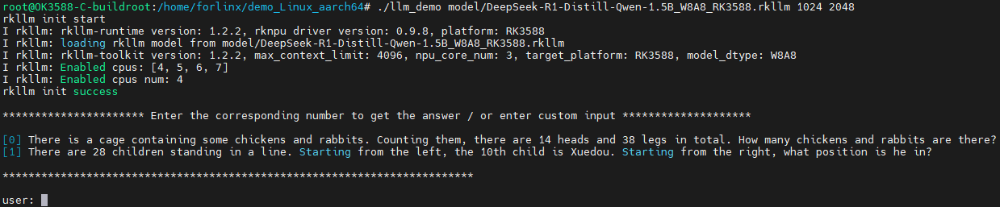

#### 4.4 RKNN Toolkit2 Supported Operator List

For the list of ONNX operators, PyTorch operators, Caffe operators, TensorFlow operators, and Darknet operators supported by RKNN Toolkit2, please refer to the relevant documentation`rknn-toolkit2\doc\RKNNToolKit2_OP_Support-2.3.2.md`.

## Resource Download

You can find the necessary materials for your products at the [Forlinx Download Center](www.forlinx.net/resources/download-center.html).


