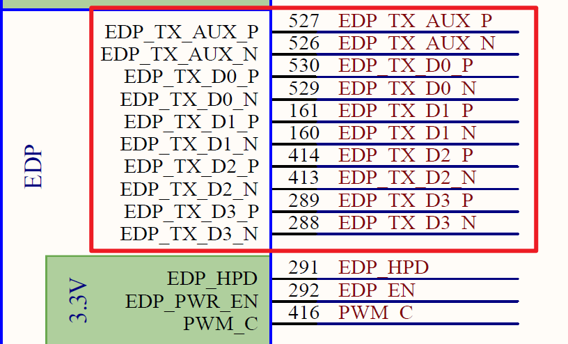

# OK3588-UP5\_User's Hardware Manual\_V1.0

## 1\. Introduction to the RK3588 Processor

The RK3588 is a general-purpose SoC based on the ARM architecture, featuring a typical big.LITTLE CPU configuration that integrates a quad-core Cortex-A76 and a quad-core Cortex-A55. It is equipped with a G610 MP4 GPU, which enables smooth handling of complex graphics processing tasks. The embedded 3D GPU ensures that the RK3588 is fully compatible with OpenGLES 1.1, 2.0, and 3.2, as well as OpenCL up to 2.2 and Vulkan 1.2. A special 2D hardware engine with MMU (Memory Management Unit) maximizes display performance and provides exceptionally smooth operation. Additionally, an NPU (Neural Processing Unit) with 6 TOPS (Tera Operations Per Second) of computing power empowers various AI scenarios, enabling possibilities for complex local offline AI computations, sophisticated video stream analysis, and other applications. The processor integrates a variety of powerful embedded hardware engines. It supports an 8K@60fps H.265 and VP9 decoder, an 8K@30fps H.264 decoder, and a 4K@60fps AV1 decoder. It also supports 8K@30fps H.264 and H.265 encoders, a high-quality JPEG encoder/decoder, and dedicated image pre-processors and post-processors.

The RK3588 introduces a new generation, fully hardware-based ISP (Image Signal Processor) capable of handling up to 48 megapixels. It implements numerous algorithm accelerators such as HDR, 3A (Auto Focus, Auto White Balance, Auto Exposure), LSC (Lens Shading Correction), 3DNR/2DNR (3D/2D Noise Reduction), Sharpening, Dehaze, Fisheye Correction, Gamma Correction, etc., giving it a wide range of applications in image post-processing. The RK3588 integrates Rockchip’s latest generation NPU processor, which supports INT4/INT8/INT16/FP16 mixed-precision computing. Its strong compatibility allows for easy conversion of network models based on a series of frameworks such as TensorFlow, MXNet, PyTorch, and Caffe. The RK3588 features a high-performance 4-channel external memory interface (supporting LPDDR4/LPDDR4X/LPDDR5), capable of meeting demanding memory bandwidth requirements.

Target Applications:

+ Information Release Terminals
+ Smart Cockpit
+ Smart Screen
+ AR/VR
+ Edge Computing
+ High-end IPC
+ Smart NVR
+ Premium Pad
+ ARM PC

……

**RK3588 Block Diagram**

## 2\. FET3588-UP5 SoM Description

### 2.1 FET3588-UP5 Appearance Diagram

**Front**

**Back**

### 2.2 FET3588-UP5 SoM Dimension Diagram

Unit: mm

Dimensions: 50mm × 50mm, dimensional tolerance ±0.15mm. For more dimensional details, please refer to the DXF file.

Plate making process: 1.6mm thickness, 10-layer immersion gold PCB.

### 2.3 Performance Parameter

#### 2.3.1 System Frequency

| **Name**| **Specification**| | | | **Description**|
|:----------:|:----------:|----------|----------|----------|:----------:|
| | **Minimum**| **Typical** | **Maximum**| **Unit**||
| System Clock Arm® Cortex®-A76| \-| \-| 2400| MHz| \-|
| System Clock Arm® Cortex®-A55| \-| \-| 1800| MHz||
| System Clock Arm® Cortex®-M0| \-| \-| \-| \-| \-|

#### 2.3.2 Power Parameter

| **Parameter**| **Pin No.**| **Specification**| | | | **Description**|
|:----------:|:----------:|:----------:|----------|----------|----------|:----------:|
| | | **Minimum**| **Typical** | **Maximum**| **Unit**||
| Main Power Voltage| 12V| 5| 12| 13| V| \-|

#### 2.3.3 Working Environment

| **Parameter**| | **Specification**| | | | **Description**|
|:----------:|----------|:----------:|----------|----------|----------|:----------:|
| | | **Minimum**| **Typical** | **Maximum**| **Unit**||
| Operating Temperature| Working Environment| 0| 25| +80| ℃| Commercial level|
| | Storage Environment| -40| 25| +125| ℃||
| | Working Environment| -40| 25| +85| ℃| Industrial Level|
| | Storage Environment| -40| 25| +125| ℃||
| Humidity| Working Environment| 10| \-| 90| ％RH| No Condensation|
| | Storage Environment| 5| \-| 95| ％RH||

#### 2.3.4 SoM Interface Speed

| **Parameter**| **Specification**| | | | **Description**|
|:----------:|:----------:|----------|----------|----------|:----------:|
| | **Minimum**| **Typical** | **Maximum**| **Unit**||
| Serial Port Communication Speed| \-| 115200| 4M| bps| \-|
| SPI Clock| \-| \-| 50| MHz| \-|
| I2C Communication Speed| \-| 100| 400| Kbps| \-|
| USB3.0 Interface Speed| \-| \-| 5| Gbps| \-|
| USB2.0 Interface Speed| \-| \-| 480| Mbps| \-|
| CAN Communication Speed| \-| \-| 1| Mbps| \-|
| PCIe2.1| \-| \-| 5| Gbps| \-|
| PCIe3.0| \-| \-| 8| Gbps| \-|

#### 2.3.5 ESD Features

| **Parameter**| **Specification**| | **Unit**| **Application Scope**|
|:----------:|:----------:|----------|:----------:|:----------:|
| | **Minimum**| **Maximum**| |
| ESD HBM(ESDA/JEDEC JS-001-2017)| -2000| 2000| V| All signals routed out from the SoM.|
| ESD CDM(ESDA/JEDEC JS-002-2018)| -250| 250| V| All signals routed out from the SoM.|

**Note:**

**1\. The above data is provided by Rockchip;**

**2\. All outgoing signals from the SoM are static sensitive signals. When designing the bottom board, static protection should be taken into account for the interfaces, and attention should be paid to static protection during the transportation, assembly, and use of the SoM.**

### 2.4 SoM Interfaces

#### 2.4.1 FET3588x-UP5 SoM Interfaces

| **Function**  | Quantity | **Parameter**                                                |
| :-----------: | :------: | ------------------------------------------------------------ |
| MIPI CSI DPHY |    4     | ·One 4-lane MIPI D-PHY V1.2, supporting up to 2.5 Gbps per lane;  · Three 2-lane MIPI D-PHY V1.2, supporting up to 2.5 Gbps per lane. · Every two 2-lane D-PHY interfaces can be combined into a single 4-lane D-PHY to support one parallel display interface, with a maximum supported resolution of WUXGA (1920 x 1200 @ 60 fps, 165 MHz pixel clock). |
|    HDMI RX    |    1     | · Supports HDMI 2.0 at 3.4/6 Gbps; · Supports HDMI 1.4 at 250 Mbps/3.4 Gbps; · Supports HDCP 2.3 and HDCP 1.4. |
|  HDMI/eDP TX  |    2     | · Supports 2 HDMI/eDP TX combo interfaces (HDMI and eDP cannot operate simultaneously); . Each interface supports x1, x2, or x4 configurations; · HDMI supports resolutions up to 7680 × 4320 @ 60 Hz, with bandwidth options of 3, 6, 8, 10, and 12 Gbps, and supports HDCP 2.3; · eDP supports 4K @ 60 Hz resolution, with bandwidth options of 1.62 Gbps, 2.7 Gbps, and 5.4 Gbps, and supports HDCP 1.3. |
|   MIPI DSI    |    2     | · Supports 2 MIPI D-PHY 2.0 or C-PHY 1.1 interfaces, capable of resolutions up to 4K @ 60 Hz; · Supports dual MIPI display in left/right mode and RGB/YUV formats (up to 10-bit). |
|      I2S      |    1     | · Transmit and receive clocks up to 50 MHz; · Supports Time Division Multiplexing (TDM), Inter-IC Sound (I²S), and similar formats; · Supports digital audio interface transmission (SPDIF, IEC60958-1, and AES-3 formats); · Supports audio reference output clock. |
|   Ethernet    |    2     | · 2 x GMAC ports, providing RGMII/RMII interfaces; · Supports 10/100/1000 Mbps data transfer rates. |
|  USB3.1 Gen1  |    3     | · USB 3.1 Gen 1 data rate up to 5 Gbps; · 2 x USB 3.1 OTG ports, multiplexed with DP TX (USB3OTG\_0 and USB3OTG\_1). USB3OTG\_0 and USB3OTG\_1 support USB Type-C and DP Alt modes; · 1 x USB 3.1 Host port, multiplexed with PIPE PHY2 (USB3OTG\_2). |
|   PCIe 2.0    |    2     | PCIe 2.0 interface supports 1 lane, with a maximum data rate of 5 Gbps. |
|   PCIe 3.0    |    2     | · Supports RC and EP modes, with a maximum data rate of 8 Gbps; · Supports four configuration combinations: 1 ×4 lane, 2 ×2 lanes. |
|     SDMMC     |    1     | Integrated with 1 SDMMC controller and 1 SDIO controller, both supporting the SDIO 3.0 protocol and MMC V4.51 protocol. |
|     SDIO      |    1     |                                                              |
|      SPI      |    2     | · Each controller supports two chip-select outputs; · Supports serial master and serial slave modes, software-configurable. |
|      I2C      |    4     | · Supports 7-bit and 10-bit addressing modes; standard mode data rate up to 100k bits/s, fast mode up to 400k bits/s. |
|     UART      |    4     | · Built-in 2 × 64-bit FIFOs, usable for TX and RX respectively; · Supports 5-bit, 6-bit, 7-bit, and 8-bit serial data transmission/reception, with baud rates up to 4 Mbps; · 2 x UARTs support automatic flow control mode; 2 x support RS-485. |
|      PWM      |    2     | Supports up to 2 on-chip PWM with interrupt-based operation and capture mode. |
|      ADC      |    7     | Supports 7 x 12bit single-ended input SAR-ADC with sampling rate up to 1MS/s |

**FET3588x- UP5 CPU Interfaces**

|             **Function**              | **Quantity** | **Parameter**                                                |
| :-----------------------------------: | :----------: | ------------------------------------------------------------ |
| MIPI DC PHY (DPHY/CPHY) *1 |      2       | · Supports DPHY or CPHY; · 4-lane MIPI DPHY V1.2, up to 2.5 Gbps per lane; · 3-lane MIPI CPHY V1.1, up to 2.5 Gbps per lane. |
|      MIPI CSI DPHY*1       |      4       | · 2-lane MIPI DPHY V1.2, up to 2.5 Gbps per lane; · Every two 2-lane DPHYs can be merged into one 4-lane DPHY for a parallel display interface,  supporting a maximum resolution of WUXGA (1920 × 1200 @ 60 fps, 165 MHz pixel clock). |
|                  DVP                  |      1       | · Standard DVP interface (8/10/12/16-bit, up to 150 Mhz); · Supports BT.601, BT.656, and BT.1120 VI interfaces. |
|                HDMI RX                |      1       | · Supports HDMI 2.0~ at 3.4 Gbps to 6 Gbps;  · Supports HDMI 1.4b at 250 Mbps to 3.4 Gbps; supports HDCP 2.3 and HDCP 1.4. |
|              HDMI/eDP TX              |      ≤2      | · Supports 2 x HDMI/eDP TX combo interfaces (HDMI and eDP cannot operate simultaneously); · Each interface supports x1, x2, or x4 configurations; · HDMI supports resolutions up to 7680 × 4320 @ 60 Hz, with bandwidth options of 3, 6, 8, 10, and 12 Gbps, and supports HDCP 2.3; · eDP supports 4K @ 60 Hz resolution, with bandwidth options of 1.62 Gbps, 2.7 Gbps, and 5.4 Gbps, and supports HDCP 1.3. |
|                 DP TX                 |      2       | · Supports 2 × DP TX 1.4a interfaces, connectable to USB 3.1 Gen1, supporting 1/2/4 lanes; · Resolution up to 7680 × 4320 @ 30 Hz;  · Supports DP Alt mode under USB Type-C. |
|               MIPI DSI                |      2       | · Supports 2 MIPI D-PHY 2.0 or C-PHY 1.1 interfaces, capable of resolutions up to 4K @ 60 Hz; · Supports dual MIPI display in left/right mode and RGB/YUV formats (up to 10-bit). |
|            BT.1120 Output             |      1       | Supports RGB format (up to 8-bit), with a data rate of up to 150 MHz; resolution up to 1920x1080@60Hz. |
|                  I2S                  |      ≤4      | · Transmit and receive clocks up to 50 MHz; · Supports Time Division Multiplexing (TDM), Inter-IC Sound (I²S), and similar formats; · Supports digital audio interface transmission (SPDIF, IEC60958-1, and AES-3 formats); · Supports audio reference output clock. |
|                 SPDIF                 |      2       | · Supports 2x 16-bit audio data storage; · Supports dual-phase stereo output. |
|                  PDM                  |      2       | · Up to 8 channels, audio resolution: 16‑bit to 24‑bit, sample rate up to 192 kHz; · Supports PDM master receive mode. |
|                DSM PWM                |      1       | The audio PCM data is converted via direct bitstream digital encoding to produce a 1-bit signal stream;  the output digital signal can be filtered to produce an audio signal. |
|               Ethernet                |      2       | · 2 GMAC ports, providing RGMII/RMII interfaces; · Supports 10/100/1000 Mbps data transfer rates. |
|       USB3.1 Gen1*2        |      3       | · USB 3.1 Gen 1 data rate up to 5 Gbps; · 2 x USB 3.1 OTG ports, multiplexed with DP TX (USB3OTG\_0 and USB3OTG\_1). USB3OTG\_0 and USB3OTG\_1 support USB Type-C and DP Alt modes; · 1 x USB 3.1 Host port, multiplexed with PIPE PHY2 (USB3OTG\_2). |
|             USB 2.0 Host              |      2       | Supports 2 x USB2.0 Host;                                    |
|         PCIe 2.0*2         |      ≤3      | ·Each PCIe2.1 interface supports 1 lane, with data rate up to 5Gbps |
|         PCIe 3.0*2         |      ≤4      | · Supports RC and EP, with a maximum data rate of 8Gbps; · Supports 4 configuration combinations: 1x x4 link, 2x x2 links, 4x x1 links, 1x x2 + 2x x1 |
|                 SDMMC                 |      1       | Integrated with 1 SDMMC controller and 1 SDIO controller, both supporting the SDIO 3.0 protocol and MMC V4.51 protocol. |
|                 SDIO                  |      1       |                                                              |
|                  SPI                  |      ≤5      | · Each controller supports two chip-select outputs; · Supports serial master and serial slave modes, software-configurable. |
|                  I2C                  |      ≤9      | · Supports 7-bit and 10-bit addressing modes;  standard mode data rate up to 100k bits/s, fast mode up to 400k bits/s. |
|                 UART                  |     ≤10      | · Built-in with 2x 64-bit FIFOs, which can be used for TX and RX respectively;    · Supports 5-bit, 6-bit, 7-bit, 8-bit serial data transmission/reception, with a baud rate up to 4Mbps; All;   · 10 x UART interfaces support automatic flow control mode. |
|           SATA*2           |      ≤3      | · Features three SATA 3.0 controllers, and the PCIe and USB 3.0 HOST 2 controllers share PIPE PHY 0/1/2;    · Supports eSATA, with a maximum data rate of 6 Gbps. |
|                  PWM                  |     ≤16      | Supports up to 16 on-chip PWM with interrupt-based operation and capture mode |
|                  ADC                  |      ≤8      | Supports 8 x 12bit single-ended input SAR-ADC with sampling rate up to 1MS/s. |

**Note:** 

**The number of interfaces listed in the table represents the hardware design or theoretical maximum. Most functional pins are multiplexed; for configuration convenience, please refer to the PinMux table.**

**\* 1 Supported MIPI camera combinations:**

**2 MIPI DCPHY + 4 x 2 lanes MIPI CSI DPHY**

**2 MIPI DCPHY + 1 x 4 lanes MIPI CSI DPHY**

**2 MIPI DCPHY + 2 x 4 lanes MIPI CSI DPHY**

**Some USB 3.1, PCIe 2.0, and SATA 3.0 interfaces share multiplexing relationships. For specific multiplexing configurations and usage details, please refer to the later “Carrier Board Design Section”.**

### 2.5 FET3588x-UP5 SoM Pin Definitions

#### 2.5.1 FET3588x-UP5 SoM Pin Schematic

#### 2.5.2 FET3588x-UP5 SoM Pin Function Description

#### SYSTEM

| UP5 Standard Interface Functions| FET3588x-UP5 Pinout Functions | Num| Ball| GPIO| Vol| Pin Description|
|----------|----------|----------|----------|----------|----------|----------|
| VCC12V1| VCC12V| 2| \-| \-| 12V| Power Input|
| VCC12V2| VCC12V| 3| \-| \-| 12V| Power Input|
| VCC12V3| VCC12V| 4| \-| \-| 12V| Power Input|
| VCC12V4| VCC12V| 623| \-| \-| 12V| Power Input|
| VCC12V5| VCC12V| 624| \-| \-| 12V| Power Input|
| LED| LED| 620| \-| \-| 3.3V| SoM heartbeat signal output|
| EXTP\_EN| Carry\_Board\_PEN| 145| \-| \-| 3.3V| Carrier board power enable|
| STANDBY| STANDBY| 144| T29| GPIO0\_C6\_u| 3.3V| Low power function pin|
| nRESET| RESET\_L| 140| M31| \-| 1.8V| SoM reset pin|
| PWRON| PWRON\_L| 141| \-| \-| \-| On/Off signal|
| BOOT0/BOOT1| NC| \-| \-| \-| \-| \-|
| FORCE\_USBLOAD| BOOT\_SARADC\_IN0| 139| AM16| \-| \-| USB download|
| POR\_B| RESET\_L| 143| \-| \-| 1.8V| JTAG reset|
| UART\_DEBUG\_A\_TX| UART2\_TX\_M0\_DEBUG| 80| P29| GPIO0\_B5\_d| 3.3V| Debug serial port send|
| UART\_DEBUG\_A\_RX| UART2\_RX\_M0\_DEBUG| 79| R29| GPIO0\_B6\_d| 3.3V| Debug serial port receive|
| DEBUG\_M| NC| \-| \-| \-| \-| \-|
| DEBUG\_D| NC| \-| \-| \-| \-| \-|
| JTAG| NC| \-| \-| \-| \-| \-|

#### I2C

| UP5 Standard Interface Functions| FET3588x-UP5 Pinout Functions| Num| Ball| GPIO| Vol| Pin Description|
|----------|----------|----------|----------|----------|----------|----------|
| I2C\_A\_SCL| I2C2\_SCL\_M0| 147| T28| GPIO0\_B7\_d| 3.3V| I2C2 serial clock signal|
| I2C\_A\_SDA| I2C2\_SDA\_M0| 148| T31| GPIO0\_C0\_d| 3.3V| I2C2 serial data signal|
| I2C\_B\_SCL| I2C4\_SCL\_M2| 320| P30| GPIO0\_C5\_u| 3.3V| I2C4 serial clock signal|
| I2C\_B\_SDA| I2C4\_SDA\_M2| 321| R30| GPIO0\_C4\_d| 3.3V| I2C4 serial data signal|
| I2C\_C\_SCL| I2C6\_SCL\_M0| 76| W31| GPIO0\_D0\_d| 3.3V| I2C6 serial clock signal|
| I2C\_C\_SDA| I2C6\_SDA\_M0| 77| V31| GPIO0\_C7\_d| 3.3V| I2C6 serial data signal|
| I2C\_D\_SCL| I2C3\_SCL\_M0| 144| G27| GPIO1\_C1\_z| 3.3V| I2C3 serial clock signal|
| I2C\_D\_SDA| I2C3\_SDA\_M0| 115| G29| GPIO1\_C0\_z| 3.3V| I2C3 serial data signal|

#### ADC

| UP5 Standard Interface Functions| FET3588x-UP5 Pinout Functions| Num| Ball| GPIO| Vol| Pin Description|
|----------|----------|----------|----------|----------|----------|----------|
| LRADC| SARADC\_VIN1| 135| AL16| \-| 1.8V| General ADC|
| GPADC\_A| SARADC\_VIN2| 132| AK16| \-| 1.8V| General ADC|
| GPADC\_B| SARADC\_VIN3| 133| AN17| \-| 1.8V| General ADC|
| GPADC\_C| SARADC\_VIN4| 134| AM17| \-| 1.8V| General ADC|

#### AUDIO

| UP5 Standard Interface Functions| FET3588x-UP5 Pinout Functions| Num| Ball| GPIO| Vol| Pin Description|
|----------|----------|----------|----------|----------|----------|----------|
| I2S\_MCLK| I2S0\_MCLK| 108| F30| GPIO1\_C2\_d| 1.8V| I2S main clock|
| I2S\_DOUT| I2S0\_SDO0| 109| E29| GPIO1\_C7\_d| 1.8V| I2S output data|
| I2S\_DIN| I2S0\_SDI0| 110| D28| GPIO1\_D4\_d| 1.8V| I2S input data|
| I2S\_BCLK| I2S0\_SCLK| 111| E31| GPIO1\_C3\_d| 1.8V| I2S bit clock|
| I2S\_LRCK| I2S0\_LRCK| 112| D30| GPIO1\_C5\_d| 1.8V| I2S send frame clock|
| Native HP| NC| \-| \-| \-| \-| \-|
| Native MIC| NC| \-| \-| \-| \-| \-|
| Native SPKOUT\_L| NC| \-| \-| \-| \-| \-|
| Native SPKOUT\_R| NC| \-| \-| \-| \-| \-|

#### DISPLAY

##### HDMI\_TX

| UP5 Standard Interface Functions| FET3588x-UP5 Pinout Functions| Num| Ball| GPIO| Vol| Pin Description|
|----------|----------|----------|----------|----------|----------|----------|
| HDMI\_TX\_HPD| HDMI\_TX0\_HPD\_M0| 163| B26| GPIO1\_A5\_d| 3.3V| HDMI send link detection|
| HDMI\_TX\_CEC| HDMI\_TX0\_CEC\_M0| 164| AK24| GPIO4\_C1\_d| 3.3V| HDMICEC signal|
| HDMI\_TX\_ON\_H| HDMI\_TX\_ON\_H| 417| AG26| GPIO3\_C6\_u| 3.3V| HDMI0\_TX start signal|
| HDMI\_TX\_I2C\_SCL| HDMI\_TX0\_SCL\_M0| 533| AJ28| GPIO4\_B7\_u| 3.3V| HDMI serial clock|
| HDMI\_TX\_I2C\_SDA| HDMI\_TX0\_SDA\_M0| 532| AJ25| GPIO4\_C0\_u| 3.3V| HDMI serial data|
| HDMI\_TX\_SBD\_P| HDMI0\_TX\_SBDP| 295| AG2| \-| \-| HDMISBD signal+|
| HDMI\_TX\_SBD\_N| HDMI0\_TX\_SBDN| 294| AG1| \-| \-| HDMISBD signal-|
| HDMI\_TX\_CLK\_P| HDMI0\_TX3P\_PORT| 420| AH3| \-| \-| HDMI differential signal 3+|
| HDMI\_TX\_CLK\_N| HDMI0\_TX3N\_PORT| 419| AH2| \-| \-| HDMI differential signal 3-|
| HDMI\_TX\_D0\_P| HDMI0\_TX0P\_PORT| 167| AJ2| \-| \-| HDMI differential signal 0+|
| HDMI\_TX\_D0\_N| HDMI0\_TX0N\_PORT| 166| AJ1| \-| \-| HDMI differential signal 0-|
| HDMI\_TX\_D1\_P| HDMI0\_TX1P\_PORT| 536| AK3| \-| \-| HDMI differential signal 1+|
| HDMI\_TX\_D1\_N| HDMI0\_TX1N\_PORT| 535| AK2| \-| \-| HDMI differential signal 1-|
| HDMI\_TX\_D2\_P| HDMI0\_TX2P\_PORT| 298| AL2| \-| \-| HDMI differential signal 2+|
| HDMI\_TX\_D2\_N| HDMI0\_TX2N\_PORT| 297| AL1| \-| \-| HDMI differential signal 2-|

##### HDMI\_RX

| UP5 Standard Interface Functions| FET3588x-UP5 Pinout Functions| Num| Ball| GPIO| Vol| Pin Description|
|----------|----------|----------|----------|----------|----------|----------|
| HDMI\_RX\_HPDOUT| HDMI\_RX\_HPDOUT\_M2| 422| E26| GPIO1\_B6\_u| 3.3V| HDMI receive link detection|
| HDMI\_RX\_CEC| HDMI\_RX\_CEC\_M2| 423| E27| GPIO1\_B7\_u| 3.3V| HDMI\_RXCEC signal|
| HDMI\_RX\_DET\_L| GPIO1\_D5| 541| G26| GPIO1\_D5\_d| 1.8V| HDMIIRX insert detection|
| HDMI\_RX\_I2C\_SCL| HDMI\_RX\_SCL\_M2| 170| F24| GPIO1\_D6\_u| 3.3V| HDMI serial clock|
| HDMI\_RX\_I2C\_SDA| HDMI\_RX\_SDA\_M2| 169| F25| GPIO1\_D7\_u| 3.3V| HDMI serial data|
| HDMI\_RX\_SBD\_P| \-| \-| \-| \-| \-| \-|
| HDMI\_RX\_SBD\_N| \-| \-| \-| \-| \-| \-|
| HDMI\_RX\_CLK\_P| HDMI\_RX\_CLKP| 301| AF6| \-| \-| HDMI differential clock signal+|
| HDMI\_RX\_CLK\_N| HDMI\_RX\_CLKN| 300| AF5| \-| \-| HDMI differential clock signal-|
| HDMI\_RX\_D0\_P| HDMI\_RX\_D0P| 426| AG5| \-| \-| HDMI receive differential signal 0+|
| HDMI\_RX\_D0\_N| HDMI\_RX\_D0N| 425| AG4| \-| \-| HDMI receive differential signal 0-|
| HDMI\_RX\_D1\_P| HDMI\_RX\_D1P| 173| AH6| \-| \-| HDMI receive differential signal 1+|
| HDMI\_RX\_D1\_N| HDMI\_RX\_D1N| 172| AH5| \-| \-| HDMI receive differential signal 1-|
| HDMI\_RX\_D2\_P| HDMI\_RX\_D2P| 304| AJ5| \-| \-| HDMI receive differential signal 2+|
| HDMI\_RX\_D2\_N| HDMI\_RX\_D2N| 303| AJ4| \-| \-| HDMI receive differential signal 2-|

##### MIPI\_DSI\_A

| UP5 Standard Interface Functions| FET3588x-UP5 Pinout Functions| Num| Ball| GPIO| Vol| Pin Description|
|----------|----------|----------|----------|----------|----------|----------|
| MIPI\_DSI\_TP\_RST| GPIO0\_B2\_u-3V3| 439| K29| GPIO0\_B2\_u| 3.3V| MIPI\_DSI reset|
| MIPI\_DSI\_A\_TP\_INT| GPIO0\_D3\_u| 440| U33| GPIO0\_D3\_u| 3.3V| MIPI\_DSI interrupt|
| MIPI\_PWR\_EN| GPIO0\_B0\_z-3V3| 192| L30| GPIO0\_B0\_z| 3.3V| MIPI\_DSI enable signal|
| PWM\_D| PWM3\_IR\_M1| 193| AE28| GPIO3\_B2\_d| 3.3V| PWM3|
| MIPI\_DSI\_A\_CLK\_P| MIPI\_DPHY0\_TX\_CLKP| 436| AN26| \-| \-| MIPI\_DPHY 0 send clock+|
| MIPI\_DSI\_A\_CLK\_N| MIPI\_DPHY0\_TX\_CLKN| 437| AP26| \-| \-| MIPI\_DPHY 0 send clock-|
| MIPI\_DSI\_A\_D0\_P| MIPI\_DPHY0\_TX\_D0P| 317| AN24| \-| \-| MIPI\_DPHY 0 send data 0+|
| MIPI\_DSI\_A\_D0\_N| MIPI\_DPHY0\_TX\_D0N| 318| AP24| \-| \-| MIPI\_DPHY 0 send data 0-|
| MIPI\_DSI\_A\_D1\_P| MIPI\_DPHY0\_TX\_D1P| 189| AN25| \-| \-| MIPI\_DPHY 0 send data 1+|
| MIPI\_DSI\_A\_D1\_N| MIPI\_DPHY0\_TX\_D1N| 190| AP25| \-| \-| MIPI\_DPHY 0 send data 1-|
| MIPI\_DSI\_A\_D2\_P| MIPI\_DPHY0\_TX\_D2P| 314| AN27| \-| \-| MIPI\_DPHY 0 send data 2+|
| MIPI\_DSI\_A\_D2\_N| MIPI\_DPHY0\_TX\_D2N| 315| AP27| \-| \-| MIPI\_DPHY 0 send data 2-|
| MIPI\_DSI\_A\_D3\_P| MIPI\_DPHY0\_TX\_D3P| 186| AN28| \-| \-| MIPI\_DPHY 0 send data 3+|
| MIPI\_DSI\_A\_D3\_N| MIPI\_DPHY0\_TX\_D3N| 187| AP28| \-| \-| MIPI\_DPHY 0 send data 3-|

##### MIPI\_DSI\_B

| UP5 Standard Int|erface Functions| FET3588x-UP5 Pinout Functions| Num| Ball| GPIO| Vol| Pin Description|
|----------|----------|----------|----------|----------|----------|----------|
| MIPI\_DSI\_TP\_RST| GPIO0\_B2\_u-3V3| 439| K29| GPIO0\_B2\_u|3.3V| MIPI\_DSI reset|
| MIPI\_PWR\_EN| GPIO0\_B0\_z-3V3| 192| L30| GPIO0\_B0\_z|3.3V| MIPI\_DSI enable signal|
| PWM\_D| PWM3\_IR\_M1| 193| AE28| GPIO3\_B2\_d| 3.3V| PWM3|
| MIPI\_DSI\_B\_TP\_INT| GPIO1\_A4\_d| 181| B25| GPIO1\_A4\_d|3.3V| MIPI\_DSI interrupt|
| MIPI\_DSI\_B\_CLK\_P| MIPI\_DPHY1\_TX\_CLKP| 183| AN20| \-| \-| MIPI\_DPHY 1 send clock+|
| MIPI\_DSI\_B\_CLK\_N| MIPI\_DPHY1\_TX\_CLKN| 184| AP20| \-| \-| MIPI\_DPHY 1 send clock-|
| MIPI\_DSI\_B\_D0\_P| MIPI\_DPHY1\_TX\_D0P| 433| AN18| \-| \-| MIPI\_DPHY 1 send data 0+|
| MIPI\_DSI\_B\_D0\_N| MIPI\_DPHY1\_TX\_D0N| 434| AP18| \-| \-| MIPI\_DPHY 1 send data 0-|
| MIPI\_DSI\_B\_D1\_P| MIPI\_DPHY1\_TX\_D1P| 311| AN19| \-| \-| MIPI\_DPHY 1 send data 1+|
| MIPI\_DSI\_B\_D1\_N| MIPI\_DPHY1\_TX\_D1N| 312| AP19| \-| \-| MIPI\_DPHY 1 send data 1-|
| MIPI\_DSI\_B\_D2\_P| MIPI\_DPHY1\_TX\_D2P| 430| AN21| \-| \-| MIPI\_DPHY 1 send data 2+|
| MIPI\_DSI\_B\_D2\_N| MIPI\_DPHY1\_TX\_D2N| 431| AP21| \-| \-| MIPI\_DPHY 1 send data 2-|
| MIPI\_DSI\_B\_D3\_P| MIPI\_DPHY1\_TX\_D3P| 308| AN22| \-| \-| MIPI\_DPHY 1 send data 3+|
| MIPI\_DSI\_B\_D3\_N| MIPI\_DPHY1\_TX\_D3N| 309| AP22| \-| \-| MIPI\_DPHY 1 send data 3-|

##### eDP

| UP5 Standard Interface Functions| FET3588x-UP5 Pinout Functions| Num| Ball| GPIO| Vol| Pin Description|
|----------|----------|----------|----------|----------|----------|----------|
| EDP\_HPD| GPIO2\_C4\_d-3V3| 291| AC30| GPIO2\_C4\_d| 3.3V| eDP plug detection|
| EDP\_PWR\_EN| GPIO3\_B7\_d| 292| AA28| GPIO3\_B7\_d| 3.3V| EDP\_LED enable|
| PWM\_C| PWM15\_IR\_M2-3V3| 416| D29| GPIO1\_C6\_d| 3.3V| PWM\_C|
| EDP\_TX\_AUX\_P| eDP1\_TX\_AUXP| 527| AN2| \-| \-| eDP auxiliary data+|
| EDP\_TX\_AUX\_N| eDP1\_TX\_AUXN| 526| AP2| \-| \-| eDP auxiliary data-|
| EDP\_TX\_D0\_P| eDP1\_TX\_D0P| 530| AN4| \-| \-| eDP differential signal 0+|
| EDP\_TX\_D0\_N| eDP1\_TX\_D0N| 529| AP4| \-| \-| eDP differential signal 0-|
| EDP\_TX\_D1\_P| eDP1\_TX\_D1P| 161| AM5| \-| \-| eDP differential signal 1+|
| EDP\_TX\_D1\_N| eDP1\_TX\_D1N| 160| AN5| \-| \-| eDP differential signal 1-|
| EDP\_TX\_D2\_P| eDP1\_TX\_D2P| 414| AN6| \-| \-| eDP differential signal 2+|
| EDP\_TX\_D2\_N| eDP1\_TX\_D2N| 413| AP6| \-| \-| eDP differential signal 2-|
| DP\_TX\_D3\_P| eDP1\_TX\_D3P| 289| AM3| \-| \-| eDP differential signal 3+|
| EDP\_TX\_D3\_N| eDP1\_TX\_D3N| 288| AN3| \-| \-| eDP differential signal 3-|

##### LCD/LVDS

| UP5 Standard Interface Functions| FET3588x-UP5 Pinout Functions| Num| Ball| GPIO| Vol| Pin Description|
|----------|----------|----------|----------|----------|----------|----------|
| LCD| NC| \-| \-| \-| \-| \-|
| LVDS\_A| NC| \-| \-| \-| \-| \-|
| LVDS\_B| NC| \-| \-| \-| \-| \-|

#### SPI

| UP5 Standard Interface Functions| FET3588x-UP5 Pinout Functions| Num| Ball| GPIO| Vol| Pin Description|
|----------|----------|----------|----------|----------|----------|----------|
| SPI\_A\_CLK| SPI0\_CLK\_M2| 127| D27| GPIO1\_B3\_d| 3.3V| SPI0 clock|
| SPI\_A\_MOSI| SPI0\_MOSI\_M2| 128| D26| GPIO1\_B2\_d| 3.3V| SPI0 data output|
| SPI\_A\_MISO| SPI0\_MISO\_M2| 129| D25| GPIO1\_B1\_d| 3.3V| SPI0 Data Input|
| SPI\_A\_CS| SPI0\_CS0\_M2| 130| E24| GPIO1\_B4\_u| 3.3V| SPI0 chip select|
| SPI\_A\_INT| GPIO1\_B5\_u| 373| E25| GPIO1\_B5\_u| 3.3V| SPI0 interrupt|
| SPI\_B\_CLK| SPI1\_CLK\_M2| 245| F28| GPIO1\_D2\_d| 1.8V| SPI1 clock|
| SPI\_B\_MOSI| SPI1\_MOSI\_M2| 246| F27| GPIO1\_D1\_d| 1.8V| SPI1 data output|
| SPI\_B\_MISO| SPI1\_MISO\_M2| 250| F26| GPIO1\_D0\_d| 1.8V| SPI1 Data Input|
| SPI\_B\_CS| SPI1\_CS0\_M2| 251| E28| GPIO1\_D3\_d| 1.8V| SPI1 chip select|
| SPI\_B\_INT| GPIO1\_C4| 372| E30| GPIO1\_C4\_d| 1.8V| SPI1 interrupt|

#### ETHERNET

##### RGMII\_A

| UP5 Standard Interface Functions| FET3588x-UP5 Pinout Functions| Num| Ball| GPIO| Vol| Pin Description|
|----------|----------|----------|----------|----------|----------|----------|
| RGMII\_A\_RST| GPIO2\_C3\_d-3V3| 55| AD30| GPIO2\_C3\_d| 3.3V| GMAC0 reset|
| RGMII\_A\_CLKOUT| GMAC0\_MCLKINOUT| 54| AF34| GPIO4\_C3\_d| 1.8V| PHY 125MHz sync clock input|
| RGMII\_A\_TXD3| GMAC0\_TXD3| 50| AC34| GPIO2\_B2\_u| 1.8V| GMAC0 data send 3|
| RGMII\_A\_TXD2| GMAC0\_TXD2| 49| AC33| GPIO2\_B1\_u| 1.8V| GMAC0 data send 2|
| RGMII\_A\_TXD1| GMAC0\_TXD1| 48| AD34| GPIO2\_B7\_d| 1.8V| GMAC0 data send 1|
| RGMII\_A\_TXD0| GMAC0\_TXD0| 47| AD33| GPIO2\_B6\_d| 1.8V| GMAC0 data send 0|
| RGMII\_A\_TXCTL| GMAC0\_TXEN| 46| AE34| GPIO2\_C0\_d| 1.8V| GMAC0 send control|
| RGMII\_A\_TXCK| GMAC0\_TXCLK| 45| AE33| GPIO2\_B3\_d| 1.8V| GMAC0 send clock|
| RGMII\_A\_RXD3| GMAC0\_RXD3| 43| AC31| GPIO2\_A7\_u| 1.8V| GMAC0 receive data 3|
| RGMII\_A\_RXD2| GMAC0\_RXD2| 42| AC32| GPIO2\_A6\_u| 1.8V| GMAC0 receive data 2|
| RGMII\_A\_RXD1| GMAC0\_RXD1| 41| AD31| GPIO2\_C2\_d| 1.8V| GMAC0 receive data 1|
| RGMII\_A\_RXD0| GMAC0\_RXD0| 40| AD32| GPIO2\_C1\_d| 1.8V| GMAC0 receive data 0|
| RGMII\_A\_RXCTL| GMAC0\_RXDV\_CRS| 39| AE31| GPIO4\_C2\_d| 1.8V| GMAC0 receive control|
| RGMII\_A\_RXCK| GMAC0\_RXCLK| 38| AE32| GPIO2\_B0\_u| 1.8V| GMAC0 receive clock|
| RGMII\_A\_MDC| GMAC0\_MDC| 53| AB34| GPIO4\_C4\_d| 1.8V| GMAC0 serial management clock|
| RGMII\_A\_MDIO| GMAC0\_MDIO| 52| AB33| GPIO4\_C5\_d| 1.8V| GMAC0 serial management data|

##### RGMII\_B

| UP5 Standard Interface Functions| FET3588x-UP5 Pinout Functions| Num| Ball| GPIO| Vol| Pin Description|
|----------|----------|----------|----------|----------|----------|----------|
| RGMII\_B\_RST| GPIO3\_A6\_d| 74| AH27| GPIO3\_A6\_d| 3.3V| GMAC1 reset|
| RGMII\_B\_CLKOUT| GMAC1\_MCLKINOUT| 73| AE29| GPIO3\_B6\_d| 3.3V| PHY 125MHz sync clock input|
| RGMII\_B\_MDC| GMAC1\_MDC| 72| Y31| GPIO3\_C2\_d| 3.3V| GMAC1 serial management clock|
| RGMII\_B\_MDIO| GMAC1\_MDIO| 71| Y30| GPIO3\_C3\_d| 3.3V| GMAC1 serial management data|
| RGMII\_B\_TXD3| GMAC1\_TXD3| 69| AA30| GPIO3\_A1\_u| 3.3V| GMAC1 data send 3|
| RGMII\_B\_TXD2| GMAC1\_TXD2| 68| AA29| GPIO3\_A0\_u| 3.3V| GMAC1 data send 2|
| RGMII\_B\_TXD1| GMAC1\_TXD1| 67| AC29| GPIO3\_B4\_u| 3.3V| GMAC1 data send 1|
| RGMII\_B\_TXD0| GMAC1\_TXD0| 66| AC28| GPIO3\_B3\_u| 3.3V| GMAC1 data send 0|
| RGMII\_B\_TXCTL| GMAC1\_TXEN| 65| AD29| GPIO3\_B5\_u| 3.3V| GMAC1 send control|
| RGMII\_B\_TXCK| GMAC1\_TXCLK| 64| AD28| GPIO3\_A4\_d| 3.3V| GMAC1 send clock|
| RGMII\_B\_RXD3| GMAC1\_RXD3| 62| AE27| GPIO3\_A3\_u| 3.3V| GMAC1 receive data 3|
| RGMII\_B\_RXD2| GMAC1\_RXD2| 61| AD27| GPIO3\_A2\_u| 3.3V| GMAC1 data send 2|
| RGMII\_B\_RXD1| GMAC1\_RXD1| 60| AG28| GPIO3\_B0\_u| 3.3V| GMAC1 receive data 1|
| RGMII\_B\_RXD0| GMAC1\_RXD0| 59| AG29| GPIO3\_A7\_u| 3.3V| GMAC1 receive data 0|
| RGMII\_B\_RXCTL| GMAC1\_RXDV\_CRS| 58| AH29| GPIO3\_B1\_d| 3.3V| GMAC1 receive control|
| RGMII\_B\_RXCK| GMAC1\_RXCLK| 57| AH30| GPIO3\_A5\_d| 3.3V| GMAC1 receive clock|

#### CAMERA

##### MIPI\_CSI\_A

| UP5 Standard Interface Functions| FET3588x-UP5 Pinout Functions| Num| Ball| GPIO| Vol| Pin Description|
|----------|----------|----------|----------|----------|----------|----------|
| MIPI\_CSI\_A\_CLK\_P| MIPI\_DPHY0\_RX\_CLKP| 469| AN32| \-| \-| MIPI\_DPHY 0 receive clock+|
| MIPI\_CSI\_A\_CLK\_N| MIPI\_DPHY0\_RX\_CLKN| 468| AP31| \-| \-| MIPI\_DPHY 0 receive clock-|
| MIPI\_CSI\_A\_D0\_P| MIPI\_DPHY0\_RX\_D0P| 350| AN29| \-| \-| MIPI\_DPHY 0 receive data 0+|
| MIPI\_CSI\_A\_D0\_N| MIPI\_DPHY0\_RX\_D0N| 349| AP29| \-| \-| MIPI\_DPHY 0 receive data 0|
| MIPI\_CSI\_A\_D1\_P| MIPI\_DPHY0\_RX\_D1P| 576| AN30| \-| \-| MIPI\_DPHY 0 receive data 1+|
| MIPI\_CSI\_A\_D1\_N| MIPI\_DPHY0\_RX\_D1N| 575| AP30| \-| \-| MIPI\_DPHY 0 receive data 1-|
| MIPI\_CSI\_A\_D2\_P| MIPI\_DPHY0\_RX\_D2P| 225| AN33| \-| \-| MIPI\_DPHY 0 receive data 2+|
| MIPI\_CSI\_A\_D2\_N| MIPI\_DPHY0\_RX\_D2N| 224| AP32| \-| \-| MIPI\_DPHY 0 receive data 2-|
| MIPI\_CSI\_A\_D3\_P| MIPI\_DPHY0\_RX\_D3P| 466| AN34| \-| \-| MIPI\_DPHY 0 receive data 3+|
| MIPI\_CSI\_A\_D3\_N| MIPI\_DPHY0\_RX\_D3N| 465| AP33| \-| \-| MIPI\_DPHY 0 receive data 3-|
| MIPI\_CSI\_A\_MCLK| \-| \-| \-| \-| \-| \-|

##### MIPI\_CSI\_B

| UP5 Standard Interface Functions| FET3588x-UP5 Pinout Functions| Num| Ball| GPIO| Vol| Pin Description|
|----------|----------|----------|----------|----------|----------|----------|
| MIPI\_CSI\_B\_CLK\_P| MIPI\_CSI0\_RX\_CLK0P| 356| AJ33| \-| \-| CSI0 clock 0+|
| MIPI\_CSI\_B\_CLK\_N| MIPI\_CSI0\_RX\_CLK0N| 355| AJ34| \-| \-| CSI0 clock 0-|
| MIPI\_CSI\_B\_D0\_P| MIPI\_CSI0\_RX\_D0P| 582| AG33| \-| \-| CSI0 data receive 0+|
| MIPI\_CSI\_B\_D0\_N| MIPI\_CSI0\_RX\_D0N| 581| AG34| \-| \-| CSI0 data receive 0-|
| MIPI\_CSI\_B\_D1\_P| MIPI\_CSI0\_RX\_D1P| 231| AH33| \-| \-| CSI0 data receive 1+|
| MIPI\_CSI\_B\_D1\_N| MIPI\_CSI0\_RX\_D1N| 230| AH34| \-| \-| CSI0 data receive 1-|
| MIPI\_CSI\_B\_MCLK| \-| \-| \-| \-| \-| \-|

##### MIPI\_CSI\_C

| UP5 Standard Interface Functions| FET3588x-UP5 Pinout Functions| Num| Ball| GPIO| Vol| Pin Description|
|----------|----------|----------|----------|----------|----------|----------|
| MIPI\_CSI\_C\_CLK\_P| MIPI\_CSI0\_RX\_CLK1P| 472| AM33| \-| \-| CSI0 clock 1+|
| MIPI\_CSI\_C\_CLK\_N| MIPI\_CSI0\_RX\_CLK1N| 471| AM34| \-| \-| CSI0 clock 1-|
| MIPI\_CSI\_C\_D0\_P| MIPI\_CSI0\_RX\_D2P| 353| AK33| \-| \-| CSI0 data receive 2+|
| MIPI\_CSI\_C\_D0\_N| MIPI\_CSI0\_RX\_D2N| 352| AK34| \-| \-| CSI0 data receive 2-|
| MIPI\_CSI\_C\_D1\_P| MIPI\_CSI0\_RX\_D3P| 579| AL33| \-| \-| CSI0 data receive 3+|
| MIPI\_CSI\_C\_D1\_N| MIPI\_CSI0\_RX\_D3N| 578| AL34| \-| \-| CSI0 data receive 3-|

##### MIPI\_CSI\_D

| UP5 Standard Interface Functions| FET3588x-UP5 Pinout Functions| Num| Ball| GPIO| Vol| Pin Description|
|----------|----------|----------|----------|----------|----------|----------|
| MIPI\_CSI\_D\_CLK\_P| MIPI\_CSI1\_RX\_CLK0P| 585| AJ31| \-| \-| CSI1 clock 0+|
| MIPI\_CSI\_D\_CLK\_N| MIPI\_CSI1\_RX\_CLK0N| 584| AJ32| \-| \-| CSI1 clock 0-|
| MIPI\_CSI\_D\_D0\_P| MIPI\_CSI1\_RX\_D0P| 234| AG31| \-| \-| CSI1 data receive 0+|
| MIPI\_CSI\_D\_D0\_N| MIPI\_CSI1\_RX\_D0N| 233| AG32| \-| \-| CSI1 data receive 0-|
| MIPI\_CSI\_D\_D1\_P| MIPI\_CSI1\_RX\_D1P| 475| AH31| \-| \-| CSI1 data receive 1+|
| MIPI\_CSI\_D\_D1\_N| MIPI\_CSI1\_RX\_D1N| 474| AH32| \-| \-| CSI1 data receive 1-|

#### SDMMC

##### SD\_A

| UP5 Standard Interface Functions| FET3588x-UP5 Pinout Functions| Num| Ball| GPIO| Vol| Pin Description|
|----------|----------|----------|----------|----------|----------|----------|
| SD\_A\_PWR| VCC\_3V3\_SD| 91| \-| \-| 3.3V/1.8V| TF Card Power Supply|
| SD\_A\_CMD| SDMMC\_CMD| 92| AE2| GPIO4\_D4\_u| 3.3V/1.8V| SD/MMC Interface |Command Signal|
| SD\_A\_CLK| SDMMC\_CLK| 90| AE1| GPIO4\_D5\_d| 3.3V/1.8V| SD/MMC Interface Clock Signal|
| SD\_A\_D0| SDMMC\_D0| 88| AD2| GPIO4\_D0\_u| 3.3V/1.8V| SD/MMC Interface Data Signal 0|
| SD\_A\_D1| SDMMC\_D1| 87| AD1| GPIO4\_D1\_u| 3.3V/1.8V| SD/MMC Interface Data Signal 1|
| SD\_A\_D2| SDMMC\_D2| 94| AF2| GPIO4\_D2\_u| 3.3V/1.8V| SD/MMC Interface Data Signal 2|
| SD\_A\_D3| SDMMC\_D3| 93| AF1| GPIO4\_D3\_u| 3.3V/1.8V| SD/MMC Interface Data Signal 3|
| SD\_A\_CD| SDMMC\_DET| 86| P31| GPIO0\_A4\_u| 3.3V/1.8V| SDMMC card detection signal|

##### SDIO\_B

| UP5 Standard Interface Functions| FET3588x-UP5 Pinout Functions| Num| Ball| GPIO| Vol| Pin Description|
|----------|----------|----------|----------|----------|----------|----------|
| SDIO\_B| NC| \-| \-| \-| \-| \-|

#### CAN

| UP5 Standard Interface Functions| FET3588x-UP5 Pinout Functions| Num| Ball| GPIO| Vol| Pin Description|
|----------|----------|----------|----------|----------|----------|----------|
| CAN\_A\_TX| CAN1\_TX\_M1| 122| AM25| GPIO4\_B3\_u| 3.3V| CAN1 data sending|
| CAN\_A\_RX| CAN1\_RX\_M1| 123| AK25| GPIO4\_B2\_u| 3.3V| CAN1 data receiving|
| CAN\_B| NC| \-| \-| \-| \-| \-|
| CAN\_C| NC| \-| \-| \-| \-| \-|
| CAN\_D| NC| \-| \-| \-| \-| \-|

#### UART

##### UART\_A

| UP5 Standard Interface Functions| FET3588x-UP5 Pinout Functions| Num| Ball| GPIO| Vol| Pin Description|
|----------|----------|----------|----------|----------|----------|----------|
| UART\_A\_TX| UART6\_TX\_M1| 104| A25| GPIO1\_A1\_d| 3.3V| UART6 send data|
| UART\_A\_RX| UART6\_RX\_M1| 105| A24| GPIO1\_A0\_d| 3.3V| UART6 receive data||
| UART\_A\_RTS| UART6\_RTSN\_M1| 103| A26| GPIO1\_A2\_d| 3.3V| UART6 send request|
| UART\_A\_CTS| UART6\_CTSN\_M1| 106| A27| GPIO1\_A3\_d| 3.3V| UART6 clear sending|

##### UART\_B

| UP5 Standard Interface Functions| FET3588x-UP5 Pinout Functions| Num| Ball| GPIO| Vol| Pin Description|
|----------|----------|----------|----------|----------|----------|----------|
| UART\_B\_TX| UART9\_TX\_M2| 587| AB28| GPIO3\_D5\_d| 3.3V| UART9 send data|
| UART\_B\_RX| UART9\_RX\_M2| 588| AA27| GPIO3\_D4\_d| 3.3V| UART9 receive data|
| UART\_B\_RTS| UART9\_RTSN\_M2| 361| AG25| GPIO3\_D2\_d| 3.3V| UART9 send request|
| UART\_B\_CTS| UART9\_CTSN\_M2| 362| AG24| GPIO3\_D3\_d| 3.3V| UART9 clear sending|

##### UART\_C

| UP5 Standard Interface Functions| FET3588x-UP5 Pinout Functions| Num| Ball| GPIO| Vol| Pin Description|
|----------|----------|----------|----------|----------|----------|----------|
| UART\_C\_TX| UART5\_TX\_M1| 117| AH26| GPIO3\_C4\_u| 3.3V| UART5 send data|
| UART\_C\_RX| UART5\_RX\_M1| 118| AH25| GPIO3\_C5\_u| 3.3V| UART5 receive data|

##### UART\_D

| UP5 Standard Interface Functions| FET3588x-UP5 Pinout Functions| Num| Ball| GPIO| Vol| Pin Description|
|----------|----------|----------|----------|----------|----------|----------|
| UART\_D\_TX| UART7\_TX\_M0-3V3| 119| AB30| GPIO2\_B5\_u| 3.3V| UART7 send data|
| UART\_D\_RX| UART7\_RX\_M0-3V3| 120| AB31| GPIO2\_B4\_u| 3.3V| UART7 receive data|

#### USB

##### USB\_A

| UP5 Standard Interface Functions| FET3588x-UP5 Pinout Functions| Num| Ball| GPIO| Vol| Pin Description|
|----------|----------|----------|----------|----------|----------|----------|
| USB2\_A\_VBUS| TYPEC0\_USB20\_VBUSDET| 204| AM14| \-| 5V| TYPEC0\_USB20 insert detection|
| USB2\_A\_ID| TYPEC0\_USB20\_OTG\_ID| 205| AL14| \-| 1.8V| \-|
| USB2\_A\_D\_P| TYPEC0\_OTG\_DP| 451| AL12| \-| \-| TYPEC0 data+|
| USB2\_A\_D\_N| TYPEC0\_OTG\_DM| 452| AM12| \-| \-| TYPEC0 data-|
| TYPE-C\_A\_PWREN| GPIO2\_C5\_d-3V3| 332| AE30| GPIO2\_C5\_d| 3.3V| TYPEC0 enable|
| TYPE-C\_A\_INT| GPIO1\_A7\_u| 333| C25| GPIO1\_A7\_u| 3.3V| TYPEC0 interrupt|
| TYPE-C\_A\_SBU1| TYPEC0\_SBU1| 198| AL15| \-| \-| TYPEC0\_SBU1 signal|
| TYPE-C\_A\_SBU2| TYPEC0\_SBU2| 199| AM15| \-| \-| TYPEC0\_SBU2 signal|
| TYPE-C\_A\_SBU1\_DC| GPIO4\_A0\_d| 445| AK30| GPIO4\_A0\_d| 3.3V| TYPEC0\_SBU1 signal|
| TYPE-C\_A\_SBU2\_DC| GPIO4\_B1\_u| 446| AL24| GPIO4\_B1\_u| 3.3V| TYPEC0\_SBU2 signal|
| TYPE-C\_A\_SSTX1\_P| TYPEC0\_SSTX1P| 448| AP14| \-| \-| TYPEC0 send differential signal 1+|
| TYPE-C\_A\_SSTX1\_N| TYPEC0\_SSTX1N| 449| AN14| \-| \-| TYPEC0 send differential signal 1-|
| TYPE-C\_A\_SSRX1\_N| TYPEC0\_SSRX1N| 326| AP13| \-| \-| TYPEC0 receive differential signal 1-|
| TYPE-C\_A\_SSRX1\_P| TYPEC0\_SSRX1P| 327| AN13| \-| \-| TYPEC0 receive differential signal 1+|
| TYPE-C\_A\_SSTX2\_P| TYPEC0\_SSTX2P| 329| AP16| \-| \-| TYPEC0 send differential signal 2+|
| TYPE-C\_A\_SSTX2\_N| TYPEC0\_SSTX2N| 330| AN16| \-| \-| TYPEC0 send differential signal 2-|
| TYPE-C\_A\_SSRX2\_N| TYPEC0\_SSRX2N| 201| AP15| \-| \-| TYPEC0 receive differential signal 2-|
| TYPE-C\_A\_SSRX2\_P| TYPEC0\_SSRX2P| 202| AN15| \-| \-| TYPEC0 receive differential signal 2+|

##### USB\_B

| UP5 Standard Interface Functions| FET3588x-UP5 Pinout Functions| Num| Ball| GPIO| Vol| Pin Description|
|----------|----------|----------|----------|----------|----------|----------|
| USB2\_B\_D\_P| USB20\_HOST0\_DP| 335| AK6| \-| \-| USB20\_HOST0 data+|
| USB2\_B\_D\_N| USB20\_HOST0\_DM| 336| AL6| \-| \-| USB20\_HOST0 data-|
| USB3\_B\_TX\_P| USB30\_2\_SSTXP| 454| H30| \-| \-| USB30\_2 send differential+|
| USB3\_B\_TX\_N| USB30\_2\_SSTXN| 455| H29| \-| \-| USB30\_2 send differential-|
| USB3\_B\_RX\_P| USB30\_2\_SSRXP| 207| J31| \-| \-| USB30\_2 receive differential+|
| USB3\_B\_RX\_N| USB30\_2\_SSRXN| 208| J30| \-| \-| USB30\_2 receive differential-|

##### USB\_C/D

| UP5 Standard Interface Functions| FET3588x-UP5 Pinout Functions| Num| Ball| GPIO| Vol| Pin Description|
|----------|----------|----------|----------|----------|----------|----------|
| TYPE-C\_C\_PWREN| GPIO4\_C6\_d-3V3| 459| AF33| GPIO4\_C6\_d| 3.3V| TYPEC1 enable|
| TYPE-C\_C\_INT| GPIO1\_A6\_d| 460| C24| GPIO1\_A6\_d| 3.3V| TYPEC1 interrupt|
| TYPE-C\_C\_SBU1| TYPEC1\_SBU1| 340| AL10| \-| \-| TYPEC1\_SBU1 signal|
| TYPE-C\_C\_SBU2| TYPEC1\_SBU2| 341| AM10| \-| \-| TYPEC1\_SBU2 signal|
| TYPE-C\_C\_SBU1\_DC| GPIO4\_A1\_d| 215| AL30| GPIO4\_A1\_d| 3.3V| TYPEC1\_SBU1 signal|
| USB2\_C\_VBUS| TYPEC1\_USB20\_VBUSDET| 210| AL8| \-| \-| TYPEC1\_USB20\_insert detection|
| USB2\_C\_ID| TYPEC1\_USB20\_OTG\_ID| 211| AK8| \-| \-| \-|
| USB2\_C\_D\_P| TYPEC1\_OTG\_DP| 343| AK9| \-| \-| TYPEC1 data+|
| USB2\_C\_D\_N| TYPEC1\_OTG\_DM| 344| AL9| \-| \-| TYPEC1 data-|
| USB3\_C\_TX\_P| TYPEC1\_SSTX1P| 218| AP9| \-| \-| TYPEC1 send differential signal 1+|
| USB3\_C\_TX\_N| TYPEC1\_SSTX1N| 219| AN9| \-| \-| TYPEC1 send differential signal 1-|
| USB3\_C\_RX\_P| TYPEC1\_SSRX1P| 569| AN8| \-| \-| TYPEC1 receive differential signal 1+|
| USB3\_C\_RX\_N| TYPEC1\_SSRX1N| 570| AP8| \-| \-| TYPEC1 receive differential signal 1-|
| USB2\_D\_D\_P| USB20\_HOST1\_DP| 572| AL7| \-| \-| USB20\_HOST1 data+|
| USB2\_D\_D\_N| USB20\_HOST1\_DM| 573| AM7| \-| \-| USB20\_HOST1 data-|
| USB3\_D\_TX\_P| TYPEC1\_SSTX2P| 462| AP11| \-| \-| TYPEC1 send differential signal 2+|
| USB3\_D\_TX\_N| TYPEC1\_SSTX2N| 463| AN11| \-| \-| TYPEC1 send differential signal 2-|
| USB3\_D\_RX\_P| TYPEC1\_SSRX2P| 221| AN10| \-| \-| TYPEC1 receive differential signal 2+|
| USB3\_D\_RX\_N| TYPEC1\_SSRX2N| 222| AP10| \-| \-| TYPEC1 receive differential signal 2-|

#### PCIE

##### PCIE\_A

| UP5 Standard Interface Functions| FET3588x-UP5 Pinout Functions| Num| Ball| GPIO| Vol| Pin Description|
|----------|----------|----------|----------|----------|----------|----------|
| PCIE\_A\_CLKREQn| PCIE30X1\_0\_CLKREQN\_M1| 259| AL29| GPIO4\_A3\_d| 3.3V| PCIE30\_CLKREQn signal|
| PCIE\_A\_PERSTn| PCIE30X1\_0\_PERSTN\_M1| 260| AK27| GPIO4\_A5\_d| 3.3V| PCIE30 reset|
| PCIE\_A\_WAKEn| PCIE30X1\_0\_WAKEN\_M1| 495| AL28| GPIO4\_A4\_d| 3.3V| PCIE30 link inser detection|
| PCIE\_A\_CLK\_P| PCIE30\_PORT0\_REFCLKP\_IN| 501| E33| \-| \-| PCIE3.0 clock input +|
| PCIE\_A\_CLK\_N| PCIE30\_PORT0\_REFCLKN\_IN| 500| E34| \-| \-| PCIE3.0 clock input-|
| PCIE\_A\_TX0\_P| PCIE30\_PORT0\_TX0P| 385| D32| \-| \-| PCIE3.0 data send 0+|
| PCIE\_A\_TX0\_N| PCIE30\_PORT0\_TX0N| 384| D33| \-| \-| PCIE3.0 data send 0-|
| PCIE\_A\_RX0\_P| PCIE30\_PORT0\_RX0P| 263| G33| \-| \-| PCIE3.0 data receive 0+||
| PCIE\_A\_RX0\_N| PCIE30\_PORT0\_RX0N| 262| G34| \-| \-| PCIE3.0 data receive 0-|
| PCIE\_A\_TX1\_P| PCIE30\_PORT0\_TX1P| 498| C33| \-| \-| PCIE3.0 data send 1+|
| PCIE\_A\_TX1\_N| PCIE30\_PORT0\_TX1N| 497| C34| \-| \-| PCIE3.0 data send 1-|
| PCIE\_A\_RX1\_P| PCIE30\_PORT0\_RX1P| 382| F32| \-| \-| PCIE3.0 data receive 1+|
| PCIE\_A\_RX1\_N| PCIE30\_PORT0\_RX1N| 381| F33| \-| \-| PCIE3.0 data receive 1-|

##### PCIE\_B

| UP5 Standard Interface Functions| FET3588x-UP5 Pinout Functions| Num| Ball| GPIO| Vol| Pin Description|
|----------|----------|----------|----------|----------|----------|----------|
| PCIE\_B\_CLKREQn| PCIE30X2\_CLKREQN\_M1| 376| AL27| GPIO4\_A6\_d| 3.3V| PCIE30\_CLKREQn signal|
| PCIE\_B\_PERSTn| PCIE30X2\_PERSTN\_M1| 494| AK26| GPIO4\_B0\_d| 3.3V| PCIE30 reset|
| PCIE\_B\_WAKEn| PCIE30X2\_WAKEN\_M1| 378| AM27| GPIO4\_A7\_d| 3.3V| PCIE30 link inser detection|
| PCIE\_B\_CLK\_P| PCIE30\_PORT1\_REFCLKP\_IN| 257| A28| \-| \-| PCIE3.0 clock input +|
| PCIE\_B\_CLK\_N| PCIE30\_PORT1\_REFCLKN\_IN| 256| B28| \-| \-| PCIE3.0 clock input-|
| PCIE\_B\_TX0\_P| PCIE30\_PORT1\_TX2P| 492| B30| \-| \-| PCIE3.0 data send 2+|
| PCIE\_B\_TX0\_N| PCIE30\_PORT1\_TX2N| 491| A30| \-| \-| PCIE3.0 data send 2-|
| PCIE\_B\_RX0\_P| PCIE30\_PORT1\_RX2P| 376| B32| \-| \-| PCIE3.0 data receive 2+|
| PCIE\_B\_RX0\_N| PCIE30\_PORT1\_RX2N| 375| A32| \-| \-| PCIE3.0 data receive 2-|
| PCIE\_B\_TX1\_P| PCIE30\_PORT1\_TX3P| 254| C29| \-| \-| PCIE3.0 data send 3+|
| PCIE\_B\_TX1\_N| PCIE30\_PORT1\_TX3N| 253| B29| \-| \-| PCIE3.0 data send 3-|
| PCIE\_B\_RX1\_P| PCIE30\_PORT1\_RX3P| 489| C31| \-| \-| PCIE3.0 data receive 3+|
| PCIE\_B\_RX1\_N| PCIE30\_PORT1\_RX3N| 488| B31| \-| \-| PCIE3.0 data receive 3-|

##### PCIE\_C

| UP5 Standard Interface Functions| FET3588x-UP5 Pinout Functions| Num| Ball| GPIO| Vol| Pin Description|
|----------|----------|----------|----------|----------|----------|----------|
| PCIE\_C\_CLKREQn| PCIE30X4\_CLKREQN\_M1| 393| AL26| GPIO4\_B4\_u| 3.3V| PCIE30\_CLKREQn signal|
| PCIE\_C\_PERSTn| PCIE30X4\_PERSTN\_M1| 394| AJ27| GPIO4\_B6\_d| 3.3V| PCIE30 reset|
| PCIE\_C\_WAKEn| PCIE30X4\_WAKEN\_M1| 272| AJ26| GPIO4\_B5\_d| 3.3V| PCIE30 link inser detection|
| PCIE\_C\_CLK\_P| PCIE20\_0\_REFCLKP| 278| L32| \-| \-| PCIE2.0 clock input +|
| PCIE\_C\_CLK\_N| PCIE20\_0\_REFCLKN| 277| L33| \-| \-| PCIE2.0 clock input-|
| PCIE\_C\_TX0\_P| PCIE\_C\_TX0\_P| 513| M34| \-| \-| PCIE2.0 data sending+|
| PCIE\_C\_TX0\_N| PCIE20\_0\_TXN| 512| M33| \-| \-| PCIE2.0 data sending-|
| PCIE\_C\_RX0\_P| PCIE20\_0\_RXP| 397| N33| \-| \-| PCIE2.0 data receive +|
| PCIE\_C\_RX0\_N| PCIE20\_0\_RXN| 396| N34| \-| \-| PCIE2.0 data receive-|
| PCIE\_C\_TX1\_P| \-| \-| \-| \-| \-| \-|
| PCIE\_C\_TX1\_N| \-| \-| \-| \-| \-| \-|
| PCIE\_C\_RX1\_P| \-| \-| \-| \-| \-| \-|
| PCIE\_C\_RX1\_N| \-| \-| \-| \-| \-| \-|

##### PCIE\_D

| UP5 Standard Interface Functions| FET3588x-UP5 Pinout Functions| Num| Ball| GPIO| Vol| Pin Description|
|----------|----------|----------|----------|----------|----------|----------|
| PCIE\_D\_CLKREQn| PCIE20X1\_2\_CLKREQN\_M0| 507| AJ24| GPIO3\_C7\_u| 3.3V| PCIE20\_CLKREQn signal|
| PCIE\_D\_PERSTn| PCIE20X1\_2\_PERSTN\_M0| 271| AG23| GPIO3\_D1\_d| 3.3V| PCIE20 reset|
| PCIE\_D\_WAKEn| PCIE20X1\_2\_WAKEN\_M0| 506| AH24| GPIO3\_D0\_u| 3.3V| PCIE20 link activation signal|
| PCIE\_D\_CLK\_P| PCIE20\_1\_REFCLKP| 391| H32| \-| \-| PCIE2.0 clock input +|
| PCIE\_D\_CLK\_N| PCIE20\_1\_REFCLKN| 390| H33| \-| \-| PCIE2.0 clock input-|
| PCIE\_D\_TX0\_P| PCIE20\_1\_TXP| 269| K33| \-| \-| PCIE2.0 data sending+|
| PCIE\_D\_TX0\_N| PCIE20\_1\_TXN| 268| K34| \-| \-| PCIE2.0 data sending-|
| PCIE\_D\_RX0\_P| PCIE20\_1\_RXP| 504| J33| \-| \-| PCIE2.0 data receive +|
| PCIE\_D\_RX0\_N| PCIE20\_1\_RXN| 503| J34| \-| \-| PCIE2.0 data receive-|
| PCIE\_D\_TX1\_P| \-| \-| \-| \-| \-| \-|
| PCIE\_D\_TX1\_N| \-| \-| \-| \-| \-| \-|
| PCIE\_D\_RX1\_P| \-| \-| \-| \-| \-| \-|
| PCIE\_D\_RX1\_N| \-| \-| \-| \-| \-| \-|

#### SERDES

| UP5 Standard Interface Functions| FET3588x-UP5 Pinout Functions| Num| Ball| GPIO| Vol| Pin Description|
|----------|----------|----------|----------|----------|----------|----------|
| SERDES| NC| \-| \-| \-| \-| \-|

#### GPIO

| UP5 Standard Interface Functions| FET3588x-UP5 Pinout Functions| Num| Ball| GPIO| Vol| Pin Description|
|----------|----------|----------|----------|----------|----------|----------|
| IO\_EXT\_RST| GPIO3\_C0\_d| 346| Y29| GPIO3\_C0\_d| 3.3V| IO extentsion reset|
| IO\_EXT\_INT| GPIO3\_C1\_d| 347| Y27| GPIO3\_C1\_d| 3.3V| IO Extension interrupt|
| USER\_GPIO0-14| NC| \-| \-| \-| \-| \-|

#### RESERVE

| UP5 Standard Interface Functions| FET3588x-UP5 Pinout Functions| Num| Ball| GPIO| Vol| Pin Description|
|:----------:|:----------:|----------|----------|----------|----------|----------|
| RES0| PMIC\_VDC| 543| \-| \-| 4V| Power-on control|
| RES1| SARADC\_VIN5| 544| AK15| \-| \-| General ADC|
| RES2| SARADC\_VIN6| 546| AL17| \-| \-| General ADC|
| RES3| SARADC\_VIN7| 547| AK17| \-| \-| General ADC|
| RES4| MIPI\_DPHY1\_RX\_CLKP| 549| AK20| \-| \-| MIPI\_DPHY 1 receive clock+|
| RES5| MIPI\_DPHY1\_RX\_CLKN| 550| AL20| \-| \-| MIPI\_DPHY 1 receive clock-|
| RES6| MIPI\_DPHY1\_RX\_D0P| 552| AK18| \-| \-| MIPI\_DPHY 1 receive data 0+|
| RES7| MIPI\_DPHY1\_RX\_D0N| 553| AL18| \-| \-| MIPI\_DPHY 1 receive data 0-|
| RES8| MIPI\_DPHY1\_RX\_D1P| 555| AK19| \-| \-| MIPI\_DPHY 1 receive data 1+|
| RES9| MIPI\_DPHY1\_RX\_D1N| 556| AL19| \-| \-| MIPI\_DPHY 1 receive data 1-|
| RES10| MIPI\_DPHY1\_RX\_D2P| 558| AK21| \-| \-| MIPI\_DPHY 1 receive data 2+|
| RES11| MIPI\_DPHY1\_RX\_D2N| 559| AL21| \-| \-| MIPI\_DPHY 1 receive data 2-|
| RES12| MIPI\_DPHY1\_RX\_D3P| 561| AK22| \-| \-| MIPI\_DPHY 1 receive data 3+|
| RES13| MIPI\_DPHY1\_RX\_D3N| 562| AL22| \-| \-| MIPI\_DPHY 1 receive data 3-|
| RES14| MIPI\_CSI1\_RX\_CLK1P| 564| AM31| \-| \-| CSI1 clock 1+|
| RES15| MIPI\_CSI1\_RX\_CLK1N| 565| AM32| \-| \-| CSI1 clock 1-|
| RES16| MIPI\_CSI1\_RX\_D2P| 595| AK31| \-| \-| CSI1 data receive 2+|
| RES17| MIPI\_CSI1\_RX\_D2N| 596| AK32| \-| \-| CSI1 data receive 2-|
| RES18| MIPI\_CSI1\_RX\_D3P| 598| AL31| \-| \-| CSI1 data receive 3+|
| RES19| MIPI\_CSI1\_RX\_D3N| 599| AL32| \-| \-| CSI1 data receive 3-|
| RES20| PCIE20\_2\_REFCLKP| 601| G31| \-| \-| PCIE2.0 clock input +|
| RES21| PCIE20\_2\_REFCLKN| 602| G30| \-| \-| PCIE2.0 clock input-|
| RES22| NC| \-| \-| \-| \-| \-|
| RES23| NC| \-| \-| \-| \-| \-|
| RES24| NC| \-| \-| \-| \-| \-|
| RES25| NC| \-| \-| \-| \-| \-|
| RES26| NC| \-| \-| \-| \-| \-|
| RES27| NC| \-| \-| \-| \-| \-||
| RES28| NC| \-| \-| \-| \-| \-|
| RES29| NC| \-| \-| \-| \-| \-|
| RES30| NC| \-| \-| \-| \-| \-|
| RES31| NC| \-| \-| \-| \-| \-|

### 2.6 SoM Hardware Design Description

**Power Pin**

| **Function**| **Signal Name**| **I/O**| **Default Function**| **Pin Number**|
|:----------:|:----------:|:----------:|----------|:----------:|
| Power supply| VCC\_12V| Power Input| SoM power supply pin 12V| 2\\3\\4\\623\\624|
| | VCC3V3\_SD| Power output| Only used for power supply of carrier board SD card, with maximum output current capacity of 500mA.| 91|
| | GND| Ground| Power ground and signal ground on the SoM. All GND pins must be connected.|

System Control Pin

| **Function**| **Signal Name**| **I/O**| **Default Function**| **Pin Number**|
|:----------:|:----------:|:----------:|----------|:----------:|
| CPU reset| RESETn| I| SoM power reset, low level effective. Do not add additional capacitive load to this pin, so as not to affect the SoM normal startup.| 143|
| Power enable| EXTP\_EN| O| Enable signal to control the external power supply of the carrier board, output by the SoM, 3.3 V level.| 145|
| On/Off| PWRON| I| Low level is valid, long press to turn off, short press to turn on.| 141|
| Debug Port| UART\_DEBUG\_A\_TX UART\_DEBUG\_A\_RX| I/O| Debug Port, please keep the port functions.| 80 79|

(Including minimum system block diagram)

The FET3588x-UP5 SoM integrates power, reset monitoring, and storage circuits, requiring only minimal external circuitry. A complete minimum system can be powered and run with a single 12V supply.

Refer to “Appendix IV. Minimum System Diagram” However, in most cases, it is recommended to connect some external devices—such as a debugging serial port and a port for flashing images—in addition to the minimal system. Otherwise, you can not check whether the system has booted. After completing these steps, you can then add the required functions based on the SoM's default interface definition provided by Forlinx.

For the design of the SoM's peripheral circuits, please refer to Section 3.5, "OK3588x-UP5 Carrier Board Description".

## 3\. OK3588-UP5 Embedded Development Platform Description

#### 3.1 OK3588-UP5 Development Board Interface Diagram

Connection method: Stamp hole+board to board. The main interfaces are shown in the figure below:

**Front**

**Back**

#### 3.2 OK3588-UP5 Development Board Dimension Diagram

PCB: 190mm×130mm

Mounting hole dimensions: Pitch: 180mm × 120mm, hole diameter: 3.2mm.

Plate making process: 1.6mm thickness, 4-layer PCB.

The OK3588-C carrier board is equipped with two mounting holes for heat sinks (3.2 mm in diameter). You may choose to install a heat sink according to the on-site environment. Please add a insulating thermal pad between the contact surface of the heat sink and the SoM. Recommended heat sink: 39mm × 39mm × 23mm. See below for details.

#### 3.3 Naming Rules

A - B - C + D E F : G - H

| **Field**| **Field Description**| **Value**| **Description**|
|----------|----------|----------|----------|
| A| Product Line Identification| OK| Forlinx Embedded Carrier Board|
| \-| Separator| \-| The separator "-" is omitted between the product line ID and the CPU name.|
| B| CPU Name| 3588| RK3588|
| \-| Segment Identification| \-| Parameter separator|
| C| Connection| C| Board to board connector|
| \+| Segment Identification| \+| The configuration parameter section follows this identifier.|
| D| Type Label| M| Carrier board (Carrier board is marked with M, not filled in by default)|
| E| Operating Temperature| C| 0 to 80℃   Commercial-grade|
| F| PCB Version| 11| V1.1|
| :| Separator| :| It is followed by the manufacturer's internal identification.|
| G| Connector Origin| 1| Connector|
| \-| Hyphen| \-| Grade Mark Connector|
| H| Grade Identification| PC| Prototype Sample|
| | | Blank| Mass Production|
| | | SC| Dedicated – Only modified on a per-project basis according to specific customer requirements  (e.g., replacing a component to alter a certain function). |

#### 3.4 Carrier Board Interfaces

| **Function**| **Quantity**| **Parameter**|
|:----------:|:----------:|----------|
| MIPI CSI| 4| · 1 x MIPI DPHY V1.2 4-lane interface, supporting up to 2.5 Gbps per lane; connected via a 26-pin FPC socket, with the OV13850 camera mounted by default; · 3 x MIPI DPHY V1.2 2-lane interfaces, supporting up to 2.5 Gbps per lane; brought out via three 26-pin FPC sockets; pre-mounted with an OV5645 camera by default. |
| MIPI DSI| 2| · Each MIPI interface supports 4 lanes of output, with a maximum resolution of 4K@60fps; compatible with Forlinx 7-inch MIPI display,  with a resolution of 1024 x 600@30fps; supports separate display and touch functionality. |
| HDMI RX| 1| · Led out via a standard HDMI connector; · Supports up to 4K@60Hz.  |
| HDMI TX| 1| · Led out via a standard HDMI connector;  · Supports up to 7680x4320@60Hz. |
| eDP TX| 1| · Compatible with 1080p@60Hz displays; · Supports up to 4K@60Hz.  |
| USB3.1 Gen1| 2| · Led out via the Type-C interface; · Used in conjunction with DP TX, with data rates of up to 5 Gbps;  |
| USB3.0Host| 1| · Connected via a Type-A USB port, with transfer speeds of up to 5 Gbps;|
| USB2.0 Host| 1| · Led out via a Type-A USB interface; · Supports High-Speed (480 Mbps), Full-Speed (12 Mbps), and Low-Speed (1.5 Mbps) modes.  |
| PCIe3.0| 2| · 2x2-lane PCIe signals routed out via two PCIe x4 slots;   · supports data rates of 2.5 Gbps (PCIe 1.1), 5 Gbps (PCIe 2.1) and 8 Gbps (PCIe 3.0);|
| PCIe2.0| 2| · Routed out via two M.2 M-Key slot; · Supports speeds up to 5 Gbps.  |
| Ethernet| 2| Connected via a single dual-layer RJ45 socket; · Supports data transfer rates of 10/100/1000 Mbps;|
| TF Card| 1| TF card is available, rate up to 150MHz，support SDR104 mode;|
| Audio| 1| Codec chip on board, support headphone output, MIC input level Speaker  output and other functions;|
| RS485| 2| 2 x RS485 CAN bus routed out through RS485 transceiver;|
| CAN| 1| Connect one CAN bus via the CANFD transceiver;|
| UART| 1| Led out via 2.54 mm pitch;Up to 4Mbps baud rate;|
| 4G/5G| 1| Supports M.2 packaged 4G/5G modules;|
| ADC| 3| · Routed out via PH2.0 socket;  · 12-bit resolution and up to 1MS/s sampling rate. |
| RTC| 1| Onboard RTC chip and battery socket.|
| SPI| 2| Routed through a 2.54mm pitch connector.|
| FAN| 1| On-board fan connector.|

**Note:**

- **"TBD" means the function has not been developed in this phase;**
- **The parameters in the table are the theoretical values of hardware design or CPU.**

### 3.5 OK3588x-UP5 Carrier Board Description

**Note: The component UID with "\_DNP" mark in the diagram below represents it is not soldered by  default.**

#### 3.5.1 Carrier Board Power

It uses a 12V power adapter for the power supply, and the power connector is a DC050 socket. The DIP switch S2 serves as the power switch for the development board. Move the switch in the direction indicated on the carrier board to turn it on or off. A TVS diode is connected in parallel after switch S2 for ESD protection. Fuse F10 provides overcurrent protection. Diode D3 works alongside F10 to offer reverse-connection protection. VCC12V\_DCIN supplies power to both the FET3588 SoM and other peripherals on the carrier board.

VCC12V\_DCIN is stepped down to VCC\_5V via U62 (DC-DC converter). VCC\_5V powers other peripherals on the carrier board. (Note: When selecting the 12V-to-5V DC-DC chip, ensure its output power is sufficiently high. It is recommended to support an output current of 6A or above to guarantee adequate current supply for downstream stages.)

After the SoM is powered on normally by 12V, it outputs a high level via the EXTP\_EN pin to control U62 and enable the output of VCC\_5V to power some peripherals on the development board. (This signal level is 3.3V with a drive capability of 1K pull-up. If the enabled device’s enable pin requires drive capability beyond this range, buffers or gate circuits should be added to enhance drive capability, ensuring proper power-up of both the SoM and the carrier board.)

U39 outputs VCC\_5V\_USB as a dedicated USB power rail to supply the USB interfaces and HUB.

VCC\_5V is further stepped down to VCC\_3V3 via U40 (DC-DC converter). VCC\_3V3 supplies power to certain devices on the development board.

VCC\_3V3 is stepped down to VCC\_1V8 through U41, U65, and U66 (LDOs). VCC\_1V8 supplies power to certain devices on the development board.

VCC12V\_DCIN is stepped down to VCC5V\_S via U42 (DC‑DC). VCC5V\_S supplies the carrier board display interface.

After the SoM starts up normally from the 12V supply, it outputs a high level through the STANDBY pin to control U42 and enable the output of VCC5V\_S to power some peripherals on the development board. (This signal is at 3.3 V and is a “standby‑keep‑alive” pin, which allows the carrier boaard display interface to remain powered even when the SoM enters sleep mode.)

**Note:**

- **When designing independently, please strictly adhere to the power-up sequencing;**
- **The selection of step-up/step-down converter chips and their external layout must refer to the corresponding chip manuals to ensure proper power return paths.**

#### 3.5.2 Reset and On/Off Signal

nRESET is the SoM reset‑signal input. For debugging convenience, it is connected to a physical button.

PWRON\_L serves as the power-on/power-off signal input for the SoM; for ease of debugging, it is connected to a pushbutton.

#### 3.5.3 Boot Configuration

RK3588 supports multiple boot modes. After the chip reset is completed, the built-in boot code can boot from the following interface devices. The specific boot sequence can be selected according to actual application requirements:

·Serial Flash(FSPI)

·eMMC

·SDMMC Card

If there is no boot code in the above-mentioned devices, the system code can be downloaded to these devices via the USB2.0 OTG0 interface signals TYPEC0\_OTG\_DM / TYPEC0\_OTG\_DP

Boot Sequence Selection:

The boot order of the RK3588 can be configured via BOOT\_SARADC\_IN0 (PIN 139). The system boots from different peripherals corresponding to different configurations, as shown in the table below. By setting different pull‑up/pull‑down resistor values, the hardware supports seven modes (LEVEL1–LEVEL7) for peripheral boot sequence, which can be selected according to actual application requirements.

Table 3.5.2.1 Boot Sequence Configuration Table

| **Item**| **Rup**| **Rdown**| **ADC**| **VOL**| **BOOT MODE**|
|:----------:|:----------:|:----------:|:----------:|:----------:|----------|
| LEVEL1| DNP| 10K| 0| 0V| USB (Maskrom mode)|
| LEVEL2| 10K| 2K| 682| 0.3V| SD Card-USB|
| LEVEL3| 10K| 5.1K| 1365| 0.6V| EMMC-USB||
| LEVEL4| 10K| 10K| 2047| 0.9V| FSPI M0-USB|
| LEVEL5| 10K| 20K| 2730| 1.2V| FSPI M1-USB|
| LEVEL6| 10K| 50K| 3412| 1.5V| FSPI M2-USB|
| LEVEL7| 10K| DNP| 4095| 1.8V| FSPI M2-FSPI M1-FSPI M0-EMMC-SD Card-USB|

On the SoM, BOOT\_SARADC\_IN0 is configured with a 10 kΩ pull‑up resistor, so the SoM boots from eMMC by default. A pull‑down resistor can be added on the carrier baord to implement other boot sequences. Based on the LEVEL1 setting, the OK3588‑UP5 connects FORCE\_USBLOAD to GND via a tactile switch to enter Maskrom mode.

LRADC is used to enter Recovery state by shorting to GND. The SoM pulls it up to 1.8 V through a 10 kΩ resistor. On OK3576-UP5, the key array is of parallel type, and the input key value can be adjusted by increasing or decreasing the keys and adjusting the proportion of the divider resistor, so as to realize multi-key input to meet the customer's product requirements; it is recommended in the design that the key value of any two keys must be greater than ± 35, that is, the center voltage difference must be greater than 123 mV. As shown in the figure:

**Note:**

- **When doing key acquisition, ESD protection is required near the keys. And 0 key value must be connected in series with a  100ohm resistor to strengthen the anti-static surge capacity (If there is only one button, ESD must be close to the button, ESD → 100ohm resistor → 1nF → chip pin);**

- **To ensure that USB programming can be performed normally, please design the carrier board with two buttons connected to the USB OTG interface for programming purposes.**

#### 3.5.4 System Initialization Configuration Signal

In FET3588, there is an important signal that affects the system boot configuration. It must be configured before power‑on and kept stable.

GPIO0\_A4 (PIN 86) (Default function: SDMMC\_DET): Determines whether pins 88, 87, 94, and 93 function as SDMMC or JTAG.

The ARM JTAG function of the RK3588 is multiplexed with the SDMMC function, and the IOMUX function is switched via the SDMMC\_DET pin. Therefore, this pin must also be configured before power‑on. Otherwise:

· If this pin is detected as high, the corresponding I/O pin switches to ARM JTAG mode;

· When this pin detects low level (Most SD cards inserted will pull down this pin, if not need special treatment),  the corresponding IO switches to SDMMC function;

· After the system is up, it can be switched to have registers to control IOMUX, then the pin can be released;

· For easy reference, the configuration status of this pin corresponds to its function shown as follows:

Table 3.5.4.1 FET3588 System Initialization Configuration Signal Description

| **Signal Name**| **Internal Pull-up\&down**| **Description**|
|:----------:|:----------:|----------|
| GPIO0\_A4| Pull-up| SDMMC/ARM JTAG Pin Multiplexing Selection Control Signal:|

0: Recognized as SD card insertion → SDMMC/ARM JTAG pins are multiplexed as SDMMC function.

1: Not recognized as SD card insertion → SDMMC/ARM JTAG pins are multiplexed as ARM JTAG function (Default).

#### 3.5.5 JTAG and UART Debug Circuits

The ARM JTAG interface of the RK3588 chip complies with the IEEE 1149.1 standard. A PC can connect to a DSTREAM emulator in SWD mode (two‑wire mode) to debug the ARM Core inside the chip.

ARM JTAG Interface Description:

Table 3.5.5.1 RK3588 JTAG Debug Interface Signals

| **Signal Name**| **Description**|
|:----------:|:----------:|
| JTAG\_TCK\_M0/M1| SWD Mode clock input|
| JTAG\_TMS\_M0/M1| SWD Mode Data Input/Output|

JTAG Connection and Standard Connector Pinout are as shown in the figure below:

FET3588 UART Debug defaults to UART2\_TX\_M0\_DEBUG (Pin 80) / UART2\_RX\_M0\_DEBUG (Pin 79). If the UART Debug signal is brought out via a plug-in connector, a series 100ohm resistor should be added, and a TVS diode should be placed near the connector.

OK3588 development board uses a USB-to-UART chip to convert the UART Debug signal into a USB signal for user-friendly debugging, which is then routed out through a Type-C socket. You can connect OK3588-C's P10 to a PC with a USB Type-A to USB Type-C cable and install the XR21V1414 driver. The schematic is as follows:

**Note:**

- **For convenient debugging in later stages, please expose this debug serial port when designing youor own carrier boards;**

- **It is recommended to retain U1 to effectively prevent current from flowing back to the CPU through DEBUG\_TX/RX when the core module is not powered, which could affect startup or even cause damage.**

#### 3.5.6 IIC Expanded for IO

To expose richer interfaces, the enable and reset signals on the carrier board are implemented by an I2C-to-IO converter chip U3, as shown in the schematic below.

#### 3.5.7 SARADC Interface

OK3588-UP5 routes SARADC\_VIN4/VIN5/VIN6 via P2; R13 is a variable resistor. By short-circuiting SARADC\_VIN4/VIN5/VIN6 to pins 3, 5 and 6 of P2, the voltage changes can be read via the ADC whilst adjusting the resistance value of the R371 variable resistor. As shown in the figure below：

#### 3.5.8 FAN Interface

There is a fan interface is reserved on the OK3588-UP5. As shown in the figure below：

#### 3.5.9 TF Card

The P5 is the TF Card interface that supports system boot and programming. The power for the TF card is supplied by the SoM.

**Note:**

- **SDIO impedance requirements: Single‑ended impedance: 50ohm;**

- **Signal length matching tolerance: ±50 mil.**

#### **3.5.10 RTC Circuit**

The OK3588-UP5 features an on-board external RTC function to enable more accurate timing and lower power consumption. The schematic diagram is shown below:

### 3.5.11 Ethernet Circuit

Supports 1000/100/10M adaptive network port, led out via RJ45.

**Note：**

- **In RGMII mode, the internal TX/RX clock path of RK3588 chip integrates delayline, which supports adjustment; default configuration of the reference chart: the timing between TXCLK and data is controlled by the MAC, the timing between RXCLK and data is controlled by PHY(If using RTL8211F/FI, i.e. RXCLK, 2nS delay is enabled by default, and other PHYs should note this configuration);**

- **Both the GMAC0 and GMAC1 interfaces default to 3.3V signal levels. Note whether the power supply voltage of the RGMII signal power domain of the PHY chip matches the level of the GMACx interface;**

- **Ethernet PHY Reset signal needs to be controlled by GPIO, and the level of GPIO must match the PHY IO level; 100nF capacitor must be added near the PHY pin to strengthen the anti-static capability, note: the reset pin of RTL8211F/FI only supports 3.3V level;**

- **TXD0- TXD3，TXCLK，TXEN need to reserve 0ohm resistors at the FET3576 to improve signal quality according to actual situation;**
- **RXD0- RXD3, RXCLK, RXDV need to be connected with 22ohm resistors in series at the PHY end to improve the signal quality;**
- **When PHY uses an external crystal, please select the crystal capacitance according to the load capacitance value of the actual crystal used, and control the frequency deviation within ±20ppm;**

- **The RSET pin of RTL8211F/FI has an external resistance of 2.49K ohm with an accuracy of 1%, which must not be modified at will;**
- **MDIO must be externally added with a pull-up resistor (recommended 1.5-1.8Kohm), and the pull-up power supply must be consistent with the IO power supply;**

- **PCB Layout needs to ensure the integrity of the RGMII signal reference plane and the PHY chip peripheral power reference plane;**
- **Equivalent length requirement: the receiving and sending of RGMII can be grouped into equal lengths, with an equal length requirement ≤ 12.4 mil;**

- **Impedance requirements: single-ended 50ohm.**

#### **3.5.12 RS485 Interface**

OK3588-UP5 supports dual RS485 interfaces.

The RS485 transceiver chips U27 and U28 are TDH341S485H, which feature:

- Isolation withstand voltage up to 5000 VDC.

- Bus ESD protection capability up to 15 kV (HBM).

- Transient immunity > 25 kV/µs. Meanwhile, the OK3576-UP5 carrier board is compatible with a higher level of surge pulse group multi-level protection circuit, as shown in the following figure:

#### 3.5.13 CAN Interface

The RK3588 chip integrates three CAN controllers, featuring the following capabilities:

- Support for CAN 2.0B protocol

- Support 1Mbps.

To enhance flexibility across different product applications, each of the three CAN controllers is multiplexed across several power domains, distinguished by the suffixes \_M0 and \_M1. The M0 and M1 versions of a given CAN controller cannot be used simultaneously; only one variant from each pair can be assigned. For example, if CAN\_M0 is selected, CAN\_M1 cannot be used.

RK3588 CAN Interface Distribution:

| CAN Number| Multiplexing Scenario| Multiplexed Power Domain|
|:----------:|:----------:|:----------:|
| CAN0| M0, M1| M0：PMUIO2; M1：VCCIO2 |
| CAN1| M0, M1| M0：VCCIO5; M1：VCCIO6 |
| CAN2| M0, M1| M0：VCCIO5; M1：VCCIO2 |

The power supply for the corresponding power domain must be adjusted according to the IO level of the CAN peripheral, ensuring consistency.

The recommended pull-up/down and matching designs for the CAN interface are as follows:

| Signal| Connection| Description (chip-side)|
|:----------:|:----------:|:----------:|
| CANx\_RX| Direct connection| CAN data input|
| CANx\_TX| Direct connection| CAN Data output|

For board-to-board connections via connectors, it is recommended to include series resistors (ranging from 22Ω to 100Ω, with specific values determined based on Signal Integrity test results) and allocate space for TVS devices.

The OK3588-UP5 development board supports two CAN interfaces utilizing isolated CAN transceivers. The isolation withstand voltage is as high as 5000VDC, with bus electrostatic discharge protection capability reaching 15kV (HBM) and a transient immunity of >25kV/μs. Meanwhile, the OK3588-UP5 carrier board is compatible with a higher level of surge pulse group multi-level protection circuit, as shown in the following figure:

#### 3.5.13 Audio

The OK3588 features an on-board I2S-interface Codec chip U43, supporting MIC input, headphone output, and 1W 8Ω speaker output. As shown in the figure below：

#### 3.5.14 4G\&5G Interface

The OK3588-UP5 integrates an M.2 Key-B interface, compatible with 4G and 5G modules. Since 4G and 5G modules operate at different supply voltages, the switch S2 must be toggled to select the corresponding power supply voltage.

#### 3.5.15  USB2.0/USB3.0 Circuit

The RK3588 chip integrates the following USB controllers:

Two USB3.0 OTG controllers (each embedded with a USB2.0 OTG controller — indicated in the diagram by green sections)

One USB3.0 HOST controller

Two USB2.0 HOST controllers

The internal multiplexing of these controllers with their PHYs is shown in the following diagram:

USB3.0 OTG0 Controller:

Supports SS/HS/FS/LS speeds.

The embedded USB2.0 (HS/FS/LS) signals use a USB2.0 OTG PHY, with signal names indicated within the red box in the diagram below.

Only the TYPEC0\_OTG\_DM/TYPEC0\_OTG\_DP pins currently support Firmware Download. This interface must be reserved in designs (and TYPEC0\_USB20\_VBUSDET must also be connected).

USB3.0 SuperSpeed (SS) Signals (5Gbps):

Share multiplexing with DP1.4 via a USB/DP Combo PHY.

Signal names are indicated within the red box in the diagram below.

Since the USB3.0 OTG and USB2.0 OTG share the same USB3.0 controller, the USB3.0 and USB2.0 OTG functions can only operate simultaneously as either Device or Host. It is not possible for the USB3.0 OTG to act as a Host while the USB2.0 OTG acts as a Device, or vice versa.

The USB3.0 Controller and DP1.4 Controller are combined into a complete Type-C port via the USB3.0/DP1.4 Combo PHY. This Combo PHY supports DisplayPort Alternate Mode. In DP mode, Lane0 and Lane2 act as TX; in USB mode, they act as RX. TX and RX share Lane0 and Lane2.

This USB3.0/DP1.4 Combo PHY supports lane swapping (SWAP). Therefore, a standard Type-C port can be configured in the following five ways:

- Configuration 1: Type-C 4-Lane (with DP function)

- Configuration 2: USB2.0 OTG+DP 4Lane（Swap OFF）

- Configuration 3: USB2.0 OTG+DP 4Lane(Swap ON)

- Configuration 4: USB3.0 OTG0+DP 2Lane（Swap OFF）

- Configuration 5: USB3.0 OTG+DP 2Lane（Swap ON）

The default configuration of OK3588-UP5 is dual Type-C 4Lane (with DP function), and the schematic diagram is as follows:

USB3.0 HOST Controller supports only USB3.0 Host functionality and does not have an embedded USB2.0 Host.

To form a complete USB3.0 Host interface, it must be combined with either:  
USB2.0 HOST Controller 1 (Configuration 1)

USB2.0 HOST Controller 0 (Configuration 2) The internal link block diagram is as follows:

Configuration 1: USB3.0 HOST2+USB2.0 HOST1

Configuration 2: USB3.0 HOST2+USB2.0 HOST0

USB2.0 HOST Controller uses the USB2.0 HOST0 PHY. The signals within the red box in the diagram below form the USB2.0 Host interface:

**Note:**

**USB2\_A\_D\_P / USB2\_A\_D\_N serve as the system firmware programming interface. Even if the final product does not use this interface, it must be reserved during debugging and production, otherwise firmware programming and debugging will be impossible;**

**USB2\_A\_D\_ID has an internal ~200kΩ pull-up resistor to 1.8V;**

**USB2\_A\_D\_VBUS is an OTG and Device mode detection pin, active-high (2.7–3.3V, typical 3.0V). It is recommended to place a 100nF capacitor near this pin.**

**OTG mode can be configured as follows:**

- **OTG mode: Automatically switches between device and host based on the ID pin.**

**ID high → device mode.**

**ID low → host mode.**

**In device mode, VBUSDET must be high (> 2.3 V) to pull up DP and start enumeration;**

- **Device mode: ID pin is ignored; only VBUSDET needs to be high (> 2.3 V) to enable DP pull-up and enumeration;**

- **HOST mode: In this mode, you don't need to worry about the ID or VBUSDET status. Note: If the product only requires HOST mode, but since only USB\_2A\_D\_P/USB\_2A\_D\_N is the system firmware burning port, this port is needed for debugging and production processes. When burning and adb debugging, it needs to be set to device mode, so the USB\_2A\_D\_VBUS signal must also be connected.**

**If TYPEC interface is used, the signal can be pulled high through a 4.7K resistor.**

**To enhance ESD and surge immunity, ESD protection devices must be reserved on signal lines. The parasitic capacitance of the ESD devices on USB 2.0 signals must not exceed 3 pF.**  

**In addition, series resistors (2.2 Ω) must be placed on the DP/DM lines of USB 2.0 signals to further strengthen ESD and surge resistance.**

**To suppress EMI, a common‑mode choke can be reserved on signal lines. During debugging, choose either a resistor or a choke based on actual conditions;**

**If the ID signal is used, ESD protection components must be incorporated into the signal to enhance its resistance to static electricity and surges, and a 100 ohm resistor must be connected in series; these components must not be omitted;**

**In Host mode, it is recommended to add a current‑limiting switch on the 5 V power rail. The limit can be adjusted as needed. Control the switch with a 3.3 V GPIO. Also add filtering capacitors: ≥ 22 µF and ≥ 100 nF. If a portable HDD may be connected, increase the capacitance to ≥ 100 µF;**

**The TYPEC protocol requires the addition of a 100 nF AC-coupling capacitor on the SSTXP/N line. It is recommended that the AC-coupling capacitor be in a 0201 package, as this offers lower ESR and ESL, thereby reducing impedance variations on the circuit;**

**All signals of the Type‑C connector must have ESD protection placed as close as possible to the connector; For SSTXP/N and SSRXP/N signals, the parasitic capacitance of the ESD device must not exceed 0.3pF;**

**USB 2.0 differential impedance: 90 Ω ± 10 %, intra‑pair skew \< 10 mil;**

**USB 3.0 differential impedance: 90 Ω ± 10 %, intra‑pair skew \< 3 mil.**

#### 3.5.16 SATA3.0 Circuit

The RK3588 chip features three SATA3.0 controllers and multiplexes PIPE PHY0/1/2 with PCIe and USB3 \_ HOST2 controllers. The specific path is shown in the figure below.

- It supports SATA PM (Power Management) functionality, with each port capable of supporting up to 5 devices.

- It supports SATA speeds of 1.5 Gb/s, 3.0 Gb/s, and 6.0 Gb/s.

- It also supports eSATA.

SATA0 controller uses PIPE \_ PHY0 (multiplexed with PCIe 3.0 x1 \_ 2 Controller) 

SATA1 controller uses PIPE \_ PHY1 (which is multiplexed with the PCIe3.0 x1 \_ 0 Controller). 

SATA2 controller uses PIPE \_ PHY2 (which is multiplexed with the PCIe 3.0 x1 \_ 1 Controller and the USB30 HOST2 Controller).

The control IOs related to the SATA0/ 1/2 controllers are as follows:

- SATA0\_ACT\_LED: Output for controlling LED blinking when there is data transmission on the SATA0 interface.

- SATA1\_ACT\_LED: Output for controlling LED blinking when there is data transmission on the SATA1 interface.

- SATA2\_ACT\_LED: Output for controlling LED blinking when there is data transmission on the SATA2 interface.

- SATA\_CP\_DET Input for detecting the insertion and removal of hot-plug SATA devices.

- SATA\_MP\_SWITCH Input for detecting the switch status of hot-plug SATA devices.

- SATA\_CP\_POD Output for controlling the power switch of hot-plug SATA devices.

- The signals SATA\_CP\_DET, SATA\_MP\_SWITCH, and SATA\_CP\_POD are shared interfaces for SATA0/1/2. They can be configured via registers to correspond to SATA0, SATA1, or SATA2

- The multiplexed pins for SATA0\_ACT\_LED, SATA1\_ACT\_LED, and SATA2\_ACT\_LED are described in the Pin Mux Table.

**Note:**

- **Peripheral circuits and power supplies must meet the specification requirements in Slot design;**
- **10 nF AC coupling capacitors in series on TXP/N, RXP/N differential signals for SATA interface, AC coupling capacitors 0201 package is recommended, lower ESR and ESL can also reduce impedance changes on the line;** 
- **All signals of the eSATA interface socket must be added with ESD devices, which shall be placed close to the socket during layout, and the ESD parasitic capacitance shall not exceed 0.4 pF.**

#### 3.5.17 PCIe2.0 \& PCIe3.0 Circuit

The RK3588 features five PCIe 3.0 controllers: (DM is Dual Mode and RC is Root Complex.)

- Controller 0(4L)，PCIe3.0x4 Controller x4 Lane(DM)
- Controller 1(2L)，PCIe3.0x2 Controller x2 Lane(Only RC)
- Controller 2(1L0)，PCIe3.0x1\_0 Controller x1 Lane(Only RC)
- Controller 3(1L1)，PCIe3.0x1\_1 Controller x1 Lane(Only RC)
- Controller 4(1L2)，PCIe3.0x1\_2 Controller x1 Lane(Only RC)

Two PCIe 3.0 PHYs, data bit 2Lane, PCIe3.0 PHY0 and PCIe3.0 PHY1.

Three PCIe 2.0 Combo PHYs, Data Bit 1 Lane, PCIe 2.0/SATA 3.0 Combo PHY0, PCIe 2.0/SATA 3.0 Combo PHY1, and PCIe 2.0/SATA 3.0/USB3.0 HOST Combo PHY2.

Mapping diagram between Controller and PHY:

- Controller 0 (4L) Lane0 can only be combined with PCIe3.0 PHY0 Lane0;

- Controller 1 (2L) Lane0 can only be combined with PCIe3.0 PHY1 Lane0;

- Controller 0 (4L) + PCIe3.0 PHY0 + PCIe 3.0 PHY1, forming PCIe 3.0 X4Lane RC or EP mode of 4Lane. Compatible with PCIe 3.0 X2Lane RC or EP mode, compatible with PCIe 3.0 X1Lane RC or EP mode;

| FET3588 PECI Signal| | PCIe3.0 x 4Lane RC or EP| PCIe3.0 x 2Lane RC or EP| PCIe3.0 x 1Lane RC or EP|
|----------|----------|:----------:|:----------:|:----------:|
| Port0| PCIE30\_PORT0\_TX0P/N| ✔| ✔| ✔|
| | PCIE30\_PORT0\_RX0P/N| ✔| ✔| ✔|
| | PCIE30\_PORT0\_TX1P/N| ✔| ✔| ✘|
| | PCIE30\_PORT0\_RX1P/N| ✔| ✔| ✘|
| | PCIE30\_PORT0\_REFCLKP/N\_IN| ✔| ✔| ✔|
| Port1| PCIE30\_PORT1\_TX0P/N| ✔| ✘| ✘|
| | PCIE30\_PORT1\_RX0P/N| ✔| ✘| ✘|
| | PCIE30\_PORT1\_TX1P/N| ✔| ✘| ✘|
| | PCIE30\_PORT1\_RX1P/N| ✔| ✘| ✘|
| | PCIE30\_PORT1\_REFCLKP/N\_IN| ✔| ✘| ✘|

- Controller 1 (2L) + PCIe3.0 PHY1 forms a 2-Lane PCIe3.0 x2 RC mode.  It is also compatible with PCIe3.0 x1 RC mode.

| FET3588 PECI Signal| | PCIe3.0 x 2Lane RC| PCIe3.0 x 1Lane RC|
|----------|----------|:----------:|:----------:|
| Port1| PCIE30\_PORT1\_TX0P/N| ✔| ✔|
| | PCIE30\_PORT1\_RX0P/N| ✔| ✔|
| | PCIE30\_PORT1\_TX1P/N| ✔| ✘|
| | PCIE30\_PORT1\_RX1P/N| ✔| ✘|
| | PCIE30\_PORT1\_REFCLKP/N\_IN| ✔| ✔|

Controller 2 (1L0) + PCIe 3.0 PHY0's Lane1 forms a 1-lane PCIe 3.0 x1 RC, or Controller 2 (1L0) + PCIe 2.0/SATA 3.0 Combo PHY1 forms a PCIe 2.0 x1 RC, so these two modes cannot be used simultaneously.

The signals corresponding to the PCIe 3.0 X1 Lane RC mode in this configuration are:

| FET3588 PECI Signal| | PCIe3.0 x 1Lane RC|
|----------|----------|:----------:|
| Port0| PCIE30\_PORT0\_TX1P/N| ✔|
| | PCIE30\_PORT0\_RX1P/N| ✔|
| | PCIE30\_PORT0\_REFCLKP/N\_IN| ✔|

The signals corresponding to the PCIe 2.0 x1 Lane RC mode in this mode are:

| FET3588 PECI Signal| | PCIe3.0 x 1Lane RC|
|----------|----------|:----------:|
| PCIe2.0/SATA3.0 Combo PHY1| PCIE20\_1\_TXP/N| ✔|
| | PCIE20\_1\_RXP/N| ✔|
| | PCIE20\_1\_REFCLKP/N| ✔|

Controller 3 (1L1)+PCIe 3.0 PHY1 Lane1 form PCIe 3.0 X1Lane RC mode for 1Lane, or Controller 3 (1L1)+PCIe 2.0/SATA3.0/USB3.0 HOST Combo PHY2 form PCIe 2.0 X1Lane RC mode, so these two modes cannot be used simultaneously.

The signals corresponding to the PCIe 3.0 X1 Lane RC mode in this configuration are:

| FET3588 PECI Signal| | PCIe3.0 x 1Lane RC|
|----------|----------|:----------:|
| Port1| PCIE30\_PORT1\_TX1P/N| ✔|
| | PCIE30\_PORT1\_RX1P/N| ✔|
| | PCIE30\_PORT1\_REFCLKP/N\_IN| ✔|

The signals corresponding to the PCIe2.0 X1Lane RC mode in this configuration are:

| FET3588 PECI Signal| | PCIe3.0 x 1Lane RC|
|----------|----------|:----------:|
| PCIe2.0/SATA3.0/USB HOST Combo PHY2| PCIE20\_2\_TXP/N| ✔|
| | PCIE20\_2\_RXP/N| ✔|
| | PCIE20\_2\_REFCLKP/N| ✔|

Controller 4(1L2))+ PCIe2.0/SATA3.0 Combo PHY0, Composition of 1Lane PCIe 2.0 X1Lane RC mode;

The signals corresponding to the mode are:

| FET3588 PECI Signal| | PCIe3.0 x 1Lane RC|
|----------|----------|:----------:|
| PCIe2.0/SATA3.0 Combo PHY0| PCIE20\_0\_TXP/N| ✔|
| | PCIE20\_0\_RXP/N| ✔|
| | PCIE20\_0\_REFCLKP/N| ✔|

Based on the above explanation, RK3588 can support multiple modes. Therefore, if PCIe functionality is used, RK3588 can support a combination of multiple PCIe modes, up to 5 modes can be used simultaneously.

The following figure shows the various combination modes of RK3588 PCIe:

PCIE20-REFCLKP/N supports both output and input, with default output provided to EP devices.  

PCIE30-REF\_CLKP/N only supports input:

- HCSL level clock input is required;

- Must provide clock requirements that meet PCIe 3.0 or higher;

- RK3588 PCIe3.0 X4Lane RC Mode: Compatible with PCIe 3.0 X2Lane RC mode and PCIe 3.0 X1Lane RC mode. The reference clock path is shown in the following figure:

- In another case, if two RK3588 are cascaded and docked, the EP equipment in the figure above is also RK3588. The reference clock path is consistent, with data Lane TX connected to RX and RX connected to TX;

- RK3588 PCIe 3.0 x4 Lane EP mode, compatible with PCIe 3.0 X2Lane EP mode and PCIe 3.0 X1Lane EP mode. The reference clock path is shown in the following figure:

**The default configuration of the OK3588-UP5 development board:**

PCIe3.0 PHY0 x2Lane + PCIe3.0 PHY1 x2LanePCIe2.0/SATA3.0 PHY0 x1Lane + PCIe2.0/SATA3.0 PHY1 x1Lane

It should be noted that CLK0\_CON-P/N, CLK1\_CON-P/N, PCIE.A.CLK K-P/N, and PCIE.B.CLK K-P/N are generated by clock chip U22, as shown in the following diagram:

PCIe2.0/SATA3.0 PHY0 x1Lane + PCIe2.0/SATA3.0 PHY1 x1Lane

PCIe2.0/SATA3.0/USB3.0 PHY2 x1Lane

**PCIe2.0 Design Note:**

- **Peripheral circuits and power supplies must meet the specification requirements in Slot design;**
- **The 100nF AC coupling capacitor is connected in series on the TXP/N differential signal of the PCIe 2.0 interface. It is recommended to use 0201 packaging for the AC coupling capacitor, which has lower ESR and ESL and can also reduce impedance changes on the line;**
- **PCIE2.0\_CLKREQn and PCIE20\_WAKEn must be functional pins and cannot be replaced by GPIO. A special note: When selecting, both must use the same function group (e.g., both \_M0, both \_M1, or both \_M2); they cannot be one \_M0 and one \_M1;**
- **PCIE20\_PERSTn can be either a functional pin or be replaced by GPIO. When using a functional pin, it must belong to the same \_Mx group as PCIE20\_CLKREQn and PCIE20\_WAKEn;**
- **Standard PCIe Slot: The PCIE20\_CLKREQn, PCIE20\_WAKEn, and PCIE20\_PERSTn signals operate at 3.3V level;**
- **m6. PCIE20\_PRSNT is the Add-In Card presence detection pin and can be configured using a GPIO;**
- **When the PCIE20 function is enabled, the multiplexed SATA/USB3.0 functions cannot be used. For details regarding the corresponding functional modules, refer to the SATA/USB3.0 functional module specifications;**
- **If the PCIe2.0 functional module is not used, the data lines (PCIE20\_TXP/TXN, PCIE20\_RXP/RXN) and reference clock lines (PCIE20\_REFCLKP/REFCLKN) should be left floating (unconnected);**
- **The recommended interface matching design for PCIe 2.0 is as shown in the following table:**

| **Signal**| **Connection**| **Description** |
|----------|----------|----------|
| **PCIE20\_0/1/2\_TXP/TXN** | **Series-connected 100nF capacitor (0201 package recommended).**| **PCIe data output**|
| **PCIE20\_0/1/2\_RXP/RXN** | **Direct connection**| **PCIe data input**|
| **PCIE20\_0/1/2\_REFCLKP/CLKN** | **Direct connection**| **PCIe reference clock**|
| **PCIE20\_CLKREQn** | **Connect 0ohm resistor in series**| **PCIe Reference Clock Request Input (RC Mode)**|
| **PCIE20\_WAKEn** | **Connect 0ohm resistor in series**| **PCIe Wake-up Input（ RC mode）**|
| **PCIE20\_PERSTn** | **Connect 0ohm resistor in series**| **PCIe Overall Reset Output（ RC Mode）**|
| **PCIE20\_PRSNT** | **Connect 0ohm resistor in series**| **Add In Card Insertion Detection Input（ RC mode）**|

- **Data routing impedance control differential 85ohm ±10%;**
- **Clock routing impedance control differential 100ohm±10%;**

- **Inter-Pair Skew maximum ＜3mil;** 
- **Differential pair space is better than or equal to 4 times the PCI-E line width.**

**PCIe3.0 Design Note:**

- **Peripheral circuits and power supplies must meet the specification requirements in Slot design;**
- **For the PCIe3.0 interface, the TX0P/N and TX1P/N differential signal lines should be connected in series with 220nF AC coupling capacitors. It is recommended to use 0201 package capacitors for these AC coupling capacitors to achieve lower ESR and ESL, which also helps reduce impedance variations on the signal traces;**
- **The correspondence between the control signals PCIE30\_CLKREQn, PCIE30\_WAKEn, PCIE30\_PERSTn, PCIE30X4\_BUTTON\_RSTN and the controller is shown in the figure below:**

- **PCIE30\_CLKREQn and PCIE30\_WAKEn must use dedicated function pins and cannot be replaced by GPIO. Special note: When selecting the function pin mode, both must be set to the same mode group (e.g., both must be \_M0, both \_M1, or both \_M2), and not a mix such as one \_M0 and one \_M1;**
- **PCIE30\_PERSTn can be configured as either a dedicated function pin or replaced by a GPIO. If using a dedicated function pin, it must belong to the same \_Mx group as PCIE30\_CLKREQn and PCIE30\_WAKEn;**
- **Standard PCIe Slot:**
- **The PCIE30X2\_CLKREQn, PCIE30X1\_WAKEn, and PCIE30\_PERSTn signals operate at 3.3V level;**

- **PCIE30\_PRSNT is the detection pin for Add-In Card insertion and can be configured using a GPIO;**
- **PCIE30\_BUTTON\_RSTN is the reset signal for external hardware and is currently reserved (do not use for now);**
- **For cascading two RK3588 chips via PCIe, the data lines must be cross-connected (i.e., TX connects to RX, and RX connects to TX). The control signals PCIE30\_CLKREQn and PCIE30\_PERSTn should be connected one-to-one (for example, using Num1 and Num2 to represent the two RK3588 chips: connect Num1\_PCIE30\_CLKREQn to Num2\_PCIE30\_CLKREQn, and Num1\_PCIE30\_PERSTn to Num2\_PCIE30\_PERSTn). The three signals PCIE30\_WAKEn, PCIE30\_PRSNT, and PCIE30\_BUTTON\_RSTN can be left unconnected (floating).**  
- **If the PCIe30 functional module is not used, the data lines PCIE30\_TXP/TXN and PCIE30\_RXP/RXN should be left unconnected (floating), and the reference clock lines PCIE30\_REFCLKP/REFCLKN can be either grounded or left unconnected (floating);**
- **The REFCLKP/N signals for the PCIe30 PHY and the Slot/peripheral device must meet the same-source clock requirement. For example, in the reference design, the three REFCLKP/N paths for PHY0, PHY1, and the Slot are all output from the same clock generator;**
- **The recommended impedance matching design for the PCIe3.0 interface is shown in the table below:**

| **Signal**| **Connection**| **Description** |
|----------|----------|----------|
| PCIE30\_TX0P/TX0N| Series-connected 220nF capacitor (0201 package recommended).| PCIe data output|
| PCIE30\_RX0P/RX0N| Direct connection| PCIe data input|
| PCIE30\_TX1P/TX1N| Series-connected 220nF capacitor (0201 package recommended).| PCIe data output|
| PCIE30\_RX1P/RX1N| Direct connection| PCIe data input|
| PCIE30\_REFCLKP/N\_IN | Direct connection| PCIe Reference Clock Request Input |
| PCIE30\_CLKREQn | Connect 0ohm resistor in series| PCIe Reference Clock Request Input (RC mode) PCIe Reference Clock Request Output (EP mode)|
| PCIE30\_WAKEn | Connect 0ohm resistor in series| PCIe Wake-up Input (RC mode) PCIe Wake-up Output (EP mode)|
| PCIE30\_PERSTn | Connect 0ohm resistor in series| PCIe Overall Reset Output (RC mode) PCIe Overall Reset Input (EP mode)|
| PCIE30\_PRSNT | Connect 0ohm resistor in series| Add In Card Insertion Detection Input（ RC mode）|
| PCIE30\_BUTTON\_RSTN | Connect 0ohm resistor in series| PCIe External Hardware Reset Output (RC Mode) / PCIe External Hardware Reset Input (EP Mode)|

- **Data trace impedance control for differential pairs: 85Ω ±10%;**

- **Clock trace impedance control for differential pairs: 100Ω ±10%;**

- **Maximum intra-pair delay skew within a differential pair: \<3 mils;**

- **Differential pair space is better than or equal to 5 times the PCI-E line width.**

#### 3.5.18 Video Input Interface

RK3588 video input interfaces are MIPI RX, CIF, and HDMI. The MIPI RX includes two sets of interfaces: RXMIPI DPHY CSI RX and MIPI-D/CPHY-RX. The function of each interface are described in detail below.

**3.5.18.1 MIPI DPHY CSI RX**

RK3588 features two MIPI DPHY CSI RX, both support MIPI V1.2 version, the maximum data rate of each channel is 2.5Gbps. The following diagram shows the pin layout of FET3588-UP5 MIPI DPHY CSI RX:

Supported interface modes for MIPI DPHY CSI0 RX:

- Supports x4 Lane mode: MIPI\_CSI0\_D\[3:0] data signals reference MIPI\_CSI0\_CLK0.

- Support x2Lane+x2Lane mode:

♦  MIPI0\_CSI\_D\[1：0] data reference MIPI\_CSI0\_CLK0;

♦  MIPI0\_CSI\_D\[3：2]data reference MIPI\_CSI0\_CLK1.

The table below outlines the support status for both modes:

| Option1| Sensor1    x4Lane| MIPI\_CSI\_RX\_D0-3 MIPI\_CSI\_RX\_CLK0|
|:----------:|:----------:|:----------:|
| Option2| Sensor1    x2Lane + Sensor2    x2Lane| MIPI\_CSI\_RX\_D0-1 MIPI\_CSI\_RX\_CLK0|
| | | MIPI\_CSI\_RX\_D2-3 MIPI\_CSI\_RX\_CLK1|

Supported interface modes for MIPI DPHY CSI1 RX:

- Supports x4 Lane mode: MIPI\_CSI1\_D\[3:0] data signals reference MIPI\_CSI1\_CLK0.; 

- Support x2Lane+x2Lane mode:

♦  MIPI1\_CSI\_D\[1：0] data reference MIPI\_CSI1\_CLK0;

♦  MIPI1\_CSI\_D\[3：2] data reference MIPI\_CSI1\_CLK1.

| Option1| Sensor1    x4Lane| MIPI\_CSI\_RX\_D0-3 MIPI\_CSI\_RX\_CLK0|
|:----------:|:----------:|:----------:|
| Option2| Sensor1    x2Lane + Sensor2    x2Lane| MIPI\_CSI\_RX\_D0-1 MIPI\_CSI\_RX\_CLK0|
| | | MIPI\_CSI\_RX\_D2-3 MIPI\_CSI\_RX\_CLK1|

**3.5.18.2 MIPI\_D/CPHY\_RX**

The RK3588 is equipped with two MIPI D-PHY/C-PHY CSI RX Combo PHYs.

· D-PHY supports version 1.2, with 0/1/2/3 Lane modes and a maximum data transmission rate of 2.5Gbps;

· C-PHY supports version 1.1, with 0/1/2 Trio modes and 3 wires per Trio A/B/C. The maximum data transmission rate is 5.7Gbps/Terio (2.5Gsps).

The OK3588 is configured for D-PHY functionality by default. For signal pins, refer to the diagram below. If configuration to C-PHY is required, the key multiplexing details can be found in the Pin Mux table.

Supported D-PHY and C-PHY Configuration Modes:

The RK3588 features two D/C-PHY Combo PHYs, both supporting RX and TX interfaces. 

The CPU pins are as follows:

- The TX and RX of MIPI D-PHY/C-PHY Combo PHY0 can only be configured simultaneously as DPHY0 TX, DPHY0 RX mode OR simultaneously as CPHY0 TX, CPHY0 RX mode. It does not support mixing one as DPHY0 TX and the other as CPHY0 RX.

- The TX and RX of MIPI D-PHY/C-PHY Combo PHY1 can only be configured simultaneously as DPHY1 TX, DPHY1 RX mode OR simultaneously as CPHY1 TX, CPHY1 RX mode. It does not support mixing one as DPHY1 TX and the other as CPHY1 RX.

MIPI D/C-PHY0 mode support when operating in D-PHY:

- Support x4Lane mode, MIPI-DPHY0-Rx\_D \[3:0] data reference MIPI-DPHY0-RX\_CLK;

- Splitting into x2Lane+x2Lane mode is not supported.

MIPI D/C-PHY0 mode support when operating in C-PHY:

- Supports 0/1/2 Trio, with 3 wires per Trio A/B/C, MIPI\_CPHY0\_RX\_TRIO\[2：0]\_A; MIPI\_CPHY0\_RX\_TRIO\[2：0]\_B; MIPI\_CPHY0\_RX\_TRIO\[2：0]\_C.

MIPI D/C-PHY1 mode support when operating in D-PHY:

- Supports x4 Lane mode: MIPI\_DPHY1\_RX\_D\[3:0] data signals reference MIPI\_DPHY1\_RX\_CLK.; 

- Splitting into x2Lane+x2Lane mode is not supported.

MIPI D/C-PHY1 mode support when operating in C-PHY:

- Supports 0/1/2 Trio, with 3 wires per Trio A/B/C, MIPI\_CPHY1\_RX\_TRIO\[2：0]\_A; MIPI\_CPHY1\_RX\_TRIO\[2：0]\_B; MIPI\_CPHY1\_RX\_TRIO\[2：0]\_C.

OK3588-UP5 is configured with four camera interfaces by default, namely MIPI-DPHY0-RX 4Lane, MIPI CSI0 2Lane+2Lane, and MIPI CSI1 2Lane. The schematic diagram is as shown below:

**MIPI RX Design Note:**

- **The wiring impedance requires a differential of 100ohm ± 10%;**
- **The impedance requirement for wiring is 50 ohms ± 10% for a single end;**
- **Maximum intra-pair delay skew within a differential pair: \<3 mils;**
- **The length between clock and data is less than 6mil;**
- **It is recommended that the distance between differential pairs be greater than 4 times the MIPI line width, and at least 3 times the MIPI line width is required;**
- **It is recommended that the distance between MIPI and other signals be greater than 4 times the MIPI line width, and at least 3 times the MIPI line width is required;**
- **When configured as CPHY, the maximum delay difference within the group (TRIO\_A\\TRIO\_B\\TRIO\_C) is less than 3 mil;**
- **Inter group (TRIO0 \\ TRIO1 \\ TRIO2) equal length requirement\<50mil.**

**3.5.18.3 CIF Interface**

Please refer to the Pin Mux table for the CIF interface reuse relationship. The CIF interface level is 3.3V and needs to be matched according to the actual IO power supply requirements of the camera.

The CIF interface supports the following formats:

♦   Supports BT601 YCbCr 422 8-bit input;

♦   Supports BT656 YCbCr 422 8-bit input;

♦   Supports RAW 8/10/12 bit input;

♦   Supports BT1120 YCbCr 422 8/16 bit input, single/dual edge sampling;

♦   Supports 2/4 mixed BT656/BT1120 YCbCr 422 8/16 bit input;

♦   Support YUYV sequential configuration.

The correspondence between 8/10/12/16 bit data of CIF \[15:0] is shown in the table below, using high-order alignment.

| Mode| 16bit| 12bit| 10bit| 8bit|
|:----------:|:----------:|:----------:|:----------:|:----------:|
| CIF\_D0| D0| \--| \--| \--|
| CIF\_D1| D1| \--| \--| \--|
| CIF\_D2| D2| \--| \--| \--|
| CIF\_D3| D3| \--| \--| \--|
| CIF\_D4| D4| D0| \--| \--|
| CIF\_D5| D5| D1| \--| \--|
| CIF\_D6| D6| D2| D0| \--|
| CIF\_D7| D7| D3| D1| \--|
| CIF\_D8| D8| D4| D2| D0|
| CIF\_D9| D9| D5| D3| D1|
| CIF\_D10| D10| D6| D4| D2|
| CIF\_D11| D11| D7| D5| D3|
| CIF\_D12| D12| D8| D6| D4|
| CIF\_D13| D13| D9| D7| D5|
| CIF\_D14| D14| D10| D8| D6|
| CIF\_D15| D15| D11| D9| D7|

BT1120 16 bit mode data correspondence, supports YC Swap.

| Pin Name| Default Mode| | Swap Open|
|:----------:|:----------:|----------|:----------:|----------|
| | Pixel #0| Pixel #1| Pixel #0| Pixel #1|
| CIF\_D0| Y0\[0]| Y1\[0]| Cb0\[0]| Cr0\[0]|
| CIF\_D1| Y0\[1]| Y1\[1]| Cb0\[1]| Cr0\[1]|
| CIF\_D2| Y0\[2]| Y1\[2]| Cb0\[2]| Cr0\[2]|
| CIF\_D3| Y0\[3]| Y1\[3]| Cb0\[3]| Cr0\[3]|
| CIF\_D4| Y0\[4]| Y1\[4]| Cb0\[4]| Cr0\[4]|
| CIF\_D5| Y0\[5]| Y1\[5]| Cb0\[5]| Cr0\[5]|
| CIF\_D6| Y0\[6]| Y1\[6]| Cb0\[6]| Cr0\[6]|
| CIF\_D7| Y0\[7]| Y1\[7]| Cb0\[7]| Cr0\[7]|
| CIF\_D8| Cb0\[0]| Cr0\[0]| Y0\[0]| Y1\[0]|
| CIF\_D9| Cb0\[1]| Cr0\[1]| Y0\[1]| Y1\[1]|
| CIF\_D10| Cb0\[2]| Cr0\[2]| Y0\[2]| Y1\[2]|
| CIF\_D11| Cb0\[3]| Cr0\[3]| Y0\[3]| Y1\[3]|
| CIF\_D12| Cb0\[4]| Cr0\[4]| Y0\[4]| Y1\[4]|
| CIF\_D13| Cb0\[5]| Cr0\[5]| Y0\[5]| Y1\[5]|
| CIF\_D14| Cb0\[6]| Cr0\[6]| Y0\[6]| Y1\[6]|
| CIF\_D15| Cb0\[7]| Cr0\[7]| Y0\[7]| Y1\[7]|

The recommended pull-up/down and matching designs for the CIF interface are as follows:

| Signal| Internal Pull-up\&down| Connection| Description (chip-side)|
|:----------:|:----------:|----------|----------|
| CIF\_D\[15:0]| Pull-down| Direct connection, it is recommended to reserve a series resistor near the device end.| CIF data input|
| CIF\_HREF| Pull-down| Direct connection, it is recommended to reserve a series resistor near the device end| CIF Line Synchronous Input|
| CIF\_VSYNC| Pull-down| Direct connection, it is recommended to reserve a series resistor near the device end.| CIF Field Synchronous Input|
| CIF\_CLKIN| Pull-down| Connect a 22ohm resistor in series, near the device end.| CIF clock input|
| CIF\_CLKOUT| Pull-down| Connect a 22ohm resistor in series, near the chip end| CIF clock output, can be provided to devices as MCLK|

**Camera Design Note:**

- **The DVDD supply for the Camera may be 1.2V, 1.5V, 1.8V, etc. The correct power supply must be provided according to the Camera’s datasheet. The reference circuit defaults to 1.2V;**
- **For some Cameras, the DVDD current is relatively high. If it exceeds 100mA, it is recommended to use a DCDC power supply;**
- **The Camera’s multiple power rails may have power-up sequence requirements. Adjust the power sequencing accordingly based on the Camera’s datasheet. The default sequence in the reference schematic is: 1.8V --> 1.2V --> 2.8V;**
- **The CIF interface defaults to 3.3V. Level matching considerations are required;**
- **If the Camera has AF (Auto Focus) functionality, the VCC2V8\_AF must be powered independently. If sharing with AVCC2V8\_DVP, it must be isolated using a ferrite bead;**
- **All decoupling capacitors for the Camera’s power supplies must not be removed and must be retained, placed close to the connector;**
- **The Camera’s PWDN (Power Down) signal must be controlled by a GPIO. The GPIO voltage level must match the Camera’s IO voltage level;**
- **The Camera’s Reset signal is recommended to be controlled by a GPIO. The GPIO voltage level must match the Camera’s IO voltage level. The 100nF capacitor on the Reset signal line must not be removed; it should be placed close to the connector to enhance ESD protection;**
- **The Camera’s MCLK (Master Clock) can be sourced from the following:** 

​        **CIF\_CLKOUT**

​        **MIPI\_CAMERA0\_CLK**

​        **MIPI\_CAMERA1\_CLK**

​        **MIPI\_CAMERA2\_CLK**

​        **MIPI\_CAMERA3\_CLK**

​        **MIPI\_CAMERA4\_CLK**

- **The voltage level of the clock signal must match the Camera’s IO voltage level. If they do not match, level shifting or resistor division must be used to achieve level compatibility;**
- **When using two Cameras of the same model, it is crucial to check if their I2C addresses are identical. If the addresses are the same, then two separate I2C buses must be used.**

**3.5.18.4 HDMI2.0 RX Interface**

The RK3588 chip supports HDMI2.0 RX and is backward compatible with HDMI1.4b. It supports RGB/YUV444/YUV422/YUV420 formats and can handle a maximum input of 4K@60Hz.

The HDMI RX TMDS signals are shown in the figure below. It is required to reserve 2.2Ω resistors close to the HDMI RX connector. These must not be removed, as they enhance resistance against ESD and surge events.

HDMI\_RX\_HPDOUT is a function where the HDMI RX controller is multiplexed onto a regular GPIO. Its logic level depends on the voltage of its associated power domain. For details on which specific pins can be multiplexed and their corresponding voltage levels, please refer to the Pin Mux table.

Since the HDMI RX controller does not support hardware detection of Source device hot-plugging, detection must be implemented in software. The recommended hardware circuit for this purpose is as follows:

Upon detecting a low-level signal at HDMI\_RX\_DET\_L, the HDMI\_RX\_HPDOUT output pulls high, turning on Q6. This allows VCC5V\_HDMIRX\_PORT to supply 5V to HDMI\_RX\_HPD\_PORT, completing the handshake with the Source device.

HDMI\_RX\_CEC is the HDMI controller’s CEC function multiplexed onto a general-purpose GPIO. For available pin assignments, refer to the Pin Mux table.

The signal level depends on its associated power domain voltage.

If the power domain voltage is modified, the pull-up resistor supply in the external circuit must be adjusted accordingly.

The selected CEC signal is HDMI\_RX\_CEC\_M2, which operates at 3.3V.

To prevent backflow, an isolation circuit is required externally.

Q7 defaults to 2SK3018. If substituting with another model, ensure the junction capacitance is comparable. Excessive junction capacitance may disrupt operation and fail certification. (Reference schematic provided)

HDMI\_RX\_DDC\_SCL and HDMI\_RX\_DDC\_SDA are the HDMI RX controller’s I²C/DDC bus lines, multiplexed onto general-purpose GPIOs. For available pin assignments, refer to the Pin Mux table.

Signal levels follow their respective power domain voltages.

If the power domain voltage is changed, the pull-up resistor supply in the external circuit must be updated accordingly.

The DDC\_SCL/DDC\_SDA protocol specifies a 5V logic level. Since the RK3588 IO does not support 5V levels, a level-shifting circuit must be added and cannot be omitted. By default, a MOSFET-based level shifter is used, with the MOSFET model defaulting to 2SK3018. If another model is to be used, its junction capacitance must be comparable. Excessive junction capacitance will not only impact operation but also lead to certification failure.

The pull-up resistors should be set according to their default values and not altered arbitrarily.

**Please note in design:**

- **A 0.1uF decoupling capacitor is recommended on Pin 18 of the HDMI connector. During layout, place it as close as possible to the connector pin; To enhance ESD immunity, ESD protection devices must be reserved on all signal lines;**
- **For HDMI2.0 signals, the parasitic capacitance of the ESD device must not exceed 0.4pF.**
- **For other signals, the ESD device’s parasitic capacitance is recommended not to exceed 1pF.**

- **Differential Impedance Control: The differential pair impedance should be controlled at 100Ω ±10%;**
- **Maximum intra-pair delay skew within a differential pair: \<3 mils;**
- **The clock signal and data signals should be matched in length within \< 200 mils;**
- **The spacing between different differential pairs is recommended to be ≥ 5 times the HDMI trace width;**
- **The spacing between HDMI signals and other signals is recommended to be ≥ 5 times the HDMI trace width.**

#### 3.5.19 Video Output Interface

The RK3588 chip’s VOP controller features four Port outputs, supporting video interface outputs such as DP0/DP1/HDMI0/eDP0/HDMI1/eDP1/MIPI DSI0/MIPI DSI1/BT656/BT1120.

It supports up to 4 independent displays simultaneously, for example, 4K+4K+4K+2K. If 8K support is required, the configuration is limited to 8K+4K+2K (where the 8K output is achieved by combining Post Process0 and Post Process1).

(VOP and Video Interface Output Path Diagram)

**3.5.19.1 HDMI2.1/eDP TX**

The RK3588 integrates two HDMI/eDP TX Combo PHYs.

HDMI/eDP TX Combo PHY supports the following two modes:

HDMI TX Mode: Supports a maximum resolution of 8K@60Hz, with formats including RGB/YUV444/YUV420 (up to 10-bit).

eDP TX Mode: Supports a maximum resolution of 4K@60Hz, with formats including RGB/YUV422 (up to 10-bit).

**3.5.19.2 RTC DDR Mode**

RK3588 supports HDMI 2.1 and downward for HDMI 2.0, compatible with HDMI 1.4. Because HDMI 2.1 works in FRL mode and works in TMDS mode, when switching to HDMI 2.0 and below, it will work in TMDS mode, so the AC coupled voltage mode driver is used.

As shown in the figure below, the AC coupling capacitor capacitance is 220nF, which cannot be changed at will; because the lower ESR and ESL can also reduce the impedance change on the line, it is recommended to use the 0201 packaging for the AC coupling capacitor.

Taking HDMI TX0 as an example, HDMI TX1 and HDMI TX0 are the same.

**3.5.19.3 HDMI 2.1 Mode**

HDMI0 \_ TX \_ ON \_ H is configured as low level, and Q17, Q18, Q19 and Q20 are not conducting.

When operating in HDMI 2.0 and below, HDMI0 \_ TX \_ ON \_ H is configured high, Q17, Q18, Q19, and Q20 are turned on, and the 499ohm resistor to ground and the 50ohm pull-up resistor at the Sink terminal form a DC bias of approximately 3 V.

Please note in design:

If it only needs to support HDMI 2.0 and below mode, Q17, Q18, Q19, and Q20 also can not be omitted; it needs to ensure that the machine is not power-on, the tube can not be on, as HDMI CTS Test ID 7-3 TMDS Voff test item requires that the DUT is not power-on, Voff voltage must be within AVcc +- 10mV, or this test item can not pass.

FRL mode: In a traditional TMDS architecture, a separate channel is used to transmit the clock signal; however, in the FRL architecture, the clock is embedded within the data channel and is extracted at the sink end via clock recovery.

The table below shows the relationship between FRL rates and channels:

| Channel Rate| Channel Number|
|:----------:|:----------:|
| 3Gbps| 3|
| 6Gbps| 3|
| 6Gbps| 4|
| 8Gbps| 4|
| 10Gbps| 4|
| 12Gbps| 4|

Support ARC/eARC to parse audio data internally into RK3588 through HDMI-TX-SBD\_P/HDMI-TX-SBD\_N signals.

HDMI-TX0-HPD is a common GPIO multiplexed by the HDMI TX controller, and its level varies with the voltage of the power domain it is in. The power supply voltage in the power domain has changed, and the pull-up resistor power supply in the peripheral circuit must also be adjusted synchronously.

HDMI-TX0\_CEC is the function of reusing the CEC function of the HDMI controller onto a regular GPIO. The level varies with the voltage of the power domain, and the power supply voltage of the power domain changes. The pull-up resistor of the peripheral circuit must also be synchronously adjusted for the power supply

The CEC protocol specifies a 3.3 V logic level; however, the protocol requires that a 3.3 V voltage be applied to the CEC pin via a 27 kΩ resistor, with leakage current not exceeding 1.8 µA.

When the RK3588 IO Domain is not powered, if there is voltage on the IO, leakage current may occur. For example, after the RK3588 is powered off, if the HDMI cable is still connected to the sink device (such as a TV or monitor), the CEC signal from the sink device carries voltage, which can leak to the RK3588 IO through the HDMI cable. This can cause CEC leakage current to exceed 1.8µA. Therefore, an external isolation circuit is required. The resistance value of R158 must not be modified arbitrarily and must be set to 27 kΩ. For Q15, the default selection is the 2SK3018. If another model is to be used, its junction capacitance must be comparable. If the junction capacitance is too large, it will not only affect operation but also fail certification.

HDMI-TX0/1 DDC\_SCL/DCD\_SDA is the I2C/DDC bus of the HDMI TX0/1 controller, which is functionally multiplexed onto ordinary GPIO. The level varies with the voltage of the power domain, and the power supply voltage of the power domain changes. The pull-up resistor of the peripheral circuit must also be synchronously adjusted.

The DDC\_SCL/DDC\_SDA protocol specifies a 5V logic level. Since the RK3588 IO does not support 5V levels, a level-shifting circuit must be added and cannot be omitted. By default, a MOSFET-based level shifter is used, with the MOSFET model defaulting to 2SK3018. If another model is to be used, its junction capacitance must be comparable. Excessive junction capacitance will not only impact operation but also lead to certification failure.

The pull-up resistors should be set according to their default values and not altered arbitrarily.

Diode D11 must not be omitted; it is used to prevent leakage current from the Sink device to VCC\_5V0.

For the level shifting of the SDA signal, a 1K resistor must be connected in series between the MOSFET gate and the power supply, and a 100pF capacitor must be placed in parallel between the MOSFET gate and source to improve timing characteristics. These components must not be removed.

The voltage on Pin 18 of the HDMI connector must be maintained between 4.8V and 5.3V. A 1μF decoupling capacitor must be placed for this pin and cannot be omitted. During layout, this capacitor must be positioned close to the HDMI connector pin.

To enhance ESD protection, ESD protection devices must be provisioned on the signal lines. For HDMI 2.1 signals, the parasitic capacitance of the ESD device must not exceed 0.2pF. For other signals, the parasitic capacitance of the ESD device is recommended to be no greater than 0.2pF.

For other signals, it is recommended that the ESD parasitic capacitance should not exceed 1 pF.

**Please note in design:**

- **Control MOS tube Coss can not be too large, otherwise it will affect the signal quality, it is recommended to follow the reference chart model or the corresponding Coss value;**

- **Differential Impedance Control: The differential pair impedance should be controlled at 100Ω ±10%;**
- **Maximum intra-pair delay skew within a differential pair: \<3 mils;**
- **Differential inter-pair equivalence requirement \<200mil;**

- **The spacing between different differential pairs is recommended to be ≥ 7 times the HDMI trace width;**

- **The spacing between HDMI signals and other signals is recommended to be ≥ 7 times the HDMI trace width.**

- **It is recommended not to add an over-hole;**

- **I/O capacitance to ground does not exceed 0.2pF.**

- **eDP TX Mode:**

​          **♦ Supports eDP V1.3 version, with a total of 4Lane, and the maximum output resolution of  eDP TX can reach 4K@60Hz;**

​         **♦   Each lane can support speeds of 1.62/2.7/5.4Gbps;**

​         **♦   Supports 1Lane, 2Lane, or 4Lane modes;**

​         **♦   Supports AUX channel with a speed of up to 1Mbps.**

Taking eDP TX0 as an example, eDP TX1 and eDP TX0 are consistent.

EDP\_TX0-D0P/D0N, eDP\_TX0-D1P/D1N, eDP\_TX0-D2P/D2N, eDP\_TX0-D3P/D3N require a 100nF AC coupling capacitor to be connected in series. It is recommended to use 0201 packaging for the AC coupling capacitor, which has lower ESR and ESL, and can also reduce impedance changes on the circuit. When laying it out, place it near the FET3588-UP5 pin.

**Please note in design:**

- **Differential Impedance Control: The differential pair impedance should be controlled at 85ohm±10%;**
- **Maximum intra-pair delay skew within a differential pair: \<3 mils;**
- **The spacing between different differential pairs is recommended to be ≥ 4 times the EDP trace width;**
- **The spacing between EDP signals and other signals is recommended to be ≥ 4 times the EDP trace width.**
- **The number of permissible holes for each signal is recommended to be no more than 2.**

**3.5.19.2 MIPI\_D/CPHY\_TX **

The RK3588 features two MIPI D-PHY/C-PHY Combo PHY TX:

- D-PHY supports version 1.2, with 0/1/2/3 Lane modes and a maximum data transmission rate of 2.5Gbps;

- D-PHY supports version 1.1, with 0/1/2 Trio modes and 3 wires per Trio A/B/C. The maximum data transmission rate is 5.7Gbps/Terio (2.5Gsps).

Supported D-PHY and C-PHY Configuration Modes:

- The TX and RX of MIPI D-PHY/C-PHY Combo PHY0 can only be configured simultaneously as DPHY0 TX, DPHY0 RX mode OR simultaneously as CPHY0 TX, CPHY0 RX mode. It does not support mixing one as DPHY0 TX and the other as CPHY0 RX.; 

- The TX and RX of MIPI D-PHY/C-PHY Combo PHY1 can only be configured simultaneously as DPHY1 TX, DPHY1 RX mode OR simultaneously as CPHY1 TX, CPHY1 RX mode. It does not support mixing one as DPHY1 TX and the other as CPHY1 RX.; 

MIPI D/C-PHY0 mode support when operating in D-PHY:

- Supports x4 Lane mode: MIPI\_DPHY0\_TX\_D\[3:0] data signals reference MIPI\_DPHY0\_TX\_CLK..

MIPI D/C-PHY0 mode support when operating in C-PHY:

- Supports 0/1/2 Trio, with 3 wires per Trio A/B/C, MIPI\_CPHY0\_TX\_TRIO\[2：0]\_A; MIPI\_CPHY0\_TX\_TRIO\[2：0]\_B; MIPI\_CPHY0\_TX\_TRIO\[2：0]\_C.

MIPI D/C-PHY1 mode support when operating in D-PHY:

- Supports x4 Lane mode: MIPI\_DPHY1\_TX\_D\[3:0] data signals reference MIPI\_DPHY1\_TX\_CLK..

MIPI D/C-PHY1 mode support when operating in C-PHY:

- Supports 0/1/2 Trio, with 3 wires per Trio A/B/C, MIPI\_CPHY1\_TX\_TRIO\[2：0]\_A; MIPI\_CPHY1\_TX\_TRIO\[2：0]\_B; MIPI\_CPHY1\_TX\_TRIO\[2：0]\_C.

OK3588-UP5 is configured with 2 MIPI \_ DSI interfaces by default, which are MIPI \_ DPHY0 \_ TX \_ D \[3:0] x4Lane and MIPI \_ DPHY1 \_ TX \_ D \[3:0] x4Lane. The schematic diagram is as shown below:

**Please note in design:**

- **Differential Impedance Control: The differential pair impedance should be controlled at 100ohm±10%;**
- **Maximum intra-pair delay skew within a differential pair: \<3 mils;**
- **The length between clock and data is less than 6mil;**
- **It is recommended that the spacing between differential pairs be at least four times the MIPI line width, and no less than three times the MIPI line width;**
- **It is recommended that the spacing between MIPI and other signals be at least four times the MIPI line width, and no less than three times the MIPI line width;**
- **When configured as CPHY, the impedance of single-ended traces is controlled to 50ohm±10%;**
- **The inter-group delay difference (TRIO0\\TRIO1\\TRIO2) is \<3mil ;**
- **Inter group (TRIO0 \\ TRIO1 \\ TRIO2) equal length requirement\<50mil;**
- **The number of permissible holes for each signal is recommended to be no more than 2;**
- **It is recommended that the spacing between traces be at least four times the MIPI trace width;**
- **The spacing between MIPI signals and other signals is recommended to be ≥ 4 times the MIPI trace width.**

**3.5.19.3 DP TX**

RK3588 supports two DP1.4 TX PHY (and USB 3.0 Combo), with a maximum output resolution of up to 8K@30Hz

- Each lane supports data rates of 1.62/2.7/5.4/8.1 Gbps.

- Supports 1-lane, 2-lane or 4-lane modes;

- Supports RGB/YUV（Up to 10bit）;

- Supports Single Stream Transport(SST);

Refer to Section 3.5.15 for pin multiplexing relationships with USB.

**Please note in DP sign:**

- **The following DP lane pairs—DP0\_TX\_D0P/D0N, DP0\_TX\_D1P/D1N, DP0\_TX\_D2P/D2N, DP0\_TX\_D3P/D3N, DP1\_TX\_D0P/D0N, DP1\_TX\_D1P/D1N, DP1\_TX\_D2P/D2N, DP1\_TX\_D3P/D3N—must be series-connected with 100nF AC-coupling capacitors. Capacitors in 0201 package size are recommended for lower ESR and ESL, as well as reduced impedance variation on the line. Place them close to the RK3588-UP5 pins during layout;**
- **Differential pair trace impedance should be controlled at 100Ω ±10% (for DP-only interface, no multiplexing) or 95Ω ±10% (for USB3.0/DP1.4 multiplexed interface);**
- **Differential pair internal delay difference \< 3 mil;**
- **Differential inter-pair equivalence requirement \<500mil;**
- **The spacing between different differential pairs is recommended to be ≥ 6 times the DP trace width;**
- **The spacing between DP signals and other signals is recommended to be ≥ 6 times the DP trace width;**
- **The number of permissible holes for each signal is recommended to be no more than 2;**
- **I/O capacitance to ground does not exceed 0.2pF.**

**3.5.19.4 BT1120 TX Interface**

RK3588 supports a 16 bit BT1120 output interface, with a maximum output resolution of up to 1920X1080@60Hz Compatible with 8-bit BT656 interface, supports PAL and NTSC.

OK3588 has multiplexed this group of signals into GPIO and other functions. If you want to configure it as a BT1120 TX interface, please refer to the Pin Mux table to obtain the multiplexing relationship.

The reuse relationship between BT1120 and BT656 is shown in the following table:

| Pin Name:| BT656（8bit）| BT1120（16bit）|
|:----------:|:----------:|:----------:|
| BT1120\_CLKOUT| CLKOUT| CLKOUT|
| BT1120\_D15| \--| D15|
| BT1120\_D14| \--| D14|
| BT1120\_D13| \--| D13|
| BT1120\_D12| \--| D12|
| BT1120\_D11| \--| D11|
| BT1120\_D10| \--| D10|
| BT1120\_D9| \--| D9|
| BT1120\_D8| \--| D8|||
| BT1120\_D7| D7| D7||
| BT1120\_D6| D6| D6|
| BT1120\_D5| D5| D5|
| BT1120\_D4| D4| D4|
| BT1120\_D3| D3| D3|
| BT1120\_D2| D2| D2|
| BT1120\_D1| D1| D1|
| BT1120\_D0| D0| D0|

BT1120 output interface data correspondence, supports YC Swap.

|  Pin Name  | Default Mode |          | Swap On  |
| :--------: | :----------: | -------- | :------: |
|            |   Pixel #0   | Pixel #1 | Pixel #0 |
| BT1120_D0  |    Y0[0]     | Y1[0]    |  Cb0[0]  |
| BT1120_D1  |    Y0[1]     | Y1[1]    |  Cb0[1]  |
| BT1120_D2  |    Y0[2]     | Y1[2]    |  Cb0[2]  |
| BT1120_D3  |    Y0[3]     | Y1[3]    |  Cb0[3]  |
| BT1120_D4  |    Y0[4]     | Y1[4]    |  Cb0[4]  |
| BT1120_D5  |    Y0[5]     | Y1[5]    |  Cb0[5]  |
| BT1120_D6  |    Y0[6]     | Y1[6]    |  Cb0[6]  |
| BT1120_D7  |    Y0[7]     | Y1[7]    |  Cb0[7]  |
| BT1120_D8  |    Cb0[0]    | Cr0[0]   |  Y0[0]   |
| BT1120_D9  |    Cb0[1]    | Cr0[1]   |  Y0[1]   |
| BT1120_D10 |    Cb0[2]    | Cr0[2]   |  Y0[2]   |
| BT1120_D11 |    Cb0[3]    | Cr0[3]   |  Y0[3]   |
| BT1120_D12 |    Cb0[4]    | Cr0[4]   |  Y0[4]   |
| BT1120_D13 |    Cb0[5]    | Cr0[5]   |  Y0[5]   |
| BT1120_D14 |    Cb0[6]    | Cr0[6]   |  Y0[6]   |
| BT1120_D15 |    Cb0[7]    | Cr0[7]   |  Y0[7]   |

**Please note in Design:**

- **The default pin level of BT1120 output interface is 3.3V, which needs to be matched according to the actual IO power supply requirements of the peripheral device. If you need to change it to 1.8V, please contact Forlinx;**
- **The following table is a recommended design for the up/down and matching of the BT1120 output interface:**

| **Signal**| **Internal Pull-up\&down**| **Connection**| **Description (chip-side)**|
|:----------:|:----------:|----------|----------|
| BT1120\_D\[15:0] | Pull-down| Direct connection, if possible, it is recommended to reserve a series resistor near the FET3588-C terminal.| BT1120 data output|
| BT1120\_CLK | Pull-down| Connect a 22ohm resistor in series, near the device end.| BT1120 clock output|

- **For board-to-board connections via connectors, it is recommended to include series resistors (ranging from 22Ω to 100Ω, with specific values determined based on Signal Integrity test results) and allocate space for TVS devices.**

## 4\. Package Dimensions Diagram

#### 4.1 SoM Pin Layout Diagram

### 4.2 Packaging Design Diagram

The SoM is packaged using LGA packaging method, with units in millimeters. Please refer to the following diagram for packaging design:

**Note: This product uses stepped steel mesh for welding. To ensure welding yield, please refer to the "UP5 Series SoM Mass Production Operation Manual" for the design of the encapsulated steel mesh**

## 5\. OK3588-UP5 Development Board Overall Power Consumption Table

Table 1 Linux System Power Consumption

| **No.**| **Test Item**| **SoM Power (W)**| **Development Board Power (W)**|
|:----------:|:----------:|:----------:|:----------:|
| 1| No-load startup peak power| 7.77| 9.78|
| 2| Sleep mode power consumption| 0.34| 0.36|
| 3| Standby power consumption with no load| 2.46| 3.66|
| 4| CPU stress + memory stress + eMMC read/write stress test power consumption.| 7.79| 8.18|

**Note:**

- **Peak current: The maximum current value during the start-up process;**                                                   
- **Stable current: The current value that remains on the startup interface after startup.**

## 6\. Minimum System Diagram

**Note:**

- **The minimum system includes the SoM power supply, system programming circuit, and debugging serial port circuit;**
- **The factory image of OK3588-UP5 will load the PCIE3.0 driver at startup, and at this time, it will detect two external clock input signals PCIE30-PORT0 \\ 1\_REFCLK-IN-P \\ N. Without these two clock inputs, it will be stuck in the process and unable to start; When the PCIE3.0 clock circuit is not designed, simply disable the corresponding function in the device tree.** 