# Linux6.1.141\_User’s Compilation Manual\_V1.0

Document classification: □ Top secret □ Secret □ Internal information ■ Open

## Copyright

The copyright of this manual belongs to Baoding Folinx Embedded Technology Co., Ltd. Without the written permission of our company, no organizations or individuals have the right to copy, distribute, or reproduce any part of this manual in any form, and violators will be held legally responsible.

Forlinx adheres to copyrights of all graphics and texts used in all publications in original or license-free forms.

The drivers and utilities used for the components are subject to the copyrights of the respective manufacturers. The license conditions of the respective manufacturer are to be adhered to. Related license expenses for the operating system and applications should be calculated/declared separately by the related party or its representatives.

## Revision History

| **Date**| **Manual Version**| **Revision History**|
|:----------:|:----------:|:----------:|
| 22/12/2025| V1.0| Linux6.1.141 User’s Compilation Manual Initial Version|

## Overview

This manual is designed to enable you to quickly understand the compilation process of the products and familiarize yourselves with the compilation methods of Forlinx products. The application program needs to be cross-compiled on the  Linux operating system before it can run on the development board. According to the method in the compilation manual, users can compile their own software code through practical operation.

The manual will provide instructions for setting up the environment but there may be some unforeseen issues during the environment setup process. For beginners, it is recommended to use the pre-configured development environment provided by us. This will allow you to quickly get started and reduce development time.

Linux systems are typically installed in three ways: dual system on a real machine, single system on a real machine, and virtual machine. Different installation methods have their advantages and disadvantages. This manual only provides methods to build ubuntu in a virtual machine. 

Hardware requirements: It is recommended to have at least 16GB of memory or more, so that you can allocate some memory to run the virtual machine (the virtual machine is recommended to have more than 8GB) and still do other operations on Windows, otherwise it will affect the performance of Windows.

The manual is mainly divided into four chapters:

+ Chapter 1. is mainly about the installation of VMware, and the version used is VMware® Workstation 17 v17.0.0. Users need to install VMware before using the ubuntu development environment;
+ Chapter 2. mainly introduces the method of loading the ubuntu development environment provided by Forlinx, and the development environment is 64-bit ubuntu22.04;
+ Chapter 3. mainly introduces the method of building a new ubuntu development environment. Chapter 4. uses 64bit Ubuntu 22.04 as an example to describe the creation process of Ubuntu. Due to different computer configurations, unexpected problems may arise during the setup process. It is recommended for beginners to use the environment that we have set up directly;
+ Chapter 4. mainly introduces the methods of compiling the source code related to the development board.

A description of some of the symbols and formats in the manual:

| **Format**| **Meaning**|
|:----------:|----------|
| **Note** | Note or information that requires special attention, be sure to read carefully.|
| 📚 | Relevant notes on the test chapters|
| ️️️️️🛤️️ | Indicates the related path.|
| **Bold black**| Key information in the serial port output message|
| //| Interpretation of input instructions or output information|
| Username@Hostname| root@OK3568 - buildroot:~#: Account information for serial port and network login of the development board;<br />forlinx@ubuntu: Account information for the Ubuntu development environment. |

After packaging the file system, you can use the “ls” command to view the generated files.

```bash
forlinx@ubuntu:~/3568$ ls                              //List the files in this directory
OK3568_Linux_fs  OK3568_Linux_fs.tar.bz2.00 OK3568_Linux_fs.tar.bz2.01 OK3568_Linux_fs.tar.bz2.02 OK3568_Linux_fs.tar.bz2.03
```

+ forlinx@ubuntu: the username is forlinx and the hostname is ubuntu, indicating that the operation is performed in the development environment ubuntu;
+ //: Explanation of the instruction, no input required;
+ For detailed information, refer to the OK1126B-S user manual. In this document, the directory where the user manual is located is taken as the root directory of the OK1126B-S user manual.

## 1\. VMware Virtual Machine Software Installation

<font style="color:#000000;">This chapter mainly introduces the installation of</font>VMware virtual machines, using VMware Workstation 17 Pro v17.0.0 as an example to demonstrate the installation and configuration process of the operating system.

### 1.1 VMware Software Download and Purchase

Go to the VMware website https://www.vmware.com/cn.html to download Workstation Pro and get the product key. VMware is a paid software that requires purchasing, or you can choose to use a trial version.


After the download is complete, double-click the startup file to start the installer.

### 1.2 VMware Software Installation

Double-click the startup program to enter the installation wizard, and click on "Next".


Check "I accept the terms in the license agreement" and click "Next".

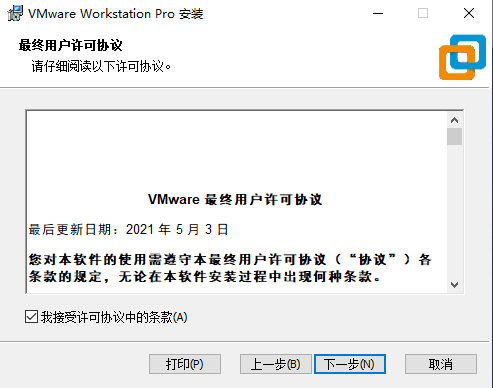

Modify the installation location to the partition of your computer where the software is installed, and click "Next".


Uncheck and click on "Next".


Check Add Shortcut and click "Next".

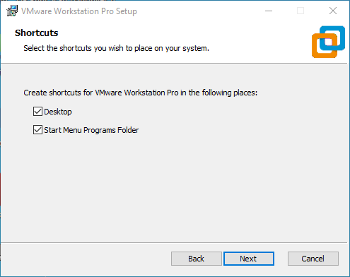

Click "Installation".


Wait for the installation to complete.

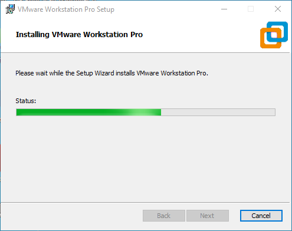

Click "Finish" to try it out. If users need to use it for a long time, they need to buy it from the official and fill in the license.


## 2\. Loading the Existing Ubuntu Development Environment

**Note:**

+ **It is recommended for beginners to directly use the pre-built virtual machine environment provided by Forlinx, which already includes installed cross-compiler and Qt environment. After understanding this chapter, you can directly jump to the compilation chapter for further study;**
+ **The development environment provided for general users is: forlinx (username), forlinx (password);**
+ **Please ask your sales representative for the download link.**

There are two ways to use a virtual machine environment in VMware: one is to directly load an existing environment, and the other is to create a new environment. First talk about how to load an existing environment.

First, download the development environment provided by Forlinx. In the development environment documentation, there should be an MD5 checksum file. After downloading the development environment, you should verify the integrity of the compressed package using the MD5 checksum (You can use an on-line MD5 checksum tool or download a specific MD5 checksum tool for this purpose). To check if the checksum in the verification file matches the checksum of the file itself. If they match, the file download is successful. If they don't match, it suggests that the file may be corrupt, and you should consider downloading it again.

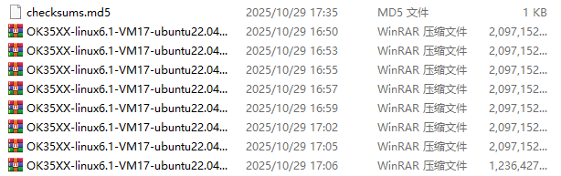

Select all compressed files, right-click and extract to the current folder or your own directory: After unzipping, the development environment 35XX is obtained.

In the development environment folder of OK35XX - linux6.1 - VM17 - ubuntu22.04, the file 35XX.vmx is the one to be opened by the virtual machine.

Open the installed virtual machine.


Select the directory where the recently extracted OK35XX-linux6.1-VM17-ubuntu22.04 virtual machine file is located, then double-click to open the startup file.

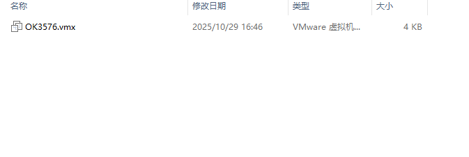

Turn on this virtual machine after loading is complete to run it and enter the system's interface.


The default automatic login account is "forlinx", and the password is "forlinx".


## 3\. New Ubuntu Development Environment Setup

Note: Beginners are not recommended to build the system by themselves. It is suggested to use the existing virtual machine environment. If you do not need to build the environment, you can skip this section. This section mainly explains the process of building the **ubuntu** system.

### 3.1 Ubuntu System Setup

#### 3.1.1 Ubuntu Virtual Machine Setup

Open the VMware software, click on create a new virtual machine. Enter the following interface

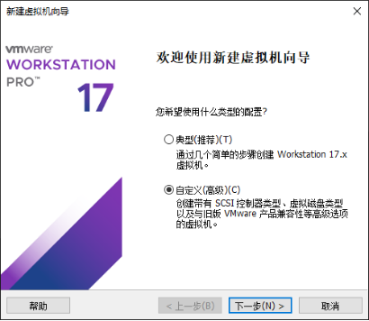

Choose custom, and click “Next”.

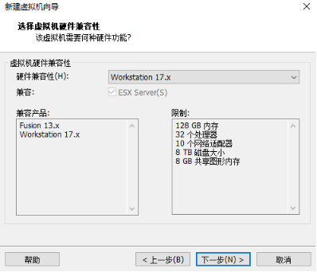

Select the compatibility with the corresponding version of VMware, which can be found in Help->About VMware Workstation, and click "Next".


Select Install the operating system later and click "Next".

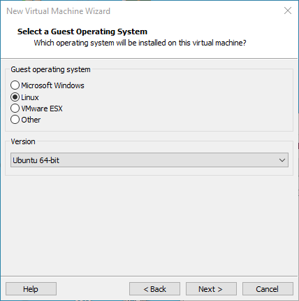

Leave the default and click "Next".


Modify the virtual machine name and installation location, click "Next".


Set the number of processors as appropriate.

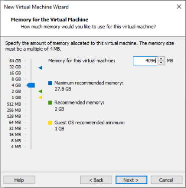

Set the memory size according to the actual situation. It is recommended to use 16G.


Set the network type, the default is NAT mode, click Next. Keep the default values for the remaining steps until you reach the step to specify the disk capacity.


The default selection for the IO controller type here is LSI.


The default selection here is also SCSI.


Choose to create a new virtual disk here.


Set the disk size to 200 gigabytes and select the form in which the disk exists, then click "Next" to finish.


Specify the disk file, the default one here is fine.


Click "Finish" by default.


The virtual machine creation is now complete.

In the next section, we will introduce the installation of Ubuntu system in the virtual machine, which is similar to the installation method in the real machine. Here we describe the method of installing Ubuntu system in a virtual machine.

#### 3.1.2 System Installation

The Ubuntu version to be installed is 22.04. First, go to the official Ubuntu website to obtain the 64-bit image of Ubuntu 22.04. The download address is [https://old-releases.ubuntu.com/releases/22.04.4/](https://old-releases.ubuntu.com/releases/22.04.4/). Download the version “ubuntu-22.04.4-desktop-amd64.iso”.

Right-click on the newly created Ubuntu 64bit and select Settings from the pop-up menu.


The "Virtual Machine Settings Menu" pops up as shown below:


Click on CD/DVD (SATA), select “Use ISO image file,” browse and choose the previously downloaded Ubuntu image, then click “OK” to confirm.


After setting up the image, ensure that the network is available. Then, start the virtual machine and proceed with the installation of the Ubuntu image.


After starting the virtual machine, wait for the installation interface to appear as shown below.

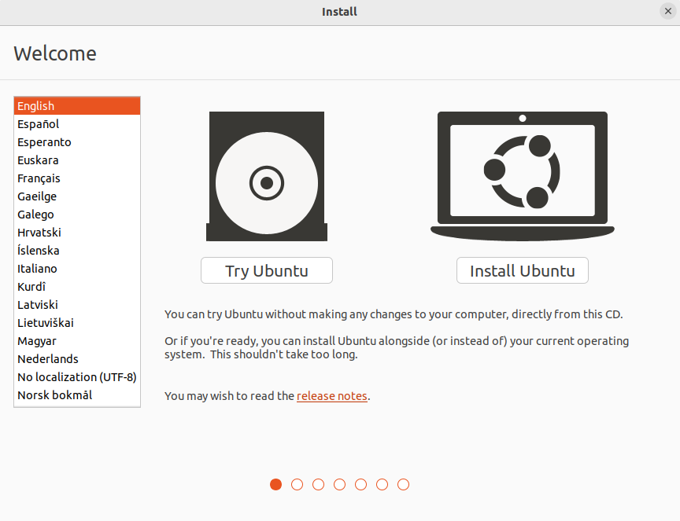

After selecting the language on the left side as shown in the image, click “Install Ubuntu”, and the language selection interface will pop up. Ubuntu default language is English, of course, you can also choose others, the default choice of language in the later stage can also be reset,after selection then click continue.


Next, by default, select continue to finish the installation, the installation process will be very slow, then click "continue":


Next, select continue by default to continue the installation, the installation process will be very slow, and then click “continue”:

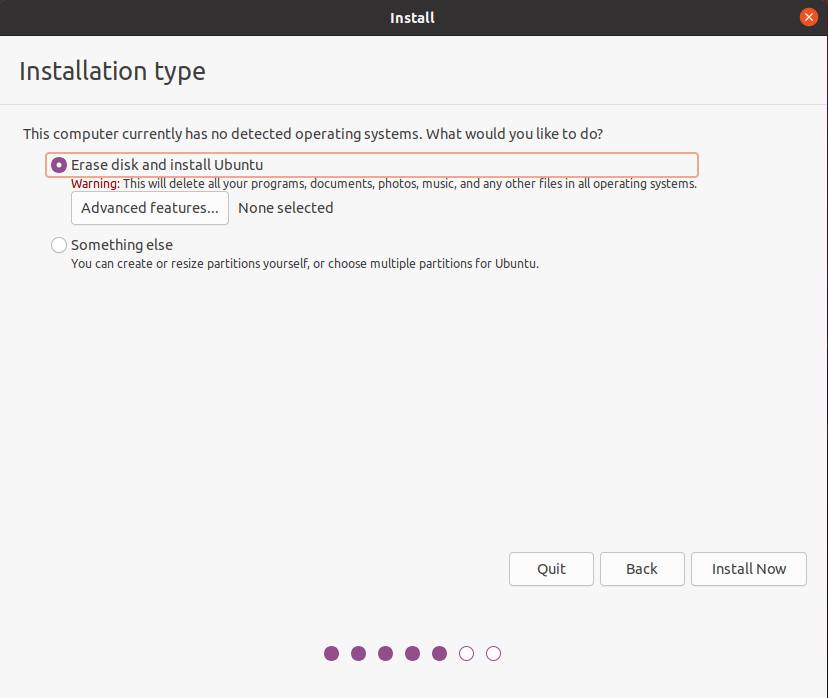


Next, select the timezone. You can either click on the Shanghai timezone or enter "Shanghai" (or choose the appropriate timezone based on your location). Then, click "Continue" to proceed. Finally, set your username and password and click "continue" to automatically install the program:

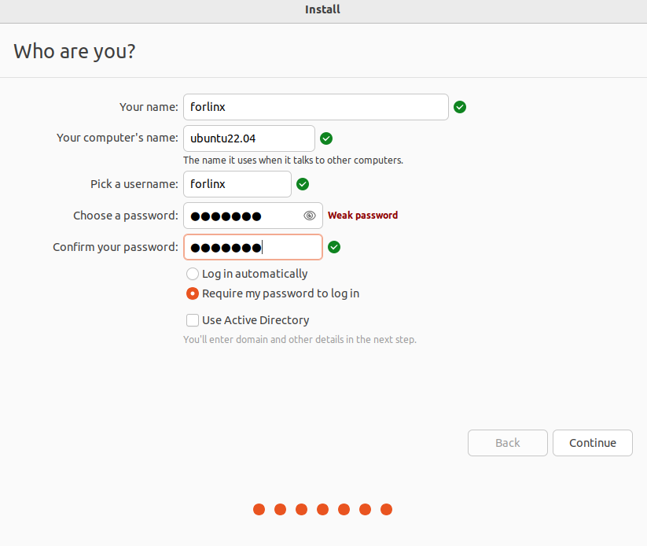

The installation process is shown in the figure below, you can skip it if the network is bad, it will not affect the installation.


After the installation, click "Restart Now" to reboot (or click "Reboot Client"):


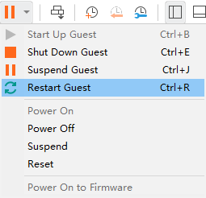

The system interface after the reboot is complete as shown below:


#### 3.1.3 Basic Ubuntu Installation

After installing the Ubuntu22.04 operating system, there are a few configurations to make.

+ **VMware Tools Installation:**

```bash
sudo apt update
sudo apt install open-vm-tools open-vm-tools-desktop
```

+ **Basic Settings:**

Make most of the system settings in the location shown below. A lot of the setup requirements on Ubuntu can be done here.


#### 3.1.4 Ubuntu Network Settings

+ **NAT Mode**

Before using the network, make sure that our virtual machine can connect to the Internet, open the virtual machine settings, and change the network bridge mode in the network adapter to “NAT mode”:


When the VMware virtual NIC is set to NAT mode in a virtual machine, the network in the Ubuntu environment can be set to dynamic IP. The virtual NAT device and the host NIC are connected to communicate for Internet access in this mode. This is the most common way for our VM to get on the extranet.


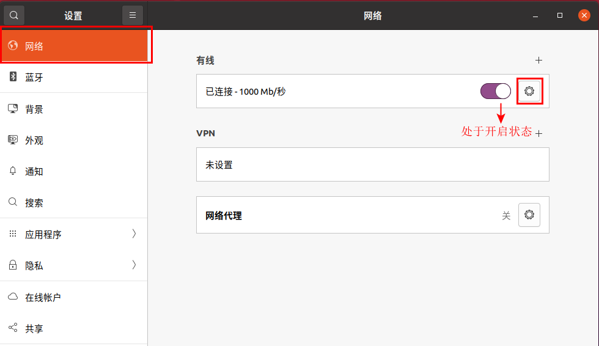

The network is set to dynamic IP.


+ **Bridge Mode:**

If TFTP, SFTP and other servers are used, the network contact mode of the virtual machine needs to be set as the bridge mode. When the VMware virtual NIC is set to bridge mode, the host NIC and the VM NIC communicate via a virtual bridge, which requires the Ubuntu IP to be set to the same network segment as the host IP.


Set a static IP, where Ubuntu's IP and host IP need to be set in the same network segment.


**Note: The IP and DNS involved in the network settings section should be set according to the user's own actual environment, the manual is an example.**

#### 3.1.5 U Disk Loading

Open VM Settings, USB Controller, select USB 3.0 in Compatibility and “OK”. As shown in the picture below, since most computers nowadays support USB3.0 ports, if we don't set it up, when we plug in the USB3.0 port, we can't connect to the virtual machine. The principle is as follows:


After the virtual machine boot, insert the U disk, the virtual machine will be more in the lower right corner of the icon similar to the "U disk", right-click --> connect, and then you can see in the file system to see more than a directory, that the U disk loaded successfully, as shown in the figure:


#### 3.1.6 Virtual Machine Basic Library Installation

Before development, there are some other necessary libraries, we use the following commands to install them one by one, before installation, you need to ensure that the network can be used normally, you can get on the extranet:

```bash
forlinx@ubuntu:~$ sudo apt-get update                        // Update the download source information
forlinx@ubuntu:~$ sudo apt-get install build-essential            // Provide the list information of software packages necessary for compiling programs
forlinx@ubuntu:~$ sudo apt-get install libncurses*               // Used to generate text-based user interfaces
forlinx@ubuntu:~$ sudo apt-get install lzop                     // A compression and decompression tool based on the Lzo library
forlinx@ubuntu:~$ sudo apt-get install net-tools                 // Network configuration tools
```

#### 3.1.7 Installation of Necessary Libraries for Compiling OK1126B Linux Source Code

```bash
forlinx@ubuntu:~$ sudo apt-get update                                       //Update apt-get download source
forlinx@ubuntu:~$ sudo apt-get install openssh-server vim git fakeroot libsqlite3-dev          //Installation of the necessary tool kit
forlinx@ubuntu:~$ sudo apt-get update && sudo apt-get install git ssh make gcc libssl-dev \
liblz4-tool expect expect-dev g++ patchelf chrpath gawk texinfo chrpath \
diffstat binfmt-support qemu-user-static live-build bison flex fakeroot \
cmake gcc-multilib g++-multilib unzip device-tree-compiler ncurses-dev \
libgucharmap-2-90-dev bzip2 expat gpgv2 cpp-aarch64-linux-gnu libgmp-dev \
libmpc-dev bc python-is-python3 python2 gettext libc6-dev libncurses-dev rsync
```

These library files are the ones that need to be downloaded when compiling the Linux source code by building the OK1126B Linux compilation environment by yourself. If you are not building the OK1126B Linux development environment, you can skip this step.

### 3.2 Installation of Cross-compilation Chain

User Materials/2 - Images and Source Codes/Cross - Compilation Toolchain/aarch64 - buildroot - linux - gnu\_sdk - buildroot.tar.gz.

Copy the above compressed package to the development environment/home/forlinx/, and decompress it in this directory:

```bash
forlinx@ubuntu:~$ tar -zvxf aarch64-buildroot-linux-gnu_sdk-buildroot.tar.gz
```

Go to the aarch64-buildroot-linux-gnu \_ sdk -buildroot directory and execute relocate-sdk. Sh.

```bash
forlinx@ubuntu:~/aarch64-buildroot-linux-gnu_sdk-buildroot$ ./relocate-sdk.sh
```

### 3.3 Qt Creator Installation

Copy qt-creator-opensource-linux-x86\_64-4.7.0.run to any directory within the current user’s home directory, and then run the following command.

+ Path: OK1126B-C（Linux）User's Manual\\Linux\\source code \\qt-creator-opensource-linux-x86\_64-4.7.0.run

```bash
forlinx@ubuntu:~$ ./qt-creator-opensource-linux-x86_64-4.7.0.run                   
```

Then the installation window of the graphical interface will pop up, and install according to the instructions:

 

 

If you install online, you need to register your own Qt account. If you already have a Qt account, you can log in directly. The requirements for the Qt password are: it should include capital letters, lowercase letters, and numbers. After successful registration and login, click "Next‘.

If you install offline, you can skip it.


Click "Next".


You can set the installation path according to your own habits. It is set by default here, so click "Next".


To fully install, click "Next".


Click "Install" and wait for the installation to complete.


When the installation is complete, click "Finish". At this time, the Qt interface will be opened automatically. You can also start it through the command line. Execute the following command to open Qt Creator in the backstage. When you opens it, the actual installation path shall prevail:

```bash
forlinx@ubuntu:~$ cd /home/forlinx/qtcreator-4.7.0/bin
forlinx@ubuntu:~$ ./qtcreator &
```


The Qt Creator tool screen appears. Qt Creator is installed.

## 4\. Related Code Compilation

This chapter mainly describes the compiling method of the source code related to the development board, including the kernel source code compilation and the application program compilation.

### 4.1 Preparation Before Compilation

#### 4.1.1 Environment Description 

+ Development environment OS: Ubuntu22.04 64 bit version
+ Cross-toolchain: aarch64-linux-gnu
+ The board uses the Bootloader version: u-boot-2017.09.
+ Development Board Kernel: Linux-6.1.118
+ Development board porting QT version: qt5.15.11

#### 4.1.2 Source Code Copy

Program source code: User Materials\\2 - Images and Source Codes\\Source Codes\\OK1126B - linux - source.tar.bz2.0\*

Buildroot software package: User Materials\\2 - Images and Source Codes\\Source Codes\\dl.tar.bz2

Create a working directory and place the source code and dl.tar.bz2 in the work directory.

```bash
forlinx@ubuntu:~$ cd /home/forlinx/work					//Switch to the working directory
forlinx@ubuntu:~/work$ cat OK1126B-linux-source.tar.bz2.0* > OK1126B-linux-source.tar.bz2
forlinx@ubuntu:~/work$ tar -vxf OK1126B-linux-source.tar.bz2  //Decompress the compressed packet in the current location
forlinx@ubuntu:~/work$ cd /home/forlinx/work/OK1126B-linux-source/buildroot
forlinx@ubuntu:~/work/OK1126B-linux-source/buildroot$ tar -vxf ../../dl.tar.bz2	//Unzip dl.tar.bz2 under buildroot
```

Just run the command and wait for it to complete.

### 4.2 Source Code Compilation

**Note:**

+ **After the kernel source code is decompressed for the first time, the source code needs to be compiled as a whole;**
+ **After compiling as a whole, you can compile separately according to the actual situation;**
+ **The source code compilation requires a development environment with a running memory of 8G or above. Please do not modify the VM virtual machine image configuration provided by us.**

#### 4.2.1 Full Compilation Test

In the source code path, the compilation script build. Sh is provided. Run the script to compile the entire source code. You need to switch to the decompressed source code path at the terminal and find the build. Sh films

```bash
forlinx@ubuntu:~/work/OK1126B-linux-source/buildroot$ cd /home/forlinx/work/OK1126B-linux-source
forlinx@ubuntu:~/work/OK1126B-linux-source$ rm output/defconfig
```

The following operations need to be operated under the source code directory, and the full compilation method is:

Full Compilation.

```bash
forlinx@ubuntu:~/work/OK1126B-linux-source$ ./build.sh
```


After successful compilation, the system image will be generated under the rockdev folder, as shown in the following figure:

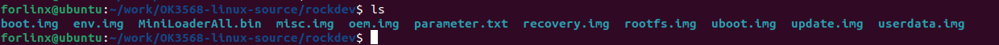

**Note: The update. img is packaged for full programming of OTG or TF card, and other files are programmed step by step.**

#### 4.2.2 Individual Compilation

The user performs the operation in the kernel source code path.

```bash
forlinx@ubuntu:~/work/OK1126B-linux-source$ ./build.sh kernel
```


The kernel in the update. img is not updated after successful compilation. Please flash the kernel/boot. img file step by step.

#### 4.2.3 Clearance of Files Generated by the Compilation

Perform the operation in the source code path.

```bash
forlinx@ubuntu:~/work/OK1126B-linux-source$ ./build.sh cleanall
```


This operation clears all intermediate files. However, it does not affect the source files, including those that have already had changes made to them.

#### 4.2.4 Kernel Configuration

If you want to configure the kernel, you must first complete a full compilation.

Perform the following operations in the source code directory.

```bash
forlinx@ubuntu:~/work/OK1126B-linux-source$ ./build.sh kconfig
```

After adding or modifying configurations, save and exit. Afterwards, it can be compiled directly.

### 4.3 Use of Image File 

The update. img is packaged for full programming of OTG or TF card, and other files are programmed step by step. The Image file, generated by a separate compilation, will not be updated in the update.img file. And it needs to be burned using single-step burn (see user manual OTG burn for details).

### 4.4 Qt Creator Environment Configuration

Qt is a cross-platform graphics development library, which supports many operating systems. Before compiling, you need to configure the compiling environment of Qt Creator.

#### 4.4.1 Cross Compiler Configuration

Note: The default development environment does not have the cross - compilation chain installed. You need to refer to 3.3 Install the Cross - Compilation Chain to install it (the recommended installation path is /home/forlinx/aarch64 - buildroot - linux - gnu\_sdk - buildroot).

**Note: Enter aarch64-buildroot-linux-gnu\_sdk-buildroot to execute relocate-sdk.sh.**

```bash
forlinx@ubuntu:~/aarch64-buildroot-linux-gnu_sdk-buildroot$ ./relocate-sdk.sh
```

1\. Enter the installation path of qtcreator and open qtcreator;

```bash
forlinx@ubuntu:~/qtcreator-4.7.0/bin$ ./qtcreator
```

2\. Click Tools-> Options-> Kits-> Compilers in Qt Creator, and then click Add-> GCC-> C;

3\. Name enters GCC;

4\. Paste the path of the compilation chain to the Compiler Path, as shown in the following figure:

- Path: /home/forlinx/aarch64-buildroot-linux-gnu\_sdk-buildroot/bin/aarch64-linux-gcc


5\. Follow the same method to add the GCC compiler, click “Add->GCC->C++” on the right, as shown in the figure:

- Path: /home/forlinx/aarch64-buildroot-linux-gnu\_sdk-buildroot/bin/aarch64-linux-g++


#### 4.4.2 Qt Versions Configuration

1\. Click Tools- > Options- > Qt Versions in Qt Creator;

2\. Then click Add to pop up a dialog box to select /home/forlinx/aarch64-buildroot-linux-gnu\_sdk-buildroot/bin/qmake;

3\. Click open to add;

4\. Then it will return to the Qt Version configuration box, and the Version name can be changed by itself;

5\. Then click "Apply and OK".


#### 4.4.3 Kits Configuration

Kits is a build kit for building and selecting development build environments useful for projects with multiple QT libraries. Add the previously added cross-compiler and QT Version to Kits to build a compilation environment suitable for the development board.

1\. Click Tools- > Options- > Kits in Qt Creator, and then click Add to display the configuration section;

2\. Name changes by itself;

3\. Compiler selects GCC;

4\. Qt version selects the name entered when the Qt version was created;

5\. Then click "Apply and OK".


### 4.5 Application Compilation and Operation

#### 4.5.1 Command Line Application Compilation and Operation

In this section, the watchdog test program is used. By default, the source code is copied to the /home/forlinx/work directory.

1\. Use the cd command to enter the test source code directory;

```bash
forlinx@ubuntu:~$ cd /home/forlinx/work/OK1126B-linux-source/app/forlinx/forlinx_cmd/fltest_watchdog
```

2\. Add the cross-compiler path and use make to cross-compile;

```bash
forlinx@ubuntu:~/work/OK1126B-linux-source/app/forlinx/forlinx_cmd/fltest_watchdog$ export PATH=/home/forlinx/aarch64-buildroot-linux-gnu_sdk-buildroot/bin/:$PATH
forlinx@ubuntu:~/work/OK1126B-linux-source/app/forlinx/forlinx_cmd/fltest_watchdog$ aarch64-linux-gcc watchdog.c -o fltest_watchdog
```

3\. Use the file command to view the generated file information.

```bash
forlinx@ubuntu:~/work/OK1126B-linux-source/app/forlinx/forlinx_cmd/fltest_watchdog$ /usr/bin/file fltest_watchdog 
fltest_watchdog: ELF 64-bit LSB pie executable, ARM aarch64, version 1 (SYSV), dynamically linked, interpreter /lib/ld-linux-aarch64.so.1, for GNU/Linux 3.7.0, not stripped
```

From the result, you can see that the compiled 64-bit ARM file.

4\. Copy the fltest \_ watchdog generated by compiling to the board through U disk or FTP, for example, under the/forlinx path. Take the TF card as an example, and copy it to the development board and run the test.

```bash
root@OK1126B-buildroot:~# cp /run/media/sda1/fltest_watchdog /root/
root@OK1126B-buildroot:~# ./fltest_watchdog
Watchdog Ticking Away!
```

#### 4.5.2 QT Application Compilation and Operation

Open Qt Creator in the development environment (users should open it according to their actual paths). Click File -> Open File or Project in Qt Creator. In the pop - up window, select /home/forlinx/work/OK3568 - linux - source/app/forlinx/flapp/src/watchdog/watchdog.pro.

```bash
forlinx@ubuntu:~$ cd qtcreator-4.7.0/bin/
forlinx@ubuntu~/qtcreator-4.7.0/bin$ ./qtcreator &
```

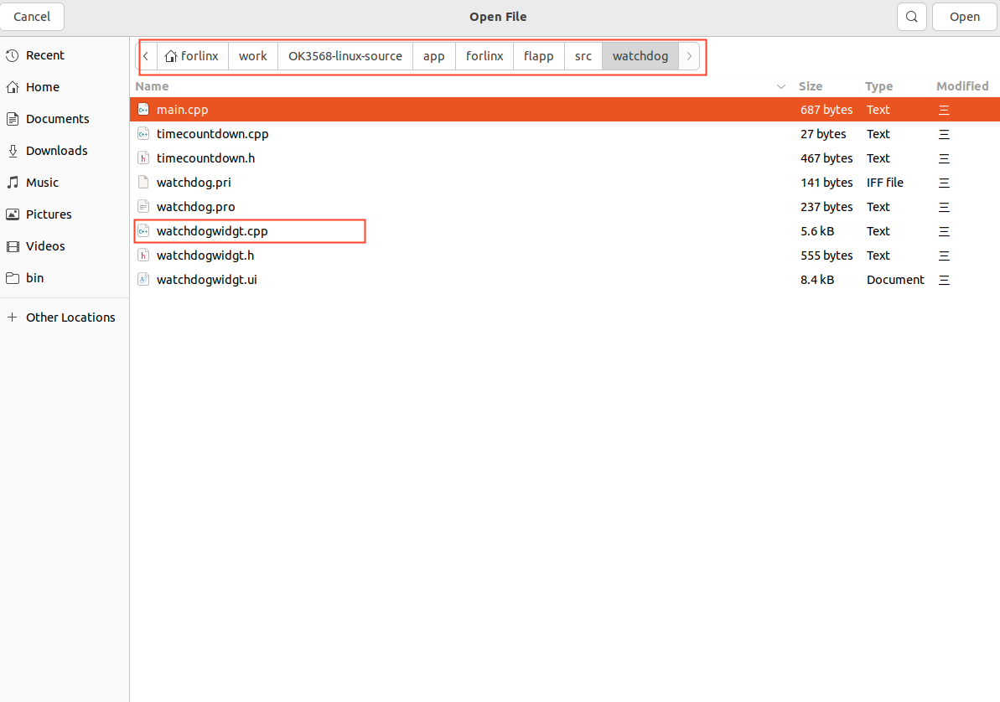

After opening the project, the interface is as follows: (If the page is not automatically changed, please select as shown in the screenshot).

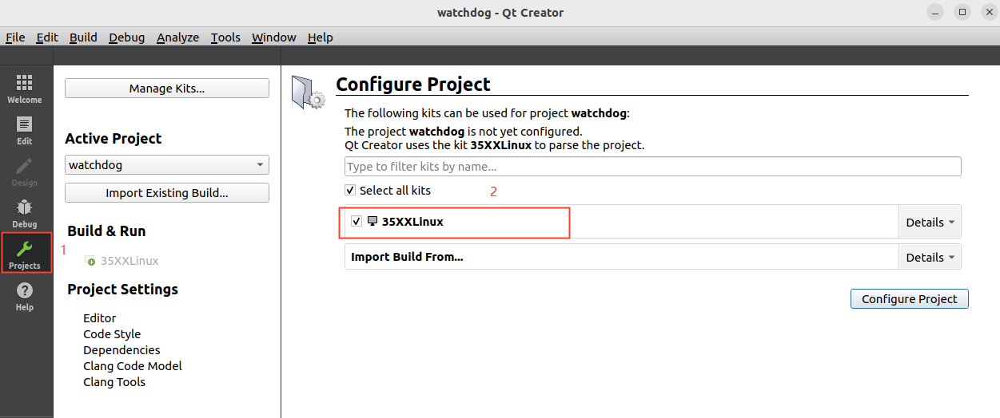

Click Configure Project to adapt to the build environment described in the “Qt Creator Environment Configuration” section of this manual.


Click Build->Clean All to clear it. (If the intermediate file is not cleared, it can be deleted manually).

Click Projects to uncheck Shadow build.

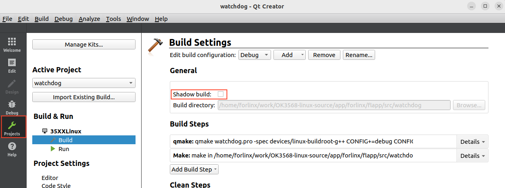

Then click Build-> Build All to compile.

After the Build progress bar in the lower - right corner finishes, it means the compilation is complete. At this time, you will see the newly generated binary file fltest\_qt\_watchdog in the directory /home/forlinx/work/OK1126B - linux - source/app/forlinx/flapp\_out/, as follows:

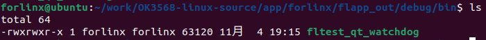

Copy the executable file generated by compiling to the board through U disk or FTP, copy it to the development board, and run the test.