# User’s Hardware Manual\_V1.0

Document classification: □ Top secret □ Secret □ Internal information ■ Open

## Copyright

The copyright of this manual belongs to Baoding Folinx Embedded Technology Co., Ltd. Without the written permission of our company, no organizations or individuals have the right to copy, distribute, or reproduce any part of this manual in any form, and violators will be held legally responsible.

Forlinx adheres to copyrights of all graphics and texts used in all publications in original or license-free forms.

The drivers and utilities used for the components are subject to the copyrights of the respective manufacturers. The license conditions of the respective manufacturer are to be adhered to. Related license expenses for the operating system and applications should be calculated/declared separately by the related party or its representatives.

| **Format**| **Meaning**|
|:----------:|----------|
| **Note** | **Note or information that requires special attention, be sure to read carefully** |
| 📚 | Relevant notes on the test chapters|
| ️️️️🛤️️ | Indicates the related path |

## Revision History

| **Date**| **Manual Version**| **SoM Version**| **Carrier Board Version**| **Revision History**|
|:----------:|:----------:|:----------:|:----------:|----------|
| 22/12/2025 | V1.0| V1.0| V1.1| Initial Version|

## Overview

This manual is designed to help you quickly familiarize yourselves with the product, understand interface functions and configuration, and primarily discusses the interface functions of the development board, interface introductions, product power consumption, and troubleshooting issues that may arise during use. Some commands were commented to make it easier for you to understand (adequate and practical for the purpose). For information on pin function multiplexing, hardware troubleshooting methods, etc., please refer to Forlinx’s “FET1126B-S\& FET1126BJ-S Pin Multiplexing Comparison Table”.

There are total four chapters:

+ Chapter 1. is CPU overview, briefly introducing its performance and applications;
+ Chapter 2. is comprehensive introduction to the SoM, including connector pins explanations and function introductions;
+ Chapter 3. is comprehensive introduction to the development board, divided into multiple chapters, including both hardware principles and simple design ideas;
+ Chapter 4. mainly describes the board’s power consumption performance and other considerations.

A description of some of the symbols and formats associated with this manual:

## 1\. Rockchip RV1126B Description

The RV1126B is a high - performance vision processor SoC suitable for machine vision applications, especially AI - related ones.

It is based on a quad - core ARM Cortex - A53 64 - bit core, integrating NEON and FPU. Each core is equipped with a 32KB instruction cache and a 32KB data cache, and there is also a unified 512KB L2 cache. The built - in NPU supports INT8/INT16 mixed - precision computing, with a computing power of up to 3.0 TOPs. Moreover, thanks to its strong compatibility, it can easily convert network models based on a series of frameworks such as TensorFlow, MXNet, PyTorch, and Caffe.

The RV1126B introduces a new - generation fully hardware - based ISP (Image Signal Processor) and post - processor with a maximum of 12 megapixels. It implements many algorithm accelerators, such as HDR, 3A, LSC, 3DNR, 2DNR, sharpening, dehazing, fisheye correction, gamma correction, feature point detection, etc. In addition, an AI - ISP with a maximum of 8 megapixels is introduced as a supplement to the traditional ISP, providing better spatial noise reduction performance and enhanced image enhancement effects. With two MIPI CSI (or LVDS/SubLVDS) interfaces and one DVP (BT.601/BT.656/BT.1120) interface, you can build a system that can simultaneously receive video data from four camera sensors.

The built - in video encoder of the RV1126B supports H.265/H.264 video encoding and also supports multi - stream encoding. Using this feature, the camera’s video can be encoded at a higher resolution and stored in local memory, while another lower - resolution video can be transmitted to cloud storage.

The H.264/H.265 video decoder of the RV1126B supports 4Kp30 for both H.264 and H.265. In addition to the previous high - performance multimedia modules, the RV1126B also includes a rich set of audio, memory, and other peripheral interfaces, such as I2C, SPI, PWM, etc. These can help you add more sensors or other peripherals to the entire system, thereby improving the system’s flexibility and scalability.

The RV1126B is equipped with high - performance external DRAM (DDR3/DDR3L/DDR4/LPDDR3/LPDDR4/4X), which can meet high - bandwidth memory requirements.

**RV1126B Processor Block Diagram**

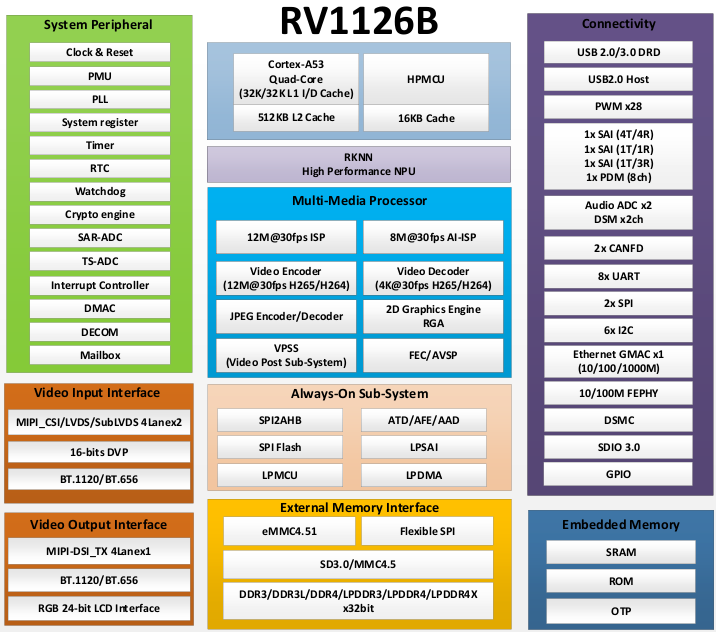

## 2\. FET1126B-S SoM Description

### 2.1 FET1126B-S SoM Appearance

**Front**

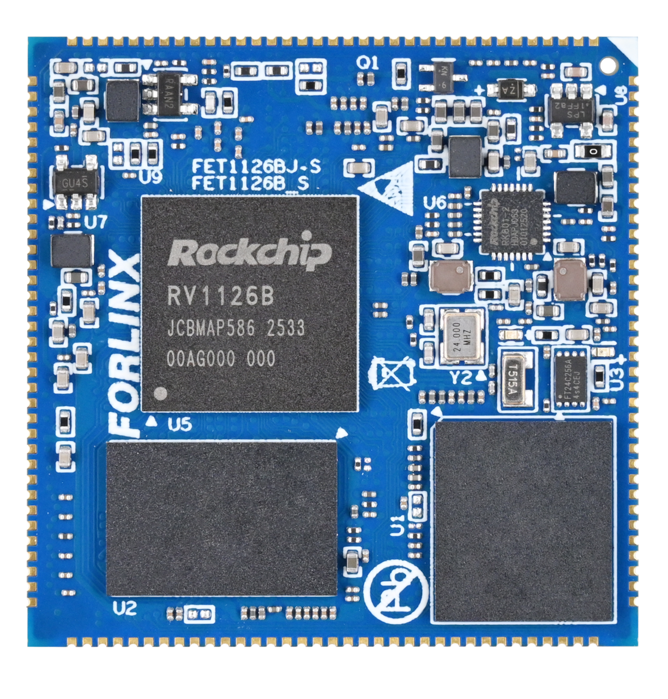

**Back**

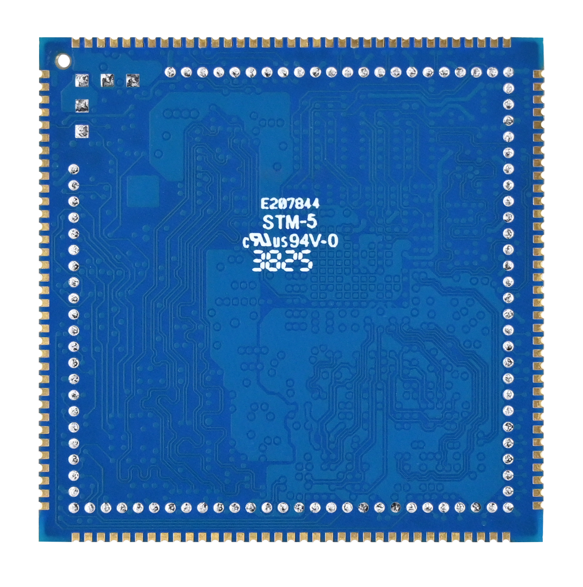

### 2.2 FET1126B-S SoM Dimension Diagram

FET1126B-S SoM Dimension Diagram

Structure size: 40mm × 40mm, dimensional tolerance ± 0.13mm, refer to DXF file for more dimensional information.

Plate making process: 1.2mm thickness, 10-layer immersion gold PCB.

Stamp hole + LGA package, total 237 pins. 140 stamp hole pins, with a center - to - center pin spacing of 1 mm.

97 LGA pins, with a center - to - center pad pin spacing of 1.27 mm (**Note: There are five additional square pads in the LGA form, which are not related to functional interfaces. They are mainly used for mass - production aging. They don’t need to be led out from the carrier board during normal design use**).

### 2.3 Performance Parameters

#### 2.3.1 System Main Frequency

| **Name**| **Specification**| | | | **Description**|
|:----------:|:----------:|----------|----------|----------|:----------:|
| | **Minimum**| **Typical**| **Maximum**| **Unit**|
| Main Frequency| —| —| 1.6| GHz| Commercial level|
| | —| —| 1.3| GHz| Industrial-grade|
| RTC clock| —| 32.768| —| KHz| —|

#### 2.3.2 Power Parameter

| **Parameter**| **Pin Number**| **Specification**| | | | **Description**|
|:----------:|:----------:|:----------:|----------|----------|----------|:----------:|
| | | **Minimum**| **Typical**| **Maximum**| **Unit**|
| Main Power Supply Voltage| VSYS| 4.75| 5| 5.25| V| —|
| No-load current| —| | | | mA| See Appendix Power Consumption Table|
| High-load current| —| | | | mA| See Appendix Power Consumption Table|

#### 2.3.3 Operating Environment

| **Parameter**| | **Specification**| | | | **Description**|
|:----------:|----------|:----------:|----------|----------|----------|:----------:|
| | | **Minimum**| **Typical**| **Maximum**| **Unit**|
| Operating Temperature| Operating Environment| -20| 25| +85| ℃| Commercial level|
| | Storage Environment| -40| 25| +125| ℃|
| | Operating Environment| -40| 25| +85| ℃| Industrial-grade|
| | Storage Environment| -40| 25| +125| ℃|
| Humidity| Operating Environment| 10| —| 90| ％RH| No condensation|
| | Storage Environment| 5| —| 95| ％RH|

### 2.4 CPU Interface

| **Function**| **Quantity**| **Parameter**|
|:----------:|:----------:|----------|
| USB| 2| 1 x USB2.0 Host|
| RGB| ≤1| Supports RGB 888, maximum resolution 1920 \* 1080@ 60fps|
| MIPI DSI| ≤1| 4lane,1.5Gbps/lane|
| MIPI CSI| ≤2| Supports 2 x 4lane, 2.5Gbps/lane; it can be split into 4 x 2lane|
| Ethernet| ≤1| Supports 1 x RGMII or 1 x 100 - Mbps PHY (built - in the CPU) is supported. The RV1126B comes with one GMAC controller, which allows for external expansion of 100 - Mbps/1000 - Mbps Ethernet PHY chips via RMII/RGMII interfaces. Switching to the built - in 100 - Mbps FEPHY is also an option. Only one of the two can be selected and they cannot be used simultaneously. |
| UART| ≤8| Maximum supported baud rate is 4Mbps. UART1 - UART7 support automatic flow control |
| FSPI| ≤1| Supports startup and 1/2/4 - bit modes|
| SPI| ≤2| Supports both master and slave mode|
| SAI| ≤3| It can be used to communicate with peripherals such as audio ADC, audio DAC, audio Codec, DSP, etc. It can also provide integrated audio input and output support for video input/output interface. |
| I2C| ≤5| Supports 7bits and 10bits address modes up to 1 Mbit/s|
| CANFD| ≤2| Supports CAN-FD V1.0 and CAN2.0 A/B；|
| PWM| ≤27| Supports up to 27 channels of PWM|
| SDIO 3.0| ≤2| 1 x TF card interface, supporting high - speed cards; and 1 x SDIO with a 3.3V level|
| ADC| ≤24| 24 single - ended inputs, 13bit, 2MSPS|
| DSMC| ≤1| 1 x master mode interface. The DSM \_ AUD \_ RN/P is a group of pins, which can only be configured as DSM \_ AUD functions at the same time. One cannot be configured as DSM \_ AUD and the other cannot be configured as other functions. Same for the DSM \_ AUD \_ LN/P |
| Audio ADC| ≤2| 2 x differential MIC inputs and 2 x Audio DSM differential outputs|
| GPIO| ≤118| There are 133 GPIOs in total, and 15 GPIOs are used inside the SoM, which are not led out. |

**Note: The parameters in the table are the theoretical values of hardware design or CPU.**

### 2.5 FET1126B-S SoM Pins Definition

#### 2.5.1 FET1126B-S SoM Pins Schematic

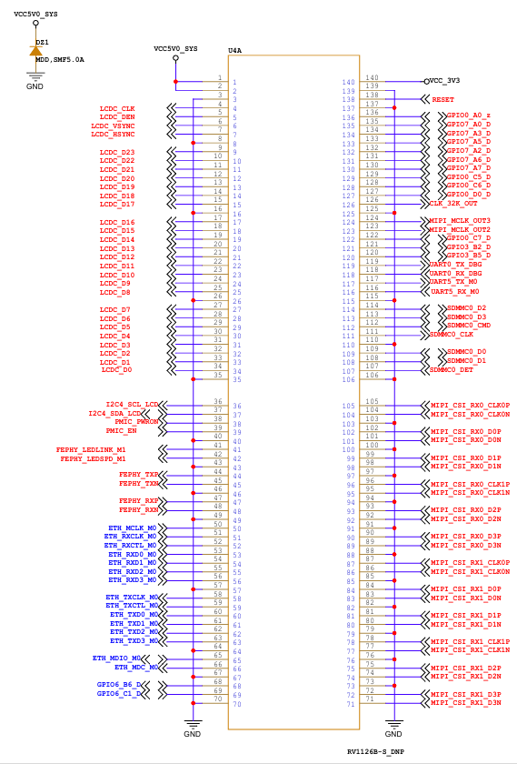

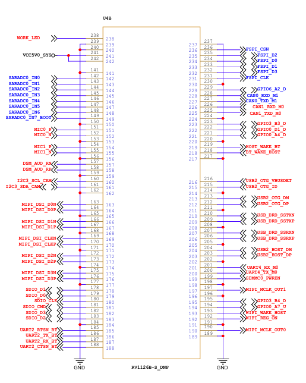

#### 2.5.2 FET1126B-S SoM Pins Description

When you have multiple functional expansion requirements, please refer to the user guide "FET1126B-S\&FET1126BJ-S Pin Multiplexing Table". However, for more detailed information, it is recommended to consult relevant documents, the chip datasheet, and the reference manual.

### 2.6 FET1126B-S SoM Pins Definition

#### 2.6.1 SoM Hardware Design Description

**Power Pin**

| **Function**| **Signal Name**| **I/O**| **Default Function**| **Pin Number**|
|:----------:|:----------:|:----------:|----------|:----------:|
| Power| VCC5V0\_SYS| Power Input| The power supply pin for the SoM is 5V, and the carrier board provides a current of no less than 2.5A. ||
| | VCC3V3| Power output| Used only for carrier board power - on sequence||
| | GND| Ground| SoM power ground and signal ground, all GND pins need to be connected ||

**Function Control Pin**

| **Function**| **Signal Name**| **I/O**| **Default Function**| **Pin Number**|
|:----------:|:----------:|:----------:|----------|:----------:|
| CPU reset| RESET| I| SoM power reset, active low, users should not add additional capacitive loads on this pin, so as not to affect the normal startup of the SoM.| 138|
| Power On/Off| PMIC\_PWRON| I| Low level is valid, long press to turn off, short press to turn on| 38|
| BOOT mode selection| SARADC0\_IN7\_BOOT| I| When the signal is grounded, the startup card enters the Maskrom download mode.| 149|
| Debugging serial port| UART0\_TX\_DBG   UART0\_RX\_DBG| I/O| Debugging serial port.It is recommended that the user keep the port function.| 119   118|

It includes the minimum system block diagram.

The power supply, reset monitoring circuit, and storage circuit are integrated on the FET1126B - S SoM, requiring extremely simple external circuits. To form a minimum system, it only needs a 5V power supply to operate. Please refer to "Appendix IV" for the minimum system schematic.

Normally, in addition to building the minimum system, it is recommended to connect some external devices, such as the debugging serial port and the image burning port. Without connecting these devices, you will not be able to determine whether the system has started. After completing the above steps, you can further add the required functions according to the default interface definitions of the SoM provided by Forlinx. 

Please refer to section 3.5 in “3. OK1126Bx Carrier Board Description” for the peripheral circuits.

## 3\. OK1126Bx-S Development Platform Description

### 3.1 OK1126Bx-S Development Board Interface Diagram

The connection of OK1126Bx SoM and the carrier board is edging connection +LGA, and the main interfaces are as follows:

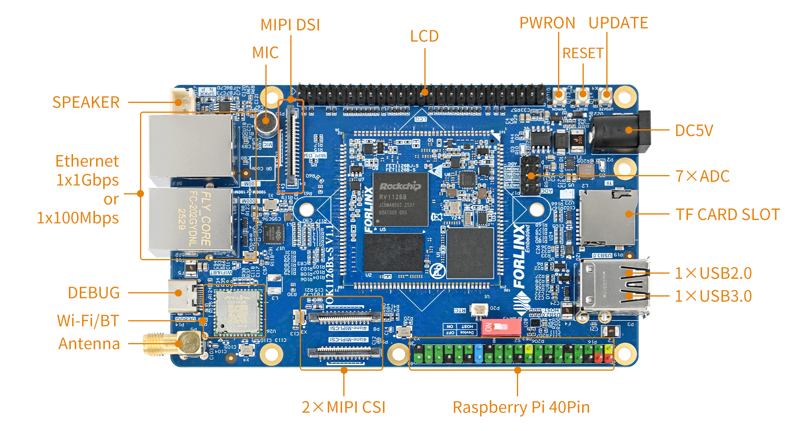

### 3.2 OK1126Bx-S SoM Dimension Diagram

OK1126Bx-S Development Board Dimension Diagram:

PCB Size: 120mm × 75mm

Fixed hole size: spacing: 90.6mm × 68mm, hole diameter: 3.2mm.

Plate making process: thickness 1.6mm, 4-layer PCB.

Power supply voltage: DC 5V.

### 3.3 Carrier Board Naming Rules

ABC-D+IK:M

| **Field**| **Field Description**| **Value**| **Description**|
|:----------:|:----------:|:----------:|----------|
| A| Qualification level| PC| Prototype Sample|
| | | Blank| Mass Production|
| B| Product line identification| OK| Forlinx Embedded development board|
| \-| Segment Identification| \-|
| C| CPU Name| 1126B| OK1126Bx|
| \-| Segment Identification| \-|
| D| Connection| S| Stamp hole+LGA|
| \+| Segment Identification| \+| The configuration parameter section follows this identifier.|
| I| Operating Temperature| C| 0 to 70℃  commercial-grade|
| | | I| -40 to 85℃   industrial  level|
| K| PCB Version| 11| V1.0|
| | | xx| Vx.x|
| :M| Internal Identification of the Manufacturer| :X| This is the internal identification of the manufacturer and has no impact on the use.|

### 3.4 Carrier Board Resources

#### 3.4.1 SoM Configuration Resources

| **Function**| **Quantity**| **Parameter**|
|:----------:|:----------:|----------|
| TF Card| 1| Support maximum SDR104 rate|
| KEY| 3| CPU reset, power on/off and startup key|
| UART Debug| 1| Integrated in a Type-C port that can be connected to a computer for debugging|
| USB2.0| 2| 1 x USB \_ HOST is led out by USB socket, and one USB \_ OTG is led out by Type-C for OTG programming or combined with USB3.0 and led out by USB3.0 socket. |
| USB3.0| 1| 1 x USB3.0 HOST led out through USB3.0 socket|
| WiFi Bluetooth| 1| Single antenna 2.4G \& 5GHz Wi-Fi Dual-band 1X1 802.11ac +Bluetooth 4.2|
| SPI| 1| SPI1 is led out by the Raspberry Pi 40PIN pin|
| RTC| 1| External CR2032 button battery, power-off hold-up time|
| Ethernet| 1| Led out from a standard RJ45 socket, with either a 100Mbps port or a 1Gbps port. The RV1126B is equipped with 1 x GMAC controller, which can provide RMII/RGMII interfaces externally to expand external Ethernet 100Mbps/1Gbps PHY chips. It can also switch to the built - in 100Mbps FEPHY. Only one of the two options can be selected and they cannot be used simultaneously. |
| UART| 1| UART5 is led out by the Raspberry Pi 40PIN pin|
| CAN| 2| CAN0 and CAN1 are led out by the Raspberry Pi 40PIN pin|
| I2C| 2| I2C3 and I2C4 are led out by the Raspberry Pi 40PIN pin|
| SPEAKER| 1| Led out the power amplifier chip, it can be externally connected to a 4Ω-3.3 W speaker|
| MIC| 2| 1 x is connected to the board-loaded electret, and the other path is not led out|
| ADC| 7| 7 x ADC, led out through pin header |
| MIPI-CSI| 2| Led out via FPC socket, 4lane+4lane|
| LCD| 1| Led out through pin header, supporting capacitive touch screen and backlight brightness adjustment|
| MIPI\_DSI| 1| 4-lane MIPI-DSI, support capacitive touch screen and backlight brightness adjustment|
| FSPI| 1| It can be externally connected with FLASH chip and can support startup.|

**Note: The parameters in the table are the theoretical values of hardware design or CPU.**

### 3.5 OK1126Bx-S Carrier Board Description

**Note:** 

- **The component UID with "\_DNP" mark in the diagram below represents it is not soldered by  default;**
- **The schematic diagrams in this manual are only for interface description. When users conduct hardware design, please refer to the source file materials.**

#### 3.5.1 Carrier Board Power

As shown in the figure, the development board is powered by a 5V DC power supply through the DC005 power socket P2. The DC 5V power supply outputs VDD\_5V to the System on Module (SoM) after it passes through a self-recovery fuse, an anti-reverse connection diode, and an overvoltage protection circuit. Once the SoM is powered on, VDD33 is generated to enable the carrier board (U2) to be activated. Additionally, VCC\_5V, VCC\_3V3 and VCC\_1V8 provide power to the devices on the carrier board.

VDD33 ensures that the SoM is powered on first, followed by the carrier board, to prevent the occurrence of the latch - up effect, which could damage the CPU.

#### 3.5.2 Switch Key \& Reset Key

K1 is the CPU reset key of the development board, which can be pressed to reset the CPU.

K7 is the on/off key of the development board. By default, the board starts automatically when it is powered on. Press the key for a long time in the power-on state to turn off the board, and then press it for a short time to turn on the board.

#### 3.5.3 Boot Configuration

The device OK1126Bx determines the boot method by measuring the voltage at the SARADC0\_IN7\_BOOT pin. The SoM is already configured for this circuit, with the default boot priority as follows: FSPI, eMMC, TF Card, and then USB.

The FSPI chip soldered on the carrier board is a blank chip, and only eMMC is used for startup. System images can be flashed to the TF Card and USB.

If you use a USB cable to connect the board to a computer for image flashing, press and hold the K4 button while powering on the board to enter the Maskrom mode. Then, connect USB0 to the computer to flash the system.

If you use a TF Card to flash the image, you need to make a TF Card in advance. After inserting the card into the board and powering it on, the board will enter the TF - card flashing process. For the detailed flashing process, please refer to the software user manual.

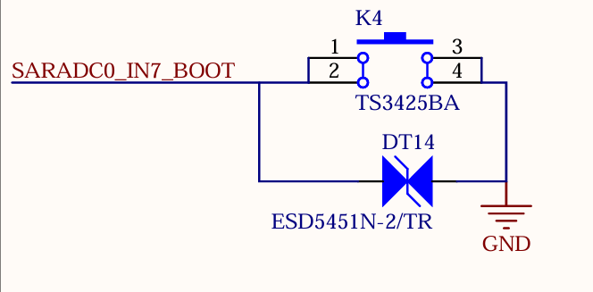

**Note: The SARADC0 \_ BOOT signal is not available for other functions.**

#### 3.5.4 SARADC

The development board supports 7 x ADC interfaces, which are led out through the P17 pin header with a 2.54mm pitch. Among them, the SARADC0\_IN0 has a 10K pull - up resistor on the SoM, and it is pulled up to 1.8V.

#### 3.5.5 Debugging Serial Port

1 x debug serial port is led out through one USB Type-C from the development board. Install the CH342 driver on the computer and connect the P14 port to the computer to start debugging.

**Note: To facilitate later debugging, please lead out these debug serial ports when you design the carrier board by yourselves.**

#### 3.5.6 RTC

The development board is externally connected to an RTC device via I2C4. It uses D4 to enable compatible power supply with both VCC_3V3 and a coin - cell battery. When the carrier board loses power, the CR2032 coin - cell battery, the default battery type for this design, can continue to power the RTC chip. By default, the design utilizes the RX8010SJ chip.

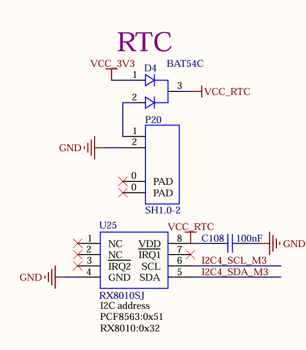

#### 3.5.7 TF Card

The TF Card on the development board is connected to the SDMMC0 channel of the CPU, which supports system startup and programming. The power supply VCC_3V3_SD for the TF card needs to be controlled. Please refer to the carrier board circuit for details.

**Note:**

- **The pull - up resistors on the bus have been adapted on the SoM. Do not perform pull - up processing on the bus on the carrier board;**
- **The TF card is a hot - swappable device. Please take ESD protection measures;**

- **The SD signals need to have equal lengths;**

- **A 10K discharge resistor is reserved on the TF power supply to ensure that the power supply of the SD card can be powered off quickly. This avoids abnormal SD card reading caused by incomplete power discharge during quick plug - and - unplug operations.** 

#### 3.5.8 USB2.0 HOST

There are 1 x USB2.0, which is led out through the USB2.0 in the USB-A double-layer socket P3, with a current limit of 0.5A.

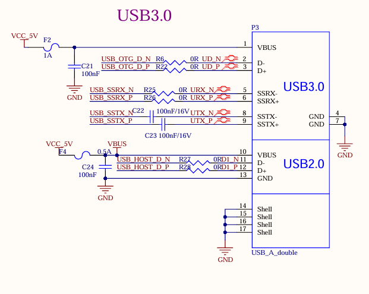

**Note:**

- **All USB data cables need to have a 90Ω differential impedance；**
- **Please select appropriate ESD devices.**

#### 3.5.9 USB3.0 Interface

There are 1 x USB3.0, which is led out through the USB3.0 in the USB-A double-layer socket P3, with a current limit of 1A.

As shown in the figure above, the USB 2.0 signal line in the USB3.0 interface is multiplexed with the download interface. Before the SoM is started, the USB3.0 OTG defaults to the device mode. When the USB 2.0 signal line is used to flash the image, the USB-TYPE-C line is connected to the P6 socket of the development board. There is no need to configure the ID pin. Press and hold the K4 button and power on to enter the maskrom mode programming system.

After the SoM starts, you can switch between the host and device modes through S2. When using the USB 3.0 function, switch S2 to ON and insert the USB device into the P3 socket on the development board.

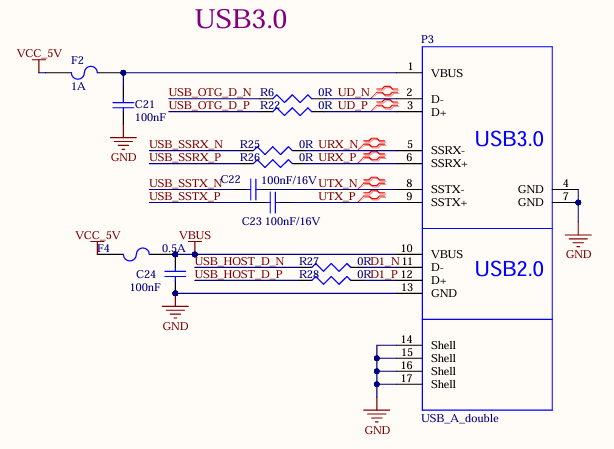

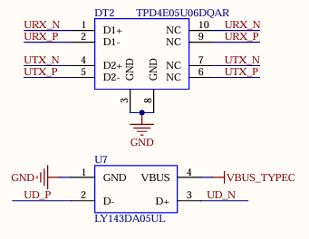

**Note:**

- **Only the native USB3.0 OTG of the SoM supports USB system flashing;**
- **All USB data cables need to have a 90Ω differential impedance；**
- **Please select appropriate ESD devices；**
- **The USB\_OTG\_VBUSDET needs to detect voltage to enable the USB function normally.**

#### 3.5.10 MIPI-DSI

The SoM supports MIPI DSI 4 channels, the maximum transmission rate supported is 1.5G bps/Lane, and the maximum resolution supported is 1920x1080 @ 60Hz. There is a universal LCD interface on the development board, which is led out through an FPC seat P4 with a 0.5mm pitch of 30 P. The MIPI capacitive touch screen produced by Forlinx can be connected. MIPI-DSI and LCD screens can only be used alternatively, not simultaneously.

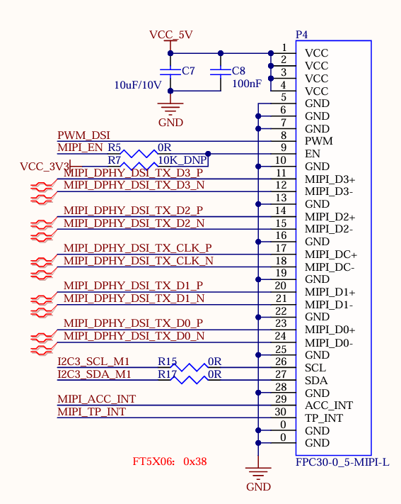

#### 3.5.11 LCD

Development board LCD interface, supporting parallel 24bit RGB mode, maximum output resolution up to 1920x1080 @ 60Hz; the LCD interface is led out from the development board through the 25X2 pin P1 with a pitch of 2.54, which can be converted into a 0.5mm FPC seat with a pitch of 54 P through the adapter board provided by Forlinx, and can be connected to capacitive touch screens of different specifications and sizes produced by Forlinx.

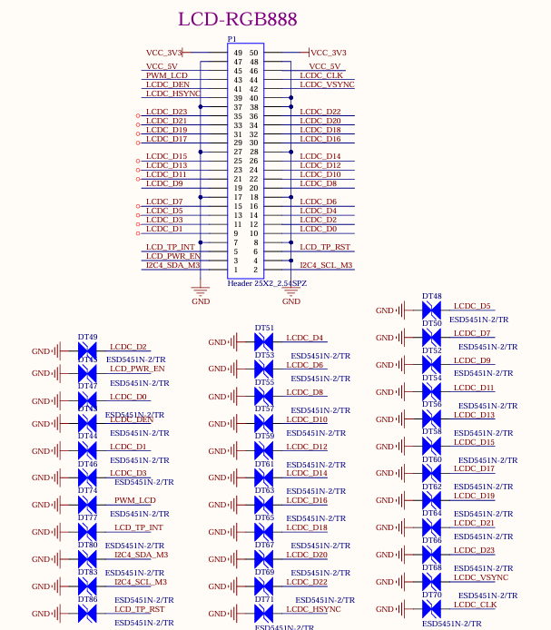

#### 3.5.12 MIPI-CSI

The development board supports two 4-lane MIPI CSI interfaces, both of which support MIPI V1.2. The maximum transmission rate supported by the channel is 2.5Gbps/Lane. In practical application, 1X4 lane of each group of ports can be split into 2X2lane inputs, which can support up to 4 MIPI CSI inputs at the same time.

The MIPI CSI function is led out throng 26PIN FPC seats P8 and P9 from the development board. The interface is powered by a separate power supply and supports the OV13850 camera of Forlinx by default.

#### 3.5.13 100M Ethernet

The development board supports a 100-megabit Ethernet, which is from the FEPHY built in the CPU and led out by the RJ45 socket. The socket model is FC62115 BNL, and the quarantine transformer is built in.

**Note:**

- **There is one GMAC controller on the RV1126B chip, which can provide the RMII/RGMII interface to expand an external Ethernet 100 - Mbps/1 - Gbps PHY chip. It can also be switched to the built - in 100 - Mbps FEPHY. However, only one of them can be selected and they cannot be used simultaneously. That is, only one of the 100 - Mbps and 1 - Gbps network ports led out from the development board can be selected for use and cannot be used at the same time;**

- **A 110 - ohm termination resistor needs to be connected in parallel between the differential signals FEPHY\_TXP/N and between the differential signals FEPHY\_RXP/N. This resistor should be placed close to the SoC end and must not be removed;**

- **A 5.1 - ohm resistor needs to be connected in series with FEPHY\_TXP/N and FEPHY\_RXP/N. This resistor should be placed close to the transformer end, which can improve the anti - surge ability;**

- **The capacitance value of the 1nF capacitor at the center tap of the transformer must not be modified and it should be placed close to the transformer.**

#### 3.5.14 1000M Ethernet

The development board supports a native 1000M network port using the RGMII of the SoM and the MAE0621A-Q3C chip, and can be connected to the external network equipment through the standard RJ45 socket P15 with a network transformer.

**Note: There is one GMAC controller on the RV1126B chip, which can provide the RMII/RGMII interface to expand an external Ethernet 100 - Mbps/1 - Gbps PHY chip. It can also be switched to the built - in 100 - Mbps FEPHY. However, only one of them can be selected and they cannot be used simultaneously. That is, only one of the 100 - Mbps and 1 - Gbps network ports led out from the development board can be selected for use and cannot be used at the same time;**

#### 3.5.15 Audio

1 x DSM audio interface and 2 x MIC are led out from the SoM. 1 x DSM audio signal is led out from the development board, which first goes through RC low - pass filtering and then is amplified by the power amplifier chip LTK5135M, after which it can be connected to an external 4Ω - 3.3W speaker. 1 x is led out through the on - board MIC for easy debugging, enabling mono recording.

**Note: DSM\_AUD\_RN/P is a set of pins and can only be configured for the DSM\_AUD function simultaneously. One pin cannot be configured for the DSM\_AUD function while the other is configured for other functions. The same applies to DSM\_AUD\_LN/P.**

#### 3.5.16 WiFi \& Bluetooth

The development board is equipped with an integrated WiFi \& Bluetooth module, with the module model Fn Link 6221A-SRC. The WIFI uses the SDIO interface, supporting both 2.4GHz and 5GHz frequency bands and complying with the IEEE 802.11a/b/g/n/ac standard. The Bluetooth uses the UART interface and complies with the BT 4.2 standard. 

Module P5 is SMA interface for antenna, please use 2.4GHz \& 5GHz dual-band antenna.

#### 3.5.17 FSPI

The development board provides 1 x FSPI interface, which can be externally connected with NOR FLASH chip.

Currently, the development board does not support FSPI Flash booting. Please do not connect storage devices to the FSPI controller to avoid system boot abnormalities. The development board is defaulted to be dry - soldered.

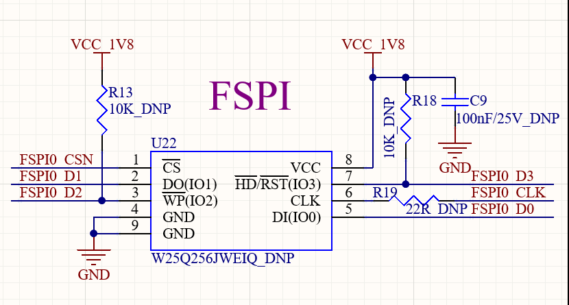

#### 3.5.18 Raspberry Pi 40PIN

The pin compatible with the Raspberry Pi 40pin header are reserved on the carrier board, which are led out through the P16 pin header. ESD protection is added to each pin.

## 4\. OK1126Bx-S Development Board Linux System Power Consumption Table

| No.| Test Item| SoM Power| Development board power (including SoM)|
|:----------:|----------|:----------:|:----------:|
| 1| Starting peak power without load | 1.69W| 2.69W|
| 2| Standby without load| 0.505 W| 1.27W|
| 3| Sleep| 0.39 W| 0.9W|
| 4| USB Read and Write| 0.59 W| 1.775W|
| 5| TF Read and Write| 0.98 W| 1.835W|
| 6| PING Network| 0.735 W| 1.815W|
| 7| Operating with camera| 0.9W| 2.26W|
| 8| Operating with 7-inch MIPI screen + playing video| 1.025 W| 4.15W|
| 9| Operating with camera + 7-inch MIPI screen + playing video| 1.34 W| 4.66W|
| 10| CPU usage rate 100%.| 1.51 W| 2.24W|
| 11| Memory usage rate 100%.| 1.045 W| 1.835W|
| 12| EMMC Read and Write| 1.16 W| 1.93W|
| 13| CPU pressure + memory pressure + eMMC read/write pressure test power| 1.97 W| 2.635W|

**Note：**

- **Test conditions: The SoM configuration is 4GB memory+64GB eMMC, and the screen is the optional product of Forlinx. SoM power supply is 5V and carrier board is 5V;**
- **Power consumption is for reference only.**

## 5\. Minimum System Schematic

The minimum system includes the SoM, power supply, debugging serial port, and system image flashing interface.

The SoM is designed to support power - on startup. It can be started as long as there is a 5V main power supply for the SoM. However, to ensure that the SoM can be programmed and print information can be viewed, it is recommended to retain the startup item circuit, USB programming circuit or TF card programming circuit, DEBUG circuit, and reset button. Note that no pull - up resistors should be added in the design of the reset button.

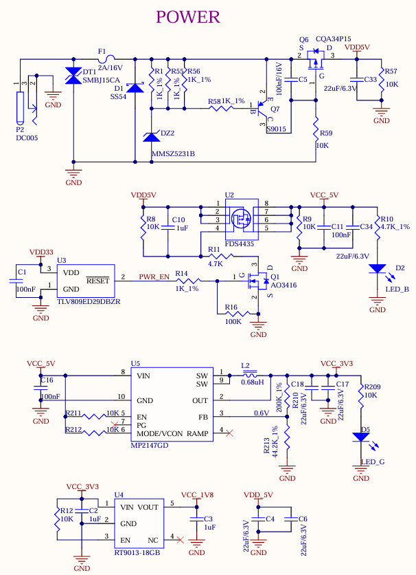

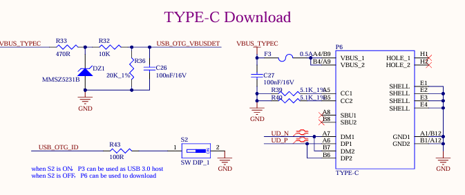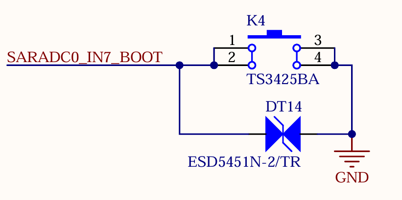

