# Linux6.1.99\_User’s Compilation Manual\_V1.0

Document classification: □ Top secret □ Secret □ Internal information ■ Open                                                                                                              

## Copyright 

The copyright of this manual belongs to Baoding Folinx Embedded Technology Co., Ltd. Without the written permission of our company, no organizations or individuals have the right to copy, distribute, or reproduce any part of this manual in any form, and violators will be held legally responsible.   
Forlinx adheres to copyrights of all graphics and texts used in all publications in original or license-free forms.  
The drivers and utilities used for the components are subject to the copyrights of the respective manufacturers. The license conditions of the respective manufacturer are to be adhered to. Related license expenses for the operating system and applications should be calculated/declared separately by the related party or its representatives.  

## Revision History

| **Date**| **Version**| **Revision History**|
|:----------:|:----------:|----------|
| 04/09/2025 | V1.0| OK3506B-S12\_User’s Compilation Manual Initial Version |

**Note: This compilation manual is only applicable to OK3506B-S12 development board of Forlinx.**

## Overview

This manual is designed to help you quickly understand the compilation process and become familiar with the compilation methods for Forlinx Embedded products. Before running applications on the development board, they must be cross-compiled on a Linux operating system. By following the methods outlined in this manual and engaging in hands-on exercises, you will be able to compile their own software code.

The manual starts with instructions on setting up the development environment. Since unexpected issues may arise during this process, it is recommended that beginners use the pre-configured development environment. This approach allows for a faster start, reducing overall development time.

There are generally three installation methods for Linux systems: dual-boot on a physical machine, single-boot on a physical machine, and using a virtual machine. This manual will focus on setting up Ubuntu within a virtual machine. 

Hardware Requirements: A minimum of 6GB of RAM is recommended. This will allow you to allocate 2GB or more to the virtual machine while still performing other tasks in Windows. Using less RAM may negatively impact the performance of Windows.

There are total 4 chapters:

+ Chapter 1 covers the installation of VMware, specifically version VMware® Workstation 15 Pro 15.1.0. VMware must be installed before setting up the Ubuntu development environment;
+ Chapter 2 explains how to load the Ubuntu development environment provided by Feilin. The environment is based on 64-bit Ubuntu 22.04;
+ Chapter 3 outlines the process of setting up a new Ubuntu development environment. Using 64-bit Ubuntu 22.04 as an example, this chapter describes the creation of the environment. Due to potential differences in computer configurations, unforeseen issues may arise. Beginners are advised to use the pre-configured environment to avoid complications.3. Setting Up a New Ubuntu Development Environment; 
+ Chapter 4 explains how to compile source code for the development board.

The manual includes explanations of some symbols and formats.

| **Format**| **Meaning**|
|:----------:|----------|
| **Note** | Note or particularly important information must be read carefully.|
| 📚 | Relevant explanations regarding the testing section|
| ️️️🛤️ ️️ | Related paths.|
| Blue font on a gray background| Refers to the command entered on the command line, which needs to be entered manually.|
| Bold font | Serial output information after command input|
| **Black Bold**| Key information in the serial output:|
| <font style="color:#000000;">//</font>| Explanation of the input command or output information.|
| Username@Hostname| root@ok3506-buildroot: The login account information for the development board via serial console;<br />forlinx@ok3506-buildroot: The login account information for the development board via network;<br/>forlinx@ubuntu: The login account information for the development environment on Ubuntu. |

This information helps you identify the operational environment for various tasks.

Example: After packaging the file system, use the ls command to view the generated files.

```markdown
forlinx@ubuntu:~/3506$ ls                             //List the files in this directory
OK3506_Linux_Source  OK3506_Linux_Source.tar.bz2.00 OK3506_Linux_Source.tar.bz2.01
```

+ forlinx@ubuntu: The username is forlinx, and the hostname is ubuntu, indicating that the operation is being performed in the development environment on Ubuntu;
+ //: Explanation of the command. No need to enter this when typing the command;
+ Ls: blue font with gray background, indicating the relevant command that needs to be entered manually;
+ OK3506\_Linux\_Source: The output information after inputting the command is shown in black font, and the key information is in bold font. In this case, it refers to the packaged file system.

## 1\. VMware Virtual Machine Software Installation

This chapter mainly introduces the installation of the VMware virtual machine, using VMware Workstation 15 Pro v15.5.6 as an example to demonstrate the operating system installation and configuration process.

### 1.1 Downloading and Purchasing VMware Software

Visit the VMware official website at https://www.vmware.com/cn.html to download Workstation Pro and obtain the product key. VMware is paid software that requires individual purchase, or you can choose to use a trial version.

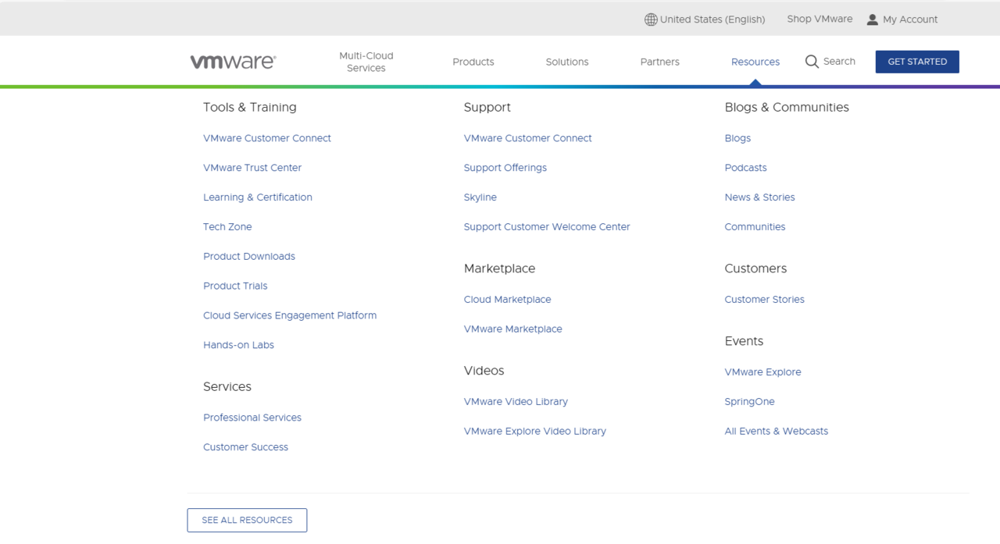

After the download is complete, double-click the setup file to launch the installer.

### 1.2 VMware Software Installation

Double-click the setup file to enter the installation wizard.

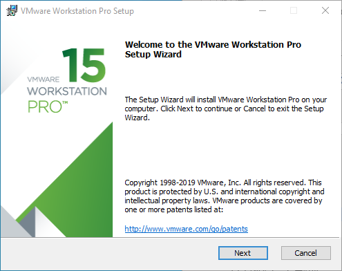

Click “Next.”

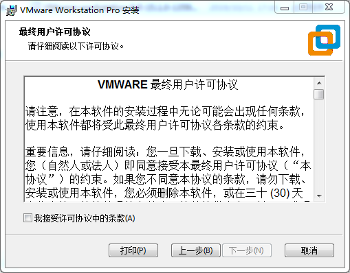

Check “I accept the terms in the license agreement” and click “Next.”

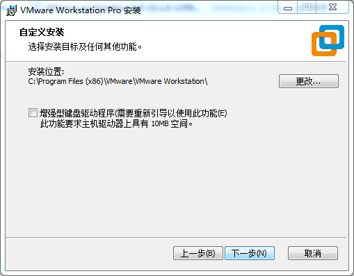

Modify the installation location to the partition on your computer where software is typically installed, then click “Next.”

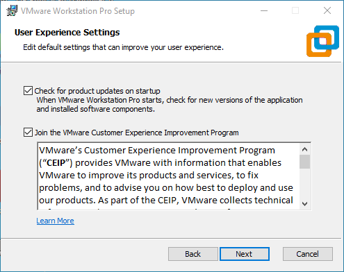

Check, then click “Next.”

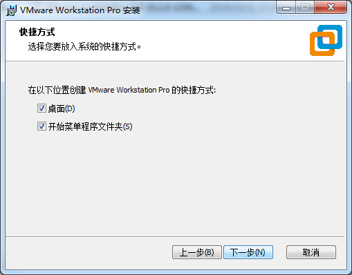

Check “Add shortcuts” and click “Next.”

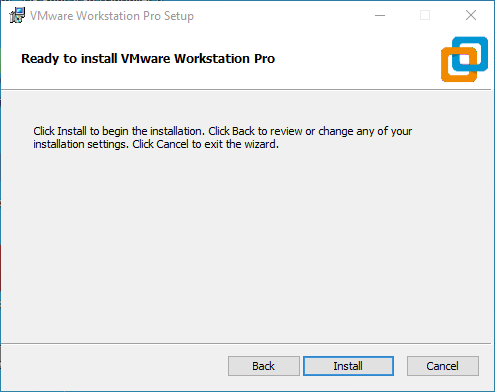

Click “Install.”

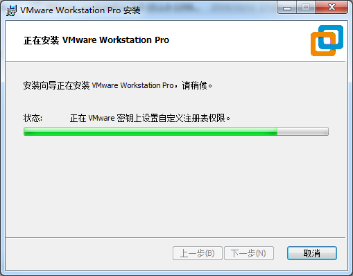

Wait for the installation to complete.

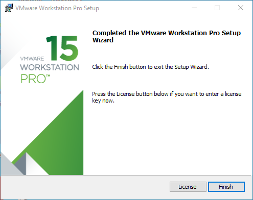

After clicking “Finish,” you can start the trial. For long-term use, please purchase from the official website and enter the license key.

## 2\. Loading an Existing Ubuntu Development Environment

**Note:**

+ **It is recommended that beginners directly use the virtual machine environment pre-configured by Forlinx, which already has the cross-compiler and Qt environment installed. After reviewing this chapter, you can skip directly to the compilation chapters;**
+ **The provided development environment has a regular user account: forlinx, with password: forlinx. The superuser account is: root, with password: root.**
+ **You can access software and hardware documentation, source code, and the development environment via the cloud storage link provided by Forlinx. Please ask your sales representative for the download link.**

There are two ways to use the virtual machine environment in VMware: one is to directly load an existing environment, and the other is to create a new environment. First explain how to load an existing environment.

First, download the development environment provided by Forlinx. The development environment package will include an MD5 checksum file. After downloading the package, you should perform an MD5 checksum verification on the compressed file using the MD5 checksum tool for Windows, which you can find at User Data\\Software Tools\\3-Tools\\md5sums-1.2.zip. 

Generate the checksum and compare it with the value in the checksum file. If the checksums match, the downloaded file is valid. If they do not match, the file may be corrupted, and you should download it again.

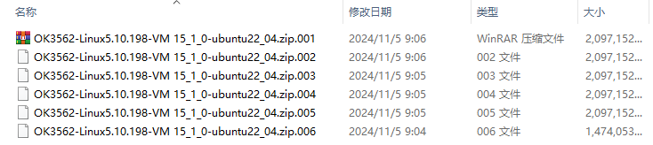

Select all the compressed packages and right click to extract them to the current folder or your own directory:

Once the extraction is complete, you will obtain a folder named “3568 Development Environment.”

**Note: The Ubuntu 22.04 development environment for models 3506, 3562, and 3568 is the same.**

The file "3568.vmx" in the "3568 Development Environment" folder is the virtual machine file that needs to be opened.

Open the installed virtual machine software.

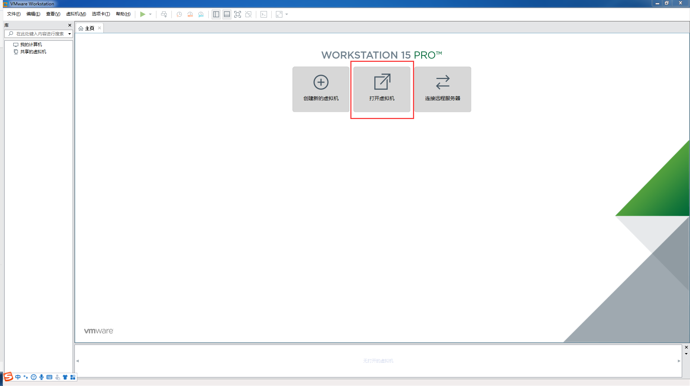

Navigate to the directory where the "3568.vmx" file was extracted, and double-click to open the startup file.

Once it has finished loading, click to start the virtual machine, and you can run it and enter the system interface."

The provided development environment is set to automatically log in to the account forlinx on startup by default.

## 3\. Setting Up a New Ubuntu Development Environment

**Note: Beginners should avoid building the system themselves; using the existing virtual machine environment is recommended. You can skip this section if building the environment isn’t necessary.**

This chapter mainly explains the setup process of the Ubuntu system and the installation of Qt Creator. If QT is not used, the installation of Qt Creator can be ignored.

### **3.1 Ubuntu System Setup**

The installed Ubuntu version is 22.04, and all the introductions and development in this manual were carried out on Ubuntu 22.04. Download the “ubuntu-22.04.6-desktop-amd64.iso” version from https://releases.ubuntu.com/22.04/ (the specific version to download can be based on your own needs; here we use version 22.04.6 as an example).

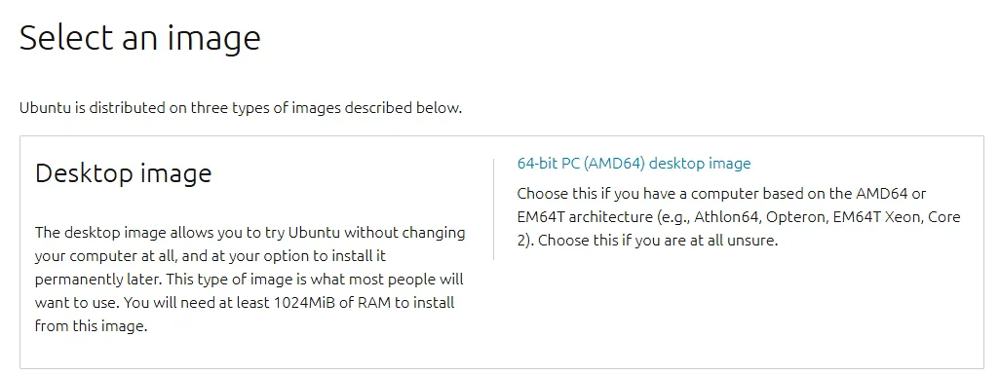

#### **3.1.1 Creating an Ubuntu Virtual Machine**

**Step 1**: Open the VMware software and click “Create a New Virtual Machine”. On the following screen, check “Custom (advanced)” and click “Next”:

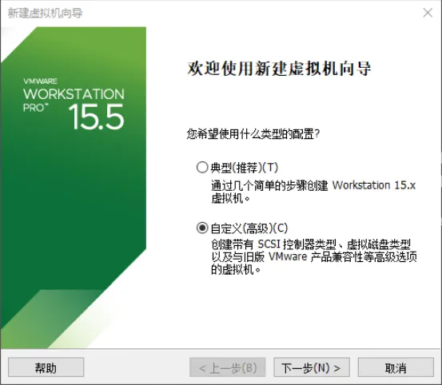

**Step 2**: Select the compatibility for the corresponding VMware version (you can view the version under Help -> About VMware Workstation). After confirming, click “Next”:

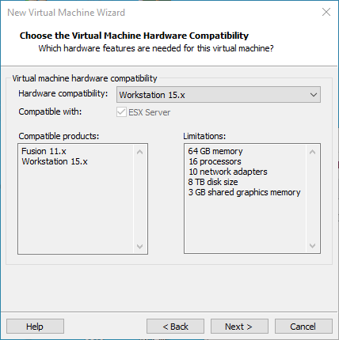

Choose “Installer disc image file (iso)” and click “Next”:

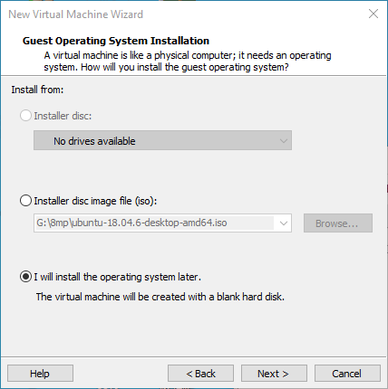

Enter the full name, username, and password, then click “Next”:

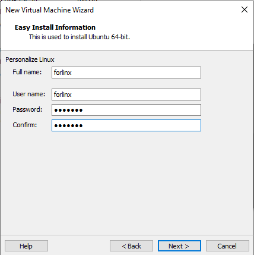

Enter the virtual machine name and configure the installation location, then click “Next”:

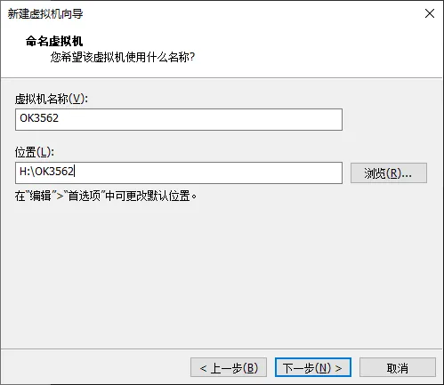

Configure the number of cores, then click “Next”:

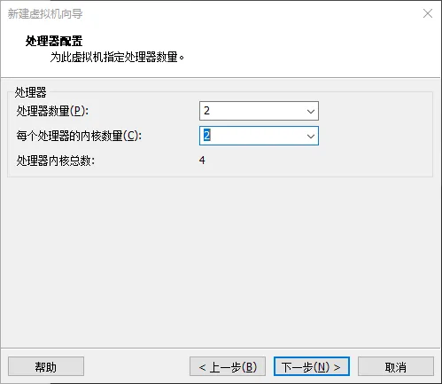

Configure at least 8GB of memory and select “Next”:

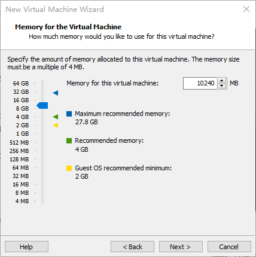

Set the network type, use the default NAT networking, and click “Next”. Subsequent steps remain at their default values until the disk capacity step is specified.

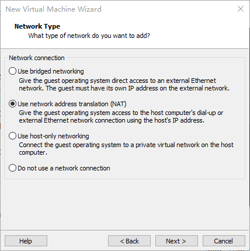

Use the recommended I/O controller and click “Next”:

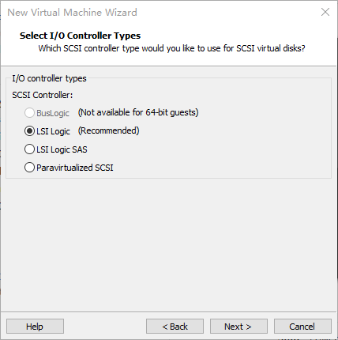

Use the recommended disk type and click “Next”:

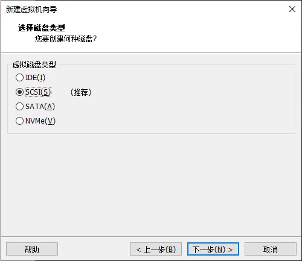

Use the default option, “Create a new virtual disk”, and click “Next”:

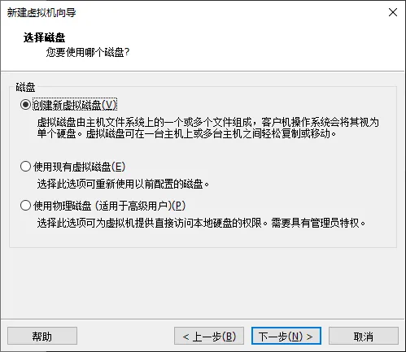

Allocate a disk size of 200G and choose “Split virtual disk into multiple files”, then click “Next”:

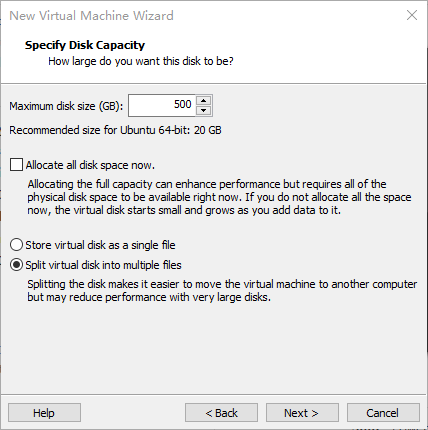

Use the default settings and click “Next”:

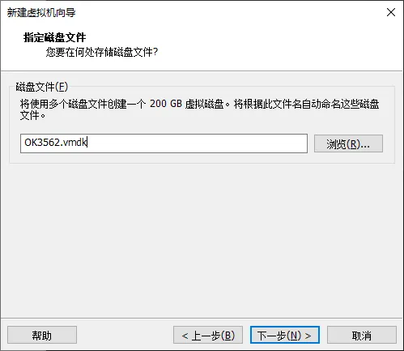

Click “Finish”.

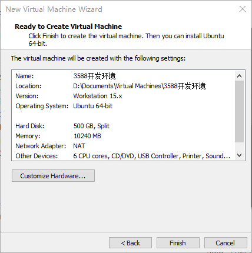

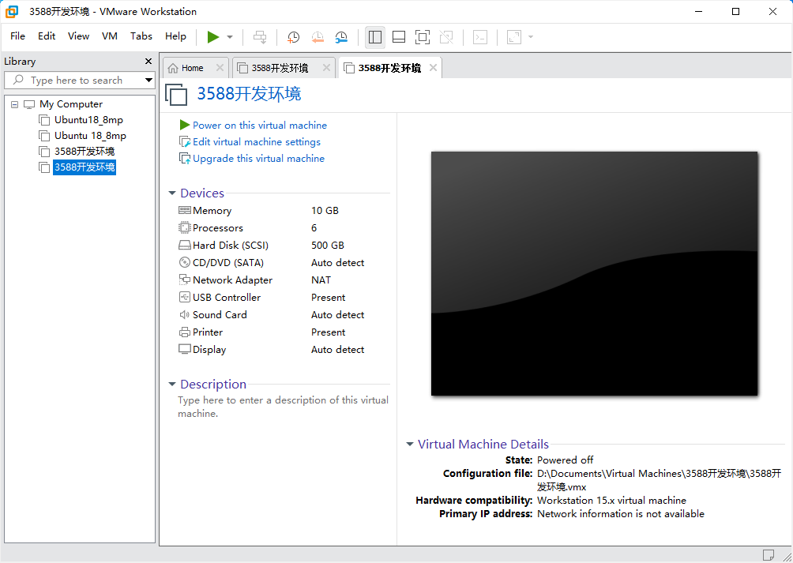

At this point, the virtual machine creation is complete. Afterward, click “Power on this virtual machine” to start installing the image. Please wait patiently. With the above, the Ubuntu system installation is complete.

### **3.1.2 Basic Configuration of Ubuntu**

**3.1.2.1 VMware Tools Installation**

VMware Tools should be installed automatically after creating the virtual machine. If it is not successful, install it according to the following steps. Without this tool installed, you cannot use copy and paste or drag and drop files between the Windows host and the virtual machine. First, click “Virtual Machine” on the VMware navigation bar, then click “Install VMware Tools” in the dropdown menu.

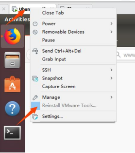

After completion, enter Ubuntu. A VMware Tools CD will appear on the desktop; click to enter it.


After entering, you will see a compressed file VMware Tools-10.3.10-12406962. tar. gz (different virtual machine versions may be different), and copy the file to the home directory (that is, the directory of the home personal user name).

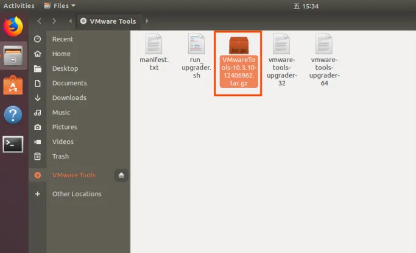

Press \[Ctrl+Alt+T] to bring up the terminal command interface and enter the command to extract it:

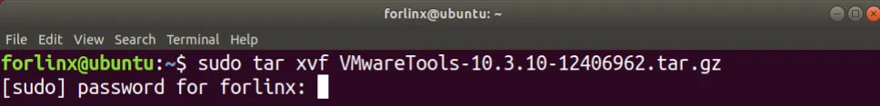

After extraction completes, a folder named “vmware-tools-distrib” will appear.

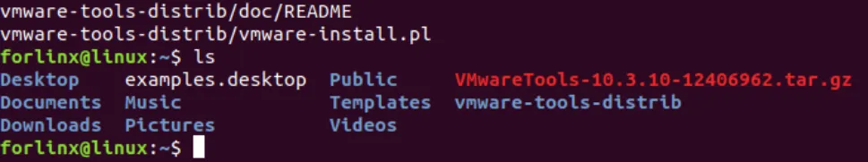

Return to the terminal and type: cd vmware-tools-distrib to enter the directory. Then type: sudo ./vmware-install.pl and press Enter. Enter your password and the installation will begin. When prompted, type yes; otherwise, just press Enter to install the default settings.

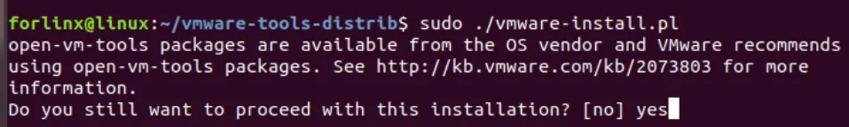

After VMware Tools installation is complete, file copy-paste between Windows and Ubuntu will be enabled.

**3.1.2.2 Virtual Machine Full-Screen Display**

If the virtual machine cannot display in full screen, you can click on “View”, select “Auto-Adjust Size”, and then click “Autofit Guest” to resolve the full-screen issue.

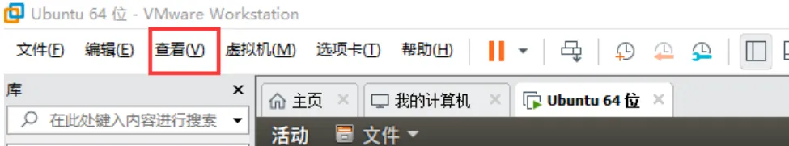

Most system settings can be configured in the location shown in the figure. Many settings requirements on Ubuntu can be completed here.

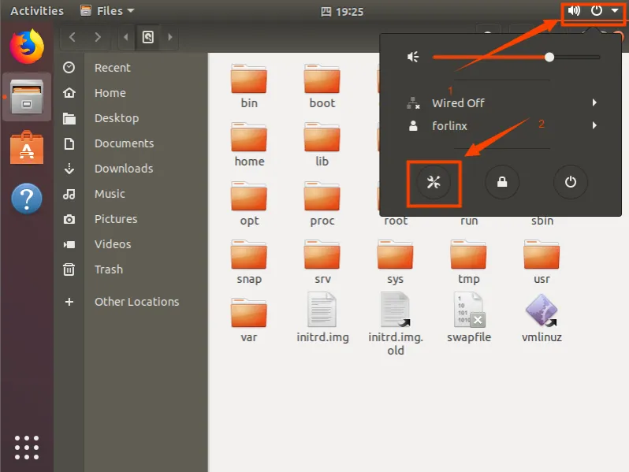

##### **3.1.2.3 Virtual Machine Sleep Settings**

Additionally, the default sleep setting is 5 minutes. If you do not want the system to go to sleep, go to Settings -> Power -> Blank Screen and set it to “Never”.

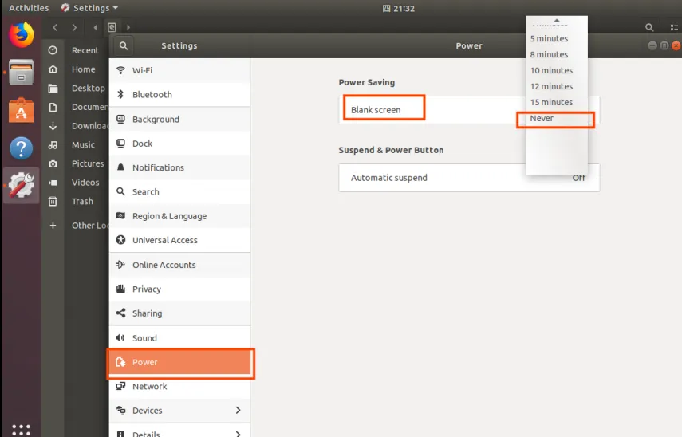

### **3.1.3 Virtual Machine Swapfile Configuration**

When creating the virtual machine, 8GB of memory was allocated. If 8GB of memory is insufficient during compilation, you need to modify the size of the swapfile.

### **3.1.4 Virtual Machine Network Configuration**

**3.1.4.1 NAT Connection Mode**

By default, after the virtual machine installation is complete, the network connection mode is set to NAT, as shown in the figure below, sharing an IP address with the host machine. This setting does not need to be changed when installing dependency packages, compiling code, etc. In the virtual machine, when the VMware virtual network adapter is set to NAT mode, the network in the Ubuntu environment should be set to dynamic IP. In this mode, the virtual NAT device connects and communicates with the host’s network card for internet access. This is the most commonly used method for the virtual machine to access the external network.

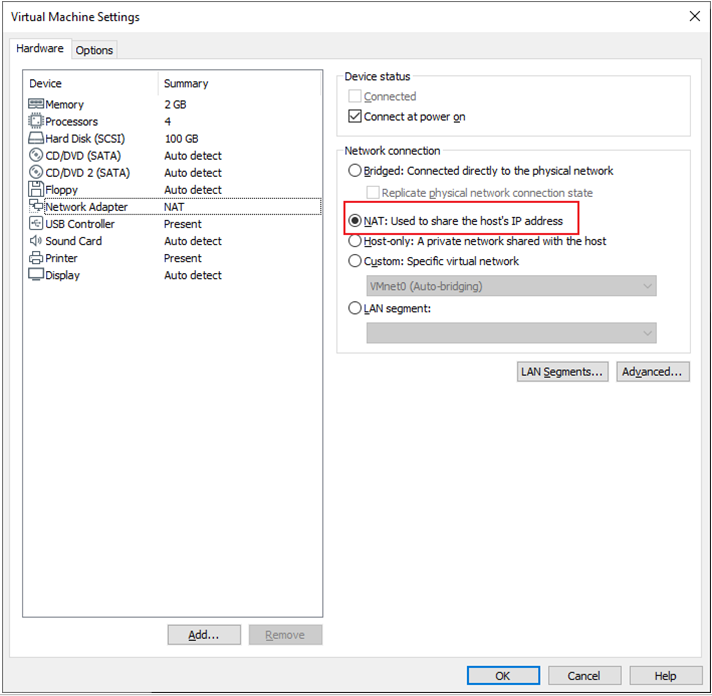

**3.1.4.2 Bridged Connection Mode**

When the VMware virtual network adapter device is in bridged mode, the host network card and the virtual machine network card communicate through a virtual network bridge. In the Ubuntu environment, you need to set a network IP in the same subnet as the host. To access the external network, you need to set the DNS to be consistent with the host network card. If using servers like TFTP or SFTP, you need to set the virtual machine's network connection to Bridged Mode.

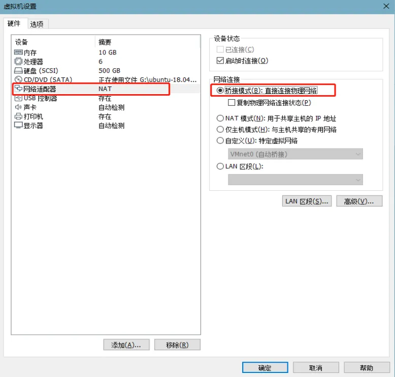

## 4\. Compilation of Related Code

### 4.1 Preparation Before Compilation

#### 4.1.1 Environment Description

+ Recommended Development OS: Ubuntu 22.04 64-bit
+ Cross-Toolchain: arm-linux-gnu
+ Bootloader Version for Development Board: u-boot-2017.09
+ Kernel Version for Development Board: linux-6.1.99
+ Qt Version Ported to Development Board: lvgl-9.2

#### 4.1.2 Copying the Source Code

 Program source code: User Data\\2-Images and Source\\1-Source\\OK3506\_Linux\_Source.tar.bz2  
Buildroot package: User Data\\2-Images and Source\\Source\\dl.tar.bz2

Create a working directory and place the source code and dl.tar.bz2 into the work directory.

**Note:**

**During the Buildroot build process, the source code for various software packages needs to be downloaded. This requires internet access and may fail or result in incomplete downloads due to network fluctuations, restrictions, or issues with the source server, potentially causing compilation errors.  To increase the success rate and reduce build time, it is strongly recommended to use the pre-configured solution by extracting the pre-downloaded software package archive dl.tar.bz2 into the Buildroot source directory.**

Create Working Directory:

```bash
forlinx@ubuntu:~$ mkdir -p /home/forlinx/work					//Create the working directory in order
```

Copy the source code file OK 3506 \_ Linux \_ Source. tar. bz2. \* in the user profile to the virtual machine/home/forlinx/work directory.

```bash
forlinx@ubuntu:~$ cd /home/forlinx/work														//Switch to the working directory
forlinx@ubuntu:~/work$ cat OK3506_Linux_Source.tar.bz2.* > OK3506_Linux_Source.tar.bz2
forlinx@ubuntu:~/work$ tar -xvf OK3506_Linux_Source.tar.bz2				//Decompress the compressed package in the natural location
forlinx@ubuntu:~/work$ cd /home/forlinx/work/OK3506-linux-source/buildroot
forlinx@ubuntu:~/work/OK3506-linux-source/buildroot$ tar -vxf ../../dl.tar.bz2	//Unzip the dl. tar. bz2 under buildroot
```

Wait for the copy process to complete after running the command.

### 4.2 Compilation

**Note:**

+ **After extracting the kernel source code for the first time, you need to perform a full compilation of the source code;**
+ **After the initial full compilation, you can proceed with individual compilations based on the actual situation.**

#### 4.2.1 Full Compilation Test

In the source code directory, there is a compilation script named build.sh. Running this script will compile the entire source code. You need to switch to the extracted source code path in the terminal and locate the build.sh file.

```bash
forlinx@ubuntu:~$ cd /home/forlinx/work/OK3506_Linux_Source
```

The following operations need to be performed in the source code directory. Compilation method:

```bash
forlinx@ubuntu: ~/work/OK3506_Linux_Source$./build.sh chip
```

After executing, there will be options to input, as shown in the picture. After entering "1", press Enter to continue.

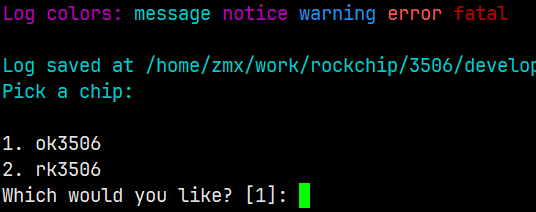

Select an option from the box below and press Enter to continue.

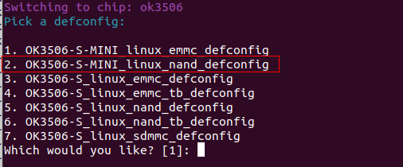

**Note: The above configuration only needs to be done once.**

Then, execute build.sh for a full compilation:

```bash
forlinx@ubuntu: ~/work/OK3506_Linux_Source$./build.sh
```

After a successful compilation, the corresponding image files will be generated in the rockdev folder.

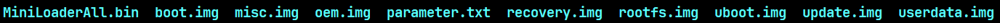

**Note: The update.img file is for OTG flashing, while the other files are for step-by-step flashing.**

#### 4.2.2 Individual Compilation Test

Before performing a separate compilation, a full compilation must be done in the kernel source directory.

```bash
# Configure SDK
forlinx@ubuntu: ~/work/OK3506_Linux_Source$ ./build.sh bconfig

# Generate uboot.img，the output path will be u-boot/uboot.img
forlinx@ubuntu: ~/work/OK3506_Linux_Source$ ./build.sh uboot

#Generate boot.img，the output path will be kernel/boot.img
forlinx@ubuntu: ~/work/OK3506_Linux_Source$ ./build.sh kernel 

#Generate rootfs.img，the output path will be buildroot/output/rockchip_ok3506_emmc/image/rootfs.ext2
forlinx@ubuntu: ~/work/OK3506_Linux_Source$ ./build.sh rootfs

# Use the paths above for uboot.img, boot.img, and rootfs.ext2 to generate update.img, with the output path rockdev/update.img
forlinx@ubuntu: ~/work/OK3506_Linux_Source$ ./build.sh updateimg
```

After a separate compilation, the kernel in the update.img file is not updated. Please flash the corresponding files step by step, or regenerate the update.img.

To configure the kernel using a graphical interface, run the following command:

```bash
forlinx@ubuntu: ~/work/OK3506_Linux_Source$ ./build.sh kconfig
```

After completing the configuration in the graphical interface, save and exit. The new configuration will automatically generate a new OK3506-S\_linux\_defconfig.

#### 4.2.3 Cleaning up Generated Files

**Note: Uboot is not open-source, only the image is available.**

```bash
forlinx@ubuntu: ~/work/OK3506_Linux_Source$ ./build.sh clean:kernel    	#Clear kernel
forlinx@ubuntu: ~/work/OK3506_Linux_Source$ ./build.sh clean:rootfs   	#Clear rootfs
forlinx@ubuntu: ~/work/OK3506_Linux_Source$ ./build.sh clean:recovery  	#Clear recovery
```

### 4.3 Use of Image Files

**Note: The update.img file is for OTG flashing, while the other files are for step-by-step flashing. The \*.img file generated from separate compilation will not be updated in update.img. Use step-by-step flashing (refer to the OTG flashing section in the user manual).**

### 4.4 Application Compilation and Running

The SDK test programs are by default compiled using Buildroot, but can also be compiled directly. The following explains the direct compilation method.

#### 4.4.1 Configure Cross-Compilation Toolchain

The packaged cross-compilation toolchain path: 01Software\\3-Tool\\arm-buildroot-linux-gnueabihf\_sdk-buildroot.tar.gz

1\. Extract the toolchain to any directory, e.g., /home/forlinx/work/toolchain;

```bash
forlinx@ubuntu:~$ mkdir -p /home/forlinx/work/toolchain
forlinx@ubuntu:~$ tar xf arm-buildroot-linux-gnueabihf_sdk-buildroot.tar.gz -C /home/forlinx/work/toolchain
forlinx@ubuntu:~$ cd /home/forlinx/work/toolchain
```

2\. Run relocate-sdk.sh;

```bash
forlinx@ubuntu:~/work/toolchain$ ./relocate-sdk.sh
```

3\. Run environment-setup to set up environment variables.

```bash
forlinx@ubuntu:~/work/toolchain$ source ./environment-setup
```

The terminal will automatically configure the environment variables for the cross-compilation toolchain. You can check the current environment variables using the env command.

**Note: After setting environment variables, the terminal cannot compile the full source code, and an error will occur. A new terminal must be used to compile the full source code.**

#### 4.4.2 Command-Line Applications Compilation and Operation

This section uses the watchdog test program.

1\. Use cd to go to /home/forlinx/work;

```bash
forlinx@ubuntu:~$ cd /home/forlinx/work/OK3506_Linux_Source/app/forlinx/forlinx_cmd_demo/fltest_watchdog
```

2\. Use make for cross-compilation;

```bash
forlinx@ubuntu: ~/work/OK3506_Linux_Source/app/forlinx/forlinx_cmd_demo/fltest_watchdog$ make
arm-buildroot-linux-gnueabihf-gcc fltest_watchdog.c -o fltest_watchdog
fltest_watchdog make finish!!!
```

Use the file command to check the generated file information. It will show a 32-bit ARM file.

```bash
forlinx@ubuntu:~/work/OK3506_Linux_Source/app/forlinx/forlinx_cmd_demo/fltest_watchdog$ file fltest_watchdog
fltest_watchdog: ELF 32-bit LSB pie executable, ARM, EABI5 version 1 (SYSV), dynamically linked, interpreter /lib/ld-linux-armhf.so.3, for GNU/Linux 3.2.0, not stripped
```

3\. Copy the compiled fltest\_watchdog file to the board using a USB drive or other methods, for example, to the /forlinx directory. The following example uses a USB drive to copy it to the development board and run the test.

```bash
[root@ok3506-buildroot:/]# cp /run/media/sda1/fltest_watchdog /
[root@ok3506-buildroot:/]# /fltest_watchdog
Usage: fltest_watchdog [-t <timeout>] [-c] [-d/-e]
  -t --timeout   set timeout (default 10), range ( 1 - 16)
  -c --continue  enable watchdog with feed dogs
  -d --disable   disable watchdog, conflict with enable
  -e --enable    enable watchdog, conflict with disable
```

4\. Refer to the "Watchdog Test" section in the user manual for details.

#### 4.4.3 LVGL Applications Compilation and Operation

This section shows how to compile an LVGL application using the Forlinx demo\_lvgl as an example.

demo\_lvgl program source code: path: app/forlinx/forlinx\_lvgl\_demo/

```bash
forlinx@ubuntu:~/work$ ./arm-buildroot-linux-gnueabihf_sdk-buildroot/relocate-sdk.sh
forlinx@ubuntu:~/work$ source arm-buildroot-linux-gnueabihf_sdk-buildroot/environment-setup
 _           _ _     _                 _
| |__  _   _(_) | __| |_ __ ___   ___ | |_
| '_ \| | | | | |/ _` | '__/ _ \ / _ \| __|
| |_) | |_| | | | (_| | | | (_) | (_) | |_
|_.__/ \__,_|_|_|\__,_|_|  \___/ \___/ \__|

       Making embedded Linux easy!

Some tips:
* PATH now contains the SDK utilities
* Standard autotools variables (CC, LD, CFLAGS) are exported
* Kernel compilation variables (ARCH, CROSS_COMPILE, KERNELDIR) are exported
* To configure do "./configure $CONFIGURE_FLAGS" or use
  the "configure" alias
* To build CMake-based projects, use the "cmake" alias
```

Use CMake to compile the application.

```bash
forlinx@ubuntu:~/work$ cd OK3506_Linux_Source/app/forlinx/forlinx_lvgl_demo/
forlinx@ubuntu:~/work/OK3506_Linux_Source/app/forlinx/forlinx_lvgl_demo$ cmake
CMake Warning:
  No source or binary directory provided.  Both will be assumed to be the
  same as the current working directory, but note that this warning will
  become a fatal error in future CMake releases.


-- The C compiler identification is GNU 12.4.0
-- The CXX compiler identification is GNU 12.4.0
-- Detecting C compiler ABI info
-- Detecting C compiler ABI info - done
-- Check for working C compiler: /home/forlinx/work/toolchain/arm-buildroot-linux-gnueabihf_sdk-buildroot/bin/arm-buildroot-linux-gnueabihf-gcc - skipped
-- Detecting C compile features
-- Detecting C compile features - done
-- Detecting CXX compiler ABI info
-- Detecting CXX compiler ABI info - done
-- Check for working CXX compiler: /home/forlinx/work/toolchain/arm-buildroot-linux-gnueabihf_sdk-buildroot/bin/arm-buildroot-linux-gnueabihf-g++ - skipped
-- Detecting CXX compile features
-- Detecting CXX compile features - done
-- Configuring done (0.3s)
-- Generating done (0.0s)
-- Build files have been written to: /home/forlinx/work/OK3506_Linux_Source/app/forlinx_lvgl_demo
forlinx@ubuntu:~/work/OK3506_Linux_Source/app/forlinx/forlinx_lvgl_demo$ make
[ 14%] Building C object CMakeFiles/demo_lvgl.dir/flow.c.o
[ 28%] Building C object CMakeFiles/demo_lvgl.dir/img_hand.c.o
[ 42%] Building C object CMakeFiles/demo_lvgl.dir/file_dialog.c.o
[ 57%] Building C object CMakeFiles/demo_lvgl.dir/custom.c.o
[ 71%] Building C object CMakeFiles/demo_lvgl.dir/window.c.o
[ 85%] Building CXX object CMakeFiles/demo_lvgl.dir/main.cpp.o
[100%] Linking CXX executable demo_lvgl
[100%] Built target demo_lvgl
forlinx@ubuntu:~/work/OK3506_Linux_Source/app/forlinx/forlinx_lvgl_demo$ file demo_lvgl 
demo_lvgl: ELF 32-bit LSB pie executable, ARM, EABI5 version 1 (SYSV), dynamically linked, interpreter /lib/ld-linux-armhf.so.3, for GNU/Linux 3.2.0, not stripped
```

The result will show that a 32-bit ARM file is generated.

Copy the compiled demo\_lvgl and the resource files from the resource directory to the board using a USB drive or other methods. The following example uses a USB drive to copy the files to the development board and run the test.

```bash
root@ok3506-buildroot:/# cp /run/media/sda1/forlinx_lvgl_demo/demo_lvgl /userdata/
root@ok3506-buildroot:/# cp /run/media/sda1/forlinx_lvgl_demo/resource/* /userdata/
root@ok3506-buildroot:/# cd /userdata
root@ok3506-buildroot:/userdata# ./demo_lvgl
```

#### 4.4.4 QT Applications Compilation and Operation

This section demonstrates the compilation of a QT application using the Forlinx forlinx\_qt\_terminal as an example.

demo\_lvgl source code path: app/forlinx/forlinx\_qt\_demo/fltest\_qt\_terminal/

Once the cross-compilation toolchain is set up, use qmake and make to compile the application.

```bash
forlinx@ubuntu:~/work$ cd OK3506_Linux_Source/app/forlinx/forlinx_qt_demo/fltest_qt_terminal
forlinx@ubuntu:~/work/OK3506_Linux_Source/app/forlinx/forlinx_qt_demo/fltest_qt_terminal$ qmake
forlinx@ubuntu:~/work/OK3506_Linux_Source/app/forlinx/forlinx_qt_demo/fltest_qt_terminal$ make
forlinx@ubuntu:~/work/OK3506_Linux_Source/app/forlinx/forlinx_qt_demo/fltest_qt_terminal$ file fltest_qt_terminal
fltest_qt_terminal: ELF 32-bit LSB pie executable, ARM, EABI5 version 1 (SYSV), dynamically linked, interpreter /lib/ld-linux-armhf.so.3, for GNU/Linux 3.2.0, not stripped
```

The result will show that a 32-bit ARM file is generated.

Copy the compiled fltest\_qt\_terminal file to the board using a USB drive or other methods, and run the test.