# Linux6.1.99\_User’s Manual\_V1.0

Document classification: □ Top secret □ Secret □ Internal information ■ Open                                                                                                              

## Copyright 

The copyright of this manual belongs to Baoding Folinx Embedded Technology Co., Ltd. Without the written permission of our company, no organizations or individuals have the right to copy, distribute, or reproduce any part of this manual in any form, and violators will be held legally responsible.   
Forlinx adheres to copyrights of all graphics and texts used in all publications in original or license-free forms.  
The drivers and utilities used for the components are subject to the copyrights of the respective manufacturers. The license conditions of the respective manufacturer are to be adhered to. Related license expenses for the operating system and applications should be calculated/declared separately by the related party or its representatives.  

## Revision History

| **Date**| **Version**| **Revision History**|
|:----------:|:----------:|:----------:|
| 04/09/2025| <font style="color:rgb(38, 38, 38);">V1.0</font><font style="color:rgb(38, 38, 38);">   </font>| OK3506B-S12 Linux6.1.99 User’s Manual Initial Version.|

## Overview

This manual is designed to help you quickly familiarize yourselves with the product, understand interface functions, and learn testing methods. It primarily covers the testing of development board interface functions, methods for flashing the image, and troubleshooting common issues encountered during use. During testing, certain commands have been annotated for better understanding, focusing on practicality and adequacy. For kernel compilation, related application compilation methods, and development environment setup, please refer to the “OK3506B-S12\_User’s Compilation Manual” provided by Forlinx.

There are total four chapters:

Chapter 1 provides an overall product overview, including a brief introduction to the development board’s interface resources, the relevant driver paths in the kernel source code, and the key sections of the documentation;

Chapter 2 focuses on the quick startup process. Two login methods are available: serial console login and network login;

 Chapter 3 introduces the command function tests for the product;

Chapter 4 covers firmware image updates. It mainly describes how to update the image to the storage device, and you can choose the appropriate flashing method according to your actual needs.

Additionally, the manual includes explanations of some symbols and formats.

| **Format**| **Meaning**|
|:----------:|----------|
| **Note** | Note or particularly important information must be read carefully.|
| 📚 | Relevant explanations regarding the testing section|
| ️️🛤️ ️️ | Related paths |
| **Bold font** | Serial output information after command input|
| **Black Bold Font** | Key information in the serial output:|
| <font style="color:#000000;">//</font>| Explanation of the input command or output information.|
| Username@Hostname| root@ok3506-buildroot: The login account information for the development board via serial console; <br />forlinx@ok3506-buildroot: The login account information for the development board via network;<br />forlinx@ubuntu: The login account information for the development environment on Ubuntu; <br />This information helps you identify the operational environment for various tasks. |

Example: After packaging the file system, use the ls command to view the generated files.

```markdown
forlinx@ubuntu:~/3506$ ls                                  //List the files in this directory
OK3506_Linux_Source  OK3506_Linux_Source.tar.bz2.00 OK3506_Linux_Source.tar.bz2.01
```

+ forlinx@ubuntu: The username is forlinx, and the hostname is ubuntu, indicating that the operation is being performed in the development environment on Ubuntu.
+ //: Explanation of the command. No need to enter this when typing the command.
+ OK3506\_Linux\_Source: The output information after inputting the command is shown in black font, and the key information is in bold font. In this case, it refers to the packaged file system.

## 1\. OK3506B-S12 Development Board Description

### 1.1 OK3506B-S12 Development Board Description

The RK3506J/RK3506B is a high-performance triple-core Cortex-A7 application processor, specifically designed for intelligent voice interaction, audio input/output processing, image output processing, and other digital multimedia applications. It has a 2D hardware engine and a display output engine to minimize CPU overhead and meet image display requirements. It provides a wide range of peripheral interfaces, including SAI, PDM, SPDIF, Audio DSM, Audio ADC, USB 2.0 OTG, RMII, and CAN, meeting the needs of different application developments while reducing hardware design complexity and development costs. It also features high-performance external memory interfaces (DDR2/DDR3/DDR3L) to sustain demanding memory bandwidth requirements.

Connection method: Stamp hole+board to board. The main interfaces are shown in the figure below:

**Front**

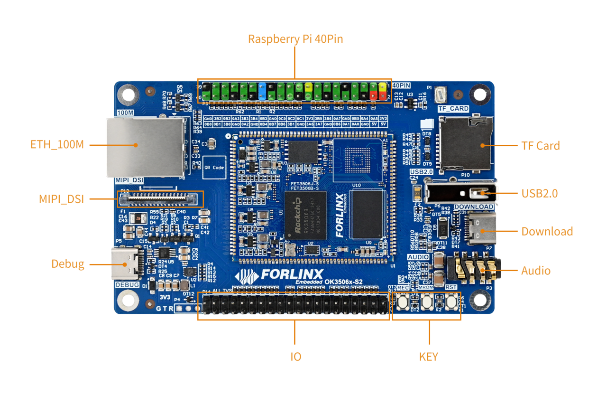

**Note: Hardware specifications are not covered in this software manual. Before development, please refer to the “ OK3506B-S12\_User’s Hardware Manual” to understand the product naming and hardware configuration.**

### 1.1 Linux 6.1.99 System Software Resources

| **Device**| **Driver Source Code Location in the Kernel**| **Device Name**|
|:----------:|----------|----------|
| LCD Backlight Driver/ PWM| drivers/video/backlight/pwm\_bl.c| /sys/class/backlight|
| USB Interface:| drivers/usb/storage/|
| USB Mouse| drivers/hid/usbhid/| /dev/input/mice|
| Ethernet| drivers/net/ethernet/stmicro/stmmac|
| EMMC/ SD/micro TF card driver| drivers/mmc/host/dw\_mmc-rockchip.c| /dev/block/mmcblk0pX|
| LCD controller| drivers/gpu/drm/rockchip/rockchip\_drm\_vop.c|
| MIPI DSI| drivers/phy/rockchip/phy-rockchip-inno-dsidphy.c|
| LCD touch driver| drivers/input/touchscreen/goodix.c drivers/input/touchscreen/edt-ft5x06.c| /dev/input/eventX|
| RTC Real - Time Clock| drivers/rtc/rtc-rx8010.c drivers/rtc/rtc-pcf8563.c| /dev/rtc0|
| Serial Port| drivers/tty/serial/8250/8250\_dw.c| /dev/ttySX|
| Button driver| drivers/input/keyboard/adc-keys.c| /dev/input/eventX|
| LED| drivers/leds/leds-gpio.c|
| SAI| sound/soc/rockchip/rockchip\_sai.c|
| Watchdog| drivers/watchdog/dw\_wdt.c| /dev/watchdog|
| SPI| drivers/spi/spi-rockchip.c| /dev/spidev2.0|

### **1.3 NAND Storage Partition Table**

The table below details the NAND storage partition information for the Linux operating system (The size of a block is 512 bits when calculating.):

| **Partition Index**| **Name**| **Offset/Block**| **Size/Block**| **Content**|
|:----------:|:----------:|:----------:|:----------:|:----------:|
| N/A| security| 0x00000000| 0x00002000| MiniLoaderAll.bin|
| 1| uboot| 0x00002000| 0x00002000| uboot.img|
| 2| misc| 0x00004000| 0x00000800| misc.img|
| 3| boot| 0x00004800| 0x00005000| recovery.img||
| 4| recovery| 0x00009800| 0x00008000| boot.img|
| 5| rootfs| 0x00011800| 0x00040000| rootfs.img|
| 6| oem| 0x00051800| 0x00008000| oem.img|
| 7| userdata| 0x00059800| | userdata.img|

## 2\. Fast Startup

### 2.1 Preparation Before Startup

Login methods: serial login and network login.                                                              

Hardware preparations before powering on the system:

+ Debug serial cable (for serial login)

The debug serial port on the development board is a USB Type-C port. You can connect the development board to a PC using a Type-A to Type-C cable to check the board's status information.

+ Ethernet cable (for network login)
+ Display screen — connect the screen according to the development board interface (optional if display is not needed)


### 2.2 Driver Installation Failure

+ Use DriverAssitant\_v5.13.zip in User Files\\Software\\3-Tools to install the Rockchip driver;
+ After extracting the package, run DriverInstall.exe directly. To ensure that the latest driver is installed, click Uninstall Driver first, and then click Install Driver;
+ Use CH343SER.EXE in User Files\\Software\\3-Tools to install the serial port driver.

### 2.3 Serial Port Login

The OK3506B-S12 platform features a Type-C port for serial debugging and an onboard USB-to-UART chip. No additional USB-to-serial debugging tool is required, making the setup simple and convenient.

#### 2.3.1 Serial Connection Settings

**Note:**

+ **Settings: Baud rate 115200, 8 data bits, 1 stop bit, no parity/flow;**
+ **The serial terminal supports password-free login;**
+ **Software requirement: On a Windows PC, a serial terminal program must be installed. There are many serial terminal tools available, and you may use any one you are familiar with.**

The following example uses PuTTY to illustrate the serial login procedure:

Step 1: Confirm the serial port number connected to the computer, checking the port number in Device Manager, based on the actual port recognized by the computer;

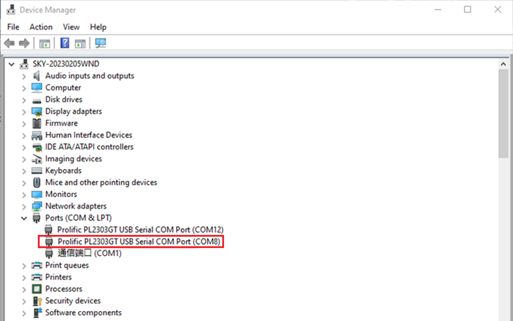

Step 2: Open PUTTY and set the serial line according to the computer’s COM port, with a baud rate of 115200;

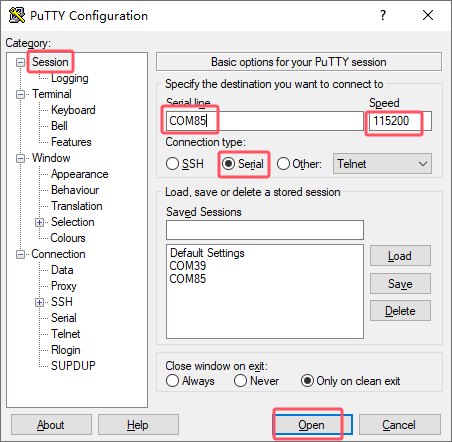

Step 3: After the above settings, input the computer’s COM port in Saved Sessions (e.g., COM85 as an example), save the settings. For subsequent serial port openings, simply click on the saved port number;

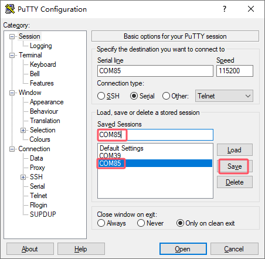

Step 4: Turn on the power switch of the development board. Boot messages will be displayed on the serial terminal, and the system will log in automatically without a password.

```bash
root@ok3506-buildroot:/#
```

#### 2.3.2 Common Issues with Serial Login

The USB-to-serial interface requires driver installation (User Files\\Software\\3-Tools\\CH343SER.EXE).

It is recommended to use a high-quality serial cable to avoid garbled output.

### 2.4 Network Login 

#### 2.4.1 Network Connection Test

**Note:**

+ **By default, the Ethernet port is configured with a static IP address at the factory: 192.168.0.232. For instructions on changing the static IP address, refer to Section 3.2.17 Ethernet Configuration;**
+ **During testing, the PC and the development board must be on the same subnet.**

Before logging in over the network, make sure the direct network connection between the PC and the development board is working properly. You can use the ping command to test the connection status. Specific Operations:

1\. Connect the eth0 port of the development board to the PC using an Ethernet cable, and power on the board. After the kernel boots, the blue heartbeat LED on the core board will start blinking. Once the network interface connected to the PC starts flashing rapidly, the network connection is ready for testing;

2\. Disable the firewall on the PC (this manual does not cover firewall settings, as they are standard PC operations), and open the Run command window;

3\. Open a command prompt with administrator privileges using cmd, and use the ping command to test the network connection between the PC and the development board.

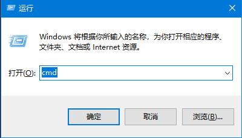

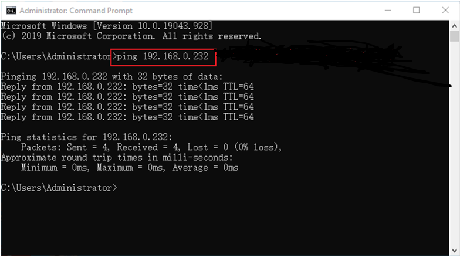

If data is returned, the network connection is working properly.

#### 2.4.2 SSH the server

**Note:**

+ **By default, the factory SSH login account is root with no password;**
+ **The Ethernet port is configured with a static IP address of 192.168.0.232 by default. For instructions on changing the static IP address, refer to Section 3.2.17 Ethernet Configuration.**

1\. Use SSH to log in to the development board.

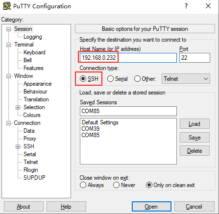

Click "Open". When the dialog box shown below appears, click "Yes" to enter the login screen.

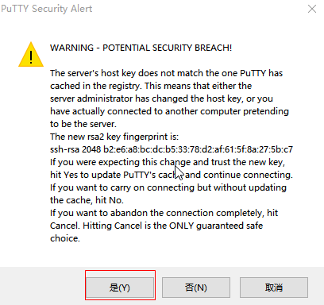

```bash
Login as：root
forlinx@ok3506-buildroot:~#
```

#### 2.4.3 SFTP

Path: OK3506B-S12 (Linux)\\User Files\\Software\\3-Tools\\FileZilla\*

The OK3506B-S12 development board supports the SFTP service, which is enabled automatically at startup. After the IP address is configured, the board can be used as an SFTP server.

The following describes how to transfer files using FileZilla.

Install FileZilla on Windows and configure it as shown in the figure below. Both the username and password are forlinx.

Open FileZilla, click File, and then select "Site Manager".

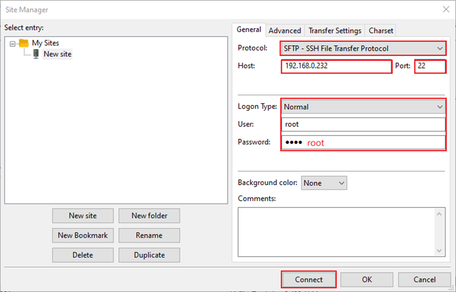

After a successful login, you can upload and download files.

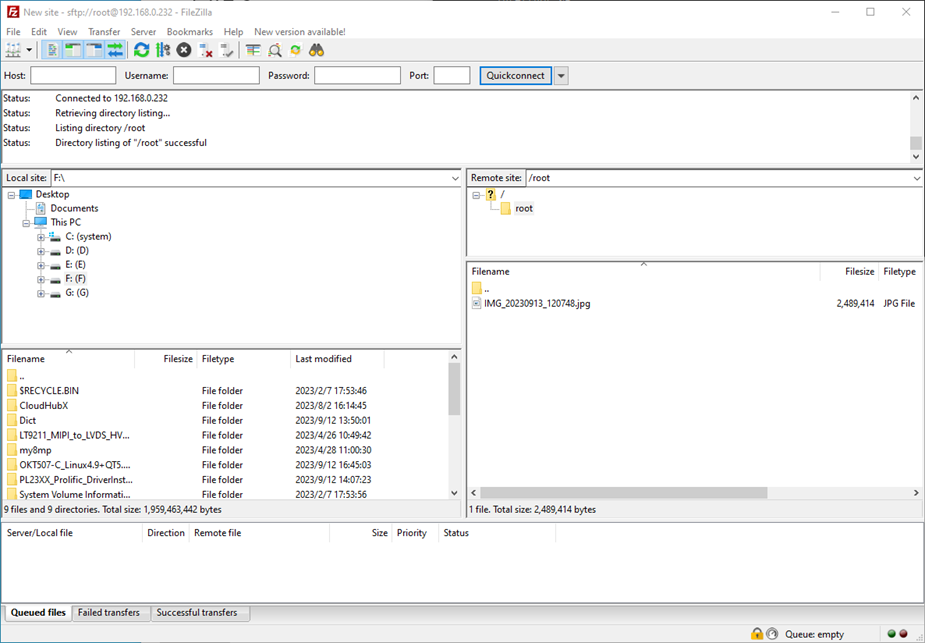

### 2.5 System Shutdown

Under normal circumstances, the power can be turned off directly. However, if data is being stored or other operations are in progress, do not cut off the power unexpectedly, as this may cause irreversible file corruption. To ensure that all data has been written completely, run the sync command before powering off the system.

**Note: If a user-designed product based on the SoM may be subject to unexpected power loss during operation, it is recommended to incorporate power-loss protection measures in the hardware design.**

## 3\. OK3506B-S12 Command Function Test

The OK3506B-S12 platform comes with a rich set of built-in command-line tools for users.

### 3.1 System Information Query

View kernel information:

```bash
root@ok3506-buildroot:/# uname -a
Linux ok3506-buildroot 6.1.99 #1 SMP PREEMPT Thu Jul 10 10:21:30 CST 2025 armv7l GNU/Linux
```

View CPU information:

```bash
root@ok3506-buildroot:/# cat /proc/cpuinfo
processor	: 0
model name	: ARMv7 Processor rev 5 (v7l)
BogoMIPS	: 48.00
Features	: half thumb fastmult vfp edsp neon vfpv3 tls vfpv4 idiva idivt vfpd32 lpae 
CPU implementer	: 0x41
CPU architecture: 7
CPU variant	: 0x0
CPU part	: 0xc07
CPU revision	: 5

processor	: 1
model name	: ARMv7 Processor rev 5 (v7l)
BogoMIPS	: 48.00
Features	: half thumb fastmult vfp edsp neon vfpv3 tls vfpv4 idiva idivt vfpd32 lpae 
CPU implementer	: 0x41
CPU architecture: 7
CPU variant	: 0x0
CPU part	: 0xc07
CPU revision	: 5

processor	: 2
model name	: ARMv7 Processor rev 5 (v7l)
BogoMIPS	: 48.00
Features	: half thumb fastmult vfp edsp neon vfpv3 tls vfpv4 idiva idivt vfpd32 lpae 
CPU implementer	: 0x41
CPU architecture: 7
CPU variant	: 0x0
CPU part	: 0xc07
CPU revision	: 5

Hardware	: Generic DT based system
Revision	: 0000
Serial		: 0000000000000000
```

View environment variable information (NAND version):

```bash
root@ok3506-buildroot:/# env
SHELL=/bin/sh
RUNLEVEL=#z-07/10/2025
EDITOR=/bin/vi
PWD=/
HOME=/
LANG=en_US.UTF-8
ADB_TCP_PORT=5555
USB_FW_VERSION=0x0310
TERM=vt102
USER=root
ADBD_SHELL=/bin/bash
SHLVL=1
USB_FUNCS=adb
USB_MANUFACTURER=Rockchip
USB_PRODUCT=rk3xxx
XDG_RUNTIME_DIR=/var/run
USB_VENDOR_ID=0x2207
PATH=/usr/bin:/usr/sbin
storagemedia=mtd
_=/usr/bin/env
```

### 3.2 Frequency Test

**Note: The following example uses cpu0. In actual operation, the frequencies of cpu1 and cpu2 will change simultaneously.**

1\. All cpufreq governor types supported in the current kernel:

```bash
root@ok3506-buildroot:/# cat /sys/devices/system/cpu/cpu0/cpufreq/scaling_available_governors
ondemand userspace performance
```

userspace indicates user mode, in which user programs are allowed to adjust the CPU frequency.

2\. To view the current frequency levels supported by the CPU:

```bash
root@ok3506-buildroot:/# cat /sys/devices/system/cpu/cpu0/cpufreq/scaling_available_frequencies
600000 800000 1008000 1200000 1296000 1416000 1512000
```

3\. Set to user mode and modify the frequency to 1200000:

```bash
root@ok3506-buildroot:/# echo userspace > /sys/devices/system/cpu/cpu0/cpufreq/scaling_governor
root@ok3506-buildroot:/# echo 1200000 > /sys/devices/system/cpu/cpu0/cpufreq/scaling_setspeed
```

4\. To view the current frequency after modification:

```bash
root@ok3506-buildroot:/# cat /sys/devices/system/cpu/cpu0/cpufreq/cpuinfo_cur_freq
1200000
```

### 3.3 Temperature Test

To view temperature values:

```bash
root@ok3506-buildroot:/# cat /sys/class/thermal/thermal_zone0/temp
35693
```

The temperature value is 35.7℃.

### 3.4 DDR Bandwidth Test

```bash
root@ok3506-buildroot:/# fltest_memory_bandwidth.sh
L1 cache bandwidth rd test with # process
0.008192 10395.11
0.008192 11199.63
0.008192 11508.11
0.008192 11505.91
0.008192 11385.61
L2 cache bandwidth rd test
0.131072 1583.82
0.131072 1086.63
0.131072 1459.69
0.131072 1080.10
0.131072 1518.21
Main mem bandwidth rd test
52.43 973.28
52.43 1086.99
52.43 1094.46
52.43 1086.04
52.43 1014.61
L1 cache bandwidth wr test with # process
0.008192 12435.04
0.008192 13813.38
0.008192 13756.73
0.008192 13581.10
0.008192 13567.01
L2 cache bandwidth wr test
0.131072 1287.92
0.131072 1582.16
0.131072 836.14
0.131072 1067.57
0.131072 1602.50
Main mem bandwidth wr test
52.43 612.92
52.43 646.88
52.43 596.98
52.43 593.11
52.43 557.30
```

The DDR3 write bandwidth is approximately 60M/s, and the read bandwidth is approximately 1000M/s.

### 3.5 Watchdog Test

The watchdog is a commonly used feature in embedded systems. On the OK3506B-S12, the watchdog device node is /dev/watchdog.

Start the watchdog, set the reset timeout to 10 seconds, and feed the watchdog periodically so that the system will not restart.

```bash
root@ok3506-buildroot:/# fltest_watchdog -t 10 -c
Watchdog Ticking Away!
```

When the test program is terminated with Ctrl + C, watchdog feeding stops, but the watchdog remains enabled, and the system will reset after 10 seconds.

If you do not want the system to reset, enter the command to disable the watchdog within 10 seconds after ending the program:

```bash
root@ok3506-buildroot:/# fltest_watchdog -d
Watchdog disabled.
```

Start the watchdog, set the reset timeout to 10 seconds, but do not feed it; the system will reboot after 10 seconds.

```bash
root@ok3506-buildroot:/# fltest_watchdog -t 10
Watchdog Ticking Away!
[   39.114587] watchdog: watchdog0: watchdog did not stop!
```

### 3.6 UART Test

There are 2 x UART on the development board:

| **UART**| **Device Nodes**| **Description**|
|:----------:|:----------:|:----------|
| UART0| /dev/ttyFIQ0| Debug serial port; cannot be used directly for this test|
| UART1| <font style="color:rgb(51, 51, 51);">/dev/ttyS1</font>|

This test uses UART1. Short the TXD and RXD pins of the 40-pin header with a jumper cap, as shown in the figure.

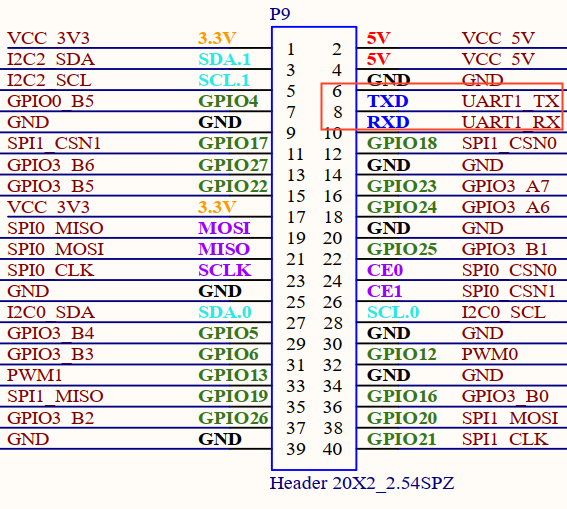

Enter the following command in the development board serial port to test UART receiving:

```bash
root@ok3506-buildroot:/# fltest_uarttest -d /dev/ttyS1 -b 115200 -r &
[1] 2845
root@ok3506-buildroot:/# fltest_uarttest -d /dev/ttyS1 -b 115200 -w  
rx_0: aKy13NEjulEat0IsHZmOxhO3HLkul66L
tx_0: aKy13NEjulEat0IsHZmOxhO3HLkul66L
```

### 3.7 TF Test

**Note:**

+ **The SD card mount directory is /run/media/. Hot plugging is supported, and the terminal will print information about the SD card;**
+ **File systems such as FAT32 and EXT4 are supported. If you are not sure about the format of the TF card, it is recommended to format it as FAT32 before use.**

1\. Insert the TF card into the TF card slot on the carrier baord. Under normal circumstances, the following information will be printed on the terminal:

```bash
[ 3496.124630] mmc_host mmc0: Bus speed (slot 0) = 50000000Hz (slot req 50000000Hz, actual 50000000HZ div = 0)
[ 3496.124875] mmc0: new high speed SDHC card at address aaaa
[ 3496.127596] mmcblk0: mmc0:aaaa SC16G 14.8 GiB 
[ 3496.133906]  mmcblk0: p1
[ 3496.268275] EXT4-fs (mmcblk0): VFS: Can't find ext4 filesystem
[ 3496.269290] EXT4-fs (mmcblk0): VFS: Can't find ext4 filesystem
[ 3496.270072] EXT2-fs (mmcblk0): error: can't find an ext2 filesystem on dev mmcblk0.
[ 3496.271600] FAT-fs (mmcblk0): bogus number of reserved sectors
[ 3496.271691] FAT-fs (mmcblk0): Can't find a valid FAT filesystem
[ 3496.271957] FAT-fs (mmcblk0): bogus number of reserved sectors
[ 3496.271996] FAT-fs (mmcblk0): Can't find a valid FAT filesystem
[ 3496.619184] FAT-fs (mmcblk0p1): Volume was not properly unmounted. Some data may be corrupt. Please run fsck.
```

2\. Check the mount directory:

```bash
root@ok3506-buildroot:/# ls /run/media/
mmcblk0p1
```

3\. Write test:

```bash
root@ok3506-buildroot:/# dd if=/dev/zero of=/run/media/mmcblk0p1/test bs=1M count=500 conv=fsync
500+0 records in
500+0 records out
524288000 bytes (524 MB, 500 MiB) copied, 41.3072 s, 12.7 MB/s
```

4\. Read test:

```bash
root@ok3506-buildroot:/# dd if=/run/media/mmcblk0p1/test of=/dev/null bs=1M count=500 iflag=direct
500+0 records in
500+0 records out
524288000 bytes (524 MB, 500 MiB) copied, 22.4557 s, 23.3 MB/s
```

5\. After using the TF card, unmount it with umount before removing it.

```bash
root@ok3506-buildroot:/# umount /run/media/mmcblk0p1
```

**Note: Exit the TF card mount directory before inserting or removing the TF card.**

### 3.8 Storage Test

#### 3.8.1 NAND Test

The OK3506B-S12 platform is configured with an SPI NAND driver by default. The root file system uses the squashfs file system (read-only), and the userdata partition uses the ubifs file system.

```bash
root@ok3506-buildroot:/# cat /proc/mtd
dev:    size   erasesize  name
mtd0: 00400000 00020000 "uboot"
mtd1: 00100000 00020000 "misc"
mtd2: 00a00000 00020000 "boot"
mtd3: 01000000 00020000 "recovery"
mtd4: 08000000 00020000 "rootfs"
mtd5: 01000000 00020000 "oem"
mtd6: 04c60000 00020000 "userdata"
```

Note that the mtd4 partition is the current root file system.

Write test:

```bash
root@ok3506-buildroot:/# dd if=/dev/zero of=/userdata/test bs=1M count=20 conv=fsync
20+0 records in
20+0 records out
20971520 bytes (21 MB, 20 MiB) copied, 0.651586 s, 32.2 MB/s
```

Read test:

**Note: To ensure accurate data, restart the development board before testing the read speed.**

```bash
root@ok3506-buildroot:/# dd if=/userdata/test of=/dev/null bs=1M
20+0 records in
20+0 records out
20971520 bytes (21 MB, 20 MiB) copied, 1.11805 s, 18.8 MB/s
```

### 3.9 USB2.0

The OK3506B-S12 supports one USB 2.0 interface. You can connect devices such as a USB mouse, USB keyboard, or USB flash drive to the onboard USB HOST interface. Hot plugging is supported for these devices. Here, mounting a USB flash drive is used as an example. USB flash drive testing has currently been verified up to 32 GB; capacities above 32 GB have not been tested.

The terminal will print information related to the USB flash drive. Since there are many different types of USB drives, the displayed information may vary.

1\. After the development board boots, connect a USB flash drive to the board USB HOST interface. Since the default log level is relatively low, no message may be printed directly; you can use the dmesg command to view messages and locate the USB-drive-related information.

```bash
[   95.470811] usb 2-1: new high-speed USB device number 2 using dwc2
[   95.668944] usb-storage 2-1:1.0: USB Mass Storage device detected
[   95.670071] scsi host0: usb-storage 2-1:1.0
[   96.675102] scsi 0:0:0:0: Direct-Access     SanDisk  Cruzer Blade     1.00 PQ: 0 ANSI: 6
[   96.692237] sd 0:0:0:0: [sda] 60125184 512-byte logical blocks: (30.8 GB/28.7 GiB)
[   96.693119] sd 0:0:0:0: [sda] Write Protect is off
[   96.693534] sd 0:0:0:0: [sda] Write cache: disabled, read cache: enabled, doesn't support DPO or FUA
[   96.708522]  sda: sda1
[   96.709054] sd 0:0:0:0: [sda] Attached SCSI removable disk
[   97.194642] EXT4-fs (sda): VFS: Can't find ext4 filesystem
[   97.203836] EXT4-fs (sda): VFS: Can't find ext4 filesystem
[   97.213091] EXT2-fs (sda): error: can't find an ext2 filesystem on dev sda.
[   97.231780] FAT-fs (sda): bogus number of reserved sectors
[   97.231844] FAT-fs (sda): Can't find a valid FAT filesystem
[   97.232647] FAT-fs (sda): bogus number of reserved sectors
[   97.232695] FAT-fs (sda): Can't find a valid FAT filesystem
[   98.638329] FAT-fs (sda1): Volume was not properly unmounted. Some data may be corrupt. Please run fsck.
```

2\. Check the mount directory:

```bash
root@ok3506-buildroot:/# ls /run/media/
sda1  ubiblock0_0
```

You can see that /run/media/sda1 is the mount path of the USB storage device.

3\. Check the contents of the USB drive (here, sda1 should match the actual partition name of the USB drive).

```bash
root@ok3506-buildroot:/# ls -l /run/media/sda1/
total 512000
-rwxrwx--- 1 root disk 524288000 Dec 12 20:25 test
```

4\. Write test. Write speed is limited by the specific storage device:

```bash
root@ok3506-buildroot:/# dd if=/dev/zero of=/run/media/sda1/test bs=1M count=500 conv=fsync
500+0 records in
500+0 records out
524288000 bytes (524 MB, 500 MiB) copied, 45.6879 s, 11.5 MB/s
```

5\. Read test.

```bash
root@ok3506-buildroot:/# dd if=/run/media/sda1/test of=/dev/null bs=1M iflag=direct
500+0 records in
500+0 records out
524288000 bytes (524 MB, 500 MiB) copied, 18.8926 s, 27.8 MB/s
```

6\. After using the USB flash drive, unmount it with umount before unplugging it.

```bash
root@ok3506-buildroot:/# umount /run/media/sda1
```

**Note: Exit the mount path before unplugging the USB drive.**

### 3.10 USB to Quad Serial Port Test

**Note:**

+ **Supports XR21V1414 USB to serial port chip driver;**
+ **The USB-to-4-UART module is optional. If needed, please contact Forlinx Embedded sales staff.**

1\. After the development board powers on and boots, connect the USB-to-4-UART module to the USB HOST interface. The following information will be printed on the terminal:

```bash
[  252.890797] usb 2-1: new full-speed USB device number 3 using dwc2
[  253.089537] cdc_xr_usb_serial 2-1:1.0: This device cannot do calls on its own. It is not a modem.
[  253.089794] cdc_xr_usb_serial 2-1:1.0: ttyXR_USB_SERIAL0: USB XR_USB_SERIAL device
[  253.092956] cdc_xr_usb_serial 2-1:1.2: This device cannot do calls on its own. It is not a modem.
[  253.093271] cdc_xr_usb_serial 2-1:1.2: ttyXR_USB_SERIAL1: USB XR_USB_SERIAL device
[  253.096288] cdc_xr_usb_serial 2-1:1.4: This device cannot do calls on its own. It is not a modem.
[  253.096554] cdc_xr_usb_serial 2-1:1.4: ttyXR_USB_SERIAL2: USB XR_USB_SERIAL device
[  253.099272] cdc_xr_usb_serial 2-1:1.6: This device cannot do calls on its own. It is not a modem.
[  253.099552] cdc_xr_usb_serial 2-1:1.6: ttyXR_USB_SERIAL3: USB XR_USB_SERIAL device
```

2\. Use lsusb to check the USB device status:

```bash
root@ok3506-buildroot:/# lsusb
Bus 002 Device 003: ID 04e2:1414                             //The vid and pid of the conversion chip
Bus 001 Device 001: ID 1d6b:0002
Bus 002 Device 001: ID 1d6b:0002
```

Check whether serial device nodes have been created under /dev:

```bash
root@ok3506-buildroot:/# ls /dev/ttyXRUSB*
/dev/ttyXRUSB0	/dev/ttyXRUSB1	/dev/ttyXRUSB2	/dev/ttyXRUSB3
```

3\. The mapping between the four extended serial ports and their device nodes is shown in the figure below;

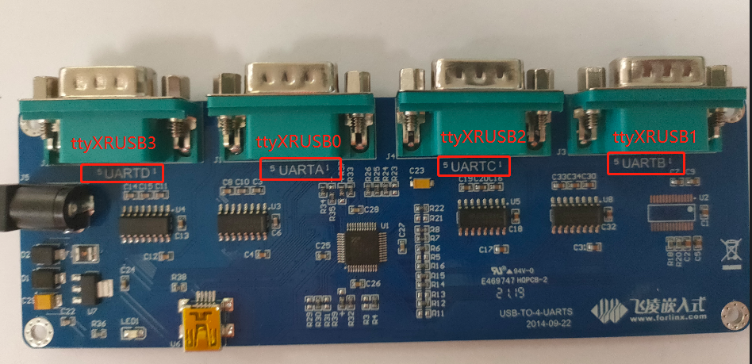

4\. For the test method, refer to Section 4.6 UART Test.

### 3.11 OTG Test

There is 1 x OTG device interface, which can be used for firmware flashing, ADB file transfer, and debugging.

#### 3.11.1 Device Mode

1\. Connect the board to a PC using a Type-C cable. The following serial output will be displayed:

```bash
[ 1811.539300] dwc2 ff740000.usb: new device is full-speed
[ 1811.747607] dwc2 ff740000.usb: new device is high-speed
[ 1812.013915] dwc2 ff740000.usb: new device is high-speed
[ 1812.047658] dwc2 ff740000.usb: new address 44
[ 1812.076229] dwc2 ff740000.usb: dwc2_hsotg_ep_sethalt(ep b210f0b8 ep1in, 0)
[ 1812.076341] dwc2 ff740000.usb: dwc2_hsotg_ep_sethalt(ep 34e64b59 ep2out, 0)
[ 1812.076382] android_work: sent uevent USB_STATE=CONFIGURED
```

The Rockchip development tool will show “An ADB device has been found.” You can then use ADB tools for debugging.

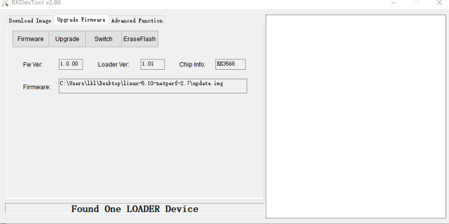

### 3.12 Ethernet Configuration

There is 1 x onboard 100M Ethernet port. When a network cable is connected, eth0 is configured by default at the factory with the static IP address 192.168.0.232.

The configuration file path is:  
/etc/network/interfaces

**Note: Since the NAND version uses a read-only root file system, the default IP address cannot be changed by modifying this configuration file. It can only be changed manually by executing commands.**

Manually set the IP address to 192.168.0.232 and the subnet mask to 255.255.255.0.

```bash
root@ok3506-buildroot:/# ifconfig eth0 192.168.0.232 netmask 255.255.255.0
```

### 3.13 Playback/Recording Test

There is 1 x standard 3.5 mm audio jack. Before performing the audio playback test, plug the prepared earphones into the headphone jack.

Audio can be recorded through either the earphone microphone or the onboard microphone.

```bash
root@ok3506-buildroot:/# arecord -l
**** List of CAPTURE Hardware Devices ****
card 0: rockchipacodec [rockchip,acodec], device 0: ff4a8000.sai-rk3506-hifi rk3506-hifi-0 [ff4a8000.sai-rk3506-hifi rk3506-hifi-0]
  Subdevices: 1/1
  Subdevice #0: subdevice #0
root@ok3506-buildroot:/# aplay -l
**** List of PLAYBACK Hardware Devices ****
card 1: rockchipdsmsoun [rockchip-dsm-sound], device 0: ff4a0000.sai-rk_dsm rk_dsm-0 [ff4a0000.sai-rk_dsm rk_dsm-0]
  Subdevices: 1/1
  Subdevice #0: subdevice #0
root@ok3506-buildroot:/# arecord -D hw:0,0 -d 5 -f cd -t wav /userdata/test1.wav    //Capture the headset microphone for 5 seconds and save in WAV format
root@ok3506-buildroot:/# aplay -D hw:1,0 /userdata/test1.wav   	/Play captured sound

```

### 3.14 LCD Backlight Adjustment

The brightness range for the backlight is (0–255), where 255 indicates the highest brightness and 0 turns off the backlight. Connect a MIPI display to MIPI DSI0 and power on the board. After the system boots, enter the following commands in the terminal to test the backlight.

1\. View the current screen backlight value:

```bash
root@ok3506-buildroot:/# cat /sys/class/backlight/backlight/brightness
200                                           			//The current backlight is 200
```

2\. Turn off the backlight:

```bash
root@ok3506-buildroot:/# echo 0 > /sys/class/backlight/backlight/brightness
```

3\. Turn on the LCD backlight:

```bash
root@ok3506-buildroot:/# echo 125 > /sys/class/backlight/backlight/brightness
```

### 3.15 SQLite3 Test

SQLite3 is a lightweight database system, an ACID-compliant relational database management system with low resource consumption. 

The OK3506B-S12 development board uses version 3.44.2 of SQLite3.

```bash
root@ok3506-buildroot:/# sqlite3
SQLite version 3.44.2 2023-11-24 11:41:44
Enter ".help" for usage hints.
Connected to a transient in-memory database.
Use ".open FILENAME" to reopen on a persistent database.

sqlite> create table tbl1 (one varchar(10), two smallint); // Create table tbl1
sqlite> insert into tbl1 values('hello!',10);               // Insert data "hello!" | 10 into tbl1
sqlite> insert into tbl1 values('goodbye', 20);            // Insert data "goodbye" | 20 into tbl1
sqlite> select * from tbl1;                                 // Query all data from tbl1
hello!|10
goodbye|20
sqlite> delete from tbl1 where one = 'hello!';              // Delete data where "one" column value is "hello!"
sqlite> select * from tbl1;                                 // Query all data from tbl1 again
goodbye|20
sqlite> .quit                                              // Exit the SQLite database (or use .exit command)
```

### 3.16 Adding a Startup Script

Temporarily add a startup script.

1\. Modify /userdata/autorun.sh;

```bash
root@ok3506-buildroot:/# cat /userdata/autorun.sh
#! /bin/sh
# env

# user command

exit 0
```

2\. Restart the board for verification;

To add a startup script into the flashed image:

<font style="color:rgb(51, 51, 51);">Modify: device/rockchip/common/extra-parts/userdata/normal/autorun.sh</font>

Then recompile, repack, and flash the image again.

### 3.17 I2C

There is a 40Pin header, which includes two I2C buses: I2C0 and I2C2.

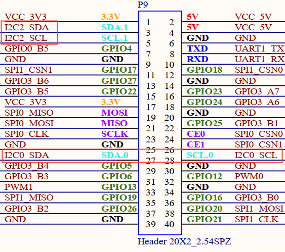

View I2C node:

```bash
root@ok3506-buildroot:/# ls /dev/i2c-*
/dev/i2c-0  /dev/i2c-2
```

### 3.18 SPI

There is a 40Pin header, which includes two SPI buses: SPI0 and SPI1.

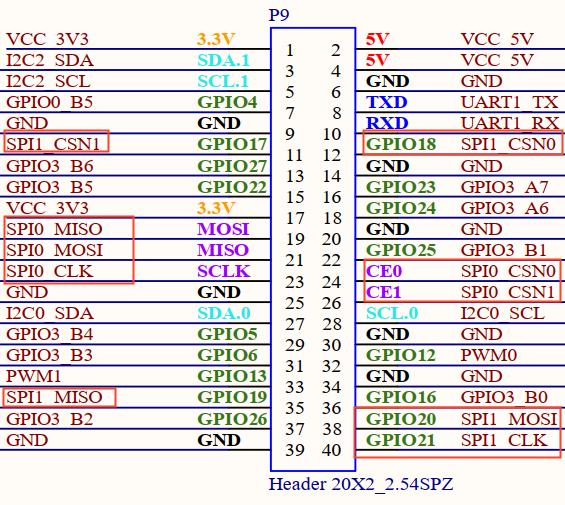

View SPI node:

```bash
root@ok3506-buildroot:/# ls /dev/spidev*
/dev/spidev0.0	/dev/spidev1.0
```

**Note: The spidev devices for both SPI0 and SPI1 are attached to chip select 0, so this should be taken into account during use.**

## 4\. System Flashing

The OK3506B-S12 development board currently supports flashing through OTG. The corresponding flashing tools are provided in the user materials.

### 4.1 OTG System Flashing

#### 4.1.1 OTG Driver Installation

Path: User Files\\Software\\3-Tools\\DriverAssitant\_v5.13.zip

Extract the file above to any directory and run it with administrator privileges.

Open the DriverInstall.exe program.Open DriverInstall.exe

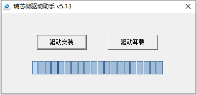

Click Install Driver.

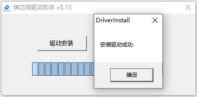

#### 4.1.2 OTG Full Flashing Test

##### 4.1.2.1 RKDevTool Flashing Test

Path: User Files\\Software\\3-Tools\\RKDevTool\_v3.32\_for\_window.zip

It is a development tool provided by Rockchip. Extract it to a directory with only English characters, then connect the development board to the host using a Type-C cable. Press and hold the recovery button on the development board, then press the reset button to reset the system. After about two seconds, release the recovery button. There will be prompts on the Rockchip development tool : loader device found

**Note:** 

- **Device detection occurs when the recovery button is pressed during the power-on of the development board;**

- **In theory, the Rockchip tool can be extracted to any directory, but some users have reported that the extraction path must contain only English characters. If the interface does not appear as shown below after opening the tool, try extracting it to an all-English directory.**

Open the Rockchip development tool:

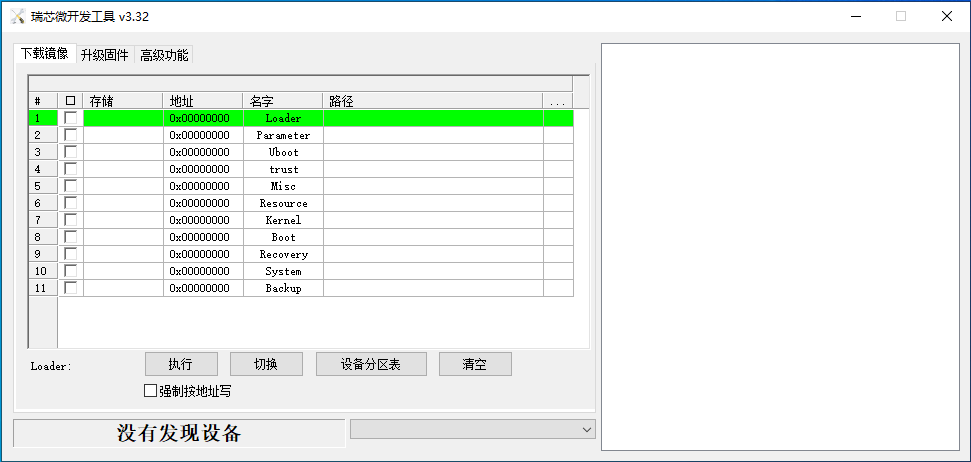

Click the "Upgrade Firmware" tab, click the "Firmware" button to select the full upgrade image update.img.

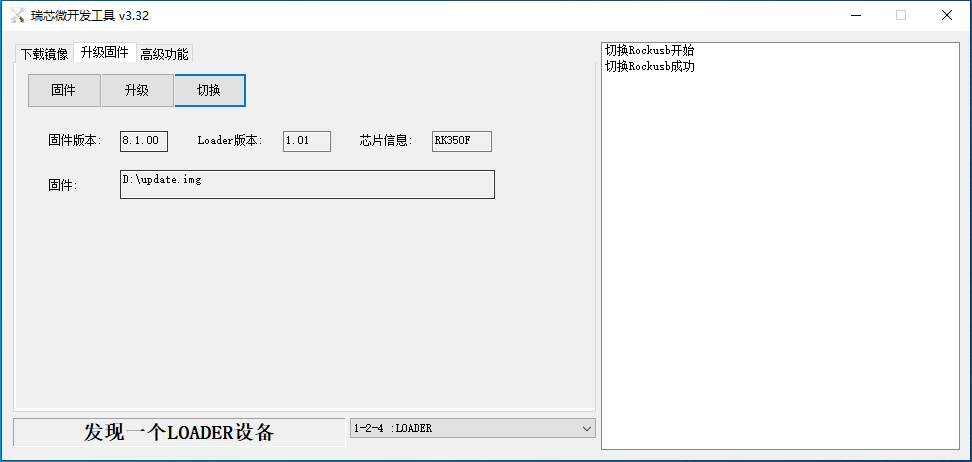

Click the "Upgrade" button to upgrade.

**MASKROM Mode Introduction**

If Loader mode is inaccessible (loader problem, etc.), press and hold the MASKROM key, then press the reset key to enter maskrom mode for burning.

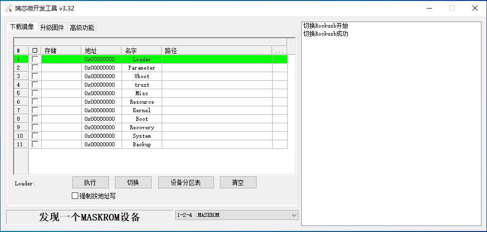

At this time, the system will prompt the discovery of a maskrom device. The burning process is consistent with the loader mode, so it is best to use an update.img burning.

**Note:** 

- **Don't click "Device Partition Table" in maskrom mode, it is invalid;**

- **Flashing a single image in MASKROM mode does not clear the UBoot environment variables.**

##### 4.1.2.2 FactoryTool Flashing Test

FactoryTool is used for batch OTG flashing in the factory. It does not require reading an image file and can batch-flash large images. If RKDevTool does not meet compatibility requirements, this method can also be attempted. Before using, extract it to a directory with only English characters. Connect the development board and host using a Type-C cable. Press and hold the recovery button, press the reset button for the system reset, and after about two seconds, release the recovery button. There will be prompts on the Rockchip development tool : loader device found

**Note:** 

- **Device detection occurs when the recovery button is pressed during the power-on of the development board;**

- **In theory, the Rockchip tool can be extracted to any directory, but some users have reported that the extraction path must contain only English characters. If the interface does not appear as shown below after opening the tool, try extracting it to an all-English directory.**

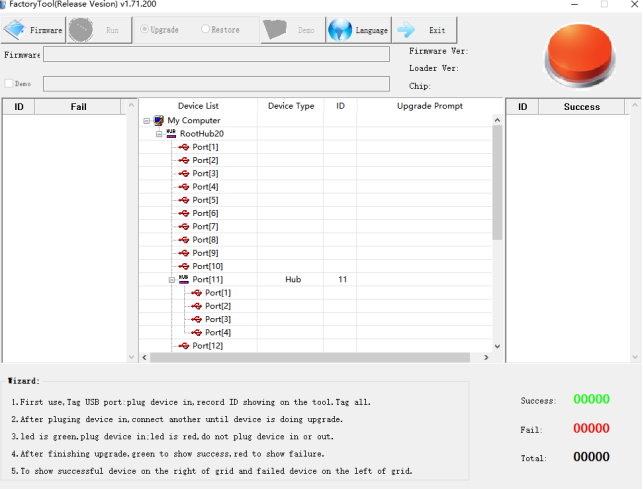

After selecting the firmware, click Start. The loader device will be detected, and the flashing process will begin automatically.

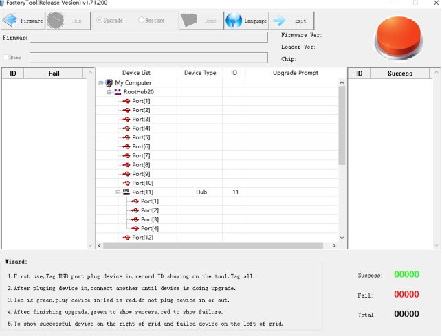

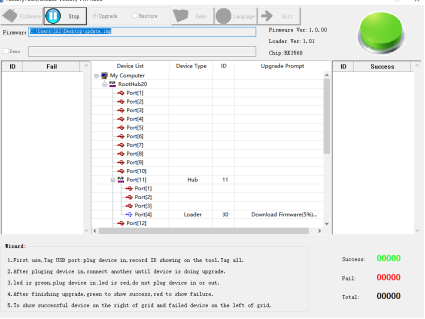

#### 4.1.3 OTG Step Flashing Test

During the development phase, performing full flashing every time can be time-consuming. Therefore, here it introduces how to use OTG flashing tools to flash individual partitions.

**Note: Device detection occurs when the recovery button is pressed during the power-on of the development board.**

First, after the compilation is complete, a separate partition image can be found in the rockdev directory.

Take separate flashing boot. img (including device tree and startup logo) as an example to show the flashing method.

Connect the development board and host using a Type-C cable, press and hold the recovery button, then press the reset button for system reset. After about two seconds, release the recovery button. The system will prompt “ Find Loader Device”.

Click the Device Partition Table button. The partition addresses will be read automatically. When prompted whether to update the download address, click Yes. After the partition table is read successfully, select the partition image in the area on the right side of the partition entry and check the corresponding partition.

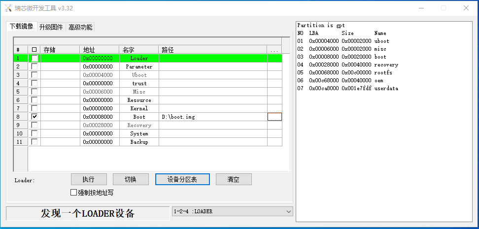

Click the “Execute” button to automatically flash and restart.