# 0_OK3506B-S12硬件手册

版本：V1.1

发布日期：2025.09.12 

文件密级：□绝密 □秘密 □内部资料 ■公开

# **声明**
本手册版权归保定飞凌嵌入式技术有限公司所有。未经本公司的书面许可，任何单位和个人无权以任何形式复制、传播、转载本手册的任何部分，违者将被追究法律责任。

保定飞凌嵌入式有限公司所提供的所有服务内容旨在协助用户加速产品的研发进度，在服务过程中所提供的任何程序、文档、测试结果、方案、支持等资料和信息，都仅供参考，用户有权不使用或自行参考修改，本公司不提供任何的完整性、可靠性等保证，若在用户使用过程中因任何原因造成的特别的、偶然的或间接的损失，本公司不承担任何责任。	

# 概 述
本手册以使用户快速熟悉产品，了解接口功能和功能配置为目的，主要讲述了开发板接口功能，接口介绍，产品功耗，以及使用过程中出现的一些问题如何排查。在说明过程中，对一些命令进行了注释，方便用户理解，以实用够用为主。涉及到引脚功能复用、硬件问题排查方法等请参考飞凌提供的《FET3506x-S引脚复用对照表》。

+ 本手册一共分为4部分：
+ 第一部分CPU整体概述，简单介绍了CPU性能和应用行业；
+ 第二部分核心板的整体介绍，包括连接器引脚的相关说明和功能介绍；
+ 第三部分开发板的整体介绍，分为多个章节介绍，包括了硬件原理和简单的设计思路两大部分；
+ 第四部分产品的功耗及其他说明，主要描述板子的功耗方面表现和其他注意事项。
+ 本手册中一些符号及格式的相关说明：

| **表现形式** | **含义** |
| :---: | --- |
| ⁉️ | 注意或者是需要特别关注的信息，一定要仔细阅读 |
| 📚 | 对测试章节做的相关说明 |
| 🛤️ | 表示相关路径 |

# 更新记录
| **日期** | **手册版本** | **核心板版本** | **底板版本** | **更新内容** |
| :---: | :---: | :---: | :---: | --- |
| 2025.09.04 | V1.0 | V1.1 | V1.1 | 初版 |
| 2025.09.12 | V1.1 | V1.1 | V1.1 | 1、在3.5.1底板电源章节下添加注意事项； 2、修改第五章节的功耗表 |

# 01_Rockchip RK3506B简介

RK3506是瑞芯微推出的一款高性能应用处理器。该处理器采用22nm先进制程工艺，集成了3个ARM Cortex-A7内核，主频高达1.5GHz，并搭载一颗200MHz的M0内核，专为智能语音交互、音频输入/输出处理、图像输出处理和其他数字多媒体应用而设计。

RK3506内置2D硬件引擎和显示输出引擎，可最大限度地减少CPU开销，以满足图像显示要求。

RK3506内嵌丰富的外设接口，如I2S、PCM、TDM、PDM、SPDIF、Audio DSM、Audio ADC、USB2 OTG、RMII、CAN等，可满足不同应用开发需求，降低硬件开发复杂度和开发成本。

RK3506具有高性能的外部存储器接口 （DDR2/DDR3/DDR3L），能够支持高要求的存储器带宽。

OK3506B-S12开发板默认使用商业级处理器RK3506B。

**RK3506B/J处理器框图**

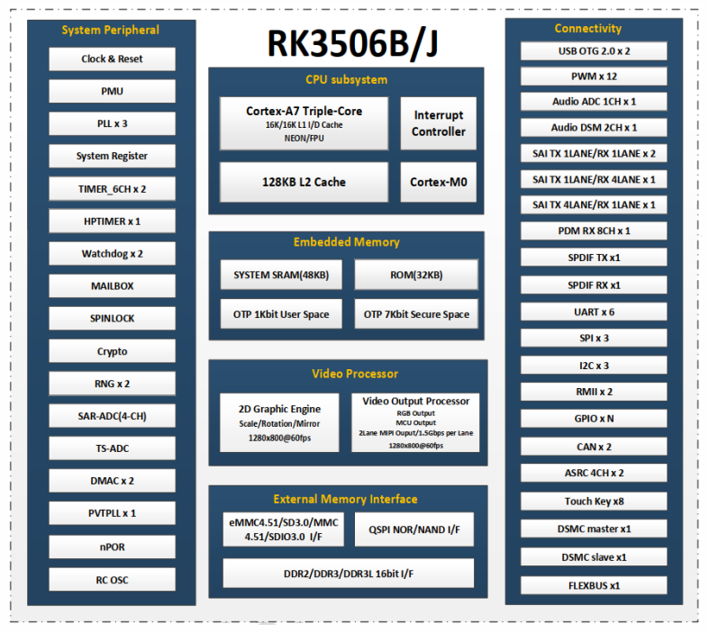

---

# 02_FET3506B-S核心板介绍

## 2.1  核心板外观图
FET3506B-S核心板正面图（NAND版本）

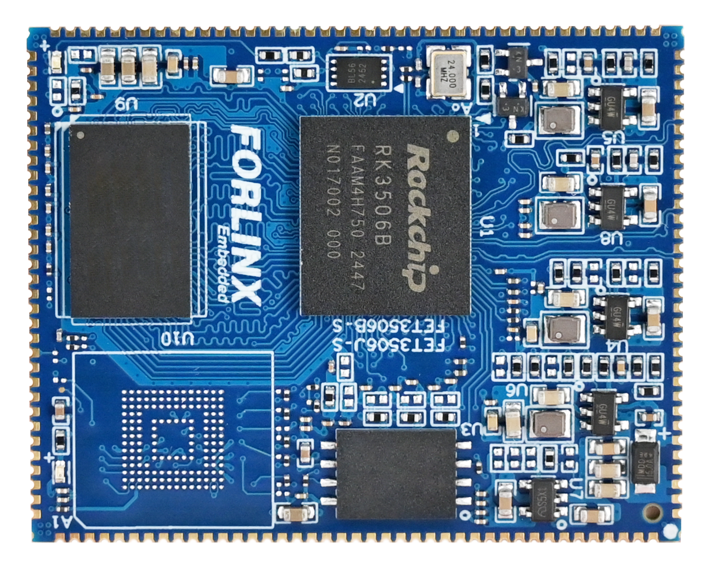

FET3506B-S核心板背面图

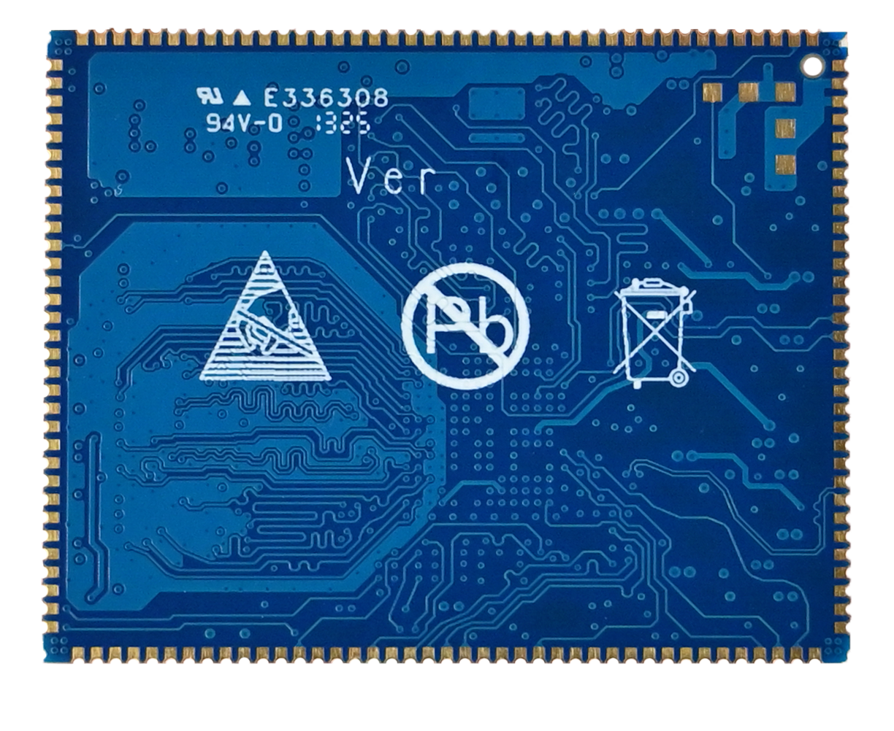

## 2.2  FET3506B-S核心板尺寸图
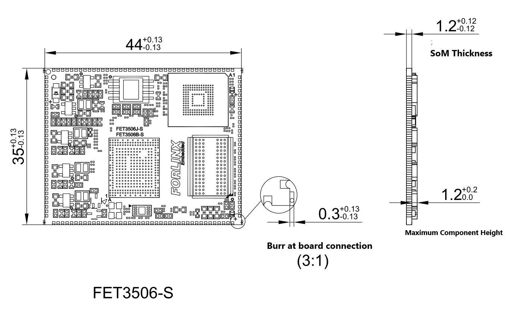

结构尺寸：44mm×35mm，尺寸公差±0.13mm，更多尺寸信息参见DXF文件。

制版工艺：厚度1.2mm，8层沉金PCB。

邮票孔封装，共146个PIN。

FET3506J-S与FET3506B-S尺寸相同，仅CPU不同。

## 2.3 性能参数
### 2.3.1  系统主频
| **名称** | **规格** | | | | **说明** |
| :---: | :---: | --- | --- | --- | :---: |
| | **最小** | **典型** | **最大** | **单位** |
| 系统主频 | — | — | 1.5 | GHz | — |
| 系统RTC时钟 | — | 32.768 | — | KHz | — |

### 2.3.2  供电参数
| **参数** | **引脚标号** | **规格** | | | | **说明** |
| :---: | :---: | :---: | --- | --- | --- | :---: |
| | | **最小** | **典型** | **最大** | **单位** |
| 主电源电压 | VSYS | 4.75 | 5 | 5.25 | V | — |
| 空载电流 | — |  | 54 |  | mA | 请见附录功耗表 |
| 重载电流 | — |  | 145 |  | mA | 请见附录功耗表 |

### 2.3.3  工作环境
| **参数描述** | | **规格** | | | | **说明** |
| :---: | --- | :---: | --- | --- | --- | :---: |
| | | **最小** | **典型** | **最大** | **单位** |
| 工作温度 | 工作环境 | -20 | 25 | +80 | ℃ | 商业级 |
| | 存储环境 | -40 | 25 | +125 | ℃ |  |
| | 工作环境 | -40 | 25 | +85 | ℃ | 工业级 |
| | 存储环境 | -40 | 25 | +125 | ℃ |  |
| 湿度 | 工作环境 | 10 | — | 90 | ％RH | 无凝露 |
| | 存储环境 | 5 | — | 95 | ％RH |  |

## 2.4  核心板接口资源
| **功能** | **数量** | **参数** |
| :---: | :---: | --- |
| USB2.0 | 2 | 支持一个USB2.0 HOST， 一个USB2.0 OTG，其中OTG支持镜像烧写 |
| UART(1) | ≤6 | 其中UART3/UART4/UART5支持流控，最高波特率4Mbps |
| SPI | ≤3 | 其中SPI0/SPI1为通用SPI控制器，支持主模式和从模式；SPI2为SPI2APB控制器，只支持从模式，通常用于推送固件或其他数据流 |
| I2C（2） | ≤3 | 最高速率可达1Mbit/s |
| RMII | ≤2 | 支持10/100Mbps 的RMII接口 |
| SARADC（3） | ≤4 | 10bits 分辨率，最大采样率1MS/s |
| FLEXBUS | ≤1 | FLEXBUS等效于并行16bit接口，分为FLEXBUS0/1两组 |
| Touch Key | ≤8 |  |
| MIPI-DSI（4） | ≤1 | 支持1路MIPI DSI TX ，2 -lanes，1.5Gbps/Lane，分辨率高达1280 x 1280@60fps； |
| RGB | ≤1 | 支持 RGB 888 格式，分辨率高达 1280 x 1280@60fps |
| DSMC | ≤1 | 支持1路master或者1路slave |
| TF卡(5) | ≤1 | 兼容SDIO3.0协议，4bits数据位宽 |
| SAI | ≤4 | 支持协议I2S，PCM，TDM，最大采样率192kHz |
| ACODEC | ≤1 | RK3506内置ACODEC，支持1对差分MIC输入 |
| PDM | ≤1 | 最大8个通道，采样率最高192KHz，master receive mode |
| SPDIF | ≤1 |  |
| CAN | ≤2 | 支持CAN2.0B，数据速率8Mbps |
| PWM | ≤11 |  |
| RM_IO | ≤32 | RM_IO是IO矩阵，共32个引脚 |
| GPIO(6) | ≤93 |  |

+ 注：表中参数为硬件设计或CPU理论值；

注：“TBD”指暂未开发功能。 

注（1）： UART0是调试串口，不建议用作其他功能，用户可用最多5个串口；

注（2）： I2C2已在核心板外接地址为0x50的EEPROM，外接2K上拉至3V3，底板使用时需注意不要产生设备地址冲突。请注意，如果I2C2总线被外部破坏，会影响到核心板读取EEPROM数据，进而影响核心板正常启动。

注（3）：SARADC_IN0专用于SYSTEM BOOT启动顺序的设置，不能用于其它功能；SARADC_IN1当作按键的键值输入采样，并复用为Recovery模式按键（不可修改），不建议用作普通ADC，用户最多数量为2个ADC；

注（4）：RGB和MIPI-DSI共用一个VOP，只能单屏显示；

注（5）：TF卡与核心板emmc共用一个SDMMC控制器，因此只有NAND版本核心板上的TF卡才可使用

注（6）：MIPI_DSI相关6个引脚，只能用做GPO

## 2.5  FET3506B-S核心板引脚定义
### 2.5.1  FET3506B-S核心板引脚原理图
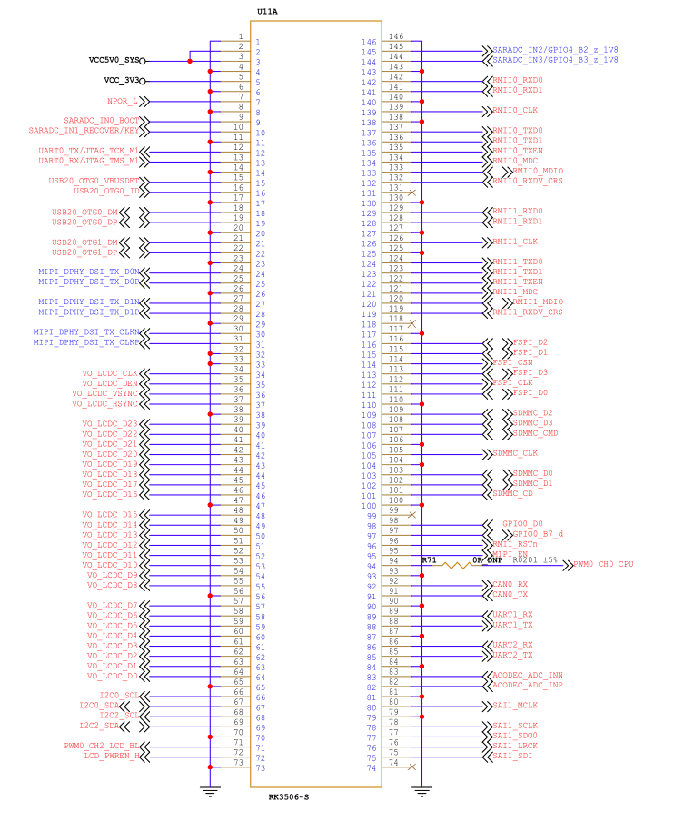

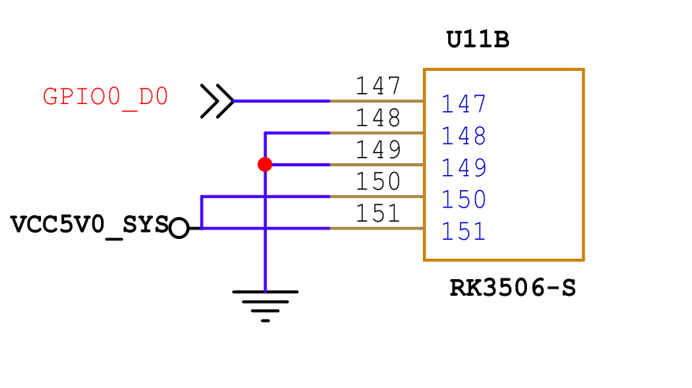

## 2.6  核心板硬件设计说明
**电源引脚**

| **功能** | **信号名称** | **I/O** | **默认功能** | **引脚号** |
| :---: | :---: | :---: | --- | :---: |
| 电源 | VCC5V0_SYS | 电源输入 | 核心板电源供电引脚5V，建议底板提供电流不少于2.0A | 2,3 |
| 电源使能 | VCC_3V3 | 电源输出 | 仅用于控制底板外部电源的使能信号，由核心板输出 | 5 |
| 地 | GND | 地 | 核心板电源地和信号地，所有GND引脚都需要连接 |  |

**功能控制引脚**

| **功能** | **信号名称** | **I/O** | **默认功能** | **引脚号** |
| :---: | :---: | :---: | --- | :---: |
| CPU复位 | NPOR_L | I | 核心板电源复位，低电平有效，用户不要在该引脚添加额外的容性负载，以免影响核心板正常启动 | 7 |
| BOOT选择 | SARADC0_IN0_BOOT | I | 信号接地时，启动板卡进入Maskrom下载模式。   下拉12K电阻为优先eMMC或SD Card启动；   悬空为优先FSPI启动； | 9 |
| 恢复模式 | SARADC0_IN1_RECOVERY/KEY | I | 信号接地时，启动板卡进入Recovery下载模式 | 10 |
| 调试串口 | UART0_TX_DEBUG   UART0_RX_DEBUG | I/O | 调试串口，建议用户保留该端口功能 | 12,13 |

FET3506B-S核心板已经将电源、复位监控电路、存储电路集成于一个小巧的模块上，所需的外部电路非常简洁,构成一个最小系统只需要 5V 电源即可运行,如下图所示:

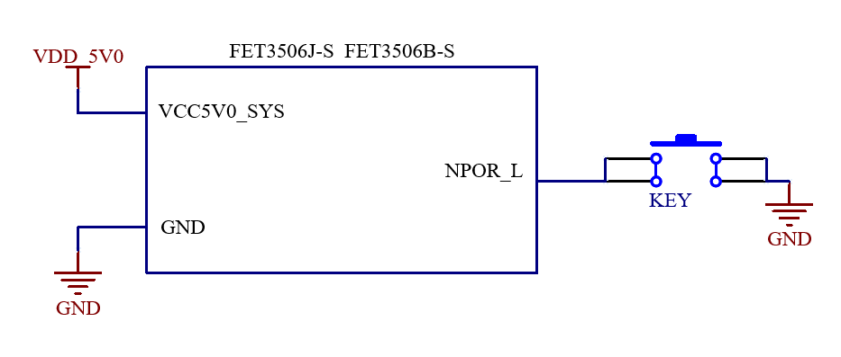

最小系统原理图可以参见附录四。不过一般情况下，除最小系统外建议连接上一些外部设备，例如调试串口，镜像烧写端口，否则用户无法判断系统是否启动。做好这些后，再在此基础上根据飞凌提供的核心板默认接口定义来添加用户需要的功能。

核心板外围电路的设计可参见第三章的3.5节“OK3506x-S2底板说明”。

# 03_飞凌OK3506B-S12嵌入式开发平台介绍

## 3.1  OK3506B-S12开发板接口图
飞凌OK3506B-S12开发平台核心板和底板采用邮票孔的连接方式，主要接口如下图所示：

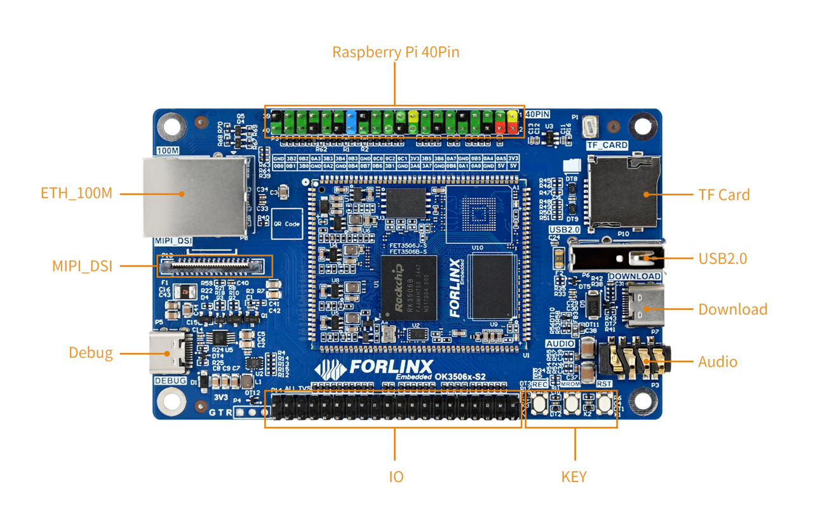

## 3.2  OK3506B-S12开发板尺寸图
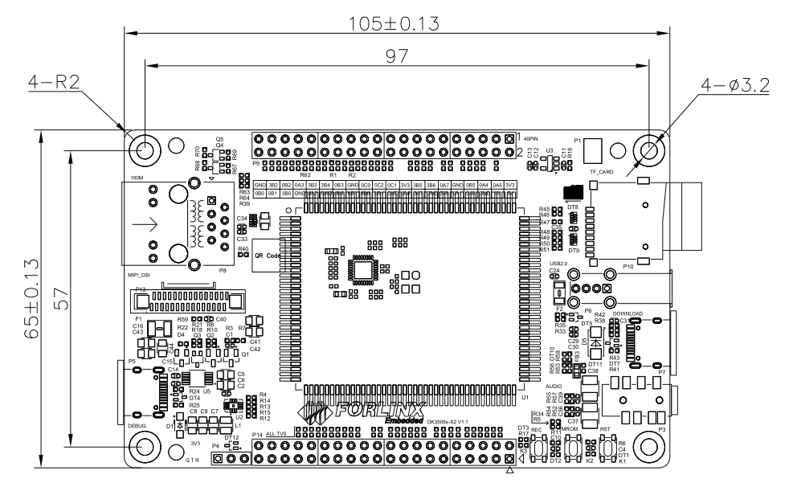

PCB尺寸：105mm×65mm。

固定孔尺寸：间距：97mm×57mm，孔径：3.2mm。

制版工艺：厚度1.6mm，4层PCB。

供电电压：直流5V。 

## 3.3  底板命名规范
A-B-C+DEF:G-H

| **字段** | **字段描述** | **值** | **说明** |
| :---: | :---: | :---: | :---: |
| A | 产品线标示 | OK | 飞凌嵌入式底板 |
| - | 分隔符 | - |  |
| B | CPU名称 | 3506 | RK3506 |
| - | 分段标识 | - |  |
| C | 连接方式 | S2 | 邮票孔 |
| + | 分段标识 | + | 此标识之后为配置参数部分 |
| D | 类型标示 | M | 底板   （底板标示M，默认不填写） |
|  |  | E | 扩展板 |
| E | 运行温度 | C | 0 to 70℃     商业级 |
|  |  | I | -40 to 85℃   工业级 |
| F | PCB版本号 | 11 | V1.1 |
|  |  | xx | Vx.x |
| : | 分隔符 | : | 此符号之后为厂家内部标示 |
| G | 连接器产地及代号 | N | 不区分/无连接器 |
| - | 连接符 | - | 等级标示连接符 |
| H | 等级标示 | PC | 原型样品 |
|  |  | 空白 | 大规模生产 |
|  |  | SC | 专用的，据客户特殊要求进行专项修改 |

## 3.4  底板资源
| **功能** | **数量** | **参数** |
| :---: | :---: | --- |
| MIPI-DSI（1） | 1 | 2-lane MIPI-DSI，支持电容触摸屏，支持背光亮度调整 |
| RASPBERRYPI IO | 40 | 兼容标准树莓派40PIN IO |
| IO&POWER | 40 | 引出一组IO排针，可复用成LCD，DSMC功能（2） |
| TF Card | 1 | 支持最大SDR52速率 |
| KEY | 3 | 预留RECOVERY,MASKROM,RESET三个按键 |
| USB2.0 | 1 | USB2.0 |
| Ethernet | 1 | 标准RJ45插座引出，百兆端口 |
| Audio | 1 | 立体声耳机输出，耳机录音 |
| OTG | 1 | 支持USB烧写固件 |
| DEBUG | 1 | 集成在一个Type-C端口，可连接电脑进行调试 |

+ 注：表中参数为硬件设计或CPU理论值；

注（1）：MIPI-DSI和LCD存在接口复用，只能二选一使用；

注（2）：DSMC和LCD不能同时使用

## 3.5  OK3506x-S2底板说明
**注：下图中元件位号有“_DNP”标识的，代表此元器件默认不焊接。**

**注：本手册中原理图仅做接口说明，用户做硬件设计请参考源文件资料。**

### 3.5.1  底板电源
底板电源为直流5V，由TYPE-C座引入。其中DEBUG接口P5直接引入5V，程序下载口经过一个二极管再引入。该直流电源经过稳压二极管（D1）和自恢复保险（F1）后给整板供电，网络名为SYS_5V。

VDD_5V经过R8和R13两颗并联0欧电阻后转为VCC5V0_SYS，VCC5V0_SYS是核心板5V供电。核心板上电后，输出3.3V直流电压作为底板电源使能信号，网络为VCC_3V3_EN。

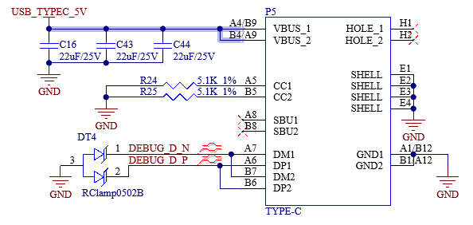

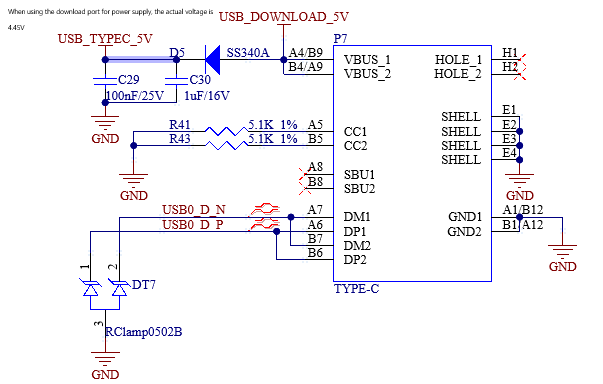

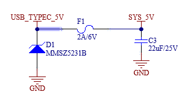

VCC_3V3_EN为高电平后，Q2导通。Q2导通后，Q1导通，使SYS_5V连通到VCC_5V网络，底板整板上电。

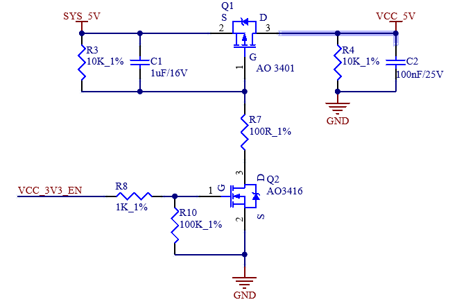

此部分电路是保证了核心板先上电，底板后上电，以防闩锁效应的发生损坏CPU。

底板的3.3V由DC-DC提供，网络名为VCC_3V3。底板的1.8V由3.3V通过LDO转换提供，网络名为VCC_1V8。

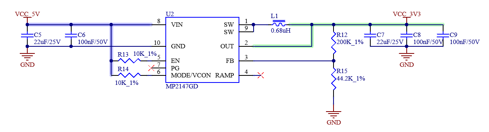

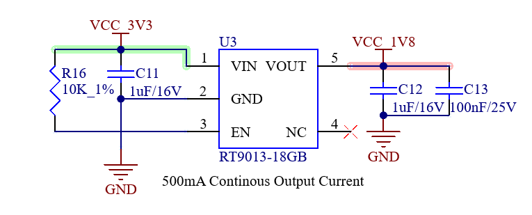

**注意：**

**1.推荐使用带独立供电的USB-HUB，以确保开发板有稳定供电；**

**2.特别注意：当使用大功率外设时不要使用电脑USB口供电，大电流有烧坏电脑主板的风险！**

### 3.5.2  按键
NPOR_L为系统的复位按键，对应实物在底板右侧下方位置，丝印为 “RST”，按下后开发板复位重启。

SARADC_IN0_BOOT为MASKROM按键，应实物在底板右侧下方位置，丝印为 “MROM”。在断电的时候按下此按键并上电，此时系统进入MASKROM烧写模式。

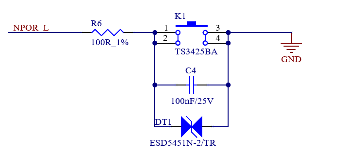

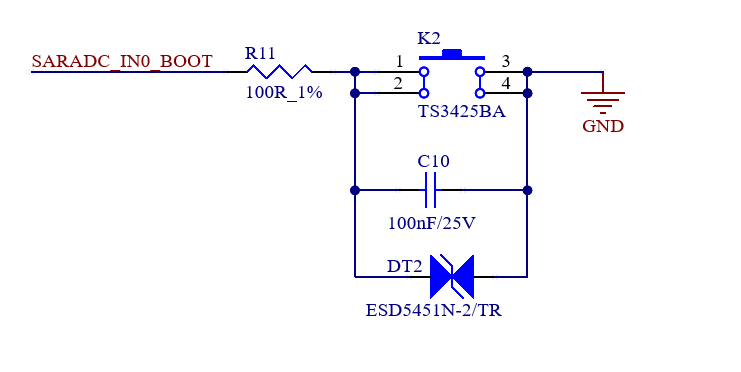

SARADC_IN1_RECOVER/KEY为系统用户按键和启动项选择按键。K3按键为RECOVERY/V+按键，在断电的时候按下此按键并上电，此时系统进入BOOTLOADER模式，启动系统后用户可以自定义成音量加键。对应实物在底板右侧下方位置，丝印为 “REC”。

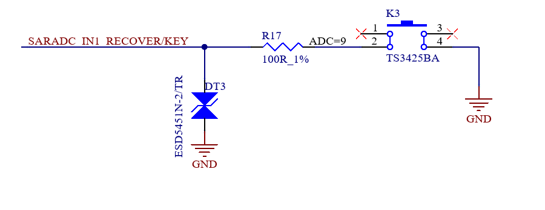

### 3.5.3 BOOT配置
SARADC_IN0_BOOT除了作为按键以外，也是系统启动项选择引脚。在板卡中通过R5电阻控制，可通过焊接/不焊接R5电阻进行控制。

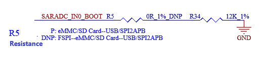

由于eMMC和TF卡使用的是同一组数据总线，只能同时使用其中一种。在使用eMMC版本的核心板时无法使用TF卡作为系统启动介质，也无法使用TF卡作为存储设备。

### 3.5.4  调试串口
底板上使用一个USB Type-C做调试串口，使用数据线连接电脑，选择对应串口即可开启调试，同时此接口从电脑获取供电给整板供电。

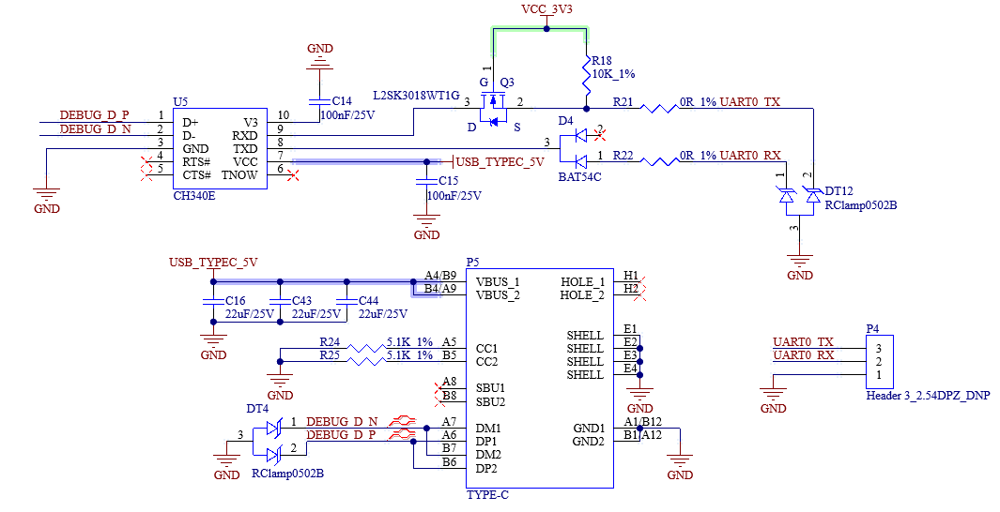

   **注意:**

**1.为方便后期调试，请用户在自行设计地板时将此调试串口引出。**

### 3.5.5  USB Download
在开发板右侧的USB Type-C接口可以实现固件烧写功能（位号P7），可以通过数据线连接电脑进行开发板镜像的烧写。也可以使用此TYPEC接口给整板进行供电，需注意由于经过D5二极管，此时整板电源会低于5V。

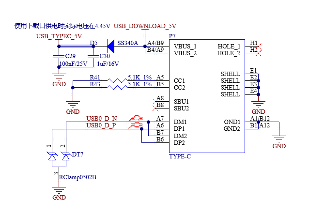

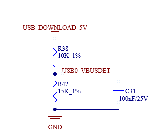

### 3.5.6  百兆以太网
底板上提供了一路百兆以太网接口，使用RMII接口形式与PHY芯片相连，使用YT8512H作为PHY芯片，由RJ45插座引出，插座型号为FC62115BNL，内置隔离变压器。

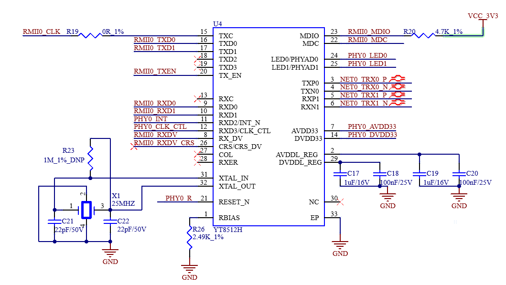

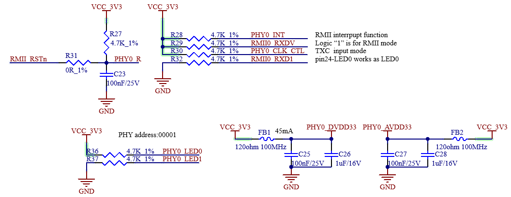

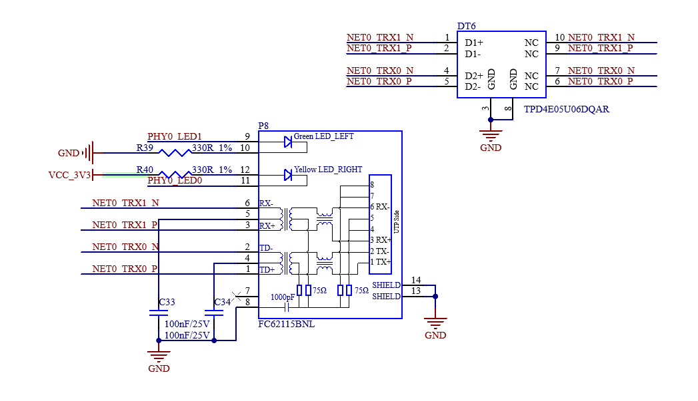

   **注意：PCB设计时要保证PHY芯片有一个完整的地。**

### 3.5.7  TF卡
开发板 TF Card 为 CPU 的 SDMMC通道，该通道也被核心板的eMMC使用，故无法在eMMC配置的开发板上使用TF Card。

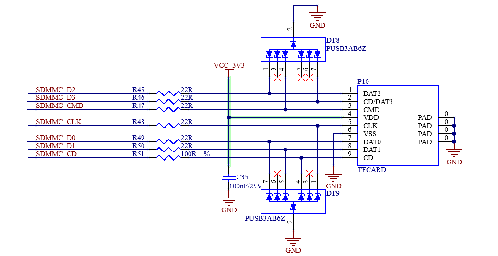

   **注意：**

**1.总线上拉电阻已经在核心板上做适配，底板不能对总线做上拉处理；**

**2. TF 卡属于可热插拔设备，请做 ESD 防护；**

**3. SD 信号需要做等长。**

### 3.5.8  MIPI-DSI
开发板上位号P13 FPC座可以连接MIPI-DSI显示屏，连接器是30P。支持2 lane MIPI-DSI连接，1.5Gbps/lane，支持I2C接口的触摸屏。

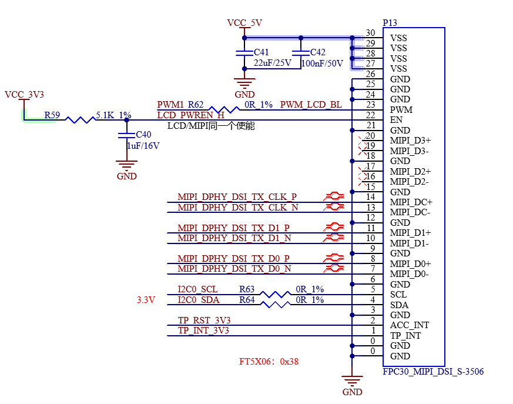

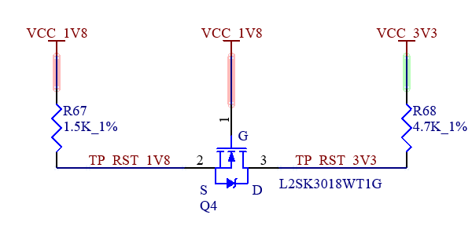

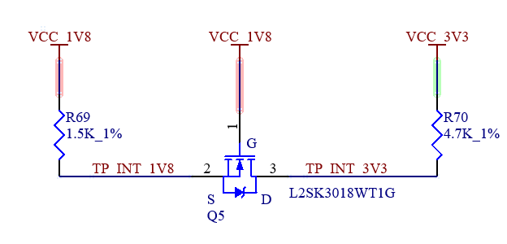

### 3.5.9  Raspberry Pi 40PIN
底板上预留了兼容树莓派40pin的定义，在P9排针引出。

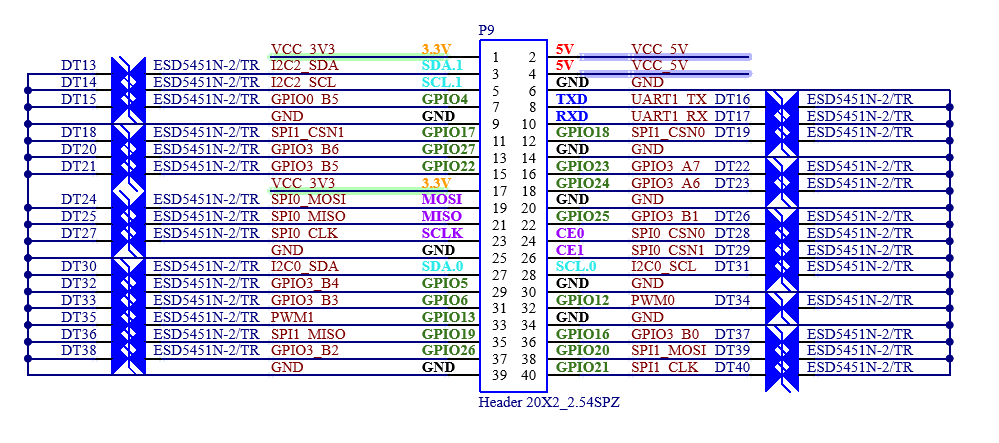

### 3.5.10 IO
开发板上位号P14 排针预留了IO接口，该接口可复用成LCD或DSMC功能，用户可自行选择功能使用。需注意音频功能也在这里面引出，占用数据线D2，D3，D9，D10，某些功能无法同时使用。

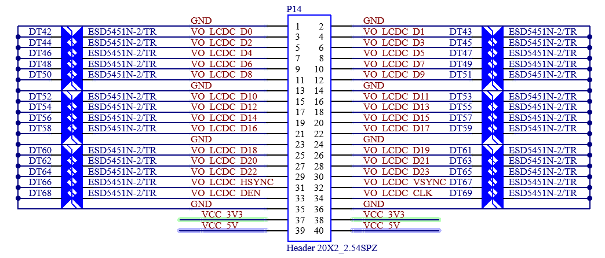

### 3.5.11  音频
开发板设计了标准的 3.5mm 耳机插孔（CTIA国际标准），位号P3，实现了双声道耳机播放和单声道MIC 录音的功能；

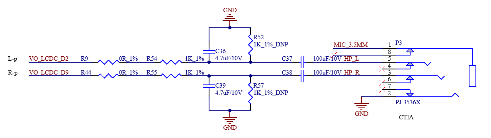

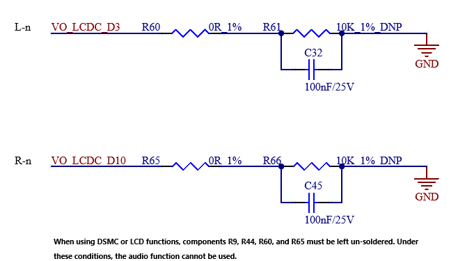

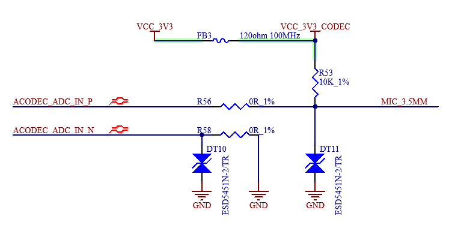

### 3.5.12  USB2.0
开发板板载了一路 USB2.0，使用USB2.0-A 接口，位号P6，可外接U盘等设备。

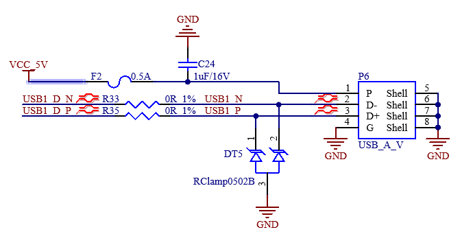

# 04_连接器尺寸图

邮票孔封装，尺寸参照封装库。

# 05_OK3506B-S12开发板Linux系统整机功耗表

| 编号 | 测试项目 | CPU温度 | 使用率 | 开发板供电电压（核心板+底板）（V） | 开发板工作电流（核心板+底板（mA） | 开发板功率     （核心板+底板）（W） |
| :---: | :---: | :---: | :---: | --- | --- | --- |
| 1 | 无负载启动峰值功耗 | / | / | 5±5% | 200.176 | 1.01 |
| 2 | 休眠功耗 | / | / | 5±5% | 92.111 | 0.46 |
| 3 | 无负载待机功耗 | 29.75℃ | CPU使用率：空闲     DDR使用率：15% | 5±5% | 95.149 | 0.48 |
| 4 | USB读写功耗 | 31.53℃ | CPU使用率：36%     DDR使用率：16% | 5±5% | 193.85 | 0.97 |
| 5 | TF卡读写功耗 | 30.85℃ | CPU使用率：37.4%     DDR使用率：16% | 5±5% | 139.873 | 0.70 |
| 6 | 网口打流功耗 | 33.32℃ | CPU使用率：/     DDR使用率：15% | 5±5% | 140.492 | 0.70 |
| 7 | 7寸MIPI屏功耗 | 33.32℃ | CPU使用率：19.4%     DDR使用率：15% | 5±5% | 562.775 | 2.81 |
| 8 | CPU压力+内存压力+EMMC读写压力测试功耗 | 35.69℃ | CPU使用率：100%     DDR使用率：93% | 5±5% | 177.337 | 0.89 |

+ **注：**
1. ■电流测试：测试时间保持10S左右，记录电流平均值。
2. ■U-BOOT：U-Boot 2017.09-g3fe339f #zmx (Jul 10 2025 - 10:06:23 +0800)
3. ■内核版本：Linux ok3506-buildroot 6.1.99 #1 SMP PREEMPT Thu Jul 10 10:21:30 CST 2025 armv7l GNU/Linux
4. 功耗仅供参考。

# 06_最小系统原理图

**最小系统包括核心板，电源，调试串口，系统镜像烧写接口。**

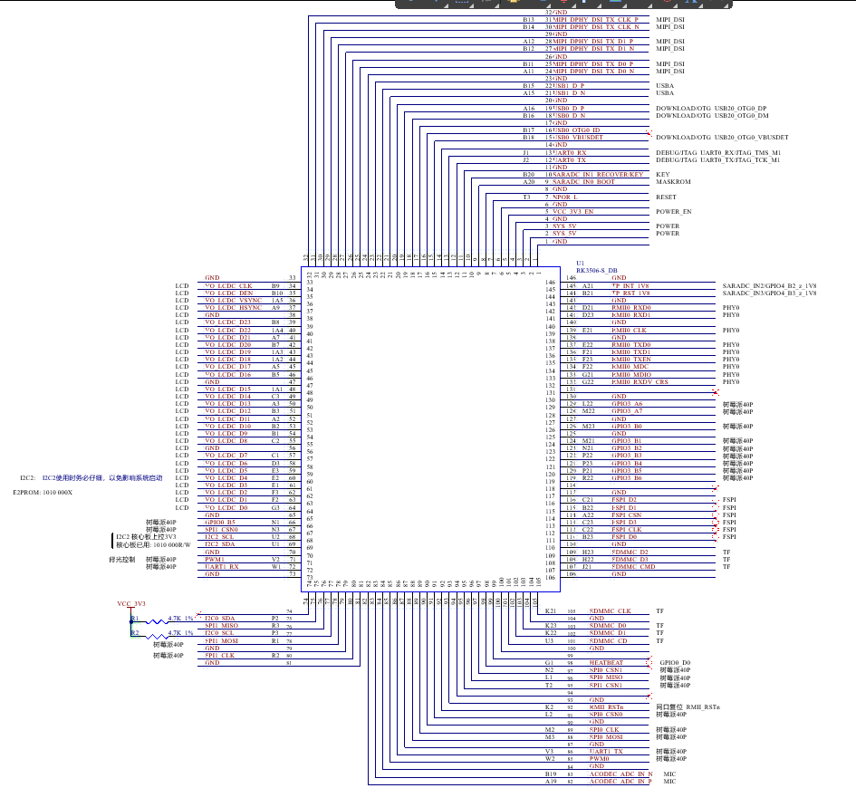

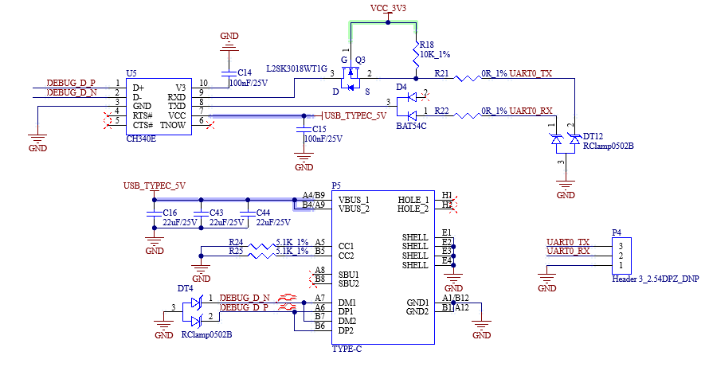

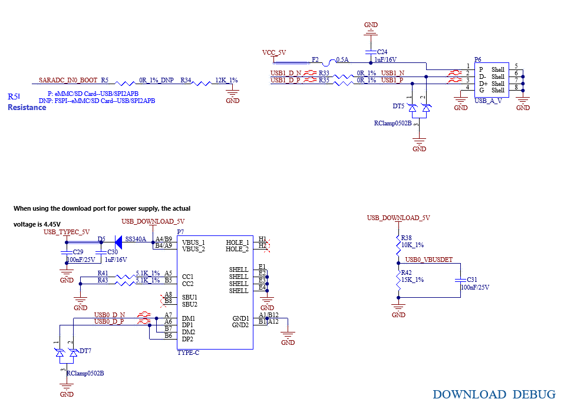

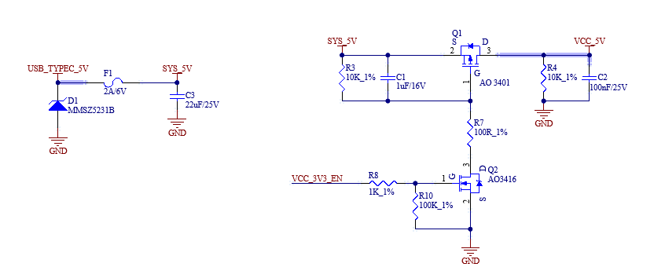

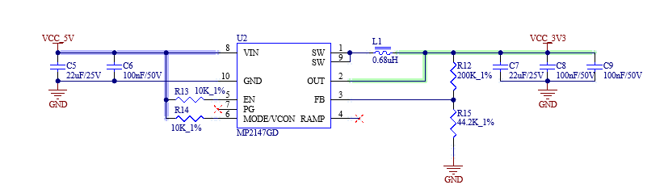

