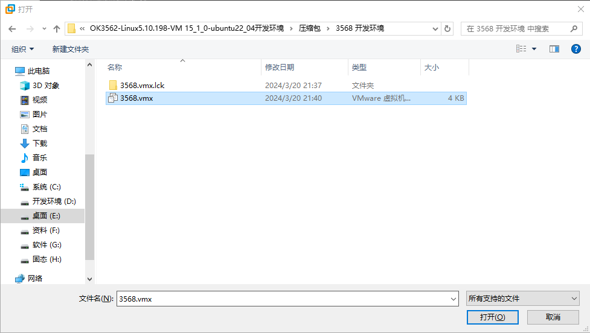
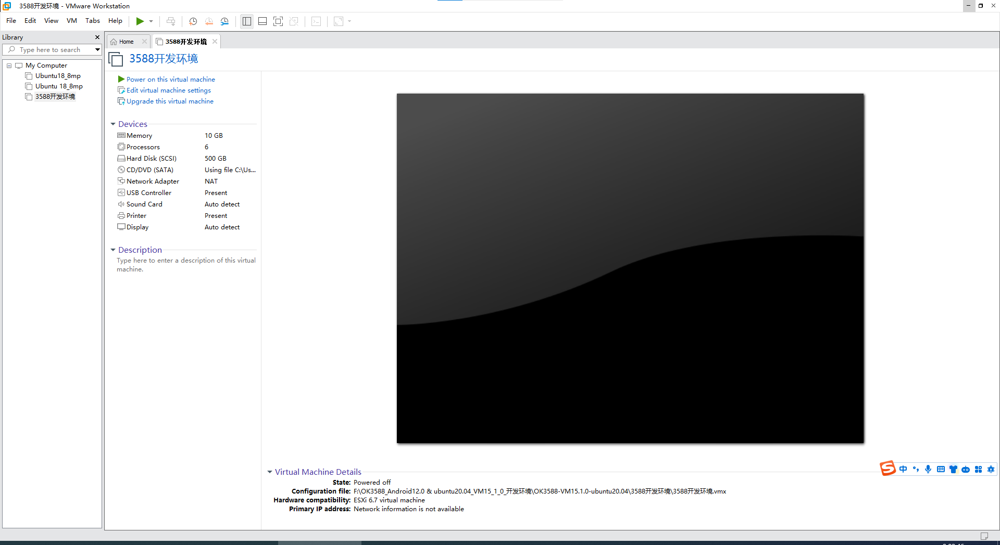
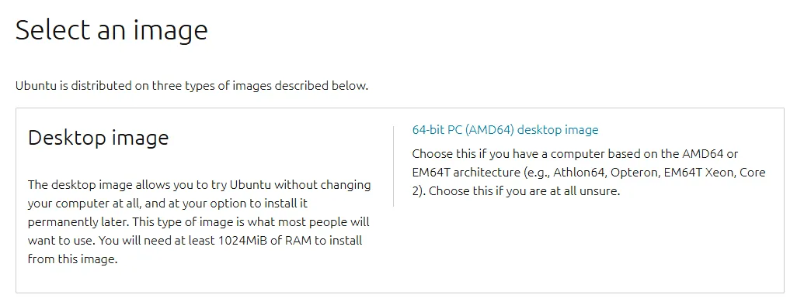
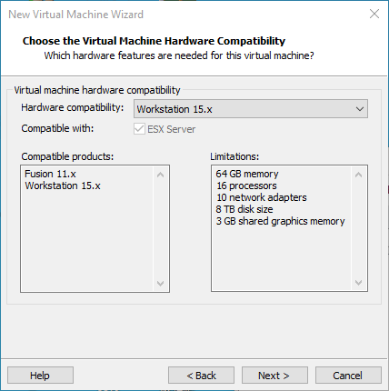
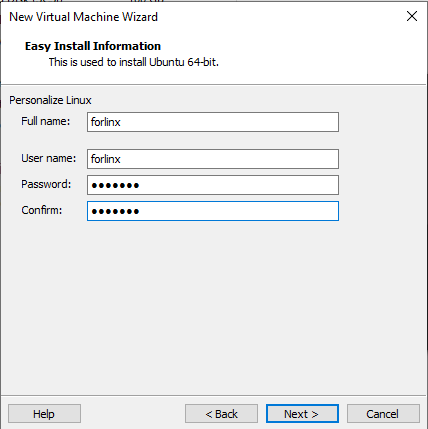
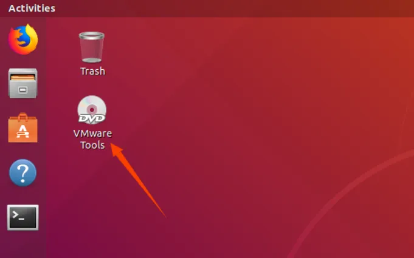
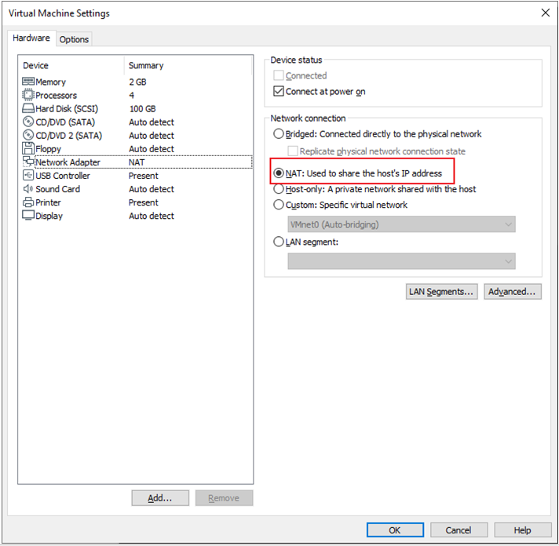
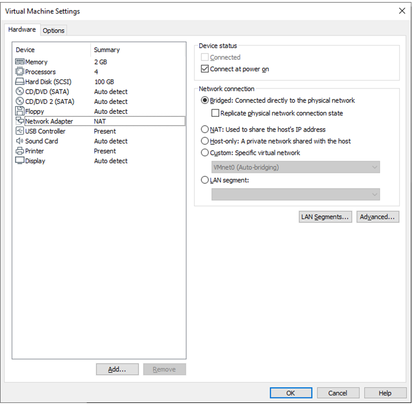
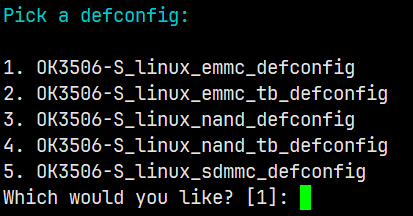

# OK3506J-C\_Linux6.1.99_User’s Compilation Manual\_V1.0

Document classification: □ Top secret □ Secret □ Internal information ■ Open

## Copyright

The copyright of this manual belongs to Baoding Folinx Embedded Technology Co., Ltd. Without the written permission of our company, no organizations or individuals have the right to copy, distribute, or reproduce any part of this manual in any form, and violators will be held legally responsible.

Forlinx adheres to copyrights of all graphics and texts used in all publications in original or license-free forms.

The drivers and utilities used for the components are subject to the copyrights of the respective manufacturers. The license conditions of the respective manufacturer are to be adhered to. Related license expenses for the operating system and applications should be calculated/declared separately by the related party or its representatives.

## Overview

This manual is designed to enable you to quickly understand the compilation process of the products and familiarize yourself with the compilation methods of Forlinx products. The application program needs to be cross-compiled on the Linux operating system before it can run on the development board. According to the method in the compilation manual, you can compile your own software code through practical operation.

The manual will provide instructions for setting up the environment but there may be some unforeseen issues during the environment setup process. For beginners, it is recommended to use the pre-configured development environment provided by us. This will allow you to quickly get started and reduce development time.

Linux systems are typically installed in three ways: dual system on a real machine, single system on a real machine, and virtual machine. Different installation methods have their advantages and disadvantages. This manual only provides methods to build ubuntu in a virtual machine.

Hardware requirements: It is recommended to have at least 6GB of memory or more, so that you can allocate some memory to run the virtual machine (the virtual machine is recommended to have more than 2GB) and still do other operations on Windows, otherwise it will affect the performance of Windows.

The manual is mainly divided into four chapters:

+ Chapter 1. is mainly about the installation of VMware, and the version used is VMware Workstation 15 Pro15.1.0. You need to install VMware before using the ubuntu development environment;
+ Chapter 2. mainly introduces the method of loading the ubuntu development environment provided by Forlinx, and the development environment is 64-bit ubuntu22.04;
+ Chapter 3. mainly introduces the method of building a new ubuntu development environment; this section uses 64-bit Ubuntu 22.04 as an example to describe the creation of Ubuntu. Due to different computer configurations, there may be unexpected problems in the building process. It recommended that beginners directly use the environment we have built;
+ Chapter 4. mainly introduces the methods of compiling the source code related to the development board.

A description of some of the symbols and formats associated with this manual:

| **Format**| **Meaning**|
|:----------:|----------|
| **Note** | Note or information that requires special attention, be sure to read carefully.|
| 📚 | Relevant notes on the test chapters.|
| ️🛤️️ | Indicates the related path.|
| <font style="color:blue;">Blue font on gray background</font>| <font style="color:#000000;">Refers to commands entered at the command line (Manual input required).</font>|
| <font style="color:black;">Black font</font>| Serial port output message after entering a command|
| **<font style="color:black;">Bold black</font>**| <font style="color:#000000;">Key information in the serial port output message</font>|
| <font style="color:#000000;">//</font>| <font style="color:#000000;">Interpretation of input instructions or output information</font>|
| Username@Hostname| root@ok3506-buildroot: Development board serial port login account information; forlinx@ok3506-buildroot: Development board network login account information; forlinx@ubuntu: Development environment Ubuntu account information. You can determine the environment for function operation through this information.|

<font style="color:#000000;">After packaging the file system, you can use the “ls” command to view the generated files.</font>

```markdown
forlinx@ubuntu:~/3506$ ls                                  //List the files in this directory
OK3506_Linux_Source  OK3506_Linux_Source.tar.bz2.00 OK3506_Linux_Source.tar.bz2.01
```

+ <font style="color:#000000;">forlinx@ubuntu: the username is forlinx and the hostname is ubuntu, indicating that the operation is performed in the development environment ubuntu.</font>
+ <font style="color:#000000;">// ：Explanation of operation commands is required, but command input is not needed.</font>
+ <font style="color:#0000ff;">ls: </font><font style="color:#000000;">blue font on a gray background, indicating relevant commands that need to be entered manually.</font>
+ **OK3506\_Linux\_Source：**<font style="color:#000000;">The bottom black font represents the output information after entering the command, with the bold font indicating the key information, and the packed file system is here.</font>

## <font style="color:#000000;">Revision History</font>

| Date| Manual Version| Revision History
|:----------:|:----------:|----------
| 26/02/2025| <font style="color:#000000;">V1.0</font>| OK3506 User’s Compilation Manual (Version 1.0); Note: This Compilation Manual is only applicable to the OK3506 development board. 

## 1\. VMware Virtual Machine Software Installation

This chapter mainly introduces the installation of VMware virtual machines, using VMware Workstation 15 Pro v15.5.6 as an example to demonstrate the installation and configuration process of the operating system.

### <font style="color:#000000;">1.1 VMware Software Downloads and Purchase</font>

Go to the VMware website https://www.vmware.com/cn.html to download Workstation Pro and get the product key. VMware is a paid software that requires purchasing, or you can choose to use a trial version.


After the download is complete, double-click the installation file to start the installation program.

### <font style="color:#000000;">1.2 VMware Software Installation</font>

Double-click the startup program to enter the installation wizard.


Click on "Next".


Check the terms in the license agreement that I accept, then click "Next".


Modify the installation location to the partition where you want to install the software on your computer, then click '"Next".


Check and click on "Next".


Check the box to add a shortcut, then click "Next".


Click "Installation".


Wait for the installation to complete.


Click "Finish" to try it out. If users need to use it for a long time, they need to buy it from the official and fill in the license.

## 2\. Loading the Existing Ubuntu Development Environment

**Note:**

+ **It is recommended for beginners to directly use the pre-built virtual machine environment provided by Forlinx, which already includes installed cross-compiler and Qt environment. After understanding this chapter, you can directly jump to the compilation chapter for further study;**
+ **The development environment provided for general users is: forlinx (username), forlinx (password). The superuser is: root (username), root (password);**
+ **Please ask your sales representative for the download link.**

There are two ways to use a virtual machine environment in VMware: One is to directly load an existing environment, and the other is to create a new environment. First talk about how to load an existing environment.

First, download the development environment provided by Forlinx. There is an MD5 verification file in the development environment data. After downloading the development environment data, first performs MD5 verification on the compressed package of the development environment (the tool for viewing the MD5 code on windows: 02-User Data \\ Software Data \\ 3-Tool \\ md5sums-1.2.zip). Check whether the verification code is consistent with the verification code in the verification file. If they are consistent, the downloaded file is normal; otherwise, the file may be damaged and needs to be downloaded again.


Select all compressed files, right-click and extract to the current folder or your own directory:


After unzipping, you will get the folder "3568 Development Environment".

**Note: The Ubuntu 22.04 development environment is the same for 3506, 3562, and 3568.**

The file 3568. vmx in the 3568 Development Environment folder is the file that the virtual machine needs to open.

Open the installed virtual machine.


Select the directory where the newly decompressed "3568. vmx" file is located, double-click to open the startup file.



Turn on this virtual machine after loading is complete to run it and enter the system's interface.



The default login account for automatic login in the development environment is "forlinx".

## 3\. New Ubuntu Development Environment Setup

**Note: Beginners are not recommended to set up a system on their own. It is recommended to use an existing virtual machine environment. If you do not need to set up the environment, you can skip this section.**

This chapter mainly explains the process of setting up the Ubuntu system and installing Qt Creator. If the user is not using Qt, the installation of Qt Creator can be ignored.

### **3.1 Ubuntu System Setup**

The version of Ubuntu we chose to install is 22.04, and the introduction and development in this maual are all carried out on Ubuntu22.04. Download "Ubuntu-22.04.6-desktop-amd64.iso" (you can download the version that you actually need; this is just an example with 22.04.6). Download address is: https://releases.ubuntu.com/22.04/.



#### **3.1.1 Ubuntu Virtual Machine Setup**

**Step 1:** Open the VMware software and click on "Create New Virtual Machine"; enter the following interface, check "Customize (Advanced)" and click "Next":


**Step 2:** Select the compatibility of the corresponding VMware version. The version can be viewed in Help-> About VMware Workstation. Click "Next" after confirmation:



Select “Install program from disc image file”, then click “Next”；


Enter full name, user name and password and click "Next":



Enter the virtual machine name and configuration installation location, and click "Next":


Configure the number of cores, click "Next":


Configure at least 8GB of memory, select "Next":


Set the network type, use the default NAT form for networking, and click "Next". Keep the default values for the remaining steps until you reach the step to specify the disk capacity.


Use the recommended I/O controller, click "Next":


Use the recommended disk type, click "Next":


Use the default options, create a new virtual disk and click "Next":


Allocate a disk size of 200G and divide the virtual disk into multiple files, and click "Next":


Click "Next" by default:


Click "Finish":


The virtual machine creation is now complete. Then click "Open this virtual machine" to start installing the image and wait patiently. The ubuntu system installation is complete.

#### **3.1.2 Ubuntu Basic Configuration**

##### **3.1.2.1 VMware Tools Installation**

VMware Tools will be installed automatically after the virtual machine is created. If it is not successful, follow the steps below. If you do not install the tool, you cannot use copy-paste file drag and drop between the Windows host and the virtual machine. First click on "Virtual Machines" on the VMware navigation bar, then click "Install VMware Tools" in the drop-down box.


Once done, enter Ubuntu and the VMware Tools CD will appear on your desktop and click into it.



Enter and see a compressed file VMwareTools-10.3.10-12406962.tar.gz (it may be different for different VM versions); copy the file under the home directory (i.e. the directory with the home personal username).


Press \[Ctrl+Alt+T] to bring up the Terminal Command Interface and enter the command:


After the extraction is complete, a file named “vmware-tools-distrib" will appear.


Go back to the terminal and type cd vmware-tools-distrib to enter the directory. Enter: sudo ./vmware-install.pl followed by pressing Enter. Then, enter your password and the installation process will begin. When prompted, you can input "yes" and press Enter to proceed. For any other inquiries, simply press Enter to go with the default installation settings.


Once the VMware tools is complete, we can implement file copy and paste between Windows and Ubuntu.

##### **3.1.2.2 Virtual Machine Full Screen Display**

If the virtual machine is not able to be displayed in full screen, you can resolve this issue by clicking on "View" and selecting "Autofit Guest." This will adjust the display to fit the screen automatically, enabling you to have a full-screen experience in the virtual machine.


<font style="color:rgb(38, 38, 38);">  
Make most of the system settings in the location shown. A lot of the setup requirements on Ubuntu can be done here.</font>


##### **3.1.2.3 Virtual Machine Hibernation Settings**

Also, the default hibernation is 5min, if you don't want to set hibernation, just set it to Never by setting Power->Blank screen.  


**3.1.3 VM Swapfile Settings**

The memory allocated when creating the virtual machine is 8GB. If the 8GB memory is not enough during compilation, the size of the swapfile needs to be modified.

#### **3.1.4 Network Settings for Virtual Machines**

##### **3.1.4.1 NAT Connection Method**

By default, after the virtual machine is installed, the network connection method is set to NAT, which shares the host machine's IP address. This configuration does not need to be changed when performing tasks like installing dependencies or compiling code. <font style="color:rgb(38, 38, 38);">When the VMware virtual NIC is set to NAT mode in a virtual machine, the network in the Ubuntu environment can be set to dynamic IP. In this mode the virtual NAT device and the host NIC are connected to communicate for Internet access. This is the most common way for VM to access the external network.  
</font>



##### **3.1.4.2 Connection for Bridges**

When the VMware virtual NIC device is in bridge mode, the host NIC and the virtual machine NIC communicate through the virtual bridge, and the network IP and the host need to be set in the same network segment in the Ubuntu environment. If accessing an external network, you need to set the DNS to be consistent with the host NIC. If TFTP, SFTP and other servers are used, the network contact mode of the virtual machine needs to be set as the bridge mode.  
</font>



### 4\. Related Code Compilation

### 4.1 Preparation Before Compilation

#### 4.1.1 Description of the Environment

+ Development environment OS: Ubuntu22.04 64-bit version
+ Cross-toolchain: arm-linux-gnu
+ The board uses the Bootloader version: u-boot-2017.09.
+ Development Board Kernel: Linux-6.1.99
+ Development board porting LVGL version: lvgl-9.2

#### 4.1.2 Source Code Copy

 Program source code: Software data \\ 2-image and source code \\ 1-source code \\ OK3506 \_ Linux \_ Source. Tar. bz2

Create a working directory

```plain
forlinx@ubuntu:~$ mkdir -p /home/forlinx/work							//Create the working directory in order
```

Copy the source file OK3506\_Linux\_Source.tar.bz2.\* from the user profile to the virtual machine /home/forlinx/work directory.

```plain
forlinx@ubuntu:~$ cd /home/forlinx/work														//Switch to the working directory
forlinx@ubuntu:~/work$ cat OK3506_Linux_Source.tar.bz2.* > OK3506_Linux_Source.tar.bz2
forlinx@ubuntu:~/work$ tar -xvf OK3506_Linux_Source.tar.bz2				//Decompress the compressed packet in the current location
```

Just run the command and wait for it to complete.

### 4.2 Compilation

**Note:**

+ **After the kernel source code is decompressed for the first time, the source code needs to be compiled as a whole;**
+ **After compiling as a whole, you can compile separately according to the actual situation;**
+ **Complete SDK compilation process.**

#### 4.2.1 Full Compilation Test

In the source code path, the compilation script build. Sh is provided. Run the script to compile the entire source code. You need to switch to the decompressed source code path at the terminal and find the build. Sh films

```plain
forlinx@ubuntu:~$ cd /home/forlinx/work/OK3506_Linux_Source
```

The following operations need to be operated under the source code directory, and the full compilation method is:

```plain
forlinx@ubuntu: ~/work/OK3506_Linux_Source$./build.sh chip
```

After execution there will be options to enter as shown below, enter 1 and press enter to continue.


If it's the nand version enter 3, for the emmc version enter 1 and press enter to continue.



**Note: The above configuration only needs to be configured once.**

Then execute the build.sh full-compile：

```plain
forlinx@ubuntu: ~/work/OK3506_Linux_Source$./build.sh
```

After successful compilation, the corresponding image file will be generated in the rockdev folder.


**Note: update.img is packed for OTG programming; other files are for step-by-step programming.**

#### 4.2.2 Individual Compilation Tests

Full compilation is required before individual compilation, which is done under the kernel source path.

```plain
# Configure the SDK
forlinx@ubuntu: ~/work/OK3506_Linux_Source$ ./build.sh bconfig

# Generate uboot.img, the generation path is u-boot/uboot.img
forlinx@ubuntu: ~/work/OK3506_Linux_Source$ ./build.sh uboot

# Generate boot.img, the generation path is kernel/boot.img
forlinx@ubuntu: ~/work/OK3506_Linux_Source$ ./build.sh kernel 

# Generate rootfs.img, the generation path is buildroot/output/rockchip_ok3506_emmc/image/rootfs.ext2
forlinx@ubuntu: ~/work/OK3506_Linux_Source$ ./build.sh rootfs

# Use uboot.img, boot.img, and rootfs.ext2 from the above paths to generate update.img, the path is rockdev/update.img 
forlinx@ubuntu: ~/work/OK3506_Linux_Source$ ./build.sh updateimg
```

After successful compilation, the kernel in update.img does not update. Please burn the corresponding files step by step, or regenerate the update. img.

If you need to configure the kernel via a graphical configuration interface, you can directly execute the following command:

```diff
forlinx@ubuntu: ~/work/OK3506_Linux_Source$ ./build.sh kconfig
```

After completing the configuration in the pop-up graphical interface, save the settings and exit. The new configuration will automatically generate a new OK3506-Slinuxdefconfig.

#### 4.2.3 Clearance of Files Generated by the Compilation

**Note: Uboot is not open source, only image.**

```plain
forlinx@ubuntu: ~/work/OK3506_Linux_Source$ ./build.sh clean:kernel    		#Clear kernel
forlinx@ubuntu: ~/work/OK3506_Linux_Source$ ./build.sh clean:rootfs   		#Clear rootfs
forlinx@ubuntu: ~/work/OK3506_Linux_Source$ ./build.sh clean:recovery  		#Clear recovery
```

### 4.3 Image File Use

**Note: update.img is packed for OTG flashing; other files are for step-by-step flashing. The \*.img file generated by separate compilation will not be updated in the update. img file, and it needs to be burned by single-step flashing (see User's Manual OTG Flashing for details).**

### 4.4 Application Compilation and Operation

The test program in the SDK is compiled by buildroot by default, and can also be compiled directly. The following describes the method of direct compilation.

#### 4.4.1 Cross-compilation Toolchain Compilation

Packaged cross compilation toolchain path: 01 Software documentation \\ 3- Tools\\arm-buildroot-linux-gnueabihf\_sdk- buildroot.tar.gz

1\. Unzip the toolchain to any path, such as/home/worldinx/work/toolchain

```plain
forlinx@ubuntu:~$ mkdir -p /home/forlinx/work/toolchain
forlinx@ubuntu:~$ tar xf arm-buildroot-linux-gnueabihf_sdk-buildroot.tar.gz -C /home/forlinx/work/toolchain
forlinx@ubuntu:~$ cd /home/forlinx/work/toolchain
```

2\. Execute relocate-sdk.sh

```plain
forlinx@ubuntu:~/work/toolchain$ ./relocate-sdk.sh
```

3\. Execute environment setup to set environment variables

```plain
forlinx@ubuntu:~/work/toolchain$ source ./environment-setup
```

At this point, the current terminal has automatically configured the environment variables related to the cross-compilation toolchain. You can view the environment variables of the current terminal by executing the env command.

**Note: Terminals that have already been configured with environment variables cannot compile the full source code anymore as it will generate an error message. You need to open a new terminal to compile the full source code!**

#### 4.4.2 Command Line Application Compilation and Operation

This section uses a watchdog testing program.

1. Use the cd command to enter the /home/forlinx/work directory;


```plain
forlinx@ubuntu:~$ cd /home/forlinx/work/OK3506_Linux_Source/app/forlinx/forlinx_cmd_demo/fltest_watchdog
```

2. Use make to cross-compile;

```plain
forlinx@ubuntu: ~/work/OK3506_Linux_Source/app/forlinx/forlinx_cmd_demo/fltest_watchdog$ make
arm-buildroot-linux-gnueabihf-gcc fltest_watchdog.c -o fltest_watchdog
fltest_watchdog make finish!!!
```

Use the file command to view the generated file information

```plain
forlinx@ubuntu:~/work/OK3506_Linux_Source/app/forlinx/forlinx_cmd_demo/fltest_watchdog$ file fltest_watchdog
fltest_watchdog: ELF 32-bit LSB pie executable, ARM, EABI5 version 1 (SYSV), dynamically linked, interpreter /lib/ld-linux-armhf.so.3, for GNU/Linux 3.2.0, not stripped
```

From the result, you can see that the compiled 32-bit ARM file.

3. Copy the compiled fltest\_catchdog to the board through a USB drive or other means, such as in the/fonlinx path. Taking the USB drive as an example, copy it to the development board and run the test;

```plain
[root@ok3506-buildroot:/]# cp /run/media/sda1/fltest_watchdog /
[root@ok3506-buildroot:/]# /fltest_watchdog
Usage: fltest_watchdog [-t <timeout>] [-c] [-d/-e]
  -t --timeout   set timeout (default 10), range ( 1 - 16)
  -c --continue  enable watchdog with feed dogs
  -d --disable   disable watchdog, conflict with enable
  -e --enable    enable watchdog, conflict with disable
```

4\. Refer to the chapter "Watchdog Test" in the user's manual for the test;

#### 4.4.3 LVGL Application Operation

This section uses Forlinx demo\_1vgl as an example to demonstrate the compilation process of the lvgl application.

Demo \_ lvgl source code path: app/forlinx/forlinx \_ lvgl \_ demo/

```plain
forlinx@ubuntu:~/work$ ./arm-buildroot-linux-gnueabihf_sdk-buildroot/relocate-sdk.sh
forlinx@ubuntu:~/work$ source arm-buildroot-linux-gnueabihf_sdk-buildroot/environment-setup
 _           _ _     _                 _
| |__  _   _(_) | __| |_ __ ___   ___ | |_
| '_ \| | | | | |/ _` | '__/ _ \ / _ \| __|
| |_) | |_| | | | (_| | | | (_) | (_) | |_
|_.__/ \__,_|_|_|\__,_|_|  \___/ \___/ \__|

       Making embedded Linux easy!

Some tips:
* PATH now contains the SDK utilities
* Standard autotools variables (CC, LD, CFLAGS) are exported
* Kernel compilation variables (ARCH, CROSS_COMPILE, KERNELDIR) are exported
* To configure do "./configure $CONFIGURE_FLAGS" or use
  the "configure" alias
* To build CMake-based projects, use the "cmake" alias
```

Compile applications using cmake

```plain
forlinx@ubuntu:~/work$ cd OK3506_Linux_Source/app/forlinx/forlinx_lvgl_demo/
forlinx@ubuntu:~/work/OK3506_Linux_Source/app/forlinx/forlinx_lvgl_demo$ cmake
CMake Warning:
  No source or binary directory provided.  Both will be assumed to be the
  same as the current working directory, but note that this warning will
  become a fatal error in future CMake releases.


-- The C compiler identification is GNU 12.4.0
-- The CXX compiler identification is GNU 12.4.0
-- Detecting C compiler ABI info
-- Detecting C compiler ABI info - done
-- Check for working C compiler: /home/forlinx/work/toolchain/arm-buildroot-linux-gnueabihf_sdk-buildroot/bin/arm-buildroot-linux-gnueabihf-gcc - skipped
-- Detecting C compile features
-- Detecting C compile features - done
-- Detecting CXX compiler ABI info
-- Detecting CXX compiler ABI info - done
-- Check for working CXX compiler: /home/forlinx/work/toolchain/arm-buildroot-linux-gnueabihf_sdk-buildroot/bin/arm-buildroot-linux-gnueabihf-g++ - skipped
-- Detecting CXX compile features
-- Detecting CXX compile features - done
-- Configuring done (0.3s)
-- Generating done (0.0s)
-- Build files have been written to: /home/forlinx/work/OK3506_Linux_Source/app/forlinx_lvgl_demo
forlinx@ubuntu:~/work/OK3506_Linux_Source/app/forlinx/forlinx_lvgl_demo$ make
[ 14%] Building C object CMakeFiles/demo_lvgl.dir/flow.c.o
[ 28%] Building C object CMakeFiles/demo_lvgl.dir/img_hand.c.o
[ 42%] Building C object CMakeFiles/demo_lvgl.dir/file_dialog.c.o
[ 57%] Building C object CMakeFiles/demo_lvgl.dir/custom.c.o
[ 71%] Building C object CMakeFiles/demo_lvgl.dir/window.c.o
[ 85%] Building CXX object CMakeFiles/demo_lvgl.dir/main.cpp.o
[100%] Linking CXX executable demo_lvgl
[100%] Built target demo_lvgl
forlinx@ubuntu:~/work/OK3506_Linux_Source/app/forlinx/forlinx_lvgl_demo$ file demo_lvgl 
demo_lvgl: ELF 32-bit LSB pie executable, ARM, EABI5 version 1 (SYSV), dynamically linked, interpreter /lib/ld-linux-armhf.so.3, for GNU/Linux 3.2.0, not stripped
```

From the result, you can see that the compiled 32-bit ARM file.

Copy the compiled demo\_1vgl and resource files to the board via USB or other means. Take a USB drive as an example, and copy it to the development board and run the test.

```plain
root@ok3506-buildroot:/# cp /run/media/sda1/forlinx_lvgl_demo/demo_lvgl /userdata/
root@ok3506-buildroot:/# cp /run/media/sda1/forlinx_lvgl_demo/resource/* /userdata/
root@ok3506-buildroot:/# cd /userdata
root@ok3506-buildroot:/userdata# ./demo_lvgl
```

#### 4.4.4 QT Application Compilation and Operation

This section uses the forlinx \_ qt \_ terminal of Forlinx as an example to demonstrate the compilation process of lvgl application.

<font style="color:rgb(51, 51, 51);">Demo\_lvgl program source code path: app/forlinx/forlinx\_qt\_demo/fltest\_qt\_terminal/</font>

Use qmake and make to compile the application with the cross-compilation tool chain configured.

```plain
forlinx@ubuntu:~/work$ cd OK3506_Linux_Source/app/forlinx/forlinx_qt_demo/fltest_qt_terminal
forlinx@ubuntu:~/work/OK3506_Linux_Source/app/forlinx/forlinx_qt_demo/fltest_qt_terminal$ qmake
forlinx@ubuntu:~/work/OK3506_Linux_Source/app/forlinx/forlinx_qt_demo/fltest_qt_terminal$ make
forlinx@ubuntu:~/work/OK3506_Linux_Source/app/forlinx/forlinx_qt_demo/fltest_qt_terminal$ file fltest_qt_terminal
fltest_qt_terminal: ELF 32-bit LSB pie executable, ARM, EABI5 version 1 (SYSV), dynamically linked, interpreter /lib/ld-linux-armhf.so.3, for GNU/Linux 3.2.0, not stripped
```

From the result, you can see the compiled 32-bit ARM file.

Copy the fltest \_ qt \_ terminal generated by compiling to the board through U disk and run the test.