# OK3506J-C\_Linux6.1.99_User’s Manual\_V1.2

Document classification: □ Top secret □ Secret □ Internal information ■ Open

## Copyright

The copyright of this manual belongs to Baoding Folinx Embedded Technology Co., Ltd. Without the written permission of our company, no organizations or individuals have the right to copy, distribute, or reproduce any part of this manual in any form, and violators will be held legally responsible.

Forlinx adheres to copyrights of all graphics and texts used in all publications in original or license-free forms.

The drivers and utilities used for the components are subject to the copyrights of the respective manufacturers. The license conditions of the respective manufacturer are to be adhered to. Related license expenses for the operating system and applications should be calculated/declared separately by the related party or its representatives.

## <font style="color:#000000;">Overview</font>

This manual is designed to help you quickly familiarize yourself with the product, and understand the interface functions and testing methods. It primarily covers the testing of interface functions on the development board, the methods for flashing images, and troubleshooting procedures for common issues encountered in use. During the testing process, some commands are annotated for easy understanding, focusing on practicality and sufficiency. For kernel compilation, related application compilation methods, and development environment setup, please refer to the “OK3506J - S/OK3506J-C User Compilation Manual” provided by Forlinx.

There are total five chapters:

● Chapter 1. is mainly an overall overview of the product, briefly introducing the development board’s interface resources, the relevant driver paths in the kernel source code, and explanations of the key parts in the materials;

● Chapter 2. focuses on the fast startup of the product, which can be achieved through two methods: serial port login and network login;

● Chapter 3. is mainly about the QT function test of the product;

● Chapter 4. mainly introduces the command function tests;

● Chapter 5. is about the image update of the product, mainly describing the method of updating the image to the storage device. You can choose the corresponding flashing method according to the actual situation.

A description of some of the symbols and formats associated with this manual:

| **Format**| **Meaning**|
|:----------:|----------|
| **Note** | Note or information that requires special attention, be sure to read carefully.|
| 📚 | Relevant notes on the test chapters.|
| 🛤️️ | Indicates the related path.|
| <font style="color:blue;">Blue font on gray background</font>| <font style="color:#000000;">Refers to commands entered at the command line (Manual input required).</font>|
| <font style="color:black;">Black font</font>| Serial port output message after entering a command|
| **<font style="color:black;">Bold black</font>**| <font style="color:#000000;">Key information in the serial port output message</font>|
| <font style="color:#000000;">//</font>| <font style="color:#000000;">Interpretation of input instructions or output information</font>|
| Username@Hostname| root@ok3506-buildroot: Development board serial port login account information;                                                       forlinx@ok3506-buildroot: Development board network login account information;                                                     forlinx@ubuntu: Development environment Ubuntu account information. You can determine the environment for function operation through this information. |

<font style="color:#000000;">After packaging the file system, you can use the “ls” command to view the generated files.</font>

```markdown
forlinx@ubuntu:~/3506$ ls                                  //List the files in this directory
OK3506_Linux_Source  OK3506_Linux_Source.tar.bz2.00 OK3506_Linux_Source.tar.bz2.01
```

+ <font style="color:#000000;">forlinx@ubuntu: the username is forlinx and the hostname is ubuntu, indicating that the operation is performed in the development environment ubuntu.</font>
+ <font style="color:#000000;">// ：Explanation of operation commands is required, but command input is not needed.</font>
+ <font style="color:#0000ff;">ls</font> <font style="color:#000000;">blue font on a gray background, indicating relevant commands that need to be entered manually.</font>
+ **OK3506\_Linux\_Source：**<font style="color:#000000;">The bottom black font represents the output information after entering the command, with the bold font indicating the key information, and the packed file system is here.</font>

## Revision History

| **Date**| **Manual Version**| **Revision History**|
|----------|----------|----------|
| <font style="color:rgb(38, 38, 38);">26/02/2025</font><font style="color:rgb(38, 38, 38);">   </font>| <font style="color:rgb(38, 38, 38);">V1.0</font><font style="color:rgb(38, 38, 38);">   </font>| <font style="color:rgb(38, 38, 38);">OK3506-C/OK3506-S\_Linux6.1.99 User's Manual Initial Version.   </font> |
| 08/05/2025| V1.1| Adding qt function test in chapter 3.|
| 31/07/2025| V1.2| Adding OK3506-C description.|

## 1\. Development Board Description

### **<font style="color:rgb(51, 51, 51);">1.1 OK3506J-S/OK3506J-C Development Board Description</font>**

<font style="color:rgb(51, 51, 51);">The RK3506J is a high - performance triple - core Cortex - A7 application processor, specifically designed for intelligent voice interaction, audio input/output processing, image output processing, and other digital multimedia applications. It is equipped with a 2D hardware engine and a display output engine, which are used to minimize CPU overhead to meet image display requirements. It has a rich set of peripheral interfaces, such as SAI, PDM, SPDIF, Audio DSM, Audio ADC, USB2 OTG, RMII, CAN, etc., which can meet different application development needs, reducing the complexity and cost of hardware development. It also features a high - performance external memory interface (DDR2/DDR3/DDR3L), capable of maintaining the demanding memory bandwidth.</font>

Connection method for is OK3506-S edging connection, and for OK3506-C is board-to-board. 

The main interfaces are shown in the figure below:

**<font style="color:rgb(51, 51, 51);">OK3506J-S Front</font>**

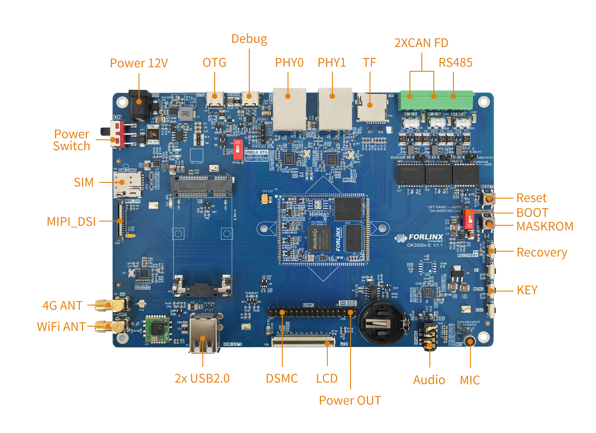

**<font style="color:rgb(51, 51, 51);">OK3506J-C Front</font>**

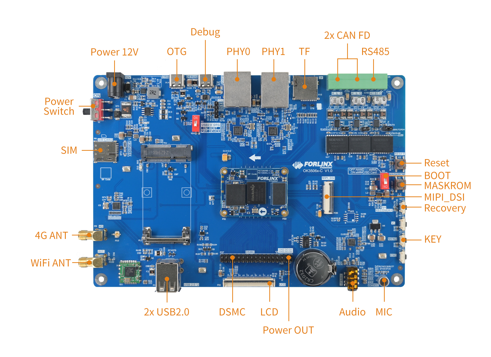

**Note: The hardware parameters will not be described in this software manual. Before referring to this manual for software development, please read the “OK3506 - S/OK3506 - C Hardware Manual” to understand the product naming rules and the hardware configuration information of the product you are using. This will be helpful for your use of the product.**

### **<font style="color:rgb(51, 51, 51);">1.2 Introduction to Linux 6.1.99 System Software Resources</font>**

| **Device**| **Location of driver source code in the kernel**| **Device Name**
|:----------|:----------|:----------
| <font style="color:rgb(51, 51, 51);">LCD Backlight Driver/PWM</font>| <font style="color:rgb(51, 51, 51);">drivers/video/backlight/pwm\_bl.c</font>| <font style="color:rgb(51, 51, 51);">/sys/class/backlight</font>
| <font style="color:rgb(51, 51, 51);">USB interface U disk</font>| <font style="color:rgb(51, 51, 51);">drivers/usb/storage/</font>| 
| <font style="color:rgb(51, 51, 51);">USB mouse</font>| <font style="color:rgb(51, 51, 51);">drivers/hid/usbhid/</font>| <font style="color:rgb(51, 51, 51);">/dev/input/mice</font>
| Ethernet| drivers/net/ethernet/stmicro/stmmac| 
| EMMC/SD/micro TF card driver| drivers/mmc/host/dw\_mmc-rockchip.c| /dev/block/mmcblk0pX
| LCD Controller| drivers/gpu/drm/rockchip/rockchip\_drm\_vop.c| 
| MIPI DSI| drivers/phy/rockchip/phy-rockchip-inno-dsidphy.c| 
| LCD Touch Driver| drivers/input/touchscreen/goodix.c drivers/input/touchscreen/edt-ft5x06.c| /dev/input/eventX
| RTC Real Time Clock Driver| drivers/rtc/rtc-rx8010.c drivers/rtc/rtc-pcf8563.c| /dev/rtc0
| serial port| drivers/tty/serial/8250/8250\_dw.c| /dev/ttySX
| Key Driver| drivers/input/keyboard/adc-keys.c| /dev/input/eventX
| LED| drivers/leds/leds-gpio.c| 
| SAI| sound/soc/rockchip/rockchip\_sai.c| 
| Watchdog| drivers/watchdog/dw\_wdt.c| /dev/watchdog
| SPI| drivers/spi/spi-rockchip.c| /dev/spidev2.0

### 1.3 EMMC Memory Partition Table

The following table shows the eMMC memory partition information for the Linux operating system (calculated with a block size of 512 bit):

| **Partition Index**| **Name**| **Offset / block**| **Size/block**| **content**
|:----------|:----------|:----------|:----------|:----------
| N/A| security| 0x00000000| 0x00004000| MiniLoaderAll.bin
| 1| uboot| 0x00004000| 0x00002000| uboot.img
| 2| misc| 0x00006000| 0x00002000| misc.img
| 3| boot| 0x00008000| 0x00020000| boot.img
| 4| recovery| 0x00028000| 0x00040000| recovery.img
| 5| rootfs| 0x00068000| 0x00c00000| rootfs.img
| 6| oem| 0x00C68000| 0x00040000| oem.img
| 7| userdata| 0x00CA8000| | userdata.img

### 1.4 NAND Memory Partition Table

The following table shows the NAND memory partition information for the Linux operating system (calculated with a block size of 512 bit)

| **Partition Index**| **Name**| **Offset / block**| **Size/block**| **content**
|:----------|:----------|:----------|:----------|:----------
| N/A| security| 0x00000000| 0x00002000| MiniLoaderAll.bin
| 1| uboot| 0x00002000| 0x00002000| uboot.img
| 2| misc| 0x00004000| 0x00000800| misc.img
| 3| boot| 0x00004800| 0x00005000| recovery.img
| 4| recovery| 0x00009800| 0x00008000| boot.img
| 5| rootfs| 0x00011800| 0x00040000| rootfs.img
| 6| oem| 0x00051800| 0x00008000| oem.img
| 7| userdata| 0x00059800| | userdata.img

## 2\. Fast Startup

### <font style="color:rgb(51, 51, 51);">2.1 Preparation Before Startup</font>

OK3506J-S/OK3506J-C development board has two system login methods, serial and network login. 

Hardware preparation before system startup:

+ <font style="color:rgb(51, 51, 51);">12V3A DC power</font>
+ Debugging serial cable (serial login use)

The debug serial port on the development board is a Type-C USB jack, so you can use a USB to Type-C cable to connect the development board to a PC and then check the board's status.

+ <font style="color:rgb(51, 51, 51);">Network cable (for network login)</font>
+ Screen: Connect the screen according to the development board interface (optional if display is not needed).


**Note: OK3506J-S/OK3506J-C The positions of the above interfaces are consistent.**

### <font style="color:rgb(51, 51, 51);">2.2 Related Driver Installation</font>

+ Use "User data \\ Software data \\ 3-tools \\ DriverAssitant \_ v5.13.zip to install the rockchip driver";
+ Run DriverInstall.exe directly after the unzipping is completed; in order to ensure the driver is the latest version, please unstall the driver first, then install again.</font;
+ <font style="color:rgb(51, 51, 51);">Use “User Data\\Software Data\\3-Tools\\CH343SER.EXE to install the serial port driver</font>”.

### <font style="color:rgb(51, 51, 51);">2.3 Serial Login</font>

OK3506J-S/OK3506J-C platform uses a Type-C interface for debugging serial port, with an on-board USB to UART chip. You do not need to purchase USB to serial debugging tools; it is extremely simple and convenient to use.

#### <font style="color:rgb(51, 51, 51);">2.3.1 Serial Port Connection Settings</font>

**Description:**

+ **<font style="color:rgb(51, 51, 51);">Serial port settings: Baud rate 115200, data bit 8, stop bit 1, no parity bit, no flow control;</font>**
+ **<font style="color:rgb(51, 51, 51);">Serial port terminal login without account;</font>**
+ **<font style="color:rgb(51, 51, 51);">Software Requirement: The Windows system on the PC end needs to install serial port terminal software. There are multiple options available, and you can choose the software you are familiar with for installation.</font>**

<font style="color:rgb(51, 51, 51);">Take putty as an example to introduce the login method of serial port:</font>

**Step 1:** Connect the serial port number of the computer---check the serial port number from the device manager (Based on the port actually recognized by the computer );

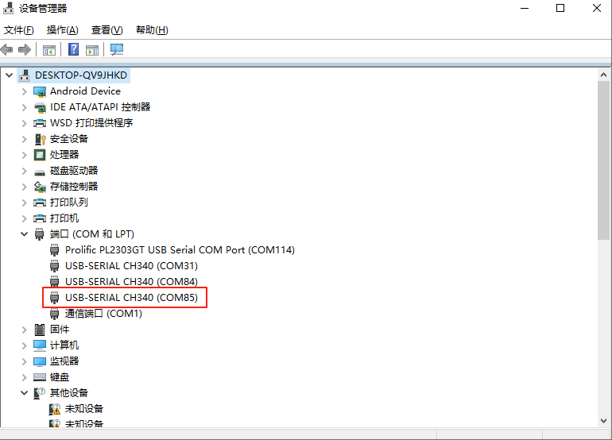

**Step 2:** Open and set up putty, then set the“ serial line according to the COM port of the computer used, baud rate 115200;

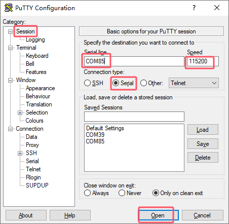

**Step 3:** After the setting, input the COM port used by the computer in Saved Sessions. The following figure takes COM85 as an example, save the settings, open the serial port again later, and click on the saved port number;

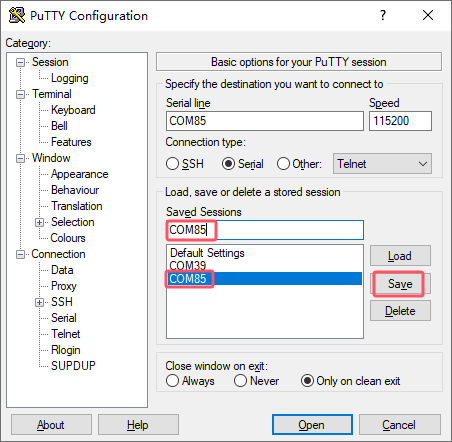

**Step 4:** Turn on the power switch of the development board, then there will be a print message output from the serial port (no need to login).

```plain
root@ok3506-buildroot:/#
```

#### <font style="color:rgb(51, 51, 51);">2.3.2 Serial Port Login FAQ</font>

USB to Serial Port Requires Driver Installation (02-User Information\\01-Software Information\\3-Tools\\CH343SER.EXE)

It is better to use a good quality cable to avoid error codes.

### 2.4 Network Login Methods

#### <font style="color:rgb(51, 51, 51);">2.4.1 Network Connection Test</font>

**Description:**

+ **The factory default configuration of the card is static IP; the IP address is 192.168.0.232. Please refer to "3.2.17 Ethernet Configuration" chapter for the static IP changing method;**
+ **The computer and the board need to be on the same network segment for testing.**

Before logging into the network, ensure that the direct network connection between the computer and the development board is functioning properly. You can test the connection status via pin command. The specific method is as follows:

1\. Connect the development board's eth0 interface to the computer using an Ethernet cable. Power on the development board and boot the kernel. Confirm the blue heartbeat LED is blinking. Check the network card connection, ensuring its LED flashes rapidly. Once confirmed, proceed with testing the network connection;

2\. Close the computer firewall (General computer operations, not described here in detail), then open the computer's run command;

3\. Use cmd to open the administrator interface , and the ping command to test the network connection status of the computer and the development board.


A data return indicates a normal network connection.

#### 2.4.2 SSH Server

**Description:**

+ **The default SSH login account is root, with no password;**
+ **The factory default configuration of the card is static IP; the IP address is 192.168.0.232. Please refer to "3.2.17 Ethernet Configuration" chapter for the static IP changing method.**

1\. Use ssh to log in the development board;

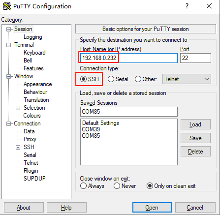

Click "Open", the following dialog box will appear, click "Yes" to enter the login screen.


```plain
Login as：root
forlinx@ok3506-buildroot:~#
```

#### <font style="color:rgb(51, 51, 51);">2.4.3 SFTP</font>

<font style="color:rgb(51, 51, 51);">️</font><font style="color:rgb(51, 51, 51);">Software Materials \\ 3-Tools \\ FileZilla\*</font>

OK3506J-S/ OK3506J-C development board supports SFTP service and it is automatically enabled at startup, so it can be used as an SFTP server after setting the IP address.

Here's how to use the filezilla tool for file transfer.

Install the FileZilla tool on Windows and follow the steps shown in the image below to configure it. Use "forlinx" as both the username and password.

Open the filezilla tool, click on File and select Site Manager.

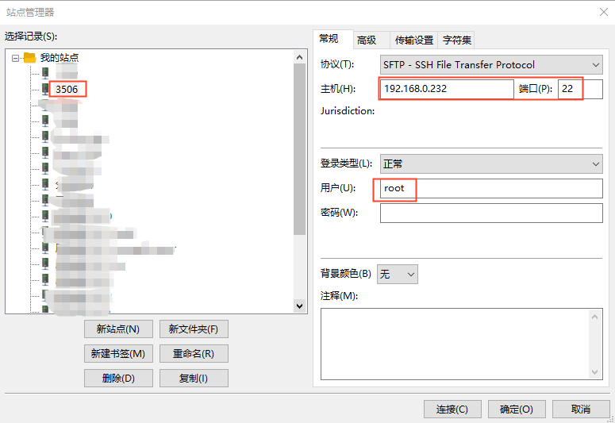

After successful login, you can upload and download.


### 2.5 Screen Switching

OK3506J-S/OK3506J-C supports MIPI DSI and RGB screen interfaces, and can only support display on one screen. Currently there are two methods for controlling screen switching: Specify through the device tree in the kernel and dynamically control through the Uboot menu.

#### 2.5.1 Dynamic Control of Uboot Menu

The solution is based on the existing screen support system and does not require recompilation of code or flashing to achieve the screen switching function.

During the uboot self-boot process, press the space bar at the serial terminal to bring up the control options:

```plain
Hit key to stop autoboot('Spacebar'):  0 
---------------------------------------------
0:Exit to console
1:Reboot
2:Display type:mipi 
---------------------------------------------
```

Enter 2 in the terminal to switch screens. Refer to 3.2.29 Uboot Menu

#### 2.5.2 Kernel Device Tree Specification

This method does not require the connection of a serial terminal, and the system image defaults to the desired configuration selection, which is suitable for mass production. However, you need to modify the device tree and regenerate the system image once again.

**Note: This method has higher priority than the uboot screen selection, and the uboot selection will not take effect after the device tree is modified.**

<font style="color:rgb(51, 51, 51);">Device tree path: kernel/arch/arm/boot/dts/OK3506-S-common.dtsi </font>

In the kernel source code, open the device dtsi file and find the forlinx-control node as follows:

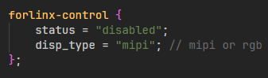

The node has a default disabled state and needs to be changed to an okay enabled node. Change according to screen requirements.

**Parameter Description:**

| **Parameter**| **Meaning**
|:----------|:----------
| <font style="color:rgb(51, 51, 51);">status</font>| Describe the node state: disabled is for off, okay is for on
| <font style="color:rgb(51, 51, 51);">disp\_type</font>| Specify the mipi or lvds screen display.

Settings can be changed as needed, and after saving, recompilation is required to generate the image.

**Examples**:

Use the RGB screen display.

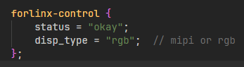

After saving, recompile to generate the image.

### <font style="color:rgb(51, 51, 51);">2.6 System Shutdown</font>

In general, you can simply turn off the power. However, if you’re working with data storage or using specific functions, avoid unplugging the power to prevent potential irreversible file damage. To ensure the data is completely written, enter the sync command to synchronize the data before turning off the power.

**Note: For products designed based on the SoM, if there are scenarios where accidental power loss causes the system to shut down unexpectedly, measures such as adding power-loss protection can be incorporated into the design.**

## 3\. QT Platform Function Test

OK3506J-S/OK3506J-C platform 512 + 8G configuration (EMMC version) supports QT 5.15.11, and some QT applications are built in for testing.

Before the test, please configure the corresponding screen through the uboot menu, and execute to close the lvgl application that starts by default after starting the machine.

### 3.1 4G Test

It supports 4G module (EC20). Insert the 4G module and SIM card while the power is off. 

Execute:

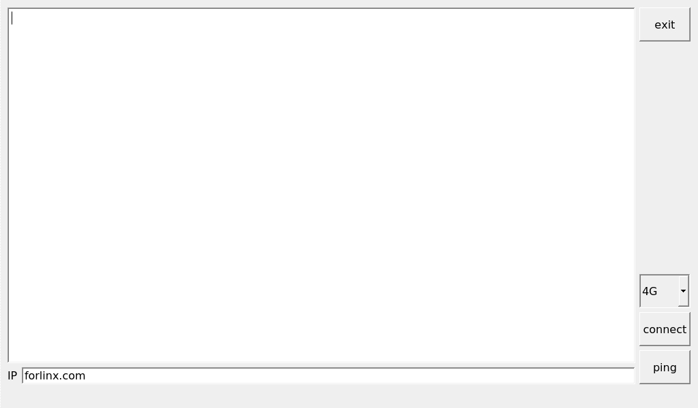

Click the connect button, the program will automatically enter the dial-up process and get IP to set DNS, etc.

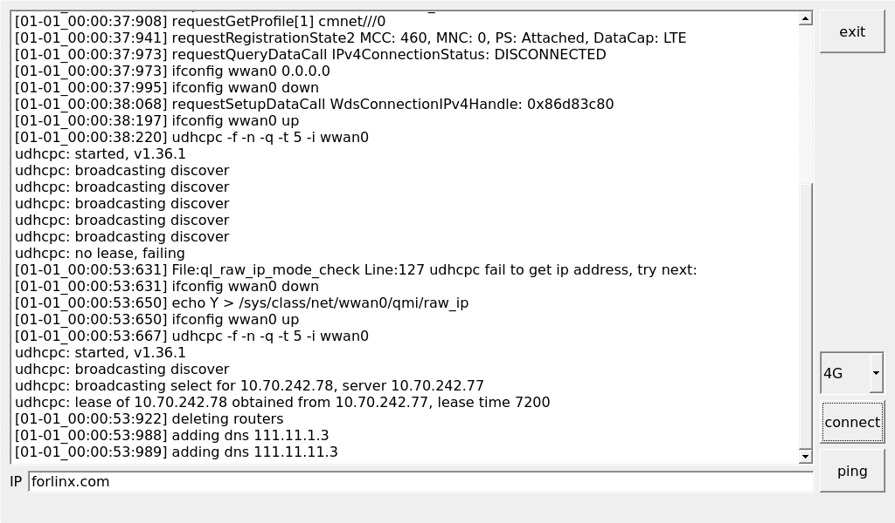

Click the ping to test.

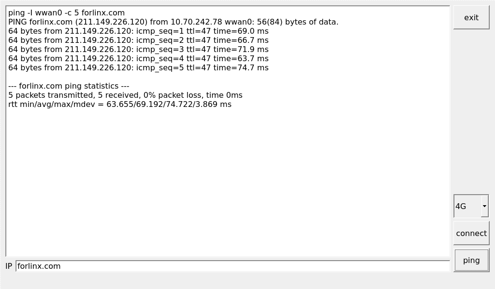

### 3.2 WIFI Test

Execute:

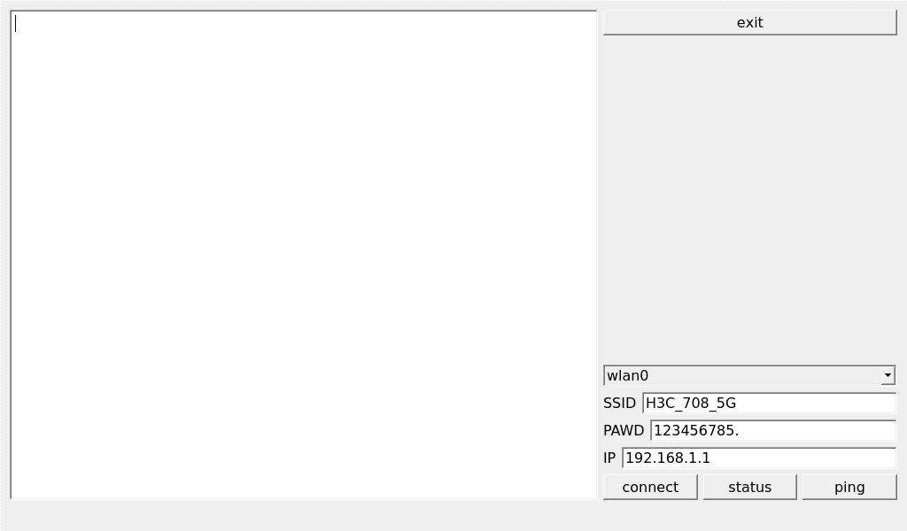

Select wlan0, enter the router name (the one connected to wifi) in the SSID column, enter the router password in the PAWD column, click CONNECT to the router via wifi, enter a valid ip in the IP column, and then click ping to see if the currently used wifi network is smooth.

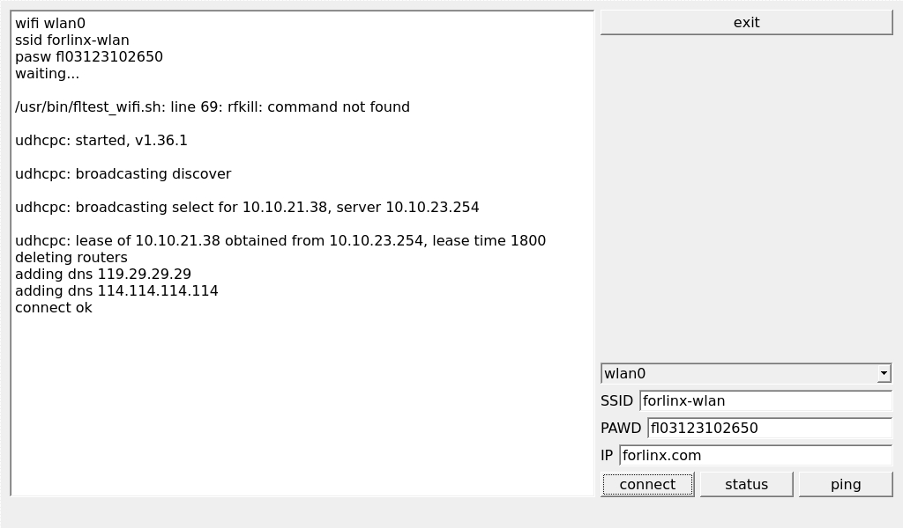

Click ping to test the network after a successful connection.

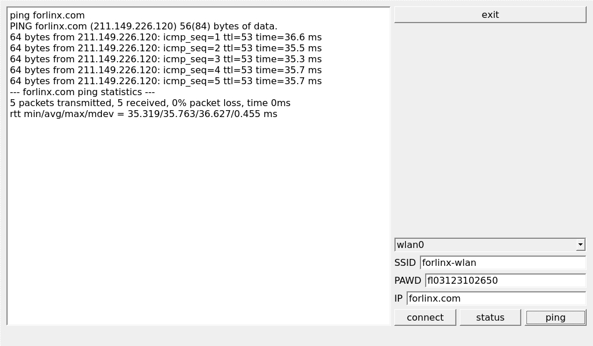

### 3.3 Network Configuration Test

Execute:

The DHCP mode interface is as follows:

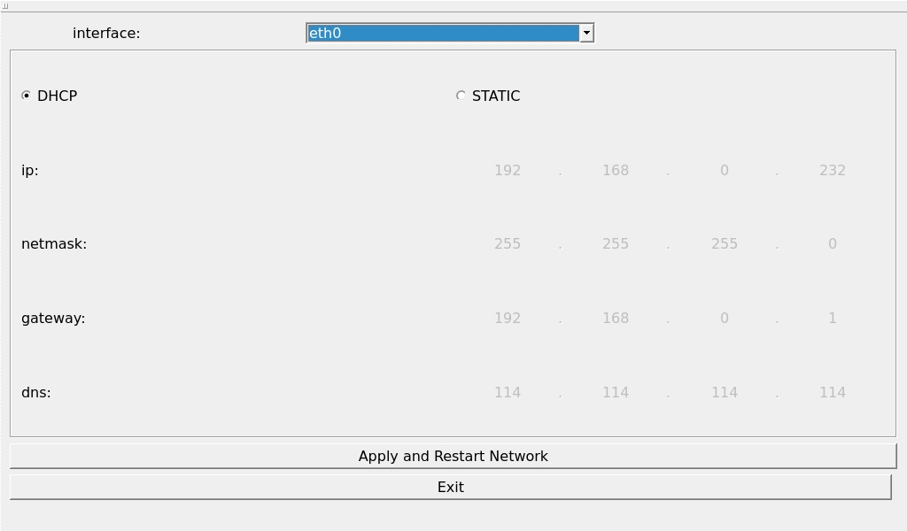

Check DHCP, select the NIC device needing to be configured, and click Apply and Restart Network at the bottom of the interface to restart the network and get the ip automatically.

The STATIC mode interface is as follows:

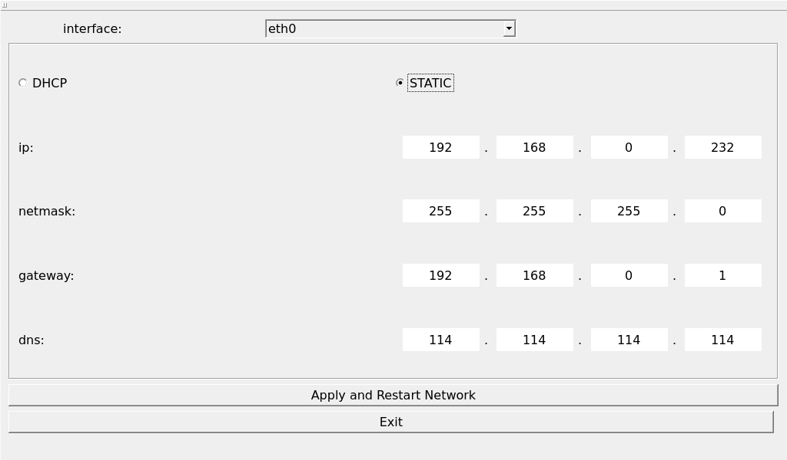

Select the NIC device to be configured in the interface, and enter the ip to be set in the ip field, enter the subnet mask in the netmask field, the gateway in the geteway field, and DNS in the dns field.

**Note: In STATIC mode, the information such as the IP address you set will be saved in the relevant configuration files of the system. Therefore, the network information you set this time will be used every time the system is restarted. However, when configuring network information in DHCP mode, you don't need to worry about this. Every time the system restarts, an IP address will be dynamically assigned.**

### 3.4 Ping test

Execute:

Write the target IP address in the "hostname" column. Click the "ping" button, and the "result" column will display the ping outcome. Click "stop" to end the ping test, and "clear" to erase the information in the "result" column.

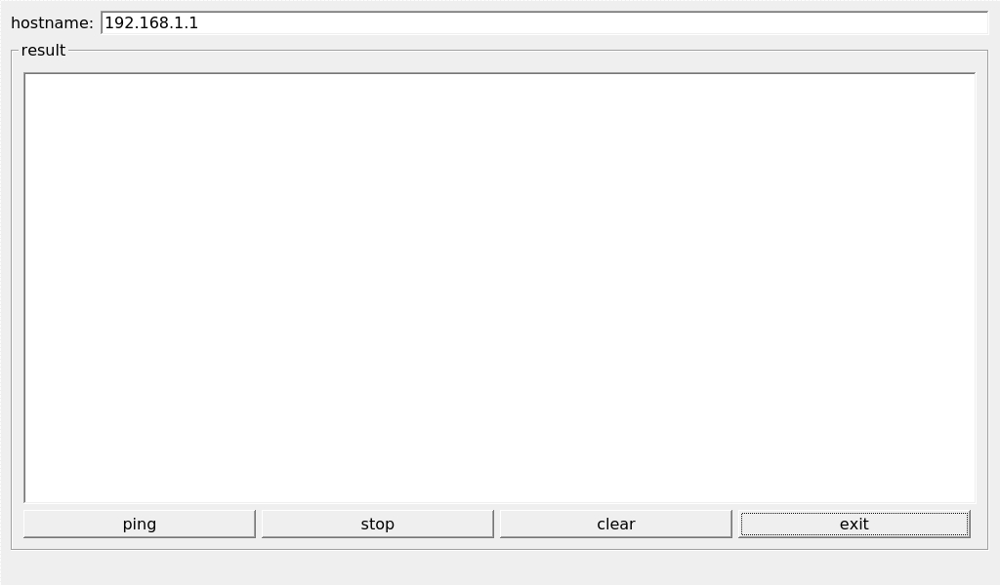

### 3.5 Watchdog Test

Execute:

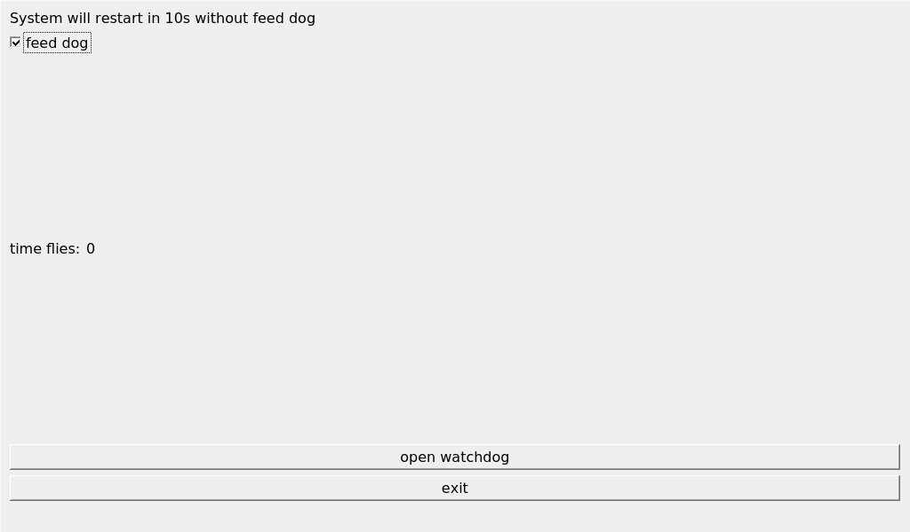

Check feed dog and click the open watchdog key, then the watchdog will be activated, the program will carry out the feeding operation, and the system will not reboot under normal circumstances; when unchecking feed dog and clicking open watchdog key, the watchdog function will be activated, the program will not carry out the feeding operation, and the system enters into a reboot after the watchdog is activated for about 10s, which indicates that the watchdog function is normal.

### 3.6 Key Test

Execute:

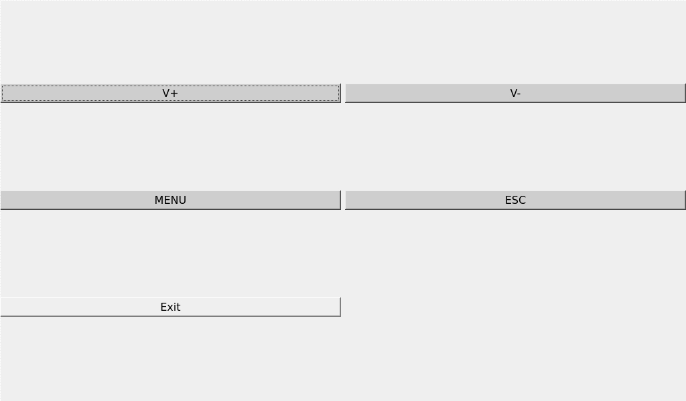

The corresponding key in the test application will turn blue when pressing the key, indicating that the key is in normal status.

### 3.7 RTC Test

Execute:

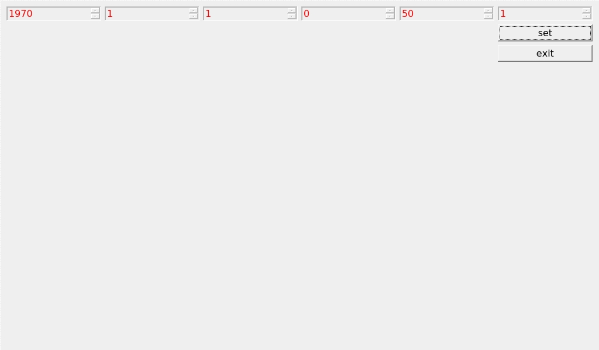

After Set, you can set the time and click Save to finish the setting.

With the RTC backup battery installed, power down and restart the development board to confirm that the RTC clock is set successfully.

### 3.8 UART Test

In this test, two boards (hereinafter referred to as Board A and Board B) are used. The RS485 serial ports of Board A and Board B are connected for the test. You can also replace Board B with a computer.

Board A execute:

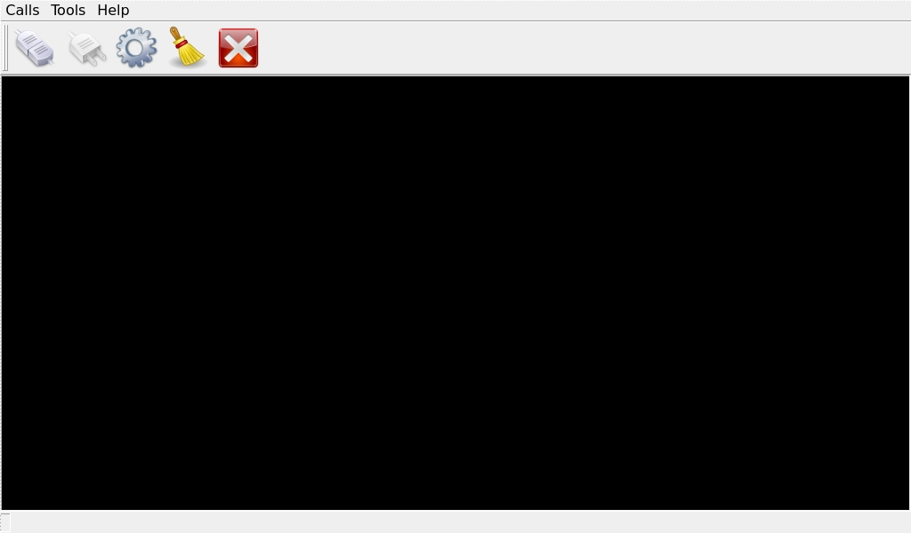

Click the settings button (the third small gear) in the upper - left corner and set the serial port parameters to be consistent with those of Board B, as shown in the following figure:

| **Relevant Parameter**| **Meaning**
|----------|----------
| Select Serial Port| Setting the serial port (select UART2, i.e. ttyS2)
| BaudRate| Set baud rate (115200)
| Data bits| Set data bits (8 bits)
| Parity| Set parity bit (no parity)
| Stop bits| Set stop bit (1 bit)
| Flow control| Set flow control (no flow control)

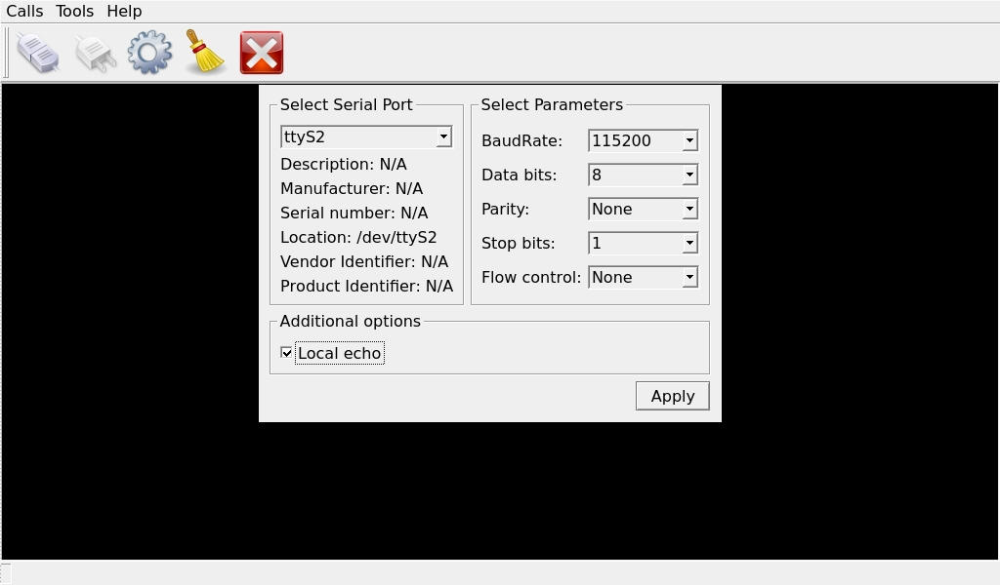

After setting the serial port parameters, click the connection button (the first button) in the upper - left corner. At this time, the test program can perform data sending and receiving tests.

Run fltest\_uarttest on Board B to send data. At this time, the data received by the serial port will be displayed on the screen of Board A.

```plain
root@ok3506-buildroot:/# fltest_uarttest -d /dev/ttyS2 -w
tx_0: jaBZgUQxZ5FSxFqQSBqVXHTROSfRZzqJ
```

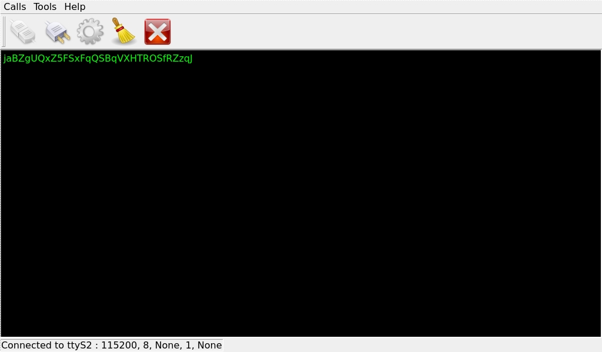

Run fltest\_uarttest on Board B to receive data. Click on the black - screen area in the middle of the screen on Board A, and a soft keyboard will pop up. After continuously entering 32 characters, the information printed on the command - line terminal of Board B is the data sent by the Qt program on Board A.

```plain
root@ok3506-buildroot:/# fltest_uarttest -d /dev/ttyS2 -r
rx_0: 12345678901234567890123456789012
```


### 3.9 Database Test

Execute:

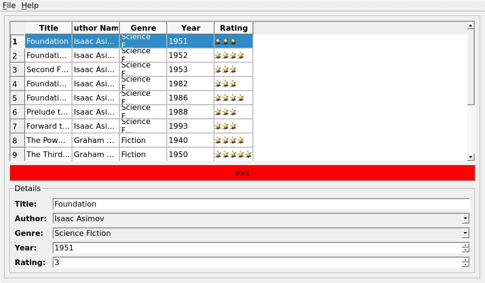

### 3.10 Backlight Test

Execute:

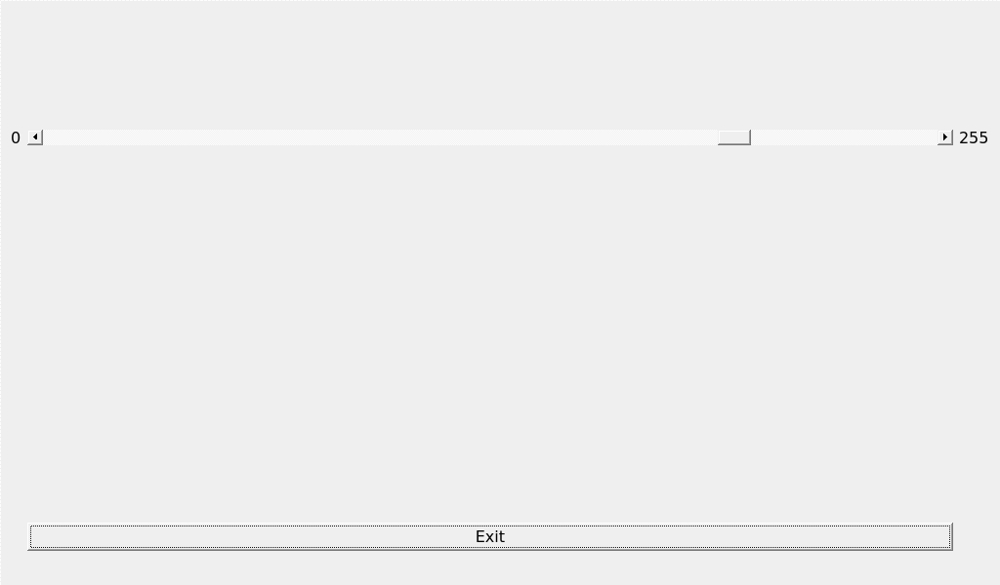

Adjust the brightness of the LCD backlight by sliding the slider in the interface; level 0 is the lowest brightness, and level 255 is the highest brightness.

This test procedure limits the minimum brightness, and the minimum value can be set to 1 on the QT interface. If the backlight needs to be turned off, refer to “3.2.20 LCD Backlight Adjustment”, and set the backlight brightness to 0.

## 4\. Command Line Function Test

OK3506J-S/OK3506J-C platform has various built-in command line tools available to use.

### 4.1 System Information Query

View kernel information:

```plain
root@ok3506-buildroot:/# uname -a
Linux ok3506-buildroot 6.1.99 #1 SMP PREEMPT Mon Jan 13 14:50:26 CST 2025 armv7l GNU/Linux
```

View CPU information:

```plain
root@ok3506-buildroot:/# cat /proc/cpuinfo
processor	: 0
model name	: ARMv7 Processor rev 5 (v7l)
BogoMIPS	: 56.00
Features	: half thumb fastmult vfp edsp neon vfpv3 tls vfpv4 idiva idivt vfpd32 lpae 
CPU implementer	: 0x41
CPU architecture: 7
CPU variant	: 0x0
CPU part	: 0xc07
CPU revision	: 5

processor	: 1
model name	: ARMv7 Processor rev 5 (v7l)
BogoMIPS	: 56.00
Features	: half thumb fastmult vfp edsp neon vfpv3 tls vfpv4 idiva idivt vfpd32 lpae 
CPU implementer	: 0x41
CPU architecture: 7
CPU variant	: 0x0
CPU part	: 0xc07
CPU revision	: 5

processor	: 2
model name	: ARMv7 Processor rev 5 (v7l)
BogoMIPS	: 56.00
Features	: half thumb fastmult vfp edsp neon vfpv3 tls vfpv4 idiva idivt vfpd32 lpae 
CPU implementer	: 0x41
CPU architecture: 7
CPU variant	: 0x0
CPU part	: 0xc07
CPU revision	: 5

Hardware	: Generic DT based system
Revision	: 0000
Serial		: 0
```

View environment variable information (EMMC version):

```plain
root@ok3506-buildroot:/# env
SHELL=/bin/sh
RUNLEVEL=#z-01/13/2025
EDITOR=/bin/vi
PWD=/
HOME=/
LANG=en_US.UTF-8
ADB_TCP_PORT=5555
USB_FW_VERSION=0x0310
TERM=vt102
USER=root
ADBD_SHELL=/bin/bash
SHLVL=1
USB_FUNCS=adb
USB_MANUFACTURER=Rockchip
USB_PRODUCT=rk3xxx
XDG_RUNTIME_DIR=/var/run
USB_VENDOR_ID=0x2207
PATH=/usr/bin:/usr/sbin
storagemedia=emmc
_=/usr/bin/env
```

View environment variable information (NAND version):

```plain
root@ok3506-buildroot:/# env
SHELL=/bin/sh
RUNLEVEL=#z-01/10/2025
EDITOR=/bin/vi
PWD=/
HOME=/
LANG=en_US.UTF-8
ADB_TCP_PORT=5555
USB_FW_VERSION=0x0310
TERM=vt102
USER=root
ADBD_SHELL=/bin/bash
SHLVL=1
USB_FUNCS=adb
USB_MANUFACTURER=Rockchip
USB_PRODUCT=rk3xxx
XDG_RUNTIME_DIR=/var/run
USB_VENDOR_ID=0x2207
PATH=/usr/bin:/usr/sbin
storagemedia=mtd
_=/usr/bin/env
```

### 4.2 Frequency Test

**Note: This process takes cpu0 as an example, and the actual process of cpu1, and cpu2 will be changed at the same time.**

1\. All cpufreq governor types supported in the current kernel:

```plain
root@ok3506-buildroot:/# cat /sys/devices/system/cpu/cpu0/cpufreq/scaling_available_governors
ondemand userspace performance
```

“userspace” refers to user mode, in which user programs are allowed to adjust the CPU frequency.

2\. View the frequency gear supported by the current CPU:

```plain
root@ok3506-buildroot:/# cat /sys/devices/system/cpu/cpu0/cpufreq/scaling_available_frequencies
600000 800000 1008000 1200000 1296000 1416000 1512000
```

3\. Set to user mode and modify the frequency to 1200000:

```plain
root@ok3506-buildroot:/# echo userspace > /sys/devices/system/cpu/cpu0/cpufreq/scaling_governor
root@ok3506-buildroot:/# echo 1200000 > /sys/devices/system/cpu/cpu0/cpufreq/scaling_setspeed
```

4\. View the current frequency after modification:

```plain
root@ok3506-buildroot:/# cat /sys/devices/system/cpu/cpu0/cpufreq/cpuinfo_cur_freq
1200000
```

### 4.3 Temperature Test

View the temperature value:

```plain
root@ok3506-buildroot:/# cat /sys/class/thermal/thermal_zone0/temp
35693
```

The temperature value is 35.7°C.

### 4.4 DDR Bandwidth Test

```plain
root@ok3506-buildroot:/# fltest_memory_bandwidth.sh
L1 cache bandwidth rd test with # process
0.008192 9451.28
0.008192 8459.10
0.008192 9496.09
0.008192 9489.91
0.008192 8435.44
L2 cache bandwidth rd test
0.131072 1465.02
0.131072 1438.77
0.131072 1429.70
0.131072 1431.72
0.131072 1442.32
Main mem bandwidth rd test
52.43 1136.19
52.43 1253.14
52.43 1248.01
52.43 1235.92
52.43 1244.04
L1 cache bandwidth wr test with # process
0.008192 11361.59
0.008192 11368.80
0.008192 11362.81
0.008192 11341.06
0.008192 11349.27
L2 cache bandwidth wr test
0.131072 1567.85
0.131072 1498.65
0.131072 1466.94
0.131072 1498.23
0.131072 1420.71
Main mem bandwidth wr test
52.43 622.40
52.43 621.86
52.43 621.30
52.43 621.47
52.43 636.10
```

<font style="color:rgb(51, 51, 51);">The DDR3 write bandwidth of OK3506-S/OK3506-C is approximately 620M/s, and the read bandwidth is approximately 1230M/s.</font>

### 4.5 Watchdog Test

Watchdog is a function often used in embedded systems. The device node of watchdog in OK3506-S/OK3506-C is /dev/watchdog.

Start the watchdog, set the reset time for 10s, and feed the dog regularly. The system will not restart.

```plain
root@ok3506-buildroot:/# fltest_watchdog -t 10 -c
Watchdog Ticking Away!
```

When using ctrl+c to end the test program, kicking the dog is stopped, the watchdog is on, and the system is reset after 10s.

If you do not want to reset, enter the shutdown watchdog command within 10s after finishing the program:

```plain
root@ok3506-buildroot:/# fltest_watchdog -d
Watchdog disabled.
```

Start the watchdog, set the reset time for 10s, but do not feed the dog, the system will restart after 10 seconds.

```plain
root@ok3506-buildroot:/# fltest_watchdog -t 10
Watchdog Ticking Away!
[   39.114587] watchdog: watchdog0: watchdog did not stop!
```

### 4.6 RTC Function Test

<font style="color:rgb(51, 51, 51);">Note: Make sure that the coin cell battery has been installed on the board and that the battery voltage is normal.

RTC test: The main way to set the software and hardware time is by using the date and hwclock utilities. When performing the board power-down and power-up test, the software clock reads whether the RTC clock is synchronized or not.

Time setting

```plain
root@ok3506-buildroot:/# date -s "2022-12-12 17:23:00"	//Set software time
Mon Dec 12 17:23:00 UTC 2022
root@ok3506-buildroot:/# hwclock -w											//Synchronize software time to hardware time
root@ok3506-buildroot:/# hwclock -r											//Display hardware time
Mon Dec 12 17:23:23 2022  0.000000 seconds
```

<font style="color:rgb(51, 51, 51);">Then power down and power up the board, enter the system, and read the system time. After that, we can see that the time has synchronized.</font>

```plain
root@ok3506-buildroot:/# date
Mon Dec 12 17:26:10 UTC 2022
```

### 4.7 Key Test

Use the fltest\_keytest command line tool to test the keys. fltest\_keytest currently supports the test of four keys on the carrier board, VOL+, VOL-, MENU, and ESC, with key codes 115, 114, 139, and 1, respectively.

Execute the following command. Note that when there is a touch screen, it is event1. At this time, press the lift button in turn, and the following content can be output on the terminal:

```plain
root@ok3506-buildroot:/# fltest_keytest /dev/input/event1
press  ESC MENU VOL- VOL+
key1 Presse
key1 Released
key139 Presse
key139 Released
key114 Presse
key114 Released
key115 Presse
key115 Released
```

### 4.8 UART Test

OK3506-S/ OK3506-C development board is equipped with 2 x UART, which are labeled on the board as follows：

| **UART**| **Device Nodes**| **Description**
|:----------:|:----------:|:----------
| <font style="color:rgb(51, 51, 51);">UART0</font>| <font style="color:rgb(51, 51, 51);">/dev/ttyFIQ0</font>| Debugging serial port cannot be used directly for this test.
| <font style="color:rgb(51, 51, 51);">UART2</font>| <font style="color:rgb(51, 51, 51);">/dev/ttyS2</font>| <font style="color:rgb(51, 51, 51);">RS485</font>

The UART2 test is used in this test. Connect 485 \_ A1, 485 \_ B1 and GND \_ 485 \_ 1 in the P25 port to the computer through the USB to 485 module, as shown in the figure:

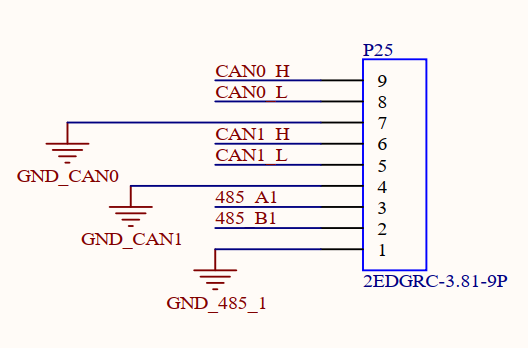

Enter the following command in the serial port of the development board for UART receiving test:

```plain
root@ok3506-buildroot:/# fltest_uarttest -d /dev/ttyS2 -b 115200 -r &
[1] 2845
root@ok3506-buildroot:/# rx_0: forlinxforlinxforlinxforlinxforl
```

Enter the send information on the PC side:

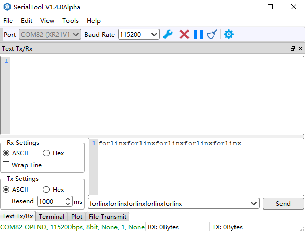

Enter the following command in the serial port of the development board for UART sending test:

```plain
root@ok3506-buildroot:/# fltest_uarttest -d /dev/ttyS2 -b 115200 -w
tx_0: KaLKchczYFbc21YbhV5xYf2SotoVobK8
```

Observe the received information on the PC side:

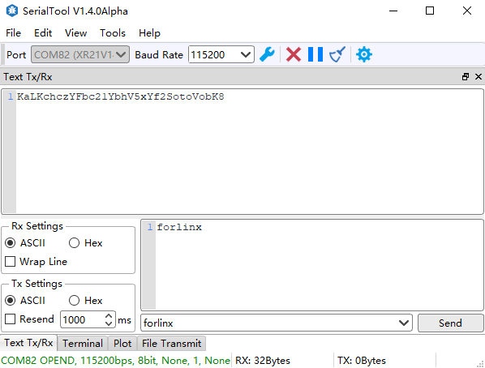

### 4.9 TF Test

**Description:**

+ **The SD card mounts at /run/media/, allowing hot-plugging. Terminal displays SD card information;**
+ **It supports file system in formats such as FAT32 and EXT4. If you are unsure about the TF card format, it is recommended to format it as FAT32 before use;**
+ **Only the Nand version supports TF cards, the eMMC version does not support TF cards.**

1\. Insert the TF card into the card slot on the carrier board. Under normal circumstances, the development board terminal will display the following printing information:

```plain
[ 3496.124630] mmc_host mmc0: Bus speed (slot 0) = 50000000Hz (slot req 50000000Hz, actual 50000000HZ div = 0)
[ 3496.124875] mmc0: new high speed SDHC card at address aaaa
[ 3496.127596] mmcblk0: mmc0:aaaa SC16G 14.8 GiB 
[ 3496.133906]  mmcblk0: p1
[ 3496.268275] EXT4-fs (mmcblk0): VFS: Can't find ext4 filesystem
[ 3496.269290] EXT4-fs (mmcblk0): VFS: Can't find ext4 filesystem
[ 3496.270072] EXT2-fs (mmcblk0): error: can't find an ext2 filesystem on dev mmcblk0.
[ 3496.271600] FAT-fs (mmcblk0): bogus number of reserved sectors
[ 3496.271691] FAT-fs (mmcblk0): Can't find a valid FAT filesystem
[ 3496.271957] FAT-fs (mmcblk0): bogus number of reserved sectors
[ 3496.271996] FAT-fs (mmcblk0): Can't find a valid FAT filesystem
[ 3496.619184] FAT-fs (mmcblk0p1): Volume was not properly unmounted. Some data may be corrupt. Please run fsck.
```

2\. Check the mount directory:

```plain
root@ok3506-buildroot:/# ls /run/media/
mmcblk0p1
```

3\. Write test:

```plain
root@ok3506-buildroot:/# dd if=/dev/zero of=/run/media/mmcblk0p1/test bs=1M count=500 conv=fsync
500+0 records in
500+0 records out
524288000 bytes (524 MB, 500 MiB) copied, 41.3072 s, 12.7 MB/s
```

4\. Read the test:

```plain
root@ok3506-buildroot:/# dd if=/run/media/mmcblk0p1/test of=/dev/null bs=1M count=500 iflag=direct
500+0 records in
500+0 records out
524288000 bytes (524 MB, 500 MiB) copied, 22.4557 s, 23.3 MB/s
```

5\. After using the TF card, uninstall it with umount before ejecting it.

```plain
root@ok3506-buildroot:/# umount /run/media/mmcblk0p1
```

**Note: Plug and unplug the TF card after exiting the TF card mounting path.**

### 4.10 Storage Test

#### 4.10.1 EMMC Test

OK3506-S/ The eMMC speed of OK3506-S platform is 50MHz. The following is a simple test of the reading and writing speed of eMMC. Take reading and writing ext4 file system as an example.

Write test:

```plain
root@ok3506-buildroot:/# dd if=/dev/zero of=/test bs=1M count=500 conv=fsync
500+0 records in
500+0 records out
524288000 bytes (524 MB, 500 MiB) copied, 23.8119 s, 22.0 MB/s
```

Read test：

```plain
root@ok3506-buildroot:/# dd if=/test of=/dev/null bs=1M iflag=direct
500+0 records in
500+0 records out
524288000 bytes (524 MB, 500 MiB) copied, 22.2584 s, 23.6 MB/s
```

#### 4.10.2 Nand Test

OK3506-S/OK3506-S platform is configured with SPI Nand driver by default, the root file system uses squashfs file system (read-only), and the userdata partition uses ubifs file system.

```plain
root@ok3506-buildroot:/# cat /proc/mtd
dev:    size   erasesize  name
mtd0: 00400000 00020000 "uboot"
mtd1: 00100000 00020000 "misc"
mtd2: 00a00000 00020000 "boot"
mtd3: 01000000 00020000 "recovery"
mtd4: 08000000 00020000 "rootfs"
mtd5: 01000000 00020000 "oem"
mtd6: 04c60000 00020000 "userdata"
```

Note that the mtd4 partition is the current root file system.

Write test:

```plain
root@ok3506-buildroot:/# dd if=/dev/zero of=/userdata/test bs=1M count=20 conv=fsync
20+0 records in
20+0 records out
20971520 bytes (21 MB, 20 MiB) copied, 0.651586 s, 32.2 MB/s
```

Read test：

**Note: To ensure accurate data, restart the board and test the read speed.**

```plain
root@ok3506-buildroot:/# dd if=/userdata/test of=/dev/null bs=1M
20+0 records in
20+0 records out
20971520 bytes (21 MB, 20 MiB) copied, 1.11805 s, 18.8 MB/s
```

### 4.11 USB2.0

OK3506-S/OK3506-C supports two USB2.0 interfaces. You can connect USB mice, USB keyboards, U disks and other devices to any on-board USB HOST interface, and support hot plugging of these devices. Demonstration with a mounting USB flash drive; the current USB flash drive test supports up to 32G, but no test for 32G above.

The terminal will print information about the USB flash drive, but due to the many types of USB flash drives, the displayed information may vary:

1\. After the development board booting, connect the USB interface disk to the USB host interface of the development board. The default log print information is low, so there will be no print information; You can use the dmesg command to view and find information about the U disk.

```plain
[ 1524.297550] usb 2-1.3: new high-speed USB device number 4 using dwc2
[ 1524.493923] usb-storage 2-1.3:1.0: USB Mass Storage device detected
[ 1524.496615] scsi host0: usb-storage 2-1.3:1.0
[ 1525.522210] scsi 0:0:0:0: Direct-Access     SanDisk  Cruzer Blade     1.00 PQ: 0 ANSI: 6
[ 1525.535539] sd 0:0:0:0: [sda] 60125184 512-byte logical blocks: (30.8 GB/28.7 GiB)
[ 1525.536834] sd 0:0:0:0: [sda] Write Protect is off
[ 1525.538522] sd 0:0:0:0: [sda] Write cache: disabled, read cache: enabled, doesn't support DPO or FUA
[ 1525.546982]  sda: sda1
[ 1525.547581] sd 0:0:0:0: [sda] Attached SCSI removable disk
[ 1525.893709] EXT4-fs (sda): VFS: Can't find ext4 filesystem
[ 1525.895579] EXT4-fs (sda): VFS: Can't find ext4 filesystem
[ 1525.897325] EXT2-fs (sda): error: can't find an ext2 filesystem on dev sda.
[ 1525.901082] FAT-fs (sda): bogus number of reserved sectors
[ 1525.901131] FAT-fs (sda): Can't find a valid FAT filesystem
[ 1525.901873] FAT-fs (sda): bogus number of reserved sectors
[ 1525.901912] FAT-fs (sda): Can't find a valid FAT filesystem
[ 1526.517667] FAT-fs (sda1): Volume was not properly unmounted. Some data may be corrupt. Please run fsck.
```

2\. Check the mount directory:

```plain
root@ok3506-buildroot:/# ls /run/media/
mmcblk0p5 sda1
```

You can see the USB mount directory: /run/media/sda1.

3\. View the contents of the U disk (sda1 is based on the actual USB flash drive partition name);

```plain
root@ok3506-buildroot:/# ls -l /run/media/sda1/
total 512000
-rwxrwx--- 1 root disk 524288000 Dec 12 20:25 test
```

4\. Write test: Write speeds are limited by the specific storage device:

```plain
root@ok3506-buildroot:/# dd if=/dev/zero of=/run/media/sda1/test bs=1M count=500 conv=fsync
500+0 records in
500+0 records out
524288000 bytes (524 MB, 500 MiB) copied, 45.6879 s, 11.5 MB/s
```

5\. Read the test:

```plain
root@ok3506-buildroot:/# dd if=/run/media/sda1/test of=/dev/null bs=1M iflag=direct
500+0 records in
500+0 records out
524288000 bytes (524 MB, 500 MiB) copied, 18.8926 s, 27.8 MB/s
```

6\. After using a USB flash drive, before removing the USB flash drive, you need to use the "umount" command to unmount it.

```plain
root@ok3506-buildroot:/# umount /run/media/sda1
```

**Note: Exit the USB flash drive mount path before plugging and unplugging the USB flash drive.**

### 4.12 USB to Four Serial Port Conversion Test

**Description:**

+ **It supports XR21V1414 USB to serial port chip driver.**
+ **USB to four serial port conversion is an optional module. If you have the need for it, please contact the sales personnel.**

1\. After powering on the development board, connect the USB to quad port module through the USB HOST interface, and the following printed information will appear on the terminal:

```plain
[   36.441352] usb 2-1.3: new full-speed USB device number 4 using dwc2
[   36.651832] cdc_xr_usb_serial 2-1.3:1.0: This device cannot do calls on its own. It is not a modem.
[   36.652115] cdc_xr_usb_serial 2-1.3:1.0: ttyXR_USB_SERIAL0: USB XR_USB_SERIAL device
[   36.657220] cdc_xr_usb_serial 2-1.3:1.2: This device cannot do calls on its own. It is not a modem.
[   36.657499] cdc_xr_usb_serial 2-1.3:1.2: ttyXR_USB_SERIAL1: USB XR_USB_SERIAL device
[   36.664388] cdc_xr_usb_serial 2-1.3:1.4: This device cannot do calls on its own. It is not a modem.
[   36.665096] cdc_xr_usb_serial 2-1.3:1.4: ttyXR_USB_SERIAL2: USB XR_USB_SERIAL device
[   36.671332] cdc_xr_usb_serial 2-1.3:1.6: This device cannot do calls on its own. It is not a modem.
[   36.671795] cdc_xr_usb_serial 2-1.3:1.6: ttyXR_USB_SERIAL3: USB XR_USB_SERIAL device
```

2\. Check the usb device status by lsusb:

```plain
root@ok3506-buildroot:/# lsusb
Bus 002 Device 002: ID 1a40:0101
Bus 001 Device 001: ID 1d6b:0002
Bus 002 Device 004: ID 04e2:1414                             //The VID and PID of the conversion chip
Bus 002 Device 001: ID 1d6b:0002
Bus 002 Device 003: ID 0bda:d723
```

Check whether a serial port node is generated under dev:

```plain
root@ok3506-buildroot:/# ls /dev/ttyXRUSB*
/dev/ttyXRUSB0	/dev/ttyXRUSB1	/dev/ttyXRUSB2	/dev/ttyXRUSB3
```

3\. The mapping between the four extended serial ports and their corresponding device nodes is shown in the diagram below:

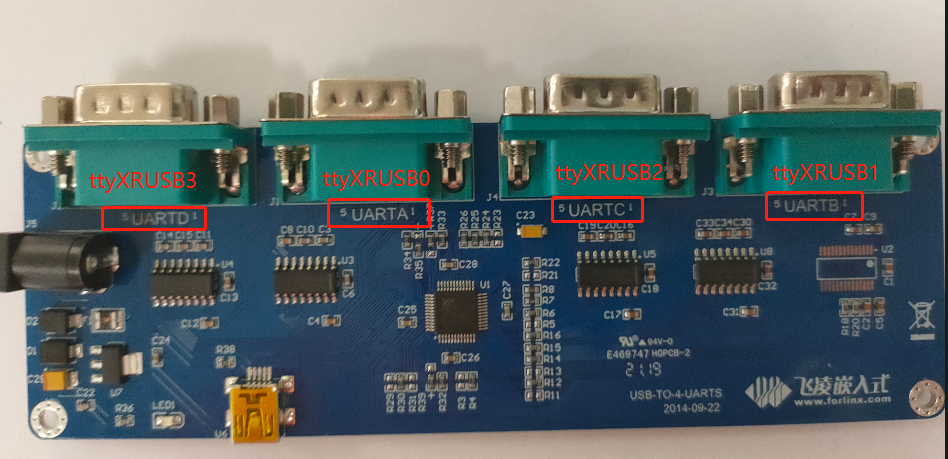

4\. Refer to “4.8 UART Port Test” for the test methods.

### 4.13 OTG Test

OK3506-S/OK3506-C has an OTG port, in host mode, it can be plugged into a normal USB device, and Device mode can be used for flashing, ADB file transfer, and debugging. The switch between Host mode and Device mode is controlled by the S2 DIP switch. When the switch is set to ON, the Host mode is selected, and when the switch is set to OFF, the Device mode is selected.

#### 4.13.1 Host Mode

1\. Toggle the S2 dial switch to ON, and insert the USB flash disk through the OTG cable. The serial port information is as follows:

```plain
[ 1287.317785] usb 1-1: new high-speed USB device number 2 using dwc2
[ 1287.520098] usb-storage 1-1:1.0: USB Mass Storage device detected
[ 1287.523033] scsi host0: usb-storage 1-1:1.0
[ 1288.538969] scsi 0:0:0:0: Direct-Access     SanDisk  Cruzer Blade     1.00 PQ: 0 ANSI: 6
[ 1288.552018] sd 0:0:0:0: [sda] 60125184 512-byte logical blocks: (30.8 GB/28.7 GiB)
[ 1288.552945] sd 0:0:0:0: [sda] Write Protect is off
[ 1288.553348] sd 0:0:0:0: [sda] Write cache: disabled, read cache: enabled, doesn't support DPO or FUA
[ 1288.559711]  sda: sda1
[ 1288.560429] sd 0:0:0:0: [sda] Attached SCSI removable disk
[ 1288.734631] EXT4-fs (sda): VFS: Can't find ext4 filesystem
[ 1288.735982] EXT4-fs (sda): VFS: Can't find ext4 filesystem
[ 1288.737352] EXT2-fs (sda): error: can't find an ext2 filesystem on dev sda.
[ 1288.741354] FAT-fs (sda): bogus number of reserved sectors
[ 1288.741411] FAT-fs (sda): Can't find a valid FAT filesystem
[ 1288.742018] FAT-fs (sda): bogus number of reserved sectors
[ 1288.742065] FAT-fs (sda): Can't find a valid FAT filesystem
[ 1289.200452] FAT-fs (sda1): Volume was not properly unmounted. Some data may be corrupt. Please run fsck.
```

2\. Check the mount directory:

```plain
root@ok3506-buildroot:/# ls /run/media/
mmcblk0p5 sda1
```

You can see the USB mount directory: /run/media/sda1..

3\. View the contents of the USB drive (replace “sda” with the actual partition name of the USB drive);

```plain
root@ok3506-buildroot:/# ls -l /run/media/sda1/
total 512000
-rwxrwx--- 1 root disk 524288000 Dec 12 20:25 test
```

4\. Write test: Write speeds are limited by the specific storage device:

```plain
root@ok3506-buildroot:/# dd if=/dev/zero of=/run/media/sda1/test bs=1M count=500 conv=fsync
500+0 records in
500+0 records out
524288000 bytes (524 MB, 500 MiB) copied, 46.2425 s, 11.3 MB/s
```

5\. Read the test:

```plain
root@ok3506-buildroot:/# dd if=/run/media/sda1/test of=/dev/null bs=1M count=500 iflag=direct
500+0 records in
500+0 records out
524288000 bytes (524 MB, 500 MiB) copied, 17.781 s, 29.5 MB/s
```

6\. After using a USB flash drive, before removing the USB flash drive, you need to use the "umount" command to unmount it.

```plain
root@ok3506-buildroot:/# umount /run/media/sda1
```

**Note: Exit the USB flash drive mount path before plugging and unplugging the USB flash drive.**

#### 4.13.2 Device Mode

1. Set the S2 DIP switch to OFF and connect the PC via Type-C cable, the serial port information is as follows:

```plain
[ 1811.539300] dwc2 ff740000.usb: new device is full-speed
[ 1811.747607] dwc2 ff740000.usb: new device is high-speed
[ 1812.013915] dwc2 ff740000.usb: new device is high-speed
[ 1812.047658] dwc2 ff740000.usb: new address 44
[ 1812.076229] dwc2 ff740000.usb: dwc2_hsotg_ep_sethalt(ep b210f0b8 ep1in, 0)
[ 1812.076341] dwc2 ff740000.usb: dwc2_hsotg_ep_sethalt(ep 34e64b59 ep2out, 0)
[ 1812.076382] android_work: sent uevent USB_STATE=CONFIGURED
```

Rockchip Development Tool displays "An ADB device was found". Debugging can be done using the ADB tool.

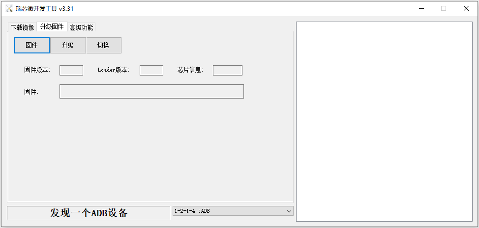

### 4.14 Ethernet Configuration

The OK3506 - S/OK3506 - C boards are equipped with two 100 - Mbps network cards. The default configuration for eth0 at the factory is static IP 192.168.0.232.

The path to the configuration file is: /etc/network/interfaces.

**Note: Since the root file system in the NAND configuration is read - only, the default IP cannot be modified by editing the configuration file. It can only be modified by manually executing commands.**

The configuration file for setting a dynamic IP is:

```plain
auto lo
iface lo inet loopback

auto eth0
iface eth0 inet dhcp
```

Set a static IP configuration. The following takes setting the IP of eth0 to 192.168.0.232 as an example:

```plain
auto lo
iface lo inet loopback

auto eth0
iface eth0 inet static
address 192.168.0.232
netmask 255.255.255.0
gateway 192.168.0.1
```

| **Parameter**| **Meaning**
|:----------:|:----------
| <font style="color:rgb(51, 51, 51);">iface</font>| Used to specify a network card that requires a fixed IP.
| <font style="color:rgb(51, 51, 51);">address</font>| Used to specify an IP address that needs to be fixed.
| <font style="color:rgb(51, 51, 51);">netmask</font>| Used to set the subnet mask.
| <font style="color:rgb(51, 51, 51);">gateway</font>| Used to specify a gateway.

After setting up, use the sync file synchronization command to reboot the development board or restart the service for the configuration to take effect.

```plain
root@ok3506-buildroot:/# ifdown -a
root@ok3506-buildroot:/# ifup -a
```

### 4.15 WIFI Test

**Description:**

- **The network environment is different, so please set it according to the actual situation when you do this test;**
- **The board only supports connection to 2.4G hotspots;**
- **OK3506-S/OK3506-C platform supports WIFI Bluetooth 2-in-1 modules: RTL8723DU.**


#### 4.15.1 STA Mode

This mode is to connect to the wireless network as a station. In the following test, the router uses WPA encryption, the connected wifi hotspot name is: forlinx-wlan, and the password is: fl03123102650. Due to the different network environments, users should set up according to the actual situation when conducting this test:

1. Enter the following command in the development board terminal:

```plain
root@ok3506-buildroot:/# fltest_wifi.sh -i wlan0 -s "forlinx-wlan" -p fl03123102650
```

The meanings of relevant parameters in the command are as follow:

| **Parameter**| **Meaning**
|:----------:|:----------
| <font style="color:rgb(51, 51, 51);">-i</font>| Different wifi modules use different parameters and specify the name of the WIFI device.
| <font style="color:rgb(51, 51, 51);">-s</font>| The actual WiFi hotspot name connected.
| <font style="color:rgb(51, 51, 51);">-p</font>| The following parameter Password refers to the password of the actual WiFi hotspot to be connected; If the current hotspot does not have a password, write NONE as the parameter after - p.

The serial port prints as follows:

```plain
root@ok3506-buildroot:/# fltest_wifi.sh -i wlan0 -s "forlinx-wlan" -p fl03123102650
wifi wlan0
ssid forlinx-wlan
pasw fl03123102650
waiting...
/usr/bin/fltest_wifi.sh: line 69: rfkill: command not found
udhcpc: started, v1.36.1
udhcpc: broadcasting discover
udhcpc: broadcasting select for 10.10.21.72, server 10.10.23.254
udhcpc: lease of 10.10.21.72 obtained from 10.10.23.254, lease time 1800
deleting routers
adding dns 119.29.29.29
adding dns 114.114.114.114
connect ok
```

2\. Check whether it can ping the external network and enter the following command in the terminal:

```plain
root@ok3506-buildroot:/# ping www.baidu.com -c 4
PING www.a.shifen.com (220.181.38.149) 56(84) bytes of data.
64 bytes from 220.181.38.149: icmp_seq=1 ttl=51 time=11.7 ms
64 bytes from 220.181.38.149: icmp_seq=2 ttl=51 time=13.5 ms
64 bytes from 220.181.38.149: icmp_seq=3 ttl=51 time=13.8 ms
64 bytes from 220.181.38.149: icmp_seq=4 ttl=51 time=11.5 ms

--- www.a.shifen.com ping statistics ---
4 packets transmitted, 4 received, 0% packet loss, time 0ms
rtt min/avg/max/mdev = 11.485/12.601/13.761/1.017 ms
```

#### 4.15.2 AP Mode

**Description:**

**Before conducting this test, ensure that the network card eth0 is connected and the network is functioning properly, so that the phone can access the Internet after connecting to the hotspot.**

Check the driver loading status:

```plain
root@ok3506-buildroot:/# lsmod 
Module                  Size  Used by    Not tainted
8723du               1040261  0
```

Configuration Hotspot

WiFi Hotspot Name: OK3506\_WIFI\_2.4G\_AP

Password: 12345678

The hotspot name and password can be viewed through the/etc/hostapd-2.4g.conf file.

```plain
root@ok3506-buildroot:/# fltest_hostap.sh
Stopping dnsmasq: FAIL
Starting dnsmasq: OK
done!
wlan0: interface state UNINITIALIZED->ENABLED
wlan0: AP-ENABLED
```

### 4.16 Bluetooth Test

RTL8723DU module on the carrier board of the OK3506-S/OK3506-C development board integrates Bluetooth functionality. This section demonstrates how to perform data sending between a mobile phone and the development board via Bluetooth.

1\. Bluetooth Configuration

```plain
root@ok3506-buildroot:/# bluetoothctl
hci0 new_settings: powered bondable ssp br/edr le secure-conn 
Agent registered
[CHG] Controller 78:22:88:03:AB:76 Pairable: yes
[bluetooth]# power on
Changing power on succeeded
[bluetooth]# agent on
Agent is already registered
[bluetooth]# default-agent
Default agent request successful
[bluetooth]# discoverable on
hci0 new_settings: powered connectable bondable ssp br/edr le secure-conn 
hci0 new_settings: powered connectable discoverable bondable ssp br/edr le secure-conn 
Changing discoverable on succeeded
[CHG] Controller 78:22:88:03:AB:76 Discoverable: yes
```

2\. Development Board Passive Pairing

At this time, open the mobile phone Bluetooth search, a "BlueZ 5.77" device will appear, and select pairing.

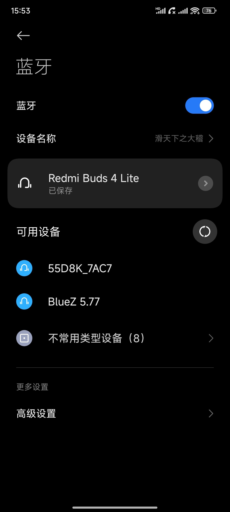

At the same time the printing message displays on the development board as follows, enter yes.

```plain
hci0 14:99:3E:03:1B:E4 type BR/EDR connected eir_len 25
[NEW] Device 14:99:3E:03:1B:E4 滑天下之大稽
Request confirmation
[agent] Confirm passkey 216676 (yes/no): yes
hci0 new_link_key 14:99:3E:03:1B:E4 type 0x05 pin_len 0 store_hint 1
hci0 device_flags_changed: 14:99:3E:03:1B:E4 (BR/EDR)
     supp: 0x00000001  curr: 0x00000000
[CHG] Device 14:99:3E:03:1B:E4 Bonded: yes
[CHG] Device 14:99:3E:03:1B:E4 Modalias: bluetooth:v038Fp1200d1436
[CHG] Device 14:99:3E:03:1B:E4 UUIDs: 00001105-0000-1000-8000-00805f9b34fb
[CHG] Device 14:99:3E:03:1B:E4 UUIDs: 0000110a-0000-1000-8000-00805f9b34fb
[CHG] Device 14:99:3E:03:1B:E4 UUIDs: 0000110c-0000-1000-8000-00805f9b34fb
[CHG] Device 14:99:3E:03:1B:E4 UUIDs: 00001112-0000-1000-8000-00805f9b34fb
[CHG] Device 14:99:3E:03:1B:E4 UUIDs: 00001115-0000-1000-8000-00805f9b34fb
[CHG] Device 14:99:3E:03:1B:E4 UUIDs: 00001116-0000-1000-8000-00805f9b34fb
[CHG] Device 14:99:3E:03:1B:E4 UUIDs: 0000111f-0000-1000-8000-00805f9b34fb
[CHG] Device 14:99:3E:03:1B:E4 UUIDs: 0000112f-0000-1000-8000-00805f9b34fb
[CHG] Device 14:99:3E:03:1B:E4 UUIDs: 00001132-0000-1000-8000-00805f9b34fb
[CHG] Device 14:99:3E:03:1B:E4 UUIDs: 00001200-0000-1000-8000-00805f9b34fb
[CHG] Device 14:99:3E:03:1B:E4 UUIDs: 00001800-0000-1000-8000-00805f9b34fb
[CHG] Device 14:99:3E:03:1B:E4 UUIDs: 00001801-0000-1000-8000-00805f9b34fb
[CHG] Device 14:99:3E:03:1B:E4 UUIDs: 0000fcc0-0000-1000-8000-00805f9b34fb
[CHG] Device 14:99:3E:03:1B:E4 UUIDs: 0000fcc0-36a2-11ea-8467-484d7e99a198
[CHG] Device 14:99:3E:03:1B:E4 UUIDs: 0000fdaa-0000-1000-8000-00805f9b34fb
[CHG] Device 14:99:3E:03:1B:E4 UUIDs: 98b97136-36a2-11ea-8467-484d7e99a198
[CHG] Device 14:99:3E:03:1B:E4 UUIDs: ada499be-27d6-11ec-9427-0a80ff2603de
[CHG] Device 14:99:3E:03:1B:E4 ServicesResolved: yes
[CHG] Device 14:99:3E:03:1B:E4 Paired: yes
hci0 14:99:3E:03:1B:E4 type BR/EDR disconnected with reason 3
[CHG] Device 14:99:3E:03:1B:E4 ServicesResolved: no
[CHG] Device 14:99:3E:03:1B:E4 Connected: no
```

View and remove connected devices:

```plain
[bluetooth]# devices                       // View connected Bluetooth devices
Device 14:99:3E:03:1B:E4 It’s extremely ridiculous.
[bluetooth]# remove 14:99:3E:03:1B:E4                  // Remove the device
[DEL] Device 14:99:3E:03:1B:E4  It’s extremely ridiculous.
Device has been removed
hci0 new_settings: powered connectable bondable ssp br/edr le secure - conn
[CHG] Controller 78:22:88:03:AB:76 Discoverable: no
```

3\. Development board active pairing

In addition to passive pairing, it is also possible to send an active pairing request from the development board terminal.

```plain
[bluetooth]# scan on	                                              //Search for discoverable Bluetooth
SetDiscoveryFilter success
hci0 type 7 discovering on
Discovery started
[CHG] Controller 78:22:88:03:AB:76 Discovering: yes
[NEW] Device 14:99:3E:03:1B:E4 滑天下之大稽
[bluetooth]# scan off		                                         	 	//Stop searching
[bluetooth]# pair 14:99:3E:03:1B:E4                                 //Pair the bluetooth
Attempting to pair with 14:99:3E:03:1B:E4
hci0 device_flags_changed: 14:99:3E:03:1B:E4 (BR/EDR)
     supp: 0x00000001  curr: 0x00000000
hci0 14:99:3E:03:1B:E4 type BR/EDR connected eir_len 25
[CHG] Device 14:99:3E:03:1B:E4 Connected: yes
Request confirmation
[agent] Confirm passkey 732259 (yes/no): yes	                       //Key confirmation
```

4\. Development board to receive documents

After successful pairing, on the mobile side, you can use Bluetooth to send files to OK3506-S/OK3506-C.

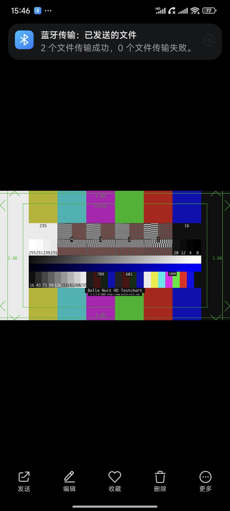

Received files are saved in the /tmp directory.

5\. The development board sends files

Similarly, OK3506-S/OK3506-C can send files to the mobile phone. The test method is as follows:

6\. OK3506-S/ OK3506-C development board sends files to the cell phone, the test method is as follows:

```plain
root@ok3506-buildroot:/# fltest_obexctl.sh 		            //Open obexctl
[NEW] Client /org/bluez/obex
[obex]# connect 14:99:3E:03:1B:E4													//Connect to the Bluetooth MAC that needs to communicate
Attempting to connect to 14:99:3E:03:1B:E4
[NEW] Session /org/bluez/obex/client/session0 [default]
[NEW] ObjectPush /org/bluez/obex/client/session0 
Connection successful
[14:99:3E:03:1B:E4]# send /tmp/1731915958275.png	        //Send files
```

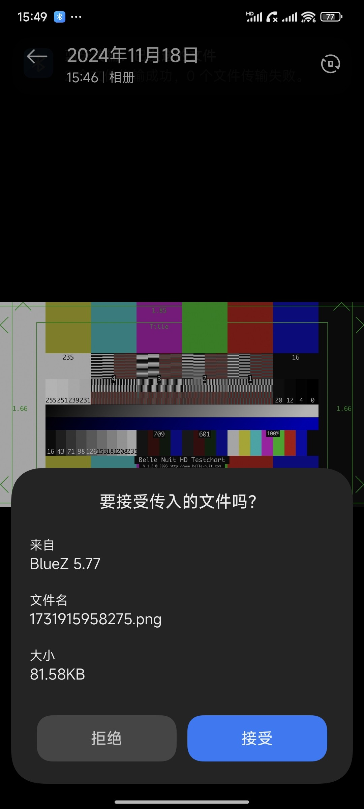

The phone will receive the incoming file request and click “Receive” to transfer the file.

### 4.17 4G Test

**Description:**

+ **When the IOT card is used for testing, confirm the firmware version of the module. If the lower version firmware is not supported, upgrade the EC20 firmware;**
+ **Some IoT cards require a dedicated account number and password when dialing, and users adjust the commands according to the situation;**
+ **The quectelCM --help command allows you to see the meaning of the relevant parameters.**

OK3506-S/OK3506-C supports the 4G module EC20. Before starting the development board, connect the 4G module and insert the SIM card to start the development board.

1\. After connecting the module and powering up the board and module, check the USB status through the lsusb command;

```plain
root@ok3506-buildroot:/# lsusb
Bus 002 Device 002: ID 1a40:0101
Bus 001 Device 001: ID 1d6b:0002
Bus 002 Device 003: ID 0781:5567
Bus 002 Device 005: ID 2c7c:0125	                   //The VID and PID of EC20
Bus 002 Device 001: ID 1d6b:0002
Bus 002 Device 004: ID 0bda:d723
```

View device node status under /dev

```plain
root@ok3506-buildroot:/# ls /dev/ttyUSB*
/dev/ttyUSB0  /dev/ttyUSB1  /dev/ttyUSB2  /dev/ttyUSB3
```

2\. After the equipment is successfully identified, the dial-up Internet access test can be conducted;

fltest\_quectel.sh calls quectelCM, see /usr/bin/fltest\_quectel.sh for specific commands.

```plain
root@ok3506-buildroot:/# fltest_quectel.sh &
```

Printing information is as follows:

```plain
[01-01_00:01:25:333] Quectel_QConnectManager_Linux_V1.6.0.15
[01-01_00:01:25:336] Find /sys/bus/usb/devices/2-1.1 idVendor=0x2c7c idProduct=0x125, bus=0x002, dev=0x005
[01-01_00:01:25:337] Auto find qmichannel = /dev/cdc-wdm0
[01-01_00:01:25:337] Auto find usbnet_adapter = wwan0
[01-01_00:01:25:337] netcard driver = qmi_wwan, driver version = 6.1.84
[01-01_00:01:25:338] ioctl(0x89f3, qmap_settings) failed: Operation not supported, rc=-1
[01-01_00:01:25:338] Modem works in QMI mode
[01-01_00:01:25:346] cdc_wdm_fd = 7
[01-01_00:01:25:444] Get clientWDS = 7
[01-01_00:01:25:476] Get clientDMS = 1
[01-01_00:01:25:508] Get clientNAS = 2
[01-01_00:01:25:540] Get clientUIM = 1
[01-01_00:01:25:572] Get clientWDA = 1
[01-01_00:01:25:604] requestBaseBandVersion EC20CEHDLGR06A09M1G
[01-01_00:01:25:732] requestGetSIMStatus SIMStatus: SIM_READY
[01-01_00:01:25:764] requestGetProfile[1] 3gnet///0
[01-01_00:01:25:796] requestRegistrationState2 MCC: 460, MNC: 1, PS: Attached, DataCap: LTE
[01-01_00:01:25:828] requestQueryDataCall IPv4ConnectionStatus: DISCONNECTED
[01-01_00:01:25:829] ifconfig wwan0 0.0.0.0
[01-01_00:01:25:848] ifconfig wwan0 down
[01-01_00:01:25:924] requestSetupDataCall WdsConnectionIPv4Handle: 0x86d87130
[01-01_00:01:26:053] ifconfig wwan0 up
[01-01_00:01:26:073] udhcpc -f -n -q -t 5 -i wwan0
udhcpc: started, v1.36.1
udhcpc: broadcasting discover
udhcpc: broadcasting discover
udhcpc: broadcasting discover
udhcpc: broadcasting discover
udhcpc: broadcasting discover
udhcpc: no lease, failing
[01-01_00:01:41:418] File:ql_raw_ip_mode_check Line:127 udhcpc fail to get ip address, try next:
[01-01_00:01:41:418] ifconfig wwan0 down
[01-01_00:01:41:436] echo Y > /sys/class/net/wwan0/qmi/raw_ip
[01-01_00:01:41:436] ifconfig wwan0 up
[01-01_00:01:41:452] udhcpc -f -n -q -t 5 -i wwan0
udhcpc: started, v1.36.1
udhcpc: broadcasting discover
udhcpc: broadcasting select for 10.144.135.194, server 10.144.135.193
udhcpc: lease of 10.144.135.194 obtained from 10.144.135.193, lease time 7200
[01-01_00:01:41:692] deleting routers
[01-01_00:01:41:751] adding dns 202.99.160.68
[01-01_00:01:41:753] adding dns 202.99.166.4
```

3\. Before testing, check the relevant configuration;

View Gateway Configuration.

```plain
root@ok3506-buildroot:/# route
Kernel IP routing table
Destination     Gateway         Genmask         Flags Metric Ref    Use Iface
default         bogon           0.0.0.0         UG    0      0        0 wwan0
10.144.135.192  *               255.255.255.252 U     0      0        0 wwan0
```

View DNS Configuration.

```plain
root@ok3506-buildroot:/# cat /etc/resolv.conf 
nameserver 119.29.29.29 # wlan0
nameserver 114.114.114.114 # wlan0
nameserver 202.99.160.68 # wwan0
nameserver 202.99.166.4 # wwan0
```

4\. After setting up DNS and routing, we can ping the domain name.

```plain
root@ok3506-buildroot:/# ping -i wwan0 www.baidu.com -c 3
ping: option argument contains garbage: wwan0
ping: this will become fatal error in the future
PING www.a.shifen.com (110.242.68.4) 56(84) bytes of data.
64 bytes from 110.242.68.4: icmp_seq=1 ttl=54 time=43.3 ms
64 bytes from 110.242.68.4: icmp_seq=2 ttl=54 time=36.2 ms
64 bytes from 110.242.68.4: icmp_seq=3 ttl=54 time=25.6 ms

--- www.a.shifen.com ping statistics ---
3 packets transmitted, 3 received, 0% packet loss, time 0ms
rtt min/avg/max/mdev = 25.608/35.042/43.322/7.277 ms, pipe 3, ipg/ewma 15.402/40.328 ms
```

### 4.18 Play/Record Test

OK3506-S/OK3506-C provides 1 x standard 3.5mm audio socket. Please insert the prepared earphone into the earphone interface before the playback test.

Recording can be done with either the headset microphone or the onboard microphone.

```plain
root@ok3506-buildroot:/# arecord -l
**** List of CAPTURE Hardware Devices ****
card 0: rockchipes8388 [rockchip-es8388], device 0: dailink-multicodecs ES8323 HiFi-0 [dailink-multicodecs ES8323 HiFi-0]
  Subdevices: 1/1
  Subdevice #0: subdevice #0
card 1: rockchipacodec [rockchip,acodec], device 0: ff4a8000.sai-rk3506-hifi rk3506-hifi-0 [ff4a8000.sai-rk3506-hifi rk3506-hifi-0]
  Subdevices: 1/1
  Subdevice #0: subdevice #0
root@ok3506 - buildroot:/# arecord -D hw:0,0 -d 5 -f cd -t wav test1.wav    // Record audio from the headphone microphone for 5 seconds and save it in WAV format
root@ok3506 - buildroot:/# aplay test1.wav   									// Play the recorded audio
root@ok3506 - buildroot:/# arecord -D hw:1,0 -d 5 -f cd -t wav test2.wav		// Record audio from the on - board microphone for 5 seconds and save it in WAV format
root@ok3506 - buildroot:/# aplay test2.wav   									// Play the recorded audio
```

### 4.19 LCD Backlight Adjustment

Backlight level range (0--255), maximum level 255, 0 indicating turn off. After connecting the mipi screen on the mipi dsi0, power up and start. Enter the system and enter the following command in the terminal to perform the backlight test.

1\. View the current screen backlight value:

```plain
root@ok3506-buildroot:/# cat /sys/class/backlight/backlight/brightness
200                                           			//The current backlight value is 200
```

2\. Backlight is off:

```plain
root@ok3506-buildroot:/# echo 0 > /sys/class/backlight/backlight/brightness
```

3\. LCD backlight is on:

```plain
root@ok3506-buildroot:/# echo 125 > /sys/class/backlight/backlight/brightness
```

### 4.20 CAN Test

The OK3506-S/OK3506-C platform has two CAN bus interfaces, and the CAN connection method is: The H terminal of CAN is connected with the H terminal of other CAN equipment; the L terminal of CAN is connected with the L terminal of other CAN equipment, and GND is connected with GND.

Short circuit CAN0 and CAN1, short circuit CAN1\_L and CAN0\_L, CAN1\_H and CAN0\_H, GND\_CAN1 and GND\_CAN0 pins in port P25, as shown in the figure:


Execute the following command in the development board terminal:

1\. View CAN network devices;

```plain
root@ok3506-buildroot:/# ifconfig -a
can0      Link encap:UNSPEC  HWaddr 00-00-00-00-00-00-00-00-00-00-00-00-00-00-00-00  
          NOARP  MTU:16  Metric:1
          RX packets:0 errors:0 dropped:0 overruns:0 frame:0
          TX packets:0 errors:0 dropped:0 overruns:0 carrier:0
          collisions:0 txqueuelen:10 
          RX bytes:0 (0.0 B)  TX bytes:0 (0.0 B)
          Interrupt:50 

can1      Link encap:UNSPEC  HWaddr 00-00-00-00-00-00-00-00-00-00-00-00-00-00-00-00  
          NOARP  MTU:16  Metric:1
          RX packets:0 errors:0 dropped:0 overruns:0 frame:0
          TX packets:0 errors:0 dropped:0 overruns:0 carrier:0
          collisions:0 txqueuelen:10 
          RX bytes:0 (0.0 B)  TX bytes:0 (0.0 B)
          Interrupt:51 
```

2\. Set CAN0 and CAN1 parameters;

```plain
root@ok3506-buildroot:/# ip link set can0 down
root@ok3506-buildroot:/# ip link set can1 down
root@ok3506-buildroot:/# ip link set can0 type can bitrate 1000000 sample-point 0.8 dbitrate 2000000 sample-point 0.8 fd on
root@ok3506-buildroot:/# ip link set can1 type can bitrate 1000000 sample-point 0.8 dbitrate 2000000 sample-point 0.8 fd on
```

Set the CAN0 and CAN1 baud rates to the 500000.

3\. Open CAN0, CAN1

```plain
root@ok3506-buildroot:/# ip link set can0 up
root@ok3506-buildroot:/# echo 4096 > /sys/class/net/can0/tx_queue_len
root@ok3506-buildroot:/# ip link set can1 up
root@ok3506-buildroot:/# echo 4096 > /sys/class/net/can1/tx_queue_len
```

4\. Client sending data; server receiving data.

The CAN0 device acts as a server (the server first executes the following command).

```plain
root@ok3506-buildroot:/# candump can0 &
```

CAN1 device as a client (sending data from the client)

```plain
root@ok3506-buildroot:/# cansend can1 1F334455#1122334455667788
can0  1F334455   [8]  11 22 33 44 55 66 77 88
```

### 4.21 SQLite3 Test

SQLite3 is a lightweight, ACID-compliant relational database management system with a low footprint. The OK3506-S/OK3506-C board is ported to version 3.44.2 of sqlit3.

```plain
root@ok3506 - buildroot:/# sqlite3
SQLite version 3.44.2 2023 - 11 - 24 11:41:44
Enter ".help" for usage hints.
Connected to a transient in - memory database.
Use ".open FILENAME" to reopen on a persistent database.
sqlite> create table tbl1 (one varchar(10), two smallint); // Create table tbl1
sqlite> insert into tbl1 values('hello!',10); // Insert data 'hello!|10' into table tbl1
sqlite> insert into tbl1 values('goodbye', 20); // Insert data 'goodbye|20' into table tbl1
sqlite> select * from tbl1; // Query the contents of table tbl1
hello!|10
goodbye|20
sqlite> delete from tbl1 where one = 'hello!'; // Delete data
sqlite> select * from tbl1; // Query the contents of table tbl1
goodbye|20
sqlite> .quit // Exit the database (or use the .exit command)
```

### 4.22 Adding Boot Scripts

Temporarily add a self-starting script.

1\. Modify/userdata/autorun.sh 

```plain
root@ok3506-buildroot:/# cat /userdata/autorun.sh
#! /bin/sh
# env

# user command

exit 0
```

2\. Reboot the board to verify

Add the boot self-start script to the burn image:

<font style="color:rgb(51, 51, 51);">Modify device/rockchip/common/extra-parts/userdata/normal/autorun.sh</font>.

Recompile the package and flash the image.

### 4.23 Uboot Menu

Press the space to enter the Uboot menu when the following message appears during the uboot startup process.

```plain
Hit key to stop autoboot('Spacebar'):  1
```

The number in front of each item in the menu is the corresponding operation command.

```plain
---------------------------------------------
0:Exit to console
1:Reboot
2:Display type:mipi 
---------------------------------------------
```

Enter 0 to access the Uboot shell

Enter 1 to reboot the board

Enter 2 to modify the display mode. Display type will be displayed cyclically in the "mipi" "rgb" "none" ".

```plain
MIPI: Display using MIPI interface, compatible with Forlinx 7 - inch capacitive touch 1024*600 MIPI screen.
RGB: Display using RGB interface, compatible with Forlinx 7 - inch capacitive touch 1024*600 LCD screen.
None: Turn off the display. 
```

After modifying through the Uboot menu, changes are automatically saved without the need for manual saving.

## 5. System Flashing

OK3506-S/OK3506-C development board currently supports the OTG flashing method. The appropriate flashing tool is provided in the user documentation.

### 5.1 OTG System Flashing

#### 5.1.1 OTG Driver Installation

Path: User Profile \\ Software Profile \\ 3-Tools \\ DriverAssitant \_ v5.13.zip

Extract the above path file to any directory and run it with administrator privileges

Open DriverInstall.exe

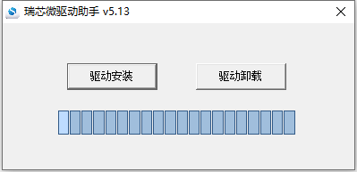

Click "Driver Installation”

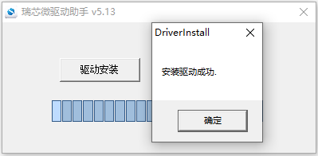

#### 5.1.2 OTG Full Burning Test

##### 5.1.2.1 RKDevTool Flashing Test

Path: User Information \\ Software Information \\ 3-Tools \\ \\RKDevTool\_v3.32\_for\_window.zip.

It is a development tool provided by Rockchip. Before use, please unzip it to a directory with an all English path. Connect the development board to the host using a Type-C cable. Press and hold the recovery key on the development board without releasing it, then press the reset key to reset the system. Release the recovery key approximately two seconds later. The Rockchip development tool will prompt the discovery of the loader device. There will be prompts on the Rockchip development tool : loader device found

**Note: The operation of the identification device is that the recovery button is pressed when the development board is powered on. Theoretically, Rockchip development tools have no requirements for the unzip directory. However, some users have feedback that the unzip directory should be in full English. If the tool doesn't match the following figure, please consider unzipping it in an English directory.**

Open the Rockchip development tool:

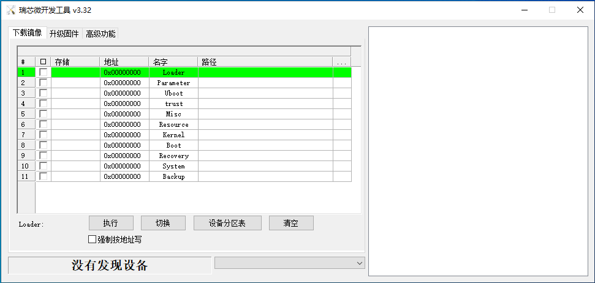

Click the "Upgrade Firmware" tab, click the "Firmware" button to select the full upgrade image update.img.

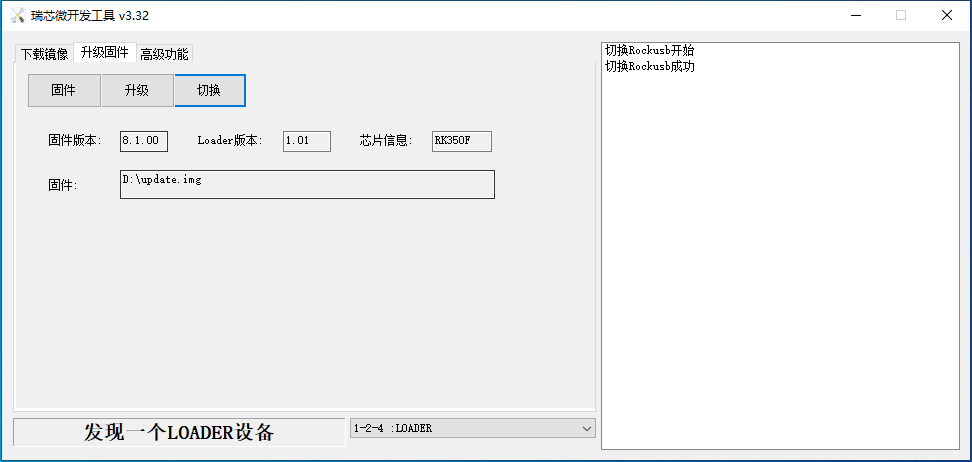

Click the "Upgrade" button to upgrade.

**Introduction to MASKROM mode**

If the loader is damaged and cannot enter the Loader mode, press and hold the red Maskrom key and then press the reset key to enter the maskrom mode for flashing.

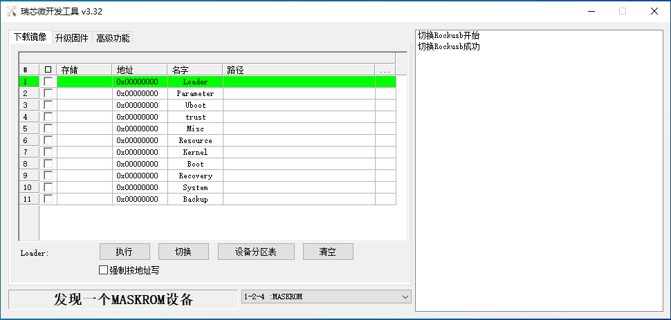

At this time, the system will prompt the discovery of a maskrom device. The flashing process is consistent with the loader mode, so it is best to use an update.img burning.

Note: Don't click "Device Partition Table" in maskrom mode, it is invalid.

Note: A separate burn in maskrom mode will not clear the UBOOT environment variables.

##### 5.1.2.2 Factory Tool Flashing Test

Factory Tool is a factory batch OTG flashing tool, which does not need to read the image and supports large file flashing. Use this tool if RKDevTool is not compatible. Before use, you need to decompress to the full English path, connect the development board to the host, press the recovery key, press the reset key to reset, and release the recovery key after two seconds. There will be prompts on the Rockchip development tool : loader device found

Note: The operation of the identification device is that the recovery button is pressed when the development board is powered on.

**<font style="color:rgb(51, 51, 51);">** Note: Theoretically, Rockchip development tools have no requirements for the unzip directory. However, some users have feedback that the unzip directory should be in full English. If the tool doesn't match the following figure, please consider unzipping it in an English directory.


Click to select the firmware, and click to start. At this time to recognize the loader device will automatically start burning.

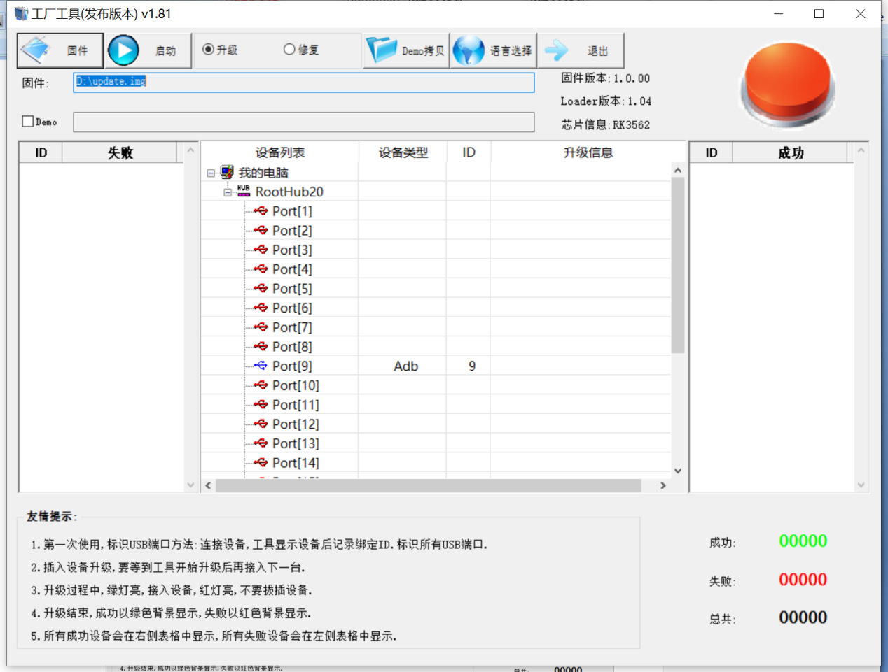


#### 5.1.3 OTG Step Programming Test

In the development phase, it is very time-consuming to burn all of them every time, so here is the method of using OTG burning tool to burn in separate partitions.

**Note: The operation of the identification device is that the recovery button is pressed when the development board is powered on.**

First, after the compilation is complete, a separate partition image can be found in the rockdev directory.

Take separate flashing boot. img (including device tree and startup logo) as an example to show the flashing method.

Use the Type-C cable to connect the development board to the host. Press and hold the recover key and do not release it. Then press the reset key to reset the system. Release the recover key after about two seconds. The system will prompt to discover the loader device.

Click the "Device Partition Table" button, which will automatically read the partition address, and prompt you to update the download address, click "Yes", will be reported to read the partition table successfully, click on the partition of the right test area to select the partition image, and check the partition.

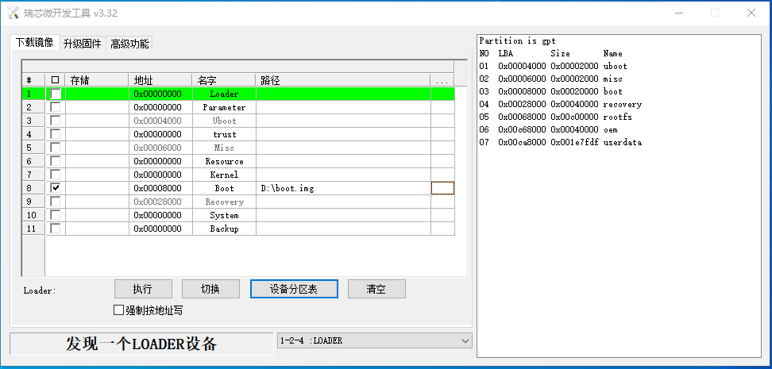

Clicking the "Execute" button will automatically burn and restart.</font> 