# Linux5.10.198\_User’s Compilation Manual\_V1.0

Document classification: □ Top secret □ Secret □ Internal information ■ Open

## Copyright

The copyright of this manual belongs to Baoding Folinx Embedded Technology Co., Ltd. Without the written permission of our company, no organizations or individuals have the right to copy, distribute, or reproduce any part of this manual in any form, and violators will be held legally responsible.

Forlinx adheres to copyrights of all graphics and texts used in all publications in original or license-free forms.

The drivers and utilities used for the components are subject to the copyrights of the respective manufacturers. The license conditions of the respective manufacturer are to be adhered to. Related license expenses for the operating system and applications should be calculated/declared separately by the related party or its representatives.

## Revision History

|  **Date**  | **User Manual Version** | **Revision History**                                         |
| :--------: | :---------------------: | ------------------------------------------------------------ |
| 29/04/2024 |          V1.0           | OK3562 User’s Compilation Manual (Version 1.0); Note: This Compilation Manual is only applicable to the OK3562 development board. |

## Overview

This manual is designed to enable you to quickly understand the compilation process of the products and familiarize yourself with the compilation methods of Forlinx products. The application program needs to be cross-compiled on the Linux operating system before it can run on the development board. According to the method in the compilation manual, users can compile their own software code through practical operation.

The manual will provide instructions for setting up the environment but there may be some unforeseen issues during the environment setup process. For beginners, it is recommended to use the pre-configured development environment provided by us. This will allow you to quickly get started and reduce development time.

Linux systems are typically installed in three ways: dual system on a real machine, single system on a real machine, and virtual machine. Different installation methods have their advantages and disadvantages. This manual only provides methods to build ubuntu in a virtual machine. 

Hardware requirements: It is recommended to have at least 16GB of memory or more, so that you can allocate some memory to run the virtual machine (the virtual machine is recommended to have more than 8GB) and still do other operations on Windows, otherwise it will affect the performance of Windows.

The manual is mainly divided into four chapters:

- Chapter 1. is mainly about the installation of VMware, and the version used is VMware® Workstation 15 Pro15.5.6. Please install VMware before using the ubuntu development environment;
- Chapter 2. mainly introduces the method of loading the ubuntu development environment provided by Forlinx, and the development environment is 64-bit ubuntu20.04;
- Chapter 3. mainly introduces the method of building a new ubuntu development environment; it uses 64 bit Ubuntu 20.04 as an example to describe the creation process of Ubuntu. Due to different computer configurations, unexpected problems may arise during the setup process. It is recommended for beginners to use the environment that we have set up directly;
- Chapter 4. mainly introduces the methods of compiling the source code related to the development board.

A description of some of the symbols and formats associated with this manual:

| **Format**                                                   | **Meaning**                                                  |
| ------------------------------------------------------------ | ------------------------------------------------------------ |
| **Note**                                                     | Note or information that requires special attention, be sure to read carefully. |
| 📚                                                            | Relevant notes on the test chapters                          |
| 🛤️                                                            | Indicates the related path                                   |
| <font style="color:blue;">Blue font on gray background</font> | Refers to commands entered at the command line (Manual input required). |
| Black font on gray back ground                               | Serial port output message after entering a command          |
| **Bold black**                                               | Key information in the serial port output message            |
| <font style="color:#000000;">//</font>                       | Interpretation of input instructions or output information   |
| Username@Hostname                                            | root@ok3562: development board serial port login account information;<br />forlinx @rk3562: development board network login account information;<br />forlinx @ Ubuntu: development environment Ubuntu account information.<br />You can determine the environment for function operation through this information. |

Example: After packaging the file system, use ls to view the operation of the generated file.

```plain
forlinx@ubuntu:~/work$ ls                           //List the files in this directory
OK3562-linux-source  OK3562-linux-source.tar.bz2
```

- forlinx@ubuntu: the username is forlinx and the hostname is ubuntu, indicating that the operation is performed in the development environment ubuntu;

- // : Explanation of the instruction, no input required;

- <font style="color:#0000FF;"><font style="color:blue;background-color:#e5e5e5;">ls</font></font>: Blue font on a gray background indicates the relevant commands that need to be entered manually;

- **OK3562-linux-source**: Black font is the output information after entering the command; bold font is the key information; here is the packaged file system.

## 1\. VMware Virtual Machine Software Installation

This chapter mainly introduces the installation of VMware virtual machines, using VMware Workstation 15 Pro v15.5.6 as an example to demonstrate the installation and configuration process of the operating system.

### 1.1 VMware Software Downloads and Purchase

Go to the VMware website https://www.vmware.com/cn.html to download Workstation Pro and get the product key. VMware is a paid software that requires purchasing, or you can choose to use a trial version.


After the download is complete, double-click the installation file to start the installation program.

### 1.2 VMware Software Installation

Double-click the startup program to enter the installation wizard.


Click on "Next".


Check the terms in the license agreement that I accept, then click "Next".


Modify the installation location to the partition where you want to install the software on your computer, then click '"Next".


Check and click on "Next".


Check the box to add a shortcut, then click "Next".


Click "Installation".


Wait for the installation to complete.


Click "Finish" to try it out. If users need to use it for a long time, they need to buy it from the official and fill in the license.

## 2\. Loading the Existing Ubuntu Development Environment

**Note:**

+ **It is recommended for beginners to directly use the pre-built virtual machine environment provided by Forlinx, which already includes installed cross-compiler and Qt environment. After understanding this chapter, you can directly jump to the compilation chapter for further study;**
+ **The development environment provided for general users is: forlinx (username), forlinx (password). The superuser is: root (username), root (password);**
+ **Please ask your sales representative for the download link.**

There are two ways to use a virtual machine environment in VMware: one is to directly load an existing environment, and the other is to create a new environment. First talk about how to load an existing environment.

First, download the development environment provided by Forlinx. There is an MD5 verification file in the development environment data. After downloading the development environment data, first performs MD5 verification on the compressed package of the development environment (the tool for viewing the MD5 code on windows: 02-User Data \\ Software Data \\ 04-Tool \\ md5sums-1.2.zip). Check whether the verification code is consistent with the verification code in the verification file. If they are consistent, the downloaded file is normal; otherwise, the file may be damaged and needs to be downloaded again.


Select all compressed files, right-click and extract to the current folder or your own directory:

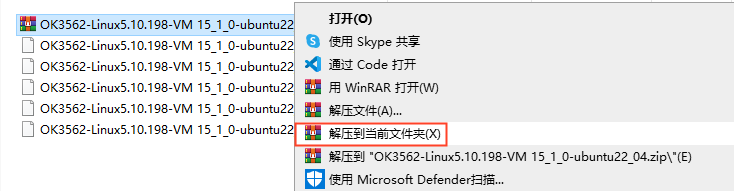

After unzipping, you will get the folder "3568 Development Environment".

**Note: The Ubuntu 22.04 development environment for 3562 and 3568 is the same.**

The file 3568. vmx in the 3568 Development Environment folder is the file that the virtual machine needs to open.

Open the installed virtual machine.


Select the directory where the newly decompressed "3568. vmx" file is located, double-click to open the startup file.

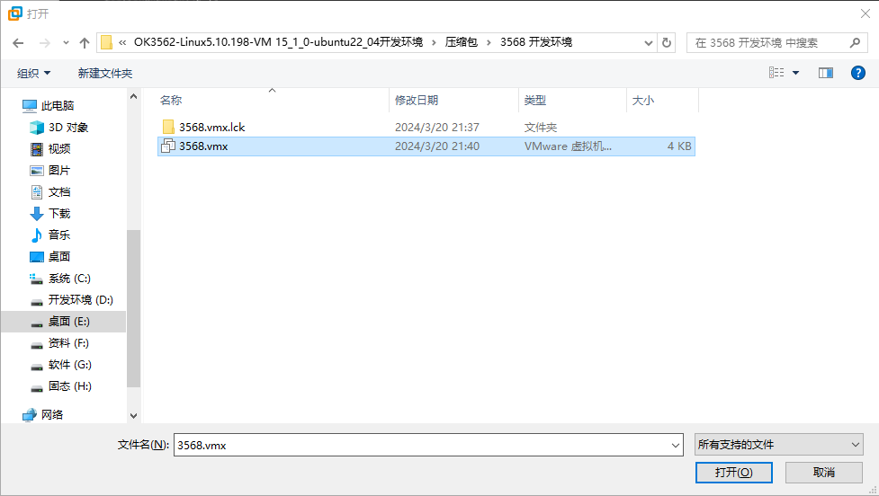

Turn on this virtual machine after loading is complete to run it and enter the system's interface.


The default login account for automatic login in the development environment is "forlinx".

## 3\. New Ubuntu Development Environment Setup

**Note: Beginners are not recommended to set up a system on their own. It is recommended to use an existing virtual machine environment. If you do not need to set up the environment, you can skip this section.**

This chapter mainly explains the process of setting up the Ubuntu system and installing Qt Creator. If the user is not using Qt, the installation of Qt Creator can be ignored.

### **3.1 Ubuntu System Setup**

The version of Ubuntu we chose to install is 22.04, and the introduction and development in this maual are all carried out on Ubuntu22.04. First, go to the Ubuntu official website to get the Ubuntu 22.04 64 bit image. The download address is https://releases.ubuntu.com/22.04/

Download "Ubuntu-22.04.6-desktop-amd64.iso" (you can download the version that you actually need; this is just an example with 22.04.6).

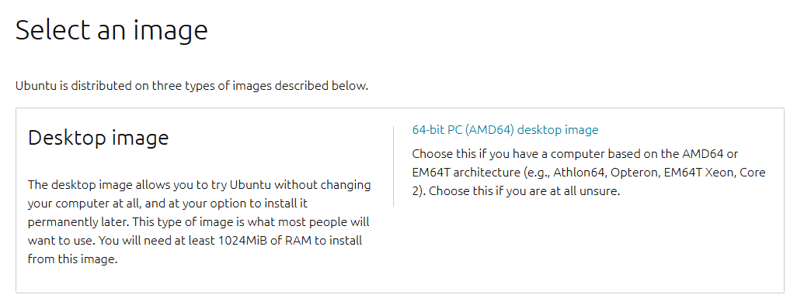

#### **3.1.1 Ubuntu Virtual Machine Setup**

Step 1: Open the VMware software and click on "Create New Virtual Machine". Enter the following interface, check "Customize (Advanced)" and click "Next":

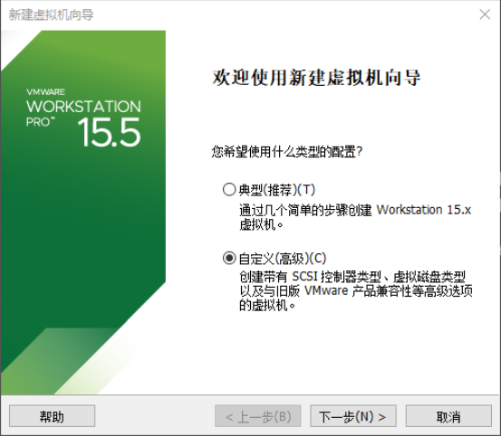

Step 2: Select the compatibility of the corresponding VMware version. The version can be viewed in Help-> About VMware Workstation. Click "Next" after confirmation:


Select “Install program from disc image file”, then click ''Next''；


Enter full name, user name and password and click "Next":


Enter the virtual machine name and configuration installation location, and click "Next":


To configure the number of cores, click "Next":


To configure at least 8GB of memory, select ''Next'':


Set the network type, use the default NAT form for networking, and click "Next". Keep the default values for the remaining steps until you reach the step to specify the disk capacity.


Using the recommended I/O controller, click "Next":


Using the recommended disk type, click "Next":


Using the default options, create a new virtual disk and click "Next":


Allocate a disk size of 200G and divide the virtual disk into multiple files, and click "Next":

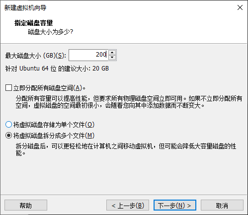

Click "Next" by default:


Click "Finish":


The virtual machine creation is now complete.

Then click "Open this virtual machine" to start installing the image and wait patiently.

The ubuntu system installation is complete.

#### **3.1.2 Ubuntu Basic Configuration**

##### 3.1.2.1 VMware Tools Installation 

VMware Tools will be installed automatically after the virtual machine is created. If it is not successful, follow the steps below.

If you do not install the tool, you cannot use copy-paste file drag and drop between the Windows host and the virtual machine.

First click on "Virtual Machine" on the VMware navigation bar, then click "Install VMware Tools" in the drop-down box.


Once done, enter Ubuntu and the VMware Tools CD will appear on your desktop and click into it.


Enter and see a compressed file VMwareTools-10.3.10-12406962.tar.gz (it may be different for different VM versions); copy the file under the home directory (i.e. the directory with the home personal username)


Press \[Ctrl+Alt+T] to bring up the Terminal Command Interface and enter the command:

```plain
forlinx@ubuntu:~$ sudo tar xvf VMwareTools-10.3.10-12406962.tar.gz
```


After the extraction is complete, a file named “vmware-tools-distrib" will appear.

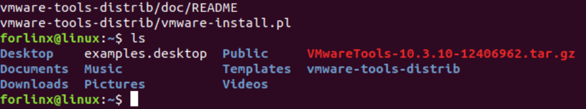

Go back to the terminal and type cd vmware-tools-distrib to enter the directory.

Enter: sudo ./vmware-install.pl followed by pressing Enter. Then, enter your password and the installation process will begin. When prompted, you can input "yes" and press Enter to proceed. For any other inquiries, simply press Enter to go with the default installation settings.


Once the VMware tools is complete, we can implement file copy and paste between Windows and Ubuntu.

##### 3.1.2.2 Virtual Machine Full Screen Display

If the virtual machine is not able to be displayed in full screen, you can resolve this issue by clicking on "View" and selecting "Autofit Guest." This will adjust the display to fit the screen automatically, enabling you to have a full-screen experience in the virtual machine.


Make most of the system settings in the location shown. A lot of the setup requirements on Ubuntu can be done here.

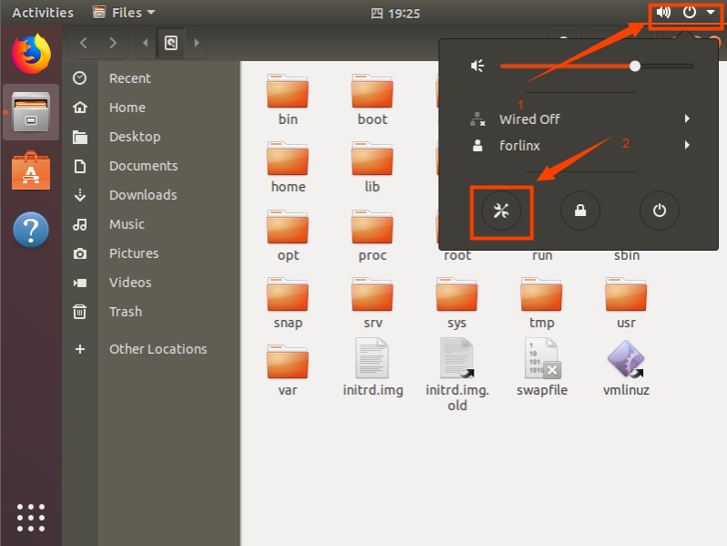

##### 3.1.2.3 Virtual Machine Hibernation Settings

Also, the default hibernation is 5min, if you don't want to set hibernation, just set it to Never by setting Power->Blank screen.

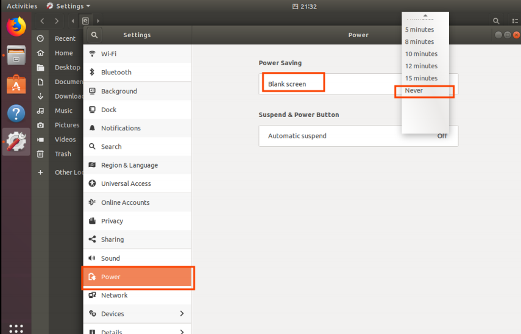

#### 3.1.3 VM Swapfile Settings

The memory allocated when creating the virtual machine is 8GB. If the 8GB memory is not enough during compilation, the size of the swapfile needs to be modified.

```plain
forlinx@ubuntu:~$ sudo swapoff /swapfile
forlinx@ubuntu:~$ sudo dd if=/dev/zero of=/swapfile bs=1M count=16384
forlinx@ubuntu:~$ sudo mkswap /swapfile
forlinx@ubuntu:~$ sudo swapon /swapfile
```

#### 3.1.4 Virtual Machines Network Settings

##### 3.1.4.1 NAT Connection Method

By default, after the virtual machine is installed, the network connection method is set to NAT, which shares the host machine's IP address. This configuration does not need to be changed when performing tasks like installing dependencies or compiling code.

When the VMware virtual NIC is set to NAT mode in a virtual machine, the network in the Ubuntu environment can be set to dynamic IP. In this mode the virtual NAT device and the host NIC are connected to communicate for Internet access. This is the most common way for our VM to access the external network.


##### 3.1.4.2 Connections for Bridges

When the VMware virtual NIC device is in bridge mode, the host NIC and the virtual machine NIC communicate through the virtual bridge, and the network IP and the host need to be set in the same network segment in the Ubuntu environment. If accessing an external network, you need to set the DNS to be consistent with the host NIC. If TFTP, SFTP and other servers are used, the network contact mode of the virtual machine needs to be set as the bridge mode.


### 3.2 Toolkit Installation

To install the necessary toolkit for compilation, please execute the following command to install it, and make sure that the network can be used normally and you can access the external network before installation:

```plain
forlinx@ubuntu:~$ sudo apt-get update
forlinx@ubuntu:~$ sudo apt-get install openssh-server vim git fakeroot make automake autoconf libtool libssl-dev bc dosfstools mtools parted iproute2 kmod libyaml-dev device-tree-compiler python-pip flex bison build-essential u-boot-tools libncurses-dev lib32stdc++6 lib32z1 libc6:i386 e2fsprogs scons libgmp-dev libmpc-dev
```

### 3.3 Qt Creator Installation

 **Path: 02-User Information\\01-Software Information\\04-Tools\\qt-opensource-linux-x64-5.12.9.run**

Copy qt-opensource-linux-x64-5.12.9.run to any directory under the home directory of the current user, and execute:

```plain
forlinx@ubuntu:~$ chmod 777 qt-opensource-linux-x64-5.12.9.run
forlinx@ubuntu:~$ ./qt-opensource-linux-x64-5.12.9.run
```

The following interface will pop up. Click "Next" to enter the next step:


Click "Next" to go to the next step:

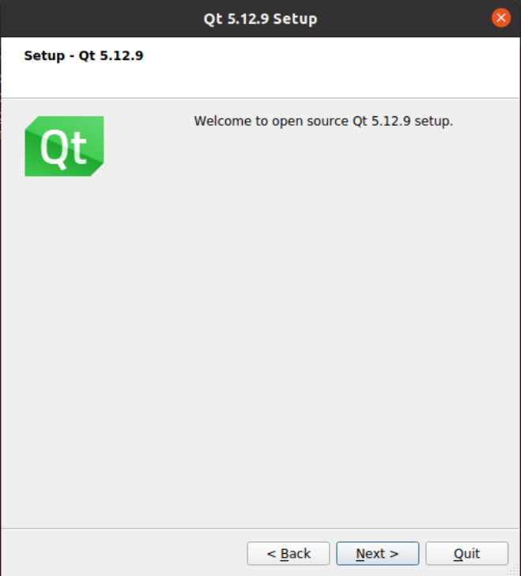

In the following interface, click "Browse..." to select the installation path of Qtcreator, after the selection is complete, click "Next" to enter the next step:


In the following screen, click "Next" to the next step:

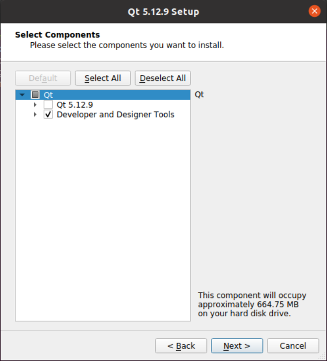

Agree to the agreement and click "Next":


Click "Install" to install:

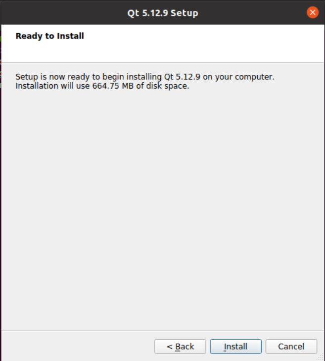

After the installation is completed, the following interface will be displayed. Uncheck the option "Launch Qt Creator" "and click" Finish "to complete the installation steps of Qt Creator:


Go to the /home/forlinx/Qt5.12.9/Tools/QtCreator/bin/ directory of the actual qtcreator installation directory:

```plain
forlinx@ubuntu:~$ cd /home/forlinx/Qt5.12.9/Tools/QtCreator/bin/
```

Start Qt Creator：

```plain
forlinx@ubuntu: ~/Qt5.12.9/Tools/QtCreator/bin $ sudo ./qtcreator
[sudo] password for forlinx: forlinx                    //Enter the password for the forlinx user, no display
QStandardPaths: XDG_RUNTIME_DIR not set, defaulting to '/tmp/runtime-root'
QStandardPaths: XDG_RUNTIME_DIR not set, defaulting to '/tmp/runtime-root'
```


The Qt Creator tool screen appears. Qt Creator is installed.

### 3.4 Qt Compilation Environment Configuration

Path: 02-User Information\\01-Software Information\\04-Tools\\aarch64-buildroot-linux-gnu\_sdk-buildroot.tar.gz.

The aarch64-buildroot-linux-gnu\_sdk-buildroot.tar.gz contains the libraries and cross-compilation tools needed to compile Qt programs, configured as follows:

1\. Unzip the compilation environment zip;

Because the qmake tool depends on local paths, this toolkit can only be placed in a fixed path: /opt/.

Unzip the tool kit

```plain
forlinx@ubuntu:~$ sudo tar -xf aarch64-buildroot-linux-gnu_sdk-buildroot.tar.gz -C /opt/
forlinx@ubuntu:~$ cd /opt/aarch64-buildroot-linux-gnu_sdk-buildroot
forlinx@ubuntu: /opt/aarch64-buildroot-linux-gnu_sdk-buildroot $ sudo ./relocate-sdk.sh
```

2\. Qt Creator environment configuration

First open the Qt Creator software.

Execute:

Enter the qtCreator actual installation directory/home/forlinx/Qt5.12.9/Tools/QtCreator/bin/directory:

```plain
forlinx@ubuntu:~$ cd /home/forlinx/Qt5.12.9/Tools/QtCreator/bin/
```

Start Qt Creator：

```plain
forlinx@ubuntu: ~/Qt5.12.9/Tools/QtCreator/bin $ sudo ./qtcreator
[sudo] password for forlinx: forlinx        //Enter the password for the forlinx user, no display
QStandardPaths: XDG_RUNTIME_DIR not set, defaulting to '/tmp/runtime-root'
QStandardPaths: XDG_RUNTIME_DIR not set, defaulting to '/tmp/runtime-root'
```

Start the Qt Creator program and click on the Tools->option:


Enter the Options interface, click "Kits" on the left side, then click the "Compilers" tab in the upper center, and click "Add->GCC->C++" on the right side, as shown in the figure:


Find "aarch64-linux-g + +" under/opt/aarch64-buildroot-linux-gnu \_ sdk-buildroot/bin, select it, click Open, and modify the Name.

Follow the same method to add GCC compiler and click "Add->GCC->C" on the right side; as shown in the figure:


Find "aarch64-linux-gcc" under opt/aarch64-buildroot-linux-gnu\_sdk-buildroot/bin, select it, click Open, and modify the Name

Click the Qt Versions tab and click "Add":


Find qmake in the directory of/opt/aarch64-buildroot-linux-gnu \_ sdk-buildroot/bin. Select it and click Open. After it is added, the interface shown below is displayed. Click “Apply”.

Click on the Kits tab and click Add on the right to add a new Kits; modify the content according to the figure below and click "Apply".


## 4\. Related Code Compilation

This chapter mainly describes the compiling method of the source code related to the development board, including the kernel source code compilation and the application program compilation.

### 4.1 Preparation Before Compilation

#### 4.1.1 Description of the Environment

+ Development environment OS: Ubuntu22.04 64 bit version
+ Cross-toolchain: aarch64-linux-gnu
+ The board uses the Bootloader version: u-boot-2017.09.
+ Development Board Kernel: Linux-5.10.198
+ Development board porting QT version: qt5.15.10

#### 4.1.2 Source Code Copy

 Program source code: 01 Software Documentation \\ 03- Images and source code \\ 02- Source code \\ OK3562-linux-source.tar.bz2

Create a working directory

```plain
forlinx@ubuntu:~$ mkdir -p /home/forlinx/work				//Create the working directory in order
```

Copy the source file OK3562-linux-source.tar.bz2.\* from the user profile to the virtual machine /home/forlinx/3562 directory.

```plain
forlinx@ubuntu:~$ cd /home/forlinx/work														//Switch to the working directory
forlinx@ubuntu:~/work$ cat OK3562-linux-source.tar.bz2.* > OK3562-linux-source.tar.bz2
forlinx@ubuntu:~/work$ tar -xvf OK3562-linux-source.tar.bz2				//Unzip the compressed package in the natural location
```

Just run the command and wait for it to complete.

### 4.2 Compilation

**Note:**

+ **After the kernel source code is decompressed for the first time, the source code needs to be compiled as a whole;**
+ **After compiling as a whole, you can compile separately according to the actual situation;**
+ **Complete SDK compilation process.**

#### 4.2.1 Full Compilation Test

In the source code path, the compilation script build. Sh is provided. Run the script to compile the entire source code. You need to switch to the decompressed source code path at the terminal and find the build. Sh films

```plain
forlinx@ubuntu:~$ cd /home/forlinx/work/OK3562-linux-source
```

The following operations need to be done in the source directory to compile the kernel methods:

```plain
forlinx@ubuntu: ~/work/OK3562-linux-source$./build.sh all
```

After execution there will be options to enter as shown below, enter 2 and press enter to continue.

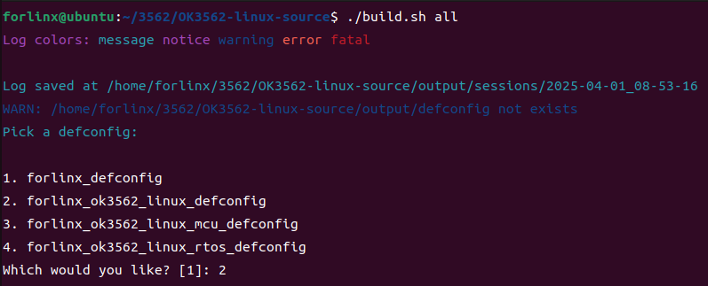

**Note: If the above options do not appear, then the configuration has been completed and can be compiled normally, it is not required.**

After successful compilation, the corresponding image file will be generated in the rockdev folder.


**Note: The update. img is packaged for full programming of OTG or TF card, and other files are programmed step by step.**

#### 4.2.2 Individual Compilation Tests

Full compilation is required before individual compilation, which is done under the kernel source path.

```plain
# Configure the SDK
forlinx@ubuntu: ~/work/OK3562-linux-source$ ./build.sh defconfig:forlinx_ok3562_linux_defconfig       

# Generate uboot.img. The generated path is u-boot/uboot.img
forlinx@ubuntu: ~/work/OK3562-linux-source$ ./build.sh uboot

# Generate boot.img. The generated path is kernel/boot.img
forlinx@ubuntu: ~/work/OK3562-linux-source$ ./build.sh kernel 

# Generate rootfs.img. The generated path is buildroot/output/OK3562_Linux/image/rootfs.ext2
forlinx@ubuntu: ~/work/OK3562-linux-source$ ./build.sh rootfs

# Use uboot.img, boot.img, and rootfs.ext2 from the above paths to generate update.img. The path is rockdev/update.img 
forlinx@ubuntu: ~/work/OK3562-linux-source$ ./build.sh updateimg
```

After successful compilation, the kernel in update.img does not update. Please burn the corresponding files step by step, or regenerate the update. img.

If you need to configure the kernel via a graphical configuration interface, you can directly execute the following command:

```diff
forlinx@ubuntu: ~/work/OK3562-linux-source$ ./build.sh kconfig
```

After completing the configuration in the pop-up graphical interface, save and exit, and the new configuration will automatically generate a new OK3562 \_ Linux \_ defconfig.

#### 4.2.3 Clearance of Files Generated by the Compilation

**Note: There is no open source for uboot, only image. **

```plain
forlinx@ubuntu: ~/work/OK3562-linux-source$ ./build.sh clean:kernel    		#Clear kernel
forlinx@ubuntu: ~/work/OK3562-linux-source$ ./build.sh clean:rootfs   		#Clear rootfs
forlinx@ubuntu: ~/work/OK3562-linux-source$ ./build.sh clean:recovery  		#Clear recovery
```

### 4.3 Image File Use

The update. img is packaged for full programming of OTG or TF card, and other files are programmed step by step. The \*.img file generated by separate compilation will not be updated in the update. img file, and it needs to be burned by single-step burning (see User's Manual OTG Burning for details).

### 4.4 Application Compilation and Operation

The test program in the SDK is compiled by buildroot by default, and can also be compiled directly. The following describes the method of direct compilation.

#### 4.4.1 Command Line Application Compilation and Operation

This subsection uses the watchdog test program, the default program is copied to the /home/forlinx/3562 directory.

1\. Use the cd command to enter the /home/forlinx/work directory;

```plain
forlinx@ubuntu:~$ cd work/OK3562-linux-source/app/forlinx/forlinx_cmd_demo/fltest_watchdog
```

2\. Add the cross-compiler path and use make to cross-compile.

```plain
forlinx@ubuntu: ~/work/OK3562-linux-source/app/forlinx/forlinx_cmd_demo/fltest_watchdog$ export PATH=/opt/aarch64-buildroot-linux-gnu_sdk-buildroot/usr/bin:$PATH
forlinx@ubuntu: ~/work/OK3562-linux-source/app/forlinx/forlinx_cmd_demo/fltest_watchdog$ make
aarch64-linux-gnu-gcc fltest_watchdog.c -o fltest_watchdog
fltest_watchdog make finish!!!
```

Use the file command to view the generated file information

```plain
forlinx@ubuntu:~/work/OK3562-linux-source/app/forlinx/forlinx_cmd_demo/fltest_watchdog$ file fltest_watchdog 
fltest_watchdog: ELF 64-bit LSB shared object, ARM aarch64, version 1 (SYSV), dynamically linked, interpreter /lib/ld-linux-aarch64.so.1, for GNU/Linux 3.7.0, not stripped
```

From the result, you can see that the compiled 64-bit ARM file.

3\. Copy the fltest \_ watchdog generated by compiling to the board through U disk or FTP, for example, under the/forlinx path. Take the TF card as an example, and copy it to the development board and run the test.

```plain
[root@OK3562:/]# cp /run/media/mmcblk1p1/fltest_watchdog /
[root@OK3562:/]# /fltest_watchdog
Usage: fltest_watchdog [-t <timeout>] [-c] [-d/-e]
  -t --timeout   set timeout (default 10), range ( 1 - 16)
  -c --continue  enable watchdog with feed dogs
  -d --disable   disable watchdog, conflict with enable
  -e --enable    enable watchdog, conflict with disable
```

4\. Refer to the chapter "Watchdog Test" in the user's manual for the test;

#### 4.4.2 QT Application Compilation and Operation

Open Qt Creator in the development environment (users open it according to their actual path). Click File-\&gt; Open File or Project in Qt Creator, a pop-up window will appear, select ~/forlinx\_qt\_demo/fltest\_qt\_watchdog/fltest\_qt\_watchdog.pro

Select OK3562 cross-compilation toolchain, click Configure Project, the specific cross-compilation toolchain configuration refer to“3.4 Qt Compilation Environment Configuration”.

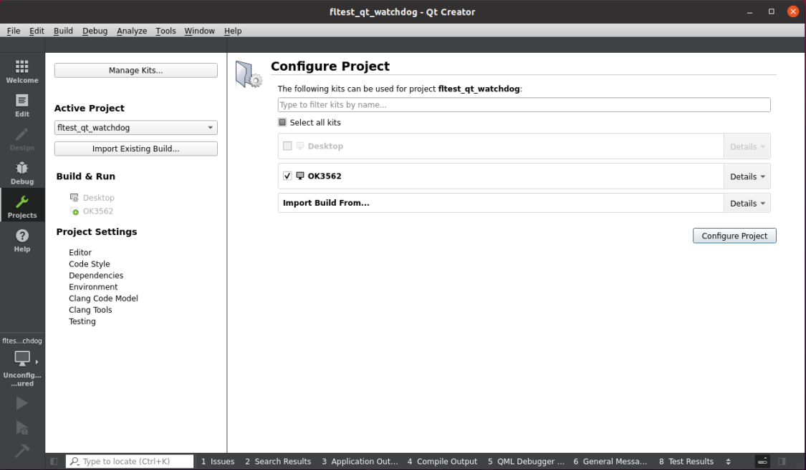

Click the Projecet option on the left and uncheck Shadow build.

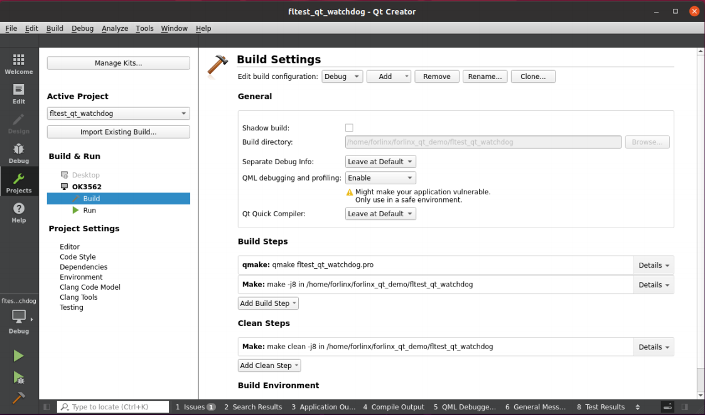

Then click Build-> Build all Projects in the menu bar to compile.


After the progress bar in the bottom right corner reaches completion, indicating the compilation is finished, you will see the newly generated binary file “fltest\_qt\_watchdog” in the directory ~/forlinx\_qt\_demo/fltest\_qt\_watchdog.


Copy the compiled fltest\_qt\_watchdog to the development board to run the test.