# Android11.0\_User’s Compilation Manual\_V2.0

Document classification: □ Top secret □ Secret □ Internal information ■ Open

## Copyright

The copyright of this manual belongs to Baoding Folinx Embedded Technology Co., Ltd. Without the written permission of our company, no organizations or individuals have the right to copy, distribute, or reproduce any part of this manual in any form, and violators will be held legally responsible.

Forlinx adheres to copyrights of all graphics and texts used in all publications in original or license-free forms.

The drivers and utilities used for the components are subject to the copyrights of the respective manufacturers. The license conditions of the respective manufacturer are to be adhered to. Related license expenses for the operating system and applications should be calculated/declared separately by the related party or its representatives.

## Overview

This manual is designed to enable you to quickly understand the compilation process of the products and familiarize yourself with the compilation methods of Forlinx products. The application program needs to be cross-compiled on the Linux operating system before it can run on the development board. According to the method in the compilation manual, you can compile your own software code through practical operation.

The manual will provide instructions for setting up the environment but there may be some unforeseen issues during the environment setup process. For beginners, it is recommended to use the pre-configured development environment provided by us. This will allow you to quickly get started and reduce development time.

Linux systems are typically installed in three ways: dual system on a real machine, single system on a real machine, and virtual machine. Different installation methods have their advantages and disadvantages. This manual only provides methods to build ubuntu in a virtual machine.

Hardware requirements: It is recommended to have at least 6GB of memory or more, so that you can allocate some memory to run the virtual machine (the virtual machine is recommended to have more than 2GB) and still do other operations on Windows, otherwise it will affect the performance of Windows.

The manual is mainly divided into four chapters:

+ Chapter 1. is mainly about the installation of VMware, and the version used is VMware Workstation 15 Pro15.1.0. You need to install VMware before using the ubuntu development environment;
+ Chapter 2. mainly introduces the method of loading the ubuntu development environment provided by Forlinx, and the development environment is 64-bit ubuntu18.04;
+ Chapter 3. mainly introduces the method of building a new ubuntu development environment; This section uses 64-bit Ubuntu 18.04 as an example to describe the creation of Ubuntu. Due to different computer configurations, there may be unexpected problems in the building process. It is recommended that beginners directly use the environment we have built.
+ Chapter 4. mainly introduces the methods of compiling the source code related to the development board.

A description of some of the symbols and formats associated with this manual:

|                          **Format**                          | **Meaning**                                                  |
| :----------------------------------------------------------: | ------------------------------------------------------------ |
|                           **Note**                           | Note or information that requires special attention, be sure to read carefully. |
|                              📚                               | Relevant notes on the test chapters.                         |
|                              🛤️                               | Indicates the related path.                                  |
| <font style="color:blue;">Blue font on gray background</font> | Refers to commands entered at the command line (Manual input required). |
|                          Black font                          | Serial port output message after entering a command.         |
|                        **Bold black**                        | Key information in the serial port output message.           |
|            <font style="color:#000000;">//</font>            | Interpretation of input instructions or output information.  |
|                      Username@Hostname                       | root@ok3568: development board serial port login account information;<br/>forlinx @rk3568: development board network login account information;<br/>forlinx @ Ubuntu: development environment Ubuntu account information.<br/>You can determine the environment for function operation through this information. |

<font style="color:#000000;">After packaging the file system, you can use the “ls” command to view the generated files.</font>

```plain
forlinx@ubuntu:~/3568$ ls                              //List the files in this directory
OK3568-linux-source  OK3568-linux-source.tar.bz2
```

+ forlinx@ubuntu: the username is forlinx and the hostname is ubuntu, indicating that the operation is performed in the development environment ubuntu.
+ //: Explanation of operation commands is required, but command input is not needed.
+ <font style="color:#0000FF;"><font style="color:blue;background-color:#e5e5e5;">ls</font></font>: blue font on a gray background, indicating relevant commands that need to be entered manually.
+ **OK3568-linux-source:** Black font is the output information after entering the command; bold font is the key information; here is the packaged file system.

## Revision History

| **Date2**  | **User Manual Version** | **Revision History**                                         |
| :--------: | :---------------------: | ------------------------------------------------------------ |
| 27/05/2022 |          V1.0           | OK3568-C\_Android User’s Compilation Manual Initial Version;<br/>**Note: This compilation manual is only applicable to OK3568 development board of Forlinx.** |
| 22/02/2023 |          V1.1           | 1. Deleting the description of docker in the manual;<br/>2. Modifying the compiler configuration memory from 8g to 16g;<br/>3. Fixing the description of compiling and burning the kernel separately. |
| 21/05/2024 |          V2.0           | Adding FET3568-C2 SoM.                                       |

## 1\. VMware Virtual Machine Software Installation

This chapter mainly introduces the installation of VMware virtual machines, using VMware Workstation 15 Pro v15.1.0 as an example to demonstrate the installation and configuration process of the operating system.

### 1.1 VMware Software Downloads and Purchase

Go to the VMware website https://www.vmware.com/cn.html to download Workstation Pro and get the product key. VMware is a paid software, you need to buy it yourself, or use the trial version provided by VMware.


After the download is complete, double-click the installation file to start the installation program.

### 1.2 VMware Software Installation

Double-click the startup program to enter the installation wizard.


Click on "Next".


Check the terms in the license agreement that I accept, then click "Next".


Modify the installation location to the partition where you want to install the software on your computer, then click '"Next".


Check and click on "Next".


Check the box to add a shortcut, then click "Next".


Click "Installation".


Wait for the installation to complete.


Click "Finish" to try it out. If users need to use it for a long time, they need to buy it from the official and fill in the license.

## 2\. Loading the Existing Ubuntu Development Environment

**Note:**

+ **It is recommended for beginners to directly use the pre-built virtual machine environment provided by Forlinx, which already includes installed cross-compiler and Qt environment. After understanding this chapter, you can directly jump to the compilation chapter for further study;**
+ **The development environment provided is: forlinx (username), forlinx (password).**

There are two ways to use a virtual machine environment in VMware: one is to directly load an existing environment, and the other is to create a new environment. Let's first talk about how to load an existing environment.

First, download the development environment provided by Forlinx. In the development environment documentation, there should be an MD5 checksum file. After downloading the development environment, you should verify the integrity of the compressed package using the MD5 checksum. (You can use an on-line MD5 checksum tool or download a specific MD5 checksum tool for this purpose). To check if the checksum in the verification file matches the checksum of the file itself. If they match, the file download is successful. If they don't match, it suggests that the file may be corrupt, and you should consider downloading it again.

Select the zip file to unzip together


After decompression, a 3568 standard environment folder appears, where .vmx is the file that the virtual machine needs to open.

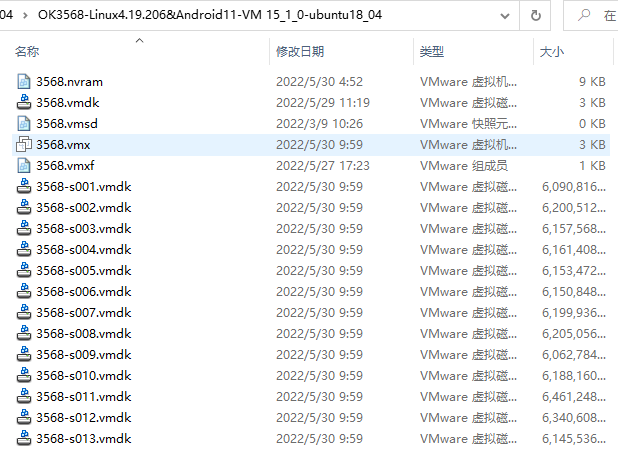

Open the virtual machine and select the extracted 3568.vmx.


Turn on this virtual machine after loading is complete to run it and enter the system's interface.

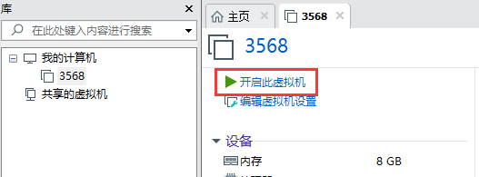


Development environment account is: forlinx, and the password is: forlinx. After filling in the password, select "Sign In" to log in.


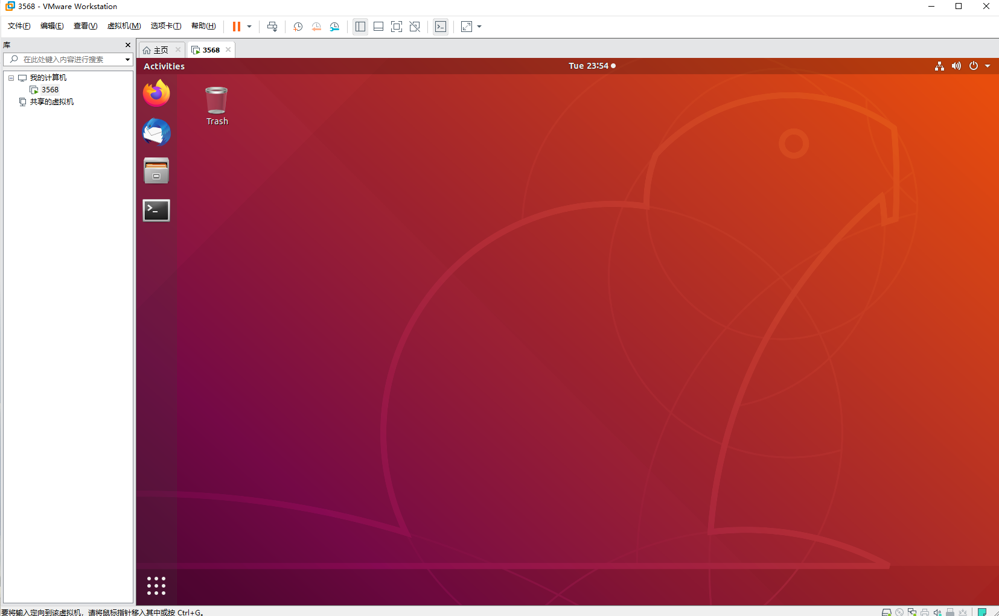

## 3\. New Ubuntu Development Environment Setup

**Note: Beginners are not recommended to build the system by themselves. It is suggested to use the existing virtual machine environment. If you do not need to build the environment, you can skip this section. This section mainly explains the process of building the ubuntu system.**

### 3.1 Ubuntu System Setup

#### 3.1.1 Ubuntu Virtual Machine Setup

Open the VMware software, click on create a new virtual machine. Enter the following interface


Choose custom, and click “Next”.


Select the compatibility with the corresponding version of VMware, which can be found in Help->About VMware Workstation, and click “Next”.


Select Install the operating system later and click “Next”.


Leave the default and click “Next”.

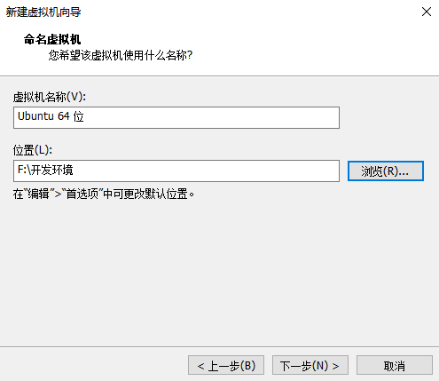

Modify the virtual machine name and installation location, click "Next".


Set the number of processors as appropriate.


Again, set the memory size as appropriate.


Set the network type, the default is NAT mode, click “Next”. Keep the default values for the remaining steps until you reach the step to specify the disk capacity.


The default selection for the IO controller type here is LSI.


The default selection here is also SCSI.


Choose to create a new virtual disk here.


Set the disk size to 200 gigabytes and select the form in which the disk exists, then click “Next” to finish.


Specify the disk file, the default one here is fine.


Click "Finish" by default.


The virtual machine creation is now complete.

In the next section, we will introduce the installation of Ubuntu system in the virtual machine, which is similar to the installation method in the real machine. Here we describe the method of installing Ubuntu system in a virtual machine.

#### 3.1.2 System Installation

The Ubuntu version you choose to install is 18.04. First, go to the Ubuntu official website [http://sources.ubuntu](http://releases.ubuntu.com/18.04/)[.com/18.04/](http://releases.ubuntu.com/18.04/) to get the Ubuntu 18.04 64-bit image. Download the version "ubuntu-18.04.5-desktop-amd64.iso" .

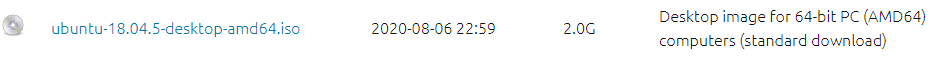

Right-click on the newly created Ubuntu 64-bit and select Settings from the pop-up menu.


The "Virtual Machine Settings Menu" pops up as shown below:


Click on CD/DVD (SATA), select “Use ISO image file,” browse and choose the previously downloaded Ubuntu image, then click “OK” to confirm.


After setting up the image, ensure that the network is available. Then, start the virtual machine and proceed with the installation of the Ubuntu image.

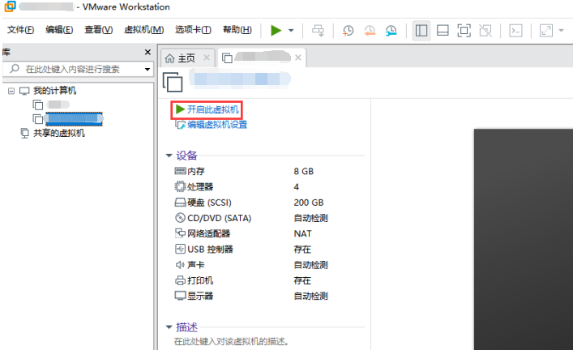

After starting the virtual machine, wait for the installation interface to appear as shown below.

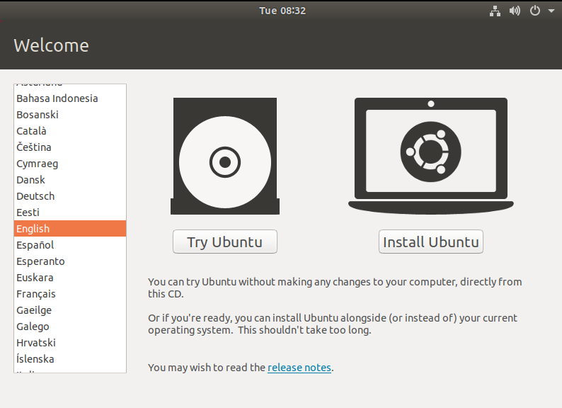

After selecting the language on the left side as shown in the image, click “Install Ubuntu”, and the language selection interface will pop up. Ubuntu default language is English, of course, you can also choose others, the default choice of language in the later stage can also be reset,after selection then click continue.


Next, by default, select continue to finish the installation, the installation process will be very slow, then click "Continue":

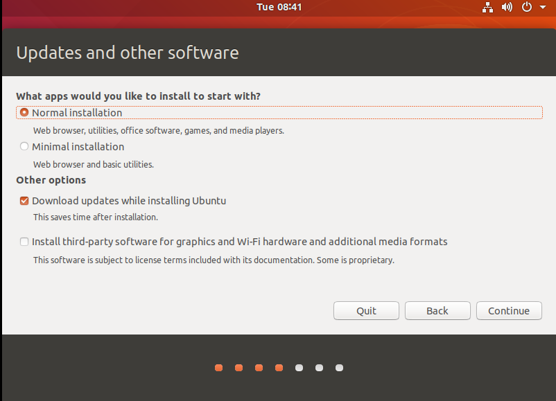

Next, select continue by default to continue the installation, the installation process will be very slow, and then click “Continue”:


Next, select the timezone. You can either click on the Shanghai timezone or enter "Shanghai" (or choose the appropriate timezone based on your location). Then, click "Continue" to proceed. Finally, set your username and password and click "continue" to automatically install the program:

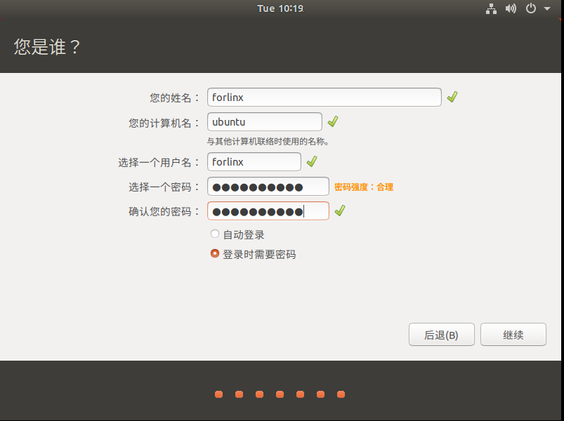

The installation process is shown in the figure below, you can skip it if the network is bad, it will not affect the installation.


After the installation, click "Restart Now" to reboot (or click "Reboot Client"):


After the reboot, you need to log in with your username and password, and the system interface is shown below after logging in:


Above, after shutting down the virtual machine, restore the CD settings, configure it as shown below, click “OK”, and then reopen the virtual machine to see if you can boot Ubuntu normally.

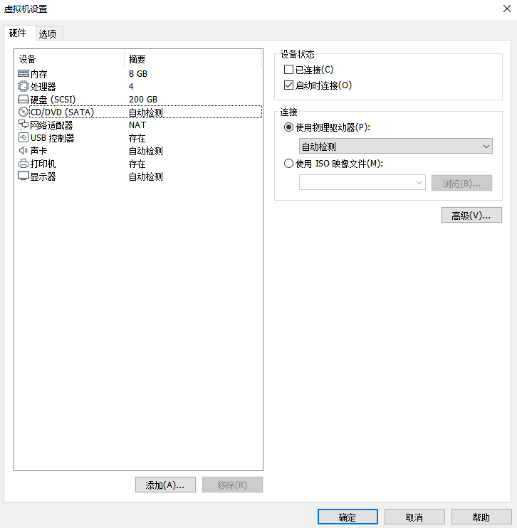

#### 3.1.3 Ubuntu Basic Configuration

After installing the Ubuntu 18.04 operating system, there are a few configurations to make.

+ **VMware Tools Installation:**

Next, install VMware Tools. Without installing this tool, you won't be able to copy and paste and drag file between the Windows host and the virtual machine. First click on "Virtual Machines" on the VMware navigation bar, then click "Install VMware Tools" in the drop-down box.


Once done, enter Ubuntu and the VMware Tools CD icon will appear on your desktop, click into it:


Double-click on the VMwareTools icon, go to it and see a zip file VMwareTools-10.3.10-12406962.tar.gz (it may be different for different VM versions).


Copy the file under the home directory (i.e., the directory of the home personal username):


Press the keyboard \[Ctrl+Alt+T] to bring up the terminal command interface, use the tar command to unzip the VMwareTools installation package (using the <font style="color:#2F4BDA;">shrushru</font> command will prompt you to enter the password, follow the prompt to enter the password and press Enter, Linux system password input has no echo, make sure the password is correct and press Enter to confirm):

```shell
forlinx@ubuntu:~$ sudo tar -xvf VMwareTools-10.3.10-12406962.tar.gz 
[sudo] password for forlinx:
```

After executing the extract command, use ls to view the file directory vmware-tools-distrib, and go to the directory

```shell
forlinx@ubuntu:~$ ls
Desktop   examples.desktop   nfs   snap   tftp   VMwareTools-10.3.10-12406962.tar.gz  vmware-tools-distrib   work
forlinx@ubuntu:~$ cd vmware-tools-distrib/	  //Use the CD command to enter the directory
forlinx@ubuntu:~/vmware-tools-distrib$ ls                         //View the files in this directory
bin   caf   doc   etc   FILES   INSTALL   installer   lib   vgauth   vmware-install.pl
```

In the current directory, enter sudo./vmware-install. pl to install, press Enter to enter the password, and then start the installation. Enter yes in case of \[yes]/ \[no], and press Enter to install by default.

```shell
forlinx@ubuntu:~/vmware-tools-distrib$ sudo ./vmware-install.pl
[sudo] password for forlinx: 		     //Enter the password of the forlinx account, no display, cannot see the input content
```

The installation process information is long, here omitted.

```shell
open-vm-tools packages are available from the OS vendor and VMware recommends 
using open-vm-tools packages. See http://kb.vmware.com/kb/2073803 for more 
information.
Do you still want to proceed with this installation? [no] yes			//Enter yes
... ...		
```

After completing the VMware tools tool, you can achieve file copy and paste, virtual machine adaptive full display and other functions between Windows and Ubuntu. If the virtual machine cannot be displayed in full screen, you can click View, select Auto-resize Guest Display, and click Fit Guest Now to achieve the virtual machine. VMware tools installation is successful.


+ **Basic Settings:**

Make most of the system settings in the location shown below. A lot of the setup requirements on Ubuntu can be done here.


#### 3.1.4 Ubuntu Network Settings

+ **NAT Mode**

Before using the network, make sure that our virtual machine can connect to the Internet, open the virtual machine settings, and change the network bridge mode in the network adapter to “NAT mode”:


When the VMware virtual NIC is set to NAT mode in a virtual machine, the network in the Ubuntu environment can be set to dynamic IP. The virtual NAT device and the host NIC are connected to communicate for Internet access in this mode. This is the most common way for our VM to get on the extranet.


The network is set to dynamic IP.


+ **Bridge Mode:**

If TFTP, SFTP and other servers are used, the network contact mode of the virtual machine needs to be set as the bridge mode. When the VMware virtual NIC is set to bridge mode, the host NIC and the VM NIC communicate via a virtual bridge, which requires the Ubuntu IP to be set to the same network segment as the host IP.


**Note: The IP and DNS involved in the network settings section should be set according to the user's own actual environment, the manual is an example.**

Open VM Settings, USB Controller, select USB 3.0 in Compatibility and “OK”. As shown in the picture below, since most computers nowadays support USB3.0 ports, if we don't set it up, when we plug in the USB3.0 port, we can't connect to the virtual machine. The principle is as follows:


After the virtual machine boot, insert the U disk, the virtual machine will be more in the lower right corner of the icon similar to the "U disk", right-click --> connect, and then you can see in the file system to see more than a directory, that the U disk loaded successfully, as shown in the figure:


#### 3.1.6 Virtual Machine Basic Library Installation

Before development, there are some other necessary libraries, we use the following commands to install them one by one, before installation, you need to ensure that the network can be used normally, you can get on the extranet:

```shell
forlinx@ubuntu:~$ sudo apt-get update // Update the information of the download source
forlinx@ubuntu:~$ sudo apt-get install build-essential // Provide the list information of software packages necessary for compiling programs
forlinx@ubuntu:~$ sudo apt-get install libncurses* // Used to generate text-based user interfaces
forlinx@ubuntu:~$ sudo apt-get install lzop // Compression and decompression tool based on the Lzo library
forlinx@ubuntu:~$ sudo apt-get install net-tools // Network configuration tools
```

#### 3.1.7 OK3568 Android Source Code Necessary Library Compilation

```shell
forlinx@ubuntu:~$ sudo apt-get update // Update the apt-get download source
forlinx@ubuntu:~$ sudo apt-get install openssh-server vim git fakeroot // Installation of essential toolkits
forlinx@ubuntu:~$ sudo apt-get install repo git ssh make gcc libssl-dev liblz4-tool expect g++ patchelf chrpath gawk texinfo chrpath diffstat binfmt-support qemu-user-static live-build bison flex fakeroot cmake gcc-multilib g++-multilib unzip device-tree-compiler python-pip libncurses5-dev
forlinx@ubuntu:~$ sudo apt-get install openjdk-8-jdk
forlinx@ubuntu:~$ sudo apt-get install git-core gnupg flex bison build-essential zip curl zlib1g-dev gcc-multilib lib32ncurses5-dev x11proto-core-dev libx11-dev lib32z1-dev libgl1-mesa-dev libxml2-utils xsltproc unzip fontconfig
forlinx@ubuntu:~$ sudo apt-get install g++-7-multilib libc6=2.27-3ubuntu1.6 libc6-i386 libc6-dev
```

These library files are required for compiling the Android source code when setting up the 3568 Android development environment from scratch. If you are not setting up the OK3568 Android development environment, you can skip this step.

## 4\. Related Code Compilation

This chapter mainly describes the compiling method of the source code related to the development board, including the kernel source code compilation and the application program compilation.

### 4.1 Preparation Before Compilation

#### 4.1.1 Description of the Environment

+ Development environment OS: Ubuntu18.04 64-bit version
+ Cross-toolchain: aarch64-linux-gnu
+ The board uses the Bootloader version: u-boot-2017.09.
+ Development Board Kernel: Linux-4.19.206
+ System version: Android11

#### 4.1.2 Source Code Copy 

+ Program Source: User Profile\\Android\\Source\\ OK3568-android11-source.tar.bz2.a\*

To create a working directory, it is recommended that the disk be divided into at least 200G and the compilation memory be divided into at least 16G:

```shell
forlinx@ubuntu:~$ mkdir -p /home/forlinx/3568						// Create the working directory in sequence
Copy the source code files OK3568 - android11 - source.tar.bz2.a* from the user profile to the directory /home/forlinx/3568 in the virtual machine.
forlinx@ubuntu:~$ cd /home/forlinx/3568								// Switch to the working directory
forlinx@ubuntu:~/3568$ cat OK3568-android11-source.tar.bz2.a* > OK3568-android11-source.tar.bz2
forlinx@ubuntu:~/3568$ tar -xvf OK3568-android11-source.tar.bz2		// Extract the compressed package at the current location
```

Just run the command and wait for it to complete.

### 4.2 Kernel Compilation

**Note:**

+ **After the kernel source code is decompressed for the first time, the source code needs to be compiled as a whole;**
+ **After compiling as a whole, you can compile separately according to the actual situation;**
+ **The source code compilation requires a development environment with a running memory of 16G or above. Please do not modify the VM virtual machine image configuration provided by us.**

#### 4.2.1 Full Compilation Test

In the source code path, the compilation script build. Sh is provided. Run the script to compile the entire source code. You need to switch to the decompressed source code path at the terminal and find the build. sh films.

```shell
forlinx@ubuntu:~$ cd /home/forlinx/3568/OK3568-android11-source
```

The following operations need to be operated under the source code directory, and the full compilation method is:

```shell
forlinx@ubuntu: ~/3568/OK3568-android11-source $ source build/envsetup.sh
forlinx@ubuntu: ~/3568/OK3568-android11-source $ lunch ok3568_r-userdebug
forlinx@ubuntu: ~/3568/OK3568-android11-source $ ./build.sh -UKAup
```

**Note:** 

**The above source and lunch commands are the configuration of the environment variables required for compilation. The configuration follows the terminal window. If the compilation is required to close the terminal or open a new terminal, it must be re-executed, otherwise there will be problems in the compilation.**

After compiling for a while, the following interface will pop up, requiring selection. Extract the information from the image. Choose 1800000 for VCCIO4 and VCCIO6, and choose 3300000 for the rest. Use the up and down arrow keys to navigate the options and press enter to confirm the selection.

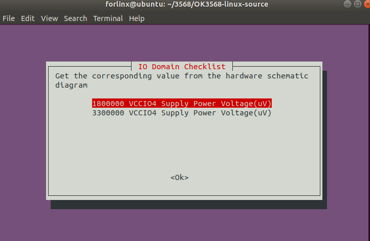

After successful compilation, the corresponding compilation project result file will be generated under the IMAGE folder, and the image file will be found.


```shell
OK3568-android11-source$ ls IMAGE/
OK3568_R_USERDEBUG_OK3568-C-ANDROID__20220525.0600
```

**Note: The update. img is packaged for full programming of OTG or TF card, and other files are programmed step by step.**

#### 4.2.2 Compiling Kernel Separately

Users operate under the source code path. It should be noted that before compiling the kernel separately, you need to compile it once.

```shell
forlinx@ubuntu: ~/3568/OK3568-android11-source $ source build/envsetup.sh
forlinx@ubuntu: ~/3568/OK3568-android11-source $ lunch ok3568_r-userdebug
forlinx@ubuntu: ~/3568/OK3568-android11-source $ ./build.sh -K
forlinx@ubuntu: ~/3568/OK3568-android11-source $ make bootimage
```

To perform incremental flashing, you can simply use the boot.img file located in the out/target/product/ok3568 directory and flash it step by step.

#### 4.2.3 Clearance of Files Generated by the Compilation

```shell
forlinx@ubuntu: ~/3568/OK3568-android11-source $ make clean
```

This operation clears all intermediate files. However, it does not affect the source files, including those that have already had changes made to them.

Note: The u-boot source directory should not execute the "make clean" command, as it will result in u-boot being unable to compile.

### 4.3 IMAGE Files Usage

The update. img is packaged for full programming of OTG or TF card, and other files are programmed step by step. The Image file generated by separate compilation will not be updated in the update. img file, and it needs to be flashed by single-step. (see the software manual OTG flashing for details).