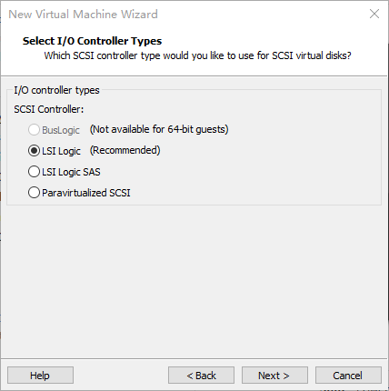
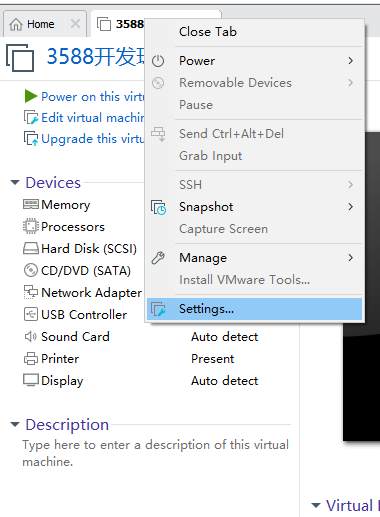
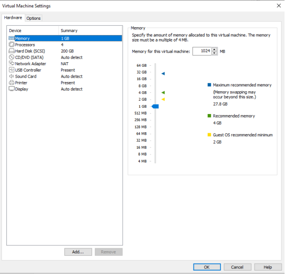
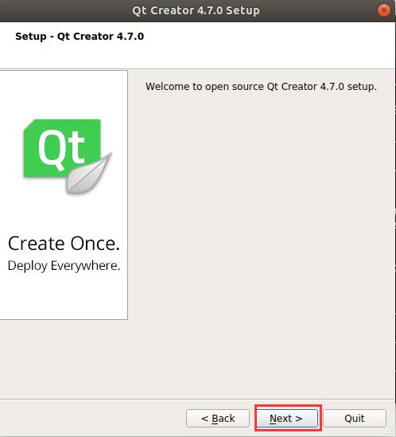
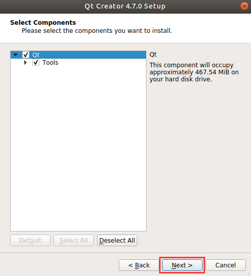

# Linux5. 10.160\_User’s Compilation Manual_V1.2

Document classification: □ Top secret □ Secret □ Internal information ■ Open

## Copyright

The copyright of this manual belongs to Baoding Folinx Embedded Technology Co., Ltd. Without the written permission of our company, no organizations or individuals have the right to copy, distribute, or reproduce any part of this manual in any form, and violators will be held legally responsible.

Forlinx adheres to copyrights of all graphics and texts used in all publications in original or license-free forms.

The drivers and utilities used for the components are subject to the copyrights of the respective manufacturers. The license conditions of the respective manufacturer are to be adhered to. Related license expenses for the operating system and applications should be calculated/declared separately by the related party or its representatives.

## Application Scope

This manual is mainly applicable to the Linux5.10.160 operating system on the Forlinx OK3568-C platform. Other platforms can also refer to it, but there will be differences between different platforms. Please make modifications according to the actual conditions.

## Revision History

|    Date    | User Manual Version | Revision History                                             |
| :--------: | :-----------------: | ------------------------------------------------------------ |
| 21/10/2023 |        V1.0         | OK3568 User’s Compilation Manual (Version 1.0);<br />**Note: This Compilation Manual is only applicable to the OK3568 development board.** |
| 11/12/2023 |        V1.1         | Updating the instructions for compiling buildroot separately. |
| 01/03/2024 |        V1.2         | Fixing in-manual path problem                                |

## Overview

This manual is designed to enable you to quickly understand the compilation process of the products and familiarize yourself with the compilation methods of Forlinx products. The application program needs to be cross-compiled on the Linux operating system before it can run on the development board. According to the method in the compilation manual, you can compile your own software code through practical operation.

The manual will provide instructions for setting up the environment but there may be some unforeseen issues during the environment setup process. For beginners, it is recommended to use the pre-configured development environment provided by us. This will allow you to quickly get started and reduce development time.

Linux systems are typically installed in three ways: dual system on a real machine, single system on a real machine, and virtual machine. Different installation methods have their advantages and disadvantages. This manual only provides methods to build ubuntu in a virtual machine. Computer hardware requirements: It is recommended to have at least 6GB of memory or more, so that you can allocate some memory to run the virtual machine (the virtual machine is recommended to have more than 2GB) and still do other operations on Windows, otherwise it will affect the performance of Windows.

The manual is mainly divided into four chapters:

+ Chapter 1. is mainly about the installation of VMware, and the version used is VMware Workstation 15 Pro15.1.0. You need to install VMware before using the ubuntu development environment;

+ Chapter 2. mainly introduces the method of loading the ubuntu development environment provided by Forlinx, and the development environment is 64-bit ubuntu20.04;

+ Chapter 3. mainly introduces the method of building a new ubuntu development environment; This section uses 64-bit Ubuntu 20.04 as an example to describe the creation of Ubuntu. Due to different computer configurations, there may be unexpected problems in the building process. It is recommended that beginners directly use the environment we have built.

+ Chapter 4. mainly introduces the methods of compiling the source code related to the development board.

A description of some of the symbols and formats associated with this manual:

|                          **Format**                          | **Meaning**                                                  |
| :----------------------------------------------------------: | ------------------------------------------------------------ |
|                             Note                             | Note or information that requires special attention, be sure to read carefully. |
|                                                              | Relevant notes on the test chapters.                         |
|                               ️                               | Indicates the related path.                                  |
| <font style="color:blue;">Blue font on gray background</font> | <font style="color:#000000;">Refers to commands entered at the command line (Manual input required).</font> |
|         <font style="color:black;">Black font</font>         | Serial port output message after entering a command          |
|       **<font style="color:black;">Bold black</font>**       | <font style="color:#000000;">Key information in the serial port output message</font> |
|            <font style="color:#000000;">//</font>            | <font style="color:#000000;">Interpretation of input instructions or output information</font> |
|                      Username@Hostname                       | <font style="color:#000000;">root@ok3568: development board serial port login account information,</font><br/><font style="color:#000000;">forlinx @ ok3568: development board network login account information</font><br/><font style="color:#000000;">forlinx @ Ubuntu: development environment Ubuntu account information</font><br/>You can determine the environment for function operation through this information. |

<font style="color:#000000;">After packaging the file system, you can use the “ls” command to view the generated files.</font>

```markdown
forlinx@ubuntu:~/3568$ ls                              //List the files in this directory
OK3568_Linux_fs  OK3568_Linux_fs.tar.bz2.00 OK3568_Linux_fs.tar.bz2.01 OK3568_Linux_fs.tar.bz2.02 OK3568_Linux_fs.tar.bz2.03
```

+ <font style="color:#000000;">forlinx@ubuntu: the username is forlinx and the hostname is ubuntu, indicating that the operation is performed in the development environment ubuntu.</font>
+ <font style="color:#000000;">// : Explanation of operation commands is required, but command input is not needed.</font>
+ <font style="color:#0000FF;">ls:</font> <font style="color:#000000;">blue font on a gray background, indicating relevant commands that need to be entered manually.</font>
+ **OK3568\_Linux\_fs:** The bottom black font represents the output information after entering the command, with the bold font indicating the key information, and the packed file system is here.

## 1\. VMware Virtual Machine Software Installation

This chapter mainly introduces the installation of VMware virtual machines, using VMware Workstation 15 Pro v15.1.0 as an example to demonstrate the installation and configuration process of the operating system.

### 1.1 VMware Software Download and Purchase

Go to the VMware website https://www.vmware.com/cn.html to download Workstation Pro and get the product key. VMware is a paid software, you need to buy it yourself, or use the trial version provided by VMware.


After the download is complete, double-click the installation file to start the installation program.

### 1.2 VMware Software Installation

Double-click the startup program to enter the installation wizard.


Click on "Next".


Check the terms in the license agreement that I accept, then click "Next".


Modify the installation location to the partition where you want to install the software on your computer, then click "Next".


Check and click on "Next".


Check the box to add a shortcut, then click "Next".


Click "Installation".


Wait for the installation to complete.


Click "Finish" to try it out. If users need to use it for a long time, they need to buy it from the official and fill in the license.

## 2\. Loading the Existing Ubuntu Development Environment

**Note:**

+ **It is recommended that beginners use the virtual machine environment built by Forlinx directly. After understanding this chapter, you can directly jump to the compilation chapter for further study;**
+ **The development environment provided is: forlinx (username), forlinx (password).**

There are two ways to use a virtual machine environment in VMware: one is to directly load an existing environment, and the other is to create a new environment. Let's first talk about how to load an existing environment.

First, download the development environment provided by Forlinx. In the development environment documentation, there should be an MD5 checksum file. After downloading the development environment, you should verify the integrity of the compressed package using the MD5 checksum. (You can use an on-line MD5 checksum tool or download a specific MD5 checksum tool for this purpose). To check if the checksum in the verification file matches the checksum of the file itself. If they match, the file download is successful. If they don't match, it suggests that the file may be corrupt, and you should consider downloading it again.

Select the zip file to unzip together


Select .vmx as the file to be opened by the virtual machine after the complete decompression.

Open the virtual machine and select the extracted 3588 development environment.vmx


Turn on this virtual machine after loading is complete to run it and enter the system's interface.


Development environment account no.: forlinx, password: forlinx; after filling in, select Sign in to log in.


## 3\. New Ubuntu Development Environment Setup

**Note: Beginners are not recommended to build the system by themselves. It is suggested to use the existing virtual machine environment. If you do not need to build the environment, you can skip this section. This section mainly explains the process of building the ubuntu system.**

### 3.1 Ubuntu System Setup

#### 3.1.1 Ubuntu Virtual Machine Setup

Open the VMware software, click on create a new virtual machine. Enter the following interface.


Choose custom, and click “Next”.


Select the compatibility with the corresponding version of VMware, which can be found in Help->About VMware Workstation, and click “Next”.


Select Install the operating system later and click “Next”.


Leave the default and click “Next”.


Modify the virtual machine name and installation location, click "Next".


Set the number of processors as appropriate.


Set the memory size according to the actual situation. It is recommended to use 16g


Set the network type, the default is NAT mode, click Next. Keep the default values for the remaining steps until you reach the step to specify the disk capacity.



The default selection for the IO controller type here is LSI.


The default selection here is also SCSI.


Choose to create a new virtual disk here.


Set the disk size to 200 gigabytes and select the form in which the disk exists, then click “Next” to finish.


Specify the disk file, the default one here is fine.


Click "Finish" by default.


The virtual machine creation is now complete.

In the next section, we will introduce the installation of Ubuntu system in the virtual machine, which is similar to the installation method in the real machine. Here we describe the method of installing Ubuntu system in a virtual machine.

#### 3.1.2 System Installation

The version of Ubuntu to install is 20.04. First of all, go to the official website of Ubuntu to get the Ubuntu 20.04 64-bit image. The download address is "ubuntu-20.04.6-desktop-amd64.iso" version.


Right-click on the newly created Ubuntu 64-bit and select Settings from the pop-up menu.



The "Virtual Machine Settings Menu" pops up as shown below:



Click on CD/DVD (SATA), select “Use ISO image file,” browse and choose the previously downloaded Ubuntu image, then click “OK” to confirm.


After setting up the image, ensure that the network is available. Then, start the virtual machine and proceed with the installation of the Ubuntu image.


After starting the virtual machine, wait for the installation interface to appear as shown below.


After selecting the language on the left side as shown in the image, click “Install Ubuntu”, and the language selection interface will pop up. Ubuntu default language is English, of course, you can also choose others, the default choice of language in the later stage can also be reset,after selection then click continue.


Next, by default, select continue to finish the installation, the installation process will be very slow, then click "continue":


Next, select continue by default to continue the installation, the installation process will be very slow, and then click “continue”:


Next, select the timezone. You can either click on the Shanghai timezone or enter "Shanghai" (or choose the appropriate timezone based on your location). Then, click "Continue" to proceed. Finally, set your username and password and click "continue" to automatically install the program:


The installation process is shown in the figure below, you can skip it if the network is bad, it will not affect the installation.


After the installation, click "Restart Now" to reboot (or click "Reboot Client"):


The system interface after the reboot is complete as shown below:


#### 3.1.3 Basic Ubuntu Installation

After installing the Ubuntu20.04 operating system, there are a few configurations to make.

+ **VMware Tools Installation:**

Next, install VMware Tools. Without installing this tool, you won't be able to copy and paste and drag file between the Windows host and the virtual machine. First click on "Virtual Machines" on the VMware navigation bar, then click "Install VMware Tools" in the drop-down box.


Once done, enter Ubuntu and the VMware Tools CD icon will appear on your desktop, click into it:


Double-click on the VMwareTools icon, go to it and see a zip file VMwareTools-10.3.10-12406962.tar.gz (it may be different for different VM versions).


Copy the file under the home directory (i.e., the directory of the home personal username):


Press the keyboard \[Ctrl+Alt+T] to bring up the terminal command interface, use the tar command to unzip the VMwareTools installation package (using the sudo command will prompt you to enter the password, follow the prompt to enter the password and press Enter, Linux system password input has no echo, make sure the password is correct and press Enter to confirm):

```plain
forlinx@ubuntu:~$ sudo tar -xvf VMwareTools-10.3.10-12406962.tar.gz 
[sudo] password for forlinx:
```

After executing the extract command, use ls to view the file directory vmware-tools-distrib, and go to the directory

```plain
forlinx@ubuntu:~$ ls
Desktop   examples.desktop   nfs   snap   tftp   VMwareTools-10.3.10-12406962.tar.gz  vmware-tools-distrib   work
forlinx@ubuntu:~$ cd vmware-tools-distrib/	  //Use the CD command to enter the directory
forlinx@ubuntu:~/vmware-tools-distrib$ ls             //View the files in this directory
bin   caf   doc   etc   FILES   INSTALL   installer   lib   vgauth   vmware-install.pl
```

In the current directory, enter sudo ./vmware-install.pl to install, enter the password after pressing Enter, and then start the installation. When you encounter \[yes]/\[no], enter yes, and press Enter for the rest to install by default.

```plain
forlinx@ubuntu:~/vmware-tools-distrib$ sudo ./vmware-install.pl
[sudo] password for forlinx: 		     //Enter the password of the forlinx account, no display, cannot see the input content
```

The installation process information is long, here omitted.

```plain
open-vm-tools packages are available from the OS vendor and VMware recommends 
using open-vm-tools packages. See http://kb.vmware.com/kb/2073803 for more 
information.
Do you still want to proceed with this installation? [no] yes			//Enter yes
... ...		
```

After completing the VMware tools tool, you can achieve file copy and paste, virtual machine adaptive full display and other functions between Windows and Ubuntu. If the virtual machine cannot be displayed in full screen, you can click View, select Auto-resize Guest Display, and click Fit Guest Now to achieve the virtual machine. VMware tools installation is successful.


+ **Basic Settings:**

Make most of the system settings in the location shown below. A lot of the setup requirements on Ubuntu can be done here.


#### 3.1.4 Ubuntu Network Settings

+ **NAT Mode**

Before using the network, make sure that our virtual machine can connect to the Internet, open the virtual machine settings, and change the network bridge mode in the network adapter to “NAT mode”:


When the VMware virtual NIC is set to NAT mode in a virtual machine, the network in the Ubuntu environment can be set to dynamic IP. The virtual NAT device and the host NIC are connected to communicate for Internet access in this mode. This is the most common way for our VM to get on the extranet.


The network is set to dynamic ip.


+ **Bridge Mode:**

If TFTP, SFTP and other servers are used, the network contact mode of the virtual machine needs to be set as the bridge mode. When the VMware virtual NIC is set to bridge mode, the host NIC and the VM NIC communicate via a virtual bridge, which requires the Ubuntu IP to be set to the same network segment as the host IP.


Set the static IP. At this time, the Ubuntu IP and the host IP should be set in the same network segment.


**Note: The IP and DNS involved in the network settings section should be set according to the user's own actual environment, the manual is an example.**

#### 3.1.5 U Disk Loading

Open VM Settings, USB Controller, select USB 3.0 in Compatibility and “OK”. As shown in the picture below, since most computers nowadays support USB3.0 ports, if we don't set it up, when we plug in the USB3.0 port, we can't connect to the virtual machine. The principle is as follows:


After the virtual machine boot, insert the U disk, the virtual machine will be more in the lower right corner of the icon similar to the "U disk", right-click --> connect, and then you can see in the file system to see more than a directory, that the U disk loaded successfully, as shown in the figure:


#### 3.1.6 Virtual Machine Basic Library Installation

Before development, there are some other necessary libraries, we use the following commands to install them one by one, before installation, you need to ensure that the network can be used normally, you can get on the extranet:

```plain
forlinx@ubuntu:~$ sudo apt-get update                             // Update the information of the download sources
forlinx@ubuntu:~$ sudo apt-get install build-essential            // Provide the list information of software packages necessary for compiling programs
forlinx@ubuntu:~$ sudo apt-get install libncurses*                // Used to generate text-based user interfaces
forlinx@ubuntu:~$ sudo apt-get install lzop                       // A compression and decompression tool based on the Lzo library
forlinx@ubuntu:~$ sudo apt-get install net-tools                  // Network configuration tools
```

#### 3.1.7 Installation of Necessary Libraries for Compiling OK3568 Linux Source Code

```shell
forlinx@ubuntu:~$ sudo apt-get update                   //Update apt-get download sources
forlinx@ubuntu:~$ sudo apt-get install openssh-server vim git fakeroot        //Necessary toolkit installation
forlinx@ubuntu:~$ sudo apt-get install repo git ssh make gcc libssl-dev liblz4-tool expect g++ patchelf chrpath gawk texinfo chrpath diffstat binfmt-support qemu-user-static live-build bison flex fakeroot cmake gcc-multilib g++-multilib unzip device-tree-compiler python-pip libncurses5-dev
forlinx@ubuntu:~$ sudo apt-get install libgmp-dev  libmpc-dev libicu-dev bsdmainutils
```

These library files are the ones that need to be downloaded when compiling the Linux source code by building the 3568 Linux compilation environment by yourself. If you are not building the OK3568 Linux development environment, you can skip this step.

#### 3.1.8 Increasing the Swap Partition

Please confirm swap partition size of the current system. If the swap partition is insufficient, the compilation of the source code will fail. 16G is recommended. It is recommended to adjust the development environment memory to 16G.

1\. Confirm the swap partition：

```plain
forlinx@ubuntu:~$ cat /proc/swaps
```

The virtual machine provided by Forlinx has been configured with the swap partition by default. If you use other virtual machines, you can increase the size of the swap partition by creating a swap file:

```plain
forlinx@ubuntu:~$ sudo swapoff /swapfile
forlinx@ubuntu:~$ sudo fallocate -l 10G /swapfile
forlinx@ubuntu:~$ sudo chmod 600 /swapfile
forlinx@ubuntu:~$ sudo mkswap /swapfile
forlinx@ubuntu:~$ sudo swapon /swapfile
forlinx@ubuntu:~$ sudo vim /etc/fstab
```

Adding the following at the end of the/etc/fstab file:

```plain
forlinx@ubuntu:~$ /swapfile none swap sw 0 0
```

2\. It is recommended to adjust the memory of the development environment to 16g. Low memory may cause the compilation to fail.

### 3.2 Qt Creator Installation

Copy qt-creator-opensource-linux-x86\_64-4.7.0.run to any directory within the current user’s home directory, and then run the following command.

+ Path: OK3568-C（Linux）User's Manual\\Linux\\source code \\qt-creator-opensource-linux-x86\_64-4.7.0.run

```plain
forlinx@ubuntu:~$ ./qt-creator-opensource-linux-x86_64-4.7.0.run                   
```


Then the installation window of the graphical interface will pop up, and install according to the instructions:


 

 	


Users who install online need to register their own Qt account. Those who already have a Qt account can log in directly. Qt password requirements are: including capital letters, lowercase letters and numbers. After successful registration and login, click next.

Users who install offline can skip it.



Click "Next".


Users can set the installation path according to their own habits. It is set by default here, so click "Next".



To fully install, click "Next".


Click Install and wait for the installation to complete.


When the installation is complete, click Finish. At this time, the Qt interface will be opened automatically. You can also start it through the command line. Execute the following command to open Qt Creator in the backstage. When the user opens it, the actual installation path shall prevail:

```plain
forlinx@ubuntu:~$ cd /home/forlinx/qtcreator-4.7.0/bin
forlinx@ubuntu:~$ ./qtcreator &
```


The Qt Creator tool screen appears. Qt Creator is installed.

## 4\. Related Code Compilation

This chapter mainly describes the compiling method of the source code related to the development board, including the kernel source code compilation and the application program compilation.

### 4.1. Preparation Before Compilation

#### 4.1.1 Description of the Environment

+ Development environment OS: Ubuntu22.04 64-bit version
+ Cross-toolchain: aarch64-linux-gnu
+ The board uses the Bootloader version: u-boot-2017.09.
+ Development Board Kernel: Linux-5.10.160
+ Development board porting QT version: qt5.15.8

#### 4.1.2 Source Code Copy

+ Source Code: User Information \\ Linux \\ Source Code \\OK3568\_Linux\_fs.tar.bz2.0\*

Create a working directory

```plain
forlinx@ubuntu:~$ mkdir -p /home/forlinx/3568	//Create the working directory in order
```

Copy the source code file OK3568\_Linux\_fs.tar.bz2.0\* in the user data to the/home/forlinx/3568 directory of the virtual machine.

```plain
forlinx@ubuntu:~$ cd /home/forlinx/3568					//Switch to the working directory
forlinx@ubuntu:~/3568$ cat OK3568_Linux_fs.tar.bz2.0* > OK3568_Linux_fs.tar.bz2
forlinx@ubuntu:~/3568$ tar -xvf OK3568_Linux_fs.tar.bz2				//Decompress the compressed package in the natural location
```

Just run the command and wait for it to complete.

+ Toolkit Path: OK3568-Linux5.10.160-User Profile\\Linux\\Source\\dl.tar.bz2

When compiling buildroot, you will download the toolkit from the official website according to the configuration, download and extract dl.tar.bz2 from the user profile to the buildroot directory, which can reduce the compilation time.

### 4.2 Kernel Compilation

**Note:**

+ **After the kernel source code is decompressed for the first time, the source code needs to be compiled as a whole;**
+ **After compiling as a whole, you can compile separately according to the actual situation;**
+ **The source code compilation requires a development environment with a running memory of 16G or above. Please do not modify the VM virtual machine image configuration provided by us;**
+ **In order to shorten the first compilation time, the default full compilation directly uses the compiled file system image without remaking the file system.**

#### 4.2.1 Full Compilation Test

Switch to the extracted source code path at the terminal:

```plain
forlinx@ubuntu:~$ cd /home/forlinx/3568/OK3568_Linux_fs
```

The following operations need to be done in the source directory, and the first compilation needs to specify the chip to use:

```plain
forlinx@ubuntu: ~/3568/OK3568_Linux_fs$./build.sh chip
/* Options will be entered after execution，as follows：*/
Log saved at /home/forlinx/work/3568/OK3568_Linux_fs/output/sessions/2023-10-21_16-45-26

Pick a chip:

1. OK3568
2. rk3566_rk3568
3. rk3588
Which would you like? [1]: 1 /*Enter 1 and press Enter to continue.*/
Switching to defconfig: /home/forlinx/work/3568/OK3568_Linux_fs/device/rockchip/.chip/OK3568-C-linux_defconfig
make: Entering directory '/home/forlinx/work/3568/OK3568_Linux_fs/device/rockchip/common'
#
# configuration written to /home/forlinx/work/3568/OK3568_Linux_fs/output/.config
#
make: Leaving directory '/home/forlinx/work/3568/OK3568_Linux_fs/device/rockchip/common'
```

Afterwards, it can be compiled. The file system under linuxfs is used by default, which is directly packaged. If you need to recompile the buildroot, you need to compile it separately as part of the separate compilation.

```plain
forlinx@forlinx-ubuntu:~/work/3568/OK3568_Linux_fs$ ./build.sh
```

The final compilation effect is shown in the following figure (the path may be different according to the actual situation):


After successful compilation, the corresponding compilation project result file will be generated under the OK3568\_Linux\_fs/rockdev folder, find the image file there.


**Note:** 

- **The update. img is packaged for full programming of OTG or TF card, and other files are programmed step by step;**
- **In the 3568 5.10 SDK, there is a set of pre-compiled file systems located in the OK3568\_Linux\_fs/linuxfs directory. When the full-compile script is run, it automatically copies the linuxfs/rootfs.img file to the buildroot/output/OK3568/images directory, and then generates the result of compiling the file system using this pre-compiled file system. This process is designed to significantly reduce the time needed to produce the update.img file during the initial compilation. When compiling the filesystem, it should be compiled separately. After the compilation is complete, replace the linuxfs/rootfs.img file with the newly generated rootfs.img file. In subsequent executions of build.sh, the linuxfs/rootfs.img file will still be used.**

#### 4.2.2 Individual Compilation Test

Full compilation is required before individual compilation, which is done under the kernel source path.

Before you can build buildroot separately, you need to modify OK3568\_Linux\_fs/buildroot/package/forlinx/flapp/Config.in

and OK3568\_Linux\_fs/buildroot/package/forlinx/flapp/flapp.mk as follows:

Remove "depends on BR2\_PACKAGE\_DWKEYBOARD" from OK3568\_Linux\_fs/buildroot/package/forlinx/flapp/Config.in and then save and exit.

Remove the DWKeyboard in the parameters of FLAPP\_DEPENDENCIES from OK3568\_Linux\_fs/buildroot/package/forlinx/flapp/flapp.mk

```plain
forlinx@ubuntu: ~/3568/OK3568_Linux_fs$./build.sh uboot        // Compile the U-Boot independently
// Generate uboot.img, and the generation path is /OK3568_Linux_fs/u-boot/uboot.img
forlinx@ubuntu: ~/3568/OK3568_Linux_fs$./build.sh kernel        // Compile the kernel independently
// Generate boot.img, and the generation path is /OK3568_Linux_fs/kernel/boot.img
forlinx@ubuntu: ~/3568/OK3568_Linux_fs$./build.sh buildroot    // Compile the Buildroot file system independently
// Generate rootfs.ext2, and the generation path is /OK3568_Linux_fs/buildroot/output/OK3568/image/rootfs.ext2.
// Note that in the 3568 5.10 SDK, the factory rootfs.img is built - in under the linuxfs directory. Compiling Buildroot independently will overwrite it. If users need to roll back to the factory file system, please back it up before performing the independent compilation of the file system.
// Re - compiling and making the file system takes a long time, generally 4 - 6 hours. If there is no error exit message, please wait patiently.
forlinx@ubuntu: ~/3568/OK3568_Linux_fs$./build.sh recovery     // Compile the recovery file system independently
// Generate rootfs.cpio.gz, and the generation path is /OK3568_Linux_fs/output/recovery/ rootfs.cpio.gz
forlinx@ubuntu: ~/3568/OK3568_Linux_fs$./build.sh updateimg    // Generate update.img independently
// Use uboot.img, boot.img, and rootfs.ext2 from the above paths to generate update.img, and the path is rockdev/update.img 
```

The kernel in the update. img is not updated after successful compilation. Please flash /OK3568\_Linux\_fs/kernel/boot.img file step by step; refer to 6.1.3 OTG Flashing Test

**Note: After the user graphical interface configuration modifies the kernel configuration, such as adding the usb-to-serial ch340 driver, execute ./build.sh kernel, burn the boot.img image, and start the development board to find that the graphical configuration does not take effect. You can use one of the following methods to solve it:**


Method 1: Write the configuration directly to the kernel default configuration file/OK3568\_Linux\_fs/kernel/arch/arm64/configs/OK3568-C-

linux\_defconfig:

```plain
CONFIG_USB_SERIAL_CH341=y
forlinx@ubuntu: ~/3568/OK3568_Linux_fs$ ./build.sh kernel
```

Method 2: Configure the kernel graphically, and comment out the source code device/rockchip/common/scripts/mk-kernel. sh the commands shown in the following figure.


Compile kernel/ Makefile file.


```plain
forlinx@ubuntu: ~/3568/OK3568_Linux_fs/kernel$ make ARCH=arm64 menuconfig
```

The user configures the kernel as required, writes the configuration to the .config file and then saves and exits.

```plain
forlinx@ubuntu: ~/3568/OK3568_Linux_fs$ ./build.sh kernel
```

**Note: After the user graphical interface configuration modifies the buildroot configuration, such as adding python3 support, execute ./build.sh buildroot, burn the rootfs.ext2 image, and start the development board to find that the graphical configuration does not take effect. You can use one of the following methods to solve it:**

Method 1: Write the configuration directly to the buildroot default configuration file/OK3568\_Linux\_fs/buildroot/configs/OK3568\_defconfig:

```plain
BR2_PACKAGE_PYTHON3=y	
BR2_PACKAGE_PYTHON3_PY_PYC=y
forlinx@ubuntu: ~/3568/OK3568_Linux_fs$ ./build.sh buildroot
```

The following prompt pops up during compilation:

Found old config, override it? (y/n):y Select y to override the previous .config file.

Method 2: Graphically configure the buildroot, and comment out the device/rockchip/common/scripts/mk-the location of the following figure in the buildroot. sh:


```plain
forlinx@ubuntu: ~/3568/OK3568_Linux_fs/buildroot/output/OK3568$ make menuconfig
```

The user configures buildroot according to requirements, writes the configuration to the .config file, and then saves and exits.

```plain
forlinx@ubuntu: ~/3568/OK3568_Linux_fs$ ./build.sh buildroot
```

**Tips: If you compile the file system separately and flash it separately, and then find that the programs in the display interface are not added correctly and cannot be opened properly when clicked in the display interface, you can change the configuration item BR2\_PACKAGE\_DWKEYBOARD=n to y in buildroot/configs/OK3568\_defconfig under the source code directory, and then re - compile to restore normal operation.**

#### 4.2.3 Location of the Cross - compilation Toolchain

The source code path of the driver compilation toolchain:

```shell
OK3568-linux-sdk5.10/prebuilts/gcc/linux-x86/aarch64/gcc-arm-10.3-2021.07-x86_64-aarch64-none-linux-gnu/bin/aarch64-none-linux-gnu-
```

The source code path of the compilation toolchain for file system applications (such as QT):

```shell
OK3568-linux-sdk5.10/buildroot/output/OK3568/host/bin/aarch64-linux-
```

The above paths are the locations where the compilation toolchain is generated after executing ./build.sh buildroot. If you use the pre - set host.tar.bz2 method to compile the entire package, you can obtain the compilation toolchain by unpacking host.tar.bz2 in the above paths after the compilation is completed.

### 4.3 Image File Use

The update. img is packaged for full programming of OTG or TF card, and other files are programmed step by step. The Image file, generated by a separate compilation, will not be updated in the update.img file. And it needs to be burned using single-step burn (see user manual OTG burn for details).

### 4.4. Qt Creator Environment Configuration

Qt is a cross-platform graphics development library, which supports many operating systems. Before compiling, you need to configure the compiling environment of Qt Creator.

#### 4.4.1 Cross Compiler Configuration

**Note: The Qt Creator cross-compiler path needs to be generated after source code full compilation. The host.tar.bz2 is provided for convenience under/OK3568-C (Linux) User Materials/Tools. You can see the HostPrefix path recorded in /host/bin/qt.conf. Then use forlinx development environment to create an absolute path that is consistent with the HostPrefix record. After extracting the host. Tar. Bz2 to the corresponding absolute path, continue with the operations in this chapter. It is highly recommended to fully compile the source code before proceeding with this section.**

1\. Click Tools-> Options-> Kits-> Compilers in Qt Creator, and then click Add-> GCC-> C;

2\. Name enters GCC;

3\. Compiler Path Click Browse to select the cross-compiler path for: aarch64-linux-gcc and aarch64-linux-g++, as shown below:

<font style="color:rgb(0, 0, 0);background-color:rgb(218, 234, 252);">️</font><font style="color:#0000FF;">Path: OK3568\_Linux\_fs/buildroot/output/OK3568/host/bin</font>

**Note: The output directory under buildroot needs the source code to be fully compiled before it can be generated.**


4\. Follow the same method to add the GCC compiler, click “Add->GCC->C++” on the right, as shown in the figure:


#### 4.4.2 Qt Versions Configuration

1\. Click Tools- > Options- > Qt Versions in Qt Creator;

2\. Click Add, and select OK3568\_Linux\_fs/buildroot/output/OK3568/host/bin/qmake;

3\. Click open to add;


4\. Then it will return to the Qt Version configuration box, and the Version name can be changed by itself;

5\. Then click Apply and OK.

#### 4.4.3 Kits Configuration

Kits is a build kit for building and selecting development build environments useful for projects with multiple QT libraries. Add the previously added cross-compiler and QT Version to Kits to build a compilation environment suitable for the development board.

1\. Click Tools- > Options- > Kits in Qt Creator, and then click Add to display the configuration section;

2\. Name changes by itself;

3\. Compiler selects GCC;

4\. Qt version selects the name entered when the Qt version was created.


5\. Then click Apply and OK.

### 4.5 Application Compilation and Operation

#### 4.5.1 Command Line Application Compilation and Operation

This subsection uses the watchdog test program, the default program is copied to the /home/forlinx/3568 directory.

1\. Use the cd command to enter the /home/forlinx/work directory;

```plain
forlinx@ubuntu:~$ cd /home/forlinx/3568/OK3568_Linux_fs/app/forlinx/forlinx_cmd/fltest_watchdog
```

2\. Add the cross-compiler path and use make to cross-compile.

```plain
forlinx@ubuntu: ~/3568/OK3568_Linux_fs/app/forlinx/forlinx_cmd/fltest_watchdog$ export PATH=/home/forlinx/3568/OK3568_Linux_fs/buildroot/output/OK3568/host/bin/:$PATH
forlinx@ubuntu: ~/3568/OK3568_Linux_fs/app/forlinx/forlinx_cmd/fltest_watchdog$ make	
aarch64-linux-gcc watchdog.c -o fltest_watchdog  
generate fltest_watchdog success!!!
```

Use the file command to view the generated file information

```plain
forlinx@ubuntu:~/3568/OK3568_Linux_fs/app/forlinx/forlinx_cmd/fltest_watchdog$ 
file fltest_watchdog 
fltest_watchdog: ELF 64-bit LSB executable, ARM aarch64, version 1 (SYSV), dynamically linked, interpreter /lib/ld-linux-aarch64.so.1, for GNU/Linux 3.7.0, not stripped
```

From the result, you can see that the compiled 64-bit ARM file.

3\. Copy the fltest \_ watchdog generated by compiling to the board through U disk or FTP, for example, under the/forlinx path. Take the TF card as an example, and copy it to the development board and run the test.

```plain
[root@ok3568:/]# cp /run/media/mmcblk1p1/fltest_watchdog /home/forlinx
[root@ok3568:/]# cd /home/forlinx
[root@ok3568:/home/forlinx]# ./fltest_watchdog
Watchdog Ticking Away!
```

4\. Refer to the chapter "Watchdog Test" in the user's manual for the test;

#### 4.5.2 QT Application Compilation and Running

Open Qt Creator in the development environment (users open it according to their actual path), click File->Open File or Project in Qt Creator, a pop-up window will appear, select /3568/OK3568\_Linux\_fs/app/forlinx/forlinx\_qt/watchdog/ watchdog.pro


After opening the project, the interface is as follows: (If the page is not automatically changed, please select as shown in the screenshot).


Click Configure Project to adapt to the build environment described in the “Qt Creator Environment Configuration” section of this manual.

After selection, the interface is as follows:


Click Build->Clean All to clear it. (If the intermediate file is not cleared, it can be deleted manually).

Click Projects to uncheck Shadow build.


Then click Build-> Build All to compile.


After the Build progress bar in the lower right corner is finished, it means that the compilation is finished. At this time, you will see the newly generated binary file fltest\_qt\_watchdog in the /app/forlinx/forlinx\_qt/watchdog directory, as follows:


Copy the executable file generated by compiling to the board through U disk or FTP, copy it to the development board, and run the test.