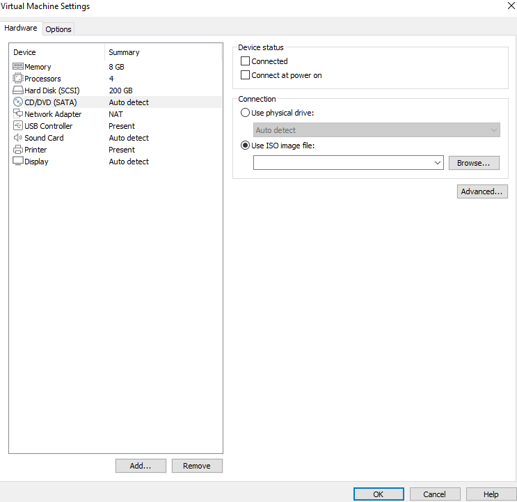

# Linux6.1.118\_User’s Compilation Manual

Document classification: □ Top secret □ Secret □ Internal information ■ Open

## Copyright

The copyright of this manual belongs to Baoding Folinx Embedded Technology Co., Ltd. Without the written permission of our company, no organizations or individuals have the right to copy, distribute, or reproduce any part of this manual in any form, and violators will be held legally responsible.

Forlinx adheres to copyrights of all graphics and texts used in all publications in original or license-free forms.

The drivers and utilities used for the components are subject to the copyrights of the respective manufacturers. The license conditions of the respective manufacturer are to be adhered to. Related license expenses for the operating system and applications should be calculated/declared separately by the related party or its representatives. 

## Overview

This manual is designed to help you quickly understand the compilation process and become familiar with the compilation methods for Forlinx Embedded products. Before running applications on the development board, they must be cross-compiled on a Linux operating system. By following the methods outlined in this manual and engaging in hands-on exercises, you will be able to compile their own software code.

The manual starts with instructions on setting up the development environment. Since unexpected issues may arise during this process, it is recommended that beginners use the pre-configured development environment. This approach allows for a faster start, reducing overall development time.

There are generally three installation methods for Linux systems: dual-boot on a physical machine, single-boot on a physical machine, and using a virtual machine. This manual will focus on setting up Ubuntu within a virtual machine. Hardware Requirements: A minimum of 6GB of RAM is recommended. This will allow you to allocate 2GB or more to the virtual machine while still performing other tasks in Windows. Using less RAM may negatively impact the performance of Windows.

There are total 4 chapters:

+ Chapter 1 covers the installation of VMware, specifically version Workstation 17 Pro v17.0.0. VMware must be installed before setting up the Ubuntu development environment;
+ Chapter 2 explains how to load the Ubuntu development environment provided by Feilin. The environment is based on 64-bit Ubuntu 22.04;
+ Chapter 3 outlines the process of setting up a new Ubuntu development environment. Using 64-bit Ubuntu 22.04 as an example, this chapter describes the creation of the environment. Due to potential differences in computer configurations, unforeseen issues may arise. Beginners are advised to use the pre-configured environment to avoid complications.3. Setting Up a New Ubuntu Development Environment; This section takes the 64-bit Ubuntu 22.04 as an example to describe in detail the process of setting up an Ubuntu development environment. Due to the varied configurations of individual computers, unexpected issues may arise during the setup process. Therefore, it is recommended that beginners directly use our pre-configured development environment for more efficient subsequent work.
+ Chapter 4 explains how to compile source code for the development board.

The manual includes explanations of some symbols and formats.

| **Format**| **Meaning**|
|:----------:|----------|
| **Note** | Note or particularly important information must be read carefully.|
| 📚 | Relevant explanations regarding the testing section|
| ️️️🛤️ ️ | Related paths.|
| <font style="color:#0000FF;"><font style="color:blue;background-color:#e5e5e5;">Blue font on gray background</font></font> | Refers to the command entered on the command line, which needs to be entered manually.|
| <font style="color:#0000FF;"><font style="color:black;background-color:#e5e5e5;">Black font on a gray background</font></font> | Serial output information after command input|
| **Black Bold font on a gray background** | Key information in the serial output:|
| <font style="color:#000000;">//</font>| Explanation of the input command or output information.|
| Username@Hostname| root@OK3568-buildroot:~# : Development board login account information;<br />forlinx@ubuntu: Ubuntu account information in the development environment. |

You can use this information to determine the operating environment for functional operations.

Example: After packaging the file system, use the ls command to view the generated files.

```bash
forlinx@ubuntu:~/3568$ ls //List the files in this directory
OK3568-linux-source.tar.bz2 OK3568-linux-source.tar.bz2.00 OK3568-linux-source.tar.bz2.01 OK3568-linux-source.tar.bz2.02 OK3568-linux-source.tar.bz2.03 OK3568-linux-source.tar.bz2.04
```

+ forlinx@ubuntu: The username is forlinx, and the hostname is ubuntu, indicating that the operation is being performed in the development environment on Ubuntu.
+ //: Explanation of the command. No need to enter this when typing the command.
+ Ls: blue font with gray background, indicating the relevant command that needs to be entered manually
+ **OK3568-linux-source.tar.bz2**<font style="color:#000000;">: The output information after inputting the command is shown in black font, and the key information is in bold font. In this case, it refers to the packaged file system.</font>

## Application Scope

This software manual is designed for the OK3568-C platform running Linux6.1.118. While other platforms may also reference this manual, there could be differences that require adjustments for the specific use.

## Revision History

| **Date**| **Version**| **Revision History**|
|:----------:|:----------:|----------|
| 18/05/2026| <font style="color:#000000;">V1.0</font>| User’s Compilation Manual Initial Version;   |
**Note: This Compilation Manual is only applicable to OK3568 development board of Forlinx.**

## 1\. VMware Virtual Machine Software Installation

This chapter mainly introduces the installation of the VMware virtual machine, using VMware Workstation 17 Pro v17.0.0 as an example to demonstrate the operating system installation and configuration process.

### 1.1 Downloading and Purchasing VMware Software

Visit the VMware official website at https://www.vmware.com to download Workstation Pro and obtain the product key. VMware is paid software that requires individual purchase, or you can choose to use a trial version.


After the download is complete, double-click the setup file to launch the installer.

### 1.2 VMware Software Installation

Double-click the programme to launch the installation wizard, then click “Next”.


Check “I accept the terms in the license agreement” and click “Next.”


Modify the installation location to the partition on your computer where software is typically installed, then click “Next.”


Check, then click “Next.”


Check “Add shortcuts” and click “Next.”


Click “Install.”


Wait for the installation to complete.


After clicking “Finish,” you can start the trial. For long-term use, please purchase from the official website and enter the license key.


## 2\. Loading an Existing Ubuntu Development Environment

**Note:**

+ **It is recommended that beginners directly use the virtual machine environment pre-configured by Forlinx, which already has the cross-compiler and Qt environment installed. After reviewing this chapter, you can skip directly to the compilation chapters;**
+ **The regular user account for the development environment is: “forlinx”, and the corresponding password is: “forlinx”;**
+ **You can access software and hardware documentation, source code, and the development environment via the cloud storage link provided by Forlinx. Please ask your sales representative for the download link.**

There are two ways to use the virtual machine environment in VMware: one is to directly load an existing environment, and the other is to create a new environment. First explain how to load an existing environment.

First, download the development environment provided by Forlinx. The development environment package includes an MD5 checksum file. After downloading the package, you should verify the integrity of the compressed file by performing an MD5 checksum check. You can either use an online MD5 verification tool or download a dedicated MD5 verification tool, depending on your preference. Compare the checksum that you generate with the one listed in the checksum file. If they match, the downloaded file is intact. If they do not match, the file may be corrupted, and you will need to download it again.


Select all the compressed packages and right click to extract them to the current folder or your own directory: After extraction, you will obtain the development environment folder 35XX.

The file 35XX.vmx in the OK35XX-linux6.1-VM17-ubuntu22.04 development environment folder is the file that the virtual machine needs to open.

Open the installed virtual machine software.


Select the directory where the newly extracted - OK35XX-linux6.1-VM17-ubuntu22.04 virtual machine file is located, and double-click the startup file to open it


Once it has finished loading, click to start the virtual machine, and you will be able to run it and enter the system interface.


The default account for auto-login upon system boot in the development environment is: “forlinx”, with the password: “forlinx.


## 3\. Setting Up a New Ubuntu Development Environment

**Note: It is not recommended for beginners to build the system by themselves. It is recommended to use the existing virtual machine environment. This section can be skipped if there is no need to build the environment.**

### 3.1 Ubuntu System Setup

#### 3.1.1 Creating an Ubuntu Virtual Machine

Open the VMware software and click “Create a New Virtual Machine”. Enter the following interface:


Select ''Custom'' and click ''Next.''


Choose the compatibility for the corresponding VMware version. The version can be found under Help ->About VMware Workstation. Click ''Next.''


Select install the operation later and click Select 'I will install the operating system later' and click ''Next.''


Keep the default settings and click ''Next.''


Modify the virtual machine's name and installation location, then click ''Next.''


Set the number of processors according to your needs.


Similarly, set the memory size according to your needs. It is recommended to use 16GB.


Set the network type, the default is NAT mode, and click "Next." Subsequent steps remain at their default values until the disk capacity step is specified.


Choose the default LSI for the IO controller type.


Similarly, select SCSI as the default here.


Choose to create a new virtual disk:


Set the disk size to 200GB and select the disk's format, then click 'Next' to complete.


Specify the disk file, the default setting is fine here.


Click ''Finish'' by default to complete.

At this point, the virtual machine creation is complete.

The installation process on a physical machine is similar to the one on a virtual machine, but here we will focus on installing Ubuntu in the virtual machine. Here's how to install Ubuntu in a virtual machine

#### 3.1.2 System Installation

The installed Ubuntu version is 22.04. First, go to the official Ubuntu website to download the 64-bit image. The download link is: [https://old-releases.ubuntu.com/releases/22.04.4/.](https://old-releases.ubuntu.com/releases/22.04.4/)Download the version ubuntu-22.04.4-desktop-amd64.iso.

Right-click the Ubuntu 64-bit virtual machine that was created and select "Settings" from the context menu.


The "Virtual Machine Settings Menu" will pop up as shown in the image below.


Click on CD/DVD (SATA), select Use ISO image file, then browse and select the previously downloaded Ubuntu ISO image, and click “OK”.



After configuring the image, ensure that the network is working, and then start the virtual machine to begin installing the Ubuntu image.


Once the virtual machine starts, wait for the installation interface to appear as shown below.


Select the language on the left side and click "Install Ubuntu." A language selection screen will pop up.  
By default, Ubuntu's language is English, but you can also select Chinese. The selected language can be changed later during the installation. Once you've selected the language, click “Continue”.


Next, choose the default option, click Continue to proceed with the installation. The process will take some time. Then click Continue again.


Click Install Now by default, and a prompt will appear. Click Continue to proceed.


Choose your timezone. Here, you can click Shanghai or type Shanghai to select the timezone (choose a different timezone based on your location if needed), and click Continue. Finally, set up your username and password. Click Continue, and the installation will begin automatically.


The installation process is shown in the figure below. If the network is not good, you can skip it without affecting the installation.


After installation is complete, the screen will look like the image below. Click “Restart Now” to reboot (or click “Restart Guest”).


After restarting and logging in, the system interface is as shown below:


#### 3.1.3 Basic Configuration of Ubuntu

After installing the Ubuntu 22.04 operating system, some configurations need to be done.

+ **VMware Tools Installation：**

```bash
sudo apt update
sudo apt install open-vm-tools open-vm-tools-desktop
```

+ **Basic Configuration:**

Most system settings can be configured in the location shown in the figure. Many settings requirements on Ubuntu can be completed here.


#### 3.1.4 Network Configuration of Ubuntu

+ **NAT Mode**

Before using the network, make sure that your virtual machine can connect to the internet. Open the virtual machine settings, and change the network adapter's network bridging mode to NAT Mode:


In the virtual machine, when the VMware virtual network adapter is set to NAT mode, the network in the Ubuntu environment should be set to dynamic IP. In this mode, the virtual NAT device and the host network card are connected. This is the most commonly used method to connect the virtual machine to the external network. This is the most commonly used method for the virtual machine to access the external network.


The network is set to dynamic IP.


+ **Bridge Mode：**

If using servers like TFTP or SFTP, you need to set the virtual machine's network connection to Bridged Mode. When Vmware virtual network card is set to bridged mode, the host network card and the virtual machine network card communicate through a virtual bridge, and you need to ensure that the IP address of Ubuntu is in the same subnet as the host machine.


Set the static IP. At this time, the Ubuntu IP and the host IP should be set in the same network segment.


**Note: The IP and DNS settings mentioned in the network configuration section should be configured based on the user's actual environment. The manual provides examples for illustration.**

#### 3.1.5 USB Device Loading

Open the virtual machine settings, go to USB Controller, and in the compatibility section, choose USB 3.0, then click “OK”. As shown below, most modern computers support USB 3.0 ports. If not configured, the USB 3.0 device will not be connected to the virtual machine when inserted. As shown in the figure:


After starting the virtual machine, insert the USB drive. A "USB icon" will appear in the lower-right corner of the virtual machine. Right-click on it and select “Connect”. You will then see an additional directory in the file system, indicating the USB drive has been successfully mounted, as shown in the following figure:


#### 3.1.6 Basic Library Installation for the Virtual Machine

Before development, some other necessary libraries need to be installed. Use the following commands to install them one by one. Make sure the network is functioning properly and can connect to the internet before installing.

```bash
forlinx@ubuntu:~$ sudo apt-get update                   //Update apt-get download sources
forlinx@ubuntu:~$ sudo apt-get install openssh-server vim git fakeroot        //Necessary toolkit installation
forlinx@ubuntu:~$ sudo apt-get install repo git ssh make gcc libssl-dev liblz4-tool
expect g++ patchelf chrpath gawk texinfo chrpath diffstat binfmt-support qemu-user-static
live-build bison flex fakeroot cmake gcc-multilib g++-multilib unzip device-tree-compiler python-pip libncurses5-dev
forlinx@ubuntu:~$ sudo apt-get install libgmp-dev  libmpc-dev libicu-dev bsdmainutils
```

### 3.1.7 Installation of Necessary Libraries for Compiling OK3568 Linux Source Code

```bash
forlinx@ubuntu:~$ sudo apt-get update                                       //Update apt-get download sources
forlinx@ubuntu:~$ sudo apt-get install openssh-server vim git fakeroot libsqlite3-dev          //Necessary toolkit installation
forlinx@ubuntu:~$ sudo apt-get update && sudo apt-get install git ssh make gcc libssl-dev \ 
liblz4-tool expect expect-dev g++ patchelf chrpath gawk texinfo chrpath \ 
diffstat binfmt-support qemu-user-static live-build bison flex fakeroot \ 
cmake gcc-multilib g++-multilib unzip device-tree-compiler ncurses-dev \ 
libgucharmap-2-90-dev bzip2 expat gpgv2 cpp-aarch64-linux-gnu libgmp-dev \ 
libmpc-dev bc python-is-python3 python2 \
gettext scons
```

These libraries are required when setting up the 3568 Linux compilation environment and preparing to compile the Linux source code. If you're not setting up the OK3568 Linux development environment, you can skip this step.

### 3.2 Installing the Cross-compilation Toolchain

User Profiles/2-Images and 0-Source Code/Cross-compilation Toolchains/aarch64-buildroot-linux-gnu\_sdk-buildroot.tar.gz

Copy the above compressed file to the /home/forlinx/ directory in the development environment, and extract it there:

```bash
forlinx@ubuntu:~$ tar -zvxf aarch64-buildroot-linux-gnu_sdk-buildroot.tar.gz
```

Enter aarch64-buildroot-linux-gnu\_sdk-buildroot and execute relocate-sdk.sh.

```bash
forlinx@ubuntu:~/aarch64-buildroot-linux-gnu_sdk-buildroot$ ./relocate-sdk.sh
```

### 3.3 Qt Creator Installation

Copy the file qt-creator-opensource-linux-x86\_64-4.7.0.run to any directory in the current user’s home directory and execute the following command.

+ Path: user data \\ 2-image and source \\ 0-source \\ qt-creator-opensource-linux-x86 \_ 64-4.7.0.run

```bash
forlinx@ubuntu:~$ ./qt-creator-opensource-linux-x86_64-4.7.0.run                   
```

This will open a graphical installation window. Follow the prompts to install:


 

Online users need to register for a Qt account. Existing Qt account holders can log in directly. The Qt password requires a mix of uppercase letters, lowercase letters, and numbers. After registering and logging in successfully, click Next.

Offline users can click Skip.


Click “Next”:


You can set the installation path according to your preferences; we use the default here. Click "Next".


Choose Complete Installation and click "Next".


Click Install and wait for the installation to complete.


After installation, click Finish. The Qt interface will automatically open, or you can launch it from the command line. To open Qt Creator in the background, use the following command, replacing it with your actual installation path:

```bash
forlinx@ubuntu:~$ cd /home/forlinx/qtcreator-4.7.0/bin
forlinx@ubuntu:~$ ./qtcreator &
```


The Qt Creator tool interface will appear. Qt Creator installation is now complete.

## 4\. Compilation of Related Code

This section mainly describes the compilation methods for the development board-related source code, including kernel source code compilation and application program compilation. Note: Currently, only the kernel source code is available. This section only describes how to compile the kernel and the application.

### 4.1 Preparation Before Compilation

#### 4.1.1 Environment Description

+ Recommended Development OS: Ubuntu 22.04 64-bit
+ Cross-Toolchain: aarch64-linux-gnu
+ Bootloader Version for Development Board: u-boot-2017.09
+ Kernel Version for Development Board: linux-6.1.118
+ Qt Version Ported to Development Board: qt5.15.11

#### 4.1.2 Copying the Source Code

Source Code: User Information \\ 2-Image and Source Code \\ 0-Source Code \\OK3568-linux-source.tar.bz2.0\*

Buildroot packages: User Data\\2-Images and Source Code\\0-Source Code\\dl.tar.bz2

Create a working directory and place the source code and dl.tar.bz2 into the work directory.

**Note:**

- **During the Buildroot build process, the source code for various software packages needs to be downloaded. This requires internet access and may fail or result in incomplete downloads due to network fluctuations, restrictions, or issues with the source server, potentially causing compilation errors. Due to network fluctuations, restrictions, or issues with the source server, the download of source packages may fail or become incomplete, leading to compilation errors. To increase the success rate and reduce build time, it is strongly recommended to use the pre-configured solution by extracting the pre-downloaded software package archive dl.tar.bz2 into the Buildroot source directory;**
- **The source code unzip path should not be too long, otherwise it may cause compilation exceptions.**

```bash
forlinx@ubuntu:~$ cd /home/forlinx/work								//Switch to the working directory
forlinx@ubuntu:~/work$ cat OK3568-linux-source.tar.bz2.0* > OK3568-linux-source.tar.bz2
forlinx@ubuntu:~/work$ tar -vxf OK3568-linux-source.tar.bz2  //Extract the archive in the current directory
forlinx@ubuntu:~/work$ cd /home/forlinx/work/OK3568-linux-source/buildroot
forlinx@ubuntu:~/work/OK3568-linux-source/buildroot$ tar -vxf ../../dl.tar.bz2	//Extract dl.tar.bz2 under the Buildroot directory.
```

Wait for the copy process to complete after running the command.

### 4.2 Source Code Compilation

**Note:**

+ **After extracting the kernel source code for the first time, you need to perform a full compilation of the source code;**
+ **After the initial full compilation, you can proceed with individual compilations based on the actual situation;**
+ **This source code compilation requires at least 8GB of RAM in the development environment. Please do not modify the provided VM configuration.**

#### 4.2.1 Full Compilation Test

In the source code directory, there is a compilation script named build.sh. Running this script will compile the entire source code. You need to switch to the extracted source code path in the terminal and locate the build.sh file..

```bash
forlinx@ubuntu:~$ cd /home/forlinx/work/OK3568-linux-source
```

The following operations need to be performed in the source code directory. Compilation method:

Perform a full compilation.

**Note: Since the default is to use the precompiled file system, kernel modules need to be installed during the full compilation process. Therefore, a user password needs to be manually entered once during the compilation process for mounting the image.**

```bash
forlinx@ubuntu:~/work/OK3568-linux-source$ ./build.sh
```


Once the compilation is complete, the system image will be generated in the rockdev folder, as shown in the figure below:


Please note: update.img is a pre-packaged file intended for full flashing via OTG or a TF card; the other files are for step-by-step flashing.

The source code comes with a pre-compiled filesystem image:

OK3568-linux-source/prebuilts/forlinx/rk3568/buildroot/rootfs.ext4, using this image can significantly reduce the time for creating a system image. If you need to modify the contents or configuration of the file system (rootfs), you must remove this rootfs.ext4 image file. After removal, execute the compilation script; Buildroot will then recompile and generate a new root filesystem image.

#### 4.2.2 Individual Compilation

You can operate in the kernel source directory.

```bash
forlinx@ubuntu:~/work/OK3568-linux-source$ ./build.sh kernel
```


After compilation, the kernel in update.img will not be updated. Please follow the step-by-step instructions to flash the kernel/boot.img file.

#### 4.2.3 Cleaning up Generated Files

You can operate in the kernel source directory.

```bash
forlinx@ubuntu:~/work/OK3568-linux-source$ ./build.sh cleanall
```


This operation removes all intermediate files but does not affect the source files, including any modified source files. However, it does not affect the source files, including those that have already been modified.

#### **4.2.4 Kernel Configuration**

If you want to configure the kernel, a full compilation must be completed first

Carry out the following steps in the source code directory.

```bash
forlinx@ubuntu:~/work/OK3568-linux-source$ ./build.sh kconfig
```

After adding or modifying the configuration, save and exit. You can then proceed to compile it directly.

### 4.3 Use of Image Files

update.img is packaged for full flashing using OTG or TF card.  
Other files are for step-by-step flashing. The Image file generated from separate compilation will not be updated in update.img. Use step-by-step flashing (refer to the OTG flashing section in the user manual).

### 4.4 Qt Creator Environment Configuration

Qt is a cross-platform graphics development library that supports multiple operating systems. Before compilation, you need to configure the Qt Creator environment for cross-compilation.

#### 4.4.1 Cross-Compiler Configuration

**Note:** 

- **The default development environment does not include a cross-compilation chain. Please refer to Section 3.3, ‘Installing the Cross-Compilation Chain’, to install one (the recommended installation path is /home/forlinx/aarch64-buildroot-linux-gnu\_sdk-buildroot);**

- **Enter aarch64-buildroot-linux-gnu\_sdk-buildroot and execute relocate-sdk.sh.**

```bash
forlinx@ubuntu:~/aarch64-buildroot-linux-gnu_sdk-buildroot$ ./relocate-sdk.sh
```

Navigate to the installation directory of Qt Creator and open Qt Creator;

```bash
forlinx@ubuntu:~/qtcreator-4.7.0/bin$ ./qtcreator
```

In Qt Creator, go to Tools → Options → Kits → Compilers, then click Add → GCC → C;

Enter GCC in the Name field.

Paste the path to the build chain into the Compiler Path field, as shown in the figure below:

Path: /home/forlinx/aarch64-buildroot-linux-gnu\_sdk-buildroot/bin/aarch64-linux-gcc


Add the GCC compiler using the same method, and click "Add->GCC->C" on the right, as shown in the image:

Path: /home/forlinx/aarch64-buildroot-linux-gnu\_sdk-buildroot/bin/aarch64-linux-g++


#### 4.4.2 Qt Versions Configuration

- Click Tools -> Options -> Qt Versions in Qt Creator;

- Then click Add; a dialogue box will appear for you to make your selection /home/forlinx/aarch64-buildroot-linux-gnu\_sdk-buildroot/bin/qmake

- Click Open to add it;

- Then it will return to the Qt Version configuration box, and the Version name can be changed by itself;

- Click "Apply and then OK".


#### 4.4.3 Kits Configuration

Kits are a set of build tools used to configure and select development environments. They are particularly useful for projects that involve multiple Qt libraries. Integrate the previously added cross-compiler and Qt Version into the Kits to build a compilation environment suitable for the development board.

- In Qt Creator, navigate to Tools → Options → Kits, then click Add to open the configuration section;

- Modify the Name as desired;

- Select GCC in the Compiler field;

- In the Qt version field, select the name you entered when creating the Qt version;

- Click "Apply and then OK".


### 4.5 Application Compilation and Running

#### 4.5.1 Command-Line Applications Compilation and Operation

This section uses the watchdog test programme; by default, the source code is copied to the /home/forlinx/work directory.

Use the cd command to navigate to the test source code directory;

```bash
forlinx@ubuntu:~$ cd /home/forlinx/work/OK3568-linux-source/app/forlinx/forlinx_cmd/fltest_watchdog
```

Add the cross-compiler path and use make to cross-compile;

```bash
forlinx@ubuntu:~/work/OK3568-linux-source/app/forlinx/forlinx_cmd/fltest_watchdog$ export PATH=/home/forlinx/aarch64-buildroot-linux-gnu_sdk-buildroot/bin/:$PATH
forlinx@ubuntu:~/work/OK3568-linux-source/app/forlinx/forlinx_cmd/fltest_watchdog$ aarch64-linux-gcc watchdog.c -o fltest_watchdog
```

Use the file command to view information about the generated file.

```bash
forlinx@ubuntu:~/work/OK3568-linux-source/app/forlinx/forlinx_cmd/fltest_watchdog$ /usr/bin/file fltest_watchdog 
fltest_watchdog: ELF 64-bit LSB pie executable, ARM aarch64, version 1 (SYSV), dynamically linked, interpreter /lib/ld-linux-aarch64.so.1, for GNU/Linux 3.7.0, not stripped
```

The result will show that a 64-bit ARM file is generated.

Copy the fltest \_ watchdog generated by compiling to the board through U disk or FTP, for example, under the/forlinx path. Take the TF card as an example, copy it to the development board and run the test.

```bash
root@OK3568-buildroot:~# cp /run/media/sda1/fltest_watchdog /root/
root@OK3568-buildroot:~# ./fltest_watchdog
Watchdog Ticking Away!
```

#### 4.5.2 QT Application Compilation and Operation

Open Qt Creator in your development environment (users should open it using their own path), click File → Open File or Project in Qt Creator, and in the pop-up window, select /home/forlinx/work/OK3568-linux-source/app/forlinx/flapp/src/watchdog/watchdog.pro

```bash
forlinx@ubuntu:~$ cd qtcreator-4.7.0/bin/
forlinx@ubuntu~/qtcreator-4.7.0/bin$ ./qtcreator &
```


After opening the project, the interface should appear as follows: (If the page does not change automatically, please select according to the screenshot.)


Clicking Configure Project will apply the compilation environment built in the “Qt Creator Environment Configuration” chapter of this manual.


Click Build-> Clean All to clear. (If the intermediate file is not cleared, it can be deleted manually).

Click Configure Project, which will adapt to the compilation environment built in the "Qt Creator Environment Configuration" section.  
Then click Build -> Clean All to clean up the previous build files.  
(If intermediate files are not cleaned, you can delete them manually.)  
Uncheck Shadow build in the Projects section.  
Click Build -> Build All to compile.  
Once the build progress bar completes, the new executable file fltest\_qt\_watchdog will be located in the /app/forlinx/forlinx\_qt/watchdog directory.


Then, click Build → Build All to start the compilation.

Once the Build progress bar in the bottom-right corner has completed, this indicates that the compilation is finished. At this point, you will see the newly generated binary file fltest\_qt\_watchdog in the directory /home/forlinx/work/OK3568-linux-source/app/forlinx/flapp\_out/\`, as shown below:


Copy the compiled executable file to the board via a USB drive, FTP, or other methods. Once copied to the development board, run the test.