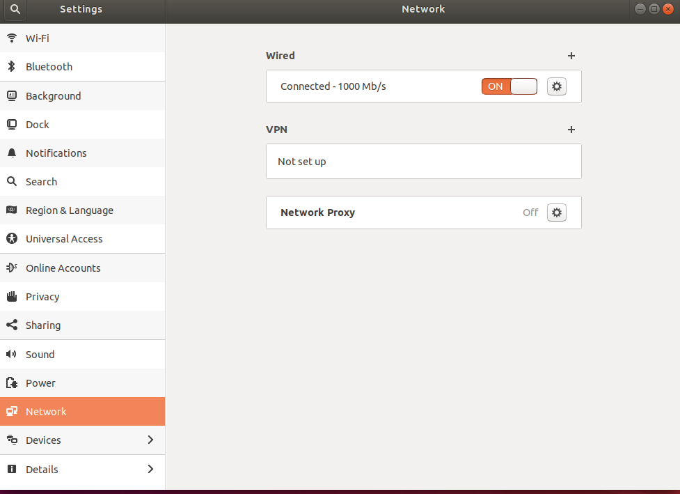
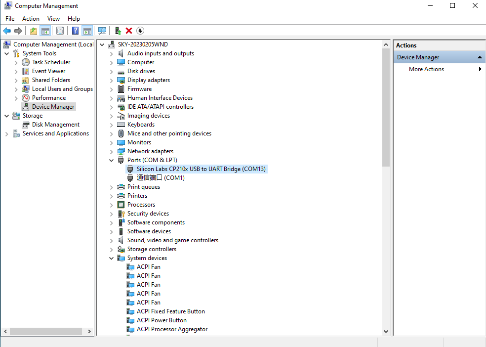
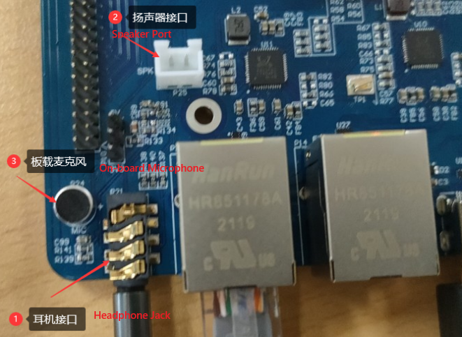
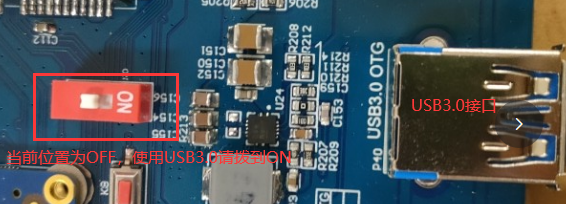

Linux6.1.118\_User’s Manual

Document classification: □ Top secret □ Secret □ Internal information ■ Open

## Copyright

The copyright of this manual belongs to Baoding Folinx Embedded Technology Co., Ltd. Without the written permission of our company, no organizations or individuals have the right to copy, distribute, or reproduce any part of this manual in any form, and violators will be held legally responsible.

Forlinx adheres to copyrights of all graphics and texts used in all publications in original or license-free forms.

The drivers and utilities used for the components are subject to the copyrights of the respective manufacturers. The license conditions of the respective manufacturer are to be adhered to. Related license expenses for the operating system and applications should be calculated/declared separately by the related party or its representatives. 

## Overview

This manual is designed to help you quickly familiarize yourselves with the product, understand interface functions, and learn testing methods. It primarily covers the testing of development board interface functions, methods for flashing the image, and troubleshooting common issues encountered during use. During testing, certain commands have been annotated for better understanding, focusing on practicality and adequacy. For kernel compilation, related application compilation methods, and development environment setup, please refer to the “User’s Compilation Manual” provided by Forlinx..

There are six chapters:

+ Chapter 1. briefly introduces the development board’s interface resources, relevant driver paths in the kernel source code, supported flashing and boot methods, and key points in the documentation;
+ Chapter 2. describes two login methods: serial port login and network login;
+ Chapter 3. covers the testing of desktop and QT interface functions;
+ Chapter 4. explains how to perform functional tests using command line operations;
+ Chapter 5. includes camera playback tests and video hardware encoding/decoding tests;
+ Chapter 6. details methods for updating the image to storage devices, allowing you to choose the appropriate flashing method based on your actual needs.

Additionally, the manual includes explanations of some symbols and formats.

| **Format**| **Meaning**|
|:----------:|----------|
| **Note** | Note or particularly important information must be read carefully.|
| 📚 | Relevant explanations regarding the testing section|
| ️️🛤️ ️ | Related paths.|
| <font style="color:#0000FF;"><font style="color:blue;background-color:#e5e5e5;">Blue font on gray background</font></font> | Refers to the command entered on the command line, which needs to be entered manually.|
| <font style="color:#0000FF;"><font style="color:black;background-color:#e5e5e5;">Black font on a gray background</font></font> | Serial output information after command input|
| **Black Bold font on a gray background**| Key information in the serial output:|
| //| Explanation of input commands or output information:|
| Username@Hostname| root@rk3568-buildroot: Development Board Serial Port Login Credentials;<br />forlinx@ok3568: Development board remote login credentials;<br />forlinx@Linux: Linux account for the development environment. |

You can use this information to identify the operating environment for functionality.

Example: Checking the Loading Status of the AW-CM358 Module Driver

```bash
root@rk3568-buildroot:~$ lsmod                                       //View loaded module
Module                  Size  Used by
moal                  602112  0
mlan                  466944  1 moal
```

+ root@rk3568-buildroot: Indicates the username is root and the hostname is rk3568-buildroot, meaning the operation is performed on the development board using the root account;
+ //: Denotes explanatory notes about commands or printed information; no input required;
+ <font style="color:#0000FF;"><font style="color:blue;background-color:#e5e5e5;">lsmod</font></font>: Displayed with gray background and blue text, indicating commands that need to be manually entered;
+ **moal 602112 0**: Text with gray background and black font represents the output after entering the command. Bolded text indicates key information, showing in this case that the module driver has been loaded.

## Application Scope

This software manual is designed for the OK3568\& OK3568J-C\& C21 platform running Linux6.1.118. While other platforms may also reference this manual, there could be differences that require adjustments for the specific use.

## Revision History

| **Date**| **Version**| **SoM Version**| **Carrier Board Version**| **Revision History**|
|:----------:|:----------:|:----------:|:----------:|:----------:|
| 18/05/2026| V1.0| V1.0| V1.1 and above| User’s Manual Initial Version.|
## 1\. OK3568 Development Board Description

### 1.1 OK3568-C/C21 Development Board Description

The RK3568 is a low-power, high-performance processor based on the ARM64 architecture. It features a quad-core Cortex-A55 CPU, an independent NEON coprocessor, and a Neural Network Processor Unit (NPU), making it suitable for applications in computers, smartphones, personal mobile internet devices, and digital multimedia equipment.

The FET3568-C and FET3568-C2 SoMs share the same pin definitions and can be used with the same carrier board. When the FET3568-C is combined with the OK3568-C carrier board, the development board is named the OK3568-C Development Board. When the FET3568-C2 is combined with the OK3568-C carrier board, the development board is named the OK3568-C21 Development Board.

Connection method: Board-to-board.


**Front**


**Back**

**Note: Hardware specifications are not covered in this software manual. Before development, please refer to the “ User’s Hardware Manual” to understand the product naming and hardware configuration.**

### 1.2 Linux 6.1.118 System Software Resources

| **Device**| **Driver Source Code Location in the Kernel**| **Device Name**|
|----------|----------|----------|
| LCD Backlight Driver| drivers/video/backlight/pwm\_bl.c| /sys/class/backlight|
| USB Interface:| drivers/usb/storage/|
| USB Mouse| drivers/hid/usbhid/| /dev/input/mice|
| Ethernet| drivers/net/ethernet/stmicro/stmmac|
| SD/micro TF card driver| drivers/mmc/host/dw\_mmc-rockchip.c| /dev/block/mmcblk1pX|
| EMMC Driver| drivers/mmc/host/dw\_mmc-rockchip.c| /dev/block/mmcblk2pX|
| OV13850| drivers/media/i2c/ov13850.c| /dev/videoX|
| OV13855| drivers/media/i2c/ov13855.c| /dev/videoX|
| LCD controller| drivers/gpu/drm/rockchip/rockchip\_drm\_vop.c|
| MIPI CSI| drivers/phy/rockchip/phy-rockchip-mipi-rx.c|
| MIPI DSI| drivers/phy/rockchip/phy-rockchip-inno-mipi-dphy.c|
| LCD touch driver| drivers/input/touchscreen/gt9xx/\*   drivers/input/touchscreen/edt-ft5x06.c| /dev/input/eventX|
| RTC Real - Time Clock| drivers/rtc/rtc-rx8010.c   drivers/rtc/rtc-pcf8563.c| /dev/rtc0|
| Serial Port| drivers/tty/serial/8250/8250\_dw.c| /dev/ttySX|
| Button driver| drivers/input/keyboard/adc-keys.c| /dev/input/eventX|
| LED| drivers/leds/leds-gpio.c|
| I2S| sound/soc/rockchip/rockchip\_i2s.c|
| Audio Driver| sound/soc/codecs/rk817\_codec.c| /dev/snd/|
| PMIC| drivers/mfd/rk808.c|
| PCIE| drivers/pci/controller/pcie-rockchip.c|
| Watchdog| drivers/watchdog/dw\_wdt.c|
| SPI| drivers/spi/spi-rockchip.c|

### 1.3 eMMC Storage Partition Table

The table below details the eMMC storage partition information for the Linux operating system (The size of a block is 512 bits when calculating.):

| **Partition Index**| **Name**| **Offset/Block**| **Size/Block**| **Content**|
|:----------:|:----------:|:----------:|:----------:|:----------:|
| N/A| loader| 0x00000000| 0x00003fc0| MiniLoaderAll.bin|
| 1| uboot| 0x00004000| 0x00002000| uboot.img|
| 2| env| 0x00006000| 0x00002000| env.img|
| 3| misc| 0x00008000| 0x00002000| misc.img|
| 4| boot| 0x0000a000| 0x00020000| boot.img|
| 5| recovery| 0x0002a000| 0x00040000| recovery.img|
| 6| logo| 0x0006a000| 0x00010000| logo.img|
| 7| userdata| 0x0007a000| 0x00400000| userdata.img|
| 8| rootfs| 0x0047a000| Remaining Space| rootfs.img|

Use the fdisk -l command on the development board to see the partition size:

```bash
root@OK3568-C-buildroot:~# fdisk -l
Found valid GPT with protective MBR; using GPT

Disk /dev/mmcblk0: 60620800 sectors,  928M
Logical sector size: 512
Disk identifier (GUID): 51380000-0000-4b6d-8000-600700003bdc
Partition table holds up to 128 entries
First usable sector is 34, last usable sector is 60620766

Number  Start (sector)    End (sector)  Size Name
     1           16384           24575 4096K uboot
     2           24576           32767 4096K env
     3           32768           40959 4096K misc
     4           40960          172031 64.0M boot
     5          172032          434175  128M recovery
     6          434176          499711 32.0M logo
     7          499712         4694015 2048M userdata
     8         4694016        60620766 26.6G rootfs
```

## 2\. Fast Startup

### 2.1 Preparation Before Startup

+ 12V2A or 12V3A DC power cable
+ Debug port cable

**Note: Ensure the Wi-Fi antenna is properly installed before switching on the device.**



### 2.2 Debugging Serial Port Driver Installation

The OK3568-C platform features a Type-C port for serial debugging and an onboard USB-to-UART chip. No additional USB-to-serial debugging tool is required, making the setup simple and convenient.

To install the driver, please use the driver package CP210x\_VCP\_Windows\_XP\_Vista provided in the \\\\ Table of Contents 3- Tools directory of the software materials.

Once the files have been extracted, run CP210xVCPInstaller\_x86.exe on a 32-bit operating system, or CP210xVCPInstaller\_x64.exe on a 64-bit operating system.

### 2.3 Serial Port Login

#### 2.3.1 Serial Connection Settings

**Note:**

+ **Serial Port: Used for terminal login;  
  Login User: The serial terminal automatically logs in as the root user.**

+ **Settings: Baud rate 115200, 8 data bits, 1 stop bit, no parity/flow control;**

+ **Hardware Requirements: **

  **Type-C for connecting PC and development board;**

+ **Software Requirements:  
A serial terminal application must be installed on the PC Windows. There are various terminal programs available, and you may choose any one you are familiar with.**

Take putty as an example to introduce the setting mode of the putty terminal:

Step 1: Confirm the serial port number connected to the computer, checking the port number in Device Manager, based on the actual port recognized by the computer;



Step 2: Configure PuTTY: Open PuTTY. In the “Serial line” field, enter the identified COM port and set the baud rate to 115200;


Step 3: After completing the above settings, enter the COM port number used by your computer in the “Saved Sessions” field (as shown in the following figure, using COM24 as an example), and save the configuration. Subsequently, when reopening the serial port, simply click the saved port number to directly apply the settings.


#### 2.3.2 Serial Port Login

After the PC terminal software is configured, connect the PC and the development board using a serial cable, then power on the device after connecting the power supply. The startup information can be viewed through the terminal software.

The following startup message indicates a successful boot, and you can press Enter to create a new command line:


### 2.4 Network Login

#### 2.4.1 Network Login Test

 **Note:**

+ **When leaving the factory, the default configuration of the network card is static IP, and the IP address is 192.168.0.232. For the method of changing the static IP, please refer to the "Ethernet Configuration" test section;**
+ **The computer and the development board need to be in the same network segment during the test.**

Before logging in to the network, you need to ensure that the network connection between the computer and the development board is normal. You can test the connection status between the computer and the development board through the ping command. Specific Operations:

Connect the eth0 of the development board to the computer via a network cable, power on the development board, and after the kernel starts, the Blue heartbeat light on the SoM will flash. After the network card connected to the computer starts normally, the network card light will flash rapidly. At this point, you can test the network connection;

Disable the computer firewall.

Temporarily disable the computer’s firewall (this is a general operation; specific steps depend on your Windows version).


Open Command Prompt as administrator.

Press Win + R, type cmd, then press Ctrl + Shift + Enter to run Command Prompt as administrator.


#### 2.4.2 SSH the server

 **Note:**

+ **When leaving the factory, the default configuration of the network card is static IP, and the IP address is 192.168.0.232. For the method of changing the static IP, please refer to the "Ethernet Configuration" test section;**
+ **Log in as the root user (no password required).**

Use SSH to log in to the development board.


#### 2.4.3 SFTP

The OK3568 development board supports SFTP and this service is automatically enabled at start-up. The following describes how to utilize the FTP tool for file transfer.

+ Path: User Profile\\3-Tools\\FileZilla\*

Install FileZilla tool on Windows and follow the steps shown in the figure below for settings.

**Note:** 

- **For this function, you need to connect a network cable to the development board. The host IP setting and the client are in the same network segment. Make sure that the host and the client are in the same LAN. The user name is root (without password);**

- **The following is tested with the development board IP 192.168.0.232. Please modify it according to the actual situation.**


### 2.5 Screen Switch

The OK3568 supports various display interfaces including LVDS/LCD, MIPI DSI/eDP, and HDMI, and can simultaneously display content on up to three screens in either mirrored or extended mode. Currently, the display switching can be controlled in two ways: 1. Dynamic control via the U-Boot menu; 2. Static control specified in the kernel device tree.

**Note: Screen switching is controlled via the touch screen. By default, the factory image outputs video to the LVDS, MIPI, and HDMI interfaces, with the touch functionality mapped to the LVDS screen. To enable touch functionality on the MIPI screen, the LVDS screen output must be disabled during the screen selection phase.**

#### 2.5.1 Dynamic Control via U-Boot Menu

This method allows you to switch between supported display screens without recompiling or re-flashing the system.

During the U-Boot auto-boot process, pressing Ctrl+C on the serial terminal will bring up the control options.

```plain
Hit key to stop autoboot('CTRL+C'):  0
---------------------------------------------
0:Exit to console
1:Reboot
2:Display type
3:Change kernel loglevel( level 1 )
---------------------------------------------
```

Input 2 on the terminal to enter the screen control submenu.

```plain
---------------------------------------------
hdmi==>off mipi_edp==>off lvds_rgb=>off
Select  display
0:Exit
1:hdmi display off
2:mipi_edp display off
3:lvds_rgb display off		
---------------------------------------------
```

Here, you can choose from: HDMI, MIPI-DSI, eDP, LVDS. Pressing the corresponding option toggles the screen on or off. MIPI-DSI and eDP can be switched at option 2. The options are as follows:

| **Terminal Input**| **Screen Selection Parameter**| **Parameters Meaning**|
|:----------:|:----------:|:----------:|
| 0| Exit| Return to the previous menu|
| 1| hdmi display off| Enable HDMI screen output|
| 2| mipi\_edp display off| Enable MIPI-DSI/eDP screen output|
| 3| lvds\_rgb display off| Enable LVDS screen output|

Taking opening the eDP screen as an example. Press 2, and the print information changes:

```plain
---------------------------------------------
hdmi==>off mipi_edp==>mipi lvds_rgb=>off
Select  display
0:Exit
1:hdmi display off
2:mipi_edp display mipi
3:lvds display off
---------------------------------------------
```

As seen above, the bolded text switches to the MIPI screen signal output. Pressing 2 again, and the print information changes:

```plain
---------------------------------------------
hdmi==>off mipi_edp==>edp lvds_rgb=>off
Select  display
0:Exit
1:hdmi display off
2:mipi_edp display edp
3:lvds display off
---------------------------------------------
```

As shown above, switching the bold font will change the output to an eDP screen signal. After selecting this option, follow the menu prompts to exit and restart. Pressing digit 0 will print information changes.

```plain
---------------------------------------------
0:Exit to console
1:Reboot
2:Display type
3:Change kernel loglevel( level 1 )
---------------------------------------------
```

Pressing digit 1 will initiate the restart operation, and the screen option in the U-Boot phase will take effect after reboot.

After selecting the screen, you can also press the reset button on the development board to restart, and the settings will take effect after the system restarts.

#### 2.5.2 Kernel Device Tree Specification

This method does not require a serial terminal connection. The system image is configured with the default desired settings, making it suitable for mass production. However, manual modification of the device tree is required, followed by regeneration of the system image.

**Note: This method takes precedence over the U-Boot screen selection. After modifying the device tree, the U-Boot screen selection will no longer be effective.**

The device tree path is: kernel/arch/arm64/boot/dts/rockchip/OK3568-C-common.dtsi.

In the kernel source code, open the device DTSI file and locate the following node:


The node is disabled by default and needs to be changed to "okay" to enable it. Modify according to the screen requirements.

For example:

To disable HDMI and LVDS screens, change their property to "off". For eDP, modify the corresponding property to "edp".


After saving, recompile to generate the image.

For MIPI screens, there are many types, and the existing timing and control words may not meet the requirements. You may need to manually modify the display-timings under the DSI node. However, any display-related node's status property should be handled as per the default settings, as the program will automatically control it.

### 2.6 Printing-level Adjustment

OK3568 supports dynamic control of the kernel verbosity level via the U-Boot menu during the U-Boot phase.

During the U-Boot auto-boot process, pressing Ctrl+C on the serial terminal will bring up the control options.

```plain
---------------------------------------------
0:Exit to console
1:Reboot
2:Display type
3:Change kernel loglevel( level 1 )
---------------------------------------------
```

The default kernel print level is 1; press the number 3 to set the kernel print level to 7.

```plain
---------------------------------------------
0:Exit to console
1:Reboot
2:Display type
3:Change kernel loglevel( level 7 )
---------------------------------------------
```

Press the number 1 to restart the system.

### 2.7 Enabling PCIe 3.0 Features

OK3568 supports dynamic control of PCIe 3.0 feature enablement via the U-Boot menu during the U-Boot phase.

During U-Boot automatic startup, pressing`ctrl+c`on the serial terminal will trigger a control menu:

```plain
Hit key to stop autoboot('CTRL+C'):  0
---------------------------------------------
0:Exit to console
1:Reboot
2:Display type
3:Change kernel loglevel( level 1 )
4:Enable PCIE3 function( state on)
---------------------------------------------
```

The default kernel enables PCIe 3.0; press the number 4 to disable PCIe 3.0.

```plain
Hit key to stop autoboot('CTRL+C'):  0
---------------------------------------------
0:Exit to console
1:Reboot
2:Display type
3:Change kernel loglevel( level 1 )
4:Enable PCIE3 function( state off)
---------------------------------------------
```

Press the number 1 to restart the system.

### 2.8 System Shutdown

In general, you can directly power off the system. However, if operations such as data storage or functional usage are in progress, avoid cutting power abruptly to prevent irreversible file damage, which may require re-flashing the firmware. To ensure all data is fully written, you can execute the sync command to complete data synchronization before powering off.

**Note: For products based on the SoM design, if unexpected power loss occurs during use, leading to system shutdown issues, power loss protection measures can be incorporated into the design.**

## 3\. OK3568 Interface Function Testing

The OK3568 platform provides excellent support for Qt, particularly for multimedia-related classes such as video decoding and playback, camera integration, video recording, etc. It achieves optimal performance by utilizing hardware encoding/decoding and OpenGL.

### 3.1 Interface Function Description

After booting, the development board will display the following desktop:


### 3.2 Touch Function Overview

When the development board is connected to LVDS and MIPI screens, both display and touch functionalities will work. If touch functionality for a specific display needs to be disabled, refer to "2.5.1 Dynamic Control via U-Boot Menu," to turn off the corresponding display output.

### 3.3 Hardware Decoding Experience

Click the desktop icon to open the video player.


Application Icons


**Note: The directory where the test video file is located: /userdata/media/\*.mp4.**

### 3.4 Camera Test

Click the desktop icon to open the qcamera video player application. This test application supports both USB cameras and the OV13855 camera. Insert a USB camera, such as the RMONCAM 720P.

**Note: The camera must be connected before opening the application.**


Application Icons


Application Interface

Once the application is opened, click UVC Camera to start the camera preview.


In Video Mode, click the record button to begin recording. To stop recording, click the recording button. The generated video file will be saved at /userdata/VIDEO0.MOV.

Playback testing can be done using the command: gst-play-1.0 /userdata/VIDEO0.mov.

Click the Video Mode button to switch to photo mode, then click Capture to take a photo.


The generated files will be stored in the /userdata path.


For sensors like the OV13855 and other raw sensors, each sensor corresponds to five device nodes:


Mainpath: This is an output node from the Rockchip ISP capable of outputting full-resolution images, typically used for taking photos and capturing raw images.

Self Path: This is another output node from the Rockchip ISP that can output up to 1080p resolution, typically used for previewing.

Statistics: This node is used for 3A statistics.

Input-params: This node is used for setting 3A parameters.

Once you have opened the app, tap rkisp\_mainpath to launch the OV13855 camera preview.


The procedures for recording video and taking photographs are the same as for a USB webcam.

### 3.5 OpenGL Test

OK3568 supports OpenGL ES3.2, click the desktop icon for OpenGL testing.


Application Icons


Application Interface

### 3.6 Music Playback Test

“musicplayer” is a simple audio test application that can be used to test whether the sound card functions normally and also serves as a simple audio player.


Application Icons


Application Interface

Click the button in the lower left corner and select the audio test file /userdata/media/test.mp3.

### 3.7 Recording Test

The "Audiorecorder" is an audio recording test application that can be used to verify if the sound card recording functionality is working properly:


Application Icons


Application Interface

Click the drop-down menu to select the input device, audio format, and audio channel. Click the output file dir text box to enter the output path and name for the recording file. Set File Container to audio/ogg, Channels to 1, and keep the remaining settings as default. Click Record to start recording. The recorded audio file can be played back using gst-play-1.0.

Click “Exit” to quit the test.

### 3.8 4G/ 5G Test

**Note: This test requires a working SIM card with internet access to be inserted. For detailed operational instructions, please refer to Section 4.19 4G EM05 Module Test in the manual.**

The “4G/ 5G” test program is used to test the OK3568 external 5G module (RM500U). Before testing, power off the development board, connect the 5G module, insert the SIM card, power on the development board, and open the test application.

The test supports the 4G module (EM05). Insert the 4G module and SIM card in case of power failure, and open the test application after the power-on system is started.


Application Icons


Application Interface

Click the Start button, and the program will automatically initiate the dial-up process to obtain an IP address, configure DNS, etc. Please wait for a few seconds. Once an IP address is displayed on the screen, you may exit the application. Refer to the Browser Test chapter for testing. If the application can successfully access the Forlinx Embedded official website, it indicates a successful connection.

### 3.9 WiFi Test

The “WiFi” test program is used to evaluate the Wi-Fi functionality of the OK3568. The OK3568 platform comes with the AW-CM358 module on-board by default. The Wi-Fi module will appear as the mlan node in the system, with this test corresponding to mlan0 (use other nodes if there are multiple devices):

**Note: Ensure the Wi-Fi antenna is properly installed before switching on the device.**


Application Icons


Application Interface

By default, the OK3568 carrier board is equipped with the AW-CM358 module, and only the mlan0 node is available. This example demonstrates the use of the Wi-Fi tool with mlan0.

Select mlan0, enter the SSID of the router you wish to connect to in the SSID field, input the router's password in the PAWD field, and click connect to establish a Wi-Fi connection to the router. Once an IP address is entered in the IP field, click ping to check if the current Wi-Fi network is stable.

Open the WiFi test application, enter the correct network name and password, click connect, and after waiting for 5 seconds, click status to view the connection status.

After a successful connection, click “ping” to perform a network test.


### 3.10 Network Configuration Test

The OK3568 supports selecting between DHCP and Static modes through the "Network" network configuration application. In Static mode, you can configure the IP address, subnet mask, gateway, and DNS.


Application Icons

Interface:


Select eth0 or eth1, choose DHCP, and click “Setting” at the bottom of the interface to restart the network and automatically obtain an IP address.

Click STATIC, select Set Static IP, enter the desired IP address in the IP field, enter the subnet mask in the netmask field, input the gateway in the gateway field, and enter the DNS in the DNS field. You can then restart the network and set a static IP address.

Clicking “Setting” will automatically tick the “Enable”, indicating that the network port is active; unticking it will deactivate the network port.

After entering the URL, click ping. The result will be displayed in the left-side prompt box, as shown below:


**Note: The IP and other information configured in static mode will be saved in the system's relevant configuration files, so the network settings will persist after each reboot. However, the network information configured in DHCP mode does not need to be considered, as an IP address will be dynamically assigned each time the system restarts.**

### 3.11 Browser Test

“SimpleBrowser” is a straightforward and practical web browser. Please ensure the network connection is stable when using it. Accessing external websites requires DNS to be functional. Upon launch, the browser will default to the official website of Forlinx Embedded.


Interface:

**Note: If the development board’s time is abnormal, it may cause certificate issues. After using the browser, avoid turning off the power immediately. If you need to turn off the power, run the sync command in the command line first, otherwise, the browser may crash and fail to operate properly, requiring a re-flash to resolve the issue.**


To exit the browser, use the navigation bar: File -> Quit.

### 3.12 Watchdog Test

"WatchDog" is an application used to test the proper functioning of the watchdog:


Application Icons


Click start to enable the watchdog feeding function, which will automatically feed the watchdog at intervals. At this point, the system will not restart. When feed dog is unchecked, the countdown timer will begin (5 seconds), and the system will restart, indicating that the watchdog function is working correctly.

### 3.13 Key Test

"Keypad" is used to test the platform built-in keys:


Application Icons


Application Interface

By default, the OK3568 platform configures the four physical buttons—V+, V-, Home and ESC—as the volume up button, volume down button, Home button and Back button respectively. When a key is pressed, the corresponding button in the test application will turn blue, indicating that the key function is working properly.

Press X to exit the current test and return to the system desktop.

### 3.14 RTC Test

The "RTC" application allows you to view and set the current system time:


Application Icons


Application Interface

After selecting Manual, you can manually set the time. Choose date and time, click apply, and the time will be set. With an RTC backup battery installed, the time will persist even after power loss and reboot.

Click Auto for network time synchronization, and click apply to synchronize the time successfully.

### 3.15 SPI Test

Click the desktop icon to test the SPI interface on the OK3568 board: SPI0 features one chip-select (CS) interface, corresponding to /dev/spidev0.0.

SPI2 features two chip-select interfaces, corresponding to /dev/spidev2.0 and /dev/spidev2.1 respectively.

According to the carrier board schematic, short the SPI2 transmit (TX) and receive (RX) pins, which correspond to PIN15 and PIN16 respectively. The loopback test does not require consideration of the CS interface.

If communicating with an external device, the corresponding /dev interface must be considered.


Application Icons


After creating the short circuit, open the test program and click the Send button to perform the transmit/receive test.Once the shorting is complete, open the test program.


### 3.16 UART Test

Click the desktop icon to test the UART interface on the OK3568 board:


Application Icons

The OK3568 serial port supports odd/even parity, 8 data bits, and 1 stop bit.

Before performing a serial loopback test, ensure the required serial port is shorted. There are UART3, UART4, UART5, and UART8 serial ports on the carrier board, as indicated in the carrier board schematic. UART2 is the debug serial port, and UART8 is for Bluetooth. The default device names for UART3, UART4, and UART5 in the development board are ttyS3, ttyS4, and ttyS5, respectively.

| **UART**| **Device Nodes**| **Description**|
|:----------:|:----------:|:----------:|
| UART2| /dev/ttyS2| The serial port cannot be directly used for this test.|
| UART3| /dev/ttyS3| TTL level, P7 led out, can be used for test.|
| UART4| /dev/ttyS4| TTL level, P7 led out, can be used for test.|
| UART5| /dev/ttyS5| TTL level, P7 led out, can be used for test.|
| UART8| /dev/ttyS8| Bluetooth Port|

This test utilises UART4 (ttyS4) and employs a loopback method to test the serial port. In accordance with the development board schematic, the transmit and receive pins of UART4—corresponding to PIN29 and PIN30 respectively—are short-circuited.


Once the shorting is complete, open the test program.

Click the settings on the right side, select the serial port and baud rate parameters, and click apply. The parameters will be set successfully. Next, click the first button on the right to establish a connection.


Application Interface

Click the "1" to automatically send the signal. Due to the shorting, the received "1" will also be displayed on the terminal.


### 3.17 Backlight Test

"BackLight" is the application for adjusting LCD backligh


Application Icons


Application Interface

Drag the slider on the screen to adjust the LCD backlight brightness.

## 4\. OK3568 Command Line Function Testing

The OK3568 platform comes with a rich set of command-line tools for users to utilize.

### 4.1 System Information Query

View kernel and CPU information:

```bash
root@OK3568-C-buildroot:~# uname -a
Linux OK3568-C-buildroot 6.1.118 #7 SMP Thu Feb  5 09:50:38 CST 2026 aarch64 GNU/Linux
```

View environment variable information:

```bash
root@OK3568-C-buildroot:~# env
SHELL=/bin/bash
GST_V4L2_PREFERRED_FOURCC=NV12:YU12:NV16:YUY2
GST_VIDEO_CONVERT_PREFERRED_FORMAT=NV12:NV16:I420:YUY2
PIXMAN_USE_RGA=1
CHROMIUM_FLAGS=--enable-wayland-ime
GST_V4L2_USE_LIBV4L2=1
WESTON_DRM_MIN_BUFFERS=2
WL_OUTPUT_VERSION=3
GST_INSPECT_NO_COLORS=1
EDITOR=/bin/vi
MALI_SCHED_RT_THREAD_PRIORITY=95
WESTON_DRM_KEEP_RATIO=1
GST_DEBUG_NO_COLOR=1
PWD=/root
LOGNAME=root
WESTON_VNC_MIN_BUFFERS=4
HOME=/root
LANG=en_US.UTF-8
ADB_TCP_PORT=5555
LS_COLORS=rs=0:di=01;34:ln=01;36:mh=00:pi=40;33:so=01;35:do=01;35:bd=40;33;01:cd=40;33;01:or=40;31;01:mi=00:su=37;41:sg=30;43:ca=00:tw=30;42:ow=
34;42:st=37;44:ex=01;32:*.tar=01;31:*.tgz=01;31:*.arc=01;31:*.arj=01;31:*.taz=01;31:*.lha=01;31:*.lz4=01;31:*.lzh=01;31:*.lzma=01;31:*.tlz=01;31
:*.txz=01;31:*.tzo=01;31:*.t7z=01;31:*.zip=01;31:*.z=01;31:*.dz=01;31:*.gz=01;31:*.lrz=01;31:*.lz=01;31:*.lzo=01;31:*.xz=01;31:*.zst=01;31:*.tzs
t=01;31:*.bz2=01;31:*.bz=01;31:*.tbz=01;31:*.tbz2=01;31:*.tz=01;31:*.deb
=01;31:*.rpm=01;31:*.jar=01;31:*.war=01;31:*.ear=01;31:*.sar=01;31:*.rar=01;31:*.alz=01;31:*.ace=01;31:*.zoo=01;31:*.cpio=01;31:*.7z=01;31:*.rz=
01;31:*.cab=01;31:*.wim=01;31:*.swm=01;31:*.dwm=01;31:*.esd=01;31:*.avif=01;35:*.jpg=01;35:*.jpeg=01;35:*.mjpg=01;35:*.mjpeg=01;35:*.gif=01;35:*
.bmp=01;35:*.pbm=01;35:*.pgm=01;35:*.ppm=01;35:*.tga=01;35:*.xbm=01;35:*.xpm=01;35:*.tif=01;35:*.tiff=01;35:*.png=01;35:*.svg=01;35:*.svgz=01;35
:*.mng=01;35:*.pcx=01;35:*.mov=01;35:*.mpg=01;35:*.mpeg=01;35:*.m2v=01;35:*.mkv=01;35:*.webm=01;35:*.webp=01;35:*.ogm=01;35:*.mp4=01;35:*.m4v=01
;35:*.mp4v=01;35:*.vob=01;35:*.qt=01;35:*.nuv=01;35:*.wmv=01;35:*.asf=01;35:*.rm=01;35:*.rmvb=01;35:*.flc=01;35:*.avi=01;35:*.fli=01;35:*.flv=01
;35:*.gl=01;35:*.dl=01;35:*.xcf=01;35:*.xwd=01;35:*.yuv=01;35:*.cgm=01;35:*.emf=01;35:*.ogv=01;35:*.ogx=01;35:*.aac=00;36:*.au=00;36:*.flac=00;3
6:*.m4a=00;36:*.mid=00;36:*.midi=00;36:*.mka=00;36:*.mp3=00;36:*.mpc=00;36:*.ogg=00;36:*.ra=00;36:*.wav=00;36:*.oga=00;36:*.opus=00;36:*.spx=00;
36:*.xspf=00;36:*~=00;90:*#=00;90:*.bak=00;90:*.old=00;90:*.orig=00;90:*.part=00;90:*.rej=00;90:*.swp=00;90:*.tmp=00;90:*.dpkg-
dist=00;90:*.dpkg-old=00;90:*.ucf-dist=00;90:*.ucf-new=00;90:*.ucf-old=00;90:*.rpmnew=00;90:*.rpmorig=00;90:*.rpmsave=00;90:
WESTON_FREEZE_DISPLAY=/tmp/.freeze_weston
WAYLANDSINK_FORCE_DMABUF=1
GST_V4L2SRC_DEFAULT_DEVICE=/dev/video-camera0
QT_QPA_PLATFORM=wayland
USB_FW_VERSION=0x0310
TERM=xterm-color
USER=root
AUTOAUDIOSINK_PREFERRED=pulsesink
ADBD_SHELL=/bin/bash
GST_V4L2SRC_RK_DEVICES=_mainpath:_selfpath:_bypass:_scale
WESTON_DRM_MIRROR=1
SHLVL=1
GST_VIDEO_FLIP_USE_RGA=1
USB_FUNCS=adb
WESTON_DISABLE_ATOMIC=1
USB_MANUFACTURER=Rockchip
USB_PRODUCT=rk3xxx
XDG_RUNTIME_DIR=/var/run
USB_VENDOR_ID=0x2207
PLAYBIN2_PREFERRED_AUDIOSINK=pulsesink
GST_VIDEO_CONVERT_USE_RGA=1
PATH=/usr/bin:/usr/sbin
GST_V4L2SRC_MAX_RESOLUTION=3840x2160
GST_VIDEO_DECODER_QOS=0
_=/usr/bin/env
```

### 4.2 Frequency Test

The RK3568 utilises a quad-core Cortex-A55 processor; the SoM numbers and frequency adjustment rules are as follows:

| **SoM Type**| **SoM ID**| **Tuning Strategy**|
|:----------:|:----------:|:----------:|
| Cortex-A55| cpu0 ~ cpu3| Share the same frequency domain; adjusting the frequency of any one core causes the other three cores to change synchronously.|

All cpufreq governor types supported in the current kernel:

```bash
root@OK3568-C-buildroot:~# cat /sys/devices/system/cpu/cpu0/cpufreq/scaling_available_governors
interactive conservative ondemand userspace powersave performance schedutil
```

| **Tuning Strategy**| **Description**|
|:----------:|----------|
| interactive| Designed specifically for mobile devices (such as Android).|
| ondemand| Adjusts dynamically based on current CPU utilisation.|
| conservative| Similar to ondemand, but with smoother frequency adjustments. The frequency increases or decreases gradually, rather than jumping directly to the maximum.|
| userspace| Delegate control of the frequency to the user-space programme.|
| powersave| Set the CPU frequency to the minimum.|
| performance| Set the CPU frequency to the maximum.|
| schedutil| It is tightly coupled with the Linux scheduler (such as CFS) and uses the CPU utilisation information (util\_avg) provided by the scheduler to dynamically adjust the frequency.|

Among these, userspace represents user mode, which allows other user programs to adjust CPU frequency in this mode.

View the frequency scaling levels supported by the current CPU.

```bash
root@OK3568-C-buildroot:~# cat /sys/devices/system/cpu/cpu0/cpufreq/scaling_available_frequencies
408000 600000 816000 1104000 1416000 1608000 1800000 1992000
```

Set to userspace mode and modify the frequency to 1800000:

```bash
root@OK3568-C-buildroot:~# echo userspace > /sys/devices/system/cpu/cpu0/cpufreq/scaling_governor
root@OK3568-C-buildroot:~# echo 1800000 > /sys/devices/system/cpu/cpu0/cpufreq/scaling_setspeed
```

To view the current frequency after modification:

```bash
root@OK3568-C-buildroot:~# cat /sys/devices/system/cpu/cpu0/cpufreq/cpuinfo_cur_freq
1800000
```

### 4.3 Temperature Test

To view temperature values:

```bash
root@OK3568-C-buildroot:~# cat /sys/class/thermal/thermal_zone0/temp
55000
```

The temperature value is 55℃.

### 4.4 DDR Test

```bash
root@OK3568-C-buildroot:/# memory_bandwidth.sh
```

Taking OK3568-C as an example, the printed information is as follows:


The write bandwidth is approximately 1437M/s, and the read bandwidth is approximately 4734M/s.

### 4.5 Key Test


Use the “keytest” command-line tool to test the keys. Currently, “keytest” supports testing the four keys on the base plate: V+, V-, Home and ESC, with key codes 115, 114, 139 and 158 respectively. When the keys are pressed and released in sequence, the terminal will d isplay the following output:

Execute the following command:

```shell
root@OK3568-C-buildroot:~# fltest_keytest
Available devices:
/dev/input/event4:    adc-keys
key115 Presse
key115 Released
key114 Presse
key114 Released
key139 Presse
key139 Released
key158 Presse
key158 Released
```

### 4.6 Serial Port Test

The OK3568 serial port supports odd/even parity, 8 data bits, and 1 stop bit.

Before performing a serial loopback test, ensure the required serial port is shorted. There are UART2, UART3, UART4, UART5, and UART8 serial ports on the carrier board, as indicated in the carrier board schematic. UART2 is the debug serial port, and UART8 is for Bluetooth. The available serial ports are UART3, UART4 and UART5, which correspond to the device names ttyS3, ttyS4 and ttyS5 on the development board.

| **UART**| **Device Nodes**| **Description**|
|:----------:|:----------:|:----------:|
| UART2| /dev/ttyS2| The serial port cannot be directly used for this test.|
| UART3| /dev/ttyS3| TTL level, P7 led out, can be used for test.|
| UART4| /dev/ttyS4| TTL level, P7 led out, can be used for test.|
| UART5| /dev/ttyS5| TTL level, P7 led out, can be used for test.|
| UART8| /dev/ttyS8| Bluetooth Port|

This test utilises UART4 (ttyS4) and employs a loopback method to test the serial port. In accordance with the development board schematic, the transmit and receive pins of UART4—corresponding to PIN29 and PIN30 respectively—are short-circuited.


Once the shorting is complete, open the test program.

```bash
root@OK3568-C-buildroot:~# fltest_uarttest -d /dev/ttyS4
Welcome to uart test
Send test data:
forlinx_uart_test.1234567890...
Read Test Data finished,Read:
forlinx_uart_test.1234567890...
```

If the following content is printed on the serial port after execution, it indicates that the serial communication is working normally.

### 4.7 SPI Test

2 x SPI are routed out from the carrier board. By default, the software configures it as spidev for loopback testing. During testing, please refer to the schematic diagram and short-circuit MOSI (PIN15) to MISO (PIN16), then carry out the test using the commands below.


Without shorting SPI2\_MOSI to SPI2\_MISO, execute the test command:

```bash
root@OK3568-C-buildroot:~# fltest_spidev_test -D /dev/spidev2.0
spi mode: 0
bits per word: 8
max speed: 500000 Hz (500 KHz)

00 00 00 00 00 00
00 00 00 00 00 00
00 00 00 00 00 00
00 00 00 00 00 00
00 00 00 00 00 00
00 00 00 00 00 00
00 00
```

Short-circuit SPI2\_MOSI and SPI2\_MISO, then execute the test command:

```bash
root@OK3568-C-buildroot:~# fltest_spidev_test -D /dev/spidev2.0
spi mode: 0
bits per word: 8
max speed: 500000 Hz (500 KHz)

FF FF FF FF FF FF
40 00 00 00 00 95
FF FF FF FF FF FF
FF FF FF FF FF FF
FF FF FF FF FF FF
DE AD BE EF BA AD
F0 0D
```

### 4.8 Watchdog Test

Watchdog is a commonly used function in embedded systems. The device node for the watchdog in OK3568 is /dev/watchdog. This test provides two testing programs. You can choose one based on the actual situation.

+ Start the watchdog, set the reset time to 10 seconds, and feed the dog at regular intervals.

Use fltest\_watchdog; this command enables the watchdog and performs a feed the dog operation, so the system will not reboot.

```bash
root@OK3568-C-buildroot:~# fltest_watchdog
Watchdog Ticking Away!
```

When using Ctrl+C to end the test program, feeding stops, and the watchdog remains open. After 10s, the system resets.

If you do not want a reset enter the command to close the watchdog within 10s after ending the program:

```bash
root@OK3568-C-buildroot:~# fltest_watchdog -d
Watchdog card disabled.   //Disable the watchdog
```

+ Start the watchdog, set the reset time to 10s, and do not feed it.

Execute the command fltest\_watchdogrestart. This command will enable the watchdog but will not perform a watchdog feed; the system will reboot after 10 seconds.

```bash
root@OK3568-C-buildroot:~# fltest_watchdogrestart
Restart after 10 seconds
```

**Note: Regarding the timeout mechanism: The timeout value set from user space is not directly passed to the hardware. The Watchdog driver internally maintains a table of 16 preset timeout values. The driver selects the closest value from this table as the actual timeout according to the following rules:**

| **Request timeout**| **Watchdog final timeout.**|
|:----------:|:----------:|
| timeout\_request > 89| timeout\_set = timeout\_request|
| 44 \< timeout\_request \<= 89| timeout\_set = 89|
| 22 \< timeout\_request \<= 44| timeout\_set = 44|
| 11 \< timeout\_request \<= 22| timeout\_set = 22|
| 5 \< timeout\_request \<= 11| timeout\_set = 11|
| 2\< timeout\_request \<= 5| timeout\_set = 5|
| timeout\_request = 2| timeout\_set = 2|
| timeout\_request = 1| timeout\_set = 1|

Therefore, the application request time-out is 10 seconds, whilst the actual final watchdog reset time is 11 seconds.

### 4.9 WiFi Test

**Note: Due to varying network environments, please configure according to your actual situation when conducting this experiment.**

The OK3568 platform supports the AW-CM358 Wi-Fi and Bluetooth combo module.

#### 4.9.1 STA Modes

Before using the Wi-Fi functionality, follow these steps to configure it:

Step 1: Assuming the Wi-Fi hotspot SSID is ChinaNet-Jvgv and the password is asdasd123,

input the following command in the terminal:

```bash
root@OK3568-C-buildroot:/# fltest_wifi.sh -i mlan0 -s "ChinaNet-Jvgv" -p asdasd123
```

In the above command:

| **Parameter**| **Meaning**|
|:----------:|----------|
| -i| The parameters used vary depending on the Wi-Fi module; specify the WiFi device name|
| -s| The actual Wi-Fi hotspot name to connect to.|
| -p| The parameter following -p refers to the password of the actual Wi-Fi hotspot to connect to; if the hotspot has no password, write NONE after -p.|

Step 2: Check if external network access is available by pinging the internet. Input the following command in the terminal:

```bash
root@OK3568-C-buildroot:~# ping www.forlinx.com
PING s-526319.gotocdn.com (211.149.226.120) 56(84) bytes of data.
64 bytes from 211.149.226.120: icmp_seq=1 ttl=53 time=31.6 ms
64 bytes from 211.149.226.120: icmp_seq=2 ttl=53 time=32.0 ms
64 bytes from 211.149.226.120: icmp_seq=3 ttl=53 time=33.2 ms
64 bytes from 211.149.226.120: icmp_seq=4 ttl=53 time=31.6 ms
64 bytes from 211.149.226.120: icmp_seq=5 ttl=53 time=31.6 ms
64 bytes from 211.149.226.120: icmp_seq=6 ttl=53 time=31.9 ms
```

To stop, press Ctrl+C. If the ping is successful, it indicates that the network is now working properly.

#### 4.9.2 AP Modes

Before using the hotspot functionality, ensure that the network interface is connected and can access the internet. As shown in the figure:

```bash
root@OK3568-C-buildroot:~# fltest_hostapd.sh
killall: hostapd: no process killed
killall: dnsmasq: no process killed
root@OK3568-C-buildroot:~# HT (IEEE 802.11n) with WPA/WPA2 requires CCMP/GCMP to be enabled, disabling HT capabilities
uap0: interface state UNINITIALIZED->ENABLED
uap0: AP-ENABLED
uap0: IEEE 802.11 driver had channel switch: freq=2452, ht=0, vht_ch=0x0, he_ch=0x0, offset=0, width=0 (20 MHz (no HT)), cf1=2452, cf2=0
uap0: CTRL-EVENT-CHANNEL-SWITCH freq=2452 ht_enabled=0 ch_offset=0 ch_width=20 MHz (no HT) cf1=2452 cf2=0 dfs=0
```

WiFi hotspot name: OK3568\_WIFI\_2.4G\_AP

Password:12345678

At this point, a mobile phone can connect to this hotspot and access the internet.

### 4.10 Bluetooth Testing

In the OK3568 development board, the carrier board AW-CM358 module integrates Bluetooth functionality. This section demonstrates data transmission between a mobile phone and the development board via Bluetooth, which supports Bluetooth 5.0. Please note that before testing Bluetooth, you must first complete the installation of the Wi-Fi module and firmware in accordance with the previous section, Wi-Fi Testing.

Bluetooth configuration:

```bash
root@OK3568-C-buildroot:~# bluetoothctl   // Open the bluez Bluetooth tool
hci0 new_settings: powered bondable ssp br/edr le secure-conn
Agent registered
[CHG] Controller 14:13:33:B3:01:64 Pairable: yes
[bluetooth]# power on    // Enable the Bluetooth device
Changing power on succeeded
[bluetooth]# pairable on   // Set to pairing mode
Changing pairable on succeeded
[bluetooth]# discoverable on    // Set to discoverable mode
hci0 new_settings: powered connectable bondable ssp br/edr le secure-conn
hci0 new_settings: powered connectable discoverable bondable ssp br/edr le secure-conn
Changing discoverable on succeeded
[CHG] Controller 14:13:33:B3:01:64 Discoverable: yes
[bluetooth]# agent on     // Activate the agent
Agent is already registered
[bluetooth]# default-agent   
Default agent request successful
```

Board Passive Pairing (Standard pairing process).

Turn on Bluetooth search on the mobile phone; a device named`OK3568-buildroot`will appear. Select it to pair.

The print information on the development board is as follows. Enter "yes":

```bash
[bluetooth]# default-agent
Default agent request successful
hci0 C8:BC:9C:7D:CA:3C type BR/EDR connected eir_len 5
[NEW] Device C8:BC:9C:7D:CA:3C C8-BC-9C-7D-CA-3C
hci0 C8:BC:9C:7D:CA:3C type BR/EDR connected eir_len 5
hci0 C8:BC:9C:7D:CA:3C type BR/EDR connected eir_len 5
hci0 C8:BC:9C:7D:CA:3C type BR/EDR connected eir_len 5
hci0 C8:BC:9C:7D:CA:3C type BR/EDR connected eir_len 14
hci0 C8:BC:9C:7D:CA:3C type BR/EDR connected eir_len 5
[CHG] Device C8:BC:9C:7D:CA:3C Name: Pura 70
[CHG] Device C8:BC:9C:7D:CA:3C Alias: Pura 70
hci0 C8:BC:9C:7D:CA:3C type BR/EDR connected eir_len 5
Request confirmation
[agent] Confirm passkey 241512 (yes/no): yes
hci0 new_link_key C8:BC:9C:7D:CA:3C type 0x05 pin_len 0 store_hint 1
hci0 device_flags_changed: C8:BC:9C:7D:CA:3C (BR/EDR)
     supp: 0x00000000  curr: 0x00000000
[CHG] Device C8:BC:9C:7D:CA:3C INFO: 0x0007 (7)
[CHG] Device C8:BC:9C:7D:CA:3C Bonded: yes
```

View and remove connected devices:

```bash
[C8-BC-9C-7D-CA-3C]# devices
Device C8:BC:9C:7D:CA:3C Pura 70
[C8-BC-9C-7D-CA-3C]# remove C8:BC:9C:7D:CA:3C
[DEL] Player /org/bluez/hci0/dev_C8_BC_9C_7D_CA_3C/player0 [default]
hci0 C8:BC:9C:7D:CA:3C type BR/EDR connected eir_len 5
[DEL] Transport /org/bluez/hci0/dev_C8_BC_9C_7D_CA_3C/fd0
[DEL] Endpoint /org/bluez/hci0/dev_C8_BC_9C_7D_CA_3C/sep1
[DEL] Endpoint /org/bluez/hci0/dev_C8_BC_9C_7D_CA_3C/sep2
[DEL] Endpoint /org/bluez/hci0/dev_C8_BC_9C_7D_CA_3C/sep3
hci0 C8:BC:9C:7D:CA:3C type BR/EDR connected eir_len 5
hci0 C8:BC:9C:7D:CA:3C type BR/EDR connected eir_len 5
hci0 C8:BC:9C:7D:CA:3C type BR/EDR connected eir_len 5
hci0 C8:BC:9C:7D:CA:3C type BR/EDR connected eir_len 5
hci0 C8:BC:9C:7D:CA:3C type BR/EDR disconnected with reason 2
[CHG] Device C8:BC:9C:7D:CA:3C ServicesResolved: no
Device has been removed
[CHG] Device C8:BC:9C:7D:CA:3C INFO: 0x0008 (8)
[CHG] Device C8:BC:9C:7D:CA:3C Connected: no
[DEL] Device C8:BC:9C:7D:CA:3C Pura 70
[bluetooth]#
```

Development board receives files

After successful pairing, you can send a file from the mobile phone to the OK3568-C development board via Bluetooth.

The received files are saved in the`/root/`.

```bash
root@OK3568-C-buildroot:~# ls /root/*.jpg
/root/IMG_20251208_205724.jpg
```

Send files from the development board.

You can send a file from the OK3568-C development board to a mobile phone. Test as follows:

```bash
root@OK3568-C-buildroot:~# fltest_obexctl.sh
[NEW] Client /org/bluez/obex
[obex]# connect C8:BC:9C:7D:CA:3C
Attempting to connect to C8:BC:9C:7D:CA:3C
[NEW] Session /org/bluez/obex/client/session1 [default]
[NEW] ObjectPush /org/bluez/obex/client/session1
Connection successful
[C8:BC:9C:7D:CA:3C]# send /userdata/media/test.mp3
Attempting to send /userdata/media/test.mp3 to /org/bluez/obex/client/session1
[NEW] Transfer /org/bluez/obex/client/session1/transfer0
Transfer /org/bluez/obex/client/session1/transfer0
[C8:BC:9Status: queued
[C8:BC:9Name: test.mp3
[C8:BC:9Size: 4818092
[C8:BC:9Filename: /userdata/media/test.mp3
[C8:BC:9Session: /org/bluez/obex/client/session1
[CHG] Transfer /org/bluez/obex/client/session1/transfer0 Status: active
[CHG] Transfer /org/bluez/obex/client/session1/transfer0 Transferred: 8046 (@8KB/s 09:57)
```

**Note: For certain manufacturers' phones, received files must include a file extension; otherwise, they may be rejected by the Android system. Therefore, please try to use files with extensions for testing.**

### 4.11 RTC Function Test

Mainly use the date and hwclock tools to set the software and hardware time. Test whether the software clock is synchronized with the RTC clock when the development board is powered off and then powered on. (Note: Ensure that a button battery is installed on the board and the battery voltage is normal.)


```bash
root@OK3568-C-buildroot:~# date -s "2025-2-9 10:50:00"		// Set the system time
Sun Feb  9 10:50:00 UTC 2025
root@OK3568-C-buildroot:~# date							            	// Read the system time
Sun Feb  9 10:50:00 UTC 2025 
root@OK3568-C-buildroot:~# hwclock -r					            // Check the hardware clock time
Sun Feb  9 10:52:11 2025  0.000000 seconds 
root@OK3568-C-buildroot:~# hwclock -w -u				           // Write the system time to the RTC after timezone calculation
// Power off and restart the development board, read the system time after entering the system to check if it matches the set time.
Note that do not connect to the external network, otherwise automatic time synchronization will be triggered.
root@OK3568-C-buildroot:~# date
Sun Feb  9 10:53:26 UTC 2025
```

### 4.12 USB Mouse Test

Connect a USB mouse to the USB port on the OK3568 platform, then enter the following command to view the kernel output.

```bash
root@OK3568-C-buildroot:~# dmesg | tail -10
```

Print information as follows:

```bash
[   13.057981] usb 6-1: new low-speed USB device number 2 using ohci-platform
[   13.302023] usb 6-1: New USB device found, idVendor=09da, idProduct=8736, bcdDevice= 1.01
[   13.302049] usb 6-1: New USB device strings: Mfr=1, Product=2, SerialNumber=0
[   13.302056] usb 6-1: Product: USB Mouse
[   13.302061] usb 6-1: Manufacturer: SIGMACHIP
[   13.310089] input: SIGMACHIP USB Mouse as /devices/platform/fd8c0000.usb/usb6/6-1/6-1:1.0/0003:09DA:8736.0001/input/input8
[   13.374320] hid-generic 0003:09DA:8736.0001: input,hidraw0: USB HID v1.10 Mouse [SIGMACHIP USB Mouse] on usb-fd8c0000.usb-1/input0
[   17.123416] platform mtd_vendor_storage: deferred probe pending
```

An arrow cursor appears on the screen, and the mouse is now working properly.

When the USB mouse is unplugged, the serial terminal will print the following:

```bash
[  216.880580] usb 6-1: USB disconnect, device number 2
```

At this point, the arrow cursor on the screen disappears, indicating that the mouse has been successfully removed.

### 4.13 USB 2.0/USB3.0

The OK3568 supports two USB 2.0 and two USB 3.0 interfaces. You can connect USB devices such as USB mice, USB keyboards, and USB flash drives to any of the onboard USB HOST interfaces, and these devices support hot-plugging. It is demonstrated with a USB drive. It is tested to support up to 128GB, and capacities above 128GB are not tested.


USB3.0 and OTG are multiplexed and can be switched using the DIP switch. When using the USB3.0 interface, make sure the DIP switch is in the ON position:


The terminal will print information about the USB drive. Since there are various USB drives, the displayed information may vary.

Step 1: After booting the development board, connect a USB flash drive to one of the USB host interfaces on the development board;

Enter the following command to view the kernel logs.

```bash
root@OK3568-C-buildroot:~# dmesg | tail -10
```

Serial port information:

```bash
[  609.687361] usb-storage 5-1:1.0: USB Mass Storage device detected
[  609.689206] scsi host0: usb-storage 5-1:1.0
[  610.724928] scsi 0:0:0:0: Direct-Access      USB      SanDisk 3.2Gen1 1.00 PQ: 0 ANSI: 6
[  610.744343] sd 0:0:0:0: [sda] 60125184 512-byte logical blocks: (30.8 GB/28.7 GiB)
[  610.745767] sd 0:0:0:0: [sda] Write Protect is off
[  610.745780] sd 0:0:0:0: [sda] Mode Sense: 43 00 00 00
[  610.746807] sd 0:0:0:0: [sda] Write cache: disabled, read cache: enabled, doesn't support DPO or FUA
[  610.755088]  sda: sda1
[  610.755622] sd 0:0:0:0: [sda] Attached SCSI removable disk
[  612.189451] FAT-fs (sda1): utf8 is not a recommended IO charset for FAT filesystems, filesystem will be case sensitive!
```

Step 2: Check the mount directory:

```bash
root@OK3568-C-buildroot:~# mount | grep "sda1"
/dev/sda1 on /run/media/sda1 type vfat (rw,relatime,gid=6,fmask=0007,dmask=0007,allow_utime=0020,codepage=936,iocharset=utf8,shortname=mixed,errors=remount-ro)
```

You can see that /run/media/sda1 is the mount path for the USB storage device.

Step 3: View the contents of the USB flash drive:

```bash
root@OK3568-C-buildroot:~# ls -l /run/media/sda1
drwxrwx--- 3 root disk      8192 Mar  4  2021  Music
```

Before performing read/write tests, ensure the CPU frequency is noted.

Write test:

```bash
root@OK3568-C-buildroot:~# dd if=/dev/zero of=/run/media/sda1/test bs=1M count=500 conv=fsync
500+0 records in
500+0 records out
524288000 bytes (524 MB, 500 MiB) copied, 46.2811 s, 11.3 MB/s//The write speed is limited to the specific storage device.
```

Read test:

**Note: To ensure accurate data, restart the development board before testing the read speed.**

```bash
root@OK3568-C-buildroot:~# dd if=/run/media/sda1/test of=/dev/null bs=1M
500+0 records in
500+0 records out
524288000 bytes (524 MB, 500 MiB) copied, 22.4822 s, 23.3 MB/s  
```

### 4.14 Backlight Adjustment

The brightness range for the backlight is (0–255), where 255 indicates the highest brightness and 0 turns off the backlight. Enter the following command in the terminal after system startup for backlight testing.

Check the current screen backlight value:

```bash
root@OK3568-C-buildroot:~# cat /sys/class/backlight/lvds-backlight/brightness		// Check the backlight value of the LVDS screen
200
root@OK3568-C-buildroot:~# cat /sys/class/backlight/dsi1-backlight/brightness		 // Check the backlight value of the DSI screen
200
root@OK3568-C-buildroot:~# cat /sys/class/backlight/edp-backlight/brightness		// Check the backlight value of the eDP screen
200
```

Turn off the backlight:

```bash
root@OK3568-C-buildroot:~# echo 0 >/sys/class/backlight/lvds-backlight/brightness      	// Turn off the backlight of the LVDS screen
root@OK3568-C-buildroot:~# echo 0 >/sys/class/backlight/dsi1-backlight/brightness        // Turn off the backlight of the DSI screen
root@OK3568-C-buildroot:~# echo 0 > /sys/class/backlight/edp-backlight/brightness		// Turn off the backlight of the eDP screen
```

Turn on the LCD backlight:

```bash

root@OK3568-C-buildroot:~# echo 255 >/sys/class/backlight/lvds-backlight/brightness       // Turn on the backlight of the LVDS screen
root@OK3568-C-buildroot:~# echo 255 >/sys/class/backlight/dsi1-backlight/brightness        // Turn on the backlight of the DSI screen
root@OK3568-C-buildroot:~# echo 255> /sys/class/backlight/edp-backlight/brightness		// Turn on the backlight of the eDP screen
```

### 4.15 TF Test

Insert the TF card into the TF card slot on the carrier board, then enter the following command:

```bash
root@OK3568-C-buildroot:~# dmesg | tail -10
```

Under normal circumstances, the following information will be printed:

```bash
[  828.034996] mmc1: card d555 removed
[  837.812489] mmc_host mmc1: Bus speed (slot 0) = 375000Hz (slot req 400000Hz, actual 375000HZ div = 0)
[  837.849204] mmc_host mmc1: Bus speed (slot 0) = 375000Hz (slot req 375000Hz, actual 375000HZ div = 0)
[  861.424589] mmc_host mmc1: Bus speed (slot 0) = 375000Hz (slot req 400000Hz, actual 375000HZ div = 0)
[  861.641784] mmc_host mmc1: Bus speed (slot 0) = 148500000Hz (slot req 150000000Hz, actual 148500000HZ div = 0)
[  861.658978] dwmmc_rockchip fe2b0000.mmc: Successfully tuned phase to 360
[  861.659049] mmc1: new ultra high speed SDR104 SDHC card at address aaaa
[  861.661146] mmcblk1: mmc1:aaaa SC16G 14.8 GiB
[  861.666663]  mmcblk1: p1
[  866.065715] FAT-fs (mmcblk1p1): utf8 is not a recommended IO charset for FAT filesystems, filesystem will be case sensitive!
```

By default, the TF card is mounted to the /run/media/ directory in the file system.

```bash
root@OK3568-C-buildroot:~# mount | grep mmcblk1  //查看挂载目录
/dev/mmcblk1p1 on /run/media/mmcblk1p1 type ext4 (rw,relatime)
```

Write test:

```bash
root@OK3568-C-buildroot:~# dd if=/dev/zero of=/run/media/mmcblk1p1/test bs=1M count=500 conv=fsync
500+0 records in
500+0 records out
524288000 bytes (524 MB, 500 MiB) copied, 27.53 s, 19.0 MB/s
```

Read test:

**Note: To ensure the accuracy of the data, please restart the development board to test the reading speed.**

```bash
root@OK3568-C-buildroot:~# dd if=/run/media/mmcblk1p1/test of=/dev/null bs=1M //读取测试
500+0 records in
500+0 records out
524288000 bytes (524 MB, 500 MiB) copied, 7.89507 s, 66.4 MB/s
```

### 4.16 EMMC Test

The eMMC on the OK3568 platform operates by default in HS200 mode at a clock speed of 200 MHz. Below is a brief test of the eMMC’s read and write speeds, using the ext4 file system as an example.

First, you can check the storage information on the current development board:

```bash
root@OK3568-C-buildroot:~# memInfo.sh
-------------------------------------------------------------
Memory Information
-------------------------------------------------------------

               total        used        free      shared  buff/cache   available
Mem:         3992828      162384     3595360       10116      235084     3779772
Swap:              0           0           0

Filesystem      Size  Used Avail Use% Mounted on
/dev/root        27G  1.3G   25G   5% /
devtmpfs        1.9G     0  1.9G   0% /dev
tmpfs           2.0G     0  2.0G   0% /dev/shm
tmpfs           780M  1.4M  779M   1% /run
tmpfs           2.0G  4.0K  2.0G   1% /tmp
/dev/mmcblk0p7  2.0G  461M  1.4G  25% /userdata
```

**Note: To ensure the accuracy of the data, please restart the development board to test the reading speed.**

```bash
root@OK3568-C-buildroot:~# dd if=/dev/zero of=/test bs=1M count=500 conv=fsync //Write test
500+0 records in
500+0 records out
524288000 bytes (524 MB, 500 MiB) copied, 3.79493 s, 138 MB/s
root@OK3568-C-buildroot:~# dd if=/test of=/dev/null bs=1M //Read test
500+0 records in
500+0 records out
524288000 bytes (524 MB, 500 MiB) copied, 2.9618 s, 177 MB/s      
```

### 4.17 Ethernet Configuration

The OK3568 board is equipped with two Gigabit Ethernet ports. With an Ethernet cable connected, the factory default configuration sets eth0 to a static IP, while eth1 is not configured.

#### 4.17.1  Methods for Setting a Static IP Address

**Note:** 

- **This method sets a static network IP. Once configured, the network interface card (NIC) should obtain the corresponding network IP, which indicates normal operation. If the network is unreachable (ping fails), ensure that multiple NIC in the same subnet are configured correctly. Adjust the routing based on the scenario or use different subnets by default;**

- **The OK3568 board features two Gigabit Ethernet ports, designated as eth0 and eth1; the default IP address for eth0 is 192.168.0.232.**

```bash
root@OK3568-C-buildroot:/# vi /etc/systemd/network/10-eth0.network  //Open the configuration file
[Match]
Name=eth0
KernelCommandLine=!root=/dev/nfs
[Network]
Address=192.168.0.232/24
Gateway=192.168.0.1
DNS=114.114.114.114
```

Name is used to specify the network card that needs a fixed IP;

Address: Specifies the IP address to be fixed.

Gateway is used to specify the gateway.

DNS is used to specify the domain name resolution server.

Restart the network service after the setup is completed

```bash
root@OK3568-C-buildroot:~# systemctl restart systemd-networkd
```

#### 4.17.2 Automatic IP Acquisition

**Note: This method sets eth1 to obtain an IP address automatically. If you wish to use eth0, simply set the Name field to eth0.**

```bash
root@OK3568-C-buildroot:~# vi /etc/systemd/network/10-eth1.network   	  //Open the configuration file
[Match]
Name=eth1
KernelCommandLine=!root=/dev/nfs
[Network]
DHCP=yes
```

Restart the network service after the setup is completed

```bash
root@OK3568-C-buildroot:~# systemctl restart systemd-networkd
```

### 4.18 Playback/Recording Test

There is a standard 3.5mm audio socket on the development board (1 XH2.54-2P white socket at P25) that can drive an 8Ω speaker with a maximum output power of 1.3W. Before performing the audio playback test, please plug in your prepared headphones into the audio jack or connect the speaker to the corresponding slot on the carrier board. Use the following command for testing:



**Note: Before performing the recording test, please plug in the prepared microphone into the 3.5mm headphone jack.**

```bash
root@OK3568-C-buildroot:~# gst-play-1.0 /userdata/media/test.mp3
// Audio playback test for headphones or speakers
Press 'k' to see a list of keyboard shortcuts.
Now playing /userdata/media/test.mp3
Redistribute latency...
Redistribute latency...
0:00:03.3 / 0:04:59.9
root@OK3568-C-buildroot:~# gst-play-1.0 /userdata/media/test.mp3 --audiosink="alsasink device=hw:1,0"
// HDMI audio playback test
Press 'k' to see a list of keyboard shortcuts.
Now playing /userdata/media/test.mp3
Redistribute latency...
Redistribute latency...
0:00:05.5 / 0:04:59.9
root@OK3568-C-buildroot:~# arecord -c 2 -r 44100 -f cd mic.wav
// Audio recording test, press Ctrl + C to stop recording
Recording WAVE 'mic.wav' : Signed 16 bit Little Endian, Rate 44100 Hz, Stereo
Aborted by signal Interrupt...
root@OK3568-C-buildroot:~# ls      // You can see the generated recording file mic.wav in the current directory
mic.wav
```

### 4.19 4G EM05 Module Test

The OK3568 supports a 4G module. Connect the 4G module and insert the SIM card before powering on the development board.

**Note: Ensure the correct insertion direction for the SIM card, as there are printed markings on the carrier board. Also, connect the antenna and use a micro SIM card for testing.**

           


After connecting the module and powering on the development board and module, you can check the USB status using the lsusb command.

```bash
root@OK3568-C-buildroot:~# lsusb
Bus 005 Device 001: ID 1d6b:0001
Bus 003 Device 001: ID 1d6b:0002
Bus 001 Device 001: ID 1d6b:0002
Bus 006 Device 001: ID 1d6b:0002
Bus 001 Device 002: ID 2c7c:0125  //EM05 VID and PID
Bus 004 Device 001: ID 1d6b:0001
Bus 002 Device 001: ID 1d6b:0003
```

Check the device node status under /dev.

```bash
root@OK3568-C-buildroot:~# ls /dev/ttyUSB*
/dev/ttyUSB0  /dev/ttyUSB1  /dev/ttyUSB2  /dev/ttyUSB3
```

After successful device identification, you can perform dial-up Internet access testing;

```bash
root@OK3568-C-buildroot:~# quectelCM &
[1] 1259
root@OK3568-C-buildroot:~# [01-24_22:46:53:940] Quectel_QConnectManager_Linux_V1.6.0.24
[01-24_22:46:53:941] Find /sys/bus/usb/devices/1-1 idVendor=0x2c7c idProduct=0x125, bus=0x001, dev=0x002
[01-24_22:46:53:941] Auto find qmichannel = /dev/cdc-wdm0
[01-24_22:46:53:941] Auto find usbnet_adapter = wwan0
[01-24_22:46:53:941] netcard driver = qmi_wwan, driver version = 6.1.118
[01-24_22:46:53:942] Modem works in QMI mode
[01-24_22:46:53:948] cdc_wdm_fd = 7
[01-24_22:46:54:045] Get clientWDS = 5
[01-24_22:46:54:077] Get clientDMS = 1
[01-24_22:46:54:109] Get clientNAS = 2
[01-24_22:46:54:141] Get clientUIM = 1
[01-24_22:46:54:174] Get clientWDA = 1
[01-24_22:46:54:205] requestBaseBandVersion EM05CNFDR08A03M1G_ND
[01-24_22:46:54:333] requestGetSIMStatus SIMStatus: SIM_READY
[01-24_22:46:54:365] requestGetProfile[1] 3gnet///0
[01-24_22:46:54:397] requestRegistrationState2 MCC: 460, MNC: 1, PS: Attached, DataCap: LTE
[01-24_22:46:54:430] requestQueryDataCall IPv4ConnectionStatus: DISCONNECTED
[01-24_22:46:54:430] ifconfig wwan0 0.0.0.0
[01-24_22:46:54:438] ifconfig wwan0 down
[01-24_22:46:54:493] requestSetupDataCall WdsConnectionIPv4Handle: 0x872e8a50
[01-24_22:46:54:622] ifconfig wwan0 up
[01-24_22:46:54:633] busybox udhcpc -f -n -q -t 5 -i wwan0
udhcpc: started, v1.36.1
udhcpc: broadcasting discover
udhcpc: broadcasting discover
udhcpc: broadcasting discover
udhcpc: broadcasting discover
udhcpc: broadcasting discover
udhcpc: no lease, failing
[01-24_22:47:09:897] File:ql_raw_ip_mode_check Line:136 udhcpc fail to get ip address, try next:
[01-24_22:47:09:897] ifconfig wwan0 down
[01-24_22:47:09:905] echo Y > /sys/class/net/wwan0/qmi/raw_ip
[01-24_22:47:09:905] ifconfig wwan0 up
[01-24_22:47:09:914] busybox udhcpc -f -n -q -t 5 -i wwan0
udhcpc: started, v1.36.1
udhcpc: broadcasting discover
udhcpc: broadcasting select for 10.98.221.160, server 10.98.221.161
udhcpc: lease of 10.98.221.160 obtained from 10.98.221.161, lease time 7200
[01-24_22:47:10:111] deleting routers
[01-24_22:47:10:141] adding dns 202.99.160.68
[01-24_22:47:10:141] adding dns 202.99.166.4
```

The ping domain name test.

```bash
root@OK3568-C-buildroot:~# ping -I wwan0 www.forlinx.com -c 3
PING s-526319.gotocdn.com (211.149.226.120) from 10.98.221.160 wwan0: 56(84) bytes of data.
64 bytes from 211.149.226.120: icmp_seq=1 ttl=50 time=76.6 ms
64 bytes from 211.149.226.120: icmp_seq=2 ttl=50 time=84.9 ms
64 bytes from 211.149.226.120: icmp_seq=3 ttl=50 time=82.7 ms

--- s-526319.gotocdn.com ping statistics ---
3 packets transmitted, 3 received, 0% packet loss, time 8688ms
rtt min/avg/max/mdev = 76.590/81.391/84.881/3.509 ms
```

### 4.20 Quectel RM500U 5G Module

The default 5G module model supported is the Quectel RM500U.

**Note: Ensure the correct insertion direction for the SIM card, as there are printed markings on the carrier board. Also, connect the antenna and use a micro SIM card for testing.**

     

After connecting the module and powering on the development board and module, you can check the USB status using the lsusb command.

```bash
root@OK3568-C-buildroot:~# lsusb               
Bus 005 Device 001: ID 1d6b:0002
Bus 003 Device 001: ID 1d6b:0002
Bus 002 Device 002: ID 2c7c:0900         //RM500U 5G module node
Bus 001 Device 001: ID 1d6b:0002
Bus 006 Device 001: ID 1d6b:0001
Bus 004 Device 001: ID 1d6b:0001
Bus 002 Device 001: ID 1d6b:0003
Bus 006 Device 002: ID 09da:8736
```

Check whether there are any nodes generated in the dev directory:

```bash
root@OK3568-C-buildroot:~# ls /dev/ttyUSB*
/dev/ttyUSB0  /dev/ttyUSB1  /dev/ttyUSB2  /dev/ttyUSB3  /dev/ttyUSB4       
```

After successful device identification, you can perform dial-up Internet access testing;

```bash
root@OK3568-C-buildroot:~# quectelCM &
[1] 1575
root@OK3568-C-buildroot:~# [10-28_10:20:52:712] Quectel_QConnectManager_Linux_V1.6.0.24
[10-28_10:20:52:713] Find /sys/bus/usb/devices/2-1 idVendor=0x2c7c idProduct=0x900, bus=0x002, dev=0x002
[10-28_10:20:52:713] Auto find qmichannel = /dev/ttyUSB2
[10-28_10:20:52:713] Auto find usbnet_adapter = eth2
[10-28_10:20:52:713] netcard driver = cdc_ncm, driver version = 6.1.118
[10-28_10:20:52:714] Modem works in ECM_RNDIS_NCM mode
[10-28_10:20:52:724] atc_fd = 7
[10-28_10:20:52:724] AT> ATE0Q0V1
[10-28_10:20:52:725] AT< ATE0Q0V1
[10-28_10:20:52:738] AT< OK
[10-28_10:20:53:739] AT> AT+QCFG="NAT",1
[10-28_10:20:53:758] AT< OK
[10-28_10:20:53:759] AT> AT+QCFG="usbnet"
[10-28_10:20:53:761] AT< +QCFG: "usbnet",5
[10-28_10:20:53:761] AT< OK
[10-28_10:20:53:762] AT> AT+QNETDEVCTL=?
[10-28_10:20:53:765] AT< +QNETDEVCTL: (1-8),(0-3),(0,1)
[10-28_10:20:53:766] AT< OK
[10-28_10:20:53:766] AT> AT+CGREG=2
[10-28_10:20:53:772] AT< OK
[10-28_10:20:53:772] AT> AT+QNETDEVSTATUS=?
[10-28_10:20:53:778] AT< +QNETDEVSTATUS: (1-8)
[10-28_10:20:53:779] AT< OK
[10-28_10:20:53:779] AT> AT+CGMR
[10-28_10:20:53:782] AT< RM500UCNVAAR03A06M2G_01.001.01.001
[10-28_10:20:53:782] AT< OK
[10-28_10:20:53:782] AT> AT+CPIN?
[10-28_10:20:53:784] AT< +CPIN: READY
[10-28_10:20:53:784] AT< OK
[10-28_10:20:53:784] AT> AT+QCCID
[10-28_10:20:53:788] AT< +QCCID: 898604650119C1296786
[10-28_10:20:53:788] AT< OK
[10-28_10:20:53:789] requestGetICCID 898604650119C1296786
[10-28_10:20:53:789] AT> AT+CIMI
[10-28_10:20:53:790] AT< 460048592906786
[10-28_10:20:53:791] AT< OK
[10-28_10:20:53:791] requestGetIMSI 460048592906786
[10-28_10:20:53:791] AT> AT+COPS=3,0;+COPS?;+COPS=3,1;+COPS?;+COPS=3,2;+COPS?
[10-28_10:20:53:801] AT< +COPS: 0,0,"CHINA MOBILE",7
[10-28_10:20:53:806] AT< +COPS: 0,1,"CMCC",7
[10-28_10:20:53:811] AT< +COPS: 0,2,"46000",7
[10-28_10:20:53:811] AT< OK
[10-28_10:20:53:811] AT> AT+QNETDEVSTATUS=1
[10-28_10:20:53:926] AT< +QNETDEVSTATUS: 10.109.166.163,255.255.255.0,10.109.166.1,,111.11.1.3,111.11.11.3,2409:8d05:0004:3b5e:1872:a064:1de5:923a,,,,2409:8008:2000:0010:0000:0000:0000:0001,2409:8008:2000:0110:0000:0000:0000:0001
[10-28_10:20:53:926] AT< OK
[10-28_10:20:53:926] requestQueryDataCall err=0, call_state=2
[10-28_10:20:53:926] AT> AT+QNETDEVSTATUS=1
[10-28_10:20:54:020] AT< +QNETDEVSTATUS: 10.109.166.163,255.255.255.0,10.109.166.1,,111.11.1.3,111.11.11.3,2409:8d05:0004:3b5e:1872:a064:1de5:923a,,,,2409:8008:2000:0010:0000:0000:0000:0001,2409:8008:2000:0110:0000:0000:0000:0001
[10-28_10:20:54:020] AT< OK
[10-28_10:20:54:021] requestGetIPAddress 10.109.166.163
[10-28_10:20:54:021] requestGetIPAddress err=0
[10-28_10:20:54:021] ifconfig eth2 up
[10-28_10:20:54:038] busybox udhcpc -f -n -q -t 5 -i eth2
udhcpc: started, v1.36.1
[  125.178822] IPv6: ADDRCONF(NETDEV_CHANGE): eth2: link becomes ready
udhcpc: broadcasting discover
udhcpc: broadcasting select for 192.168.42.2, server 192.168.42.1
udhcpc: lease of 192.168.42.2 obtained from 192.168.42.1, lease time 86400
[10-28_10:20:54:277] deleting routers
[10-28_10:20:54:311] adding dns 192.168.42.1
```

The ping domain name test.

```bash
root@OK3568-C-buildroot:~# ping -I eth2 www.forlinx.com -c 3
PING s-526319.gotocdn.com (211.149.226.120) from 192.168.42.2 eth2: 56(84) bytes of data.
[01-24_22:49:20:156] AT> AT+QNETDEVSTATUS=1
64 bytes from 211.149.226.120: icmp_seq=1 ttl=52 time=922 ms
64 bytes from 211.149.226.120: icmp_seq=2 ttl=52 time=60.1 ms
64 bytes from 211.149.226.120: icmp_seq=3 ttl=52 time=60.0 ms

--- s-526319.gotocdn.com ping statistics ---
3 packets transmitted, 3 received, 0% packet loss, time 9644ms
```

### 4.21 Sleep and Wake-Up Test

The OK3568 Linux platform does not support hibernation and wake-up by default. If you need to wake the device from sleep mode, please refer to the document User Documentation/1-Manual/OK3568 Supported Methods for Waking from Sleep Mode.pdf. The Memory doesn’t support the sleep-to-wake function.

### 4.22 RKNPU Test

The NPU demonstration routines are pre-installed in the Linux file system and can be executed for testing purposes.

```bash
root@OK3568-C-buildroot:~# rknn_common_test  /usr/share/model/RK3566_RK3568/mobilenet_v1.rknn  /usr/share/model/cat_224x224.jpg
rknn_api/rknnrt version: 2.3.2 (429f97ae6b@2025-04-09T09:09:27), driver version: 0.9.8
model input num: 1, output num: 1
input tensors:
  index=0, name=input, n_dims=4, dims=[1, 224, 224, 3], n_elems=150528, size=150528, fmt=NHWC, type=INT8, qnt_type=AFFINE, zp=0, scale=0.007812
output tensors:
  index=0, name=MobilenetV1/Predictions/Reshape_1, n_dims=2, dims=[1, 1001, 0, 0], n_elems=1001, size=2002, fmt=UNDEFINED, type=FP16, qnt_type=AFFINE, zp=0, scale=1.000000
custom string:
Begin perf ...
   0: Elapse Time = 5.21ms, FPS = 192.05
---- Top5 ----
0.415283 - 283
0.175781 - 282
0.158813 - 286
0.060303 - 278
0.043427 - 279
```

### 4.23 CAN Test

The OK3568-C platform features two CAN bus interfaces. The CAN wiring method is as follows: The CAN\_H terminal is connected to the H terminal of other CAN devices.  
The CAN\_L terminal is connected to the L terminal of other CAN devices.

To short-circuit CAN0 and CAN1, execute the following command on the development board terminal:

Set CAN0/CAN1 to a baud rate of 500K.

```bash
root@OK3568-C-buildroot:~#  ifconfig can0 down
root@OK3568-C-buildroot:~#  ifconfig can1 down
root@OK3568-C-buildroot:~#  ip link set can0 type can bitrate 500000 
root@OK3568-C-buildroot:~#  ip link set can1 type can bitrate 500000 
root@OK3568-C-buildroot:~# ifconfig can0 up
[  152.229554] IPv6: ADDRCONF(NETDEV_CHANGE): can0: link becomes ready
root@OK3568-C-buildroot:~# ifconfig can1 up
[  159.597942] IPv6: ADDRCONF(NETDEV_CHANGE): can1: link becomes ready
The can0 device acts as the server (the server executes the following commands first)
root@OK3568-C-buildroot:~# candump can0&
[1] 9024
The can1 device acts as the client (the client sends data)
root@OK3568-C-buildroot:~# cansend can1 123#1122334aabbccd			\\Send a standard CAN frame
can0  123   [7]  11 22 33 4A AB BC CD
root@OK3568-C-buildroot:~#  cansend can1 00895441#1122334aabbccd		\\Send an extended CAN frame
can0  00895441   [7]  11 22 33 4A AB BC CD
```

For design issues related to the CAN controller IP layer, please refer to: Vendor Resources/Rockchip RK3568\&RK3568B2\&RK3568J Application Notice-RKAN18055.pdf

For modifications to the workaround frame content and usage guidelines, please refer to: Vendor Resources/Rockchip\_Develop\_Guide\_Can\_CN.pdf

### 4.24 LED Test

There is a controllable blue LED on the SoM. When the board is powered on, the LED blinks. You can disable this feature by modifying the device tree file at arch/arm64/boot/dts/rockchip/OK3568-C-common.dtsi: change the property default-state = "on" in the leds node to "off", and set linux,default-trigger to "none".


Testing Procedure:

Change the blue LED to a standard GPIO-controlled LED;

```bash
root@OK3568-C-buildroot:~# cd /sys/class/leds/work/
root@OK3568-C-buildroot:/sys/class/leds/work# echo gpio > trigger
Turn on the LED lamp test
root@OK3568-C-buildroot:/sys/class/leds/work# echo 1 >brightness
Turn off the LED lamp test
root@OK3568-C-buildroot:/sys/class/leds/work# echo 0 >brightness
```

Change the blue LED to a heartbeat LED;

```bash
root@OK3568-C-buildroot:/sys/class/leds/work# echo heartbeat > trigger
```

Two green USER LEDs on the carrier board:

Turn both green LEDs ON.

```bash
root@OK3568-C-buildroot:~# fltest_userled.sh GPIO3_A7 0
root@OK3568-C-buildroot:~# fltest_userled.sh GPIO3_B0 0
```

Turn both green LEDs OFF.

```bash
root@OK3568-C-buildroot:~# fltest_userled.sh GPIO3_A7 1
root@OK3568-C-buildroot:~# fltest_userled.sh GPIO3_B0 1
```

### 4.25 Type-C Port Test

The OK3568-C features a TYPE-C interface. In Device mode, it can be used for flashing the device. In Host mode, it can be used to connect regular USB devices. Power off the board, set the S2 DIP switch to OFF, and use a Type-C cable to connect the OK3568-C to a PC to configure it in Device mode.  
Power off the power, set the S2 DIP switch to ON to configure it to Host mode, and insert a USB flash drive.

USB3.0 and OTG are multiplexed and can be switched using the DIP switch. When using the USB3.0 interface, make sure the DIP switch is in the ON position:



**Note: The current SDK version does not support using Host/Device modes simultaneously. Do not plug both a USB flash drive into the USB3.0 OTG port and a Type-C cable at the same time.**

**Device mode:**


**Host mode:**

Plug in the USB disk to view the insertion details.


### 4.26 PCIE Test

The OK3568-C board features 1 x PCIE 2.0 and 1 x PCIE 3.0 PCIE3.0 interface

Insert the PCIE module into the PCIE card slot on the carrier board before powering on the system. After power-up and boot, you can see via lspci that the corresponding device has been successfully enumerated.


Due to the variety of PCIe devices, some may not be supported by default by the kernel and may require manual addition of the corresponding device driver.

Taking a PCIe SSD as an example, running “ls /dev” will display the following NVMe nodes:


View the mount directory:

```bash
root@OK3568-C-buildroot:/# ls /run/media/
nvme0n1p1
```

Test the hard drive speed using dd

Write data:

```bash
root@OK3568-C-buildroot:/# dd if=/dev/zero of=/run/media/nvme0n1p1/test bs=1M count=100 conv=fsync
```


Read data:

```bash
root@OK3568-C-buildroot:/# dd if=/run/media/nvme0n1p1/test of=/dev/null bs=1M
```


### 4.27 SQLite3 Test

SQLite3 is a lightweight database system, an ACID-compliant relational database management system with low resource consumption. The OK3568-C development board uses version 3.21.0 of SQLite3.

```bash
root@OK3568-C-buildroot:~# sqlite3
SQLite version 3.44.2 2023-11-24 11:41:44
Enter ".help" for usage hints.
Connected to a transient in-memory database.
Use ".open FILENAME" to reopen on a persistent database.
sqlite> create table tbl1 (one varchar(10), two smallint);// Create the table named tbl1
sqlite> insert into tbl1 values('hello!',10);// Insert a record into table tbl1
hello!|10
sqlite> insert into tbl1 values('goodbye', 20);// Insert another record into table tbl1
goodbye|20
sqlite> select * from tbl1;// Query all contents in table tbl1
hello!|10
goodbye|20
sqlite> delete from tbl1 where one = 'hello!';// Delete the specified record
sqlite> select * from tbl1;// Query the contents of table tbl1 again
goodbye|20
sqlite> .quit			                                // Exit the database (you can also use the .exit command)
```

### 4.28 Adding a Startup Script

+ **Temporarily Adding a Startup Script**

Modify /etc/forlinx.sh;

```bash
root@OK3568-C-buildroot:~# cat /etc/forlinx.sh
#! /bin/sh
if [ -d "/userdata/aging_test" ];then
        chmod 755 /userdata/aging_test/*
        /userdata/aging_test/aging.sh &
fi

# user command

exit 0
```

Restart the board for verification;

+ **To add a startup script into the flashed image:**

Modify buildroot/board/rockchip/common/base/etc/forlinx.sh

Then recompile, repack, and flash the image. (You will need to delete the pre-compiled file system; see User’s Compilation Manual Section 4.2.1).

### 4.29 Changing the Boot Logo

OK3568 supports changing the custom boot logo without recompiling the system image.

Prepare two BMP files (can be the same image) in the USB driver:

logo.bmp for the U-Boot stage

logo\_kernel.bmp for the kernel stage

Example image resolution: 480x272 (other resolutions are allowed, but bit depth must be 24-bit). Copy these files to a USB drive and insert it into OK3568’s USB port.

```bash
root@OK3568-C-buildroot:~# cd /run/media/sda1/
root@OK3568-C-buildroot:/run/media/sda1# ls
logo.bmp   logo_kernel.bmp
```

Then run the following command to flash the logo onto the system

```bash
root@OK3568-C-buildroot:/run/media/sda1# cat logo.bmp > logo.img
root@OK3568-C-buildroot:/run/media/sda1# truncate -s %512 logo.img
root@OK3568-C-buildroot:/run/media/sda1# cat logo_kernel.bmp >> logo.img
root@OK3568-C-buildroot:/run/media/sda1# dd if=logo.img of=/dev/mmcblk0p6
1531+1 records in
1531+1 records out
783926 bytes (784 kB, 766 KiB) copied, 0.0718396 s, 10.9 MB/s
root@OK3568-C-buildroot:/run/media/sda1# reboot
```

Once you have restarted the system, you will see that the logo has changed.

## 5\. OK3568 Platform Multimedia Testing

The OK3568 platform uses Gstreamer for audio and video applications, which supports hardware-accelerated encoding and decoding. All examples in this section are based on Gstreamer commands. If you need a player with a GUI, you can also use Qt multimedia classes, which also support hardware-accelerated encoding. Please refer to the Qt test section for more details.

There is a Video Processing Unit (VPU) that supports the following video hardware encoding/decoding formats:

Video Decoding: H264, H265, VP8, VP9, etc., supporting up to 4Kx2K@60fps.

Video Encoding: H264, H265, supporting up to 1080p@60fps.

OK3568 Hardware Encoding and Decoding Parameter Table

| Video Decoder| Format| Profile| Resolution| Frame rate|
|:----------:|:----------:|:----------:|:----------:|:----------:|
| | HEVC| main 10| 4096x2304| 60 fps|
| | H.265| main 10| 4096x2304| 60 fps|
| | H.264| main 10| 4096x2304| 30 fps|
| | VP9| Profile 0/2| 4096x2304| 60 fps|
| | VP8| version2| 1920x1080| 60 fps|
| | VC1| | 1920x1080| 60 fps|
| | MPEG-4| | 1920x1080| 60 fps|
| | MPEG-2| | 1920x1080| 60 fps|
| | MPEG-1| | 1920x1080| 60 fps|
| | H.263| | 720x576| 60 fps|
| Video Encoder| H.264| BP/MP/HP@level4.2| 1920x1080| 60 fps|
| | H.265| MP@level4.1| 1920x1080| 60 fps|

### 5.1 Audio and Video Playback Experience

#### 5.1.1 Playing Video and Audio via Gplay

Gplay is an audio and video player based on Gstreamer. It automatically selects the appropriate plugins for audio and video playback based on the hardware, and it is very easy to use.

```bash
root@OK3568-C-buildroot:~# gst-play-1.0 /userdata/media/1080p_30fps_h265.mp4
//Play the video file with sound, and perform the playback test with the earphone
Press 'k' to see a list of keyboard shortcuts.
Now playing /userdata/media/1080p_30fps_h265.mp4
Redistribute latency...
Redistribute latency...
mpp[1734]: mpp_info: mpp version: unknown mpp version for missing VCS info
mpp[1734]: mpp_info: mpp version: unknown mpp version for missing VCS info
mpp[1734]: mpp_info: mpp version: unknown mpp version for missing VCS info
mpp[1734]: mpp: unable to create enc vp8 for soc rk3568 unsupported
mpp[1734]: mpp_info: mpp version: unknown mpp version for missing VCS info
mpp[1734]: mpp_info: mpp version: unknown mpp version for missing VCS info
Redistribute latency...
Redistribute latency...
mpp[1734]: H265D_PARSER: extradata is encoded as hvcC format
mpp[1734]: mpp_buf_slot: mismatch h_stride_by_pixel 2304 - 1920
mpp[1734]: mpp_buf_slot: mismatch h_stride_by_byte 2304 - 1920
mpp[1734]: mpp_buf_slot: mismatch size_total 4478976 - 3732480
mpp[1734]: mpp_buf_slot: mismatch h_stride_by_pixel 2304 - 1920
mpp[1734]: mpp_buf_slot: mismatch h_stride_by_byte 2304 - 1920
mpp[1734]: mpp_buf_slot: mismatch size_total 4478976 - 3732480
Redistribute latency...
0:00:00.4 / 0:00:30.6
```

#### 5.1.2 Playing Video via Gst-launch

```bash
root@OK3568-C-buildroot:~# gst-launch-1.0 filesrc location=/userdata/media/1080p_30fps_h265.mp4 ! qtdemux ! queue ! h265parse ! mppvideodec ! waylandsink
//Play video only
mpp[1769]: mpp_info: mpp version: unknown mpp version for missing VCS info
mpp[1769]: mpp_info: mpp version: unknown mpp version for missing VCS info
mpp[1769]: mpp_info: mpp version: unknown mpp version for missing VCS info
mpp[1769]: mpp: unable to create enc vp8 for soc rk3568 unsupported
mpp[1769]: mpp_info: mpp version: unknown mpp version for missing VCS info
Setting pipeline to PAUSED ...
mpp[1769]: mpp_info: mpp version: unknown mpp version for missing VCS info
Pipeline is PREROLLING ...
Redistribute latency...
Redistribute latency...
mpp[1769]: H265D_PARSER: extradata is encoded as hvcC format
mpp[1769]: mpp_buf_slot: mismatch h_stride_by_pixel 2304 - 1920
mpp[1769]: mpp_buf_slot: mismatch h_stride_by_byte 2304 - 1920
mpp[1769]: mpp_buf_slot: mismatch size_total 4478976 - 3732480
mpp[1769]: mpp_buf_slot: mismatch h_stride_by_pixel 2304 - 1920
mpp[1769]: mpp_buf_slot: mismatch h_stride_by_byte 2304 - 1920
mpp[1769]: mpp_buf_slot: mismatch size_total 4478976 - 3732480
Pipeline is PREROLLED ...
Prerolled, waiting for async message to finish...
Setting pipeline to PLAYING ...
Redistribute latency...
New clock: GstSystemClock
handling interrupt..6 (3.1 %)
```

#### 5.1.3 Playing Audio via Gst-launch

```bash
root@OK3568-C-buildroot:~# gst-launch-1.0 filesrc location=/userdata/media/test.mp3 ! id3demux ! mpegaudioparse ! mpg123audiodec ! alsasink
//Play the audio only, and the test is played by the headphones.
Setting pipeline to PAUSED ...
Pipeline is PREROLLING ...
Redistribute latency...
Pipeline is PREROLLED ...
Prerolled, waiting for async message to finish...
Setting pipeline to PLAYING ...
Redistribute latency...
New clock: GstAudioSinkClock
0:00:01.2 / 0:04:59.9 (0.4 %)
```

#### 5.1.4 Playing Both Video and Audio via Gst-launch

```bash
root@OK3568-C-buildroot:~# gst-launch-1.0 filesrc location=/userdata/media/1080p_30fps_h265.mp4 ! qtdemux name=dec dec. ! queue ! h265parse ! mppvideodec ! waylandsink dec.! queue ! decodebin ! alsasink
//Play the video file with sound, and perform the playback test with the earphone
mpp[1800]: mpp_info: mpp version: unknown mpp version for missing VCS info
mpp[1800]: mpp_info: mpp version: unknown mpp version for missing VCS info
mpp[1800]: mpp_info: mpp version: unknown mpp version for missing VCS info
mpp[1800]: mpp: unable to create enc vp8 for soc rk3568 unsupported
mpp[1800]: mpp_info: mpp version: unknown mpp version for missing VCS info
Setting pipeline to PAUSED ...
mpp[1800]: mpp_info: mpp version: unknown mpp version for missing VCS info
Pipeline is PREROLLING ...
Redistribute latency...
Redistribute latency...
mpp[1800]: H265D_PARSER: extradata is encoded as hvcC format
mpp[1800]: mpp_buf_slot: mismatch h_stride_by_pixel 2304 - 1920
mpp[1800]: mpp_buf_slot: mismatch h_stride_by_byte 2304 - 1920
mpp[1800]: mpp_buf_slot: mismatch size_total 4478976 - 3732480
mpp[1800]: mpp_buf_slot: mismatch h_stride_by_pixel 2304 - 1920
mpp[1800]: mpp_buf_slot: mismatch h_stride_by_byte 2304 - 1920
mpp[1800]: mpp_buf_slot: mismatch size_total 4478976 - 3732480
Redistribute latency...
Redistribute latency...
Pipeline is PREROLLED ...
Prerolled, waiting for async message to finish...
Setting pipeline to PLAYING ...
Redistribute latency...
New clock: GstAudioSinkClock
0:00:16.7 / 0:00:30.6 (54.7 %)
```

### 5.2 Video Hardware Encoding

The OK3568 supports H.264/H.265 video encoding up to 1080P@60fps, as well as high-quality JPEG encoding and decoding.

#### 5.2.1 Video Hardware Encoding H.264

```bash
root@OK3568-C-buildroot:~# gst-launch-1.0 mp4mux name=mux ! filesink location=test.mp4  videotestsrc num-buffers=600 ! video/x-raw,framerate=60/1,width=1920,height=1080,format=NV12 ! mpph264enc ! h264parse !  mux.video_0 -e
mpp[1815]: mpp_info: mpp version: unknown mpp version for missing VCS info
mpp[1815]: mpp_info: mpp version: unknown mpp version for missing VCS info
mpp[1815]: mpp_info: mpp version: unknown mpp version for missing VCS info
mpp[1815]: mpp: unable to create enc vp8 for soc rk3568 unsupported
mpp[1815]: mpp_info: mpp version: unknown mpp version for missing VCS info
Setting pipeline to PAUSED ...
mpp[1815]: mpp_info: mpp version: unknown mpp version for missing VCS info
mpp[1815]: mpp: Only rk3588's h264/265/jpeg and rk3576's h264/265 encoder can use frame parallel
Pipeline is PREROLLING ...
mpp[1815]: mpp_enc: MPP_ENC_SET_RC_CFG bps 15552000 [14580000 : 16524000] fps [60:60] gop 60
mpp[1815]: h264e_api_v2: MPP_ENC_SET_PREP_CFG w:h [1920:1080] stride [1920:1088]
mpp[1815]: mpp_enc: mode cbr bps [14580000:15552000:16524000] fps fix [60/1] -> fix [60/1] gop i [60] v [0]
Redistribute latency...
Pipeline is PREROLLED ...
Prerolled, waiting for async message to finish...
Setting pipeline to PLAYING ...
Redistribute latency...
New clock: GstSystemClock
0:00:07.9 / 0:00:10.0 (79.8 %)
```

#### 5.2.2 Video Hardware Encoding H.265

```bash
root@OK3568-C-buildroot:~# gst-launch-1.0 mp4mux name=mux ! filesink location=test.mp4 videotestsrc num-buffers=600 ! video/x-raw,framerate=60/1,width=1920,height=1080,format=NV12 ! mpph265enc ! h265parse !  mux.video_0 -e
mpp[1861]: mpp_info: mpp version: unknown mpp version for missing VCS info
mpp[1861]: mpp_info: mpp version: unknown mpp version for missing VCS info
mpp[1861]: mpp_info: mpp version: unknown mpp version for missing VCS info
mpp[1861]: mpp: unable to create enc vp8 for soc rk3568 unsupported
mpp[1861]: mpp_info: mpp version: unknown mpp version for missing VCS info
Setting pipeline to PAUSED ...
mpp[1861]: mpp_info: mpp version: unknown mpp version for missing VCS info
mpp[1861]: mpp: Only rk3588's h264/265/jpeg and rk3576's h264/265 encoder can use frame parallel
Pipeline is PREROLLING ...
mpp[1861]: mpp_enc: MPP_ENC_SET_RC_CFG bps 15552000 [14580000 : 16524000] fps [60:60] gop 60
mpp[1861]: h265e_api: h265e_proc_prep_cfg MPP_ENC_SET_PREP_CFG w:h [1920:1080] stride [1920:1088]
mpp[1861]: mpp_enc: mode cbr bps [14580000:15552000:16524000] fps fix [60/1] -> fix [60/1] gop i [60] v [0]
Redistribute latency...
Pipeline is PREROLLED ...
Prerolled, waiting for async message to finish...
Setting pipeline to PLAYING ...
Redistribute latency...
New clock: GstSystemClock
0:00:01.0 / 0:00:10.0 (10.8 %)
```

### 5.3 Video Hardware Decoding

The OK3568 supports hardware video decoding for H.264, H.265, VP8, and VP9. The H.264 decoder supports up to 4K@30fps, while the H.265 decoder supports up to 4K@60fps.

The OK3568 uses the mppvideodec component for video hardware decoding, and its output formats are NV12, I420, and YV12.

#### 5.3.1 H.264 Video Decoding and Playback

```bash
root@OK3568-C-buildroot:~# gst-launch-1.0 filesrc location=/userdata/media/1080p_60fps_h264.mp4 ! qtdemux ! h264parse ! mppvideodec ! waylandsink
mpp[1884]: mpp_info: mpp version: unknown mpp version for missing VCS info
mpp[1884]: mpp_info: mpp version: unknown mpp version for missing VCS info
mpp[1884]: mpp_info: mpp version: unknown mpp version for missing VCS info
mpp[1884]: mpp: unable to create enc vp8 for soc rk3568 unsupported
mpp[1884]: mpp_info: mpp version: unknown mpp version for missing VCS info
Setting pipeline to PAUSED ...
mpp[1884]: mpp_info: mpp version: unknown mpp version for missing VCS info
Pipeline is PREROLLING ...
Redistribute latency...
Redistribute latency...
mpp[1884]: h264d_api: is_avcC=1
Pipeline is PREROLLED ...
Prerolled, waiting for async message to finish...
Setting pipeline to PLAYING ...
New clock: GstSystemClock
Redistribute latency...
0:00:11.8 / 0:01:01.0 (19.4 %)
```

#### 5.3.2 H.264 Video Decoding and Playback with Audio

```bash
root@OK3568-C-buildroot:~# gst-launch-1.0 filesrc location=/userdata/media/1080p_60fps_h264.mp4 ! qtdemux name=demux demux.video_0 ! queue ! h264parse ! mppvideodec  ! waylandsink demux.audio_0 ! queue ! aacparse ! faad ! alsasink
mpp[1965]: mpp_info: mpp version: unknown mpp version for missing VCS info
mpp[1965]: mpp_info: mpp version: unknown mpp version for missing VCS info
mpp[1965]: mpp_info: mpp version: unknown mpp version for missing VCS info
mpp[1965]: mpp: unable to create enc vp8 for soc rk3568 unsupported
mpp[1965]: mpp_info: mpp version: unknown mpp version for missing VCS info
Setting pipeline to PAUSED ...
mpp[1965]: mpp_info: mpp version: unknown mpp version for missing VCS info
Pipeline is PREROLLING ...
Redistribute latency...
Redistribute latency...
mpp[1965]: h264d_api: is_avcC=1
Redistribute latency...
Redistribute latency...
Pipeline is PREROLLED ...
Prerolled, waiting for async message to finish...
Setting pipeline to PLAYING ...
Redistribute latency...
New clock: GstAudioSinkClock
handling interrupt..0 (9.8 %)
```

#### 5.3.3 H.265 Video Decoding and Playback

```bash
root@OK3568-C-buildroot:~# gst-launch-1.0 filesrc location=/userdata/media/1080p_30fps_h265.mp4 ! qtdemux ! h265parse ! mppvideodec ! waylandsink
mpp[1981]: mpp_info: mpp version: unknown mpp version for missing VCS info
mpp[1981]: mpp_info: mpp version: unknown mpp version for missing VCS info
mpp[1981]: mpp_info: mpp version: unknown mpp version for missing VCS info
mpp[1981]: mpp: unable to create enc vp8 for soc rk3568 unsupported
mpp[1981]: mpp_info: mpp version: unknown mpp version for missing VCS info
Setting pipeline to PAUSED ...
mpp[1981]: mpp_info: mpp version: unknown mpp version for missing VCS info
Pipeline is PREROLLING ...
Redistribute latency...
Redistribute latency...
mpp[1981]: H265D_PARSER: extradata is encoded as hvcC format
mpp[1981]: mpp_buf_slot: mismatch h_stride_by_pixel 2304 - 1920
mpp[1981]: mpp_buf_slot: mismatch h_stride_by_byte 2304 - 1920
mpp[1981]: mpp_buf_slot: mismatch size_total 4478976 - 3732480
mpp[1981]: mpp_buf_slot: mismatch h_stride_by_pixel 2304 - 1920
mpp[1981]: mpp_buf_slot: mismatch h_stride_by_byte 2304 - 1920
mpp[1981]: mpp_buf_slot: mismatch size_total 4478976 - 3732480
Pipeline is PREROLLED ...
Prerolled, waiting for async message to finish...
Setting pipeline to PLAYING ...
Redistribute latency...
New clock: GstSystemClock
0:00:01.6 / 0:00:30.6 (5.5 %)
```

#### 5.3.4 H.265 Video Decoding and Playback with Audio

```bash
root@OK3568-C-buildroot:~#  gst-launch-1.0 filesrc location=/userdata/media/1080p_30fps_h265.mp4 ! qtdemux name=demux demux.video_0 ! queue ! h265parse ! mppvideodec  ! waylandsink demux.audio_0 ! queue ! aacparse ! faad ! alsasink
mpp[1992]: mpp_info: mpp version: unknown mpp version for missing VCS info
mpp[1992]: mpp_info: mpp version: unknown mpp version for missing VCS info
mpp[1992]: mpp_info: mpp version: unknown mpp version for missing VCS info
mpp[1992]: mpp: unable to create enc vp8 for soc rk3568 unsupported
mpp[1992]: mpp_info: mpp version: unknown mpp version for missing VCS info
Setting pipeline to PAUSED ...
mpp[1992]: mpp_info: mpp version: unknown mpp version for missing VCS info
Pipeline is PREROLLING ...
Redistribute latency...
Redistribute latency...
mpp[1992]: H265D_PARSER: extradata is encoded as hvcC format
mpp[1992]: mpp_buf_slot: mismatch h_stride_by_pixel 2304 - 1920
mpp[1992]: mpp_buf_slot: mismatch h_stride_by_byte 2304 - 1920
mpp[1992]: mpp_buf_slot: mismatch size_total 4478976 - 3732480
mpp[1992]: mpp_buf_slot: mismatch h_stride_by_pixel 2304 - 1920
mpp[1992]: mpp_buf_slot: mismatch h_stride_by_byte 2304 - 1920
mpp[1992]: mpp_buf_slot: mismatch size_total 4478976 - 3732480
Redistribute latency...
Redistribute latency...
Pipeline is PREROLLED ...
Prerolled, waiting for async message to finish...
Setting pipeline to PLAYING ...
Redistribute latency...
New clock: GstAudioSinkClock
0:00:01.5 / 0:00:30.6 (5.0 %)
```

#### 5.3.5 VP8 Video Decoding and Playback

```bash
root@OK3568-C-buildroot:~# gst-launch-1.0 filesrc location=/userdata/media/1080p_30fps_vp8.webm ! matroskademux ! queue ! mppvideodec ! waylandsink
mpp[2007]: mpp_info: mpp version: unknown mpp version for missing VCS info
mpp[2007]: mpp_info: mpp version: unknown mpp version for missing VCS info
mpp[2007]: mpp_info: mpp version: unknown mpp version for missing VCS info
mpp[2007]: mpp: unable to create enc vp8 for soc rk3568 unsupported
mpp[2007]: mpp_info: mpp version: unknown mpp version for missing VCS info
Setting pipeline to PAUSED ...
mpp[2007]: mpp_info: mpp version: unknown mpp version for missing VCS info
Pipeline is PREROLLING ...
Pipeline is PREROLLED ...
Prerolled, waiting for async message to finish...
Setting pipeline to PLAYING ...
Redistribute latency...
New clock: GstSystemClock
0:00:01.6 / 0:00:30.1 (5.5 %)
```

#### 5.3.6 VP8 Video Decoding and Playback with Audio

```bash
root@OK3568-C-buildroot:~# gst-launch-1.0 filesrc location=/userdata/media/1080p_30fps_vp8.webm typefind=true ! video/webm ! matroskademux name=dec dec. ! queue ! mppvideodec ! waylandsink dec. ! queue ! decodebin ! audioconvert ! audioresample ! alsasink
mpp[2019]: mpp_info: mpp version: unknown mpp version for missing VCS info
mpp[2019]: mpp_info: mpp version: unknown mpp version for missing VCS info
mpp[2019]: mpp_info: mpp version: unknown mpp version for missing VCS info
mpp[2019]: mpp: unable to create enc vp8 for soc rk3568 unsupported
mpp[2019]: mpp_info: mpp version: unknown mpp version for missing VCS info
Setting pipeline to PAUSED ...
mpp[2019]: mpp_info: mpp version: unknown mpp version for missing VCS info
Pipeline is PREROLLING ...
Redistribute latency...
Redistribute latency...
Pipeline is PREROLLED ...
Prerolled, waiting for async message to finish...
Setting pipeline to PLAYING ...
Redistribute latency...
New clock: GstAudioSinkClock
0:00:02.0 / 0:00:30.1 (6.8 %)
```

#### 5.3.7 VP9 Video Decoding and Playback

```bash
root@OK3568-C-buildroot:~# gst-launch-1.0 filesrc location=/userdata/media/1080p_30fps_vp9.webm  ! matroskademux ! queue ! mppvideodec ! waylandsink
mpp[2034]: mpp_info: mpp version: unknown mpp version for missing VCS info
mpp[2034]: mpp_info: mpp version: unknown mpp version for missing VCS info
mpp[2034]: mpp_info: mpp version: unknown mpp version for missing VCS info
mpp[2034]: mpp: unable to create enc vp8 for soc rk3568 unsupported
mpp[2034]: mpp_info: mpp version: unknown mpp version for missing VCS info
Setting pipeline to PAUSED ...
mpp[2034]: mpp_info: mpp version: unknown mpp version for missing VCS info
Pipeline is PREROLLING ...
mpp[2034]: mpp_buf_slot: mismatch v_stride 1088 - 1080
mpp[2034]: mpp_buf_slot: mismatch size_total 4512153 - 4478976
mpp[2034]: mpp_buf_slot: mismatch v_stride 1088 - 1080
mpp[2034]: mpp_buf_slot: mismatch size_total 4512153 - 4478976
Pipeline is PREROLLED ...
Prerolled, waiting for async message to finish...
Setting pipeline to PLAYING ...
Redistribute latency...
New clock: GstSystemClock
0:00:01.5 / 0:00:30.6 (5.1 %)
```

#### 5.3.8 VP9 Video Decoding and Playback with Audio

```bash
root@OK3568-C-buildroot:~# gst-launch-1.0 filesrc location=/userdata/media/1080p_30fps_vp9.webm typefind=true ! video/webm ! matroskademux name=dec dec. ! queue ! mppvideodec ! waylandsink dec.! queue ! decodebin ! audioconvert ! audioresample ! alsasink
mpp[2046]: mpp_info: mpp version: unknown mpp version for missing VCS info
mpp[2046]: mpp_info: mpp version: unknown mpp version for missing VCS info
mpp[2046]: mpp_info: mpp version: unknown mpp version for missing VCS info
mpp[2046]: mpp: unable to create enc vp8 for soc rk3568 unsupported
mpp[2046]: mpp_info: mpp version: unknown mpp version for missing VCS info
Setting pipeline to PAUSED ...
mpp[2046]: mpp_info: mpp version: unknown mpp version for missing VCS info
Pipeline is PREROLLING ...
mpp[2046]: mpp_buf_slot: mismatch v_stride 1088 - 1080
mpp[2046]: mpp_buf_slot: mismatch size_total 4512153 - 4478976
mpp[2046]: mpp_buf_slot: mismatch v_stride 1088 - 1080
mpp[2046]: mpp_buf_slot: mismatch size_total 4512153 - 4478976
Redistribute latency...
Redistribute latency...
Pipeline is PREROLLED ...
Prerolled, waiting for async message to finish...
Setting pipeline to PLAYING ...
Redistribute latency...
New clock: GstAudioSinkClock
0:00:05.7 / 0:00:30.6 (18.9 %)
```

### 5.4 Camera Test

The OK3568 supports the OV13855 MIPI camera and also supports UVC cameras. First test UVC camera, using the RMONCAM FHD 1080P as an example. Insert the USB camera into the development board, and the uvc driver will automatically install.

#### 5.4.1 UVC Camera Test

**5.4.1.1 Camera Recognition and Format Support Query**

Camera Recognition

```bash
root@OK3568-C-buildroot:~# v4l2-ctl --list-devices         //View the device node, and see that/dev/video10 & 11 is the USB camera node.
rkisp-statistics (platform: rkisp):
        /dev/video8
        /dev/video9

rkisp_mainpath (platform:rkisp-vir0):
        /dev/video0
        /dev/video1
        /dev/video2
        /dev/video3
        /dev/video4
        /dev/video5
        /dev/video6
        /dev/video7
        /dev/media0

UVC Camera (046d:0825) (usb-fd800000.usb-1):
        /dev/video10
        /dev/video11
        /dev/media1

```

Format Support Query

```bash
root@OK3568-C-buildroot:~# v4l2-ctl --list-formats-ext -d /dev/video10    //View formats supported by the camera
ioctl: VIDIOC_ENUM_FMT
        Type: Video Capture

        [0]: 'YUYV' (YUYV 4:2:2)
                Size: Discrete 640x480
                        Interval: Discrete 0.033s (30.000 fps)
                        Interval: Discrete 0.040s (25.000 fps)
                        Interval: Discrete 0.050s (20.000 fps)
                        Interval: Discrete 0.067s (15.000 fps)
                        Interval: Discrete 0.100s (10.000 fps)
                        Interval: Discrete 0.200s (5.000 fps)
                Size: Discrete 160x120
                        Interval: Discrete 0.033s (30.000 fps)
                        Interval: Discrete 0.040s (25.000 fps)
                        Interval: Discrete 0.050s (20.000 fps)
                        Interval: Discrete 0.067s (15.000 fps)
                        Interval: Discrete 0.100s (10.000 fps)
                        Interval: Discrete 0.200s (5.000 fps)
```

**5.4.1.2 Camera Capture Format Query and Modification**

Capture Format Query

```bash
root@OK3568-C-buildroot:~# v4l2-ctl -V -d /dev/video10
Format Video Capture:
        Width/Height      : 640/480
        Pixel Format      : 'YUYV' (YUYV 4:2:2)
        Field             : None
        Bytes per Line    : 1280
        Size Image        : 614400
        Colorspace        : sRGB
        Transfer Function : Rec. 709
        YCbCr/HSV Encoding: ITU-R 601
        Quantization      : Default (maps to Limited Range)
        Flags             :
```

Capture Format Modification

```bash
root@OK3568-C-buildroot:~# v4l2-ctl -v width=640,height=480,pixelformat=YUYV -d /dev/video10 //Modify to YUYV
root@OK3568-C-buildroot:~# v4l2-ctl -V -d /dev/video10              //Capture format query
Format Video Capture:
        Width/Height      : 640/480
        Pixel Format      : 'YUYV' (YUYV 4:2:2)
        Field             : None
        Bytes per Line    : 1280
        Size Image        : 614400
        Colorspace        : sRGB
        Transfer Function : Rec. 709
        YCbCr/HSV Encoding: ITU-R 601
        Quantization      : Default (maps to Limited Range)
        Flags             :
```

**5.4.1.3 Camera Image Preview and Capture**

Camera Image Preview

```bash
root@OK3568-C-buildroot:~# gst-launch-1.0 v4l2src device=/dev/video10 ! videoconvert ! waylandsink
Setting pipeline to PAUSED ...
Pipeline is live and does not need PREROLL ...
Pipeline is PREROLLED ...
Setting pipeline to PLAYING ...
New clock: GstSystemClock
Redistribute latency...
0:00:04.2 / 99:99:99.
```

Camera Capture

```bash
root@OK3568-C-buildroot:~# gst-launch-1.0 v4l2src device=/dev/video10 num-buffers=1 ! videoconvert ! video/x-raw,format=NV12,width=640,height=480 ! mppjpegenc ! filesink location=/pic.jpg
mpp[1699]: mpp_info: mpp version: unknown mpp version for missing VCS info
mpp[1699]: mpp_info: mpp version: unknown mpp version for missing VCS info
mpp[1699]: mpp_info: mpp version: unknown mpp version for missing VCS info
mpp[1699]: mpp: unable to create enc vp8 for soc rk3568 unsupported
mpp[1699]: mpp_info: mpp version: unknown mpp version for missing VCS info
Setting pipeline to PAUSED ...
mpp[1699]: mpp_info: mpp version: unknown mpp version for missing VCS info
mpp[1699]: mpp: Only rk3588's h264/265/jpeg and rk3576's h264/265 encoder can use frame parallel
Pipeline is live and does not need PREROLL ...
Pipeline is PREROLLED ...
Setting pipeline to PLAYING ...
New clock: GstSystemClock
mpp[1699]: mpp_enc: MPP_ENC_SET_RC_CFG bps 1152000 [1080000 : 1224000] fps [30:30] gop 30
Redistribute latency...
Got EOS from element "pipeline0".
Execution ended after 0:00:00.557156063
Setting pipeline to NULL ...
Freeing pipeline ...
//After the execution, check the pic. jpg file generated under the root directory
```

### 5.4.2 OV13855 Test

For sensors like the OV13855 and other raw sensors, each sensor corresponds to five device nodes:

```bash
root@OK3568-C-buildroot:/# grep '' /sys/class/video4linux/video*/name
/sys/class/video4linux/video0/name:rkisp_mainpath
/sys/class/video4linux/video1/name:rkisp_selfpath
/sys/class/video4linux/video10/name:UVC Camera (046d:0825)
/sys/class/video4linux/video11/name:UVC Camera (046d:0825)
/sys/class/video4linux/video2/name:rkisp_rawwr0
/sys/class/video4linux/video3/name:rkisp_rawwr2
/sys/class/video4linux/video4/name:rkisp_rawwr3
/sys/class/video4linux/video5/name:rkisp_iqtool
/sys/class/video4linux/video6/name:rkisp_rawrd0_m
/sys/class/video4linux/video7/name:rkisp_rawrd2_s
/sys/class/video4linux/video8/name:rkisp-statistics
/sys/class/video4linux/video9/name:rkisp-input-params
```

Mainpath: This is an output node from the Rockchip ISP capable of outputting full-resolution images, typically used for taking photos and capturing raw images.

Self Path: This is another output node from the Rockchip ISP that can output up to 1080p resolution, typically used for previewing.

Statistics: This node is used for 3A statistics.

Input-params: This node is used for setting 3A parameters.

**5.4.2.1 Camera Recognition and Format Support Query**

```bash
root@OK3568-C-buildroot:/# v4l2-ctl --list-devices
//View the device nodes
rkisp-statistics (platform: rkisp):
        /dev/video8
        /dev/video9

rkisp_mainpath (platform:rkisp-vir0):
        /dev/video0
        /dev/video1
        /dev/video2
        /dev/video3
        /dev/video4
        /dev/video5
        /dev/video6
        /dev/video7
        /dev/media0

UVC Camera (046d:0825) (usb-fd800000.usb-1):
        /dev/video10
        /dev/video11
        /dev/media1
root@OK3568-C-buildroot:/# v4l2-ctl --list-formats-ext -d /dev/video0
//View the formats and resolutions supported by the camera
ioctl: VIDIOC_ENUM_FMT
        Type: Video Capture Multiplanar

        [0]: 'UYVY' (UYVY 4:2:2)
                Size: Stepwise 32x32 - 4096x3072 with step 8/8
        [1]: '422P' (Planar YUV 4:2:2)
                Size: Stepwise 32x32 - 4096x3072 with step 8/8
        [2]: 'NV16' (Y/UV 4:2:2)
                Size: Stepwise 32x32 - 4096x3072 with step 8/8
        [3]: 'NV61' (Y/VU 4:2:2)
                Size: Stepwise 32x32 - 4096x3072 with step 8/8
        [4]: 'YM16' (Planar YUV 4:2:2 (N-C))
                Size: Stepwise 32x32 - 4096x3072 with step 8/8
        [5]: 'NV21' (Y/VU 4:2:0)
                Size: Stepwise 32x32 - 4096x3072 with step 8/8
        [6]: 'NV12' (Y/UV 4:2:0)
                Size: Stepwise 32x32 - 4096x3072 with step 8/8
        [7]: 'NM21' (Y/VU 4:2:0 (N-C))
                Size: Stepwise 32x32 - 4096x3072 with step 8/8
        [8]: 'NM12' (Y/UV 4:2:0 (N-C))
                Size: Stepwise 32x32 - 4096x3072 with step 8/8
        [9]: 'YU12' (Planar YUV 4:2:0)
                Size: Stepwise 32x32 - 4096x3072 with step 8/8
        [10]: 'YM24' (Planar YUV 4:4:4 (N-C))
                Size: Stepwise 32x32 - 4096x3072 with step 8/8
```

**5.4.2.2 Camera Image Preview**

```bash
root@OK3568-C-buildroot:/# gst-launch-1.0 v4l2src device=/dev/video0 ! video/x-raw, format=NV12, width=640, height=480, framerate=30/1 ! waylandsink
Setting pipeline to PAUSED ...
Using mplane plugin for capture
Pipeline is live and does not need PREROLL ...
Pipeline is PREROLLED ...
Setting pipeline to PLAYING ...
New clock: GstSystemClock
Redistribute latency...
0:00:01.3 / 99:99:99.
```

**5.4.2.3 Camera Image Capture**

```bash
root@OK3568-C-buildroot:/# gst-launch-1.0 v4l2src device=/dev/video0 num-buffers=1 ! video/x-raw,format=NV12,width=640,height=480 ! mppjpegenc ! filesink location=pic.jpg
//Camera capture
mpp[1724]: mpp_info: mpp version: unknown mpp version for missing VCS info
mpp[1724]: mpp_info: mpp version: unknown mpp version for missing VCS info
mpp[1724]: mpp_info: mpp version: unknown mpp version for missing VCS info
mpp[1724]: mpp: unable to create enc vp8 for soc rk3568 unsupported
mpp[1724]: mpp_info: mpp version: unknown mpp version for missing VCS info
Setting pipeline to PAUSED ...
Using mplane plugin for capture
mpp[1724]: mpp_info: mpp version: unknown mpp version for missing VCS info
mpp[1724]: mpp: Only rk3588's h264/265/jpeg and rk3576's h264/265 encoder can use frame parallel
Pipeline is live and does not need PREROLL ...
Pipeline is PREROLLED ...
Setting pipeline to PLAYING ...
New clock: GstSystemClock
mpp[1724]: mpp_enc: MPP_ENC_SET_RC_CFG bps 4608000 [4320000 : 4896000] fps [120:120] gop 120
Redistribute latency...
Got EOS from element "pipeline0".
Execution ended after 0:00:00.259700946
Setting pipeline to NULL ...
Freeing pipeline ...
root@OK3568-C-buildroot:/# ls
//Check whether the pic. jpg is generated, which can be copied to PC for viewing
bin             init        misc     rockchip_test  system     
busybox.config  lib         mnt      root           timestamp  var
data            lib64       oem      run            tmp
dev             linuxrc     opt      sbin           udisk
etc             lost+found  pic.jpg  sdcard         userdata
home            media       proc     sys            usr
```

**5.4.2.4 H.264 Video Recording**

```bash
root@OK3568-C-buildroot:/# gst-launch-1.0 v4l2src device=/dev/video0 num-buffers=100 ! video/x-raw,format=NV12, width=640,height=480 ! tee name=t ! queue ! mpph264enc ! queue ! h264parse ! qtmux ! filesink location=13850_h264.mp4 t. ! queue ! waylandsink
//Encode H264 during camera preview
mpp[1760]: mpp_info: mpp version: unknown mpp version for missing VCS info
mpp[1760]: mpp_info: mpp version: unknown mpp version for missing VCS info
mpp[1760]: mpp_info: mpp version: unknown mpp version for missing VCS info
mpp[1760]: mpp: unable to create enc vp8 for soc rk3568 unsupported
mpp[1760]: mpp_info: mpp version: unknown mpp version for missing VCS info
Setting pipeline to PAUSED ...
Using mplane plugin for capture
mpp[1760]: mpp_info: mpp version: unknown mpp version for missing VCS info
mpp[1760]: mpp: Only rk3588's h264/265/jpeg and rk3576's h264/265 encoder can use frame parallel
Pipeline is live and does not need PREROLL ...
Pipeline is PREROLLED ...
Setting pipeline to PLAYING ...
New clock: GstSystemClock
mpp[1760]: mpp_enc: MPP_ENC_SET_RC_CFG bps 4608000 [4320000 : 4896000] fps [120:120] gop 120
mpp[1760]: h264e_api_v2: MPP_ENC_SET_PREP_CFG w:h [640:480] stride [640:480]
mpp[1760]: mpp_enc: mode cbr bps [4320000:4608000:4896000] fps fix [120/1] -> fix [120/1] gop i [120] v [0]
Redistribute latency...
Redistribute latency...
Redistribute latency...
Got EOS from element "pipeline0".
Execution ended after 0:00:03.565386201
Setting pipeline to NULL ...
Freeing pipeline ...
root@OK3568-C-buildroot:/#  ls
//Check to see if an H264 file is generated
13850_h264.mp4  home        media    proc           sys        usr
bin             init        misc     rockchip_test  system     uvc_h264.mp4
busybox.config  lib         mnt      root           timestamp  var
data            lib64       oem      run            tmp
dev             linuxrc     opt      sbin           udisk
etc             lost+found  pic.jpg  sdcard         userdata
```

**5.4.2.5 H.264 Video Playback**

```bash
root@OK3568-C-buildroot:/# gst-launch-1.0 filesrc location=13850_h264.mp4 ! qtdemux ! queue ! h264parse ! mppvideodec ! waylandsink
//Play the H264 video
mpp[1779]: mpp_info: mpp version: unknown mpp version for missing VCS info
mpp[1779]: mpp_info: mpp version: unknown mpp version for missing VCS info
mpp[1779]: mpp_info: mpp version: unknown mpp version for missing VCS info
mpp[1779]: mpp: unable to create enc vp8 for soc rk3568 unsupported
mpp[1779]: mpp_info: mpp version: unknown mpp version for missing VCS info
Setting pipeline to PAUSED ...
mpp[1779]: mpp_info: mpp version: unknown mpp version for missing VCS info
Pipeline is PREROLLING ...
Redistribute latency...
Redistribute latency...
mpp[1779]: h264d_api: is_avcC=1
Pipeline is PREROLLED ...
Prerolled, waiting for async message to finish...
Setting pipeline to PLAYING ...
Redistribute latency...
New clock: GstSystemClock
Got EOS from element "pipeline0".
Execution ended after 0:00:03.315522021
Setting pipeline to NULL ...
Freeing pipeline ...
```

### 5.5 Waylandsink Fixed Position Test

All tests in this chapter for display are done using the waylandsink plugin from Gstreamer. By default, the video or camera window will pop up randomly on the desktop. If you want to display it in a specific position, you can specify the coordinates.

For example, coordinates (0,0), width 480, height 360.

```bash
root@OK3568-C-buildroot:/#
gst-launch-1.0 filesrc location=/userdata/media/1080p_30fps_h265.mp4 ! qtdemux ! h265parse ! mppvideodec ! waylandsink  "render-rectangle=<0,0,480,360>"
```

## 6\. Flashing the System

### 6.1 OTG System Flashing

#### 6.1.1 OTG Driver Installation

+ Path: User Profiles\\3-Tools\\DriverAssistant\_v5.13.zip

Extract the file above to any directory and run it with administrator privileges.

Open the DriverInstall.exe program.


Click Install Driver.


#### 6.1.2 Complete OTG Flashing

##### 6.1.2.1 RKDevTool Flashing Test

**Note: You must use version 3.37 or later of the RKDevTool\_Release tool for flashing.**

+ Path: User Profiles\\3-Tools\\RKDevTool\_Release\_v3.37.zip

It is a development tool provided by Rockchip. Extract it to a directory with only English characters, then connect the development board to the host using a Type-C cable. Press and hold the recovery button on the development board, then press the reset button to reset the system. After about two seconds, release the recovery button. There will be prompts on the Rockchip development tool : loader device found

**Note:** 

- **Device detection occurs when the recovery button is pressed during the power-on of the development board;**
- **The extraction directory for Rockchip's development tools can be arbitrary, but users have reported that the directory should contain only English characters. If the development tool interface does not match the image shown below, consider extracting it to a directory with only English characters;**
- **When performing OTG flashing, two things must be noted: Link the OTG. OTG and USB3.0 are multiplexed, so the DIP switch must be adjusted.**


Open the Rockchip development tool:


Click the "Upgrade Firmware" tab, click the "Firmware" button to select the full upgrade image update.img. The programme will analyse the firmware, so please wait a moment.


Click "Advanced Functions" -> "Erase All" to erase the operation.


Click the "Upgrade Firmware" button -> "Upgrade" to begin upgrading.


##### 6.1.2.2 FactoryTool Flashing Test

FactoryTool is used for batch OTG flashing in the factory. It does not require reading an image file and can batch-flash large images. If RKDevTool does not meet compatibility requirements, this method can also be attempted. Before using, extract it to a directory with only English characters. Connect the development board and host using a Type-C cable. Press and hold the recovery button, press the reset button for the system reset, and after about two seconds, release the recovery button. There will be prompts on the Rockchip development tool : loader device found

**Note:** 

- **Device detection occurs when the recovery button is pressed during the power-on of the development board;**

- **The extraction directory for Rockchip's development tools can be arbitrary, but users have reported that the directory should contain only English characters. If the development tool interface does not match the image shown below, consider extracting it to a directory with only English characters.**


After selecting the firmware, click “Start.” The loader device will be detected, and the flashing process will begin automatically.


Downloading firmware:

Upgrade successful. The system will not automatically restart and will require a power cycle to restart.


#### 6.1.3 OTG Step-by-Step Flashing Test

During the development phase, performing full flashing every time can be time-consuming. Therefore, here it introduces how to use OTG flashing tools to flash individual partitions.

**Note: Device detection occurs when the recovery button is pressed during the power-on of the development board.**

First, after the OK3568-linux-source compilation is completed, individual partition images can be found in the rockdev directory.


Taking the userdata partition as an example, here is the method for flashing it:

Connect the development board and host using a Type-C cable, press and hold the recovery button, then press the reset button for system reset. After about two seconds, release the recovery button. The system will prompt “ Find Loader Device”. Change the name field in the last row to userdata.


Click the "Device Partition Table" button to automatically read the partition . address.


It will ask if you want to update the download address. Click "Yes," and the partition table will be read successfully.


Click the area to the right of the partition to select the partition image, and tick the partition.


Click the “Execute” button to automatically flash and restart.


**MASKROM Mode Introduction**

If the loader is corrupted and unable to enter Loader mode, you can press and hold the Maskrom button, then press the Reset button to enter Maskrom mode for re-flashing.


At this time, the system will prompt that a maskrom device is found. The programming process is consistent with the loader mode. It is better to use the update. img for programming.

**Note: Don't click "Device Partition Table" in maskrom mode, it is invalid.**

### 6.2 TF System Flashing

TF card making and testing.

**Note:** 

- **Testing indicates that the maximum supported TF card capacity is 16 GB. Using a TF card of 32 GB or larger may result in flashing failure;**

- **When flashing via TF card, the system will enter the command-line interface with the user root@buildroot. Please wait patiently for the flashing process to complete.**

Copy User Data\\3-Tools\\SDDiskTool\_v1.78.zip to any directory on Windows Run SD\_Firmware\_Tool.exe with administrator privileges.


Select the disk device, tick the “Firmware Update” box, and select update.img. Click to start creating.


Insert the TF card into the development board and power it on; the system will automatically begin the flashing process. Once the flashing is complete, both the screen and the serial port will display the following message:

Please remove SD CARD!!!, wait for reboot.

At this point, remove the TF card and the system will restart automatically (please do not switch off the power directly).

At this time, remove the TF card, and the system will automatically restart (do not cut the power directly).

- Kernel boot phase: Heartbeat light mode, flashing at regular intervals;
- Preparation for programming: The eMMC indicator light is off;
- Programming in progress: The eMMC indicator light remains lit;
- Post-programming: Heartbeat light mode, with regular, intermittent flashing.

Serial port information during the flashing process:


If the device does not restart automatically after removing the TF card, you can complete the flashing process by restarting it manually. As shown in the figure above, the burning process takes about 7 minutes. Please wait patiently during the burning process.