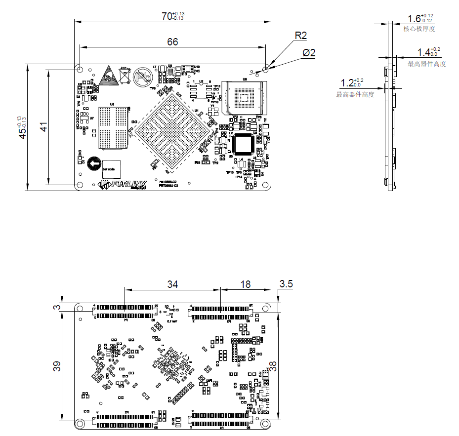
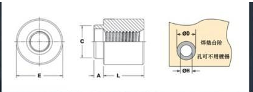

# User’s Hardware Manual\_V3.1

Document classification: □ Top secret □ Secret □ Internal information ■ Open

## Copyright

The copyright of this manual belongs to Baoding Folinx Embedded Technology Co., Ltd. Without the written permission of our company, no organizations or individuals have the right to copy, distribute, or reproduce any part of this manual in any form, and violators will be held legally responsible.

Forlinx adheres to copyrights of all graphics and texts used in all publications in original or license-free forms.

The drivers and utilities used for the components are subject to the copyrights of the respective manufacturers. The license conditions of the respective manufacturer are to be adhered to. Related license expenses for the operating system and applications should be calculated/declared separately by the related party or its representatives.

## Application Scope

This manual is mainly applicable to the Forlinx OK3568-C platform. Other platforms can also refer to it, but there will be differences between different platforms. Please make modifications according to the actual conditions.

## Revision History

|  **Date**  | **Manual Version** | **Revision History**                                         |
| :--------: | :----------------: | ------------------------------------------------------------ |
| 15/03/2022 |        V1.0        | OK3568-C\_User’s Hardware Manual Initial Version             |
| 30/05/2022 |        V1.1        | Adding the description of the industrial-grade parameters of FET3568J - C to the naming rules; 2. Adding the content about FET3568J - C to the ordering information; 3. Adding the description of the operating temperature to the working environment. |
| 03/09/2022 |        V1.2        | Adding industrial 4G + 32G configuration information in the order information. |
| 07/04/2023 |        V1.3        | Adding commercial 4G + 32G configuration information in the order information. |
| 13/04/2023 |        V1.4        | 1. Separating the description of USB2.0 and USB 3.0 interface resources in the "2.5 Core Board Interface Resources" section; 2\. Updating the schematic diagram and changing the common-mode inductor model in the CAN path to PCAQ4520MB - 122 in the "3.5.6 CAN" section. 3. Updating the schematic diagram and adding the description about the reserved grounding capacitor for SDMMC0\_CLK in the "3.5.9 TF Card" section. 4. Modifying the description of using the USB3.0 interface to program the system in the "3.5.21 USB3.0 Interface" section. 5. Updating the schematic diagram and adding the description of design considerations for the CLKOUT, XTAL\_I, XTAL\_O, and AVDDL signals of the PHY chip in the "3.5.22 Ethernet Interface" section. |
| 19/04/2025 |        V1.5        | Adding 2.4.5 "ESD Characteristics” in Chapter 2 "Introduction to FET3568 - C SoM", supplementing a detailed description of the ESD characteristics of the SoM's pins. |
| 01/06/2023 |        V1.6        | 1\. Adding the configuration information of the industrial - grade 1GB + 8GB to the ordering information;  2. Adding the configuration information of the commercial 1GB + 8GB to the ordering information. |
| 07/06/2023 |        V1.7        | Modifying the description of the supported CAN.              |
| 01/12/2023 |        V1.8        | 1\. Adding the design requirements for the peripheral circuit when employing the RTL8211FSI - CG chip into the Ethernet interface description on the carrier board; 2\. Calibrating the power consumption of the SoM under the Linux system in the complete machine power consumption table in Appendix III, and adding the power consumption data of the SoM under the Android 11 system; 3\. Relocating sections like "Precautions and Maintenance", "Data Update and Acquisition", and "Technical Support and Customization" to the end of the manual; 4\. Moving the SoM naming rules and ordering details to the "Product Introduction"; 5\. Removing the "SoM Pin Description (Categorized by Function)" section; 6\. Adding the "Overview" and "Data Description" sections; 7\. Adding tolerance data to the SoM's dimensional drawing; 8\. Adding the SoM's power consumption in typical application scenarios; 9\. Adding antenna installation guidelines when using the 4G module. |
| 28/12/2023 |        V1.9        | 1\. Improving the board design considerations in the audio section and FSPI section of the instructions for the OK3568 - C carrier board; 2\. Improving the description of RGB in the SoM interface resources. |
| 19/03/2024 |        V2.0        | 1\. Adding the image of the FET3568-C2 SoM; 2\. Adding an introduction to the ADC interface in the SoM interface resources; 3\. Adding an introduction to the structural height of the SoM in the SoM dimension diagram; 4\. Improving the description of the SoM and carrier board connectors in the dimension diagram of the FET3568-C SoM; 5\. Correcting the description of the number of SPI interfaces in the carrier board interface resources. 6\. Correcting the description of the USB3.0 signal lines in the pin function specifications of the FET3568-C SoM. |
| 10/05/2024 |        V3.0        | Adding FET3568-C2, OK3568-C2C configuration.                 |
| 22/09/2025 |        V3.1        | Adding precautions for using the WIFI function (It is necessary to install an antenna before using the WIFI function). |

## Overview

This manual is designed to help you quickly familiarize yourselves with the product, understand interface functions and configuration, and primarily discusses the interface functions of the development board, interface introductions, product power consumption, and troubleshooting issues that may arise during use. Some commands were commented to make it easier for you to understand (adequate and practical for the purpose). For information on pin function multiplexing, hardware troubleshooting methods, etc., please refer to Forlinx’s “OK3568-C Pin Multiplexing Comparison Table” and “OK3568-C Design Guide.”

There are total four chapters:

+ Chapter 1. is CPU overview, briefly introducing its performance and applications;
+ Chapter 2. is comprehensive introduction to the SoM, including connector pins explanations and function introductions;
+ Chapter 3. is comprehensive introduction to the development board, divided into multiple chapters, including both hardware principles and simple design ideas;
+ Chapter 4. mainly describes the board’s power consumption performance and other considerations.

A description of some of the symbols and formats associated with this manual:

|                          **Format**                          | **Meaning**                                                  |
| :----------------------------------------------------------: | ------------------------------------------------------------ |
|                           **Note**                           | Note or information that requires special attention, be sure to read carefully. |
|                              📚                               | Relevant notes on the test chapters.                         |
|                              🛤️ ️️                              | Indicates the related path.                                  |
| Blue font on gray background | Refers to commands entered at the command line (Manual input required). |
|         Black font         | Serial port output message after entering a command          |
|       **Bold black**       | Key information in the serial port output message |
|            //            | Interpretation of input instructions or output information |

## 1\. RK3568 Description

RK3568 is a high - performance, low - power, feature - rich application processor developed by Rockchip for the AIoT and industrial markets. It features a quad-core 64-bit Cortex-A55 architecture with a main frequency of up to 2.0 GHz, integrating Rockchip's self-developed NPU and 1 TOPS computing power to support lightweight AI computing. It also provides an easy - to - use model conversion tool, RKNN - Toolkit, which supports one - click conversion of mainstream architecture models such as Caffe, TensorFlow, TF - Lite, ONNX, PyTorch, Keras, and Darknet.

The RK3568 supports five types of display interfaces, namely HDMI2.0, eDP, LVDS, RGB Parallel, and MIPI-DSI. It can simultaneously output three channels of display signals and offers high-definition hardware decoding for multiple formats such as 4K resolution H.264/H.265/VP9. Moreover, it is capable of decoding multiple video sources simultaneously and supports HDR10, delivering excellent performance in terms of color and dynamic range. It supports a variety of high - speed bus interfaces, such as PCIE 3.0, USB 3.0, RGMII/SGMII/QSGMII (2 MAC), and CAN.

+ **Target Applications:**

·Smart Healthcare

·Intelligent Transportation

·Security \& Surveillance

·Power Industry

·Energy \& Chemical Industry

·Smart City

……

**RK3568 Series Block Diagram**

## 2\. FET3568-C\&C2 SoM Description

The pin definitions of the connectors for the FET3568-C/FET3568J-C and FET3568-C2/FET3568J-C2 SoMs are completely identical. The difference between them lies in the memory types used: the FET3568-C/FET3568J-C employs DDR4, while the FET3568-C2/FET3568J-C2 utilizes LPDDR4/LPDDR4X. Additionally, the FET3568-C2/FET3568J-C2 can support higher-capacity RAM (up to 8GB).

### 2.1 FET3568-C/C2 SoM

**FET3568-C SoM**

**Front**

**Back**

**FET3568-C2 SoM**

**Front**

**Back**

### 2.2 FET3568-C/ C2 SoM Dimension Diagram

**FET3568-C SoM Dimension Diagram**

**Front, Top, Perspective**

**FET3568-C2 SoM Dimension Diagram**

**Front, Top, Perspective**

Structure size: 45 mm × 70 mm. The dimensional tolerance is shown in the figure. For more dimensional information, please refer to the user data DXF file.

Plate making process: 1.6mm thickness, 10-layer immersion gold PCB.

Connectors: Four 0.5mm pitch, 80pin board-to-board connectors. See the appendix for the connector dimension drawing.

SoM installation structure height: 5.4mm (including a SoM and carrier board connector height of 2mm, board thickness of 1.6mm, and the highest device height of the SoM of 1.8mm).

Four mounting holes (2.2mm) are reserved at the four corners of the SoM to facilitate the installation of fixing screws and to improve the reliability of the product connection so that the product can be used in vibration environments.

Please refer to the design of the development board and use M2, L=2mm patch nuts on the carrier board. The fixed screw specifications used between the SoM and the carrier board are M2, L=4mm. The specifications of the patch nuts are shown in the following figure:

### 2.3 Performance Parameters

#### 2.3.1 System Main Frequency

|  **Name**  | **Specification** |             |             |          | **Description**  |
| :--------: | :---------------: | ----------- | ----------- | -------- | :--------------: |
|            |    **Minimum**    | **Typical** | **Maximum** | **Unit** |                  |
| Cortex-A55 |         —         | —           | 2.0         | GHz      | Commercial level |

#### 2.3.2 Power Parameter

|       **Parameter**       | **Pin Number** | **Specification** |             |             |          | **Description** |
| :-----------------------: | :------------: | :---------------: | ----------- | ----------- | -------- | :-------------: |
|                           |                |    **Minimum**    | **Typical** | **Maximum** | **Unit** |                 |
| Main Power Supply Voltage |       5V       |        4.5        | 5.0         | 5.5         | V        |        —        |

#### 2.3.3 Operating Environment

|     **Parameter**     |                       | **Specification** |             |             |          | **Description** |
| :-------------------: | --------------------- | :---------------: | ----------- | ----------- | -------- | :-------------: |
|                       |                       |    **Minimum**    | **Typical** | **Maximum** | **Unit** |                 |
| Operating Temperature | Operating Environment |         0         | 25          | +80         | ℃        |    FET3568-C    |
|                       | Storage Environment   |        -40        | 25          | +125        | ℃        |                 |
| Operating Temperature | Operating Environment |        -40        | 25          | +85         | ℃        |   FET3568J-C    |
|                       | Storage Environment   |        -40        | 25          | +125        | ℃        |                 |
|       Humidity        | Operating Environment |        10         | —           | 90          | ％RH     | No condensation |
|                       | Storage Environment   |         5         | —           | 95          | ％RH     |                 |

#### 2.3.4 SoM Interface Speed

|          *Parameter**           | **Specification** |             |             |          | **Description** |
| :-----------------------------: | :---------------: | ----------- | ----------- | -------- | :-------------: |
|                                 |    **Minimum**    | **Typical** | **Maximum** | **Unit** |                 |
| Serial Port Communication Speed |         —         | 115200      | 4M          | bps      |        —        |
|     IIC Communication Speed     |         —         | 100         | 400         | Kbps     |        —        |
|     CAN Communication Speed     |                   |             | 1           | Mbps     |                 |
|       USB interface speed       |         —         | —           | 5           | Gbps     |        —        |
|      PCIE interface speed       |         —         | —           | 8           | Gbps     |        —        |

#### 2.3.5 ESD  Features

|            Parameter            | Specification |         | Unit |     Application Scope     |
| :-----------------------------: | :-----------: | ------- | :--: | :-----------------------: |
|                                 |    Minimum    | Maximum |      |                           |
| ESD HBM(ESDA/JEDEC JS-001-2017) |     -500      | 500     |  V   | Signals exported from SoM |
| ESD CDM(ESDA/JEDEC JS-002-2018) |     -250      | 250     |  V   | Signals exported from SoM |

**Note：**

**1\. The above data is provided by Rockchip;**

**2\. As all the signals exported from SoM are electrostatic sensitive signals, the interfaces should be well protected from static electricity in the carrier board design and the SoM transportation, assembling, and use.**

### 2.4 SoM Interface Speed

**FET3568-C/C2 SoM Interfaces:**

|                       **Function**                        | **Quantity** | **Parameter**                                                |
| :-------------------------------------------------------: | :----------: | ------------------------------------------------------------ |
|                          USB 2.0                          |      2       | USB 2.0 Host, independent port, not multiplexed with USB 3.0 |
|  USB 3.01  |      2       | 1 x USB 3.0 Host can independently create a USB 2.0 host and use 1 x USB 3.0 OTG, which can also function independently with USB 2.0 OTG. |
|   SATA1    |      ≤3      | SATA 3.0 up to 6.0 Gb/s with eSATA support                   |
| PCIe 2.11  |      ≤1      | PCIe 2.1 x1, up to 5.0 Gbps, RC Mode                         |
|                         PCIe 3.0                          |      ≤2      | PCIe 3.0, 1x2Lanes or 2x1Lane, up to 8.0 Gbps per Lane; 1Lane supports Root Complex (RC) mode only; 2 Lanes supports Root Complex (RC) and End Point (EP) model. |
|                          Camera                           |      2       | Supports 1 x DVP interface; 1 x 4Lanes MIPI-CSI              |
| MIPI\_DSI2 |      2       | 2 x 4 - lane MIPI display serial interfaces, supporting MIPI V1.2 version. The maximum resolution of a single channel is 1920×1080@60Hz, and the maximum resolution of dual channels is 2560×1440@60Hz. Among them, MIPI DSI TX0 is multiplexed with LVDS TX PHY. |
|   HDMI2    |      1       | Supports HDMI 2.0 up to 1080p @ 120Hz or 4096x2304 @ 60Hz    |
|   LVDS2    |      1       | Single channel (4 lanes) supports 1280 \* 800 @ 60Hz, multiplexed with MIPI DSI TX0 pin |
|    eDP2    |      1       | 1 x 4-lane eDP display interface, supports eDP V1.3, and the maximum resolution is 2560 \* 1600 @ 60Hz |
|    RGB2    |      1       | RGB888 support, resolution up to 1920\*1080                  |
|                         Ethernet                          |      ≤2      | Supports 2 x RGMII                                           |
|                           SDIO                            |      ≤2      | SD0, 4-bit, supports 1.8/3.3 V mode switching and can be used for system programming; SD2, 4-bit, only supports 1.8 V mode |
|                           UART                            |     ≤10      | Baud rate up to 4Mbps                                        |
|                            SPI                            |      ≤4      | Supports both master and slave mode                          |
|                            I2C                            |      ≤5      | Supports 7bits and 10bits address modes up to 1 Mbit/s       |
|                            CAN                            |      ≤3      | Supports CAN 2.0 B; data rate up to 1 Mbps                   |
|                           Audio                           |      ≤4      | 1X 8ch I2S/TDM； 2X2ch I2S； 1x8ch PDM               |
|                            PWM                            |     ≤16      | Supports up to 16-channel PWM, 32bits timer/counter          |
|                           FSPI                            |      ≤1      | Supports serial NOR Flash/NAND Flash and Boot                |
|                            ADC                            |      ≤8      | The ADC has a sampling range of 0-1.8 V and a sampling resolution of 10 bits. |

**Note:**

**The quantity is marked as the maximum, utilizing a total of 3 groups of SerDes channels. Meanwhile, only 3 functional interfaces can be used simultaneously.**

**The multiplexing relationships of the 3 groups of SerDes are illustrated in the following diagram:**

****

**The RK3568 chip has a built-in VOP controller with three Port outputs, that is, the SoM can support up to three display outputs at the same time. The VOP and video interface output paths are shown in the following figure:**

****

**The parameters in the table are the theoretical values of hardware design or CPU;**

### 2.5 FET3568-C/C2 SoM Pins Definition

#### 2.5.1 FET3568-C/C2 SoM Pins Schematic

#### 2.5.2 FET3568-C/C2 SoM Pins Description

**Note1:**

**Num ——SoM connector pin no.:**

**Ball —— CPU pin ball no.**

**GPIO ——CPU pin general I/O port serial number**

**Vol  —— Pin signal level**

**Note2:**

**Signal Name——SoM connector network name**

**Pin Description—— SoM Pin Signal Descriptions**

**Default Function——Please don’t make any modifications for all SoM pin functions regulated in the “default functions” of the following table, otherwise, it may have conflicts with the factory driver. Please contact us with any questions in time.**

**Note3: **

**The pins marked with "Do not use for carrier board" in the "Pin Description" are those used by the SoM, and should not be used in the carrier board design.**

**Table 1 LEFT\_UP（P1） Connector Interface(Odd) Pin Definition**

| **Num** | **Ball** |   **Signal Name**   | **GPIO**  | **Vol** |       **Pin Description**       | **Default Function** |
| :-----: | :------: | :-----------------: | :-------: | :-----: | :-----------------------------: | :------------------: |
|  LU\_1  |    \-    |         GND         |    \-     |   \-    |             Ground              |         GND          |
|  LU\_3  |    R1    | R1\_USB2\_HOST2\_DM |    \-     |   \-    |        USB2\_HOST2 data-        |   USB2\_HOST2\_DM    |
|  LU\_5  |    R2    | R2\_USB2\_HOST2\_DP |    \-     |   \-    |        USB2\_HOST2 data+        |   USB2\_HOST2\_DP    |
|  LU\_7  |    \-    |         GND         |    \-     |   \-    |             Ground              |         GND          |
|  LU\_9  |    T1    | T1\_USB2\_HOST3\_DM |    \-     |   \-    |        USB2\_HOST3 data-        |   USB2\_HOST3\_DM    |
| LU\_11  |    T2    | T2\_USB2\_HOST3\_DP |    \-     |   \-    |        USB2\_HOST3 data+        |   USB2\_HOST3\_DP    |
| LU\_13  |    \-    |         GND         |    \-     |   \-    |             Ground              |         GND          |
| LU\_15  |   AC3    |     AC3\_PWM14      | GPIO3\_C4 |  3.3V   |              PWM14              |        PWM14         |
| LU\_17  |   AH4    |    AH4\_LCDC\_CL    | GPIO3\_A0 |  3.3V   |        LCD clock signal         |    SPI2\_CLK\_M1     |
| LU\_19  |   AC4    |   AC4\_LCDC\_DEN    | GPIO3\_C3 |  3.3V   |     LCD data enable signal      |    UART5\_RX\_M1     |
| LU\_21  |   AA7    |  AA7\_LCDC\_VSYNC   | GPIO3\_C2 |  3.3V   |      LCD field sync signal      |    UART5\_TX\_M1     |
| LU\_23  |   AD1    |  AD1\_LCDC\_HSYNC   | GPIO3\_C1 |  3.3V   | LCD line synchronization signal |     GPIO3\_C1\_d     |
| LU\_25  |    \-    |         GND         |    \-     |   \-    |             Ground              |         GND          |
| LU\_27  |   AD2    |   AD2\_LCDC\_D23    | GPIO3\_C0 |  3.3V   |           LCD Data 23           |    UART3\_RX\_M1     |
| LU\_29  |   AD4    |   AD4\_LCDC\_D22    | GPIO3\_B7 |  3.3V   |           LCD Data 22           |    UART3\_TX\_M1     |
| LU\_31  |   AE3    |   AE3\_LCDC\_D21    | GPIO3\_B6 |  3.3V   |           LCD Data 21           |     GPIO3\_B6\_d     |
| LU\_33  |   AE2    |   AE2\_LCDC\_D20    | GPIO3\_B5 |  3.3V   |           LCD Data 20           |     GPIO3\_B5\_d     |
| LU\_35  |   AE1    |   AE1\_LCDC\_D19    | GPIO3\_B4 |  3.3V   |           LCD Data 19           |     GPIO3\_B4\_d     |
| LU\_37  |   AF1    |   AF1\_LCDC\_D18    | GPIO3\_B3 |  3.3V   |           LCD Data 18           |     GPIO3\_B3\_d     |
| LU\_39  |   AF2    |   AF2\_LCDC\_D17    | GPIO3\_B2 |  3.3V   |           LCD Data 17           |    UART4\_TX\_M1     |
| LU\_41  |   AG1    |   AG1\_LCDC\_D16    | GPIO3\_B1 |  3.3V   |           LCD Data 16           |    UART4\_RX\_M1     |
| LU\_43  |    \-    |         GND         |    \-     |   \-    |             Ground              |         GND          |
| LU\_45  |   AG2    |   AG2\_LCDC\_D15    | GPIO3\_B0 |  3.3V   |           LCD Data 15           |     GPIO3\_B0\_d     |
| LU\_47  |   AH2    |   AH2\_LCDC\_D14    | GPIO3\_A7 |  3.3V   |           LCD Data 14           |     GPIO3\_A7\_d     |
| LU\_49  |   AG3    |   AG3\_LCDC\_D13    | GPIO3\_A6 |  3.3V   |           LCD Data 13           |     GPIO3\_A6\_d     |
| LU\_51  |   AH3    |   AH3\_LCDC\_D12    | GPIO3\_A5 |  3.3V   |           LCD Data 12           |     GPIO3\_A5\_d     |
| LU\_53  |   AF4    |   AF4\_LCDC\_D11    | GPIO3\_A4 |  3.3V   |           LCD Data 11           |     GPIO3\_A4\_d     |
| LU\_55  |   AG4    |   AG4\_LCDC\_D10    | GPIO3\_A3 |  3.3V   |           LCD Data 10           |     GPIO3\_A3\_d     |
| LU\_57  |   AE5    |    AE5\_LCDC\_D9    | GPIO3\_A2 |  3.3V   |           LCD Data 9            |     GPIO3\_A2\_d     |
| LU\_59  |   AB8    |    AB8\_LCDC\_D8    | GPIO3\_A1 |  3.3V   |           LCD Data 8            |     GPIO3\_A1\_d     |
| LU\_61  |    \-    |         GND         |    \-     |   \-    |             Ground              |         GND          |
| LU\_63  |   AH5    |    AH5\_LCDC\_D7    | GPIO2\_D7 |  3.3V   |           LCD Data 7            |    SPI2\_MISO\_M1    |
| LU\_65  |   AD6    |    AD6\_LCDC\_D6    | GPIO2\_D6 |  3.3V   |           LCD Data 6            |    SPI2\_MOSI\_M1    |
| LU\_67  |   AF6    |    AF6\_LCDC\_D5    | GPIO2\_D5 |  3.3V   |           LCD Data 5            |    SPI2\_CS0\_M1     |
| LU\_69  |   AF5    |    AF5\_LCDC\_D4    | GPIO2\_D4 |  3.3V   |           LCD Data 4            |    SPI2\_CS1\_M1     |
| LU\_71  |   AC7    |    AC7\_LCDC\_D3    | GPIO2\_D3 |  3.3V   |           LCD Data 3            |    SPI0\_CLK\_M1     |
| LU\_73  |   AC8    |    AC8\_LCDC\_D2    | GPIO2\_D2 |  3.3V   |           LCD Data 2            |    SPI0\_CS0\_M1     |
| LU\_75  |   AD7    |    AD7\_LCDC\_D1    | GPIO2\_D1 |  3.3V   |           LCD Data 1            |    SPI0\_MOSI\_M1    |
| LU\_77  |   AG6    |    AG6\_LCDC\_D0    | GPIO2\_D0 |  3.3V   |           LCD Data 0            |    SPI0\_MISO\_M1    |
| LU\_79  |    \-    |         GND         |    \-     |   \-    |             Ground              |         GND          |

**Table 2 LEFT\_UP（P1） Connector Interface(Even) Pin Definition**

|  Num   | **Ball** |      **Signal Name**       | **GPIO**  | **Vol** |          **Pin Description**          |  **Default Function**  |
| :----: | :------: | :------------------------: | :-------: | :-----: | :-----------------------------------: | :--------------------: |
| LU\_2  |    \-    |            GND             |    \-     |   \-    |                Ground                 |          GND           |
| LU\_4  |    V5    |     V5\_I2C2\_SCL\_M1      | GPIO4\_B5 |  1.8V   |       I2C2 serial clock signal        |     I2C2\_SCL\_M1      |
| LU\_6  |    V6    |     V6\_I2C2\_SDA\_M1      | GPIO4\_B4 |  1.8V   |        I2C2 serial data signal        |     I2C2\_SDA\_M1      |
| LU\_8  |    V4    |    V4\_GMAC1\_RXER\_M1     | GPIO4\_B2 |  1.8V   |          GMAC1 receive error          |      CAM0\_PWRDN       |
| LU\_10 |    U3    |      U3\_CIF\_CLKOUT       | GPIO4\_C0 |  1.8V   |     Camera reference clock output     |      CIF\_CLKOUT       |
| LU\_12 |    \-    |            GND             |    \-     |   \-    |                Ground                 |          GND           |
| LU\_14 |    U5    |     U5\_GMAC1\_MDC\_M1     | GPIO4\_B6 |  1.8V   | GMAC1 management data reference clock |     GMAC1\_MDC\_M1     |
| LU\_16 |    U4    |    U4\_GMAC1\_MDIO\_M1     | GPIO4\_B7 |  1.8V   |  GMAC1 management data input/output   |    GMAC1\_MDIO\_M1     |
| LU\_18 |    \-    |            GND             |    \-     |   \-    |                Ground                 |          GND           |
| LU\_20 |    Y5    |    Y5\_GMAC1\_TXD3\_M1     | GPIO3\_D7 |  1.8V   |          GMAC1 sends data 3           |    GMAC1\_TXD3\_M1     |
| LU\_22 |    Y6    |    Y6\_GMAC1\_TXD2\_M1     | GPIO3\_D6 |  1.8V   |          GMAC1 sends data 2           |    GMAC1\_TXD2\_M1     |
| LU\_24 |    Y1    |    Y1\_GMAC1\_TXD1\_M1     | GPIO4\_A5 |  1.8V   |          GMAC1 sends data 1           |    GMAC1\_TXD1\_M1     |
| LU\_26 |    Y2    |    Y2\_GMAC1\_TXD0\_M1     | GPIO4\_A4 |  1.8V   |          GMAC1 sends data 0           |    GMAC1\_TXD0\_M1     |
| LU\_28 |    W2    |    W2\_GMAC1\_TXEN\_M1     | GPIO4\_A6 |  1.8V   |      GMAC1 sends control signal       |    GMAC1\_TXEN\_M1     |
| LU\_30 |   AA3    |   AA3\_GMAC1\_TXCLK\_M1    | GPIO4\_A0 |  1.8V   |      GMAC1 sends reference clock      |    GMAC1\_TXCLK\_M1    |
| LU\_32 |    \-    |            GND             |    \-     |   \-    |                Ground                 |          GND           |
| LU\_34 |    Y4    |    Y4\_GMAC1\_RXD3\_M1     | GPIO4\_A2 |  1.8V   |         GMAC1 receive data 3          |    GMAC1\_RXD3\_M1     |
| LU\_36 |   AA2    |    AA2\_GMAC1\_RXD2\_M1    | GPIO4\_A1 |  1.8V   |         GMAC1 receive data 2          |    GMAC1\_RXD2\_M1     |
| LU\_38 |    V7    |    V7\_GMAC1\_RXD1\_M1     | GPIO4\_B0 |  1.8V   |         GMAC1 receive data 1          |    GMAC1\_RXD1\_M1     |
| LU\_40 |    W1    |    W1\_GMAC1\_RXD0\_M1     | GPIO4\_A7 |  1.8V   |         GMAC1 receive data 0          |    GMAC1\_RXD0\_M1     |
| LU\_42 |    V2    |  V2\_GMAC1\_RXDV\_CRS\_M1  | GPIO4\_B1 |  1.8V   |     GMAC1 receiving data is valid     |  GMAC1\_RXDV\_CRS\_M1  |
| LU\_44 |    Y3    |    Y3\_GMAC1\_RXCLK\_M1    | GPIO4\_A3 |  1.8V   |     GMAC1 receive reference clock     |    GMAC1\_RXCLK\_M1    |
| LU\_46 |    \-    |            GND             |    \-     |   \-    |                Ground                 |          GND           |
| LU\_48 |    V1    | V1\_ETH1\_REFCLKO\_25M\_M1 | GPIO4\_B3 |  1.8V   |          Output 25Mhz to PHY          | ETH1\_REFCLKO\_25M\_M1 |
| LU\_50 |    U2    |  U2\_GMAC1\_MCLKINOUT\_M1  | GPIO4\_C1 |  1.8V   |        125MHz inputs to GMAC1         |  GMAC1\_MCLKINOUT\_M1  |
| LU\_52 |   AA1    |     AA1\_GPIO3\_D4\_d      | GPIO3\_D4 |  1.8V   |              General IO               |     WIFI\_REG\_ON      |
| LU\_54 |   AA5    |     AA5\_GPIO3\_D5\_d      | GPIO3\_D5 |  1.8V   |              General IO               |      BT\_REG\_ON       |
| LU\_56 |   AB5    |      AB5\_SDMMC2\_D2       | GPIO3\_D0 |  1.8V   |          SDMMC2 data bit 2-           |       SDMMC2\_D2       |
| LU\_58 |   AB1    |      AB1\_SDMMC2\_D3       | GPIO3\_D1 |  1.8V   |          SDMMC2 data bit 3-           |       SDMMC2\_D3       |
| LU\_60 |    Y7    |      Y7\_SDMMC2\_CMD       | GPIO3\_D2 |  1.8V   |         SDMMC2 command signal         |      SDMMC2\_CMD       |
| LU\_62 |   AC1    |      AC1\_SDMMC2\_CLK      | GPIO3\_D3 |  1.8V   |          SDMMC2 clock signal          |      SDMMC2\_CLK       |
| LU\_64 |   AC5    |      AC5\_SDMMC2\_D0       | GPIO3\_C6 |  1.8V   |          SDMMC2 data bit 0-           |       SDMMC2\_D0       |
| LU\_66 |   AA6    |      AA6\_SDMMC2\_D1       | GPIO3\_C7 |  1.8V   |          SDMMC2 data bit 1-           |       SDMMC2\_D1       |
| LU\_68 |    \-    |            GND             |    \-     |   \-    |                Ground                 |          GND           |
| LU\_70 |   AB9    |     AB9\_GPIO4\_D2\_d      | GPIO4\_D2 |  3.3V   |              General IO               |       PHONE\_DET       |
| LU\_72 |   AD8    |     AD8\_GPIO4\_C5\_d      | GPIO4\_C5 |  3.3V   |              General IO               |        TP\_RST         |
| LU\_74 |   AE8    |     AE8\_GPIO4\_C6\_d      | GPIO4\_C6 |  3.3V   |              General IO               |        TP\_INT         |
| LU\_76 |   AH7    |     AH7\_GPIO4\_C4\_d      | GPIO4\_C4 |  3.3V   |              General IO               |      EDP\_HPD\_M0      |
| LU\_78 |   AC2    |     AC2\_GPIO3\_C5\_d      | GPIO3\_C5 |  3.3V   |              General IO               |      LCD\_nPWREN       |
| LU\_80 |    \-    |            GND             |    \-     |   \-    |                Ground                 |          GND           |

**Table 3 RIGHT\_UP（P2） Connector Interface(Odd) Pin Definition**

|  Num   | **Ball** |       **Signal Name**        | **GPIO**  | **Vol** |   **Pin Description**    |  **Default Function**   |
| :----: | :------: | :--------------------------: | :-------: | :-----: | :----------------------: | :---------------------: |
| RU\_1  |    \-    |             GND              |    \-     |   \-    |          Ground          |           GND           |
| RU\_3  |   G20    |        G20\_ADC\_VIN6        |    \-     |  1.8V   |       General ADC6       |        ADC\_VIN6        |
| RU\_5  |   F21    |        F21\_ADC\_VIN7        |    \-     |  1.8V   |       General ADC7       |        ADC\_VIN7        |
| RU\_7  |   G21    |        G21\_ADC\_VIN4        |    \-     |  1.8V   |       General ADC4       |        ADC\_VIN4        |
| RU\_9  |   E23    |        E23\_ADC\_VIN3        |    \-     |  1.8V   |       General ADC3       |        ADC\_VIN3        |
| RU\_11 |   F22    |        F22\_ADC\_VIN5        |    \-     |  1.8V   |       General ADC5       |        ADC\_VIN5        |
| RU\_13 |   C26    |        C26\_ADC\_VIN1        |    \-     |  1.8V   |       General ADC1       |        ADC\_VIN1        |
| RU\_15 |   D24    |        D24\_ADC\_VIN2        |    \-     |  1.8V   |       General ADC2       |        ADC\_VIN2        |
| RU\_17 |   B27    | B27\_ADC\_VIN0\_KEY/RECOVERY |    \-     |  1.8V   |       General ADC0       | ADC\_VIN0\_KEY/RECOVERY |
| RU\_19 |    \-    |             GND              |    \-     |   \-    |          Ground          |           GND           |
| RU\_21 |   D18    |      D18\_I2C3\_SDA\_M0      | GPIO1\_A0 |  3.3V   | I2C3 serial data signal  |      I2C3\_SDA\_M0      |
| RU\_23 |   E18    |      E18\_I2C3\_SCL\_M0      | GPIO1\_A1 |  3.3V   | I2C3 serial clock signal |      I2C3\_SCL\_M0      |
| RU\_25 |   F18    |      F18\_GPIO1\_A4\_d       | GPIO1\_A4 |  3.3V   |        General IO        |      TP\_INT\_LVDS      |
| RU\_27 |   D20    |      D20\_GPIO1\_B0\_d       | GPIO1\_B0 |  3.3V   |        General IO        |      TP\_RST\_LVDS      |
| RU\_29 |   E20    |      E20\_GPIO1\_B1\_d       | GPIO1\_B1 |  3.3V   |        General IO        |         5G\_PWR         |
| RU\_31 |   A21    |      A21\_GPIO1\_B2\_d       | GPIO1\_B2 |  3.3V   |        General IO        |        5G\_RESET        |
| RU\_33 |    \-    |             GND              |    \-     |   \-    |          Ground          |           GND           |
| RU\_35 |   J28    |      J28\_EDP\_TX\_D0P       |    \-     |   \-    |       EDP Data 0+        |      EDP\_TX\_D0P       |
| RU\_37 |   K27    |      K27\_EDP\_TX\_D0N       |    \-     |   \-    |       EDP Data 0-        |      EDP\_TX\_D0N       |
| RU\_39 |    \-    |             GND              |    \-     |   \-    |          Ground          |           GND           |
| RU\_41 |   K28    |      K28\_EDP\_TX\_D1P       |    \-     |   \-    |       EDP Data 1+        |      EDP\_TX\_D1P       |
| RU\_43 |   L27    |      L27\_EDP\_TX\_D1N       |    \-     |   \-    |       EDP Data 1-        |      EDP\_TX\_D1N       |
| RU\_45 |    \-    |             GND              |    \-     |   \-    |          Ground          |           GND           |
| RU\_47 |   L28    |      L28\_EDP\_TX\_D2P       |    \-     |   \-    |       EDP Data 2+        |      EDP\_TX\_D2P       |
| RU\_49 |   M27    |      M27\_EDP\_TX\_D2N       |    \-     |   \-    |       EDP Data 2-        |      EDP\_TX\_D2N       |
| RU\_51 |    \-    |             GND              |    \-     |   \-    |          Ground          |           GND           |
| RU\_53 |   M28    |      M28\_EDP\_TX\_D3P       |    \-     |   \-    |       EDP Data 3+        |      EDP\_TX\_D3P       |
| RU\_55 |   N27    |      N27\_EDP\_TX\_D3N       |    \-     |   \-    |       EDP Data 3-        |      EDP\_TX\_D3N       |
| RU\_57 |    \-    |             GND              |    \-     |   \-    |          Ground          |           GND           |
| RU\_59 |   L25    |      L25\_EDP\_TX\_AUXP      |    \-     |   \-    |   EDP auxiliary data+    |      EDP\_TX\_AUXP      |
| RU\_61 |   M25    |      M25\_EDP\_TX\_AUXN      |    \-     |   \-    |   EDP auxiliary data-    |      EDP\_TX\_AUXN      |
| RU\_63 |    \-    |             GND              |    \-     |   \-    |          Ground          |           GND           |
| RU\_65 |   AE26   |      AE26\_GPIO0\_D3\_d      | GPIO0\_D3 |  1.8V   |        General IO        |    BT\_HOST\_WAKE\_B    |
| RU\_67 |   AD25   |      AD25\_GPIO0\_D5\_d      | GPIO0\_D5 |  1.8V   |        General IO        |       BT\_WAKE\_B       |
| RU\_69 |   AB23   |      AB23\_GPIO0\_D4\_d      | GPIO0\_D4 |  1.8V   |        General IO        |   WIFI\_HOST\_WAKE\_B   |
| RU\_71 |   AC24   |      AC24\_GPIO0\_D6\_d      | GPIO0\_D6 |  1.8V   |        General IO        |       CAM0\_nRST        |
| RU\_73 |    \-    |             GND              |    \-     |   \-    |          Ground          |           GND           |
| RU\_75 |   P25    |     P25\_USB3\_HOST1\_DM     |    \-     |   \-    |    USB3\_HOST1 data-     |     USB3\_HOST1\_DM     |
| RU\_77 |   P24    |     P24\_USB3\_HOST1\_DP     |    \-     |   \-    |    USB3\_HOST1 data+     |     USB3\_HOST1\_DP     |
| RU\_79 |    \-    |             GND              |    \-     |   \-    |          Ground          |         GNDGND          |

**Table 4 RIGHT\_UP（P2） Connector Interface(Even) Pin Definition**

|  Num   | **Ball** |     **Signal Name**     | **GPIO**  | **Vol** |          **Pin Description**          | **Default Function** |
| :----: | :------: | :---------------------: | :-------: | :-----: | :-----------------------------------: | :------------------: |
| RU\_2  |    \-    |           GND           |    \-     |   \-    |                Ground                 |         GND          |
| RU\_4  |   A22    |     A22\_FSPI\_CLK      | GPIO1\_D0 |  1.8V   |         FSPI reference clock          |      FSPI\_CLK       |
| RU\_6  |   C24    |      C24\_FSPI\_D0      | GPIO1\_D1 |  1.8V   |              FSPI Data 0              |       FSPI\_D0       |
| RU\_8  |   D23    |      D23\_FSPI\_D1      | GPIO1\_D2 |  1.8V   |              FSPI Data 1              |       FSPI\_D1       |
| RU\_10 |   F20    |      F20\_FSPI\_D2      | GPIO1\_C7 |  1.8V   |              FSPI Data 2              |       FSPI\_D2       |
| RU\_12 |   A27    |      A27\_FSPI\_D3      | GPIO1\_D4 |  1.8V   |              FSPI Data 3              |       FSPI\_D3       |
| RU\_14 |   C23    |     C23\_FSPI\_CS0n     | GPIO1\_D3 |  1.8V   |       FSPI chip select signal 0       |      FSPI\_CS0n      |
| RU\_16 |   D26    |    D26\_GPIO2\_B1\_d    | GPIO2\_B1 |  1.8V   |              General IO               |   UART8\_RTSn\_M0    |
| RU\_18 |   E25    |    E25\_GPIO2\_B2\_u    | GPIO2\_B2 |  1.8V   |              General IO               |   UART8\_CTSn\_M0    |
| RU\_20 |    \-    |           GND           |    \-     |   \-    |                Ground                 |         GND          |
| RU\_22 |   H24    |     H24\_GMAC0\_MDC     | GPIO2\_C3 |  1.8V   | GMAC0 management data reference clock |      GMAC0\_MDC      |
| RU\_24 |   H23    |    H23\_GMAC0\_MDIO     | GPIO2\_C4 |  1.8V   |  GMAC0 management data input/output   |     GMAC0\_MDIO      |
| RU\_26 |    \-    |           GND           |    \-     |   \-    |                Ground                 |         GND          |
| RU\_28 |   C28    |    C28\_GMAC0\_TXD3     | GPIO2\_A7 |  1.8V   |          GMAC0 sends data 3           |     GMAC0\_TXD3      |
| RU\_30 |   C27    |    C27\_GMAC0\_TXD2     | GPIO2\_A6 |  1.8V   |          GMAC0 sends data 2           |     GMAC0\_TXD2      |
| RU\_32 |   G27    |    G27\_GMAC0\_TXD1     | GPIO2\_B4 |  1.8V   |          GMAC0 sends data 1           |     GMAC0\_TXD1      |
| RU\_34 |   F28    |    F28\_GMAC0\_TXD0     | GPIO2\_B3 |  1.8V   |          GMAC0 sends data 0           |     GMAC0\_TXD0      |
| RU\_36 |   G28    |    G28\_GMAC0\_TXEN     | GPIO2\_B5 |  1.8V   |      GMAC0 sends control signal       |     GMAC0\_TXEN      |
| RU\_38 |   D27    |    D27\_GMAC0\_TXCLK    | GPIO2\_B0 |  1.8V   |      GMAC0 sends reference clock      |     GMAC0\_TXCLK     |
| RU\_40 |    \-    |           GND           |    \-     |   \-    |                Ground                 |         GND          |
| RU\_42 |   E28    |    E28\_GMAC0\_RXD3     | GPIO2\_A4 |  1.8V   |         GMAC0 receive data 3          |     GMAC0\_RXD3      |
| RU\_44 |   E27    |    E27\_GMAC0\_RXD2     | GPIO2\_A3 |  1.8V   |         GMAC0 receive data 2          |     GMAC0\_RXD2      |
| RU\_46 |   H25    |    H25\_GMAC0\_RXD1     | GPIO2\_B7 |  1.8V   |         GMAC0 receive data 1          |     GMAC0\_RXD1      |
| RU\_48 |   F27    |    F27\_GMAC0\_RXD0     | GPIO2\_B6 |  1.8V   |         GMAC0 receive data 0          |     GMAC0\_RXD0      |
| RU\_50 |   F24    |  F24\_GMAC0\_RXDV\_CRS  | GPIO2\_C0 |  1.8V   |     GMAC0 receiving data is valid     |   GMAC0\_RXDV\_CRS   |
| RU\_52 |   B28    |    B28\_GMAC0\_RXCLK    | GPIO2\_A5 |  1.8V   |     GMAC0 receive reference clock     |     GMAC0\_RXCLK     |
| RU\_54 |    \-    |           GND           |    \-     |   \-    |                Ground                 |         GND          |
| RU\_56 |   G23    | G23\_ETH0\_REFCLKO\_25M | GPIO2\_C1 |  1.8V   |          Output 25Mhz to PHY          |  ETH0\_REFCLKO\_25M  |
| RU\_58 |   F25    |  F25\_GMAC0\_MCLKINOUT  | GPIO2\_C2 |  1.8V   |        125MHz inputs to GMAC0         |   GMAC0\_MCLKINOUT   |
| RU\_60 |   F26    |    F26\_GMAC0\_RXER     | GPIO2\_C5 |  1.8V   |          GMAC0 receive error          |    UART8\_TX\_M0     |
| RU\_62 |   E26    |    E26\_GPIO2\_C6\_d    | GPIO2\_C6 |  1.8V   |              General IO               |    UART8\_RX\_M0     |
| RU\_64 |    \-    |           GND           |    \-     |   \-    |                Ground                 |         GND          |
| RU\_66 |   H26    |     H26\_SDMMC0\_D2     | GPIO1\_D7 |  3.3V   |          SDMMC0 data bit 2-           |      SDMMC0\_D2      |
| RU\_68 |   J23    |     J23\_SDMMC0\_D3     | GPIO2\_A0 |  3.3V   |          SDMMC0 data bit 3-           |      SDMMC0\_D3      |
| RU\_70 |   H27    |    H27\_SDMMC0\_CMD     | GPIO2\_A1 |  3.3V   |         SDMMC0 command signal         |     SDMMC0\_CMD      |
| RU\_72 |   Y22    |   Y22\_SDMMC0\_DET\_L   | GPIO0\_A4 |  3.3V   |     SDMMC0 card detection signal      |    SDMMC0\_DET\_L    |
| RU\_74 |   H28    |    H28\_SDMMC0\_CLK     | GPIO2\_A2 |  3.3V   |          SDMMC0 clock signal          |     SDMMC0\_CLK      |
| RU\_76 |   J25    |     J25\_SDMMC0\_D0     | GPIO1\_D5 |  3.3V   |          SDMMC0 data bit 0-           |      SDMMC0\_D0      |
| RU\_78 |   J24    |     J24\_SDMMC0\_D1     | GPIO1\_D6 |  3.3V   |          SDMMC0 data bit 1-           |      SDMMC0\_D1      |
| RU\_80 |    \-    |           GND           |    \-     |   \-    |                Ground                 |         GND          |

**Table 5 LEFT \_ DOWN (P3) Connector Interface (Odd) Pin Definition**

| **Num** | **Ball** |              **Signal Name**               | **GPIO** | **Vol** |           **Pin Description**            |         **Default Function**         |
| :-----: | :------: | :----------------------------------------: | :------: | :-----: | :--------------------------------------: | :----------------------------------: |
|  LD\_1  |    \-    |                    GND                     |    \-    |   \-    |                  Ground                  |                 GND                  |
|  LD\_3  |   AE9    |          AE9\_MIPI\_CSI\_RX\_D3N           |    \-    |   \-    |     MIPI \_ CSI differential data 3-     |          MIPI\_CSI\_RX\_D3N          |
|  LD\_5  |   AD9    |          AD9\_MIPI\_CSI\_RX\_D3P           |    \-    |   \-    |    MIPI \_ CSI differential data 3 +     |          MIPI\_CSI\_RX\_D3P          |
|  LD\_7  |    \-    |                    GND                     |    \-    |   \-    |                  Ground                  |                 GND                  |
|  LD\_9  |   AD11   |          AD11\_MIPI\_CSI\_RX\_D2N          |    \-    |   \-    |     MIPI \_ CSI differential data 2-     |          MIPI\_CSI\_RX\_D2N          |
| LD\_11  |   AE11   |          AE11\_MIPI\_CSI\_RX\_D2P          |    \-    |   \-    |    MIPI \_ CSI differential data 2 +     |          MIPI\_CSI\_RX\_D2P          |
| LD\_13  |    \-    |                    GND                     |    \-    |   \-    |                  Ground                  |                 GND                  |
| LD\_15  |   AH9    |         AH9\_MIPI\_CSI\_RX\_CLK1N          |    \-    |   \-    | MIPI \_ CSI differential clock signal 1- |         MIPI\_CSI\_RX\_CLK1N         |
| LD\_17  |   AG9    |         AG9\_MIPI\_CSI\_RX\_CLK1P          |    \-    |   \-    | MIPI \_ CSI differential clock signal 1+ |         MIPI\_CSI\_RX\_CLK1P         |
| LD\_19  |    \-    |                    GND                     |    \-    |   \-    |                  Ground                  |                 GND                  |
| LD\_21  |   AH11   |          AH11\_MIPI\_CSI\_RX\_D1N          |    \-    |   \-    |     MIPI \_ CSI differential data 1-     |          MIPI\_CSI\_RX\_D1N          |
| LD\_23  |   AG11   |          AG11\_MIPI\_CSI\_RX\_D1P          |    \-    |   \-    |    MIPI \_ CSI differential data 1 +     |          MIPI\_CSI\_RX\_D1P          |
| LD\_25  |    \-    |                    GND                     |    \-    |   \-    |                  Ground                  |                 GND                  |
| LD\_27  |   AH12   |          AH12\_MIPI\_CSI\_RX\_D0N          |    \-    |   \-    |     MIPI \_ CSI differential data 0-     |          MIPI\_CSI\_RX\_D0N          |
| LD\_29  |   AG12   |          AG12\_MIPI\_CSI\_RX\_D0P          |    \-    |   \-    |    MIPI \_ CSI differential data 0 +     |          MIPI\_CSI\_RX\_D0P          |
| LD\_31  |    \-    |                    GND                     |    \-    |   \-    |                  Ground                  |                 GND                  |
| LD\_33  |   AH10   |         AH10\_MIPI\_CSI\_RX\_CLK0N         |    \-    |   \-    | MIPI \_ CSI differential clock signal 0- |         MIPI\_CSI\_RX\_CLK0N         |
| LD\_35  |   AG10   |         AG10\_MIPI\_CSI\_RX\_CLK0P         |    \-    |   \-    | MIPI \_ CSI differential clock signal 0+ |         MIPI\_CSI\_RX\_CLK0P         |
| LD\_37  |    \-    |                    GND                     |    \-    |   \-    |                  Ground                  |                 GND                  |
| LD\_39  |   AH13   |  AH13\_MIPI\_DSI\_TX0\_D3P/LVDS\_TX0\_D3P  |    \-    |   \-    |        LVDS differential data 3+         |  MIPI\_DSI\_TX0\_D3P/LVDS\_TX0\_D3P  |
| LD\_41  |   AG13   |  AG13\_MIPI\_DSI\_TX0\_D3N/LVDS\_TX0\_D3N  |    \-    |   \-    |        LVDS differential data 3-         |  MIPI\_DSI\_TX0\_D3N/LVDS\_TX0\_D3N  |
| LD\_43  |    \-    |                    GND                     |    \-    |   \-    |                  Ground                  |                 GND                  |
| LD\_45  |   AH15   | AH15\_MIPI\_DSI\_TX0\_CLKP/LVDS\_TX0\_CLKP |    \-    |   \-    |     LVDS Differential Clock Signals+     | MIPI\_DSI\_TX0\_CLKP/LVDS\_TX0\_CLKP |
| LD\_47  |   AG15   | AG15\_MIPI\_DSI\_TX0\_CLKN/LVDS\_TX0\_CLKN |    \-    |   \-    |     LVDS Differential Clock Signals-     | MIPI\_DSI\_TX0\_CLKN/LVDS\_TX0\_CLKN |
| LD\_49  |    \-    |                    GND                     |    \-    |   \-    |                  Ground                  |                 GND                  |
| LD\_51  |   AH14   |  AH14\_MIPI\_DSI\_TX0\_D2P/LVDS\_TX0\_D2P  |    \-    |   \-    |        LVDS differential data 2+         |  MIPI\_DSI\_TX0\_D2P/LVDS\_TX0\_D2P  |
| LD\_53  |   AG14   |  AG14\_MIPI\_DSI\_TX0\_D2N/LVDS\_TX0\_D2N  |    \-    |   \-    |        LVDS differential data 2-         |  MIPI\_DSI\_TX0\_D2N/LVDS\_TX0\_D2N  |
| LD\_55  |    \-    |                    GND                     |    \-    |   \-    |                  Ground                  |                 GND                  |
| LD\_57  |   AH16   |  AH16\_MIPI\_DSI\_TX0\_D1P/LVDS\_TX0\_D1P  |    \-    |   \-    |        LVDS differential data 1+         |  MIPI\_DSI\_TX0\_D1P/LVDS\_TX0\_D1P  |
| LD\_59  |   AG16   |  AG16\_MIPI\_DSI\_TX0\_D1N/LVDS\_TX0\_D1N  |    \-    |   \-    |        LVDS differential data 1-         |  MIPI\_DSI\_TX0\_D1N/LVDS\_TX0\_D1N  |
| LD\_61  |    \-    |                    GND                     |    \-    |   \-    |                  Ground                  |                 GND                  |
| LD\_63  |   AH17   |  AH17\_MIPI\_DSI\_TX0\_D0P/LVDS\_TX0\_D0P  |    \-    |   \-    |        LVDS differential data 0+         |  MIPI\_DSI\_TX0\_D0P/LVDS\_TX0\_D0P  |
| LD\_65  |   AG17   |  AG17\_MIPI\_DSI\_TX0\_D0N/LVDS\_TX0\_D0N  |    \-    |   \-    |        LVDS differential data 0-         |  MIPI\_DSI\_TX0\_D0N/LVDS\_TX0\_D0N  |
| LD\_67  |    \-    |                    GND                     |    \-    |   \-    |                  Ground                  |                 GND                  |
| LD\_69  |    \-    |                  EXT\_EN                   |    \-    |   \-    |       External power enable Signal       |               EXT\_EN                |
| LD\_71  |    \-    |                    GND                     |    \-    |   \-    |                  Ground                  |                 GND                  |
| LD\_73  |    \-    |                    GND                     |    \-    |   \-    |                  Ground                  |                 GND                  |
| LD\_75  |    \-    |                     5V                     |    \-    |   5V    |                    5V                    |                  5V                  |
| LD\_77  |    \-    |                     5V                     |    \-    |   5V    |                    5V                    |                  5V                  |
| LD\_79  |    \-    |                     5V                     |    \-    |   5V    |                    5V                    |                                      |

**Table 6 LEFT \_ DOWN (P3) Connector Interface (Even) Pin Definition**

|  Num   | **Ball** |      **Signal Name**       | **GPIO**  | **Vol** |                     **Pin Description**                     | **Default Function** |
| :----: | :------: | :------------------------: | :-------: | :-----: | :---------------------------------------------------------: | :------------------: |
| LD\_2  |    \-    |            GND             |    \-     |   \-    |                           Ground                            |         GND          |
| LD\_4  |   AF8    |     AF8\_GPIO4\_C2\_d      | GPIO4\_C2 |  3.3V   |                         General IO                          |     CAN1\_RX\_M1     |
| LD\_6  |   AA11   |     AA11\_GPIO4\_C3\_d     | GPIO4\_C3 |  3.3V   |                         General IO                          |     CAN1\_TX\_M1     |
| LD\_8  |    \-    |            GND             |    \-     |   \-    |                           Ground                            |         GND          |
| LD\_10 |   AD12   | AD12\_MIPI\_DSI\_TX1\_D3P  |    \-     |   \-    |              MIPI \_ CSI differential data 3 +              | MIPI\_DSI\_TX1\_D3P  |
| LD\_12 |   AE12   | AE12\_MIPI\_DSI\_TX1\_D3N  |    \-     |   \-    |              MIPI \_ CSI differential data 3-               | MIPI\_DSI\_TX1\_D3N  |
| LD\_14 |    \-    |            GND             |    \-     |   \-    |                           Ground                            |         GND          |
| LD\_16 |   AD14   | AD14\_MIPI\_DSI\_TX1\_D2P  |    \-     |   \-    |              MIPI \_ CSI differential data 2+               | MIPI\_DSI\_TX1\_D2P  |
| LD\_18 |   AC14   | AC14\_MIPI\_DSI\_TX1\_D2N  |    \-     |   \-    |              MIPI \_ CSI differential data 2-               | MIPI\_DSI\_TX1\_D2N  |
| LD\_20 |    \-    |            GND             |    \-     |   \-    |                           Ground                            |         GND          |
| LD\_22 |   AD15   | AD15\_MIPI\_DSI\_TX1\_CLKP |    \-     |   \-    |           MIPI \_ CSI differential clock signal+            | MIPI\_DSI\_TX1\_CLKP |
| LD\_24 |   AE15   | AE15\_MIPI\_DSI\_TX1\_CLKN |    \-     |   \-    |           MIPI \_ CSI differential clock signal-            | MIPI\_DSI\_TX1\_CLKN |
| LD\_26 |    \-    |            GND             |    \-     |   \-    |                           Ground                            |         GND          |
| LD\_28 |   AD17   | AD17\_MIPI\_DSI\_TX1\_D1P  |    \-     |   \-    |              MIPI \_ CSI differential data 1 +              | MIPI\_DSI\_TX1\_D1P  |
| LD\_30 |   AC17   | AC17\_MIPI\_DSI\_TX1\_D1N  |    \-     |   \-    |              MIPI \_ CSI differential data 1-               | MIPI\_DSI\_TX1\_D1N  |
| LD\_32 |    \-    |            GND             |    \-     |   \-    |                           Ground                            |         GND          |
| LD\_34 |   AD18   | AD18\_MIPI\_DSI\_TX1\_D0P  |    \-     |   \-    |              MIPI \_ CSI differential data 0 +              | MIPI\_DSI\_TX1\_D0P  |
| LD\_36 |   AE18   | AE18\_MIPI\_DSI\_TX1\_D0N  |    \-     |   \-    |              MIPI \_ CSI differential data 0-               | MIPI\_DSI\_TX1\_D0N  |
| LD\_38 |    \-    |            GND             |    \-     |   \-    |                           Ground                            |         GND          |
| LD\_40 |   HPL    |          HPL\_OUT          |    \-     |   \-    |                   HP left channel Output                    |       HPL\_OUT       |
| LD\_42 |    HP    |          HP\_SNS           |    \-     |   \-    |                 HP signal reference ground                  |       HP\_SNS        |
| LD\_44 |   HPR    |          HPR\_OUT          |    \-     |   \-    |                   HP right channel Output                   |       HPR\_OUT       |
| LD\_46 |    \-    |            GND             |    \-     |   \-    |                           Ground                            |         GND          |
| LD\_48 |   SPKN   |         SPKN\_OUT          |    \-     |   \-    |                  SPK differential signal-                   |      SPKN\_OUT       |
| LD\_50 |   SPKP   |         SPKP\_OUT          |    \-     |   \-    |                  SPK differential signal+                   |      SPKP\_OUT       |
| LD\_52 |    \-    |            GND             |    \-     |   \-    |                           Ground                            |         GND          |
| LD\_54 |   MIC1   |         MIC1\_INP          |    \-     |   \-    |                  MIC differential signal+                   |      MIC1\_INP       |
| LD\_56 |   MIC1   |         MIC1\_INN          |    \-     |   \-    |                  MIC differential signal-                   |      MIC1\_INN       |
| LD\_58 |    \-    |           BATDIV           |    \-     |   \-    |            Lithium battery voltage input signal             |        BATDIV        |
| LD\_60 |    \-    |          BATSNSP           |    \-     |   \-    | Battery charging and discharging current detection signal + |       BATSNSP        |
| LD\_62 |    \-    |          BATSNSN           |    \-     |   \-    | Battery charging and discharging current detection signal-  |       BATSNSN        |
| LD\_64 |   AG7    |      AG7\_HDMITX\_SDA      |    \-     |   \-    |                      HDMI serial data                       |     HDMITX\_SDA      |
| LD\_66 |   AG8    |      AG8\_HDMITX\_SCL      |    \-     |   \-    |                      HDMI Serial clock                      |     HDMITX\_SCL      |
| LD\_68 |  RK809   |        RK809\_PWRON        |    \-     |   \-    |                     Power On/Off signal                     |        PWRON         |
| LD\_70 |   AC20   | AC20\_UART2\_RX\_M0\_DEBUG | GPIO0\_D0 |  3.3V   |                       UART2 receiving                       |    UART2\_RX\_M0     |
| LD\_72 |   AH24   | AH24\_UART2\_TX\_M0\_DEBUG | GPIO0\_D1 |  3.3V   |                        UART2 sending                        |    UART2\_TX\_M0     |
| LD\_74 |    \-    |            GND             |    \-     |   \-    |                           Ground                            |         GND          |
| LD\_76 |    \-    |            GND             |    \-     |   \-    |                           Ground                            |         GND          |
| LD\_78 |    \-    |             5V             |    \-     |   5V    |                             5V                              |          5V          |
| LD\_80 |    \-    |             5V             |    \-     |   5V    |                             5V                              |          5V          |

**Table 7 RIGHT \_ DOWN (P4) Connector Interface (Odd) Pin Definition**

| Num**  | **Ball** |     **Signal Name**      | **GPIO**  | **Vol** |           **Pin Description**            | **Default Function**  |
| :----: | :------: | :----------------------: | :-------: | :-----: | :--------------------------------------: | :-------------------: |
| RD\_1  |    \-    |           GND            |    \-     |   \-    |                  Ground                  |          \-           |
| RD\_3  |   P27    |   P27\_USB3\_OTG0\_DP    |    \-     |   \-    |             USB3\_OTG0 data+             |    USB3\_OTG0\_DP     |
| RD\_5  |   P28    |   P28\_USB3\_OTG0\_DM    |    \-     |   \-    |             USB3\_OTG0 data-             |    USB3\_OTG0\_DM     |
| RD\_7  |    \-    |           GND            |    \-     |   \-    |                  Ground                  |          \-           |
| RD\_9  |   M24    | M24\_USB3\_OTG0\_VBUSDET |    \-     |   \-    |     USB3\_OTG0 VBUS detection signal     |  USB3\_OTG0\_VBUSDET  |
| RD\_11 |   L23    |   L23\_USB3\_OTG0\_ID    |    \-     |   \-    |           USB3\_OTG0 ID signal           |    USB3\_OTG0\_ID     |
| RD\_13 |    \-    |           GND            |    \-     |   \-    |                  Ground                  |          \-           |
| RD\_15 |   AE24   |    AE24\_GPIO0\_A6\_d    | GPIO0\_A6 |  3.3V   |                General IO                | PCIE30X2\_CLKREQn\_M0 |
| RD\_17 |   AH26   |  AH26\_GPIO0\_B7\_HEART  | GPIO0\_B7 |  3.3V   | General IO (SoM heartbeat lamp occupied) |   GPIO0\_B7\_HEART    |
| RD\_19 |   AF25   |    AF25\_GPIO0\_A5\_d    | GPIO0\_A5 |  3.3V   |                General IO                |       PI6C\_OE        |
| RD\_21 |   AF23   |    AF23\_GPIO0\_C1\_d    | GPIO0\_C1 |  3.3V   |                General IO                |     PCIE30\_PRSNT     |
| RD\_23 |   AH25   |    AH25\_GPIO0\_C7\_d    | GPIO0\_C7 |  3.3V   |                General IO                |    EDP\_LED\_EN3.3    |
| RD\_25 |   AG23   |        AG23\_PWM3        | GPIO0\_C2 |  3.3V   |                   PWM3                   |      EDP\_PWM3.3      |
| RD\_27 |   AE23   |        AE23\_PWM4        | GPIO0\_C3 |  3.3V   |                   PWM4                   |     PCIE20\_PRSNT     |
| RD\_29 |   AD21   |        AD21\_PWM5        | GPIO0\_C4 |  3.3V   |                   PWM5                   |       MIPI\_PWM       |
| RD\_31 |   AD23   |    AD23\_GPIO0\_B0\_u    | GPIO0\_B0 |  3.3V   |                General IO                |       MIPI\_EN        |
| RD\_33 |   AD22   |    AD22\_GPIO0\_C0\_d    | GPIO0\_C0 |  3.3V   |                General IO                |    MIPI\_ACC\_INT     |
| RD\_35 |   AC22   |    AC22\_GPIO0\_B5\_u    | GPIO0\_B5 |  3.3V   |                General IO                |   PCIE20\_WAKEN\_M0   |
| RD\_37 |   AD20   |    AD20\_GPIO0\_C6\_d    | GPIO0\_C6 |  3.3V   |                General IO                | PCIE30X2\_PERSTn\_M0  |
| RD\_39 |   AC21   |    AC21\_GPIO0\_C5\_d    | GPIO0\_C5 |  3.3V   |                General IO                |  PCIE30X2\_WAKEn\_M0  |
| RD\_41 |   AA20   |    AA20\_GPIO0\_B6\_u    | GPIO0\_B6 |  3.3V   |                General IO                |  PCIE20\_PERSTN\_M0   |
| RD\_43 |   AG27   |    AG27\_REFCLK\_OUT     | GPIO0\_A0 |  3.3V   |          Reference clock output          |     MIPI\_TP\_INT     |
| RD\_45 |    \-    |           GND            |    \-     |   \-    |                  Ground                  |          \-           |
| RD\_47 |   AH27   |       AH27\_RESETn       |    \-     |   \-    |               Reset signal               |        RESETn         |
| RD\_49 |   EMMC   |        EMMC\_BOOT        |    \-     |   \-    |         Maskrom flashing control         |         BOOT          |
| RD\_51 |   AB18   |  AB18\_HDMI\_TX\_HPDIN   |    \-     |   \-    |         HDMI hot plug detection          |    HDMI\_TX\_HPDIN    |
| RD\_53 |   AH6    |   AH6\_HDMITX\_CEC\_M0   |    \-     |   \-    |             HDMI-CEC signal              |    HDMITX\_CEC\_M0    |
| RD\_55 |    \-    |           GND            |    \-     |   \-    |                    \-                    |        Ground         |
| RD\_57 |   AG19   | AG19\_HDMI\_TXCLKN\_PORT |    \-     |   \-    |     HDMI Differential Clock Signals-     |  HDMI\_TXCLKN\_PORT   |
| RD\_59 |   AH19   | AH19\_HDMI\_TXCLKP\_PORT |    \-     |   \-    |     HDMI Differential Clock Signals+     |  HDMI\_TXCLKP\_PORT   |
| RD\_61 |    \-    |           GND            |    \-     |   \-    |                    \-                    |        Ground         |
| RD\_63 |   AH20   |  AH20\_HDMI\_TX0N\_PORT  |    \-     |   \-    |        HDMI differential data 0-         |   HDMI\_TX0N\_PORT    |
| RD\_65 |   AG20   |  AG20\_HDMI\_TX0P\_PORT  |    \-     |   \-    |        HDMI differential data 0+         |   HDMI\_TX0P\_PORT    |
| RD\_67 |    \-    |           GND            |    \-     |   \-    |                    \-                    |        Ground         |
| RD\_69 |   AH21   |  AH21\_HDMI\_TX1N\_PORT  |    \-     |   \-    |        HDMI differential data 1-         |   HDMI\_TX1N\_PORT    |
| RD\_71 |   AG21   |  AG21\_HDMI\_TX1P\_PORT  |    \-     |   \-    |        HDMI differential data 1+         |   HDMI\_TX1P\_PORT    |
| RD\_73 |    \-    |           GND            |    \-     |   \-    |                    \-                    |        Ground         |
| RD\_75 |   AH22   |  AH22\_HDMI\_TX2N\_PORT  |    \-     |   \-    |        HDMI differential data 2-         |   HDMI\_TX2N\_PORT    |
| RD\_77 |   AG22   |  AG22\_HDMI\_TX2P\_PORT  |    \-     |   \-    |        HDMI differential data 2+         |   HDMI\_TX2P\_PORT    |
| RD\_79 |    \-    |           GND            |    \-     |   \-    |                  Ground                  |          \--          |

**Table 8 RIGHT \_ DOWN (P4) Connector Interface (Even) Pin Definition**

| **Num** | **Ball** |      **Signal Name**       | **GPIO**  | **Vol** |          **Pin Description**           | **Default Function** |
| :-----: | :------: | :------------------------: | :-------: | :-----: | :------------------------------------: | :------------------: |
|  RD\_2  |    \-    |            GND             |    \-     |   \-    |                 Ground                 |          \-          |
|  RD\_4  |   R27    |   R27\_SERDES\_PHY0\_RXN   |    \-     |   \-    |          SERDES PHY0 receive-          |   USB3OTG\_SSRX\_N   |
|  RD\_6  |   R28    |   R28\_SERDES\_PHY0\_RXP   |    \-     |   \-    |          SERDES PHY0 receive+          |   USB3OTG\_SSRX\_P   |
|  RD\_8  |    \-    |            GND             |    \-     |   \-    |                 Ground                 |          \-          |
| RD\_10  |   T27    |   T27\_SERDES\_PHY0\_TXN   |    \-     |   \-    |           SERDES PHY0 send-            |   USB3OTG\_SSTX\_N   |
| RD\_12  |   T28    |   T28\_SERDES\_PHY0\_TXP   |    \-     |   \-    |           SERDES PHY0 send+            |   USB3OTG\_SSTX\_P   |
| RD\_14  |    \-    |            GND             |    \-     |   \-    |                 Ground                 |          \-          |
| RD\_16  |   U27    |   U27\_SERDES\_PHY1\_RXN   |    \-     |   \-    |          SERDES PHY1 receive-          |  USB3HOST1\_SSRX\_N  |
| RD\_18  |   U28    |   U28\_SERDES\_PHY1\_RXP   |    \-     |   \-    |          SERDES PHY1 receive+          |  USB3HOST1\_SSRX\_P  |
| RD\_20  |    \-    |            GND             |    \-     |   \-    |                 Ground                 |          \-          |
| RD\_22  |   V27    |   V27\_SERDES\_PHY1\_TXN   |    \-     |   \-    |           SERDES PHY1 send-            |  USB3HOST1\_SSTX\_N  |
| RD\_24  |   V28    |   V28\_SERDES\_PHY1\_TXP   |    \-     |   \-    |           SERDES PHY1 send+            |  USB3HOST1\_SSTX\_P  |
| RD\_26  |    \-    |            GND             |    \-     |   \-    |                 Ground                 |          \-          |
| RD\_28  |   V25    | V25\_SERDES\_PHY2\_REFCLKN |    \-     |   \-    | SERDES PHY2 differential clock signal- |  PCIE20\_REFCLK\_N   |
| RD\_30  |   V24    | V24\_SERDES\_PHY2\_REFCLKP |    \-     |   \-    | SERDES PHY2 differential clock signal+ |  PCIE20\_REFCLK\_P   |
| RD\_32  |    \-    |            GND             |    \-     |   \-    |                 Ground                 |          \-          |
| RD\_34  |   Y28    |   Y28\_SERDES\_PHY2\_RXN   |    \-     |   \-    |          SERDES PHY2 receive-          |    PCIE20\_RX\_N     |
| RD\_36  |   Y27    |   Y27\_SERDES\_PHY2\_RXP   |    \-     |   \-    |          SERDES PHY2 receive+          |    PCIE20\_RX\_P     |
| RD\_38  |    \-    |            GND             |    \-     |   \-    |                 Ground                 |          \-          |
| RD\_40  |   W28    |   W28\_SERDES\_PHY2\_TXN   |    \-     |   \-    |           SERDES PHY2 send-            |    PCIE20\_TX\_N     |
| RD\_42  |   W27    |   W27\_SERDES\_PHY2\_TXP   |    \-     |   \-    |           SERDES PHY2 send+            |    PCIE20\_TX\_P     |
| RD\_44  |    \-    |            GND             |    \-     |   \-    |                 Ground                 |          \-          |
| RD\_46  |   Y25    |  Y25\_PCIE30\_REFCLKP\_IN  |    \-     |   \-    |   PCIE3.0 differential clock signal+   |  PCIE30\_REFCLK\_P   |
| RD\_48  |   AA25   | AA25\_PCIE30\_REFCLKN\_IN  |    \-     |   \-    |   PCIE3.0 differential clock signal-   |  PCIE30\_REFCLK\_N   |
| RD\_50  |    \-    |            GND             |    \-     |   \-    |                 Ground                 |          \-          |
| RD\_52  |   AA28   |     AA28\_PCIE30\_TX0P     |    \-     |   \-    |         PCIE3.0 sends data 0+          |    PCIE30\_TX0\_P    |
| RD\_54  |   AA27   |     AA27\_PCIE30\_TX0N     |    \-     |   \-    |         PCIE3.0 sends data 0-          |     PCIE30\_TX0N     |
| RD\_56  |    \-    |            GND             |    \-     |   \-    |                 Ground                 |          \-          |
| RD\_58  |   AC28   |     AC28\_PCIE30\_RX0P     |    \-     |   \-    |       PCIE3.0 Receiving data 0+        |     PCIE30\_RX0P     |
| RD\_60  |   AC27   |     AC27\_PCIE30\_RX0N     |    \-     |   \-    |       PCIE3.0 Receiving data 0-        |     PCIE30\_RX0N     |
| RD\_62  |    \-    |            GND             |    \-     |   \-    |                 Ground                 |          \-          |
| RD\_64  |   AB28   |     AB28\_PCIE30\_TX1P     |    \-     |   \-    |         PCIE3.0 sends data 1+          |     PCIE30\_TX1P     |
| RD\_66  |   AB27   |     AB27\_PCIE30\_TX1N     |    \-     |   \-    |         PCIE3.0 sends data 1-          |     PCIE30\_TX1N     |
| RD\_68  |    \-    |            GND             |    \-     |   \-    |                 Ground                 |          \-          |
| RD\_70  |   AD28   |     AD28\_PCIE30\_RX1P     |    \-     |   \-    |        PCIE3.0 Receiving data1+        |     PCIE30\_RX1P     |
| RD\_72  |   AD27   |     AD27\_PCIE30\_RX1N     |    \-     |   \-    |        PCIE3.0 Receiving data1-        |     PCIE30\_RX1N     |
| RD\_74  |    \-    |            GND             |    \-     |   \-    |                 Ground                 |          \-          |
| RD\_76  |   AG24   |      AG24\_I2C1\_SCL       | GPIO0\_B3 |  3.3V   |               I2C1 clock               |     CAN0\_TX\_M0     |
| RD\_78  |   AB20   |      AB20\_I2C1\_SDA       | GPIO0\_B4 |  3.3V   |               I2C1 data                |     CAN0\_RX\_M0     |
| RD\_80  |    \-    |            GND             |    \-     |   \-    |                 Ground                 |          \-          |

### 2.6 SoM Hardware Design Description

FET3568-C/C2 SoM integrates the power supply, reset monitoring circuit, and storage circuit into a compact module. The required external circuits are very simple. To form a minimal system, only a 5V power supply, a reset button, and boot configuration are needed to run the system, as shown in the following figure:

Please refer to “Appendix IV. for the minimal system schematic diagram However, in general, it is recommended to connect some external devices except the minimum system, such as debugging serial port for viewing and printing information, and reserve OTG interface for outputting flashing information. After completing these steps, additional user-specific functions can be added based on the default interface definitions provided by Forlinx for the SoM.

## 3. OK3568-C\&C2C Development Platform Description

### 3.1 OK3568-C/C2C Development Board Interface Diagram

FET3568-C and FET3568-C2 SoM have the same pin definition and can share a common carrier board. When FET3568-C is combined with the OK3568-C carrier board, the development board name is OK3568-C development board; when FET3568-C2 is combined with the OK3568-C carrier board, the development board name is OK3568-C2C development board.

The connection between SoM and the carrier board is board-to-board, and the main interfaces are shown as follows:

**Front**

**Back**

### 3.2 OK3568-C/C2C Development Board Dimension Diagram

OK3568-C/ C2C development board and antenna board are as follows:

Carrier board PCB size: 155mm × 155mm. For more detailed dimensions, please refer to the user information DXF file;

Fixing hole diameter: 3.2mm；

Plate making process: thickness 1.6mm, 4-layer PCB.

Power supply voltage: DC 12V.

The antenna board is used for the installation and fixation of 4G and 5G antennas. Its external dimensions are 20mm×140mm. For more detailed dimensions, please refer to the figure below:

Two mounting holes with a diameter of 3.2mm are reserved on the carrier board. You can select and install the heat sink according to the site environment. Please add a layer of insulated heat-conducting silicone pad on the contact surface between the heat sink and the core board. 38Mm×38mm×10mm. For more detailed dimensions, please refer to the following figure.

### 3.3 Carrier Board Naming Rules

A B-C+D E F :G-H

| Field | Field Description           | Value | Description                                                  |
| ----- | --------------------------- | ----- | ------------------------------------------------------------ |
| A     | Product Line Identification | OK    | Forlinx Embedded carrier board/development board             |
|       |                             | TCU   | Forlinx embedded charging control unit                       |
| B     | CPU Name                    | 3568  | RK3568                                                       |
| \-    | Segment Identification      | \-    | Parameter segment sign                                       |
| C     | Connection                  | C     | Board to Board Connector                                     |
| \+    | Segment Identification      | \+    | The configuration parameter section follows this identifier. |
| D     | Type                        | M     | Carrier board **(Note: carrier board identification M, not filled by default)** |
| E     | Operating Temperature       | C     | 0 to 80℃   Commercial-grade                                  |
| F     | PCB Version                 | 10    | V1.0                                                         |
|       |                             | xx    | Vx.x                                                         |
| :     | Separator                   | :     | It’s followed by the manufacture’s internal identification.  |
| G     | Connector origin            | 1     | Imported connector                                           |

### 3.4 Carrier Board Resources

| **Function**                             |             **Quantity**              | **Parameter**                                                |
| ---------------------------------------- | :-----------------------------------: | ------------------------------------------------------------ |
| USB2.0                                   |                   1                   | The Type-C interface shares USB 2.0 pins with the USB 3.0 HOST, and can operate in device mode for firmware flashing and ADB debugging. |
| USB 2.0                                  |                   2                   | USB 2.0 Host, Type-A                                         |
| USB3.0                                   |                   1                   | USB 3.0 Host, Type-A The USB 2.0 signal is multiplexed with the USB 2.0 download pin, and the function is switched through the S2 DIP switch. |
| Camera                                   |                   1                   | MIPI-CSI, adapted to OV13850                                 |
| MIPI\_DSI                                |                   1                   | Single-channel output, the default is adapted to the Forlinx 7-inch MIPI screen of Forlinx, with a resolution of 1024 X 600 |
| LVDS                                     |                   1                   | Single-channel output, the default is adapted to the Forlinx 10.1-inch LVDS screen, with a resolution up to 1280x800 |
| HDMI                                     |                   1                   | Resolution is up to 1080p@120Hz or 4096x2304@60Hz            |
| LCD                                      |                   1                   | Supports RGB888, resolution up to 1920x1080; multiplexed with SPI0, SPI2, UART3, UART4, UART5, UART7; the development board defaults to the above functions, can be set to RGB function by modifying the software |
| eDP                                      |                   1                   | Supports eDP 1.3, resolution up to 2560x1600 @ 60Hz          |
| Ethernet                                 |                   2                   | 2 x 10/100/1000Mbps adaptive network port, RJ45 lead-out     |
| 4G/5G                                    |                   1                   | M.2 Key-B, equipped with USB 3.0/2.0, it can be used to expand 4G/5G modules and is compatible with EM05-CE (4G, EC20 compatible driver) and RM500U-CN (5G) drivers |
| PCIE 2.1                                 |                   1                   | Standard PCIe x1 socket; this function pin can be multiplexed as SATA function by modifying the software. |
| PCIE 3.0                                 |                   1                   | Standard PCIe x4 socket; it can be configured as 2 PCIe x1 channels through software. |
| TF Card                                  |                   1                   | Supports extended storage and system flashing                |
| WiFi                                     |                   1                   | On-board AW-CM358SM, 2.4G/5G dual band Wi Fi, BT5.0, no audio function. Wi-Fi function occupies 1 x SDIO interface; BT function occupies 1 x UART interface. |
| Bluetooth                                |                   1                   |                                                              |
| Audio                                    |                   1                   | 1 x stereo headphone output, 1 x 1.3W Class-D amplifier output, and 1 x MIC input. |
| I2C                                      |                   1                   | 3.3V TTL Led out via a 2.54mm pitch pin;                     |
| FSPI | 1 | Default: not soldered (functionality is temporarily unsupported). |
| RTC                                      |                   1                   | On-board CR2032 battery, keep going when power is off        |
| UART                                     |                   3                   | 3.3V TTL Led out via a 2.54mm pitch pin;                     |
| SPI                                      |                   2                   | 3.3V TTL Led out via a 2.54mm pitch pin;                     |
| CAN                                      |                   2                   | CAN, up to 1Mbps; with quarantine and ESD protection         |
| KEY                                      |                   8                   | Reset; Power on/off; OTG programming; Maskrom; VOL +, VOL-; HOME,; SC |
| LED                                      |                   2                   | User-defined LED light                                       |
| DEBUG                                    |                   1                   | On-board USB to serial port chip, led out via Type-C, which is convenient for laptop debugging. Default baud rate (115200) |

**Note: The parameters in the table are the theoretical values of hardware design or CPU;**

### 3.5 OK3568-C Carrier Board Description

**Note：**

- **The component UID with "\_DNP" mark in the diagram below represents it is not soldered by default;**
- **The schematic diagram in this chapter is only for the easy reading and may be subject to changes. Please make sure to follow the source file schematic diagram when designing.**

#### 3.5.1 Carrier Board Power

As shown in the figure above, the 12V adapter supplies power to the development board through the power socket P34. The VCC12V is stepped down to VDD5V via U24 to power the SoM. After the SoM is powered on, it outputs EXT\_EN to control the power - on of VCC5V on the carrier board.

EXT\_EN ensures that the SoM is powered on first and the carrier board is powered on later.

If removing the S1 DIP switch due to structural requirements, you can solder the resistors R202 and R203 to enable the system to power on automatically in hardware. 

**Note: When conducting design, please refer to the power-on sequencing in the development board design. That is, the EXT\_EN signal output by the SoM acts as the enable signal for the VCC5V power supply on the carrier board, ensuring that the SoM powers on first, followed by the carrier board.**

#### 3.5.2 Keys

As shown in the figure, RESETn is the system reset button. Pressing it will cause the development board to power down and reset. RK809 \_ PWRON is the power on/off key. Short press it to enter the sleep state, and then short press it to wake up the system. Long press, the system shuts down. 

**Note: Please float the RESETn and RK809 \_ PWRON pins when they are not used, and do not pull them up or down.** 

#### 3.5.3 Boot Configuration

The system boot order priority of the RK3568 chip from high to low is:

1. Serial Nor Flash(FSPI)
2. Serial Nand Flash(FSPI)
3. Nand Flash
4. eMMC
5. SDMMC0 Card

There are three methods for flashing the development board:

1\. When no image is flashed onto the FET3568-C SoM or its loader is corrupted, press and hold the BOOT button K8, then press the reset button K7 to enter maskrom mode for image flashing via the USB Type C interface P13;

2\. When the FET3568-C SoM already has a built-in loader, press and hold the Recovery button K2, then press the reset button K7 to enter USB flashing mode;

3\. Before powering on, insert the prepared TF card for flashing into the OK3568-C carrier board, then power on to enter TF card flashing mode;

Currently, the development board does not support FSPI Flash booting. Please do not connect storage devices to the FSPI controller to avoid system boot abnormalities. If users need to use the FSPI booting method, please contact a software engineer for configuration modifications.

#### 3.5.4 Debugging Serial Port

UART2 serves as the debug serial port for the SoM, with its TTL level signals routed through P19. For the convenience, the development board employs a USB-to-serial chip CP2102 to convert the debug serial port to a USB Type C interface.

Before using the debug serial port, install the CP2102 driver on your computer. The driver package DriverAssitant\_v5.11.zip can be found and installed in the user data\\Linux\\tools\\ directory. Next, connect the development board's P18 interface to the computer's USB port using a USB-to-TypeC cable. A COM port will appear in the computer's Device Manager, which is the debug serial port.

Open a debug terminal tool on the computer, such as Putty. Set the baud rate to 115200, the data bits to 8, no parity bit, and the stop bits to 1. Select the correct COM port, power on the development board, and you can see the debug serial port information.

You can also prepare your own UART-to-serial conversion cable for the computer side and connect it to the P19 interface.

**Note:**

- **For the convenience of later debugging, please lead out the debugging serial port when designing the carrier board;**

- **The debug serial ports on the carrier board are designed to prevent electric leakage. It is recommended that users refer to this design.**

#### 3.5.5 General Serial Ports

As shown in the figure above, the UART3/4/5 are functionally multiplexed with the LCD pins, which are led out through the carrier board P7 2.54 mm double row of pins.

#### 3.5.6 CAN

The development board provides 2 x CAN with a maximum speed of 1 Mbps, 1500 VDC electrical isolation, and Level 4 electrostatic protection.

This circuit is compatible with both Nsi1042 and Nsi1052 CAN transceivers. When using different chips, the peripheral circuit needs to be modified according to the specific chip model.

P23 and P41 wiring terminals are led out, and it is recommended to ground the equipment when CAN communication is used.

#### 3.5.7 FSPI

The development board provides 1 x FSPI interface, which can be externally connected with NOR FLASH chip.

Currently, the development board does not support FSPI Flash booting. Please do not connect storage devices to the FSPI controller to avoid system boot abnormalities. The circuit components related to the development board are empty soldered by default.

By default, when the SoM starts from the eMMC, the FSPI \_ D2 signal line is not connected to the CPU by default. Therefore, when using the FSPI, only the single-wire or two-wire mode can be used.

#### 3.5.8 SPI

As shown in the figure above, SPI0 and SPI2 are multiplexed with the LCD pin function and are led out through a P7 2.54 mm pitch double row of pins.

#### 3.5.9 TF Card

As shown in the figure above, the TF Card of the development board is the SD0 channel of the CPU, which supports the TF card of UHS-I up to 104MB/s.

**Note:**

- **The pull-up resistor on the bus has been adapted on the SoM, so the pull-up can not be processed on the carrier board;**

- **The TF card is a hot-swappable device, so ESD protection should be implemented;**

- **SD signals must be length-matched;**

- **This group of pins is multiplexed for JTAG and SDMMC0, and the switching is controlled by the SDMMC0\_DET\_L pin. Therefore, this pin needs to be configured before power - on. Please refer to the development board design for this part;**

- **It is recommended to reserve an 18pF capacitor to ground for the SDMMC0\_CLK pin. Otherwise, there may be a problem of probabilistic failure in writing to the TF card.**

#### 3.5.10 MIPI\_CSI Interface

There are two sets of MIPI\_CSI.

It supports the x 4 lane mode. The data of MIPI\_CSI\_RX\_D\[3:0] refers to MIPI\_CSI\_RX\_CLK0.

It supports the x 2 lane + x2 lane mode. The data of MIPI\_CSI\_RX\_D\[1:0] refers to MIPI\_CSI\_RX\_CLK0, and the data of MIPI\_CSI\_RX\_D\[3:2] refers to MIPI\_CSI\_RX\_CLK1.

The MIPI \_ CSI on the development board is x4 lane mode, which is led out through P16 and can be connected to the OV13850 camera module.

**Note:**

- **When designing the carrier board using other camera modules, please pay attention to the IO voltage and make level conversion;**
- **For MIPI, the data and clock lines need to be of equal length, and the differential impedance should be controlled at 100Ω.**

#### 3.5.11 MIPI\_DSI Interface

The SoM supports 2 x MIPI DSI. Among them, MIPI\_DSI0 is used for LVDS output, and MIPI\_DSI1 is output through the P6 terminal. Its maximum output resolution can reach 1920\*1080@60Hz. It is suitable for the 7-inch MIPI screen of Forlinx by default, and supports screen brightness adjustment and capacitive touch.

**Note:** 

- **For MIPI, the data and clock lines need to be of equal length, and the differential impedance should be controlled at 100Ω;**

- **When designing the carrier board using other display screens, please pay attention to the IO voltage and make level conversion.**

#### 3.5.12 LVDS Interface

The MIPI\_DSI0 led out from the SoM is a MIPI\_DSI\_TX0 and LVDS\_TX Combo PHY. The development board uses it for LVDS output, which is led out through the P11 terminal. The pin - to - pin spacing is 2.0mm, and it can be adapted to the Forlinx 10.1 - inch LVDS screen, supporting screen brightness adjustment and capacitive touch.

**Note: For LVDS, the data and clock lines need to be of equal length, and the differential impedance should be controlled at 100Ω.**

#### 3.5.13 HDMI Interface

As shown in the figure above, 1 x HDMI is led out through P5 on the carrier board, supporting HDMI 2.0 with a display resolution up to 4096\*2160@60. The HDMI circuit includes a level - conversion circuit. Please refer to the development - board design.

**Note:**

- **For HDMI, the data and clock lines need to be of equal length, and the differential impedance should be controlled at 100Ω;**

- **HDMI is a hot - pluggable interface. Please design an ESD protection circuit, and the ESD device selection should support the HDMI2.0 rate;**

- **Since 4K resolution display has relatively high requirements for signal quality, please use standard - compliant cables to connect the display.**

#### 3.5.14 eDP Interface

There is an eDP interface on the development board, which is led out through the P8 terminal and is adapted to the Forlinx 10.1 - inch eDP screen. The backlight of the screen is provided by the P9 terminal.

#### 3.5.15 Audio

The PMIC on the SoM comes with a Codec, which can achieve headphone output, 1.3W mono speaker output, and one - way differential or two - way single - ended audio input functions.

The 3.5mm audio socket P32 is designed according to the CTIA standard. If an OMTP headphone is inserted, the playback and recording functions will fail. It supports headphone hot - plug detection. When a headphone is inserted, the headphone will be used for sound playback preferentially.

The maximum power of the Speaker is 1.3W (8Ω). If you need to connect an external larger power amplifier, you can only obtain the signal from the headphone socket, not from the speaker interface.

**Note:** 

- **HP\_SNS serves as an internal offset reference. This pin needs to be externally connected to GND for reference. When HPOUT is used as LINEOUT to connect an external power amplifier, HPSNS can be grounded near RK809 - 5. In the case of headphone output, HPSNS needs to be routed separately to the headphone socket and connected to GND to reduce the level difference with the headphone GND. When routing, it should be routed between HPR/HPL to avoid interference from other signals. The routing is shown in the figure below;**

- **In addition, ESD devices need to be added to HPR\_OUT and HPL\_OUT to enhance the anti - static ability;**

- **For the HP\_DET of the headphone socket, add a 1K ohm resistor in series and a 100nF capacitor in parallel, and reserve ESD devices to enhance the anti - static surge ability;**

- **The filtering circuit for speaker output should be close to the SoM  
  , while the ESD protection devices should be close to the connection socket. Pay attention to the specifications of the magnetic beads FB8 and FB9 in the figure. The current should be no less than 1.5A. The maximum power of the speaker is 1.3W (8Ω). If you need higher power or better output sound quality, it is recommended to obtain the signal from the headphone and expand an analog or digital power amplifier externally;**

- **The DC - blocking capacitors C103 and C104 of the MIC must not be deleted and should be placed close to the core board during layout.**

#### 3.5.16 4G/5G

The development board can be externally connected with either a 4G module or a 5G module (choose one of the two). It supports the use of 4G/5G modules with an M.2 B-key socket. By default, the Quectel EM05 or RM500U modules are used. When you opt for Forlinx optional 4G module EM05, just connect the two provided 4G antennas to the Main and Rx-diversity ports.

The 4G and 5G modules share a DCDC power supply and a SIM card holder. Please install the module first and then power on the development board.

It uses a MicroSIM card. Please pay attention to the card insertion direction.

The RM500U is prone to unstable connections when operating at a low supply voltage, so the power supply voltage is set to 4.2V.

#### 3.5.17 WiFi\&Bluetooth

Development board onboard WIFI\&BT module set, default welding AW-CM358SM, WLAN: IEEE 802.11 a/b/g/n/ac dual-band WIFI, up to 433.3 Mbps transceiver rate; Bluetooth: Bluetooth 5, up to 3Mbps speed. To enhance signal quality, use a 2.4 \& 5GHz dual-band antenna.

AW - CM358SM needs to configure registers through the SDIO bus. Even if only the Bluetooth function is used, the SDIO bus needs to be connected to the SoM; otherwise, the Bluetooth initialization will fail.

**Note:**

- **The bluetooth does not support audio;**

- **SD signals must be length-matched;**

- **Antenna needs to be installed before using WIFI function!**

#### 3.5.18 PCIE2.1 Interface

The development board supports one PCIE 2.1 X1 interface, which is led out through a PCIE X1 standard adapter card socket, making it convenient for you to connect various PCIE devices.

Since PCIE devices do not support hot - plug and have high requirements for power supply stability, a BUCK - type DCDC is used to provide 3.3V power.

**Note:**

- **The PCIE 2.1 only supports the RC mode;**

- **The reference clock PCIE20 \_ REFCLKP/N supports both output and input, and the default output is provided to the EP device.**

- **PCIE20\_CLKREQn and PCIE20\_WAKEn must use function pins and cannot use GPIO instead. Special note: M0, M1 and M2 can be used independently, but the combination (M0+M1or M0+M1 or M1+M2) for multiplexing is not allowed.**

- **PCIE20\_PERSTn can choose the function pin or use GPIO instead, when choosing the function pin, it must be the same set of \_Mx as PCIE20\_CLKREQn and PCIE20\_WAKEn;**

- **PCIE20\_PRSNT is the Add In Card insertion detection pin, which can use GPIO;**

- **An 85 Ω differential impedance is required for PCIe TX/RX data and a 100 Ω differential impedance is required for the CLK reference clock.**

#### 3.5.19 PCIE3.0 Interface

The development board supports one PCIE 3.0 X2 interface, which is led out through a PCIE X4 standard adapter card socket, making it convenient for you to connect various PCIE devices.

Since PCIE devices do not support hot - plug and have high requirements for power supply stability, a BUCK - type DCDC is used to provide 3.3V power.

**Note:**

- **The PCIE30\_REFCLK\_P/N on the SoM only supports input clock. The clock chip U6 on the carrier board is required to provide a bidirectional HCSL level clock of the same source for RC and EP;**

- **PCIE30X2\_CLKREQn, PCIE30X1\_CLKREQn, PCIE30X2\_WAKEn, and PCIE30X1\_WAKEn must use function pins and cannot be replaced by GPIO. Specifically, when making a selection, you must choose all \_M0 or \_M1 or \_M2, not one \_M0 and one \_M1;**

- **PCIE30X2\_PERSTn and PCIE30X1\_PERSTn can either use function pins or be replaced by GPIO. When choosing function pins, they must be in the same group \_Mx as PCIE30X2\_CLKREQn, PCIE30X2\_WAKEn, PCIE30X1\_CLKREQn, and PCIE30X1\_WAKEn;**

- **PCIE30\_PRSNT is the Add In Card insertion detection pin, which can use GPIO;**

- **An 85 Ω differential impedance is required for PCIe TX/RX data and a 100 Ω differential impedance is required for the CLK reference clock.**

#### 3.5.20 USB HOST Interface

The development board provides two USB2.0 interfaces, which are led out through the USB Type-A socket with A current limit of 0.5A.

**Note:**

- **All USB data cables need to have a 90Ω differential impedance;**

- **Please select appropriate ESD devices.**

#### 3.5.21 USB3.0 Interface

As shown in the figure above, the USB 2.0 signal line in the USB3.0 interface is multiplexed with the download interface. Before the SoM is started, the USB3.0 OTG defaults to the device mode. When the USB 2.0 signal line is used to flash the image, the USB-TYPE-C line is connected to the P13 socket of the development board. There is no need to configure the ID pin. Press and hold the K2/K8 button and power on to enter the recovery/maskrom mode programming system.

After the SoM starts, you can switch between the host and device modes through S2. When using the USB 3.0 function, switch S2 to ON and insert the USB device into the P40 socket on the development board.

**Note:**

- **Only the native USB3.0 OTG of the SoM supports USB system flashing; **

- **All USB data cables need to have a 90Ω differential impedance;**

- **Please select appropriate ESD devices;**

- **The USB3\_OTG0\_VBUSDET needs to detect voltage to enable the USB function normally.**

#### 3.5.22 Ethernet Interface

The development board supports 2 x Ethernet with 10/100/1000Mbps adaptive speed, which are led out through P14 and P15 respectively.

**Note:**

- **The TX and RX groups of the RGMII signals need to be equal - length within the group; **

- **The RGMII and MDIO/MDC have the same level, which can be configured by CFG\_LDO\[1:0]; **

- **Pay extra attention to the several power supplies of RTL8211FSI, as unstable voltage will cause the chip to malfunction;**

- **The analog differential lines of the network need to have a 100Ω differential impedance, and the inter - group equal - length requirement is ≤1000mil; **

- **It is recommended to use at least a 4 - layer board design to ensure that the traces have a complete reference layer;**

- **It is recommended to directly copy the schematic and PCB design of the development board; **

- **The connection mode of the 25m reference clock of the PHY on the development board is different from that recommended by the chip manufacturer. Although the current design of the development board does not affect the function, it is still recommended to refer to the original design and connect the ETH0 \_ REFCLKO \_ 25m/ETH1 \_ REFCLKO \_ 25m \_ M1 to the 46 pin of U10/U11. Connect pin 45 of U10/U11 to GND (It is changed to provide the clock using the passive crystal oscillator according to the schematic OK3568 - C V1.1A and the manual);**

- **The 25 MHz reference clock of the PHY on the development board is provided by the CPU. This method has the problem that the network cannot be used normally when the Android system wakes up from sleep. It is recommended to change the reference clock to an external crystal oscillator (In the reference schematic OK3568 - C V1.1A and this manual, this pin has been changed to be provided by the passive crystal oscillator);**

- **The beads FB5 and FB6 in series with the AVDDL pin in the schematic diagram affect the stability of the PHY and need to be changed to 0R resistors (In the reference schematic OK3568 - C V1.1A and this manual, FB5 and FB6 have been changed to 0Ω resistors, and the designators are changed to R75 and R76);**

- **Since the level of the CLKOUT pin of the PHY chip is 3.3V, which does not match the level of the MAC - side pin, there is a chance that the SoM may get stuck during a hot start. Since the CLKOUT signal is not a necessary signal for the MAC to work, it is strongly recommended to disconnect this pin from the MAC, that is, leave R73 and R74 un - soldered (In the reference schematic OK3568 - C V1.1A and this manual, this pin has been left floating);**

- **When using the PHY of model RTL8211FSI - CG, the 1.0V power output pin must be connected to a capacitor in the uF range to the ground.**

#### 3.5.23 LED

The development board is designed with two LED lights, which are multiplexed with the LCD pins. You can customize their functions.

#### 3.5.24 RTC

As shown in the figure above, the carrier board is externally connected to the RTC device through I2C3, and the VCC3V3 and the button battery are compatible for power supply through D4, that is, after the carrier board is powered off, the button battery can maintain power supply for the RTC chip. The hardware is designed to be compatible with both RX8010SJ and PCF8563T/5. When using PCF8563T/5, pay attention to connect the OSCO pin to the external capacitor for empty soldering, otherwise, the probability that the time is not saved may occur.

**Note: Capacitor C82 needs to be placed close to the RTC chip.** 

#### 3.5.25 ADC

There are 8 x ADC with a sampling range of 0-1.8 V and a sampling resolution of 10 bits. ADC\_VIN0 is used as the key - value input sampling port and the Recovery mode button by default (cannot be modified). 

It is pulled up to 1.8V through a 10K resistor on the SoM. When there is no pressing button action and the system has been flashed with firmware, the system starts directly after power - on. If the Recovery mode button is pressed during system startup, the development board enters the flashing mode. When the PC recognizes the USB device, release the button to start firmware burning. This pin has been pulled-up on the SoM. To facilitate development, it is recommended to reserve a key or test point.

The ADC \_ VIN0 pin is used for key acquisition. ESD protection is required when the pin is close to the key, and the 0 key value must be connected in series with a 100Ω resistor to enhance the electrostatic surge capability. In the design, it is recommended that the key value of any two keys must be greater than ± 35, that is, the center voltage difference must be greater than 123mV.

ADC \_ VIN1-ADC \_ VIN7 are floating on the development board, and the SoM is not pulled up. Pay attention to the input voltage range when using.

## 4\. Hardware Design Guide

**1. I2C Requirements**

Multiple slave devices can be connected on a single I2C bus, ensuring no address conflicts.

Pull - up resistors are required on the I2C bus, but multiple resistors should not be used for pull - up.

Please ensure level matching between the I2C on the SoM side and the I2C of the slave device.

**2. I2C/UART/CAN/SPI and Other Interface Group Selection**

On the core board, different pins of I2C/UART/CAN/SPI interfaces are multiplexed in several different power domains, and the suffix \_ M0/\_ M1 is used to distinguish different multiplexing positions. M0 and \_M1 cannot be used together. When allocating, choose either M0 or \_M1, not a mix where some signals use M0 and others use M1.

For each function, adding the suffixes "M0", "M1", or "M2" to its name indicates that the same function is multiplexed onto different IOs. Only one of these multiplexed options can be selected at a time. For example, when selecting the UART2 function, the combination of UART2\_TX\_M0 and UART2\_RX\_M0 must be chosen. The combination of UART2\_TX\_M0 and UART2\_RX\_M1 is not supported.

**3. USB Design**

USB3 \_ OTG0 \_ VBUSDET is the OTG and Device mode detection signal, the applied voltage cannot exceed 3.3 V, and it cannot be directly connected to the VBUS \_ 5V introduced by the USB socket;

To meet the requirements of the USB eye diagram, the PCB trace length of USB3.0 TX/RX should not exceed 6 inches.

**4. SDMMC0\_DET\_L Signal**

The JTAG function and the SDMMC0 function pins on the SoM are multiplexed. The IOMUX function is switched by the RU72 pin, SDMMC0\_DET\_L. Therefore, this pin must be configured before power-on; otherwise, the JTAG or SDMMC0 function will not operate normally. It is highly recommended to refer to the development board for this pin.

**5. BATDIV/BATSNSP/BATSNSN Signal**

Since the Gas Gauge of the SoM PMIC is not used, BATDIV/BATSNSP/BATSNSN grounding treatment is recommended

**6. GPIO0\_B7\_HEART Signal**

GPIO0 \_ B7 \_ HEART has been used as a SoM heartbeat light. Do not use it on the carrier board.

**7. F20\_FSPI\_D2 Signal**

The F20 \_ FSPI \_ D2 signal is multiplexed on the SoM as a emmc \_ rstn signal, and is not led out to the carrier board, that is, when the FSPI is used, only the single-wire or two-wire mode can be used.

The unused signal pins of the SoM can be left floating, but please make sure to connect all the GND pins.

**9. Power - on Sequence**

It is strongly recommended to refer to the design of the development board when designing the carrier board, use the EXT \_ EN output by the SoM as the power-on enable of the carrier board, and strictly control the power-on sequence. Or it may have the following influences:

·Excessive current during the power - on phase.

·The device fails to start.

·In the worst - case scenario, irreversible damage to the processor.

**10. Pin IO Leakage Problem Description**

Before powering on the SoM, if there is a high - level sink current on the signal pins of the SoM, it will cause reverse power flow to the SoM. The most obvious phenomenon is that the red indicator light on the SoM can be seen faintly lit, which will lead to an incorrect power - on sequence. The most typical case is serial port leakage. Therefore, the carrier board has an anti - leakage design at the serial port debugging area. If your own-made carrier board also encounters such a situation, you can refer to the design of the development board.

## 5\. Connector Dimension Diagram

SoM Connector Dimension:

Carrier board Connector Dimension:

## 6\. OK3568-C\&C2C Development Board Power Consumption Table

Table 1. Power Consumption of the Whole Machine Under OK3568-C Linux System

| **No.** |                        **Test Item**                         | SoM Power (W) | Development Board Power (including SoM) (W) |
| :-----: | :----------------------------------------------------------: | :-----------: | :-----------------------------------------: |
|    1    |                 No-load starting peak power                  |     4.36      |                    6.31                     |
|    2    |                  No-load standby peak power                  |     1.57      |                    3.77                     |
|    3    |      CPU Stress + Memory + eMMC Read/Write Stress Test       |     6.04      |                    7.81                     |
|    4    | 10.1-Inch LVDS+7-inch MIPI + HDMI Video playback on three screens |     2.61      |                    9.96                     |
|    5    |                    Power key sleep state                     |     0.05      |                    1.81                     |

Table 2 Power Consumption of the Whole Machine Under OK3568-C Android11 System

| **No.** |        **Test Item**        | SoM Power (W) | Development Board Power (including SoM) (W) |
| :-----: | :-------------------------: | :-----------: | :-----------------------------------------: |
|    1    | No-load starting peak power |     4.93      |                    6.88                     |
|    2    | No-load standby peak power  |     1.45      |                    3.51                     |
|    3    |      CPU pressure test      |     3.59      |                    6.05                     |
|    4    |  Antutu 3D test peak power  |     6.21      |                    7.49                     |
|    5    | Power key software shutdown |     0.01      |                    0.38                     |

Table 3. Power Consumption of the Whole Machine Under OK3568-C2C Linux System

| **No.** |                        **Test Item**                         | SoM Power (W) | Development Board Power (including SoM) (W) |
| :-----: | :----------------------------------------------------------: | :-----------: | :-----------------------------------------: |
|    1    |                 No-load starting peak power                  |     4.02      |                    6.132                    |
|    2    |                  No-load standby peak power                  |     1.95      |                    3.89                     |
|    3    |      CPU Stress + Memory + eMMC Read/Write Stress Test       |     4.65      |                    6.96                     |
|    4    | 10.1-Inch LVDS+7-inch MIPI + HDMI Video playback on three screens |      2.4      |                    10.33                    |
|    5    |                    Power key sleep state                     |     0.06      |                    1.64                     |

**Note1:**

- **OK3568-C test conditions: the SoM configuration is 2GB memory + 16GB eMMC, and the screen is the optional product of Forlinx. The SoM supply voltage is 5V and the carrier board supply voltage is 12V;**

- **OK3568-C2C test conditions: the SoM configuration is 4GB memory + +32GB eMMC, and the screen is the optional product of Forlinx. The power supply voltage for the SoM is 5V, and the power supply voltage for the carrier board is 12V.**

**Note2:**

- **Peak power: The peak current during startup multiplied by the supply voltage;**
- **Standby power: The current value in the power-on interface after startup multiplied by the power supply voltage.**

## 7\. Minimum System Schematic

The above figure is only a schematic diagram. Please refer to the schematic diagram of the source file for the specific connection. To ensure the normal operation of the SoM, in addition to the power supply VDD5V, the following components are also required: the RESETn, RECOVERY, and EMMC\_BOOT buttons; a USB3\_OTG0\_ID DIP switch; either a USB3OTG0 interface or a TF card for convenient system flashing and booting; and a portion of the UART2 circuitry for verifying the proper functioning of the system and facilitating debugging.