# OK3576-C_User's Hardware Manual_V1.5

Document classification: □ Top secret □ Secret □ Internal information ■ Open

## Copyright

The copyright of this manual belongs to Baoding Folinx Embedded Technology Co., Ltd. Without the written permission of our company, no organizations or individuals have the right to copy, distribute, or reproduce any part of this manual in any form, and violators will be held legally responsible.

Forlinx adheres to copyrights of all graphics and texts used in all publications in original or license-free forms.

The drivers and utilities used for the components are subject to the copyrights of the respective manufacturers. The license conditions of the respective manufacturer are to be adhered to. Related license expenses for the operating system and applications should be calculated/declared separately by the related party or its representatives.

## Application Scope

It is only applicable to Forlinx OK3576-C development board..

## Revision History

| Date       |               User Manual Version                |                   SoM Version                    |              Carrier Board Version               | Revision History                                             |
| ---------- | :----------------------------------------------: | :----------------------------------------------: | :----------------------------------------------: | ------------------------------------------------------------ |
| 01/12/2025 |                       V1.5                       | V1.3 | V1.4 | Adding SoM power management upgrade solution: Expanding the voltage input range from 12V to a wide voltage 5V-13V, refer PCN20251030-063 for the detailsand updating the voltage input parameters of the SoM in the section “2. FET3576 - C SoM Description". |
| 21/11/2025 |      V1.4      | V1.3 | V1.4 | Adding section 2.8.2: Design Guide for Vibration Resistance of the SoM. |
| 07/05/2025 | V1.3 | V1.3 | V1.4 | 1. Carrier board design updating: (Refer to the latest schematic for details;  1) Changing the P2_63 pin of the carrier board connector from GND to floating for FET3588 - C SoM compatibility; 2) Adopting independent power supply for the carrier board WIFI module to enable WIFI&BT sleep - wake function; 3) Rectifying the USB wiring sequence of female USB3.0_A sockets P28 and P29; 4) Adding an ESD tube to the key signal line to enhance electrostatic protection; 5) Adjusting the position of series magnetic beads for the 2.8V power supply of 5 x CSI cameras to optimize interference suppression from autofocus motors; 6) Leading out a PMIC_VDC signal from the P3_10 pin of the SoM connector to enable mode - switching between power - on and key - boot for the SoM; 7 ) Reserving a terminal block for the PWRON_L signal to facilitate user expansion. 2. Updating power consumption parameters of the Android system. |
| 09/10/2024 |      V1.2      |      V1.1      |      V1.1      | Updating Linux system power consumption parameter.           |
| 24/07/2024 | V1.1 | V1.1 |                  V1.1 and above                  | 1. Correcting the description of the SoM pin functions; 2. Correcting the interface adaptation of the carrier board materials; 3. Updating the boot configuration content;                                                                                                         4. Updating the content of the system initialization configuration signals; 5. Updating the content related to the JTAG interface; 6. Updating the interface multiplexing content of USB/SATA3.1/PCIE2.1/video input - output interfaces. |
| 07/05/2024 |      V1.0      |      V1.0      |      V1.0      | OK3576-C User’s Hardware Manual Initial Version.             |

## Overview

This manual is designed to help users quickly familiarize themselves with the product, understand interface functions and configuration, and primarily discusses the interface functions of the development board, interface introductions, product power consumption, and troubleshooting issues that may arise during use. Some commands were commented to make it easier for users to understand (Adequate and practical for the purpose). For issues related to pin function multiplexing, hardware problem troubleshooting methods, etc., please refer to the "FET3576-C Pin Multiplexing Comparison Table" and the "FET3576-C Design Guide" provided by Forlinx.

There are total four chapters:

+ Chapter 1. is CPU overview, briefly introducing its performance and applications;
+ Chapter 2. is comprehensive introduction to the SoM, including connector pins explanations and function introductions;
+ Chapter 3. is comprehensive introduction to the development board, divided into multiple chapters, including both hardware principles and simple design ideas;
+ Chapter 4. mainly describes the board’s power consumption performance and other considerations.

## 1. RK3576 Description

It is a high - performance, low - power application processor chip that integrates four Cortex - A72 cores, four Cortex - A53 cores, and an independent NEON coprocessor. It is suitable for ARM PC, edge computing, personal mobile Internet devices, and other multimedia products.

RK3576 incorporates a variety of powerful embedded hardware engines, providing excellent performance for high - end applications. It supports H.265, VP9, AVS2, and AV1 decoders at 4K@120fps and the H.264 decoder at 4K@60fps. It also supports H.264 and H.265 encoders at 4K@60fps, a high - quality JPEG encoder/decoder, and dedicated image pre - processors and post - processors. 

It has a built - in 3D GPU that is fully compatible with OpenGL ES1.1/2.0/3.2, OpenCL 2.0, and Vulkan 1.1. A special 2D hardware engine with an MMU maximizes display performance and offers a smooth operating experience.

It introduces a new - generation, fully hardware - based ISP (Image Signal Processor) with a maximum of 16M pixels, implementing a variety of algorithm accelerators such as HDR, 3A, CAC, 3DNR, 2DNR, sharpening, dehazing, enhancement, fisheye correction, and gamma correction.

The embedded NPU supports mixed operations of INT4/INT8/INT16/FP16/BF16/TF32. Moreover, thanks to its strong compatibility, it can easily convert network models based on a series of frameworks like TensorFlow, MXNet, PyTorch, and Caffe.

RK3576 features a high - performance external memory interface (LPDDR4/LPDDR4X/LPDDR5), capable of meeting demanding memory bandwidth requirements (supporting systems with high memory bandwidth demands). It also provides a complete set of peripheral interfaces to flexibly support various applications.

Target Applications:

+ Information Release Terminals
+ Intelligent Cabin
+ Smart Screen
+ AR/VR
+ Edge Computing
+ High-end IPC
+ Smart NVR
+ Premium Pad
+ ARM PC

……

**RK3576 Processor Block Diagram**

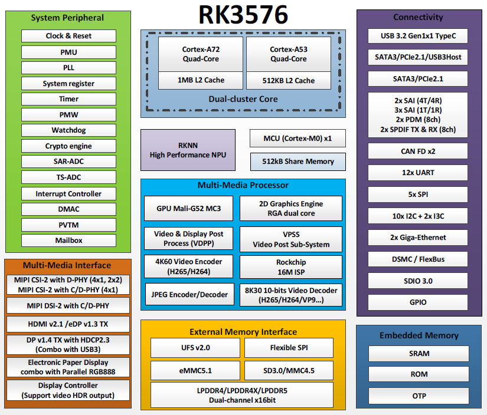

## 2\. FET3588-C SoM Description

### 2.1 FET3576-C SoM

**Front**

**Back**

### 2.2 FET3576-C SoM Dimension Diagram

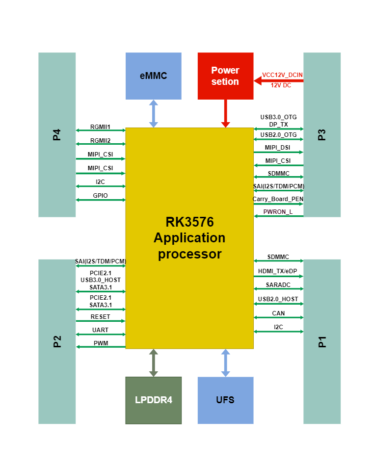

**SoM**

### 2.3 FET3576-C SoM Dimension Diagram

FET3576-C SoM Dimension Diagram 

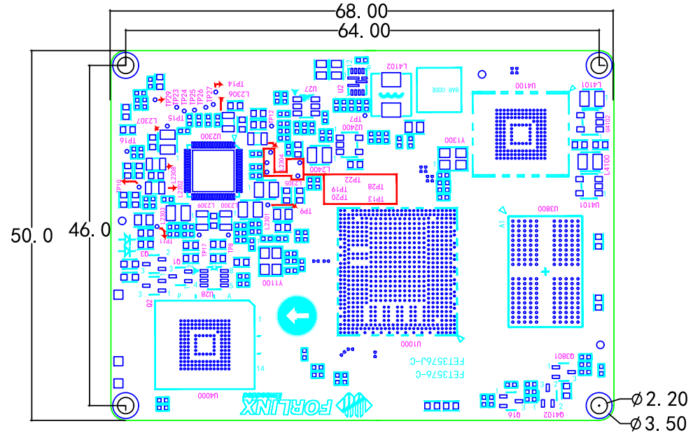

**Top Layer Dimension Diagram**

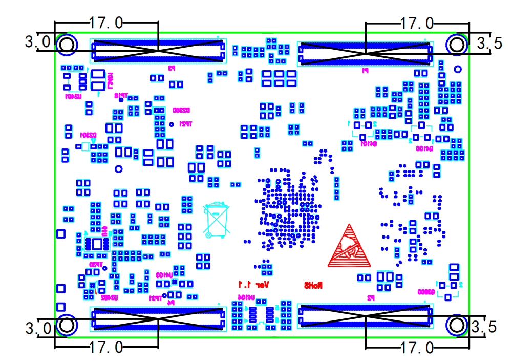

**Bottom Layer Dimension Diagram**

Unit：mm

Structural dimensions: 68mm × 50mm, dimensional tolerance ± 0.15 mm; for more detailed dimensions, please refer to the user information DXF structural documents.

Plate making process: 1.6mm thickness, 10-layer immersion gold PCB.

Connector: Four 0.4mm pitch, 100pin board-to-board connectors. Refer to Appendix for the connector dimension diagram.

Four mounting holes (2.2mm) are reserved at the four corners of the SoM to facilitate the installation of fixing screws and to improve the reliability of the product connection so that the product can be used in vibration environments.

Please refer to the development board design and use SMT nuts of M2 with a length (L) of 1.5 mm on the carrier board. Please refer to the following figure for the specifications of the SMT nuts.

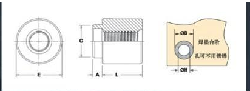

### 2.4 Performance Parameters

#### 2.4.1 System Main Frequency

| **Name**| **Specification**| | | | **Description**|
|:----------:|:----------:|----------|----------|----------|:----------:|
| | **Minimum**| **Typical**| **Maximum**| **Unit**|
| System Frequency Arm® Cortex®-A72| \-| \-| 2300| MHz| \-|
| System Frequency Arm® Cortex®-A53| \-| \-| 2200| MHz|
| System Frequency Arm® Cortex®-M0| \-| \-| \-| \-| \-|

#### 2.4.2 Power Parameter

| **Parameter**| **Pin Number**| **Specification**| | | | **Description**|
|:----------:|:----------:|:----------:|----------|----------|----------|:----------:|
| | | **Minimum**| **Typical**| **Maximum**| **Unit**|
| Main Power Supply Voltage| 12V| 5V| 12| 13V| V| \-|

#### 2.4.3 Operating Environment

| **Parameter**| | **Specification**| | | | **Description**|
|:----------:|----------|:----------:|----------|----------|----------|:----------:|
| | | **Minimum**| **Typical**| **Maximum**| **Unit**|
| Operating Temperature| Operating Environment| 0| 25| 80| ℃| Commercial level|
| | Storage Environment| -40| 25| +125| ℃|
| Humidity| Operating Environment| 10| \-| 90| ％RH| No condensation|
| | Storage Environment| 5| \-| 95| ％RH|

#### 2.4.4 SoM Interface Speed

| **Parameter**| **Specification**| | | | **Description**|
|:----------:|:----------:|----------|----------|----------|:----------:|
| | **Minimum**| **Typical**| **Maximum**| **Unit**|
| Serial Port Communication Speed| \-| 115200| 4M| bps| \-|
| SPI Clock Frequncey| \-| \-| 50| MHz| \-|
| I2C Communication Speed| \-| 100| 400| Kbps| \-|
| USB3.0 Interface Speed| \-| \-| 5| Gbps| \-|
| USB2.0 Interface Speed| \-| \-| 480| Mbps| \-|
| CAN Communication Speed| \-| \-| 1| Mbps| \-|
| PCIe2.1| \-| \-| 5| Gbps| \-|

#### 2.4.5 ESD  Features

| Parameter| Specification| | Unit| Application Scope|
|:----------:|:----------:|----------|:----------:|:----------:|
| | Minimum| Maximum| |
| ESD HBM(ESDA/JEDEC JS-001-2017)| -2000| 2000| V| Signals exported from SoM|
| ESD CDM(ESDA/JEDEC JS-002-2018)| -250| 250| V| Signals exported from SoM|

**Note：**

- **The above data is provided by Rockchip;**

- **As all the signals exported from SoM are electrostatic sensitive signals, the interfaces should be well protected from static electricity in the carrier board design and the SoM transportation, assembling, and use.**

### 2.5 SoM Interface Speed

FET3576-C SoM Interfaces:

|          Function          |                           Quantity                           | Parameter                                                    |
| :------------------------: | :----------------------------------------------------------: | ------------------------------------------------------------ |
|          MIPI CSI          |                              5                               | ·Supports 5 x CSI - 2 interfaces; ·Among them, 4 x interfaces have 2 x D - PHY v1.2 data - lanes, with a speed of 2.4 Gbps per lane; ·These 4 x interfaces can be combined into 2 x interfaces with 4 x data - lanes; ·The other 1 x interface supports 4 x D - PHY data - lanes or 3 x C - PHY trios;                                                                                  ·D - PHY v2.0, up to 4.5 Gbps; ·C - PHY v1.1, up to 2.4 Gsps. |
|            DVP             |                              1                               | ·8/10/12/16-bit standard DVP interface, up to 150MHz data input; ·Supports BT.601/BT.656 and BT.1120 VI interface. |
|        HDMI/eDP TX         | 1 *******1** | ·Supports 1 x combined HDMI/eDP TX interface; ·HDMI interface: ·HDMI v2.1; ·Supports up to 4K@120Hz; ·Supports data formats: RGB/YUV444/YUV422/YUV420 8/10 - bit; ·Supports CEC and ARC; ·Supports HDCP v2.3 and HDCP v1.4; ·eDP interface； ·eDP v1.3; ·The main link contains 4 physical lanes; ·Supports up to 4K@60Hz; ·Supports HDCP v1.3. |
|           DP TX            | 1 *******1** | ·Supports 1 combined USB/DP interface. ·USB interface: ·USB 3.2 Gen1x1; ·Dual - Role Device (DRD); ·DisplayPort TX interface; ·DisplayPort v1.4; ·Supports 1/2/4 lanes with lane speeds of 1.62, 2.7, 5.4, and 8.1 Gbps; ·Supports up to 4K@120Hz; ·Supports data formats: RGB/YUV444/YUV422/YUV420 8/10 - bit; ·Supports Multi - Stream Transport (MST) with 3 displays; ·Supports DP Altmode on USB Type - C; ·Supports HDCP v2.3 and HDCP v1.3. |
|          MIPI DSI          | 1 *******1** | ·Supports 1 x MIPI DSI - 2 TX interface; ·D - PHY v2.0 or C - PHY v1.1; ·4 x data lanes on D - PHY; ·3 data trios on C - PHY; ·Supports up to 2560 x 1600@60Hz; ·Supports data format: RGB (up to 10bit). |
|          Parallel          | 1 *******1** | ·Supports 1 x parallel output interface; ·Supports RGB/BT.656/BT1120; ·Supports up to 1920 x 1080@60Hz; ·Supports data format: RGB (up to 10bit). |
|            EBC             | 1 *******1** | ·Supports 1 x EBC output interface; ·Supports E - ink EPD (Electronic paper Display); ·Supports 2560 x 1920 hardware decoding; ·Supports data bus width: 16 - bit; ·Supports up to 32 - level gray scale; ·Supports Direct mode, LUT mode, 3 - window mode; ·Supports window display mode. |
|            SAI             |                              ≤5                              | ·Supports 5 x SAI interfaces; ·SAI 0/1 support 4 x TX lanes and 4 x RX lanes; ·SAI 2/3/4 support 1 x TX lane and 1 x RX lane. ·Support I2S/TDM/PCM modes *2; ·Support the maximum sampling rate: 192 KHz; ·Support audio resolution: from 16 bits to 32 bits. |
|          SPDIF TX          |                              ≤2                              | · Supports 2 x SPDIF TX ports;                               |
|          SPDIF RX          |                              ≤2                              | · Supports 2 x SPDIF RX ports;                               |
|            PDM             |                              ≤2                              | · Up to 8 channels, audio resolution from 16 to 24 bits, sampling rate up to 192Khz; ·Support PDM main receiving mode. |
|          Ethernet          |                              ≤2                              | ·2 x GMAC, with led out RGMII / RMII interfaces; ·Supports data transfer rates of 10/100/1000 Mbps. |
| Combo high speed interface |                              2                               | ·Supports 1 x PCIe2.1/SATA3.1 interface with one data lane;  ·Supports 1 x PCIe2.1/SATA3.1/USB3.2 Gen1x1 interface with one data lane. |
|        USB 2.0 OTG         |                              2                               | ·Supports 2 x USB2.0 OTG                                     |
|            SDIO            |                              ≤2                              | ·SDIO v3.0，4-bit data bus widths                            |
|            SPI             |                              ≤5                              | ·Supports two chip-select in each interface; ·Supports serial-master and serial-slave mode |
|            I2C             |                              ≤9                              | ·Supports both 7 - bit and 10 - bit address modes; ·The data transfer rate can reach 100 k bits/s in standard mode and up to 400 k bits/s in fast mode. |
|            I3C             |                              ≤2                              | ·Supports 2 x I3C master ports;                              |
|            UART            |                             ≤12                              | ·2 x built - in 64 - bit FIFO, which can be used for TX and RX respectively; ·Supports the sending and receiving of 5 - bit, 6 - bit, 7 - bit, and 8 - bit serial data, with a baud rate of up to 4Mbps; ·All 12 x UART support the automatic flow control mode; ·All 12 x UART support the RS485 mode. |
|            CAN             |                              ≤2                              | ·Complies with CAN and CAN FD specifications;  · Supports CAN standard frame and extended frame sending and receiving; · Supports 8192-bit receive FIFO |
|            DSMC            |                              ≤1                              | ·Supports up to select 4 chips;  ·Supports 8-wire and 16-wire serial transfer mode; ·Supports configurable serial address width:16 bits or 32 bits. |
|          FlexBus           |                              ≤1                              | ·Supports built-in DMA and ping-pong operation for allocating two address; ·Supports transmission and receiving mode; ·Supports single mode and continuous mode. |
|            PWM             |                             ≤16                              | ·Supports up to 16 on-chip PWM with interrupt-based operation and capture mode; |
|            ADC             |                              ≤8                              | ·Supports 8 x 12bit single-ended input SAR-ADC with sampling rate up to 1MS/s; |
|            GPIO            |                              n                               | ·All GPIO pins can be used to generate interrupts; ·Support both level - triggered and edge - triggered interrupts; ·Support configuration of the polarity for level - triggered interrupts; ·Support rising - edge, falling - edge, and both - edge triggered interrupts; ·Support configuration of pull - up and pull - down resistors (weak pull - up and weak pull - down).; ·Support configuration of drive capability. |

**Note:** 

**The parameters in the table are the theoretical values of hardware design or CPU.**
**The interfaces have GPIO multiplexing, and the quantity mentioned is the theoretical maximum.**

***1. Video Port**
**·Video Port0 supports up to 4K@120Hz with 10 bit data**

**·Video Port1 supports up to 2560x1600@60Hz with 10-bit data**

**·Video Port2 supports up to 1920x1080@60Hz with 8-bit data**

**·Each Video Port may connect to any of HDMI/eDP/DP/DSI-2**

**·Port1 and Port2 may connect to parallel output interface**

***2. The maximum clock of a single TDM design is 50MHz. When using the TDM mode, the theoretical number of supported audio channels can be calculated by combining the audio sampling frequency and resolution to see if it meets the project requirements.**

### 2.6 FET3576-C SoM Pins Definition

#### 2.6.1  FET3576-C SoM Pins Schematic

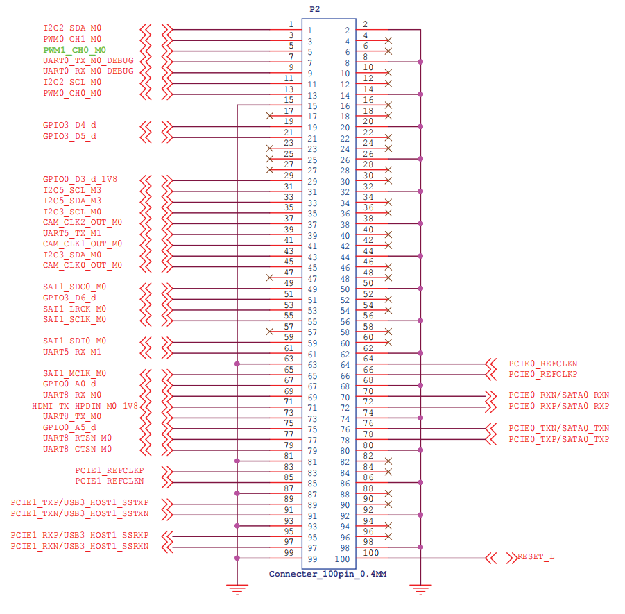

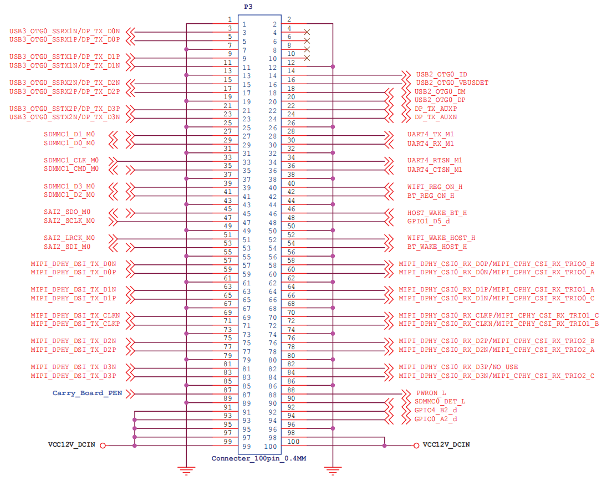

#### 2.6.2 FET3576-C SoM Pins Description

**Note1:**

**Num ——SoM connector pin no.:**

**Ball —— CPU pin ball no.**

**GPIO ——CPU pin general I/O port serial number**

**Vol  ——Pin signal level**

**Note2:**

**Signal Name——SoM connector network name, the top right corner subscripts’ meaning are as follows:**

| **No.**| **Superscript Description**|
|:----------:|----------|
| \[1]| Pins can be configured for interrupt use.|
| \[2]| The default pin level is 1.8 V.|
| \[3]| Pins are CPU boot-related pins, which are not recommended for IO.|
| \[4]| Special-purpose pins and can not be used as IO.|

Pin Description—— SoM Pin Signal Descriptions

Default Function——Please don’t make any modifications for all SoM pin functions regulated in the “default functions” of the following table, otherwise, it may have conflicts with the factory driver. Please contact us with any questions in time.

**Note3: The pins marked with "Do not use for carrier board" in the "Pin Description" are those used by the SoM, and should not be used in the carrier board design.**

**Table 1 P1 Connector Interface (Odd) Pin Definitions**

| **NUM**| **BALL**| **Signal Name**| **GPIO**| **VOL**| **Pin Description**| **Default Function**|
|:----------:|:----------:|:----------:|:----------:|:----------:|----------|:----------:|
| 1| ——| GND| ——| ——| Ground| GND|
| 3| B25| SDMMC\_D1| | 1.8V/3.3V| SD/MMC Interface data signal 1| SDMMC\_D1|
| 5| B24| SDMMC\_D0| | 1.8V/3.3V| SD/MMC Interface data signal 0| SDMMC\_D0|
| 7| 1B21| SDMMC\_CLK| | 1.8V/3.3V| SD/MMC Interface clock signal| SDMMC\_CLK|
| 9| 1A21| SDMMC\_CMD| | 1.8V/3.3V| SD/MMC Interface order signal| SDMMC\_CMD|
| 11| B23| SDMMC\_D3| | 1.8V/3.3V| SD/MMC Interface data signal 3| SDMMC\_D3|
| 13| A23| SDMMC\_D2| | 1.8V/3.3V| SD/MMC Interface data signal 2| SDMMC\_D2|
| 15| ——| GND| ——| ——| Ground| GND|
| 17| 2U12| HDMI\_TX\_SBDN| ——| ——| HDMISBD signal-| HDM0\_TX\_SBD\_N|
| 19| 2T12| HDMI\_TX\_SBDP| ——| ——| HDMISBD signal+| HDM0\_TX\_SBD\_P|
| 21| ——| GND| ——| ——| Ground| GND|
| 23| AK26| HDMI\_TX\_D3N| ——| ——| HDMI differential signal 3-| HDMI\_TX\_D3\_N|
| 25| AL26| HDMI\_TX\_D3P| ——| ——| HDMI differential signal 3+| HDMI\_TX\_D3\_P|
| 27| ——| GND| ——| ——| Ground| GND|
| 29| AK27| HDMI\_TX\_D0N| ——| ——| HDMI differential signal 0-| HDMI\_TX\_D0\_N|
| 31| 1AE24| HDMI\_TX\_D0P| ——| ——| HDMI differential signal 0+| HDMI\_TX\_D0\_P|
| 33| ——| GND| ——| ——| Ground| GND|
| 35| AL28| HDMI\_TX\_D1N| ——| ——| HDMI differential signal 1-| HDMI\_TX\_D1\_N|
| 37| AK28| HDMI\_TX\_D1P| ——| ——| HDMI differential signal 1+| HDMI\_TX\_D1\_P|
| 39| ——| GND| ——| ——| Ground| GND|
| 41| AK29| HDMI\_TX\_D2N| ——| ——| HDMI differential signal 2-| HDMI\_TX\_D2\_N|
| 43| AJ28| HDMI\_TX\_D2P| ——| ——| HDMI differential signal 2+| HDMI\_TX\_D2\_P|
| 45| ——| GND| ——| ——| Ground| GND|
| 47| ——| ——| ——| ——| |
| 49| ——| ——| ——| ——| |
| 51| ——| GND| ——| ——| Ground| GND|
| 53| ——| ——| ——| ——| |
| 55| ——| ——| ——| ——| |
| 57| ——| GND| ——| ——| Ground| GND|
| 59| ——| ——| ——| ——| |
| 61| ——| ——| ——| ——| |
| 63| ——| GND| ——| ——| Ground| GND|
| 65| ——| ——| ——| ——| |
| 67| ——| ——| ——| ——| |
| 69| ——| GND| ——| ——| Ground| GND|
| 71| ——| ——| ——| ——| |
| 73| ——| ——| ——| ——| |
| 75| ——| GND| ——| ——| Ground| GND|
| 77| ——| ——| ——| ——| |
| 79| ——| ——| ——| ——| |
| 81| ——| GND| ——| ——| Ground| GND|
| 83| ——| ——| ——| ——| |
| 85| ——| ——| ——| ——| |
| 87| ——| GND| ——| ——| Ground| GND|
| 89| ——| ——| ——| ——| |
| 91| ——| ——| ——| ——| |
| 93| ——| GND| ——| ——| Ground| GND|
| 95| ——| ——| ——| ——| |
| 97| ——| ——| ——| ——| |
| 99| ——| GND| ——| ——| Ground| GND|

**Table 2 P1 Connector Interface (Even) Pin Definitions**

| **NUM**| **BALL**| **Signal Name**| **GPIO**| **VOL**| **Pin Description**| **Default Function**|
|:----------:|:----------:|:----------:|:----------:|:----------:|----------|:----------:|
| 2| ——| GND| ——| ——| Ground| GND|
| 4| ——| ——| ——| ——| ——| ——|
| 6| ——| ——| ——| ——| ——| ——|
| 8| ——| GND| ——| ——| Ground| GND|
| 10| ——| ——| ——| ——| ——| ——|
| 12| ——| ——| ——| ——| ——| ——|
| 14| ——| GND| ——| ——| Ground| GND|
| 16| ——| ——| ——| ——| ——| ——|
| 18| ——| ——| ——| ——| ——| ——|
| 20| ——| GND| ——| ——| Ground| GND|
| 22| ——| ——| ——| ——| ——| ——|
| 24| ——| ——| ——| ——| ——| ——|
| 26| ——| GND| ——| ——| Ground| GND|
| 28| A25| SARADC\_VIN0\_BOOT| ——| 1.8V| BOOT start configuration input| SARADC\_VIN0\_BOOT|
| 30| 1A22| SARADC\_VIN1\_KEY/RECOVERY| ——| 1.8V| General ADC1| SARADC\_VIN1\_KEY/RECOVERY|
| 32| 1B19| SARADC\_VIN2\_HW\_ID| ——| 1.8V| General ADC2| SARADC\_VIN2\_HW\_ID|
| 34| 1C19| SARADC\_VIN3\_HP\_HOOK| ——| 1.8V| General ADC3| SARADC\_VIN3\_HP\_HOOK|
| 36| 1E18| SARADC\_VIN4| ——| 1.8V| General ADC4| SARADC\_VIN4|
| 38| 1D19| SARADC\_VIN5| ——| 1.8V| General ADC5| SARADC\_VIN5|
| 40| 1D21| SARADC\_VIN6| ——| 1.8V| General ADC6| SARADC\_VIN6|
| 42| 1E19| SARADC\_VIN7\_LCD\_ID| ——| 1.8V| General ADC7| SARADC\_VIN7\_LCD\_ID|
| 44| ——| GND| ——| ——| Ground| GND|
| 46| B19| HDMI\_TX\_ON\_H| | 3.3V| HDMI\_TX start signal| HDMI\_TX\_ON\_H|
| 48| B20| TYPEC\_DPTX\_AUX\_PUPDCTL2| | 3.3V| TYPEC\_DPTX\_AUX\_PUPDCTL22 signal| TYPEC\_DPTX\_AUX\_PUPDCTL2|
| 50| 1C18| GPIO2\_B5\_d| | 3.3V| USB\_HUB\_RST\_3V3 reset signal| USB\_HUB\_RST\_3V3|
| 52| AK3| HDMI\_TX\_CEC\_M0| | 3.3V| HDMICEC signal| HDMI\_TX\_CEC\_M0|
| 54| 1A19| CAN1\_RX\_M3| | 3.3V| CAN1 data receiving| CAN1\_RX\_M3\_3V3|
| 56| A21| I2C8\_SCL\_M2| | 3.3V| I2C8 clock| I2C8\_SCL\_M2|
| 58| 1AE2| HDMI\_TX\_SDA| | 3.3V| HDMI serial data| HDMI\_TX\_SDA|
| 60| B21| I2C8\_SDA\_M2| | 3.3V| I2C8 data| I2C8\_SDA\_M2|
| 62| ——| GND| ——| ——| Ground| GND|
| 64| A19| PCIE0\_PERSTn| | 3.3V| PCIE reset signal| PCIE0\_PERSTn|
| 66| 1A20| CAN1\_TX\_M3| | 3.3V| CAN1 data sending| CAN1\_TX\_M3\_3V3|
| 68| AL2| HDMI\_TX\_SCL| | 3.3V| HDMI Serial clock| HDMI\_TX\_SCL|
| 70| 1D16| I2C7\_SCL\_M1| | 3.3V| I2C7 clock| I2C7\_SCL\_M1|
| 72| 1B18| I2C7\_SDA\_M1| | 3.3V| I2C7 data| I2C7\_SDA\_M1|
| 74| 1Y22| PCIE0\_WAKEn\_M0| | 3.3V| PCIE wake-up activation signal| PCIE0\_WAKEn\_M0|
| 76| 1B16| GPIO2\_B3\_d| | 3.3V| 4G/5G module reset signal| 4G/5G\_PWREN|
| 78| 1A17| PCIE0\_CLKREQn\_M0| | 3.3V| PCIE clock request signal| PCIE0\_CLKREQn\_M0|
| 80| 1A18| GPIO2\_B1\_d| | 3.3V| 4G/5G module power control reset signal| 4G/5G\_MOD\_PWREN|
| 82| B22| TYPEC\_DPTX\_AUX\_PUPDCTL1| | 3.3V| TYPEC\_DPTX\_AUX\_PUPDCTL1 signal| TYPEC\_DPTX\_AUX\_PUPDCTL1|
| 84| ——| GND| ——| ——| Ground| GND|
| 86| ——| ——| ——| ——| ——| ——|
| 88| ——| ——| ——| ——| ——| ——|
| 90| ——| GND| ——| ——| Ground| GND|
| 92| 2T4| USB2\_HOST1\_DP| ——| ——| USB20\_HOST1 data+| USB20\_HOST1\_D\_P|
| 94| 2T5| USB2\_HOST1\_DM| ——| ——| USB20\_HOST1 data-| USB20\_HOST1\_D\_N|
| 96| ——| GND| ——| ——| Ground| GND|
| 98| 2T9| USB2\_OTG1\_ID| ——| ——| USB2\_OTG1\_ID signal| x|
| 100| 2T10| USB2\_OTG1\_VBUSDET| ——| ——| USB2\_OTG1\_VBUSDET insertion detection| USB2\_OTG1\_VBUSDET|

**Table 3 P2 Connector Interface (Odd) Pin Definitions**

| **NUM**| **BALL**| **Signal Name**| **GPIO**| **VOL**| **Pin Description**| **Default Function**|
|:----------:|:----------:|:----------:|:----------:|:----------:|----------|:----------:|
| 1| AB29| I2C2\_SDA\_M0| | 3.3V| I2C2 data| I2C2\_SDA\_M0|
| 3| 1W21| PWM0\_CH1\_M0| | 3.3V| PWM0\_CH1\_M0| x|
| 5| AD28| PWM1\_CH0\_M0| | 3.3V| PWM1\_CH0\_M0| x|
| 7| 1U24| UART0\_TX\_M0\_DEBUG| | 3.3V| UART0 sending| UART0\_TX\_M0\_DEBUG|
| 9| AA28| UART0\_RX\_M0\_DEBUG| | 3.3V| UART0 receiving| UART0\_RX\_M0\_DEBUG|
| 11| 1W24| I2C2\_SCL\_M0| | 3.3V| I2C2 clock| I2C2\_SCL\_M0|
| 13| 1W22| PWM0\_CH0\_M0| | 3.3V| PWM0\_CH0\_M0| PWM0\_CH0\_M0(MIPI screen backlight PWM)|
| 15| ——| GND| ——| ——| Ground| GND|
| 17| ——| ——| ——| ——| ——| ——|
| 19| 1E21| GPIO3\_D4\_d| GPIO3\_D4\_d| 1.8V| GMAC1\_INT Interrupt| GMAC1\_INT|
| 21| 1D10| GPIO3\_D5\_d| GPIO3\_D5\_d| 1.8V| GMAC1\_RESET Reset| GMAC1\_RESET|
| 23| ——| ——| ——| ——| ——| ——|
| 25| ——| ——| ——| ——| ——| ——|
| 27| ——| ——| ——| ——| ——| ——|
| 29| 1AA23| GPIO0\_D3\_d\_1V8| | 1.8V| HP\_DET\_L headphone insertion detection| HP\_DET\_L(headphone)|
| 31| 1D9| I2C5\_SCL\_M3| | 1.8V| I2C5 clock| I2C5\_SCL\_M3|
| 33| 1B10| I2C5\_SDA\_M3| | 1.8V| I2C5 Data| I2C5\_SDA\_M3|
| 35| 1A4| I2C3\_SCL\_M0| | 1.8V| I2C3 clock| I2C3\_SCL\_M0|
| 37| 1B7| CAM\_CLK2\_OUT\_M0| | 1.8V| CAM\_CLK2\_OUT\_M0| x|
| 39| 1A5| UART5\_TX\_M1| | 1.8V| UART5 Sending data| UART5\_TX\_M1\_1V8|
| 41| 1B12| CAM\_CLK1\_OUT\_M0| | 1.8V| CAM\_CLK1\_OUT\_M0| x|
| 43| B8| I2C3\_SDA\_M0| | 1.8V| I2C3 data| I2C3\_SDA\_M0|
| 45| 1E7| CAM\_CLK0\_OUT\_M0| | 1.8V| CAM\_CLK0\_OUT\_M0| x|
| 47| ——| ——| ——| ——| ——| ——|
| 49| A7| SAI1\_SDO0\_M0| | 1.8V| I2S Data output| SAI1\_SDO0\_M0|
| 51| 1C10| GPIO3\_D6\_d| | 1.8V| 4G/5G Reset| 4G/5G\_RESET|
| 53| 1B6| SAI1\_LRCK\_M0| | 1.8V| I2S Sending frame clock| SAI1\_LRCK\_M0|
| 55| 1C6| SAI1\_SCLK\_M0| | 1.8V| I2S bit clock| SAI1\_SCLK\_M0|
| 57| ——| ——| ——| ——| ——| ——|
| 59| 1A6| SAI1\_SDI0\_M0| | 1.8V| I2S Data input| SAI1\_SDI0\_M0|
| 61| B7| UART5\_RX\_M1| | 1.8V| UART5 receiving data：| UART5\_RX\_M1\_1V8|
| 63| ——| GND| ——| ——| Ground| GND|
| 65| 1D6| SAI1\_MCLK\_M0| | 1.8V| I2S main clock| SAI1\_MCLK\_M0|
| 67| V29| GPIO0\_A0\_d| | 1.8V| IIC interrupt| IIC\_GPIO\_INT|
| 69| 1B9| UART8\_RX\_M0| | 1.8V| UART8 receiving data：| UART8\_RX\_M0\_1V8|
| 71| AK2| HDMI\_TX\_HPDIN\_M0\_1V8| | 1.8V| HDMI Sending link detection| HDMI\_TX\_HPDIN\_M0\_1V8|
| 73| 1D7| UART8\_TX\_M0| | 1.8V| UART8 Sending data| UART8\_TX\_M0\_1V8|
| 75| Y29| GPIO0\_A5\_d| | 1.8V| TYPEC0 Interrupt| TYPEC0\_INT|
| 77| 1C7| UART8\_RTSN\_M0| | 1.8V| UART8 request sending| UART8\_RTSN\_M0\_1V8|
| 79| 1C12| UART8\_CTSN\_M0| | 1.8V| UART8 clear sending| UART8\_CTSN\_M0\_1V8|
| 81| ——| GND| ——| ——| Ground| GND|
| 83| 1L23| PCIE1\_REFCLKP| ——| ——| PCIE1 clock output/input+| x|
| 85| 1M23| PCIE1\_REFCLKN| ——| ——| PCIE1 clock output/input-| x|
| 87| ——| GND| ——| ——| Ground| GND|
| 89| N28| PCIE1\_TXP/USB3\_HOST1\_SSTXP| ——| ——| USB3\_HOST1 sending differential+| USB3\_HOST1\_SSTXP|
| 91| N29| PCIE1\_TXN/USB3\_HOST1\_SSTXN| ——| ——| USB3\_HOST1 sending differential-| USB3\_HOST1\_SSTXN|
| 93| ——| GND| ——| ——| Ground| GND|
| 95| M28| PCIE1\_RXP/USB3\_HOST1\_SSRXP| ——| ——| USB3\_HOST1 receiving differential+| USB3\_HOST1\_SSRXP|
| 97| M29| PCIE1\_RXN/USB3\_HOST1\_SSRXN| ——| ——| USB3\_HOST1 receiving differential-| USB3\_HOST1\_SSRXN|
| 99| ——| GND| ——| ——| Ground| GND|

**Table 4 P2 Connector Interface (Even) Pin Definitions**

| **NUM**| **BALL**| **Signal Name**| **GPIO**| **VOL**| **Pin Description**| **Default Function**|
|:----------:|:----------:|:----------:|:----------:|:----------:|----------|:----------:|
| 2| ——| GND| ——| ——| Ground| GND|
| 4| ——| ——| ——| ——| ——| ——|
| 6| ——| ——| ——| ——| ——| ——|
| 8| ——| GND| ——| ——| Ground| GND|
| 10| ——| ——| ——| ——| ——| ——|
| 12| ——| ——| ——| ——| ——| ——|
| 14| ——| GND| ——| ——| Ground| GND|
| 16| ——| ——| ——| ——| ——| ——|
| 18| ——| ——| ——| ——| ——| ——|
| 20| ——| GND| ——| ——| Ground| GND|
| 22| ——| ——| ——| ——| ——| ——|
| 24| ——| ——| ——| ——| ——| ——|
| 26| ——| GND| ——| ——| Ground| GND|
| 28| ——| ——| ——| ——| ——| ——|
| 30| ——| ——| ——| ——| ——| ——|
| 32| ——| GND| ——| ——| Ground| GND|
| 34| ——| ——| ——| ——| ——| ——|
| 36| ——| ——| ——| ——| ——| ——|
| 38| ——| GND| ——| ——| Ground| GND|
| 40| ——| ——| ——| ——| ——| ——|
| 42| ——| ——| ——| ——| ——| ——|
| 44| ——| GND| ——| ——| Ground| GND|
| 46| ——| ——| ——| ——| ——| ——|
| 48| ——| ——| ——| ——| ——| ——|
| 50| ——| GND| ——| ——| Ground| GND|
| 52| ——| ——| ——| ——| ——| ——|
| 54| ——| ——| ——| ——| ——| ——|
| 56| ——| GND| ——| ——| Ground| GND|
| 58| ——| ——| ——| ——| ——| ——|
| 60| ——| ——| ——| ——| ——| ——|
| 62| ——| GND| ——| ——| Ground| GND|
| 64| 1N23| PCIE0\_REFCLKN| ——| ——| PCIE0 clock output/input-| PCIE0\_REFCLKN|
| 66| 1N22| PCIE0\_REFCLKP| ——| ——| PCIE0 clock output/input+| PCIE0\_REFCLKP|
| 68| ——| GND| ——| ——| Ground| GND|
| 70| R29| PCIE0\_RXN/SATA0\_RXN| ——| ——| PCIE0 data receiving-| PCIE0\_RXN|
| 72| R28| PCIE0\_RXP/SATA0\_RXP| ——| ——| PCIE0 data receiving+| PCIE0\_RXP|
| 74| ——| GND| ——| ——| Ground| GND|
| 76| P28| PCIE0\_TXN/SATA0\_TXN| ——| ——| PCIE0 data sending-| PCIE0\_TXN|
| 78| P29| PCIE0\_TXP/SATA0\_TXP| ——| ——| PCIE0 data sending+| PCIE0\_TXP|
| 80| ——| GND| ——| ——| Ground| GND|
| 82| ——| ——| ——| ——| ——| ——|
| 84| ——| ——| ——| ——| ——| ——|
| 86| ——| GND| ——| ——| Ground| GND|
| 88| ——| ——| ——| ——| ——| ——|
| 90| ——| ——| ——| ——| ——| ——|
| 92| ——| GND| ——| ——| Ground| GND|
| 94| ——| ——| ——| ——| ——| ——|
| 96| ——| ——| ——| ——| ——| ——|
| 98| ——| GND| ——| ——| Ground| GND|
| 100| ——| RESET\_L| ——| ——| Reset| RESET\_L|

**Table 5 P3 Connector Interface (Odd) Pin Definitions**

| **NUM**| **BALL**| **Signal Name**| **GPIO**| **VOL**| **Pin Description**| **Default Function**|
|:----------:|:----------:|:----------:|:----------:|:----------:|----------|:----------:|
| 1| ——| GND| ——| ——| Ground| GND|
| 3| AL10| USB3\_OTG0\_SSRX1N/DP\_TX\_D0N| ——| ——| USB3\_OTG0\_SSRX1N Receiving differential signal 1-| USB3\_OTG0\_SSRX1N|
| 5| AK10| USB3\_OTG0\_SSRX1P/DP\_TX\_D0P| ——| ——| USB3\_OTG0\_SSRX1P Receiving differential signals 1+| USB3\_OTG0\_SSRX1P|
| 7| ——| GND| ——| ——| Ground| GND|
| 9| AL11| USB3\_OTG0\_SSTX1P/DP\_TX\_D1P| ——| ——| USB3\_OTG0\_SSTX1P Sending differential signals 1+| USB3\_OTG0\_SSTX1P|
| 11| AK11| USB3\_OTG0\_SSTX1N/DP\_TX\_D1N| ——| ——| USB3\_OTG0\_SSTX1N Sending differential signals 1-| USB3\_OTG0\_SSTX1N|
| 13| ——| GND| ——| ——| Ground| GND|
| 15| AL12| USB3\_OTG0\_SSRX2N/DP\_TX\_D2N| ——| ——| USB3\_OTG0\_SSRX2N Receiving differential signal 2-| USB3\_OTG0\_SSRX2N|
| 17| AK12| USB3\_OTG0\_SSRX2P/DP\_TX\_D2P| ——| ——| USB3\_OTG0\_SSRX2P Receiving differential signal 2+| USB3\_OTG0\_SSRX2P|
| 19| ——| GND| ——| ——| Ground| GND|
| 21| AL13| USB3\_OTG0\_SSTX2P/DP\_TX\_D3P| ——| ——| USB3\_OTG0\_SSTX2P Sending differential signal 2+| USB3\_OTG0\_SSTX2P|
| 23| AK13| USB3\_OTG0\_SSTX2N/DP\_TX\_D3N| ——| ——| USB3\_OTG0\_SSTX2N Sending differential signal 2-| USB3\_OTG0\_SSTX2N|
| 25| ——| GND| ——| ——| Ground| GND|
| 27| B27| SDMMC1\_D1\_M0| | 1.8V| SD/MMC Interface data signal 1| SDMMC1\_D1\_M0|
| 29| A28| SDMMC1\_D0\_M0| | 1.8V| SD/MMC Interface data signal 0| SDMMC1\_D0\_M0|
| 31| ——| GND| ——| ——| Ground| GND|
| 33| 1B22| SDMMC1\_CLK\_M0| | 1.8V| SD/MMC Interface clock signal| SDMMC1\_CLK\_M0|
| 35| B26| SDMMC1\_CMD\_M0| | 1.8V| SD/MMC Interface order signal| SDMMC1\_CMD\_M0|
| 37| ——| GND| ——| ——| Ground| GND|
| 39| A27| SDMMC1\_D3\_M0| | 1.8V| SD/MMC Interface data signal 3| SDMMC1\_D3\_M0|
| 41| 1A23| SDMMC1\_D2\_M0| | 1.8V| SD/MMC Interface data signal 2| SDMMC1\_D2\_M0|
| 43| ——| GND| ——| ——| Ground| GND|
| 45| C29| SAI2\_SDO\_M0| | 1.8V| I2S Data output| SAI2\_SDO\_M0|
| 47| 1D22| SAI2\_SCLK\_M0| | 1.8V| I2S Bit clock| SAI2\_SCLK\_M0|
| 49| ——| GND| ——| ——| Ground| GND|
| 51| 1A24| SAI2\_LRCK\_M0| | 1.8V| I2S Sending frame clock| SAI2\_LRCK\_M0|
| 53| C28| SAI2\_SDI\_M0| | 1.8V| I2S Data input| SAI2\_SDI\_M0|
| 55| ——| GND| ——| ——| Ground| GND|
| 57| AK15| MIPI\_DPHY\_DSI\_TX\_D0N| ——| ——| MIPI\_DPHY\_DSI Sending data 0-| MIPI\_DPHY\_DSI\_TX\_D0N|
| 59| AL15| MIPI\_DPHY\_DSI\_TX\_D0P| ——| ——| MIPI\_DPHY\_DSI send data 0+| MIPI\_DPHY\_DSI\_TX\_D0P|
| 61| ——| GND| ——| ——| Ground| GND|
| 63| AK16| MIPI\_DPHY\_DSI\_TX\_D1N| ——| ——| MIPI\_DPHY\_DSI Sending data1-| MIPI\_DPHY\_DSI\_TX\_D1N|
| 65| AL16| MIPI\_DPHY\_DSI\_TX\_D1P| ——| ——| MIPI\_DPHY\_DSI send data 1+| MIPI\_DPHY\_DSI\_TX\_D1P|
| 67| ——| GND| ——| ——| Ground| GND|
| 69| AL17| MIPI\_DPHY\_DSI\_TX\_CLKN| ——| ——| MIPI\_DPHY\_DSI Sending clock-| MIPI\_DPHY\_DSI\_TX\_CLKN|
| 71| AL17| MIPI\_DPHY\_DSI\_TX\_CLKP| ——| ——| MIPI\_DPHY\_DSI Sending clock+| MIPI\_DPHY\_DSI\_TX\_CLKP|
| 73| ——| GND| ——| ——| Ground| GND|
| 75| AK18| MIPI\_DPHY\_DSI\_TX\_D2N| ——| ——| MIPI\_DPHY\_DSI Sending data 2-| MIPI\_DPHY\_DSI\_TX\_D2N|
| 77| AL18| MIPI\_DPHY\_DSI\_TX\_D2P| ——| ——| MIPI\_DPHY\_DSI send data 2+| MIPI\_DPHY\_DSI\_TX\_D2P|
| 79| ——| GND| ——| ——| Ground| GND|
| 81| AK19| MIPI\_DPHY\_DSI\_TX\_D3N| ——| ——| MIPI\_DPHY\_DSI Sending data 3-| MIPI\_DPHY\_DSI\_TX\_D3N|
| 83| AL19| MIPI\_DPHY\_DSI\_TX\_D3P| ——| ——| MIPI\_DPHY\_DSI send data 3+| MIPI\_DPHY\_DSI\_TX\_D3P|
| 85| ——| GND| ——| ——| Ground| GND|
| 87| | CARRIER\_BOARD\_EN| ——| ——| CARRIER enable| CARRIER\_BOARD\_EN|
| 89| ——| GND| ——| ——| Ground| GND|
| 91| |VCC_DCIN| ——| ——| 5V-13V  power input| VCC_DCIN|
| 93| | VCC_DCIN| ——| ——| 5V-13V power input| VCC_DCIN|
| 95| | VCC_DCIN| ——| ——| 5V-13V power input| VCC_DCIN|
| 97| | VCC_DCIN| ——| ——| 5V-13V power input| VCC_DCIN|
| 99| | VCC_DCIN| ——| ——| 5V-13V power input| VCC_DCIN|

**Table 6 P3 Connector Interface (Even) Pin Definitions**

| **NUM**| **BALL**| **Signal Name**| **GPIO**| **VOL**| **Pin Description**| **Default Function**|
|:----------:|:----------:|:----------:|:----------:|:----------:|----------|:----------:|
| 2| ——| GND| ——| ——| Ground| GND|
| 4| ——| ——| ——| ——| ——| ——|
| 6| ——| ——| ——| ——| ——| ——|
| 8| ——| ——| ——| ——| ——| ——|
| 10| ——| ——| ——| ——| ——| ——|
| 12| ——| GND| ——| ——| Ground| GND|
| 14| 2R6| USB2\_OTG0\_ID| ——| ——| USB2\_OTG0\_ID signal| X|
| 16| 2P3| USB2\_OTG0\_VBUSDET| ——| ——| USB2\_OTG0\_VBUSDET insertion detection| USB2\_OTG0\_VBUSDET|
| 18| AL9| USB2\_OTG0\_DM| ——| ——| USB2\_OTG0\_DM data-| USB2\_OTG0\_DM|
| 20| AK9| USB2\_OTG0\_DP| ——| ——| USB2\_OTG0\_DP data+| USB2\_OTG0\_DP|
| 22| 2T2| DP\_TX\_AUXP| ——| ——| DP\_TX\_AUXP signal| DP\_TX\_AUXP|
| 24| 2T3| DP\_TX\_AUXN| ——| ——| DP\_TX\_AUXN signal| DP\_TX\_AUXN|
| 26| ——| GND| ——| ——| Ground| GND|
| 28| 1B23| UART4\_TX\_M1| ——| 1.8V| UART4 Sending data| UART4\_TX\_M1|
| 30| B28| UART4\_RX\_M1| ——| 1.8V| UART4 receiving data：| UART4\_RX\_M1|
| 32| ——| GND| ——| ——| Ground| GND|
| 34| B29| UART4\_RTSN\_M1| ——| 1.8V| UART4 request sending| UART4\_RTSN\_M1|
| 36| 1C23| UART4\_CTSN\_M1| ——| 1.8V| UART4 clear sending| UART4\_CTSN\_M1|
| 38| ——| GND| ——| ——| Ground| GND|
| 40| A26| WIFI\_REG\_ON\_H| ——| 1.8V| WIFI\_REG\_ON\_H signal| WIFI\_REG\_ON\_H|
| 42| 1C22| BT\_REG\_ON\_H| ——| 1.8V| BT\_REG\_ON\_H signal| BT\_REG\_ON\_H|
| 44| ——| GND| ——| ——| Ground| GND|
| 46| 1E21| HOST\_WAKE\_BT\_H| ——| 1.8V| HOST\_WAKE\_BT\_H signal| HOST\_WAKE\_BT\_H|
| 48| 1E22| GPIO1\_D5\_d| ——| 1.8V| GPIO\_D5\_d\_1V8 signal| GPIO\_D5\_d\_1V8|
| 50| ——| GND| ——| ——| Ground| GND|
| 52| 1U22| WIFI\_WAKE\_HOST\_H| ——| 1.8V| WIFI\_WAKE\_HOST\_H signal| WIFI\_WAKE\_HOST\_H|
| 54| 1P23| BT\_WAKE\_HOST\_H| ——| 1.8V| BT\_WAKE\_HOST\_H signal| BT\_WAKE\_HOST\_H|
| 56| ——| GND| ——| ——| Ground| GND|
| 58| AK20| MIPI\_DPHY\_CSI0\_RX\_D0P/MIPI\_CPHY\_CSI\_RX\_TRIO0\_B| ——| ——| MIPI\_DPHY\_CSI0\_RX\_D0P Receiving data 0+| MIPI\_DPHY\_CSI0\_RX\_D0P|
| 60| AL20| MIPI\_DPHY\_CSI0\_RX\_D0N/MIPI\_CPHY\_CSI\_RX\_TRIO0\_A| ——| ——| MIPI\_DPHY\_CSI0\_RX\_D0N Receiving data 0-| MIPI\_DPHY\_CSI0\_RX\_D0N|
| 62| ——| GND| ——| ——| Ground| GND|
| 64| AK21| MIPI\_DPHY\_CSI0\_RX\_D1P/MIPI\_CPHY\_CSI\_RX\_TRIO1\_A| ——| ——| MIPI\_DPHY\_CSI0\_RX\_D1P Receiving data1+| MIPI\_DPHY\_CSI0\_RX\_D1P|
| 66| AL21| MIPI\_DPHY\_CSI0\_RX\_D1N/MIPI\_CPHY\_CSI\_RX\_TRIO0\_C| ——| ——| MIPI\_DPHY\_CSI0\_RX\_D1N Receiving data1-| MIPI\_DPHY\_CSI0\_RX\_D1N|
| 68| ——| GND| ——| ——| Ground| GND|
| 70| AK22| MIPI\_DPHY\_CSI0\_RX\_CLKP/MIPI\_CPHY\_CSI\_RX\_TRIO1\_C| ——| ——| MIPI\_DPHY\_CSI0\_RX\_CLKP Receiving clock+| MIPI\_DPHY\_CSI0\_RX\_CLKP|
| 72| AL22| MIPI\_DPHY\_CSI0\_RX\_CLKN/MIPI\_CPHY\_CSI\_RX\_TRIO1\_B| ——| ——| MIPI\_DPHY\_CSI0\_RX\_CLKN Receiving clock-| MIPI\_DPHY\_CSI0\_RX\_CLKN|
| 74| ——| GND| ——| ——| Ground| GND|
| 76| AK23| MIPI\_DPHY\_CSI0\_RX\_D2P/MIPI\_CPHY\_CSI\_RX\_TRIO2\_B| ——| ——| MIPI\_DPHY\_CSI0\_RX\_D2P Receiving data 2+| MIPI\_DPHY\_CSI0\_RX\_D2P|
| 78| AL23| MIPI\_DPHY\_CSI0\_RX\_D2N/MIPI\_CPHY\_CSI\_RX\_TRIO2\_A| ——| ——| MIPI\_DPHY\_CSI0\_RX\_D2N Receiving data 2-| MIPI\_DPHY\_CSI0\_RX\_D2N|
| 80| ——| GND| ——| ——| Ground| GND|
| 82| AK24| MIPI\_DPHY\_CSI0\_RX\_D3P/NO\_USE| ——| ——| MIPI\_DPHY\_CSI0\_RX\_D3P Receiving data 3+| MIPI\_DPHY\_CSI0\_RX\_D3P|
| 84| AL24| MIPI\_DPHY\_CSI0\_RX\_D3N/MIPI\_CPHY\_CSI\_RX\_TRIO2\_C| ——| ——| MIPI\_DPHY\_CSI0\_RX\_D3N Receiving data 3-| MIPI\_DPHY\_CSI0\_RX\_D3N|
| 86| ——| GND| ——| ——| Ground| GND|
| 88| ——| PWRON\_L| ——| ——| Power on control| PWRON\_L|
| 90| 1U21| SDMMC0\_DET\_L| | 1.8V| SDMMC card detection signal| SDMMC\_DET\_L|
| 92| B6| GPIO4\_B2\_d| GPIO4\_B2\_d| 1.8V| GMAC0 Reset| GMAC0\_RESET|
| 94| 1U23| GPIO0\_A2\_d| GPIO0\_A2\_d| 1.8V| GMAC0 Interrupt| GMAC0\_INT|
| 96| ——| GND| ——| ——| Ground| GND|
| 98| ——| VCC_DCIN| ——| ——|   5V-13V power input| VCC_DCIN|
| 100| ——| VCC_DCIN| ——| ——| 5V-13V power input| VCC_DCIN|

**Table 7 P4 Connector Interface (Odd) Pin Definitions**

| **NUM**| **BALL**| **Signal Name**| **GPIO**| **VOL**| **Pin Description**| **Default Function**|
|:----------:|:----------:|:----------:|----------|:----------:|----------|:----------:|
| 1| 1AA22| GPIO0\_C5\_d| GPIO0\_C5\_d| 3.3V| MIPI\_DSI1 Interrupt| MIPI\_DSI1\_INT|
| 3| 1Y23| GPIO0\_C7\_d| GPIO0\_C7\_d| 3.3V| PCIE0\_PRSN2\_3V3 Hot-plug detection| PCIE0\_PRSN2\_3V3|
| 5| 1B15| GMAC1\_MDIO\_M0| | 3.3V| GMAC1 Serial Management Data| GMAC1\_MDIO\_M0|
| 7| 1B13| GMAC1\_MDC\_M0| | 3.3V| GMAC1 Serial Management Clock| GMAC1\_MDC\_M0|
| 9| 1W23| GPIO0\_D0\_d| GPIO0\_D0\_d| 3.3V| MIPI\_DSI1 Reset| MIPI\_DSI1\_RESET|
| 11| AB28| I2C0\_SCL\_M1| | 3.3V| I2C0 clock| I2C0\_SCL\_M1|
| 13| ——| GND| ——| ——| Ground| GND|
| 15| 1V24| I2C0\_SDA\_M1| | 3.3V| I2C0 data| I2C0\_SDA\_M1|
| 17| 1AE1| GPIO4\_C6\_d| GPIO4\_C6\_d| 3.3V| GPIO4\_C6\_d| GPIO4\_C6\_d|
| 19| AJ1| GPIO4\_C7\_d| GPIO4\_C7\_d| 3.3V| MIPI\_DSI2 reset signal| PCIE\_PWR\_EN\_3V3|
| 21| AL3| UART6\_TX\_M3| | 3.3V| UART6 Sending data| UART6\_TX\_M3\_3V3|
| 23| ALK1| UART6\_RX\_M3| | 3.3V| UART6 receiving data：| UART6\_RX\_M3\_3V3|
| 25| | WIFI\_PEN\_3V3| | 3.3V| WIFI\_PEN\_3V3 enable signal   (3.3V pull up，no connection with GPIO)| WIFI\_PEN\_3V3|
| 27| ——| GND| ——| ——| Ground| GND|
| 29| 1C5| CAN0\_TX\_M2\_3V3| | 3.3V| CAN0 data sending| CAN0\_TX\_M2\_3V3|
| 31| 1B5| CAN0\_RX\_M2\_3V3| | 3.3V| CAN0 data receiving| CAN0\_RX\_M2\_3V3|
| 33| 1Y24| GPIO0\_B6\_d| GPIO0\_B6\_d| 3.3V| TF\_PWR\_EN\_3V3 enable signal| TF\_PWR\_EN\_3V3|
| 35| 1D18| ETH\_CLK1\_25M\_OUT\_M0| | 3.3V| PHY 25MHz reference clock output| ETH\_CLK1\_25M\_OUT\_M0|
| 37| 1E15| ETH1\_MCLK\_M0| | 3.3V| PHY 125MHz Sync Clock Input| ETH1\_MCLK\_M0|
| 39| 1Y21| GPIO0\_C6\_d| GPIO0\_C6\_d| 3.3V| MIPI\_DSI1 enable signal| MIPI\_DSI1\_EN|
| 41| ——| GND| ——| ——| Ground| GND|
| 43| 1D12| I2C4\_SDA\_M3| | 1.8V| I2C4 data| I2C4\_SDA\_M3|
| 45| 1E9| I2C4\_SCL\_M3| | 1.8V| I2C4 clock| I2C4\_SCL\_M3|
| 47| A9| GMAC0\_MDIO\_M0| | 1.8V| GMAC0 Serial Management Data| GMAC0\_MDIO\_M0|
| 49| 1A7| GMAC0\_MDC\_M0| | 1.8V| GMAC0 Serial Management Clock| GMAC0\_MDC\_M0|
| 51| ——| GND| ——| ——| Ground| GND|
| 53| ——| ——| ——| ——| ——| ——|
| 55| ——| ——| ——| ——| ——| ——|
| 57| 1D13| ETH\_CLK0\_25M\_OUT\_M0| | 1.8V| PHY 25MHz reference clock output| ETH\_CLK0\_25M\_OUT\_M0|
| 59| ——| ——| ——| ——| ——| ——|
| 61| B14| ETH0\_MCLK\_M0| | 1.8V| PHY 125MHz Sync Clock Input| ETH0\_MCLK\_M0|
| 63| ——| GND| ——| ——| Ground| GND|
| 65| AE28| MIPI\_DPHY\_CSI1\_RX\_D0N| ——| ——| MIPI\_DPHY\_CSI1\_RX\_D0N data receiving 0-| MIPI\_DPHY\_CSI1\_RX\_D0N|
| 67| AE29| MIPI\_DPHY\_CSI1\_RX\_D0P| ——| ——| MIPI\_DPHY\_CSI1\_RX\_D0P data receiving 0+| MIPI\_DPHY\_CSI1\_RX\_D0P|
| 69| ——| GND| ——| ——| Ground| GND|
| 71| AF28| MIPI\_DPHY\_CSI1\_RX\_D1N| ——| ——| MIPI\_DPHY\_CSI1\_RX\_D1N data receiving 1-| MIPI\_DPHY\_CSI1\_RX\_D1N|
| 73| AF29| MIPI\_DPHY\_CSI1\_RX\_D1P| ——| ——| MIPI\_DPHY\_CSI1\_RX\_D1P data receiving 1+| MIPI\_DPHY\_CSI1\_RX\_D1P|
| 75| ——| GND| ——| ——| Ground| GND|
| 77| 1AC23| MIPI\_DPHY\_CSI1\_RX\_CLKN| ——| ——| MIPI\_DPHY\_CSI1\_RX\_CLKN clock-| MIPI\_DPHY\_CSI1\_RX\_CLKN|
| 79| 1AC22| MIPI\_DPHY\_CSI1\_RX\_CLKP| ——| ——| MIPI\_DPHY\_CSI1\_RX\_CLKP clock+| MIPI\_DPHY\_CSI1\_RX\_CLKP|
| 81| ——| GND| ——| ——| Ground| GND|
| 83| AG28| MIPI\_DPHY\_CSI1\_RX\_D2N/   MIPI\_DPHY\_CSI2\_RX\_D0N| ——| ——| MIPI\_DPHY\_CSI2\_RX\_D0N data receiving 0-| MIPI\_DPHY\_CSI2\_RX\_D0N|
| 85| AG29| MIPI\_DPHY\_CSI1\_RX\_D2P/   MIPI\_DPHY\_CSI2\_RX\_D0P| ——| ——| MIPI\_DPHY\_CSI2\_RX\_D0P data receiving 0+| MIPI\_DPHY\_CSI2\_RX\_D0P|
| 87| ——| GND| ——| ——| Ground| GND|
| 89| AH28| MIPI\_DPHY\_CSI1\_RX\_D3N/   MIPI\_DPHY\_CSI2\_RX\_D1N| ——| ——| MIPI\_DPHY\_CSI2\_RX\_D1N data receiving 1-| MIPI\_DPHY\_CSI2\_RX\_D1N|
| 91| AH29| MIPI\_DPHY\_CSI1\_RX\_D3P/   MIPI\_DPHY\_CSI2\_RX\_D1P| ——| ——| MIPI\_DPHY\_CSI2\_RX\_D1P data receiving 1+| MIPI\_DPHY\_CSI2\_RX\_D1P|
| 93| ——| GND| ——| ——| Ground| GND|
| 95| 1AD22| MIPI\_DPHY\_CSI2\_RX\_CLKN| ——| ——| MIPI\_DPHY\_CSI2\_RX\_CLKN clock-| MIPI\_DPHY\_CSI2\_RX\_CLKN|
| 97| 1AD21| MIPI\_DPHY\_CSI2\_RX\_CLKN| ——| ——| MIPI\_DPHY\_CSI2\_RX\_CLKN clock+| MIPI\_DPHY\_CSI2\_RX\_CLKN|
| 99| ——| GND| ——| ——| Ground| GND|

**Table 8 P4 Connector Interface (Even) Pin Definitions**

| **NUM**| **BALL**| **Signal Name**| **GPIO**| **VOL**| **Pin Description**| **Default Function**|
|:----------:|:----------:|:----------:|:----------:|:----------:|----------|:----------:|
| 2| AD29| PWM1\_CH1\_M0| | 3.3V| PWM1| x|
| 4| AC28| GPIO0\_D1\_d| | 3.3V| TYPEC Enable| TYPEC0\_PWREN|
| 6| ——| ——| ——| ——| ——| ——|
| 8| ——| GND| ——| ——| Ground| GND|
| 10| B9| GMAC0\_TXD3\_M0| | 1.8V| GMAC0 data sending 3| GMAC0\_TXD3\_M0|
| 12| 1A8| GMAC0\_TXD2\_M0| | 1.8V| GMAC0 data sending 2| GMAC0\_TXD2\_M0|
| 14| B10| GMAC0\_TXD1\_M0| | 1.8V| GMAC0 data sending 1| GMAC0\_TXD1\_M0|
| 16| 1A9| GMAC0\_TXD0\_M0| | 1.8V| GMAC0 data sending 0| GMAC0\_TXD0\_M0|
| 18| A11| GMAC0\_TXCTL\_M0| | 1.8V| GMAC0 sending control| GMAC0\_TXCTL\_M0|
| 20| B11| GMAC0\_TXCLK\_M0| | 1.8V| GMAC0 clock sending| GMAC0\_TXCLK\_M0|
| 22| ——| GND| ——| ——| Ground| GND|
| 24| 1A10| GMAC0\_RXD3\_M0| | 1.8V| GMAC0 data receiving 3| GMAC0\_RXD3\_M0|
| 26| B12| GMAC0\_RXD2\_M0| | 1.8V| GMAC0 data receiving 2| GMAC0\_RXD2\_M0|
| 28| 1A11| GMAC0\_RXD1\_M0| | 1.8V| GMAC0 data receiving 1| GMAC0\_RXD1\_M0|
| 30| A13| GMAC0\_RXD0\_M0| | 1.8V| GMAC0 data receiving 0| GMAC0\_RXD0\_M0|
| 32| B13| GMAC0\_RXCTL\_M0| | 1.8V| GMAC0 receiving control| GMAC0\_RXCTL\_M0|
| 34| 1A12| GMAC0\_RXCLK\_M0| | 1.8V| GMAC0 clock receiving| GMAC0\_RXCLK\_M0|
| 36| ——| GND| ——| ——| Ground| GND|
| 38| 1A13| GMAC1\_TXD3\_M0| | 3.3V| GMAC1 data sending 3| GMAC1\_TXD3\_M0|
| 40| A15| GMAC1\_TXD2\_M0| | 3.3V| GMAC1 data sending 2| GMAC1\_TXD2\_M0|
| 42| B15| GMAC1\_TXD1\_M0| | 3.3V| GMAC1 data sending 1| GMAC1\_TXD1\_M0|
| 44| 1A14| GMAC1\_TXD0\_M0| | 3.3V| GMAC1 data sending 0| GMAC1\_TXD0\_M0|
| 46| B16| GMAC1\_TXCTL\_M0| | 3.3V| GMAC1 sending control| GMAC1\_TXCTL\_M0|
| 48| 1C15| GMAC1\_TXCLK\_M0| | 3.3V| GMAC1 clock sending| GMAC1\_TXCLK\_M0|
| 50| ——| GND| ——| ——| Ground| GND|
| 52| 1A15| GMAC1\_RXD3\_M0| | 3.3V| GMAC1 data receiving 3| GMAC1\_RXD3\_M0|
| 54| A17| GMAC1\_RXD2\_M0| | 3.3V| GMAC1 data receiving 2| GMAC1\_RXD2\_M0|
| 56| B17| GMAC1\_RXD1\_M0| | 3.3V| GMAC1 data receiving 1| GMAC1\_RXD1\_M0|
| 58| 1A16| GMAC1\_RXD0\_M0| | 3.3V| GMAC1 data receiving 0| GMAC1\_RXD0\_M0|
| 60| B18| GMAC1\_RXCTL\_M0| | 3.3V| GMAC1 receiving control| GMAC1\_RXCTL\_M0|
| 62| 1D15| GMAC1\_RXCLK\_M0| | 3.3V| GMAC1 clock receiving| GMAC1\_RXCLK\_M0|
| 64| ——| GND| ——| ——| Ground| GND|
| 66| H28| MIPI\_DPHY\_CSI3\_RX\_D0P| ——| ——| MIPI\_DPHY\_CSI3\_RX\_D0P data receiving 0+| MIPI\_DPHY\_CSI3\_RX\_D0P|
| 68| H29| MIPI\_DPHY\_CSI3\_RX\_D0N| ——| ——| MIPI\_DPHY\_CSI3\_RX\_D0N data receiving 0-| MIPI\_DPHY\_CSI3\_RX\_D0N|
| 70| ——| GND| ——| ——| Ground| GND|
| 72| J28| MIPI\_DPHY\_CSI3\_RX\_D1P| ——| ——| MIPI\_DPHY\_CSI3\_RX\_D1P data receiving 1+| MIPI\_DPHY\_CSI3\_RX\_D1P|
| 74| J29| MIPI\_DPHY\_CSI3\_RX\_D1N| ——| ——| MIPI\_DPHY\_CSI3\_RX\_D1N data | receiving 1-| MIPI\_DPHY\_CSI3\_RX\_D1N|
| 76| ——| GND| ——| ——| Ground| GND|
| 78| 1H22| MIPI\_DPHY\_CSI3\_RX\_CLKP| ——| ——| MIPI\_DPHY\_CSI3\_RX\_CLKP clock+| MIPI\_DPHY\_CSI3\_RX\_CLKP|
| 80| 1H23| MIPI\_DPHY\_CSI3\_RX\_CLKN| ——| ——| MIPI\_DPHY\_CSI3\_RX\_CLKN clock-| MIPI\_DPHY\_CSI3\_RX\_CLKN|
| 82| ——| GND| ——| ——| Ground| GND|
| 84| K28| MIPI\_DPHY\_CSI3\_RX\_D2P/   MIPI\_DPHY\_CSI4\_RX\_D0P| ——| ——| MIPI\_DPHY\_CSI4\_RX\_D0P data receiving 0+| MIPI\_DPHY\_CSI4\_RX\_D0P|
| 86| K29| MIPI\_DPHY\_CSI3\_RX\_D2N/   MIPI\_DPHY\_CSI4\_RX\_D0N| ——| ——| MIPI\_DPHY\_CSI4\_RX\_D0N data receiving 0-| MIPI\_DPHY\_CSI4\_RX\_D0N|
| 88| ——| GND| ——| ——| Ground| GND|
| 90| L28| MIPI\_DPHY\_CSI3\_RX\_D3P/   MIPI\_DPHY\_CSI4\_RX\_D1P| ——| ——| MIPI\_DPHY\_CSI4\_RX\_D1P data receiving 1+| MIPI\_DPHY\_CSI4\_RX\_D1P|
| 92| L29| MIPI\_DPHY\_CSI3\_RX\_D3N/   MIPI\_DPHY\_CSI4\_RX\_D1N| ——| ——| MIPI\_DPHY\_CSI4\_RX\_D1N data receiving 1-| MIPI\_DPHY\_CSI4\_RX\_D1N|
| 94| ——| GND| ——| ——| Ground| GND|
| 96| 1K22| MIPI\_DPHY\_CSI4\_RX\_CLKP| ——| ——| MIPI\_DPHY\_CSI4\_RX\_CLKP clock+| MIPI\_DPHY\_CSI4\_RX\_CLKP|
| 98| 1K23| MIPI\_DPHY\_CSI4\_RX\_CLKN| ——| ——| MIPI\_DPHY\_CSI4\_RX\_CLKN clock-| MIPI\_DPHY\_CSI4\_RX\_CLKN|
| 100| ——| GND| ——| ——| Ground| GND|

### 2.7 FET3576-C SoM Pin Description (Divided by Function)

**Note: All the pin functions of the SoM are specified according to the "Default Functions" in the following table, please do not modify them, otherwise, they may conflict with the factory driver. Please contact us with any questions in time. When you have requirements for multiple function expansions, please refer to the "FET3576 - C  Pin Multiplexing Comparison Table" in the reference materials. However, if you need more detailed information, please consult relevant documentation, the chip data sheet, and the reference manual. In the "Signal Name" column, the names are, by default, the names of the pins on the carrier board corresponding to those on the SoM.**

#### 2.7.1 Power Pin

| **Function**| **Signal Name**| **I/O**| **Default Function**| **Pin Number**|
|:----------:|:----------:|:----------:|:----------:|:----------:|
| Power| VCC_DCIN | Power Input| SoM power supply pin, 5V-13V | P3\_91|
| | | | | P3\_93|
| | | | | P3\_95|
| | | | | P3\_97|
| | | | | P3\_99|
| | | | | P3\_98|
| | | | | P3\_100|
| | Carry\_Board\_PEN| Power enable| Peripheral power enable for carrier board| P3\_87|
| | GND| Ground| SoM power ground, all GND pins need to be connected| ——|

#### 2.7.2 Reset Control Pin

| **Function**| **Signal Name**| **I/O**| **Default Function**| **Pin Number**|
|:----------:|:----------:|:----------:|:----------:|:----------:|
| SoM reset| RESET\_L| I| SoM power-off reset, low level active.| P2\_100|

#### 2.7.3 Flashing Control Pin

| **Function**| **Signal Name**| **I/O**| **Default Function**| **Pin Number**|
|:----------:|:----------:|:----------:|----------|:----------:|
| Maskrom Mode| SARADC\_VIN0\_BOOT| I| Pull low before powering on and enter Maskrom mode.| P1\_28|
| Recovery Mode| SARADC\_VIN1\_KEY/RECOVERY| I| Pull low before powering on and enter Recovery mode.| P1\_30|

#### 2.7.4 Function Key Control Pin

| **Function**| **Signal Name**| **I/O**| **Default Function**| **Pin Number**|
|----------|:----------:|:----------:|:----------:|:----------:|
| Maskrom Key| SARADC\_VIN0\_BOOT| I| Pull low before powering on and enter Maskrom mode.| P1\_28|
| Power On/Off| PWRON\_L| I| SoM power supply switch, low level shutdown| P3\_88|
| V+/RECOVERY Key| SARADC\_VIN1\_KEY/RECOVERY| I| VOL+/Recovery Key| P1\_30|
| V- Key| | I| VOL- Key| P1\_30|
| MENU Key| | I| MENU Key| P1\_30|
| ESC Menue| | I| Exit Key| P1\_30|

#### 2.7.5 USB Data/Control Pin

| **Function**| **Signal Name**| **I/O**| **Default Function**| **Pin Number**|
|:----------:|:----------:|:----------:|:----------:|:----------:|
| USB| TYPEC\_DPTX\_AUX\_PUPDCTL2| O| DP\_AUX pull up/down | P1\_48|
| | USB\_HUB\_RST\_3V3| O| USB\_HUB Reset| P1\_50|
| | TYPEC\_DPTX\_AUX\_PUPDCTL1| O| DP\_AUX pull up/down| P1\_82|
| | USB2\_HOST1\_D\_P| I/O| USB2.0\_HOST data+| P1\_92|
| | USB2\_HOST1\_D\_N| I/O| USB2.0\_HOST data-| P1\_94|
| | USB2\_OTG1\_ID| I| USB2\_OTG1\_ID pin| P1\_98|
| | USB2\_OTG1\_VBUSDET| I| USB2\_OTG1\_VBUSDET pin| P1\_100|
| | TYPEC0\_INT| I| CC chip interrupt of Type-C interface| P2\_75|
| | USB3\_HOST1\_SSTX\_P| O| USB3.0\_HOST1 Sending +| P2\_89|
| | USB3\_HOST1\_SSTX\_N| O| USB3.0\_HOST1 Sending-| P2\_91|
| | USB3\_HOST1\_SSRX\_P| I| USB3.0\_HOST1 Receiving+| P2\_95|
| | USB3\_HOST1\_SSRX\_N| I| USB3.0\_HOST1 Receiving-| P2\_97|
| | USB3\_OTG0\_SSRX1\_N| I| USB3.0\_OTG0 Receiving1-| P3\_3|
| | USB3\_OTG0\_SSRX1\_P| I| USB3.0\_OTG0 Receiving1+| P3\_5|
| | USB3\_OTG0\_SSTX1\_P| O| USB3.0\_OTG0 Sending 1+| P3\_9|
| | USB3\_OTG0\_SSTX1\_N| O| USB3.0\_OTG0 Sending 1-| P3\_11|
| | USB3\_OTG0\_SSRX2\_N| I| USB3.0\_OTG Receiving 2-| P3\_15|
| | USB3\_OTG0\_SSRX2\_P| I| USB3.0\_OTG Receiving 2+| P3\_17|
| | USB3\_OTG0\_SSTX2\_P| O| USB3.0\_OTG0 Sending 2+| P3\_21|
| | USB3\_OTG0\_SSTX2\_N| O| USB3.0\_OTG0 Sending 2-| P3\_23|
| | USB2\_OTG0\_ID| I| USB2\_OTG0\_ID pin| P3\_14|
| | USB2\_OTG0\_VBUSDET| I| USB2\_OTG0\_VBUSDET pin| P3\_16|
| | USB2\_OTG0\_D\_N| I/O| USB2.0\_OTG Data-| P3\_18|
| | USB2\_OTG0\_D\_P| I/O| USB2.0\_OTG Data+| P3\_20|
| | DP\_TX\_AUX\_P| I/O| DP\_TX\_AUX data+| P3\_22|
| | DP\_TX\_AUX\_N| I/O| DP\_TX\_AUX data-| P3\_24|
| | TYPEC0\_PWREN| O| Type-C Power enable| P4\_4|

#### 2.7.6 SD Interface Control Pin

| **Function**| **Signal Name**| **I/O**| **Default Function**| **Pin Number**|
|:----------:|:----------:|:----------:|:----------:|:----------:|
| SDIO| SDMMC0\_D0| I/O| SDIO data bit 0| P1\_5|
| | SDMMC0\_D1| I/O| SDIO data bit 1| P1\_3|
| | SDMMC0\_D2| I/O| SDIO data bit 2| P1\_13|
| | SDMMC0\_D3| I/O| SDIO data bit 3| P1\_11|
| | SDMMC0\_CLK| O| SDIO clock| P1\_7|
| | SDMMC0\_CMD| I/O| SDIO command signal| P1\_9|
| | SDMMC0\_DET\_L| I| SD card plug detection| P3\_90|
| | TF\_PWR\_EN\_3V3| O| SD card power supply| P4\_33|

#### 2.7.7 WIFI Interface Control Pin

| **Function**| **Signal Name**| **I/O**| **Default Function**| **Pin Number**|
|:----------:|:----------:|:----------:|:----------:|:----------:|
| Control Pin| WIFI\_REG\_ON\_H| O| WIFI Power enable| P3\_40|
| | WIFI\_WAKE\_HOST\_H| I/O| The wireless network wakes up the host.| P3\_52|
| | BT\_WAKE\_HOST\_H| I/O| The bluetooth wakes up the host.| P3\_54|
| | HOST\_WAKE\_BT\_H| I/O| The host wakes up the host.| P3\_46|
| | BT\_REG\_ON\_H| O| Bluetooth power enable| P3\_42|
| | WIFI\_PEN\_3V3| O| WIFI module power enable| P4\_25|
| SDIO| SDMMC1\_D0\_M0| I/O| SDIO data bit 0| P3\_29|
| | SDMMC1\_D1\_M0| I/O| SDIO data bit 1| P3\_27|
| | SDMMC1\_D2\_M0| I/O| SDIO data bit 2| P3\_41|
| | SDMMC1\_D3\_M0| I/O| SDIO data bit 3| P3\_39|
| | SDMMC1\_CLK\_M0| O| SDIO clock| P3\_33|
| | SDMMC1\_CMD\_M0| I/O| SDIO command signal| P3\_35|
| PCM| SAI2\_SDI\_M0| I| PCM data input| P3\_53|
| | SAI2\_SDO\_M0| O| PCM data output| P3\_45|
| | SAI2\_LRCK\_M0| O| PCM synchronous control signal| P3\_51|
| | SAI2\_SCLK\_M0| O| PCM clock signal| P3\_47|
| UART| UART4\_TX\_M1| O| UART4 data sending| P3\_28|
| | UART4\_RX\_M1| I| UART4 data receiving| P3\_30|
| | UART4\_RTSN\_M1| O| UART4 sending request| P3\_34|
| | UART4\_CTSN\_M1| I| UART4 sending permission| P3\_36|

#### 2.7.8 UART Interface Control Pin

| **Default Function**| **Signal Name**| **I/O**| **Default Function**| **Pin Number**|
|:----------:|:----------:|:----------:|:----------:|:----------:|
| UART0| UART0\_TX\_M0\_DEBUG| O| UART0 data sending| P2\_7|
| | UART0\_RX\_M0\_DEBUG| I| UART0 data receiving| P2\_9|
| UART5| UART5\_TX\_M1| O| UART5 data sending| P2\_39|
| | UART5\_RX\_M1| I| UART5 data receiving| P2\_61|
| UART6| UART6\_TX\_M3| O| UART6 data sending| P4\_21|
| | UART6\_RX\_M3| I| UART6 data receiving| P4\_23|
| UART8| UART8\_TX\_M0| O| UART8 data sending| P2\_73|
| | UART8\_RX\_M0| I| UART8 data receiving| P2\_69|
| | UART8\_RTSN\_M0| O| UART8 sending request| P2\_77|
| | UART8\_CTSN\_M0| I| UART8 sending permission| P2\_79|

#### 2.7.9 IIC Interface Control Pin

| **Default Function**| **Signal Name**| **I/O**| **Default Function**| **Pin Number**|
|:----------:|:----------:|:----------:|:----------:|:----------:|
| I2C0| I2C0\_SCL\_M1| O| I2C clock| P4\_11|
| | I2C0\_SDA\_M1| I/O| I2C data| P4\_15|
| I2C2| I2C2\_SCL\_M0| O| I2C clock| P2\_11|
| | I2C2\_SDA\_M0| I/O| I2C data| P2\_1|
| I2C3| I2C3\_SCL\_M0| O| I2C clock| P2\_35|
| | I2C3\_SDA\_M0| I/O| I2C data| P2\_43|
| I2C4| I2C4\_SCL\_M3| O| I2C clock| P4\_45|
| | I2C4\_SDA\_M3| I/O| I2C data| P4\_43|
| I2C5| I2C5\_SCL\_M3| O| I2C clock| P5\_31|
| | I2C5\_SDA\_M3| I/O| I2C data| P5\_33|
| I2C7| I2C7\_SCL\_M1| O| I2C clock| P1\_70|
| | I2C7\_SDA\_M1| I/O| I2C data| P1\_72|
| I2C8| I2C8\_SCL\_M2| O| I2C clock| P1\_56|
| | I2C8\_SDA\_M2| I/O| I2C data| P1\_60|
| HDMI\_I2C| HDMI\_TX\_SCL| O| I2C clock| P1\_68|
| | HDMI\_TX\_SDA| I/O| I2C data| P1\_58|

#### 2.7.10 Ethernet Interface Control Pin

| **Function**| **Signal Name**| **I/O**| **Default Function**| **Pin Number**|
|:----------:|:----------:|:----------:|:----------:|:----------:|
| GMAC0| ETH\_CLK0\_25M\_OUT\_M0| O| PHY 25MHz reference clock output| P4\_57|
| | ETH0\_MCLK\_M0| I| PHY 125MHz Sync Clock Input| P4\_61|
| | GMAC0\_INT| I| RGMII interrupt| P3\_94|
| | GMAC0\_RESET| O| RGMII reset| P3\_92|
| | GMAC0\_MDC\_M0| O| Serial management clock| P4\_49|
| | GMAC0\_MDIO\_M0| I/O| Serial management data| P4\_47|
| | GMAC0\_TXD3\_M0| O| RGMII data send 3| P4\_10|
| | GMAC0\_TXD2\_M0| O| RGMII data send 2| P4\_12|
| | GMAC0\_TXD1\_M0| O| RGMII data send 1| P4\_14|
| | GMAC0\_TXD0\_M0| O| RGMII data send 0| P4\_16|
| | GMAC0\_TXCTL\_M0| O| RGMII send control| P4\_18|
| | GMAC0\_TXCLK\_M0| O| RGMII send clock| P4\_20|
| | GMAC0\_RXD3\_M0| I| RGMII receive data 3| P4\_24|
| | GMAC0\_RXD2\_M0| I| RGMII receive data 2| P4\_26|
| | GMAC0\_RXD1\_M0| I| RGMII receive data 1| P4\_28|
| | GMAC0\_RXD0\_M0| I| RGMII receive data 0| P4\_30|
| | GMAC0\_RXCTL\_M0| I| RGMII receives control| P4\_32|
| | GMAC0\_RXCLK\_M0| I| RGMII receive clock| P4\_34|
| GMAC1| ETH\_CLK1\_25M\_OUT\_M0| O| PHY 25MHz reference clock output| P4\_35|
| | ETH1\_MCLK\_M0| I| PHY 125MHz Sync Clock Input| P4\_37|
| | GMAC1\_INT| I| RGMII interrupt| P2\_19|
| | GMAC1\_RESET| O| RGMII reset| P2\_21|
| | GMAC1\_MDC\_M0| O| Serial management clock| P4\_7|
| | GMAC1\_MDIO\_M0| I/O| Serial management data| P4\_5|
| | GMAC1\_TXD3\_M0| O| RGMII data send 3| P4\_38|
| | GMAC1\_TXD2\_M0| O| RGMII data send 2| P4\_40|
| | GMAC1\_TXD1\_M0| O| RGMII data send 1| P4\_42|
| | GMAC1\_TXD0\_M0| O| RGMII data send 0| P4\_44|
| | GMAC1\_TXCTL\_M0| O| RGMII send control| P4\_46|
| | GMAC1\_TXCLK\_M0| O| RGMII send clock| P4\_48|
| | GMAC1\_RXD3\_M0| I| RGMII receive data 3| P4\_52|
| | GMAC1\_RXD2\_M0| I| RGMII receive data 2| P4\_54|
| | GMAC1\_RXD1\_M0| I| RGMII receive data 1| P4\_56|
| | GMAC1\_RXD0\_M0| I| RGMII receive data 0| P4\_58|
| | GMAC1\_RXCTL\_M0| I| RGMII receives control| P4\_60|
| | GMAC1\_RXCLK\_M0| I| RGMII receive clock| P4\_62|

#### 2.7.11 MIPI\_CSI Interface Control Pin

| **Function**| **Signal Name**| **I/O**| **Default Function**| **Pin Number**|
|:----------:|:----------:|:----------:|:----------:|:----------:|
| MIPI\_CSI0| MIPI\_DPHY\_CSI0\_RX\_D0\_P| I| CSI Data 0+| P3\_58|
| | MIPI\_DPHY\_CSI0\_RX\_D0\_N| I| CSI Data 0-| P3\_60|
| | MIPI\_DPHY\_CSI0\_RX\_D1\_P| I| CSI Data 1+| P3\_64|
| | MIPI\_DPHY\_CSI0\_RX\_D1\_N| I| CSI Data 1-| P3\_66|
| | MIPI\_DPHY\_CSI0\_RX\_CLK\_P| I| CSI clock+| P3\_70|
| | MIPI\_DPHY\_CSI0\_RX\_CLK\_N| I| CSI clock-| P3\_72|
| | MIPI\_DPHY\_CSI0\_RX\_D2\_P| I| CSI Data 2+| P3\_76|
| | MIPI\_DPHY\_CSI0\_RX\_D2\_N| I| CSI Data 2-| P3\_78|
| | MIPI\_DPHY\_CSI0\_RX\_D3\_P| I| CSI Data 3+| P3\_82|
| | MIPI\_DPHY\_CSI0\_RX\_D3\_N| I| CSI Data 3-| P3\_84|
| MIPI\_CSI1| MIPI\_DPHY\_CSI1\_RX\_D0\_P| I| CSI Data 0+| P4\_67|
| | MIPI\_DPHY\_CSI1\_RX\_D0\_N| I| CSI Data 0-| P4\_65|
| | MIPI\_DPHY\_CSI1\_RX\_D1\_P| I| CSI Data 1+| P4\_73|
| | MIPI\_DPHY\_CSI1\_RX\_D1\_N| I| CSI Data 1-| P4\_71|
| | MIPI\_DPHY\_CSI1\_RX\_CLK\_P| I| CSI clock+| P4\_79|
| | MIPI\_DPHY\_CSI1\_RX\_CLK\_N| I| CSI clock-| P4\_77|
| MIPI\_CSI2| MIPI\_DPHY\_CSI2\_RX\_D0\_P| I| CSI Data 0+| P4\_85|
| | MIPI\_DPHY\_CSI2\_RX\_D0\_N| I| CSI Data 0-| P4\_83|
| | MIPI\_DPHY\_CSI2\_RX\_D1\_P| I| CSI Data 1+| P4\_91|
| | MIPI\_DPHY\_CSI2\_RX\_D1\_N| I| CSI Data 1-| P4\_89|
| | MIPI\_DPHY\_CSI2\_RX\_CLK\_P| I| CSI clock+| P4\_97|
| | MIPI\_DPHY\_CSI2\_RX\_CLK\_N| I| CSI clock-| P4\_95|
| MIPI\_CSI3| MIPI\_DPHY\_CSI3\_RX\_D0\_P| I| CSI Data 0+| P4\_66|
| | MIPI\_DPHY\_CSI3\_RX\_D0\_N| I| CSI Data 0-| P4\_68|
| | MIPI\_DPHY\_CSI3\_RX\_D1\_P| I| CSI Data 1+| P4\_72|
| | MIPI\_DPHY\_CSI3\_RX\_D1\_N| I| CSI Data 1-| P4\_74|
| | MIPI\_DPHY\_CSI3\_RX\_CLK\_P| I| CSI clock+| P4\_78|
| | MIPI\_DPHY\_CSI3\_RX\_CLK\_N| I| CSI clock-| P4\_80|
| MIPI\_CSI4| MIPI\_DPHY\_CSI4\_RX\_D0\_P| I| CSI Data 0+| P4\_84|
| | MIPI\_DPHY\_CSI4\_RX\_D0\_N| I| CSI Data 0-| P4\_86|
| | MIPI\_DPHY\_CSI4\_RX\_D1\_P| I| CSI Data 1+| P4\_90|
| | MIPI\_DPHY\_CSI4\_RX\_D1\_N| I| CSI Data 1-| P4\_92|
| | MIPI\_DPHY\_CSI4\_RX\_CLK\_P| I| CSI clock+| P4\_96|
| | MIPI\_DPHY\_CSI4\_RX\_CLK\_N| I| CSI clock-| P4\_98|

#### 2.7.12  MIPI\_DSI Interface Control Pin

| **Function**| **Signal Name**| **I/O**| **Default Function**| **Pin Number**|
|:----------:|:----------:|:----------:|----------|:----------:|
| MIPI\_DSI| MIPI\_DPHY\_DSI\_TX\_D0\_P| O| DSI Data 0+| P3\_59|
| | MIPI\_DPHY\_DSI\_TX\_D0\_N| O| DSI Data 0-| P3\_57|
| | MIPI\_DPHY\_DSI\_TX\_D1\_P| O| DSI Data 1+| P3\_65|
| | MIPI\_DPHY\_DSI\_TX\_D1\_N| O| DSI Data 1-| P3\_63|
| | MIPI\_DPHY\_DSI\_TX\_CLK\_P| O| DSI clock+| P3\_71|
| | MIPI\_DPHY\_DSI\_TX\_CLK\_N| O| DSI clock-| P3\_69|
| | MIPI\_DPHY\_DSI\_TX\_D2\_P| O| DSI Data 2+| P3\_77|
| | MIPI\_DPHY\_DSI\_TX\_D2\_N| O| DSI Data 2-| P3\_75|
| | MIPI\_DPHY\_DSI\_TX\_D3\_P| O| DSI Data 3+| P3\_83|
| | MIPI\_DPHY\_DSI\_TX\_D3\_N| O| DSI Data 3-| P3\_81|
| | PWM0\_CH0\_M0| O| Screen PWM dimming| P2\_13|
| | MIPI\_DSI1\_EN| O| Screen power enable| P4\_39|
| | MIPI\_DSI1\_RESET| O| Screen touch reset| P4\_9|
| | MIPI\_DSI1\_INT| I| Screen touch interrupt| P4\_1|

#### 2.7.13 PCIE Interface Control Pin

| **Function**| **Signal Name**| **I/O**| **Default Function**| **Pin Number**|
|:----------:|:----------:|:----------:|:----------:|:----------:|
| PCIE| PCIE0\_TX\_P| O| PCIE data send+| P2\_78|
| | PCIE0\_TX\_N| O| PCIE data send-| P2\_76|
| | PCIE0\_RX\_P| I| PCIE data receive+| P2\_72|
| | PCIE0\_RX\_N| I| PCIE data receive-| P2\_70|
| | PCIE0\_REFCLK\_P| O| PCIE clock output+| P2\_66|
| | PCIE0\_REFCLK\_N| O| PCIE clock output-| P2\_64|
| | PCIE0\_WAKEn\_M0| I| PCIE wake-up activation signal| P1\_74|
| | PCIE0\_CLKREQn\_M0| O| PCIE clock request signal| P1\_78|
| | PCIE0\_PERSTn| I| PCIE reset signal| P1\_64|
| | PCIE0\_PRSN2\_3V3| O| PCIE insert detection signal| P4\_3|
| | PCIE\_PWR\_EN\_3V3| O| PCIE 3.3V power enable| P4\_19|

#### 2.7.14 HDMI Interface Control Pin

| **Function**| **Signal Name**| **I/O**| **Default Function**| **Pin Number**|
|:----------:|:----------:|:----------:|:----------:|:----------:|
| HDMI| HDMI\_TX\_HPDIN\_M0\_1V8| I| HDMI hot plug detection| P2\_71|
| | HDMI\_TX\_CEC\_M0| I/O| HDMI\_CEC recogonition| P1\_52|
| | HDMI\_TX\_SBD\_N| O| HDMI\_SBD(ARC)-| P1\_17|
| | HDMI\_TX\_SBD\_P| O| HDMI\_SBD(ARC)+| P1\_19|
| | HDMI\_TX\_D3\_N| O| HDMI differential data 3-| P1\_23|
| | HDMI\_TX\_D3\_P| O| HDMI differential data 3+| P1\_25|
| | HDMI\_TX\_D0\_N| O| HDMI differential data 0-| P1\_29|
| | HDMI\_TX\_D0\_P| O| HDMI differential data 0+| P1\_31|
| | HDMI\_TX\_D1\_N| O| HDMI differential data 1-| P1\_35|
| | HDMI\_TX\_D1\_P| O| HDMI differential data 1+| P1\_37|
| | HDMI\_TX\_D2\_N| O| HDMI differential data 2-| P1\_41|
| | HDMI\_TX\_D2\_P| O| HDMI differential data 2+| P1\_43|
| | HDMI\_TX\_SCL| O| I2C clock| P1\_68|
| | HDMI\_TX\_SDA| I/O| I2C data| P1\_58|

#### 2.7.15 I2S AUDIO Interface Control Pin

| **Function**| **Signal Name**| **I/O**| **Default Function**| **Pin Number**|
|:----------:|:----------:|:----------:|:----------:|:----------:|
| I2S| SAI1\_MCLK\_M0| O| I2S main clock| P2\_65|
| | SAI1\_SCLK\_M0| I/O| I2S serial management clock| P2\_55|
| | SAI1\_LRCK\_M0| I/O| I2S left and right channel switching| P2\_53|
| | SAI1\_SDO0\_M0| O| I2S serial port data output| P2\_49|
| | SAI1\_SDI0\_M0| I| I2S serial port data input| P2\_59|
| | HP\_DET\_L| I| Headphone insertion detection| P2\_29|
| | SARADC\_VIN3\_HP\_HOOK| I| Earphone wire control button| P1\_34|

#### 2.7.16 CAN Interface Control Pin

| **Function**| **Signal Name**| **I/O**| **Default Function**| **Pin Number**|
|:----------:|:----------:|:----------:|:----------:|:----------:|
| CAN0| CAN0\_TX\_M2\_3V3| O| CAN0 data sending| P4\_29|
| | CAN0\_RX\_M2\_3V3| I| CAN0 data receiving| P4\_31|
| CAN1| CAN1\_TX\_M3\_3V3| O| CAN1 data sending| P1\_66|
| | CAN1\_RX\_M3\_3V3| I| CAN1 data receiving| P1\_54|

#### 2.7.17 4G/ 5G Module Control Pin

| **Function**| **Signal Name**| **I/O**| **Default Function**| **Pin Number**|
|:----------:|:----------:|:----------:|:----------:|:----------:|
| 4G/5G module control| 4G/5G\_PWREN| O| Power enable| P1\_76|
| | 4G/5G\_RESET| O| 4G/5G module reset| P2\_51|
| | 4G/5G\_MOD\_PWREN| O| 4G/5G module power enable| P1\_80|

#### 2.7.18 ADC Interface Control Pin

| **Function**| **Signal Name**| **I/O**| **Default Function**| **Pin Number**|
|:----------:|:----------:|:----------:|:----------:|:----------:|
| ADC| SARADC\_VIN2\_HW\_ID| I| ADC input| P1\_32|
| | SARADC\_VIN4| I| ADC input| P1\_36|
| | SARADC\_VIN5| I| ADC input| P1\_38|
| | SARADC\_VIN6| I| ADC input| P1\_40|
| | SARADC\_VIN7| I| ADC input| P1\_42|

#### 2.7.19 Other Control Pin

| **Function**| **Signal Name**| **I/O**| **Default Function**| **Pin Number**|
|:----------:|:----------:|:----------:|:----------:|:----------:|
| IO Expansion| IIC\_GPIO\_INT| I| IO Expansion Interrupt| P2\_67|

### 2.8 SoM Hardware Design Description

#### 2.8.1 SoM Circuit Design Guide

FET3576-C SoM integrates the power supply and storage circuits into a compact module. The required external circuits are very simple. To form a minimum system, it only needs a 5V-13V power supply, a reset button, an SD card for programming, and startup configuration to operate, as shown in the following figure:

Please refer to “Appendix IV. for the minimal system schematic diagram However, in general, it is recommended to connect some external devices except the minimum system, such as debugging serial port for viewing and printing information, and reserve OTG interface for outputting debugging information. After completing these steps, additional user-specific functions can be added based on the default interface definitions provided by Forlinx for the SoM.

Please refer to section 3.5 in “Chapter 3. OK3576-C Carrier Board Description” for the peripheral circuits.

#### 2.8.2 Design Guide for Vibration Resistance of the SoM

It uses M2 anti-loosening screws to fix the pre-set mounting holes at the four corners of the SoM. The tightening torque is controlled at 0.15 N·m. The specific assembly schematic diagram is as follows:

This design has passed the vibration test specified in the standards GB/T 2423.10 - 2008 / IEC 60068 - 2 - 6:1995, meeting the following levels:

Frequency range: 10 Hz ~ 150 Hz
Test axes: X, Y, and Z axes
Displacement amplitude: 0.35 mm
Acceleration amplitude: 5 g

The performance data listed in this manual is based on tests conducted in a standard laboratory environment and is applicable to general industrial equipment. The performance in actual applications may vary due to factors such as the installation method and combined stress.3\. OK3576-C Development Platform Description

## 3. OK3576-C Development Platform Description

### 3.1 OK3576-C Development Board Interface Diagram

The connection of OK3576-C SoM and the carrier board is board-to-board, and the main interfaces are as follows:

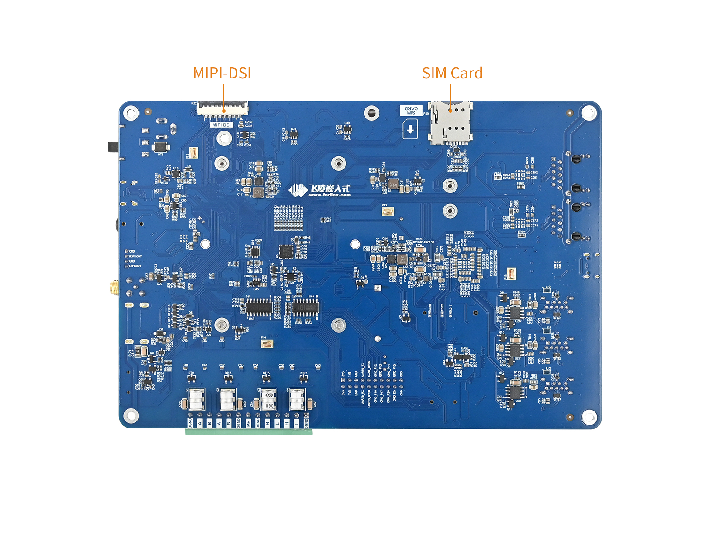

### 3.2 OK3576-C SoM Dimension Diagram

OK3576-C development board and antenna board is as follows:

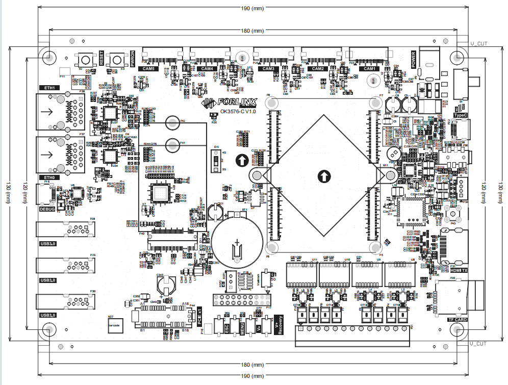

Carrier board PCB size: 130mm × 190mm. For more detailed dimensions, please refer to the user information DXF file;

Fixed hole size: spacing: 120mm × 180mm, hole diameter: 3.2mm.

Plate making process: thickness 1.6mm, 4-layer PCB.

Power supply voltage: DC 12V.

The antenna board is used for the installation and fixation of 4G and 5G antennas. Its external dimensions are 20mm×140mm. For more detailed dimensions, please refer to the figure below:

Two mounting holes with a diameter of 3.2mm are reserved on the carrier board. You can select and install the heat sink according to the site environment. Please add a layer of insulated heat-conducting silicone pad on the contact surface between the heat sink and the core board. 38Mm×38mm×23mm. For more detailed dimensions, please refer to the following figure.

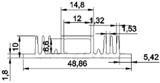

### 3.3 Carrier Board Naming Rules

ABC-D+IK:M

| **Field**| **Field Description**| **Value**| **Description**|
|:----------:|----------|----------|----------|
| A| Qualification level| PC| Prototype Sample|
| | | Blank| Mass Production|
| B| Product line identification| OK| Forlinx Embedded development board|
| C| CPU Type| RK3576| RK3576|
| \-| Segment Identification| \-|
| D| Connection| Cx| Board-to-board Connector|
| \+| Segment Identification| \+| The configuration parameter section follows this identifier.|
| I| Operating Temperature| I| -40 to 85℃|
| K| PCB Version| 10| V1.0|
| | | xx| Vx.x|
| :M| Internal Identification of the Manufacturer| :X| This is the internal identification of the manufacturer and has no impact on the use.|

### 3.4 Carrier Board Resources

| **Function**| **Quantity**| **Parameter**|
|:----------:|:----------:|----------|
| MIPI CSI| 5| 1 x MIPI DPHY V2.0 4lanes interfaces, up to 4.5Gbps per lane; led out
through 1 x 26pins FPC, with OV13855 camera mounted by default;
| | | 4 x MIPI DPHY V1.2 2lanes interfaces, up to 2.4Gbps per lane. These interfaces are led out through four 26 - pin FPC sockets, with OV5645 camera mounted by default;
| MIPI DSI| 1| The MIPI interface supports 4 lanes output, with a maximum resolution of 2560 x 1600@60Hz.|
| | | ·Applicable for Forlinx 7" MIPI screen with resolution 1024x 600@30fps;|
| HDMI TX| 1| ·Led out through a standard HDMI socket;|
| | | ·HDMI v2.1 supports up to 4K @ 120Hz;|
| DP TX| 1| ·1 x DP in combination with USB 3.1 Gen1, led out through Type-C connector;|
| | | DisplayPort v1.4 supports up to 4K@120Hz；|
| USB3.1 Gen1| 1| Led out via Type-C Interface;|
| | | combined with DP TX;|
| USB3.0 HOST| 3| Led out via 3 x Type- A USB Interface;|
| PCIe2.0| 1| · Led out through PCIe x 1 slot|
| | | ·Support rate 5Gbps;|
| Ethernet| 2| Led out through 2 x RJ45 ports;|
| | | Supports 10/100/1000 Mbps data transmission rate;|
| TF card| 1| TF card is available, rate up to 150MHz，supports SDR104 mode;|
| Audio| 1| ·Codec chip on board, support headphone output, MIC input level Speaker  
output and other functions;|
| CAN| 2| Two CAN buses led out through a CAN transceiver;|
| | | Comply with CAN and CAN FD specifications;|
| RS485| 2| 2 x RS485 CAN bus led out through RS485 transceiver;|
| UART| 1| Led out via a 2.44mm pitch pin;|
| | | Baud rate up to 4Mbps;|
| 4G/5G| 1| Supports 4G/5G modules packaged in M.2 format;|
| WIFI\&BT| 1| On-board AW-CM358SM-WIFI\&BT module；
| | | Supports WIFI 2.4G/5G; bluetooth5.0;|
| ADC| 5| Led out via a 2.44mm pitch pin;|
| | | 12-bit single-ended input SAR-ADC with sampling rate up to 1MS/s;|
| RTC| 1| ·On-board RTC chip and battery socket;|
| GPIO| 8| 8 x GPIO and 3.3 V and 1.8 V power supplies are led out through the 2.44 mm pitch pin header;|

**Note：**

- **The parameters in the table are the theoretical values of hardware design or CPU;** 

- **"TBD" means the function has not been developed in this phase.**

### 3.5 OK3576-C Carrier Board Description

**Note: The component UID with "\_DNP" mark in the diagram below represents it is not soldered by  default.**

The schematic diagram in this chapter is only for the easy reading and may be subject to changes. Please make sure to follow the source file schematic diagram when designing.

#### 3.5.1 Carrier Board Power

The development board uses a 12V adapter with a DC005 socket. DIP switch S1 is the power switch of the development board. Switch it as silkscreen indicates. A TVS tube is connected in parallel at the subsequent stage of S1 for electrostatic protection, and a fuse F1 is used for over - current protection. D1 cooperates with F1 for reverse - connection protection. VCC12V\_DCIN supplies power to both the SoM and other peripherals on the carrier board.

VCC12V\_DCIN is stepped down to VCC\_5V through U3 (DC - DC). VCC\_5V supplies power to other peripherals on the carrier board. (It should be noted that when selecting a 12V - to - 5V DC - DC chip, the output power of the chip should be large enough. It is recommended that the output current be over 6A to ensure sufficient current supply for the subsequent stage.)

After the SoM is normally started with 12V power supply, it outputs a high - level signal through the CARRIER\_BOARD\_EN pin to control U3 to enable the output of VCC\_5V power to supply power to some peripherals on the development board. (The signal level is 3.3V, and the driving capability is a 10K pull - up. If the driving capability required by the enable pin of the enabled device exceeds this range, a buffer or a gate circuit needs to be added to increase the driving capability, ensuring normal power - on of the SoM and the carrier board.)

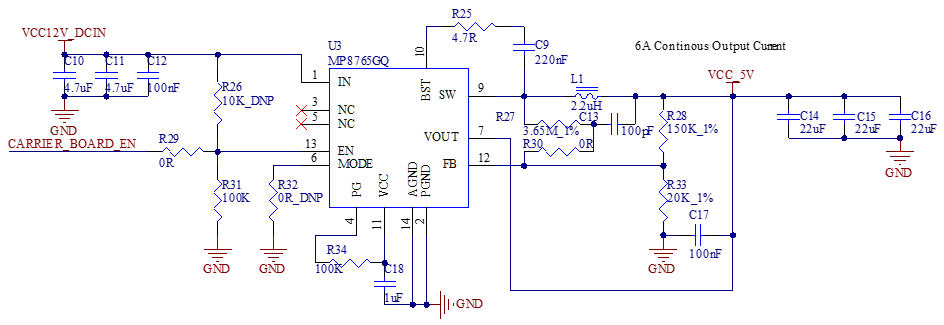

VCC\_5V is stepped down to VCC\_3V3 through U4 (DC - DC). VCC\_3V3 supplies power to some devices on the development board.

VCC\_3V3 is stepped down to VCC\_1V8 through U2 (LDO). VCC\_1V8 supplies power to some devices on the development board.

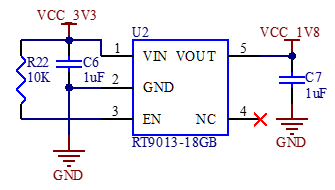

**Note:**

- **When designing by yourself, please ensure the power-on sequence of the power supply;**

- **Refer to the corresponding chip manual for the component selection and external layout of the step-up and step-down chip to ensure a good power circuit.**

#### 3.5.2 Reset and Startup/Shutdown Signal

RESET\_L is SoM resetting signal input connected to the key for convenient debugging

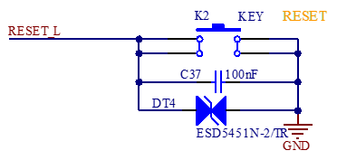

PWRON\_L is an On/Off signal input connected to the key for convenient debugging

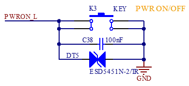

#### 3.5.3 Boot Configuration

RK3576 supports multiple boot modes. After resetting the chip reset, the boot code integrated inside the chip  can be booted on the following interface devices, and the specific boot sequence can be selected according to actual application requirements:

·Serial Flash (FSPI0, FSPI1\_M0, FSPI1\_M1)

·eMMC

·UFS

·SDMMC0 Card

If there is no boot code in the above devices, the system code can be downloaded to these devices through the USB 2.0 OTG0 interface USB2 \_ OTG0 \_ DP/DM signal. Firmware burning from the USB3 \_ OTG0 \_ SSRX1P/N and USB3 \_ OTG0 \_ SSTX1P/N signals of the USB 3.2 Gen1x1 OTG0 interface is also supported. Please note that if you need to support USB3.0 upgrade firmware and need to support 2Lane DP, you must use USB3.2 Gen1x1 OTG0 + DP 2Lane (Swap ON).

Boot Sequence Selection:

The Boot startup sequence of RK3576 can be set via the SARADC\_VIN0\_BOOT Pin (PIN: P1\_28) to start from peripherals corresponding to different interfaces. As shown in the following table, the hardware can design a total of 11 modes of peripheral boot sequences (Config1 - Config11) by configuring different pull - up and pull - down resistance values, which can be configured correspondingly according to actual application requirements.

Table 3.5.3.1 Boot Sequence Configuration Table

| Item| Rup| Rdown| ADC| BOOT MODE|
|:----------:|:----------:|:----------:|:----------:|----------|
| Config1| DNP| 10K| 0| USB (Maskrom mode)|
| Config2| 10K| 1.13K| 416| FSPI0→USB|
| Confi 3| 10K| 2.49K| 816| FSPI1\_M0→EMMC→USB|
| Config4| 10K| 4.3K| 1231| FSPI1\_M1→EMMC→USB||||
| Config5| 10K| 6.8K| 1658| FSPI0→UFS→USB|||
| Config6| 10K| 10K| 2048| FSPI1\_M0→UFS→USB||
| Config7| 10K| 14.7K| 2437| UFS→USB|
| Config8| 10K| 23.2K| 2862| UFS→SDMMC0→USB|
| Config9| 10K| 40.2K| 3279| RFU|
| Config10| 10K| 88.7K| 3680| EMMC→SDMMC0→USB|
| Config11| 10K| DNP| 4095| EMMC→USB|

SARADC\_VIN0\_BOOT on SoM is 10K pull-up, so the SoM defaults to start from eMMC The pull-down resistor can be added to the carrier board to achieve other boot sequences. According to the above Config1  
settings, the SARADC\_VIN0\_BOOT is connected to GND via the touch key to achieve Maskrom mode.

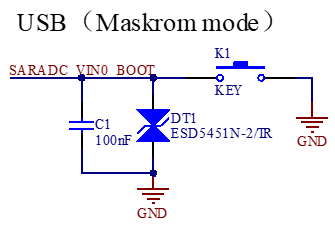

SARADC\_ VIN1 is used to enter the recovery state due to a short circuit to the ground, and the SoM pulls it up  to a 1.8V power supply using a 10K resistor. On OK3576-C, the key array adopts a parallel type, which can adjust the input key value by increasing or decreasing the keys and adjusting the proportion of the voltage divider resistor to achieve multi-key input to meet customer product requirements; It is recommended in the design that any two key values must be greater than ± 35, i.e. the center voltage difference must be greater than 123mV. The principle is as follows:

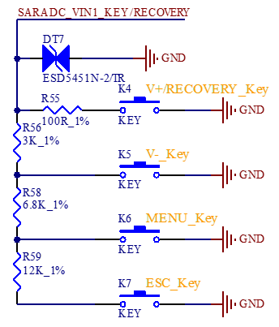

**Note:**

**When doing key acquisition, ESD protection is required near the keys. And 0 key value must be connected in series with a 100ohm resistor to strengthen the anti-static surge capacity (If there is only one button, ESD must be close to the button, ESD → 100ohm resistor → 1nF → chip pin).**

#### 3.5.4 System Initialization Configuration Signal

There is one important signal in the FET3576 that affects the system boot configuration and needs to be configured and kept in a stable state before power-up:

SDMMC 0 \_ DET \_ L (PIN: P3 \_ 90) (default function is SDMMC \_ DET): Determines whether the VCCIO1 power domain IO is an SDMMC0 or JTAG function.

The JTAG function and the SDMMC function of the FET3576 are multiplexed , and the function of the IOMUX is switched through the SDMMC0 \_ DET \_ L pin, so the pin also needs to be configured before power-on, otherwise, no output of the JTAG function will affect the debugging in the boot phase. No output from SDMMC0 will affect the SDMMC0 boot function.

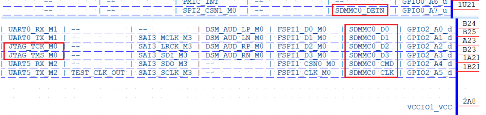

1. If the pin is detected to be high level, the corresponding IO is switched to JTAG function;
2. When this pin detects low level (Most SD cards inserted will pull down this pin, if not need special treatment), the corresponding IO switches to SDMMC0 function;
3. After the system is up, it can be switched to have registers to control IOMUX, then the pin can be released;
4. For easy reference, the configuration status of this pin corresponds to its function shown as follows:

Table 3.5.4.1 FET3576 System Initialization Configuration Signal Description

| Signal| Internal Pull-up\&down| Description|
|:----------:|:----------:|----------|
| SDMMC0\_DET\_L| Pull-up| SDMMC/ARM JTAG pin multiplexing selection control signal:   0: Identified as SD card insertion, SDMMC/JTAG pin multiplexing as SDMMC0 function; 1: Not identified as SD card insertion, SDMMC/JTAG pin multiplexing as JTAG function (Default).|

#### 3.5.5  JTAG \& UART Debug Circuit

The JTAG interface of the RK3576 chip complies with the IEEE1149.1 standard, and the PC can be connected to the DSTREAM through the SWD mode (two-wire mode).

Emulator to debug the ARM Core inside the chip.

The JTAG interface description is shown in the following table:

Table 3.5.5.1 FET3576 JTAG Debug

| Signal| Description|
|----------|----------|
| JTAG\_TCK\_M0/M1| SWD mode clock input|
| JTAG\_TMS\_M0/M1| SWD mode data input and output|

The JTAG of RK3576 has two multiplexing modes. Among them, JTAG\_TCK\_M0/JTAG\_TMS\_M0 is located in the VCCIO1 domain and shares the IOMUX with SDMMC0; JTAG\_TCK\_M1/JTAG\_TMS\_M1 is located in the PMUIO1 domain and is multiplexed with UART\_Debug - UART0\_M0. The IOMUX multiplexing situation is shown in the figure below:

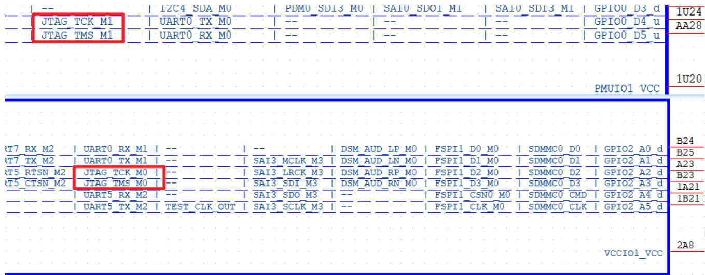

The UART Debug of FET3576 uses UART0\_TX\_M0\_DEBUG (P2\_7)/UART0\_RX\_M0\_DEBUG (P2\_9) by default. UART Debug signal needs to be connected with 100ohm resistor in series, if plug-in is used, and TVS tube  needs to be added near the plug-in position.

To facilitate user debugging, OK3576-C uses a USB to UART chip to convert the UART signal into a USB signal and leads it out through a Type-C socket. Users can connect OK3576-C P16 to PC with USB Type-A to UAB Type-C cable and install a CP2102 driver. The schematic is as follows:

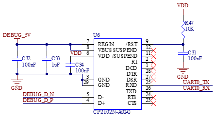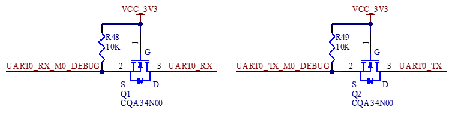

**Note:**

- **For the convenience of later debugging, please lead out the debugging serial port when designing the carrier board;**

- **It is recommended to keep Q1 and Q2, which can effectively prevent the U6 current from flowing back to the CPU through UART0\_TX/RX when the SoM is not powered up, affecting the startup and even causing damage.**

#### 3.5.6 IIC Extending IO

To introduce more diverse interfaces, the enable and reset signals of the carrier board are completed by the IIC to IO chip U5. At the same time, the U5 spare part of IO is led by P17 to facilitate user expansion. The principle is as follows:

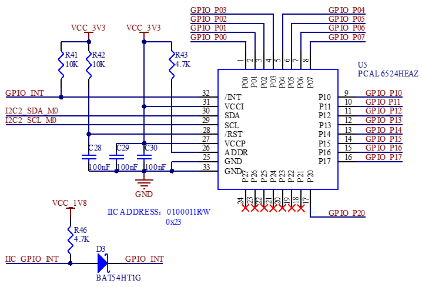

#### 3.5.7 SARADC

SARADC \_ VIN2/VIN4/VIN5/VIN6/VIN7 are led out through P18; R371 is a variable resistor, and SARADC \_ VIN2/VIN4/VIN5/VIN6/VIN7 is short-circuited with pins 4, 6, 8 and 10 of P18. When the resistance of the R371 variable resistor is adjusted, the voltage change can be read by the ADC. As shown in the figure below:

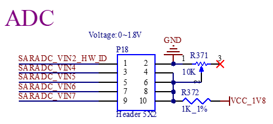

**Note: When using the SARADC\_VINx, 1nF capacitor must be added near the pin to eliminate jitter.**

#### 3.5.8 TF Card

The carrier board P20 is a TF Card interface, which can support system boot and burn.

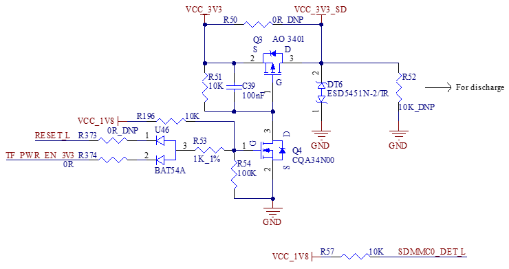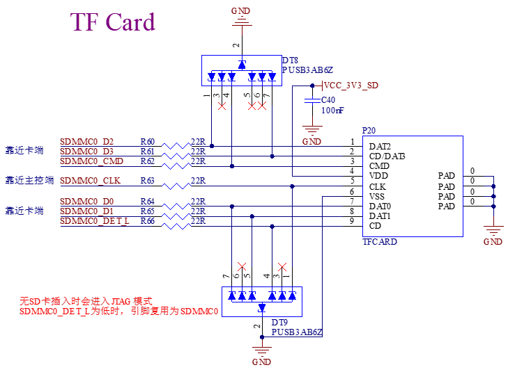

**Note:**

- **The power supply for the TF card must be controlled; please refer to the carrier board circuit;**

- **SDIO impedance requirements: Single-ended 50ohm, signal equal length control 50 mil.**

#### 3.5.9 RTC Circuit

The OK3576-C provides an on-board external RTC function for more accurate timing and lower power consumption. As shown in the figure below:

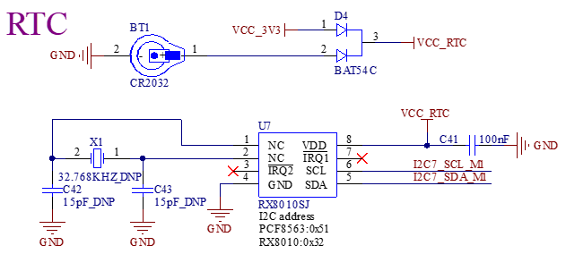

#### 3.5.10 Ethernet Circuit

The carrier board supports dual 1000/100/10M Ethernet interfaces, which are led out via RJ45.

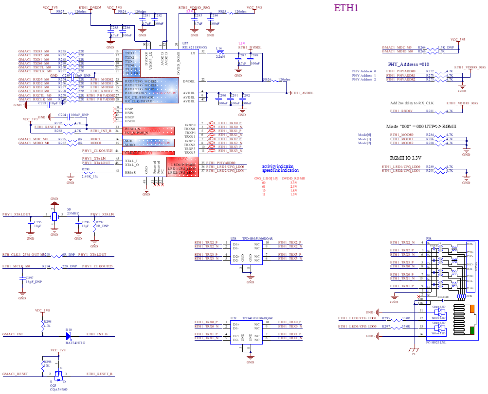

**Note: The following table shows the RK3576 RGMII/RMII interface design.**

**Table 3.5.10.1 RK3576 RGMII/RMII Interface**

| **Signal**| **IO Type****（Chip-side）**| **RGMII Interface**| **Signal Description**| **RMII Interface**| **Signal Description**
|:----------:|:----------:|:----------:|:----------:|:----------:|:----------:
| GMACx\_TXD\[3:0]| Output| RGMIIxTXD\[3:0]| Data sending| RMIIx\_TXD\[1:0]| Data sending
| GMACx\_TXCLK| Output| RGMIIx\_TXCLK| Reference clock for data sending| --| --
| GMACx\_TXCTL| Output| RGMIIx\_TXCTL| Data sending enable (rising edge) and data transmission error (falling edge)| RMIIx\_TXEN| Data sending enable (
| GMACx\_RXD\[3:0]| Input| RGMIIx\_RXD\[3:0]| Data receiving| RMIIx\_RXD\[1:0]| Data receiving
| GMACx\_RXCLK| Input| RGMIIx\_RXCLK| Data receiving reference clock| --| --
| GMACx\_RXCTL| Input| RGMIIx\_RXCTL| Effective data receiving (rising edge) and receiving error (falling edge)| RMIIx\_RXCTL| Data receiving validity and carrier sense
| GMACx\_MCLKINOUT| Input/Output| RGMIIx\_MCLKI\_   125M| PHY sends 125MHz to MAC, optional| RMII\_MCLKIN\_50M or RMII\_MCLKOUT\_50M| RMII data sending and data receiving reference clock
| ETHx\_REFCLKO\_   25M| Output| ETHx\_REFCLK\_   25M| RK3576 provides 25MHz clock to replace PHY crystal| ETHx\_REFCLKO\_   25M| RK3576 provides 25MHz clock to replace PHY crystal
| GMACx\_MDC| Output| RGMIIx\_MDC| Manage the data clock| RMIIx\_MDC| Manage the data clock
| GMACx\_MDIO| Input/Output| RGMIIx\_MDIO| Manage data output/input| RMIIx\_MDIO| Manage data output/input

- **In RGMII mode, the TX/RX clock paths inside the RK3576 chip are integrated with a delay line, which supports adjustment. The default configuration in the reference diagram is as follows: The timing between TXCLK and data is controlled by the MAC, and the timing between RXCLK and data is controlled by the PHY. (For example, when using RTL8211F/FI, a 2ns delay for RXCLK is enabled by default. Please pay attention to other PHY configurations;**

- **The GMAC0 interface level only supports 1.8V. The GMAC1 interface level is 3.3V by default (if it must be changed to 1.8V, please contact Forlinx). It should be noted whether the power - supply voltage of the RGMII signal power domain of the PHY chip matches the level of the GMACx interface;**

- **The Reset signal of the Ethernet PHY needs to be controlled by GPIO. The level of the GPIO must match the PHY IO level. A 100nF capacitor must be added close to the PHY pins to enhance the anti - static ability. Note: The reset pin of RTL8211F/FI only supports a 3.3V level;**

- **For TXD0 - TXD3, TXCLK, and TXEN, a 0ohm series resistor should be reserved at the FET3576 end to improve the signal quality conditionally according to the actual situation;**

- **For RXD0 - RXD3, RXCLK, and RXDV, a 22ohm series resistor should be connected at the PHY end to improve the signal quality;**

- **When the PHY uses an external crystal, the crystal capacitor should be selected according to the load capacitance value of the actually used crystal, and the frequency deviation should be controlled within ±20ppm;**

- **The external resistor connected to the RSET pin of RTL8211F/FI is 2.49K ohms with an accuracy of 1%. Do not modify it casually;**

* **An external pull - up resistor must be added to MDIO, with a recommended value of 1.5 - 1.8K ohm. The pull - up power supply must be consistent with the IO power supply;**

- **The PCB layout needs to ensure the integrity of the RGMII signal reference plane and the integrity of the power supply reference plane around the PHY chip;**

- **Equal - length requirement: The receiving and sending signals of RGMII can be grouped for equal - length processing, and the equal - length requirement is ≤12.4mil;**

- **Impedance requirement: 50 ohm for single - ended signals.**

#### 3.5.11 RS485 Interface

OK3576-C supports 2 x RS485 interfaces.

RS485 transceiver chip U8/U9; transceiver chip signal is TDH341S485S, quarantine withstand voltage up to 5000VDC, bus electrostatic protection capability up to 15 kV (HBM), > 25Kv/us transient immunity. Meanwhile, the OK3576-C carrier board is compatible with a higher level of surge pulse group multi-level protection circuit, as shown in the following figure:

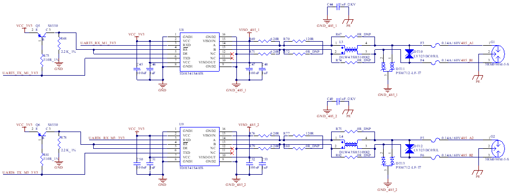

#### 3.5.12 CAN Interface

The OK3576-C has two CAN transceiver chips U10 and U11 on board, and the transceiver chip signal is TDH541SCANFD, with isolation withstand voltage up to 5000VDC, bus static protection up to 15kV (HBM), and transient immunity >25Kv/us. Meanwhile, the OK357-C carrier board is compatible with a higher level of surge pulse group multi-level protection circuit, as shown in the following figure:

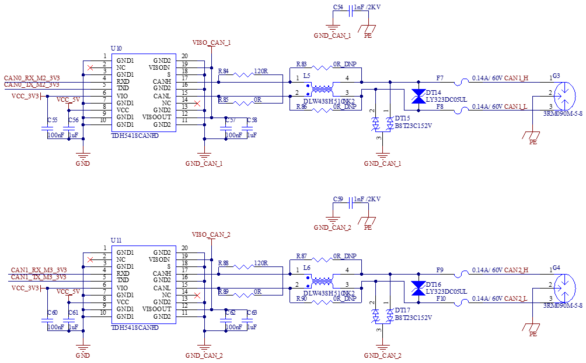

#### 3.5.13 Audio

The OK3576-C has an I2S interface Codec chip U31 on board, which supports MIC input, headphone output, and 1W 8Ω speaker output. The principle shown as follows:

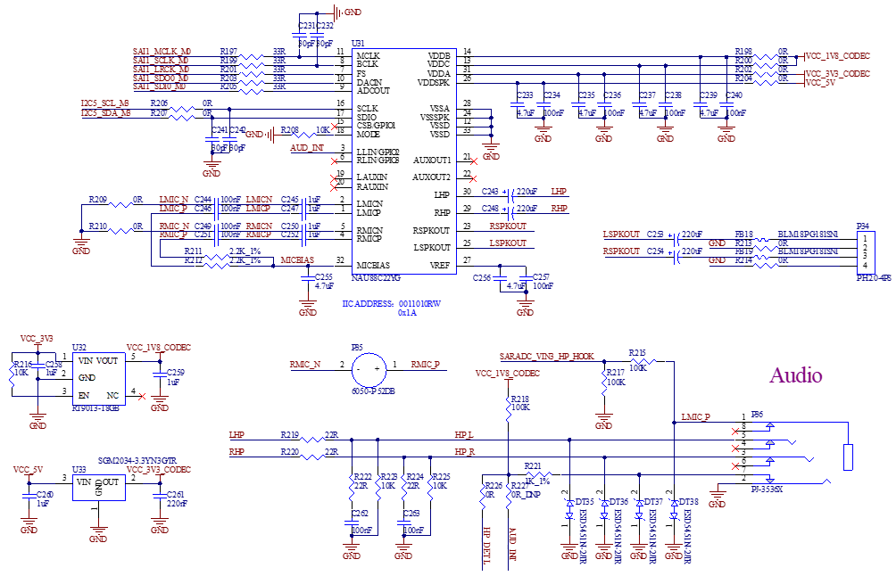

#### 3.5.14 4G\&5G Interface

The OK3576-C integrates an M.2 Key-B interface that is compatible with 4G and 5G modules. Since 4G and 5G modules have different power supply voltages, we need to dip S2 to select the corresponding power supply voltage.

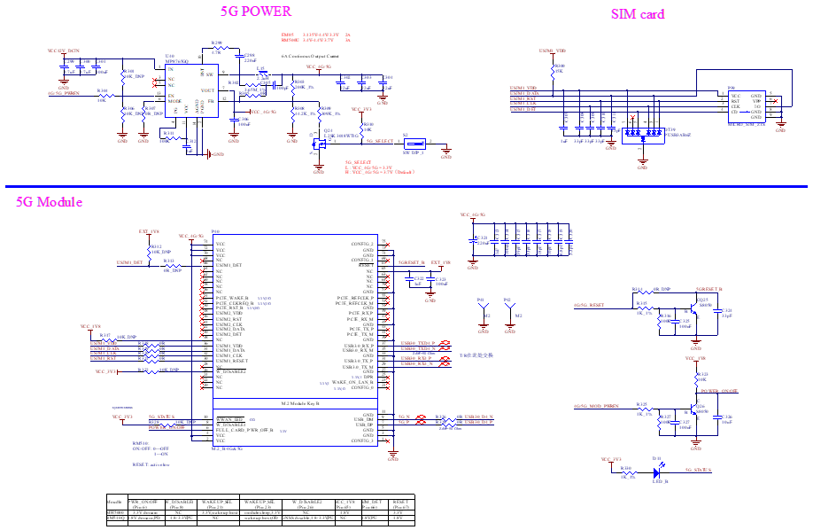

#### 3.5.15 USB2.0/USB3.0\_A/Type - C USB3.0 Circuit

The RK3576 chip has two built-in USB3 OTG controllers, both of which are embedded with USB2.0 OTG.

**The application of the USB3 OTG0/DP1.4 interface is as follows:**

USB3.2 Gen1x1 OTG0/DP1.4 forms a Combo PHY. The internal multiplexing diagram of the USB3 OTG0 controller and the PHY is as follows:

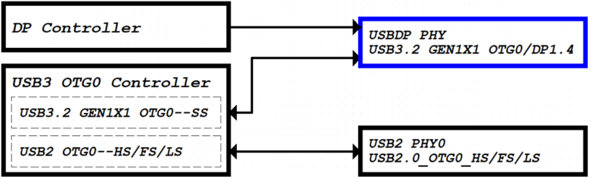

The USB3 OTG0 controller supports SS/HS/FS/LS, and the embedded USB2.0 (HS/FS/LS) signal uses USB2.0 OTG PHY. The signal name is shown in the red box in the figure below; RK3576 uses this interface for Fireware Download by default. Please reserve this interface in the application.

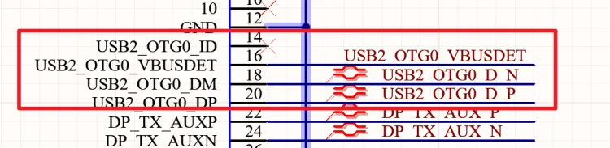

**Note: USB2\_OTG0\_DP/USB2\_OTG0\_DM support Firmware Download. If this interface is not used in the product, it must be reserved during the debugging and production process. Note: USB2\_OTG0\_VBUSDET must also be connected!**

The SS signal (5Gbps) of USB 3.2 is multiplexed with DP1.4, and the Combo PHY of USB/DP is used; the signal is shown in the red box in the figure below.

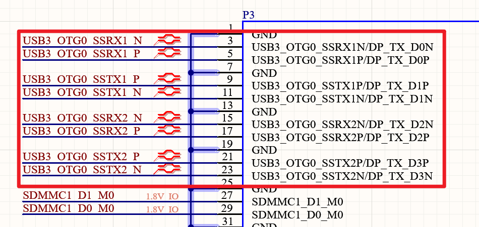

Since the USB3 OTG and USB2.0 OTG are the same USB3 controller, the USB3 and USB2.0 OTG can only do Device or HOST at the same time, not USB3 OTG for HOST, USB2.0 OTG for Device or USB3 OTG for Device and USB2.0 OTG to do HOST.

USB3 OTG0 Controller and DP1.4 Controller are combined into a complete TYPEC port through USB3/DP1.4 Combo PHY, and this Combo PHY supports Display Alter mode. Lane0 and Lane2 do TX in DP mode and RX in USB mode; TX and RX share Lane0 and Lane2.

This USB3/DP1.4 Combo PHY supports inter-Lane switching (SWAP), so a TYPEC standard port can have the following five configurations:

Configuration I: Type-C 4Lane (with DP function)

Configuration II: USB2.0 OTG+DP1.4 4Lane(Swap OFF)

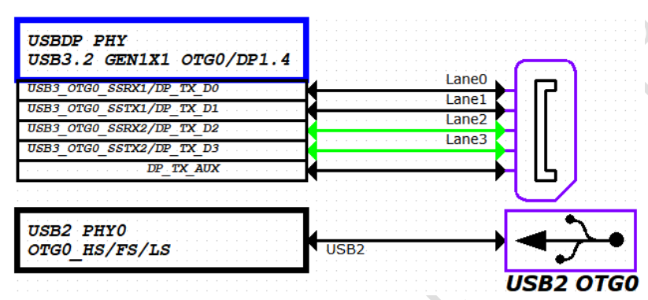

Configuration III: USB2.0 OTG+DP1.4 4Lane(Swap ON)

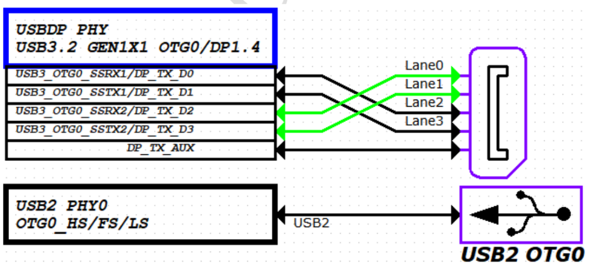

Configuration IV: USB3.2 Gen1x1 OTG0+DP1.4 2Lane(Swap OFF)

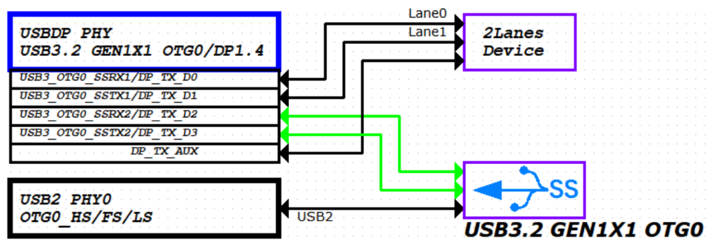

Configuration V: USB3.2 Gen1x1 OTG0+DP1.4 2Lane(Swap ON)

**Note: The RK3576 supports firmware download from the USB3 \_ OTG0 \_ SSRX1P/N and USB3 \_ OTG0 \_ SSTX1P/N signals of the USB 3.2 Gen1x1 OTG0 interface. When it is necessary to support USB3.0 firmware upgrade and 2Lane DP, the solution of USB3.2 Gen1x1 OTG0 + DP 2Lane (Swap ON) must be used.**

**The USB3 OTG1 interface is applied as follows:**

Comb PHY1 is composed of PCIE1/SATA1/USB3 OTG1. The internal multiplexing diagram of USB3 OTG1 controller and PHY is as follows:

The USB3 OTG1 controller supports SS/HS/FS/LS and is embedded with USB2.0 (HS/FS/LS) signals to form PCIE1/SATA1/USB3 OTG1 COMBO PHY1; the pin lay out is as follows:

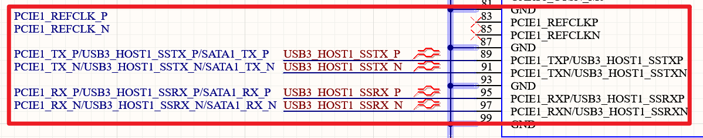

The pin assignment of USB20 OTG1 is shown in the following figure:

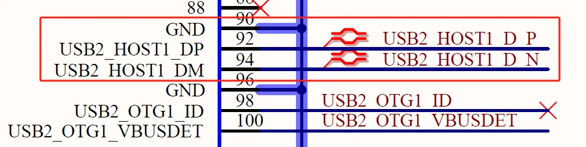

Since the OTG1 of USB3 and the OTG1 of USB2.0 are the same controller of USB3, they can only be used as Device or HOST at the same time, and the OTG of USB3 cannot be used as HOST, USB2.0 OTG as Device or USB3 OTG as Device and USB2.0 OTG as HOST.

**Note: When the COMBO PHY1 of PCIE1/SATA1/USB3 OTG1 is set to PCIe or SATA function, the USB3 OTG1 function and USB2.0 PHY1 cannot be used. Therefore, when using USB2.0 OTG1, the COMBO PHY1 of PCIE1/SATA1/USB3 OTG1 must be set to USB3 function!!!**

There are several application modes for USB3 OTG1 in the COMBO PHY1 of PCIE1/SATA1/USB3 OTG1:

Configuration I: USB3.2 Gen1x1 OTG1

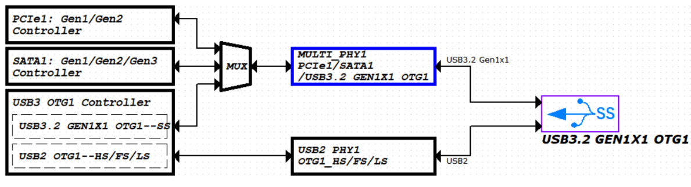

Configuration II: USB2 OTG1

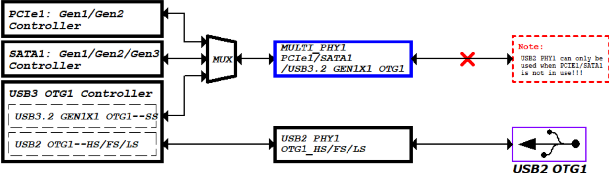

Configuration III: USB2/USB3 is not used. See the PCIE and SATA chapter for the specific application of PCIE and SATA.

A USB HUB chip is used on the OK3576-C development board to convert a single channel USB2.0/USB3.0 \_ HOST into four channels, wherein 3 x USB3.0 are respectively connected to 3 x Type-A interfaces for using, and each channel can provide the maximum current output of 1A and has the current limiting switch protection function. The remaining 1 x USB3.0 is provided to the 4G \& 5G module

On the OK3576 - C carrier board, a standard Type - C USB 3.0 full - function interface is designed. This interface is implemented by a USB/DP combo interface supported by the FET3576. This combo interface supports USB 3.2 Gen1x1 and DisplayPort v1.4, and enables data transmission and DP display output. 

The following figure shows the circuit of the USB3.0 HUB:

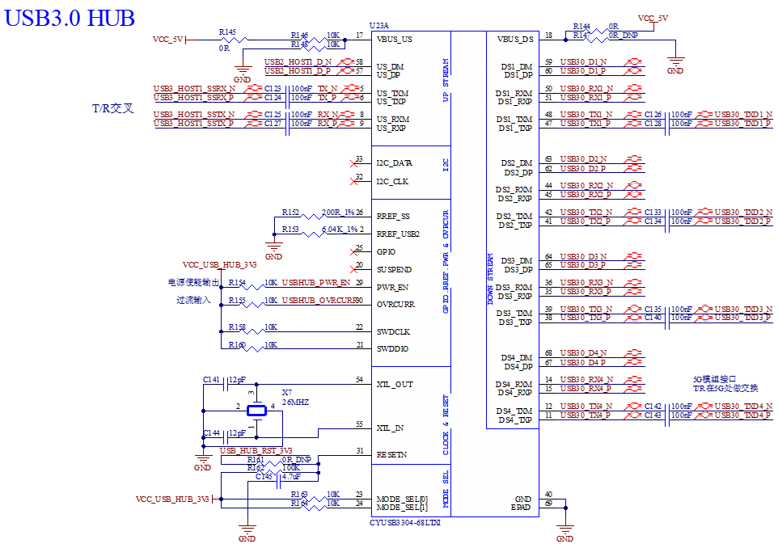

Use two additional switching power supplies to provide 3.3 V and 1.2 V power for the USB HUB chip: 

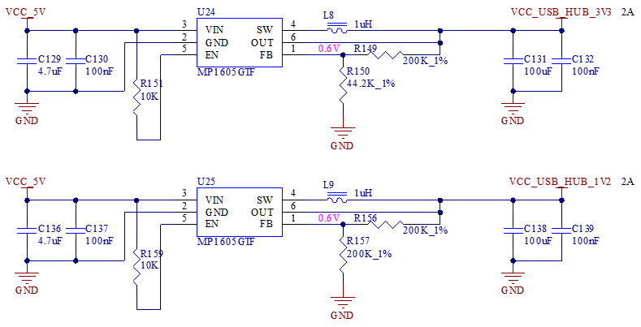

The three USB 3.0 interfaces transferred from the USB HUB chip are all matched with the USB power supply current-limiting switch chip to provide stable power supply and current-limiting protection functions for the Type-A interface:

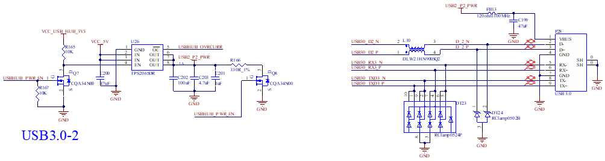

**Note:** 

- **All USB data cables need to have a 90Ω differential impedance；**

- **Please select appropriate ESD devices.**

The following figure shows the circuit of the Type - C USB 3.0 interface:

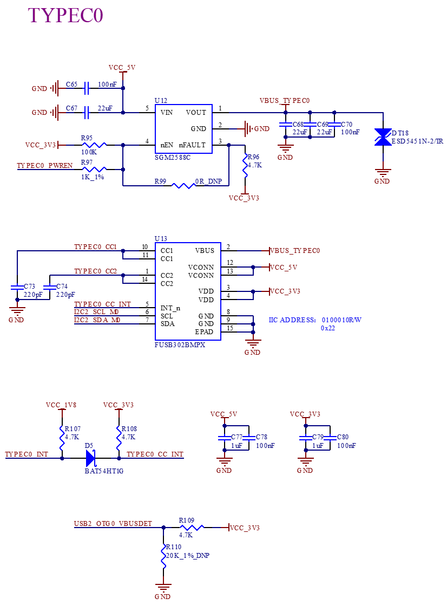

The above figure shows the circuit of the CC protocol chip for the Type - C interface, which is used to support functions such as Type - C reversible plug recognition：

The above figure shows the differential signal circuit and ESD protection devices of the Type - C USB3.0 interface：

**Note:**

- **USB2\_OTG0\_DN/USB2\_OTG0\_DP is the system firmware programming port. If this interface is not used in the product, it must be reserved during the debugging and production processes. Otherwise, debugging and firmware programming during production will not be possible;**

- **There is approximately a 12Kohm ohm pull - up resistor to 1.8V inside the USB2\_OTG0\_ID;**

- **USB2 \_ OTG0 \_ VBUSDET is the OTG and Device mode detection pin. There is a pull-down resistor of 40 Kohm inside the chip. The high is DEVICE device, 2.7-3.3 V, TYP: 3.0 V. It is recommended to place a 100nF capacitor on the pin;**

- **The OTG mode can be set to the following three modes:**

**OTG mode: Automatically switch between the device mode and the HOST mode according to the state of the ID pin. When the ID is high, it is in the device mode; when the ID is pulled low, it is in the HOST mode. In the device mode, it will also check whether the VBUSDET pin is high (greater than 2.3V). Only when it is high will the DP be pulled high to start the enumeration process；**

**Device mode: When set to this mode, there is no need to use the ID pin. It only needs to check whether the VBUSDET pin is high (greater than 2.3V). Only when it is high will the DP be pulled high to start the enumeration process;**

**HOST mode: When set to this mode, there is no need to care about the states of the ID and VBUSDET pins. ( In the case that the product only needs HOST mode, the system firmware burning port is only USB2\_OTG0\_DN/USB2\_OTG0\_DP, which is also used in the production and debugging, so when burning and abd debugging, you need to set it to device mode and connect USB2\_OTG0\_VBUSDET signal.**

- **If a TYPEC interface is used, the USB2\_OTG0\_VBUSDET signals can be pulled high through a 4.7K resistor;**

- **To enhance the anti - static and anti - surge capabilities, ESD devices must be reserved on the signals. The parasitic capacitance of the ESD for USB 2.0 signals shall not exceed 3pF. Additionally, a 2.2 - ohm resistor should be connected in series with the DP/DM of the USB 2.0 signals to enhance the anti - static and anti - surge capabilities;**

- **To suppress electromagnetic radiation, a common - mode choke can be reserved on the signal lines. During the debugging process, a resistor or a common - mode choke can be selected according to the actual situation;**

- **If the USB2\_OTG0\_ID signal is used, to enhance the anti - static and anti - surge capabilities, ESD devices must be reserved on the signal, and a 100ohm resistor should be connected in series and shall not be removed;**

- **When using the HOST function, it is recommended to add a current - limiting switch to the 5V power supply. The current - limiting value can be adjusted according to the application requirements. The current - limiting switch is controlled by a 3.3V GPIO. It is recommended to add capacitors of 22μF and over 100nF for filtering to the 5V power supply. If the USB port may be connected to a mobile hard disk, it is recommended to increase the filtering capacitor to over 100μF;**

- **According to the TYPEC protocol, a 100nF AC - coupling capacitor should be added to the SSTXP/N lines. It is recommended to use a 0201 package for the AC - coupling capacitor, which has lower ESR and ESL and can also reduce the impedance change on the line；**

- **ESD devices must be added to all signals of the TYPEC socket and should be placed close to the USB connector during layout. For the SSTXP/N and SSRXP/N signals, the parasitic capacitance of the ESD shall not exceed 0.3pF;** 

- **The differential impedance of USB 2.0 control signals should be 90 ohm ± 10%, and the maximum time delay within the differential pair should be ＜10mil;**

- **The differential impedance of USB 3.0 control signals should be 90 ohm ± 10%, and the maximum time delay within the differential pair should be＜3mil.**

#### 3.5.16 SATA3.1 Interface

The RK3576 chip has two SATA3.1 controllers and multiplexes Comb PHY0/1 with PCIe and USB3 \_ OTG1 controllers. The specific path is shown in the figure below:

Support SATA PM function, and each port can support up to 5 devices;

Support SATA 1.5Gb/s, SATA 3.0Gb/s, SATA 6.0Gb/s speeds;

Support eSATA.

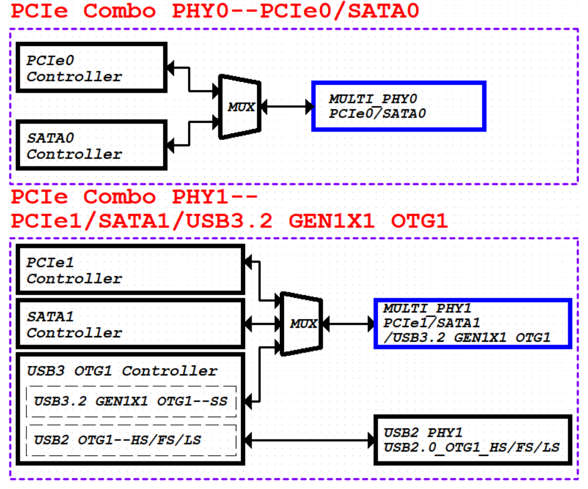

SATA0 controller uses Comb PHY0 (which is multiplexed with the PCIe0 Controller controller). 

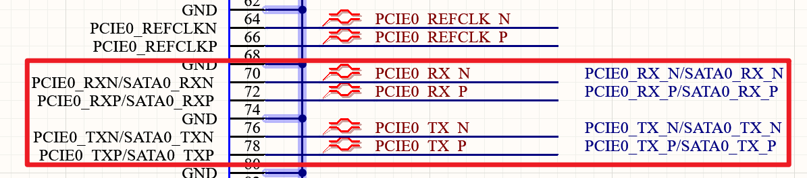

SATA1 controller uses Comb PHY1 (which is multiplexed with the PCIe1 Controller and the USB3 \_ OTG1 controller). 

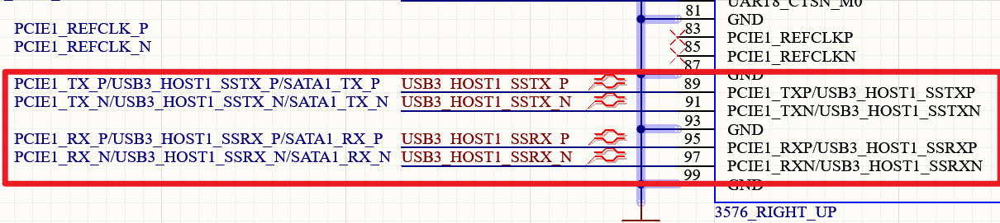

SATA0/1 controller-related control IO are:

-SATA0\_ACTLED: SATA0 interface with LED flicker control output during data transfer;

-SATA1\_ACTLED: SATA1 interface with LED flicker control output during data transfer; -

-SATA\_CPDET: Plug detection input for SATA hot-plug devices;

-SATA\_MPSWIT: Switch detection input for SATA hot-plug devices;

-SATA\_CPPOD: SATA control the power output switch of the hot plug device;

-Among them, SATA\_CPDET, SATA\_MPSWIT, and SATA\_CPPOD are shared interfaces for SATA0/1, and either SATA0 or SATA1 can be configured via registers;

-Among them, SATA0\_ACTLED and SATA1\_ACTLED are multiplexed to two locations, one in the VCCIO6 power domain and the other in the VCCIO4 power domain.

**Note:**

- **When designing Slot, peripheral circuits and power supplies need to meet Spec requirements;**
- **When a SATA interface is connected to an external SATA PM, it can only support a maximum of 5 ports and does not support multiple SATA PM with more than 6 ports;**
- **A 10nF AC coupling capacitor is connected in series to the TXP/N，RXP/N differential signals of the SATA interface. It is recommended to use the 0201 package for the AC coupling capacitor, which has lower ESR and ESL and can also reduce impedance changes on the line;**
- **For the eSATA interface connector, ESD devices must be added to all signals. During layout, the ESD devices should be placed close to the connector, and the parasitic capacitance shall not exceed 0.4pF.**

#### 3.5.17 PCIE2.1 Circuit

RK3576 has two PCIe 2.1 controllers, both of which only support RC mode (RC is the abbreviation of Root Complex) and do not support EP, as follows:

1. Controller 0(1Lane)，PCIe0 Controller x1 Lane(Only RC)
2. Controller 1(1Lane)，PCIe1 Controller x1 Lane(Only RC)

2 x PCIe2.1 controllers, together with SATA3.1/USB3.2\_Gen1x1, form two Combo PHY, namely PCIe2.1/SATA3.1,

Combo PHY0, another is PCIe2.1/SATA3.1/USB3.2\_Gen1x1 Combo PHY1.

The mapping diagram between Controller and PHY is as follows:

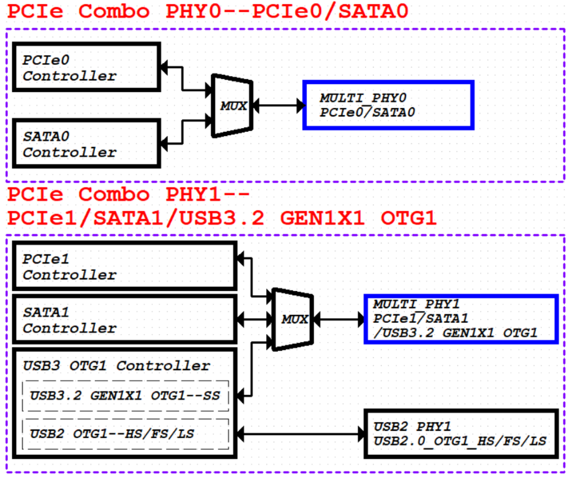

The PCIe0 controller (RC) and the SATA0 controller share the PCIe2.1/SATA3.1 Combo PHY0. The details of the package pins are shown as follows:

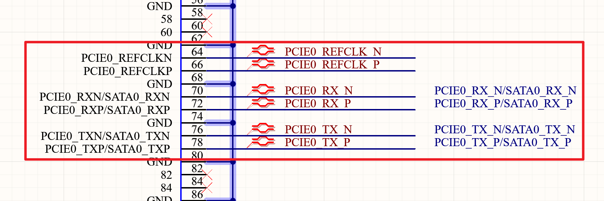

PCIe1 Controller (RC), SATA1 Controller, USB3 OTG1 Controller Multiplexing PCIe2.1/SATA 3.1/USB3.2 \_ Gen1x1

Combo PHY1; The package pins are as shown in the following figure:

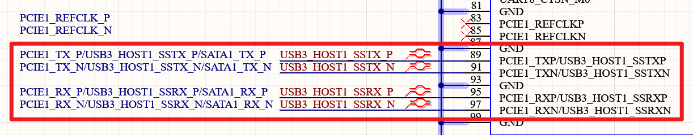

PCIE0/1\_REFCLKP/N supports both output and input. By default, it provides output to EP devices, as shown in the following schematic diagram:

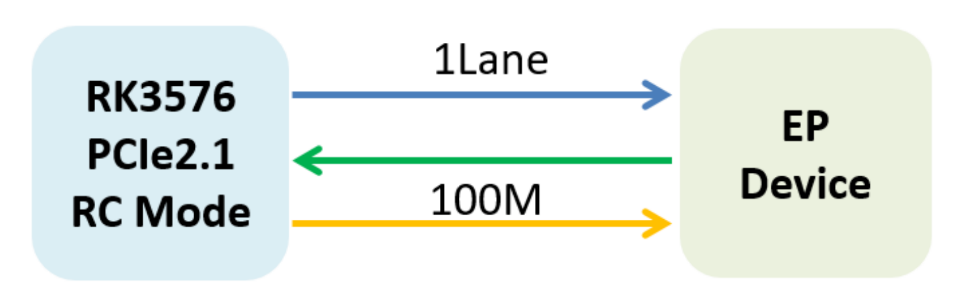

When PCIE0/1\_REFCLKP/N is used as an input, the schematic diagram is as follows:

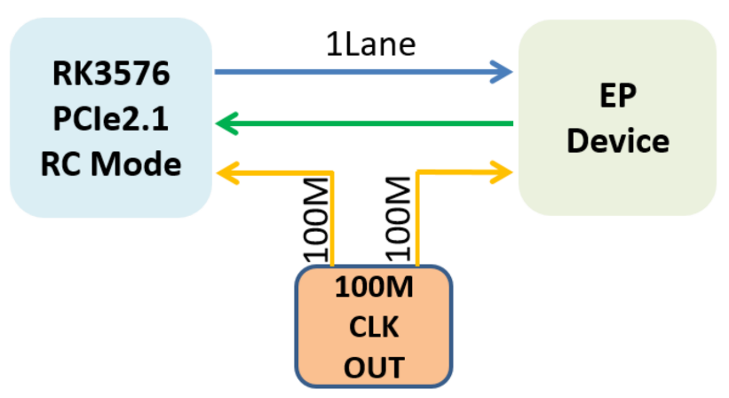

There is a PCIe0 channel on the OK3576 - C development board that is connected to a PCIe x1 slot, supporting the PCIe2.0×1Lane mode.

It supports the PCle Gen1 (2.4 GT/s) protocol, and another PCIe1 is multiplexed for the USB3.0 function.

The partial circuit of PCIe0 PCIe2.0×1Lane is as shown in the following figure:

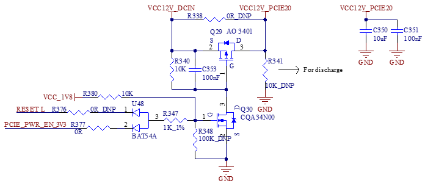

The above figure shows the 12V power supply control circuit for the PCIE interface.

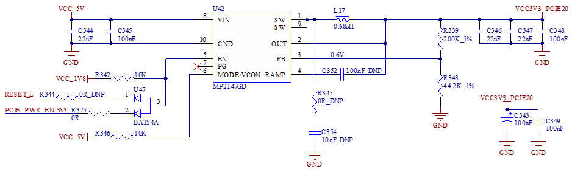

The above figure shows the 3.3V power supply and enable control circuit for the PCIE interface. U42 is a step - down chip that converts 5V to 3.3V.

The figure above is the PCIEX1 slot circuit design.

**Notes:**

- **When designing Slot, peripheral circuits and power supplies need to meet Spec requirements;**

- **A 100nF AC coupling capacitor is connected in series to the TXP/N differential signals of the PCIe2.1 interface. It is recommended to use the 0201 package for the AC coupling capacitor, which has lower ESR and ESL and can also reduce impedance changes on the line;**

- **The function pins must be used for PCIE0/1\_CLKREQN and cannot be replaced by GPIO;**

- **For PCIE0/1\_PERSTN/WAKEN/PRSNT on the RK3576, there is no need to specify a particular IO. You can directly use GPIO ports with matching levels as the control function pins;**

- **For a standard PCIe Slot, the levels of PCIEx\_CLKREQN, PCIEx\_WAKEN, and PCIEx\_PERSTN are 3.3V. Pay attention to the level matching of RK3576 terminal;**

- **When using the PCIe function, the multiplexed SATA/USB functions cannot be used. For details of the corresponding functions of SATA/USB, please refer to the module description;**

- **When the PCIe 2.1 functional module is not in use, the data lines PCIE0/1\_TXP/TXN, PCIE0/1\_RXP/RXN and the reference clock lines PCIE0/1\_REFCLKP/REFCLKN can be left floating. The two power supplies, AVDD0V85 and AVDD1V8, should be grounded. Note that the corresponding dts configuration in the software needs to be disabled.**

The recommended matching design for the PCIe 2.1 interface is shown in the following table:

| **Signal**| **Connection**| **Description**|
|----------|----------|----------|
| PCIE0/1\_TXP/TXN | Series Connection with 100nF Capacitor (0201 Package Recommended): | PCIe Data Output: |
| PCIE0/1\_RXP/RXN | Direct Connection: | PCIe Data Input |
| PCIE0/1\_REFCLKP/CLKN | Direct Connection: | PCIe Reference Clock: |
| PCIE0/1\_CLKREQN | Serial Connection with 0ohm Resistor: | PCIe Reference Clock Request Input (RC Mode): |
| PCIE0/1\_WAKEN(RK3576 does not have this signal, replaced with GPIO) | Serial Connection with 0ohm Resistor: | PCIe wake-up input (RC mode) |
| PCIE0/1\_PERSTN(RK3576 does not have this signal, replaced with GPIO) | Serial Connection with 0ohm Resistor: | PCIe global reset output (RC mode) |
| PCIE0/1\_PRSNT(RK3576 does not have this signal, replaced with GPIO) | Serial Connection with 0ohm Resistor: | Add In Card insertion detection input (RC Mode): |
| PCIE\_BUTTONRSTN(Not yet) | No need to connect. | External physical reset PCIe Controller. |

- **The impedance of the data traces should be controlled at a differential 85 ohm ±10%;**

- **The impedance of the clock traces should be controlled at a differential 100 ohm ±10%;**

- **The maximum time - delay difference within differential pair should be \< 3mil;**

- **The spacing between differential pairs should be ≥ 4 times the PCI-E trace width.**

#### 3.5.18 Video Input Interface

The FET3576 has two MIPI DPHY CSI RX interfaces, both of which support the MIPI V1.2 version. The maximum transmission rate of each channel is 2.5 Gbps.

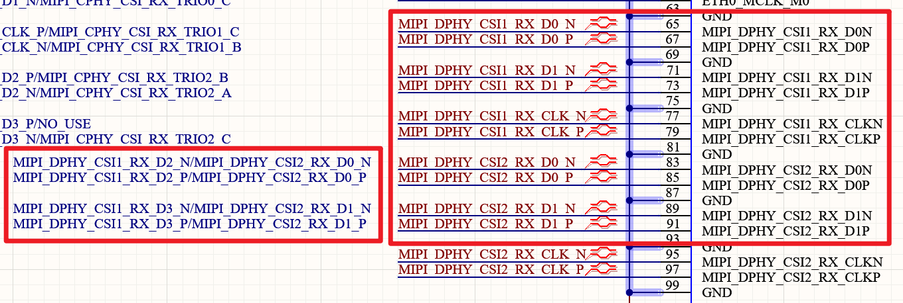

Supported modes of the MIPI DPHY CSI1/2 RX interfaces:

1. 4Lane mode: The data of MIPI\_DPHY\_CSI1\_RX\_D\[3:0] refers to MIPI\_DPHY\_CSI1\_RX\_CLK;
2. 2Lane+2Lane mode:

·The data of MIPI DPHY CSI1\_RX\_D\[1:0] refers to MIPI\_DPHY\_CSI1\_RX\_CLK.

·The data of MIPI DPHY CSI2\_RX\_D\[1:0] refers to MIPI\_DPHY\_CSI2\_RX\_CLK.

Supported modes of the MIPI DPHY CSI3/4 RX interfaces: 

1. 4Lane mode: The data of MIPI\_DPHY\_CSI3\_RX\_D\[3:0] refers to MIPI\_DPHY\_CSI3\_RX\_CLK;
2. 2Lane+2Lane mode:

·The data of MIPI DPHY CSI3\_RX\_D\[1:0] refers to MIPI\_DPHY\_CSI3\_RX\_CLK.

·The data of MIPI DPHY CSI4\_RX\_D\[1:0] refers to MIPI\_DPHY\_CSI4\_RX\_CLK.

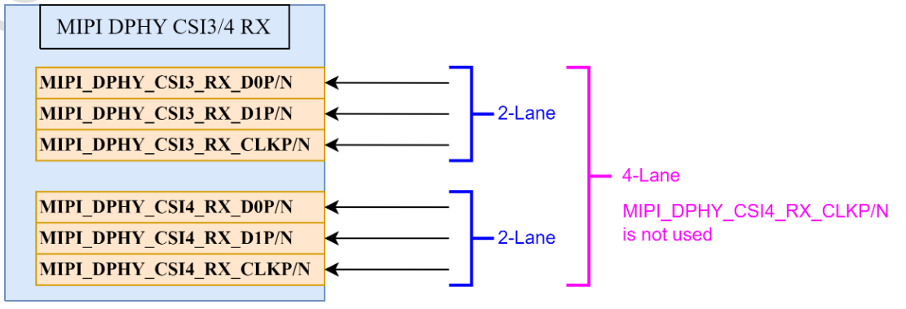

**Supported modes of the MIPI\_DCPHY\_CSI\_RX interface:**

The FET3576 has 1 x MIPI DCPHY CSI RX Combo PHY. The DPHY supports version V2.0, and the CPHY supports version V1.1. In the DPHY mode, there are 4Lane with a maximum transmission rate of 4.5 Gbps per lane.

In the CPHY mode, there are 3Trios with a maximum transmission rate of 5.7 Gbps per trio.

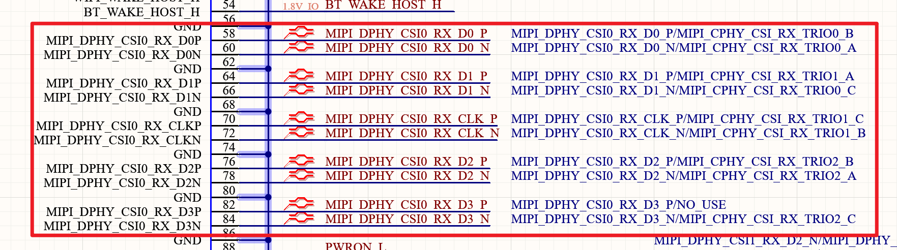

DPHY and CPHY configuration support: \*\*

The TX and RX of the MIPI DCPHY Combo PHY can only be configured as DPHY TX and DPHY RX modes simultaneously, or CPHY TX and CPHY RX modes simultaneously. It does not support configuring one as DPHY TX and the other as CPHY RX, or one as CPHY TX and the other as DPHY RX.

Supported modes when the MIPI DCPHY operates in the DPHY mode:

1. It supports 4Lane/2Lane/1Lane modes. The data of MIPI\_DPHY\_CSI0\_RX\[3:0] refers to MIPI\_DPHY\_CSI0\_RX\_CLK.
2. It does not support splitting into 2Lane + 2Lane.

**Supported modes when the MIPI DCPHY operates in the CPHY mode:**

It supports 0/1/2 Trio. Each Trio has 3 lines: Trio\_A/Trio\_B/Trio\_C, namely MIPI\_CPHY\_CSI\_RX\_TRIO\[2:0]\_A, MIPI\_CPHY\_CSI\_RX\_TRIO\[2:0]\_B, and MIPI\_CPHY\_CSI\_RX\_TRIO\[2:0]\_C.

The default configuration of the OK3576 - C is 5 camera interfaces, which are: MIPI\_DPHY\_CSI0\_RX 4Lane, MIPI\_DPHY\_CSI1\_RX 2Lane, MIPI\_DPHY\_CSI2\_RX 2Lane, MIPI\_DPHY\_CSI3\_RX 2Lane, and MIPI\_DPHY\_CSI4\_RX 2Lane. The principle is as follows:

**Notes:**

- **Differential trace impedance requirement: 100ohm±10%;**

- **Single-ended trace impedance requirement: 50ohn±10%;**

- **Maximum time - delay difference within differential pair: \< 3mil;**

- **Equal length between clock and data:＜6mil；**

- **Spacing between differential pairs should be > 4 x MIPI trace, and at a minimum, it should be 3 times the MIPI trace;**

- **The space between MIPI and other signal is better > 4 times MIPI line width and at least 3 times MIPI line width;**

- **When it is configured as CPHY, the maximum inter-group delay difference \<3mil (TRIO\_A\\TRIO\_B\\TRIO\_C);**

- **Length matching requirement between groups (TRIO0\\TRIO1\\TRIO2) should be ＜50mil.**

#### 3.5.19  Video Output Interface

The VOP (Video Output Processor) of the RK3576 chip reads video data and UI data from the frame buffer in the system memory, performs corresponding processing such as cropping, color gamut space conversion, scaling, and overlay, and then outputs the processed data to each high - speed display interface.

There are three Port outputs, which can output video through DP, HDMI/eDP, MIPI DSI, and LCDC (Parallel Interface) video interfaces.

The maximum video output capabilities are as follows:

1. Three - screen different - display solution: For example, 4096x2160@60Hz, 2560x1600@60Hz, and 1920x1080@60Hz.
2. Two - screen different - display solution: For example, 4096x2160@120Hz and 2560x1600@60Hz.

VOP and video interface output path diagrams are as follows:

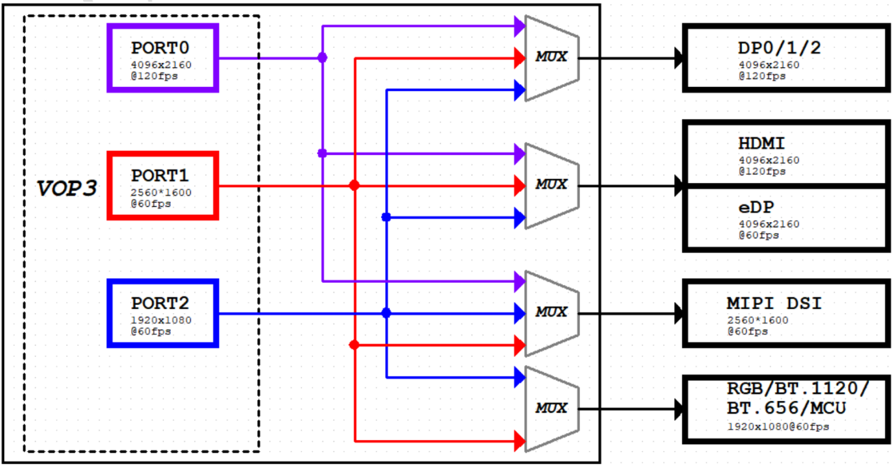

OK3576-C development board supports DP/MIPI \_ DSI/HDMI three display output interface.

##### **3.5.19.1 MIPI\_DSI Interface**

The FET3576 has one MIPI D - PHY/C - PHY Combo PHY TX:

D - PHY: It supports version V2.0. In the D - PHY mode, there are 0/1/2/3 lanes, and each lane has 2 lines. The maximum transmission rate is 2.5 Gbps per lane.

The MIPI\_DPHY\_TX supports a maximum resolution of 2560x1600@60Hz.

C - PHY: It supports version V1.1. In the C - PHY mode, there are 0/1/2 Trio, and each trio has 3 lines (Trio A/B/C). The maximum transmission rate is 1.7 Gsps per trio.

The MIPI\_CPHY\_TX supports a maximum resolution of 2560x1600@60Hz.

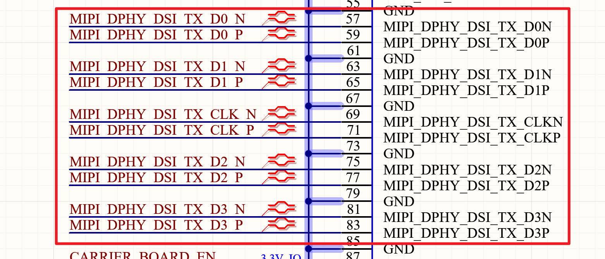

DPHY and CPHY configuration support:

The TX and RX of MIPI D-PHY/C – PHY Combo PHY can only be configured in DPHY TX and DPHY RX modes or CPHY TX and CPHY RX modes at the same time, and one is configured as DPHY TX and the other as CPHY RX is not supported;

Supported modes when the MIPI DCPHY operates in D-PHY mode

4Lane mode: The data of MIPI\_DPHY\_TX\_D\[3：0] refers to MIPI\_DPHY\_TX\_CLK;

Supported modes when the MIPI DCPHY operates in C-PHY mode \*\*

Supports 0/1/2 Trio. Each Trio has three lines, namely Trio A, Trio B, and Trio C, corresponding to MIPI\_CPHY\_TX\_TRIO\[2:0]\_A,

MIPI\_CPHY\_TX\_TRIO\[2：0]\_B， MIPI\_CPHY\_TX\_TRIO\[2：0]\_C。

The MIPI\_DSI interface of the OK3576-C development board uses a mode of 1 set of clock channels+4 sets of data channels. The schematic diagram is as follows:

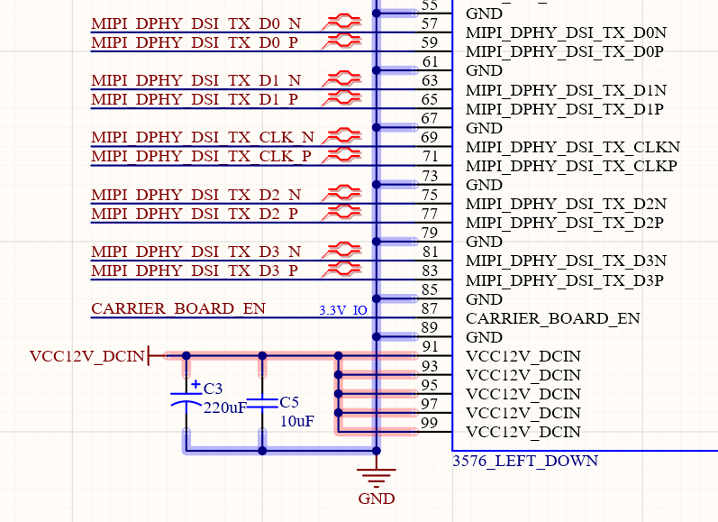

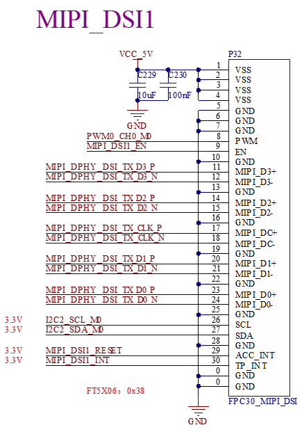

**Notes:**

- **The differential impedance of the traces should be controlled within 100 ohm ± 10%;**

- **Maximum time - delay difference within differential pair: \< 3mil;**

- **Equal length between clock and data:＜6mil；**

- **Differential inter-pair space is recommended to be more than or equal to 4 times the MIPI line width, and at least 3 times MIPI line width;**

- **MIPI and other signal space is recommended to be more than or equal to 4 times the MIPI line width, and at least 3 times MIPI line width;**

- **For CPHY, the single-ended trace impedance should be controlled at 50ohm±10%;**

- **Inter-group delay difference \<3mil (TRIO\_A\\TRIO\_B\\TRIO\_C);**

- **The length matching requirement between groups (TRIO0\\TRIO1\\TRIO2) should be \< 50 mil;**

- **It is recommended that the number of vias allowed for each signal should ≤ 2;**

- **It is recommended that the spacing between differential pairs should ≥ 4 × MIPI trace width;**

- **It is recommended that the spacing between MIPI and other signals should ≥ 4 × MIPI trace width.**

##### **3.5.19.2 HDMI\_TX Interface**

RK3576 has 1 x built-in HDMI/eDP TX Combo PHY.

-HDMI/eDP TX Combo PHY supports the following two modes:

1. HDMI TX Mode:

Supports up to HDMI 2.1;

Supports the HDMI FRL mode and is backward - compatible with the HDMI TMDS mode;

Supports RGB/YUV444/YUV422/YUV420 (Up to 10bit) formats.
2. eDP TX Mode:

It supports up to eDP 1.3;

The maximum resolution it supports is 4K@60Hz;

It supports RGB/YUV444/YUV422 (Up to 10bit) formats.

RK3576 supports HDMI 2.1 and downward for HDMI 2.0, compatible with HDMI 1.4. Because HDMI 2.1 works in FRL mode and works in TMDS mode, when switching to HDMI 2.0 and below, it will work in TMDS mode, so the AC coupled voltage mode driver is used.

As shown in the figure below, the AC coupling capacitor capacitance is 220nF, which cannot be changed at will; because the lower ESR and ESL can also reduce the impedance change on the line, it is recommended to use the 0201 packaging for the AC coupling capacitor.

When operating in the HDMI 2.1 mode, the HDMI\_TX\_ON\_H is configured to a low level, and Q15, Q16, Q17, and Q18 are non - conducting.

When operating in HDMI 2.0 and below, HDMI \_ TX \_ ON \_ H is configured high, Q15, Q16, Q17, and Q18 are turned on, and the 499ohm resistor to ground and the 50ohm pull-up resistor at the Sink terminal form a DC bias of approximately 3 V.

**Notes:**

**When only HDMI 2.0 and lower modes need to be supported, components Q15, Q16, Q17, and Q18 must not be omitted. It is essential to ensure that the transistors remain non-conductive when the device is powered off, as the HDMI CTS Test ID 7-3 TMDS Voff test requires that the Voff voltage stays within ±10mV of AVcc when the Device Under Test (DUT) is unpowered; otherwise, this test item will fail.**

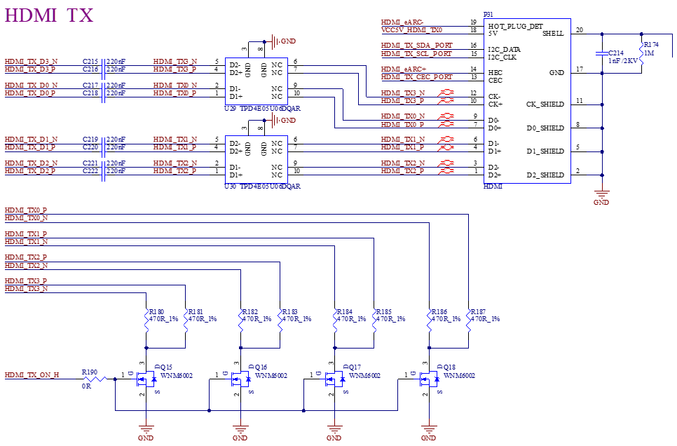

FRL mode: In the traditional TMDS architecture, a separate channel is used to transmit the Clock. But in the FRL architecture, the Clock is embedded in the Data channel, and the Clock is resolved at the Sink side through the Clock Recovery.

FRL rate vs. channel relationship:

| Channel Rate| Channel Quantity|
|:----------:|:----------:|
| 3Gbps| 3|
| 6Gbps| 3|
| 6Gbps| 4|
| 8Gbps| 4|
| 10Gbps| 4|
| 12Gbps| 4|

It supports ARC/eARC. The audio data can be parsed inside the RK3576 through the HDMI\_TX\_SBD\_P/HDMI\_TX\_SBD\_N signals.

HDMI\_TX\_HPD is the HDMI TX controller multiplexed to a general - purpose GPIO. Its level follows the voltage of the power domain it belongs to. If the power supply voltage of the power domain changes, the power supply of the pull - up resistor in the peripheral circuit must also be adjusted synchronously.

HDMI\_TX\_CEC is the CEC function of the HDMI controller multiplexed to a general - purpose GPIO. Its level follows the voltage of the power domain it belongs to. If the power supply voltage of the power domain changes, the power supply of the pull - up resistor in the peripheral circuit must also be adjusted synchronously.

The CEC protocol specifies a 3.3V level. However, the protocol requires that the leakage should not exceed 1.8uA when adding 3.3V to the CEC pin through a 27K resistor.

RK3576 IO Domain Leakage will occur if there is a voltage at IO in the power-down state. For example, the RK3576 is a power failure, and its HDMI cable is in connection to the Sink side (TV or monitor); meanwhile, the CEC at the Sink side has power and leaks through the HDMI cable to the RK3576 IO, which will cause the CEC to leak more than 1.8uA, so an external isolation circuit is necessary. We can not modify the R189 resistance at will, and we need to use 27Kohm, Q19 default, and selection 2SK3018. If needing to change other models, the junction capacitor must be the equivalent, if not, it will not only affect the work but will also affect the certification through.

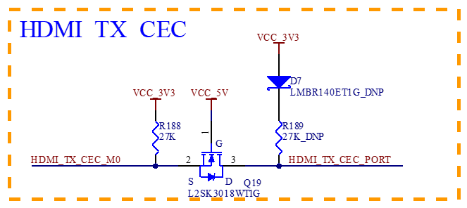

HDMI-TX-SCL/HDMI-TX-SDA is the I2C/DDC bus of the HDMI TX controller, which is functionally multiplexed onto a regular GPIO. The level varies with the voltage of the power domain, and the power supply voltage of the power domain changes. The pull-up resistor of the peripheral circuit must also be synchronously adjusted.

Although the DDC\_SCL/DDC\_SDA protocol specifies a 5V level, the RK3576 IO does not support a 5V level, so the level conversion circuit need to be added and can not be deleted. The default is to use MOS tube level conversion, and the MOS type is 2SK3018; If the model needs to be changed, the junction capacitance must be equivalent, because the junction capacitance is too large, not only affecting the work and also affect the certification leading to failing certification.

It is recommended to refer to the default value for the pull-up resistance and not to modify it arbitrarily.

The D6 diode cannot be removed and is used to prevent leakage from the Sink side to VCC\_5V0.

1K in series between MOS gate for SDA signal level conversion and power supply; A 100pF is connected in parallel between the MOS gate and source to improve the timing and can not be removed.

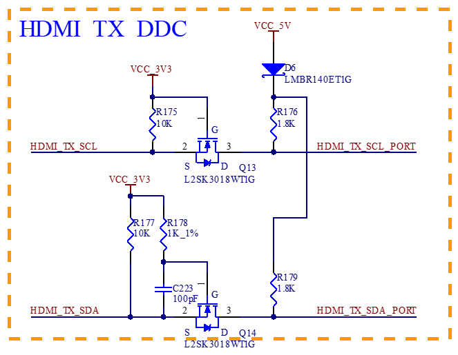

HDMI holder Pin18 voltage needs to be kept between 4.8-5.3V, 1uF decoupling capacitor needs to be placed on the pin, which must not be deleted, and the layout is placed close to the HDMI holder pin.

To strengthen the anti-static capability, ESD devices must be reserved on the signal. ESD parasitic capacitance of HDMI2.1 signal must not exceed 0.2pF.

ESD parasitic capacitance for other signals is recommended to use no more than 1pF.

**Notes:**

- **Control MOS tube Coss can not be too large, otherwise it will affect the signal quality, it is recommended to follow the reference chart model or the corresponding Coss value;**

- **The differential impedance of the traces should be controlled within 100 ohm ± 10%;**

- **Maximum time - delay difference within differential pair: \< 3mil;**

- **Equal Length Requirement Between Differential Pairs＜200mil;**

- **The spacing between differential pairs should be at least 7 times the HDMI trace width;**

- **Spacing Between HDMI and other signals: ≥7 times the HDMI trace;**

- **It is recommended to avoid vias;**

- **I/O capacitance to ground does not exceed 0.2pF.**

**3.5.19.2 DP\_TX Interface**

The RK3576 supports a DP 1.4 TX PHY (combined with USB3 OTG0), with a maximum output resolution of up to 4K@YUV422 - 120Hz.

·Each Lane rate can support 1.62/2.7G/5.4/8.1Gbps;

·Supports 1Lane or 2Lane or 4Lane mode;

·Supports RGB/YUV444/YUV422/YUV420 (up to 10bit) format;

·Supports Multi Stream Transport(MST);

·Supports two modes: Swap on and Swap off;

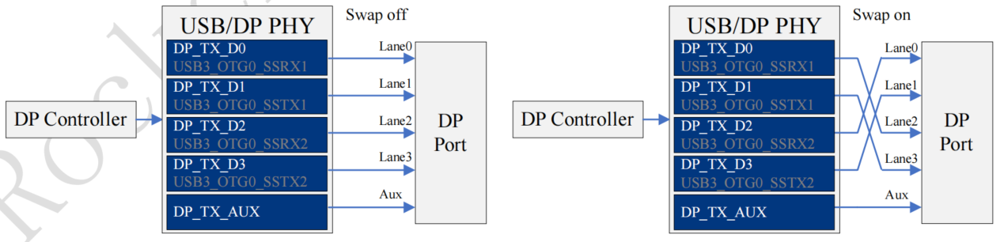

·Supports 3 - channel MST (Multi - Stream Transport) display. The maximum capabilities of the MST for triple - screen different display are: 4096x2160@60Hz, 2560x1600@60Hz, and 1920x1080@60Hz.

Please refer to section 3.5.15 for the USB pin multiplexing.

**Notes:**

- **DP0\_TX\_D0P/D0N, DP0\_TX\_D1P/D1N, DP0\_TX\_D2P/D2N, DP0\_TX\_D3P/D3N, DP1\_TX\_D0P/D0N, DP1\_TX\_D1P/D1N, DP1\_TX\_D2P/D2N, DP1\_TX\_D3P/D3N require 100nF AC coupling capacitors to be connected in series. It is recommended to use the 0201 package for the AC coupling capacitors, which have lower ESR and ESL and can also reduce the impedance variation on the line. When laying out, place them close to the FET3576 - C pin;**

- **Routing impedance control differential 100ohm ± 10% (as DP interface only, no multiplexing), differential 95ohm ±10% (USB3.0/DP1.4 multiplexing);**

- **The delay difference within the differential pair should be ＜3mil；**

- **Equal Length Requirement Between Differential Pairs＜500mil;**

- **The spacing between differential pairs should be at least 6 times the DP trace width;**

- **It is recommended that the spacing between DP and other signals should ≥ 6 × DP trace width;**

- **It is recommended that the number of vias allowed for each signal should ≤ 2;**

- **I/O capacitance to ground does not exceed 0.2pF.**

#### 3.5.20  WIFI/BT Module Circuit

The OK3576 - C board is equipped with a Haihua AW - CM358SM WIFI \& BT module, which supports WIFI 2.4G/5G and Bluetooth 5.0. The WIFI/BT antennas are led out through SMA interfaces, and the SDIO, PDM, and UART interfaces are connected to the main controller. The schematic is as follows:

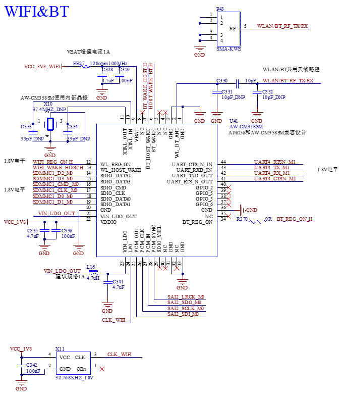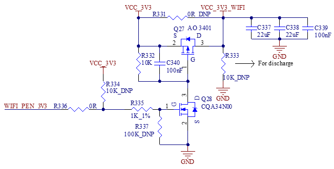

**Note:**

- **The power supply for the WIFI card must be controlled; please refer to the carrier board circuit;**

- **SDIO impedance requirements: Single-ended 50ohm, signal equal length control 50 mil;**

- **I2C Requirements:**

**Multiple slave devices can be connected on a single I2C bus, ensuring no address conflicts.**

**Pull - up resistors are required on the I2C bus, but multiple resistors should not be used for pull - up.**

**Please ensure level matching between the I2C on the SoM side and the I2C of the slave device.**

- **USB Design:**

**To meet the requirements of the USB eye diagram, the PCB trace length of USB3.0 TX/RX should not exceed 6 inches.**

**The unused signal pins of the SoM can be left floating, but please make sure to connect all the GND pins.**

**Power - on Sequence:**

**It is strongly recommended to refer to the design of the development board when designing the carrier board. Use the CARRIER\_BOARD\_EN output by the SoM as the power-on enable for the carrier board, and strictly control the power-on sequence. Or it may have the following influences:**

**·Excessive current during the power - on phase.**

**·The device fails to start.**

**·In the worst - case scenario, irreversible damage to the processor.**

**For detailed hardware design information, please refer to the “FET3576-C \_ Hardware Design Guide”.**

SoM Connector Dimension:

A=21.52mm, B=19.6mm, C=3.2mm, Contacts=100

Carrier board Connector Dimension:

A=22.6mm, B=19.6mm, C=3.2mm, D=1.45mm, Contacts=100

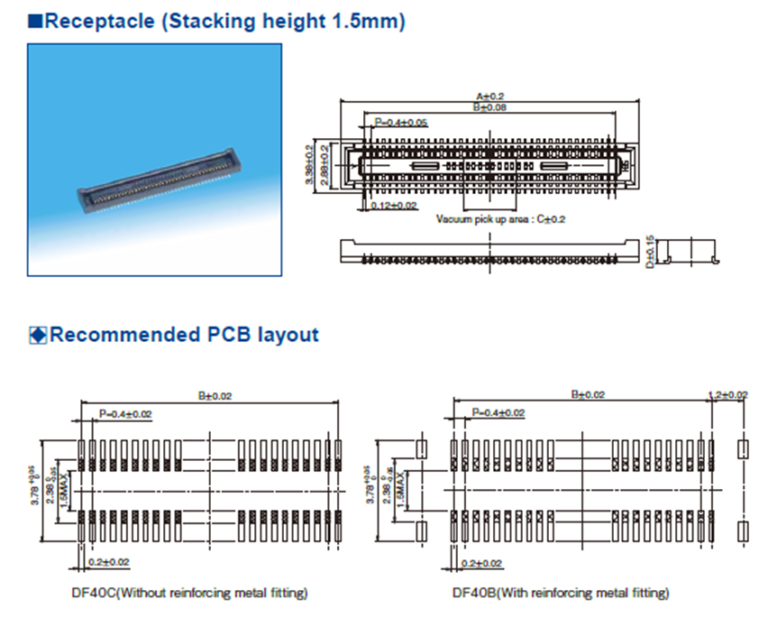

Table 1. Linux system power consumption

| No.| Test Item| SoM Power (W)| Development Board Power (including SoM) (W)|
|----------|----------|----------|----------|
| 1| No-load startup peak power| 3.66| 5.88|
| 2| No-load standby power| 0.82| 2.33|
| 3| CPU+GPU+memory+eMMC pressure test| 5.87| 7.39|
| 4| 7-inch LCD screen + 4G + U disk + video decoding| 2.02| 10.02|
| 5| 7-inch LCD screen + 4G + U disk + video encoding| 3.06| 10.48|
| 6| Pwron Key   Press and hold to shut down| 0.28| 0.32|
| 7| Pwron Key Short press to sleep| TBD| TBD|

**Note：**

- **Test conditions: The SoM configuration is 4GB memory + 32GB eMMC, the 4G module is moved away from EM05-CE, and the screen is an optional product of Forlinx. SoM power supply is 12V and development board is 12V;**

- **Peak power: The peak current during startup multiplied by the supply voltage;**

- **Standby power: The current value in the power-on interface after startup multiplied by the power supply voltage;**

- **Power consumption is for reference only.**

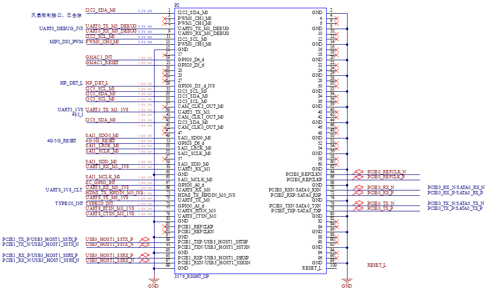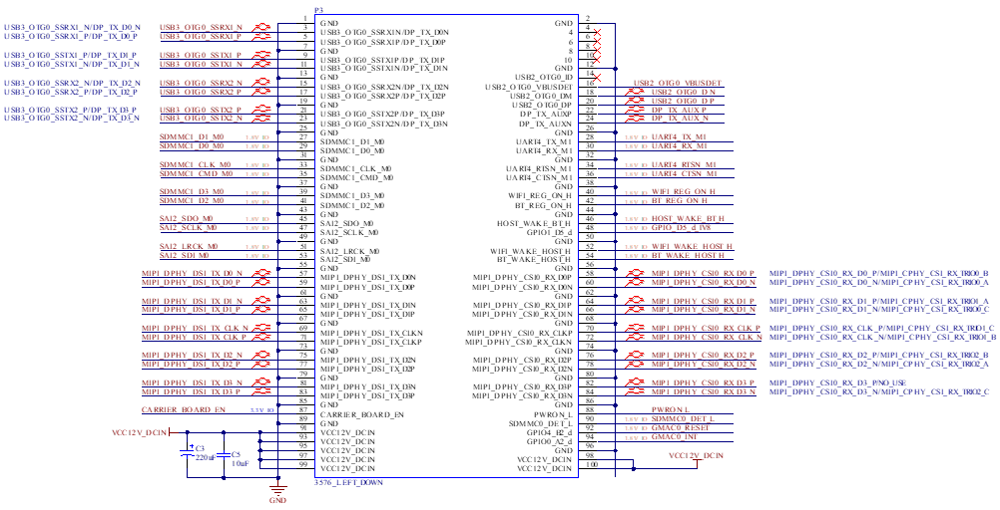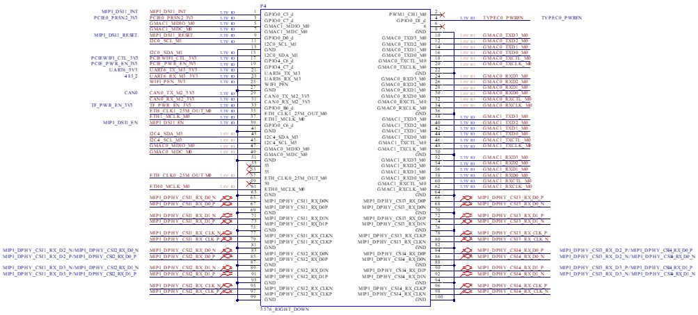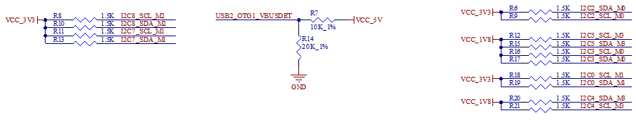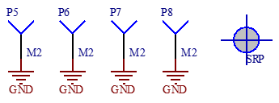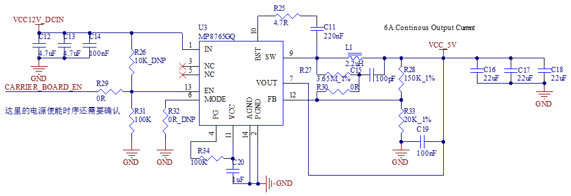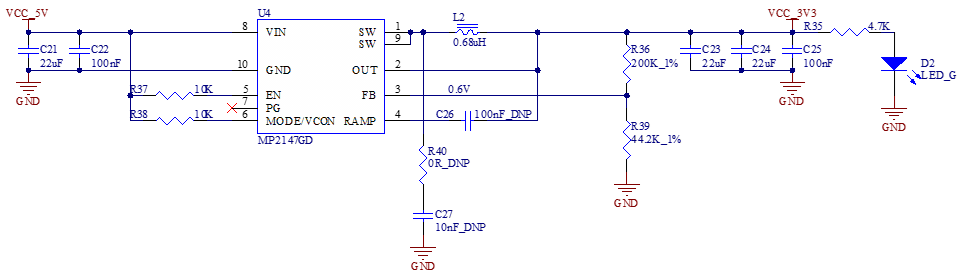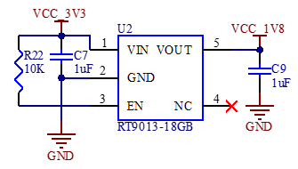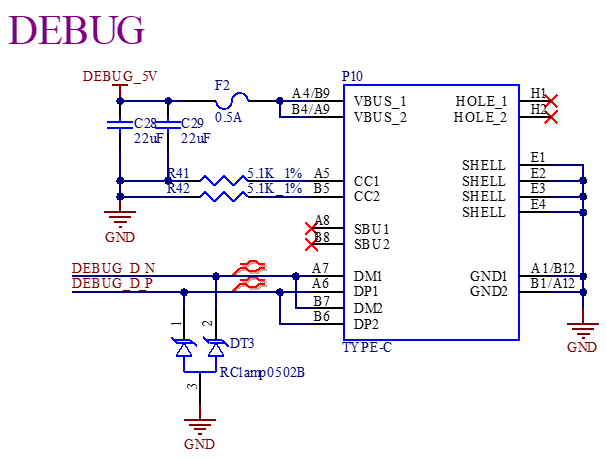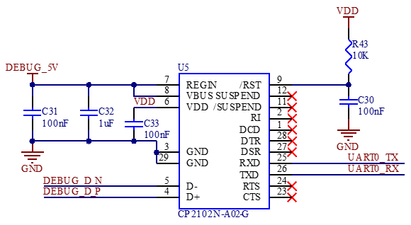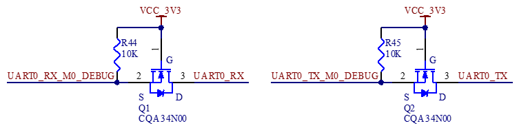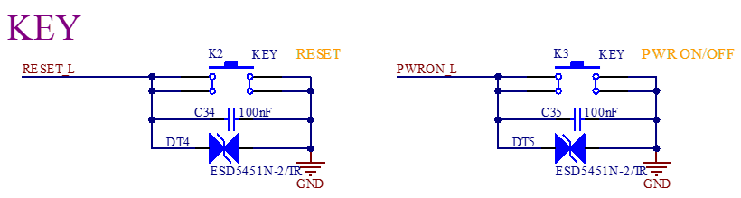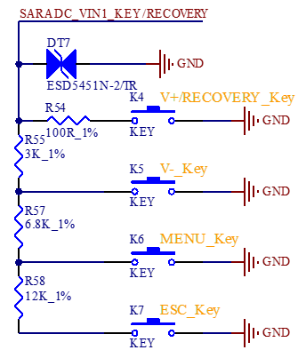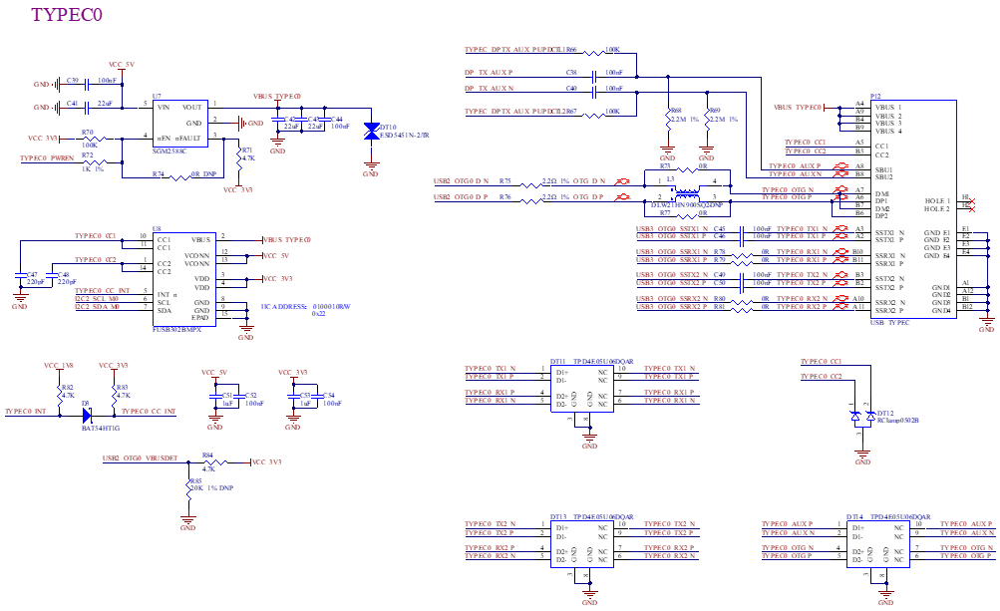

The above figure is only a schematic diagram. Please refer to the schematic diagram of the source file for the specific connection. In order to meet the normal work of the SoM, the minimum system includes the SoM power supply, the system programming circuit, and the debugging serial circuit.

## 4\. Hardware Design Guide

**1. I2C Requirements:**

Multiple slave devices can be connected on a single I2C bus, ensuring no address conflicts.

Pull - up resistors are required on the I2C bus, but multiple resistors should not be used for pull - up.

Please ensure level matching between the I2C on the SoM side and the I2C of the slave device.

**2. USB Design: **

To meet the requirements of the USB eye diagram, the PCB trace length of USB3.0 TX/RX should not exceed 6 inches.

**3. The unused signal pins of the SoM can be left floating, but please make sure to connect all the GND pins.**

**4. Power - on Sequence；**

It is strongly recommended to refer to the design of the development board when designing the carrier board. Use the CARRIER\_BOARD\_EN output by the SoM as the power-on enable for the carrier board, and strictly control the power-on sequence.. Or it may have the following influences:

·Excessive current during the power - on phase.

·The device fails to start.

·In the worst - case scenario, irreversible damage to the processor.

**Note: For detailed hardware design information, please refer to the  “FET3576-C \_ Hardware Design Guide”.**

## 5\. Connector Dimension Diagram

SoM Connector Dimension:

A=21.52mm, B=19.6mm, C=3.2mm, Contacts=100

Carrier board Connector Dimension:

A=22.6mm, B=19.6mm, C=3.2mm, D=1.45mm, Contacts=100

## 6\. OK3576-C Development Board Power Consumption Table

**Table 1. Linux system power consumption**

| No.| Test Item| SoM Power (W)| Development Board Power (including SoM) (W)|
|----------|----------|----------|----------|
| 1| No-load start-up peak power| 3.66| 5.88|
| 2| No-load standby power| 0.82| 2.33|
| 3| CPU+GPU+memory+eMMC pressure test| 5.87| 7.39|
| 4| 7-inch LCD screen + 4G + U disk + video decoding| 2.02| 10.02|
| 5| 7-inch LCD screen + 4G + U disk + video encoding| 3.06| 10.48|
| 6| Pwron Key   Press and hold to shut down| 0.28| 0.32|
| 7| Pwron Key Short press to sleep| TBD| TBD|

**Table2. Android System Consumption**

| No.| Test Item| SoM Power (W)| Development Board Power (including SoM) (W)|
|----------|----------|----------|----------|
| 1| No-load start-up peak power| 4.86| 7.09|
| 2| No-load standby power| 0.95| 2.43|
| 3| Antutu 3D Test Peak Power| 6.04| 10.29|
| 4| Pwron Key   Press and hold to shut down| 0.28| 0.32|
| 5| Pwron Key Short press to sleep| 0.65| 2.19|

**Note：**

- **Test conditions: The SoM configuration is 4GB memory + +32GB eMMC; the 4G module is Quectel EM05-CE, and the screen is an optional product. SoM power supply is 12V and development board is 12V；**
- **Peak power: The peak current during startup multiplied by the supply voltage；**
- **Standby power: The current value in the power-on interface after startup multiplied by the power supply voltage；**
- **Power consumption is for reference only.**

## 7\. Minimum System Schematic

The above figure is only a schematic diagram. Please refer to the schematic diagram of the source file for the specific connection. In order to meet the normal work of the SoM, the minimum system includes the SoM power supply, the system programming circuit, and the debugging serial circuit.