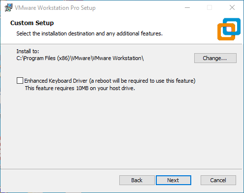
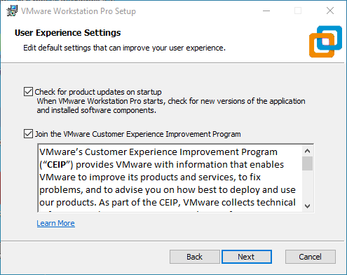
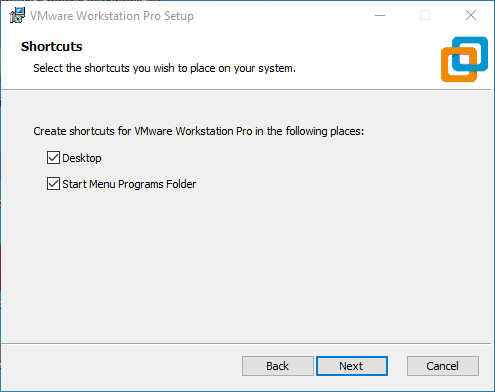
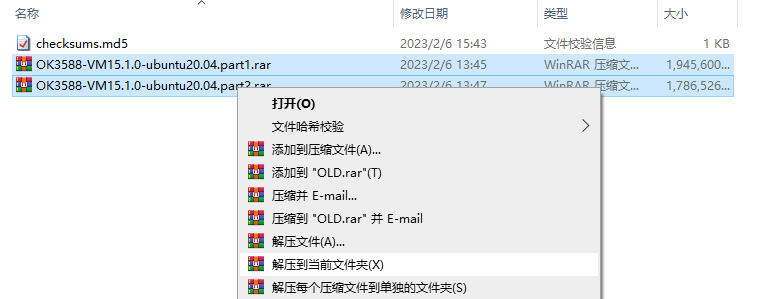
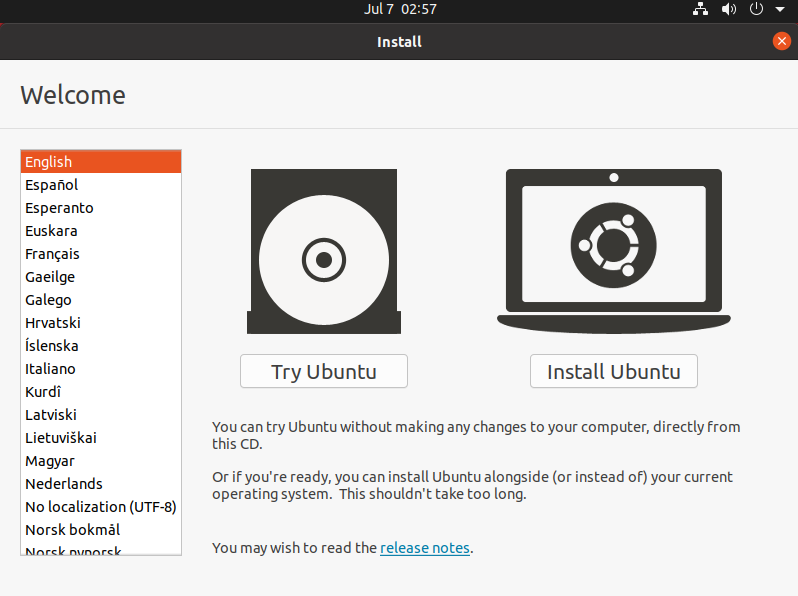
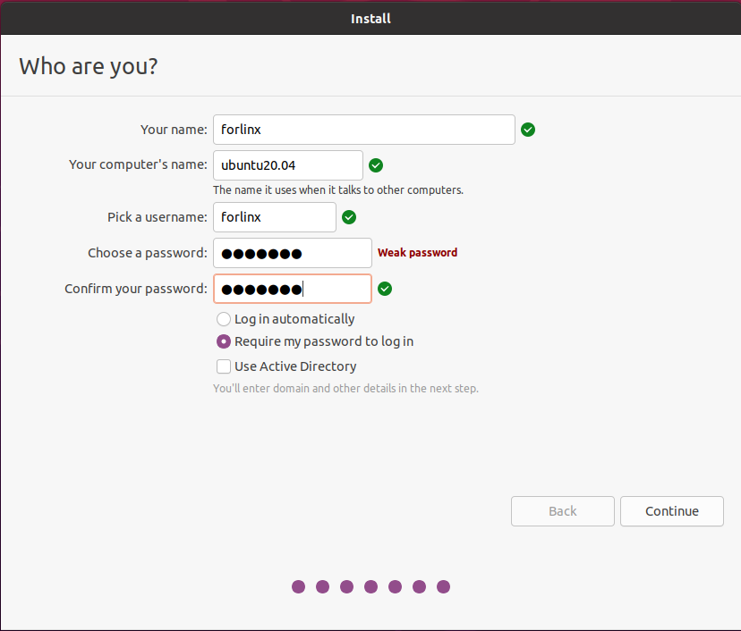
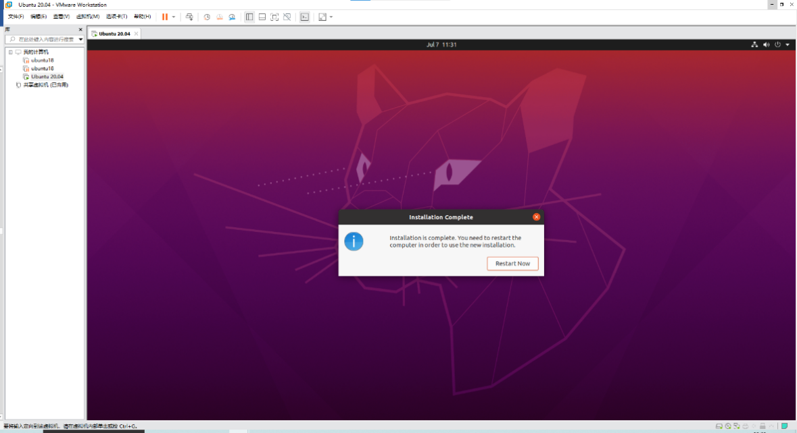
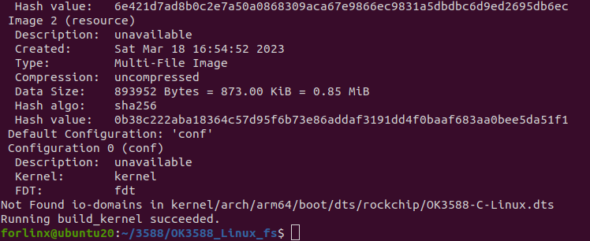
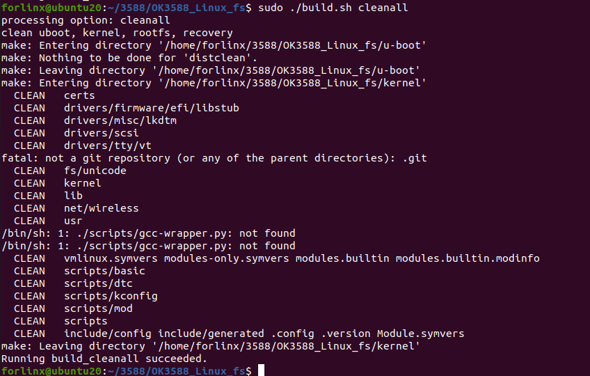

# Forlinx Desktop22.04\_User’s Compilation Manual_V1.0

Document classification: □ Top secret □ Secret □ Internal information ■ Open

## Copyright Notice

The copyright of this manual belongs to Baoding Folinx Embedded Technology Co., Ltd. Without the written permission of our company, no organizations or individuals have the right to copy, distribute, or reproduce any part of this manual in any form, and violators will be held legally responsible.

Forlinx adheres to copyrights of all graphics and texts used in all publications in original or license-free forms.

The drivers and utilities used for the components are subject to the copyrights of the respective manufacturers. The license conditions of the respective manufacturer are to be adhered to. Related license expenses for the operating system and applications should be calculated/declared separately by the related party or its representatives.

## Overview

<font style="color:#333333;">This manual is designed to enable users of the Forlinx Embedded development board to quickly understand the</font><font style="color:#333333;">compilation process</font><font style="color:#333333;">of the products and familiarize themselves with the </font><font style="color:#333333;">compilation</font> <font style="color:#333333;">methods </font><font style="color:#333333;">of </font><font style="color:#333333;">Forlinx</font><font style="color:#333333;"> products. The application needs to be cross-compiled on an </font><font style="color:#333333;">ubuntu</font><font style="color:#333333;">host before it can run on the development board.</font> By following the methods provided in the compilation manual and performing practical operations, you will be able to successfully compile your own software code.

The manual will provide instructions for setting up the environment but there may be some unforeseen issues during the environment setup process. For beginners, it is recommended to use the pre-configured development environment provided by Forlinx. This will allow you to quickly get started and reduce development time.

Linux systems are typically installed in three ways: Dual system on a real machine, single system on a real machine, and virtual machine. Different installation methods have their advantages and disadvantages. This manual only provides methods to build ubuntu in a virtual machine. 

Hardware Requirements: It is recommended to have at least<font style="color:black;background-color:#FFFFFF;">16GB</font><font style="color:black;background-color:#FFFFFF;"> memory or above. It allows for allocating a sufficient memory to the virtual machine (recommended to allocate</font><font style="color:black;background-color:#FFFFFF;">10GB</font> <font style="color:black;background-color:#FFFFFF;">or above), while still leaving enough resources for other operations on</font><font style="color:black;background-color:#FFFFFF;">Windows</font><font style="color:black;background-color:#FFFFFF;">. Insufficient memory allocation may result in slower performance on </font><font style="color:black;background-color:#FFFFFF;">Windows.</font>

The manual is mainly divided into four chapters:

+ Chapter 1. Virtual Machine software installation - introduction to downloading and installing Vmware software;
+ Chapter 2. provides the loading of the ubuntu system;
+ Chapter 3. Building, setting up, and installing necessary tools for the Ubuntu system and common issues in development environments;
+ Chapter 4. Compiling the kernel and Linux-related source code.

A description of some of the symbols and formats associated with this manual:

|                            Format                            | **<font style="color:black;">Meaning</font>**                |
| :----------------------------------------------------------: | ------------------------------------------------------------ |
|                           **Note**                           | Note or information that requires special attention, be sure to read carefully |
|                              📚                               | Relevant notes on the test chapters                          |
|                              ️️️🛤️ ️                              | Indicates the related path.                                  |
| <font style="color:blue;">Blue font on gray background</font> | Refers to commands entered at the command line(Manual input required). |
|         <font style="color:black;">Black font</font>         | Serial port output message after entering a command          |
|       **<font style="color:black;">Bold black</font>**       | Key information in the serial port output message            |
|                              //                              | Interpretation of input instructions or output information   |
|                      Username@Hostname                       | forlinx @ ubuntu: Development environment ubuntu account information, which can be used to determine the environment in which the function operates. |

After packaging the file system, you can use the “ls” command to view the generated files.

```plain
forlinx@ubuntu:~/3588$ ls                                  //List the files in this directory
OK3588-linux-source  OK3588-linux-source.tar.bz2
```

+ forlinx@ubuntu: the username is forlinx and the hostname is ubuntu, indicating that the operation is performed in the development environment ubuntu.
+ //: Explanation of the instruction, no input required.
+ <font style="color:blue;">ls</font>：Blue font, indicating the relevant commands that need to be manually entered.
+ **<font style="color:black;">OK3588-linux-source</font>**：Black font is the output information after entering the command; bold font is the key information; here is the packaged file system.

## Application Scope

This manual is mainly applicable to the Forlinx Desktop22.04 operating system on the Forlinx OK3588-C platform. Other platforms can also refer to it, but there will be differences between different platforms. Please make modifications according to the actual conditions.

## Revision History

| **<font style="color:black;">Date</font>** | **<font style="color:black;">User Manual Version</font>** | **<font style="color:black;">SoM Version</font>** | **<font style="color:black;">Carrier Board Version</font>** | **<font style="color:black;">Revision History</font>**       |
| :----------------------------------------: | :-------------------------------------------------------: | :-----------------------------------------------: | :---------------------------------------------------------: | ------------------------------------------------------------ |
|                 04/11/2023                 |                           V1.0                            |                       V1.1                        |                       V1.1 and Above                        | OK3588-C Forlinx Desktop22.04 User’s Compilation Manual Initial Version |

## 1\. VMware Virtual Machine Software Installation

<font style="color:#000000;">This chapter mainly introduces the installation of</font>VMware virtual machines, using VMware Workstation 15 Pro v15.1.0<font style="color:#000000;">as an example to demonstrate the installation and configuration process of the operating system.</font>

### <font style="color:#000000;">1.1 VMware Software Downloads and Purchase</font>

Go to the VMware website https://www.vmware.com/cn.html to download Workstation Pro and get the product key. VMware is a paid software that requires purchasing, or you can choose to use a trial version.


<font style="color:#000000;">After the download is complete, double-click the startup file to start the installer.</font>

### <font style="color:#000000;">1.2 VMware Software Installation</font>

<font style="color:#000000;">Double-click the startup program to enter the installation wizard, and click on "Next".</font>


<font style="color:#000000;">Check I accept the terms in the license agreement and click Next.</font>


<font style="color:#000000;">Modify the installation location to the partition of your computer where the software is installed, and click "Next".</font>



<font style="color:#000000;">Uncheck and click on "Next".</font>



<font style="color:#000000;">Check Add Shortcut and click "Next".</font>



<font style="color:#000000;">Click "Installation"</font>


<font style="color:#000000;">Wait for the installation to complete.</font>


<font style="color:#000000;">Click "Finish" to try it out. If users need to use it for a long time, they need to buy it from the official and fill in the license.</font>

<font style="color:#000000;">   </font>

<font style="color:#000000;">     </font>

## 2\. Loading the Existing Ubuntu Development Environment

**Note:**

+ **It is recommended for beginners to directly use the pre-built virtual machine environment provided by Forlinx, which already includes installed cross-compiler and Qt environment. After understanding this chapter, you can directly jump to the compilation chapter for further study;**
+ **The development environment provided for general users is: forlinx (username), forlinx (password);**
+ **Please ask your sales representative for the download link.**

There are two ways to use a virtual machine environment in VMware: one is to directly load an existing environment, and the other is to create a new environment. First talk about how to load an existing environment.

First, download the development environment provided by Forlinx. In the development environment documentation, there should be an MD5 checksum file. After downloading the development environment, you should verify the integrity of the compressed package using the MD5 checksum. (You can use an on-line MD5 checksum tool or download a specific MD5 checksum tool for this purpose). To check if the checksum in the verification file matches the checksum of the file itself. If they match, the file download is successful. If they don't match, it suggests that the file may be corrupt, and you should consider downloading it again.


Select all compressed files, right-click and extract to the current folder or your own directory:



After the extraction is complete, you will obtain the development environment OK3588-VM15.1.0-ubuntu20.04.

The file "3588 development environment.vmx" in the OK3588-VM15.1.0-ubuntu20.04 folder is the file that you need to open to access the virtual machine.

Open the installed virtual machine.


Navigate to the directory where the recently extracted OK3588-VM15.1.0-ubuntu20.04 virtual machine file is located, and double-click on the startup file to open it.


Turn on this virtual machine after loading is complete to run it and enter the system's interface.


The default automatic login account is forlinx, and the password is forlinx.


## 3\. New Ubuntu Development Environment Setup

**Note: Beginners are not recommended to set up a system on their own. It is recommended to use an existing virtual machine environment. If you do not need to set up the environment, you can skip this section.**

This chapter mainly explains the building process of Ubuntu system.

### 3.1 Ubuntu System Setting up

#### 3.1.1 Ubuntu Virtual Machine Setup

Step 1: Open the VMware software and click \[File]/ \[New Virtual Machine]. Enter the following interface.


Step 2: Select Custom and click “Next”.


Select the compatibility with the corresponding version of VMware, which can be found in Help->About VMware Workstation, and click “Next”.


Select Install the operating system later and click “Next”.


Keep the default settings and click “Next”.


Modify the name and installation location of your virtual machine, and click “Next”.


Configure the number of CPU based on your computer's actual specifications.


Set the memory size according to the actual situation. It is recommended to use 16g


Set the network type, default to NAT mode then click “Next”. Keep the default values for the remaining steps until you reach the step to specify the disk capacity.


The default selection for the IO controller type here is LSI


The default selection here is also SCSI.


Choose to create a new virtual disk here.


Set the disk size to 500G, select the disk provisioning format, and then click “Next”.


Specify the disk file, the default one here is fine.


Click “Finish” by default.


The virtual machine creation is now complete.

In the next section, it will introduce the installation of Ubuntu system in the virtual machine, which is similar to the installation method in the real machine. Here we describe the method of installing Ubuntu system in a virtual machine.

#### 3.1.2 System Installation

In the previous section, we have created a virtual machine, but we haven’t installed the operating system yet, so the virtual machine cannot be started. Next, we will install the Ubuntu operating system in the newly created virtual machine.

Step 1: Go to the Ubuntu official website to obtain the Ubuntu20.04 64. 

The download address is: https://old-releases.ubuntu.com/releases/20.04.3/](https://old-releases.ubuntu.com/releases/20.04.3/

Because the source code is compiled and verified on the 20.04, select and install it. These operations may vary slightly between Ubuntu system versions.

Download “ubuntu-20.04.3-desktop-amd64.iso”


After downloading the mirror image, you can proceed with the system installation operation.

Right-click on the created virtual machine name and select “Settings” from the pop-up menu.


The “Virtual Machine Settings” menu will pop up.


Click on CD/DVD (SATA), select “Use ISO image file,” browse and choose the previously downloaded Ubuntu image, then click “OK” to confirm.


After setting up the image, ensure that the network is available. Then, start the virtual machine and proceed with the installation of the Ubuntu image.


After starting the virtual machine, wait for the installation interface to appear as shown below.



After selecting the language on the left side as shown in the image, click “Install Ubuntu”, and the language selection interface will pop up. The default language of Ubuntu is English, but of course, you can also choose Others.


The default selected language can also be reset at a later stage, after the selection is complete continue.


Next, select "Continue" as the default option to proceed with the installation. The installation process might be slow. Then, click "Continue" again.


By default, when you click on "Install Now", a dialog box will appear as shown in the image. Simply click "Continue" to proceed.


Next, select the timezone. You can either click on the Shanghai timezone or enter "Shanghai" (or choose the appropriate timezone based on your location). Then, click "Continue" to proceed.

Finally, set your username and password. You can choose either automatic login or login with a username and password. Click "Continue" to start the automatic installation.



If the internet connection is poor, you can Skip without affecting the installation process.


Click “Restart” Now to reboot.




The system interface after the reboot is complete.


The ubuntu system installation is complete.

#### 3.1.3 Ubuntu Basic Configuration

After installing the Ubuntu20.04 operating system, there are a few configurations to make.

VMware Tools Installation:

Next, install VMware Tools. Without installing this tool, you won't be able to copy and paste and drag file between the Windows host and the virtual machine. First click on "Virtual Machine" on the VMware navigation bar, then click "Install VMware Tools" in the drop-down box.


Once done, enter Ubuntu and the VMware Tools CD will appear on your desktop and click into it.


Enter and see a compressed file VMwareTools-10.3.10-12406962.tar.gz (it may be different for different VM versions); copy the file under the home directory (i.e. the directory with the home personal username)


Press \[Ctrl+Alt+T] to bring up the Terminal Command Interface and enter the command:

```plain
forlinx@ubuntu:~$ sudo tar xvf VMwareTools-10.3.10-12406962.tar.gz
```


After the extraction is complete, a file named “vmware-tools-distrib" will appear.


Go back to the terminal and type cd vmware-tools-distrib to enter the directory.

Enter: sudo ./vmware-install.pl followed by pressing Enter. Then, enter your password and the installation process will begin. When prompted, you can input "yes" and press Enter to proceed. For any other inquiries, simply press Enter to go with the default installation settings.


Once the VMware tools is complete, we can implement file copy and paste between Windows and Ubuntu.

The virtual machine is displayed full screen:

If the virtual machine is not able to be displayed in full screen, you can resolve this issue by clicking on "View" and selecting "Autofit Guest." This will adjust the display to fit the screen automatically, enabling you to have a full-screen experience in the virtual machine.


Make most of the system settings in the location shown. A lot of the setup requirements on Ubuntu can be done here.


Virtual machine hibernation settings:

Also, the default hibernation is 5min, if you don't want to set hibernation, just set it to Never by setting Power->Blank screen.


#### 3.1.4 Network Settings for Virtual Machines

##### 3.1.4.1 NAT Connection Method

By default, after the virtual machine is installed, the network connection method is set to NAT, which shares the host machine's IP address. This configuration does not need to be changed when performing tasks like installing dependencies or compiling code.

When the VMware virtual NIC is set to NAT mode in a virtual machine, the network in the Ubuntu environment can be set to dynamic IP. In this mode the virtual NAT device and the host NIC are connected to communicate for Internet access. This is the most common way to access the external network.


##### 3.1.4.2 Connections for Bridges

When the VMware virtual NIC device is in bridge mode, the host NIC and the virtual machine NIC communicate through the virtual bridge, and the network IP and the host need to be set in the same network segment in the Ubuntu environment. If accessing an external network, you need to set the DNS to be consistent with the host NIC. If TFTP, SFTP and other servers are used, the network contact mode of the virtual machine needs to be set as the bridge mode.


### 3.2 Libraries for Installing Linux Compilation System

Note: If you use the development environment provided by us, this section can be skipped directly.

Compiling for Linux requires the installation of a number of toolkits. Make sure that your computer or virtual machine can be connected to the Internet normally before the operation in this section. If the network is disconnected during the installation, please follow the following steps to install.

1. Install the necessary packages for compiling Linux.

```plain
forlinx@ubuntu:~$ sudo apt-get update
forlinx@ubuntu:~$ sudo apt-get install openssh-server vim git fakeroot           //Necessary toolkit installation
forlinx@ubuntu:~$ sudo apt-get install repo git ssh make gcc libssl-dev liblz4-tool expect g++ patchelf chrpath gawk texinfo chrpath diffstat binfmt-support qemu-user-static live-build bison flex fakeroot cmake gcc-multilib g++-multilib unzip device-tree-compiler python-pip libncurses5-dev
forlinx@ubuntu:~$ sudo apt-get install -y expect time build-essential kmod python3.9
```

The following libraries also need to be installed when using the Network Configuration Tool and menuconfig:

```plain
forlinx@ubuntu:~$ sudo apt-get update                      //Update the download source information
forlinx@ubuntu:~$ sudo apt-get install libncurses*             //For building text-based user interfaces
forlinx@ubuntu:~$ sudo apt-get install net-tools               //Network configuration tool
```

### 3.3 Qt Creator Installation

Copy qt-creator-opensource-linux-x86\_64-4.1.0.run to any directory within the current user’s home directory, and then run the following command.

Path: OK3588-C-C（Linux）user’s profile\\Linux\\source code\\qt-creator-opensource-linux-x86\_64-4.7.0.run

```plain
forlinx@ubuntu:~/3588$ ./qt-creator-opensource-linux-x86_64-4.7.0.run                   
```


Then the installation window of the graphical interface will pop up, and install according to the instructions:


For online installation, register a Qt account (log in directly if you already have one). Password must include capital letters, uppercase, lowercase letters and numbers. After successful registration/login, click next. Skip this step for offline installation. 


Click "Next".


You can set the installation path according to your own habits. It is set by default here, so click "Next".


Installation completes, click "Next".


Click "Install" and wait for the installation to complete.


At this time, the Qt interface will be opened automatically. You can also start it through the command line. Execute the following command to open Qt Creator in the backstage. When the you open it, the actual installation path shall prevail:

```plain
forlinx@ubuntu:~$ cd /home/forlinx/qtcreator-4.7.0/bin
forlinx@ubuntu:~$ ./qtcreator &
```


The Qt Creator tool screen appears. Qt Creator is installed.

## 4\. Related Code Compilation

This chapter mainly describes the compiling method of the source code related to the development board, including the kernel source code compilation and the application program compilation.

### <font style="color:#000000;">4.1 Preparation Before Compilation</font>

#### <font style="color:#000000;">4.1.1 Description of the Environment</font>

+ Development environment OS: Ubuntu 22.04 64-bit (R1-R3), Ubuntu 22.04 64-bit (R4);
+ The board uses the Bootloader version: u-boot-2017.09;
+ Development board kernel: linux-5.10.160 (R1-R3)、linux-5.10.209 (R4).

#### <font style="color:#000000;">4.1.2 Source Code Copy  </font>

️Source Code: User Information \\ Linux \\ Source Code \\OK3588\_Linux\_fs.tar.bz2.0\*

Create a working directory.

```plain
forlinx@ubuntu:~$ mkdir -p /home/forlinx/3588  // Create the working directory in sequence
Copy the source code files `OK3588_Linux_fs.tar.bz2.0*` from the user documentation to the `/home/forlinx/3588` directory of the virtual machine.
forlinx@ubuntu:~$ cd /home/forlinx/3588  // Switch to the working directory
forlinx@ubuntu:~/3588$ cat OK3588_Linux_fs.tar.bz2.0* > OK3588_Linux_fs.tar.bz2
forlinx@ubuntu:~/3588$ tar -xvf OK3588_Linux_fs.tar.bz2  // Extract the compressed package at the current location
```

Just run the command and wait for it to complete.

### <font style="color:#000000;">4.2 Source Code Compilation</font>

**Note:**

+ **After the kernel source code is decompressed for the first time, the source code needs to be compiled as a whole;**
+ **R1-R3 source code compilation requires root permissions. The following operations use the forlinx user to call sudo permissions, and the password is also forlinx;**
+ **The source code of R4 needs to be compiled as a forlinx user, and sudo cannot be added;**
+ **After compiling as a whole, you can compile separately according to the actual situation;**
+ **The source code compilation requires a development environment with a running memory of 8G or above. Please do not modify the VM virtual machine image configuration provided by us.**

#### <font style="color:#000000;">4.2.1 Full Compilation Test</font>

In the source code path, the compilation script build. sh is provided. Run the script to compile the entire source code. You need to switch to the decompressed source code path at the terminal and find the build. Sh films.

```plain
forlinx@ubuntu:~$ cd /home/forlinx/3588/OK3588_Linux_fs
```

The following operations need to be operated under the source code directory, and the full compilation method is:

1\. Generate the configuration required for compilation (the forlinx user password is required at this time, and the password is also forlinx);

**PS：linux5.10.209（R4）kernel doesn’s need this step.**

```plain
forlinx@ubuntu: ~/3588/OK3588-linux-source$ ./build.sh BoardConfig-ubuntu-ok3588.mk
```


2\. Full Compilation Test

- Full Compilation (***R1-R3***)

```plain
forlinx@ubuntu: ~/3588/OK3588-linux-source$ sudo ./build.sh
```

- Full Compilation (***R4***)

**<font style="color:#DF2A3F;">Note: Do not use sudo to compile the R4 materials. You don’t need to use sudo for subsequent compilations either. Otherwise, you may encounter permission errors.</font>**

:::color2 If you are using linux5.10.209 R4 kernel, you need to delete the defconfig file in the output/ directory first.

:::

```plain
forlinx@ubuntu:~$ cd /home/forlinx/3588/OK3588-linux-source
forlinx@ubuntu: ~/3588/OK3588-linux-source$ rm output/defconfig
```

```plain
forlinx@ubuntu: ~/3588/OK3588-linux-source$ ./build.sh
```

When compiling for the first time, the following interface will appear. Compile Ubuntu and select 2:


After successful compilation, the system image will be generated under the rockdev folder, as shown in the following figure:


**Note: The update. img is packaged for full programming of OTG or TF card, and other files are programmed step by step.**

#### <font style="color:#000000;"><font style="color:#000000;">4.2.2 Separate Compilation</font></font>

Perform the operation in the kernel source code path.

**<font style="color:#DF2A3F;">Note: Do not use sudo to compile the R4 materials. You don’t need to use sudo for subsequent compilations either. Otherwise, you may encounter permission errors.</font>**

```plain
forlinx@ubuntu: ~/3588/OK3588_Linux_fs$ sudo ./build.sh kernel
```



The kernel in the update. img is not updated after successful compilation. Please flash the kernel/boot. img file step by step.

#### <font style="color:#000000;"><font style="color:#000000;">4.2.3 Clearing Compilation File</font></font>

Perform the operation in the source code path.

**<font style="color:#DF2A3F;">Note: Do not use sudo to compile the R4 materials. You don’t need to use sudo for subsequent compilations either. Otherwise, you may encounter permission errors.</font>**

```plain
forlinx@ubuntu: ~/3588/OK3588_Linux_fs$ sudo ./build.sh cleanall
```



This operation clears all intermediate files. However, it does not affect the source files, including those that have already had changes made to them.

### <font style="color:#000000;">4.3 Image File Use</font>

The update. img is packaged for full programming of OTG or TF card, and other files are programmed step by step. The Image file generated by separate compilation will not be updated in the update. img file, and it needs to be flashed by single-step. (see the software manual OTG flashing for details).

### 4.4 Application Compilation and Operation

#### 4.4.1 Command Line Application Compilation and Operation

In this section, use the “hello world” test program and compile it in the development environment.

1\. Set up the Ubuntu application development environment;

Install qemu and the corresponding tools.

```plain
forlinx@ubuntu:~$ sudo apt install qemu-user-static -y
forlinx@ubuntu:~$ sudo apt-get install git ssh make gcc libssl-dev liblz4-tool
```

2\. Mount the Ubuntu system image

**Note: You can add modification records or back up the Ubuntu system image before making any changes.**

```plain
forlinx@ubuntu: ~/3588/OK3588-linux-sourc/ubuntu$ mkdir rootfs
forlinx@ubuntu: ~/3588/OK3588_Linux_sourc/ubuntu$ sudo jammy-rootfs.img rootfs
forlinx@ubuntu: ~/3588/OK3588_Linux_sourc/ubuntu$ cd  rootfs/
```

3\. Reset the root directory;

Set the root file system mounted from the Ubuntu image as the root directory.

```plain
forlinx@ubuntu: ~/3588/OK3588_Linux_sourc/ubuntu/rootfs$ sudo chroot ./
root@ubuntu20:/# ls
bin  boot  dev  etc  home  lib  lost+found  media  mnt  opt  proc  root  run  sbin  snap  srv  swapfile  sys  tmp  usr  var
```

4\. Add the application hello\_world.c for compilation

You can place it in the required location of this file system.

```plain
root@ubuntu20:/# vi hello_world.c
root@ubuntu20:/# cat hello_world.c
#include <stdio.h>

int main(){
    printf("hello world!\n");
    return 0;
}
root@ubuntu20:/# gcc hello_world.c -o hello_world
root@ubuntu20:/# ./hello_world
hello world!
root@ubuntu20:/# file hello_world
hello_world: ELF 64-bit LSB shared object, ARM aarch64, version 1 (SYSV), dynamically linked, interpreter /lib/ld-linux-aarch64.so.1, BuildID[sha1]=2ad869961eba250292af95bedbbf68a4b32fa0ce, for GNU/Linux 3.7.0, not stripped
```

**Note: You can use the Ctrl + D key combination to exit the chroot environment.**

You can see the program can be executed in the current command line. Using the file command, you can also see that the hello\_world program is now of the ARM aarch64 architecture, which is also what the Ubuntu system requires.

5\. Program transplantation.

- Merge into the file system

Unmount the rootfs. The modified content will be automatically merged into the system image of the file system. Then, perform a full recompilation.

```plain
forlinx@ubuntu: ~/3588/OK3588_Linux_source/ubuntu/$ sudo umount rootfs
forlinx@ubuntu: ~/3588/OK3588_Linux_source/$ ./build.sh
```

- Copy the executable program to the development board separately

Copy the executable program to a USB flash drive and then transfer it from the USB flash drive to the development board.