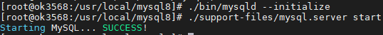
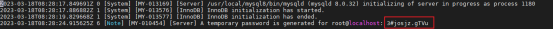

# OK3568 4.19.206 Adding mysql8.0.32

Document classification: □ Top secret □ Secret □ Internal information ■ Open  

## Copyright

The copyright of this manual belongs to Baoding Folinx Embedded Technology Co., Ltd. Without the written permission of our company, no organizations or individuals have the right to copy, distribute, or reproduce any part of this manual in any form, and violators will be held legally responsible.   
Forlinx adheres to copyrights of all graphics and texts used in all publications in original or license-free forms.  
The drivers and utilities used for the components are subject to the copyrights of the respective manufacturers. The license conditions of the respective manufacturer are to be adhered to. Related license expenses for the operating system and applications should be calculated/declared separately by the related party or its representatives.

MySQL-related files; please download before reading this document. All files mentioned in the text are included in the compressed package.

1\. Library Preparation

Place the mysql-lib folder in any directory on the development board, then copy the library files to the /usr/lib/ directory.

**\[root@ok3568:/home/forlinx/mysql-lib]#** cp ./\* /usr/lib/

Then create soft links for these files so that the MySQL service can find and use them

**\[root@ok3568:/home/forlinx/mysql-lib]#** ln -s /usr/lib/libaio.so.1.0.1 /usr/lib/libaio.so.1

**\[root@ok3568:/home/forlinx/mysql-lib]#** ln -s /usr/lib/libnuma.so /usr/lib/libnuma.so.1

**\[root@ok3568:/home/forlinx/mysql-lib]#** ln -s /usr/lib/libncurses.so.6.0 /usr/lib/libncurses.so.5

**\[root@ok3568:/home/forlinx/mysql-lib]#** ln -s /usr/lib/libncurses.so.6.0 /usr/lib/libtinfo.so.5

2\. Configuration file preparation

Place the my. cnf in the board's/etc directory

3\. mysql Installation

Unzip mysql-8.0.32-linux-glibc2.17-aarch64.tar

**\[root@ok3568:/home/forlinx/mysql-lib]#**\*\* \*\*tar -xvf mysql-8.0.32-linux-glibc2.17-aarch64.tar

Place the extracted folder in the/usr/local directory and rename it mysql8

**\[root@ok3568:/home/forlinx/mysql-lib]#**\*\* \*\*\*\*  
\*\*mv mysql-8.0.32-linux-glibc2.17-aarch64 /usr/local/mysql8

4\. mysql Initialization

Switch to/usr/local/mysql8 path for execution

**\[root@ok3568:/usr/local/mysql8]#**\*\* \*\*./bin/mysqld --initialize

**Note: If the initialization fails, you need to clear the files in the mysql8/data directory and reinitialize.**

Enable mysql.service

**\[root@ok3568:/usr/local/mysql8]#**\*\* \*\*./support-files/mysql.server start

**Note: If initialization completes without errors but mysql.server start fails, the system date on the development board may be incorrect. Use the date command to set it to the current time, then delete the contents of the data folder, reinitialize, and start again.**

5\. Connect to the Local Database

Check the initialization password described in the data/error.log file in the current directory:

**\[root@ok3568:/usr/local/mysql8]#**\*\* \*\*vi data/error.log

6\. Log in to the local database:

**\[root@ok3568:/usr/local/mysql8]#**\*\* \*\*./bin/mysql -h 127.0.0.1 -u root -p

// Enter the password found in data/error.log when prompted. After successful login, MySQL is ready for use.

// Once logged in, you can change the root login password to 123456 using: alter user 'root'@'localhost' identified by '123456';

**Note: This article references https://blog.csdn.net/weixin\_53366062/article/details/126636967. Detailed usage methods are not repeated here.**