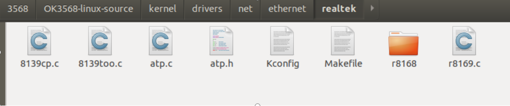
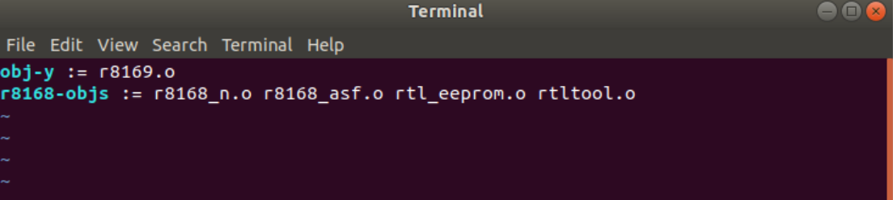
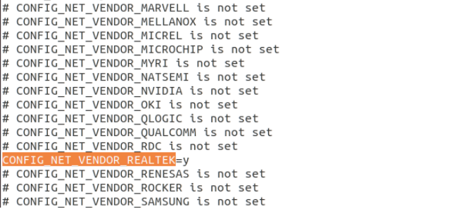
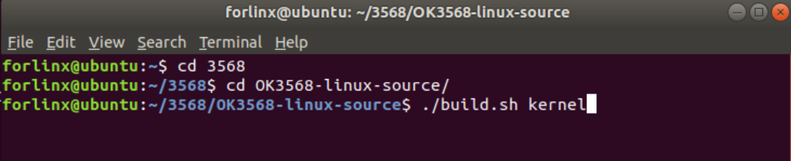

# OK3568 4.19.206 Buildroot Adding PCIe-to-NIC Driver 81111H

Document classification: □ Top secret □ Secret □ Internal information ■ Open

## Copyright

The copyright of this manual belongs to Baoding Folinx Embedded Technology Co., Ltd. Without the written permission of our company, no organizations or individuals have the right to copy, distribute, or reproduce any part of this manual in any form, and violators will be held legally responsible.   
Forlinx adheres to copyrights of all graphics and texts used in all publications in original or license-free forms.  
The drivers and utilities used for the components are subject to the copyrights of the respective manufacturers. The license conditions of the respective manufacturer are to be adhered to. Related license expenses for the operating system and applications should be calculated/declared separately by the related party or its representatives.

## Revision History

| Date| Version| Revision History|
|----------|----------|----------|
| 05/30/2025| V1.0| Initial Version|

## Adding PCIe-to-NIC Driver 81111H

In the project, the 3568 two-channel native gigabit network port is not enough, and the gigabit network port needs to be expanded. This manual takes the pcie expansion of the single-channel gigabit network rtl8111H as an example.

**1. Add Source Code to the Kernel**

Since the 8111H is compatible with the 8168, the source code files to be added are for the 8168 driver. First, copy the r8168 folder to OK3568-linux-source/kernel/drivers/net/ethernet/realtek/.

Then, add the line obj-y += r8168/ at the end of the Makefile in this folder, as shown in the figure below.

**2\. Modify the Makefile in the 8168 Folder**

Enter the r8168 folder and modify the Makefile inside as follows:

obj-y := r8168.o

r8168-objs := r8168\_n.o r8168\_asf.o rtl\_eeprom.o rtltool.o

**3\. Modify the Configuration File**

Navigate to OK3568-linux-source/kernel/arch/arm64/configs/ and change the line # CONFIG\_NET\_VENDOR\_REALTEK is not set in OK3568-C-linux\_defconfig to:

**4\. Compile and Flash**

Enter the source code directory, execute ./build.sh kernel, wait for the compilation to complete, and then flash boot.img to the development board.

**5\. Attachments**

[r8168-8.050.03.tar.zip](https://forlinx-book.yuque.com/attachments/yuque/0/2025/zip/45576790/1748588557755-77afd6a5-1648-4d99-8d54-0004166662d3.zip)