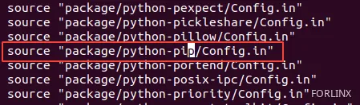
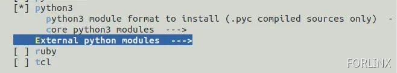
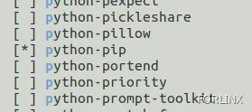
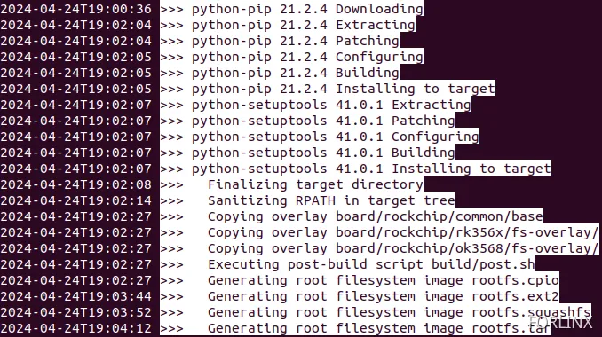
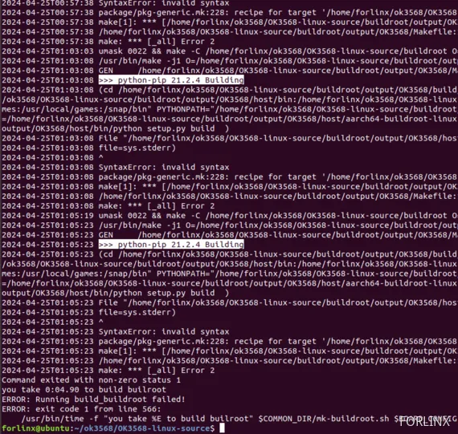
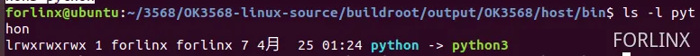
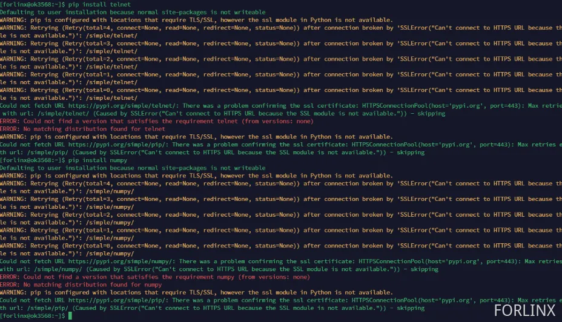

# **OK3568 4.19.206 Buildroot Adding the Python3 - pip Installation Package**

Document classification: □ Top secret □ Secret □ Internal information ■ Open                                                                                                              

## Copyright

The copyright of this manual belongs to Baoding Folinx Embedded Technology Co., Ltd. Without the written permission of our company, no organizations or individuals have the right to copy, distribute, or reproduce any part of this manual in any form, and violators will be held legally responsible.   
Forlinx adheres to copyrights of all graphics and texts used in all publications in original or license-free forms.  
The drivers and utilities used for the components are subject to the copyrights of the respective manufacturers. The license conditions of the respective manufacturer are to be adhered to. Related license expenses for the operating system and applications should be calculated/declared separately by the related party or its representatives.

## **Revision History**

| Date| Version| Revision History|
|----------|----------|----------|
| 01/23/2025| V1.0| Initial Version|

## Adding the Python3 - pip Installation Package

This manual describes how to add python3-pip to a buildroot system.

**Modification Method**

Modify Configuration File: buildroot/package/Config.in

Add pyhon-pip/Config.in



Unzip the python-pip archive of the attachment in the buildroot/package directory

[python-pip-20240425100624-9049ncj.zip](https://forlinx-book.yuque.com/attachments/yuque/0/2025/zip/45781369/1740040907638-bb858a66-a173-4ff0-9a89-88bb781e398e.zip)

Modify the defconfig file used by buildroot

Execute make menuconfig in the buildroot/output/OK3568 directory to select python3 and python-pip





After modification, save the modified.config file to buildroot/configs/OK3568 \_ defconfig 

After saving, you can compile the whole package. When compiling, you can see that the download, compilation and installation of pip related packages are successful.



Flash the compiled file system to the development board to use the pip command.

Potential Compilation Errors

Error During Compilation:



Solution:   
Solution: Re-link the symbolic link for OK3568-linux-source/buildroot/output/OK3568/host/bin/python to point to python3.

```plain
cd buildroot/output/OK3568/host/bin
rm python
ln -s python3 python
```

After re-establishing the link, recompile. After successful linking, the result of ls -l python should be as shown.



SSL Error when running pip install on the board after flashing:



Solution:   
Delete the Python-related files in the OK3568-linux-source/buildroot/output/OK3568/build/ directory and recompile. Installing pip depends on SSL. If a full compilation was previously completed during the first issue, it was done using python2 for SSL compilation.

```plain
rm buildroot/output/OK3568/build/python-* -rf
./build.sh buildroot
```

Once the compilation is complete, flash the new build to the board and verify its functionality. You can then proceed to test by installing opencv-python.


If you encounter an error about the pip package download failing, place the specified package files into the buildroot/dl/ directory.

[pip-21.2.4.tar.gz](https://forlinx-book.yuque.com/attachments/yuque/0/2025/gz/45781369/1740042129652-e1e53ba6-ee55-4a94-979e-aa86e40b5927.gz)