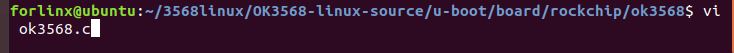
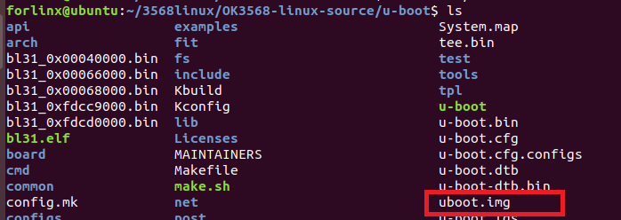

# OK3568 4.19.206 Buildroot Disabling the Watchdog in Uboot

Document classification: □ Top secret □ Secret □ Internal information ■ Open

## Copyright  

The copyright of this manual belongs to Baoding Folinx Embedded Technology Co., Ltd. Without the written permission of our company, no organizations or individuals have the right to copy, distribute, or reproduce any part of this manual in any form, and violators will be held legally responsible.   
Forlinx adheres to copyrights of all graphics and texts used in all publications in original or license-free forms.  
The drivers and utilities used for the components are subject to the copyrights of the respective manufacturers. The license conditions of the respective manufacturer are to be adhered to. Related license expenses for the operating system and applications should be calculated/declared separately by the related party or its representatives.

## Revision History

| Date| Version| Revision History|
|:----------:|:----------:|----------|
| 04/08/2022| V1.0| Initial Version|

## Disabling the Watchdog in Uboot

Modify the file at the following path:

Comment out the watchdog countdown code.

Save the changes and compile U-Boot separately by executing ./build.sh uboot.

After compilation, an uboot.img file will be generated in the u-boot folder.

Then, flash the uboot.img file to the development board individually. The flashing address is 0x00004000. After connecting the flashing tool, click on the device partition table, and the U-Boot flashing address will be automatically loaded. Then, click on the small box next to "uboot", select the uboot.img file compiled above, and click execute to proceed with the flashing.

