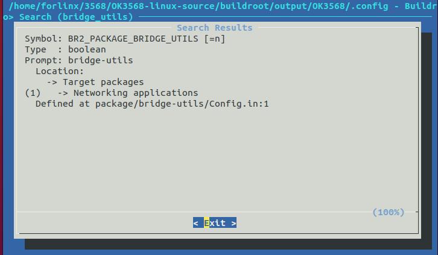
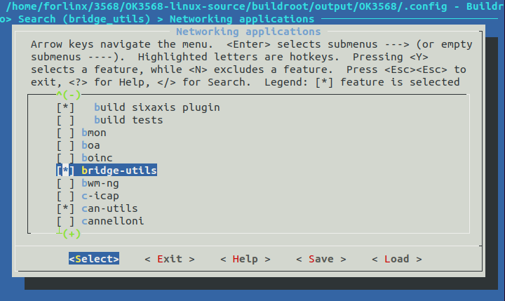
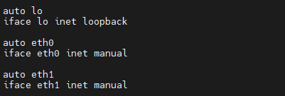
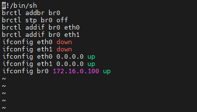

# OK3568 4.19.206 Buildroot Installing Bridge Tool (bridge-utils) in Buildroot

Document classification: □ Top secret □ Secret □ Internal information ■ Open

## Copyright

The copyright of this manual belongs to Baoding Folinx Embedded Technology Co., Ltd. Without the written permission of our company, no organizations or individuals have the right to copy, distribute, or reproduce any part of this manual in any form, and violators will be held legally responsible.

Forlinx adheres to copyrights of all graphics and texts used in all publications in original or license-free forms.

The drivers and utilities used for the components are subject to the copyrights of the respective manufacturers. The license conditions of the respective manufacturer are to be adhered to. Related license expenses for the operating system and applications should be calculated/declared separately by the related party or its representatives.

## Revision History

| **Date**| Version | Revision History |
|:----------:|:----------:|----------|
| 04/08/2022 | V1.0| Initial Version|

## Installing Bridge Tool (bridge-utils) in Buildroot

Navigate to the /OK3568-linux-source/buildroot/output/OK3568 directory and execute the make menuconfig command.

Press the / key to open the search box. Enter the keyword bridge\_utils, select OK, and press Enter.

Once the result appears, press 1 to jump to the configuration page.

Select bridge-utils by marking it with y.

Continuously select Exit until you leave the graphical configuration interface. When prompted to save the configuration upon exiting, choose yes.

Switch to the /OK3568-linux-source directory and execute the ./build.sh buildroot command.

You will be prompted that a .config file already exists and asked if you want to regenerate it. Enter n (no); otherwise, your previous configuration will be overwritten.

After compilation completes, a rootfs.ext2 file will be generated in the OK3568-linux-source/buildroot/output/OK3568/images directory. Flash this file individually to the development board.

If the above steps result in an error, your kernel might have been compiled with CONFIG\_BRIDGE = n)

Kernel Support for Bridge

Added at the end of the/OK3568-linux-source/kernel/arch/arm64/configs/OK3568-C- Linux \_ defconfig.

CONFIG \_ BRIDGE = y save file

Switch to the /OK3568-linux-source directory and execute the ./build.sh kernel command.

This will generate a boot.img file in the /OK3568-linux-source/kernel/ directory. Flash the boot.img file individually to the development board. After this, the brctl command should function normally.

Configuring the Network Bridge

Set the IP addresses for eth0 and eth1 by editing the file /etc/network/interfaces (e.g., using vi).

Create the self-start script vi/etc/init. d/S99 bridge.

Test tcp and udp communication.

