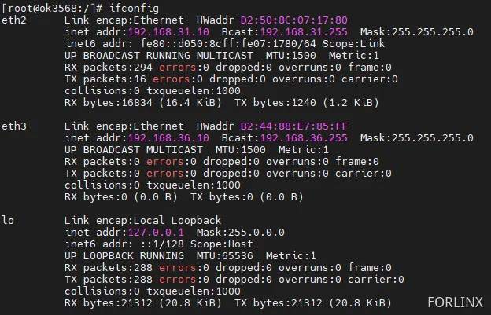
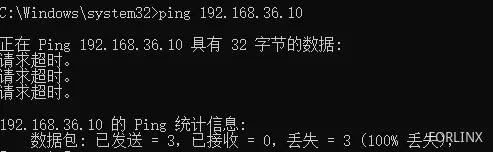
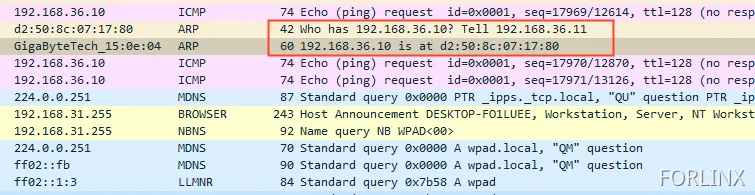

# OK3568 4.19.206 Buildroot Issue of Incorrect MAC Address Reply When PC Pings Device

Document classification: □ Top secret □ Secret □ Internal information ■ Open    

## Copyright

The copyright of this manual belongs to Baoding Folinx Embedded Technology Co., Ltd. Without the written permission of our company, no organizations or individuals have the right to copy, distribute, or reproduce any part of this manual in any form, and violators will be held legally responsible.   
Forlinx adheres to copyrights of all graphics and texts used in all publications in original or license-free forms.  
The drivers and utilities used for the components are subject to the copyrights of the respective manufacturers. The license conditions of the respective manufacturer are to be adhered to. Related license expenses for the operating system and applications should be calculated/declared separately by the related party or its representatives.

## Revision History

| Date| Version| Revision History|
|----------|----------|----------|
| 12/24/2024| V1.0| Initial Version|

## Issue of Incorrect MAC Address Reply When PC Pings Device

Solve the problem of incorrect Mac address reply when pinging devices from a computer.

**Problem**

1\. IP Configuration for PC and Board

PC side configures multiple IPs: 192.168.31.11 and 192.168.36.11


Device side IP configuration:

eth2 : 192.168.31.10

eth3 : 192.168.36.10



2\. Connection Setup Problem

A local network is created using a router, with the PC connected and one network port of the device connected. For example, eth2 is connected to the local network, while eth3 is not.

Use the PC to ping eth3, which is not connected to the local network.



**Issues Encountered**

Normally, if the ARP cache does not store the MAC and IP mapping, a broadcast message is sent to locate the device with that IP, and the device responds with its MAC address. However, when the PC pings the IP 192.168.36.10, the MAC address captured in the response is that of eth2, which is connected to the local network.



After using ifconfig eth2 -arp to disable ARP forwarding on eth2, pinging 192.168.36.10 again revealed that the incorrect MAC address was no longer being responded to in the captured packets. However, eth2 became unpingable, making this method impractical.

**Solution:**

Then look at what the values in the/proc/sys/net/IPv4/conf/eth2/ARP \_ ignore file mean.

0：Default behavior. The interface responds to all ARP requests, regardless of whether the target IP address is within the interface’s network;

1: Responds only to ARP requests where the target IP address is within the network range of the interface;

2: Responds when the target IP address is the address of this interface, but only under the condition that the target IP address is directly connected;

3: Responds to ARP requests when the target address is the address of the interface and the address belongs to the network of that interface;

Use the cat command in the command line to check the current value of this file:

```plain
[root@ok3568:/]# cat /proc/sys/net/ipv4/conf/eth2/arp_ignore
0
```

Change this value to 1, and then follow the aforementioned method to perform the operation. After that, it is found that there are no incorrect MAC address responses anymore.

```plain
[root@ok3568:/]# echo 1 >  /proc/sys/net/ipv4/conf/eth2/arp_ignore
[root@ok3568:/]# cat /proc/sys/net/ipv4/conf/eth2/arp_ignore
1
```

