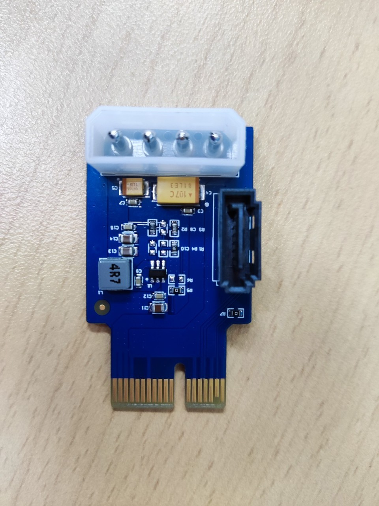
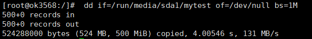

# OK3568 4.19.206 Buildroot PCIe to SATA Function Modification Method

Document classification: □ Top secret □ Secret □ Internal information ■ Open

## Copyright

The copyright of this manual belongs to Baoding Folinx Embedded Technology Co., Ltd. Without the written permission of our company, no organizations or individuals have the right to copy, distribute, or reproduce any part of this manual in any form, and violators will be held legally responsible.

Forlinx adheres to copyrights of all graphics and texts used in all publications in original or license-free forms.

The drivers and utilities used for the components are subject to the copyrights of the respective manufacturers. The license conditions of the respective manufacturer are to be adhered to. Related license expenses for the operating system and applications should be calculated/declared separately by the related party or its representatives.

## Revision History

| Date| Version| Revision History|
|:----------:|:----------:|----------|
| 04/08/2022 | V1.0| Initial Version|

## Method to Modify PCIe to SATA Function

### Hardware Requirements

FIT-PCIE-SATA V1.0 adapter board (converts PCIe 2.0 interface to dual SATA 2.0 ports)

### Software Configuration

**Modify Device Tree**

**OK3568-linux-source/kernel/arch/arm64/boot/dts/rockchip/OK3568-C-common.dtsi**

**Note: Red text indicates fields to be modified or manually added**

Turn off pcie 2.0 function and add SATA function description

\&pcie2x1 {

    reset-gpios = <&gpio0 RK_PB6 GPIO_ACTIVE_HIGH>;
    
    vpcie3v3-supply = <&vcc3v3_sys>;
    
    status = "disabled";

};

\&sata2 {

	status = "okay";

	assigned-clock-rates = \<24000000>;

};

Modify the default configuration file**

**/OK3568-linux-source/kernel/arch/arm64/configs/OK3568-C-linux\_defconfig**

**Add the followings:**

CONFIG\_ATA=y 

CONFIG\_SATA\_AHCI=y 

CONFIG\_SATA\_AHCI\_PLATFORM=y 

CONFIG\_PHY\_ROCKCHIP\_NANENG\_COMBO\_PHY=y

**Execute the./build. sh kernel in the/OK3568-linux-source directory.**

Separately flash /OK3568-linux-source/kernel/boot.img

## Test

Write data:

Read data:

