## OK3568 4.19.206 Buildroot Qt-creator Remote Debug

## Copyright                                                                                                    

Document classification: □ Top secret □ Secret □ Internal information ■ Open

The copyright of this manual belongs to Baoding Folinx Embedded Technology Co., Ltd. Without the written permission of our company, no organizations or individuals have the right to copy, distribute, or reproduce any part of this manual in any form, and violators will be held legally responsible.   
Forlinx adheres to copyrights of all graphics and texts used in all publications in original or license-free forms.  
The drivers and utilities used for the components are subject to the copyrights of the respective manufacturers. The license conditions of the respective manufacturer are to be adhered to. Related license expenses for the operating system and applications should be calculated/declared separately by the related party or its representatives.

## Revision History

| Date| Version| Revision History|
|:----------:|:----------:|----------|
| 15/09/2023| V1.0| Initial Version|

## Qt-creator Remote Debug

**Note: Set the virtual machine IP address and the development board IP address in the same network segment.**

**Virtual machine IP: 172.16.0.174**

**Development board IP: 172.16.0.169**

Install debugging software in Ubuntu virtual machine.

```c
sudo apt-get install gdb-multiarch
```

Modify the source code file.

/OK3568-linux-source/buildroot/output/OK3568/host/mkspecs/devices/linux-buildroot-g++/qmake.conf

Just comment out the variables as follows:

#QMAKE\_CFLAGS\_OPTIMIZE       =

#QMAKE\_CFLAGS\_OPTIMIZE\_DEBUG =

#QMAKE\_CFLAGS\_OPTIMIZE\_FULL  =

#QMAKE\_CFLAGS\_OPTIMIZE\_SIZE  =

#QMAKE\_CFLAGS\_DEBUG =

#QMAKE\_CXXFLAGS\_DEBUG =

#QMAKE\_CFLAGS\_RELEASE =

#QMAKE\_CXXFLAGS\_RELEASE =

Set development board ssh password.

Passwd: root

Enter the password "root" twice.

Add qmake.

Tools->options->Kits->Compilers->Add（<font style="color:#FF0000;">The red path is configured according to the customer path</font>）

<font style="color:#FF0000;">/home/forlinx/linux-3568</font>/OK3568-linux-source/buildroot/output/OK3568/host/bin/qmake

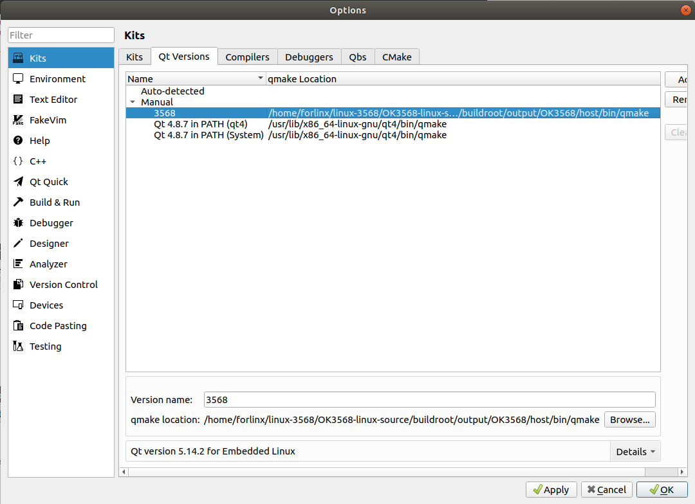

Add gcc.

Tools->options->Kits->Compilers->Add（<font style="color:#FF0000;">The red path is configured according to the customer path</font>）

<font style="color:#FF0000;">/home/forlinx/linux-3568/</font>OK3568-linux-source/buildroot/output/OK3568/host/bin/aarch64-linux-gcc

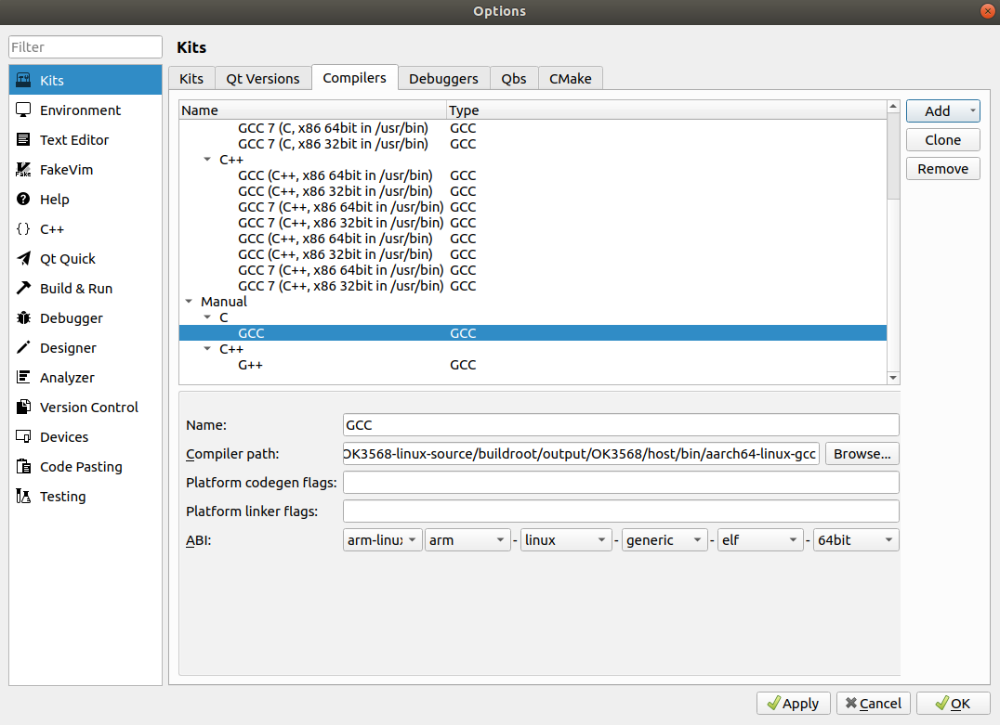

Add g++.

Tools->options->Kits->Compilers->Add（<font style="color:#FF0000;">The red path is configured according to the customer path</font>）

<font style="color:#FF0000;">/home/forlinx/linux-3568</font>/OK3568-linux-source/buildroot/output/OK3568/host/bin/aarch64-linux-g++

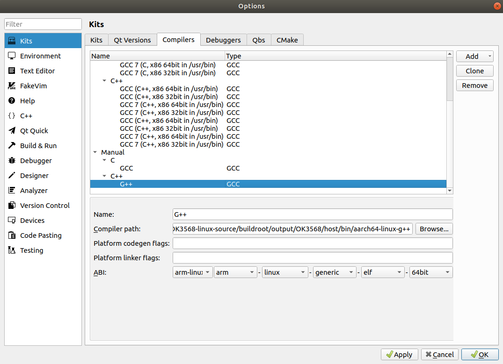

Add the gdb tool.

Tools->options->Kits->Debuggers->Add

Name: 3568

Path:/usr/bin/gdb-multiarch

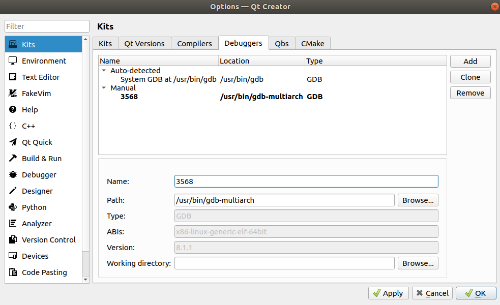

Configure devices.


Configure complete test. 

<font style="color:#FF0000;">Note: To configure the development board and the computer virtual machine to be on the same network segment.</font>

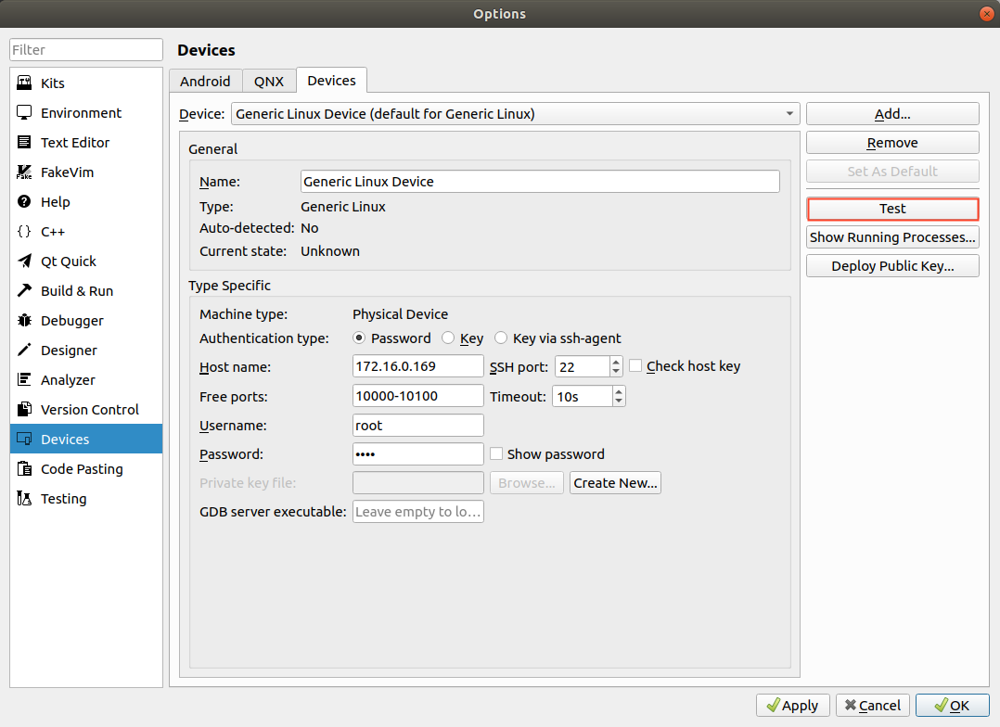

Host name: Development board IP address

SSH port：22

Username：root

Password：root

Then click “Test” to test the ssh communication.

The diagram indicates a successful connection.

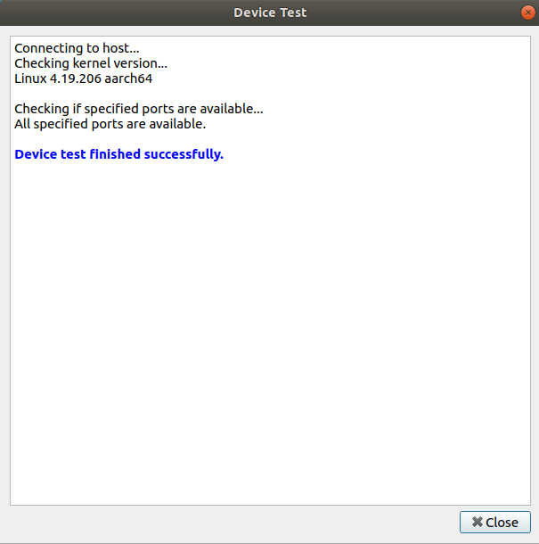

Configure the Kit Suite.

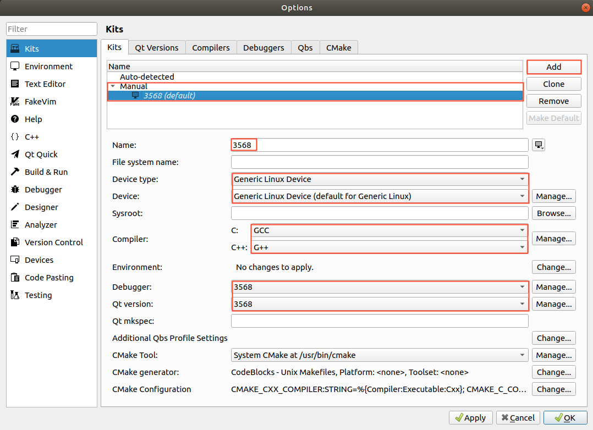

Select the previously configured Kit Suite 3568 for the project code.

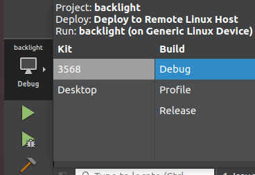

Specify the installation directory for the program on the development board: target.path = /home/forlinx


After configuration, the executable files can run on the development board.

Click the Run button:


The development board displays the following:

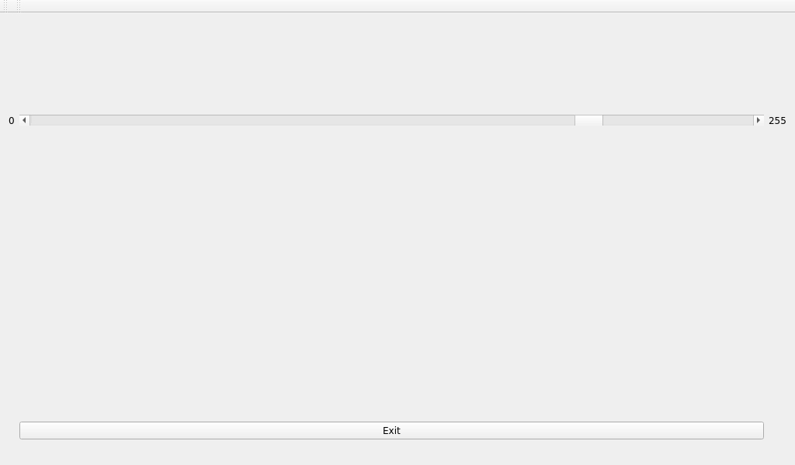

To enable remote debugging of the development board application, proceed with the following settings:

Remote Debugging the Application.

Close the application that was just launched on the development board.

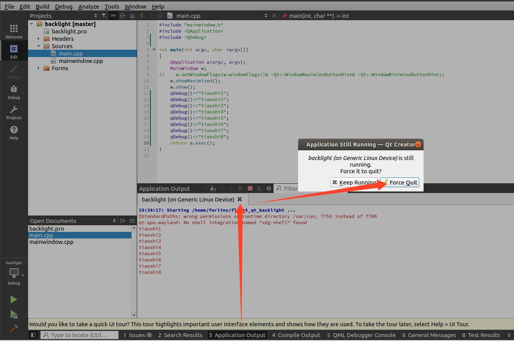

Enter the following command on the development board to enter listening mode:

\[root@ok3568:/home/forlinx]# <font style="color:#FF0000;">gdbserver 172.16.0.169:2345 ./fltest\_qt\_backlight</font>

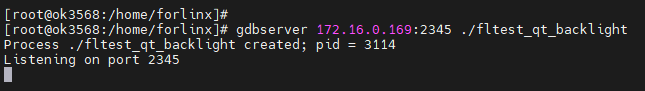

On the virtual machine:

Debug->Start Debugging->Attach to Running Debug Server...

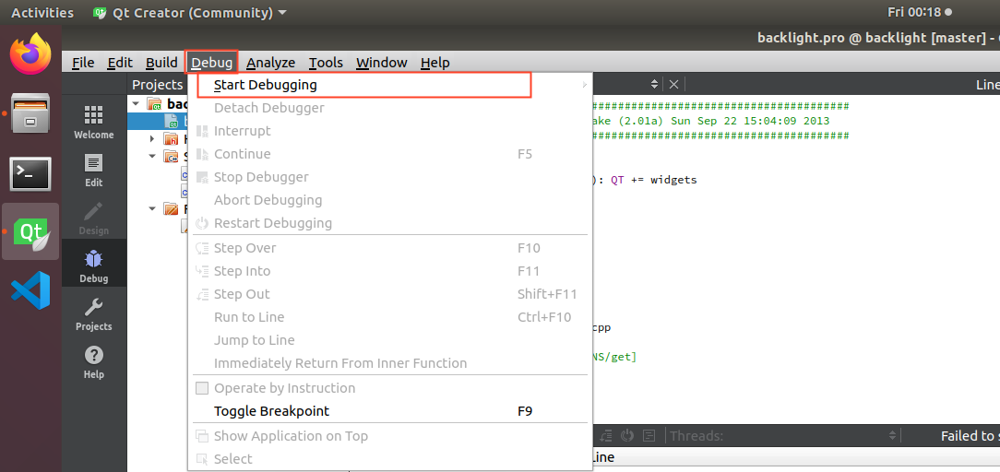

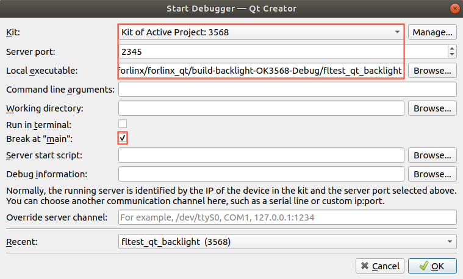

Connect to the development board service to enter debug mode.

Breakpoint Debugging Example:

Set a breakpoint in the application, then click the Step Over button repeatedly.

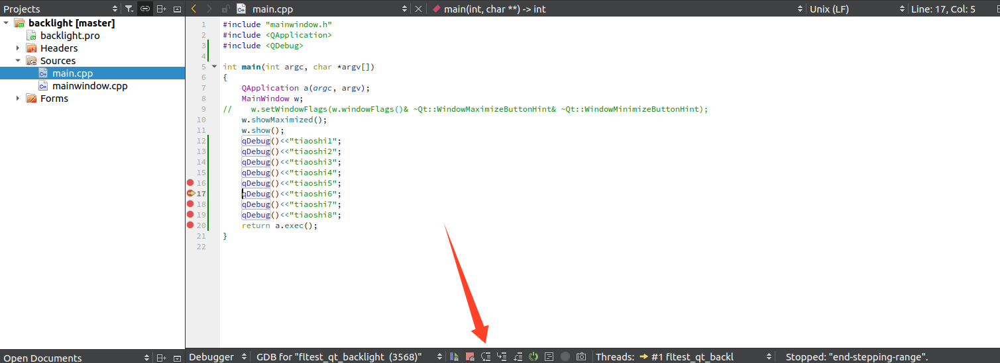

The development board will output breakpoint debugging information.

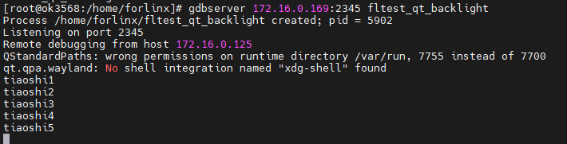