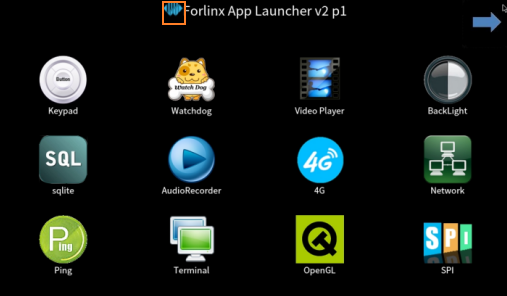

# OK3568 4.19.206 Buildroot Removing Desktop Forlinx Icon

Document classification: □ Top secret □ Secret □ Internal information ■ Open

## Copyright

The copyright of this manual belongs to Baoding Folinx Embedded Technology Co., Ltd. Without the written permission of our company, no organizations or individuals have the right to copy, distribute, or reproduce any part of this manual in any form, and violators will be held legally responsible.   
Forlinx adheres to copyrights of all graphics and texts used in all publications in original or license-free forms.  
The drivers and utilities used for the components are subject to the copyrights of the respective manufacturers. The license conditions of the respective manufacturer are to be adhered to. Related license expenses for the operating system and applications should be calculated/declared separately by the related party or its representatives.

## Revision History

| Date| Version| Revision History|
|:----------:|:----------:|----------|
| 04/08/2022| V1.0| Initial Version|

## Removing Desktop Forlinx Icon

/OK3568-linux-source/buildroot/board/rockchip/ok3568/fs-overlay/usr/share/matrix-gui-2.0/menubar.php

Commnet out//echo "";

Then re-compile the source code of the./build. sh, which will take effect permanently.