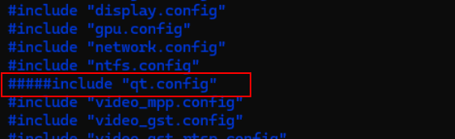
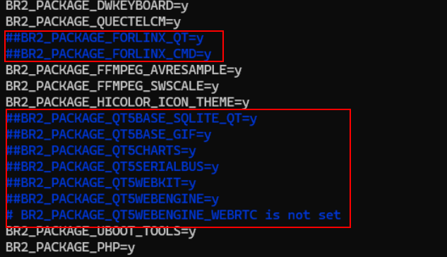

# OK3568 4.19.206 Buildroot Tailoring and Removal of QT-Related Elements in File System

**Note: After the full compilation of the source code is complete, take a virtual machine snapshot to prevent subsequent operations from causing compilation failures.**

1\. Delete the following content from the filesystem configuration file Ok3568\_defconfig:

```plain
BR2_PACKAGE_FORLINX_QT=y       // Forlinx Qt test demo  
BR2_PACKAGE_FORLINX_CMD=y      // Forlinx command-line test demo  
BR2_PACKAGE_QT5*=y             // Qt-related library support  
#include "qt.config"            // Qt-related library support
```

Operation command:

```plain
forlinx@DESKTOP-ARR08M4:~/3568.4.19/OK3568-linux-source$ cd buildroot/configs/
forlinx@DESKTOP-ARR08M4:~/3568.4.19/OK3568-linux-source/buildroot/configs$ vi OK3568_defconfig
```

Delete the following content.






2\. Delete the stamp file, otherwise modifications to OK3568\_defconfig will not take effect.

```plain
forlinx@DESKTOP-ARR08M4:~/3568.4.19/OK3568-linux-source/buildroot/output/OK3568/build$ rm -rf ./*/.stamp_target_installed
```

3\. Delete the existing filesystem.

```plain
forlinx@DESKTOP-ARR08M4:~/3568.4.19/OK3568-linux-source/buildroot/output/OK3568/build$ cd ..
forlinx@DESKTOP-ARR08M4:~/3568.4.19/OK3568-linux-source/buildroot/output/OK3568$ rm -rf target/
```

4\. Regenerate the filesystem.

```plain
forlinx@DESKTOP-ARR08M4:~/3568.4.19/OK3568-linux-source$ ./build.sh  buildroot
```

The newly generated filesystem will be located in the path:

OK3568-linux-source/buildroot/output/OK3568/images/

```plain
forlinx@DESKTOP-ARR08M4:~/3568.4.19/OK3568-linux-source/buildroot/output/OK3568/images$ pwd
/home/forlinx/3568.4.19/OK3568-linux-source/buildroot/output/OK3568/images		//The location is
forlinx@DESKTOP-ARR08M4:~/3568.4.19/OK3568-linux-source/buildroot/output/OK3568/images$ ls
rootfs.cpio  rootfs.cpio.gz  rootfs.ext2  rootfs.ext4  rootfs.squashfs  rootfs.tar
```

Flash the newly generated rootfs.ext2 using the single-step flashing method.

If you need to generate a new firmware update.img, execute the following command in the OK3568-linux-source/ directory: build.sh. is OK. The update.img file will be generated in the OK3568-linux-source/rockdev/ directory.

Tip: For other unnecessary features, follow this operation method to cancel the compilation configuration.