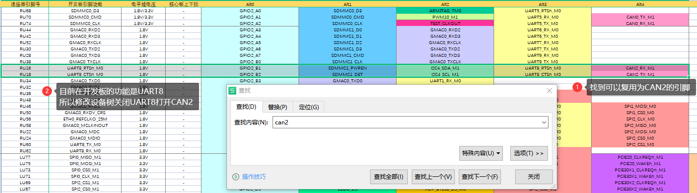
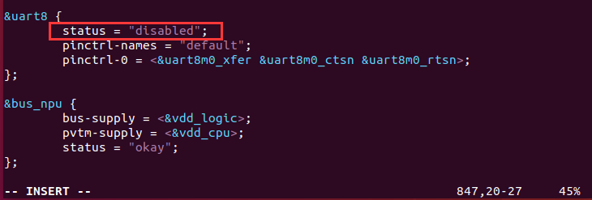

# OK3568 4.19.206 Buildroot UART8 Multiplexed as CAN2

Document classification: □ Top secret □ Secret □ Internal information ■ Open

## Copyright

The copyright of this manual belongs to Baoding Folinx Embedded Technology Co., Ltd. Without the written permission of our company, no organizations or individuals have the right to copy, distribute, or reproduce any part of this manual in any form, and violators will be held legally responsible.   
Forlinx adheres to copyrights of all graphics and texts used in all publications in original or license-free forms.  
The drivers and utilities used for the components are subject to the copyrights of the respective manufacturers. The license conditions of the respective manufacturer are to be adhered to. Related license expenses for the operating system and applications should be calculated/declared separately by the related party or its representatives.

## Revision History

| Date| Version| Revision History|
|:----------:|:----------:|----------|
| 04/08/2022| V1.0| Initial Version|

## UART8 Multiplexed as CAN2

**Note: When UART8 is multiplexed as CAN2, Bluetooth functionality will be unavailable.**

Refer to the OK3568 hardware documentation/user manual, specifically the “FET3568-C Pin Multiplexing Reference Table,” to identify:

Modify the device tree.

OK3568-linux-source/kernel/arch/arm64/boot/dts/rockchip/OK3568-C-common.dtsi

Modify status = “okay” in \&can2.

Modify status=”disabled” in \&uart8.

After modifications are completed, return to the OK3568-linux-source directory and execute ./build.sh kernel. Once the compilation is finished, only flash the following boot image file:

OK3568-linux-source/kernel/boot.img

At this point, the software modifications are complete. For hardware connections, please refer to our company’s hardware design documentation. If successful, the CAN2 interface will appear in the terminal output when using the ifconfig command.