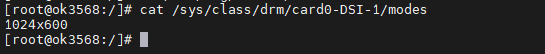
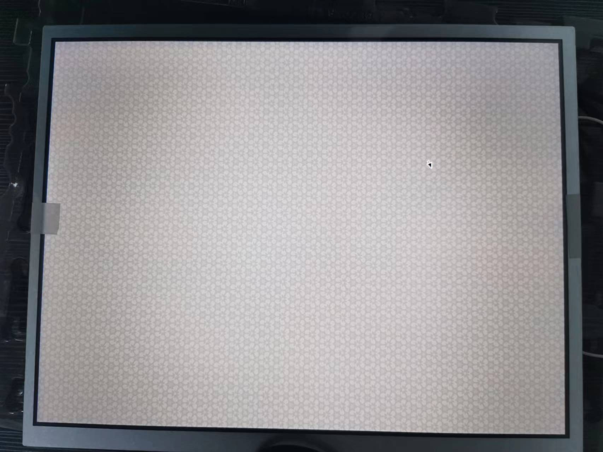

# OK3568 4.19.206 Buildroot  Weston Desktop Reference Link

Document classification: □ Top secret □ Secret □ Internal information ■ Open

## Copyright  

The copyright of this manual belongs to Baoding Folinx Embedded Technology Co., Ltd. Without the written permission of our company, no organizations or individuals have the right to copy, distribute, or reproduce any part of this manual in any form, and violators will be held legally responsible.   
Forlinx adheres to copyrights of all graphics and texts used in all publications in original or license-free forms.  
The drivers and utilities used for the components are subject to the copyrights of the respective manufacturers. The license conditions of the respective manufacturer are to be adhered to. Related license expenses for the operating system and applications should be calculated/declared separately by the related party or its representatives.

## Revision History

| **Date**| **Version**| **Revision History**|
|:----------:|:----------:|----------|
| 04/08/2022| V1.0| Initial Version|

# Weston Desktop Reference Link

[https://www.mankier.com/5/weston.ini#Output\_Section](https://www.mankier.com/5/weston.ini#Output_Section)

1. View Display Devices

Enter the command ls /sys/class/drm. Taking MIPI display as an example.

2. Adjust Screen Orientation

Modify the file /etc/xdg/weston/weston.ini:

\[output]

name=DSI-1       // Corresponds to the list above, remove "card0"

transform=0/90/180/270 //Rotation angle

Note: For SDK versions with Linux kernel 5.10 and above, use transform = rotate-90 / rotate-180 / rotate-270.

3. Supported Resolutions

View the supported resolutions for the display adapter, using MIPI display as an example.

4. Configure Resolution

\[output]

name=DSI-1       // Corresponds to the list above, remove "card0"

mode=1024x600    // Must be a valid resolution supported by the screen

scale=2          // Must be an integer multiple

5. Remove Grid Background

\[shell]

panel-position=none        // Remove the panel toolbar

background-color=0x00FFFFFF   // Set background to fully transparent