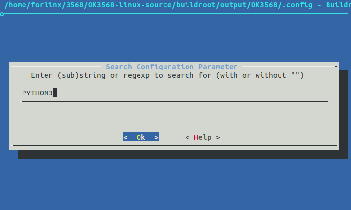
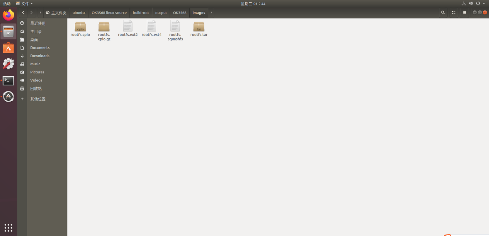

# OK3568 4.19.206 Library Porting

Document classification: □ Top secret □ Secret □ Internal information ■ Open  

## Copyright

The copyright of this manual belongs to Baoding Folinx Embedded Technology Co., Ltd. Without the written permission of our company, no organizations or individuals have the right to copy, distribute, or reproduce any part of this manual in any form, and violators will be held legally responsible.   
Forlinx adheres to copyrights of all graphics and texts used in all publications in original or license-free forms.  
The drivers and utilities used for the components are subject to the copyrights of the respective manufacturers. The license conditions of the respective manufacturer are to be adhered to. Related license expenses for the operating system and applications should be calculated/declared separately by the related party or its representatives.

## Revision History

| Date| Version| Revision History|
|:----------:|:----------:|----------|
| 04/08/2022| V1.0| Initial Version|

## Library Porting

This article primarily applies to the Forlinx OKT3568-C platform running Linux 4.19.206. Other platforms may also be used as a reference, but differences between platforms exist, and please make modifications accordingly to suit your own applications.

1\. Switch to the path OK3568-linux-source/buildroot/output/OK3568/ and execute the make menuconfig command.

2\. Press the “/” key to open the search box, and use keywords to search for relevant library files. Taking the addition of PYTHON3 as an example:

3\. According to the search results, select items 1 to 3 to jump to the corresponding configuration options. Use the ↑ and ↓ keys to navigate through pages.

Use the “Y” key to select an item, or use the “Space” key to toggle the selection state.

You can choose whether to install the library completely. Select based on your requirements.

4\. Keep selecting “Exit” until you exit the graphical interface. When prompted to save the configuration, select “yes”.

5\. Recompile Buildroot: Execute the following command in the OK3568-linux-source directory:

./build.sh buildroot.

6\. When prompted whether to overwrite the old .config configuration file, enter n.

7\. Flash the newly generated rootfs.ext2 image from OK3568-linux-source/buildroot/output/OK3568/images to the development board. Note: The fully compiled rootfs.img is actually generated by renaming the rootfs.ext2 file, so flashing with rootfs.ext2 has the same effect.

8\. First, click on the device partition table, then select rootfs.ext2, and click “Execute Flash”.

