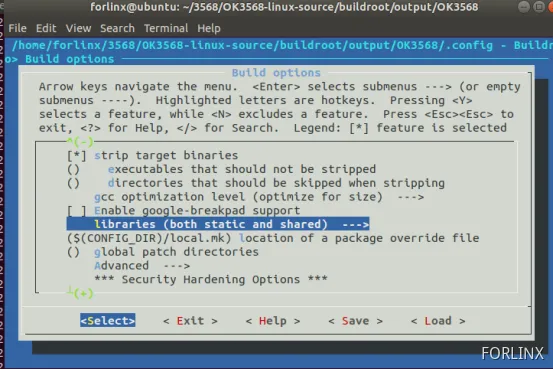
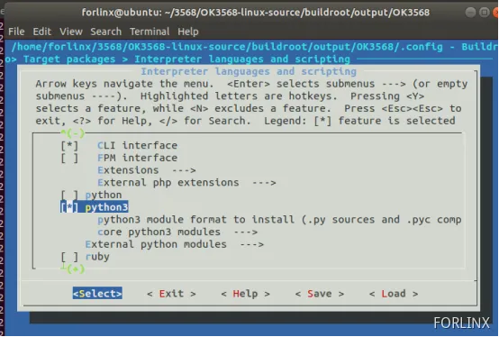
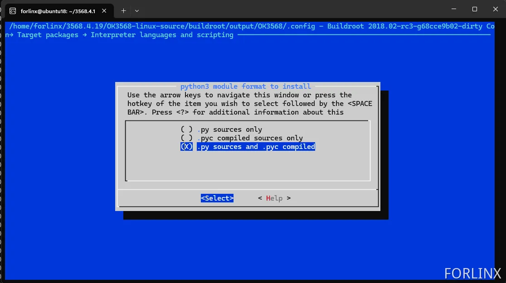
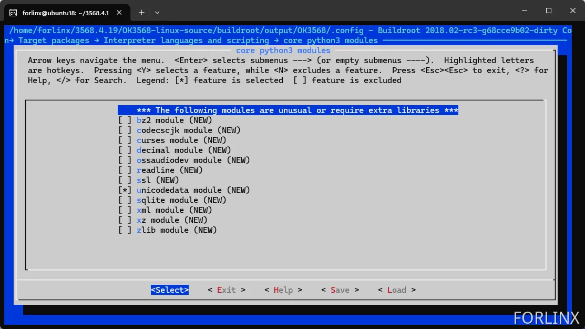
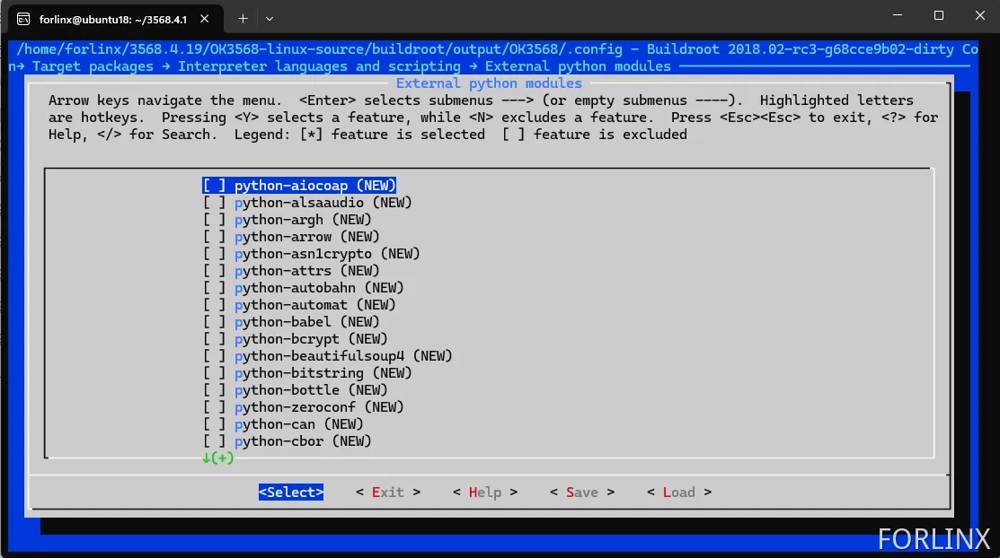

# OK3568 4.19.206 Python3 Installation

Document classification: □ Top secret □ Secret □ Internal information ■ Open 

## Copyright

The copyright of this manual belongs to Baoding Folinx Embedded Technology Co., Ltd. Without the written permission of our company, no organizations or individuals have the right to copy, distribute, or reproduce any part of this manual in any form, and violators will be held legally responsible.   
Forlinx adheres to copyrights of all graphics and texts used in all publications in original or license-free forms.  
The drivers and utilities used for the components are subject to the copyrights of the respective manufacturers. The license conditions of the respective manufacturer are to be adhered to. Related license expenses for the operating system and applications should be calculated/declared separately by the related party or its representatives.

## Revision History

| **Date**| **Version**| **Revision History**|
|----------|----------|----------|
| 01/23/2025| V1.0| Initial Version |

## Python3 Installation

<font style="color:rgb(0,0,0);">Execute the make menuconfig command under the path OK3568-linux-source/buildroot/output/OK3568/.</font>

```plain
forlinx@ubuntu18:~/3568.4.19/OK3568-linux-source/buildroot/output/OK3568$ make menuconfig
```

<font style="color:rgb(0,0,0);">Turn on support for wide characters:Target packages-->Libraries-->Text and terminal-->handing-->ncurses</font>


<font style="color:rgb(0,0,0);">Provide dynamic libraries: -->Build options</font>



Enable python support: Target packages --> Interpreter languages and scripting



Python3 module format to install options.



2\. core python3 modules are Python libraries, which can be added as needed.



External python3 modules are external libraries, which can also be added as needed.



Then re - compile the file system and perform single - step flashing.

**Note: When configuring Python library support again after compiling and generating the file system, sometimes the added libraries may not take effect. In this case, you can choose to execute the command to regenerate the packages.**