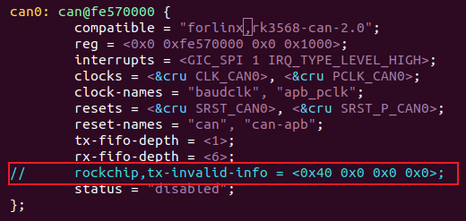

# OK3568 4.19.206 Self-Reception Scheme in the Native CAN Driver

Document classification: □ Top secret □ Secret □ Internal information ■ Open                                                                                                              

## Copyright 

The copyright of this manual belongs to Baoding Folinx Embedded Technology Co., Ltd. Without the written permission of our company, no organizations or individuals have the right to copy, distribute, or reproduce any part of this manual in any form, and violators will be held legally responsible.   
Forlinx adheres to copyrights of all graphics and texts used in all publications in original or license-free forms.  
The drivers and utilities used for the components are subject to the copyrights of the respective manufacturers. The license conditions of the respective manufacturer are to be adhered to. Related license expenses for the operating system and applications should be calculated/declared separately by the related party or its representatives.  

## Revision History

| Date| Version| Revision History|
|:----------:|:----------:|----------|
| 04/08/2022| V1.0| Initial Version|

## Self-Reception Scheme in the Native CAN Driver

Modify the kernel/arch/arm64/boot/dts/rockchip/rk3568.dtsi file, comment out the following figure, and cancel the configuration of the workround frame. After modification, the TXtoRX of the CAN will be opened automatically. When the original CAN sends the extended frame data, It will take back the data sent by itself for verification. If the verification is not an extended frame, it will send a new frame.

Note: This scheme may trigger an infinite retransmission mechanism when the extended part of the ID contains zeros (e.g., specific IDs with zero extensions). Use with caution.

