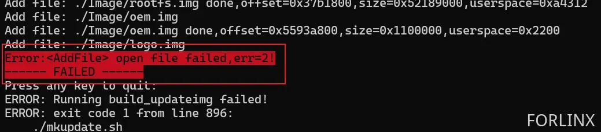
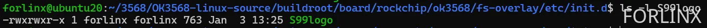
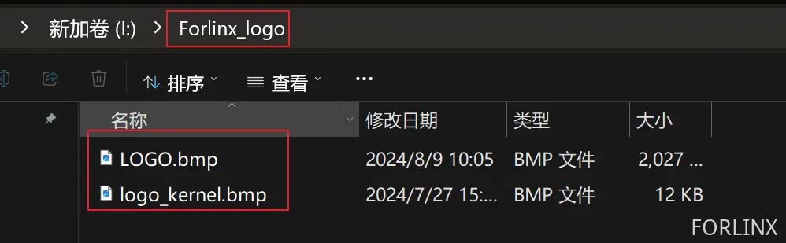

# OK3568 4.19.206 User Layer Logo Replacement

Document classification: □ Top secret □ Secret □ Internal information ■ Open                                                                                                              

## Copyright 

The copyright of this manual belongs to Baoding Folinx Embedded Technology Co., Ltd. Without the written permission of our company, no organizations or individuals have the right to copy, distribute, or reproduce any part of this manual in any form, and violators will be held legally responsible.   
Forlinx adheres to copyrights of all graphics and texts used in all publications in original or license-free forms.  
The drivers and utilities used for the components are subject to the copyrights of the respective manufacturers. The license conditions of the respective manufacturer are to be adhered to. Related license expenses for the operating system and applications should be calculated/declared separately by the related party or its representatives.  

## Revision History

| Date| Version| Revision History|
|----------|----------|----------|
| 01/03/2025| V1.0| Initial Version|

## User Layer Logo Replacement

The source code is modified here and described in the format of a patch. A boot partition is added to the image and created an auto-start script upon boot. The script will detect whether there is a logo image in the U disk, if there is a logo, it will read the logo image and generate a logo. img image, and then use the dd command to flash the image to the logo partition of the development board.

**Modification Method**

The test found that some users’ materials do not have the “logo/logo\_normal” folder under the path OK3568-linux-source/device/rockchip/, causing the full compilation to fail after modification with the following error:



Solution: Manually create an empty folder, with the effect as follows:


1. Modifications Made in the Virtual Machine Source Code

Create the logo partition at the following path: /dev/block/by-name/logo

```plain
diff --git a/buildroot/board/rockchip/ok3568/fs-overlay-recovery/etc/fstab b/buildroot/board/rockchip/ok3568/fs-overlay-recovery/etc/fstab
index bb97eaf92..b5e92e026 100644
--- a/buildroot/board/rockchip/ok3568/fs-overlay-recovery/etc/fstab
+++ b/buildroot/board/rockchip/ok3568/fs-overlay-recovery/etc/fstab
@@ -9,5 +9,6 @@ sysfs           /sys            sysfs   defaults        0       0
 /dev/block/by-name/misc        /misc           emmc    defaults        0       0
 /dev/block/by-name/userdata    /userdata               ext2    defaults        0       0
 /dev/block/by-name/oem /oem            ext2    defaults        0       0
+/dev/block/by-name/logo        /mnt/logo       ext2    defaults        0       2
 /dev/sda1      /mnt/usb_storage                vfat    defaults        0       0
 /dev/mmcblk1p1 /mnt/sdcard             vfat    defaults        0       0
```

2. Modify the following script: /device/rockchip/common/mkfirmware.sh

```plain
diff --git a/device/rockchip/common/mkfirmware.sh b/device/rockchip/common/mkfirmware.sh
index cc07d7a1b..5a1328a12 100755
--- a/device/rockchip/common/mkfirmware.sh
+++ b/device/rockchip/common/mkfirmware.sh
@@ -4,8 +4,11 @@ set -e

 SCRIPT_DIR=$(dirname $(realpath $BASH_SOURCE))
 TOP_DIR=$(realpath $SCRIPT_DIR/../../..)
+LOGO_DIR=$TOP_DIR/device/rockchip/logo/$RK_LOGO_DIR
 cd $TOP_DIR

+
+
 function unset_board_config_all()
 {
        local tmp_file=`mktemp`
@@ -268,6 +271,27 @@ then
        fi
 fi

+LOGO_FAKEROOT_SCRIPT=$ROCKDEV/logo.fs
+if [ $RK_LOGO_DIR ]
+then
+       if [ -d "$LOGO_DIR" ]
+       then
+               echo "#!/bin/sh" > $LOGO_FAKEROOT_SCRIPT
+               echo "set -e" >> $LOGO_FAKEROOT_SCRIPT
+               if [ "$RK_LOGO_FS_TYPE" = "ubi" ]; then
+                       echo "$MKIMAGE $LOGO_DIR $ROCKDEV/logo.img $RK_LOGO_FS_TYPE $RK_LOGO_PARTITION_SIZE logo $RK_UBI_PAGE_SIZE $RK_UBI_BLOCK_SIZE" >> $LOGO_FAKEROOT_SCRIPT
+               else
+                       echo "$MKIMAGE $LOGO_DIR $ROCKDEV/logo.img $RK_LOGO_FS_TYPE " >> $LOGO_FAKEROOT_SCRIPT
+               fi
+               chmod a+x $LOGO_FAKEROOT_SCRIPT
+               $FAKEROOT_TOOL -- $LOGO_FAKEROOT_SCRIPT
+               rm -f $LOGO_FAKEROOT_SCRIPT
+       else
+               echo "warning: $LOGO_DIR not found!"
+       fi
+fi
+
+
 if [ -f $UBOOT_IMG ]
 then
         echo -n "create uboot.img..."
```

Add configuration in the following file: device/rockchip/ok3568/BoardConfig-ok3568.mk

```plain
diff --git a/device/rockchip/ok3568/BoardConfig-ok3568.mk b/device/rockchip/ok3568/BoardConfig-ok3568.mk
index 74c2fff2d..202efa5ff 100644
--- a/device/rockchip/ok3568/BoardConfig-ok3568.mk
+++ b/device/rockchip/ok3568/BoardConfig-ok3568.mk
@@ -46,12 +46,17 @@ export RK_RAMBOOT_TYPE=
 export RK_OEM_FS_TYPE=ext2
 # Set userdata partition type, including ext2, fat
 export RK_USERDATA_FS_TYPE=ext2
+# Set logo partition type, including ext2, fat
+export RK_LOGO_FS_TYPE=ext2
 #OEM config
 export RK_OEM_DIR=oem_normal
 # OEM build on buildroot
 #export RK_OEM_BUILDIN_BUILDROOT=YES
 #userdata config
 export RK_USERDATA_DIR=userdata_normal
+#logo config
+export RK_LOGO_DIR=logo_normal
+export RK_LOGO_PARTITION_SIZE=0x0000a000
 #misc image
 export RK_MISC=wipe_all-misc.img
 #choose enable distro module
```

Modify the eMMC partition table by adding a new 20MB logo partition before the userdata partition. Calculations:

Logo partition size: 0x0000a000

Start position: Continues from the OEM partition, so it remains 0x00c78000.

0x00c78000 + 0x0000a000 = 0x00c82000

0x00c7800+0x0000a000=0x00c82000。 Therefore, modify the userdata partition start address to 0x00c82000.

Modify the partition table based on your actual situation. Refer to the operation method here:

[https://forlinx-book.yuque.com/rh74yu/ok3568/svsnukl7by8orgkr](https://forlinx-book.yuque.com/rh74yu/ok3568/svsnukl7by8orgkr)

```plain
diff --git a/device/rockchip/ok3568/parameter-buildroot-fit.txt b/device/rockchip/ok3568/parameter-buildroot-fit.txt
index 17d6da32b..3c5f175d9 100644
--- a/device/rockchip/ok3568/parameter-buildroot-fit.txt
+++ b/device/rockchip/ok3568/parameter-buildroot-fit.txt
@@ -8,5 +8,5 @@ MACHINE: 0xffffffff
 CHECK_MASK: 0x80
 PWR_HLD: 0,0,A,0,1
 TYPE: GPT
-CMDLINE: mtdparts=rk29xxnand:0x00002000@0x00004000(uboot),0x00002000@0x00006000(misc),0x00010000@0x00008000(boot),0x00010000@0x00018000(recovery),0x00010000@0x00028000(backup),0x00c00000@0x00038000(rootfs),0x00040000@0x00c38000(oem),-@0x00c78000(userdata:grow)
+CMDLINE: mtdparts=rk29xxnand:0x00002000@0x00004000(uboot),0x00002000@0x00006000(misc),0x00010000@0x00008000(boot),0x00010000@0x00018000(recovery),0x00010000@0x00028000(backup),0x00c00000@0x00038000(rootfs),0x00040000@0x00c38000(oem),0x0000a000@0x00c78000(logo),-@0x00c82000(userdata:grow)
 uuid:rootfs=614e0000-0000-4b53-8000-1d28000054a9
```

Add logo image reference: tools/linux/Linux\_Pack\_Firmware/rockdev/rk356x-package-file

```plain
diff --git a/tools/linux/Linux_Pack_Firmware/rockdev/rk356x-package-file b/tools/linux/Linux_Pack_Firmware/rockdev/rk356x-package-file
index 4cad31ed5..dfaa54157 100644
--- a/tools/linux/Linux_Pack_Firmware/rockdev/rk356x-package-file
+++ b/tools/linux/Linux_Pack_Firmware/rockdev/rk356x-package-file
@@ -13,6 +13,7 @@ boot          Image/boot.img
 recovery       Image/recovery.img
 rootfs         Image/rootfs.img
 oem            Image/oem.img
+logo           Image/logo.img
 userdata       Image/userdata.img
```

3. Create an Auto-Start Script

Create a new script file: buildroot/board/rockchip/ok3568/fs-overlay/etc/init.d/S99logo

Add the followings:

```plain
#!/bin/sh

check_sdcard() {
while true; do
sleep 1
if [[ -d "/run/media/sda1/Forlinx_logo" ]]; then
cd "/run/media/sda1/Forlinx_logo"
if [[ -f "Forlinx_logo_flag" ]]; then
echo "Forlinx_logo_flag file. Exiting."
break
else
if [[ -f "/run/media/sda1/Forlinx_logo/logo.bmp" && -f "/run/media/sda1/Forlinx_logo/logo_kernel.bmp" ]]; then
cat "logo.bmp" > "logo.img"
truncate -s %512 "logo.img"
cat "logo_kernel.bmp" >> "logo.img"
dd if="logo.img" of="/dev/block/by-name/logo"
echo "Logo files copied and written to /dev/block/by-name/logo."
touch "Forlinx_logo_flag"
break;
else
echo "Missing logo.bmp or logo_kernel.bmp files."
fi
fi
fi
done
}


case "$1" in
        start)
                check_sdcard &
        ;;
        *)
                exit 1
        ;;
esac
```

Grant executable permissions:

```plain
forlinx@ubuntu20:~/3568/OK3568-linux-source/buildroot/board/rockchip/ok3568/fs-overlay/etc/init.d$ chmod 775 S99logo
```



After completing the modifications, perform a full compilation and re-flash.

4. Verification

Prepare BMP format image files. Both images must be less than 20MB.

Logo for the U-Boot stage: logo.bmp

Logo for the kernel stage: logo\_kernel.bmp

Create a Forlinx\_logo folder on a USB drive and place the logo files inside.



Insert the USB drive into the development board and restart twice.

**Note: If performing a hard restart, you must execute sync for data synchronization first! Otherwise, it may not take effect.**

First Restart: The boot script reads the logo in the U disk and generates an image to be burned into the logo partition.

Second Restart: You can see that the logo is changed.

Enter the U disk, at this time, the logo. img image and the Forlinx \_ logo \_ flag flag file are generated.

This flag file is generated by the “S99logo” script after it successfully replaces the logo. On subsequent reboots of the development board, the script will check for this flag and will not replace the logo again.

Manually delete the Forlinx \_ logo \_ flag file if it needs to be replaced

