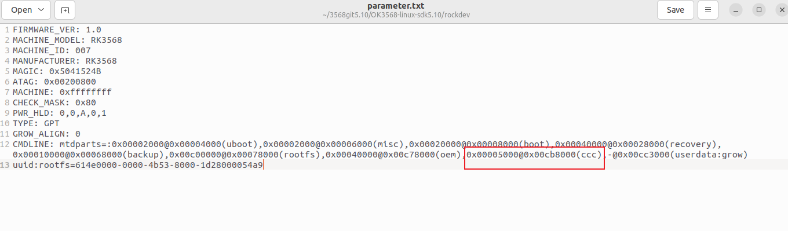
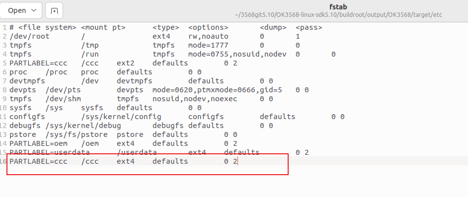

# OK3568 5.10.160 Buildroot New Partition Addition

Document classification: □ Top secret □ Secret □ Internal information ■ Open

## Copyright

The copyright of this manual belongs to Baoding Folinx Embedded Technology Co., Ltd. Without the written permission of our company, no organizations or individuals have the right to copy, distribute, or reproduce any part of this manual in any form, and violators will be held legally responsible.

Forlinx adheres to copyrights of all graphics and texts used in all publications in original or license-free forms.

The drivers and utilities used for the components are subject to the copyrights of the respective manufacturers. The license conditions of the respective manufacturer are to be adhered to. Related license expenses for the operating system and applications should be calculated/declared separately by the related party or its representatives.

## Revision History

| **Date**  | **Manual Version** | **Revision History** |
| --------- | ------------------ | -------------------- |
| 4/30/2025 | V1.0               | Initial Version      |

## New Partition Addition

This article mainly focuses on adding a new ccc partition through the source code. If you need to store applications or files in a specific partition, you can refer to the following methods to add a partition.

**Modification Methods**

1\. Modify the file /tools/linux/Linux\_Pack\_Firmware/rockdev/rk356x - package - file in the source code directory to add a new ccc partition.

2\. Use the following command to create a new ccc.img in the /rockdev path of the source code:

dd if=/dev/zero of=ccc.img bs=1M count=10（the ccc.img size is10M）

3\. Format ccc.img as ext2/ext4.

4\. Add the corresponding partition ccc with a size of 0x5000 in OK3568 - linux - source/rockdev/parameter.txt.

The method to calculate the partition size is as follows:

0x00005000 *512byte = 20480* 512byte = 10,485,760 byte

10,485,760÷1024 = 10240KB

10240÷1024=10MB

So the size set for ccc is 10M.

The rootfs partition is the root partition. The value after @ is the starting address, and the value before @ is the partition size. Note that the starting address of the userdate partition is the starting address of the rootfs plus the partition size.

Each partition is 512 bytes.

5\. Create a new ccc.img file using the mkdir command in the path /buildroot/board/forlinx/ok3568/fs - overlay of the source code.

6\. Modify OK3568 - linux - sdk5.10/buildroot/output/OK3568/target/etc/fstab and add the content shown in the following figure.

7\. Verification Method

Run ./build.sh buildroot to compile the file system separately, then run ./build.sh updateimg to package and generate the image. The update.img will be generated in the OK3568\_Linux\_fs/rockdev folder. You can see the ccc partition by running the command df -h on the development board.

