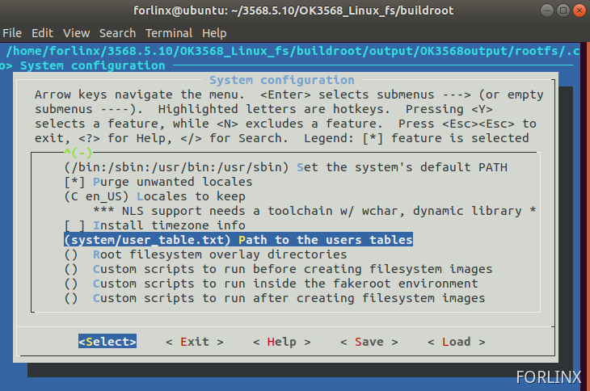

# OK3588 5.10.66 Buildroot Adding New User

Document classification: □ Top secret □ Secret □ Internal information ■ Open  

## Copyright

The copyright of this manual belongs to Baoding Folinx Embedded Technology Co., Ltd. Without the written permission of our company, no organizations or individuals have the right to copy, distribute, or reproduce any part of this manual in any form, and violators will be held legally responsible.   
Forlinx adheres to copyrights of all graphics and texts used in all publications in original or license-free forms.  
The drivers and utilities used for the components are subject to the copyrights of the respective manufacturers. The license conditions of the respective manufacturer are to be adhered to. Related license expenses for the operating system and applications should be calculated/declared separately by the related party or its representatives.

## Revision History

| Date| Version| Revision History|
|----------|----------|----------|
| 09/22/2025| V1.0| Initial Version|

## Adding New User

1\. Create a new user\_table.txt file in the buildroot/system directory of the source code.

```plain
forlinx@ubuntu:~/3568.5.10/OK3568_Linux_fs$ vi buildroot/system/user_table.txt 
```

Add the following content to the file:

```plain
username (aka login name) is: foo
uid is computed by Buildroot
main group is: bar
main group gid is computed by Buildroot
clear-text password is: blabla, will be crypt(3)-encoded, and login is disabled.
home is: /home/foo
shell is: /bin/sh
foo is also a member of groups: alpha and bravo
comment is: Foo user
```

2\. Modify the Buildroot configuration:

```plain
forlinx@ubuntu:~/3568.5.10/OK3568_Linux_fs$ cd buildroot/
forlinx@ubuntu:~/3568.5.10/OK3568_Linux_fs/buildroot$ make menuconfig
```

Locate "Path to the users tables" under "System configuration," and enter system/user\_table.txt.



Save the changes and exit.

3\. Execute ./build.sh to perform a full compilation, then flash the generated update.img to the development board.

```plain
forlinx@ubuntu:~/3568.5.10/OK3568_Linux_fs/buildroot$ cd -
/home/forlinx/3568.5.10/OK3568_Linux_fs
forlinx@ubuntu:~/3568.5.10/OK3568_Linux_fs$ ./build.sh
forlinx@ubuntu:~/3568.5.10/OK3568_Linux_fs$ ls rockdev/update.img 
rockdev/update.img
```