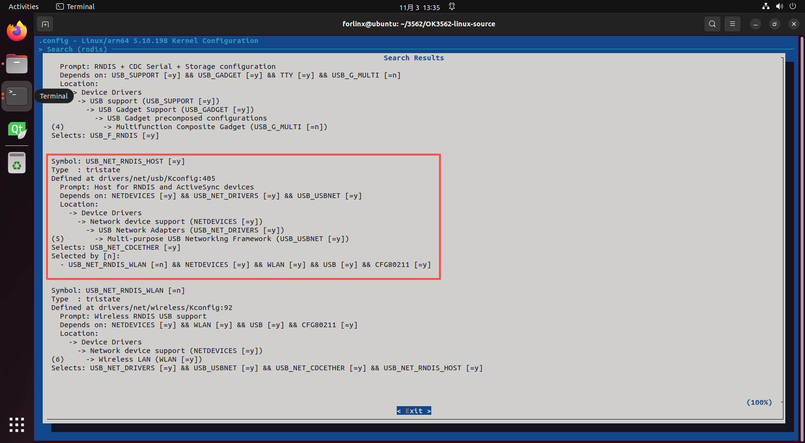
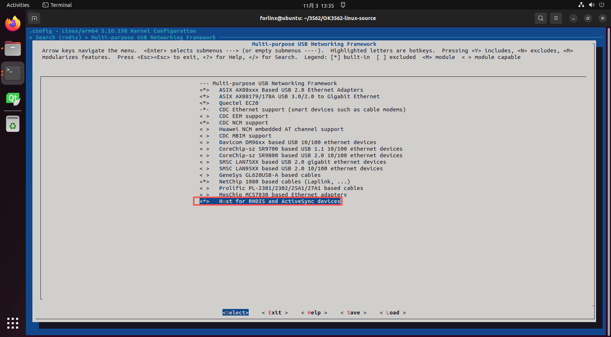
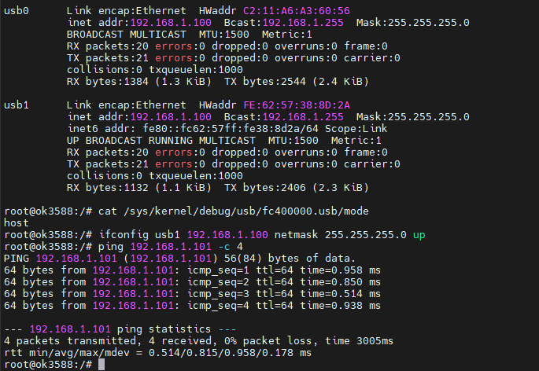
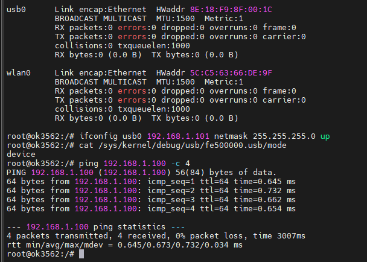
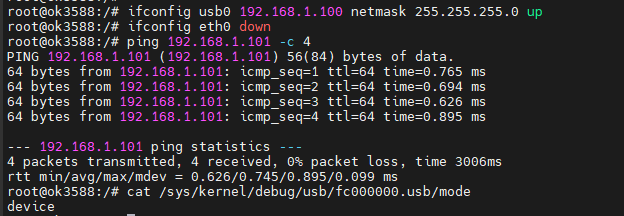
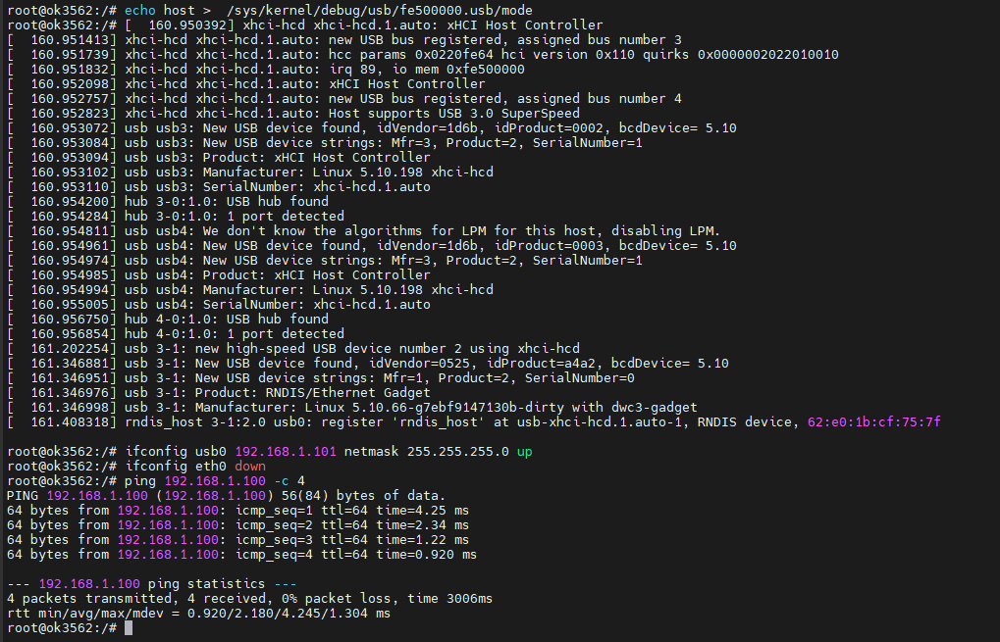

# OK3588 5.10.66 Buildroot Communication via USB Virtual Network Adapter

Document classification: □ Top secret □ Secret □ Internal information ■ Open

## Copyright

The copyright of this manual belongs to Baoding Folinx Embedded Technology Co., Ltd. Without the written permission of our company, no organizations or individuals have the right to copy, distribute, or reproduce any part of this manual in any form, and violators will be held legally responsible.   
Forlinx adheres to copyrights of all graphics and texts used in all publications in original or license-free forms.  
The drivers and utilities used for the components are subject to the copyrights of the respective manufacturers. The license conditions of the respective manufacturer are to be adhered to. Related license expenses for the operating system and applications should be calculated/declared separately by the related party or its representatives.

## Revision History

| Date| Version| Revision History|
|----------|----------|----------|
| 11/03/2025| V1.0| Initial Version|

## Communication via USB Virtual Network Adapter

Functional adaptation is based on OK3562 5.10.198 Build root R2 image and OK3588 5.10.66 Build root R5 image.

**1\. Source Code Modification**





OK3588: No device‑tree changes are needed. Simply enable the same options in menuconfig.

**2\. Commands**

```bash
# 3562 master-slave mode switching command of USB interface
cat /sys/kernel/debug/usb/fe500000.usb/mode
echo host > /sys/kernel/debug/usb/fe500000.usb/mode
echo device > /sys/kernel/debug/usb/fe500000.usb/mode

#3588 master-slave mode switching command of typec0 interface
cat /sys/kernel/debug/usb/fc000000.usb/mode
#3588 master-slave mode switching command of typec1 interface
cat /sys/kernel/debug/usb/fc400000.usb/mode
```

Use the above commands to view the current USB mode (host/device).

In device mode, a virtual NIC usb0 is generated for recognition by host devices.

In host mode, the USB interface detects the virtual NIC of another board and creates a usb0 node for communication.

**Note: Communication requires one device in host mode and the other in device mode.**

Switch with the above two commands

OK3588 has two Type‑C ports: typec0 and typec1. typec0 operates in Device mode only, while typec1 operates in Host mode only. When switching modes, be mindful of hardware connections.

typec0 address: sys/kernel/debug/usb/fc000000.usb/mode

typec1 address: sys/kernel/debug/usb/fc400000.usb/mode

**3\. Testing Steps**

**3.1 OK3588 as Host, RK3562 as Device**

Usb0 is the node generated by typec0 as the device, and usb1 is the node detected by typec1 connected to 3562. Therefore, in this test, usb1 is selected for the ping connectivity test.

On 3588:  



On 3562:



**3.2 OK3588 as Device, RK3562 as Host**

On 3588:



On 3562:

